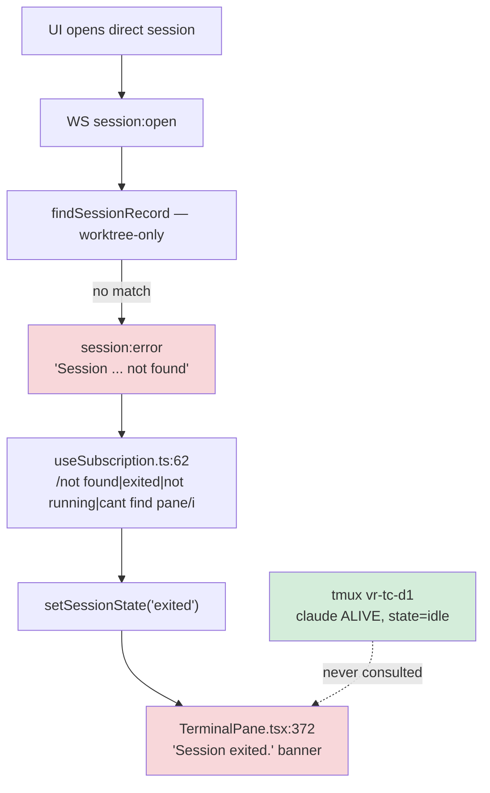
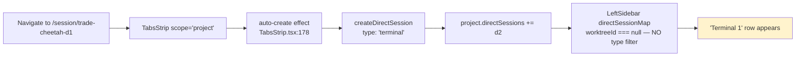

# Direct sessions are broken over WebSocket

**Status: DONE** — all fixes implemented and verified in the Docker sandbox. See "Outcome" at the bottom.

Investigation of the `trade-cheetah` report: *"2 items in the sidebar (one is a terminal), and Direct 1 says session exited and can't be resumed."*

**Verdict:** two independent bugs. Neither is a real crash — `trade-cheetah-d1` was **alive and healthy** throughout.

---

## Ground truth (measured, not inferred)

| Evidence | Result |
|---|---|
| `tmux ls` | `vr-tc-d1` **and** `vr-tc-d2` both alive |
| `pstree` of d1 pane | `sh(3316808)───claude(3316825)` — Claude running |
| `capture-pane -t vr-tc-d1` | Live conversation, input box populated, awaiting input |
| `manifest.json` → d1 | `lifecycle.state = "idle"` — **`exited` was never persisted** |
| WS `session:open trade-cheetah-d1` | ❌ `Session 'trade-cheetah-d1' not found` |
| WS `session:open trade-cheetah-d2` | ❌ `Session 'trade-cheetah-d2' not found` |
| WS `session:open vs-20-m` (worktree, control) | ✅ `session:opened` |

The daemon never thought the session died. The banner is a **client-side false positive**.

---

## Root cause: two lookup functions, only one knows about direct sessions

The direct-sessions feature (`5e719f1`) taught the **REST** layer about `project.directSessions` but never the **WS lookup**. (It did touch `ws/protocol.ts` — the gap is specifically the lookup helper.)

| | `findSessionContext` | `findSessionRecord` |
|---|---|---|
| File | `daemon/src/routes/sessions.ts:59` | `daemon/src/ws/handlers/sessionLookup.ts:5` |
| Used by | REST routes (`vst send`, prompt box) | **WS**: `session:open`, `session:input`, `session:resize` |
| Scans `worktrees` | ✅ | ✅ |
| Scans `directSessions` | ✅ (`kind: "direct"`) | ❌ **never** |

The WS version's return type is the tell — `worktree: WorktreeRecord` is **non-optional**, so a direct session is *structurally unrepresentable*:

```ts
// ws/handlers/sessionLookup.ts — worktree-only, by type
): { project: ProjectRecord; worktree: WorktreeRecord; session: SessionRecord } | null {
  for (const project of getAllProjects())
    for (const worktree of project.worktrees) { /* directSessions never scanned */ }
  return null;
}
```

This is why the agent still *works* (REST input reaches it) but the terminal never *attaches*.

### How "not found" becomes "Session exited."



- The UI infers lifecycle by **regex-matching an error string**, and latches it locally.
- Nothing re-derives state from the daemon — only `session:resumed`/`session:state` clears it.

### Why Resume can't clear it either — a *separate* bug

- `routes/sessions.ts:683` — `restoreArgv = isWorktreeSession ? plugin.getRestoreCommand(...) : null` → `// Direct sessions don't support restore yet`
- So Resume skips the resume branch and falls through to **fresh spawn** → `spawnDirectSession` → `newSession({ name: "vr-tc-d1" })`
- But `vr-tc-d1` **still exists** → tmux: `duplicate session: vr-tc-d1` (verified) → caught at `:764` → **500 Failed to resume session**
- Net: banner is unclearable, and even on success it would start a *new* conversation, losing history.

---

## Bug 2: the phantom "Terminal" row

The New Project dialog is **innocent** — all three paths hardcode `type: "agent"` and never create a terminal.



The `type === "agent"` filter exists **only on the worktree path**, so the direct path has nothing to bypass:

| Path | Rows come from | Filters terminals? |
|---|---|---|
| Worktree | `worktreeIsInactive` (`LeftSidebar.tsx:52`), `worktreeStatus.ts:31` | ✅ |
| **Direct** | `directSessionMap` (`LeftSidebar.tsx:109`) | ❌ **none** |

- Also: the direct row's status dot renders a *terminal's* lifecycle state (`LeftSidebar.tsx:759`) — exactly what `worktreeStatus.ts:23-25` calls not user-meaningful.
- `manifest.json` confirms: `d1 type:"agent"`, `d2 type:"terminal" name:"Terminal 1"`.

---

## Fixes

| # | Fix | File | Priority |
|---|---|---|---|
| 1 | Scan `project.directSessions` in the WS lookup. **~3 lines** — see below. | `ws/handlers/sessionLookup.ts` | **P0 — unblocks all direct sessions** |
| 2 | Filter `type === "agent"` in `directSessionMap` (and `pinnedDirectSessions`) | `LeftSidebar.tsx:106-113`, `:161-167` | P2 — cosmetic |
| 3 | Replace error-string regex inference with a structured signal (below) | `useSubscription.ts:58-68` | P1 — hardening |
| 4 | Direct-session restore — **3 changes, not 1** (below) | `routes/sessions.ts:683` + plugin API | P2 — real feature |
| 5 | Guard `newSession` with `hasSession()` — in **all three** spawners, not just the direct one | `spawn.ts:472`, `:296`, `:157` | P1 |

**Fix #1 alone** makes the agent usable again. Everything else is hardening or scope.

### #1 — smaller and safer than it looks

All three callers destructure **only `{ session }`** — `sessionOpen.ts:46`, `sessionInput.ts:57`, `sessionResize.ts:33`. **Nothing in `ws/handlers/` ever reads `worktree` or `project`.** So dropping `worktree` from the return type (or making it nullable) breaks zero callers. Just add the `directSessions` scan.

⚠️ **Do not** `import { findSessionContext } from "../../routes/sessions.js"` — that drags the whole Fastify route graph (spawn, plugins, zod) into the WS layer. No cycle today, but wrong layering. If you want one shared helper, **extract it to `state/` or a service module** and have both layers import that.

### #3 — the regex exists for a reason

The daemon does broadcast an authoritative `session:exited` (`lifecycle.ts:240`; it polls direct sessions too, `:261-265`), so inference *can* go. But the regex also covers a genuinely-dead pane between poller ticks, and the `not_started` suppression at `:66-67` shows this code has already been burned by races. Deleting it needs a replacement — e.g. daemon sends a structured `reason` on `session:error` — not just removal.

### #4 — the "synthetic worktree" shortcut does not work

`spawn.ts:377` fabricates a worktree (`branch: "direct"`) for *spawn*, but restore needs more:
- `claude.ts:157` & `:178` both call `getWorktreePath(project.id, worktree.id)` → a synthetic id resolves to a **nonexistent directory**, so chat-id lookup silently finds nothing. Restore needs `cwd = project.absolutePath` → **plugin API change**.
- `spawnDirectSession` **never calls `captureChatId`** at all (compare `spawnSession` step 7.5, `spawn.ts:280-283`) → direct sessions have **no `agentChatId` to restore from**, even with the path fixed.
- Plus #5's duplicate-name guard.

### Note for whoever fixes this

- One root cause (#1) explains the exited banner, the dead terminal, **and** dead keyboard input for *every* direct session — not just `trade-cheetah`.
- The running daemon is built from `/home/gb/code/fastestdevalive/vibe-station/cli/dist` — **not** this worktree. Verified: the deployed `dist` has the identical worktree-only lookup. Rebuild + restart or the fix won't be observed.
- `~/.vibe-station/logs/daemon.log` is useless here: 481 MB, last written 12:14, project created 22:25. Rotation appears broken and it's spamming `[WS] Write buffer exceeded 1MB`.

### Same blind spot elsewhere — other worktree-only scans

| Site | Scans direct? | Impact |
|---|---|---|
| `routes/modes.ts:136-144` `isModeInUse` | ❌ | **Live.** Wired to the DELETE guard (`:256`) — a mode used *only* by a direct session can be deleted while in use. |
| `main.ts:94-107` `sweepDirectPtySessionsOnBoot` | ❌ | Latent — bites `useTmux: false` direct sessions on boot. |
| `services/doctor.ts:56` `checkOrphanSessions` | ❌ | **Dead code** — would report live `vr-tc-*` as orphans and advise `tmux kill-session`, but nothing imports `runDoctor`; `vst doctor` is a separate PATH-only check (`cli/src/commands/doctor.ts`). Harmless today, a footgun if ever wired up. |

Worth a grep for `p.worktrees.flatMap` / `for (const worktree of` before calling this class of bug closed.

### Latent, unrelated (found in passing)

- `TabsStrip.tsx:194-199` reads the store synchronously *before* the await. `autoCreateInFlight` + `autoCreateAttemptedFor` (`:182-186`) guard one instance; **neither covers two browser tabs racing** — the server has no dedupe.

---

## Outcome

All five fixes plus the three blind spots landed. Verified in the Docker sandbox (`docker-compose.dev.yml`) against a real direct agent session.

| Fix | What shipped |
|---|---|
| 1 | `findSessionRecord` scans `directSessions`; `worktree` **dropped** from the return type (no caller used it) with a comment forbidding its return |
| 2 | `directSessionMap` + `pinnedDirectSessions` filter `type === "agent"` |
| 3 | New `reason: "gone" \| "transient"` on `session:error`; client branches on it instead of regex-matching the message |
| 4 | Plugin API takes `cwd` instead of `worktree` (all 4 plugins); `spawnDirectSession` now calls `captureChatId`; resume no longer hardcodes `null` for direct |
| 5 | `killStaleTmuxSession` guards **all three** spawners |
| — | `isModeInUse`, `sweepDirectPtySessionsOnBoot`, `doctor.ts` orphan check now scan `directSessions` |

**Docker A/B — same container, same session, only the lookup differing:**

| Lookup | `session:open direct-test-d1` |
|---|---|
| Old (worktree-only) | ❌ `Session 'direct-test-d1' not found` |
| New (direct-aware) | ✅ `session:opened` |

Also verified: `session:input` reached the pane (marker echoed); resume on a live pane returned **200** (was 500) with `[spawn] … killing stale pane` logged; UI showed **no** "Session exited." banner and **no** "Terminal 1" sidebar row while the daemon really did hold a `type: "terminal"` direct session.

Tests: +9 regression tests (`sessionLookup.test.ts`, `useSubscription.test.ts`, `LeftSidebar.test.tsx`); each confirmed to fail against the pre-fix code. Suite went 2-failing → **367 passing**.

### Deliberately not done

- **`getLaunchCommand` still derives paths from the synthetic worktree** (`cursor.ts:51`, `opencode.ts:59`, `gemini.ts:51`) — same nonexistent-path class as fix #4, but on the *launch* path rather than restore. Means cursor/opencode direct sessions likely get a bogus `--workspace` / config path. Not triggered by this report (claude doesn't use it); wants its own change. `syntheticDirectWorktree`'s doc comment warns about exactly this.
- **Terminal resume swallows errors** — `routes/sessions.ts` terminal branch has a bare `catch {}`, so resuming a live terminal silently no-ops instead of 500ing. Pre-existing; left alone.
