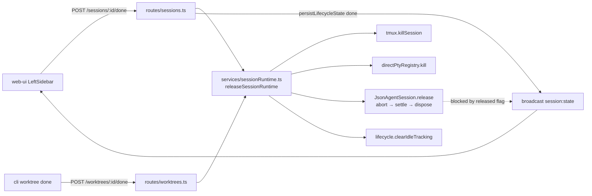

<!--
RULES — read before writing or implementing:
1. FORMAT: Bullets, tables, code, diagrams ONLY — no prose paragraphs
2. REQUIREMENTS: One crisp line each — no verbose descriptions
3. CHECKLIST: Mark items [x] as you complete them — this is your persistent todo list
4. READING TIME: Optimize for fast human scanning — if it's hard to skim, rewrite it
-->

# Mini-Design: Mark-as-done releases all session resources

> `POST /sessions/:id/done` and `POST /worktrees/:id/done` must kill the tmux pane / direct-PTY / `JsonAgentSession` instead of only writing a label — while keeping the session fully resumable.

**Issue:** done-releases-resources
**Branch:** `marking-as-done-resources`
**Status:** Done
**PRD:** — (small feature, no PRD)
**Parent design:** —
**Reviewed:** yes — subagent review folded in (P0 items 1-5 below are review findings, not speculation)

**Reference files:**
- Done routes: `daemon/src/routes/sessions.ts:778-795`, `daemon/src/routes/worktrees.ts:543-556`
- Existing teardown (reference impl): `daemon/src/routes/sessions.ts:669-687`, `daemon/src/routes/worktrees.ts:570-593`
- tmux: `daemon/src/services/tmux.ts:27` (`killSession`)
- JSON agent: `daemon/src/services/jsonAgent.ts:375` (`settled`), `:386` (`abortAndDrain`), `:410` (`dispose`), `:708` (drain's `persistLifecycle("idle")`), `:907` (`persist`); registry `daemon/src/state/jsonAgentRegistry.ts:15`
- Lifecycle: `daemon/src/services/lifecycle.ts:60` (`clearIdleTracking`), `:188` (poller skips `done`), `:261` (`markSessionExited` guard)
- Resume: `daemon/src/routes/sessions.ts:798-984`
- UI banner: `web-ui/src/components/layout/TerminalPane.tsx:388,395`, `web-ui/src/components/layout/AgentPaneSlot.tsx:38`
- Chat attach: `daemon/src/ws/handlers/chatOpen.ts:50-76`; disk meta reader `daemon/src/services/jsonAgentChat.ts:252-281` (`readSessionMeta`)

---

## Problem

- `POST /sessions/:id/done` (`daemon/src/routes/sessions.ts:778-795`) is documented "metadata only; no process kill" — it writes `lifecycle.state = "done"` and nothing else.
- Every resource survives: tmux pane (agent CLI process tree), direct-PTY child, `JsonAgentSession` (SQLite WAL fds ×3, `JsonAgentStream` listeners, in-flight turn process group).
- No reaper exists (`daemon/src` has no `reaper|maxIdle|staleAfter|gc(`), so a done session leaks until an explicit `DELETE`.
- Users mark many sessions done per day → dozens of idle `claude`/`cursor` process trees held in RAM.

## Out of Scope

- Auto-reaping idle-but-not-done sessions (no timeout GC).
- Deleting the worktree checkout, session data dir, or CLI-side transcript — those must survive for resume.
- Changing what `DELETE /sessions/:id` or `DELETE /worktrees/:id` do (beyond delegating to the shared helper).
- `lifecycle.reason` plumbing — `persistLifecycleState` (`daemon/src/services/lifecycle.ts:68-72`) takes 4 params and persists only `{state, lastTransitionAt}`; adding a reason is a signature change with no user-visible payoff. Dropped.
- Fixing `POST /sessions/:id/resume` for `channel:"json"` sessions (it wrongly takes the tmux branch — pre-existing, unreachable from the UI; see Risk 7).

## Concept

- Extract the teardown already present in `DELETE /sessions/:id` into one reusable service: `releaseSessionRuntime()`.
- `done` calls it → tmux killed, PTY killed, `JsonAgentSession` released (abort → settle → dispose) and unregistered, idle-tracking dropped.
- Session record, data dir, attachments, worktree checkout, and CLI history are untouched → `POST /sessions/:id/resume` still works.
- UI: the existing "Session exited / Resume" banner also renders for `done`, with copy "Session marked done."
- Worktree-level done additionally tears down that worktree's **terminal** sessions and marks them `exited`.

## Requirements

| # | Requirement |
|---|-------------|
| 1 | `POST /sessions/:id/done` kills the session's tmux pane or direct-PTY child |
| 2 | `POST /sessions/:id/done` aborts in-flight JSON turns, disposes the SQLite store, and removes the registry entry |
| 3 | `POST /worktrees/:id/done` applies R1+R2 to every agent session, and additionally kills + marks `exited` every terminal session in that worktree |
| 4 | Staged attachments are **kept** on done (`clearSessionAttachments` is NOT called) |
| 5 | A TTY (`tmux`/`pty`) agent session stays resumable via `POST /sessions/:id/resume` with full history; a JSON session resumes by sending a chat message |
| 6 | Terminal pane shows a Resume banner for `done`, not just `exited` |
| 7 | Opening a done JSON session's chat renders transcript **and meta** from disk without re-creating a `JsonAgentSession` |
| 8 | Done is idempotent — a repeat call is a no-op that returns 200 and does not inflate `updated` |
| 9 | Nothing may demote `done` afterwards: not the lifecycle poller, not the JSON drain's `idle` persist, not the direct-PTY exit callback |

---

## Research

### `POST /sessions/:id/done`

- **File:** `daemon/src/routes/sessions.ts:778-795`
- **Trigger:** UI `web-ui/src/components/layout/LeftSidebar.tsx:1175` → `api.markSessionDone` (`web-ui/src/api/client.ts:390-396`)
- **Current:** sets `ctx.session.lifecycle`, calls `persistLifecycleState(..., "done")` (which broadcasts `session:state`), returns `{ok:true}`
- **Risk:** LOW

### `POST /worktrees/:id/done`

- **File:** `daemon/src/routes/worktrees.ts:543-556`
- **Trigger:** UI `LeftSidebar.tsx:1077`; CLI `cli/src/commands/worktree/done.ts:13`
- **Current:** loops `type === "agent"` only; counts unconditionally (`:548-554`); double-broadcasts (`persistLifecycleState` already broadcasts)
- **Risk:** LOW

### Existing teardown to reuse

- **File:** `daemon/src/routes/sessions.ts:669-687` (`app.delete` starts at `:653`)
- Order that matters: `abortAndDrain()` → `jsonAgentRegistry.delete(id)` → `dispose()` → kill PTY/tmux
- `dispose()` doc (`daemon/src/services/jsonAgent.ts:398-409`): dropping the registry ref without `dispose()` leaks 3 fds/session
- **Risk:** MEDIUM — ordering must be preserved when extracted

### P0-1 — JSON drain re-persists `idle` after done

- **File:** `daemon/src/services/jsonAgent.ts:386` (`abortAndDrain` does not await), `:695-709` (`drain()`'s `finally` → `await this.persistLifecycle("idle")`)
- **Trigger:** mark a JSON session done while a turn is running
- **Effect:** the unwinding drain broadcasts `session:state {idle}` AFTER the route returned → overwrites `done` in the manifest and in `useServerSync` (`web-ui/src/hooks/useServerSync.ts:111-115`)
- **Risk:** HIGH — persist-before-kill does NOT help; this lands later, asynchronously

### P0-2 — direct-PTY kill demotes `done` → `exited`

- **File:** `daemon/src/services/directPty.ts:105-108` (`onExit` → `markSessionExited`), guard at `daemon/src/services/lifecycle.ts:261` only excludes `"exited"`
- **Effect:** killing a `channel:"pty"` agent's child broadcasts `session:exited` and persists `exited`
- **Why delete is unaffected:** the record is already removed there; under done it is not
- **Risk:** HIGH

### P0-3 — `dispose()` can close SQLite under a live turn

- **File:** `daemon/src/services/jsonAgent.ts:907-910` (`persist()` → `store.append`, unguarded) vs `:410-416` (`dispose()` → `store.close()`)
- **Effect:** a straggler event after dispose throws
- **Risk:** MEDIUM

### P0-4 — naive `chat:open` done-guard leaks and blanks meta

- **File:** `daemon/src/ws/handlers/chatOpen.ts:50-76`
- `conn.unregisterChatStream(sessionId)` only runs in the LIVE branch (`:57`) → an early `sendSnapshot` return leaves the prior `ChatStreamEntry` registered (`daemon/src/ws/connection.ts:162-172`), pinning the just-disposed agent
- The early return never sends `session:meta`; `useChat` has no other meta source (`web-ui/src/hooks/useChat.ts:161-163` — REST `getMeta` at `web-ui/src/api/client.ts:842-846` is not wired in) → ModelSwitch / usage / turn-state go blank
- **Risk:** HIGH — the guard would cause the leak it is meant to prevent
- Non-reviving disk reader already exists: `readSessionMeta` (`daemon/src/services/jsonAgentChat.ts:252-281`)

### P1 — killing tmux sends NO exit signal to the browser

- **File:** `daemon/src/ws/handlers/sessionOpen.ts:113-118` (`stream.once("close")` sends nothing), `:102-115` (error path sends `reason:"transient"`), ignored by `web-ui/src/hooks/useSubscription.ts:66-72`
- **Effect:** the banner appears ONLY because of the `session:state {done}` broadcast + the `showBanner` change
- **Risk:** HIGH if Phase 3 does not ship with Phase 2 — done would leave a frozen, unrecoverable terminal

### Revive paths that must be guarded

| Path | File | Revives? |
|------|------|----------|
| `chat:open` | `daemon/src/ws/handlers/chatOpen.ts:50` | YES → guard (2.5) |
| `PATCH /sessions/:id/chat/model` | `daemon/src/routes/sessions.ts:1218-1219` | YES → guard (2.7) |
| `POST /sessions/:id/chat` (enqueue) | `daemon/src/services/jsonAgentChat.ts:170` | YES — intended: this IS the JSON resume, and it persists `working` |
| `GET /sessions/:id/transcript` | `daemon/src/routes/sessions.ts:1551` | NO — disk fallback |
| `GET /sessions/:id/meta` | `daemon/src/routes/sessions.ts:1584` | NO — disk fallback |

### Lifecycle poller / boot recovery (no change needed)

- `daemon/src/services/lifecycle.ts:188` — `if (!alive && state !== "exited" && state !== "done")` already excludes `done`
- `daemon/src/services/lifecycle.ts:135` — poller returns early for JSON sessions (so `clearIdleTracking` on a JSON session is a harmless no-op; do not assert it in tests)
- `daemon/src/services/recover.ts:194,248` — only `not_started` sessions are reconciled; `recoverJsonSession` (`:104-113`) leaves `done` alone

### Resume path (verified intact)

- `daemon/src/routes/sessions.ts:798-984`; `spawnSessionFromArgv` (`daemon/src/services/spawn.ts:272`) calls `killStaleTmuxSession` (`:260`) then `newSession` → a missing pane is fine
- Survives done: manifest record (`agentChatId`, `modeId`, `tmuxName`, `useTmux`, `channel`), worktree checkout, session data dir, `~/.claude/projects/<slug>/<uuid>.jsonl`
- `JsonAgentSession.firstTurnDone` rebuilds from disk (`daemon/src/services/jsonAgent.ts:294` → `hasPersistedTurn()`), so a re-created agent does not re-inject the system prompt

## Root Cause

- "Done" was implemented as a pure UI label; the teardown routine lives inline inside `DELETE /sessions/:id` and was never factored out.
  - Secondary: three independent code paths (`drain()`'s idle persist, `markSessionExited`, the poller) can write session state, and only the poller knows about `done`.
  - Secondary: `chat:open` and `PATCH /chat/model` lazily *create* a `JsonAgentSession`, so any release needs "don't revive on read" guards.

---

## System Context



## Entities & Modules

| Module | Responsibility | Public interface | Owns |
|--------|---------------|------------------|------|
| `daemon/src/services/sessionRuntime.ts` (new) | Release every live runtime resource of one session; never touches persisted state | `releaseSessionRuntime(session: SessionRecord, opts?: { clearAttachments?: boolean }): Promise<void>` | nothing (operates on registries it does not own) |
| `JsonAgentSession.release()` (new method) | Abort → settle → dispose, with a `released` latch that blocks all later writes | `release(): Promise<void>` | its queue, PIDs, SQLite handle |

---

## Architecture

```
POST /sessions/:id/done
   → findSessionContext(id)
   → guard: type === "agent"                (400 otherwise — unchanged)
   → guard: already "done" → 200 no-op      (R8)
   → await releaseSessionRuntime(session)   ← NEW (awaits JSON settle first)
   → persistLifecycleState(..., "done")     → broadcast session:state
   → 200 {ok:true}

POST /worktrees/:id/done
   → agents:    await releaseSessionRuntime → persist "done"
   → terminals: persist "exited" FIRST, then await releaseSessionRuntime
                (the PTY onExit → markSessionExited race is then a no-op)
   → 200 {ok:true, updated, terminalsReleased}
```

- **Ordering rule:** release BEFORE persisting `done` (the `released` latch already blocks the drain's `idle`, and `markSessionExited` gains a `done` guard, so either order is safe — release-first also guarantees the broadcast the UI receives is the last word).

---

## Design Details

### System Boundaries

| Boundary | Fields + types | Errors | Source of truth |
|----------|----------------|--------|-----------------|
| web-ui/CLI ↔ daemon `POST /sessions/:id/done` | req: `—` · res: `{ ok: true }` | `404 Session '<id>' not found` · `400 Only agent sessions can be marked done.` | daemon manifest |
| web-ui/CLI ↔ daemon `POST /worktrees/:id/done` | req: `—` · res: `{ ok: true, updated: number, terminalsReleased: number }` | `404 Worktree '<id>' not found` | daemon manifest |
| daemon → web-ui WS `session:state` | `{ type:"session:state", sessionId: string, state: "done"\|"exited" }` (existing, `daemon/src/ws/protocol.ts:219`) | — | daemon |
| daemon → web-ui WS `session:meta` (done JSON session) | `{ type:"session:meta", sessionId: string, meta: SessionMeta }` built by `readSessionMeta` (`daemon/src/services/jsonAgentChat.ts:252`) | — | on-disk SQLite transcript |
| routes ↔ `services/sessionRuntime.ts` | `releaseSessionRuntime(session: SessionRecord, opts?: { clearAttachments?: boolean }): Promise<void>` — never throws; every step best-effort | none (swallowed) | registries in `daemon/src/state/` |
| daemon ↔ tmux | `killSession(name: string)` (`daemon/src/services/tmux.ts:27`) — best-effort | — | tmux server |

### Critical User Journeys (CUJs)

#### CUJ 1 — Mark a TTY agent session done, resume later

```
User right-clicks session in LeftSidebar → "Mark as done"
  → POST /sessions/:id/done
  → daemon kills tmux pane vr-<n>-m (claude process tree dies)
  → persist + broadcast session:state {state:"done"}
  → attached TerminalPane receives ONLY session:state (no exit frame — P1)
  → showBanner(done) → "Session marked done." + [Resume]
User later clicks Resume
  → POST /sessions/:id/resume → claude --resume <agentChatId> in a fresh pane
  → state → working, history restored
```

- **Error path:** tmux pane already gone → `killSession` swallows, state still becomes `done`
- **Edge case:** already `done` → 200, no kill attempted

#### CUJ 2 — Mark a Rich Chat (`channel:"json"`) session done mid-turn

```
Turn is streaming (child process group alive)
  → User marks done
  → agent.release(): released=true → abortAndDrain() (SIGSTOP-freeze → SIGKILL
    of the group) → await settled() (≤2s) → dispose() closes SQLite
  → the drain's finally-block persistLifecycle("idle") is swallowed by `released`
  → persist + broadcast session:state {state:"done"}
  → ChatPane keeps rendering transcript + meta from disk (no live stream)
User types a new message later
  → POST /sessions/:id/chat → resolveJsonAgent re-creates the agent
  → persistLifecycleState(..., "working") → session live again
```

- **Error path:** transcript DB missing → `withDiskStore` returns the empty fallback; chat renders empty
- **Edge case:** a second tab has the chat open → gets `session:state {done}`; its live stream ends, transcript stays

#### CUJ 3 — Mark a whole worktree done

```
User → worktree menu → "Mark as done"
  → POST /worktrees/:id/done
  → agents:    released + state "done"
  → terminals: state "exited" persisted first, then released
  → zero vr-* tmux sessions remain for that worktree
```

- **Error path:** placeholder `__direct__-*` tmuxName → the direct-PTY branch runs; no tmux call
- **Edge case:** no sessions → `{ok:true, updated:0, terminalsReleased:0}`

### Data Model

- No schema change. `SessionRecord.lifecycle.state` already supports `"done"` (`daemon/src/types.ts:8`).
- **Migration:** N.

### API Contracts

```
POST /sessions/:id/done
  Request:  —
  Response: { ok: true }
  Errors:   404 `Session '<id>' not found`
            400 `Only agent sessions can be marked done.`
  NEW side effects: kill tmux pane / direct-PTY; JsonAgentSession.release();
                    unregister; clearIdleTracking
  Preserved:        session record, data dir, attachments, checkout, agentChatId

POST /worktrees/:id/done
  Request:  —
  Response: { ok: true, updated: number, terminalsReleased: number }
  Errors:   404 `Worktree '<id>' not found`
  NEW side effects: agents → release + "done"; terminals → "exited" + release

PATCH /sessions/:id/chat/model                             (NEW guard)
  Errors:   409 `Session is done — send a message to resume it before switching model.`

POST /sessions/:id/resume        (UNCHANGED — restated for the reader)
  Response: Session · Errors: 404, 500 `Failed to resume session: <err>`
```

### Key Decisions

#### Decision 1: Extract teardown into `releaseSessionRuntime()`

- **Decision:** new `daemon/src/services/sessionRuntime.ts`; `DELETE /sessions/:id`, `DELETE /worktrees/:id`, and both done routes all call it
- **Rationale:** the kill order is subtle and already duplicated in two delete sites; a third copy would drift
- **Where:** new file; callers `daemon/src/routes/sessions.ts:669-687`, `daemon/src/routes/worktrees.ts:570-593`

```ts
// daemon/src/services/sessionRuntime.ts
export async function releaseSessionRuntime(
  session: SessionRecord,
  opts: { clearAttachments?: boolean } = {},
): Promise<void> {
  const agent = jsonAgentRegistry.get(session.id);
  jsonAgentRegistry.delete(session.id);
  if (agent) await agent.release();          // abort → settle(≤2s) → dispose
  if (opts.clearAttachments) clearSessionAttachments(session.id);
  if (!session.useTmux) {
    directPtyRegistry.get(session.id)?.kill?.();
  } else {
    try { await killSession(session.tmuxName); } catch { /* best-effort */ }
  }
  clearIdleTracking(session.id);
}
```

#### Decision 2: `JsonAgentSession.release()` with a `released` latch

- **Decision:** add `private released = false` + `async release()`; `persistLifecycle()` (`jsonAgent.ts:712`) and `persist()` (`:907`) both early-return when `released`
- **Rationale:** fixes P0-1 (drain's late `idle` clobbering `done`) and P0-3 (append after `store.close()`); a latch is race-free where ordering alone is not
- **Where:** `daemon/src/services/jsonAgent.ts` — new method next to `dispose()` (`:410`)

```ts
private released = false;

/** Abort, wait for the drain to unwind, then close SQLite. Idempotent. */
async release(): Promise<void> {
  if (this.released) return;
  this.released = true;               // blocks persistLifecycle() + persist()
  this.abortAndDrain();
  await Promise.race([
    this.settled().catch(() => {}),
    new Promise((r) => setTimeout(r, 2000)),
  ]);
  this.dispose();
}
```

#### Decision 3: `markSessionExited` must not demote `done`

- **Decision:** `daemon/src/services/lifecycle.ts:261` → `if (!session || session.lifecycle.state === "exited" || session.lifecycle.state === "done") return;`
- **Rationale:** fixes P0-2 — `DirectPtyStream.onExit` (`daemon/src/services/directPty.ts:105-108`) fires on our own kill
- **Where:** `daemon/src/services/lifecycle.ts:261`

#### Decision 4: `chat:open` done-branch — unregister + disk meta

- **Decision:** when `ctx.session.lifecycle.state === "done"`, skip `resolveJsonAgent`, call `conn.unregisterChatStream(sessionId)`, `sendSnapshot(...)`, and send `session:meta` from `readSessionMeta`
- **Rationale:** fixes P0-4 — a bare early return pins the disposed agent via the stale `ChatStreamEntry` and leaves `useChat`'s `meta` null
- **Where:** `daemon/src/ws/handlers/chatOpen.ts:50-56`

```ts
const isDone = ctx.session.lifecycle.state === "done";
if (isDone) {
  conn.unregisterChatStream(sessionId);         // drop any stale live entry
  sendSnapshot(conn, ctx, sessionId, sinceSeq); // disk-only transcript
  conn.send({ type: "session:meta", sessionId, meta: await readSessionMeta(ctx, 0) });
  return;
}
```

#### Decision 5: Keep staged attachments on done

- **Decision:** done calls `releaseSessionRuntime(session)` (`clearAttachments` defaults false); delete keeps `{ clearAttachments: true }`
- **Rationale:** attachments are staged for the next prompt; dropping them makes resume lossy. Delete is destructive by definition, done is not
- **Where:** `daemon/src/routes/sessions.ts` done vs. delete handlers

#### Decision 6: Worktree done also releases terminals

- **Decision:** `POST /worktrees/:id/done` releases terminal sessions and marks them `exited` (terminals have no `done` state); persist `exited` BEFORE the kill so the `onExit` callback is a no-op
- **Rationale:** a worktree "put to rest" with live shells still holds a tmux server and any long-running dev process. Terminals resume via `POST /sessions/:id/resume`'s terminal branch (`daemon/src/routes/sessions.ts:926-955`), which spawns a fresh shell
- **Where:** `daemon/src/routes/worktrees.ts:543-556`
- **Note:** single-session `POST /sessions/:id/done` still 400s for terminals — unchanged

#### Decision 7: Reuse the exited banner for done, checking `done` first

- **Decision:** `showBanner = state === "done" || state === "exited" || sessionState === "exited"`; the message tests `done` FIRST
- **Rationale:** identical recovery action; and the dying pty can push a local `sessionState` that must not win over the store's `done`
- **Where:** `web-ui/src/components/layout/TerminalPane.tsx:388,395`; `web-ui/src/components/layout/AgentPaneSlot.tsx:38`

#### Decision 8: `PATCH /chat/model` 409s on a done session

- **Decision:** guard the route before `resolveJsonAgent` (`daemon/src/routes/sessions.ts:1218`) — 409 when the session is `done`
- **Rationale:** it is the last remaining silent-revive path; a 409 is cheaper than teaching the route to write `modelOverride` without an agent
- **Where:** `daemon/src/routes/sessions.ts:1218`

---

## Files to Modify

| File | Change |
|------|--------|
| `daemon/src/services/sessionRuntime.ts` | NEW — `releaseSessionRuntime()` |
| `daemon/src/services/jsonAgent.ts` | NEW `release()` + `released` latch guarding `persistLifecycle()` and `persist()` |
| `daemon/src/services/lifecycle.ts` | `markSessionExited` skips `done` |
| `daemon/src/routes/sessions.ts` | done route releases; delete delegates; `/chat/model` 409 guard; comment fix |
| `daemon/src/routes/worktrees.ts` | worktree-done releases agents + terminals; delete loop delegates; idempotent count |
| `daemon/src/ws/handlers/chatOpen.ts` | done branch: unregister + disk snapshot + disk meta |
| `cli/src/commands/worktree/done.ts` | Report `terminalsReleased` |
| `web-ui/src/components/layout/TerminalPane.tsx` | Banner + copy for `done`; skip `openSession` when done |
| `web-ui/src/components/layout/AgentPaneSlot.tsx` | `terminalLive` excludes `done` |
| `web-ui/src/api/client.ts` | `markWorktreeDone` return type + doc comments |
| `web-ui/src/api/mock.ts` | `markSessionDone` emits `session:state` (parity with `markWorktreeDone`) |
| `docs/SESSION-EXECUTION.md` | Document that done releases runtime resources |

## Risks / Open Questions

| # | Question | Notes |
|---|----------|-------|
| 1 | **Does killing tmux mid-agent lose work?** | The CLI writes its transcript incrementally; an in-flight tool call is lost — same as today's `DELETE`. Done is an explicit user action |
| 2 | **Poller race?** | `lifecycle.ts:188` skips `done`; release-then-persist plus the `released` latch closes the window |
| 3 | **Does the browser learn the pane died?** | NO — `sessionOpen.ts:113-118` sends nothing on close and `reason:"transient"` is ignored (`useSubscription.ts:66-72`). The banner depends entirely on Phase 3 → Phase 2 must not ship alone |
| 4 | **direct-PTY exit overwrites `done`?** | Yes today (`lifecycle.ts:261`) — fixed by Decision 3 |
| 5 | **Second done call?** | Idempotent — `released` latch, registry miss, and `killSession` on a dead pane all no-op; the worktree loop skips already-done sessions |
| 6 | **`settled()` never resolves (stuck child)?** | `Promise.race` with a 2 s timeout; `dispose()` runs regardless, and `released` already blocks further writes |
| 7 | **Resume of a done `channel:"json"` session** | `POST /sessions/:id/resume` takes the tmux branch and spawns a pane despite `useTmux:false` — pre-existing bug, unreachable from the UI (`AgentPaneSlot` passes `sessionId={null}` for json). Out of scope; JSON resumes by sending a message |

---

## Implementation Phases

### Phase 1 — Shared teardown service + write-latch

- [x] **1.1** `daemon/src/services/jsonAgent.ts`: add `private released = false` and `async release()` (Decision 2); early-return in `persistLifecycle()` (`:712`) and `persist()` (`:907`) when `released`
- [x] **1.2** Create `daemon/src/services/sessionRuntime.ts` with `releaseSessionRuntime(session, opts)` (Decision 1)
- [x] **1.3** `daemon/src/services/lifecycle.ts:261`: `markSessionExited` early-returns for `done` too (Decision 3)
- [x] **1.4** Refactor `DELETE /sessions/:id` (`daemon/src/routes/sessions.ts:669-687`) to `await releaseSessionRuntime(session, { clearAttachments: true })`
- [x] **1.5** Refactor the `DELETE /worktrees/:id` loop (`daemon/src/routes/worktrees.ts:570-593`) to the same helper

**Verify phase 1:**
- [x] **1.T1** Unit — `daemon/src/__tests__/sessionRuntime.test.ts` (NEW): with a fake json agent registered, `releaseSessionRuntime` awaits `release()` and leaves `jsonAgentRegistry.get(id)` undefined
- [x] **1.T2** Unit — same file: `useTmux:false` session kills via `directPtyRegistry` and never calls `killSession`; `useTmux:true` calls `killSession(session.tmuxName)`
- [x] **1.T3** Unit — same file: `clearSessionAttachments` is NOT called unless `{clearAttachments:true}`
- [x] **1.T4** Unit — `daemon/src/__tests__/jsonAgent.test.ts` (extend): after `release()`, a late `persistLifecycle("idle")` from the unwinding drain performs no `persistLifecycleState` call, and `persist()` does not throw
- [x] **1.T5** Unit — `daemon/src/__tests__/lifecycle.test.ts` (extend): `markSessionExited` on a `done` session is a no-op (state stays `done`, no `session:exited` broadcast)
- [x] **1.T6** Regression — `pnpm --filter @vibestation/cli test` (427 tests green at baseline)

---

### Phase 2 — Done routes release resources

- [x] **2.1** `POST /sessions/:id/done` (`daemon/src/routes/sessions.ts:778-795`): early-return 200 when already `done`; otherwise `await releaseSessionRuntime(session)` then `persistLifecycleState(..., "done")`
- [x] **2.2** `POST /worktrees/:id/done` (`daemon/src/routes/worktrees.ts:543-556`): agents (skip already-`done`) → release + persist `done`; terminals → persist `exited` FIRST, then release
- [x] **2.3** Drop the redundant explicit `broadcastAll({type:"session:state"})` — `persistLifecycleState` already broadcasts
- [x] **2.4** Return `{ ok:true, updated, terminalsReleased }`; update `web-ui/src/api/client.ts:312-318` and `cli/src/commands/worktree/done.ts`
- [x] **2.5** `daemon/src/ws/handlers/chatOpen.ts:50-56`: done branch → `unregisterChatStream` + `sendSnapshot` + disk `session:meta` (Decision 4)
- [x] **2.6** `daemon/src/routes/sessions.ts:778`: update the "metadata only; no process kill" comment
- [x] **2.7** `PATCH /sessions/:id/chat/model` (`daemon/src/routes/sessions.ts:1218`): 409 when the session is `done` (Decision 8)

**Verify phase 2:**
- [x] **2.T1** Integration — `daemon/src/__tests__/sessions.test.ts` (extend; `killSession` already mocked at `:34-36`): `POST /sessions/:id/done` on a tmux agent → `killSession` called with `session.tmuxName`; the session record is still present in the manifest
- [x] **2.T2** Integration — same file: done → `POST /sessions/:id/resume` on a TTY session → 200, `lifecycleState === "working"`, spawn invoked
- [x] **2.T3** Integration — same file: done on a json session → registry entry gone; `GET /sessions/:id/transcript` and `GET /sessions/:id/meta` still return data and do NOT re-register an agent
- [x] **2.T4** Integration — `daemon/src/__tests__/worktrees.test.ts` (extend the existing done test at `:445`): all agents `done`, all terminals `exited`, `killSession` called once per session
- [x] **2.T5** Integration — same file: second `POST /worktrees/:id/done` returns `updated: 0` and does not throw
- [x] **2.T6** Integration — `daemon/src/__tests__/ws.test.ts` (extend): `chat:open` on a `done` json session creates no registry entry and still sends `chat:replay` + `session:meta`
- [x] **2.T7** Integration — `daemon/src/__tests__/jsonChatRoutes.test.ts` (extend): `PATCH /chat/model` on a done session → 409, no registry entry created

---

### Phase 3 — UI resume affordance (MUST ship with Phase 2 — see Risk 3)

- [x] **3.1** `web-ui/src/components/layout/TerminalPane.tsx:388,395`: `showBanner` includes `done`; message tests `done` FIRST → "Session marked done." (Decision 7)
- [x] **3.2** `web-ui/src/components/layout/AgentPaneSlot.tsx:38`: `terminalLive` excludes `done` as well as `exited`
- [x] **3.3** `web-ui/src/components/layout/TerminalPane.tsx`: skip `api.openSession` when the store state is `done` (avoids a failed `tmux has-session` round-trip per mount)
- [x] **3.4** `web-ui/src/api/mock.ts:536-543`: `markSessionDone` emits `session:state` (parity with `markWorktreeDone` at `:415`)
- [x] **3.5** Update `docs/SESSION-EXECUTION.md` — done releases runtime resources; resume path unchanged

**Verify phase 3:**
- [x] **3.T1** Unit — `web-ui/src/components/layout/TerminalPane.test.tsx` (EXISTS — extend): renders "Session marked done." + Resume for `lifecycleState: "done"`
- [x] **3.T2** Unit — same file: `done` does not trigger `api.openSession`; clicking Resume calls `api.resumeSession` and patches state to `working`
- [x] **3.T3** Unit — `web-ui/src/components/layout/AgentPaneSlot.test.tsx` (EXISTS — extend): attachment overlay hidden for `done`
- [x] **3.T4** Regression — `pnpm --filter @vibestation/web test` (251 tests green at baseline), `pnpm lint`, `pnpm --filter @vibestation/cli lint`, `pnpm typecheck`

---

### Phase 4 — Docker container verification

- [x] **4.0** A sibling sandbox (`vs-26-vst-dev-1`) already owned port 5174 and the globally-named volumes `vst-dev-data` / `vst-dev-projects`. Verification used a throwaway overlay file (not committed) with `ports: !override ["5175:5173"]` — Compose MERGES list fields, so without `!override` the base 5174 binding is kept and collides — plus `vst-vs29-*` volume names. Torn down with `down -v` afterwards; the sibling was never touched
- [x] **4.1** `docker compose -f docker-compose.dev.yml -f docker-compose.dev.vs29.yml -p vs29 up -d --build`
- [x] **4.2** In the UI at `http://localhost:5175`, create a worktree with one TTY agent + one terminal + one Rich Chat session
- [x] **4.3** Baseline inside the container: `docker exec vs29-vst-dev-1 tmux ls` and `pgrep -fa claude`
- [x] **4.4** Mark the TTY agent done → its `vr-*` tmux session and CLI process are gone; the pane shows "Session marked done." + Resume
- [x] **4.5** Click Resume → session returns with history; the tmux session reappears
- [x] **4.6** Mark the worktree done → zero `vr-*` tmux sessions remain for that worktree
- [x] **4.7** Rich Chat: mark done mid-turn → state stays `done` (does NOT flip to `idle`), transcript + model still render, `ls -l /proc/1/fd | grep -c transcript` drops

**Verify phase 4:**
- [x] **4.T1** `tmux ls` before/after single-session done: `vr-fsd-1-m` present → gone; state `done`
- [x] **4.T2** Resume after done → `working`, pane re-created (verified on the terminal session: `vr-fsd-1-t1` reappeared)
- [x] **4.T3** Rich Chat done → the 3 `messages.db` / `-wal` / `-shm` fds held by the daemon dropped to 0; state still `done` after ~8 s of polling; `GET /transcript`, `GET /meta` and WS `chat:open` all served from disk with 0 fds re-opened; `PATCH /chat/model` → 409; sending a message revived it (fds back to 3, state `idle`)
- [x] **4.T4** Worktree done → `{updated:2, terminalsReleased:1}`, tmux server itself shut down ("no server running"); second call → `{updated:0, terminalsReleased:0}`
- [x] **4.T5** UI at :5175 — banner flipped live to "Session marked done." with a working Resume; done worktree rolled up under FINISHED; done Rich Chat rendered its transcript from disk
- [x] **4.T6** Daemon log clean (no errors / unhandled rejections / EMFILE / SQLITE)
- [x] **4.T7** Regression — `pnpm test` (702 tests, run twice), `pnpm lint` (0 errors), `pnpm typecheck` clean

---

## Files Summary

| File | Phase | Change |
|------|-------|--------|
| `daemon/src/services/jsonAgent.ts` | 1.1 | `release()` + `released` latch |
| `daemon/src/services/sessionRuntime.ts` | 1.2 | NEW — shared `releaseSessionRuntime()` |
| `daemon/src/services/lifecycle.ts` | 1.3 | `markSessionExited` skips `done` |
| `daemon/src/routes/sessions.ts` | 1.4, 2.1, 2.6, 2.7 | Delete delegates; done releases; comment; `/chat/model` 409 |
| `daemon/src/routes/worktrees.ts` | 1.5, 2.2-2.4 | Delete delegates; worktree-done releases agents + terminals |
| `daemon/src/ws/handlers/chatOpen.ts` | 2.5 | Done branch: unregister + disk snapshot + disk meta |
| `cli/src/commands/worktree/done.ts` | 2.4 | Report `terminalsReleased` |
| `web-ui/src/api/client.ts` | 2.4 | Return type + doc comment |
| `web-ui/src/components/layout/TerminalPane.tsx` | 3.1, 3.3 | Banner for `done`; no open when done |
| `web-ui/src/components/layout/AgentPaneSlot.tsx` | 3.2 | `terminalLive` excludes `done` |
| `web-ui/src/api/mock.ts` | 3.4 | Emit `session:state` on done |
| `docs/SESSION-EXECUTION.md` | 3.5 | Document new done semantics |
| `daemon/src/__tests__/sessionRuntime.test.ts` | 1.T1-1.T3 | NEW unit tests |
| `daemon/src/__tests__/jsonAgent.test.ts` | 1.T4 | Extend — latch tests |
| `daemon/src/__tests__/lifecycle.test.ts` | 1.T5 | Extend — `done` guard |
| `daemon/src/__tests__/sessions.test.ts` | 2.T1-2.T3 | Extend — done/resume |
| `daemon/src/__tests__/worktrees.test.ts` | 2.T4-2.T5 | Extend — worktree done |
| `daemon/src/__tests__/ws.test.ts` | 2.T6 | Extend — chat:open guard |
| `daemon/src/__tests__/jsonChatRoutes.test.ts` | 2.T7 | Extend — model 409 |
| `web-ui/src/components/layout/TerminalPane.test.tsx` | 3.T1-3.T2 | Extend |
| `web-ui/src/components/layout/AgentPaneSlot.test.tsx` | 3.T3 | Extend |
