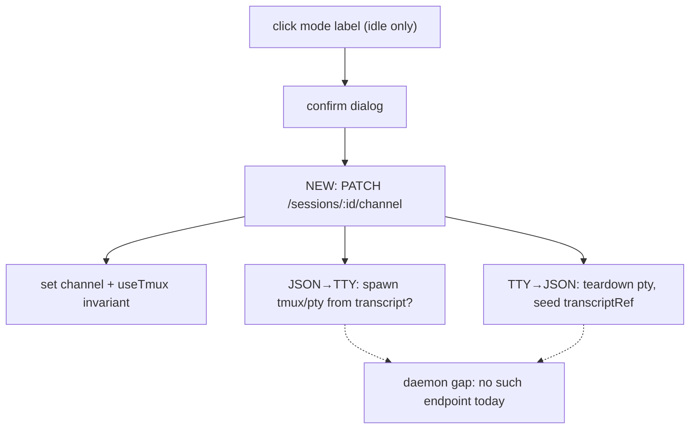
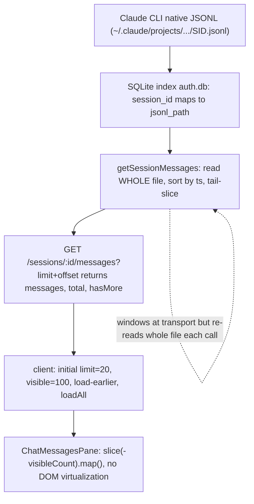
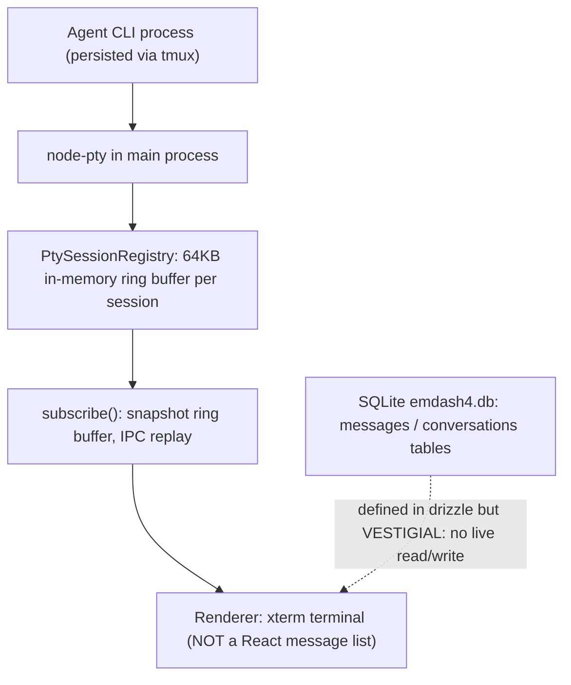
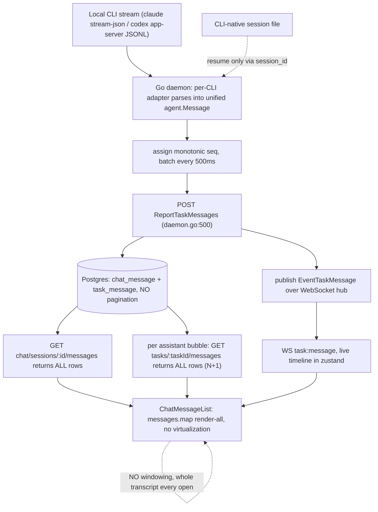
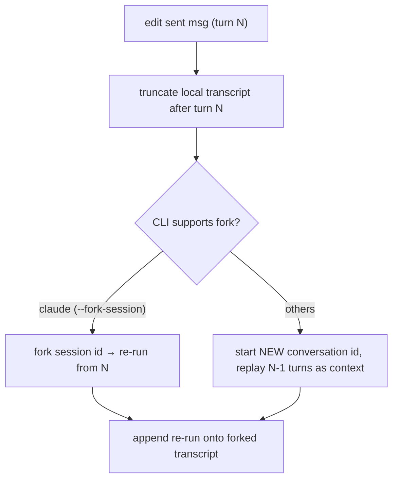

# JSON Agent Chat — UX follow-ups (triage)

> Verified against the codebase. `file:line` refs are load-bearing.
> **Status:** 7 of 10 shipped. 3 remain (#3, #9, #10) — details below.

## Summary

| # | Item | Section | Effort | Status |
|---|------|---------|--------|--------|
| 1 | "Send now" — true preemption (interrupt active turn) | Done | M | ✅ `54d3e3b` |
| 2 | Persist composer draft across nav/refresh | Done | S | ✅ |
| 3 | JSON ↔ Terminal mode toggle | **Remaining** | L | ⬜ |
| 4 | Mermaid blocks not rendered | Done | M | ✅ |
| 5 | Purple accent → white/gray | Done | S | ✅ |
| 6 | Agent message styling (Copilot-style, full-width) | Done | S | ✅ |
| 7 | Thinking/running indicator vertical alignment | Done | S | ✅ |
| 8 | "rate limit: unknown" after every message | Done | S | ✅ |
| 9 | Long chat loaded all at once (no windowing) | **Remaining** | M–L | ⬜ |
| 10 | Edit an already-sent message (fork/rewind) | **Remaining** | L | ⬜ |

---

## ✅ Done

Shipped in the RA1–RA6 batch + the send-now preemption commit. Implementation
spec: `chat-ux-fixes-spec.md`; preemption plan: `send-now-preemption-plan.md`.

### 1. "Send now" — true preemption — `54d3e3b`
- `promoteQueuedTurn` now jumps the target to the front **and** calls
  `stopActiveTurn()` unconditionally, so the promoted turn runs next; the
  interrupted turn is **dropped** (like Stop + re-send), not re-queued.
- Resolved open questions: aborted turn is dropped (not re-queued); JSON spawns
  a fresh subprocess per turn, so killing it can't corrupt any persistent CLI
  session (no `--resume` mid-write hazard here — that risk was terminal-only).
- Guarded `firstTurnDone`: preempting turn 1 keeps the next turn as the first
  turn (still carries the system prompt, not a bare `--resume`).
- Tooltip warns "interrupts the current turn". Tests: 4 new queue tests
  (preempt+drop, front-turn preempt, jump-ahead, turn-1 guard).

### 2. Persist composer draft across navigate/refresh
- `useComposerDraft` persists text under `vst-chat-draft-${sessionId}`; seeded on
  mount, cleared on send. Survives unmount/refresh.

### 4. Mermaid blocks rendered
- `StreamingMarkdown` segments prose vs `mermaid` fences and routes fences to a
  hardened `MermaidView` (try/catch → falls back to a code block on parse error
  / mid-stream partial).

### 5. Purple accent → neutral gray
- Chat surfaces point at a chat-local `--chat-accent` token (mid-gray:
  `#8a8a8a` dark / `#737373` light), containing the change to chat without
  disturbing global `--accent`.

### 6. Agent message styling (GitHub Copilot style)
- Assistant messages are full-width, no card bg/border, tight padding; only the
  **user's** messages keep a border + right-aligned narrow width.

### 7. Thinking/running indicator vertical alignment
- `.chat-statusbar__state` set to a centered inline-flex line so the spinner and
  label share a vertical center.

### 8. "rate limit: unknown" noise
- Daemon whitelists only real throttle states and drops benign/unknown
  rate-limit events; client also filters benign lines already persisted in old
  transcripts (`isBenignRateLimit`).

---

## ⬜ Remaining — needs discussion / feedback

### 3. JSON ↔ Terminal mode toggle
- **Issue:** user wants to click the mode label to switch a live session between JSON and terminal channel (with a confirm dialog; JSON-side toggle enabled only when `turnState` is idle).
- **Root cause / today:** the label is inert — `StatusBar.tsx:74` renders `meta.modeName` as plain text.
- **Key finding — switching a live session's channel is NOT supported today.**
  - `channel` is `"tmux" | "pty" | "json"`, resolved at **create time only** (`daemon/src/services/channel.ts:20`, `resolveChannel`); `normalizeChannel` (`:46`) treats it as immutable and enforces `json ⇒ useTmux:false`.
  - Set on create in `routes/sessions.ts:359-361,429,542` and `routes/worktrees.ts:251-343`. Only mutating endpoints are `PATCH /sessions/:id/pin` (`sessions.ts:689`) and `PATCH /sessions/:id/chat/model` (`sessions.ts:1101`) — **neither touches channel**. Grep for `switchChannel|updateChannel|convertTo` → zero hits.
  - Spawn models differ fundamentally: terminal spawns a live tmux/pty at create (`sessions.ts:563-576`); **JSON spawns nothing** — CLI runs per-turn, no persistent process (`jsonAgentChat.ts:91`, `sessions.ts:490-496`), tmux name is a `__direct__` placeholder (`sessions.ts:522`).
  - Frontend already keeps both panes mounted and flips by CSS visibility (`AgentPaneSlot.tsx:25-38`; `ChatPane.tsx:26-28`), so the UI *could* display either — the gap is entirely daemon-side.

- **Open questions:** does switching spawn a fresh tmux/pty (JSON→TTY) or tear one down (TTY→JSON)? Is history preserved (JSON `transcriptRef` vs terminal scrollback — no shared format)? Does it re-attach the CLI via `--resume`/`getRestoreCommand` (available per-CLI, see §10)? Is it per-CLI (gemini JSON is disabled, `supportsJson()===false`)? Enablement: gate on `turnState==="idle"` and no queued turns.
- **Note (settled earlier):** a fresh tmux/pty per JSON→TTY switch IS feasible — JSON mode holds no persistent process, so there's nothing to migrate; the terminal side just needs a new pty seeded (optionally via `getRestoreCommand` for `--resume` continuity).

### 9. Very long chat loaded all at once
- **Issue:** whole transcript loads + renders on every open; no windowing.
- **Root cause (full chain, confirmed):**
  - `readTranscript()` reads the **entire** `messages.jsonl` into memory (`jsonAgent.ts:502-515`, `readFileSync(...).split("\n")`).
  - replay sends **all** events: `readSessionTranscript` → full array (`jsonAgentChat.ts:216-220`); `chat:replay` payload = `events: readTranscriptFile(...)` (`jsonAgentChat.ts:249`).
  - client stores all: `setEvents(e.events)` (`useChat.ts:112`).
  - `MessageList` folds + renders **every** item, no virtualization (`groupEvents` over all events `MessageList.tsx:145`; `.flatMap` renders all `:175`).
- **Scaling limits:** replay payload grows unbounded (one WS frame); client keeps full event array + derived `grouped` in memory; DOM node count grows with history (esp. tool cards + highlighted code + now mermaid SVGs). Auto-scroll `scrollIntoView` on every `items.length` change (`MessageList.tsx:157-159`).
- **Options (need product call):**
  - windowed transcript: replay only the last N turns; lazy-load older on scroll-up (needs a paged transcript endpoint — `GET /sessions/:id/transcript` exists at `sessions.ts:1129` and could take a range).
  - virtualized list (react-virtual) — but variable-height markdown/tool cards make measurement hard.
  - cap rendered items + "load earlier" button (simplest).

#### Competitor comparison — chat history storage & long-chat handling

> Reverse-engineered from `~/code/fastestdevalive/claudecodeui` (siteboon/claudecodeui) and `~/code/fastestdevalive/emdash` (generalaction/emdash). `file:line` refs are load-bearing.

| | Storage backend | Source of truth | Record format / schema | Load strategy | Pagination / windowing | List virtualization | Ordering / id key |
|---|---|---|---|---|---|---|---|
| **vibe-station (us)** | Flat `messages.jsonl` per session on daemon | **Mirror** — own `messages.jsonl` drives UI; CLI-native store drives `--resume`; linked by `agentChatId` | Normalized JSONL events | Read **entire** file → one `chat:replay` frame → `setEvents(all)` | **None** | **None** (render-all) | event order in file |
| **claudecodeui** | Reads **CLI-native** `~/.claude/projects/<enc>/<sid>.jsonl`; own SQLite `~/.cloudcli/auth.db` is only a session **index** | **CLI-native** for message bodies; SQLite holds auth + a `session_id → jsonl_path` pointer (no bodies) | JSONL parsed live; SQLite `sessions` row: `session_id, provider, project_path, jsonl_path, custom_name, …` | Stream whole JSONL → sort → **tail-slice**; `GET /sessions/:id/messages?limit&offset` | **Yes** — server tail-N + client window `slice(-visibleCount)` + load-earlier / load-all | **No** (no virt lib; `.map()` render) | sort by `timestamp` asc; stable keys via WeakMap |
| **emdash** | SQLite (`emdash4.db`, drizzle + better-sqlite3) — **but transcript is NOT stored there** | **Neither** — conversation is a live **node-pty terminal**; `messages`/`conversations` tables are **vestigial** (schema + legacy-import only) | drizzle `messages`: `id` PK, `conversation_id` FK, `content`, `sender`, `timestamp`, `metadata` — **defined but unused at runtime** | On attach, replay a **64 KB in-memory ring buffer** of raw terminal bytes; process persists via tmux | Windowing = the 64 KB ring cap; no message pagination | **Not for chat** (react-virtual only for sidebar/PR/task lists); chat is xterm | no message identity — it's a byte stream |
| **multica** | **Postgres** (Go server, sqlc + `pgx`); tables `chat_message` / `task_message` | **Own normalized mirror** (like us, but server-side DB) — daemon parses each CLI stream into unified `agent.Message`, POSTs to server; CLI-native store only for `--resume` via `session_id` | `chat_message(id, chat_session_id, role, content, task_id, created_at)` + `task_message(id, task_id, seq, type, tool, content, input jsonb, output, created_at)` | Whole conversation on open (`ListChatMessages` `ORDER BY created_at ASC`) + **N+1** per-bubble task fetch | **None** for display (`?since=<seq>` is reconnect delta catch-up, not paging) | **None** (`messages.map`) | chat `created_at ASC`, uuid; task timeline monotonic `seq` + unique `(task_id, seq)` |

**Crux axis (source of truth):** ccui = CLI-native only, emdash = ephemeral terminal, **multica & us = own normalized mirror** (multica in Postgres rows, us in per-session JSONL). ccui and emdash never carry a second copy; we and multica do — which is exactly what makes windowing/pagination (#9) implementable without touching the CLIs' native files. Notably **multica shares our approach *and* our bug**: it also loads the whole transcript on open with no virtualization, and worse, N+1-fetches each bubble's tool timeline.

**Evidence:**
- ccui native read: `server/index.js:1233-1256`; `server/modules/providers/list/claude/claude-sessions.provider.ts:110,123`
- ccui SQLite is index-only: `server/modules/database/connection.ts:33,46`; `server/modules/database/repositories/sessions.db.ts:9,56,86-96` (`jsonl_path` pointer, no bodies)
- ccui pagination: `claude-sessions.provider.ts:104-195` (`startIndex=total-offset-limit`, `hasMore=startIndex>0`); route `provider.routes.ts:335-370`; client `useChatSessionState.ts:12-13` (`MESSAGES_PER_PAGE=20`, `INITIAL_VISIBLE_MESSAGES=100`), `:463-468`, `:328-333`, load-all `:745-750`, window `:656-658`
- ccui render-all: `ChatMessagesPane.tsx:240` (`visibleMessages.map`), perf warning `:217-221`
- emdash schema: `src/main/db/schema.ts:287-305` (messages), `:238-261` (conversations); tables have **no** live insert/select (only schema + `db/legacy-port/importers/…`)
- emdash is a terminal: `conversation-manager.ts:171-173` (`PtySession` per conversation); ring buffer `pty-session-registry.ts:6` (`RING_BUFFER_CAP = 64*1024`), `:40-42,92`

**claudecodeui — data flow**

**emdash — data flow**

**multica — data flow**

- **Multi-CLI:** storage is **unified across all 5 CLIs** (claude, codex, opencode, openclaw, hermes — `agent.go:95-110`), not per-CLI like ccui. Every adapter normalizes into one `agent.Message` shape (`agent.go:52-62`) landing in the *same* two tables; the DB never records which CLI produced a message. Only per-CLI divergence is resume (`session_id` + `work_dir` → `--resume`, `claude.go:352`). Rendering switches on the normalized `type`, not the CLI (`chat-message-list.tsx:227-240`).
- **Where it sits vs us:** same source-of-truth axis (own write-time mirror), but its long-chat handling is **no better and arguably worse** — unbounded `SELECT *` (`chat.sql`) + client N+1 (`chat-message-list.tsx:100`). What it has that we lack: a keyset seam (indexed `(task_id, seq)`, `(chat_session_id, created_at)`) and a `?since=<seq>` delta endpoint, so real pagination could be added without a storage migration.

**What we can borrow for #9**
- **Client-side window = zero-migration first step.** ccui keeps our exact "load-all into memory" model but renders only a tail slice: `slice(-visibleCount)` with `INITIAL_VISIBLE_MESSAGES=100` + a "Load earlier" button that bumps the count (`useChatSessionState.ts:656-658,12-13`; `ChatMessagesPane.tsx:224-237`). Maps directly onto our `MessageList` fold+render — keep `messages.jsonl` and the single `chat:replay`, just cap what mounts. **No DB move.**
- **Tail-N + `hasMore` on our existing endpoint.** ccui's `startIndex = total-offset-limit; hasMore = startIndex>0` is trivial over a JSONL line array. Give `GET /sessions/:id/transcript` a `?limit&offset` returning `{events,total,hasMore}`, open with the last N, load-earlier on scroll-up.
- **Anti-pattern to avoid (ccui's real cost): they re-read + parse the ENTIRE JSONL on every page request** (`claude-sessions.provider.ts:123-186`) — pagination is only transport/render-deep, not I/O-deep. We should instead **tail-read the file** (read last N lines from EOF) so open cost is bounded, not O(file). This is the concrete win over both them and our current code.
- **No virtualization lib needed yet.** Neither competitor virtualizes the chat DOM; a slice-window is enough. Reach for `@tanstack/react-virtual` only if one window of ~100 rich messages is itself heavy.
- **Keyset pagination = emdash's *schema*, not its runtime.** Its indexed `timestamp`/`conversation_id` (`schema.ts:302-303`) would support `WHERE conversation_id=? AND timestamp < ? ORDER BY timestamp DESC LIMIT N` — but emdash **doesn't actually use it**. Borrow the index design only if we ever move to SQLite (which means abandoning the JSONL mirror).
- **Guard the "load all" escape hatch** like ccui: explicit `loadAll` (`limit=null`) + a visible perf-warning banner (`ChatMessagesPane.tsx:217-221`), so the default path doesn't pay for power users.
- **(multica) Monotonic per-session `seq` as the cursor**, assigned once at ingestion (`daemon.go:992` `atomic.Int32`, unique `(task_id, seq)`). A stable integer `seq` on each JSONL line — instead of relying on file offset/timestamp — gives us a clean keyset for pagination *and* resume. Fits our JSONL model directly.
- **(multica) A `?since=<seq>` incremental endpoint** (`daemon.go:585` `ListTaskMessagesSince`, `seq > $2`). This is the exact primitive to turn our single `chat:replay` blast into "tail-N on open + fetch older/newer by seq." Trivial over a seq-indexed JSONL, no DB.
- **(multica) Two-tier model: durable turns vs. execution timeline.** multica splits `chat_message` (one row per user/assistant turn) from a fine-grained `task_message` timeline (per-tool `seq`ed rows) linked by `task_id`. Mirroring this — a light turn index separate from verbose per-tool events — lets a long chat render turn summaries first and lazy-load each turn's tool detail. JSONL-compatible.
- **Anti-pattern (multica): the client N+1** (`chat-message-list.tsx:100`) + unbounded `SELECT *` — the same "load the whole transcript" bug we're fixing, just in Postgres. Don't replicate it.

### 10. Edit an already-sent message (fork / rewind)
- **Issue:** today only **queued** (not-yet-run) turns are editable (`beginEditQueuedTurn`/`resubmitQueuedTurn`, `jsonAgent.ts:410,438`). Editing an already-answered message = rewinding + re-running = **forking the conversation**.
- **Root cause:** no rewind path. Transcript is append-only jsonl; CLIs resume from the *tail* of their own saved session, not an arbitrary point.
- **Per-CLI capability matrix (verified):**

| CLI | Resume by id | Flag (runTurn) | Fork / branch | Rewind / truncate |
|-----|:---:|---|:---:|:---:|
| claude | ✅ | `--resume` (`claude.ts:371`) | ❌ CLI has `--fork-session` but plugin **explicitly avoids it** (`claude.ts:355`) | ❌ |
| gemini | ✅ | `--session-id` (`gemini.ts:235`) | ❌ | ❌ (JSON channel disabled, `gemini.ts:212`) |
| agy | ✅ | `--conversation` (`agy.ts:285`) | ❌ (`--continue` = most-recent, not fork) | ❌ |
| cursor | ✅ | `--resume` (`cursor.ts:324`) | ❌ | ❌ |
| opencode | ✅ | `--session` (`opencode.ts:296`) | ❌ | ❌ |

- **Takeaway:** all 5 can resume a conversation by id; **none** exposes fork/branch or arbitrary-point truncation. Only claude *could* (`--fork-session`) but the plugin deliberately doesn't.
- **Proposed flow (needs decision):**

- **Open questions / call-outs:** the CLI's *own* session state can't be rewound (only claude can fork) — for the other 4 a "fork" means a brand-new conversation replaying prior turns as prompt context (lossy: loses server-side reasoning/cache). Do we keep the old branch (git-style history) or destructively overwrite? Transcript is append-only — truncation semantics need defining. Which CLIs do we support this for at launch (likely claude-only via `--fork-session`, others deferred or best-effort)?
