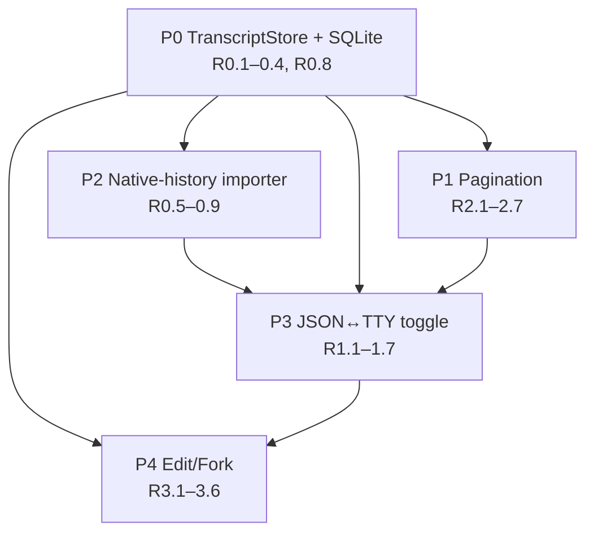

# JSON Agent Chat — Phased Implementation Plan

## 1. Overview
- **Goal:** durable + paginated + swappable chat history; seamless JSON↔terminal toggle; edit-a-sent-message (fork).
- **Sequencing principle:** foundation before features — storage port (P0) unblocks pagination, import, toggle, fork.
- **Ships first:** P0 (invisible infra: SQLite `TranscriptStore` behind the port, tests stay green) then P1 pagination (first user-visible win).
- **Ordering rationale:** P1/P2 both need P0's `logSeq`; P3 toggle needs P2's importer; P4 fork needs P0's superseded field + P3's plumbing.
- **Non-goals (per PRD):** DOM virtualization lib; multi-user; Postgres impl (port must admit it, don't build it).

## 2. Dependency graph

---

## P0 — TranscriptStore port + SQLite (R0.1–0.4, R0.8)
- **Scope:** replace direct file I/O with a port; SQLite concrete impl; durable `logSeq`; one-time JSONL migration. No user-visible change.

**Key files**
- New `daemon/src/services/transcriptStore.ts` — `TranscriptStore` interface: `append`, `tail(nTurns)`, `pageBefore(seq,limit)`, `since(seq)`, `count`, `lastMeta`, `readAll` (R0.1).
- New `daemon/src/services/sqliteTranscriptStore.ts` — `better-sqlite3` impl, WAL, single-writer, `logSeq` assigned in insert txn (R0.2, R0.8).
- New `daemon/src/services/transcriptMigration.ts` — `messages.jsonl` → SQLite, idempotent/transactional, keep `.jsonl` backup, legacy `logSeq = line index` (R0.4).
- `daemon/src/services/jsonAgent.ts` — route `persist` (L741), `readTranscript` (L512), `rebuildMetaFromTranscript` (L301), `hasPersistedTurn` (L748) through store; rename in-memory `QueuedTurn.seq` (L87,L340) → `enqueueOrder` and `seqCounter` (L241) → `enqueueCounter` (R0.3).
- `daemon/src/services/jsonAgentChat.ts` — `readTranscriptFile`/`transcriptPathFor` (L58,L217) → store-backed accessors.
- `daemon/package.json` — add `better-sqlite3` dep (currently absent).

**APIs / interfaces**
- `TranscriptStore` port (internal); no HTTP change.
- `append(ev)` returns the assigned `logSeq`; writer seeds `next = MAX(logSeq)+1` on construction (bounded query, R0.3).

**Data / schema**
- Table `message(session_id TEXT, seq INTEGER, ts TEXT, kind TEXT, turn_id TEXT, payload TEXT, PRIMARY KEY(session_id, seq))`; index `(session_id, turn_id)` (R0.2).
- `NormalizedEvent` (`daemon/src/types.ts:84`) gains optional `logSeq?: number` (persisted cursor; distinct from `edited` at L112).
- DB file per session under `sessionDataDir`; WAL mode.

**Test checkpoints (§NFR N2/N3/N4)**
- **P0.T1** Unit — `sqliteTranscriptStore`: `logSeq` gap-free/monotonic across appends; `MAX+1` reseed after reopen.
- **P0.T2** Integration — migration golden-file (`jsonAgent.test.ts`): `messages.jsonl` → SQLite, line-count reconciled, idempotent re-run, `.jsonl` retained; golden includes an **attachment path-ref `user` event** surviving intact (J10).
- **P0.T3** Regression — `jsonChatQueue.test.ts` / `jsonChatRoutes.test.ts` pass unchanged with rename `seq`→`enqueueOrder`.
- **P0.T4** Regression — legacy lines without `logSeq` read without loss (N3).

**Docker-verify**
- Rebuild `docker-compose.dev.yml` (daemon changed + native `better-sqlite3` build); open an existing session, confirm history intact.

**Risks**
- `better-sqlite3` native build in the daemon container image.
- Migration on a large `.jsonl`; guard with a transaction + backup.
- `seq` rename collides with WS protocol / meta — grep all `\.seq\b` before rename.

---

## P1 — Pagination (R2.1–2.7)
- **Scope:** bounded open (tail-N turns), keyset "load earlier", `?since` reconnect delta, client delta-merge.

**Key files**
- `daemon/src/ws/handlers/chatOpen.ts` — replace full `readSessionTranscript` replay (L34) with `tail(N)` + `{oldestSeq,hasMore}`; fix read→subscribe gap (L34–56) via snapshot-then-subscribe ordering (R2.7).
- `daemon/src/routes/sessions.ts` — extend `GET /sessions/:id/transcript` (L1131) with `?beforeSeq=&limit=` and `?since=`; bounded queries (R2.2/2.3).
- `daemon/src/services/jsonAgentChat.ts` — add `tailTurns`, `pageBefore`, `since` wrappers over the store; **route `readSessionMeta` full-read (L249) through the store** — use `lastMeta()` (bounded), NOT `readTranscriptFile` (R2.6).
- `daemon/src/services/jsonAgent.ts` — `rebuildMetaFromTranscript` (L301) + `firstTurnDone` (L274) use bounded `MAX`/`EXISTS`/tail-scan, never `readAll` (R2.6). Last model/usage-bearing event may be **older than the tail window** → resolve it via the port's `lastMeta()` (reverse-scan-until-found or persisted meta), never a full scan (J11).
- `web-ui/src/hooks/useChat.ts` — replace `setEvents(e.events)` replace (L113) with delta-**merge** (prepend older, append live); track `{oldestSeq,hasMore}`; add `loadEarlier()`. **`userTurnIdsRef`/`pending` bookkeeping (L108–116) must UNION on merge, not replace** — else queued-tray dedup breaks for turns outside the tail window.
- `web-ui/src/components/chat/MessageList.tsx` — "load earlier" affordance + guarded "load all" escape hatch (R2.5); grouping already turn-aware (L69).

**APIs**
- `GET /sessions/:id/transcript?beforeSeq=<n>&limit=<n>` → `{ events, oldestSeq, hasMore }` (keyset, R2.2).
- `GET /sessions/:id/transcript?since=<logSeq>` → `{ events }` delta (R2.3).
- WS `chat:replay` payload gains `{ oldestSeq, hasMore }`; add `chat:open { sinceSeq? }` (R2.7). Update `daemon/src/ws/protocol.ts` + web-ui `api/types`.

**Data / schema**
- No schema change; `tail(nTurns)` resolves Nth-newest `turn_id` via `(session_id, turn_id)` index, returns from its first `logSeq` (turn-aligned, never split — R2.4).

**Test checkpoints (§NFR N1/N4)**
- **P1.T1** Unit — `TranscriptStore.tail`: window boundary never splits a turn (N4 pagination boundary).
- **P1.T2** Integration — `jsonChatRoutes.test.ts`: `beforeSeq` keyset returns correct older page + `hasMore`; `since` returns only newer events.
- **P1.T3** Integration — `jsonProtocol.test.ts`: snapshot-then-subscribe loses no event across replay→live attach.
- **P1.T4** Regression — reconnect mid-turn (J3) replays via `since`, not full transcript.
- **P1.T5** Integration — a `model`-bearing event **older than the tail window** still yields correct status-bar meta via `lastMeta()` (J11).

**Docker-verify**
- Rebuild `docker-compose.dev.yml`; open a long session, confirm bounded open + scroll-up load-earlier + mid-turn refresh.

**Risks**
- Client merge dedup by `id`/`logSeq` — avoid duplicate bubbles on overlap.
- `oldestSeq` off-by-one at turn boundary.
- Legacy sessions where `logSeq = line index` still keyset correctly.

---

## P2 — Native-history importer (R0.5–0.9)
- **Scope:** claude + opencode at-rest adapters that mirror terminal-phase turns into our store; dedup + atomic + watermark.

**Key files**
- New `daemon/src/services/nativeHistoryImporter.ts` — `NativeHistoryImporter` interface: locate native store from `agentChatId`+cwd+watermark, yield `NormalizedEvent[]` past watermark (R0.5).
- New `daemon/src/agent-plugins/claudeImport.ts` — at-rest adapter over `~/.claude/projects/<slug>/<uuid>.jsonl`; emit `user` from `type:"user"` text, derive usage from `assistant.message.usage`, strip inline base64 (R0.6/0.7); slug logic reuses `claudeRestore.ts` `replaceAll("/","-").replaceAll(".","-")`.
- New `daemon/src/agent-plugins/opencodeImport.ts` — SQL read of `~/.local/share/opencode/opencode.db` (`session`/`message`/`part`); synthesize `user` events (R0.6).
- `daemon/src/services/spawn.ts` — add optional `importNativeHistory?()` to `AgentPlugin` (near `getRestoreCommand` L129), or register importers in a separate map keyed by CLI.
- `daemon/src/services/transcriptStore.ts` — add `importTransaction(events, watermark)` (single txn, R0.9) + native-watermark storage (separate coordinate from `logSeq`, R0.5).

**APIs**
- Internal `NativeHistoryImporter.import({ agentChatId, cwd, watermark })` → `{ events, nextWatermark }`.
- Watermark persisted per session (claude line-uuid / opencode rowid) — new column/row, NOT `logSeq`.

**Data / schema**
- New table `native_watermark(session_id TEXT PRIMARY KEY, cli TEXT, cursor TEXT)`.
- Dedup: skip any turn whose `turn_id`/content already present (round-trip J5 must not double-import, R0.9).

**Test checkpoints (§NFR N4/N5)**
- **P2.T1** Unit — claude adapter golden-file: `user` prompts + usage present, base64 stripped (N4 per-CLI import golden).
- **P2.T2** Unit — opencode adapter golden-file: `user` events synthesized from `part` rows.
- **P2.T3** Integration — toggle round-trip dedup (N4): JSON→tty→JSON imports no duplicate JSON turns.
- **P2.T4** Integration — partial-import crash (J14): rollback leaves watermark unchanged, no partial rows.
- **P2.T5** Observability — import counts + dedup skips logged (N5).

**Docker-verify**
- Rebuild `docker-compose.dev.yml`; run a claude terminal turn, import, confirm it appears in JSON UI with usage.

**Risks**
- claude native format drift (skip `mode`/`file-history-snapshot`/`ai-title` lines).
- opencode global DB concurrent access / locking.
- Watermark ↔ `logSeq` coordinate confusion.

---

## P3 — JSON ↔ Terminal toggle (R1.1–1.7)
- **Scope:** idle-gated channel switch; spawn/teardown; import on tty→json; multi-tab mirror.

**Key files**
- `daemon/src/routes/sessions.ts` — new `PATCH /sessions/:id/channel` (model after `PATCH /chat/model` L1102); create-time gate reference (L357).
- `daemon/src/services/channel.ts` — reuse `normalizeChannel` (L46) invariant `json ⇒ useTmux=false`; add transition helper.
- `daemon/src/services/jsonAgent.ts` — expose idle+editing gate check (`turnState==="idle"` && no queue && `holds` empty — R1.1).
- tmux/pty spawn + teardown wiring (reuse existing create/DELETE spawn path) — json→tty spawn, tty→json teardown (R1.2).
- Toggle invokes P2 importer on tty→json (R1.4); resume same `agentChatId` via `getRestoreCommand` (R1.3).
- Plugin gate: claude + opencode enabled; cursor fast-follow; agy blocked (R1.6) — check `importNativeHistory` presence.
- `web-ui/src/hooks/useChat.ts` — re-establish chat stream on channel change (R1.7); meta broadcast already flows via `session:meta`.

**APIs**
- `PATCH /sessions/:id/channel { channel: "json" | "tmux" | "pty" }` → `{ ok, channel }`; 409 when not idle / editing in progress (R1.1); 400 when importer unavailable (R1.6).

**Data / schema**
- No new schema; flips `SessionRecord.channel` (`types.ts:166`) + `useTmux` invariant via `mutateProject`.

**Key decisions**
- **Direct (non-worktree) sessions (R1.5):** `getRestoreCommand` is worktree-gated (plugins require `worktree` arg) — **disable toggle for direct sessions at launch** (simplest); revisit extending restore later.

**Test checkpoints (§NFR N4)**
- **P3.T1** Unit — gate: toggle rejected when `turnState!=="idle"`, `queue.length > 0` (queued turn, J7), or `editingTurnIds` non-empty (R1.1).
- **P3.T2** Integration — json→tty→json keeps same `agentChatId` + model context (J4/J5).
- **P3.T3** Integration — two-tab mirror (N4 concurrency): toggle in tab A tears down/re-establishes tab B's stream.
- **P3.T4** Integration — agy toggle blocked; empty-session toggle no-op import (J12/J13).

**Docker-verify**
- Rebuild `docker-compose.dev.yml`; toggle a live claude session both directions, confirm history continuity + terminal-phase backfill.

**Risks**
- Race between in-flight turn and teardown (gate must hold).
- pty spawn reusing create path without duplicating side-effects.
- Multi-tab stream re-establish ordering.

---

## P4 — Edit a sent message / fork (R3.1–3.6)
- **Scope:** edit already-answered turn N → truncate-after-N → fork; claude-only via `--fork-session`.

**Key files**
- `daemon/src/services/spawn.ts` — new `getForkCommand?()` on `AgentPlugin` + `TurnContext.forkFromChatId?` (near L72/L129) (R3.2).
- `daemon/src/agent-plugins/claude.ts` — `runTurn` (L364) adds `--fork-session` when `ctx.forkFromChatId` set (distinct from `--resume` L378) (R3.5).
- `daemon/src/services/jsonAgent.ts` — fork entry: mark rows at/after turn N's `logSeq` **superseded**; branch head re-run (R3.1/3.4).
- `daemon/src/services/transcriptStore.ts` — `markSupersededFrom(seq)` (append-only → new `superseded` field, NOT reuse `edited` L112) (R3.4); **amend `tail`/`pageBefore`/`since` to exclude `superseded=1` by default** so tail-N counts live turns only (closes P1↔P4 back-edge).
- `web-ui/src/components/chat/MessageList.tsx` — edit affordance on answered user turn; filter superseded on render (groupEvents L32).
- `daemon/src/routes/sessions.ts` — new `POST /sessions/:id/chat/fork { turnId, message }`.

**APIs**
- `POST /sessions/:id/chat/fork { turnId, message, attachmentIds? }` → `{ ok, turnId }`; broadcasts fork so other tabs re-sync (R3.6).

**Data / schema**
- `message` table gains `superseded INTEGER DEFAULT 0` (or `superseded_at`); fork point = `logSeq` of turn N (R3.4).
- **Decision R3.3:** keep old branch (git-style, default) — mark superseded, do not delete.

**Test checkpoints (§NFR N4)**
- **P4.T1** Unit — `markSupersededFrom`: rows ≥ fork `logSeq` flagged; earlier rows untouched.
- **P4.T2** Integration — claude fork (J6): `--fork-session` runs, superseded turns hidden, new branch head appears.
- **P4.T3** Integration — two-tab fork broadcast (R3.6): other tab re-syncs from new branch head.
- **P4.T4** Regression — non-fork edit of a *queued* turn still uses `edited` path (distinct semantics).

**Docker-verify**
- Rebuild `docker-compose.dev.yml`; edit an answered claude message, confirm fork + superseded marker.

**Risks**
- `superseded` vs `edited` semantic conflation.
- Non-claude CLIs lossy replay (flag; deferred R3.5).
- Pagination interaction: superseded rows must not count toward tail-N turns.

---

## 3. Cross-cutting
- **Test strategy:** port-level unit tests (SQLite in a tmpdir); golden-files for migration + each importer (N4); protocol tests for replay/since ordering; two-tab concurrency + toggle round-trip + fork broadcast integration.
- **Migration / rollback:** idempotent, transactional, `.jsonl` kept as read-only backup, line-count reconciled (N2); on failure leave `.jsonl` authoritative.
- **Observability (N5):** log import counts, migration line-count reconciliation, dedup skips; counters on fork + toggle.
- **Backward-compat (N3):** read legacy lines (no `logSeq`, old `edited`) losslessly; `sessionChannel`/`normalizeChannel` already backfill legacy manifests.
- **Port discipline:** no caller touches file/DB directly (R0.1) — enforce via a single accessor module; Postgres-ready interface, no Postgres impl.
- **Single-writer + import (R0.8 vs R0.9):** the importer writes through the **same session-scoped store/writer instance** as live turns; it runs only under the toggle's idle gate (no concurrent live append), which is what makes the shared writer sound.
- **Cursor importer deferred:** R0.6's third CLI (cursor, blob-DAG) is **fast-follow, not in P2** — P3 toggle blocks cursor until its importer ships (same gate as agy).

## 4. Sequencing table

| Phase | Depends on | Ships (user-visible?) | Verify |
|---|---|---|---|
| P0 TranscriptStore + SQLite | — | No (infra) | Migration golden + queue/routes regression green; docker open existing session |
| P1 Pagination | P0 | Yes — fast open, load-earlier, mid-turn refresh | Tail/keyset/since tests; docker long-session scroll |
| P2 Native importer | P0 | Partial (enables P3) | claude+opencode golden, round-trip dedup; docker import claude terminal turn |
| P3 JSON↔TTY toggle | P0, P1, P2 | Yes — switch channel, no lost history | Gate + continuity + two-tab; docker toggle both ways |
| P4 Edit/Fork | P0 (hard), P3 (soft) | Yes — edit answered message (claude) | Superseded + fork + broadcast; docker fork claude |

> P4 hard-depends only on P0 (`superseded` field) + `spawn.ts` fork plumbing; the P3 dependency is soft — if P3 slips, P4 can proceed in parallel after P0.

## 5. Open questions (from PRD, under-specified for planning)
| # | Question | Notes |
|---|---|---|
| 1 | Page size N (turns) on open + "load all" threshold | **Default N=20 turns**; perf-warn / "load all" hatch above ~200 turns. (Confirm N1 numbers.) |
| 2 | agy importer | R1.6 / open decisions — reverse protobuf vs summary-only vs block toggle; plan assumes **block** at launch. |
| 3 | Direct-session toggle | R1.5 — plan chooses **disable at launch**; extending restore to direct sessions is deferred, needs confirmation. |
| 4 | Non-claude fork replay fidelity | R3.2/R3.5 — "lossy, flag" not spec'd; needs UX for the degraded-fork warning. |
| 5 | Watermark storage location | R0.5 says "separate from logSeq" but not table shape — plan proposes `native_watermark` table. |
