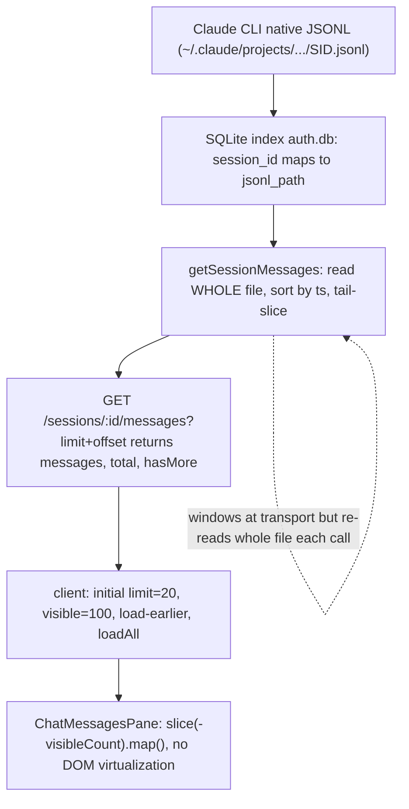
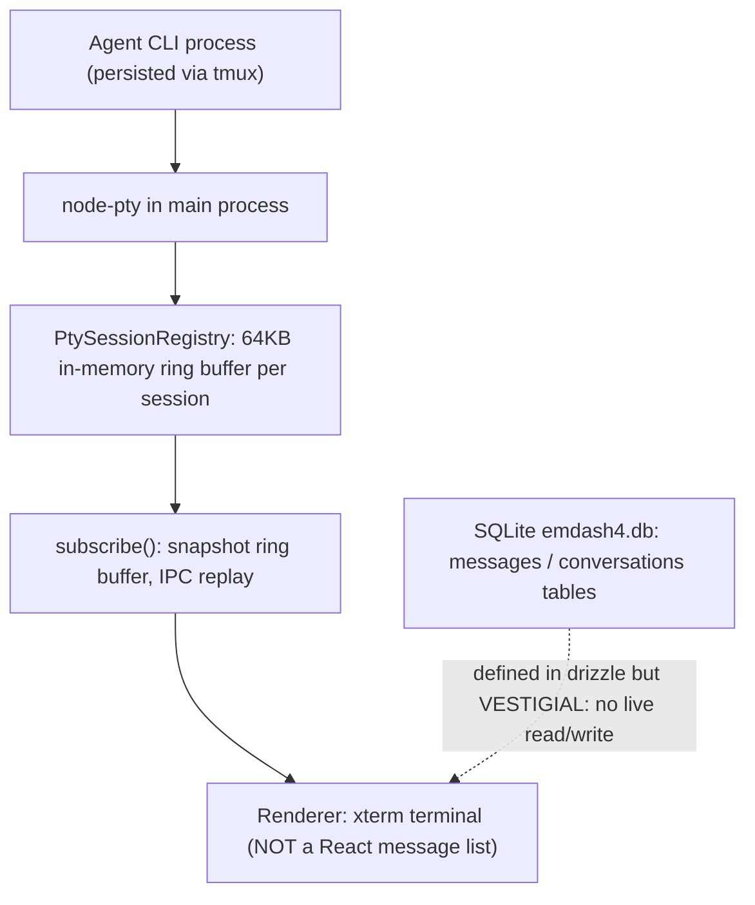
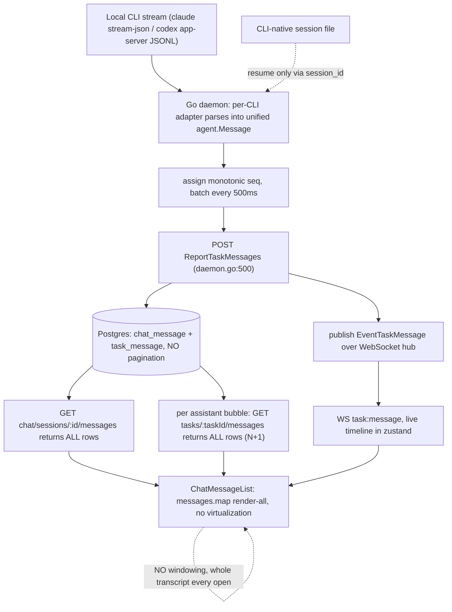

# JSON Agent Chat — Remaining Work (PRD)

> Requirements only. Covers the 3 open items (**#3 toggle**, **#9 pagination**, **#10 edit/fork**) plus the shared foundation they all depend on. CUJs in **§CUJ**; competitor research in **Appendix A**; CLI native-store feasibility in **§0**.
>
> Supersedes the triage in `.feature-plans/wip/json-mode/chat-ux-followups.md` (items 1/2/4/5/6/7/8 shipped; this PRD carries the rest forward). Revised after opus review (GO-WITH-CHANGES).

## Goals / non-goals
- **Goals:** durable + paginated + swappable chat history; seamless JSON↔terminal toggle with no lost history; edit-a-sent-message (fork).
- **Non-goals (now):** DOM virtualization library; multi-user; Postgres (design the port for it, don't build it).

---

## §CUJ — Critical User Journeys (acceptance targets)

| # | Journey | Covered by | Note |
|---|---|---|---|
| J1 | Open a very long chat — fast, bounded | R2.1, R2.6, R2.7 | tail-N over WS replay, not the whole file |
| J2 | Scroll up → load earlier history | R2.2 | keyset `pageBefore`, merge into loaded window |
| J3 | Refresh / reconnect mid-turn without losing events | R2.3, R2.7 | `?since=<seq>` delta + snapshot-then-subscribe ordering |
| J4 | Toggle JSON→terminal mid-conversation, keep model context | R1.2, R1.3 | same `agentChatId` + `--resume` |
| J5 | Toggle terminal→JSON, see the terminal-phase turns | R1.4, R0.5–R0.9 | native import (dedup + atomic) |
| J6 | Edit an already-answered message → fork | R3.1–R3.6 | new fork plumbing; superseded marker |
| J7 | Send-now preemption (shipped) | `promoteQueuedTurn` | R1.1 gate must respect active/queued/held turns |
| J8 | Daemon restart durability (meta/seq rebuild) | R0.3, R2.6 | bounded queries; seed `seq = MAX(seq)+1` |
| J9 | Two tabs on one session (concurrent append/read) | R0.8, R1.7, R3.6 | single-writer, seq atomicity, toggle mirrored to tabs |
| J10 | Attachments/images through migration + import | R0.4, R0.7 | our store = path-refs (clean); base64 risk = claude import only |
| J11 | Switch model mid-session (shipped) | `setModel` | pagination must preserve `model`-bearing events |
| J12 | Brand-new empty session toggle | R1.1 | no `agentChatId` → json→tty fresh, tty→json import no-op |
| J13 | Toggle for a CLI with no importer yet (agy) | R1.6 | blocked/degraded |
| J14 | Partial import failure / crash mid-import | R0.9 | transactional, idempotent, watermark unchanged on rollback |

---

## §0 — Foundation (shared by #3, #9, #10)

### Storage
- **R0.1** All transcript access goes through a `TranscriptStore` port: `append(ev)`, `tail(nTurns)`, `pageBefore(seq, limit)`, `since(seq)`, `count()`, `lastMeta()`, `readAll()` (migration only). No caller touches the file/DB directly.
- **R0.2** First concrete impl = **SQLite** (`better-sqlite3`). Table `message(session_id TEXT, seq INTEGER, ts TEXT, kind TEXT, turn_id TEXT, payload TEXT, PRIMARY KEY(session_id, seq))`, index `(session_id, turn_id)` for turn→seq lookup. Port must admit a future Postgres impl with no caller changes.
- **R0.3** Durable monotonic per-session **`logSeq`** assigned at `append` (renamed to avoid colliding with the existing in-memory `QueuedTurn.seq` queue counter — rename that to `enqueueOrder`). It is the cursor for pagination, `since` delta, and dedupe. On construction the writer seeds `next = MAX(logSeq)+1` from the store (bounded query).
- **R0.4** One-time **migration**: existing `messages.jsonl` → SQLite on first open — idempotent, transactional, keeps the `.jsonl` as a read-only backup, reconciles line-count, legacy lines get `logSeq = line index`. A JSONL read-adapter survives only for this path.
- **R0.8** SQLite in **WAL** mode. The `JsonAgentSession` (one per session, via registry) is the **sole writer**; `logSeq` is assigned inside the same transaction as the insert so it stays gap-free/monotonic and never blocks concurrent `pageBefore` reads.

### Native-history importer (per-CLI: CLI native store → our `NormalizedEvent`s)
- **R0.5** A `NativeHistoryImporter` interface. Given `session.agentChatId` + cwd + a **native cursor watermark** (per-CLI: claude line uuid / opencode rowid / timestamp — *stored separately from our `logSeq`*, since the native store's ordering is a different coordinate system), it locates the CLI's native store and yields normalized events past the watermark.
- **R0.6** Ship importers in feasibility order: **claude → opencode → cursor → agy (deferred)**. **Each importer is a new at-rest envelope adapter, NOT a reuse of the live stream parser** — the at-rest store has no daemon-synthesized `user` event and no synthetic `result` line, so the adapter must (a) emit `user` events from the native `type:"user"` text content and (b) derive usage from `assistant.message.usage`. Reuse only the block-level normalization.
- **R0.7** **Strip/externalize inline base64 image/attachment blobs on import — claude native JSONL only** (confirmed: claude inlines image base64). Our own `messages.jsonl` stores attachments as **path references**, not base64, so migration (R0.4) is clean and needs no stripping.
- **R0.9** Import runs in a **single transaction**: idempotent + resumable from the watermark; **dedups** any turn already mirrored in our store (a JSON→tty→JSON round trip must not double-import the JSON turns); on failure it rolls back and leaves the watermark unchanged.

### CLI native-store feasibility (verified 2026-07-18)

| CLI | Native store | Format | `agentChatId` → store | Importer |
|---|---|---|---|---|
| **claude** | `~/.claude/projects/<slug>/<uuid>.jsonl` | append-only JSONL | filename == `agentChatId`; slug = cwd `/`→`-`, `.`→`-` | **Easy** — at-rest adapter (emit `user` text + usage from `assistant.message.usage`); skip `mode`/`file-history-snapshot`/`ai-title` lines |
| **opencode** | `~/.local/share/opencode/opencode.db` (single global SQLite) | relational `session`/`message`/`part`, JSON in `data` | `session.id == agentChatId` (`ses_…`) | **Easy** — SQL read + at-rest adapter (synthesize `user` events) |
| **cursor** | `~/.cursor/chats/<md5(cwd)>/<chatId>/store.db` | SQLite **content-addressed blob DAG** | dir == `agentChatId`; parent = `md5(abs cwd)` | **Hard** — port ccui's `cursor-sessions.provider.ts` DAG topo-sort |
| **agy** | `~/.gemini/antigravity-cli/conversations/<id>.db` | SQLite of **protobuf blobs** (no public `.proto`) | filename == `agentChatId` | **Hard / defer** — reverse protobuf, or "summary-only" from `conversation_summaries.db` |

---

## §1 — #3 JSON ↔ Terminal toggle
- **R1.1** A live session can switch channel json↔terminal via an idle-gated control + confirm dialog. Enabled **only** when `turnState === "idle"`, no queued turns, **and `editingTurnIds` empty** (no held-for-edit turns).
- **R1.2** New endpoint `PATCH /sessions/:id/channel`: sets `channel` + the `useTmux` invariant; **json→tty** spawns tmux/pty, **tty→json** tears the pty down.
- **R1.3** Continuity: both channels resume the **same** `agentChatId` (`getRestoreCommand` → `--resume`), so model context never breaks.
- **R1.4** On **tty→json**, run the `NativeHistoryImporter` (R0.5–R0.9) to backfill terminal-phase turns from the native cursor watermark. **This is the fix** for "terminal chat is invisible in the JSON UI."
- **R1.5** Direct (non-worktree) sessions: `getRestoreCommand` is **worktree-gated and never invoked** for them today (plugins require a `worktree` arg). Either extend restore to direct sessions or **disable the toggle** for them at launch.
- **R1.6** Gate per-CLI by importer availability: claude + opencode at launch; cursor fast-follow; **agy toggle blocked (or degraded)** until its importer exists.
- **R1.7** A channel toggle is **mirrored to any other open tab** on the same session (WS chat stream torn down/re-established; meta broadcast).

## §2 — #9 Long-chat pagination
- **R2.1** On open, replay only the **last N turns** (turn-aligned) + a cursor `{ oldestSeq, hasMore }` — not the whole transcript.
- **R2.2** "Load earlier" fetches older pages by **keyset**: `GET /sessions/:id/transcript?beforeSeq=&limit=` → `{ events, oldestSeq, hasMore }`. Client **merges** (prepends) into the loaded window.
- **R2.3** Reconnect uses a **`?since=<logSeq>` delta**, not a full replay.
- **R2.4** Window **by turn**, never split a turn across a page boundary (grouping/merge needs whole turns). `tail(nTurns)` resolves the Nth-newest `turnId` and returns from its first `logSeq` (uses the `(session_id, turn_id)` index).
- **R2.5** Render-all **within** the loaded window; no virtualization lib yet (revisit only if one ~N-turn window is itself heavy). Include a guarded "load all" escape hatch + perf warning.
- **R2.6** Bounded open cost everywhere: keyset `tail()` **and** the restart-durability path (meta rebuild + `firstTurnDone`) use bounded queries (`MAX`, `EXISTS`, tail-scan), never whole-transcript reads.
- **R2.7** Change `chat:open`/`chat:replay` to carry a cursor and emit **tail-N turns + `{oldestSeq,hasMore}`**; the client **merges** deltas rather than `setEvents(replace)`. Define snapshot-then-subscribe ordering so no event is lost between the transcript read and the live-listener attach (closes today's `chatOpen` read→subscribe gap).

## §3 — #10 Edit a sent message / fork
- **R3.1** Editing an already-answered turn N truncates the conversation after N and re-runs → a **fork**.
- **R3.2** New plugin capability `getForkCommand` (+ `TurnContext.forkFromChatId`) — there is **no fork surface today** (JSON turns only `--resume`, never `--fork-session`). claude: `--fork-session`. Others: start a **new** conversation replaying turns 1..N-1 as context (lossy — flag).
- **R3.3** [decision] Keep the old branch (git-style history) **vs** overwrite. Default: **keep**.
- **R3.4** Fork point = the `logSeq` of turn N. Append-only store → truncation = mark rows **superseded** via a **new field**, distinct from the existing queue-edit `edited` flag (which dedupes a *queued* edit, different semantics).
- **R3.5** Launch: **claude-only** via `--fork-session`; others deferred / best-effort.
- **R3.6** Two-tab consistency: a fork is broadcast; other tabs re-sync from the new branch head.

## §4 — Drop gemini
- **R4.1** ✅ Done (`e8827d4`) — gemini plugin/mode/registry/wiring removed; tests updated (fixed the failing gemini `modes` test). agy supersedes it.

---

## §NFR — Non-functional
- **N1** Perf: open ≤ target ms / ≤ N events replayed; `pageBefore` ≤ target ms.
- **N2** Migration: idempotent, transactional, rollback-safe, keeps `.jsonl` backup, reconciles line count.
- **N3** Backward-compat: read legacy lines (no `logSeq`, old `edited`) without loss.
- **N4** Tests: migration golden-file; per-CLI import golden-file (user prompts + usage present); two-tab concurrency; toggle round-trip dedup; pagination boundary (turn not split).
- **N5** Observability: import counts, migration line-count reconciliation, dedup skips.

## Open decisions
- **R3.3** — #10 keep-vs-overwrite branch semantics.
- **agy importer** — reverse protobuf, "summary-only" degraded import, or block the toggle for agy.
- **Page size N** (turns) on open, and the "load all" escape hatch threshold.

---

## Appendix A — Competitor research

> Reverse-engineered from `~/code/fastestdevalive/{claudecodeui, emdash, multica}`. `file:line` refs are load-bearing.

| | Storage backend | Source of truth | Load strategy | Pagination / windowing | Virtualization |
|---|---|---|---|---|---|
| **vibe-station (us)** | `messages.jsonl` per session | **Mirror** (own file drives UI; CLI-native drives `--resume`) | entire file → one `chat:replay` → render-all | **None** | **None** |
| **claudecodeui** | reads **CLI-native** `~/.claude/…jsonl`; SQLite `auth.db` is only a `session_id → path` index | **CLI-native** (no body mirror) | stream whole JSONL → sort → tail-slice | **Yes** — server tail-N + client `slice(-100)` + load-earlier | **No** (`.map()`) |
| **emdash** | SQLite `emdash4.db` — **but transcript NOT stored there** | **Neither** — live node-pty terminal; message tables vestigial | replay 64 KB ring buffer | ring-buffer cap | **No** (xterm) |
| **multica** | **Postgres** (`chat_message` / `task_message`) | **Own mirror** (like us, server-side DB) | whole convo (`SELECT * ORDER BY created_at`) + **N+1** per bubble | **None** for display (`?since=<seq>` = reconnect delta) | **None** |

**Crux axis (source of truth):** ccui = CLI-native only, emdash = ephemeral terminal, **multica & us = own normalized mirror**. ccui/emdash carry no second copy; we & multica do — which is what makes windowing implementable without touching native files. multica shares our approach *and* our bug (whole-transcript load, plus N+1).

**Evidence:**
- ccui native read: `server/index.js:1233-1256`; `providers/list/claude/claude-sessions.provider.ts:110,123`. Index-only SQLite: `database/repositories/sessions.db.ts:9,56,86-96`. Pagination: `claude-sessions.provider.ts:104-195` (`startIndex=total-offset-limit`); client `useChatSessionState.ts:12-13` (`MESSAGES_PER_PAGE=20`, `INITIAL_VISIBLE_MESSAGES=100`); render-all `ChatMessagesPane.tsx:240`.
- emdash: schema `src/main/db/schema.ts:238-305` (no live insert/select); terminal `conversation-manager.ts:171-173`; ring buffer `pty-session-registry.ts:6` (`64*1024`).
- multica: unified across 5 CLIs `agent.go:95-110`; monotonic `seq` `daemon.go:992`; `?since` delta `daemon.go:585` (`ListTaskMessagesSince`); N+1 `chat-message-list.tsx:100`.

**claudecodeui — data flow**

**emdash — data flow**

**multica — data flow**

**What we borrowed into this PRD**
- **ccui** → the client-side tail window + "load earlier" (§2), and the toggle fix (read native truth → we import it, §1.4). Avoid ccui's O(file) re-read → we keyset-tail (R2.6).
- **multica** → monotonic `seq` cursor (R0.3), `?since` delta (R2.3), two-tier turns-vs-timeline model. Avoid its N+1 + unbounded `SELECT *`.
- **emdash** → cautionary: a terminal-only design has no history to paginate; not our model.
