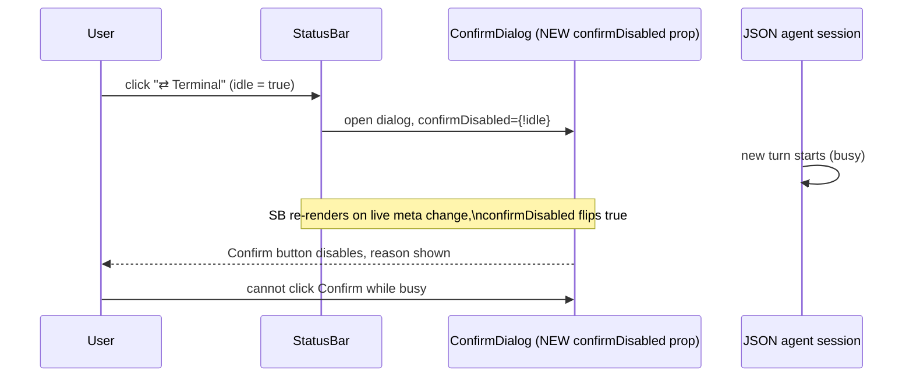
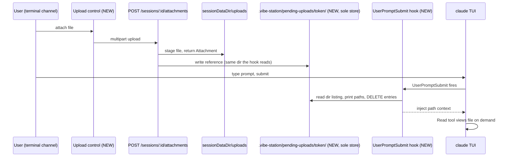

# Mini-Design: JSON Mode Follow-ups (4 items)

> Batch of 4 independent, low-risk fixes/designs surfaced while validating JSON agent chat.

**Issue:** json-mode-followups
**Branch:** `json-mode-chat-with-file-upload`
**Status:** Pending
**PRD:** none — bug-fix / small-feature batch, no user-facing flow change large enough to warrant one

**Reference files:**
- Core turn/event pipeline: `daemon/src/services/jsonAgent.ts`
- Per-CLI stream normalizers: `daemon/src/agent-plugins/{claude,cursor,opencode}.ts`
- Transcript storage: `daemon/src/services/sqliteTranscriptStore.ts`
- Channel toggle route: `daemon/src/routes/sessions.ts`
- Chat UI: `web-ui/src/components/chat/{StatusBar,ToolResultCard}.tsx`
- Terminal UI: `web-ui/src/components/layout/{AgentPaneSlot,TerminalChannelToggle}.tsx`
- Attachments: `daemon/src/routes/attachments.ts`, `daemon/src/agent-plugins/claude.ts` (`setupWorkspaceHooks`)

---

## Problem

| # | Item | Symptom |
|---|------|---------|
| 1 | Oversized `tool_result` content | Image `Read` results (base64) and huge log/grep dumps persist to the SQLite transcript **and** ship to the browser unbounded |
| 2 | Channel-toggle "session is busy" 409 | JSON→terminal toggle fails on sessions that were shown as idle when the confirm dialog opened |
| 3 | No terminal-mode file upload | JSON-channel sessions can attach files; terminal-channel sessions cannot — no design exists |
| 4 | Inconsistent toggle placement | JSON→terminal control lives in the bottom status bar; terminal→JSON control is a top-right overlay |

## Out of Scope

- SQLite `TranscriptStore` / pagination internals (P0–P2, already shipped) — only touched to add a size cap, not redesigned
- Non-claude terminal upload (cursor / opencode / agy) — hard-gated off, not built
- Changing `isIdleForToggle` server-side semantics — the gate itself is correct
- Auto-retry-when-idle queueing for the toggle — flag as future follow-up, not this plan

## Concept

- 4 independent items, ship separately, no required sequencing
- Item 4 reuses the shared component extracted while fixing item 2 (soft dependency, not hard blocker)
- Nothing here touches CLI-specific normalization logic beyond what already exists per plugin

## Requirements

| # | Requirement |
|---|-------------|
| 1 | `tool_result.content` never exceeds a fixed byte cap in storage or over the wire |
| 2 | Existing oversized rows in the SQLite store are backfilled, not just new ones |
| 3 | Channel-toggle confirm dialog reflects live busy state, not a stale snapshot |
| 4 | Terminal sessions can stage a file for the agent to `Read` on next prompt (claude only) |
| 5 | Both channel-toggle affordances render in the same screen position |
| 6 | A staged-but-not-yet-consumed terminal upload can be removed before it's injected |

---

## Research

### 1 — `tool_result` size — attachment delivery path

- **File:** `daemon/src/services/jsonAgent.ts:64-71` (`injectAttachments`) — attachment paths injected as plain text, not native image blocks
- **File:** `daemon/src/agent-plugins/claude.ts:364-415` (`runTurn`) — headless `claude -p --output-format stream-json`, message on stdin; no structured `--input-format`
- **Trigger:** model calls `Read` on an image path to see it (only option given path-only injection)
- **Risk:** LOW to change (expected CLI behavior, not a bug in itself)

### 1 — `tool_result` size — capture path (per-plugin, unguarded)

- **File:** `daemon/src/agent-plugins/claude.ts:108-118` — non-string `tool_result.content` blindly `JSON.stringify`'d (line 116)
- **File:** `daemon/src/agent-plugins/cursor.ts:153` — identical pattern
- **File:** `daemon/src/agent-plugins/opencode.ts:174` — identical pattern
- **Note:** `gemini.ts` no longer exists — gemini CLI support dropped (`e8827d4`, "chore: drop gemini CLI support"); only 3 plugins affected today
- **File:** `daemon/src/agent-plugins/agy.ts` — N/A, agy has no live per-event `tool_result` (single result object at process exit)
- **Risk:** HIGH — every provider's normalizer independently duplicates the unguarded stringify

### 1 — `tool_result` size — persistence + delivery, LIVE-TURN path

- **File:** `daemon/src/services/jsonAgent.ts:750-758` — `for await (const ev of this.plugin.runTurn(...))` → `handleEvent(ev)` (:758), the **only** place every provider's LIVE-turn events pass through
- **File:** `daemon/src/services/jsonAgent.ts:833-857` (`handleEvent`) — mutates `this.usage`/`this.model`, then `:853-854` `this.persist(ev); this.stream.emitMessage(ev);` — persist and live WS push happen back-to-back, same event object
- **File:** `daemon/src/services/jsonAgent.ts:874-878` (`persist`) — delegates to `this.store.append(ev)` (SQLite-backed since P0, **not** flat-file `appendFileSync` anymore)
- **File:** `daemon/src/services/sqliteTranscriptStore.ts:118-124` (`append`) — `INSERT ... payload = JSON.stringify(ev)`, one `TEXT` column, no size guard
- **Confirmed no other bypass:** every other `this.persist(...)` call site (`jsonAgent.ts:357,439,501,707,773,792`) is a `user`/`error`/`status` event — never `tool_result`
- **Risk:** HIGH — unbounded row growth + unbounded WS/HTTP payload per read

### 1 — `tool_result` size — persistence, AT-REST IMPORT path (channel-toggle backfill) — GAP

- **File:** `daemon/src/services/jsonAgent.ts:646-665` (`importNativeHistory`) — runs on tty→json channel toggle, calls `store.importTransaction(events, ...)` (`:659`) **directly** — does NOT go through `handleEvent`
- **File:** `daemon/src/services/sqliteTranscriptStore.ts:206-286` (`importTransaction`) — per-event loop `:256-268` calls `this.insertStmt.run(..., JSON.stringify(ev))` at `:264` — same unguarded stringify-and-insert, independent of `append`
- **File:** `daemon/src/agent-plugins/claudeImport.ts:55-75` — importer already strips **inline base64** (`stripInlineBase64`) but does nothing about large plain-text `tool_result` content (a big log/grep read from the terminal phase, `:158-168`)
- **File:** `daemon/src/agent-plugins/opencodeImport.ts:145` — same gap
- **Conclusion:** the "single funnel" claim only holds for the live-turn path — the at-rest importer is a **second, independent write path** that needs the same cap
- **Risk:** HIGH — an oversized tool result from a terminal-phase turn (before the user ever toggled to JSON) lands in the DB uncapped, and the constructor-time backfill (below) won't catch it since import runs AFTER store open

### 1 — `tool_result` size — read paths + migration precedent

- **File:** `daemon/src/services/sqliteTranscriptStore.ts:126-133,303,323,345` — 4 read paths (`readAll`, `tail`, `pageBefore`, `since`) all deserialize the same `payload` column — capping at BOTH write paths (insert-time) fixes all 4 reads for free
- **File:** `daemon/src/services/sqliteTranscriptStore.ts:86-97` — existing precedent for one-time idempotent migrations: `superseded` column add (guarded by `PRAGMA table_info` check) + `migrateJsonlIntoDb` one-time import — same pattern reusable for a backfill cap
- **Risk:** HIGH — unbounded row growth + unbounded WS/HTTP payload per read

### 1 — `tool_result` size — render path

- **File:** `web-ui/src/components/chat/ToolResultCard.tsx:23-56` — `content` dumped into `<pre><code>` with no size guard
- **Risk:** MEDIUM — DOM/memory cost client-side, secondary to the storage issue

### 2 — Channel-toggle busy 409

- **File:** `web-ui/src/components/chat/StatusBar.tsx:62-63` — `idle` computed live from `meta`, gates the trigger **button** only (`:106` `disabled={!idle}`)
- **File:** `web-ui/src/components/chat/StatusBar.tsx:129-142` — `ConfirmDialog`'s `onConfirm` (`:137`) calls `doToggle()` unconditionally — no re-check of `idle`, no `disabled` binding on the dialog's confirm control
- **File:** `web-ui/src/components/dialogs/ConfirmDialog.tsx:3-10` — GAP: props are `open/title/message/confirmLabel/onConfirm/onCancel` only, **no `disabled`/`confirmDisabled` prop exists** — the confirm `<button>` (`:30-36`) always fires unconditionally on click, so "bind to live idle" is not possible without first extending this shared component
- **File:** `daemon/src/services/jsonAgent.ts:629-636` (`isIdleForToggle`) — `!running && turnState==="idle" && queue.length===0 && holds.size===0`
- **File:** `daemon/src/routes/sessions.ts:1276,1316-1321` — `PATCH /sessions/:id/channel`, 409 `not_idle` when `fromJson` and gate fails
- **Confirmed scope is closed:** `api.setSessionChannel` has exactly 2 callers — `StatusBar.tsx:73` (json→tty) and `TerminalChannelToggle.tsx:66` (tty→json). Server only idle-gates `fromJson` (`sessions.ts:1316`) — tty→json has no gate to race, so `StatusBar` is the only site needing this fix
- **Trigger:** human reads the confirm dialog (unbounded time) while an actively-working session (e.g. an autonomous coding agent) starts a new turn in the gap
- **Risk:** MEDIUM — correct server behavior, poor client feedback; hits hardest exactly on the busy sessions users most want to interrupt

### 3 — Terminal-mode file upload (net-new, design only)

- **File:** `daemon/src/routes/attachments.ts:112` — `POST /sessions/:id/attachments`, currently 400s any non-`json`-channel session (`:118-120`)
- **File:** `daemon/src/state/attachmentRegistry.ts` — in-memory `sessionId → uploadId → Attachment`, v1-acceptable-loss on restart
- **File:** `daemon/src/services/jsonAgent.ts:64-71` — JSON-channel injector (`injectAttachments`), untouched by this item
- **File:** `daemon/src/agent-plugins/claude.ts:278-331` (`setupWorkspaceHooks`) — writes per-worktree `.claude/settings.json` with a `SessionStart` hook (`vibe-recorder.sh`, keyed on `VST_SPAWN_TOKEN`) + gitignores `.claude/` (`:300`); no `UserPromptSubmit` entry exists today
- **Confirmed absent:** `grep -rn "pending-uploads|vibe-uploads|UserPromptSubmit"` → zero hits anywhere in `daemon/src` or `web-ui/src`
- **Established pattern to reuse (`claude.ts:285-295`):** the existing hook is 100% filesystem-based, no daemon HTTP callback — it writes the claude `session_id` to `$CLAUDE_PROJECT_DIR/.vibe-station/agent-chat-ids/$token` (WORKTREE-local, gitignored), which the daemon later reads off disk. The new upload hook should follow the SAME shape: `$CLAUDE_PROJECT_DIR/.vibe-station/pending-uploads/$token/`, not a second, separately-tracked store (see Data Model fix below)
- **Rollout gap:** `setupWorkspaceHooks` only runs at TTY spawn (`spawn.ts:279-282,477-478`; `sessions.ts:818-819,1227`) — an already-running terminal session won't pick up the new `UserPromptSubmit` entry until it respawns or channel-toggles
- **Permission assumption:** staged attachment files live under `sessionDataDir/uploads/...`, outside the worktree; reading them cross-directory only works because TTY claude launches with `--dangerously-skip-permissions` (`claude.ts:263`) — true today, worth stating explicitly as a dependency, not a new risk
- **Risk:** MEDIUM — new surface area, claude-only, no existing code to regress

### 4 — Toggle placement inconsistency

- **File:** `web-ui/src/components/chat/StatusBar.tsx:101-115` + `web-ui/src/styles/chat.css:573-589` (`.chat-statusbar__channel`) — plain inline button inside `.chat-statusbar__info`, bottom of chat
- **File:** `web-ui/src/components/layout/TerminalChannelToggle.tsx` (whole file) + `web-ui/src/styles/chat.css:17-31` (`.terminal-channel-toggle`) — `position: absolute; top; right` overlay, positioning context set at `chat.css:10-14` (`.agent-pane-slot__terminal { position: relative }`)
- **File:** `web-ui/src/components/layout/AgentPaneSlot.tsx:4,26,38` — renders `TerminalChannelToggle` only `{!isJson && session}`
- **Confirmed:** commit `7230bbe` ("feat(json-chat): terminal→JSON toggle button") shipped the overlay pattern; the JSON-side control (`StatusBar`) predates it and was never migrated
- **Risk:** LOW — pure UI placement, no logic change

---

## Root Cause

- **Item 1:** no size guard exists anywhere between "provider emits a tool result" and "byte lands in the DB + browser" — 3 independent copy-pasted stringify sites, AND 2 independent unguarded DB-insert call sites (`append` for live turns, `importTransaction` for at-rest channel-toggle backfill)
- **Item 2:** two idle checks, one live (button) one stale-by-construction (dialog), separated by human reaction time — AND the shared `ConfirmDialog` has no mechanism to express "disabled" at all
- **Item 3:** attachment staging exists only for the JSON channel; terminal channel has no injection mechanism at all (no bug — feature was never built)
- **Item 4:** the two toggle directions were built in separate commits (P3 JSON→tty first, tty→json later) with no shared component — placement diverged

---

## Architecture

```mermaid
flowchart TD
  subgraph I1["1 — tool_result size cap (2 write paths, 1 shared cap fn)"]
    CAP["NEW: shared capToolResultContent()\ntoolResultCap.ts"]
    RT["plugin.runTurn() (live turn)"] --> HE["handleEvent() jsonAgent.ts:833"]
    HE --> CAP
    CAP --> PS[":853 persist(ev)"]
    PS --> APPEND["SqliteTranscriptStore.append()\n:118-124"]
    PS --> WS[":854 stream.emitMessage(ev)"]
    IMP["importNativeHistory()\n:646 (tty→json toggle backfill)"] --> ITX["importTransaction()\n:206-286"]
    ITX --> CAP
    APPEND --> READS["readAll / tail / pageBefore / since"]
    ITX --> READS
    READS --> UI1["ToolResultCard.tsx"]
    WS --> UI1
    APPEND -.->|"NEW: one-time backfill incl.\nsuperseded rows (mirrors :86-97)"| OLDROWS["existing oversized rows"]
  end

  subgraph I2["2 — toggle idle race"]
    BTN["StatusBar '⇄ Terminal' :106"] --> DLG["ConfirmDialog :129-142"]
    CDPROP["NEW: ConfirmDialog\nconfirmDisabled prop\n(ConfirmDialog.tsx:3-10,30-36)"]
    DLG --- CDPROP
    CDPROP -->|"bound to live idle"| CONF{"still idle?"}
    CONF -->|yes| PATCH["PATCH /sessions/:id/channel :1276"]
    CONF -->|no| BLOCK["Confirm disabled, no request sent"]
    PATCH --> GATE{"isIdleForToggle? :629"}
    GATE -->|no| E409["409 not_idle (rare final race)"]
    GATE -->|yes| SWITCH["json → tty"]
  end

  subgraph I3["3 — terminal upload design (1 file per entry, real delete)"]
    UI3PICK["AttachmentPicker/AttachmentChip\n(REUSED, new mount point)"] --> UP["POST /sessions/:id/attachments :112"]
    UP --> STAGE["sessionDataDir/uploads/uid/name"]
    STAGE --> WRITE["daemon writes ONE reference file into\n$CLAUDE_PROJECT_DIR/.vibe-station/\npending-uploads/token/uploadId-name\n(mirrors agent-chat-ids pattern, claude.ts:292)"]
    WRITE --> HOOK["NEW: UserPromptSubmit hook\n(claude.ts:278 setupWorkspaceHooks)"]
    HOOK -->|"read dir, print paths, DELETE consumed"| TTY["claude TUI: agent Reads file"]
    WRITE -.->|"same dir listing"| UICHIP["UI 'pending' chip\n(no separate in-memory registry)"]
    UICHIP -->|"remove click"| DEL["NEW: DELETE /sessions/:id/attachments/:uploadId"]
    DEL -->|"unlink both"| STAGE
    DEL -->|"unlink both"| WRITE
  end

  subgraph I4["4 — unify placement"]
    SBOLD["StatusBar bottom inline :101-115"] -.->|"extract"| SHARED["NEW: shared ChannelToggleButton"]
    TCTOLD["TerminalChannelToggle.tsx overlay"] -.->|"extract"| SHARED
    SHARED --> BOTH["both directions: top-right overlay"]
  end
```



---

## Design Details

### Critical User Journeys (CUJs)

#### CUJ 1 — Item 2, dialog stays open while session goes busy (fixed path)



- **Error path (residual, server-side):** idle at confirm-click, but a turn slips in during the network round trip → 409 still shown as fallback copy, window now ~1 request instead of arbitrary human delay
- **Edge case:** session already idle the whole time → unaffected, toggle proceeds as today

#### CUJ 2 — Item 3, terminal-mode upload happy path (new)



- **Error path:** file exceeds `MAX_FILE_BYTES` → existing 413 from `attachments.ts`, upload control shows inline error, nothing staged
- **Edge case — remove before consume:** user clicks ✕ on a pending chip → `DELETE /sessions/:id/attachments/:uploadId` (Decision 8) removes both the staged file and the pending-uploads reference → chip disappears, hook never sees it. Terminal buffer is never touched (no fragile xterm-buffer edits) — this is the entire reason removal is a real file delete instead of trying to edit already-printed terminal input
- **Edge case — race with hook consume:** user clicks ✕ at the same moment `UserPromptSubmit` fires and the hook deletes the same file → both are simple `unlink`s on the same path, second one is a no-op (ENOENT tolerated, not an error)

### Data Model

- **Single authoritative store — filesystem, not an in-memory map.** Original scratchpad design proposed an in-memory `PendingUpload` registry (mirroring `attachmentRegistry.ts`) written by the daemon AND a separate on-disk hook-consumed directory — two stores, no defined sync, hook consumption would desync the daemon's copy silently. Fixed: ONE location.

| Entity | Field | Type | Constraints | Notes |
|--------|-------|------|-------------|-------|
| Pending-upload entry (NEW) | filename | ONE FILE PER ENTRY: `<uploadId>-<name>` | lives at `$CLAUDE_PROJECT_DIR/.vibe-station/pending-uploads/<VST_SPAWN_TOKEN>/` | mirrors the existing `agent-chat-ids/<token>` pattern (`claude.ts:292`) — NOT a combined manifest, so removing one entry is a single `unlink`, not a manifest rewrite (Decision 8) |
| Pending-upload entry | referenced path | absolute string (file content) | points into `sessionDataDir/uploads/<uid>/<name>` | actual bytes stay in the existing attachment staging area — this file holds a reference/marker only |

- **Relationships:** 1 session → N pending entries (N files in the dir). Two ways an entry disappears: (a) hook DELETEs it on consume (`UserPromptSubmit` fired), or (b) user removes it via the new `DELETE /sessions/:id/attachments/:uploadId` (Decision 8) before it's ever consumed — both are real deletes, no daemon-side flag to keep in sync
- **UI "pending" chip** reads the same directory listing on demand (or via the existing WS/poll cadence) instead of a parallel in-memory map; remove ✕ on the chip calls the new DELETE route
- **Indexes:** none — small per-session directory, same acceptable-loss posture as `attachmentRegistry.ts` (worktree-local, gitignored, lost on worktree deletion — acceptable, matches existing `.claude/` handling)
- **Migration:** N — new structure, no existing schema touched

Items 1, 2, 4 — no data model changes.

### API Contracts

- **`POST /sessions/:id/attachments`** (`attachments.ts:112`) — reused as-is for item 3; only its channel gate (`:118-120`, currently rejects non-`json`) needs relaxing for terminal-channel sessions. No request/response shape change. Daemon ALSO writes the pending-uploads reference (above) in the same request handler — one write, one source of truth.
- **`DELETE /sessions/:id/attachments/:uploadId`** (NEW, item 3, Decision 8)
  ```
  DELETE /sessions/:id/attachments/:uploadId
    Request:  —
    Response: { ok: true }
    Errors:   404 NOT_FOUND (unknown uploadId), 400 (non-worktree / channel not eligible)
  ```
  Removes the staged file (`sessionDataDir/uploads/<uploadId>/...`) AND the pending-uploads reference file if one exists (terminal-mode). JSON-mode's composer keeps its existing client-only remove for the pre-send draft case; this route exists for terminal-mode's already-live pending entries.
- **Internal file contract (NEW, item 3):** hook script reads `$CLAUDE_PROJECT_DIR/.vibe-station/pending-uploads/<VST_SPAWN_TOKEN>/` directory listing, prints referenced paths as `UserPromptSubmit` context, DELETES each entry after printing — not an HTTP contract; follows the same shape as the existing `vibe-recorder.sh` hook (`claude.ts:285-295`), no daemon HTTP callback needed.
- Items 1, 2, 4 — no new or changed API contracts.

### Key Decisions

#### Decision 1: Size-cap via ONE shared function, called from BOTH write paths — not per-plugin, not single-choke-point
- **Decision:** extract `capToolResultContent(ev, maxBytes)` into a new small module with no dependents of its own; call it from `handleEvent()` (live-turn path) AND from `importTransaction()` (at-rest channel-toggle backfill path) — NOT duplicated into `claude.ts`/`cursor.ts`/`opencode.ts`
- **Rationale:** review caught that `handleEvent` is NOT actually the single funnel — `importNativeHistory()` (`jsonAgent.ts:646`) writes via `importTransaction()` (`sqliteTranscriptStore.ts:206-286`) directly, bypassing `handleEvent` entirely. A plain function (not a method on either class) avoids a circular import between `jsonAgent.ts` and `sqliteTranscriptStore.ts` (the former already imports the latter)
- **Where:** NEW `daemon/src/services/toolResultCap.ts`; called from `jsonAgent.ts:833-857` (before `:853`) and `sqliteTranscriptStore.ts:256-268` (before the `JSON.stringify(ev)` at `:264`)

```ts
// toolResultCap.ts
export const TOOL_RESULT_MAX_BYTES = 20_000;
export function capToolResultContent(ev: NormalizedEvent): void {
  if (ev.kind !== "tool_result" || !ev.toolResult?.content) return;
  const size = Buffer.byteLength(ev.toolResult.content, "utf8");
  if (size > TOOL_RESULT_MAX_BYTES) {
    ev.toolResult = { ...ev.toolResult, content: `(tool result omitted — ${size} bytes)` };
  }
}
```

#### Decision 2: Threshold 20KB, no `isError` exemption
- **Decision:** `TOOL_RESULT_MAX_BYTES = 20_000`, applies regardless of `isError`
- **Rationale:** an oversized error is still a stack-trace dump, not worth raw storage; 20KB is generous for real diffs/reads, trivially exceeded by any embedded image
- **Where:** same as Decision 1

#### Decision 3: Backfill existing rows via the store's own migration pattern, INCLUDING superseded rows
- **Decision:** one-time idempotent scan-and-`UPDATE` in `SqliteTranscriptStore`'s constructor, same shape as the existing `superseded` column migration — scans ALL rows for the session, not just live (`superseded = 0`) ones
- **Rationale:** it's a real DB now (P0 SQLite), not a re-parsed flat file — a one-time backfill is cheaper and simpler than capping on every `readAll`/`tail`/`pageBefore`/`since` call. Superseded rows (from P4 fork/edit, `markSupersededFrom` at `:148-158`) stay in the DB and are still reachable via `since` gap-fills — must be capped too, not just live rows
- **Where:** `daemon/src/services/sqliteTranscriptStore.ts:86-97` (precedent), new migration added alongside, reusing `capToolResultContent` from Decision 1

#### Decision 4: Re-validate idle state live, not only via the 409 catch — requires extending the shared `ConfirmDialog`
- **Decision:** add an optional `confirmDisabled?: boolean` prop to `ConfirmDialog` (defaults `false`, fully backward-compatible with its other callers); `StatusBar` passes `confirmDisabled={!idle}`, re-evaluated every render since `idle` derives from the live `meta` prop while the dialog is open
- **Rationale:** review confirmed `ConfirmDialog.tsx` has no disabled mechanism today — "bind to live idle" is not achievable without this. A value read once at dialog-open time goes stale while the dialog sits open — same class of bug as a stale closure captured at composition/gesture-start time; must be read live at confirm time
- **Where:** `web-ui/src/components/dialogs/ConfirmDialog.tsx:3-10` (prop), `:30-36` (wire `disabled={confirmDisabled}` on the confirm button); `web-ui/src/components/chat/StatusBar.tsx:63,129-142` (pass the prop)

#### Decision 5: Terminal upload is claude-only, hard-gated (not a silent no-op)
- **Decision:** gate the new terminal upload control behind a fixed allowlist (`{"claude"}`), same shape as `CHANNEL_TOGGLE_CLIS` — no runtime capability probe, no fallback UX for other CLIs, just: not claude → button doesn't render at all
- **Rationale:** `UserPromptSubmit` is a claude-specific hook mechanism — cursor/opencode/agy have no equivalent today, so there is nothing to fall back to. "Hard-gate" = hide the control entirely for those CLIs rather than show a button that would 400/500 or silently do nothing. Same precedent as `CHANNEL_TOGGLE_CLIS` (`TerminalChannelToggle.tsx:13`) — hide, don't disable-with-tooltip, don't fake support
- **Where:** NEW terminal upload component, gate mirrors `web-ui/src/components/layout/TerminalChannelToggle.tsx:13`

#### Decision 6: Extract one shared toggle component instead of two divergent copies (item 4 ONLY — item 3's upload control is separate)
- **Decision:** new `ChannelToggleButton` (position + `ConfirmDialog` shell), parameterized by direction, replacing the markup in both `StatusBar.tsx:101-115,129-142` and all of `TerminalChannelToggle.tsx`
- **Rationale:** the two copies already drifted once (item 4 itself is the evidence) — one component with a direction prop can't drift again. `ConfirmDialog` confirmed reusable for this (title/message/labels are already props); its hardcoded destructive-red confirm-button styling (`ConfirmDialog.tsx:33`) is pre-existing and out of scope — a channel switch isn't destructive, but restyling that is a separate cleanup, not bundled here
- **Explicitly NOT the same component as item 3's terminal upload control** — the two are unrelated affordances (channel switch vs. file attach) that happen to both render in the terminal pane's overlay corner. Keeping them separate avoids a second coupling drifting the way `StatusBar`/`TerminalChannelToggle` already did once
- **Where:** NEW `web-ui/src/components/chat/ChannelToggleButton.tsx`

#### Decision 7: Terminal upload UI reuses existing `AttachmentPicker`/`AttachmentChip`; JSON-mode's composer UI is untouched
- **Decision:** JSON-channel attachment UI stays exactly where it is today (in `Composer`, via `AttachmentPicker`/`AttachmentChip`) — item 3 does not move or restyle it. The NEW terminal upload control is a separate mount of the SAME `AttachmentPicker`/`AttachmentChip` components, placed in the terminal pane (near `TerminalChannelToggle`'s overlay corner, but its own control — see Decision 6)
- **Rationale:** reusing the existing components gets consistent look/behavior (file picker, chip list, remove ✕) for free instead of building parallel UI; but the terminal pane is a structurally different surface (no composer / no draft-then-send step) so it needs its own mount point, not a shared component with `StatusBar`'s picker
- **Where:** NEW terminal upload control in `web-ui/src/components/layout/AgentPaneSlot.tsx` (or a new sibling component), reusing `web-ui/src/components/chat/{AttachmentPicker,AttachmentChip}.tsx` as-is

#### Decision 8: Pending uploads are one file per entry, with a real DELETE — because terminal uploads have no draft phase
- **Decision:** each pending upload is its OWN file at `$CLAUDE_PROJECT_DIR/.vibe-station/pending-uploads/<token>/<uploadId>-<name>` (never a combined manifest); add `DELETE /sessions/:id/attachments/:uploadId` that removes both the pending-uploads reference AND the underlying staged file in `sessionDataDir/uploads/...`
- **Rationale:** JSON-mode's existing "remove" (`AttachmentChip`'s `onRemove`, `AttachmentChip.tsx:14`) is client-only — safe there because nothing is written server-side until `POST /chat`. Terminal-mode has no equivalent draft step: the daemon writes the pending-uploads reference the moment `POST /sessions/:id/attachments` succeeds (Decision 7 above), so it's immediately "live" — removing it needs a real server-side delete, not just dropping client state. One file per entry makes that delete a single `unlink`, no manifest parsing/rewriting
- **Where:** NEW `DELETE /sessions/:id/attachments/:uploadId` in `daemon/src/routes/attachments.ts`; NEW `removeAttachment(sessionId, uploadId)` in `daemon/src/state/attachmentRegistry.ts` (today only has register/get/clear — no per-id remove); terminal upload control wires `AttachmentChip`'s existing `onRemove` prop to call it (JSON-mode's own `onRemove` usage is untouched — stays client-only)

---

## Files to Modify

| File | Change |
|------|--------|
| `daemon/src/services/toolResultCap.ts` (NEW) | Shared `capToolResultContent()` + `TOOL_RESULT_MAX_BYTES` |
| `daemon/src/services/jsonAgent.ts` | Call cap fn in `handleEvent` (:833-857, before :853) |
| `daemon/src/services/sqliteTranscriptStore.ts` | Call cap fn in `importTransaction` per-event loop (:256-268, before :264 stringify); one-time backfill migration incl. superseded rows (near :86-97) |
| `web-ui/src/components/chat/ToolResultCard.tsx` | Client-side size guard (defense-in-depth, mainly for pre-backfill cached clients) |
| `web-ui/src/components/dialogs/ConfirmDialog.tsx` | Add `confirmDisabled?: boolean` prop (:3-10), wire to confirm button (:30-36) |
| `web-ui/src/components/chat/StatusBar.tsx` | Pass `confirmDisabled={!idle}`; extract into shared component |
| `web-ui/src/components/layout/TerminalChannelToggle.tsx` | Replace with shared component usage |
| `web-ui/src/components/chat/ChannelToggleButton.tsx` (NEW) | Shared overlay + confirm-dialog logic, both directions |
| `web-ui/src/styles/chat.css` | Consolidate `.chat-statusbar__channel` + `.terminal-channel-toggle` into one overlay style |
| `daemon/src/routes/attachments.ts` | Relax channel gate (:118-120) to allow terminal-channel staging; write pending-uploads reference in the same handler; NEW `DELETE /sessions/:id/attachments/:uploadId` |
| `daemon/src/state/attachmentRegistry.ts` | NEW `removeAttachment(sessionId, uploadId)` (today only register/get/clear) |
| `daemon/src/agent-plugins/claude.ts` | Add `UserPromptSubmit` hook entry in `setupWorkspaceHooks` (:278-331) |
| NEW hook script (`vibe-uploads.sh`) | Reads dir listing, prints paths, DELETES entries at `$CLAUDE_PROJECT_DIR/.vibe-station/pending-uploads/<token>/` — sole store, no daemon registry |
| NEW terminal upload UI control (`AgentPaneSlot.tsx` or new sibling) | Attach button for terminal-channel sessions, claude-only gated; reuses existing `AttachmentPicker`/`AttachmentChip`, wires remove ✕ to the new DELETE route |

## Risks / Open Questions

| # | Question | Notes |
|---|----------|-------|
| 1 | **Is 20KB the right cap?** | Cheap to tune later; generous for real diffs, trivially exceeded by images |
| 2 | **Backfill migration cost on large existing DBs?** | One-time scan per session DB at open, now including superseded rows; same class of cost as the existing `superseded` migration, should be fine |
| 3 | ~~Item 3 — multi-file inject semantics?~~ | **RESOLVED** — per-file entries, one file per pending upload (Decision 8, Data Model). Not a combined manifest — makes individual removal a plain `unlink` |
| 4 | **Item 3 — cleanup of unsubmitted uploads on session close / channel toggle?** | Still open — user-initiated removal now covered by the new DELETE route (Decision 8); this question is specifically about auto-cleanup on session teardown, which is separate and still undecided |
| 5 | ~~Item 3 — non-claude fallback vs. hard-gate?~~ | **RESOLVED / clarified** — "hard-gate" means the control doesn't render at all for cursor/opencode/agy (no `UserPromptSubmit` equivalent to fall back to); see Decision 5. Revisit only if one of those CLIs gains an equivalent hook |
| 6 | ~~Item 3 — where does the terminal upload button live in the UI?~~ | **RESOLVED** — JSON-mode's existing composer attachment UI is untouched; terminal-mode gets its own new control (near `TerminalChannelToggle`'s overlay corner, NOT fused into item 4's `ChannelToggleButton`), reusing the same `AttachmentPicker`/`AttachmentChip` components (Decisions 6, 7) |
| 7 | **Item 4 — regression risk on the already-shipped P3 toggle?** | Extraction touches shipped code; needs full re-test of both toggle directions, not just new tests |
| 8 | **Item 3 — relies on `--dangerously-skip-permissions` for cross-directory Read** | Already true for all TTY claude launches (`claude.ts:263`) — not a new risk, but an explicit dependency worth stating |

---

## Implementation Phases

### Phase 1 — `tool_result` size cap (both write paths)

- [ ] **1.1** NEW `daemon/src/services/toolResultCap.ts` — `TOOL_RESULT_MAX_BYTES` + `capToolResultContent(ev)`
- [ ] **1.2** Call it in `handleEvent()` (`jsonAgent.ts:833-857`, before `:853`) — live-turn path
- [ ] **1.3** Call it in `importTransaction()` per-event loop (`sqliteTranscriptStore.ts:256-268`, before `:264` stringify) — at-rest channel-toggle backfill path
- [ ] **1.4** One-time backfill migration in `SqliteTranscriptStore` constructor (near `:86-97`), scanning ALL rows including `superseded = 1`
- [ ] **1.5** Client-side size guard in `ToolResultCard.tsx:23-56` (defense-in-depth for clients with a stale cached transcript pre-backfill)

**Verify phase 1:**
- [ ] **1.T1** Unit — `capToolResultContent`: oversized content replaced with marker; normal-size content untouched; `isError` results capped too (no exemption)
- [ ] **1.T2** Integration — `jsonAgent` live-turn flow: synthetic oversized `tool_result` from `runTurn` → persisted event content replaced with marker
- [ ] **1.T3** Integration — `importNativeHistory`/`importTransaction`: an oversized terminal-phase `tool_result` backfilled on tty→json toggle is capped, not just the live path
- [ ] **1.T4** Integration — `SqliteTranscriptStore`: seed an oversized live row AND an oversized superseded row, reopen store, assert backfill caps both exactly once (idempotent on third open)
- [ ] **1.T5** Regression — normal-size `tool_result` (diff, short file read) persists unchanged through both write paths

### Phase 2 — Channel-toggle idle race

- [ ] **2.1** Add `confirmDisabled?: boolean` prop to `ConfirmDialog` (`:3-10`), wire `disabled={confirmDisabled}` on confirm button (`:30-36`); default `false`, backward-compatible with other callers
- [ ] **2.2** `StatusBar.tsx:129-142` passes `confirmDisabled={!idle}`
- [ ] **2.3** Keep existing 409 catch as fallback copy for the residual network-round-trip race

**Verify phase 2:**
- [ ] **2.T1** Unit — `ConfirmDialog`: `confirmDisabled=true` disables the confirm button and blocks `onConfirm`; omitted prop behaves exactly as before (regression guard for other callers)
- [ ] **2.T2** Unit — `StatusBar`: confirm control disables when `meta.turnState` flips busy while dialog is open
- [ ] **2.T3** Integration — toggle flow: click while idle → session goes busy mid-dialog → confirm blocked, no PATCH sent
- [ ] **2.T4** Regression — toggle flow: session stays idle throughout → switch succeeds as today

### Phase 3 — Terminal-mode file upload (claude-only, single filesystem store, with remove)

- [ ] **3.1** Relax channel gate in `attachments.ts:118-120` for terminal-channel sessions
- [ ] **3.2** Same request handler writes a pending-upload reference into `$CLAUDE_PROJECT_DIR/.vibe-station/pending-uploads/<token>/<uploadId>-<name>` — one file per entry, no manifest (Decision 8)
- [ ] **3.3** NEW `DELETE /sessions/:id/attachments/:uploadId` (`attachments.ts`) + `removeAttachment()` (`attachmentRegistry.ts`) — removes staged file + pending-uploads reference, tolerates already-gone (ENOENT)
- [ ] **3.4** `UserPromptSubmit` hook entry + `vibe-uploads.sh` in `claude.ts` `setupWorkspaceHooks` (:278-331) — reads dir, prints paths, DELETEs entries
- [ ] **3.5** Terminal upload UI control (reuses `AttachmentPicker`/`AttachmentChip`, Decision 7), gated per Decision 5; remove ✕ wired to 3.3; "pending" indicator reads the same directory

**Verify phase 3:**
- [ ] **3.T1** Integration — upload → pending-uploads dir contains exactly one reference file; hook run consumes it and the dir is empty after
- [ ] **3.T2** Integration — hook script: pending dir with 2 files → prints both paths, dir empty after
- [ ] **3.T3** Integration — `DELETE /sessions/:id/attachments/:uploadId` removes both the staged file and the pending reference; second delete of the same id is a no-op, not a 500
- [ ] **3.T4** Integration — upload control hidden for non-claude terminal sessions
- [ ] **3.T5** Regression — JSON-channel attachment flow (`injectAttachments`, existing client-only remove) unaffected
- [ ] **3.T6** Regression — already-running terminal session (hook not yet installed) degrades gracefully — upload stages but isn't auto-injected until respawn/toggle, no crash

### Phase 4 — Unify toggle placement

- [ ] **4.1** Extract `ChannelToggleButton` (shared overlay + `ConfirmDialog` shell, direction prop)
- [ ] **4.2** Replace `StatusBar.tsx` inline control with shared component, top-right overlay
- [ ] **4.3** Replace `TerminalChannelToggle.tsx` body with shared component usage
- [ ] **4.4** Consolidate CSS (`chat.css:17-31,573-589` → one overlay class)

**Verify phase 4:**
- [ ] **4.T1** Unit — `ChannelToggleButton`: renders correct label/dialog copy per direction prop
- [ ] **4.T2** Regression — JSON→terminal toggle still idle-gated (Phase 2 behavior preserved post-extraction)
- [ ] **4.T3** Regression — terminal→JSON toggle still claude/opencode-only gated (`CHANNEL_TOGGLE_CLIS` behavior preserved)

---

## Files Summary

| File | Phase | Change |
|------|-------|--------|
| NEW `daemon/src/services/toolResultCap.ts` | 1.1 | Shared cap function |
| `daemon/src/services/jsonAgent.ts` | 1.2 | Call cap fn in `handleEvent` |
| `daemon/src/services/sqliteTranscriptStore.ts` | 1.3, 1.4 | Call cap fn in `importTransaction`; backfill migration incl. superseded rows |
| `web-ui/src/components/chat/ToolResultCard.tsx` | 1.5 | Client-side size guard |
| `web-ui/src/components/dialogs/ConfirmDialog.tsx` | 2.1, 4.1 | `confirmDisabled` prop, then folded into shared component |
| `web-ui/src/components/chat/StatusBar.tsx` | 2.2, 4.2 | Live idle binding, then shared-component swap |
| `daemon/src/routes/attachments.ts` | 3.1, 3.2, 3.3 | Relax channel gate; write pending-uploads reference; NEW DELETE route |
| `daemon/src/state/attachmentRegistry.ts` | 3.3 | NEW `removeAttachment()` |
| `daemon/src/agent-plugins/claude.ts` | 3.4 | `UserPromptSubmit` hook |
| NEW `vibe-uploads.sh` | 3.4 | Hook script |
| NEW terminal upload UI control | 3.5 | Attach button, reuses `AttachmentPicker`/`AttachmentChip` |
| NEW `web-ui/src/components/chat/ChannelToggleButton.tsx` | 4.1 | Shared toggle component |
| `web-ui/src/components/layout/TerminalChannelToggle.tsx` | 4.3 | Reduced to shared-component usage |
| `web-ui/src/styles/chat.css` | 4.4 | Consolidated overlay style |
| `toolResultCap.test.ts` (NEW) | 1.T1 | New unit tests |
| jsonAgent event-handling tests | 1.T2, 1.T3 | New integration tests (live + import path) |
| `sqliteTranscriptStore.test.ts` (existing) | 1.T4 | New backfill test (live + superseded) |
| `ConfirmDialog.test.tsx` (existing, if present) | 2.T1 | New unit test |
| `StatusBar.test.tsx` (existing, if present) | 2.T2 | New unit test |
| Pending-uploads dir tests | 3.T1 | New integration tests |
| Hook script tests | 3.T2 | New integration test |
| `attachments.test.ts` (existing) | 3.T3 | New DELETE-route tests |
| `ChannelToggleButton.test.tsx` (NEW) | 4.T1 | New unit tests |
