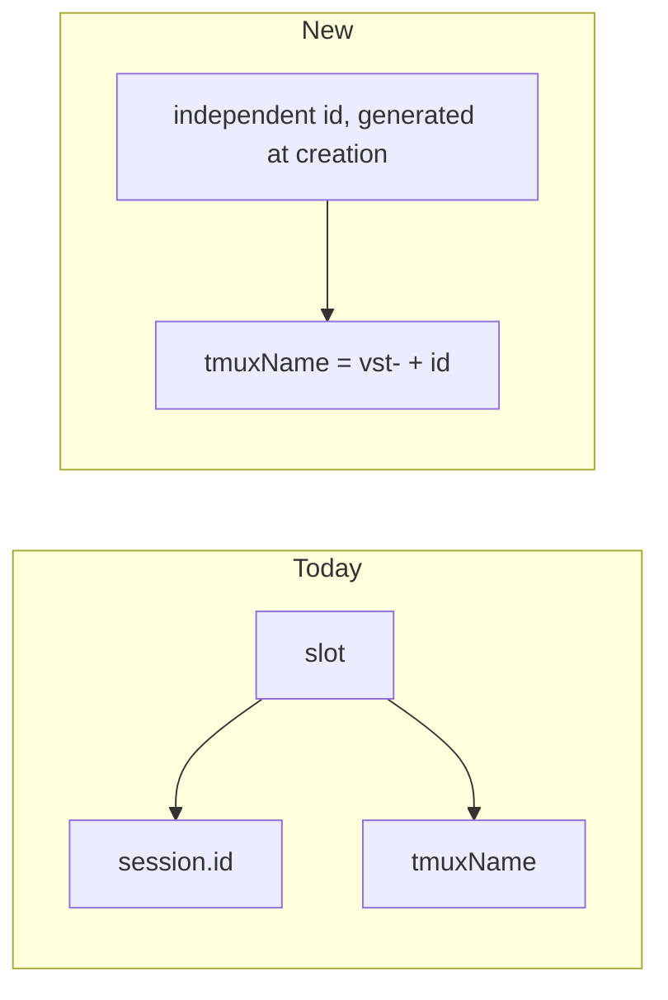
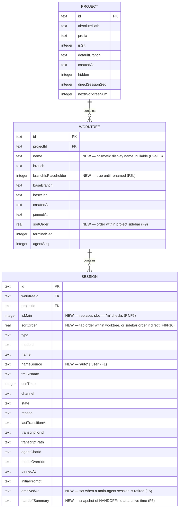
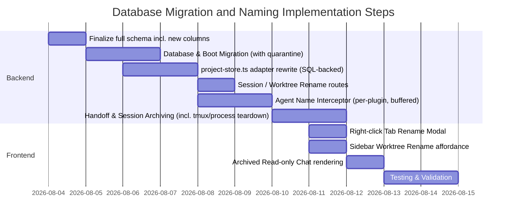

# PRD & Implementation Plan: vibe-station Workspace Database Migration & Agent Naming

> Grounded against actual daemon code (`services/manifest.ts`, `state/project-store.ts`,
> `services/sessionId.ts`, `routes/worktrees.ts`, `routes/sessions.ts`, `agent-plugins/*`,
> `ws/protocol.ts`, `services/sqliteTranscriptStore.ts`). Corrections to the original draft
> are marked **[CORRECTED]**. Full **Gaps / Edge Cases / Open Questions** at the end — read
> that before implementing anything.

---

## 1. Product Requirements Document (PRD)

### Problem Statement

| # | Problem | Reality check |
|---|---|---|
| 1 | **Static agent names** — tabs default to "main", "agent 1", etc. | — |
| 2 | **Required worktree name** at creation, want it optional | **[CORRECTED]** No "worktree name" field exists today. Identity is `${prefix}-${n}`, independent of git branch. What's actually required is the **branch name**. "Optional worktree name" is really two separate features → see F2. |
| 3 | **Un-editable chat/tab names** | No rename UI or `PATCH .../rename` route exists anywhere yet. |
| 4 | **Main agent context bloat** — need a clean reset without losing worktree state | — |
| 5 | **JSON storage fragility** — nested `manifest.json` per project | **[CORRECTED]** `better-sqlite3` is already a dependency, already used for per-session transcripts (WAL mode). Not a new library. An existing JSONL→SQLite migration (`transcriptMigration.ts`) sets the convention to mirror. |

### Core Features

| ID | Feature | Notes |
|---|---|---|
| F1 | Dynamic agent naming — model names itself turn 1, user rename always wins after | Applies to **both** worktree agents and direct agents — same mechanism, per-session not per-worktree |
| F2a | Cosmetic worktree display name (`name` column, branch untouched) | **Recommended for v1** |
| F2b | Placeholder branch name, renamed later via real `git branch -m` | Higher risk — optional/later |
| F3 | Rename worktrees/sessions from context menu | Shares plumbing with F2a |
| F4 | Main agent reset — currently hard-blocked (`slot === "m"` guard returns 400) | |
| F5 | Session archiving instead of delete — old main becomes read-only history | |
| F6 | Automated handoff briefing injected into the new main agent | |
| F7 | Central `vibe-station.db` replacing per-project `manifest.json` (metadata only, not transcripts) | |
| F8 | Drag-reorder agent/terminal tabs within a worktree | |
| F9 | Drag-reorder worktrees within a project sidebar | |
| F10 | Drag-reorder direct sessions within a project sidebar | |

> F8–F10 force a schema change that also simplifies F4/F5 — see "Slot refactor" below.

### Slot refactor (triggered by F8–F10)

`slot` (`m`, `a1`, `t1`, `d1`, ...) currently does three unrelated jobs:

| Job | Today | Problem |
|---|---|---|
| Uniqueness / reservation key | `agentSeq`/`terminalSeq`/`directSessionSeq` counters | fine on its own |
| tmux session name input | `buildTmuxName(prefix, worktreeNum, slot)` | ties naming to slot |
| Implicit display order | array insertion order in `manifest.json` | **F8 breaks this** — order becomes user-controlled |

Per your instruction: the only thing that still needs semantic meaning is **"is this the worktree's main agent or not."** Everything else about `slot` becomes purely internal/technical.

**Changes:**
- `sessions.isMain` (bool) — replaces every `slot === "m"` check (delete-guard, `mainSessionId` lookup, label derivation). Only one `isMain=1` per live worktree. Only meaningful when `worktreeId IS NOT NULL` → `CHECK (isMain = 0 OR worktreeId IS NOT NULL)`.
- `sessions.sortOrder` (REAL, fractional) — scope depends on `worktreeId`:
  - worktree tabs: `WHERE worktreeId = ?`
  - direct sessions: `WHERE worktreeId IS NULL AND projectId = ?`
- `worktrees.sortOrder` (REAL) — order within a project sidebar.

**Tmux naming: derive from `session.id`, not `slot`.**



- `session.id` is already the PK, but today it's **derived from slot**: `${worktreeId}-${slot}` (or `${projectId}-${slot}` for direct). `tmuxName` is separately derived from slot too. This coupling is the actual root cause of the archiving tmux-collision risk.
- Fix: generate `id` independently at creation (e.g. `${worktreeId}-${role}-${randomSuffix}` to stay greppable), then `tmuxName = "vst-" + sanitize(id)`. Pure function of something already unique — no collision-checking needed.
- Confirmed via grep: nothing else in the daemon parses a session id's substring to recover `worktreeId`/`slot` — safe to change on the daemon side. (web-ui not yet checked.)

**Consequences:**
- `slot` disappears entirely as identity — replaced by `isMain` (semantic) + `id` (identity/tmux) + `sortOrder` (display order).
- Archiving's tmux-collision bug is fixed structurally: a respawned main agent gets a brand-new `id` → brand-new tmux name, nothing to rename.
- `agentSeq`/`terminalSeq`/`directSessionSeq` counters lose their uniqueness job; their only remaining use is generating default labels ("Agent 3"), which can be computed on the fly instead of persisted.
- tmux names must avoid `:` — hyphens/alphanumerics are fine for `vst-<id>`.
- Trade-off: pure uuids lose today's readable id shape (`vs-3-m`) in logs — recommend `${worktreeId}-` prefix + short random suffix instead of full opacity.
- Refactor surface: `routes/sessions.ts` (id/tmux construction, label, delete-guard), `routes/worktrees.ts` (`mainSessionId`), `services/sessionId.ts` (`buildTmuxName`/`reserveNext*Slot`), and any web-ui code keying off `session.slot` — **needs a repo-wide grep in `web-ui/src`, not done yet.**
- **Rollout is grandfathered, not retroactive.** Existing sessions keep their current `id`/`tmuxName` as-is (migration just copies the columns). New scheme applies only to sessions **created after** this ships. No live tmux process gets renamed or restarted by either the SQLite migration or this refactor.

### Terminals in the schema

No separate table — same `sessions` row shape as agents, distinguished by `type: "terminal"`.

| Applies to terminals | Not applicable (NULL) |
|---|---|
| `name`, `tmuxName`, `useTmux`, `pinnedAt`, `sortOrder` | `modeId`, `agentChatId`, `channel`, `transcriptKind`/`transcriptPath`, `initialPrompt`, `nameSource` |

`isMain` is always `0` for terminals — only agents can be a worktree's main.

---

## 2. Focused Plan

### Architecture Diagram



### Central Database Schema

We will initialize `~/.vibe-station/vibe-station.db` using `better-sqlite3`, in **WAL mode** with `PRAGMA foreign_keys = ON` set on every connection open (SQLite defaults this off; without it the `ON DELETE CASCADE` constraints below silently no-op and orphan rows accumulate — see Gaps §7.6). Add a `_migrations`/`PRAGMA user_version` scheme from day one so this schema itself can evolve later.

| Table | Columns | Constraints |
|---|---|---|
| **projects** | `id` (TEXT PK), `absolutePath` (TEXT), `prefix` (TEXT), `isGit` (INTEGER), `defaultBranch` (TEXT), `createdAt` (TEXT), `hidden` (INTEGER), `directSessionSeq` (INTEGER), `nextWorktreeNum` (INTEGER) | None |
| **worktrees** | `id` (TEXT PK), `projectId` (TEXT FK), `name` (TEXT NULL, **new**), `branch` (TEXT), `branchIsPlaceholder` (INTEGER, **new**), `baseBranch` (TEXT), `baseSha` (TEXT), `createdAt` (TEXT), `pinnedAt` (TEXT NULL), `sortOrder` (REAL, **new**), `terminalSeq` (INTEGER), `agentSeq` (INTEGER) | FK `projectId` references `projects(id)` ON DELETE CASCADE; index on `projectId` |
| **sessions** | `id` (TEXT PK, **independently unique from creation — no longer `${worktreeId}-${slot}`**), `worktreeId` (TEXT NULL FK), `projectId` (TEXT FK), `isMain` (INTEGER, **new**), `sortOrder` (REAL, **new**), `type` (TEXT), `modeId` (TEXT NULL), `name` (TEXT NULL), `nameSource` (TEXT NULL, **new**), `tmuxName` (TEXT, **now derived as `"vst-" + id`, not from slot**), `useTmux` (INTEGER), `channel` (TEXT), `state` (TEXT), `reason` (TEXT NULL), `lastTransitionAt` (TEXT), `transcriptKind` (TEXT NULL), `transcriptPath` (TEXT NULL), `agentChatId` (TEXT NULL), `modelOverride` (TEXT NULL), `pinnedAt` (TEXT NULL), `initialPrompt` (TEXT NULL), `archivedAt` (TEXT NULL, **new**), `handoffSummary` (TEXT NULL, **new**) | FK `worktreeId` references `worktrees(id)` ON DELETE CASCADE, FK `projectId` references `projects(id)` ON DELETE CASCADE; indexes on `worktreeId`, `projectId` | No `slot` column at all — removed, not renamed. |

Note: `state`/`reason`/`lastTransitionAt` intentionally flatten `SessionRecord.lifecycle` (a nested object in the current `types.ts` model) into columns — a deliberate denormalization choice, not an oversight.

Note on `INTEGER` booleans (`isGit`, `hidden`, `isMain`, `useTmux`, `branchIsPlaceholder`): SQLite has no native boolean storage class — `BOOLEAN` is just an alias with `INTEGER` affinity, and `better-sqlite3` surfaces these as JS `0`/`1`, not `true`/`false`. `INTEGER` here is the accurate type, not a downgrade. This means the row↔object mapper in the adapter layer (F7) needs an explicit, consistent `Boolean(row.col)` coercion step wherever these map back onto the existing TS types (`ProjectRecord.hidden`, etc., which are real `boolean`) — worth a shared helper rather than ad hoc coercion at each call site.

Explicitly **out of scope**: transcript content, and `modes` (need to confirm where `modes.json` currently lives and whether it should migrate too — see Gaps §7.9).

---

### Step-by-Step Implementation Timeline



The original timeline understated the backend work: the `project-store.ts` adapter rewrite (every call site currently does synchronous in-memory `Map` reads/writes guarded by `mutateProject`'s per-project mutex — `routes/worktrees.ts`, `routes/sessions.ts`, `routes/projects.ts`, `services/lifecycle.ts`, `services/recover.ts` all touch it) is bigger than "Central SQL Project Store: 1 day" implied.

---

### Code Blueprint: Agent Naming Interceptor — **[CORRECTED per AGENTS.md plugin invariant]**

The original blueprint patched `daemon/src/services/jsonAgent.ts` directly with a freestanding system-prompt string and a `systemPromptPath` reference. That **violates the documented invariant** in this repo's guidelines: *"Every behaviour that differs between claude/cursor/opencode must be implemented as a method on `AgentPlugin`, not as an if/else... calling code must never inspect the CLI name."* And per the investigation, prompt delivery genuinely differs per plugin:
- `claude.ts` — system prompt via `--system-prompt "$(cat <file>)"` (file-based).
- `opencode.ts` — system prompt via `OPENCODE_CONFIG` env var (`getEnvironment`), not `composeLaunchPrompt`.
- `cursor.ts` — its own `composeLaunchPrompt` mechanism again.

Corrected approach: add a **new optional `AgentPlugin` method**, e.g. `injectNamingInstruction(basePrompt: string): string`, with a default implementation that just appends the instruction text, overridable per plugin if a CLI needs a different delivery mechanism (e.g. opencode may need it added to the env-var config object rather than the prompt string). Calling code (`jsonAgent.ts`) calls `resolvePlugin(cli).injectNamingInstruction(...)` — it never branches on CLI name itself.

The interception side is uniform, but with one real fix needed: normalized `text`/`role:"assistant"` events are common across `claude.ts`, `cursor.ts`, `opencode.ts`, `agy.ts` (all map into `NormalizedEvent`), so a `SESSION_NAME:` sentinel scan works on the **json channel** for all four CLIs. **It does not work at all for `tmux`/`pty` channel sessions** (no normalized event stream — raw terminal bytes only) — those need either a separate regex pass over captured pane text, or F1 is simply scoped to json-channel sessions only with tmux/pty sessions keeping their static `labelForSlot()` default (recommended — see Gaps §1.4).

The other concrete bug in the original snippet: it matches the sentinel against a single event's `ev.text`, assuming a full line arrives atomically. If the underlying CLI streams token-by-token deltas, `"SESSION_NAME:"` can be split across multiple events and the regex will simply never match. Buffer assistant text until the first `\n\n` (or a max char/event budget, to bound worst case) before running the regex, not per-event.

```typescript
// Location: daemon/src/services/jsonAgent.ts (buffering + plugin delegation)

let nameBuffer = "";
let nameResolved = false; // true once matched OR budget exceeded without a match

async function handleAssistantText(ev: NormalizedEvent) {
  if (nameResolved || ev.kind !== "text" || ev.role !== "assistant") return passThrough(ev);

  nameBuffer += ev.text ?? "";
  const boundary = nameBuffer.indexOf("\n\n");
  const budgetExceeded = nameBuffer.length > 200; // don't buffer forever on noncompliant output

  if (boundary === -1 && !budgetExceeded) {
    // Hold this event back; don't forward to UI/persist yet.
    return;
  }

  nameResolved = true;
  const match = nameBuffer.match(/^SESSION_NAME:\s*(.+)$/m);
  if (match && this.session.nameSource !== "user") { // never clobber a manual rename
    const cleanName = sanitizeName(match[1], { maxLen: 60 });
    await db.updateSessionName(this.session.id, cleanName, { nameSource: "auto" });
    this.session.name = cleanName;
    this.session.nameSource = "auto";
    broadcastAll({ type: "session:updated", sessionId: this.session.id, name: cleanName });
    nameBuffer = nameBuffer.replace(/^SESSION_NAME:\s*.+$\n*/m, "");
  }
  // Flush whatever remains of nameBuffer through the normal persist/stream path exactly once.
  ev.text = nameBuffer;
  passThrough(ev);
}
```

Also: `nameResolved` must be persisted per-session (not just an in-memory flag on a live handler object), otherwise a **resumed** session (daemon restart, or reconnect) re-enters turn 1 processing and could re-trigger naming or, worse, re-match a stray `SESSION_NAME:`-shaped line the model produces later in the conversation. Gate on a durable `hasParsedNameHeader` marker, not `firstTurnPending` alone.

---

### Code Blueprint: Handoff & Archiving Flow — **[CORRECTED, several missing steps added]**

#### 1. Ingesting Handoff Briefing into System Prompt (unchanged from original, still correct)
```typescript
// Location: daemon/src/services/promptBuilder.ts
import { access, readFile } from "node:fs/promises";
import { join } from "node:path";

async function getHandoffBriefing(wtPath: string): Promise<string> {
  const handoffPath = join(wtPath, ".vibe-station", "HANDOFF.md");
  try {
    await access(handoffPath);
    const content = await readFile(handoffPath, "utf8");
    return `\n\n## Handoff from Previous Agent Session\n\n${content}`;
  } catch {
    return "";
  }
}
```
Add `.vibe-station/HANDOFF.md` to the worktree's `.gitignore` at creation time (or a repo-root `.vibe-station/` ignore rule) so it doesn't get accidentally committed by the user's own agent.

#### 2. Archiving Active Session — corrected sequence
The original blueprint only updates the DB row and broadcasts. Missing: **(a)** waiting for/bounding the handoff turn, **(b)** actually tearing down the live process/tmux session (an "archived" session that keeps running as a zombie process is a real resource leak and defeats the "context reset" goal), **(c)** the tmux-name collision this creates, **(d)** persisting the handoff text somewhere durable instead of only a mutable file that the next cycle overwrites.

```typescript
// Location: daemon/src/routes/sessions.ts

app.post("/sessions/:id/handoff", async (req, reply) => {
  const { id } = req.params;
  const ctx = findSessionContext(id);
  if (!ctx || ctx.session.slot !== "m") {
    return reply.status(400).send({ error: "Handoff only supported for main agent" });
  }

  // 1. Instruct agent to write handoff details to file, with a bounded wait.
  const prompt = `
Please write a short summary of what you have done and what remains to be done.
Save this summary exactly as a markdown file at .vibe-station/HANDOFF.md.
  `;
  const handoffOk = await runHandoffTurn(ctx.session, prompt, { timeoutMs: 60_000 });
  const handoffText = handoffOk
    ? await readHandoffFileOrNull(ctx.worktreePath)
    : null; // proceed with archive even on timeout/failure — don't block the user's reset

  // 2. Tear down the live process/tmux session for the OLD session via the normal
  //    close path (session:close semantics, under the same per-(conn,sessionId) lock
  //    discipline used elsewhere) — do NOT just drop the DB row while a PTY lingers.
  await closeSessionRuntime(ctx.session.id);

  // 3. Archive slot 'm' session record in sqlite. The archived row's `slot` becomes
  //    a synthetic value; its `tmuxName` must also be regenerated/renamed (or nulled,
  //    since the process is dead) so a freshly-spawned slot-'m' session doesn't collide
  //    with `buildTmuxName(prefix, num, "m")`, which is deterministic from slot alone.
  const archiveSlot = `m-archive-${Date.now()}`;
  await db.archiveSessionSlot(id, archiveSlot, { handoffSummary: handoffText });

  // 4. Spawn the replacement main-agent session in the same worktree, reusing the
  //    worktreePath/branch but going through the same construction path as initial
  //    worktree creation (routes/worktrees.ts main-session block) — NOT shown in the
  //    original blueprint at all. This is new code, not a byproduct of archiving.
  const newMain = await spawnMainAgentSession(ctx.worktreeId);

  broadcastAll({ type: "session:updated", sessionId: id, archivedAt: new Date().toISOString() });
  broadcastAll({ type: "session:created", session: serializeSession(newMain) }); // shape TBD, see Gaps §4.7
  return reply.send({ ok: true, archivedSessionId: id, newSessionId: newMain.id });
});
```

---

### API Changes Table

| Verb | Path | Request Body | Response Body | Description |
|---|---|---|---|---|
| `PATCH` | `/sessions/:id/rename` | `{ name: string }` | `{ ok: true, name: string }` | Sets `name` + `nameSource: "user"`. Once set, auto-naming (F1) must never overwrite it. |
| `PATCH` | `/worktrees/:id/rename` | `{ name: string }` | `{ ok: true, name: string }` | **[CORRECTED]** Sets the new cosmetic `worktrees.name` column (F2a/F3). Does **not** touch the git branch or `wtId` — those stay stable so `TerminalPane`'s "same tree position for the session lifetime" invariant is never at risk from a rename. |
| `PATCH` | `/worktrees/:id/branch` | `{ branch: string }` | `{ ok: true, branch: string }` | **NEW, separate from the above.** Only exists if F2b (real git branch rename) is greenlit — see Gaps §2. Distinct endpoint so the low-risk cosmetic rename and the high-risk branch rename can't be triggered by the same call. |
| `POST` | `/sessions/:id/handoff` | `{}` | `{ ok: true, archivedSessionId, newSessionId }` | Generate handoff, tear down old runtime, archive slot `m`, spawn replacement slot `m`. |
| `DELETE` | `/sessions/:id` | None | `{ ok: true }` | **[CORRECTED]** Still blocked for a *live* `slot === "m"` session — that guard is correct and should stay. What changes: once a session has been archived (its `slot` is now `m-archive-<ts>`, no longer literally `"m"`), the existing guard already permits deleting it, for free — but confirm that's the intended cleanup path, and add a retention policy/cap so archived rows+transcripts don't grow unbounded (Gaps §4.6). |

---

### UI Mockups (Carousel of Changes)

````carousel
```tsx
// 1. Right Click Tab Context Menu
<div className="tab-context-menu">
  <button onClick={openRenameModal}>Rename Agent</button>
  <button onClick={triggerHandoff}>Reset & Handoff</button>
  {closeable && <button onClick={closeTab}>Close tab</button>}
</div>
```
<!-- slide -->
```tsx
// 2. Sidebar Option menu
<div className="menu-pop">
  <button onClick={openRenameModal}>Rename</button>
  <button onClick={pinToTop}>Pin to top</button>
  <button onClick={markDone}>Mark as done</button>
  <button onClick={deleteWorktree} className="menu-pop__item--danger">Delete...</button>
</div>
```
<!-- slide -->
```tsx
// 3. Archived Chat composer disabled state
<div className="chat-composer chat-composer--archived">
  <textarea disabled placeholder="This session has been archived. Start a new agent to continue." />
</div>
```
<!-- slide -->
```tsx
// 4. Where archived sessions live in the tree — NOT addressed by the original mockups.
// Needs an explicit decision: collapsed "History" sub-section under the worktree,
// vs. inline in the tab strip greyed out, vs. hidden-by-default behind a toggle.
// See Gaps §4.5.
```
````

---

## 3. Gaps / Edge Cases / Open Questions

### F1 — Naming
- Naming instruction must be injected via a new `AgentPlugin` method, not a freestanding string in `jsonAgent.ts` — claude/cursor/opencode each deliver system prompts differently.
- Sentinel regex must buffer across streamed chunks (line/paragraph boundary or size budget) — matching per-event will miss split sentinels.
- "Already parsed name" flag must be durable (DB), not in-memory — must survive daemon restart / session resume.
- No normalized event stream exists for `tmux`/`pty` channel sessions → decide: scope F1 to `channel: "json"` only (recommended), or build a separate regex-over-pane-text path.
- Manual rename must always beat auto-name — needs `nameSource: "auto"|"user"` and check-before-write.
- Fallback when model never emits the sentinel: existing `labelForSlot()`-style default. State this explicitly.
- Sanitize: max 60 chars, strip newlines/control/markdown before persisting.
- Applies equally to direct agent sessions, not just worktree agents (per your note) — implement against `sessions.id` generically, never gated on `worktreeId` presence.
- Open Q: keep the raw (unstripped) sentinel line in the persisted transcript for debugging, or strip everywhere?

### F2 — Optional Worktree/Branch Naming
- This is two features — pick which ship:
  - F2a: cosmetic `worktrees.name`, branch untouched. Low risk. **Recommended for v1.**
  - F2b: placeholder branch name, real `git branch -m` rename later. Higher risk (below).
- F2b risk: renaming invalidates `baseBranch` on any sibling worktree already based off the placeholder.
- F2b risk: renaming after the placeholder branch is already pushed orphans the remote branch / forces a rename-push.
- F2b: placeholder name scheme needs to pass `validateBranch()` (e.g. `wip/<prefix>-<n>`).

### F3 — Custom Sidebar Labels
- Same rename plumbing as F2a — implement once.
- Max length 60 chars, matching terminal-name convention.
- No cascade effects elsewhere (tmux names/paths untouched by a cosmetic rename).

### F4/F5/F6 — Main Agent Reset, Archiving, Handoff
- Old tmux/PTY process must be torn down through the normal close path (WS lock discipline) before/while archiving — not left running.
- Handoff turn needs a timeout + "proceed without notes" fallback — don't block reset indefinitely.
- Snapshot handoff text into the archived row (`handoffSummary`) — a mutable `HANDOFF.md` file gets overwritten by the next reset cycle, losing prior history.
- Open Q: where do archived sessions live in the UI (collapsed history section / greyed tab / hidden by default)? Not decided.
- Open Q: retention policy for archived sessions + their transcripts — currently unbounded growth.
- Respawning the new main-agent session after archive is new code (share the construction path used at worktree creation), including re-running the handoff-briefing injection and whatever `session:created` broadcast shape exists (or needs adding).
- Verify no code assumes "a worktree always has exactly one live main session" before allowing a brief zero-main window during reset.
- `.vibe-station/HANDOFF.md` should be gitignored by default; must tolerate `git clean` removing it mid-read.
- New/changed WS broadcast fields (`isMain`, `archivedAt`, `handoffSummary`) require editing the `ws/protocol.ts` zod union — not automatic.
- Tmux-collision risk from archiving is now fixed structurally (id-derived tmux names, see "Slot refactor" above) — no runtime rename/null-out step needed on archive.

### F7 — SQLite Migration
- Finalize full schema (incl. all new columns from F1–F6, F8–F10) before writing the boot migration — avoid a second migration later.
- Decide: SQLite as sole source of truth (recommended) vs. in-memory cache in front of it — affects every existing call site (`routes/worktrees.ts`, `routes/sessions.ts`, `routes/projects.ts`, `services/lifecycle.ts`, `services/recover.ts`, `state/project-store.ts`).
- Boot migration must be per-project try/catch + quarantine — one bad project shouldn't block daemon boot for everyone.
- Needs a schema-version marker for idempotent re-runs and crash-mid-migration recovery.
- Keep old `manifest.json` files on disk post-migration for at least one release, as rollback safety net.
- Must set `PRAGMA foreign_keys = ON` per connection or `ON DELETE CASCADE` silently no-ops.
- Confirm existing daemon-lock (`acquireLock()`) actually covers two daemons fighting over one shared `vibe-station.db`.
- Reuse existing per-session-transcript SQLite conventions (WAL, single-writer, `migrateJsonlIntoDb` pattern) instead of inventing new ones.
- Open Q: does `modes.json` (or wherever modes live) move into this DB too, or stay out of scope?
- Add indexes on `worktrees.projectId`, `sessions.worktreeId`, `sessions.projectId`.

### F8/F9/F10 — Reordering (new)
- No drag-and-drop library currently in `web-ui/package.json` — need to add one (e.g. `dnd-kit`).
- Use fractional/rank-based `sortOrder` (not sequential integers) so a single drag only rewrites the moved row, not all siblings — avoids write amplification and reorder races between clients.
- Three independent ordering scopes, don't conflate them: (1) `sessions.sortOrder` among agent+terminal tabs within one worktree, (2) `worktrees.sortOrder` among worktrees within one project, (3) `sessions.sortOrder` among direct sessions within one project sidebar list — same column, different `WHERE` scope.
- Open Q: does the left sidebar render worktrees and direct sessions as one merged reorderable list, or two separate lists? Determines whether they share a sort scope or need two.
- Open Q: direct **terminals** also exist (`d{n}` slot today) — is reordering scoped to "direct agents" only as stated, or should direct terminals reorder too, in the same list?
- Existing `d{n}`/`a{n}`/`t{n}` high-water-mark parsing (`sessionId.ts`, `startsWith("a"/"t"/"d")`) goes away with `slot` itself — replace with a display-only ordinal if the default "Agent N"/"Terminal N" labels still need one (see "Slot refactor").
- Need to grep `web-ui/src` for any place that currently keys off `session.slot` or array order for display/sort — not yet done, required before implementation.
- Default `sortOrder` on creation = append-to-end (max existing + gap), not always 0.

### Sequencing
- Recommended order: finalize complete schema (F1–F6 + F8–F10 columns) → boot migration + adapter rewrite (F7, incl. slot refactor) → rename endpoints (F2a/F3) → reordering (F8–F10) → naming interceptor (F1) → archiving/handoff (F4/F5/F6).
