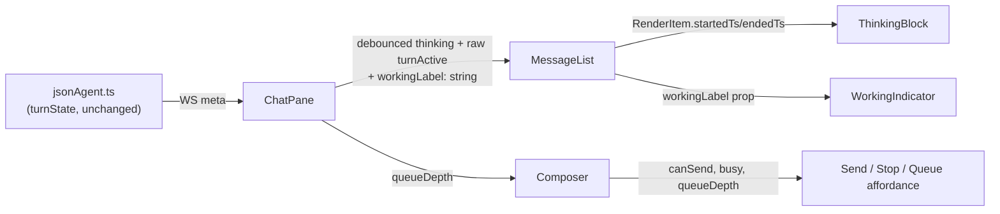

<!--
RULES — read before writing or implementing:
1. FORMAT: Bullets, tables, code, diagrams ONLY — no prose paragraphs
2. REQUIREMENTS: One crisp line each — no verbose descriptions
3. CHECKLIST: Mark items [x] as you complete them — this is your persistent todo list
4. READING TIME: Optimize for fast human scanning — if it's hard to skim, rewrite it
-->

# Plan: Rich chat — consolidated thinking indicator, scroll-lock fix, dot/spinner polish, composer send-while-busy

> Bundles all 6 issues from the source investigation report into one plan (small, related UI-polish fixes — same convention as `chat-working-indicator-scroll-grow`).

**Issue:** chat-thinking-scroll-send
**Branch:** `issues-block-dots` (current branch)
**Status:** Pending
**PRD:** none — small, skipped
**Source report:** `.vibekit/reports/2026-08-24-rich-chat-block-indicators-and-scroll.md` (commit `13daa00` — current `HEAD`, all cited line numbers verified against it)

**Reference files:**
- `web-ui/src/components/chat/MessageList.tsx:12-19` (`RenderItem`), `:77-170` (`groupEvents`), `:172-219` (`ThinkingHint`/`WorkingIndicator`), `:285-289` (primary scroll effect), `:307-324` (resize-scroll effect), `:452-468` (render/mount points)
- `web-ui/src/components/chat/ThinkingBlock.tsx:13-43`
- `web-ui/src/components/layout/ChatPane.tsx:84-88` (`turnActive`/`thinking`), `:197-211` (`MessageList` props), `:242-256` (`Composer` props)
- `web-ui/src/components/chat/Composer.tsx:96` (`canSend`), `:188-202` (Send/Stop branch)
- `web-ui/src/components/chat/StatusBar.tsx:22-39` (`turnLabel`), `:103-104` (spinner)
- `web-ui/src/styles/chat.css:701-751` (`.chat-thinking-hint`/`.chat-working-indicator`), `:344-368` (`.chat-thinking`), `:912-918` (`.chat-statusbar__state`), `:1073-1082` (`.chat-spinner`)
- `daemon/src/services/jsonAgent.ts` — unchanged, reference only (see Root Cause)
- `web-ui/src/api/types.ts:188-215` (`NormalizedEvent.ts`, `logSeq`)

---

## Problem

- "Thinking…" flickers and duplicates: `turnState` recomputes per-event and two different components (`ThinkingHint`, `ThinkingBlock`) both render a "Thinking…" label that mount/unmount independently — `MessageList.tsx:126-134,175-182,336,452-468`
- The live "Thinking…" label never resolves to a completed "Thought for Xs" summary — no timestamp reaches the renderer — `MessageList.tsx:12-19`
- Auto-scroll yanks the view to bottom on every content change even when the user has scrolled up to read history — `MessageList.tsx:285-289` (only the resize path has a near-bottom guard, `:307-324`)
- Working-indicator dots are oversized (6px/4px gap) — `chat.css:730-750`
- A redundant circular spinner duplicates the in-feed working indicator in the footer `StatusBar` — `StatusBar.tsx:104`
- Composer hides the Send button behind Stop whenever the agent is busy, even with text ready to send/queue — `Composer.tsx:188-201`

## Out of Scope

- Virtualizing/windowing the message list
- Redesigning `StatusBar` beyond removing the spinner (token/model/mode row, channel toggle untouched)
- Changing the queue/tray UI itself (`QueuedTray.tsx`) beyond the Composer button affordance
- `daemon/src/services/jsonAgent.ts` — unchanged, reference only; the anti-flicker fix (Decision 2) is entirely client-side in `ChatPane.tsx`, no provider-cadence or event-mapping change
- Browser/device verification — no browser tool available this session (same constraint as the precedent plan); vitest + typecheck only

## Concept

- One live "working" affordance at a time: drop `ThinkingHint` entirely; `ThinkingBlock` (per-block) and the trailing `WorkingIndicator` (turn-level) are the only busy affordances, and `WorkingIndicator` now carries the turn-state label text
- `thinking`/turn-state display values are debounced client-side so rapid `turnState` oscillation no longer flickers the UI (raw `turnActive` stays undebounced for gating Composer/Stop)
- Consecutive same-turn thinking bursts merge into one `RenderItem` across intervening tool calls, and gain `startedTs`/`endedTs` so the block can show "Thought for Xs" once done
- Auto-scroll respects a near-bottom guard on every content-change trigger (not just resize), plus a floating jump-to-bottom button when the user has scrolled away
- Dots shrink to 4px/3px gap; the footer spinner is removed since the in-feed indicator now carries the same information
- Composer branches on `canSend`, not raw `busy` — Send stays visible and queues while busy, Stop only shows when busy with an empty box

## Requirements

| # | Requirement |
|---|-------------|
| 1 | Exactly one live "Thinking…"/working affordance renders at any moment — no simultaneous `ThinkingHint` + `ThinkingBlock` + `WorkingIndicator` |
| 2 | Rapid `turnState` oscillation (thinking→tool→thinking within one turn) does not visibly flicker the label or swap components |
| 3 | A tool call between two same-turn thinking bursts does not create two separate "Thinking…" blocks |
| 4 | A completed thinking block shows "Thought for Xs" (rounded seconds); a still-live block keeps showing "Thinking…" |
| 5 | Auto-scroll only force-scrolls to bottom when the user is already within 80px of bottom, OR the scroll is caused by the user's own send; a floating jump-to-bottom button appears otherwise |
| 6 | Working-indicator dots are 4px with 3px gap |
| 7 | `StatusBar` no longer renders a circular spinner; `.chat-spinner` remains available to `ToolRunSummary` and `ChatPane`'s history-loading state |
| 8 | The in-feed `WorkingIndicator` shows `<turn-state label> •••`, label and dots bottom/baseline-aligned (`align-items: last baseline`, fallback `baseline`) — not center-aligned |
| 9 | Composer shows Send (queues) whenever `canSend` is true, even while busy; Stop shows only when `busy && !canSend` (busy with no text/attachment ready — includes disabled/mid-`sending`) |
| 10 | While busy and `canSend`, the Send affordance is visually distinct from idle Send (signals "will queue" rather than "sends now") |

---

## Research

### Thinking flicker/duplication (issues 1+2)

- **File:** `daemon/src/services/jsonAgent.ts:968-969` (`updateTurnState` + `emitMeta` run per persisted event), `:1000-1024` (`updateTurnState` switches per `NormalizedEventKind`)
- **Trigger:** every `thinking`/`text`/`tool_use` event flips `turnState`; `ChatPane.tsx:88` maps this straight into the `thinking` boolean
- **Risk:** HIGH — root cause of both the flicker and the duplicate-label issues

- **File:** `MessageList.tsx:126-134` (`groupEvents`, `thinking` case) — only merges an event into the *immediately preceding* item; a `tool_use`/`tool_result` in between starts a new `thinking` `RenderItem`
- **File:** `MessageList.tsx:175-182` (`ThinkingHint`, global) vs `ThinkingBlock.tsx:18-24,32` (per-block) — two independently-mounted "Thinking…" labels
- **File:** `MessageList.tsx:329-336,452-453,463,468` — `ThinkingHint` mount points; `WorkingIndicator` gated `turnActive && !thinking` at `:468` (widens to plain `turnActive` per Decision 1 — see that decision for why the narrower gate is a latent regression once `ThinkingHint` is deleted)

### No elapsed-time data (issue 2)

- **File:** `MessageList.tsx:12-19` — `RenderItem` union carries no timestamp for any variant
- **File:** `web-ui/src/api/types.ts:191` — `NormalizedEvent.ts: string` (ISO) exists on every raw event, discarded during grouping

### Scroll-stealing (issue 3)

- **File:** `MessageList.tsx:285-289` — unconditional `bottomRef.current?.scrollIntoView(...)` on `[items.length, pending.length, thinking, turnActive]`
- **File:** `MessageList.tsx:307-324` — the *only* near-bottom guard (`distance < 80`) lives in the ResizeObserver-driven footer-resize path, added by the precedent plan; it does not cover the primary content-change path
- **Risk:** HIGH — `thinking`/`turnActive` in the primary effect's deps flip constantly per issue 1, so the yank fires repeatedly mid-turn

### Dot sizing (issue 4)

- **File:** `chat.css:713-719` (`.chat-thinking-hint__dot`, 6px, deleted alongside `ThinkingHint` — see Decision 1) and `:740-750` (`.chat-working-indicator__dot`, 6px/4px gap, kept and resized)

### Footer spinner + label plumbing (issue 5)

- **File:** `StatusBar.tsx:22-39` (`turnLabel`, the only source of the "Thinking…"/"Responding…"/"Running tool…" strings today), `:104` (spinner span to delete)
- **File:** `ToolRunSummary.tsx:113,177`, `ChatPane.tsx:188` — other `.chat-spinner` consumers, must NOT be touched
- **Risk:** LOW for the spinner deletion (no test asserts it — `grep -n "spinner" web-ui/src/components/chat/*.test.tsx` → no output); MEDIUM for the label plumbing (new prop threading `ChatPane` → `MessageList` → `WorkingIndicator`)

### Composer Send/Stop (issue 6)

- **File:** `Composer.tsx:96` (`canSend`, computed but unused while `busy`), `:188-201` (branch), `:98-118` (`handleSend`/`onKeyDown` — Enter already silently queues while busy, just with no button feedback)
- **File:** `ChatPane.tsx:217` (`queueDepth={trayRows.length}` already computed for `StatusBar`, reusable for a queue-count badge), `:252` (`busy={turnActive}` passed to `Composer`)

## Root Cause

- Issues 1–2: `turnState` is recomputed and re-broadcast per raw event with no debounce, and two independent components both key off it as a boolean/absence signal instead of sharing one owned "working" affordance
- Issue 3: the primary scroll effect predates the near-bottom guard added for the (unrelated) resize path in the precedent plan and was never retrofitted
- Issues 4–6: sizing/spinner/branching gaps explicitly left out of scope by the precedent plan, not new regressions

---

## Architecture Diagram

- Single-module change within `web-ui`'s chat component tree — no new service boundary. One diagram covers the new prop flow for the label (issue 5) and timestamps (issue 2):



---

## Design Details

### Critical User Journeys (CUJs)

#### CUJ 1 — Agent thinks through a tool-heavy turn

```
User sends a message
  → Agent emits thinking → tool_use → tool_result → thinking → text (same turnId)
  → MessageList renders ONE thinking block, label "Thinking…" while live
  → Turn completes → label flips to "Thought for 6s" (no flicker, no duplicate block)
  → WorkingIndicator disappears once turnActive goes false
```

- **Edge case:** turn ends (idle/error) with an open thinking block and no trailing `text` event → the turn's `result`/`error`/`status` event closes the group inside `groupEvents` itself (Decision 3), so the block still resolves to "Thought for Xs" instead of staying stuck on "Thinking…" — this also works correctly for a COLD-LOADED/replayed transcript, since `groupEvents` re-derives closes from the persisted event stream, not from a live effect

#### CUJ 2 — User scrolls up mid-stream, then sends a new message

```
User scrolls up to re-read earlier history while a turn streams
  → New tokens/tool events arrive → distance-to-bottom > 80px → no forced scroll
  → Floating jump-to-bottom button appears (bottom-right of the scroll viewport)
  → User clicks the button → scrolls to bottom, button hides
  → User instead types and sends a new message → composer send scrolls to bottom unconditionally (pending bubble growth), independent of the 80px guard
```

- **Error path:** `ResizeObserver`/ scroll container unavailable (SSR/test env) → guard degrades to no-op, no crash (same fallback pattern as the existing resize effect at `MessageList.tsx:309`)

### Data Model

- None — nothing persisted. `startedTs`/`endedTs` (Decision 3/4) are derived in-memory from existing `NormalizedEvent.ts` values on every `groupEvents` call, not stored; `displayTurnState`/`atBottom` (Decisions 2, 5) are ephemeral component state.

### Key Decisions

#### Decision 1: Drop `ThinkingHint`, consolidate into `ThinkingBlock` + `WorkingIndicator`

- **Decision:** delete the `ThinkingHint` component and both its mount points, rather than suppressing it conditionally; **also** widen the `WorkingIndicator` gate from `turnActive && !thinking` to plain `turnActive` — the `!thinking` exclusion existed ONLY to avoid double-rendering against `ThinkingHint`, and deleting `ThinkingHint` without this change leaves NO busy affordance during the `thinking` sub-state (a regression, not neutral)
- **Rationale:** two live components tracking the same signal is the actual duplication bug (Req 1); a single owned affordance per level (per-block vs per-turn) is simpler than a suppression flag and removes an `aria-live` region we'd otherwise have to keep in sync; widening the gate restores continuous coverage across the whole busy window (thinking → tool → responding)
- **Where:** `MessageList.tsx:172-182` (delete `ThinkingHint`), `:326-336` (`hintAfterPending`/`hintAfterItem` computations — delete), `:452-453,463` (mount points — delete), `:465-467` (delete the comment justifying the old `!thinking` exclusion — no longer true), `:468` (gate becomes `{turnActive ? <WorkingIndicator label={workingLabel} /> : null}`); `chat.css:701-726` (`.chat-thinking-hint*` rules + keyframes — delete, dead after component removal)
- Accessibility: `WorkingIndicator` already has `role="status" aria-live="polite"` (`MessageList.tsx:208`) — this becomes the sole live-region for turn-level busy state, preserving the announcement `ThinkingHint` provided

#### Decision 2: Client-side debounce of display-facing turn state, raw `turnActive` untouched

- **Decision:** in `ChatPane.tsx`, derive a debounced `displayTurnState` (trailing ~250ms: only commit a new `meta?.turnState` value to display state after it holds for the debounce window) and use it for `thinking` and the new `workingLabel`; keep the existing undebounced `turnActive` (`ChatPane.tsx:84-87`) as-is for Composer/Stop gating
- **Rationale:** Composer's busy/Stop button must reflect real busy state instantly (a debounced `turnActive` could let a user click Send mid-turn right as it ends); only the *display* label/thinking-block swap needs smoothing — narrower blast radius than debouncing meta emission in `jsonAgent.ts`, and other untraced meta consumers (see report "Not checked") aren't touched
- **Where:** `ChatPane.tsx:84-88`
- **Implementer note:** `ChatPane.tsx:1` currently imports `{ useCallback, useMemo, useRef, useState }` from `"react"` — no `useEffect` yet; add it to this import line, the snippet below depends on it

```ts
// ChatPane.tsx — debounce ONLY the value used for display (label, thinking-block
// swap); turnActive stays raw so Stop/Composer react to real busy state immediately.
const [displayTurnState, setDisplayTurnState] = useState(meta?.turnState);
useEffect(() => {
  const id = setTimeout(() => setDisplayTurnState(meta?.turnState), 250);
  return () => clearTimeout(id);
}, [meta?.turnState]);
const thinking = displayTurnState === "thinking"; // was: meta?.turnState === "thinking"
```

#### Decision 3: Merge same-turn thinking bursts across tool calls via an open-group map, closed DETERMINISTICALLY INSIDE `groupEvents`

- **Decision:** track `thinkingOpenByTurnId: Map<turnId, itemIndex>` in `groupEvents`, mirroring the existing `toolIndexById` pattern (`MessageList.tsx:79,136-138`); a `thinking` event with non-empty trimmed text, for a turn with an open entry, appends to that item (even after intervening `tool_use`/`tool_result`); the open entry is closed (sets `endedTs`, deletes the map entry) by whichever of these happens FIRST: (a) a `text` event for that turn, (b) a `result`/`error`/`status` event for that turn (the existing `default:` branch at `MessageList.tsx:164-166` already receives these — add the close there too), or (c) the first event for a DIFFERENT `turnId` (a new turn starting always implies the prior turn's reasoning is over)
- **Why NOT the effect-based approach (rejected):** `items` is `useMemo(() => groupEvents(events), [events])` (`MessageList.tsx:272`) — mutating a memoized item from a `useEffect` after the fact triggers no re-render and is discarded on the next `events` change (a trailing `usage`/`result` event guarantees one happens almost immediately), so the label would revert to "Thinking…" permanently. It also does nothing for a REPLAYED/reloaded transcript, since no live turn-transition effect ever runs for history that loads already-idle — any thinking block not followed by a `text` event in the persisted log would show "Thinking…" forever after a page refresh. Closing the group inside the pure `groupEvents` function fixes both: it's re-derived correctly on every `events` change, and it works identically for live streams and replayed history
- **Empty-text guard (regression fix):** only `thinking` events with `ev.text.trim().length > 0` open or append to a group; an empty/signature-only thinking event does NOT open a group and does NOT get appended into an open one. Without this guard, the existing `mergeToolRuns` drop-rule at `MessageList.tsx:44-47` (which drops an empty `thinking` item sitting between two tool calls so they merge into one `toolRun`) breaks: under a naive open-group merge, that empty item would get thinking text appended into it by a LATER same-turn thinking event, so it's no longer empty by the time `mergeToolRuns` runs — `mergeToolRuns` stops dropping it, and two tool calls that previously merged into one run now render as two separate runs with reasoning wedged in between. Skipping empty-text events entirely in the grouping step (they contribute no content and no timing) avoids ever putting text into what should stay a drop candidate
- **Rationale:** matches the requirement ("merge … across intervening tool calls") while still treating a real reply, a terminal turn event, or a new turn as the natural end of a reasoning burst; closing inside `groupEvents` avoids the stale-memo bug and handles cold-loaded history for free
- **Where:** `MessageList.tsx:126-134` (thinking case), `:77-83` (map declarations), `:114-124` (`text` case — add close), `:151-163` (`error`/`status` cases — add close), `:164-166` (`default:` branch, i.e. `session_init`/`usage`/`result` — add close), `:44-47` (empty-item drop rule in `mergeToolRuns` — now only ever sees empty items, since Decision 3 never creates a non-empty one from a formerly-empty entry)

```ts
// groupEvents — replaces the "only merge into the immediately-preceding item" rule.
// Closing happens INSIDE this pure function (text / result-error-status / new-turnId),
// never via a post-hoc effect — see "Why NOT the effect-based approach" above.
function closeOpenThinking(turnId: string | undefined, ts: string) {
  if (!turnId) return;
  const openIdx = thinkingOpenByTurnId.get(turnId);
  const open = openIdx != null ? items[openIdx] : undefined;
  if (open && open.type === "thinking" && !open.endedTs) open.endedTs = ts;
  thinkingOpenByTurnId.delete(turnId);
}

// At the TOP of the per-event loop: any event for a turnId different from the
// currently-open one closes that prior turn's thinking group first.
for (const [openTurnId] of thinkingOpenByTurnId) {
  if (ev.turnId && ev.turnId !== openTurnId) closeOpenThinking(openTurnId, ev.ts);
}

case "thinking": {
  if ((ev.text ?? "").trim().length === 0) break; // empty/signature-only: never opens or appends (mergeToolRuns drop rule)
  const openIdx = ev.turnId ? thinkingOpenByTurnId.get(ev.turnId) : undefined;
  const open = openIdx != null ? items[openIdx] : undefined;
  if (open && open.type === "thinking" && !open.endedTs) {
    open.text += ev.text ?? "";
  } else {
    items.push({ type: "thinking", id: ev.id, text: ev.text ?? "", turnId: ev.turnId, startedTs: ev.ts });
    if (ev.turnId) thinkingOpenByTurnId.set(ev.turnId, items.length - 1);
  }
  break;
}
case "text":
  closeOpenThinking(ev.turnId, ev.ts);
  // ...existing merge logic unchanged...
  break;
case "error":
  closeOpenThinking(ev.turnId, ev.ts);
  // ...existing push unchanged...
  break;
case "status":
  closeOpenThinking(ev.turnId, ev.ts);
  // ...existing conditional push unchanged...
  break;
default:
  // session_init / usage / result — also close any open group for this turn.
  closeOpenThinking(ev.turnId, ev.ts);
  break;
```

#### Decision 4: `RenderItem` gains `startedTs`/`endedTs`, `ThinkingBlock` renders "Thought for Xs" as a footer row

- **Decision:** add `startedTs: string; endedTs?: string` to the `thinking` variant of `RenderItem`; `ThinkingBlock` accepts them as props and renders a second, smaller footer line below `__body` (open state) or replaces "Thinking…" with "Thought for Xs" in the toggle label once `endedTs` is set (closed/static state) — per report §2, "or a second footer row" is the lower-risk option since the toggle button itself must stay usable while collapsed
- **Rationale:** avoids restructuring the click target; the toggle label switches text on completion (always visible, closed or open), the footer row is additive only when open
- **Where:** `MessageList.tsx:12-19` (add fields, computed via Decision 3), `ThinkingBlock.tsx:4-8` (props), `:18-24` (static/no-content label text), `:34` (toggle label text), `:36-40` (add footer row when `open && endedTs`)

```tsx
// ThinkingBlock.tsx — label text is the only place elapsed time renders.
const label = endedTs
  ? `Thought for ${Math.round((Date.parse(endedTs) - Date.parse(startedTs)) / 1000)}s`
  : "Thinking…";
// ...__toggle uses {label} instead of the literal "Thinking…" (both static and interactive cases)
// ...when open: <div className="chat-thinking__summary">{label}</div> rendered AFTER __body
```

#### Decision 5: Near-bottom guard on the primary scroll effect + jump-to-bottom button

- **Decision:** replace the unconditional `scrollIntoView` at `MessageList.tsx:285-289` with an `atBottomRef`-guarded check (pre-render at-bottom state captured by the scroll listener below), NOT a fresh post-render `distance` measurement like `:311` — see the implementer note below for why; scoped to `listRef.current?.parentElement`; add an explicit "own send" bypass so the guard never blocks the snap-to-bottom a user expects right after sending; **in scope** for this plan alongside the guard itself, decided explicitly below (not silently added)
- **Rationale:** matches Req 5; "own send" bypass keeps the one case (`pending.length` growing from the user's own optimistic bubble) where a forced scroll is always correct
- **Scope call (issue 3 didn't ask for this, addressing reviewer note):** none of the 6 source issues requested a jump-to-bottom button — issue 3 only asked to stop the unwanted yank. It's included anyway because the guard alone is a regression on its own: today the view ALWAYS reaches bottom eventually (annoying but never stuck); once the guard suppresses auto-scroll while scrolled up, a user who scrolls away during a long/streaming turn has NO way back to the live edge without manually dragging the scrollbar past fast-arriving content — a plain scroll gesture competing with new DOM height is unreliable. The button is the minimum companion affordance, not scope creep for its own sake; it stays IN SCOPE. Visual placement is unverified this session (Risk #3) but the interaction logic (2.T4) is fully unit-testable
- **Where:** `MessageList.tsx:285-289`
- **Implementer note:** `MessageList.tsx:1` currently imports `{ useEffect, useMemo, useRef, useState }` — add `useLayoutEffect` to this line for the snippet below

```ts
// MessageList.tsx — primary content-change scroll, now guarded.
// MUST be useLayoutEffect, not useEffect: the distance check needs to read
// layout BEFORE the browser paints the just-added content, and the decision
// of whether to measure "was near bottom" must be made from state captured
// BEFORE this render's DOM mutation, not after — see the `atBottomRef`
// note below for why a plain post-render measurement is unsound.
const prevPendingLen = useRef(pending.length);
useLayoutEffect(() => {
  const container = listRef.current?.parentElement;
  const ownSend = pending.length > prevPendingLen.current; // user just sent → always snap
  prevPendingLen.current = pending.length;
  if (!container) { bottomRef.current?.scrollIntoView({ block: "end" }); return; }
  // Distance is measured AFTER this render's new content is already in the DOM
  // (unavoidable — the content that determines new scrollHeight must exist to
  // measure it) — so a single render that appends a lot of height (a large
  // tool card, a batched token flush) could read distance >= 80 even though
  // the user was following along right up to that append, silently dropping
  // them out of follow-mode mid-stream. Mitigation: reuse the `atBottom`
  // scroll-listener state (below) as the decision input instead of a fresh
  // measurement here — `atBottom` reflects whether the user was at bottom
  // BEFORE this render's content landed, which is the intent-preserving check.
  if (ownSend || atBottomRef.current) container.scrollTop = container.scrollHeight;
}, [items.length, pending.length, thinking, turnActive]);
```

- Jump-to-bottom button: new `atBottom` state (mirrored into `atBottomRef` for the layout effect above to read without adding it as a dependency) driven by a `scroll` listener on the same `container` (recomputing `distance < 80` on scroll — separate concern from the ResizeObserver path, which already avoids caching per the precedent plan's Decision 4 fix); button renders inside `.chat-message-list`'s parent wrapper, `position: absolute; bottom: <above footer>; right: var(--space-3)`, shown only when `!atBottom`, `onClick` sets `container.scrollTop = container.scrollHeight`
- **Initial value:** `atBottom`/`atBottomRef` MUST initialize to `true` (`useState(true)`/`useRef(true)`) — no `scroll` event has fired at mount, so a `false` default would make a freshly opened chat render at the top of history instead of snapping to the live edge, a regression against today's unconditional `scrollIntoView` at mount
- Multi-pane safety: scoped via `listRef` DOM traversal exactly like the existing resize effect (`MessageList.tsx:296-306` comment) — no global selectors

#### Decision 6: Dot sizing + dead CSS cleanup

- **Decision:** `.chat-working-indicator__dot` → `width/height: 4px`, `.chat-working-indicator__dots` → `gap: 3px`; `.chat-working-indicator` padding stays (still needed once the label sits inline, per Decision 8); delete `.chat-thinking-hint`, `.chat-thinking-hint__dot`, `@keyframes chat-thinking-pulse`, and its `prefers-reduced-motion` override (dead after Decision 1)
- **Rationale:** Req 6; the `ThinkingHint` CSS has no remaining consumer once the component is deleted
- **Where:** `chat.css:701-726` (delete), `:740-750` (resize)

#### Decision 7: Remove `StatusBar` spinner only

- **Decision:** delete `StatusBar.tsx:104` (`{busy ? <span className="chat-spinner" ... /> : null}`); leave `.chat-statusbar__state` flex rules and the `.chat-spinner` CSS class untouched (still used by `ToolRunSummary.tsx:113,177`, `ChatPane.tsx:188`)
- **Rationale:** Req 7; no test asserts the spinner (`grep -n "spinner" web-ui/src/components/chat/*.test.tsx` → no output)
- **Where:** `StatusBar.tsx:104`

#### Decision 8: Share `turnLabel`, plumb into `WorkingIndicator`, bottom/baseline-align

- **Decision:** export `turnLabel` from `StatusBar.tsx` (`:24-39`, unchanged logic) and import it in `ChatPane.tsx`; compute `workingLabel = turnLabel(displayTurnState, trayRows.length)` and pass as a new `workingLabel?: string` prop through `MessageList` into `WorkingIndicator({ label })`, which renders `<span className="chat-working-indicator__label">{label}</span>` before the existing dots span
- **Rationale:** Req 8, one source of truth for the label strings instead of duplicating the switch statement; `StatusBar` keeps computing its own copy from `meta` directly (unaffected — its label is NOT debounced, since it renders next to Stop and must stay accurate), `WorkingIndicator`'s label uses the debounced `displayTurnState` for consistency with `thinking`
- **Where:** `StatusBar.tsx:24` (`export function turnLabel`), `ChatPane.tsx:88` (add `workingLabel` const), `:197-211` (pass prop), `MessageList.tsx:194-219` (`WorkingIndicator` signature + JSX), `:468` (pass `label={workingLabel}`)

```css
/* chat.css — bottom-align label text and dots, NOT center. Fallback FIRST,
   enhancement LAST: CSS cascade means the LAST valid declaration for a
   property wins, so the fallback must come before the preferred value,
   not after — reversing this order would make `last baseline` dead code
   even on browsers that support it, since the later `baseline` line would
   always override it back. */
.chat-working-indicator {
  display: flex;
  align-items: baseline;      /* fallback: applied first, then overridden below where supported */
  align-items: last baseline; /* wins on browsers that support it — must be the LAST declaration */
  gap: var(--space-1);
}
```
- Rule order matters: an unsupported `align-items: last baseline` line is dropped as an invalid declaration by CSS parsers, leaving whatever was declared BEFORE it (the `baseline` fallback) in effect; a SUPPORTED `last baseline` line, being declared last, wins the cascade over the earlier fallback — the two lines are NOT redundant, and their order is load-bearing

#### Decision 9: Composer branches on `canSend`, distinct "will queue" affordance

- **Decision:** button branch becomes `busy && !canSend ? <Stop> : <SendOrQueue disabled={!canSend} queued={busy && canSend} />`; the queued variant gets a distinct class (`chat-composer__send--queue`) and `title="Sends after the current turn finishes"` (icon/copy left as `▤` or reuse `▶` with the class-driven visual diff — CSS-only distinction is sufficient, no new icon asset required)
- **Rationale:** Req 9/10; matches the report's exact boundary — Stop is reachable only in today's one real busy-with-empty-box case
- **Where:** `Composer.tsx:188-202`

```tsx
// Composer.tsx — was: {busy ? <Stop/> : <Send disabled={!canSend}/>}
{busy && !canSend ? (
  <button type="button" className="chat-composer__stop" onClick={onStop} aria-label="Stop turn">Stop</button>
) : (
  <button
    type="button"
    className={`chat-composer__send${busy ? " chat-composer__send--queue" : ""}`}
    aria-label={busy ? "Send message (queues after current turn)" : "Send message"}
    title={busy ? "Sends after the current turn finishes" : undefined}
    disabled={!canSend}
    onClick={() => void handleSend()}
  >▶</button>
)}
```
- `queueDepth` (already computed at `ChatPane.tsx:217`) is available for an optional count badge on the queue variant but not required to satisfy Req 10 — CSS-only distinction ships first; a badge is a follow-up, not blocking

---

## Risks / Open Questions

| # | Question | Notes |
|---|----------|-------|
| 1 | **Does the 250ms display debounce (Decision 2) make "Responding…" visibly lag behind the first streamed token?** | Acceptable tradeoff per report — flicker elimination outweighs a sub-300ms label lag; no test can catch perceived lag without a browser, flag for later device check |
| 2 | **Does closing an open thinking group on ANY differing-turnId event (Decision 3) ever close prematurely?** | No — turns are strictly sequential in this codebase (one active `turnId` at a time per session), so a differing `turnId` always means the prior turn is fully done; no artificial "now" timestamp is needed since closing uses the actual next event's `ts` |
| 3 | **Jump-to-bottom button z-index/overlap with the footer in canvas/workspace mode** | No browser available to verify visually this session — implement with a generous bottom offset, flag for manual check post-merge |

---

## Implementation Phases

### Phase 1 — Consolidate + latch the thinking affordance (issues 1+2)

- [x] **1.1** `ChatPane.tsx`: add `useEffect` to the react import (see Decision 2 implementer note); add debounced `displayTurnState` (Decision 2); `thinking` derives from it, `turnActive` stays raw
- [x] **1.2** `MessageList.tsx`: delete `ThinkingHint` component, its mount points (`:452-453,463`), and `hintAfterPending`/`hintAfterItem`/`lastUserIdx` computations that only existed to place it; delete the `:465-467` comment justifying the old exclusion; **widen the `WorkingIndicator` gate from `turnActive && !thinking` to plain `turnActive`** at `:468` (the `label={workingLabel}` pass-through is deferred to Phase 3, 3.4/3.5, where the `workingLabel` prop is actually introduced — implementing it here would reference a prop that doesn't exist yet) (Decision 1 — without this sub-item, no busy affordance renders during the `thinking` sub-state, a regression)
- [x] **1.3** `MessageList.tsx`: add `thinkingOpenByTurnId` map + `closeOpenThinking` helper to `groupEvents`; empty-text thinking events never open/append a group (mergeToolRuns regression guard); merge non-empty same-turn thinking across intervening tool calls; close the open group inside `groupEvents` on `text`/`error`/`status`/`default` (session_init/usage/result) events for that turn, and on the first event of a DIFFERENT turnId (Decision 3 — closing lives inside the pure function, NOT in a `useEffect`)
- [x] **1.4** `MessageList.tsx`: add `startedTs: string; endedTs?: string` to the `thinking` `RenderItem` variant, populated entirely by the `groupEvents` logic in 1.3 — no separate effect/state needed (Decision 3)
- [x] **1.5** `ThinkingBlock.tsx`: accept `startedTs`/`endedTs` props, compute/render "Thinking…" vs "Thought for Xs" label, add footer summary row when open + ended (Decision 4)
- [x] **1.6** `chat.css`: delete `.chat-thinking-hint*` rules + `@keyframes chat-thinking-pulse` (dead code, Decision 1); add `.chat-thinking__summary` footer-row styling

**Verify phase 1:**
- [x] **1.T1** Unit — `MessageList.test.tsx`: `groupEvents` merges thinking→tool_use→thinking (same turnId, non-empty text) into one item; a `tool_use` from a DIFFERENT turnId does not merge into the still-open group (and closes it)
- [x] **1.T2** Unit — `MessageList.test.tsx`: a `text` event after thinking sets `endedTs` on the thinking item (using that event's `ts`, not a synthetic "now"); a second thinking burst after that `text` (same turnId) starts a NEW item
- [x] **1.T3** Unit — `MessageList.test.tsx`: regression for the `mergeToolRuns` drop rule — `thinking(empty) → tool_use → thinking(empty) → tool_use` (same turnId) still merges into ONE `toolRun` with no `thinking` `RenderItem` in between (empty-text guard from 1.3 must not let the open-group merge inject text into the empty item)
- [x] **1.T4** Unit — `ThinkingBlock` (new test file `ThinkingBlock.test.tsx`): `startedTs`/`endedTs` 6400ms apart renders "Thought for 6s"; `startedTs`/`endedTs` <500ms apart renders "Thought for 0s" (no suppression — matches `Math.round`); `endedTs` unset renders "Thinking…"
- [x] **1.T5** Unit/component — `MessageList.test.tsx`: `ThinkingHint` no longer renders under any prop combination (no `.chat-thinking-hint` in the rendered tree); `turnActive: true, thinking: true` renders `WorkingIndicator` (was previously suppressed by the `!thinking` gate — this is the regression test for the 1.2 gate widening)
- [x] **1.T6** Regression — `MessageList.test.tsx:199-203` ("does not render during the thinking sub-state (ThinkingHint already covers it)") — INVERT this test: it currently asserts `getByText("Thinking…")` present via `ThinkingHint` and `WorkingIndicator`'s `role="status"`/name "Agent is working" ABSENT; both assumptions are now wrong post-1.2/1.5 (label text may read "Thought for Xs", and `WorkingIndicator` DOES render during `thinking`) — rewrite to assert `WorkingIndicator` (`role="status"`, name "Agent is working") IS present while `thinking: true, turnActive: true`
- [x] **1.T7** Unit — `ChatPane.test.tsx` (fake timers): `meta.turnState` flipping `thinking → tool → thinking` within the 250ms debounce window does NOT change the `thinking` prop passed to `MessageList` (assert `MessageList` receives `thinking={true}` throughout, no intermediate `false`); a value held longer than 250ms DOES commit and update the prop
- [x] **1.T8** `pnpm --filter @vibestation/web exec vitest run src/components/chat/MessageList.test.tsx src/components/layout/ChatPane.test.tsx` passes (32/32 green; `ThinkingBlock.test.tsx` also added/passing, 4/4)
- [x] **1.T9** `pnpm typecheck` clean

### Phase 2 — Scroll-lock fix + jump-to-bottom (issue 3)

- [x] **2.1** `MessageList.tsx`: add `useLayoutEffect` to the react import (see Decision 5 implementer note); add `atBottom` state + `atBottomRef` — both initialized to `true` (no `scroll` event has fired at mount; see Decision 5 "Initial value") — kept in sync, read by the layout effect without adding it as a dependency, driven by a `scroll` listener on the scroll container; replace the unconditional primary scroll effect with the `useLayoutEffect`-based, `atBottomRef`-guarded version, including the own-send bypass (Decision 5)
- [x] **2.2** `MessageList.tsx`: render a floating jump-to-bottom button, hidden when `atBottom`, `onClick` sets `container.scrollTop = container.scrollHeight`
- [x] **2.3** `chat.css`: jump-to-bottom button styling (absolute positioning within the scroll viewport wrapper, above the footer)

**Verify phase 2:**
- [x] **2.T1** Unit — `MessageList.test.tsx`: content change while `atBottom` is false (simulated via the scroll listener / initial state) does NOT set `scrollTop`
- [x] **2.T2** Unit — `MessageList.test.tsx`: content change while `atBottom` is true DOES set `scrollTop = scrollHeight`
- [x] **2.T3** Unit — `MessageList.test.tsx`: `pending.length` growing (own send) forces scroll even when `atBottom` is false
- [x] **2.T4** Unit — `MessageList.test.tsx`: jump-to-bottom button is absent when `atBottom` is true; when `atBottom` is false the button renders, and clicking it sets `container.scrollTop === container.scrollHeight` and (after the resulting `scroll` event flips `atBottom` back to true) the button unmounts
- [x] **2.T5** Unit — `MessageList.test.tsx`: first render with no prior `scroll` event (fresh mount, no user scroll yet) sets `scrollTop = scrollHeight` — confirms the `true` initial value, guards against the mount-regression the reviewer flagged
- [x] **2.T6** `pnpm --filter @vibestation/web exec vitest run src/components/chat/MessageList.test.tsx` passes (28/28 green)
- [x] **2.T7** `pnpm typecheck` clean

### Phase 3 — Dot sizing, spinner removal, label plumbing (issues 4+5)

- [x] **3.1** `chat.css`: resize `.chat-working-indicator__dot`/`__dots` to 4px/3px gap (Decision 6)
- [x] **3.2** `StatusBar.tsx`: `export function turnLabel(...)`; delete the spinner span at `:104` (Decisions 7, 8)
- [x] **3.3** `ChatPane.tsx`: import `turnLabel`, compute `workingLabel`, pass through to `MessageList` (Decision 8)
- [x] **3.4** `MessageList.tsx`: accept `workingLabel` prop, forward to `WorkingIndicator({ label })`
- [x] **3.5** `WorkingIndicator`: render `__label` span before `__dots`; `chat.css`: `.chat-working-indicator` → `align-items: last baseline` + `baseline` fallback (Decision 8)

**Verify phase 3:**
- [x] **3.T1** Unit — `StatusBar.test.tsx`: no `.chat-spinner` element renders while busy; `turnLabel` export still produces the same strings as before (Thinking…/Responding…/Running tool…/Queued (n)/Error/Ready)
- [x] **3.T2** Unit — `MessageList.test.tsx`: `WorkingIndicator` renders the passed `label` text and the dot count classes (`.chat-working-indicator__dot--on`) as before
- [x] **3.T3** `pnpm --filter @vibestation/web exec vitest run src/components/chat/StatusBar.test.tsx src/components/chat/MessageList.test.tsx` passes (46/46 green)
- [x] **3.T4** `pnpm typecheck` clean

### Phase 4 — Composer send-while-busy (issue 6)

- [x] **4.1** `Composer.tsx`: rebranch button on `busy && !canSend` vs `canSend` (Decision 9)
- [x] **4.2** `Composer.tsx`: add `chat-composer__send--queue` class + `title`/`aria-label` variants for the busy+canSend case
- [x] **4.3** `chat.css`: `.chat-composer__send--queue` visual distinction (e.g. accent-color shift or a small badge dot) from idle Send

**Verify phase 4:**
- [x] **4.T1** Unit — `Composer.test.tsx`: `busy=true, text=""` → Stop button renders
- [x] **4.T2** Unit — `Composer.test.tsx`: `busy=true, text="hi"` → Send (queue-variant class) renders, NOT Stop; clicking it calls `onSend`
- [x] **4.T3** Unit — `Composer.test.tsx`: `busy=false, text="hi"` → plain Send renders (no queue class)
- [x] **4.T4** Regression — `Composer.test.tsx`: `busy=false, text=""` → Send renders disabled (unchanged existing behavior)
- [x] **4.T5** `pnpm --filter @vibestation/web exec vitest run src/components/chat/Composer.test.tsx` passes (12/12 green)
- [x] **4.T6** `pnpm typecheck` clean

### Phase 5 — Review + verify

- [x] **5.1** Opus reviewer subagent pass on the full diff (all 4 phases together) — dispatched by the coordinator; verdict NOT CLEAN, 4 confirmed + 2 plausible findings
- [x] **5.2** Addressed all 6 findings:
  1. `ChatPane.tsx` — `workingLabel` flashed "Ready •••" on idle→busy (debounced state lagging raw `turnActive`) — now falls back to raw `meta?.turnState` whenever the debounced value isn't itself a busy state
  2. `Composer.tsx` — mid-send, `sending=true` alone flipped the button branch to Stop at the same screen position (queue-Send → Stop swap risked aborting the wrong turn) — branch now gated on a separate `hasContent` flag, independent of `sending`
  3. `MessageList.tsx` `status` case — closed an open thinking group even for benign rate-limit heartbeats that render nothing, splitting a burst with no visible cause — close call moved inside the same `if (ev.text && !isBenignRateLimit(ev.text))` guard as the push
  4. Stale comments (`WorkingIndicator`'s reduced-motion note referencing deleted `.chat-thinking-hint__dot`; `thinking` prop doc still saying "(Change 3)") — both reworded to match current code
  5. `ThinkingBlock.tsx` — `Math.round(NaN)` from an empty/malformed timestamp rendered "Thought for NaNs" — added an `Number.isFinite` guard, falls back to "Thinking…"
  6. Strengthened two tests: `ChatPane.test.tsx` 1.T7 now asserts recorded-call count `> 0` (was vacuously true if the mock never fired); `MessageList.test.tsx` 2.T4 now also fires a real `scroll` event post-click to exercise the scroll-listener path itself, not just the click handler's direct state set
- [x] **5.3** Full `web-ui` vitest suite + repo-wide typecheck, re-run after fixes (green: 64 files / 535 tests, typecheck clean)

**Verify phase 5:**
- [x] **5.T1** No unresolved CONFIRMED findings — all 6 (4 confirmed + 2 plausible) fixed
- [x] **5.T2** `pnpm --filter @vibestation/web exec vitest run` (full suite) passes — 64 passed / 535 passed, 0 failed
- [x] **5.T3** `pnpm typecheck` clean (repo-wide) — `cli` + `web-ui` both clean (`daemon` has no `typecheck` script, pre-existing/unrelated to this change)

---

## Files & Phase Impact

| File | Status | Phase | Description / Contract Change |
|------|--------|-------|-------------------------------|
| `web-ui/src/components/chat/MessageList.tsx` | Modified | 1, 2, 3 | Remove `ThinkingHint`; `groupEvents` open-group merge + `startedTs`/`endedTs`; guarded primary scroll effect + jump-to-bottom; `WorkingIndicator` accepts `label` prop |
| `web-ui/src/components/chat/ThinkingBlock.tsx` | Modified | 1 | Contract: `ThinkingBlockProps` gains `startedTs: string; endedTs?: string`; renders "Thought for Xs" + footer summary row |
| `web-ui/src/components/layout/ChatPane.tsx` | Modified | 1, 3 | Debounced `displayTurnState`; computes + passes `workingLabel` to `MessageList` |
| `web-ui/src/components/chat/StatusBar.tsx` | Modified | 3 | `turnLabel` exported; spinner span removed |
| `web-ui/src/components/chat/Composer.tsx` | Modified | 4 | Send/Stop branch on `canSend`; queue-variant class + labels |
| `web-ui/src/styles/chat.css` | Modified | 1, 2, 3, 4 | Delete `.chat-thinking-hint*`; resize working-indicator dots; jump-to-bottom button; `last baseline` label+dots row; `.chat-composer__send--queue` |
| `web-ui/src/components/chat/MessageList.test.tsx` | Modified | 1, 2, 3 | New/updated coverage per phase verify blocks; `:199-203` inverted (1.T6) |
| `web-ui/src/components/layout/ChatPane.test.tsx` | Modified | 1 | Fake-timer coverage for the `displayTurnState` debounce (1.T7) |
| `web-ui/src/components/chat/StatusBar.test.tsx` | Modified | 3 | Spinner-absence + `turnLabel` export coverage |
| `web-ui/src/components/chat/Composer.test.tsx` | Modified | 4 | Send/Stop/queue branch coverage |

---

## Verification Method

- Node/vitest: targeted component tests per phase + full `web-ui` suite in phase 5
- `pnpm typecheck`: repo-wide, run at the end of every phase
- Reviewer: opus subagent, one pass on the complete 4-phase diff
- No browser/device verification available this session (same constraint as `chat-working-indicator-scroll-grow`) — static + unit-test verification only; flicker cadence, dot sizing, and jump-button placement are visually unconfirmed (see Risks #1, #3)
