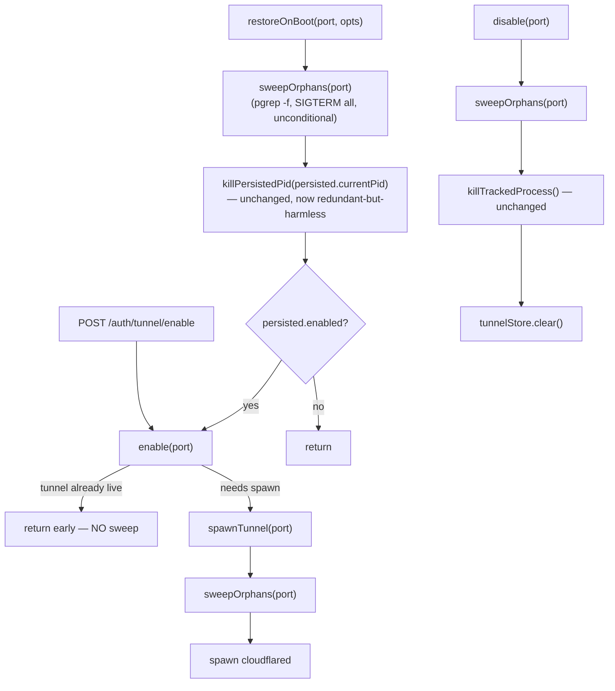

<!--
RULES — read before writing or implementing:
1. FORMAT: Bullets, tables, code, diagrams ONLY — no prose paragraphs
2. REQUIREMENTS: One crisp line each — no verbose descriptions
3. CHECKLIST: Mark items [x] as you complete them — this is your persistent todo list
4. READING TIME: Optimize for fast human scanning — if it's hard to skim, rewrite it
-->

# Plan: cloudflared orphan reconciliation sweep

> Add a `pgrep`-based OS-truth reconciliation sweep to `restoreOnBoot()`, `enable()`, and `disable()` so orphaned `cloudflared` processes from crashes/kills stop accumulating across daemon restarts.

**Issue:** cloudflared-orphan-sweep
**Branch:** `fix/cloudflared-orphan-sweep`
**Status:** Done
**PRD:** none — small single-module fix, skipped per task instructions
**Parent:** none

**Reference files:**
- Core logic: `daemon/src/services/cloudflared.ts`
- Persistence (unchanged shape): `daemon/src/state/tunnel-store.ts`
- Route wiring: `daemon/src/routes/mobileAuth.ts`
- Boot wiring: `daemon/src/main.ts`
- Tests: `daemon/src/__tests__/cloudflared.test.ts`
- Source doc: `.vibekit/reports/2026-09-06-cloudflared-orphan-reconciliation-sweep.md`

---

## Problem & Concept

- Orphaned `cloudflared` OS processes accumulate across daemon crashes/kills — two were found live in production (`412010`, `1805243`), predating PR #89, invisible to the current single-pid/DB-derived cleanup — see report § Answer.
- Current cleanup can only ever kill the *one* pid `tunnel_state` happens to remember; anything the DB didn't successfully record (crash mid-spawn, a superseded child, a spawn that timed out) is permanently unaddressable — report § Answer, § Evidence.
- Success state: every entry point that changes tunnel state first reconciles against OS reality (`pgrep -f` on the full argv incl. port), unconditionally killing everything it finds (SIGTERM → SIGKILL after a grace period), before doing anything else — report § Proposed diagram.

## Out of Scope

- `detached: true` on the cloudflared spawn — explicitly rejected in the report (report § Answer, § Evidence row "daemon itself spawned `detached`"); do not touch `daemon/src/services/cloudflared.ts:69`.
- `lastSeenAt` / session-activity tracking, `daemon/src/server.ts` auth guard, `touchLastSeen` — unrelated bug, not in the source report.
- `shutdownKill()` (`cloudflared.ts:239`) — not one of the three entry points named in the report's Proposed diagram (`restoreOnBoot()` / `enable()` / `disable()`); the graceful-shutdown path already kills the one tracked process synchronously and the daemon is about to exit, so there's nothing an OS-wide sweep buys there that the next boot's `restoreOnBoot()` sweep doesn't already cover.
- Changing `tunnel_state`'s one-row shape (`tunnel-store.ts:12`) — the sweep is additive per report § Proposed, bullet "Additive, not a replacement".
- Cross-platform `pgrep` fallback (e.g. Windows) — this repo's daemon targets Linux/macOS only (existing `isLikelyCloudflaredProcess()` comment, `cloudflared.ts:165`, already assumes `ps`/`pgrep`-style tooling).

## Requirements

| # | Requirement |
|---|-------------|
| 1 | `restoreOnBoot()`, `enable()`'s actual-spawn path, and `disable()` each run a `pgrep -f`-based sweep before any other tunnel-state-changing work |
| 2 | Sweep matches the exact invocation `cloudflared tunnel --url http://127.0.0.1:<port>` (port-scoped) — never touches an unrelated user-run cloudflared on a different port |
| 3 | Sweep SIGTERMs every matching pid unconditionally (no "is this mine" branch), then escalates any still-alive pid to SIGKILL after a grace period |
| 4 | Sweep logs every pid it acts on |
| 5 | Existing single-pid `tunnel_state` persistence and `isLikelyCloudflaredProcess()` identity check are unchanged in shape and behavior — sweep is additive |
| 6 | Sweep never blocks/delays the new spawn on the SIGKILL-escalation grace period — only pid enumeration + SIGTERM dispatch happen synchronously before spawn (see Decision 2) |

---

## Change Map

```
daemon/src/services/
  cloudflared.ts                + sweepOrphans/findMatchingPids/isProcessAlive, ~ enable/disable/restoreOnBoot call sites
daemon/src/routes/
  mobileAuth.ts                 ~ disable() call site passes tunnelPort
daemon/src/__tests__/
  cloudflared.test.ts           ~ pgrep mock branch + new sweep test cases
```

| Today | After this plan |
|-------|-----------------|
| `restoreOnBoot()`/`enable()`/`disable()` only ever touch the one pid `tunnel_state` remembers | each first enumerates every real OS process matching the exact cloudflared invocation (port-scoped) and reaps all of them |
| A `SIGTERM` is sent and never re-verified | still-alive pids are escalated to `SIGKILL` after a grace period |
| `disable()` takes no port — only the tracked/persisted pid is known | `disable(port)` — port needed to scope the sweep's `pgrep -f` pattern |

---

## Research

- `cloudflared.ts:256-275` — `restoreOnBoot()` already does a single `killPersistedPid()` call using the persisted pid only, then conditionally re-`enable()`s; no OS enumeration anywhere in this path.
- `cloudflared.ts:38-51` — `enable()` short-circuits (no spawn, no kill) when `state.enabled && state.tunnelUrl` — a sweep must NOT run on this early-return path or it would kill the very tunnel `enable()` is about to report as already-live.
- `cloudflared.ts:53-158` — `spawnTunnel()` is the only code path that actually calls `spawn()`; it runs only when `enable()` decides a new process is needed — the correct single call site for the sweep so it never fires on the already-enabled early return.
- `cloudflared.ts:227-232` — `disable()` has no `port` parameter today; only `mobileAuth.ts` has `tunnelPort` in scope at its one call site.
- `mobileAuth.ts:41-42` — `tunnelPort = resolveTunnelPort(port)` computed once per `registerMobileAuthRoutes()` call, available at the `disable()` call site (`mobileAuth.ts:92`).
- `main.ts:197` — `restoreOnBoot(resolveTunnelPort(port), { token, noAuth })` — port already resolved and passed here; no wiring change needed for this call site.
- `cloudflared.ts:170-181` — `isLikelyCloudflaredProcess()` is the only existing process-inspection call (`execFileSync("ps", ...)`) — report § Evidence confirms this is the only `ps`/`pgrep`/`pkill` hit in the whole daemon+cli tree; the sweep is genuinely new capability, not a rename of existing logic.
- `daemon/src/__tests__/cloudflared.test.ts:32-35` — `node:child_process` is mocked with a single shared `execFileSyncMock` across all `execFileSync` calls; new sweep tests must branch on `args[0]` (`"ps"` vs `"pgrep"`) same as existing tests already assert call args (`cloudflared.test.ts:193,215`).
- **Root cause** (report § Answer): a child process (detached or not) is reparented to `init` on parent death, not killed — the pre-PR code never persisted a pid anywhere, and the post-PR single-pid/DB-derived cleanup structurally cannot represent or discover "more than one" orphan.

---

## Architecture Diagram



- `sweepOrphans` is one function, called from three sites (`restoreOnBoot`, `spawnTunnel`, `disable`) — never from `enable()`'s early-return branch

---

## Design Details

### System Boundaries

- Module ↔ Module (in-process): `cloudflared.ts` ↔ OS process table via `pgrep`/`process.kill` — no new external interface; `execFileSync("pgrep", ...)` and `process.kill(pid, signal)`, both already-used primitives in this file (`ps` via `execFileSync`, `process.kill` in `killPersistedPid`/`killTrackedProcess`).
- Frontend ↔ Backend: `POST /auth/tunnel/disable` request/response shape unchanged — `disable()`'s new `port` argument is internal, not request-derived (`mobileAuth.ts` already computes `tunnelPort` from the route's own config, not from the request body).

### Key Decisions

#### Decision 1: Sweep call sites — inside `spawnTunnel()`, not at the top of `enable()`

- **Decision:** `sweepOrphans(port)` is called at the start of `spawnTunnel()` (only reached when `enable()` has decided to actually spawn), plus separately at the top of `restoreOnBoot()` (before its existing `killPersistedPid` call) and at the top of `disable()`.
- **Rationale:** `enable()`'s early return (`state.enabled && state.tunnelUrl`) must not trigger a sweep — that would kill the live tunnel it's about to report as healthy — see Research bullet on `cloudflared.ts:38-51`.
- **Where:** `cloudflared.ts:53` (new first line of `spawnTunnel`), `cloudflared.ts:256` (new first line of `restoreOnBoot`, **before** the `noAuth`/token guard — see correction below), `cloudflared.ts:227` (new first line of `disable`).
- **Correction (post-review):** the sweep in `restoreOnBoot()` runs *before* the `noAuth`/token guard, not after. Orphans from a prior run in a *different* auth mode (e.g. a machine that had auth enabled last boot but is booting with `--no-auth` this time) must still be reaped — "sweep first, before anything else" (report § Proposed) means before the guard too, not just before the existing `killPersistedPid` call. The guard still governs whether `enable()` is subsequently called.

#### Decision 2: SIGKILL escalation is fire-and-forget, not awaited before spawn

- **Decision:** `sweepOrphans()` stays synchronous. It enumerates pids and sends `SIGTERM` to all of them synchronously, then schedules the grace-period `SIGKILL` check on an `.unref()`'d `setTimeout` it does not wait on. Callers (`spawnTunnel`, `restoreOnBoot`, `disable`) do not `await` anything new and keep their current sync/async shape otherwise.
- **Rationale:** cloudflared does not bind/listen on the local port (it dials out to it) — a lingering old process for a few hundred more ms cannot conflict with the freshly-spawned one, so blocking the new spawn on old-process death (and re-plumbing every caller as async, breaking the existing fake-timer test assumptions in `cloudflared.test.ts` that `spawn()` is called on the same tick as `enable()`) buys nothing. The report only requires the sweep (enumerate + SIGTERM) to precede the spawn, not the SIGKILL escalation to precede it — report § Proposed bullet "Sweep always precedes the spawn... no window where old and new tunnels are briefly both alive" is about the *new process*, not about *when the old one's death is fully confirmed*.
- **Where:** `cloudflared.ts` new `sweepOrphans()` function.

```typescript
// Grace period is a background concern — the caller must never wait on it.
// unref() so a lingering escalation timer can't keep the daemon process alive.
function sweepOrphans(port: number): void {
  const pids = findMatchingPids(port);
  if (pids.length === 0) return;
  for (const pid of pids) {
    console.log(`[cloudflared] sweep: SIGTERM pid ${pid} (port ${port})`);
    try {
      process.kill(pid, "SIGTERM");
    } catch (err) {
      if ((err as NodeJS.ErrnoException).code !== "ESRCH") {
        console.warn(`[cloudflared] sweep: failed to SIGTERM pid ${pid}:`, err);
      }
    }
  }
  setTimeout(() => {
    for (const pid of pids) {
      if (!isProcessAlive(pid)) continue;
      // Re-check identity before SIGKILL too — same pid-reuse hazard
      // isLikelyCloudflaredProcess() already guards against for persisted
      // pids (cloudflared.ts:160-169); the grace period is long enough for
      // a pid to have been recycled by an unrelated process.
      if (!isLikelyCloudflaredProcess(pid)) continue;
      console.warn(`[cloudflared] sweep: pid ${pid} still alive after grace period — SIGKILL`);
      try {
        process.kill(pid, "SIGKILL");
      } catch (err) {
        if ((err as NodeJS.ErrnoException).code !== "ESRCH") {
          console.warn(`[cloudflared] sweep: failed to SIGKILL pid ${pid}:`, err);
        }
      }
    }
  }, SWEEP_GRACE_MS).unref();
}
```

#### Decision 3: pid enumeration via `pgrep -f` on the exact argv, dots escaped

- **Decision:** `findMatchingPids(port)` shells out to `execFileSync("pgrep", ["-f", pattern], ...)` where `pattern` is the literal argv `cloudflared tunnel --url http://127\.0\.0\.1:<port>$` (regex-escaped dots, `$`-anchored on the end), splits stdout on newlines, parses each as an integer, drops non-numeric lines. A `pgrep` exit status of `1` (its documented "no processes matched" contract) is treated as zero matches, not an error; any other failure is logged and treated as zero matches (fail-open, matching `isLikelyCloudflaredProcess`'s existing fail-open convention at `cloudflared.ts:178-180`).
- **Rationale:** report requirement — match the full argv including port so an unrelated user-run cloudflared on a different port/purpose is never touched (report § Proposed bullet, § Requirement 2 above). Escaping dots avoids `pgrep`'s ERE treating `.` as "any character" (e.g. accidentally matching a mangled `127x0x0x1`); the trailing `$` anchor is required too — without it, port `655` would also match a real tunnel on port `65535` (substring match), since the port is always the last argv token.
- **Where:** `cloudflared.ts`, new `findMatchingPids()` + `isProcessAlive()` helpers, near `isLikelyCloudflaredProcess()`.

```typescript
// Deliberately distinct from the 500ms advanceTimersByTimeAsync idiom already
// used throughout cloudflared.test.ts (e.g. lines 73, 95, 105) — sharing that
// value would make the escalation timer fire mid-advance in any test whose
// mocked pgrep returns real pids, entangling unrelated test assertions with
// sweep internals.
const SWEEP_GRACE_MS = 2000;

function findMatchingPids(port: number): number[] {
  const pattern = `cloudflared tunnel --url http://127\\.0\\.0\\.1:${port}$`;
  try {
    const out = execFileSync("pgrep", ["-f", pattern], { encoding: "utf8", timeout: 2000 }).trim();
    if (!out) return [];
    return out
      .split("\n")
      .map((line) => Number.parseInt(line.trim(), 10))
      .filter((n) => Number.isFinite(n));
  } catch (err) {
    // pgrep's documented contract: exit 1 == "no processes matched" — not an error.
    if ((err as NodeJS.ErrnoException & { status?: number }).status === 1) return [];
    console.warn("[cloudflared] sweep: pgrep enumeration failed:", err);
    return [];
  }
}

function isProcessAlive(pid: number): boolean {
  try {
    process.kill(pid, 0);
    return true;
  } catch {
    return false;
  }
}
```

#### Decision 4: `disable()` gains a required `port` parameter

- **Decision:** `export function disable(port: number): void` — signature change, one call site to update.
- **Rationale:** `disable()` has no port today (Research, `cloudflared.ts:227-232`); the sweep's `pgrep -f` pattern is port-scoped per Decision 3/Requirement 2, so `disable()` must receive it. `mobileAuth.ts` already computes `tunnelPort` at module scope (Research, `mobileAuth.ts:41-42`) — trivial to thread through.
- **Where:** `cloudflared.ts:227`; `mobileAuth.ts:92` (`cloudflared.disable()` → `cloudflared.disable(tunnelPort)`).

---

## Risks / Open Questions

| # | Question | Notes |
|---|----------|-------|
| 1 | **Does `pgrep` exist on every target platform?** | Same assumption `isLikelyCloudflaredProcess()` already makes for `ps` (Linux/macOS only) — fail-open on any exec failure per Decision 3, so a missing `pgrep` degrades to "sweep found nothing" rather than crashing. |
| 2 | **Redundant sweep when `restoreOnBoot()` calls `enable()`** | `restoreOnBoot()` sweeps once directly, then `enable()`→`spawnTunnel()` sweeps again. Harmless (second sweep just finds nothing) — not worth special-casing to skip, per report's "same rule everywhere" framing. |

---

## Implementation Phases

- Each phase ends with a **verification block** — the phase is not complete until those tests pass
- Test items use `N.Tn` numbering to distinguish them from implementation items

---

### Phase 1 — Sweep primitives + wiring into all three entry points

- [x] **1.1** Add `SWEEP_GRACE_MS`, `findMatchingPids()`, `isProcessAlive()`, `sweepOrphans()` to `cloudflared.ts` (Decisions 2, 3)
- [x] **1.2** Call `sweepOrphans(port)` as the first line of `spawnTunnel()` (Decision 1)
- [x] **1.3** Call `sweepOrphans(port)` as the very first line of `restoreOnBoot()`, **before** the existing `noAuth`/token guard (Decision 1 correction)
- [x] **1.4** Change `disable()` to `disable(port: number)`, call `sweepOrphans(port)` first, before `killTrackedProcess()` (Decisions 1, 4)
- [x] **1.5** Update `mobileAuth.ts:92` call site to `cloudflared.disable(tunnelPort)`

**Verify phase 1:**
- [x] **1.T1** Unit — `cloudflared.test.ts`: `findMatchingPids` parses multi-line `pgrep` stdout into `number[]`, drops non-numeric lines
- [x] **1.T2** Unit — `cloudflared.test.ts`: `pgrep` exiting with `status: 1` (mocked throw) → `findMatchingPids` returns `[]`, no warning logged
- [x] **1.T3** Unit — `cloudflared.test.ts`: `pgrep` throwing a non-1-status error → `findMatchingPids` returns `[]`, warning logged, no throw propagates
- [x] **1.T4** Integration — `cloudflared.test.ts`: `enable(port)` on a port where the mocked `pgrep` returns 2 pids → `execFileSyncMock` called with `("pgrep", ["-f", "cloudflared tunnel --url http://127\\.0\\.0\\.1:<port>$"], expect.anything())` (Requirement 2), both pids receive `SIGTERM` (via `process.kill` spy) before `spawn()` is called
- [x] **1.T5** Integration — `cloudflared.test.ts`: `enable(port)` when tunnel already enabled (early-return branch) → `pgrep`/`process.kill` NOT called (Decision 1)
- [x] **1.T6** Integration — `cloudflared.test.ts`: `disable(port)` → `pgrep`-found pids receive `SIGTERM`, `tunnelStore` still fully cleared as before
- [x] **1.T7** Integration — `cloudflared.test.ts`: `restoreOnBoot(port, opts)` → sweep's `pgrep` call happens before the existing `killPersistedPid` call (assert call order via mock invocation order)
- [x] **1.T8** Regression — full existing `cloudflared.test.ts` suite (2.T1–2.T7, B1, B2) still passes unmodified in behavior (only the shared `execFileSyncMock` needs a `"ps"` vs `"pgrep"` branch, per Research on `cloudflared.test.ts:32-35`)

---

### Phase 2 — SIGKILL escalation + logging

- [x] **2.1** Verify `sweepOrphans`'s `setTimeout` escalation path fires `SIGKILL` only for pids still alive after `SWEEP_GRACE_MS`, and is `.unref()`'d
- [x] **2.2** Confirm every sweep-reaped pid is logged (SIGTERM dispatch + any SIGKILL escalation) per Requirement 4

**Verify phase 2:**
- [x] **2.T1** Unit — `cloudflared.test.ts`: mock `process.kill` such that a pid survives `SIGTERM` (i.e. `isProcessAlive` returns true post-grace) → advancing fake timers by `SWEEP_GRACE_MS` triggers a `SIGKILL` call for that pid
- [x] **2.T2** Unit — `cloudflared.test.ts`: a pid that's dead by the grace-period check (mock `process.kill(pid, 0)` throwing ESRCH) → no `SIGKILL` call for it
- [x] **2.T3** Unit — `cloudflared.test.ts`: spy on the global `setTimeout` (or the returned `Timeout` handle's `.unref`) and assert `unref()` is actually called for the escalation timer — a real assertion, not an absence-of-hang inference

---

## Files & Phase Impact

| File | Status | Phase | Description / Contract Change |
|------|--------|-------|-------------------------------|
| `daemon/src/services/cloudflared.ts` | **Modified** | 1.1–1.4, 2.1–2.2 | New: `SWEEP_GRACE_MS`, `findMatchingPids(port): number[]`, `isProcessAlive(pid): boolean`, `sweepOrphans(port): void`. Changed: `disable(port: number): void` (was `disable(): void`), `spawnTunnel`/`restoreOnBoot`/`disable` each call `sweepOrphans` first · Owns: `state` (unchanged shape) |
| `daemon/src/routes/mobileAuth.ts` | **Modified** | 1.5 | `cloudflared.disable()` → `cloudflared.disable(tunnelPort)` at line 92 |
| `daemon/src/__tests__/cloudflared.test.ts` | **Modified** | 1.T1–1.T8, 2.T1–2.T3 | `execFileSyncMock` branches on `"ps"` vs `"pgrep"`; new sweep test cases; existing `disable()` call sites updated to pass a port |
| `daemon/src/state/tunnel-store.ts` | **Unchanged** | — | No shape change — sweep is additive per Requirement 5 |
| `daemon/src/main.ts` | **Unchanged** | — | `restoreOnBoot()` call site already passes port (Research, `main.ts:197`) |
| `daemon/src/__tests__/mobileAuth.test.ts` | **Unchanged** | — | `disable: vi.fn(() => {...})` at line 27 fully mocks the module and ignores args — the new `port` parameter is a no-op here |
