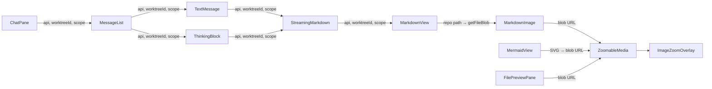

<!--
RULES — read before writing or implementing:
1. FORMAT: Bullets, tables, code, diagrams ONLY — no prose paragraphs
2. REQUIREMENTS: One crisp line each — no verbose descriptions
3. CHECKLIST: Mark items [x] as you complete them — this is your persistent todo list
4. READING TIME: Optimize for fast human scanning — if it's hard to skim, rewrite it
-->

# Plan: Markdown image rendering + fullscreen image/mermaid zoom

> Implements the 3 TODO items from the parent task: chat image resolution (TODO 1), image file preview (TODO 2), and fullscreen zoom/pan for markdown images + mermaid (TODO 3), sharing one zoom/pan/fullscreen component and one image-path resolver.

**Issue:** image-rendering
**Branch:** `feat/image-rendering`
**Status:** Approved
**PRD:** `.vibekit/feature-plans/wip/image-rendering/prd-image-rendering.md`
**Parent task:** vs-119 (SDLC-driven)

**Reference files:**
- `web-ui/src/components/preview/MarkdownView.tsx:10-59` (`MarkdownImage` — remote vs repo-image resolution), `:61-95` (`MarkdownView` + `img` component)
- `web-ui/src/components/chat/StreamingMarkdown.tsx:34-47` (routes markdown → `MarkdownView`, mermaid → `MermaidView`; no api/worktree today)
- `web-ui/src/components/chat/TextMessage.tsx:19-56` (`<StreamingMarkdown source={text}/>` at `:55`)
- `web-ui/src/components/chat/ThinkingBlock.tsx:80` (second `StreamingMarkdown` callsite)
- `web-ui/src/components/chat/MessageList.tsx:434-500` (`MessageListProps` — already has `api`, `sessionId`), `:807-935` (`TextMessage` callsites at 817, 847, 860, 865, 934)
- `web-ui/src/components/layout/ChatPane.tsx:29-37` (props: `api`, `session: Session`, `visible`), `:274-292` (`MessageList` render — passes `api`, `sessionId`)
- `web-ui/src/api/types.ts:106-110` (`Session.worktreeId: string | null`), `:78` (`FileScope = "worktree" | "project"`)
- `web-ui/src/api/client.ts:618-623` (`getFileBlob(worktreeId, filePath, scope)` — already works)
- `web-ui/src/components/layout/FilePreviewPane.tsx:284-320` (decides md→Markdown, else→CodeView; image files hit `CodeView` at `:319`)
- `web-ui/src/components/preview/MermaidView.tsx:19-64` (renders SVG into `hostRef` div)
- `web-ui/src/styles/workspace.css:2682-2687` (`.markdown-img`), `:2184` (`.pane-viewport-fullscreen` pattern)
- `web-ui/src/styles/chat.css:422` (`.mermaid-view svg`)

---

## Problem

- `MarkdownImage` (markdown both contexts) resolves repo paths only when `api`/`worktreeId`/`scope` are passed — chat passes none, so relative/root-relative images render nothing (`MarkdownView.tsx:30-45`)
- Image files open as raw binary text via `CodeView` (`FilePreviewPane.tsx:319`) — no image rendering, no zoom
- No fullscreen zoom/pan for markdown images or mermaid diagrams anywhere

## Out of Scope

- Daemon changes — `getFileBlob` already serves repo files as blobs
- Editing/cropping images
- Inline (non-fullscreen) mermaid pan
- Image thumbnails / virtualized lists

---

## Requirements

| # | Requirement |
|---|-------------|
| 1 | Relative + root-relative repo image paths render inline in assistant markdown (chat) |
| 2 | Remote URLs (`http(s)://`, `//`, `data:`) still render as plain `` in chat |
| 3 | Chat scope: worktree session → `worktree`; direct session (`worktreeId` null) → `project` |
| 4 | Missing/unfetchable repo image renders nothing (no broken flash) |
| 5 | Image-file types open as the actual image in the file preview |
| 6 | Image preview + fullscreen support mouse and touch zoom/pan |
| 7 | Markdown image click → fullscreen zoom/pan overlay |
| 8 | Mermaid diagram click → same fullscreen zoom/pan overlay |
| 9 | Esc / close button dismisses overlay; body scroll locked while open |
| 10 | One shared zoom/pan/fullscreen component + one image-path resolver reused across contexts |

---

## Change Map

```
web-ui/src/components/preview/
  MarkdownView.tsx        ~ MarkdownImage clickable + fullscreen; keep remote handling
  MermaidView.tsx         ~ clickable → fullscreen
  ZoomableMedia.tsx       + shared zoom/pan/fullscreen component
  ImageZoomOverlay.tsx    + fullscreen overlay (portal) wrapping ZoomableMedia
web-ui/src/components/chat/
  StreamingMarkdown.tsx   ~ accept api/worktreeId/scope, forward to MarkdownView
  TextMessage.tsx         ~ accept + forward context props
  ThinkingBlock.tsx       ~ forward context props to StreamingMarkdown
  MessageList.tsx         ~ accept context props, forward to TextMessage/ThinkingBlock
web-ui/src/components/layout/
  ChatPane.tsx            ~ derive worktreeId/scope from session, pass to MessageList
  FilePreviewPane.tsx     ~ image-file branch → ZoomableMedia
web-ui/src/lib/
  imageFile.ts            + image detection (extension→isImage) + path resolver
web-ui/src/styles/
  workspace.css           ~ fullscreen overlay + zoom cursor + preview image styles
```

| Today | After this plan |
|-------|-----------------|
| Chat: relative/root-relative images render nothing | Chat: repo images render inline (worktree/project scope); remote unchanged |
| File preview: `.png` opens as raw binary text via `CodeView` | File preview: image files render as zoomable images |
| No fullscreen zoom anywhere | Markdown images + mermaid + preview images open a shared fullscreen zoom/pan overlay |

---

## Research

### Image resolution — current behavior

- `MarkdownImage` (`MarkdownView.tsx:20-59`): `isRemote` covers `http(s)://`, `//`, `data:`; else `getFileBlob(worktreeId, imagePath, scope)` where `imagePath` = root-relative stripped of `/`, or `fileDir/src` for relative (`:37-39`)
- Root-relative `src="/x.png"` resolves from worktree root; relative `./x.png` joins against `fileDir` — logic already correct and reusable
- File preview passes `api`/`worktreeId`/`scope`/`filePath` (`FilePreviewPane.tsx:311`); chat passes none (`StreamingMarkdown.tsx:41`)

### Chat context plumbing

- `ChatPane` has `session: Session` with `worktreeId` (`api/types.ts:109`) — the only place worktree context is reachable for chat
- `MessageList` already receives `api` + `sessionId` (`ChatPane.tsx:286-287`); `TextMessage` (`MessageList.tsx:817,847,860,865,934`) and `ThinkingBlock` (`MessageList.tsx:892-898`) are the render sites

### File preview branching

- `FilePreviewPane.tsx:305-319`: `isMd` → markdown segments; else → `CodeView` — image files fall into the else branch
- `getFileBody` is fetched as text (`:89,98,111`) — binary images are NOT text; need a separate blob fetch for image types

### Fullscreen pattern

- `.pane-viewport-fullscreen` (`workspace.css:2184`) shows the established escape-the-overflow pattern; a `createPortal` to `document.body` with `position: fixed` is the standard overlay approach (no React-tree constraint here — overlay is safe to remount, unlike TerminalPane)

---

## Architecture Diagram



Single-module change within `web-ui`; no new service boundary.

---

## Design Details

### Critical User Journeys (CUJs)

#### CUJ 1 — Repo image in Rich Chat (TODO 1)

```
User reads assistant reply containing 
  → StreamingMarkdown passes api/worktreeId/scope to MarkdownView
  → MarkdownImage resolves ./assets/logo.png against fileDir (null in chat → worktree-root relative)
  → getFileBlob(worktreeId, "assets/logo.png", scope) → blob URL → 
  → Image renders inline; click opens fullscreen
```

- **Edge:** root-relative `/assets/logo.png` in chat → resolved from worktree root (no fileDir in chat, `MarkdownView.tsx:37-39` handles via leading-`/` branch)
- **Edge:** missing file → `getFileBlob` rejects → renders nothing (`MarkdownView.tsx:45` catch)
- **Edge:** direct session (`worktreeId` null) → scope `project`, resolves against project files

#### CUJ 2 — Image file in preview (TODO 2)

```
User opens docs/diagram.png in Files tab
  → FilePreviewPane detects .png as image → fetches blob via getFileBlob
  → Renders ZoomableMedia with blob URL (not CodeView)
  → Mouse wheel zooms, drag pans, pinch zooms on touch
  → Double-click / zoom button opens fullscreen overlay
```

- **Edge:** image too large → still renders scaled to fit (blob, no text-size limit)
- **Edge:** non-image binary → unchanged `CodeView` path

#### CUJ 3 — Fullscreen mermaid (TODO 3)

```
User clicks a mermaid diagram (chat or file preview)
  → MermaidView wraps its SVG in ZoomableMedia
  → Click opens ImageZoomOverlay portal with the SVG content
  → Zoom/pan; Esc or ✕ closes; body scroll locked
```

- **Edge:** mermaid render failed → fallback `<pre>` not clickable (only successful SVG is)

### Data Model

- None persisted — blob URLs and overlay state are ephemeral component state (no migration)

### Key Decisions

#### Decision 1: New `ZoomableMedia` + `ImageZoomOverlay` shared components (new files in `preview/`)

- **Decision:** one `ZoomableMedia` component that renders an image from a `src` (blob/remote URL) with zoom/pan interaction, and one `ImageZoomOverlay` (fullscreen portal wrapping `ZoomableMedia`). `MarkdownImage`, `MermaidView`, and `FilePreviewPane` all reuse them. `ZoomableMedia` takes only `{ src: string; alt?: string; className?: string; onOpenFullscreen?: () => void }` — no `contentRef` (see Decision 5a: mermaid passes a blob URL, so no DOM-node mode is needed).
- **Rationale:** R10 — avoids duplicating wheel/pinch/drag transform logic in 3 places; one `src`-based contract keeps the component simple and unambiguous
- **Where:** new `web-ui/src/components/preview/ZoomableMedia.tsx`, `web-ui/src/components/preview/ImageZoomOverlay.tsx`

```tsx
// ZoomableMedia — transform-based zoom/pan over an . scale + translate state;
// wheel/buttons scale, pointer drag translates, pinch scales. Reset on src change.
<ZoomableMedia src={blobUrl} alt={alt} onOpenFullscreen={openFullscreen} />
```

#### Decision 2: Chat context plumbing — `api`/`worktreeId`/`scope` threaded `ChatPane → MessageList → TextMessage/ThinkingBlock → StreamingMarkdown → MarkdownView`

- **Decision:** add optional `api`/`worktreeId`/`scope` props to `StreamingMarkdown`, `TextMessage`, `ThinkingBlock`, `MessageList`; `ChatPane` derives `worktreeId = session?.worktreeId ?? null` and `scope = worktreeId ? "worktree" : "project"` and passes all three down.
- **Rationale:** R1/R3 — reuses the file-preview resolver unchanged; `Session.worktreeId` is already on the object `ChatPane` receives (`api/types.ts:109`)
- **Where:** `ChatPane.tsx:274-292`, `MessageList.tsx:807-935`, `TextMessage.tsx:19-56`, `ThinkingBlock.tsx:80`, `StreamingMarkdown.tsx:34-47`

#### Decision 3: File-preview image branch — detect by extension, fetch blob, render `ZoomableMedia`

- **Decision:** in `FilePreviewPane`, compute `isImage = imageFile.isImagePath(path)`; when `isImage` and a worktree id exists, fetch the blob (not text) and render `ZoomableMedia`; non-image keeps the existing `CodeView` path.
- **Rationale:** R5/R6 — clean branch, no daemon change; blob fetch is the correct endpoint for binary
- **Where:** `FilePreviewPane.tsx:284-320`

#### Decision 4: New `lib/imageFile.ts` — image detection + shared path resolver

- **Decision:** a small pure module exporting `isImagePath(path)` (extension set) and a resolver `resolveImagePath(src, baseDir)`: strip any leading `/` (root-relative) or leading `./` (explicit-relative), then join against `baseDir` when present. `MarkdownImage`, `FilePreviewPane`, and `ZoomableMedia` all use it.
- **Rationale:** single source of truth for "is this an image" and "how does a path resolve" (R10); stripping leading `./` is required because `getFileBlob` (`client.ts:619`) strips only leading `/`, so a literal `./x.png` would 404 in the chat path where `baseDir` is null
- **Where:** new `web-ui/src/lib/imageFile.ts`; `MarkdownImage` refactors to use it

#### Decision 5: Mermaid fullscreen — serialize SVG to a blob URL, pass as `src` to `ZoomableMedia`

- **Decision:** `MermaidView` keeps rendering the SVG inline, but wraps the inline image in a clickable `ZoomableMedia`; on click it serializes the rendered SVG string to a blob URL and opens `ImageZoomOverlay` with that `src` (re-rendering the diagram fullscreen). Only successful renders are clickable (the failed `<pre>` fallback is not).
- **Rationale:** R8/R9 — reuses the same `src`-based `ZoomableMedia` for mermaid with no DOM-node/clone ambiguity; the SVG string is already in scope at render time (`MermaidView.tsx:40`)
- **Where:** `MermaidView.tsx:19-64`

#### Decision 5a: No `contentRef` / DOM-node mode on `ZoomableMedia`

- **Decision:** `ZoomableMedia` exposes only the `src`-based contract. Mermaid fullscreen goes through a blob URL (Decision 5), so the previously-considered `contentRef: RefObject<HTMLElement>` mode is dropped — it was the source of the implementation ambiguity (appendChild vs cloneNode vs move) and is now unused.
- **Rationale:** reviewer finding (BLOCKING) — one unambiguous contract; the plan must not leave a fresh implementer to invent the mechanism
- **Where:** `ZoomableMedia.tsx` props; `MermaidView.tsx` (Decision 5)

#### Decision 6: Overlay — `createPortal` to `document.body`, fixed positioning, body scroll lock

- **Decision:** `ImageZoomOverlay` renders via `createPortal(document.body)` with `position: fixed; inset: 0; z-index` above everything; `body { overflow: hidden }` while open; Esc + close button dismiss. Overlay remounting is safe (no daemon stream), unlike `TerminalPane`.
- **Rationale:** R9/R10 — matches the established fixed-overlay pattern; portal avoids parent `overflow: hidden` traps (see `workspace.css:2184` rationale)
- **Where:** new `ImageZoomOverlay.tsx`

---

## Risks / Open Questions

| # | Question | Notes |
|---|----------|-------|
| 1 | SVG files: blob vs text fetch — `getFileBlob` returns the raw SVG, rendered via `` | SVG as `` can't execute scripts (safe); acceptable |
| 2 | Touch pinch inside the chat scroll container may conflict with page scroll | Zoom gesture handled with `touch-action: none` on the zoom surface only while zoomed |
| 3 | Mermaid SVG click-to-select conflicts with drag | Click (no drag) opens overlay; drag threshold distinguishes pan from click |
| 4 | Large images in chat memory | Blob URL revoked on unmount (`MarkdownView.tsx:47-51` pattern) |

---

## Implementation Phases

### Phase 1 — Shared zoom/pan/fullscreen infrastructure

- [x] **1.1** `web-ui/src/lib/imageFile.ts`: `isImagePath(path)` (png/jpg/jpeg/gif/webp/svg/bmp/avif) + `resolveImagePath(src, baseDir)` (strip leading `/` and leading `./`; join against `baseDir` when present) — pure functions (Decision 4)
- [x] **1.2** `web-ui/src/components/preview/ZoomableMedia.tsx`: transform-based zoom/pan — props `{ src: string; alt?: string; className?: string; onOpenFullscreen?: () => void }` (NO `contentRef`); wheel = zoom to cursor, pointer-drag = pan, touch pinch = zoom; `touch-action` handling; reset on `src` change; imperative handle to toggle fullscreen + `onOpenFullscreen` callback
- [x] **1.3** `web-ui/src/components/preview/ImageZoomOverlay.tsx`: `createPortal(document.body)` fullscreen overlay wrapping `ZoomableMedia`; Esc + ✕ close; body scroll lock via `overflow:hidden` effect; dark backdrop
- [x] **1.4** `web-ui/src/styles/workspace.css`: overlay + zoom cursor + preview-image styles (`.image-zoom-overlay`, `.image-zoom-overlay__close`, `.zoomable-media`, `.preview-image`)

**Verify phase 1:**
- [x] **1.T1** Unit — `imageFile.ts` (new `imageFile.test.ts`): `isImagePath("a.png")` true, `isImagePath("a.txt")` false, case-insensitive ext; `resolveImagePath("/x.png","docs")` → `x.png`, `resolveImagePath("./x.png","docs")` → `docs/x.png`, `resolveImagePath("x.png",null)` → `x.png`, `resolveImagePath("./x.png",null)` → `x.png` (strips `./` even with null baseDir — the chat failure path), `resolveImagePath("./sub/x.png","docs")` → `docs/sub/x.png`
- [x] **1.T2** Component — `ZoomableMedia.test.tsx`: renders `img` with `src` when `src` given; wheel changes scale; drag changes translate; reset on `src` change
- [x] **1.T3** Component — `ImageZoomOverlay.test.tsx`: renders children in a portal; Esc key calls `onClose`; ✕ button calls `onClose`
- [x] **1.T4** `pnpm --filter @vibestation/web exec vitest run src/lib/imageFile.test.ts src/components/preview/ZoomableMedia.test.tsx src/components/preview/ImageZoomOverlay.test.tsx` passes
- [x] **1.T5** `pnpm typecheck` clean

### Phase 2 — TODO 1: Rich Chat image resolution

- [x] **2.1** `StreamingMarkdown.tsx`: accept optional `api`/`worktreeId`/`scope` props; forward to `MarkdownView`
- [x] **2.2** `TextMessage.tsx`: accept `api`/`worktreeId`/`scope`; forward to `StreamingMarkdown`
- [x] **2.3** `ThinkingBlock.tsx`: accept + forward the same props to `StreamingMarkdown`
- [x] **2.4** `MessageList.tsx`: accept `worktreeId`/`scope` props (api/sessionId already present); forward to every `TextMessage` + `ThinkingBlock` render
- [x] **2.5** `ChatPane.tsx`: derive `worktreeId = session?.worktreeId ?? null`, `scope = worktreeId ? "worktree" : "project"`; pass `api`/`worktreeId`/`scope` to `MessageList`
- [x] **2.6** `MarkdownView.tsx`: refactor `MarkdownImage` to use `resolveImagePath` (Decision 4); wrap the `` in `ZoomableMedia` so clicking opens fullscreen (TODO 3 in chat); keep remote `src` path working

**Verify phase 2:**
- [x] **2.T1** Component — `StreamingMarkdown.test.tsx`: when `api`/`worktreeId`/`scope` passed and source has ``, `MarkdownImage` calls `getFileBlob` with resolved path; without props, no `getFileBlob` call (remote/`null` unchanged)
- [x] **2.T2** Component — `MessageList.test.tsx`: passes `api`/`worktreeId`/`scope` through to `TextMessage` (assert prop forwarding)
- [x] **2.T3** `pnpm --filter @vibestation/web exec vitest run src/components/chat/StreamingMarkdown.test.tsx src/components/chat/MessageList.test.tsx` passes (existing + new)
- [x] **2.T4** `pnpm typecheck` clean

### Phase 3 — TODO 2: Image file preview + TODO 3 (preview image fullscreen)

- [x] **3.1** `FilePreviewPane.tsx`: compute `isImage = isImagePath(path)`; when image, fetch blob via `api.getFileBlob(worktreeId, path, fileScope)` (add `imageBlobUrl` state) and render `ZoomableMedia` in place of `CodeView`; revoke the prior blob URL in effect cleanup (mirror `MarkdownView.tsx:47-51` pattern); wrap in a click-to-fullscreen affordance (double-click / zoom button). Note: `worktreeId` is the context id — the project id when `fileScope === "project"` (`FilesPanel.tsx:85`, `FilePreviewPane.tsx:89-91`), so this one call covers worktree AND direct sessions (reviewer finding resolved by existing prop convention, no new `projectId` prop needed)
- [x] **3.2** `FilePreviewPane.tsx`: integrate `ImageZoomOverlay` for the preview-image fullscreen (shared overlay from Phase 1)
- [x] **3.3** `FilePreviewPane.tsx`: ensure the `scope === "commit"`/diff branches still skip image rendering (images only render in plain/none + local + branch file views where a blob is meaningful)

**Verify phase 3:**
- [x] **3.T1** Component — `FilePreviewPane.test.tsx`: `path="a.png"` with a mock `getFileBlob` renders `ZoomableMedia` (not `CodeView`); `path="a.ts"` still renders `CodeView`
- [x] **3.T2** `pnpm --filter @vibestation/web exec vitest run src/components/layout/FilePreviewPane.test.tsx` passes
- [x] **3.T3** `pnpm typecheck` clean

### Phase 4 — TODO 3: Mermaid fullscreen

- [x] **4.1** `MermaidView.tsx`: keep the inline SVG rendering (interactive) but wrap it in a clickable wrapper (`role="button"`, zoom-in cursor, Enter/Space opens); on click, serialize the rendered SVG string to a blob URL (`new Blob([svgString], {type:"image/svg+xml"})` + `URL.createObjectURL`) and open `ImageZoomOverlay` with that `src` (shared `ZoomableMedia` fullscreen — Decision 5). The blob URL is revoked on close/unmount (effect cleanup)
- [x] **4.2** Ensure failed mermaid (`<pre>` fallback) is not clickable

**Verify phase 4:**
- [x] **4.T1** Component — `MermaidView.test.tsx`: successful render is wrapped in `ZoomableMedia`; click opens overlay; failed render (`<pre>`) is not clickable
- [x] **4.T2** `pnpm --filter @vibestation/web exec vitest run src/components/preview/MermaidView.test.tsx` passes
- [x] **4.T3** `pnpm typecheck` clean

### Phase 5 — Verify + final review

- [x] **5.1** Full `web-ui` vitest suite + repo-wide typecheck + lint
- [x] **5.2** Boot docker dev sandbox (`scripts/dev-sandbox.sh up`) and manually verify: repo image renders in chat, image file opens in preview, markdown image + mermaid fullscreen zoom/pan (mouse + touch), remote URLs still work
- [ ] **5.3** Opus reviewer subagent pass on the complete diff; address findings
- [ ] **5.4** Commit on `feat/image-rendering`

**Verify phase 5:**
- [x] **5.T1** `pnpm --filter @vibestation/web exec vitest run` passes (full suite)
- [x] **5.T2** `pnpm typecheck` + `pnpm lint` clean
- [x] **5.T3** Docker sandbox manual verification recorded (screenshots/notes)

---

## Files & Phase Impact

| File | Status | Phase | Description / Contract Change |
|------|--------|-------|-------------------------------|
| `web-ui/src/lib/imageFile.ts` | **New** | 1 | Contract: `isImagePath(path: string): boolean`, `resolveImagePath(src: string, baseDir: string\|null): string` — pure |
| `web-ui/src/components/preview/ZoomableMedia.tsx` | **New** | 1 | Contract: `{ src: string; alt?: string; className?: string; onOpenFullscreen?: () => void }` — transform zoom/pan over ``; Owns: zoom state |
| `web-ui/src/components/preview/ImageZoomOverlay.tsx` | **New** | 1 | Contract: `{ open: boolean; onClose: () => void; children: ReactNode }` — portal overlay; Owns: body scroll lock |
| `web-ui/src/components/preview/MarkdownView.tsx` | **Modified** | 2 | `MarkdownImage` uses `resolveImagePath`; `` wrapped in `ZoomableMedia` (click → fullscreen) |
| `web-ui/src/components/chat/StreamingMarkdown.tsx` | **Modified** | 2 | Contract: props gain `api?`/`worktreeId?`/`scope?` — forwarded to `MarkdownView` |
| `web-ui/src/components/chat/TextMessage.tsx` | **Modified** | 2 | Contract: props gain `api?`/`worktreeId?`/`scope?` — forwarded to `StreamingMarkdown` |
| `web-ui/src/components/chat/ThinkingBlock.tsx` | **Modified** | 2 | Contract: props gain `api?`/`worktreeId?`/`scope?` — forwarded to `StreamingMarkdown` |
| `web-ui/src/components/chat/MessageList.tsx` | **Modified** | 2 | Contract: props gain `worktreeId?`/`scope?` — forwarded to `TextMessage`/`ThinkingBlock` |
| `web-ui/src/components/layout/ChatPane.tsx` | **Modified** | 2 | Derives `worktreeId`/`scope` from `session`; passes `api`/`worktreeId`/`scope` to `MessageList` |
| `web-ui/src/components/layout/FilePreviewPane.tsx` | **Modified** | 3 | Image-file branch → `ZoomableMedia` + `ImageZoomOverlay`; blob fetch for images |
| `web-ui/src/components/preview/MermaidView.tsx` | **Modified** | 4 | Successful SVG → blob URL `src`, wrapped in `ZoomableMedia` (click → fullscreen) |
| `web-ui/src/styles/workspace.css` | **Modified** | 1 | Overlay + zoom cursor + preview-image + markdown-img-fullscreen styles |
| `web-ui/src/lib/imageFile.test.ts` | **New** | 1.T1 | Unit tests for `imageFile` |
| `web-ui/src/components/preview/ZoomableMedia.test.tsx` | **New** | 1.T2 | Component tests for zoom/pan |
| `web-ui/src/components/preview/ImageZoomOverlay.test.tsx` | **New** | 1.T3 | Component tests for overlay |
| `web-ui/src/components/chat/StreamingMarkdown.test.tsx` | **Modified** | 2.T1 | Image-resolution coverage |
| `web-ui/src/components/chat/MessageList.test.tsx` | **Modified** | 2.T2 | Prop-forwarding coverage |
| `web-ui/src/components/layout/FilePreviewPane.test.tsx` | **Modified** | 3.T1 | Image-vs-code branching |
| `web-ui/src/components/preview/MermaidView.test.tsx` | **Modified** | 4.T1 | Clickable/not-clickable coverage |

---

## Verification Method

- Node/vitest: targeted component tests per phase + full `web-ui` suite in phase 5
- `pnpm typecheck` repo-wide + `pnpm lint` at end of each phase and phase 5
- Docker dev sandbox (`scripts/dev-sandbox.sh up`) manual verification in phase 5 — image in chat, image file in preview, fullscreen zoom/pan (mouse + touch), remote URLs
- Reviewer: opus subagent pass on the complete diff (phase 5)
