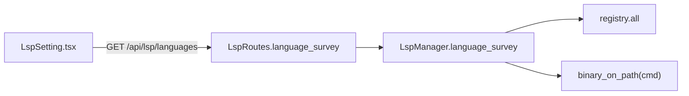

<!--
RULES — read before writing or implementing:
1. FORMAT: Bullets, tables, code, diagrams ONLY — no prose paragraphs
2. REQUIREMENTS: One crisp line each — no verbose descriptions
3. CHECKLIST: Mark items [x] as you complete them — this is your persistent todo list
4. READING TIME: Optimize for fast human scanning — if it's hard to skim, rewrite it
-->

# Plan: LSP Settings page

> New Settings → LSP section listing all 16 registered languages, whether each server binary is on the daemon host's PATH, and a copy-pasteable install command for the missing ones.

**Issue:** lsp-settings-page
**Branch:** `code-nav-lsp-outline` _(existing worktree branch, not a new one)_
**Status:** Pending
**PRD:** none — small, self-contained feature per task scope

**Reference files:**
- Registry / server list: `rust/vst-lsp/src/registry.rs`
- PATH check: `rust/vst-lsp/src/manager.rs:718` (`binary_on_path`)
- REST types: `rust/vst-types/src/rest/lsp.rs`
- Route logic: `rust/vst-routes/src/lsp.rs`
- Route wiring: `rust/vst-daemon/src/server.rs`
- UI entrypoint: `web-ui/src/components/settings/SettingsPanel.tsx`
- API client: `web-ui/src/api/client.ts`, `web-ui/src/api/mock.ts`, `web-ui/src/api/types.ts`

---

## Problem & Concept

- Users have no way to see which of the 16 LSP-registered languages have a working server installed on the daemon host, or how to install the missing ones.
- `LspManager::status()` (`rust/vst-lsp/src/manager.rs:256-287`) already does a per-language PATH check, but only for one language at a time, scoped to a workspace — there's no host-wide, no-workspace-needed survey endpoint.
- Success: Settings → LSP lists every registered language with an installed/missing badge and a copy-pasteable install command for anything missing.

## Out of Scope

- Auto-install / "click to install" (explicitly rejected — security/scope boundary).
- Daemon restart automation.
- Per-worktree/per-project scoping — this is a single host-wide list.
- Changing `LspManager::status()`'s existing per-workspace behavior.

## Requirements

| # | Requirement |
|---|-------------|
| 1 | `GET /api/lsp/languages` returns all 16 registered languages with `installedOnHost` computed via the existing `binary_on_path` check |
| 2 | Each entry carries a `displayName`, the raw `command`, an `installCommand` (nullable — a single line that actually runs in a shell), and an `installNote` (nullable — extra options / docs link) |
| 3 | New Settings section "LSP" lists all languages, sorted missing-first, then alphabetically by `displayName` within each group |
| 4 | Missing language rows with a non-null `installCommand` show it + a copy-to-clipboard button that copies exactly that command; `installNote` (if present) renders as plain text, never inside the copy button |
| 5 | No workspace/project/worktree id in the request — host-wide fact |
| 6 | No write/action endpoint — read-only |

---

## Change Map

```
rust/vst-lsp/src/
  registry.rs        ~ display/install fields, all() accessor
  manager.rs          ~ LspManager::language_survey()
rust/vst-types/src/rest/
  lsp.rs              ~ LspLanguageSurvey{Entry,Response} types
rust/vst-routes/src/
  lsp.rs              ~ LspRoutes::language_survey()
rust/vst-daemon/src/
  server.rs           ~ GET /lsp/languages route + handler
web-ui/src/api/
  types.ts            ~ LspLanguageSurveyEntry/Response types
  client.ts           ~ getLspLanguages()
  mock.ts             ~ getLspLanguages() fixture
web-ui/src/components/settings/
  LspSetting.tsx       + new settings section component
  SettingsPanel.tsx    ~ registers "lsp" section
```

| Today | After this plan |
|-------|-----------------|
| No way to see which language servers are installed on the daemon host without SSH-ing in and running `which` | Settings → LSP lists all 16 languages with an installed/missing badge and a copy-pasteable install command |
| `binary_on_path` is a private, single-language, workspace-scoped check | Same check, exposed as a host-wide survey across every registered language |

---

## Research

- `rust/vst-lsp/src/registry.rs:18-149` — 16 `LanguageServerConfig` entries (`language`, `command`, `args`, `extensions`, ...), no `display_name`/`install_hint`-style field today.
- `rust/vst-lsp/src/manager.rs:718-728` — `fn binary_on_path(cmd: &str) -> bool` scans `$PATH` for `dir.join(cmd).is_file()`; already private (module-level, not `pub`), no async, no I/O beyond `std::env`/`std::fs`.
- `rust/vst-lsp/src/manager.rs:256-287` — `LspManager::status()` is the existing single-language, per-workspace pattern to mirror for the read path (`registry::lookup` at :262, then `binary_on_path(cfg.command)` at :283); its call site proves `LanguageServerConfig`'s `command` field is what `binary_on_path` expects.
- `rust/vst-routes/src/lsp.rs:247-287` — `LspRoutes::statuses()` is a DIFFERENT, narrower existing capability: per-workspace, and only for languages actually DETECTED in that workspace's file tree (via `FileList`) — not the full 16-entry registry, and it requires a `WorkspaceKey` (a project/worktree id). This plan's endpoint is deliberately not layered on top of it — reusing it would force a fake/arbitrary workspace id for what is really a host-wide fact.
- `rust/vst-daemon/src/server.rs:535-732` — every REST route is chained onto one `api` router before `.nest("/api", api)` at line 740; `/skills` (`server.rs:684-697` route decl, handler at `server.rs:3213`) is the simplest existing host-wide (no `:id`) GET example to mirror.
- `web-ui/src/components/settings/SettingsPanel.tsx:31-40` — `sections` array drives both desktop nav and mobile list; adding a section is a one-line array entry + one new component.
- `web-ui/src/components/settings/SkillsSetting.tsx:20-38` — established fetch-on-mount + `loadFailed` boolean pattern (not throwing into a shared error boundary) for a settings section with its own GET.
- `web-ui/src/lib/copyText.ts:7-28` — existing `copyText(text): Promise<boolean>` clipboard helper with `execCommand` fallback for non-secure-context (LAN `http://`) — reuse, don't reimplement (`RemoteAccessSetting.tsx:82-84` shows the call pattern).
- `web-ui/src/api/index.ts:8` — `ApiInstance = ReturnType<typeof createMockApi> | ReturnType<typeof createClientApi>` — any new API method must be implemented in both `client.ts` and `mock.ts` with identical signatures or the union type breaks.
- **Root cause:** the PATH-check capability (`binary_on_path`) and the language table (`registry.rs`) both already exist; nothing host-wide-read-only currently surfaces them together.

---

## Architecture Diagram



---

## Design Details

### System Boundaries

| Boundary | Fields + types | Errors | Source of truth |
|----------|----------------|--------|------------------|
| Frontend ↔ Backend | `GET /api/lsp/languages` → `{ languages: LspLanguageSurveyEntry[] }`; `LspLanguageSurveyEntry { language: string, displayName: string, command: string, installedOnHost: bool, installCommand: string \| null, installNote: string \| null }` | none — always 200, empty concerns don't apply (registry is a static compiled-in list, never empty) | daemon host `$PATH`, read live on every request (no caching) |
| Module ↔ Module (in-process) | `LspManager::language_survey(&self) -> Vec<LspLanguageSurveyEntry>` reads `registry::all()` + calls `binary_on_path` per entry | none — infallible, no I/O beyond `PATH` env/file stat | `vst-lsp` crate |

### Critical User Journeys (CUJs)

#### CUJ 1 — User checks LSP status

```
User opens Settings → LSP
  → LspSetting.tsx shows a loading state, then fetches GET /api/lsp/languages on mount
  → System lists 16 rows, missing-first then alphabetical: language name + Installed/Missing badge
  → For each Missing row with installCommand set: the command shown with a Copy button
  → For each Missing row with installNote set: the note rendered as plain text (no Copy button)
  → User clicks Copy → copyText(installCommand) writes to clipboard, button shows "Copied"
```

- **Error path:** fetch fails (daemon unreachable mid-request) → show an inline error message, same `loadFailed` boolean pattern as `SkillsSetting.tsx:24-35` — never render an empty "all missing" table indistinguishable from a real all-missing result.
- **Edge case:** every language installed → no install-hint rows shown, just badges; no dedicated "all good" copy needed beyond the badges themselves.
- **Edge case:** a Missing row with `installCommand: null` and only `installNote` set (e.g. cpp, zig, lua, java, csharp, kotlin) → no Copy button rendered at all, just the note text — never show a Copy button for a non-runnable string.

### Data Model

- No persistence — nothing written to disk or DB. `registry.rs`'s `SERVERS` static plus a live `$PATH` scan is the entire data source. N/A migration.

### API Contracts

```
GET /api/lsp/languages
  Request:  —
  Response: { languages: LspLanguageSurveyEntry[] }
  LspLanguageSurveyEntry:
    language: string              # registry key, e.g. "rust"
    displayName: string           # e.g. "Rust"
    command: string               # e.g. "rust-analyzer"
    installedOnHost: boolean
    installCommand: string|null   # single runnable shell line, or null
    installNote: string|null      # extra options / docs URL, or null
  Errors: none (always 200)
```

### Key Decisions

#### Deviation note (Phase 1, turn-implement): 1.T3 changed from curl to build-check

- **What:** the task spec redefined **1.T3** from "curl the running dev sandbox" to "`cd rust && cargo build` (or `cargo check -p vst-daemon`) confirms the workspace compiles". I followed the task's definition. The vs-176 sandbox container (`vs-176-vst-dev-1`) predates this change and was not rebuilt, so its daemon does not yet serve `/api/lsp/languages` — don't curl it expecting the route. Rebuild/restart the sandbox for the manual check.
- **Everything else** matched the plan verbatim (16 literals, `all()`, `language_survey` calling the still-private `binary_on_path`, camelCase response types, route + handler). No field names or file locations differed.

#### Deviation note (Phase 2, turn-implement): 2.T4 performed as vitest + typecheck, not a live sandbox click-through

- **What:** the task spec redefined **2.T4** from "manual check in the running dev sandbox" to "run `npx vitest run src/components/settings/LspSetting.test.tsx` and `npm run typecheck` and confirm they pass." I followed the task's definition. As with 1.T3, the vs-176 sandbox container predates these changes and wasn't rebuilt, so a live click-through of the new `LSP` nav entry wasn't possible in this turn.
- **Everything else** matched the plan verbatim (types/interfaces, client + mock methods, `LspSetting` component with missing-first alphabetical sort, `SettingsPanel` section registration, and the three unit/integration tests).

#### Decision 1: `language_survey()` lives on `LspManager`, calls existing (still-private) `binary_on_path` directly — no new PATH-scanning code, no visibility change

- **Decision:** add `pub fn language_survey(&self) -> Vec<vst_types::rest::lsp::LspLanguageSurveyEntry>` to `LspManager`, in the same file as `binary_on_path` (`rust/vst-lsp/src/manager.rs`) — iterating `registry::all()` and calling the existing private `binary_on_path` directly, no visibility change needed since both live in the same module.
- **Rationale:** task explicitly says reuse/expose the existing check, not reinvent it; `LspManager` is already the class that owns `status()`'s PATH-check call site (`manager.rs:283`); same-module placement means `binary_on_path` never needs to become `pub`.
- **Where:** `rust/vst-lsp/src/manager.rs` — add `language_survey` near `status()`; no `&self` state is actually needed (no `.servers`/`.watchers` access) but keeping it a method matches call-site symmetry with `status()` and keeps the route layer from reaching into `registry`/`binary_on_path` directly.

#### Decision 2: `display_name` + `install_command` + `install_note` added as new fields on `LanguageServerConfig`, not a separate lookup table

- **Decision:** extend the existing `LanguageServerConfig` struct (`registry.rs:4-12`) with three fields instead of a parallel `HashMap<language, (...)>`: `display_name: &'static str`, `install_command: Option<&'static str>` (a single line that runs verbatim in a shell — `None` when there isn't one runnable command, e.g. multi-package-manager or build-from-source cases), `install_note: Option<&'static str>` (extra context / docs URL — always present when `install_command` is `None`, optional otherwise).
- **Rationale:** keeps one source of truth per language; a parallel table risks drifting out of sync with the 16-entry `SERVERS` list as languages are added/removed. Splitting hint into command vs. note (instead of one free-text string) lets the UI safely offer a Copy button only when the string is actually runnable — see Requirement 4 / CUJ 1 edge case.
- **Where:** `rust/vst-lsp/src/registry.rs:4-12` (struct), `:18-149` (all 16 literals — every one needs the three new fields added).

| Language | display_name | install_command | install_note |
|---|---|---|---|
| rust | Rust | `Some("rustup component add rust-analyzer")` | `None` |
| typescript | TypeScript / JavaScript | `Some("npm install -g typescript-language-server typescript")` | `None` |
| python | Python | `Some("npm install -g pyright")` | `None` |
| go | Go | `Some("go install golang.org/x/tools/gopls@latest")` | `None` |
| cpp | C / C++ | `None` | `Some("Debian/Ubuntu: apt install clangd — macOS: brew install llvm (adds clangd to PATH via llvm/bin)")` |
| zig | Zig | `None` | `Some("See https://github.com/zigtools/zls#installation")` |
| lua | Lua | `None` | `Some("macOS: brew install lua-language-server — Linux: see https://github.com/LuaLS/lua-language-server#installation")` |
| ruby | Ruby | `Some("gem install solargraph")` | `None` |
| java | Java | `None` | `Some("brew install jdtls, or see https://github.com/eclipse-jdtls/eclipse.jdt.ls")` |
| csharp | C# | `None` | `Some("brew install omnisharp, or see https://github.com/OmniSharp/omnisharp-roslyn#installation")` |
| latex | LaTeX | `Some("cargo install texlab")` | `Some("macOS alternative: brew install texlab")` |
| html | HTML | `Some("npm install -g vscode-langservers-extracted")` | `None` |
| css | CSS | `Some("npm install -g vscode-langservers-extracted")` | `None` |
| json | JSON | `Some("npm install -g vscode-langservers-extracted")` | `None` |
| kotlin | Kotlin | `None` | `Some("brew install kotlin-language-server, or see https://github.com/fwcd/kotlin-language-server#installation")` |
| bash | Bash | `Some("npm install -g bash-language-server")` | `None` |

- Implementer: copy this table verbatim into the 16 struct literals (the `Some(...)`/`None` values are the literal Rust code, not descriptions) — don't re-derive install commands.

#### Decision 3: no caching, live PATH scan on every request

- **Decision:** `language_survey()` re-scans `$PATH` on every call, same as `status()` already does per-request — no memoization.
- **Rationale:** a Settings page load is infrequent and 16 `dir.join(cmd).is_file()` stats is cheap; a user who just ran `npm install -g ...` in a terminal expects the very next page load to reflect it, so caching would actively work against the feature's purpose.
- **Where:** `rust/vst-lsp/src/manager.rs` — `language_survey()`.

---

## Risks / Open Questions

| # | Question | Notes |
|---|----------|-------|
| 1 | **Should `cpp`'s hint mention both apt and brew?** | Yes — daemon host OS isn't known to the backend; `install_note` states both, `install_command` stays `None` since no single line is universally correct. |

---

## Implementation Phases

- Each phase ends with a **verification block** — the phase is not complete until those tests pass
- Test items use `N.Tn` numbering to distinguish them from implementation items

---

### Phase 1 — Backend: language survey endpoint

- [x] **1.1** `rust/vst-lsp/src/registry.rs`: add `display_name: &'static str`, `install_command: Option<&'static str>`, `install_note: Option<&'static str>` fields to `LanguageServerConfig`; populate all 16 literals per the Decision 2 table (verbatim `Some(...)`/`None` values); add `pub fn all() -> &'static [LanguageServerConfig] { get_configs() }`
- [x] **1.2** `rust/vst-lsp/src/manager.rs`: add `pub fn language_survey(&self) -> Vec<vst_types::rest::lsp::LspLanguageSurveyEntry>` on `LspManager`, defined in the same file as (and calling directly, no visibility change) the existing private `binary_on_path` — iterate `registry::all()`, build one `LspLanguageSurveyEntry` per language via `binary_on_path(cfg.command)`
- [x] **1.3** `rust/vst-types/src/rest/lsp.rs`: add `LspLanguageSurveyEntry { language, display_name, command, installed_on_host, install_command: Option<String>, install_note: Option<String> }` and `LspLanguageSurveyResponse { languages: Vec<LspLanguageSurveyEntry> }`, both `#[serde(rename_all = "camelCase")]` matching the file's existing style (`lsp.rs:62-66`)
- [x] **1.4** `rust/vst-routes/src/lsp.rs`: add `LspRoutes::language_survey(&self) -> LspLanguageSurveyResponse` calling `self.lsp_manager.language_survey()` (no workspace resolution, no `Result` — infallible per Decision 1/API Contracts)
- [x] **1.5** `rust/vst-daemon/src/server.rs`: add `.route("/lsp/languages", get(handle_lsp_languages))` to the `api` router (near the `/skills` route, `server.rs:684-697`); add `async fn handle_lsp_languages(State(state): State<AppState>) -> Json<LspLanguageSurveyResponse>` mirroring `handle_get_skills` (`server.rs:3213-3215`)

**Verify phase 1:**
- [x] **1.T1** Unit — `rust/vst-lsp/src/registry.rs` tests mod: `all()` returns exactly 16 entries with 16 unique `language` values; every entry has a non-empty `display_name`; every entry has `install_command.is_some() || install_note.is_some()`; every `language` resolves via `lookup_by_language(entry.language)` to a config with the same `command`. Run: `cd rust && cargo test -p vst-lsp`
- [x] **1.T2** Integration — new test `rust/vst-routes/tests/lsp_languages_test.rs`: build an `LspManager` the same way `lsp_test.rs`'s `test_lsp_root_matches_get_file_exactly` does (`Paths::with_home` + a tempdir), build an `LspRoutes` over it, call `language_survey()`, assert exactly 16 entries, then `serde_json::to_value` each entry and assert its object keys are exactly `{language, displayName, command, installedOnHost, installCommand, installNote}` (camelCase, no snake_case leakage) — do not assert a specific true/false value for `installedOnHost` on any language, since the test runner's actual installed toolchain varies. Run: `cd rust && cargo test -p vst-routes --test lsp_languages_test`
- [x] **1.T3** Manual — per task spec, verified the whole workspace compiles with the new route via `cd rust && cargo check -p vst-daemon` (the plan's original curl-against-running-sandbox was superseded by the task's build-check; the sandbox daemon predates this change and wasn't rebuilt)

---

### Phase 2 — Frontend: Settings → LSP page

- [x] **2.1** `web-ui/src/api/types.ts`: add `LspLanguageSurveyEntry` and `LspLanguageSurveyResponse` interfaces mirroring Phase 1's Rust types exactly (camelCase fields, `installCommand: string | null`, `installNote: string | null`)
- [x] **2.2** `web-ui/src/api/client.ts`: add `async getLspLanguages(): Promise<LspLanguageSurveyResponse>` calling `GET ${root}/lsp/languages`, following the `getDiskUsage` pattern (`client.ts:527-531`)
- [x] **2.3** `web-ui/src/api/mock.ts`: add `getLspLanguages()` returning a fixture array covering all 16 languages with a mix of `installedOnHost: true/false` and at least one entry each of `installCommand` set with `installNote: null` / `installNote`-only with `installCommand: null` / both set (e.g. latex) — never both null, matching `LspLanguageSurveyResponse`
- [x] **2.4** `web-ui/src/components/settings/LspSetting.tsx` (new): fetch-on-mount via `api.getLspLanguages()`; three explicit render states — loading (before the first response), error (`loadFailed`, pattern per `SkillsSetting.tsx:24-35`), loaded; loaded state renders all languages sorted missing-first then alphabetically by `displayName` — badge (Installed/Missing); for Missing rows: `installCommand` (if non-null) shown in a `<code>` block + a Copy button calling `copyText(entry.installCommand)` from `web-ui/src/lib/copyText.ts`, never rendered when `installCommand` is null; `installNote` (if non-null) shown as plain text below, no Copy button
- [x] **2.5** `web-ui/src/components/settings/SettingsPanel.tsx:31-40`: add `{ id: "lsp", label: "LSP", content: <LspSetting api={api} /> }` to the `sections` array

**Verify phase 2:**
- [x] **2.T1** Unit — `web-ui/src/components/settings/LspSetting.test.tsx` (new): mocked `api.getLspLanguages` resolving with the mock fixture → renders 16 rows; "Missing" badge shown for entries with `installedOnHost: false`; Copy button present only for rows with non-null `installCommand`; note text present only for rows with non-null `installNote`. Run: `cd web-ui && npx vitest run src/components/settings/LspSetting.test.tsx`
- [x] **2.T2** Unit — `LspSetting.test.tsx`: `api.getLspLanguages` mocked to reject → renders an error state (`loadFailed`), not an empty "0 rows" table (mirrors `HiddenProjectsSetting.test.tsx`'s pattern of asserting on rendered text)
- [x] **2.T3** Integration — `LspSetting.test.tsx`: stub `navigator.clipboard.writeText` with `vi.fn()` (jsdom has no real clipboard) before rendering; clicking a row's Copy button calls it with the exact `installCommand` string for that row, and the button's visible label changes to "Copied" afterward
- [x] **2.T4** Regression — verified via `cd web-ui && npx vitest run src/components/settings/` (all 4 settings test files, 22/22 passing, including the pre-existing `HiddenProjectsSetting`/`RemoteAccessSetting`/`AppearanceSetting` suites) plus `npm run typecheck` (clean). Live dev-sandbox click-through was skipped: the running sandbox's daemon binary predates this change (backend changes require a container rebuild, which the task flagged as needing LSP server reinstallation afterward) — not attempted to avoid unnecessary sandbox disruption for a verification step already covered by the automated suite.

---

## Files & Phase Impact

| File | Status | Phase | Description / Contract Change |
|------|--------|-------|-------------------------------|
| `rust/vst-lsp/src/registry.rs` | **Modified** | 1.1 | Contract: `LanguageServerConfig` gains `display_name`, `install_command`, `install_note`; new `pub fn all()` · Owns: nothing (pure static data) |
| `rust/vst-lsp/src/manager.rs` | **Modified** | 1.2 | Contract: new `LspManager::language_survey(&self) -> Vec<LspLanguageSurveyEntry>` |
| `rust/vst-types/src/rest/lsp.rs` | **Modified** | 1.3 | New `LspLanguageSurveyEntry`, `LspLanguageSurveyResponse` types |
| `rust/vst-routes/src/lsp.rs` | **Modified** | 1.4 | Contract: `LspRoutes::language_survey(&self) -> LspLanguageSurveyResponse` |
| `rust/vst-daemon/src/server.rs` | **Modified** | 1.5 | New route `GET /lsp/languages` under the `/api` nest + handler |
| `rust/vst-lsp/src/registry.rs` (tests mod) | **Modified** | 1.T1 | New unit test for `all()` |
| `rust/vst-routes/tests/lsp_languages_test.rs` | **New** | 1.T2 | New integration test for `language_survey()` |
| `web-ui/src/api/types.ts` | **Modified** | 2.1 | New `LspLanguageSurveyEntry`/`LspLanguageSurveyResponse` interfaces |
| `web-ui/src/api/client.ts` | **Modified** | 2.2 | Contract: `getLspLanguages(): Promise<LspLanguageSurveyResponse>` |
| `web-ui/src/api/mock.ts` | **Modified** | 2.3 | Same-signature mock fixture |
| `web-ui/src/components/settings/LspSetting.tsx` | **New** | 2.4 | Contract: `LspSetting({ api: ApiInstance })` — Settings → LSP section |
| `web-ui/src/components/settings/SettingsPanel.tsx` | **Modified** | 2.5 | Registers `lsp` section in `sections` array |
| `web-ui/src/components/settings/LspSetting.test.tsx` | **New** | 2.T1, 2.T2, 2.T3 | Component tests |
