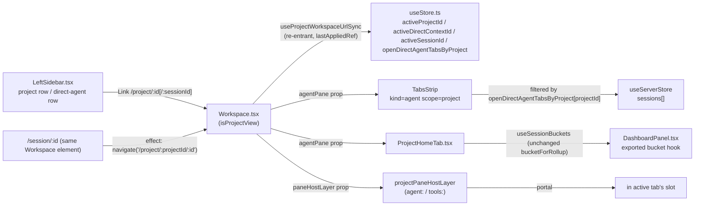

<!--
RULES — read before writing or implementing:
1. FORMAT: Bullets, tables, code, diagrams ONLY — no prose paragraphs
2. REQUIREMENTS: One crisp line each — no verbose descriptions
3. CHECKLIST: Mark items [x] as you complete them — this is your persistent todo list
4. READING TIME: Optimize for fast human scanning — if it's hard to skim, rewrite it
-->

# Plan: Project home workspace

> `/project/:id` becomes a tabbed workspace (persistent "Project" tab + one tab per direct agent, one shared project-scoped tools pane) — mirrors `/worktree/:wtId/:sessionId` for direct agents.

**Issue:** project-home-workspace
**Branch:** `feat/project-home-workspace`
**Status:** Pending
**PRD:** `.vibekit/feature-plans/pending/project-home-workspace/prd-project-home-workspace.md`

**Reference files:**
- Routing: `web-ui/src/App.tsx`, `web-ui/src/routes/Workspace.tsx`, `web-ui/src/hooks/useProjectWorkspaceUrlSync.ts` (new)
- Store: `web-ui/src/hooks/useStore.ts`
- Tabs / panes: `web-ui/src/components/layout/TabsStrip.tsx`, `Layout.tsx`, `PaneHostLayer.tsx`, `paneOutlets.tsx`, `ToolPanel.tsx`
- Dashboard reuse: `web-ui/src/components/layout/DashboardPanel.tsx`
- Sidebar wiring: `web-ui/src/components/layout/LeftSidebar.tsx`

---

## Problem & Concept

- `/project/:id` today (`Workspace.tsx:795-796`) just renders `<DashboardPanel projectFilter={projectId} />` — no git status, no quick actions, no way out of a non-git project.
- Every direct (non-worktree) agent is its own standalone `/session/:id` page (`App.tsx:174`) — no shared tab strip, no shared tools pane between two direct agents of the same project, even though `scope="project"` tools-pane plumbing already exists for a single direct session (`Workspace.tsx:717-726`).
- See `prd-project-home-workspace.md` for full problem statement, screen mockups, and resolved design questions.

## Out of Scope

- Worktree tabs/workspace layout — untouched (PRD non-goal); no change to `TabsStrip`'s close-and-terminate behavior for `scope="worktree"`.
- Multi-project tab strips — one project's workspace at a time (PRD non-goal).
- Any daemon/Rust change — `scope="project"` REST/WS plumbing already shipped in `vst-cli-path-open-and-files` Phase 6/7; this plan is web-ui only.
- Changing `DashboardPanel.tsx`'s `bucketForRollup`, `StatusDot.tsx`, `statusColor.ts`, or `tokens.css` — bucket grouping is reused unchanged (R9), so `docs/STATUS-INDICATORS.md` does NOT need updating (Decision 6).

## Requirements

| # | Requirement |
|---|-------------|
| R1 | `/project/:id` opens the project workspace, "Project" tab active by default. |
| R2 | `/project/:id/:sessionId` opens the workspace with that direct agent's tab active. |
| R3 | Page/browser-tab title AND TopBar breadcrumb show the project's name, never "Dashboard". |
| R4 | `/session/:id` redirects to `/project/:projectId/:id`. |
| R5 | Project tab shows inline git status (✓ + branch, or ⚠ "Not a git repo"). |
| R6 | Non-git project header has an inline "Run git init" action (no dialog). |
| R7 | "New worktree" always visible; disabled + tooltip when not git yet. |
| R8 | "New direct agent" always visible; skips the global draft composer. |
| R9 | Worktree sections keep today's status-bucket grouping (Working/Needs you/Idle/Finished), reused unchanged. |
| R10 | Direct agents get their own "Direct agents" section, separate from worktree buckets. |
| R11 | Empty state foregrounds the two quick actions, not a bare "No sessions yet". |
| R12 | Each direct agent gets its own tab (chat/terminal), same as a worktree agent tab. |
| R13 | All tabs (Project + every direct agent) share ONE tools-pane instance, scoped to the project. |
| R14 | Open/close file from any direct-agent tab reflects in the shared tools pane immediately. |
| R15 | Sidebar click on a direct agent activates/creates its tab in the project workspace, never a separate page. |
| R16 | Closing a direct-agent tab hides only that tab's view — it does NOT terminate the session (see Decision 5). |

---

## Change Map

```
web-ui/src/
  App.tsx                              ~ project/:id/:sessionId route
  routes/
    Workspace.tsx                      ~ project branch, Layout wiring, /session redirect
  hooks/
    useStore.ts                        ~ nullable setActiveSession, open-tab-set
    useProjectWorkspaceUrlSync.ts      + re-entrant URL/store sync, no ping-pong
  lib/
    defaultMode.ts                     + async first-mode resolver
  components/
    layout/
      DashboardPanel.tsx               ~ export bucketing loop as hook
      ProjectHomeTab.tsx               + Project tab UI
      TabsStrip.tsx                    ~ project+agent: open set, close, "+"
      TopBar.tsx                       ~ project-workspace breadcrumb
      LeftSidebar.tsx                  ~ retarget links into project workspace
```

`+` new file · `~` modified · unmarked = context only. Source files only — no tests, no config.

| Today | After this plan |
|-------|-----------------|
| `/project/:id` renders a bare `DashboardPanel` filtered to one project | `/project/:id` renders a tabbed workspace: pinned "Project" tab + agent tabs |
| Every direct agent lives at its own `/session/:id`, no shared tools pane | `/project/:id/:sessionId` opens it inside the shared workspace; `/session/:id` redirects |
| Direct agents and worktree sessions share one bucket set | Direct agents get their own "Direct agents" list; worktree buckets unchanged |
| Sidebar click on a direct agent opens a standalone page | Sidebar click activates/creates that agent's tab in the project workspace |
| Sidebar project row's single button both expands/collapses AND is the only click target | Folder icon still toggles; project name becomes its own link to `/project/:id` |
| Non-git project's `/project/:id` has no recovery action | Header has an inline "Run git init" action |
| Project quick-create always opens the global draft composer | Project tab's quick actions create a live session directly (R8) |
| Every direct agent of a project always shows as a tab | Only tabs in the open-tab set show; closing one hides it, doesn't end the session |
| Opening a project from inside its own worktree leaves stale worktree context | Entering project view always clears `activeWorktreeId` |

---

## Research

- `web-ui/src/App.tsx:168` — the only existing `/project/:projectId` route.
- `web-ui/src/App.tsx:171-176` — `/worktree`, `/worktree/:wtId`, `/worktree/:wtId/:sessionId`, `/session/:directSessionId`, `/draft/new`, `/draft/:draftSessionId` all render `<Workspace />`.
- `web-ui/src/routes/Workspace.tsx:33-35` — `isProjectView = location.pathname.startsWith("/project/")`, `projectId = params.projectId ?? null`.
- `web-ui/src/routes/Workspace.tsx:794-796` — `/project/:id` mounts `<DashboardPanel projectFilter={projectId} />` via the `dashboardPane` slot.
- `web-ui/src/components/layout/DashboardPanel.tsx:196-236` — bucketing loop mixes worktree-attached and direct sessions into the same 5 buckets (R10 needs a split).
- `web-ui/src/components/layout/DashboardPanel.tsx:358-369` — section labels are literal strings including `"pr created"` as its own section, not merged into "Working".
- `web-ui/src/components/layout/DashboardPanel.tsx:65,127-141` — `showFinished`, backed by `localStorage["dashboard:showFinished"]`, collapsed by default.
- `web-ui/src/components/layout/Layout.tsx:213-234` — when `dashboardPane != null`, `Layout` returns early: never reads `agentPane`/`toolPanel`/`terminalDock`/`workspaceCanvas`, mounts `paneHostLayer` at a different tree position (`:231` vs `:420`).
- `web-ui/src/components/layout/Layout.tsx:236-238` — the non-dashboard branch throws if `agentPane`/`toolPanel`/`terminalDock` are `undefined`.
- `web-ui/src/components/layout/Layout.tsx:11,13,17,19,22,26` — `paneHostLayer` is a single optional slot, not a second simultaneous instance.
- `web-ui/src/components/layout/PaneHostLayer.tsx:130-157` (`PaneHostSlot`) — moving a pane's portal target between its `<PaneOutlet>` and the offscreen holder unmounts+remounts it (documented gap) — switching Project↔agent tab remounts whichever `agent:<id>` pane just lost its outlet, matching existing worktree-tab-switch behavior; `tools:<projectId>` and the terminal dock's `TerminalPane` stay in one stable outlet across every switch (Decision 2/7) since they never depend on `activeSessionId`.
- `web-ui/src/routes/Workspace.tsx:794-861` — prop-spread arms: `isWorkspaceView` (`:836-843`), `isFullWidthPane` (`:844-845`), `isDirectSession` (`:846-854`), else/worktree (`:855-861`) — a new `isProjectView` arm is added (Decision 7).
- `web-ui/src/routes/Workspace.tsx:789` — `onWorktreeSelected` navigates to `/worktree/:wtId` only for `isDashboard || isSettings || isDirectSession || isWorkspaceView || isDraft`, omitting `isProjectView`.
- `web-ui/src/components/layout/TabsStrip.tsx:362-369` — auto-picks `projectSessions[0]` whenever no session is active — fights R1 for `kind="agent" scope="project"`.
- `web-ui/src/components/layout/TabsStrip.tsx:272-280` — `projectSessions` includes ALL direct sessions of the project matching `type === kind`, not just ones opened as a tab.
- `web-ui/src/components/layout/TabsStrip.tsx:836,838-847,908-971` — close control's `aria-label="Terminate ..."` calls `api.terminateSession` on confirm — correct for `scope="worktree"` (unchanged), wrong for `kind="agent" scope="project"` per R16.
- `web-ui/src/components/layout/TabsStrip.tsx:675-684` — `closeable = !s.isMain || siblingCount > 1`; direct sessions never carry `isMain`, so already always closeable — no change needed to this gate.
- `web-ui/src/components/layout/TabsStrip.tsx:856-886` — "+" button for `kind="agent"` always calls `createDraftSession({ target: "worktree", worktreeId, ... })`; in project scope `worktreeId` is a project id, so this drafts against a nonexistent worktree.
- `web-ui/src/hooks/useStore.ts:191,326,1015-1022` — `activeSessionId: string | null`; `setActiveSession` doesn't accept `null` (Decision 1).
- `web-ui/src/hooks/useStore.ts:1002-1014` (`selectProject`) — sets `activeProjectId`, clears `activeWorktreeId`/`activeSessionId`/`activeDirectContextId`; only caller is `Workspace.tsx:263`.
- `web-ui/src/hooks/useStore.ts:222,2070` and `:244,2076` — `openFileTabsByWorktree`/`lastSessionByWorktree` are plain `Record<string, ...>` maps persisted via `partialize` — the pattern `openDirectAgentTabsByProject` follows.
- `web-ui/src/routes/Workspace.tsx:251-256` — binds `activeDirectContextId` only when `isDirectSession`, deps `[isDirectSession, directSessionProject]` — omits `isProjectView` from both the guard and the deps, so on the `isDirectSession → isProjectView` transition it clobbers the new hook's write, and on `isProjectView → dashboard` it never re-fires at all (no `isProjectView` in deps) to clear the stale context.
- `web-ui/src/routes/Workspace.tsx:258-265` — `selectProject(projectId)` on every `projectId` change; unconditionally nulls `activeSessionId`/`activeDirectContextId`, racing the new hook if both fire in the same commit.
- `web-ui/src/routes/Workspace.tsx:367-396` — stale-selection cleanup guarded only by `isDirectSession`; in project view `activeWorktreeId` is `null` by design, so `wtStillExists` is always `false`, so this fires and nulls `activeProjectId`/`activeSessionId` on every `sessions` identity change (any WS `session:*` event anywhere in the app).
- **`useWorkspaceUrlSync.ts` — confirmed inert on `/project/` paths, no edit needed:** `:45` only acts `if (wtId)`, and `params.wtId` is always `undefined` on a `/project/:projectId/:sessionId` match (no `:wtId` segment); its write effect independently guards `if (!location.pathname.startsWith("/worktree")) return;` (`:82`).
- `web-ui/src/hooks/useWorkspaceUrlSync.ts:84-87` — the EXISTING worktree hook's write effect deliberately reads `useWorkspaceStore.getState()` instead of the render-scope subscribed values, with a comment explaining why: subscribed values are one render stale relative to what a same-commit effect just wrote. The new project hook's write effect must do the same (Decision 3).
- **URL-sync hook design constraints:**
  - A write effect that reads render-scope `activeDirectContextId`/`activeSessionId` (not `getState()`) computes its target from a stale value whenever the read effect (or any click handler) just wrote a new value in the same commit — this alone produces a navigate-back-then-forward loop between two session ids.
  - A read effect keyed to re-derive-and-apply on every `sessions` identity change (not just `params` changes) will stomp a same-tick programmatic store write (e.g. "New direct agent" calling `setActiveSession(newId)` directly) back to whatever the URL currently says, because `sessions` changing is unrelated to whether the URL actually changed.
  - A `lastAppliedRef` that is never cleared when the hook becomes disabled (leaving `/project/...` for `/worktree/...`, `/`, or `/settings`) silently blocks re-entry: returning to the same `{pid, sid}` pair later compares equal to the stale ref and the read effect no-ops, leaving `activeDirectContextId`/`activeWorktreeId` however the OTHER route left them.
  - Fix shape: track a `lastAppliedRef` holding the `{pid, sid}` pair this hook itself last drove the URL/store to; the read effect's "should I apply" guard compares `params`-derived `{pid, sid}` against `lastAppliedRef` AND against live store state (both must already agree to skip), and clears the ref whenever `enabled` is `false`; `sessions` stays in deps only to revalidate whether a `sessionId` param currently resolves to a real session, never as an independent re-apply trigger.
- **Opening a project from inside one of its own worktrees:** `useLayout.ts:9` (`layoutKey = activeWorktreeId ?? activeDirectContextId`), `TopBar.tsx:129` (`wt = worktrees.find(w => w.id === activeWorktreeId)`), and similar `activeWorktreeId`-first lookups in `FilePreviewPane.tsx`, `CodeView.tsx`, `OutlinePanel.tsx`, `ReferencesPanel.tsx`, `ToolPanel.tsx` all resolve to the stale worktree, not the project, if `activeWorktreeId` isn't explicitly cleared on entry — the naive "`activeProjectId !== pid` → clear" guard skips this when the project was already the active one (e.g. navigating from `/worktree/w1` of project `p1` straight to `/project/p1`, since `activeProjectId` is already `p1`).
- `web-ui/src/components/layout/ProjectPlusMenu.tsx:44-56` — for a non-git project, "Agent in worktree" is HIDDEN (`{project.isGit && (...)}`), not disabled-with-tooltip — different pattern than R7 needs; R7's disabled/tooltip state is new UI.
- `web-ui/src/api/client.ts:766-774` — `createDirectSession(body): Promise<Session>`, `POST /sessions` with `target: "direct"`, returns a live session synchronously.
- `web-ui/src/api/types.ts:898-909` — `CreateDirectSessionBody.modeId` is optional.
- `web-ui/src/api/client.ts:583` — `createWorktree(body: CreateWorktreeBody): Promise<Worktree>`.
- `web-ui/src/api/types.ts:858-881` — `CreateWorktreeBody.modeId: string` is REQUIRED, unlike `CreateDirectSessionBody`.
- `web-ui/src/store/modesStore.ts:17,27-30` — `ModesState.modes: Map<string, Mode>`, not an array — `modes[0]` is `undefined` and a type error.
- `web-ui/src/store/modesStore.ts:72-78` (`ensureLoaded`) — the modes store loads lazily; may be empty on first Project-tab render unless awaited first.
- `web-ui/src/components/draft/DraftComposer.tsx:220-222` — the actual "first mode as default" precedent: `const [ms, cs] = await Promise.all([api.listModes(), ...]); if (ms[0] && !modeId) setModeId(ms[0].id);` — operates on its OWN locally-fetched array, not the shared `modesStore` Map; the new `resolveDefaultModeId` helper reads the shared Map's first value instead (Decision 8).
- `web-ui/src/api/types.ts:117` — `export type FileScope = "worktree" | "project"`.
- `web-ui/src/api/types.ts:60-76` — `Project { id; name; path; prefix; isGit: boolean; defaultBranch?; createdAt; hidden: boolean (72); lspEnabled: boolean }`.
- `web-ui/src/hooks/usePendingFileOpens.ts:57-79` — `useOpenFilesChanged(api)` keys `openFileTabsByWorktree` by `ev.worktreeId ?? ev.projectId`, satisfying R14 as long as every tab reads the same `tools:<projectId>` pane.
- `web-ui/src/components/layout/TopBar.tsx:61` — `layoutMode` prop union: `"workspace" | "dashboard" | "settings" | "login" | "direct-session" | "workspace-view"` — needs `"project-workspace"` added.
- `web-ui/src/components/layout/TopBar.tsx:128-129` — `project`/`wt` are derived INSIDE `TopBar` from `activeProjectId`/`activeWorktreeId` props (`projects.find`/`worktrees.find`) — since the new hook already sets `activeProjectId` correctly for project view, the existing `project` variable resolves correctly with no new TopBar prop needed.
- `web-ui/src/components/layout/TopBar.tsx:160-190` — breadcrumb switch has no branch for a project-workspace `layoutMode`.
- `web-ui/src/components/layout/TopBar.tsx:318` — pane-toggle buttons (Files search, etc.) only render `if (layoutMode === "workspace" || layoutMode === "direct-session")` — needs `|| layoutMode === "project-workspace"` or the toggle buttons vanish in project view.
- `web-ui/src/routes/Workspace.tsx:729-737` — `layoutMode` computed as one of `"settings" | "dashboard" | "direct-session" | "workspace-view" | "workspace"` — needs a new `"project-workspace"` member.
- `web-ui/src/components/dialogs/NonGitWorktreeDialog.tsx:5-29` — existing git-init recovery UI is a MODAL, triggered only from `DraftComposer.tsx`'s worktree-creation 422 `NOT_GIT` retry flow — R6 wants an inline header action, only the call pattern is reused.
- `web-ui/src/components/draft/DraftComposer.tsx:693-703` (`gitInitAndApply`) — calls `api.gitInitProject(projectId)`, applies the HTTP response directly to `useServerStore` via `applyProjectUpdated`, per AGENTS.md's self-sufficient-response rule.
- `web-ui/src/api/client.ts:572-580` — `gitInitProject(id): Promise<{ ok: true; isGit: true; defaultBranch: string | null }>`.
- `web-ui/src/components/layout/LeftSidebar.tsx:1769-1786` — the project row's expand/collapse toggle is ONE `<button className="tree-row__project-expand">` wrapping BOTH the `Folder`/`FolderOpen` icon (`tree-row__chevron tree-row__project-chevron`, the row's only disclosure indicator — there is no separate chevron) AND the `tree-row__label` name span; both fire `toggleProj(p.id)` today, and no `/project/` navigation exists anywhere in `LeftSidebar.tsx`.
- `web-ui/src/components/layout/LeftSidebar.tsx:275-283` (`directSessionMap`) — groups direct agents by `projectId`, excluding `state === "drafting"`.
- `web-ui/src/components/layout/LeftSidebar.tsx:1264-1291,1926-1941` — two `<Link to={`/session/${sess.id}`}>` sites for a direct-agent row.
- `web-ui/src/components/layout/LeftSidebar.tsx:929-936` (`confirmTerminateSession`) — compares `location.pathname === `/session/${sess.id}`` before navigating away from a session about to be terminated, currently navigating to `/`.
- `web-ui/src/components/layout/LeftSidebar.tsx:1087-1125` (`handleNewWorktree`/`handleNewDirectAgent`) — both call `api.createDraftSession(...)` then `navigate(`/draft/${id}`)` — the global draft composer flow R8's quick actions must skip.
- `web-ui/src/routes/Workspace.tsx:200-201` (`handleAgentCreated`) — receives `{ worktreeId?, sessionId? }` with no `projectId`; when only `sessionId` is present it currently navigates to `/session/${result.sessionId}`.
- `web-ui/src/routes/Workspace.tsx:163-199` (`handleAgentCreated`, full body) — this existing callback is the established fix for exactly the gap a hand-rolled `applyWorktreeCreated` + `navigate("/worktree/:id")` would reintroduce: its own comment (`:163-169`) explains that `useWorkspaceUrlSync`'s read effect only consumes URL params once per mount (`useWorkspaceUrlSync.ts:16,20,73`), so a same-page-load SPA navigation to a second `/worktree/...` URL is never read by it — the worktree write effect (`:88-104`) would instead see `activeWorktreeId` already nulled by `selectProject` and rewrite the URL back to bare `/worktree`. `handleAgentCreated` sidesteps this by calling `setActiveWorktree(wt.projectId, wt.id, wtSessions)` directly on the store before navigating, which the "New worktree" quick action must reuse rather than reimplement.
- AGENTS.md § "Session status in a pane" — status-driven UI resolves `sessionStates[id] ?? session.state`, never `.lifecycleState`.
- AGENTS.md § "never unmount TerminalPane during UI transitions" — `tools:<projectId>` and the terminal dock's `TerminalPane` stay claimed by one stable `<PaneOutlet>` across every Project↔agent switch; agent panes are exempt, matching existing worktree-tab behavior.
- AGENTS.md § "Status indicators" — a `docs/STATUS-INDICATORS.md` update is required only if `statusColor.ts`/`bucketForRollup`/`StatusDot.tsx`/`tokens.css` change; none change here.
- `rust/vst-routes/src/open.rs:153-158` — `vst <path>`/`vst open` does not unhide an already-hidden project, so opening a hidden project's path bounces to `/` under Decision 3's unknown/hidden-project guard rather than showing a view (Risk #6).
- **Root cause:** `/project/:id` and `/session/:id` were built as two independent, minimal features, each with `Workspace.tsx` effects scoped narrowly to `isDashboard`/`isDirectSession` — a third state (`isProjectView`, multi-tab, URL and store both mutable from either direction) needs its own re-entrant, ping-pong-safe sync and its own effect guards.

---

## Architecture Diagram



---

## Design Details

### System Boundaries

- **Module ↔ Module (in-process), web-ui only** — no new Frontend↔Backend boundary; all contracts below already exist, unchanged.

| Boundary | Existing contract (unchanged) | Owner |
|----------|-------------------------------|-------|
| `web-ui` ↔ daemon — direct session create | `POST /sessions { target: "direct", projectId, type, modeId?, ... } → Session` (`client.ts:766-774`) | Daemon |
| `web-ui` ↔ daemon — worktree create | `POST /worktrees { projectId, modeId, ... } → Worktree` (`client.ts:583`) | Daemon |
| `web-ui` ↔ daemon — git init | `POST /projects/:id/git-init → { ok, isGit, defaultBranch }` (`client.ts:572-580`) | Daemon |
| `web-ui` ↔ daemon — project-scoped files/search/VCS/open-files | `GET/POST/DELETE /projects/:id/...`, WS `scope: "project"` | Daemon (`rust/vst-routes/src/projects.rs`) |
| `web-ui` ↔ daemon — open-files fanout | WS `openFiles:changed { worktreeId?, projectId?, paths }` | Daemon → `usePendingFileOpens.ts:57-79` |

### Critical User Journeys (CUJs)

#### CUJ 1 — Open a project from inside one of its own worktrees, then switch agent tabs

```
User is on /worktree/w1 (project p1), clicks p1's name in the sidebar
  → navigate("/project/p1")
  → read effect: pid="p1", sid=null; lastAppliedRef differs -> apply
    → activeWorktreeId != null so selectProject("p1") runs even though activeProjectId already "p1"
    → setActiveDirectContext("p1"); setActiveSession(null); seed open-tab set if unseeded
  → activeWorktreeId is now null — every activeWorktreeId ?? activeDirectContextId lookup resolves to p1, not w1
  → write effect (reads getState()): target "/project/p1" === location.pathname -> no navigate
  → User clicks a direct-agent tab -> setActiveSession(id) (store write, no navigation yet)
  → write effect fires: getState() gives the new id, target differs from pathname -> navigate(replace)
  → params change -> read effect fires -> params already equal lastAppliedRef (write effect updated it) -> no-op
```

- **Error path:** `sessionId` param doesn't resolve to a direct agent of THIS project (wrong project, wrong type, or a worktree session) → treated as absent, falls back to the Project tab.
- **Edge case:** `projectId` param doesn't match any known (or is a hidden) project, once `bundleLoaded` → redirect to `/`.

#### CUJ 1b — Leave the project workspace for a worktree, then come back

```
User is on /project/p1/s1, clicks a worktree row -> navigate("/worktree/w1")
  → Decision-9 cleanup clears activeDirectContextId; sidebar sets activeWorktreeId="w1", activeSessionId="ws"
  → useProjectWorkspaceUrlSync's `enabled` (isProjectView) flips false -> its read effect clears lastAppliedRef to null
  → User clicks p1's name in the sidebar again -> navigate("/project/p1")
  → enabled flips true; read effect: lastAppliedRef is null (just cleared), so {p1, null} does NOT match it -> applies
    → activeWorktreeId != null so selectProject("p1") runs; setActiveDirectContext("p1"); setActiveSession(null)
  → activeDirectContextId === "p1", activeWorktreeId === null — no stale worktree context left behind
```

- **Contrast with the naive fix:** comparing only against `lastAppliedRef` (without also clearing it on `enabled -> false`, or without checking it against live store state) would see the SAME `{p1, null}` pair as the original visit and skip re-applying, leaving `activeDirectContextId` null and `activeWorktreeId` stuck at `w1` — the read effect's skip guard checks both the ref AND that `store.activeDirectContextId === pid && store.activeWorktreeId == null` before it will skip.

#### CUJ 2 — "New direct agent" quick action doesn't get clobbered by its own `sessions` update

```
User clicks "New direct agent" on the Project tab
  → await resolveDefaultModeId(api); await api.createDirectSession(...)
  → applySessionCreated(res) [sessions array gets a new identity]; openProjectAgentTab(p1, res.id); setActiveSession(res.id)
  → read effect re-fires because `sessions` is in its deps, but params still say pid="p1", sid=null
    → computed {pid, sid} equals lastAppliedRef (still {p1, null} from the last URL-driven apply) -> returns early, does NOT reset activeSessionId
  → write effect (reads getState()): sees the just-created session as active, target "/project/p1/<new-id>" differs from pathname -> navigates
  → params update -> read effect re-fires, now matches the NEW lastAppliedRef -> no-op, loop terminates
```

- **Error path:** `createDirectSession` rejects → inline error shown, no store mutation, no navigation.

#### CUJ 3 — Non-git project, run git init inline

```
User opens /project/:id for a non-git project
  → header shows "⚠ Not a git repo" + inline "Run git init"; "New worktree" disabled with tooltip
  → click "Run git init" -> api.gitInitProject(id) -> applyProjectUpdated({ ...project, isGit, defaultBranch })
  → header flips to "✓ <defaultBranch>", "New worktree" enabled — no reload, no dialog
```

- **Error path:** `gitInitProject` rejects → inline error text, button stays actionable for retry.

#### CUJ 4 — "New worktree" quick action lands on the new worktree, even if a `/worktree/...` URL was already consumed this page load

```
User previously visited /worktree/w0 earlier in this page session (useWorkspaceUrlSync's urlConsumed = true)
User is now on /project/p1, clicks "New worktree"
  → await resolveDefaultModeId(api); await api.createWorktree({ projectId: "p1", modeId })
  → applyWorktreeCreated(wt) [registers wt1 in useServerStore]
  → onWorktreeCreated({ worktreeId: "wt1", sessionId: wt.mainSessionId }) === Workspace.tsx's handleAgentCreated
    → setActiveWorktree("p1", "wt1", wtSessions) — store write, NOT dependent on useWorkspaceUrlSync's one-shot read effect
    → setActiveSession(mainSessionId) if already known
    → navigate("/worktree/wt1")
  → worktree write effect (useWorkspaceUrlSync.ts:88-104) sees activeWorktreeId="wt1" already set, target matches pathname -> no bounce back to bare /worktree
```

- **Error path:** `createWorktree` rejects → inline error shown, no navigation, no store mutation.

### Data Model

- No new persisted daemon entities/fields — client-side (React/Zustand) only.

| Field | Type | Constraints | Notes |
|-------|------|-------------|-------|
| `openDirectAgentTabsByProject` | `Record<string, string[]>` | key = projectId, value = ordered session ids | Which direct-agent sessions show as tabs (Decision 5); `undefined` for a key = "never seeded", `[]` = "user closed all tabs" — distinct states |

- **Migration:** N (client-only, absent key defaults to unseeded).

### Key Decisions

#### Decision 1: `setActiveSession` widens to accept `null` as the "Project tab is active" sentinel

- **Decision:** Change the type to `(sessionId: string | null) => void`.
- **Rationale:** `activeSessionId` is already `string | null` — reuses the same field instead of a second concept.
- **Where:** `web-ui/src/hooks/useStore.ts:326,1015-1022`; skip the `lastSessionByWorktree` write when `sessionId == null`.

```ts
setActiveSession: (sessionId) =>
  set((s) => ({
    activeSessionId: sessionId,
    lastSessionByWorktree: sessionId == null ? s.lastSessionByWorktree : { /* existing key logic */ },
  })),
```

#### Decision 2: Project workspace gets its own `PaneHostLayer` element, passed into Layout's single `paneHostLayer` slot

- **Decision:** Add `projectPaneKeys`/`renderProjectPane` in `Workspace.tsx`, keyed off `activeDirectContextId`; `projectPaneKeys` = `agent:<id>` for every id in `openDirectAgentTabsByProject[projectId] ?? []` that ALSO still exists in `sessions` — a session terminated elsewhere must not leave a stale pane key — plus one `tools:<projectId>`. Build ONE `<PaneHostLayer>` element, passed as `paneHostLayer` (Decision 7's prop arm).
- **Rationale:** `renderWorktreePane`'s `tools:` branch resolves worktrees only; a project id would silently look up nothing — a parallel function keeps worktree-scope code untouched.
- **Where:** `web-ui/src/routes/Workspace.tsx` — `renderProjectPane`'s agent branch → `AgentPaneSlot` with `branch={null}`/`pr={null}`; tools branch → `<ToolPanel worktreeId={projectId} scope="project" .../>`.
- **Note:** terminal session keys are excluded from `projectPaneKeys` — the terminal dock's `TerminalPane` renders directly in the `terminalDock` prop element (mirrors `Workspace.tsx:721-726`), whose identity depends only on `activeTerminalSessionId`, never `activeSessionId`, so it never remounts on a Project↔agent switch.

#### Decision 3: `useProjectWorkspaceUrlSync` is re-entrant, ping-pong-safe, and single-owner for project-view store fields

- **Decision:** New hook, called UNCONDITIONALLY with an `enabled: boolean` parameter (every effect body starts `if (!enabled) return;` — never a conditional hook call). A `lastAppliedRef` holds the `{pid, sid}` pair this hook itself last synced, and is CLEARED to `null` whenever `enabled` is `false`. The read effect only skips applying when BOTH the params-derived pair matches `lastAppliedRef` AND the live store already agrees (`activeDirectContextId === pid && activeWorktreeId == null`) — a match against the ref alone is not sufficient, since the store can have been changed by something else (a worktree route, a settings visit) since this hook last ran. `sessions` stays in the read effect's deps solely to revalidate a `sessionId`'s existence/ownership, never as an independent re-apply trigger. The write effect reads `useWorkspaceStore.getState()` directly (never the hook's own subscribed `activeDirectContextId`/`activeSessionId`), matching `useWorkspaceUrlSync.ts:84-87`'s existing precedent for the same staleness reason, and updates `lastAppliedRef` before navigating.
- **Rationale:** A write effect reading render-scope state computes its target from a value that can be one render behind what a same-commit read effect (or an unrelated click handler) just wrote, producing a navigate-back-then-forward loop; a read effect that re-derives from `sessions` alone (without a `lastAppliedRef` gate) stomps a same-tick programmatic store write, like "New direct agent" calling `setActiveSession` directly, back to whatever the URL currently says; a `lastAppliedRef` that survives `enabled` flipping false silently blocks re-entry to a previously-visited `{pid, sid}` pair, leaving the OTHER route's state (e.g. a stale `activeWorktreeId`) in place (CUJ 1b).
- **Where:** new file, called as `useProjectWorkspaceUrlSync(isProjectView, bundleLoaded, sessions, projects)`, replacing `Workspace.tsx:258-265` (Decision 9) and folding in: session-ownership validation, unknown/hidden-project redirect, open-tab-set seeding (seeded before the URL-provided session is added to the open set, so a first visit via a direct sidebar link still seeds every OTHER existing agent — Decision 5), and clearing a stale `activeWorktreeId` regardless of whether `activeProjectId` already matches.

```ts
// useProjectWorkspaceUrlSync.ts
export function useProjectWorkspaceUrlSync(
  enabled: boolean,
  bundleLoaded: boolean,
  sessions: Session[],
  projects: Project[],
) {
  const params = useParams<{ projectId?: string; sessionId?: string }>();
  const location = useLocation();
  const navigate = useNavigate();
  const activeDirectContextId = useWorkspaceStore((s) => s.activeDirectContextId);
  const activeSessionId = useWorkspaceStore((s) => s.activeSessionId);
  // {pid, sid} this hook itself last drove the URL/store to. Cleared to null
  // whenever `enabled` goes false (leaving the project workspace entirely),
  // so a later re-entry to the SAME {pid, sid} pair is never mistaken for
  // "already applied" just because it matches a stale ref from before the
  // trip away — see CUJ 1b.
  const lastAppliedRef = useRef<{ pid: string | null; sid: string | null } | null>(null);

  useEffect(() => {
    if (!enabled) {
      lastAppliedRef.current = null;
      return;
    }
    if (!bundleLoaded) return;
    const pid = params.projectId ?? null;
    if (!pid) return;
    const project = projects.find((p) => p.id === pid);
    if (!project || project.hidden) {
      navigate("/", { replace: true });
      return;
    }
    // Only accept a sessionId that is actually a direct agent OF this project.
    const sid =
      params.sessionId &&
      sessions.some((s) => s.id === params.sessionId && s.projectId === pid && s.worktreeId === null && s.type === "agent")
        ? params.sessionId
        : null;
    const store = useWorkspaceStore.getState();
    // Skip only when BOTH the ref and the live store already agree the
    // project/no-worktree context is right — deliberately NOT checking
    // activeSessionId here: a same-tick programmatic write (e.g. "New
    // direct agent" calling setActiveSession directly) can legitimately
    // diverge activeSessionId from `sid` while params haven't caught up
    // yet, and that divergence must NOT be re-derived away (CUJ 2).
    const refMatches = lastAppliedRef.current?.pid === pid && lastAppliedRef.current?.sid === sid;
    const storeMatches = store.activeDirectContextId === pid && store.activeWorktreeId == null;
    if (refMatches && storeMatches) return;
    lastAppliedRef.current = { pid, sid };
    // Clear a stale activeWorktreeId even when activeProjectId already
    // matches — entering from one of this project's OWN worktrees is the
    // main path in via the sidebar.
    if (store.activeProjectId !== pid || store.activeWorktreeId != null) store.selectProject(pid);
    store.setActiveDirectContext(pid);
    // Seed the open-tab set BEFORE opening the URL-provided session, so a
    // first visit via a direct sidebar link (/project/p/s1) still seeds
    // every OTHER pre-existing direct agent as a tab, not just s1.
    store.seedProjectAgentTabsIfEmpty(pid, sessions);
    store.setActiveSession(sid);
    if (sid) store.openProjectAgentTab(pid, sid);
  }, [enabled, bundleLoaded, params.projectId, params.sessionId, sessions, projects, navigate]);

  useEffect(() => {
    if (!enabled) return;
    // Read getState() directly — the subscribed values above can be one
    // render stale relative to a same-commit write (useWorkspaceUrlSync.ts:84-87
    // is the existing precedent for this exact fix).
    const { activeDirectContextId: pid, activeSessionId: sid } = useWorkspaceStore.getState();
    if (!pid) return;
    const target = sid ? `/project/${pid}/${sid}` : `/project/${pid}`;
    lastAppliedRef.current = { pid, sid };
    if (location.pathname !== target) navigate(target, { replace: true });
  }, [enabled, activeDirectContextId, activeSessionId, location.pathname, navigate]);
}
```

#### Decision 4: Sidebar direct-agent rows navigate to `/project/:projectId/:id`; project rows get a new name-link to `/project/:id`

- **Decision:** Both existing direct-agent `<Link>` sites (`LeftSidebar.tsx:1264-1291,1926-1941`) change to `/project/${sess.projectId}/${sess.id}`; the pathname comparison at `LeftSidebar.tsx:935` updates to match. The project row's single `tree-row__project-expand` button (`LeftSidebar.tsx:1769-1786`) splits into two sibling elements: the existing `Folder`/`FolderOpen` icon keeps its own small button, unchanged (`onClick={() => toggleProj(p.id)}`, same `aria-expanded`/`aria-label`), reusing the icon as-is rather than adding any new visual element; the `tree-row__label` name span becomes its own separate clickable element (`<Link to={`/project/${p.id}`}>`, styled to match) with its own `aria-label={`Open project ${p.name}`}`, `draggable={false}`, and `onClickCapture={suppressDoubleClickNavigation}` — the same drag-click guard the direct-agent row links already use, needed because the row container spreads dnd-kit's `{...listeners}` (`LeftSidebar.tsx:1770`) and a drag could otherwise fire a navigation.
- **Rationale:** Activation is handled entirely by Decision 3's URL sync — no sidebar-side branching needed; no project-row navigation exists today, so the name-link is new code, but the disclosure control itself is a pure split of the existing button, not a new UI element.
- **Where:** `web-ui/src/components/layout/LeftSidebar.tsx:935,1264-1291,1769-1786,1926-1941`.

#### Decision 5: Direct-agent tab "close" gets its own hide-not-terminate behavior, backed by a client-side open-tab set

- **Decision:** For `kind="agent" scope="project"` only, the close control calls `closeProjectAgentTab(projectId, sessionId)` directly (removes the id from the open-tab set; if it was `activeSessionId`, sets it to `null`) — no confirm dialog, no `terminateSession`. `scope="worktree"` is unchanged. The open-tab set is seeded once per project (first URL-sync apply for a project with no existing entry) with every non-archived, non-drafting direct agent (matching `LeftSidebar.tsx:275-283`'s draft exclusion), so pre-existing/CLI-created agents show as tabs immediately — `seedProjectAgentTabsIfEmpty` only acts when the map has no key at all for that project, so a deliberately emptied set (`[]`, user closed every tab) is never re-seeded; Decision 3's read effect calls it BEFORE `openProjectAgentTab`, so entering directly via a sidebar link to one specific agent (`/project/p/s1`) still seeds every OTHER existing agent as a tab, not just `s1`.
- **Rationale:** PRD R16 and "Resolved design question #3" are the approved spec — closing does not terminate.
- **Where:** new `useStore.ts` state `openDirectAgentTabsByProject` + actions `openProjectAgentTab(projectId, sessionId)`, `closeProjectAgentTab(projectId, sessionId)`, `seedProjectAgentTabsIfEmpty(projectId, sessions)`; `TabsStrip.tsx:272-280`'s `projectSessions` memo, for `kind==="agent"`, additionally filters to ids in `openDirectAgentTabsByProject[worktreeId] ?? []`; `TabsStrip.tsx:835-848`'s close control branches on `isAgent && isProject` to call `closeProjectAgentTab`; `TabsStrip.tsx:856-886`'s "+" button, for `isAgent && isProject`, calls `createDirectSession` (Decision 8's helper) then `openProjectAgentTab`.

```ts
// useStore.ts — open-tab-set actions (Decision 5)
openProjectAgentTab: (projectId, sessionId) =>
  set((s) => {
    const cur = s.openDirectAgentTabsByProject[projectId] ?? [];
    const next = cur.includes(sessionId) ? cur : [...cur, sessionId];
    return { openDirectAgentTabsByProject: { ...s.openDirectAgentTabsByProject, [projectId]: next } };
  }),
closeProjectAgentTab: (projectId, sessionId) =>
  set((s) => {
    const cur = s.openDirectAgentTabsByProject[projectId] ?? [];
    return {
      openDirectAgentTabsByProject: { ...s.openDirectAgentTabsByProject, [projectId]: cur.filter((id) => id !== sessionId) },
      activeSessionId: s.activeSessionId === sessionId ? null : s.activeSessionId,
    };
  }),
// Seeds only when the project has NO entry yet (undefined, not `[]`) — an
// intentionally emptied set must never be silently repopulated. Excludes
// drafts (state === "drafting"), matching LeftSidebar.tsx:275-283 — a draft
// renders as its own Tier 1 row elsewhere, not as an open tab.
seedProjectAgentTabsIfEmpty: (projectId, sessions) =>
  set((s) => {
    if (s.openDirectAgentTabsByProject[projectId] !== undefined) return s;
    const ids = sessions
      .filter(
        (x) =>
          x.projectId === projectId &&
          x.worktreeId === null &&
          x.type === "agent" &&
          x.archivedAt == null &&
          x.state !== "drafting",
      )
      .map((x) => x.id);
    return { openDirectAgentTabsByProject: { ...s.openDirectAgentTabsByProject, [projectId]: ids } };
  }),
```

#### Decision 6: `DashboardPanel.tsx`'s bucketing logic is extracted into an exported hook, not duplicated

- **Decision:** Extract `DashboardPanel.tsx:196-236`'s per-session loop into exported `useSessionBuckets(projectFilter, opts?: { worktreeOnly?: boolean })`; it reads `sessions`/`sessionStates`/`hiddenProjectIds`/`worktreeById`/`worktreePrById` internally via the same store selectors `DashboardPanel` already uses. `DashboardPanel` calls it with defaults (unchanged behavior); `ProjectHomeTab` calls it with `worktreeOnly: true` and separately renders `s.worktreeId == null` sessions in its own "Direct agents" list.
- **Rationale:** R9 requires worktree buckets stay logic-identical; R10 requires direct agents excluded from them entirely; `bucketForRollup` itself is untouched, so no `docs/STATUS-INDICATORS.md` update.
- **Where:** `web-ui/src/components/layout/DashboardPanel.tsx` (new export); `ProjectHomeTab.tsx` renders the same 5 section labels `DashboardPanel` uses (`working`, `needs-you`, `idle`, `"pr created"`, `finished`/`showFinished`-collapsed) — no new labels invented.

#### Decision 7: Project workspace is wired through `agentPane`/`toolPanel`/`terminalDock`/`paneHostLayer`, never through `dashboardPane`

- **Decision:** `Workspace.tsx:795`'s `dashboardPane` condition drops `isProjectView`; a new `isProjectView` arm is added to the prop spread at `:836-861`, passing `agentPane` (pinned Project tab + `TabsStrip kind="agent" scope="project"` + active-tab outlet), `toolPanel: <PaneOutlet paneKey={`tools:${projectId}`} />`, `terminalDock` (mirrors `:721-726`), `paneHostLayer: projectPaneHostLayer` (Decision 2).
- **Rationale:** `Layout.tsx:213-238` makes `dashboardPane` and `agentPane`/`toolPanel`/`terminalDock` mutually exclusive at different tree positions — routing through `dashboardPane` would unmount the whole pane-host tree on every tab switch and cannot carry a shared tools pane beside tab content.
- **Where:** `web-ui/src/routes/Workspace.tsx:794-796,836-861`.

#### Decision 8: Quick-created sessions resolve a default mode via one async, shared helper

- **Decision:** New `web-ui/src/lib/defaultMode.ts` exports `async function resolveDefaultModeId(api: ApiInstance): Promise<string | null>` — calls `await ensureLoaded(api)` then returns the first value of `useModesStore.getState().modes.values()`, or `null`. Both `ProjectHomeTab.tsx`'s quick actions and `TabsStrip.tsx`'s project-scope "+" button `await` this ONE helper before creating a session.
- **Rationale:** `ModesState.modes` is a `Map<string, Mode>`, not an array — `modes[0]` is `undefined`/a type error (Research) — and the store loads lazily, so the resolved id must be awaited, not read synchronously. `DraftComposer.tsx:220-222` is the existing "first mode as default" precedent, applied there to its own locally-fetched array rather than the shared store.
- **Where:** new file; called from `ProjectHomeTab.tsx` and `TabsStrip.tsx:856-886`, both `await`ed.

```ts
// defaultMode.ts
export async function resolveDefaultModeId(api: ApiInstance): Promise<string | null> {
  await ensureLoaded(api);
  return useModesStore.getState().modes.values().next().value?.id ?? null;
}
```

#### Decision 9: `Workspace.tsx`'s pre-existing `isDirectSession`-only effects are guarded off for `isProjectView`

- **Decision:** `Workspace.tsx:251-256` gains `if (isProjectView) return;` at the top of its body AND `isProjectView` added to its deps, so leaving project view (to `/` or `/settings`) still re-triggers the effect and clears `activeDirectContextId`. `Workspace.tsx:258-265` is deleted outright — Decision 3's hook owns `selectProject`/`setActiveDirectContext`/`setActiveSession` as one atomic unit. `Workspace.tsx:367-396`'s guard becomes `if (!bundleLoaded || isDirectSession || isProjectView) return;`.
- **Rationale:** Single ownership of these fields for project view avoids the cross-effect ordering race two independent effects would otherwise reintroduce.
- **Where:** `web-ui/src/routes/Workspace.tsx:251-256,258-265,367-396`.

#### Decision 10: TopBar gets a `"project-workspace"` `layoutMode`, mirroring the `direct-session` breadcrumb pattern

- **Decision:** `Workspace.tsx:729-737`'s `layoutMode` gains `isProjectView ? "project-workspace" : ...`. `TopBar.tsx:61`'s prop union gains `"project-workspace"`. `TopBar.tsx:160-190`'s breadcrumb switch gains a branch pushing `project.name` (using the EXISTING `project` variable at `TopBar.tsx:128`, already derived from `activeProjectId`, which Decision 3's hook sets correctly — no new prop needed) plus, when an agent tab is active, that session's label as a second highlighted crumb part. `TopBar.tsx:318`'s pane-toggle-button condition gains `|| layoutMode === "project-workspace"`.
- **Rationale:** `document.title` alone doesn't cover the visible breadcrumb (R3); without the `:318` fix the Files-search/pane-toggle icons disappear in project view.
- **Where:** `web-ui/src/routes/Workspace.tsx:729-737`, `web-ui/src/components/layout/TopBar.tsx:61,160-190,318`.

---

## Risks / Open Questions

| # | Question | Notes |
|---|----------|-------|
| 1 | **Does at least one agent mode always exist?** | Decision 8's fallback assumes a non-empty modes list; if a fresh project genuinely has zero, the quick actions show the disabled+tooltip state the plan already specifies — verify against a real fresh install before shipping. |
| 2 | **R5's git status shows `project.defaultBranch`, not necessarily the checked-out branch.** | `defaultBranch` is a project-level field, not a live HEAD read; flagged for implementer judgment at Phase 2. |
| 3 | **Tab overflow with 10+ direct agents.** | `TabsStrip` is the same component for both scopes — existing overflow/scroll behavior applies automatically. |
| 4 | **Pinned/un-closeable "Project" tab — no existing precedent.** | Rendered as bespoke UI in `Workspace.tsx`'s `agentPane` element, outside `TabsStrip`'s own tab list. |
| 5 | **Open-tab-set persistence scope.** | Persists client-side only (same as `openFileTabsByWorktree`) — a different browser/device won't see the same open tabs; acceptable per PRD, flagged for awareness. |
| 6 | **`vst <path>` on a HIDDEN project.** | `rust/vst-routes/src/open.rs:153-158` doesn't unhide an already-hidden project, so Decision 3's unknown/hidden-project guard bounces it to `/` instead of showing a view — a known limitation, not necessarily worth fixing in this plan. |

---

## Implementation Phases

- Every phase ends with a **verification block** — the phase is not complete until those tests pass.
- Test items use `N.Tn` numbering. Unit tests verify isolated logic; integration tests verify a route/store/UI flow end to end.
- Existing test files to extend (not create fresh, unless noted `New`): `web-ui/src/routes/Workspace.test.tsx`, `web-ui/src/hooks/useStore.test.ts`, `web-ui/src/components/layout/DashboardPanel.test.tsx`, `web-ui/src/components/layout/LeftSidebar.test.tsx`, `web-ui/src/components/layout/TabsStrip.test.tsx`, `web-ui/src/components/layout/TopBar.test.tsx`.

---

### Phase 1 — Routing foundation: new route, open-tab-set state, re-entrant URL sync, effect-ownership fixes

- [x] **1.1** `web-ui/src/App.tsx`: add `<Route path="/project/:projectId/:sessionId" element={<Workspace />} />` next to the existing `/project/:projectId` route (`:168`).
- [x] **1.2** `web-ui/src/hooks/useStore.ts:326,1015-1022`: widen `setActiveSession`'s type to `(sessionId: string | null) => void` per Decision 1.
- [x] **1.3** `web-ui/src/hooks/useStore.ts`: add `openDirectAgentTabsByProject: Record<string, string[]>` (persisted, same `partialize` convention as `openFileTabsByWorktree`) plus `openProjectAgentTab`, `closeProjectAgentTab`, `seedProjectAgentTabsIfEmpty` actions per Decision 5's snippet, done before item 1.4 so the hook can call them.
- [x] **1.4** `web-ui/src/hooks/useProjectWorkspaceUrlSync.ts` (new): implement per Decision 3's snippet.
- [x] **1.5** `web-ui/src/routes/Workspace.tsx`: call `useProjectWorkspaceUrlSync(isProjectView, bundleLoaded, sessions, projects)` unconditionally.
- [x] **1.6** `web-ui/src/routes/Workspace.tsx:251-256`: add `if (isProjectView) return;` at the top of the body and add `isProjectView` to the deps array per Decision 9.
- [x] **1.7** `web-ui/src/routes/Workspace.tsx:258-265`: delete this effect entirely per Decision 9.
- [x] **1.8** `web-ui/src/routes/Workspace.tsx:367-396`: extend the guard to `if (!bundleLoaded || isDirectSession || isProjectView) return;` per Decision 9.
- [x] **1.9** `web-ui/src/routes/Workspace.tsx:789` (`onWorktreeSelected`): add `isProjectView` to the navigation condition.
- [x] **1.10** `web-ui/src/routes/Workspace.tsx:320-345`: add an `isProjectView` branch to the title effect setting `document.title = `${project.name} — Vibe Station`` (via `projects.find(p => p.id === projectId)`), independent of which tab is active.

**Verify phase 1:**
- [x] **1.T1** Unit — `useProjectWorkspaceUrlSync.test.ts` (new, `web-ui/src/hooks/`): given `params = { projectId: "p1", sessionId: "s1" }` and a matching direct-agent session in `sessions`, asserts `selectProject`, `setActiveDirectContext`, `setActiveSession("s1")`, `openProjectAgentTab`, and `seedProjectAgentTabsIfEmpty` are called.
- [x] **1.T2** Integration — `Workspace.test.tsx` with `MemoryRouter`: rendering at `/project/p1`, clicking a tab representing session `s2` (simulating `setActiveSession("s2")`), asserts the URL settles at `/project/p1/s2` after a bounded number of renders (no infinite navigate loop).
- [x] **1.T3** Integration — `Workspace.test.tsx` with `MemoryRouter`: navigating from `/project/A/s1` to `/project/B` (different project), asserts the URL settles at `/project/B`, `activeSessionId === null`, `activeWorktreeId === null`.
- [x] **1.T4** Integration — `Workspace.test.tsx` with `MemoryRouter`: starting at `/worktree/w1` (project `p1`), navigating to `/project/p1`, asserts `activeWorktreeId === null` even though `activeProjectId` was already `p1`.
- [x] **1.T5** Integration — `Workspace.test.tsx`: simulating the "New direct agent" sequence (`applySessionCreated` + `openProjectAgentTab` + `setActiveSession(newId)` in one batch while already on `/project/p1`) asserts the URL settles at `/project/p1/<newId>` without first bouncing back to `/project/p1` in a way that drops the new active session.
- [x] **1.T6** Integration — `Workspace.test.tsx` with `MemoryRouter`: navigating `/project/p1` → `/worktree/w1` → `/project/p1` (CUJ 1b) ends with `activeDirectContextId === "p1"` and `activeWorktreeId === null`.
- [x] **1.T7** Unit — `Workspace.test.tsx`: an unrelated session's `session:state` WS event (different project) does not change `activeSessionId`/`activeProjectId` while viewing `/project/p1/s1`.
- [x] **1.T8** Regression — `Workspace.test.tsx`: `/worktree/:wtId/:sessionId` title/activation behavior unchanged.
- [x] **1.T9** Integration — `Workspace.test.tsx`: a project `p1` with 2 pre-existing direct agents `s1`/`s2` and no `openDirectAgentTabsByProject` entry, entered directly via `/project/p1/s1` (a sidebar link, not the bare `/project/p1` route), seeds BOTH `s1` and `s2` into the open-tab set — not just `s1`.
- [x] **1.T10** Unit — `web-ui/src/hooks/useStore.test.ts`: `seedProjectAgentTabsIfEmpty` excludes a session with `state === "drafting"` from the seeded set, and is a no-op when the project already has an entry (even `[]`).

---

### Phase 2 — Project tab content: git status, quick actions, empty state

- [x] **2.1** `web-ui/src/lib/defaultMode.ts` (new): implement `resolveDefaultModeId(api)` per Decision 8.
- [x] **2.2** `web-ui/src/components/layout/ProjectHomeTab.tsx` (new): header showing `project.name`, `project.path`, and either `✓ ${project.defaultBranch}` or `⚠ Not a git repo` + inline "Run git init" (R5/R6).
- [x] **2.3** `ProjectHomeTab.tsx`: "Run git init" handler mirrors `DraftComposer.tsx:693-703`'s `gitInitAndApply` shape; inline error text on rejection (R6).
- [x] **2.4** `ProjectHomeTab.tsx`: takes a new `onWorktreeCreated: (result: { worktreeId?: string; sessionId?: string }) => void` prop. "New worktree" button — `disabled={!project.isGit}` with tooltip "Run git init first"; on click, `await resolveDefaultModeId(api)` — if `null`, show disabled state with tooltip "No agent modes configured" instead of submitting; else `await api.createWorktree({ projectId: project.id, modeId })`, then `applyWorktreeCreated(wt)` (registers the new worktree in `useServerStore` BEFORE it's looked up) and `onWorktreeCreated({ worktreeId: wt.id, sessionId: wt.mainSessionId ?? undefined })` — reusing `Workspace.tsx`'s existing `handleAgentCreated` (`:170-203`) rather than hand-rolling `setActiveWorktree`/navigation, since that function already handles the one-shot worktree-URL-sync gap `Workspace.tsx:163-169`'s comment documents (R7/R8).
- [x] **2.5** `ProjectHomeTab.tsx`: "New direct agent" button — on click, `await resolveDefaultModeId(api)`, then `await api.createDirectSession({ target: "direct", projectId: project.id, type: "agent", modeId, channel: "json" })`, then `applySessionCreated(res)`, `openProjectAgentTab(project.id, res.id)`, `setActiveSession(res.id)` (R8).
- [x] **2.6** `ProjectHomeTab.tsx`: both 2.4/2.5 handlers show inline error text on rejection.
- [x] **2.7** `ProjectHomeTab.tsx`: `directAgents = sessions.filter(s => s.projectId === project.id && s.worktreeId === null && s.type === "agent" && s.archivedAt == null)` — used by this phase's empty-state check and Phase 3's list.
- [x] **2.8** `ProjectHomeTab.tsx`: empty state (`worktrees.length === 0 && directAgents.length === 0`) renders the two quick-action buttons plus one line of guidance text (R11).

**Verify phase 2:**
- [x] **2.T1** Unit — `defaultMode.test.ts` (new, `web-ui/src/lib/`): `resolveDefaultModeId` awaits `ensureLoaded` then returns the first mode's id from the Map; returns `null` when the Map is empty.
- [x] **2.T2** Unit — `ProjectHomeTab.test.tsx` (new): non-git project renders `⚠ Not a git repo` + enabled "Run git init" + disabled "New worktree" with tooltip text.
- [x] **2.T3** Unit — `ProjectHomeTab.test.tsx`: clicking "Run git init" calls `api.gitInitProject` and, on success, flips the header and enables "New worktree".
- [x] **2.T4** Unit — `ProjectHomeTab.test.tsx`: git-init rejection shows inline error text, retry still works.
- [x] **2.T5** Unit — `ProjectHomeTab.test.tsx`: clicking "New direct agent" awaits `resolveDefaultModeId`, calls `createDirectSession` with `target: "direct"`, then `setActiveSession` with the new id (not a navigation to `/draft/...`).
- [x] **2.T6** Unit — `ProjectHomeTab.test.tsx`: when `resolveDefaultModeId` resolves `null`, both quick actions render disabled with "No agent modes configured".
- [x] **2.T7** Integration — `ProjectHomeTab.test.tsx`: empty project renders the two quick actions + guidance text, no bucket section headers.
- [x] **2.T8** Unit — `ProjectHomeTab.test.tsx`: clicking "New worktree" calls `applyWorktreeCreated(wt)` THEN the `onWorktreeCreated` prop with `{ worktreeId: wt.id, sessionId: wt.mainSessionId }` — not a hand-rolled `navigate` call.

---

### Phase 3 — Bucketed sections + Direct agents list

- [x] **3.1** `web-ui/src/components/layout/DashboardPanel.tsx`: extract lines `196-236`'s loop into exported `useSessionBuckets(projectFilter, opts?)` per Decision 6; `DashboardPanel`'s own render calls it unchanged.
- [x] **3.2** `ProjectHomeTab.tsx`: call `useSessionBuckets(project.id, { worktreeOnly: true })`; render the 5 sections `DashboardPanel` already uses, identical labels, scoped to this project.
- [x] **3.3** `ProjectHomeTab.tsx`: render `directAgents` (2.7) under a "Direct agents" heading; each row shows name + `StatusDot` resolved via `sessionStatus(sessionStates[s.id] ?? s.state)`, `pr={null}`.
- [x] **3.4** `ProjectHomeTab.tsx`: hide the "Direct agents" header entirely when `directAgents.length === 0`.

**Verify phase 3:**
- [x] **3.T1** Unit — `DashboardPanel.test.tsx`: `useSessionBuckets(undefined, { worktreeOnly: true })` excludes a direct session from all 5 arrays.
- [x] **3.T2** Regression — `DashboardPanel.test.tsx`: `useSessionBuckets` with default `opts` matches today's inline loop for existing fixtures.
- [x] **3.T3** Unit — `ProjectHomeTab.test.tsx`: a direct agent with `sessionStates[id] === "working"` (store override, `session.state` stale) renders the "working" dot.
- [x] **3.T4** Integration — `ProjectHomeTab.test.tsx`: a worktree session with `waiting_for_human` renders under "Needs you"; a direct agent with the same status renders under "Direct agents", not "Needs you".
- [x] **3.T5** Unit — `ProjectHomeTab.test.tsx`: a worktree session on a branch with an open PR renders under "pr created".

---

### Phase 4 — Tab strip, shared tools pane, `/session/:id` redirect

- [x] **4.1** `web-ui/src/components/layout/TabsStrip.tsx:272-280`: for `kind === "agent" && isProject`, additionally filter `projectSessions` to ids present in `openDirectAgentTabsByProject[worktreeId] ?? []`.
- [x] **4.2** `web-ui/src/components/layout/TabsStrip.tsx:362-369`: add `if (isAgent) return;` immediately after `if (!isProject) return;`, so the auto-pick effect never fires for `kind="agent" scope="project"`.
- [x] **4.3** `web-ui/src/components/layout/TabsStrip.tsx:835-848`: for `isAgent && isProject`, the close control's `onClick` calls `closeProjectAgentTab(worktreeId, s.id)` directly (no confirm dialog); `scope="worktree"` unchanged.
- [x] **4.4** `web-ui/src/components/layout/TabsStrip.tsx:856-886`: for `isAgent && isProject`, the "+" button `await`s `resolveDefaultModeId(api)` then calls `api.createDirectSession({ target: "direct", projectId: worktreeId, type: "agent", modeId, channel: "json" })`, then `applySessionCreated(s)`, `openProjectAgentTab(worktreeId, s.id)`, and `setActiveSession(s.id)` — matching the worktree "+" button's own `setActiveSession(s.id)` call (`TabsStrip.tsx:882`) so the new tab activates immediately instead of appearing inactive; the `scope="worktree"` branch is unchanged.
- [x] **4.5** `web-ui/src/routes/Workspace.tsx`: add `projectPaneKeys`/`renderProjectPane` + one `<PaneHostLayer>` per Decision 2.
- [x] **4.6** `web-ui/src/routes/Workspace.tsx:794-861`: implement Decision 7's `isProjectView` prop-spread arm; mount `<ProjectHomeTab ... onWorktreeCreated={handleAgentCreated} />` inside `agentPane`, passing the SAME `handleAgentCreated` callback (`:170-203`) already used by the worktree/draft paths.
- [x] **4.7** `web-ui/src/routes/Workspace.tsx:729-737` + `web-ui/src/components/layout/TopBar.tsx:61,160-190,318`: implement Decision 10.
- [x] **4.8** `web-ui/src/routes/Workspace.tsx`: extend the `isDirectSession`-keyed `QuickOpen`/keyboard-shortcuts branches (`:212-218,743-753`) to also cover `isProjectView`, passing `scope="project"`, `worktreeId={projectId}`.
- [x] **4.9** `web-ui/src/routes/Workspace.tsx:267-273`: replace the direct-session-not-found redirect with one covering `/session/:id` too — when `bundleLoaded` and `params.directSessionId` resolves to a session with `worktreeId === null && type === "agent"`, `navigate(`/project/${session.projectId}/${session.id}`, { replace: true })`; a session that IS worktree-attached (or missing) falls back to `/` (R4).
- [x] **4.10** `web-ui/src/routes/Workspace.tsx:200-201` (`handleAgentCreated`): when `result.sessionId` is present but `result.worktreeId` is not, look up `useServerStore.getState().sessions.find(s => s.id === result.sessionId)`; if found with a `projectId`, `navigate(`/project/${session.projectId}/${session.id}`)`; otherwise fall back to `navigate(`/session/${result.sessionId}`)` (which 4.9's redirect then resolves once the session lands in the store).
- [x] **4.11** `web-ui/src/routes/Workspace.tsx:312`: retarget the stale-draft redirect's `/session/${s.id}` to `/project/${s.projectId}/${s.id}`.
- [x] **4.12** `web-ui/src/components/layout/DashboardPanel.tsx:251`: retarget the direct-session card's `<Link to={`/session/${s.id}`}>` to `/project/${s.projectId}/${s.id}`.
- [x] **4.13** Remove the now-superseded single-direct-session render block (`directAgentPane`, `directToolPanel`, `directTerminalDock`, old `:700-726`, and the `isDirectSession` title-effect branch at old `:324-326`).

**Verify phase 4:**
- [x] **4.T1** Integration — `Workspace.test.tsx`: switching Project tab → an agent tab → back does NOT remount `ToolPanel` (`tools:<projectId>`) or the terminal dock's `TerminalPane`; the agent pane MAY remount (asserted as matching existing worktree-tab-switch behavior, not remount-free).
- [x] **4.T2** Integration — `Workspace.test.tsx`: opening a file from one direct-agent tab's Files panel updates `openFileTabsByWorktree[projectId]`; switching to a different agent tab shows the same open file in the shared tools pane.
- [x] **4.T3** Integration — `TabsStrip.test.tsx`: closing a direct-agent tab (`kind="agent" scope="project"`) removes it from `openDirectAgentTabsByProject[projectId]` with no confirm dialog and no `terminateSession` call; the session remains in `useServerStore.sessions`.
- [x] **4.T4** Unit — `TabsStrip.test.tsx`: `/project/p1` with 2 existing direct agents and an empty `openDirectAgentTabsByProject["p1"]` keeps `activeSessionId === null` after mount.
- [x] **4.T5** Unit — `TabsStrip.test.tsx`: the project-scope "+" button for `kind="agent"` awaits `resolveDefaultModeId`, calls `createDirectSession` (not `createDraftSession`), adds the result to the open-tab set, AND activates it (`activeSessionId` equals the new session's id).
- [x] **4.T6** Integration — `Workspace.test.tsx`: navigating to `/session/s1` (existing direct-agent session, `projectId: "p1"`) results in `/project/p1/s1`.
- [x] **4.T7** Integration — `Workspace.test.tsx`: navigating to `/session/w-agent` where `w-agent` is worktree-attached results in `/` (not misrouted into the project workspace).
- [x] **4.T8** Integration — `Workspace.test.tsx`: navigating to `/session/does-not-exist` results in `/`.
- [x] **4.T9** Unit — `TopBar.test.tsx`: `layoutMode === "project-workspace"` renders a breadcrumb with the project's name and the pane-toggle buttons.
- [x] **4.T10** Regression — `Workspace.test.tsx`: `/worktree/:wtId/:sessionId` `PaneHostLayer`/tab behavior unaffected.
- [x] **4.T11** Unit — `Workspace.test.tsx`: the pinned "Project" tab renders with no close control, is always first, and clicking it sets `activeSessionId = null` and navigates to `/project/:id`.
- [x] **4.T12** Unit — `Workspace.test.tsx`: a project with 2 pre-existing (never-opened) direct agents and no `openDirectAgentTabsByProject` entry seeds both as open tabs on first visit.
- [x] **4.T13** Integration — `Workspace.test.tsx` with `MemoryRouter` (CUJ 4): render at `/worktree/w0` first (consuming the worktree URL-sync's one-shot read), navigate to `/project/p1`, click "New worktree" — asserts the final URL is `/worktree/<new-id>` (not bare `/worktree`) and `activeWorktreeId` equals the new worktree's id.

---

### Phase 5 — Sidebar wiring + polish

- [x] **5.1** `web-ui/src/components/layout/LeftSidebar.tsx:1264-1291,1926-1941`: retarget both direct-agent `<Link>` sites per Decision 4.
- [x] **5.2** `web-ui/src/components/layout/LeftSidebar.tsx:929-936` (`confirmTerminateSession`): retarget the pathname comparison to `/project/${sess.projectId}/${sess.id}`, and navigate to `/project/${sess.projectId}` (the Project tab) instead of `/` when it matches.
- [x] **5.3** `web-ui/src/components/layout/LeftSidebar.tsx:1769-1786`: split the single `tree-row__project-expand` button into two sibling elements — the existing `Folder`/`FolderOpen` icon keeps its own button calling `toggleProj(p.id)` (same `aria-expanded`/`aria-label`, no new visual element), and the `tree-row__label` name span becomes a separate `<Link to={`/project/${p.id}`} aria-label={`Open project ${p.name}`}>` per Decision 4.
- [x] **5.4** Confirm (no code) that `docs/STATUS-INDICATORS.md` needs no update — note this in the PR description.

**Verify phase 5:**
- [x] **5.T1** Integration — `LeftSidebar.test.tsx`: clicking a direct-agent row navigates to `/project/:projectId/:id` and highlights that row.
- [x] **5.T2** Integration — `LeftSidebar.test.tsx`: clicking a project row's name link navigates to `/project/:id`; clicking the folder icon still only calls `toggleProj` (expands/collapses, no navigation).
- [x] **5.T3** Integration — `Workspace.test.tsx`: clicking a worktree row from inside the project workspace navigates to `/worktree/:id`.
- [x] **5.T4** Integration — `LeftSidebar.test.tsx`: terminating the direct agent currently being viewed navigates to `/project/:projectId`, not `/`.
- [x] **5.T5** Regression — `LeftSidebar.test.tsx`: worktree row navigation unaffected.
- [x] **5.T6** Regression — run `cd web-ui && npx vitest run src/routes/Workspace.test.tsx src/components/layout/DashboardPanel.test.tsx src/components/layout/LeftSidebar.test.tsx src/components/layout/TabsStrip.test.tsx src/components/layout/TopBar.test.tsx src/hooks/useProjectWorkspaceUrlSync.test.ts src/components/layout/ProjectHomeTab.test.tsx src/lib/defaultMode.test.ts` and `cd web-ui && npx tsc --noEmit`, both clean.

---

## Files & Phase Impact

| File | Status | Phase | Description / Contract Change |
|------|--------|-------|-------------------------------|
| `web-ui/src/App.tsx` | Modified | 1.1 | New `/project/:projectId/:sessionId` route |
| `web-ui/src/hooks/useStore.ts` | Modified | 1.2, 1.3 | Contract: `setActiveSession(sessionId: string \| null): void`; `openDirectAgentTabsByProject` map + `openProjectAgentTab`/`closeProjectAgentTab`/`seedProjectAgentTabsIfEmpty` |
| `web-ui/src/hooks/useProjectWorkspaceUrlSync.ts` | New | 1.4 | Contract: `useProjectWorkspaceUrlSync(enabled: boolean, bundleLoaded: boolean, sessions: Session[], projects: Project[]): void` — re-entrant, ping-pong-safe URL↔store sync |
| `web-ui/src/routes/Workspace.tsx` | Modified | 1.5–1.10, 4.5–4.13 | Effect-ownership fixes, title/breadcrumb, dual pane-host wiring, Layout prop arm, `/session/:id` redirect, dead-block removal |
| `web-ui/src/lib/defaultMode.ts` | New | 2.1 | Contract: `resolveDefaultModeId(api: ApiInstance): Promise<string \| null>` |
| `web-ui/src/components/layout/ProjectHomeTab.tsx` | New | 2.2–2.8, 3.2–3.4 | Contract: `ProjectHomeTab({ api, project, sessions, worktrees, onWorktreeCreated }): JSX.Element` |
| `web-ui/src/components/layout/DashboardPanel.tsx` | Modified | 3.1, 4.12 | New export `useSessionBuckets(projectFilter, opts?)`; direct-session card link retargeted |
| `web-ui/src/components/layout/TabsStrip.tsx` | Modified | 4.1–4.4 | Open-tab-set filter, no-auto-pick guard, hide-not-terminate close, project-scope "+" — all scoped to `kind="agent" && scope="project"` |
| `web-ui/src/components/layout/TopBar.tsx` | Modified | 4.7 | New `"project-workspace"` `layoutMode` value, breadcrumb branch, pane-toggle condition |
| `web-ui/src/components/layout/LeftSidebar.tsx` | Modified | 5.1–5.3 | Direct-agent + project-row links/active-checks retarget |
| `web-ui/src/hooks/useProjectWorkspaceUrlSync.test.ts` | New | 1.T1 | Unit test for the hook's read-effect call sequence |
| `web-ui/src/hooks/useStore.test.ts` | Modified | 1.T10 | `seedProjectAgentTabsIfEmpty` draft-exclusion and no-reseed tests |
| `web-ui/src/routes/Workspace.test.tsx` | Modified | 1.T2–1.T9, 4.T1, 4.T2, 4.T6–4.T8, 4.T10–4.T13, 5.T3 | Project-workspace `MemoryRouter` integration tests + worktree regression coverage |
| `web-ui/src/lib/defaultMode.test.ts` | New | 2.T1 | Unit test for the mode-resolution helper |
| `web-ui/src/components/layout/ProjectHomeTab.test.tsx` | New | 2.T2–2.T8, 3.T3–3.T5 | Unit/integration tests for the new component |
| `web-ui/src/components/layout/DashboardPanel.test.tsx` | Modified | 3.T1, 3.T2 | Tests for the extracted `useSessionBuckets` hook |
| `web-ui/src/components/layout/TabsStrip.test.tsx` | Modified | 4.T3–4.T5 | Open-tab-set close/auto-pick/"+" behavior tests |
| `web-ui/src/components/layout/TopBar.test.tsx` | Modified | 4.T9 | `project-workspace` breadcrumb + pane-toggle test |
| `web-ui/src/components/layout/LeftSidebar.test.tsx` | Modified | 5.T1, 5.T2, 5.T4, 5.T5 | Sidebar navigation retargeting tests |
