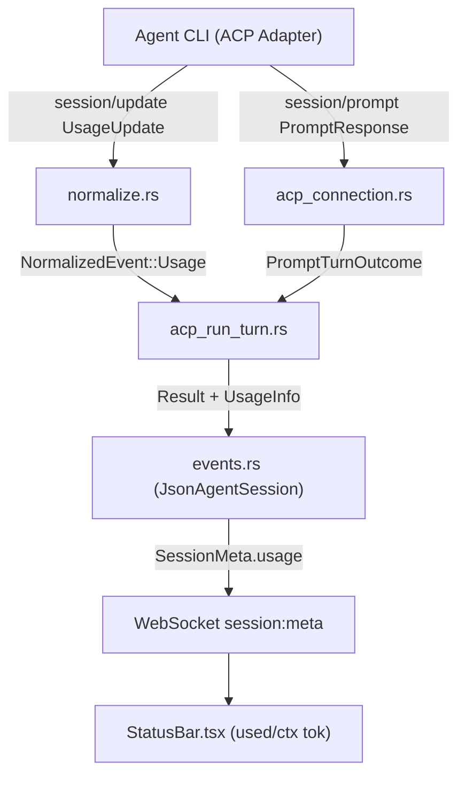

<!--
RULES — read before writing or implementing:
1. FORMAT: Bullets, tables, code, diagrams ONLY — no prose paragraphs
2. REQUIREMENTS: One crisp line each — no verbose descriptions
3. CHECKLIST: Mark items [x] as you complete them — this is your persistent todo list
4. READING TIME: Optimize for fast human scanning — if it's hard to skim, rewrite it
-->

# Plan: Rich Chat Token & Usage Restoration

> Restore live token counts, context window %, and cost streaming in Rich Chat (ACP) sessions.

**Issue:** rich-chat-token-usage
**Branch:** `mode-changes-initial`
**Status:** Implemented (uncommitted)
**PRD:** None (skipped — small bugfix/feature restoration)

**Reference files:**
- Schema: `rust/vst-types/src/domain.rs` (`UsageInfo`, `SessionMeta`)
- ACP Transport: `rust/vst-agents/src/acp_transport.rs` (`PromptTurn`, `AcpTransport`)
- ACP Connection: `rust/vst-agents/src/acp_connection.rs` (`do_send_prompt`, `PromptResponse`)
- ACP Turn Runner: `rust/vst-agents/src/acp_run_turn.rs` (`run_turn_acp`, terminal result event)
- Event Normalization: `rust/vst-agents/src/normalize.rs` (`SessionUpdate::UsageUpdate`)
- Session State: `rust/vst-agents/src/json_agent_session/events.rs` (`has_real_usage`, `s.usage`)
- UI Status Bar: `web-ui/src/components/chat/StatusBar.tsx` (`meta.usage`, token counter)

---

## Problem & Concept

- Token counts in the Rich Chat status bar disappeared after the daemon's Rust rewrite.
- `acp_transport.rs` typed `PromptTurn.result` to return only `StopReason`, discarding prompt usage.
- `normalize.rs` returns `None` for `SessionUpdate::UsageUpdate`, dropping mid-turn token updates.
- Success state: `StatusBar.tsx` displays used/total tokens, context window percentage, and cost.

## Out of Scope

- Changes to `web-ui` (`StatusBar.tsx` and `useChat` already consume `meta.usage` as-is).
- Changes to database schema or migrations (`vst-store` already persists and scans `usage`).
- Non-ACP legacy spawn channels (terminal tmux mode).

## Requirements

| # | Requirement |
|---|-------------|
| 1 | Enable `unstable_end_turn_token_usage` feature on `agent-client-protocol` in `vst-agents`. |
| 2 | Widen `PromptTurn.result` to yield `PromptTurnOutcome { stop_reason: StopReason, usage: Option<UsageInfo> }`. |
| 3 | Extract `Usage` and fallback `_meta.usage` from `PromptResponse` in `acp_connection.rs`. |
| 4 | Normalize `SessionUpdate::UsageUpdate` into `NormalizedEventKind::Usage` with context window and USD cost. |
| 5 | Merge streaming and end-of-turn `UsageInfo` in `events.rs` so `context_window` and `cost_usd` survive end of turn. |
| 6 | Forward turn `UsageInfo` on terminal `Result` and preceding `Usage` event in `acp_run_turn.rs`. |
| 7 | Preserve existing behavior and pass all `vst-agents` and `vst-ws` tests. |

---

## User Journeys (CUJs)

### CUJ 1: Mid-turn and end-of-turn token display (Happy Path)
1. User sends message in Rich Chat.
2. Agent begins processing; ACP streams `SessionUpdate::UsageUpdate(used=12000, size=200000)`.
3. `normalize.rs` emits `NormalizedEventKind::Usage`; `events.rs` updates `s.usage` with `total_tokens=12000`, `context_window=Some(200000)`.
4. UI status bar immediately shows `12,000 / 200,000 tok (6%)`.
5. Turn finishes; `PromptResponse` contains end-of-turn token breakdown (`input=10000, output=2000`).
6. `acp_run_turn.rs` emits terminal `Result` event with merged usage; `events.rs` merges breakdown while preserving `context_window=200000`.
7. UI status bar retains token count and context window percentage after turn ends.

### CUJ 2: Adapter sends no token usage (Fallback / Graceful Degradation)
1. User connects an agent adapter that reports no `usage` in `PromptResponse` and no `UsageUpdate`.
2. `acp_connection.rs` returns `PromptTurnOutcome { stop_reason, usage: None }`.
3. Terminal `Result` event has `usage: None`; `has_real_usage` is false.
4. `s.usage` remains `None`; UI status bar gracefully hides token block without error.

---

## Research

- `daemon/src/agent-plugins/claude.ts:268-287` (old TS): mapped ACP `result.usage` to `UsageInfo` with fallback `total = num(raw.totalTokens) || input + output + cacheRead + cacheCreate`.
- `daemon/src/agent-plugins/claude.ts:483-487` (old TS): yielded `claudeEvent(sessionId, "usage", ...)` followed by `claudeEvent(sessionId, "result", ...)`.
- `rust/vst-agents/src/acp_run_turn.rs:18-21`: explicitly documented the gap ("frozen AcpTransport surfaces only StopReason... usage event omitted entirely").
- `rust/vst-agents/src/normalize.rs:473`: explicitly dropped `SessionUpdate::UsageUpdate(_) => return None`.
- `agent-client-protocol-schema 1.7.0`: `UsageUpdate` carries `used: u64, size: u64, cost: Option<Cost { amount: f64, currency: String }>`.
- `agent-client-protocol-schema 1.7.0`: `PromptResponse.usage: Option<Usage>` is available behind feature `unstable_end_turn_token_usage`.
- **Root cause:** `PromptTurn.result` channel in `acp_transport.rs` only carries `StopReason`, so `acp_connection.rs` discards response usage, and `normalize.rs` drops streaming usage updates.

---

## Change Map

```
rust/vst-agents/
  Cargo.toml                        ~ enables unstable_end_turn_token_usage feature
  src/
    acp_transport.rs                ~ PromptTurnOutcome struct and PromptTurn.result channel type
    acp_connection.rs               ~ do_send_prompt extracts usage from PromptResponse & _meta
    normalize.rs                    ~ normalize SessionUpdate::UsageUpdate to Usage event
    acp_run_turn.rs                 ~ unpack PromptTurnOutcome, attach usage to Result event
    json_agent_session/events.rs    ~ merge incoming usage into existing s.usage (preserve context_window & cost)
  tests/
    acp_transport.rs                ~ update result assertion calls to outcome.stop_reason
    acp_live.rs                     ~ update result assertion calls to outcome.stop_reason
    acp_normalize.rs                ~ update UsageUpdate test to assert NormalizedEventKind::Usage
    fixtures/fakeAcpAgent.mjs       ~ add usage in normal mode prompt response
```

| Today | After this plan |
|-------|-----------------|
| `PromptTurn.result` returns `StopReason` only | `PromptTurn.result` returns `PromptTurnOutcome { stop_reason, usage }` |
| `SessionUpdate::UsageUpdate` discarded (`None`) | `SessionUpdate::UsageUpdate` emits `NormalizedEventKind::Usage` |
| `acp_run_turn.rs` emits `Result` with `usage: None` | `acp_run_turn.rs` emits `Usage` + `Result` with full `UsageInfo` |
| `events.rs` clobbers `s.usage` completely | `events.rs` merges usage fields preserving `context_window` and `cost_usd` |
| `meta.usage` is always `None` in Rich Chat | `meta.usage` carries tokens, context window %, and cost to status bar |

---

## Files & Phase Impact

| File | Status | Impact / Contract Change | Phase |
|------|--------|--------------------------|-------|
| `rust/vst-agents/Cargo.toml` | `~` modified | Add `features = ["unstable_end_turn_token_usage"]` to `agent-client-protocol` | 1 |
| `rust/vst-agents/src/acp_transport.rs` | `~` modified | Define `PromptTurnOutcome`, change `PromptTurn.result` channel | 1 |
| `rust/vst-agents/src/acp_connection.rs` | `~` modified | `do_send_prompt` returns `PromptTurnOutcome` with parsed usage | 1 |
| `rust/vst-agents/src/acp_run_turn.rs` | `~` modified | Unpack `outcome.stop_reason` (Phase 1) and attach `outcome.usage` (Phase 3) | 1, 3 |
| `rust/vst-agents/tests/acp_transport.rs` | `~` modified | Update assertions from `r` to `r.stop_reason` | 1 |
| `rust/vst-agents/tests/acp_live.rs` | `~` modified | Update assertion from `r` to `r.stop_reason` | 1 |
| `rust/vst-agents/src/normalize.rs` | `~` modified | Map `SessionUpdate::UsageUpdate` to `NormalizedEventKind::Usage` | 2 |
| `rust/vst-agents/tests/acp_normalize.rs` | `~` modified | Assert `UsageUpdate` yields `Usage` with `total_tokens` and `context_window` | 2 |
| `rust/vst-agents/src/json_agent_session/events.rs` | `~` modified | Merge incoming usage into `s.usage` preserving context window & cost | 3 |
| `rust/vst-agents/tests/fixtures/fakeAcpAgent.mjs` | `~` modified | Return sample usage in normal mode prompt response | 3 |

---

## Data Model

| Struct / Enum | Location | Key Fields | Purpose |
|---|---|---|---|
| `PromptTurnOutcome` | `acp_transport.rs` | `stop_reason: StopReason`, `usage: Option<UsageInfo>` | Replaces bare `StopReason` on `PromptTurn.result` |
| `UsageInfo` | `vst-types/domain.rs` | `total_tokens: i64`, `input_tokens: i64`, `output_tokens: i64`, `cache_read_tokens: i64`, `cache_create_tokens: i64`, `context_window: Option<i64>`, `cost_usd: Option<f64>`, `model: String` | Shared usage wire format consumed by `StatusBar.tsx` |
| `Usage` (ACP schema) | `agent-client-protocol-schema` | `total_tokens: u64`, `input_tokens: u64`, `output_tokens: u64`, `cached_read_tokens: Option<u64>`, `cached_write_tokens: Option<u64>` | ACP end-of-turn token breakdown (u64 converted to i64) |
| `UsageUpdate` (ACP schema) | `agent-client-protocol-schema` | `used: u64`, `size: u64`, `cost: Option<Cost { amount: f64, currency: String }>` | ACP mid-turn streaming context window & cost |

---

## System Boundaries

| Boundary | Interface / Types | Source of Truth | Failure Mode |
|----------|-------------------|-----------------|--------------|
| CLI Adapter ↔ `AcpConnection` | JSON-RPC `session/prompt` response & `session/update` | External Agent CLI | Missing usage defaults to `None`; turn still completes |
| `AcpConnection` ↔ `acp_run_turn` | `PromptTurnOutcome { stop_reason, usage }` | `AcpTransport` | Missing usage fields zero-filled; never errors turn |
| `acp_run_turn` ↔ `JsonAgentSession` | `NormalizedEvent` (`kind: Usage` / `Result`, `usage: Option<UsageInfo>`) | `vst-agents` | `has_real_usage` gates 0-token clobbering |
| `JsonAgentSession` ↔ `web-ui` | WS `session:meta` (`meta.usage: Option<UsageInfo>`) | `JsonAgentSession` | Missing usage renders nothing (existing graceful UI fallback) |

---

## Architecture Diagram



---

## Key Decisions

1. **`PromptTurnOutcome` struct over tuple**
   - **Where:** `rust/vst-agents/src/acp_transport.rs`
   - **Decision:** Encapsulate `stop_reason: StopReason` and `usage: Option<UsageInfo>` in a named struct to allow future metadata extensions cleanly.
2. **Dual-path usage extraction with fallback total calculation**
   - **Where:** `rust/vst-agents/src/acp_connection.rs`
   - **Decision:** Inspect `response.usage` first. If `None`, inspect `response.meta` for a `"usage"` sub-object supporting camelCase (`inputTokens`) and snake_case (`input_tokens`). Fall back `total_tokens = input + output + cache_read + cache_create` if `total_tokens == 0`.
3. **Map `UsageUpdate` to `NormalizedEventKind::Usage` with USD-only cost**
   - **Where:** `rust/vst-agents/src/normalize.rs`
   - **Decision:** Map `used` to `total_tokens`, `size` to `context_window`. Only set `cost_usd = Some(cost.amount)` when `cost.currency == "USD"`; otherwise `None`.
4. **Field-preserving usage merge in `events.rs`**
   - **Where:** `rust/vst-agents/src/json_agent_session/events.rs`
   - **Decision:** When merging incoming `ev.usage` into `s.usage`: if incoming `context_window` is `None`, preserve existing `s.usage.context_window`; if incoming `cost_usd` is `None`, preserve existing `s.usage.cost_usd`. This ensures end-of-turn `Result` events do not erase context % and cost.
5. **Attach usage and emit standalone `Usage` event before `Result`**
   - **Where:** `rust/vst-agents/src/acp_run_turn.rs`
   - **Decision:** If `outcome.usage` is present, populate `usage.model` from `ctx.model`, emit a `NormalizedEventKind::Usage` event, and attach `result.usage = Some(usage)` to match pre-rewrite TypeScript behavior (`claude.ts:483-487`).

---

## Implementation Phases

### Phase 1: Transport & Connection Layer (`acp_transport.rs`, `acp_connection.rs`)

- [x] 1.1 Enable `agent-client-protocol/unstable_end_turn_token_usage` in `rust/vst-agents/Cargo.toml`.
- [x] 1.2 Define `PromptTurnOutcome { pub stop_reason: StopReason, pub usage: Option<vst_types::UsageInfo> }` in `acp_transport.rs` and update `PromptTurn.result` channel type.
- [x] 1.3 In `acp_connection.rs`, implement `extract_usage(response: &PromptResponse)` reading typed `response.usage` and `response.meta` fallback.
- [x] 1.4 Update `do_send_prompt` in `acp_connection.rs` to return `PromptTurnOutcome`.
- [x] 1.5 Update `acp_run_turn.rs:245-251` to unpack `outcome.stop_reason` (maintains compilation across Phase 1).
- [x] 1.6 Update `tests/acp_transport.rs` (assertions on `r.stop_reason`) and `tests/acp_live.rs`.

**Verify Phase 1:**
- `cargo check -p vst-agents` clean.
- `cargo test -p vst-agents --test acp_transport` passes.

---

### Phase 2: Update Streaming Normalization (`normalize.rs`)

- [x] 2.1 In `normalize.rs`, replace `SessionUpdate::UsageUpdate(_) => return None` with mapping to `NormalizedEventKind::Usage`.
- [x] 2.2 Populate `total_tokens = update.used as i64`, `context_window = Some(update.size as i64)`, and `cost_usd = update.cost.filter(|c| c.currency == "USD").map(|c| c.amount)`.
- [x] 2.3 Update test in `tests/acp_normalize.rs` to assert `UsageUpdate` produces `NormalizedEventKind::Usage` with context window and tokens.

**Verify Phase 2:**
- `cargo test -p vst-agents --test acp_normalize` passes.

---

### Phase 3: Turn Runner & End-to-End Integration (`acp_run_turn.rs`, `events.rs`)

- [x] 3.1 In `events.rs:54-58`, merge incoming `ev.usage` into `s.usage`, preserving `context_window` and `cost_usd` when the incoming usage omits them.
- [x] 3.2 In `acp_run_turn.rs`, if `outcome.usage` is present, populate `usage.model` from `ctx.model`, emit a `NormalizedEventKind::Usage` event, and attach `result.usage = Some(usage)`.
- [x] 3.3 Update stale comments in `acp_run_turn.rs:18-21` and `:273`.
- [x] 3.4 In `tests/fixtures/fakeAcpAgent.mjs`, add sample usage to normal mode prompt response.
- [x] 3.5 Run `cargo test -p vst-agents --test json_agent_meta --test json_agent_stream` and `cargo check --workspace`.

**Verify Phase 3:**
- `cargo check --workspace` clean.
- `cargo test -p vst-agents` passes.
- Full frontend test suite `pnpm test` passes.
