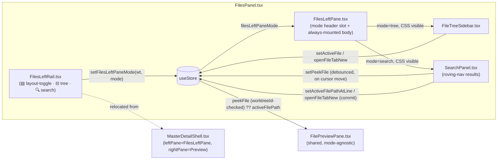

<!--
RULES — read before writing or implementing:
1. FORMAT: Bullets, tables, code, diagrams ONLY — no prose paragraphs
2. REQUIREMENTS: One crisp line each — no verbose descriptions
3. CHECKLIST: Mark items [x] as you complete them — this is your persistent todo list
4. READING TIME: Optimize for fast human scanning — if it's hard to skim, rewrite it
-->

# Plan: Search UX keyboard nav + Files-tab rail restructure

> Roving-nav keyboard control for search results, a `peekFile` preview mechanism, and
> collapsing the standalone Search tab into a 3-icon rail inside the Files tool panel.

**Issue:** search-ux-nav-and-layout
**Branch:** `search-ux-nav-and-layout`
**Status:** Pending
**PRD:** none — no separate PRD; requirements are folded into this plan from
`.vibekit/feature-plans/wip/search-ux-nav-and-layout/report-search-ux-nav-and-layout.md`
(full report, including the confirmed rail mockup addendum and the resolved follow-ups table)
**Parent:** none

**Reference files:**
- Roving nav hook: `web-ui/src/hooks/useRovingListNav.ts`
- Search panel (to be split into controls + results): `web-ui/src/components/tools/SearchPanel.tsx`
- Tree (existing roving-nav consumer, pattern to mirror): `web-ui/src/components/layout/FileTreeSidebar.tsx`
- Master-detail shell (unchanged internals, topbar loses a button): `web-ui/src/components/layout/MasterDetailShell.tsx`
- Preview pane (peek read-side): `web-ui/src/components/layout/FilePreviewPane.tsx`
- Store (new `peekFile` + `filesLeftPaneMode` slices): `web-ui/src/hooks/useStore.ts`
- Tool tab strip + `Mod+Shift+F`: `web-ui/src/components/layout/ToolPanel.tsx`, `web-ui/src/hooks/useWorkspaceKeyboardShortcuts.ts`
- Files tool wrapper (site of the rail restructure): `web-ui/src/components/tools/FilesPanel.tsx`
- Escape-to-input precedent: `web-ui/src/components/dialogs/Dialog.tsx:61-70`
- Global stylesheet (rail/results-list/cursor/mode-hidden CSS): `web-ui/src/styles/workspace.css`
- Keyboard shortcuts (`Mod+Shift+F`): `web-ui/src/hooks/useWorkspaceKeyboardShortcuts.ts:118-129`
- Roving-nav hook's own test file: `web-ui/src/hooks/useRovingListNav.test.ts`

---

## Problem & Concept

- Search results (`SearchPanel.tsx`) have no keyboard navigation today — every match is a
  plain `<button>`, reachable only by mouse or serial Tab, with no Enter-from-input, arrow-move,
  or Escape-to-input flow.
- Search lives as a fifth, fully separate `ToolPanel` tab, duplicating the Files tab's
  tree+preview chrome instead of sharing it — the user wants Search folded into the Files tab
  behind a 3-icon rail (confirmed mockup, see Research), with live "peek" preview as you arrow
  through matches, without polluting the permanent open-file tab strip.
- Success state: `Enter` from the query input jumps into a roving-nav match list (arrow keys
  move, Up-at-top returns to input, Escape returns to input); the Files tab's left pane swaps
  between tree and search content behind a persistent rail, and arrowing through a match live-
  updates the (shared, unchanged) preview pane without opening a new tab until the user commits.

## Out of Scope

- Any change to `MasterDetailShell`'s split/resize/pointer-refocus internals beyond removing the
  layout-toggle button from its topbar (Decision 8) — the shell's `PanelGroup`, `handleRightPanePointerDown`,
  and tree-visibility toggle are untouched.
- Ripgrep/search backend changes (`api.search`, daemon routes) — this plan is UI-only.
- Any new hook to replace `useRovingListNav` — reused as-is (Decision 1), see Research.
- Deferred: collapsing/skip-whole-file-while-navigating beyond simple header toggle (i.e. no
  "collapse all", no persistence of expand/collapse state across searches).
- Deferred: any change to `WorkspaceCanvas.tsx`'s tile-portal path — Phase 3 only spot-checks it
  renders correctly (Risk/Open Question 3), no code change unless that check fails.

## Requirements

| # | Requirement |
|---|-------------|
| 1 | Query input `Enter` (with ≥1 result) moves the roving cursor to the first match/header row and focuses it — handled in the input's own `onKeyDown`, not delegated to the hook |
| 2 | Arrow Up/Down move the roving cursor through an interleaved header+match row list; Up at the first row returns DOM focus to the query input |
| 3 | File-group header rows participate in roving nav from v1: Enter/Space on a header toggles collapse/expand (matches tree convention); Enter on a match row opens it |
| 4 | Escape (from anywhere in the results list) returns focus to the query input and clears the roving cursor, with `stopPropagation()` |
| 5 | Arrowing onto a match row updates a debounced "peek" preview in the shared `FilePreviewPane`, without adding a tab to the open-file strip |
| 6 | Enter or click on a match commits it via the existing `setActiveFilePathAtLine` (permanent tab); Ctrl/Cmd-click **or** a keyboard equivalent (`Mod+Enter` on a cursored match row) commits via `openFileTabNew` (new tab) — existing click semantics preserved, extended with an explicit keyboard path and an explicit checklist item (Phase 1, 1.7a) |
| 7 | Peek does **not** clear when the rail mode switches (tree↔search) — it clears on ANY query change (not just clearing it to empty), and whenever any store action that commits `activeFilePath` runs (see Decision 5) |
| 8 | Files tool panel gains a persistent 3-icon rail (layout-toggle, tree, search); Search is no longer a separate `ToolPanel` tab |
| 9 | Tree and Search bodies are both always-mounted inside the Files tab, CSS-hidden when inactive — never conditionally unmounted on rail-mode switch |
| 10 | `Mod+Shift+F` still reaches search, now via "Files tab + rail search mode" instead of "Search tab" |

---

## Change Map

```
web-ui/src/components/tools/
  SearchPanel.tsx        ~ split into controls header + roving-nav results body
web-ui/src/components/layout/
  FileTreeSidebar.tsx    ~ header extracted so FilesLeftPane can swap it (no roving-nav change)
  MasterDetailShell.tsx  ~ layout-toggle button removed from topbar (relocated to rail) via new
                           `layoutToggle?: boolean` prop (default true), mirroring the existing
                           `treeToggle` prop shape (Decision 8/B6); pointer-refocus + tree-visible
                           refocus effects scoped to the active-mode DOM instead of a bare
                           `[tabindex='0']` querySelector (Decision 10/B4a)
  FilePreviewPane.tsx    ~ resolves path from peekFile (worktreeId-checked) first, activeFilePath
                           fallback; ONE `effectiveLine`/consumed-tracking mechanism applied at all
                           4 pendingFileLine-coupled gate sites (Decision 5/B2)
  ToolPanel.tsx          ~ "search" removed from TABS array (ToolTab union value kept)
  FilesLeftRail.tsx      + new: 3-icon rail (layout-toggle, tree, search) — full-height sibling of
                           the whole MasterDetailShell column, NOT nested inside it (see Architecture
                           Diagram note, B8)
  FilesLeftPane.tsx      + new: mode-switching wrapper (header slot + always-mounted tree/search
                           body); exposes an explicit focus-target ref/callback for
                           MasterDetailShell's refocus effects instead of relying on a generic
                           querySelector (Decision 10/B4a)
web-ui/src/components/tools/
  FilesPanel.tsx         ~ composes FilesLeftRail + FilesLeftPane instead of bare FileTreeSidebar;
                           passes `layoutToggle={false}` to MasterDetailShell (Decision 8/B6)
web-ui/src/hooks/
  useStore.ts            ~ new peekFile + filesLeftPaneMode slices, actions; `setActiveFile`,
                           `openFileTabNew`, `setActiveFilePathAtLine`, `setActiveFileTabIdx`,
                           `closeFileTab`, `setActiveWorktree`, `setActiveDirectContext`,
                           `clearWorkspaceSelection` each also clear `peekFile` in their own body
                           (Decision 5/B1/B3); `peekFile` excluded from `partialize` (B3)
  useWorkspaceKeyboardShortcuts.ts ~ Mod+Shift+F repointed to files tab + rail search mode, keyed
                           by `activeWorktreeId ?? activeDirectContextId` (same resolution as
                           `layoutKey` in useStore.ts) on write, focuses the query input as an
                           explicit extra step (Decision 7/B5, Decision 10/B4c)
  useRovingListNav.ts    ~ optional onBoundary callback for Up-at-first-row AND Down-at-last-row
                           (Decision 3); unit tests added to this hook's own test file (S6)
web-ui/src/styles/
  workspace.css          ~ new `.search-panel__results-list`/rail/mode-hidden rules (B8)
```

| Today | After this plan |
|-------|-----------------|
| Search results are plain buttons, mouse/Tab only | Arrow-key roving nav, Enter-from-input, Escape-to-input, header rows toggle via Enter |
| Search is a 5th top-level `ToolPanel` tab, own tree-less layout | Search lives inside the Files tab, behind a rail, sharing tree+preview chrome |
| Clicking a match always commits a permanent tab (`setActiveFilePathAtLine`) | Arrow-key focus "peeks" (no tab); Enter/click still commits a tab, unchanged |
| Layout-toggle (stacked/side-by-side) lives in `MasterDetailShell`'s topbar | Same control, relocated into the new rail (▤), removed from the topbar |
| `Mod+Shift+F` opens the Search tab | `Mod+Shift+F` opens Files tab + switches rail to search mode |
| Switching Search↔Files unmounts one, mounts the other (`ToolPanel.tsx:130-141`) | Tree and Search are both always-mounted inside Files, CSS-toggled |
| Peek/preview state doesn't exist | New `peekFile` store slice; clears on any query change and whenever a commit-style store action runs, not on rail-mode switch |

---

## Research

- `web-ui/src/hooks/useRovingListNav.ts:1-136` — generic hook already used by both a tree
  (`FileTreeSidebar.tsx:393-402`) and a flat list (`ChangedFileList.tsx:123-127`); takes
  `RovingRow[]` (`{path, expandable?}`), returns `{cursorPath, setCursorPath, handleKeyDown, isTabbable}`.
  `ArrowUp`/`ArrowDown` do not wrap past either end (`rows[idx±1]` undefined → no-op);
  `Enter`/`Space` call `onOpen(cursorPath ?? rows[0].path)`; `ArrowLeft`/`ArrowRight` call
  `onToggle` only when `rows[idx].expandable` is true.
- `useRovingListNav.ts:83-94,95-103` — no `onBoundary`/hook exists for "Up at first row" today;
  confirmed by reading the full switch statement — must be added (Decision 3).
- `web-ui/src/components/tools/SearchPanel.tsx:13-297` — current full component: query input
  (`:181-189`, no `onKeyDown`, `autoFocus`), toggles (`:190-215`), glob field (`:217-227`),
  results rendered as nested `<div className="search-panel__file-group">` → `<button className="search-panel__file-header">`
  (`:252-262`, plain click-to-toggle, no roving state) → `<div className="search-panel__matches">`
  → `<button className="search-panel__match-row">` per match (`:266-281`, `onClick` only).
  `handleMatchClick` (`:163-168`) calls `setActiveFilePathAtLine` + `setToolPanelTab("files")` —
  this becomes the *commit* path (Requirement 6), reused **as-is, including the
  `setToolPanelTab("files")` call** (S7 fix — an earlier draft of this plan said the tab-switch
  would be dropped; corrected here to match Phase 2's 2.4 checklist item, which keeps it). Once
  Phase 3 lands and Search moves inside the Files tab, `toolPanelTab` is already `"files"` at the
  moment a match is clicked, so the call becomes a same-value no-op — harmless, and simpler than
  threading a phase-conditional through the commit path.
- `SearchPanel.tsx:181-189` — the query `<input>` has `autoFocus` today, safe only because
  `ToolPanel.tsx`'s conditional render remounts `SearchPanel` fresh each time the Search tab opens
  (Research below, `ToolPanel.tsx:130-141`). Once Search is always-mounted (Requirement 9),
  `autoFocus` fires exactly once, the first time the Files tab renders in `"tree"` mode, stealing
  focus into the (CSS-hidden) search input on ordinary workspace open — confirmed by reading
  React's `autoFocus` semantics (fires on mount, not on visibility change). Must be removed
  (Decision 10/B4b).
- `SearchPanel.tsx:571` pattern analogue — `FileTreeSidebar.tsx:571` wires
  `onFocus={() => setCursorPath(row.path)}` on each row so DOM focus (from a click OR Tab) always
  updates the roving cursor, not just `tabIndex`. `SearchPanel`'s new header/match rows must mirror
  this (S5) — today nothing in the plan's Phase 1 checklist wires an `onFocus` on the row buttons,
  only a `cursorPath`→DOM-focus effect in the other direction (Decision 4/1.8).
- `SearchPanel.tsx:23-26` comment: "SearchPanel remounts fresh each time, per ToolPanel's
  conditional render" — becomes **false** once search is always-mounted (Requirement 9); must
  be corrected in Phase 3, not left to mislead a future reader (harmless functionally — settings
  are re-read once at true mount, just no longer on every rail-mode switch).
- `SearchPanel.tsx:104-149` — 200ms debounced search via `AbortController`; result identity
  changes every search, so any roving-nav row list derived from `results` should still be
  `useMemo`'d on `[results, expandedFiles]` for render-cost reasons (avoids re-flattening every
  unrelated re-render of `SearchPanel`). **Correction (S1):** the original draft justified this
  memoization by claiming the hook's cursor-reset effect (`useRovingListNav.ts:75-81`) would
  "spuriously drop the cursor on every unrelated re-render" — re-reading that effect shows it
  checks row membership by **content** (`rows.some((r) => r.path === cursorPath)`), not array
  identity, so a freshly-identical-but-unmemoized array that still contains `cursorPath` by value
  does NOT trip the reset — that claimed bug does not exist. The memoization recommendation stands
  for perf only (skip re-flattening `results.files` on every keystroke-unrelated re-render, e.g.
  a toggle checkbox click), not correctness.
- `SearchPanel.tsx:130-149` (`performSearch`'s early-return) — a query going empty is one reset
  path; the debounce timer itself (`:140-149`, 200ms) means `Enter` pressed immediately after
  typing can fire while `results` is still stale/from the *previous* query, or still `null` — see
  Decision 4's update (S2) for the explicit flush-vs-no-op choice.
- `SearchPanel.tsx:168-172` (`useEffect` that sets `expandedFiles` to "all paths" whenever
  `results` changes) — this re-runs on **every** `results` identity change, including a change
  that only added/removed matches within already-visible files, so it will blow away any manual
  collapse the user did via the new roving header-toggle (Requirement 3) on every subsequent
  keystroke's result set — see Decision 2's update (S3) for the explicit v1 scope call.
- `useRovingListNav.ts:75-81`'s cursor-reset effect is guarded on `rows.length > 0` — a search that
  shrinks to zero results (`rows` becomes `[]`) leaves `cursorPath` stale (never reset to `null`)
  and every row untabbable, since `isTabbable` falls back to `rows[0]?.path` which no longer
  exists (S4) — needs an explicit test + explicit handling that a reset-to-null cursor also clears
  any pending peek (Decision 5's updated logic already covers this: the debounced peek effect only
  fires for `kind === "match"` cursor rows, so a `null` cursor naturally stops re-arming it, but
  the *existing* peek must still be cleared — added to Phase 2's checklist, 2.6).
- `web-ui/src/components/dialogs/Dialog.tsx:61-70` — the only existing Escape pattern in the
  codebase: local `keydown` listener, stack-top check, `e.stopPropagation()`. No app-level Escape
  handler exists in `useWorkspaceKeyboardShortcuts.ts` — confirmed by reading the full file
  (`web-ui/src/hooks/useWorkspaceKeyboardShortcuts.ts:1-153`), so a local Escape handler on the
  results container is safe and precedent-consistent (Requirement 4).
- `web-ui/src/components/layout/FileTreeSidebar.tsx:64-90,387-402` — `FlatRow extends RovingRow`
  pattern (adds `name`/`type`/`level` fields), `flattenVisible()` depth-first flattener, and the
  hook wiring (`onOpen` dispatches dir-vs-file, `onToggle` toggles expansion, `openOnArrow: true`) —
  the shape to mirror for search's `MatchRow`/interleaved header+match flattener (Decision 2).
- `FileTreeSidebar.tsx:404-422,512-525` — "focus follows cursor" pattern: a `rowRefs` map +
  `useEffect` on `cursorPath` calling `.focus()`, gated on a `treeHasFocusRef` so pre-seeding the
  cursor before the pane has focus doesn't steal it; `tabIndex={-1}` on the scroll container,
  `tabIndex={isTabbable(row.path) ? 0 : -1}` per row.
- `web-ui/src/components/layout/FilePreviewPane.tsx:41-57` — reads `storePath = activeFilePath`
  and `pendingFileLine` from the store; `bodyKey` (`:73-74`) is the fetch identity string;
  10-entry LRU content cache (`:76-84,171-183`) already absorbs re-visits of recently-fetched
  files cheaply, but a never-before-seen file is still one real fetch per row (Decision 6's
  debounce target).
- **Correction (B2) — `pendingFileLine` has FOUR gate sites in `FilePreviewPane.tsx`, not one:**
  re-reading the full file (current line numbers) finds `pendingFileLine !== null`/`=== null`
  checked at:
  1. `setBodyRef` (`:276-285`) — skips the scroll-position *restore* while a line-jump is pending.
  2. The scroll-restore effect (`:316-320`) — same skip, re-applied when `fileBody`/`diffBody`
     change on the same mounted body node.
  3. The scroll-to-line effect itself (`:343-367`) — finds the `.workspace-code-line` element
     matching `pendingFileLine`'s gutter text, scrolls to it, then calls `clearPendingFileLine()`
     (`:362`) — a **no-op** against a peek-sourced line, since peek state lives in `peekFile`, not
     `pendingFileLine`. Feeding this effect `peekFile?.line ?? pendingFileLine` (the original
     Decision 5 snippet) means the effect can never mark a peek-sourced line "consumed": it stays
     armed and re-fires on every re-render where the target element exists again (a font-size
     bump, a markdown raw-view toggle, a re-fetch after a file-watch event), yanking the user's
     scroll position back to that line every time.
  4. **`pendingLineForPathRef` (`:328-332`) — the stale-request guard at the top of site 3, missed
     by the first B2 pass.** A `useRef<string | null>(null)` populated only by
     `useEffect(() => { if (pendingFileLine !== null) pendingLineForPathRef.current = path; },
     [pendingFileLine])` — it only ever writes when `pendingFileLine` transitions to non-null. Site
     3 opens with `if (path !== pendingLineForPathRef.current) { clearPendingFileLine(); return; }`
     (`:345-348`), which runs BEFORE any `effectiveLine`/peek logic. During a pure peek,
     `pendingFileLine` stays `null` (only `peekFile.line` is set), so this ref never gets populated
     for the peek's path — it holds a stale/null value, the guard's `path !==
     pendingLineForPathRef.current` check is true, and site 3 returns early on every render. A
     peek-sourced line **never scrolls at all** — this silently kills "arrow through results,
     preview auto-scrolls to the line" (Requirement 5's headline behavior), a strictly worse
     failure than sites 1-3's "re-fires/fights restore" symptom. Sites 1 and 2 have the same
     problem in reverse — they gate on `pendingFileLine !== null`, which is `null` during a pure
     peek (no `pendingFileLine` was ever set), so they run their *restore* logic concurrently with
     the peek's own scroll-to-line, fighting it. All four sites must be fixed together (Decision 5).
- **New (B3) — `peekFile.worktreeId` was write-only, never read:** the original Decision 5 snippet
  never compares `peekFile.worktreeId` to the pane's own context, so a peek set while looking at
  worktree A's search results would still show up in worktree B's preview pane after switching
  context (nothing resets `peekFile` on a worktree switch, and the read-side didn't check it
  anyway). `useStore.ts:790-812,1020-1037` (`setActiveWorktree`, `setActiveDirectContext`,
  `clearWorkspaceSelection`) are the 3 sites that already reset `activeFilePath` on a
  context-change — confirmed by reading all three; `peekFile: null` must be added to each
  (Decision 5). The read-side comparison must use whichever context id the pane is scoped to:
  `FilePreviewPane` takes a single `worktreeId` prop that is *either* a worktree id or a direct
  project id depending on `scope` (`FilePreviewPaneProps.worktreeId` doc comment, `:32-33`), so the
  correct check is `peekFile.worktreeId === worktreeId` against that prop (not against
  `activeWorktreeId`/`activeDirectContextId` separately — the prop is already the resolved one).
- Scroll-to-line effect at `:343-367` (see B2 above) fires once a matching `.workspace-code-line`
  element exists then clears — this is the anchor point for Decision 5's `effectiveLine`/
  `clearPeekLine()` fix.
- `web-ui/src/hooks/useStore.ts:905-926` — `setActiveFilePathAtLine(worktreeId, path, line)`
  unconditionally appends/activates a permanent tab and sets `pendingFileLine`; `openFileTabNew`
  (`:885-904`) always appends a new tab; `setActiveFile` (`:835-884`, plain click) replaces the
  active tab in place. All three keep their existing contracts unchanged (Requirement 6) — peek
  is new, additive state, not a rewrite of these.
- `useStore.ts:8-10` — `ToolTab = "files" | "devices" | "artifacts" | "vcs" | "search"`,
  `TOOL_TABS` array. `useStore.ts:1360-1453` — version-migration code repeatedly defaults stale/
  unknown `toolPanelTab` values to `"files"` — precedent for keeping the `"search"` union member
  (so old persisted state widening to `string` can't sneak past the type system) while removing
  it from the *rendered* tab set (Decision 9).
- `web-ui/src/components/layout/ToolPanel.tsx:53-59,130-141` — `TABS` array (5 entries, `search`
  last) and the conditional-mount block that renders exactly one of `FilesPanel`/`DevicesPanel`/
  `ArtifactsPanel`/`VcsPanel`/`SearchPanel` per `toolPanelTab` — this conditional-mount pattern is
  fine for tabs that are actually mutually exclusive UI (Devices/Artifacts/VCS), but is exactly
  what Requirement 9 says NOT to do for tree vs. search once both live inside Files.
- `web-ui/src/hooks/useWorkspaceKeyboardShortcuts.ts:118-129` (`k === "F"` branch) — `Mod+Shift+F`
  today calls `setToolPanelTab("search")` directly, with no worktree/context id at all.
- **Correction (B5) — a bare `activeWorktreeId` write would break direct sessions:**
  `useStore.ts:649-651` defines `function layoutKey(s) { return s.activeWorktreeId ??
  s.activeDirectContextId; }`, used by `setActiveSession`/`setActiveTerminalSession`/`setActiveFile`
  (`:813-884`) for exactly this "per-worktree-or-direct" keying problem. `FilesPanel.tsx:34`
  computes its own local `wt = worktreeId ?? "__none__"`, where the `worktreeId` **prop** passed in
  from `Workspace.tsx` is already either `activeWorktreeId` (normal worktree tool tile,
  `Workspace.tsx:552-554`) or the direct-session project id (`Workspace.tsx:707`) — i.e. FilesPanel
  already reads with the same resolved value `layoutKey` would compute. If
  `useWorkspaceKeyboardShortcuts.ts` writes `filesLeftPaneMode` keyed by `getState().activeWorktreeId`
  alone, that's `null` for a direct session (per `layoutKey`'s own fallback existing specifically
  because `activeWorktreeId` is null there) — the write and FilesPanel's read use different keys
  and the shortcut silently no-ops for direct sessions. Fix: the shortcut handler must key with
  `getState().activeWorktreeId ?? getState().activeDirectContextId` (`layoutKey`'s own logic,
  inlined since `layoutKey` is a private closure inside `useStore.ts`'s `create()` call, not
  exported) — same resolution, both read (FilesPanel) and write (shortcut) sides (Decision 7).
- `web-ui/src/hooks/useStore.ts:1597-1626` — `partialize` is an explicit allowlist of persisted
  fields; `peekFile` must be deliberately left OUT of this list (not just "happens not to be
  added") — stated explicitly here since a future refactor that spreads `...s` into `partialize`
  would silently start persisting stale peek state across reloads (B3).
- `web-ui/src/hooks/useRovingListNav.test.ts` — existing hook-level unit tests (`describe
  ("useRovingListNav", ...)`, 6 `it()` blocks: ArrowDown/ArrowUp no-wrap, Enter, ArrowLeft/Right
  toggle, tabbable-row, Space) — this is where the new `onBoundary` behavior needs its own unit
  tests (both `"top"` and `"bottom"` edges, S6), not only through `SearchPanel.test.tsx`/
  `FileTreeSidebar.test.tsx`'s higher-level component tests.
- `web-ui/src/styles/workspace.css` — confirmed the actual global stylesheet (not a per-component
  CSS module): existing precedent classes to extend/mirror are `.tree-row--cursor` (`:1966`, the
  tree's roving-cursor highlight — search results need an equivalent
  `.search-panel__match-row--cursor`/`.search-panel__file-header--cursor` rule) and
  `.files-panel`/`.files-topbar` (`:5310,5327`, the Files tab's existing layout classes that the
  new rail sits alongside). No existing `display:none` mode-hidden precedent scoped to this file's
  Files-tab section — the closest analogue is the terminal-pane CSS-only-visibility precedent
  cited in `AGENTS.md:56-90` (functional precedent, not a literal CSS rule to copy) (B8).
- `web-ui/src/components/layout/MasterDetailShell.tsx:41-50,116-127` — layout-toggle button
  (`Columns2`/`Rows2` icon, `setMasterDetailVertical(worktreeId, !vertical)`) lives in the shell's
  own topbar, gated on `treeVisible && worktreeId`; per the report's addendum (confirmed rail
  mockup), this exact control relocates into the new rail's ▤ icon and is removed from here —
  not duplicated (Decision 8, overriding the report's own original tentative recommendation).
- **Correction (B6) — the shell already has the exact precedent shape needed:** re-reading
  `MasterDetailShellProps` (`:6-27`) shows an existing `treeToggle?: boolean` prop (default
  `true`, doc comment `:12-13`) that independently controls whether the shell renders its own
  tree-visibility button, gated in the render at `:104-115`. The layout-toggle button
  (`:116-127`) is a second, structurally-identical block, gated on `treeVisible && worktreeId`
  (`:116`) — adding a parallel `layoutToggle?: boolean` prop (default `true`) and gating it the
  same way resolves Decision 8/Risk #1 with zero duplicate-control risk, rather than leaving it an
  open question (see Decision 8, rewritten).
- **Correction (B4a) — `handleRightPanePointerDown`'s querySelector is NOT mode-agnostic once both
  tree and search are always-mounted:** re-reading `:52-70` and the sibling `treeVisible` refocus
  effect at `:72-86` (both use the identical
  `leftPaneRef.current?.querySelector<HTMLElement>("[tabindex='0']") ?? ...querySelector("[tabindex]")`
  pattern), this DOM query is scoped to `leftPaneRef` — the whole left-pane slot — with no
  awareness of which of the two always-mounted bodies (tree vs. search) is the *visible* one.
  Today it's safe because exactly one child of `leftPaneRef` ever exists (conditional mount). Once
  `FilesLeftPane` always-mounts both, a `display:none` inactive pane's `tabIndex={0}` row can
  still match first in document order and `.focus()` on it is a silent no-op (focus doesn't move,
  no error) — the pane the user is actually looking at never gets refocused. Both call sites
  (`:52-70` and `:72-86`) need the same fix (Decision 10).
- `MasterDetailShell.tsx:52-70` — `handleRightPanePointerDown` refocuses via a generic
  `leftPaneRef.current.querySelector("[tabindex='0']")` — this needs to change (see correction
  above), not stay "no change needed" as the earlier draft of this plan claimed.
- `web-ui/src/hooks/useStore.ts:63-73,994-1000` — `WorktreeLayout.masterDetailVertical`,
  `DEFAULT_WORKTREE_LAYOUT`, `setMasterDetailVertical` — the exact per-worktree-slice pattern to
  mirror for the new `filesLeftPaneMode` slice (Decision 7), rather than inventing a new shape.
- `AGENTS.md:56-90` — the "never unmount `TerminalPane`" invariant: same-tree-position + CSS-only
  visibility toggle is the fix for terminal remounts destroying PTY stream/interaction state;
  cited here as the precedent class of bug (Requirement 9) — tree/search have async state
  (`expanded`, `childrenByPath`, git-status fetches; debounce/abort-controller state) that would
  be destroyed by a conditional unmount on every rail-mode switch, same shape of risk though a
  different underlying resource (state loss, not a daemon-side leak).
- **Test coverage drift from the report:** the report (commit `4cb92f2`) claimed zero test
  coverage for `SearchPanel.tsx`/`FileTreeSidebar.tsx` keyboard paths/`MasterDetailShell.tsx`.
  Re-checked against the current worktree: `SearchPanel.test.tsx` (242 lines) and
  `FileTreeSidebar.test.tsx` (169 lines, incl. "Phase 8 — arrow-key roving navigation") now
  exist; `MasterDetailShell.tsx` still has none. None of `SearchPanel.test.tsx`'s existing cases
  cover keyboard nav (only debounce/grouping/click/errors/sticky prefs) — the nav/peek/header-
  toggle behavior in this plan is genuinely new test surface regardless.
- **Root cause:** Search predates the tree's roving-nav pattern and the "peek without pinning"
  need — `useRovingListNav`/`openOnArrow` and click-replaces/Ctrl-click-pins already solve most
  of what search UX needs; this plan is wiring, not invention.

---

## Architecture Diagram



- **Structural note (B8):** the confirmed mockup shows the rail running the *full height* of the
  Files tab, to the left of and independent from the shell's own topbar row — i.e.
  `FilesLeftRail` is a sibling of the entire `MasterDetailShell` column inside `FilesPanel.tsx`'s
  markup, not a child dropped inside `MasterDetailShell`'s `leftPane` slot alongside
  `FilesLeftPane`. This is a structural change to `FilesPanel.tsx`'s top-level JSX (new outer flex
  row: `[FilesLeftRail][MasterDetailShell]`), not merely a new component composed *within* the
  existing `<div className="pane-fill-host">` wrapper. Phase 3.4/3.2 and the CSS work in 3.11 must
  account for this outer-row layout, not just the rail component's own internal markup.

---

## Design Details

### System Boundaries

| Boundary | Fields + types | Errors | Source of truth |
|----------|----------------|--------|-----------------|
| `SearchPanel` ↔ `useStore` (in-process) | `setPeekFile({worktreeId: string, path: string, line: number})`, `clearPeekFile()`, `setActiveFilePathAtLine(worktreeId, path, line)` (commit, Enter/click), `openFileTabNew(worktreeId, path)` (commit-new-tab, Ctrl/Cmd-click or `Mod+Enter` on a cursored row — Requirement 6/B7) | none (pure client state) | store owns `peekFile`; existing actions unchanged in their own contract, but now each also clears `peekFile` as a side effect (Decision 5/B1) |
| `FilesLeftRail` ↔ `useStore` (in-process) | `setFilesLeftPaneMode(worktreeId: string, mode: "tree" \| "search")` | none | store owns `filesLeftPaneMode: Record<string, "tree" \| "search">` |
| `FilePreviewPane` ↔ `useStore` (read-side) | reads `peekFile && peekFile.worktreeId === worktreeId ? peekFile.path : storePath`, and one `effectiveLine` value that folds in a per-`path#line` consumed-tracking mechanism (Decision 5, B2/B3) | none | store; peek wins over active when set AND context-matched |
| `useRovingListNav` ↔ `SearchPanel` (in-process) | `RovingRow[]` composite `path` keys (see Decision 2), `onOpen`, `onToggle`, new optional `onBoundary(edge: "top" \| "bottom")` (Decision 3, both edges) | none | hook owns `cursorPath`; caller owns row data |

- No backend/API contract changes — this plan is UI-only (per Out of Scope).

### Critical User Journeys (CUJs)

#### CUJ 1 — Arrow through search results, peek, then commit

```
User opens Files tab, clicks 🔍 rail icon
  → Rail mode switches to "search" (setFilesLeftPaneMode); tree body CSS-hides, search shows
  → User types a query in the search input → 200ms-debounced results render
  → User presses Enter in the input
  → Cursor seeds to the first row (header or match); DOM focus moves to it
  → User presses ArrowDown through match rows
  → Each landing on a match row calls setPeekFile (debounced 150-250ms) → FilePreviewPane
    shows that file/line WITHOUT adding a tab
  → User presses Enter on a match row
  → setActiveFilePathAtLine commits: file opens as a real, permanent tab; setActiveFilePathAtLine's
    own body now also calls clearPeekFile() (Decision 5/B1), so the stale peek is gone rather than
    "superseded and moot" — this matters when the committed path/line differs from what was last
    peeked (e.g. the user clicked a DIFFERENT match than the one they last arrowed onto)
  → Alternative: User Ctrl/Cmd-clicks a match row, or presses Mod+Enter on a cursored row
  → openFileTabNew commits into a NEW tab instead of replacing the active one (Requirement 6/B7);
    same clearPeekFile() side effect
```

- **Error path:** query with zero results → `results.files.length === 0` empty state, no rows
  in the roving set, Enter‑from‑input is a no‑op (nothing to seed the cursor to).
- **Error path:** Enter pressed in the query input while the 200ms debounce is still pending —
  see Decision 4's update (S2): the input's `onKeyDown` flushes the pending debounce immediately
  (calls `performSearch(query)` synchronously, clearing the timer) rather than acting on stale
  `results`, so Enter always seeds the cursor from the query actually typed.
- **Edge case:** user arrows onto a **header row** — Enter/Space toggles that file group's
  collapse state (matches tree convention) instead of opening a file; peek is untouched (headers
  carry no file/line to peek).
- **Edge case:** clicking (not arrowing to) a row also updates `cursorPath` via the row's
  `onFocus` handler (S5, mirrors `FileTreeSidebar.tsx:571`) — so a mouse click and a subsequent
  ArrowDown compose correctly instead of ArrowDown acting on a cursor that a plain click never
  moved.

#### CUJ 2 — Switch rail mode mid-peek, peek persists

```
User is in search mode, arrows onto a match (peek shows fileA:42, no tab)
  → User clicks ⊟ rail icon (switch to tree mode)
  → setFilesLeftPaneMode("tree") fires — this is NOT one of the peek-clearing store actions
    (Decision 5's list: setActiveFile/openFileTabNew/setActiveFilePathAtLine/
    setActiveFileTabIdx/closeFileTab/setActiveWorktree/setActiveDirectContext/
    clearWorkspaceSelection); mode-switching never calls any of them (Requirement 7)
  → FilePreviewPane still shows fileA:42 (peekFile is still set, still context-matched, still
    wins over activeFilePath)
  → User clicks ⊟→🔍 back to search
  → Same peekFile, same preview — nothing was lost
  → User changes the search query (types another character, or clears it entirely)
  → clearPeekFile() fires from SearchPanel on ANY query change (S8 — not only the empty-query
    case) → preview falls back to activeFilePath
```

- **Error path:** if `activeFilePath` is also null (nothing ever committed) and peek clears,
  `FilePreviewPane` shows its existing "no file open" empty state — no new empty-state UI needed.
- **Error path:** user switches worktree/direct-context entirely (not just rail mode) while
  peeking — `setActiveWorktree`/`setActiveDirectContext`/`clearWorkspaceSelection` each clear
  `peekFile` as part of their own body (Decision 5/B3), so a peek from worktree A never leaks into
  worktree B's preview even before the read-side's `worktreeId` check would have caught it.

### Data Model

| Entity | Field | Type | Constraints | Notes |
|--------|-------|------|-------------|-------|
| `WorkspaceStore` | `peekFile` | `{ worktreeId: string; path: string; line: number } \| null` | single global slot, not per-worktree; `worktreeId` here is the same resolved context id `FilePreviewPane`'s `worktreeId` prop uses (worktree id OR direct-session project id) | mirrors `activeFilePath`'s single-slot shape; explicitly cleared by the 8 commit-style actions in Decision 5 AND by the 3 context-switch sites (`setActiveWorktree`, `setActiveDirectContext`, `clearWorkspaceSelection`) that already reset `activeFilePath` (B1/B3); **excluded from `partialize`** (`useStore.ts:1597-1626`) — never persisted (B3) |
| `WorkspaceStore` | `filesLeftPaneMode` | `Record<string, "tree" \| "search">` | keyed by `layoutKey`'s resolution (`activeWorktreeId ?? activeDirectContextId`), same convention `setActiveFile`/`setActiveSession` already use, NOT a bare `activeWorktreeId` (B5) | default `"tree"` when absent (Decision 7) |

- **Relationships:** none (both are flat client-state slices, no persistence to daemon).
- **Migration:** N — both are new fields with safe `undefined`/`"tree"` fallbacks; no existing
  persisted shape needs a version bump (mirrors how `treeScopeByWorktree` was added without a
  migration entry, since `Record<string, T>` defaults cleanly to `{}`). `peekFile` additionally
  needs a one-line addition to the existing `partialize` allowlist's *absence* — i.e. explicitly
  NOT adding it there, called out so a future contributor doesn't "fix" the omission (B3).

### API Contracts

- None — no backend/API boundary changes (UI-only plan).

### Key Decisions

#### Decision 1: Reuse `useRovingListNav` as-is for search, no fork — *no snippet needed*
- **Decision:** `SearchPanel` calls the existing hook exactly like `FileTreeSidebar` does; no
  parallel `useSearchResultsNav`.
- **Rationale:** the row shape (`{path, expandable?}`) already fits a flat interleaved list —
  forking would duplicate ~90 lines for no behavioral gain — see Research § `useRovingListNav.ts`.
- **Where:** `web-ui/src/components/tools/SearchPanel.tsx` — new `useRovingListNav(matchRows, {...})` call.

#### Decision 2: Composite row keys, header rows interleaved with match rows — *with a snippet, the shape IS the decision*
- **Decision:** flatten `results.files[].matches[]` into one ordered `RovingRow[]` where a
  header row's `path` is `${fileGroup.path}#header` and a match row's `path` is
  `${fileGroup.path}#${match.line}#${idx}` (composite, since match lines can repeat within a
  file for multi-column matches — file path + line alone is not unique). Header rows carry
  `expandable: true, kind: "header"`; match rows carry `kind: "match", filePath, line`.
- **Rationale:** resolution #2 (report follow-ups table) requires headers in the roving set from
  v1; a single flat array (not two parallel lists) is what `useRovingListNav` already expects,
  and skipping collapsed files' match rows from the flattened array is how collapse/expand
  affects nav for free (a collapsed file's matches simply aren't in `rows`).
- **Where:** `SearchPanel.tsx` — new `flattenSearchRows(results, expandedFiles)` helper, mirroring
  `FileTreeSidebar.tsx:75-90`'s `flattenVisible`.

```tsx
// flattenSearchRows — mirrors FileTreeSidebar's flattenVisible (Research §FileTreeSidebar.tsx:75-90).
// A collapsed file's matches are simply omitted, so arrow-nav skips them automatically —
// no separate "is this row visible" check needed at nav time.
interface SearchRow extends RovingRow {
  kind: "header" | "match";
  filePath: string;
  line?: number; // present only for kind: "match"
}
function flattenSearchRows(results: SearchResult, expandedFiles: Set<string>): SearchRow[] {
  const out: SearchRow[] = [];
  for (const fileGroup of results.files) {
    out.push({ path: `${fileGroup.path}#header`, kind: "header", filePath: fileGroup.path, expandable: true });
    if (!expandedFiles.has(fileGroup.path)) continue;
    fileGroup.matches.forEach((m, idx) => {
      out.push({ path: `${fileGroup.path}#${m.line}#${idx}`, kind: "match", filePath: fileGroup.path, line: m.line });
    });
  }
  return out;
}
```

- `onOpen(path)`: look up the row by `path` in the memoized `matchRows`; `kind === "header"` →
  `toggleFileExpanded(row.filePath)`; `kind === "match"` → commit (Decision 4/Requirement 6).
- `onToggle(path)` (ArrowLeft/ArrowRight on an `expandable` row): same as Enter on a header —
  `toggleFileExpanded`.
- **Should** wrap `flattenSearchRows(...)` in `useMemo` keyed on `[results, expandedFiles]` for
  render-cost reasons only — see Research § S1 correction: the hook's cursor-reset effect checks
  row membership by content, not array identity, so skipping the memo would NOT reintroduce the
  cursor-drop bug the original draft claimed; it would just re-flatten `results.files` on every
  unrelated re-render. `useMemo` is still the right call, on efficiency grounds alone.
- **S5 — cursor follows click, not just keyboard:** each header/match row button also gets
  `onFocus={() => setCursorPath(row.path)}`, mirroring `FileTreeSidebar.tsx:571`'s identical
  wiring. Without this, clicking a row moves DOM focus (via the button's native click-focuses
  behavior) but never updates `cursorPath`, so a subsequent ArrowDown moves relative to whatever
  the cursor was BEFORE the click, not the clicked row — surprising "arrow jumps to a totally
  different row" behavior. `onOpen`'s existing per-kind handling (header toggle vs. match commit)
  is unaffected; this is purely the state-sync half.
- **S3 — auto-expand-all resets manual collapse on every query change, called out as v1 scope:**
  the existing `useEffect` (`SearchPanel.tsx:168-172` in Research) that sets `expandedFiles` to
  "all paths" whenever `results` changes will now also blow away any collapse the user did via
  the new roving header-toggle (Enter/Space on a header row, Requirement 3), on every subsequent
  keystroke's result set. **Decision: this is acceptable v1 behavior, not a bug to fix** — a new
  result set always resets to all-expanded; collapse state is not preserved across query changes.
  Rationale: preserving collapse across an arbitrary results diff (some files may disappear,
  others appear) is genuinely ambiguous UX with no existing precedent in this codebase to mirror,
  and the report doesn't call for it. Revisit only if user feedback specifically asks for it.

#### Decision 3: Up-at-first-row returns focus to the input — small hook addition — *with a snippet*
- **Decision:** add an optional `onBoundary?: (edge: "top" | "bottom") => void` to
  `UseRovingListNavOptions`; the hook calls it when `ArrowUp` finds no `prev` at a genuine
  "already at the first row" position, or `ArrowDown` finds no `next` at a genuine "already at
  the last row" position. `SearchPanel` only implements the `"top"` case (focus the query input,
  `setCursorPath(null)`); `"bottom"` is a no-op (stop, no wrap — "search more" is not a boundary
  action the way "back to input" is).
- **Rationale:** resolution/report Decision table — Up-at-first mirrors "Escape returns to
  input" (VS Code Quick Open does the same); this needs a hook change because today
  `rows[idx-1]`/`rows[idx+1]` being `undefined` just no-ops silently (Research §
  `useRovingListNav.ts:95-103`).
- **S6 — both edges need an "actually at the boundary" guard, not just "no next/prev row":** a
  naive `else { opts.onBoundary?.(...) }` misfires on an **empty** `rows` array too (`idx < 0`,
  `rows[0]` is `undefined`, so `next`/`prev` is falsy even though there's no "last row" to have
  reached) — that's a different situation than a real boundary and must not call `onBoundary`.
  Both cases below guard on the cursor being genuinely positioned at index `0` / `rows.length - 1`
  (not merely "nothing after/before it").
- **Where:** `web-ui/src/hooks/useRovingListNav.ts:95-103` (ArrowUp case), `:86-94` (ArrowDown
  case) — both changed, both guarded the same way.

```tsx
// useRovingListNav.ts — ArrowUp case, with the new boundary hook
case "ArrowUp": {
  e.preventDefault();
  const prev = idx < 0 ? rows[0] : rows[idx - 1];
  if (prev) {
    setCursorPath(prev.path);
    if (opts.openOnArrow && !prev.expandable) opts.onOpen(prev.path);
  } else if (idx === 0) {
    // idx === 0 means a real "top" boundary (not "nothing cursored yet",
    // which idx < 0 already redirects to rows[0] above, and not "rows is
    // empty", where idx is also < 0) — only fire once the cursor is
    // genuinely AT the first row and can't move further up.
    opts.onBoundary?.("top");
  }
  break;
}

// useRovingListNav.ts — ArrowDown case, symmetric guard (S6)
case "ArrowDown": {
  e.preventDefault();
  const next = idx < 0 ? rows[0] : rows[idx + 1];
  if (next) {
    setCursorPath(next.path);
    if (opts.openOnArrow && !next.expandable) opts.onOpen(next.path);
  } else if (idx >= 0 && idx === rows.length - 1) {
    // idx === rows.length - 1 means a real "bottom" boundary — guards out
    // the empty-rows case (idx < 0, next undefined) which is NOT a boundary,
    // just nothing to navigate at all.
    opts.onBoundary?.("bottom");
  }
  break;
}
```

- Existing consumers (`FileTreeSidebar`, `ChangedFileList`) don't pass `onBoundary` — optional
  field, zero behavior change for them (Requirement/Regression guard, see Phase 1 tests).
- **S6 (test coverage):** add unit tests directly to `useRovingListNav.test.ts` (the hook's own
  existing test file, 6 `it()` blocks today — Research) covering: "ArrowUp at the first row calls
  onBoundary('top')"; "ArrowDown at the last row calls onBoundary('bottom')"; "onBoundary is never
  called for an empty rows array on either Arrow key" — not only through `SearchPanel.test.tsx`'s
  higher-level component tests (Phase 1's 1.T2 stays, but is a component-level *consumer* check,
  not a substitute for the hook's own unit coverage).

#### Decision 4: Enter-from-input lives on the input's own `onKeyDown`, not the hook — *no snippet needed*
- **Decision:** the query `<input>` gets its own `onKeyDown` handling only `"Enter"`: FIRST, if
  the 200ms debounce timer is still pending, flush it synchronously (clear the timer, call
  `performSearch(query)` directly so `results` reflects what's currently typed, not a stale
  debounce-in-flight value); THEN, if `matchRows.length > 0`, call
  `setCursorPath(matchRows[0].path)` and move DOM focus to that row's ref (mirrors
  `FileTreeSidebar.tsx:404-410`'s focus-follows-cursor effect); if `matchRows.length === 0`,
  no-op (Requirement 1 already specifies "with ≥1 result"). The input is never wired through
  `handleKeyDown` from the hook.
- **Rationale:** the hook's own `Enter` case means "open the cursored row" — wrong action from
  the input, where nothing is cursored yet (Research § `SearchPanel.tsx` proposal, report item 1).
- **S2 — explicit flush-vs-no-op decision for a debounce-pending Enter:** the original draft left
  this implicit. **Decision: flush, don't no-op.** A no-op would mean Enter right after typing
  (well within human typing speed of the 200ms debounce) does nothing until the debounce fires on
  its own — perceived as "Enter didn't work," a worse UX than a synchronous flush that makes the
  keypress feel instant. `performSearch` is already extracted as a stable `useCallback` (Research
  § `SearchPanel.tsx:104-149`), so calling it directly from `onKeyDown` doesn't need new plumbing —
  just skip the `setTimeout` for this one path.
- **B7 — Ctrl/Cmd-click and keyboard-equivalent open-in-new-tab (Requirement 6):** `handleMatchClick`
  gets a modifier check — `(e.ctrlKey || e.metaKey) ? openFileTabNew(worktreeId, path) :
  setActiveFilePathAtLine(worktreeId, path, line)` — mirroring `FileTreeSidebar.tsx:570`'s
  identical `e.ctrlKey || e.metaKey` branch on file-open clicks. The keyboard equivalent is
  `Mod+Enter` on a cursored match row: the results-container `onKeyDown` (Phase 1's 1.2/1.6)
  checks `e.key === "Enter" && (e.ctrlKey || e.metaKey)` BEFORE delegating to the hook's
  `handleKeyDown`, and calls `openFileTabNew` directly for the cursored match row (header rows
  ignore the modifier — they don't commit anything). Added as an explicit checklist item, Phase 1
  1.7a — the original draft stated this requirement but never wired it.
- **Where:** `SearchPanel.tsx:181-189` (the query `<input>` element) — new `onKeyDown` prop;
  `SearchPanel.tsx:163-168` (`handleMatchClick`) — modifier branch; results-container `onKeyDown`
  (Phase 1) — `Mod+Enter` branch.

#### Decision 5: New `peekFile` store field, not a repurposed `pendingFileLine`/`activeFilePath` — *with a snippet, REVISED for B1/B2/B3*
- **Decision:** `peekFile: { worktreeId, path, line } | null`, separate from `activeFilePath`.
  Three sub-decisions, each fixing a blocking gap found in review:

**B1 — peek ownership inverted: the committing ACTIONS clear peek, not the click handler.**
- The original draft cleared peek from two call sites (`handleMatchClick`, the empty-query
  branch) — but `activeFilePath` has ~8 total writers (`FileTreeSidebar` tree click,
  `FilesPanel`'s tab-strip click/close via `setActiveFileTabIdx`/`closeFileTab`, `QuickOpen`,
  `usePendingFileOpens`'s agent-initiated opens via `openFileTabNew`, and the worktree/direct-
  context switch + `clearWorkspaceSelection` actions in `useStore.ts`), and none of the other 7
  ever clear peek — the preview gets stuck on a stale peeked file the moment the user opens a
  file through ANY of those other paths while a peek is active.
- **Fix:** move the clearing into the store actions themselves, once, at the source:
  `setActiveFile`, `openFileTabNew`, `setActiveFilePathAtLine`, `setActiveFileTabIdx`,
  `closeFileTab`, `setActiveWorktree`, `setActiveDirectContext`, and `clearWorkspaceSelection`
  each add `peekFile: null` to their returned patch(es). **Not a uniform one-line-per-action
  change — re-reading each action's current body (`useStore.ts:748-1037`) shows several have
  multiple `set((s) => ({ ... }))` return branches, and `peekFile: null` must be added to EVERY
  branch that actually returns a new state patch, while explicitly skipped on a bare `return s`
  no-op guard** (that guard means nothing changed, so nothing needs clearing):
  - `setActiveFile` (`:835-884`) — 5 return branches (`!key` guard; `path === null` with no active
    tab; `path === null` closing the active tab; already-open-in-another-tab; replace/append) —
    all 5 get the addition; none of them is a bare `return s`.
  - `openFileTabNew` (`:885-904`) — 2 branches (already-open, new-tab-append) — both get it.
  - `setActiveFilePathAtLine` (`:905-926`) — 2 branches (already-open, new-tab-append) — both get it.
  - `closeFileTab` (`:928-951`) — 1 real branch (`:945-950`) gets it; the `if (idx < 0 || idx >=
    tabs.length) return s;` guard (`:931`) is skipped.
  - `setActiveFileTabIdx` (`:952-962`) — 1 real branch (`:957-961`) gets it; the same-shaped
    `return s` guard (`:955`) is skipped.
  - `setActiveWorktree` (`:748-797`) — 1 real branch (`:790-796`) gets it; the idempotency
    `return s` guard (`:751-753`, same worktree + already has an active session) is skipped.
  - `setActiveDirectContext` (`:801-812`) — 2 branches (`projectId == null`, restore-from-tabs) —
    both get it; neither is a `return s` guard.
  - `clearWorkspaceSelection` (`:1020-1037`) — 1 branch, no guard — gets it.
  15 total edit sites across these 8 actions, not 8 one-liners. This still
  satisfies Requirement 7 ("peek persists across a rail mode switch") because
  `setFilesLeftPaneMode` is a brand-new action that is NOT in this list and never will be — mode
  switching structurally cannot clear peek under this design, so there's no risk of a future edit
  accidentally re-coupling them.
- Remove the two scattered `clearPeekFile()` calls the original draft placed in
  `handleMatchClick`/the empty-query branch — `handleMatchClick` calling
  `setActiveFilePathAtLine`/`openFileTabNew` already clears peek via B1's centralized fix, so an
  extra explicit call there is now redundant. `SearchPanel`'s OWN `clearPeekFile()` call moves to
  fire on any query change (S8), which is a distinct trigger from committing a file.

**B2 — one `effectiveLine`/consumed-tracking mechanism, applied at all 4 `FilePreviewPane` gate sites.**
- Feeding `peekFile?.line ?? pendingFileLine` into the existing scroll-to-line effect
  (`FilePreviewPane.tsx:343-367`) is wrong: that effect finishes a successful scroll by calling
  `clearPendingFileLine()` (`:362`), which nulls the STORE's `pendingFileLine` field — a no-op
  against a peek-sourced line, since peek state lives in `peekFile.line`, not `pendingFileLine`.
  The effect never gets marked "consumed" for a peek, stays armed, and can re-fire on any
  re-render where its target element re-exists (font-size bump, markdown raw-view toggle, a
  watcher-triggered refetch) — yanking the user's scroll position back to that line repeatedly.
  Two OTHER sites (`setBodyRef` at `:276-285`, the scroll-restore effect at `:316-320`) gate on
  `pendingFileLine !== null`/`=== null` to skip/run their own scroll-position restore — during a
  pure peek, `pendingFileLine` is `null` (nothing set it), so both sites run their restore logic
  concurrently with the peek's own scroll-to-line, fighting it.
- **A fourth site, found on re-review: `pendingLineForPathRef` (`:328-332`), the stale-request
  guard at the top of site 3.** This ref is populated only by
  `useEffect(() => { if (pendingFileLine !== null) pendingLineForPathRef.current = path; },
  [pendingFileLine])`, so it never updates during a pure peek (`pendingFileLine` stays `null`
  there). Site 3's opening guard, `if (path !== pendingLineForPathRef.current) {
  clearPendingFileLine(); return; }` (`:345-348`), runs BEFORE the `effectiveLine` logic below —
  during a peek the ref holds a stale/null path, the guard trips, and the effect returns early on
  every render. A peek-sourced line never scrolls at all: strictly worse than sites 1-3's
  "re-fires/fights restore" symptom, since it kills the feature outright rather than glitching it.
- **Fix:** a single `consumedRef` keyed by `` `${path}#${line}` `` (a `Set<string>` or a
  `Map<string, true>` on a ref), checked/updated at all four sites, replacing the separate
  `pendingFileLine`-only checks:
  - Compute `effectiveLine = peekFile?.path === path ? peekFile.line : pendingFileLine` once, near
    the top of the component (peek only supplies a line when `peekFile` is for the CURRENT
    resolved `path` — this also protects against a peek for a different file leaking its line in).
  - `setBodyRef` / scroll-restore effect: skip restore when `effectiveLine != null && !consumedRef.current.has(`${path}#${effectiveLine}`)` (i.e., skip while an *unconsumed* line-jump is pending, from either source).
  - **Rename/repoint `pendingLineForPathRef` → `effectiveLineForPathRef`, driven off
    `effectiveLine` instead of `pendingFileLine`:**
    `useEffect(() => { if (effectiveLine !== null) effectiveLineForPathRef.current = path; },
    [effectiveLine])` — this populates the ref whenever EITHER a peek line or a pending line is
    active, fixing site 4.
  - Scroll-to-line effect: read `effectiveLine` instead of `pendingFileLine`; its stale-path guard
    becomes `if (path !== effectiveLineForPathRef.current) { if (pendingFileLine !== null)
    clearPendingFileLine(); return; }` — `clearPendingFileLine()` fires only when the stale line
    actually came from `pendingFileLine` (a peek going stale must never touch the store's
    `pendingFileLine` field, which it was never responsible for setting). On a successful scroll,
    mark `` consumedRef.current.add(`${path}#${effectiveLine}`) `` AND, only if this line came from
    `pendingFileLine` (not peek), still call `clearPendingFileLine()` — the same "only clear if it
    came from `pendingFileLine`" rule applies on both the stale-path early-return and the
    successful-scroll path. A peek-sourced line is "consumed" purely via `consumedRef`, never
    touching the store.
  - `consumedRef` is a plain `useRef(new Set())`, cleared (or just left to accumulate small keys —
    bounded by distinct path#line pairs actually visited, not unbounded) whenever `path` changes,
    to avoid a stale key coincidentally matching a re-peek of the same file/line later in the
    session (acceptable to always re-scroll on a fresh peek of the same line — clear the whole set
    on `path` change is simplest and correct).
- **Where:** `FilePreviewPane.tsx:276-285` (site 1), `:316-320` (site 2), `:328-332` (site 4, the
  ref-population effect), `:343-367` (site 3, incl. its stale-path guard at `:345-348`) — all four
  touched, not just site 3 as the original draft's snippet implied.

**B3 — `peekFile.worktreeId` becomes a real read-side check, plus reset-on-context-switch.**
- `FilePreviewPane`'s `worktreeId` prop is already the resolved context id (worktree id OR
  direct-session project id — see its own doc comment, `:32-33`) — `peekFile.worktreeId` is
  stored using that same resolved value (set by whatever calls `setPeekFile`, which will pass the
  `worktreeId` prop `SearchPanel` itself receives, not `activeWorktreeId` directly, so it's
  correct for direct sessions too).
- Read-side: `const path = controlled ? controlled.path : (peekFile && peekFile.worktreeId ===
  worktreeId ? peekFile.path : storePath);` — peek only wins when it's for the SAME context this
  pane is showing.
- `setActiveWorktree` (`useStore.ts:790-797`), `setActiveDirectContext` (`:801-812`), and
  `clearWorkspaceSelection` (`:1020-1037`) are the 3 existing sites that already reset
  `activeFilePath` on a context switch — each also gets `peekFile: null` added to its returned
  patch (belt-and-suspenders with the read-side check above, and it's what actually prevents a
  peek's *content fetch* from firing for a worktree the user has since left).
- `peekFile` is explicitly excluded from `partialize` (`useStore.ts:1597-1626`) — never persisted
  across reloads; stated here so it isn't "fixed" into the allowlist by a future contributor
  following the pattern of every other field in that object.

**S10 — no peek visual indicator in v1 (explicit call, not an oversight).**
- **Decision:** a peeked-but-uncommitted file gets NO visual distinction from a real open tab in
  v1 (no italic tab text, no dashed border, nothing) — because a peeked file, by definition, has
  NOT been added to the open-tab strip at all (Requirement 5: "without adding a tab to the
  open-file strip"), so there is no tab row to style differently in the first place; the only
  surface that changes during a peek is the preview pane's content, which already visibually
  differs from "committed" only in that no new tab appeared. Revisit only if user feedback
  specifically wants an in-preview "(peek)" badge or similar — out of scope for v1, called out
  explicitly rather than left unaddressed.

```tsx
// FilePreviewPane.tsx — peek wins over the committed activeFilePath when set AND context-matched.
// controlled (VcsCommitView) bypasses both — unchanged, Decision 6 in the original codebase.
const peekFile = useWorkspaceStore((s) => s.peekFile);
const storePath = useWorkspaceStore((s) => s.activeFilePath);
const path = controlled
  ? controlled.path
  : peekFile && peekFile.worktreeId === worktreeId
    ? peekFile.path
    : storePath;

// One consumed-tracking mechanism, read by all 4 gate sites (B2):
const consumedRef = useRef<Set<string>>(new Set());
useEffect(() => { consumedRef.current = new Set(); }, [path]); // fresh file → fresh tracking
const effectiveLine = peekFile && peekFile.worktreeId === worktreeId && peekFile.path === path
  ? peekFile.line
  : pendingFileLine;
const effectiveLineKey = effectiveLine != null ? `${path}#${effectiveLine}` : null;
const lineIsConsumed = effectiveLineKey == null || consumedRef.current.has(effectiveLineKey);
// setBodyRef / scroll-restore effect: `if (el && scrollKey && lineIsConsumed) { ...restore... }`

// Site 4 fix: drive the stale-request-guard ref off `effectiveLine`, not `pendingFileLine`, so
// it populates for a pure peek too (previously named `pendingLineForPathRef`, only ever written
// when `pendingFileLine !== null` — permanently stale/null during a peek, so the scroll-to-line
// effect's stale-path guard tripped on every render and a peek-sourced line never scrolled).
const effectiveLineForPathRef = useRef<string | null>(null);
useEffect(() => {
  if (effectiveLine !== null) effectiveLineForPathRef.current = path;
}, [effectiveLine]);

// scroll-to-line effect:
//   if (path !== effectiveLineForPathRef.current) {
//     if (pendingFileLine != null) clearPendingFileLine(); // only clear the STORE field if it was the source
//     return;
//   }
//   ...read `effectiveLine`/`effectiveLineKey`; on success:
//   consumedRef.current.add(effectiveLineKey);
//   if (pendingFileLine != null) clearPendingFileLine(); // only clear the STORE field for that source
```

#### Decision 6: Debounce `setPeekFile` at the roving-nav callback, 150-250ms — *no snippet needed*
- **Decision:** the roving-nav `cursorPath` → peek wiring debounces the `setPeekFile` call
  itself (not just relying on `FilePreviewPane`'s existing LRU cache).
- **Rationale:** the cache only helps for files already fetched — the first arrow pass through
  N never-before-seen result files still fires N fetches without debouncing at the source
  (Research § `FilePreviewPane.tsx:76-84`); 200ms matches the panel's own existing search-input
  debounce (`SearchPanel.tsx:140-142`) as a consistent convention, not a benchmarked value.
- **Where:** `SearchPanel.tsx` — new `useEffect` on `cursorPath` (or inside the row-ref-focus
  effect from Decision 4) that calls a debounced `setPeekFile`.
- **S4 — the same effect must also clear peek when `cursorPath` resets to `null`:** a search that
  shrinks to zero results makes `useRovingListNav`'s cursor-reset effect a no-op (it's guarded on
  `rows.length > 0`, Research), leaving `cursorPath` stale — but a query going to zero results
  also means `results.files.length === 0`, which is itself a query-change event that already
  triggers `clearPeekFile()` under S8's "clear on any query change" rule. The debounced-peek
  effect itself must ALSO treat `cursorPath === null` as "call `clearPeekFile()`, don't call
  `setPeekFile`" (not just silently do nothing), so a cursor that resets to `null` for some other
  reason in the future (not just zero-results) can't leave a stale peek showing a file that no
  longer has any cursored row.

#### Decision 7: `filesLeftPaneMode` mirrors `masterDetailVertical`'s per-worktree slice shape, keyed by `layoutKey`'s resolution — *REVISED for B5, no snippet needed*
- **Decision:** `filesLeftPaneMode: Record<string, "tree" | "search">`, default `"tree"` when a
  key is absent — same access pattern as `diffScopeByWorktree`/`treeScopeByWorktree`, BUT keyed
  consistently by `activeWorktreeId ?? activeDirectContextId` (i.e. the same value `useStore.ts`'s
  private `layoutKey(s)` helper, `:649-651`, already computes for `setActiveSession`/
  `setActiveTerminalSession`/`setActiveFile`) — not a bare `activeWorktreeId`.
- **B5 — why this matters (found in review):** `FilesPanel`'s `worktreeId` **prop** is not always
  a worktree id — for a direct session, `Workspace.tsx:707` passes the direct-session's project
  id into that same prop. `FilesPanel.tsx:34`'s local `wt = worktreeId ?? "__none__"` already
  reads with that resolved value, matching what `layoutKey` would compute. If
  `useWorkspaceKeyboardShortcuts.ts`'s `Mod+Shift+F` handler wrote `filesLeftPaneMode` keyed by
  `getState().activeWorktreeId` alone, that's `null` for a direct session — the write and
  `FilesPanel`'s read would use different keys, and the shortcut would silently no-op for direct
  sessions. **Fix:** both the read (`FilesPanel`, via its existing `wt` prop-derived key) and the
  write (the shortcut handler, via `getState().activeWorktreeId ?? getState().activeDirectContextId`
  — `layoutKey`'s own logic, inlined since the helper itself is a private closure inside
  `useStore.ts`'s `create()` call and isn't exported) resolve to the SAME key, consistently.
- **Rationale:** this codebase already has the exact convention for "per-worktree-or-direct-
  session UI mode" state (Research § `useStore.ts:63-73,994-1000` for the shape,
  `useStore.ts:649-651` for the key resolution); inventing a new shape or a different key
  resolution would fragment an established pattern for no benefit, and specifically reproduce
  the direct-session bug class B5 flags.
- **Where:** `useStore.ts` — new slice + `setFilesLeftPaneMode(worktreeId, mode)` action, next to
  `treeScopeByWorktree`'s definition; `useWorkspaceKeyboardShortcuts.ts` — `Mod+Shift+F` handler
  (Decision 10/B4c also touches this same call site).

#### Decision 8: Layout-toggle relocates into the rail for `FilesPanel` ONLY, via a new `layoutToggle` prop mirroring the shell's existing `treeToggle` — *REVISED for B6, resolved not deferred*
- **Decision:** `MasterDetailShell` already has the exact precedent shape needed for this: a
  `treeToggle?: boolean` prop (default `true`, `MasterDetailShellProps.treeToggle`, `:12-13`)
  that independently controls rendering of the shell's OWN tree-visibility button per caller.
  Add a parallel `layoutToggle?: boolean` prop (default `true`) controlling the existing
  `Columns2`/`Rows2` layout-toggle button (`:116-127`). `FilesPanel` passes `layoutToggle={false}`
  (since Files now renders its own copy in the rail); `VcsCommitView` is left on the default
  `true`, so it keeps the shell's own topbar button exactly as today — **zero duplicate-control
  risk, zero regression for the other caller.** This replaces the earlier open question (old Risk
  #1) with a concrete, already-precedented resolution — no user sign-off needed, since
  `VcsCommitView`'s behavior doesn't change at all.
- **Gating parity:** the new `layoutToggle` prop must reproduce the shell's EXISTING gating for
  this button — it only renders when `treeVisible && worktreeId` (`:116`) — so a caller that sets
  `layoutToggle={true}` (the default) still sees the button correctly hidden when the tree pane
  itself is hidden, exactly as today; `layoutToggle` only ever suppresses it further, never
  overrides the existing gate to force it visible.
- **Rationale:** the report's own tentative recommendation was "leave it in `MasterDetailShell`,
  don't duplicate" — the confirmed rail mockup (report Addendum) explicitly overrides that: the
  mockup shows only ONE copy, living in the rail, annotated "not a new/duplicate control" — see
  report's "Follow-ups — RESOLVED" #1. The `treeToggle` precedent (found in review, not in the
  original draft) means this doesn't require inventing a new pattern OR accepting a regression
  for `VcsCommitView` — both problems the original Decision 8/Risk #1 left open.
- **Where:** `MasterDetailShell.tsx:6-27` (new `layoutToggle?: boolean` prop, default `true`),
  `:116-127` (gate the existing button on `layoutToggle` in addition to `treeVisible && worktreeId`),
  `FilesPanel.tsx` (pass `layoutToggle={false}`), `FilesLeftRail.tsx` (new — add the rail's own ▤
  icon wired to the same `setMasterDetailVertical` action).

#### Decision 9: Keep `"search"` in the `ToolTab` union, remove only from `TABS`/routing — *no snippet needed*
- **Decision:** `ToolTab` keeps `"search"` as a valid union member; `ToolPanel.tsx`'s `TABS`
  array drops the `{ id: "search", ... }` entry and the `toolPanelTab === "search"` render branch.
- **Rationale:** `useStore.ts`'s version-migration code (Research § `useStore.ts:1360-1453`)
  defaults stale/unknown `toolPanelTab` values to `"files"` — removing the union member entirely
  risks a TS-widened `string` sneaking through old persisted state; keeping the value is cheap
  insurance matching this codebase's existing migration-defensiveness style.
- **Where:** `web-ui/src/hooks/useStore.ts:8-10` (no change — keep as-is),
  `web-ui/src/components/layout/ToolPanel.tsx:53-59,130-141` (remove tab + render branch).
- **Migration note:** any worktree whose persisted `toolPanelTab === "search"` from before this
  change now renders nothing in `ToolPanel.tsx:130-141`'s `<>...</>` block (no branch matches) —
  add a one-line normalization: treat `toolPanelTab === "search"` the same as `"files"` at render
  time (`const effectiveTab = toolPanelTab === "search" ? "files" : toolPanelTab`), and separately
  seed `filesLeftPaneMode` to `"search"` for that worktree so old users who had Search open land
  back in search mode, not silently reset to tree.

---

## Risks / Open Questions

| # | Question | Notes |
|---|----------|-------|
| 1 | ~~Does removing the layout-toggle from `MasterDetailShell`'s topbar regress `VcsCommitView.tsx`?~~ **RESOLVED (B6/Decision 8) — not an open question.** | The shell already has a `treeToggle?: boolean` precedent prop shape; a parallel `layoutToggle?: boolean` prop (default `true`) is added, `FilesPanel` alone passes `layoutToggle={false}`, and `VcsCommitView` is left on the default `true` — it keeps the shell's own topbar button exactly as today, with the same `treeVisible && worktreeId` gating reproduced. Zero duplicate-control risk, zero regression, no user sign-off needed. See Decision 8, Phase 3.5. |
| 2 | Should `Escape` also clear `peekFile`? | Report doesn't say explicitly. Default: **no** — Escape returns focus to the input but Requirement 7's "only clear on reset" reasoning (query change/clear) argues Escape (which doesn't clear the query) should leave the last peeked preview visible too, consistent with "escape is a focus action, not a data reset." Revisit if user feedback disagrees. |
| 3 | Does `WorkspaceCanvas.tsx`'s tile-portal render path need any change for the new rail? | Report flags this as unchecked. Phase 3 includes a spot-check (3.10) rather than a full audit — escalate to a follow-up plan only if that check surfaces a real issue. |
| 4 | Any existing test asserts native Tab-order over `search-panel__match-row` buttons? | Not found in `SearchPanel.test.tsx` (checked directly, see Research's test-drift note) — low risk, but Phase 1's regression pass (1.T5) explicitly re-runs the existing suite to catch this. |

---

## Implementation Phases

- Each phase ends with a **`Verify phase N:`** block
- Sequencing follows the report's own recommendation (items 1+2 standalone first inside the
  existing tab-based `SearchPanel`, then `peekFile` plumbing, then the rail/`FilesLeftPane`
  restructure last) — confirmed still the right order after reading current source: the roving-
  nav/header-toggle logic (Phase 1) and the peek mechanism (Phase 2) are independently testable
  inside today's tab-based host, so the highest-risk, largest-surface change (Phase 3, the rail
  restructure + always-mounted tree/search) lands last, once 1-2 are proven correct.

### Phase 1 — Roving nav + header toggle + Enter/Escape, inside today's tab-based SearchPanel

- [x] **1.1** `SearchPanel.tsx`: add `flattenSearchRows()` (Decision 2) as a `useMemo` keyed on
  `[results, expandedFiles]`; wire `useRovingListNav(matchRows, { onOpen, onToggle, onBoundary })`
- [x] **1.2** `SearchPanel.tsx`: wrap the file-groups render in one container
  (`search-panel__results-list`, new) with `tabIndex={-1}`, `onKeyDown={handleKeyDown}`; each
  header/match row gets `tabIndex={isTabbable(row.path) ? 0 : -1}`, a `rowRefs` map entry, AND
  `onFocus={() => setCursorPath(row.path)}` (S5 — cursor follows click, mirrors
  `FileTreeSidebar.tsx:571`; without this a mouse click moves DOM focus but never updates
  `cursorPath`, so a subsequent ArrowDown moves relative to the stale pre-click cursor)
- [x] **1.3** `useRovingListNav.ts`: add optional `onBoundary?: (edge: "top" | "bottom") => void`
  to `UseRovingListNavOptions`; wire into the `ArrowUp`/`ArrowDown` cases per Decision 3's snippet
  — both edges guarded on the cursor being genuinely AT index `0`/`rows.length - 1` (S6), not just
  "no next/prev row", so an empty `rows` array never spuriously fires `onBoundary`
- [x] **1.4** `SearchPanel.tsx`: query `<input>` gets its own `onKeyDown` for `"Enter"` per
  Decision 4 — FIRST flushes a pending debounce synchronously (S2: calls `performSearch(query)`
  directly, clearing the timer, so Enter never acts on stale/previous-query `results`), THEN if
  `matchRows.length > 0` seeds `cursorPath` to `matchRows[0].path` and moves DOM focus via
  `rowRefs`; no-ops if `matchRows.length === 0`
- [x] **1.5** `SearchPanel.tsx`: `onBoundary("top")` handler focuses the query input `ref` and
  calls `setCursorPath(null)`; `onBoundary("bottom")` is a deliberate no-op (Decision 3)
- [x] **1.6** `SearchPanel.tsx`: results-container `onKeyDown` also handles `"Escape"` (checked
  before delegating to `handleKeyDown`) — focus the input, `setCursorPath(null)`,
  `e.stopPropagation()`, matching `Dialog.tsx:61-70`'s pattern; also checks `"Enter" &&
  (e.ctrlKey || e.metaKey)` BEFORE delegating to `handleKeyDown` (see 1.7a) so the modifier commit
  path takes priority over the hook's plain-Enter "open cursored row" behavior
- [x] **1.7** `SearchPanel.tsx`: header row `onOpen`/`onToggle` call `toggleFileExpanded(filePath)`
  (existing function, `:151-161`, unchanged); match row `onOpen` calls `handleMatchClick`
  (existing, `:163-168`) — peek wiring is Phase 2, but the modifier-aware commit branch below
  (1.7a) lands now since it's part of Requirement 6's click semantics, not peek
- [x] **1.7a** `SearchPanel.tsx:163-168`: `handleMatchClick` gets a modifier branch — `(e.ctrlKey ||
  e.metaKey) ? openFileTabNew(worktreeId, path) : setActiveFilePathAtLine(worktreeId, path, line)`
  (mirrors `FileTreeSidebar.tsx:570`'s identical branch); results-container `onKeyDown` (1.6) adds
  the `Mod+Enter`-on-a-cursored-match-row keyboard equivalent, calling `openFileTabNew` directly
  (header rows ignore the modifier — B7/Requirement 6, previously stated but never wired)
- [x] **1.8** Focus-follows-cursor effect (mirrors `FileTreeSidebar.tsx:404-410`): `useEffect` on
  `cursorPath` that calls `.focus()` on the matching row ref, gated on a `resultsHaveFocusRef`

**Verify phase 1:**
- [x] **1.T1** Unit — `SearchPanel.test.tsx`: "Enter in query input with results seeds cursor to
  first row and moves DOM focus there"; "Enter while the debounce is still pending flushes the
  search synchronously instead of acting on stale results" (S2)
- [x] **1.T2** Unit — `SearchPanel.test.tsx`: "ArrowDown moves cursor through header→match→match
  rows in order; ArrowUp at the first (header) row calls onBoundary('top') and refocuses the input"
- [x] **1.T3** Unit — `SearchPanel.test.tsx`: "Enter on a header row toggles that file's expanded
  state without opening a file; Enter on a match row still calls setActiveFilePathAtLine" (extends
  the existing "3.T3: Click result row" describe block's assertions to the keyboard path)
- [x] **1.T4** Unit — `SearchPanel.test.tsx`: "Escape from a results row refocuses the query input
  and clears the cursor" (with `stopPropagation` asserted via a spy on the event)
- [x] **1.T5** Regression — `SearchPanel.test.tsx` full existing suite (debounce, grouping, click,
  error handling, sticky prefs — all 8 existing `it()` blocks) still passes unmodified
- [x] **1.T6** Regression — `FileTreeSidebar.test.tsx`'s "Phase 8 — arrow-key roving navigation"
  block and `ChangedFileList`'s implicit coverage still pass with the new optional `onBoundary`
  param added to `useRovingListNav.ts` (neither consumer passes it — must be a no-op for them)
- [x] **1.T7** Unit — `useRovingListNav.test.ts` (the hook's own existing test file, S6): "ArrowUp
  at the first row calls onBoundary('top')"; "ArrowDown at the last row calls onBoundary('bottom')";
  "onBoundary is never called for an empty rows array on either Arrow key" — hook-level coverage,
  not only exercised indirectly through `SearchPanel.test.tsx`
- [x] **1.T8** Unit — `SearchPanel.test.tsx`: "Ctrl/Cmd-click on a match row calls openFileTabNew,
  not setActiveFilePathAtLine"; "Mod+Enter on a cursored match row calls openFileTabNew; Mod+Enter
  on a cursored header row is a no-op" (B7/1.7a)
- [x] **1.T9** Unit — `SearchPanel.test.tsx`: "clicking a row updates cursorPath via onFocus, so a
  subsequent ArrowDown moves relative to the clicked row, not a stale prior cursor" (S5)

### Phase 2 — `peekFile` store slice + `FilePreviewPane` read-side, wired to the still-tab-based SearchPanel

- [x] **2.1** `useStore.ts`: add `peekFile: { worktreeId: string; path: string; line: number } | null`
  field (default `null`), `setPeekFile(peek)`, `clearPeekFile()` actions
- [x] **2.1a** `useStore.ts`: B1's centralized clear — each of `setActiveFile` (`:835-884`),
  `openFileTabNew` (`:885-904`), `setActiveFilePathAtLine` (`:905-926`), `setActiveFileTabIdx`
  (`:952-962`), `closeFileTab` (`:928-951`), `setActiveWorktree` (`:748-797`),
  `setActiveDirectContext` (`:801-812`), and `clearWorkspaceSelection` (`:1020-1037`) adds
  `peekFile: null` to EVERY return branch that actually returns a new state patch — NOT a one-line
  addition per action (several of these actions have multiple `set((s) => ({ ... }))` return
  branches; see B1 for the exact per-action count, 15 edit sites total across the 8 actions). The
  bare `return s` no-op guards in `closeFileTab`, `setActiveFileTabIdx`, and `setActiveWorktree`
  are explicitly skipped — they didn't change `activeFilePath`/tab state, so there's nothing to
  clear peek for. This is the ONLY place peek gets cleared for a commit/context-switch
  event; do NOT add scattered `clearPeekFile()` calls elsewhere for this purpose (see 2.4, which
  intentionally does NOT add one)
- [x] **2.1b** `useStore.ts:1597-1626`: explicitly do NOT add `peekFile` to the `partialize`
  allowlist (B3) — add a one-line comment at the allowlist noting the omission is deliberate, so a
  future refactor that spreads `...s` doesn't silently start persisting stale peek state
- [x] **2.2** `FilePreviewPane.tsx`: read-side change at `:41-53` — `path = controlled ?
  controlled.path : (peekFile && peekFile.worktreeId === worktreeId ? peekFile.path : storePath)`
  (B3 — peek only wins when its `worktreeId` matches this pane's own resolved context, not
  unconditionally); add a `consumedRef = useRef<Set<string>>(new Set())`, reset on `path` change,
  and compute one `effectiveLine`/`effectiveLineKey` per Decision 5's snippet. Apply it at all
  FOUR gate sites (B2), not just the scroll-to-line effect:
  1. `setBodyRef` (`:276-285`) — skip the scroll-position restore when `effectiveLineKey` is set
     and not yet in `consumedRef`
  2. The scroll-restore effect (`:316-320`) — same condition
  3. The stale-request-guard ref, `pendingLineForPathRef` (`:328-332`) — rename/repoint to
     `effectiveLineForPathRef`, driven off `effectiveLine` instead of `pendingFileLine`, so it gets
     populated whenever EITHER a peek line or a pending line is active. As written today it only
     updates when `pendingFileLine !== null`, so during a pure peek it stays stale/null, the guard
     at the top of gate 4 below trips on every render, and a peek-sourced line never scrolls at all
     — this is the gap the confirmation review found; it must be fixed for Requirement 5 to work.
  4. The scroll-to-line effect (`:343-367`) — its opening stale-path guard (`:345-348`) checks
     `path !== effectiveLineForPathRef.current` and, only if the line came from `pendingFileLine`
     (not `peekFile`), calls `clearPendingFileLine()` before returning; the rest of the effect
     reads `effectiveLine` instead of `pendingFileLine`, and on a successful scroll adds
     `effectiveLineKey` to `consumedRef` and, again only if the line came from `pendingFileLine`,
     calls the existing `clearPendingFileLine()` (`:362`) — a peek-sourced line is consumed purely
     via `consumedRef`, never touching the store field
- [x] **2.3** `SearchPanel.tsx`: debounced `setPeekFile` call (150-250ms, Decision 6) fired from
  the `cursorPath`-change effect (Phase 1's 1.8), for match rows only (`kind === "match"`) —
  reads `worktreeId`/`filePath`/`line` off the cursored row; the SAME effect also handles
  `cursorPath === null` by calling `clearPeekFile()` instead of `setPeekFile` (S4 — covers a
  reset-to-zero-results cursor drop, not only the query-empty case already handled by 2.5)
- [x] **2.4** `SearchPanel.tsx`: `handleMatchClick` (`:163-168`, the commit path) unchanged in
  what it does — keeps calling `setActiveFilePathAtLine`/`openFileTabNew` (per 1.7a's modifier
  branch) + `setToolPanelTab("files")` (S7 — kept, not dropped; matches the Research note that
  this becomes a same-value no-op once Phase 3 lands). Do NOT add an explicit `clearPeekFile()`
  call here (this reverses the original draft) — 2.1a's centralized fix already clears `peekFile`
  as part of `setActiveFilePathAtLine`/`openFileTabNew`'s own body, so a call here would be
  redundant and is exactly the scattered-call pattern B1 replaced
- [x] **2.5** `SearchPanel.tsx`: call `clearPeekFile()` on ANY query change (S8 — not only the
  empty-query early-return at `:77-85`), e.g. at the top of the debounced-search effect (`:136-149`)
  before `performSearch` runs, so a peek from the previous query's results never lingers under a
  new (still-loading) query's result set — distinct from any future rail-mode switch (Phase 3 must
  NOT add a `clearPeekFile()` call on mode change — see Phase 3.9)

**Verify phase 2:**
- [x] **2.T1** Unit — `useStore.test.ts` (or new test block): `setPeekFile`/`clearPeekFile` set
  and clear the slice correctly; unrelated store fields untouched; each of the 8 actions in 2.1a
  clears `peekFile` as part of its own call, without altering its existing return contract
  otherwise (regression check against each action's existing test cases)
- [x] **2.T2** Unit — `FilePreviewPane.test.tsx`: "renders peekFile's path/line when set and
  worktreeId matches, even though activeFilePath points elsewhere"; "falls back to activeFilePath
  when peekFile is null OR peekFile.worktreeId doesn't match this pane's worktreeId" (B3); "a
  peek-sourced scroll-to-line does not re-fire on an unrelated re-render (font-size change,
  markdown toggle) once consumed" (B2)
- [x] **2.T3** Integration — `SearchPanel.test.tsx`: "arrowing onto a match row calls setPeekFile
  (debounced) with that row's path/line, without touching openFileTabsByWorktree"; "Enter on a
  match row calls setActiveFilePathAtLine, which itself clears peekFile via 2.1a (assert via store
  state after the call, not a separate clearPeekFile spy)"
- [x] **2.T4** Regression — `FilePreviewPane.test.tsx` full existing suite passes (controlled-mode
  cases especially — `peekFile` must never leak into `VcsCommitView`'s controlled preview path)
- [x] **2.T5** Unit — `SearchPanel.test.tsx`: "a query that shrinks results to zero resets
  cursorPath to null and clears peekFile" (S4)

### Phase 3 — Rail + `FilesLeftPane` restructure

- [x] **3.1** `useStore.ts`: add `filesLeftPaneMode: Record<string, "tree" | "search">` slice
  (default `{}`, read as `filesLeftPaneMode[worktreeId] ?? "tree"`), `setFilesLeftPaneMode(worktreeId, mode)`
  action (Decision 7) — placed next to `treeScopeByWorktree`
- [x] **3.2** New `web-ui/src/components/layout/FilesLeftRail.tsx`: 3 icon buttons (▤ layout-toggle
  → `setMasterDetailVertical`, ⊟ tree → `setFilesLeftPaneMode("tree")`, 🔍 search →
  `setFilesLeftPaneMode("search")`), active-mode icon highlighted (`aria-pressed`)
- [x] **3.3** New `web-ui/src/components/layout/FilesLeftPane.tsx`: renders a mode-specific header
  slot. **S9 — extraction approach decided, not left to the implementer:** extract
  `FileTreeSidebar.tsx:475-501`'s header JSX into a standalone `FileTreeHeader` component that
  `FileTreeSidebar` renders internally by default AND `FilesLeftPane` can render directly in its
  own header slot when mode="tree" — do NOT use a `headerless` prop on `FileTreeSidebar` (that
  would leave the header's markup living inside the tree component while the swap-slot needs to
  place it beside the search header, coupling two components' layout for no benefit). **State-
  lifting implication:** that header contains the diff-mode toggle, whose state currently lives
  inside `FileTreeSidebar` — lift that state (or the relevant slice of it) up to `FilesLeftPane`
  (or the store, if it's already store-backed — check before adding a new local `useState`) so
  the extracted `FileTreeHeader` and `FileTreeSidebar`'s body both read/write the same source of
  truth once the header is no longer a child of the body it controls. The tree/search body below
  the header must be BOTH always mounted, CSS-hidden (`display: none`, not `hidden` attribute, to
  avoid any focus-trap edge case) on whichever is inactive (Requirement 9 / AGENTS.md precedent,
  Research). `FilesLeftPane` exposes an explicit focus-target ref/callback (e.g.
  `onActivePaneRef(el: HTMLElement | null)`) for the ACTIVE mode's tabbable row, for 3.5a below to
  consume instead of a generic querySelector (B4a)
- [x] **3.4** `FilesPanel.tsx`: replace bare `<FileTreeSidebar/>` leftPane with
  `<FilesLeftRail/>` (new sibling BEFORE the whole `MasterDetailShell` column — a structural
  outer-row change to `FilesPanel.tsx`'s top-level JSX, per the Architecture Diagram's structural
  note, NOT a child dropped inside `MasterDetailShell`'s `leftPane` slot) + `<FilesLeftPane/>` as
  the shell's `leftPane` prop; pass `layoutToggle={false}` to `MasterDetailShell` (3.5)
- [x] **3.5** `MasterDetailShell.tsx:6-27,116-127`: add a new `layoutToggle?: boolean` prop
  (default `true`), mirroring the existing `treeToggle` prop shape (B6/Decision 8) — gate the
  existing layout-toggle button block on `layoutToggle && treeVisible && worktreeId` (reproducing
  the EXISTING `treeVisible && worktreeId` gate in addition to the new prop, so a caller that
  leaves `layoutToggle` at its default `true` sees no behavior change). `FilesPanel.tsx` passes
  `layoutToggle={false}` (3.4); `VcsCommitView.tsx`'s call site is left unchanged, keeping the
  default `true` — it retains the shell's own topbar button exactly as today (Risk #1 resolved,
  not deferred)
- [x] **3.5a** `MasterDetailShell.tsx`: scope `handleRightPanePointerDown`'s refocus query
  (`:52-70`), the `treeVisible` refocus effect (`:72-86`), AND the `autoFocusTree` effect
  (`:87-99` — a third site using the identical pattern, found while re-verifying source for this
  revision; not called out by name in the original review but the same bug applies) to the
  ACTIVE mode's DOM only (B4a) — consume `FilesLeftPane`'s new focus-target ref/callback (3.3)
  instead of `leftPaneRef.current.querySelector("[tabindex='0']")`, which can match a
  `display:none` inactive pane's row and silently no-op `.focus()` on it. All three call sites
  must be fixed together (they share the identical querySelector pattern)
- [x] **3.6** `ToolPanel.tsx:53-59,130-141`: remove `{ id: "search", label: "Search" }` from
  `TABS`; remove the `toolPanelTab === "search"` render branch; add the `effectiveTab` migration
  normalization from Decision 9's migration note
- [x] **3.7** `useWorkspaceKeyboardShortcuts.ts:118-129`: `Mod+Shift+F` now calls
  `setToolPanelTab("files")` + `useWorkspaceStore.getState().setFilesLeftPaneMode(key, "search")`
  where `key = getState().activeWorktreeId ?? getState().activeDirectContextId` (B5 — `layoutKey`'s
  own resolution, inlined since the helper is a private closure inside `useStore.ts`'s `create()`
  call; a bare `activeWorktreeId` write would silently no-op the shortcut for direct sessions,
  where it's `null`), guarded on `key` being non-null; AND, as an explicit additional step (not
  bundled into the mode-set call), focuses the search query input — e.g. via a ref registered by
  `SearchPanel`/`FilesLeftPane` on mount, or a small "focus request" store flag `SearchPanel`
  consumes in an effect (implementer's choice of plumbing, but the focus call itself is mandatory,
  not optional) — because removing `autoFocus` (3.7a) means nothing else will move focus there
  once mode-switching no longer remounts `SearchPanel` (B4c)
- [x] **3.7a** `SearchPanel.tsx:181-189`: remove `autoFocus` from the query `<input>` (B4b — safe
  only today because `SearchPanel` remounts fresh each time the Search tab opens; once
  always-mounted, `autoFocus` fires once on the Files tab's first render in tree mode, stealing
  focus into the CSS-hidden search input on ordinary workspace open). Replace with an effect that
  fires when `filesLeftPaneMode` transitions TO `"search"` (reading the store, not a mount effect)
  and focuses the query input ref at that point — this effect is also what 3.7's `Mod+Shift+F`
  path relies on if it triggers the mode-set through the same store transition rather than a
  separate focus call
- [x] **3.8** `SearchPanel.tsx:23-26`: update the stale "remounts fresh each time" comment (now
  false per Requirement 9 — settings are read once at true mount, not on every rail-mode switch)
- [x] **3.9** Confirm Phase 2's peek-persistence contract holds under the real rail: no
  `clearPeekFile()` call anywhere in the `setFilesLeftPaneMode` action or its call sites (Requirement 7)
- [x] **3.10** Spot-check `WorkspaceCanvas.tsx`'s canvas-tile portal render path (Risk #3) — open
  a Files tool tile inside a canvas tile, confirm the rail renders and both modes switch correctly
  there too; file a follow-up plan only if this surfaces a real bug
- [x] **3.11** `web-ui/src/styles/workspace.css` (B8): add `.search-panel__results-list` (mirrors
  the tree's scroll-container rules), `.search-panel__match-row--cursor`/
  `.search-panel__file-header--cursor` (mirror `.tree-row--cursor` at `:1966` — the roving-cursor
  highlight), `FilesLeftRail`'s own rail styling (full-height, sits alongside `.files-panel`/
  `.files-topbar` at `:5310,5327`), and the mode-hidden rule for whichever of tree/search is
  inactive (`display: none`, applied to the inactive body inside `FilesLeftPane`, not a new
  `hidden`-attribute pattern). Also account for the outer-row structural change from 3.4 (rail is
  a sibling of the `MasterDetailShell` column, not nested inside it) when writing the new flex/
  grid rules for `FilesPanel`'s top-level layout — this is markup-structural, not just a new
  component's internal CSS (Architecture Diagram note)

**Verify phase 3:**
- [x] **3.T1** Unit — `FilesLeftRail.test.tsx` (new): "clicking the search icon calls
  setFilesLeftPaneMode(wt, 'search')"; "active mode's icon has aria-pressed=true"
- [x] **3.T2** Integration — `FilesPanel.test.tsx`: extend the existing suite — "rail search mode
  hides the tree (display:none) and shows SearchPanel, without unmounting FileTreeSidebar (assert
  its DOM node is still present, just hidden)"; "switching tree→search→tree preserves
  FileTreeSidebar's expanded-folders state" (proves always-mounted, catches an accidental
  conditional-render regression)
- [x] **3.T3** Integration — new test: "peekFile survives a tree→search→tree mode switch when the
  peeked path is unchanged" (Requirement 7 / CUJ 2, the resolution most likely to regress silently)
- [x] **3.T4** Regression — `MasterDetailShell.tsx` (no dedicated test file exists — see Research's
  test-drift note): add a minimal new `MasterDetailShell.test.tsx` covering "layout-toggle button
  is absent when layoutToggle=false (Files usage)" and "layout-toggle button still renders when
  layoutToggle defaults to true (VcsCommitView usage), gated the same as today on treeVisible &&
  worktreeId" (locks in Decision 8/B6, so a future revert doesn't silently restore a duplicate OR
  regress VcsCommitView)
- [x] **3.T5** Regression — `ToolPanel.test.tsx` (create if absent) or existing coverage: "a
  worktree with persisted toolPanelTab==='search' renders the Files tab content and seeds
  filesLeftPaneMode to 'search'" (Decision 9's migration note)
- [x] **3.T6** Unit — `MasterDetailShell.test.tsx`: "pointer-down on the right pane refocuses only
  the active-mode pane's tabbable row, not a display:none inactive pane's row" (B4a, all 3 sites
  from 3.5a)
- [x] **3.T7** Unit — `SearchPanel.test.tsx`: "query input does not receive focus on ordinary
  mount in tree mode (no autoFocus)"; "query input receives focus when filesLeftPaneMode
  transitions to 'search'" (B4b)
- [x] **3.T8** Integration — `useWorkspaceKeyboardShortcuts.test.ts`/`FilesPanel.test.tsx`:
  "Mod+Shift+F in a direct session (activeWorktreeId is null) still switches to search mode and
  focuses the query input" (B5 — the direct-session key-mismatch regression this revision fixes)
- [x] **3.T9** Docker sandbox (`scripts/dev-sandbox.sh up`, explicit port per
  `dev-sandbox-volumes-are-shared` memory note): visually confirm the 3-icon rail, mode header
  swap, and live peek-while-arrowing behavior against the confirmed mockup in the report's Addendum.
  Confirmed live in-browser on port 7142 (see BLOCKED.md for the glibc workaround and what was
  checked): rail renders as a full-height sibling of the master-detail column; tree/search mode
  header swap works; query + results survive a tree→search→tree round trip (always-mounted);
  arrow-key navigation live-updates the preview (peek) with no tab added, and the peek survives a
  mid-peek rail-mode switch; `Mod+Shift+F` switches Files into search mode and focuses the query
  input, including from a non-Files/non-focused starting point.

---

## Files & Phase Impact

| File | Status | Phase | Description / Contract Change |
|------|--------|-------|-------------------------------|
| `web-ui/src/hooks/useRovingListNav.ts` | Modified | 1.3 | Contract: `UseRovingListNavOptions` gains optional `onBoundary?: (edge: "top" \| "bottom") => void`, fired only on a genuine boundary index (S6 guard), never on an empty `rows` array |
| `web-ui/src/components/tools/SearchPanel.tsx` | Modified | 1.1-1.8, 1.7a, 2.3-2.5, 3.7a, 3.8 | Contract: adds roving-nav results (incl. onFocus cursor-sync, S5) + Ctrl/Cmd-click and Mod+Enter commit-to-new-tab (B7) + peek wiring (debounced, clears on any query change and on null cursor) + focus-on-mode-transition-to-search effect (replaces `autoFocus`, B4b/B4c); splits render into controls header + results body (still one component/file) |
| `web-ui/src/hooks/useStore.ts` | Modified | 2.1, 2.1a, 2.1b, 3.1 | Contract: new `peekFile`, `setPeekFile`, `clearPeekFile`, `filesLeftPaneMode`, `setFilesLeftPaneMode` · `setActiveFile`/`openFileTabNew`/`setActiveFilePathAtLine`/`setActiveFileTabIdx`/`closeFileTab`/`setActiveWorktree`/`setActiveDirectContext`/`clearWorkspaceSelection` each also clear `peekFile` as a side effect (B1/B3) · `peekFile` explicitly excluded from `partialize` (B3) · Owns: both new slices |
| `web-ui/src/components/layout/FilePreviewPane.tsx` | Modified | 2.2 | Contract: read-side path resolution prefers `peekFile` over `activeFilePath` ONLY when `peekFile.worktreeId` matches this pane's `worktreeId` prop (B3); one `effectiveLine`/`consumedRef` mechanism applied at all 4 `pendingFileLine`-coupled gate sites (`setBodyRef`, scroll-restore effect, the `pendingLineForPathRef`→`effectiveLineForPathRef` stale-request-guard ref, scroll-to-line effect) so a peek-sourced line both scrolls at all and is marked consumed without ever touching the store's `pendingFileLine` field (B2) |
| `web-ui/src/components/layout/FilesLeftRail.tsx` | New | 3.2 | Contract: `FilesLeftRail({ worktreeId }): JSX` — 3-icon rail, no owned state (reads/writes store) |
| `web-ui/src/components/layout/FilesLeftPane.tsx` | New | 3.3 | Contract: `FilesLeftPane({ api, worktreeId, scope }): JSX` — always-mounted tree+search, mode-driven header/visibility, exposes an active-mode focus-target ref/callback for `MasterDetailShell`'s refocus effects (B4a) · Owns: lifted diff-mode-toggle state that moves out of `FileTreeSidebar` as part of the header extraction (S9) |
| `web-ui/src/components/layout/FileTreeSidebar.tsx` | Modified | 3.3 | Header JSX (`:475-501`) extracted into a standalone `FileTreeHeader` component, rendered internally by default and also renderable directly by `FilesLeftPane`'s header slot (S9 — decided extraction approach, not left to the implementer); diff-mode-toggle state lifted to whatever now owns both the extracted header and the body |
| `web-ui/src/components/tools/FilesPanel.tsx` | Modified | 3.4, 3.5 | Composes `FilesLeftRail` + `FilesLeftPane` instead of bare `FileTreeSidebar`, as a new outer flex row sibling to `MasterDetailShell` (structural change to top-level JSX, not nested inside the shell — Architecture Diagram note, B8); passes `layoutToggle={false}` to `MasterDetailShell` (B6) |
| `web-ui/src/components/layout/MasterDetailShell.tsx` | Modified | 3.5, 3.5a | Contract: new `layoutToggle?: boolean` prop (default `true`), mirroring `treeToggle`'s shape — gates the existing layout-toggle button in addition to the existing `treeVisible && worktreeId` gate (B6/Decision 8; `VcsCommitView`'s call site unchanged, keeps the button). All 3 refocus querySelector sites (`handleRightPanePointerDown`, the `treeVisible` effect, the `autoFocusTree` effect) rescoped to the active-mode DOM via `FilesLeftPane`'s new focus-target ref instead of a bare `[tabindex='0']` query (B4a) |
| `web-ui/src/components/layout/ToolPanel.tsx` | Modified | 3.6 | `TABS` drops `search`; render branch removed; `effectiveTab` migration normalization added |
| `web-ui/src/hooks/useWorkspaceKeyboardShortcuts.ts` | Modified | 3.7 | `Mod+Shift+F` repointed to Files tab + rail search mode, keyed by `activeWorktreeId ?? activeDirectContextId` (B5, same resolution as `layoutKey`) on both read and write; explicitly focuses the search query input as an additional step, since always-mounting removes the remount+`autoFocus` combo the shortcut relied on today (B4c) |
| `web-ui/src/styles/workspace.css` | Modified | 3.11 | New `.search-panel__results-list`, `.search-panel__match-row--cursor`/`.search-panel__file-header--cursor` (mirror `.tree-row--cursor`), `FilesLeftRail`'s own styling, and the mode-hidden (`display:none`) rule for the inactive tree/search body inside `FilesLeftPane` (B8) |
| `web-ui/src/components/tools/SearchPanel.test.tsx` | Modified | 1.T1-1.T5, 1.T8, 1.T9, 2.T3, 2.T5, 3.T7 | New keyboard-nav/header-toggle/peek/Ctrl-Cmd-click/Mod+Enter/onFocus-cursor-sync/autoFocus-removal test cases, existing 8 cases untouched |
| `web-ui/src/components/layout/FileTreeSidebar.test.tsx` | Modified | 1.T6 | Regression re-run only, no new cases expected |
| `web-ui/src/hooks/useRovingListNav.test.ts` | Modified | 1.T7 | New `onBoundary` unit tests (both edges + empty-array guard, S6) added to the hook's own existing test file |
| `web-ui/src/hooks/useStore.test.ts` | Modified | 2.T1 | New unit tests for `peekFile`/`filesLeftPaneMode` slices, incl. each of the 8 actions in 2.1a clearing `peekFile` |
| `web-ui/src/components/layout/FilePreviewPane.test.tsx` | Modified | 2.T2, 2.T4 | New peek-precedence + worktreeId-mismatch + consumed-tracking cases; existing controlled-mode suite re-run |
| `web-ui/src/components/tools/FilesPanel.test.tsx` | Modified | 3.T2, 3.T8 | Extended for always-mounted rail-mode-switch behavior + direct-session `Mod+Shift+F` regression (B5) |
| `web-ui/src/components/layout/FilesLeftRail.test.tsx` | New | 3.T1 | Unit tests for the new rail component |
| `web-ui/src/components/layout/MasterDetailShell.test.tsx` | New | 3.T4, 3.T6 | First-ever dedicated test file for this component (Research test-drift note) — `layoutToggle` prop behavior + refocus-scoping regression (B4a) |
| `web-ui/src/components/layout/ToolPanel.test.tsx` | New (or extended if found) | 3.T5 | Migration-normalization test for stale `toolPanelTab === "search"` |
