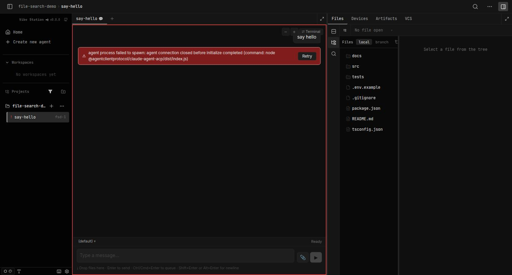
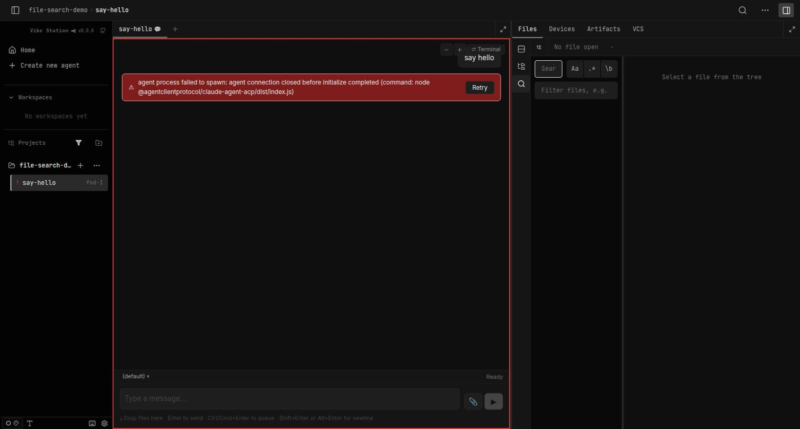
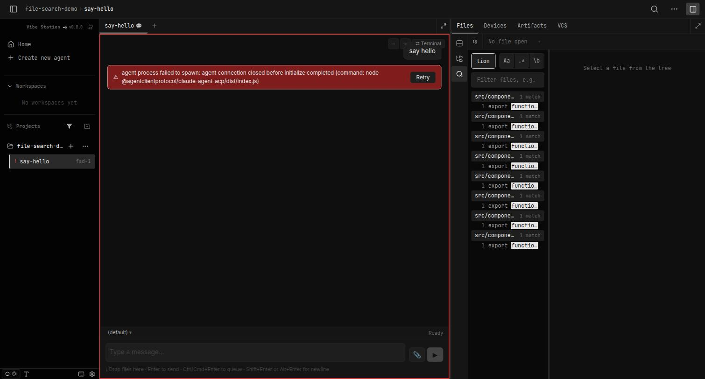
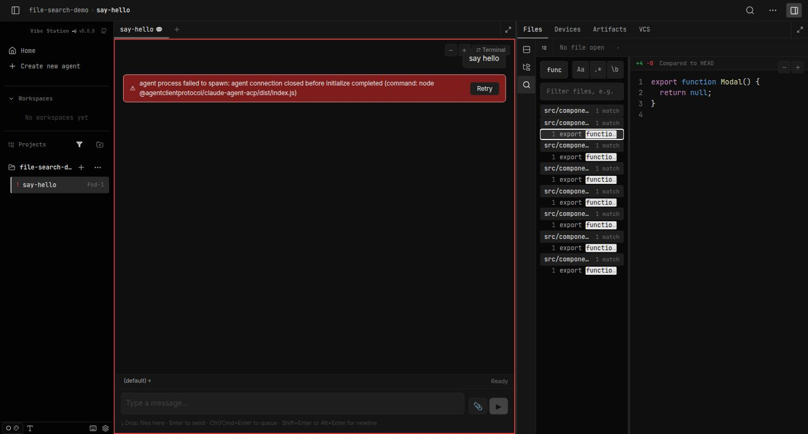
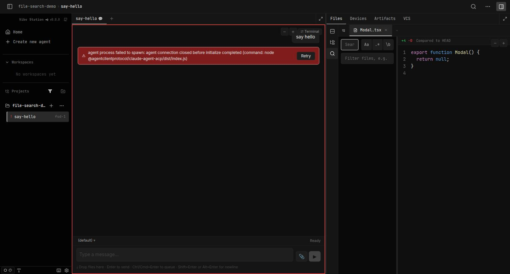

<!--
RULES — read before writing this report:
1. FORMAT: Bullets, tables, code, diagrams ONLY — no prose paragraphs
2. ANSWER FIRST: the finding goes at the top, before any evidence
3. EVERY CLAIM CITED: file:line, a command + its output, or a screenshot
4. READING TIME: optimize for fast human scanning — if it's hard to skim, rewrite it
-->

# Report: Visual review — Search UX keyboard nav + Files-tab icon-rail restructure

**Date:** 2026-09-20 · **Commit:** `c77a8d004e06590e36b52eb5fea920bbd781a299` (branch `search-ux-nav-and-layout`) · **Scope:** live browser walkthrough of the shipped feature (all 3 phases + final-review fixes) in the dev sandbox · **Method:** `scripts/dev-sandbox.sh` (port 7142) + claude-in-chrome, screenshots + DOM/`document.activeElement` checks

## Answer
- Feature is complete and committed as 4 squashed commits (`43af93d` Phase 1, `1496e5e` Phase 2, `2281232` Phase 3, `c77a8d0` final-review fixes) — all visually confirmed working end-to-end in a live sandbox session.
- Captured **8 of 8** planned screenshots (7 required + 1 bonus B-3 check) — see walkthrough below.
- Confirmed live, not just by code reading: roving-cursor keyboard nav through interleaved search results, live "peek" preview updating without committing a tab, click/Enter committing a real tab, peek state surviving a tree↔search rail-mode switch, `Mod+Shift+F` opening Files+search mode with the query input focused (verified via `document.activeElement`), and the final-review fix for switching into search mode while the tree pane is collapsed (auto-expands rather than no-op).
- Dev sandbox booted clean on first try — the glibc issue from the prior 3.T9 session was already fixed (`rust/target-docker/release/{vst-daemon,vst}` binaries left on disk); only needed the same non-fatal `--seed=file-search` project-registration workaround (already-registered project, confirmed via `curl -X POST .../api/projects`).

## Evidence
| Claim | Source |
|-------|--------|
| Sandbox up clean, no GLIBC error | `docker logs vs-159-vst-dev-1` → `vst daemon listening on http://0.0.0.0:7421`, no error lines |
| Tree mode: 3-icon rail, Local/branch chips, tree, empty preview | screenshot 1 below |
| Search mode: query/toggle/glob header, empty state | screenshot 2 below |
| Search results: interleaved file-group headers + match rows for query "function" | screenshot 3 below |
| Roving cursor on a match row + preview live-updated to that match's file, tab strip still "No file open" | screenshot 4 below |
| Click on a match commits a real "Modal.tsx" tab in the strip | screenshot 5 below |
| Peek (Footer.tsx) survives tree→search mode round-trip; committed Modal.tsx tab untouched | screenshot 6 below |
| `Mod+Shift+F` from a non-editable pane switches tree→search and focuses query input | screenshot 7 below; confirmed via JS eval: `{cls: "search-panel__input", tag: "INPUT"}` = `document.activeElement` |
| Bonus: search mode reachable (and tree pane auto-expands) when tree pane was collapsed | screenshot 8 below; matches fix described in `c77a8d0`'s commit message ("rail's search entry point ... now makes the tree pane visible when switching into search mode while it's collapsed") |

## Detail

### Screenshot walkthrough

| # | Screenshot | What it shows | Plan requirement demonstrated |
|---|------------|----------------|-------------------------------|
| 1 | `01-tree-mode.png` | 3-icon rail (▤ layout-toggle / ⊟ tree / 🔍 search), tree header with Files\|local\|branch chips, file tree (`docs`, `src`, `tests`, …), preview pane showing "Select a file from the tree" | Requirement 8 (persistent 3-icon rail) — plan §Requirements, `plan-search-ux-nav-and-layout.md:75` |
| 2 | `02-search-mode-empty.png` | Rail switched to search: query input, `Aa` `.* ` `\b` toggles, glob filter field, empty results area | Requirement 8/9 (search mode header swap, same slot) — `plan-search-ux-nav-and-layout.md:75-76` |
| 3 | `03-search-results.png` | Query "function" → 10 file groups, each with a header row ("1 match") and a match row ("1 export functio…") interleaved in one list | Requirement 3 (header rows in the roving set) + Decision 2 flattening — `plan-search-ux-nav-and-layout.md:70,493-526` |
| 4 | `04-live-peek.png` | Roving cursor boxed on a match row (3rd file group); preview pane shows `Modal.tsx`'s content live; tab strip still reads "No file open" — no tab added by arrow nav | Requirement 1, 2, 5 (Enter-seeds-cursor, ArrowDown moves cursor, peek updates preview without a tab) — `plan-search-ux-nav-and-layout.md:68-69,72` |
| 5 | `05-committed-tab.png` | After clicking the cursored match row, tab strip now shows a real `Modal.tsx ×` tab | Requirement 6 (click/Enter commits via `setActiveFilePathAtLine`) — `plan-search-ux-nav-and-layout.md:73` |
| 6 | `06-peek-survives-mode-switch.png` | Cursor re-arrowed to a different match (Footer.tsx, peeked but not committed); rail switched tree→search→tree→search; preview still shows Footer.tsx, query "function" still populated, committed Modal.tsx tab untouched in strip | Requirement 7, 9 (peek does not clear on rail-mode switch; both bodies always-mounted) — `plan-search-ux-nav-and-layout.md:74,76`; CUJ 2 — `plan-search-ux-nav-and-layout.md:441-457` |
| 7 | `07-mod-shift-f.png` | Focus placed in the non-editable terminal/error pane (tree mode active); `Ctrl+Shift+F` pressed; rail switches to search mode and `document.activeElement` is `.search-panel__input` | Requirement 10 (`Mod+Shift+F` → Files tab + rail search mode, query input focused) — `plan-search-ux-nav-and-layout.md:77`; implementation at `web-ui/src/hooks/useWorkspaceKeyboardShortcuts.ts:124-146` |
| 8 (bonus) | `08-search-reachable-from-collapsed-tree.png` | Tree pane explicitly collapsed via "Hide file tree"; clicking the rail's search icon both switches to search mode AND re-expands the pane (rather than silently no-op) | Final-review fix (B-3), commit `c77a8d0` message: "rail's search entry point (including Mod+Shift+F) now makes the tree pane visible when switching into search mode while it's collapsed" |

### Screenshots

**1 — Tree mode**

**2 — Search mode (empty)**

**3 — Search results**

**4 — Live peek**

**5 — Committed tab**

**6 — Peek survives a mode switch**

**7 — Mod+Shift+F**

**8 — Search reachable from a collapsed tree (bonus, B-3 fix)**

### Sandbox session notes
- Booted with binaries already present at `rust/target-docker/release/{vst-daemon,vst}` (left over from the prior 3.T9 session, per `BLOCKED.md`) — no rebuild needed.
- `scripts/dev-sandbox.sh up vs-159 --port=7142 --seed=file-search` — daemon logged clean (`vst daemon listening on http://0.0.0.0:7421`), no GLIBC error.
- `--seed=file-search`'s own project-registration curl reported the project already registered (`{"error":"This directory is already registered as project 'file-search-demo'."}`) — expected, pre-existing seeded state from the prior session; not a new issue.
- Used the pre-existing `say-hello` worktree/session (from the prior 3.T9 run) to reach a live Files tab — the underlying agent process itself fails to spawn in this throwaway sandbox (no ACP claude binary wired in), which is irrelevant to the UI under review (same caveat noted in `BLOCKED.md`).
- Torn down cleanly: `scripts/dev-sandbox.sh down vs-159` (container/network removed, per-worktree volumes intentionally left intact, matching script design). Browser tab closed.

## Not checked
- Devices/Artifacts/VCS tool tabs, and any tool-tab-unrelated UI — out of scope for this feature.
- `Mod+Enter` (new-tab commit) and Ctrl/Cmd-click new-tab commit path (Requirement 6's alternate commit) — not screenshotted separately; only the primary click-commit path (screenshot 5) was captured. Code path exists per `SearchPanel.tsx` per the plan's 1.7a/B7 and has its own unit test coverage (`1.T8` in the plan), but wasn't re-verified visually in this session.
- Mobile/narrow-viewport layout of the rail — this session used the standard sandbox browser window size only.
- `MasterDetailShell`'s layout-toggle icon (▤, stacked/side-by-side) itself was not clicked/screenshotted in this session — its presence in the rail was confirmed visually (screenshot 1) but its actual toggle behavior was not exercised.

## Follow-ups
| # | Question | Why it matters |
|---|----------|-----------------|
| 1 | Do you want a dedicated screenshot of the `Mod+Enter`/Ctrl+Click "open in new tab" commit path? | Currently only inferred from code + the plan's own unit tests, not visually confirmed in this review |
| 2 | Should the layout-toggle (▤) icon's stacked/side-by-side behavior get its own visual check? | It's visible in every screenshot but was never actually clicked in this session |

## Addendum
- Confirmed mockup this review's screenshots should be compared against: `.vibekit/feature-plans/wip/search-ux-nav-and-layout/report-search-ux-nav-and-layout.md`, section "Addendum — confirmed rail mockup (resolves Follow-up #1)" (`report-search-ux-nav-and-layout.md:154`).
- That section is also where the rail's 3-icon meaning (▤ layout-toggle relocated from `MasterDetailShell`, ⊟ tree, 🔍 search) was confirmed by the user on 2026-09-18 (`report-search-ux-nav-and-layout.md:211-215`) — screenshot 1 (`01-tree-mode.png`) should be diffed against that mockup directly.
