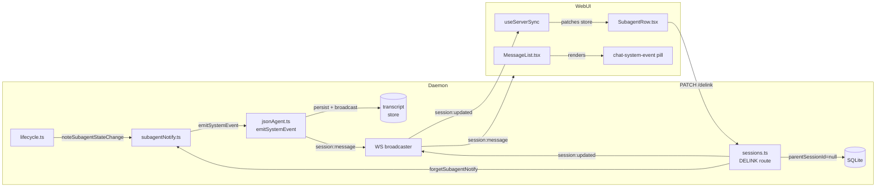

<!--
RULES — read before writing or implementing:
1. FORMAT: Bullets, tables, code, diagrams ONLY — no prose paragraphs
2. REQUIREMENTS: One crisp line each — no verbose descriptions
3. CHECKLIST: Mark items [x] as you complete them — this is your persistent todo list
4. READING TIME: Optimize for fast human scanning — if it's hard to skim, rewrite it
-->

# Plan: subagent-state-events

## Problem & Concept

- Child state-change notices are enqueued as `kind:"user"` events → rendered as human messages, cost one LLM turn each
- Parent's current turn can be interrupted by a queued notice landing mid-stream
- `parentSessionId` is permanent; no way to sever the link from the UI when you want an independent co-worker
- No CLI path to spawn a sibling that isn't linked as a subagent from the start

**Success state:**
- Child transitions render as centred system pills (never user bubbles), cost zero LLM turns, deliver immediately
- Only `waiting_for_human` transitions fire (the one state where action is needed)
- Hovering a SubagentRow chip reveals a ✕; confirming delinks the session (stops all future notices)
- `vst session create --no-parent` spawns a true sibling with no parent link

---

## Requirements

| # | Requirement |
|---|-------------|
| R1 | A new `kind:"message_generated"` event carries child state-change metadata and is never submitted to the LLM |
| R2 | `subagentNotify` emits the event immediately, bypassing the agent queue entirely |
| R3 | Only `waiting_for_human` transitions trigger a notification (not `idle`, `done`, `exited`) |
| R4 | `message_generated` events persist to the transcript and replay on `chat:open` |
| R5 | `message_generated` renders as a centred pill (small font, muted, neither user nor assistant style) |
| R6 | `PATCH /sessions/:id/delink` sets `parentSessionId = null`, broadcasts update, clears buffered notices |
| R7 | SubagentRow chips show a ✕ on hover; pressing it shows inline confirmation before delink |
| R8 | `vst session create --no-parent` omits `sourceAgentId` from the POST body |

---

## Change Map

```
daemon/src/
  types.ts                        ~ add "message_generated" to NormalizedEventKind
  ws/
    protocol.ts                   ~ add "message_generated" to NormalizedEventSchema.kind; add parentSessionId to SessionUpdatedEvent
  services/
    subagentNotify.ts             ~ replace enqueueTurn with emitSystemEvent; filter NOTABLE to waiting_for_human only
    lifecycle.ts                  ~ add emitSystemEvent dep + impl; wire into notifyDeps
    jsonAgent.ts                  ~ new emitSystemEvent() method on JsonAgent
  routes/
    sessions.ts                   ~ new PATCH /sessions/:id/delink endpoint
cli/src/
  commands/session/
    create.ts                     ~ add --no-parent flag
web-ui/src/
  api/
    types.ts                      ~ add "message_generated" to NormalizedEventKind; add parentSessionId to Session patch shape
  components/chat/
    MessageList.tsx               ~ new "system_event" RenderItem + render branch
    SubagentRow.tsx               ~ hover ✕ + inline confirm + delink API call
  styles/
    chat.css                      ~ .chat-system-event pill + .chat-subagent-row__delink reveal
  hooks/
    useServerSync.ts              ~ apply parentSessionId: null patch from session:updated
```

| Today | After this plan |
|-------|-----------------|
| Child state notice enqueued as `kind:"user"`, costs an LLM turn | Notice emitted immediately as `kind:"message_generated"`, zero LLM cost |
| All 4 states (`idle`, `waiting_for_human`, `done`, `exited`) trigger a notice | Only `waiting_for_human` triggers |
| `parentSessionId` is permanent; no UI delink | Hover ✕ on SubagentRow chip → inline confirm → `PATCH /delink` → link gone |
| `vst session create` always links to `$VST_SESSION` | `--no-parent` flag omits the link entirely |

---

## Research

- **`subagentNotify.ts:41-46`** — `NOTABLE` set currently includes `idle`, `waiting_for_human`, `done`, `exited`
- **`subagentNotify.ts:193`** — calls `deps.enqueueTurn(parentId, message)`
- **`lifecycle.ts:460-467`** — `enqueueTurn` impl resolves `JsonAgent` and calls `agent.enqueue({ message })`
- **`jsonAgent.ts:591-601`** — `emitUserEvent()` persists + broadcasts `kind:"user"` and pushes to queue
- **`jsonAgent.ts:603-636`** — `enqueue()` calls `emitUserEvent`, then `queue.push`, then `kickDrain`
- **`ws/protocol.ts:164-176`** — `NormalizedEventSchema.kind` is the enum to extend
- **`ws/protocol.ts:354-381`** — `SessionUpdatedEvent` needs `parentSessionId` as nullable optional
- **`subagentNotify.ts:78-92`** — `forgetSubagentNotify(id)` already removes a session from all buffers; reuse in delink
- **`routes/sessions.ts:997-1095`** — existing PATCH endpoints pattern (`/pin`, `/rename`, `/reorder`) to follow
- **`web-ui/src/components/chat/MessageList.tsx:13-39`** — `RenderItem` union; `"status"` already centred
- **`web-ui/src/styles/chat.css:692-698`** — `.chat-status-note` is the visual baseline for the new pill
- **`web-ui/src/components/chat/SubagentRow.tsx:90-102`** — child list filter; each chip is a `<button>`
- **`cli/src/commands/session/create.ts:26-87`** — already has `--parent <sessionId>` flag (line 26); when `--parent` is NOT passed, defaults to `$VST_SESSION` (line 77); passing `--parent ""` creates unlinked but emits a warning (line 71-75); `--no-parent` is the clean opt-out

---

## Architecture Diagram



---

## Design Details

### Critical User Journeys

**CUJ 1 — child transitions to `waiting_for_human`**
```
Child agent finishes a turn and pauses for input
  → lifecycle.ts calls noteSubagentStateChange(childId, "working", "waiting_for_human", deps)
  → subagentNotify coalesces (4 s window)
  → flush calls deps.emitSystemEvent(parentId, { subagentId, subagentName, subagentState })
  → JsonAgent.emitSystemEvent persists + broadcasts kind:"message_generated" event
  → parent's chat receives session:message WS event
  → MessageList renders a centred pill: "worker is waiting for a reply"
  → zero LLM turns consumed; parent's current turn unaffected
```

**CUJ 2 — user delinks a subagent via hover ✕**
```
User hovers child chip in SubagentRow
  → ✕ button fades in (CSS opacity transition)
  → User clicks ✕
  → Chip text replaced with inline confirm: "Detach worker? [Detach] [Cancel]"
  → User clicks Detach
  → PATCH /sessions/:childId/delink called
  → Daemon: parentSessionId = null in DB, forgetSubagentNotify(childId), session:updated broadcast
  → useServerSync patches session in store
  → SubagentRow re-renders; child chip disappears (parentSessionId null → filter fails)
```

**CUJ 3 — spawn with --no-parent**
```
Agent runs: vst session create $VST_WORKTREE --no-parent --prompt "task"
  → CLI omits sourceAgentId from POST /sessions body
  → Session created with parentSessionId = null
  → No SubagentRow entry, no notifications ever
```

**Error paths:**
- Delink on archived/done session → 400; UI shows toast, chip stays
- `emitSystemEvent` called while no `chat:open` stream → event persists to DB; replayed on next `chat:open` (same buffering as `emitUserEvent`)
- `--no-parent` on a child session that already has a parent → flag applies only at creation; no retroactive effect

### System Boundaries

**Daemon ↔ WebUI — new `session:message` payload shape for `message_generated`:**
```
NormalizedEvent (kind: "message_generated")
  id: string
  sessionId: string          // parent's session id
  ts: ISO8601
  provider: "claude"         // parent's provider
  kind: "message_generated"
  text: string               // human-readable: "worker is waiting for a reply"
  subagentId: string         // child session id
  subagentName: string       // child display name
  subagentState: "waiting_for_human"
  // role, turnId, toolId etc. are absent — this is not a turn event
```

**New REST endpoint:**
```
PATCH /sessions/:id/delink
  → 200 {}
  → 404 { error: "session_not_found" }
  → 400 { error: "session_archived" }
  Auth: existing session auth (same as /pin, /rename)
  Side effects: parentSessionId = null in DB; forgetSubagentNotify(id); session:updated broadcast
```

**`session:updated` — new nullable field:**
```
{ type: "session:updated", sessionId: string, parentSessionId: null }
// parentSessionId: null means "cleared"; absent means "unchanged"
```

**`vst session create` POST body change:**
```
// existing
POST /sessions { worktreeId, type, prompt, sourceAgentId? }
// --no-parent: sourceAgentId simply omitted (already optional server-side)
```

### Data Model

| Entity | Field | Type | Change | Notes |
|--------|-------|------|--------|-------|
| `normalized_events` | `kind` | enum | Add `"message_generated"` | New variant; existing rows unaffected |
| `sessions` | `parentSessionId` | TEXT NULL | No schema change | Already nullable; delink just sets to NULL |

- Migration: N — no schema change needed

### Key Decisions

#### Decision 1: `emitSystemEvent` bypasses `enqueue` entirely
- **Decision:** New `JsonAgent.emitSystemEvent()` persists + broadcasts the event without touching `queue` or calling `kickDrain`
- **Rationale:** The notice is an annotation, not a turn input; it must never trigger an LLM round-trip or compete with user messages in the queue
- **Where:** `daemon/src/services/jsonAgent.ts` — new method alongside `emitUserEvent` (line ~591)

#### Decision 2: Only `waiting_for_human` fires a notice
- **Decision:** Shrink `NOTABLE` from 4 states to `{ "waiting_for_human" }` only
- **Rationale:** `idle` is noise (parent can't act); `done`/`exited` are surfaced by dashboard/WS state events — the only actionable state is when a child is blocked
- **Where:** `daemon/src/services/subagentNotify.ts:41-46`

#### Decision 3: `message_generated` stored in transcript, never sent to LLM
- **Decision:** Event persists to `normalized_events` via `emitSystemEvent`; it is structurally excluded from the model's context because `emitSystemEvent` never calls `enqueue` or `plugin.runTurn` — the CLI process never sees it
- **Rationale:** Model history is managed by the CLI itself (ACP / `plugin.runTurn` at `jsonAgent.ts:1113-1181`); the daemon's `normalized_events` table is a separate replay store, not the input to the model. No kind-filtering needed.
- **Where:** `daemon/src/services/jsonAgent.ts` — `emitSystemEvent` alongside `emitUserEvent` (~line 591)

#### Decision 4: Delink uses `forgetSubagentNotify` to clear buffered notices
- **Decision:** `PATCH /delink` calls `forgetSubagentNotify(id)` immediately after the DB update
- **Rationale:** Prevents a coalescing notice already buffered from delivering after the link is gone
- **Where:** `daemon/src/routes/sessions.ts` + `daemon/src/services/subagentNotify.ts:78-92`

#### Decision 5: Inline confirm in SubagentRow chip (no modal)
- **Decision:** Clicking ✕ replaces chip content with a compact "Detach [name]? [Detach] [Cancel]" — no dialog/modal
- **Rationale:** Modals for a small destructive action are heavyweight; inline confirm keeps context
- **Where:** `web-ui/src/components/chat/SubagentRow.tsx`

---

## Risks / Open Questions

| # | Question | Notes |
|---|----------|-------|
| 1 | Where does `jsonAgent.ts` filter out non-turn event kinds when building the LLM messages array? | Grep before implementing Decision 3; must confirm `message_generated` is excluded |
| 2 | `MAX_NOTICES_PER_PARENT` budget — worth raising/removing now that emit is free? | Conservative: leave at 25 for now; can revisit separately |
| 3 | Parent chip delink wording — "Leave parent" vs "Detach subagent"? | Use "Detach" for both; context from chip position is enough |
| 4 | Race: child transitions while parent has no open `chat:open` stream | Resolved by Decision 3 (persists to DB); replays on reconnect |

---

## Implementation Phases

### Phase 1 — Daemon: new event kind + `emitSystemEvent` + filter

- [x] **1.1** `daemon/src/types.ts` — add `"message_generated"` to `NormalizedEventKind` union; add optional fields `subagentId: string`, `subagentName: string`, `subagentState: LifecycleState` to `NormalizedEvent`
- [x] **1.2** `daemon/src/ws/protocol.ts` — add `"message_generated"` to `NormalizedEventSchema.kind` enum (line ~164); add `parentSessionId: z.string().nullable().optional()` to `SessionUpdatedEvent`
- [x] **1.3** `daemon/src/services/jsonAgent.ts` — add `emitSystemEvent(payload: { subagentId: string; subagentName: string; subagentState: LifecycleState; text: string }): void` method; it calls `this.newEvent("message_generated", { ...payload })`, then `this.persist(ev)` and `this.stream.emitMessage(ev)` — no `queue.push`, no `kickDrain`
- [x] **1.4** Confirm `message_generated` never reaches the LLM — the model's history is managed by the CLI process itself (via `plugin.runTurn`/ACP); `emitSystemEvent` never calls `enqueue` so no turn is submitted to the CLI; this item is a verification check only (grep `runTurn` in `jsonAgent.ts:1113-1181` to confirm the turn-submission path is untouched)
- [x] **1.5** `daemon/src/services/subagentNotify.ts` — change `NOTABLE` to `new Set<LifecycleState>(["waiting_for_human"])` only; replace `enqueueTurn` dep with `emitSystemEvent: (parentId: string, payload: {...}) => Promise<void>`; update `flush()` to call `deps.emitSystemEvent` instead of `deps.enqueueTurn`; update the human-readable `text` to e.g. `"${childName} is waiting for your reply"`; keep `noticeCount` / `MAX_NOTICES_PER_PARENT` logic unchanged — it now limits annotation volume (not token spend) and still guards against unbounded emit loops
- [x] **1.6** `daemon/src/services/lifecycle.ts` — replace `enqueueTurn` in `notifyDeps` with `emitSystemEvent`: resolves `JsonAgent`, calls `agent.emitSystemEvent(payload)`; remove the `enqueueTurn` impl
- [x] **1.T1** Unit — `subagentNotify`: confirm only `waiting_for_human` triggers flush (other states are no-ops)
- [x] **1.T2** Unit — `subagentNotify`: confirm `emitSystemEvent` dep is called (not `enqueueTurn`) on flush
- [x] **1.T3** Unit — `JsonAgent.emitSystemEvent`: confirm event is persisted + broadcast; confirm `queue` length is unchanged; confirm `kickDrain` is not called
- [x] **1.T5** Integration — replay: `message_generated` event persisted while no `chat:open` stream open → appears in `chat:replay` on next `chat:open` (verifies R4)
- [x] **1.T4** Regression — existing `subagentNotify` tests pass with no API changes (check `daemon/src/__tests__/subagentNotify.test.ts`)

**Verify phase 1:** `pnpm -C daemon test` passes; `pnpm -C daemon build` clean

---

### Phase 2 — Daemon: `PATCH /sessions/:id/delink` endpoint

- [x] **2.1** `daemon/src/routes/sessions.ts` — add `PATCH /sessions/:id/delink` handler following the `/pin` pattern:
  - lookup session; 404 if not found
  - 400 if `session.archivedAt` (archived sessions must not be mutated)
  - set `parentSessionId = null` in SQLite
  - call `forgetSubagentNotify(id)` (import from `subagentNotify.ts`)
  - broadcast `session:updated { sessionId: id, parentSessionId: null }`
  - return `200 {}`
- [x] **2.T1** Integration — `PATCH /sessions/:id/delink`: sets `parentSessionId` to null in DB and broadcasts `session:updated`
- [x] **2.T2** Integration — delink on archived session returns 400
- [x] **2.T3** Regression — existing `/pin`, `/rename` routes unaffected

**Verify phase 2:** `pnpm -C daemon test` passes

---

### Phase 3 — CLI: `--no-parent` flag

- [x] **3.1** `cli/src/commands/session/create.ts:26-87` — add `--no-parent` boolean flag (alongside existing `--parent <sessionId>`); when `--no-parent` is set, skip both the explicit-parent branch and the `$VST_SESSION` fallback (set `sourceAgentId = undefined` unconditionally); `--no-parent` wins over `--parent` if both are passed (passing both is not an error — `--no-parent` takes precedence silently)
- [x] **3.2** Update help text to document `--no-parent` as "create an independent session with no parent link"
- [x] **3.T1** Unit — `vst session create --no-parent` POST body contains no `sourceAgentId`
- [x] **3.T2** Regression — `vst session create` without the flag still sends `sourceAgentId: $VST_SESSION`

**Verify phase 3:** `pnpm -C cli test` passes; `vst session create --help` shows `--no-parent`

---

### Phase 4 — Web-UI: `message_generated` render

- [x] **4.1** `web-ui/src/api/types.ts` — add `"message_generated"` to `NormalizedEventKind`; add `subagentId?: string`, `subagentName?: string`, `subagentState?: string` to `NormalizedEvent`; add `parentSessionId?: string | null` to session patch type
- [x] **4.2** `web-ui/src/hooks/useServerSync.ts` — in the `session:updated` handler, apply `parentSessionId` patch: if `ev.parentSessionId === null`, set `session.parentSessionId = null` in the store
- [x] **4.3** `web-ui/src/components/chat/MessageList.tsx` — add `{ type: "system_event"; id: string; text: string }` to `RenderItem` union; add `case "message_generated"` in `groupEvents()` that pushes `{ type: "system_event", id: ev.id, text: ev.text ?? "" }`; add render branch that returns `<div className="chat-system-event" role="note">{item.text}</div>`
- [x] **4.4** `web-ui/src/styles/chat.css` — add `.chat-system-event` rule (centred pill: `align-self:center`, `font-size: var(--font-size-sm)`, `color: var(--fg-subtle)`, `padding: var(--space-1) var(--space-3)`, `border-radius: var(--radius-full)`, `background: var(--surface-subtle)`, `max-width: 60%`, `text-align: center`)
- [x] **4.T1** Unit — `groupEvents`: `message_generated` event produces a `system_event` RenderItem
- [x] **4.T2** Regression — existing `groupEvents` tests (`MessageList.test.tsx`) all pass

**Verify phase 4:** `pnpm -C web-ui test` passes; `pnpm -C web-ui build` clean

---

### Phase 5 — Web-UI: SubagentRow delink UX

- [x] **5.1** `web-ui/src/components/chat/SubagentRow.tsx` — add `confirmDelink: string | null` local state (stores the child session id being confirmed); on child chip: add `<button className="chat-subagent-row__delink" aria-label="Detach subagent" onClick={(e) => { e.stopPropagation(); setConfirmDelink(child.id) }}>✕</button>`; when `confirmDelink === child.id`, replace chip content with inline confirm UI: `"Detach [name]? [Detach] [Cancel]"`
- [x] **5.2** Wire Detach action: call `api.patch(\`/sessions/${child.id}/delink\`)` (or equivalent REST call via the existing API client); on success clear `confirmDelink`; on error show brief inline error state
- [x] **5.3** Add symmetric delink affordance to the parent chip (`--parent` variant): `aria-label="Leave parent"`, same inline confirm; the session id passed to `PATCH /sessions/:id/delink` is the **current session's own id** (to sever its own `parentSessionId` link, not the parent's)
- [x] **5.4** `web-ui/src/styles/chat.css` — add `.chat-subagent-row__delink` rule: `opacity: 0`, `position: absolute`, `right: var(--space-1)`, `transition: opacity 0.1s`; reveal on `.chat-subagent-row__item:hover .chat-subagent-row__delink` and `:focus-within`; ensure `.chat-subagent-row__item` has `position: relative`
- [x] **5.T1** Unit — `SubagentRow`: ✕ button visible on hover; clicking it enters confirm state
- [x] **5.T2** Unit — `SubagentRow`: confirming Detach calls the delink API; cancelling restores the chip
- [x] **5.T3** Regression — `SubagentRow.test.tsx` existing tests pass

**Verify phase 5:** `pnpm -C web-ui test` passes; visual check in dev sandbox — hover chip reveals ✕, confirm + delink removes chip

---

## Files & Phase Impact

| File | Status | Phase | Description / Contract Change |
|------|--------|-------|-------------------------------|
| `daemon/src/types.ts` | Modified | 1.1 | Add `"message_generated"` to `NormalizedEventKind`; add `subagentId?`, `subagentName?`, `subagentState?` to `NormalizedEvent` |
| `daemon/src/ws/protocol.ts` | Modified | 1.2, 2.1 | Add `"message_generated"` to schema enum; add `parentSessionId: z.string().nullable().optional()` to `SessionUpdatedEvent` |
| `daemon/src/services/jsonAgent.ts` | Modified | 1.3, 1.4 | New `emitSystemEvent()`: persist + broadcast only, no queue/drain; verify kind-filtering in LLM message construction |
| `daemon/src/services/subagentNotify.ts` | Modified | 1.5 | `NOTABLE` → `{"waiting_for_human"}` only; `enqueueTurn` dep → `emitSystemEvent`; `flush()` rewired |
| `daemon/src/services/lifecycle.ts` | Modified | 1.6 | `notifyDeps.emitSystemEvent` impl; remove `enqueueTurn` |
| `daemon/src/routes/sessions.ts` | Modified | 2.1 | New `PATCH /sessions/:id/delink`: Contract: `200 {}` / `400 {error}` · Side effects: `parentSessionId=null`, `forgetSubagentNotify`, `session:updated` broadcast |
| `daemon/src/__tests__/subagentNotify.test.ts` | Modified | 1.T1–1.T2 | Tests for `NOTABLE` filter + `emitSystemEvent` dep |
| `daemon/src/__tests__/jsonAgent.test.ts` | Modified | 1.T3 | Tests for `emitSystemEvent` method |
| `daemon/src/__tests__/sessions.test.ts` | Modified | 2.T1–2.T2 | Tests for `/delink` route |
| `cli/src/commands/session/create.ts` | Modified | 3.1–3.2 | `--no-parent` flag (line ~26); skips `$VST_SESSION` fallback at line 77 |
| `web-ui/src/api/types.ts` | Modified | 4.1 | Add `"message_generated"` kind; add subagent fields to `NormalizedEvent`; add `parentSessionId` to session patch |
| `web-ui/src/hooks/useServerSync.ts` | Modified | 4.2 | Apply `parentSessionId: null` from `session:updated` |
| `web-ui/src/components/chat/MessageList.tsx` | Modified | 4.3 | New `system_event` RenderItem + render branch for `message_generated` |
| `web-ui/src/components/chat/SubagentRow.tsx` | Modified | 5.1–5.3 | Hover ✕ + inline confirm + delink API call on both chip variants |
| `web-ui/src/styles/chat.css` | Modified | 4.4, 5.4 | `.chat-system-event` pill; `.chat-subagent-row__delink` reveal |
| `web-ui/src/__tests__/MessageList.test.tsx` | Modified | 4.T1–4.T2 | `system_event` render test |
| `web-ui/src/__tests__/SubagentRow.test.tsx` | Modified | 5.T1–5.T3 | Hover ✕ + confirm + delink tests |
