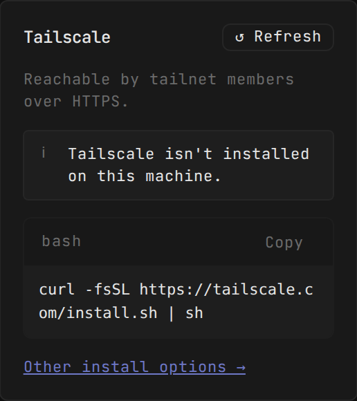
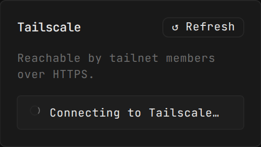
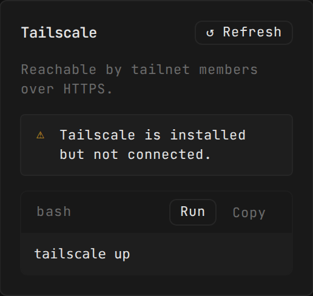
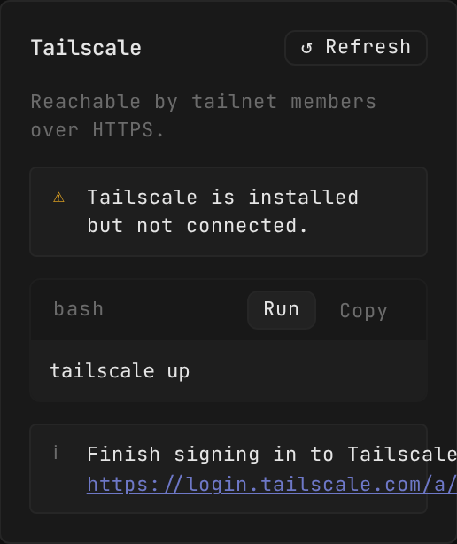
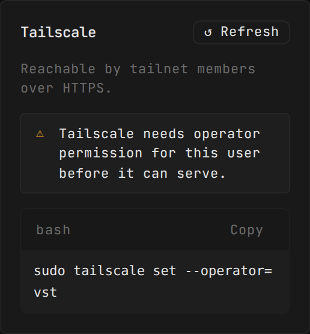
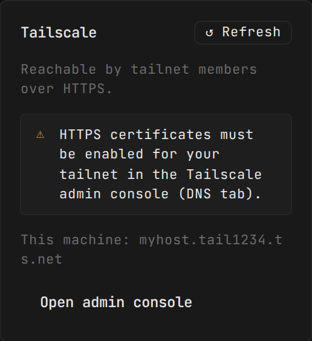
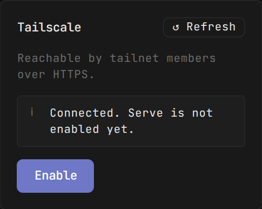
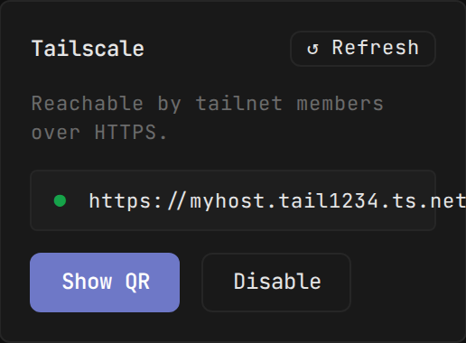
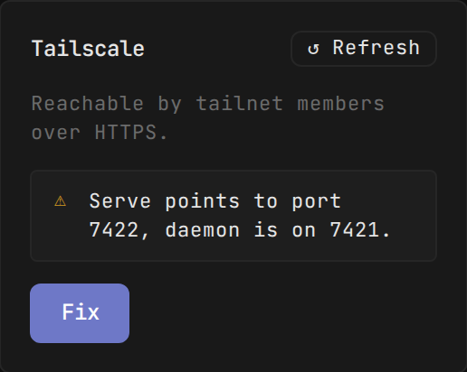
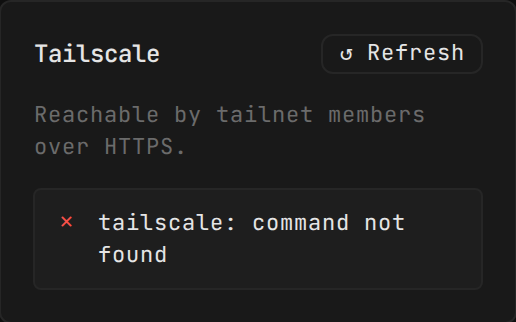

# Tailscale Card States — Review

A visual review of every state of the Tailscale HTTPS card in the Remote Access
settings UI (`web-ui/src/components/settings/RemoteAccessSetting.tsx`). Each
state is driven by the response of `GET /tailscale/status`; I mocked that
endpoint at the browser level (Playwright `page.route` interception) against
the live dev sandbox (`scripts/dev-sandbox.sh up --seed=demo`, port 7128) and
captured the Tailscale card directly.

This pass reflects the UI-improvements plan: every status message is now a
`StatusBox`, `not_installed`/`needs_operator` show a `ShellBlock`, `not_connected`
offers a **Run** button that drives the new `POST /tailscale/up`, `certs_not_enabled`
surfaces the machine's `dnsName`, the Refresh button is always visible, and the
tunnel card is renamed **Cloudflare**.

Screenshots: `.vibekit/tailscale-screenshots/state-<name>.png`

---

## not_installed

A `StatusBox` (`info`) explains Tailscale isn't installed, followed by a copy-only
`ShellBlock` with the cross-platform installer (`curl -fsSL … | sh`) and an
"Other install options →" link to `https://tailscale.com/download`. Copy-only —
the installer is never auto-run. The Refresh button in the header is present.

---

## starting

A `StatusBox` (`busy`) with an animated spinner: "Connecting to Tailscale…".
This state auto-refetches every 3 s, so the spinner is not decorative — the card
re-resolves on its own once the backend reports `Running`.

---

## not_connected

A `StatusBox` (`warn`) explains Tailscale is installed but not connected, with a
`ShellBlock` showing `tailscale up` and a **Run** button that calls
`POST /tailscale/up`. On success the status refetches and the card flips to the
next state automatically. The most common cause of this state is `NeedsLogin`:
`tailscale up` blocks on an auth URL, times out, and the returned `loginUrl` is
rendered as a **link** (not an error) — see the sub-state below.

### not_connected — NeedsLogin result

When `tailscale up` hits the interactive-auth case, the result carries a non-null
`loginUrl`; the card shows a `StatusBox` (`info`) with a "Finish signing in to
Tailscale:" link to that URL rather than an error. This is the primary
`not_connected` path for a machine that has never authenticated.

---

## needs_operator

A `StatusBox` (`warn`) explains that Tailscale needs operator permission, with a
copy-only `ShellBlock` showing the `sudo tailscale set --operator=…` fix command.
No Run button — the command requires `sudo`. The operator name is hardened to
fall back to `os.userInfo().username` when `$USER` is empty (systemd).

---

## certs_not_enabled

A `StatusBox` (`warn`) explains HTTPS certificates must be enabled for the tailnet
in the admin console (DNS tab), and — new — surfaces the machine's `dnsName`
("This machine: …"), so the user can see *which* tailnet to enable HTTPS on. An
"Open admin console" button links out to `https://login.tailscale.com/admin/dns`.
The `dnsName` guard means an empty `dnsName` (the fabricated 409 fallback) renders
neither the "This machine:" line nor an empty `<code>`.

---

## connected_no_serve

A `StatusBox` (`info`): "Connected. Serve is not enabled yet." with a primary
**Enable** button that registers the serve rule for the daemon port.

---

## serve_active

A `StatusBox` (`ok`, green) with the live `httpsUrl` (`https://myhost.tail1234.ts.net`),
plus "Show QR" and "Disable" buttons and the always-visible Refresh button in the
header. This is the fully-active state.

---

## port_mismatch

A `StatusBox` (`warn`) identifies the mismatch: "Serve points to port 7422, daemon
is on 7421." with a primary **Fix** button, plus Refresh in the header.

---

## error

A `StatusBox` (`error`, `role="alert"`) shows the raw daemon message
("tailscale: command not found"). This is the fallback when `getStatus` throws.
The Refresh button is always visible, so the user can retry in place.

---

## Observations

The previous review's findings are addressed by this pass:

1. **Refresh is now always visible.** The old card only showed Refresh for
   `serve_active`/`port_mismatch`; an `error` or any other state had no in-place
   retry. The header Refresh now renders unconditionally with a `refreshing`
   spinner state, so every state (including `error`) can be re-polled without
   leaving the page.
2. **`certs_not_enabled` now surfaces the tailnet name.** The `dnsName`
   (`myhost.tail1234.ts.net`) is displayed ("This machine: …"), resolving the old
   ambiguity about *which* tailnet to enable HTTPS on.
3. **`needs_operator` explains the effect.** The `warn` `StatusBox` now states
   what the operator fix is for, alongside the copy-only `ShellBlock`.
4. **No bare hex fallbacks.** `--fg-danger`/`--fg-success`/`--fg-warning` are now
   real per-theme tokens in `tokens.css`; the old `var(--fg-danger, #f85149)` hex
   fallbacks (which silently inherited instead of rendering red) are dropped.
5. **`not_connected` is actionable.** It now offers a real **Run** button
   (`POST /tailscale/up`) with the `NeedsLogin` auth-URL rendered as a link, not
   an error — matching the most common path for a never-authenticated machine.

Remaining nits (non-blocking):

- The `not_connected` **Run** and the tunnel **Enable** are the only host-mutating
  actions on the card; `POST /tailscale/up` is correctly guarded to the desktop
  (`DESKTOP_ONLY`) and returns `DESKTOP_ONLY` → "Run this from the desktop app."
  for browser/mobile callers.
- `starting` auto-refetch (3 s) keeps polling until the backend reports a stable
  state — no throttling, so a machine stuck in `Starting` would poll every 3 s.
  Acceptable for a rare transient state.
