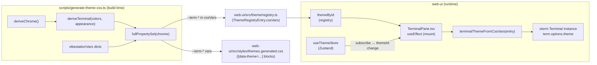

<!--
RULES — read before writing or implementing:
1. FORMAT: Bullets, tables, code, diagrams ONLY — no prose paragraphs
2. REQUIREMENTS: One crisp line each — no verbose descriptions
3. CHECKLIST: Mark items [x] as you complete them — this is your persistent todo list
4. READING TIME: Optimize for fast human scanning — if it's hard to skim, rewrite it
-->

# terminal-ansi-theming — ANSI terminal palette from theme system

## Problem & Concept

- `TerminalPane.tsx:197-200` hardcodes `background: "#0f0f0f"` and `foreground: "#e5e5e5"` — no other ANSI colors — breaking light themes and ignoring the user's active theme
- Theme generator (`scripts/generate-theme-css.ts`) already reads `terminal.ansi*` VS Code keys for status badge colors but never emits xterm-compatible CSS vars or populates `ThemeRegistryEntry.cssVars` with a terminal palette
- Done = every terminal pane reads its full 21-var ANSI palette from `ThemeRegistryEntry.cssVars` and live-updates when the user switches themes, with no terminal recreation

---

## Requirements

| # | Requirement |
|---|-------------|
| R1 | Generator emits 21 `--term-*` CSS vars per theme into `themes.generated.css` and `registry.ts` |
| R2 | All 20 Shiki-derived themes derive `--term-*` vars from VS Code `terminal.*` keys with documented fallbacks |
| R3 | Both Vibestation hand-authored themes carry the 21 `--term-*` vars from the values listed in this plan |
| R4 | `TerminalPane.tsx` constructs each `Terminal` with the active theme's full ANSI palette instead of hardcoded colors |
| R5 | Live theme switch updates every open terminal pane's `term.options.theme` without recreating the terminal |
| R6 | `pnpm --filter @vibestation/web typecheck` passes after both phases |
| R7 | `vitest run` passes after both phases |

---

## Change Map

```
scripts/
  generate-theme-css.ts           ~ add brighten(), deriveTerminal(), wire into deriveChrome() + vibestationVars
web-ui/src/
  theme/
    registry.ts                   ~ regenerated — 21 new --term-* keys in every cssVars entry
  styles/
    themes.generated.css          ~ regenerated — 21 new --term-* vars in every [data-theme] block
  components/layout/
    TerminalPane.tsx              ~ replace hardcoded theme object; add terminalThemeFromCssVars(); subscribe live
```

| Today | After this plan |
|-------|-----------------|
| Terminal pane uses `background: "#0f0f0f"`, `foreground: "#e5e5e5"` for all themes | Terminal pane uses 21-color ANSI palette derived from the active theme's registry entry |
| Theme switch has no effect on open terminal panes | Theme switch live-updates every open terminal's colors via `term.options.theme` without recreation |
| `ThemeRegistryEntry.cssVars` has no terminal-palette keys | Every registry entry carries 21 `--term-*` keys derived at generator runtime |

---

## Research

- **`scripts/generate-theme-css.ts:178-215`** — `hexToRgb`, `rgbToHex`, `mix`, `darken` helpers already present; `brighten` is missing
- **`scripts/generate-theme-css.ts:219-306`** — `deriveChrome()` reads `c["terminal.ansiRed"]` etc. for `--status-working`/`--pr-*` already; same key map reused in `deriveTerminal()`
- **`scripts/generate-theme-css.ts:344-350`** — `fullPropertySet()` spreads `chrome` then MD vars; terminal vars arrive inside `chrome` (returned by `deriveChrome`), so they pass through automatically once added there
- **`scripts/generate-theme-css.ts:46-142`** — `vibestationVars` dicts for both Vibestation themes sit inline in `THEMES`; 21 new entries added directly to each dict
- **`scripts/generate-theme-css.ts:404-414`** — loop: if `entry.vibestationVars`, uses it as-is as `chrome`; else calls `deriveChrome(theme, appearance)` — no separate code path needed; same `fullPropertySet(chrome)` call covers both
- **`web-ui/src/components/layout/TerminalPane.tsx:167-509`** — single `useEffect` creates `Terminal`, subscribes output, manages resize; cleanup at line 486-503 already collects disposal fns into local vars; `unsubTheme` follows same pattern
- **`web-ui/src/components/layout/TerminalPane.tsx:197-200`** — hardcoded `theme: { background, foreground }` is what we replace
- **`web-ui/src/hooks/useThemeStore.ts:35-52`** — `useThemeStore` is a Zustand store; `useThemeStore.subscribe(cb)` returns an unsubscribe function; `useThemeStore.getState().themeId` gives the current id synchronously
- **`web-ui/src/theme/registry.ts`** — generated; exports `themeById: Record<string, ThemeRegistryEntry>`, `defaultThemeId: string`, `ThemeRegistryEntry { id, name, appearance, shikiThemeId, cssVars: Record<string, string> }`
- **xterm.js `ITheme`** — interface with optional fields: `background`, `foreground`, `cursor`, `cursorAccent`, `selectionBackground`, `black`, `red`, `green`, `yellow`, `blue`, `magenta`, `cyan`, `white`, `brightBlack`, `brightRed`, `brightGreen`, `brightYellow`, `brightBlue`, `brightMagenta`, `brightCyan`, `brightWhite`; assignable to `term.options.theme` for live update

---

## Architecture Diagram



---

## Design Details

### CUJs

**CUJ 1 — Initial mount on dark theme (happy path)**

```
User opens a workspace with vibestation-dark active
  → TerminalPane mounts, useEffect runs
  → reads useThemeStore.getState().themeId = "vibestation-dark"
  → looks up themeById["vibestation-dark"].cssVars
  → calls terminalThemeFromCssVars(entry) → ITheme with 21 fields
  → Terminal({ ..., theme: <ITheme> }) created
  → Terminal renders with correct dark ANSI palette
```

**CUJ 2 — Live theme switch while terminal open (happy path)**

```
User switches to "github-light" in Settings while a terminal is open
  → useThemeStore.setThemeId("github-light") fires
  → subscribed callback in TerminalPane's useEffect fires
  → callback looks up themeById["github-light"].cssVars
  → calls terminalThemeFromCssVars(entry) → new ITheme
  → term.options.theme = newTheme
  → xterm re-renders existing terminal content in new palette — no recreation
```

**CUJ 3 — Unknown / deprecated theme id (error path)**

```
Stored themeId is "dracula" (removed from registry)
  → themeById["dracula"] is undefined
  → terminalThemeFromCssVars falls back to themeById[defaultThemeId]
  → Terminal renders with vibestation-dark palette
  → No crash, no broken colors
```

**CUJ 4 — Theme with incomplete VS Code key coverage (error path)**

```
Shiki theme missing terminal.ansiBlue
  → deriveTerminal() hits ?? branch → uses hardcoded fallback "#3b82f6"
  → emitted into cssVars as "--term-blue": "#3b82f6"
  → ITheme.blue = "#3b82f6"
  → Terminal renders with reasonable fallback color
```

### Key Decisions

#### Decision 1: Terminal vars live inside `deriveChrome()`, not a separate function called at the CSS-emit level

- **Decision:** `deriveChrome()` calls `deriveTerminal()` internally and merges results into its return value
- **Rationale:** `fullPropertySet()` already spreads `chrome` without modification — adding terminal vars to `chrome` requires no change to `fullPropertySet()` or the emit loop; `vibestationVars` also uses the `chrome` code path unchanged
- **Where:** `scripts/generate-theme-css.ts:219` (`deriveChrome`) and new `deriveTerminal` function above it

#### Decision 2: Subscribe inside the mount `useEffect`, not a separate `useEffect`

- **Decision:** `useThemeStore.subscribe()` is called inside the existing mount `useEffect` at `TerminalPane.tsx:167`, and its unsubscribe is added to the cleanup at line 486
- **Rationale:** the subscription is tied to this specific `term` instance's lifetime; a separate `useEffect` would need `termRef.current` which may be null on the first render; co-location with term creation is safer and matches the `offOutput`/`d.dispose()` pattern already in the file
- **Where:** `web-ui/src/components/layout/TerminalPane.tsx:167-509`

#### Decision 3: `terminalThemeFromCssVars` reads from `ThemeRegistryEntry.cssVars`, not from DOM CSS variables

- **Decision:** helper reads the `--term-*` string values from `entry.cssVars` (a plain JS object), not `getComputedStyle(document.documentElement).getPropertyValue(...)`
- **Rationale:** `cssVars` is the authoritative source (it's what generated the CSS); avoids async DOM-read timing issues and works in SSR/test environments; consistent with how Shiki highlighting already reads theme colors from the registry
- **Where:** new helper `terminalThemeFromCssVars` in `web-ui/src/components/layout/TerminalPane.tsx`

#### Decision 4: `selectionBackground` uses `rgba(...)` string, not a hex — pass through as-is

- **Decision:** the `--term-selection-bg` value may be an `rgba(...)` string (e.g. Vibestation themes); `terminalThemeFromCssVars` passes the raw string directly to `ITheme.selectionBackground` without normalization
- **Rationale:** xterm.js accepts both hex and `rgba(...)` for `selectionBackground`; attempting to parse/convert rgba would complicate the helper without benefit
- **Where:** `terminalThemeFromCssVars` helper

#### Decision 5: `brighten()` adds a fixed N to each RGB channel, clamped at 255

- **Decision:** mirrors `darken()` (subtracts N, clamped at 0) — adds N to each channel, clamped at 255
- **Rationale:** consistent with the existing darken/mix strategy; absolute unit addition keeps bright variants visibly lighter without blowing out near-white colors
- **Where:** `scripts/generate-theme-css.ts` — new helper placed after `darken()` at line 215

---

## Risks / Open Questions

| # | Question | Notes |
|---|----------|-------|
| 1 | Shiki themes with `terminal.selectionBackground` as 8-digit hex (with alpha) | `hexToRgb` already strips alpha (line 180); result is opaque hex — acceptable for selection bg |
| 2 | xterm.js `ITheme` type import path | `@xterm/xterm` exports `ITheme`; verify with `import type { ITheme } from "@xterm/xterm"` — already used via `Terminal` in the file |
| 3 | One-light theme has weak key coverage | Plan comment (line 161-165) already notes fallback-leaning pattern; visual spot-check after regenerate is the mitigation |
| 4 | `term.options.theme` assignment triggers full re-render | xterm.js redraws the viewport on theme update — intentional; no scrollback lost |

---

## Implementation Phases

### Phase 1 — Extend generator + regenerate

- [x] **1.0** From repo root `/home/gb/.vibe-station/projects/vibe-station/worktrees/vs-152`, run `pnpm install` (node_modules may be absent in a fresh worktree)
- [x] **1.1** Add `brighten(hex: string, amount: number): string` helper to `scripts/generate-theme-css.ts` after `darken()` at line 215 — adds `amount` to each RGB channel, clamps at 255, returns hex
- [x] **1.2** Add `deriveTerminal(c: Record<string, string>, bg: string, fg: string, appearance: Appearance): Record<string, string>` function above `deriveChrome()` at line 219 — reads VS Code `terminal.*` keys with fallbacks as defined in this plan's ANSI fallback table; calls `brighten()` for bright-color fallbacks
- [x] **1.3** Inside `deriveChrome()` (line 261's return statement), spread `...deriveTerminal(c, bg, fg, appearance)` into the returned object so all 21 `--term-*` vars are included
- [x] **1.4** Add all 21 `--term-*` entries to `vibestationVars` for `vibestation-dark` (lines 52-93) using values from the plan's Vibestation dark palette table
- [x] **1.5** Add all 21 `--term-*` entries to `vibestationVars` for `vibestation-light` (lines 100-141) using values from the plan's Vibestation light palette table
- [x] **1.6** Regenerate: run `pnpm tsx scripts/generate-theme-css.ts` from `/home/gb/.vibe-station/projects/vibe-station/worktrees/vs-152`

**Verify phase 1:**
- [x] **1.T1** Typecheck — `pnpm --filter @vibestation/web typecheck` exits 0 (NOTE: `scripts/` is not covered by this tsconfig — the `tsx` run in 1.6 is the real generator typecheck)
- [x] **1.T2** Unit — `pnpm --filter @vibestation/web test` exits 0 (NOTE: `web-ui/src/theme/registry.test.ts` enforces key-set parity across all themes — a typo in any `--term-*` key name fails here with a diff showing the mismatch)
- [x] **1.T3** Spot-check registry — `grep -c '"--term-background"' web-ui/src/theme/registry.ts` equals 20 (one per theme entry)
- [x] **1.T4** Spot-check CSS — `grep -c '\-\-term-background' web-ui/src/styles/themes.generated.css` equals 40 (root + scoped selector per theme = 2 × 20)

---

### Phase 2 — Wire TerminalPane + live update

- [x] **2.1** Add import to `web-ui/src/components/layout/TerminalPane.tsx` (after existing imports at line 15):
  ```ts
  import { useThemeStore } from "@/hooks/useThemeStore";
  import { themeById, defaultThemeId } from "@/theme/registry";
  import type { ITheme } from "@xterm/xterm";
  ```
- [x] **2.2** Add `terminalThemeFromCssVars` helper function in `TerminalPane.tsx` (above the component, after `isXtermAutoResponse`):
  ```ts
  function terminalThemeFromCssVars(themeId: string): ITheme {
    const entry = themeById[themeId] ?? themeById[defaultThemeId]!;
    const v = entry.cssVars;
    return {
      background:        v["--term-background"],
      foreground:        v["--term-foreground"],
      cursor:            v["--term-cursor"],
      cursorAccent:      v["--term-cursor-accent"],
      selectionBackground: v["--term-selection-bg"],
      black:             v["--term-black"],
      red:               v["--term-red"],
      green:             v["--term-green"],
      yellow:            v["--term-yellow"],
      blue:              v["--term-blue"],
      magenta:           v["--term-magenta"],
      cyan:              v["--term-cyan"],
      white:             v["--term-white"],
      brightBlack:       v["--term-bright-black"],
      brightRed:         v["--term-bright-red"],
      brightGreen:       v["--term-bright-green"],
      brightYellow:      v["--term-bright-yellow"],
      brightBlue:        v["--term-bright-blue"],
      brightMagenta:     v["--term-bright-magenta"],
      brightCyan:        v["--term-bright-cyan"],
      brightWhite:       v["--term-bright-white"],
    };
  }
  ```
- [x] **2.3** In `TerminalPane.tsx` at line 197-200, replace the hardcoded `theme` object with:
  ```ts
  theme: terminalThemeFromCssVars(useThemeStore.getState().themeId),
  ```
- [x] **2.4** Inside the mount `useEffect` (after `term.open(host)` at line 231, before the `return () => {` cleanup), add the live-update subscription (guard against non-theme mutations like font changes):
  ```ts
  const unsubTheme = useThemeStore.subscribe((state, prev) => {
    if (state.themeId !== prev.themeId) {
      term.options.theme = terminalThemeFromCssVars(state.themeId);
    }
  });
  ```
- [x] **2.5** Inside the cleanup `return () => { ... }` at line 486, add `unsubTheme()` alongside the other disposal calls (before `term.dispose()`)

**Verify phase 2:**
- [x] **2.T1** Typecheck — `pnpm --filter @vibestation/web typecheck` exits 0
- [x] **2.T2** Unit — `pnpm --filter @vibestation/web test` exits 0 (TerminalPane.test.tsx: 17 pre-existing failures due to a broken xterm mock — unrelated to this feature, count unchanged)
- [ ] **2.T3** Browser — launch dev sandbox, open a terminal pane; confirm terminal background matches active theme's `--term-background` (not `#0f0f0f` on a light theme)
- [ ] **2.T4** Browser — switch theme in Settings while terminal is open; confirm terminal colors update without page reload and without losing terminal content/scrollback

---

## ANSI Fallback Table (generator reference)

| `--term-*` var | Primary VS Code key | Fallback |
|----------------|--------------------|--------------------|
| `--term-background` | `terminal.background` | `editor.background` |
| `--term-foreground` | `terminal.foreground` | `editor.foreground` |
| `--term-cursor` | `terminalCursor.foreground` | `editor.foreground` |
| `--term-cursor-accent` | `terminalCursor.background` | `editor.background` |
| `--term-selection-bg` | `terminal.selectionBackground` | see note below |
| `--term-black` | `terminal.ansiBlack` | dark: `mix(bg,fg,0.15)`  light: `mix(bg,fg,0.85)` |
| `--term-red` | `terminal.ansiRed` | `#ef4444` |
| `--term-green` | `terminal.ansiGreen` | `#22c55e` |
| `--term-yellow` | `terminal.ansiYellow` | `#eab308` |
| `--term-blue` | `terminal.ansiBlue` | `#3b82f6` |
| `--term-magenta` | `terminal.ansiMagenta` | `#8250df` |
| `--term-cyan` | `terminal.ansiCyan` | `#06b6d4` |
| `--term-white` | `terminal.ansiWhite` | dark: `mix(bg,fg,0.85)`  light: `mix(bg,fg,0.15)` |
| `--term-bright-black` | `terminal.ansiBrightBlack` | dark: `mix(bg,fg,0.35)`  light: `mix(bg,fg,0.65)` |
| `--term-bright-red` | `terminal.ansiBrightRed` | `brighten(ansiRed, 20)` |
| `--term-bright-green` | `terminal.ansiBrightGreen` | `brighten(ansiGreen, 20)` |
| `--term-bright-yellow` | `terminal.ansiBrightYellow` | `brighten(ansiYellow, 20)` |
| `--term-bright-blue` | `terminal.ansiBrightBlue` | `brighten(ansiBlue, 20)` |
| `--term-bright-magenta` | `terminal.ansiBrightMagenta` | `brighten(ansiMagenta, 20)` |
| `--term-bright-cyan` | `terminal.ansiBrightCyan` | `brighten(ansiCyan, 20)` |
| `--term-bright-white` | `terminal.ansiBrightWhite` | dark: `mix(bg,fg,0.95)`  light: `mix(bg,fg,0.05)` |

**Notes:**
- **Appearance-conditional fallbacks** (black/white family): dark = low pct from bg toward fg (near-dark); light = high pct from bg toward fg (near-dark). Regular colors computed before bright fallbacks inside `deriveTerminal`; `ansiRed`/`ansiGreen`/etc. must be local `const`s before bright fallback lines.
- **`--term-selection-bg` fallback**: VS Code key often absent; use `hexToRgb()` (already in generator at line 178) to produce: `const [r,g,b] = hexToRgb(mix(fg, bg, 0.3)); ... \`rgba(${r},${g},${b},0.3)\`` — xterm accepts `rgba(...)` for this field; alpha is meaningful for selection overlay. The primary-key read may also be an 8-digit hex (e.g. `#RRGGBBAA`); `hexToRgb` at line 180 already strips alpha — pass the raw value through `hexToRgb` + `rgbToHex` to normalize before emitting (same `mix(x, x, 0)` pattern used for `--accent` at `generate-theme-css.ts:236-237`).
- **Alpha normalization for all primary-key reads**: VS Code keys (e.g. `terminal.background`, `terminal.ansiRed`) can be 8-digit hex with alpha. Apply `mix(raw, raw, 0)` to normalize any `--term-*` value read from a VS Code key to opaque hex before emitting (reuse the pattern at line 235-236 with a comment citing the same Tokyo Night precedent).

---

## Vibestation Theme Terminal Vars

### vibestation-dark

| Key | Value |
|-----|-------|
| `--term-background` | `#0f0f0f` |
| `--term-foreground` | `#e5e5e5` |
| `--term-cursor` | `#e5e5e5` |
| `--term-cursor-accent` | `#0f0f0f` |
| `--term-selection-bg` | `rgba(229,229,229,0.2)` |
| `--term-black` | `#262626` |
| `--term-red` | `#f85149` |
| `--term-green` | `#22c55e` |
| `--term-yellow` | `#eab308` |
| `--term-blue` | `#3b82f6` |
| `--term-magenta` | `#8250df` |
| `--term-cyan` | `#06b6d4` |
| `--term-white` | `#d4d4d4` |
| `--term-bright-black` | `#404040` |
| `--term-bright-red` | `#fca5a5` |
| `--term-bright-green` | `#86efac` |
| `--term-bright-yellow` | `#fde047` |
| `--term-bright-blue` | `#93c5fd` |
| `--term-bright-magenta` | `#c084fc` |
| `--term-bright-cyan` | `#67e8f9` |
| `--term-bright-white` | `#e5e5e5` |

### vibestation-light

| Key | Value |
|-----|-------|
| `--term-background` | `#fafafa` |
| `--term-foreground` | `#171717` |
| `--term-cursor` | `#171717` |
| `--term-cursor-accent` | `#fafafa` |
| `--term-selection-bg` | `rgba(23,23,23,0.15)` |
| `--term-black` | `#404040` |
| `--term-red` | `#dc2626` |
| `--term-green` | `#15803d` |
| `--term-yellow` | `#a16207` |
| `--term-blue` | `#1d4ed8` |
| `--term-magenta` | `#6e40c9` |
| `--term-cyan` | `#0e7490` |
| `--term-white` | `#737373` |
| `--term-bright-black` | `#a3a3a3` |
| `--term-bright-red` | `#ef4444` |
| `--term-bright-green` | `#22c55e` |
| `--term-bright-yellow` | `#ca8a04` |
| `--term-bright-blue` | `#3b82f6` |
| `--term-bright-magenta` | `#8250df` |
| `--term-bright-cyan` | `#06b6d4` |
| `--term-bright-white` | `#a3a3a3` |

---

## Files & Phase Impact

| File | Status | Phase | Description / Contract Change |
|------|--------|-------|-------------------------------|
| `scripts/generate-theme-css.ts` | **Modified** | 1.1–1.5 | Add `brighten()` helper; add `deriveTerminal()` function; spread terminal vars into `deriveChrome()` return; add 21 `--term-*` entries to both `vibestationVars` dicts |
| `web-ui/src/theme/registry.ts` | **Modified** | 1.6 | Regenerated — every `ThemeRegistryEntry.cssVars` gains 21 `--term-*` keys |
| `web-ui/src/styles/themes.generated.css` | **Modified** | 1.6 | Regenerated — every `[data-theme=...]` and `.theme-scope[data-theme=...]` block gains 21 `--term-*` custom properties |
| `web-ui/src/components/layout/TerminalPane.tsx` | **Modified** | 2.1–2.5 | Add `terminalThemeFromCssVars(themeId: string): ITheme` helper; replace hardcoded `theme` object in `Terminal()` constructor at line 197; add `useThemeStore.subscribe()` call for live update; add `unsubTheme()` in cleanup |
