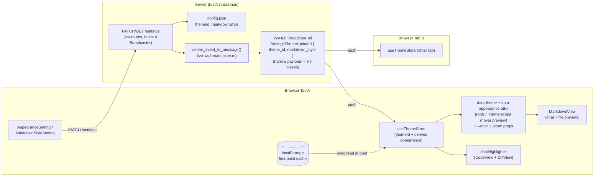

<!--
RULES — read before writing or implementing:
1. FORMAT: Bullets, tables, code, diagrams ONLY — no prose paragraphs
2. REQUIREMENTS: One crisp line each — no verbose descriptions
3. CHECKLIST: Mark items [x] as you complete them — this is your persistent todo list
4. READING TIME: Optimize for fast human scanning — if it's hard to skim, rewrite it
-->

# Plan: Themes + Markdown personalization

> Multi-theme UI (12+ IDE-inspired palettes, current dark theme renamed "Vibestation Dark"), themes drive file-preview syntax highlighting, and a fully customizable Markdown style — all stored server-side so every session/tab gets it for free.

**Issue:** themes-ides-markdown
**Branch:** `themes-ides-markdown` (already checked out)
**Status:** Pending
**PRD:** none — small/self-contained feature, plan only per `/sdlc plan`

**Reference files:**
- Data / schema: `rust/vst-types/src/rest/settings.rs`, `web-ui/src/theme/registry.ts` (new)
- Core logic: `web-ui/src/hooks/useTheme.ts`, `web-ui/src/components/preview/shikiHighlighter.ts`
- UI / entrypoint: `web-ui/src/components/settings/AppearanceSetting.tsx`, `web-ui/src/components/settings/SettingsPanel.tsx`
- Wiring: `rust/vst-routes/src/settings.rs`, `rust/vst-types/src/events.rs`, `rust/vst-types/src/ws.rs`, `rust/vst-ws/src/broadcaster.rs`, `web-ui/src/api/client.ts`, `web-ui/src/api/types.ts`

---

## Problem & Concept

- Only 2 themes exist today (`dark`/`light`), hardcoded as two CSS blocks in `tokens.css`; "dark" is monochrome and has no name distinct from "the app's theme"
- Theme/font prefs live only in `localStorage` (`web-ui/src/hooks/useTheme.ts:6-7`) — per-browser, not per-user; other sessions/tabs/devices don't see a change
- File-preview syntax highlighting (Shiki) is hardcoded to `dark-plus`/`light-plus` and doesn't track a real theme choice; Markdown has zero user-configurable styling (headers/bold/italic/code are fixed CSS in `workspace.css`)
- Success: user picks from 12+ real, recognizable IDE palettes in Settings → Appearance; the pick is stored server-side and instantly applies (theme colors, syntax highlighting, and Markdown look) to every open session/tab; user can further fine-tune Markdown (header sizes/colors, bold/italic, inline-code/fence styling) on top of any theme

## Out of Scope

- Per-project or per-file-type theme overrides (one theme, applied globally per user)
- A theme *editor* / arbitrary custom-color picker for the base UI chrome (only the 12+ curated palettes + the 2 renamed originals ship; Markdown styling is the only free-form customization surface)
- Cloning/vendoring a full external IDE codebase — Shiki (already a dependency) bundles ~60 real, actively-maintained VS Code theme extensions as data (`@shikijs/themes`); we select from that set instead of pulling in a separate IDE repo
- Live WS push while a settings PATCH is mid-flight from a *different* device (out of scope: last-write-wins is fine, no CRDT/merge)
- Terminal (xterm.js) color scheme theming — separate pane, not part of this pass
- **Any change to the Node `daemon/`/`cli/` trees.** The server side of this repo is mid-migration to a Rust rewrite under `rust/` (`vst-daemon` and friends), running alongside the legacy Node trees during a parity-cutover (`.vibekit/feature-plans/pending/daemon-rust-port/10-parity-cutover/`). All server-side work in this plan targets `rust/` exclusively; the Node `daemon/`+`cli/` trees are frozen for this feature. Deleting them is a separate, human-gated action per `10-parity-cutover` and out of scope here regardless
- **Reconciling the black-box parity harness** (`10-parity-cutover` task 1-2: diffs Node vs. Rust responses on the same fixtures) for the new `themeId`/`markdownStyle` fields — since Node's `/settings` won't gain these fields, the harness will show a deliberate, permanent divergence for this one endpoint. Flagged as an open decision below, not silently resolved by this plan

## Requirements

| # | Requirement |
|---|-------------|
| 1 | Rename current dark theme id `dark` → `vibestation-dark` (display name "Vibestation Dark"); keep `light` as `vibestation-light`. Existing `localStorage` values migrate transparently, no flash-of-wrong-theme |
| 2 | Ship ≥12 additional themes sourced from Shiki's bundled TextMate palettes (real IDE themes: Dracula, Nord, One Dark Pro, Monokai, GitHub Dark/Light, Solarized Dark, Gruvbox Dark, Catppuccin Mocha, Tokyo Night, Night Owl, Ayu Dark) |
| 3 | Selecting a theme changes: UI chrome (bg/fg/border/accent tokens), Shiki file-preview highlighting, and Markdown code-fence highlighting — one selection, three consumers |
| 4 | Theme selection + Markdown style overrides persist server-side in `~/.vibe-station/config.json`, same pattern as `skillPaths`; every browser tab/session reads the same value via `GET /settings` |
| 5 | Changing the theme/markdown style in one tab updates all other open tabs live (WS broadcast), not just on next reload |
| 6 | Markdown customization covers: h1-h6 font size + color, bold weight/color, italic style/color, inline-code and fenced-code background/color/font, applied via CSS custom properties layered on top of the active theme |
| 7 | Markdown styling applies identically in chat bubbles and the file-preview `.md` pane (both already share `.workspace-markdown-preview`) |
| 8 | No regression to `docs/STATUS-INDICATORS.md` tokens (`--status-*`, `--pr-*`) — every new theme defines them too |
| 9 | Fix pre-existing bug (reported in Rich Chat: diff/code-block text color doesn't update on theme change without a page refresh): a theme change must propagate live to **every mounted `DiffView`/`CodeView`/`MermaidView`/`StreamingMarkdown` instance in the same tab**, not just the global CSS tokens — see Research/root cause below |
| 10 | Both settings screens show a **live preview** before/without committing: the theme picker previews chrome + code + Markdown under the hovered/selected theme; the Markdown style editor previews a rendered sample doc that updates as each control changes — see UI Mockups below |

---

## Execution Model

- Phases run **strictly sequentially, one at a time — never in parallel.** Phase `N+1` does not start until Phase `N` is fully complete. Dependency chain: Phase 2 has no dependency on Phase 1 beyond both existing (server schema and theme data are independent — but they still run in numeric order, not parallel); Phase 3 depends on Phase 1 (the `themeId`/`markdownStyle` wire fields it PATCHes/GETs) and Phase 2 (the registry — `themeId` values, `shikiThemeId` mapping, CSS blocks); Phase 4 depends on Phase 3 (the `themeId` field added to `useTheme()`'s return value); Phase 5 depends on Phase 1 (the `reset_markdown_style` wire field), Phase 2 (the per-theme `--md-*` CSS defaults, and the `workspace.css` appearance-attribute rewrite — see Phase 2.6), and Phase 3 (`SettingsPreviewFixture.tsx`).
- Implementation runs as `vst` subagents — one per phase — spawned as **sibling sessions in this same worktree** (`vst session create $VST_WORKTREE --type=agent --mode=deepseek --prompt=...`, not a separate git worktree per phase), each running `deepseek`-mode (opencode CLI).
- **Per-phase lifecycle:** spawn the phase's subagent → it works that phase's checklist only → it marks its `[ ]` items `[x]` as it completes them and reports done → the phase is **gate-verified** (checklist honestly reflects the diff, that phase's `*.T*` tests actually pass, no scope leakage into a later phase's files) → only then does that subagent terminate and the next phase's subagent get spawned. A phase is never marked complete on the subagent's self-report alone.
- A subagent for phase `N` only ever touches the files listed for phase `N` in Files & Phase Impact — it does not get a preview of phase `N+1`'s design beyond what's already written in this plan, and is not expected to solve ordering problems the plan itself should have already resolved (Self-Containment Bar).
- If a phase's gate check fails, that phase is fixed in place (same subagent resumed, or a fresh one re-briefed from the checklist's `[ ]`/`[x]` state) before advancing — the next phase's subagent is never spawned against an unverified prior phase.
- **Each phase's spawn prompt is scoped, not the whole plan.** Alongside that phase's own checklist items and Files & Phase Impact rows, the prompt also includes the specific Design Details subsections that phase's items reference by name, so a narrow-context subagent is genuinely self-contained: Phase 1 → System Boundaries, Data Model, API Contracts; Phase 2 → Theme Roster (including the chrome-token and Markdown-default derivation tables); Phase 3 → UI Mockups "Appearance tab", the stale-color-bug Research bullets; Phase 4 → nothing beyond its own checklist (no further Design Details references); Phase 5 → UI Mockups "Markdown tab", the Markdown Style property table.
- **The app is visibly incomplete between Phase 2 and Phase 4/5** — the `workspace.css` blocks rewritten to key on `data-appearance` in Phase 2.6 only take effect once Phase 3 actually starts writing that attribute, and `--md-*` custom properties defined in Phase 2 have no consumer until Phase 5. This is expected under phase-scoped, test-gated verification — a visual/manual gate would fail these intermediate phases spuriously; don't add one.
- **Phase 6 breaks the mode: turn / deepseek pattern.** Phases 1-5 are narrow-context `deepseek`-mode subagents, spawned/gate-verified/terminated one phase at a time per the lifecycle above. Phase 6 is a single **Sonnet-mode** subagent doing live, exploratory browser verification — no spawn-verify-terminate cycle, no phase-scoped file restriction — and it runs last, only after Phase 5 is gate-verified and committed.

---

## Change Map

```
rust/vst-types/src/rest/
  settings.rs                ~ Settings gains theme_id, markdown_style; PatchSettingsBody additionally gains reset_markdown_style (request-only, never in Settings/GET response)
rust/vst-routes/src/
  settings.rs                 ~ SettingsRoutes gains a broadcaster field; validate + persist new fields
rust/vst-types/src/
  events.rs                    ~ new ServerEvent::SettingsThemeUpdated variant (narrow payload — never the full Settings struct)
  ws.rs                         ~ matching wire ServerMessage variant ("settings:updated")
rust/vst-ws/src/
  broadcaster.rs                ~ new match arm in server_event_to_message()
rust/vst-daemon/src/
  server.rs                      ~ SettingsRoutes::new(paths, broadcaster) call site
rust/vst-routes/tests/
  utility_routes.rs               ~ SettingsRoutes::new call site + PatchSettingsBody struct literals
web-ui/
  index.html                 ~ data-theme="dark" → "vibestation-dark"
web-ui/src/theme/
  registry.ts                + curated theme list: id, name, appearance, shikiThemeId, CSS vars
  themes.generated.css        + generated [data-theme="..."] root blocks AND .theme-scope[data-theme="..."] scoped blocks
web-ui/src/hooks/
  useThemeStore.ts             + new zustand store: single shared { themeId, appearance (derived), font } — fixes stale-color bug (req 9)
  useTheme.ts                 ~ becomes a thin wrapper over useThemeStore; daemon-synced + WS live-sync; localStorage kept as a first-paint cache
  useMarkdownStyle.ts         + new hook: daemon-synced markdown override CSS vars; ignores WS echo while a local draft is dirty
web-ui/src/components/settings/
  AppearanceSetting.tsx       ~ dark/light toggle → theme picker grid (12+ swatches) + scoped live preview panel
  MarkdownStyleSetting.tsx    + new settings section: header/bold/italic/code controls + live preview panel
  SettingsPreviewFixture.tsx  + shared fixture (chat msg + 3-line diff + markdown line) reused by both previews
  SettingsPanel.tsx           ~ register MarkdownStyleSetting section
web-ui/src/components/preview/
  shikiHighlighter.ts          ~ hardcoded 2-theme eager bundle → lazy-load the active theme only, loadTheme() on change
  CodeView.tsx                 ~ dark/light → themeId passthrough to Shiki
  DiffView.tsx                  ~ dark/light → themeId passthrough to Shiki (same as CodeView)
  codeHighlight.ts              ~ hljs theme class swap driven by active theme's "light"/"dark" appearance
web-ui/src/styles/
  workspace.css                ~ Phase 2: the 3 blocks keyed on [data-theme="dark"|"light"] (git-status, hljs light-mode, markdown h5/h6) rewritten to key on [data-appearance="dark"|"light"] instead — a rename-consequence fix, independent of Markdown styling. Phase 5: header/bold/italic/code rules read new --md-* custom properties (separate section of the same file, no overlap)
  tokens.css                    ~ dark/light blocks renamed vibestation-dark/-light, each gains the full --md-* default set (var()-referencing its own chrome tokens); other 12+ come from themes.generated.css. The data-appearance ATTRIBUTE itself is set by JS (useTheme.ts, Phase 3), never by CSS — these blocks only define selectors that key on it
web-ui/src/api/
  types.ts                      ~ Settings gains themeId?, markdownStyle?; ServerEvent union gains settings:updated
  client.ts                     ~ no change (getSettings/updateSettings already generic)
  mock.ts                        ~ emit settings:updated from updateSettings mock
scripts/
  generate-theme-css.ts        + reads @shikijs/themes, emits themes.generated.css + registry.ts data
```

`+` new file · `~` modified · unmarked = context only.

| Today | After this plan |
|-------|-----------------|
| 2 themes (`dark`/`light`), localStorage-only, per-browser | 14+ themes, server-persisted, synced live across all sessions |
| "dark" has no display identity | "Vibestation Dark" — explicit, monochrome, first-party theme |
| Shiki fixed to `dark-plus`/`light-plus` | Shiki theme tracks the active app theme 1:1 |
| Markdown look is fixed CSS | Markdown header/bold/italic/code fully user-customizable, server-persisted |
| Settings changes need a reload/re-fetch to reach other tabs | WS broadcast pushes `settings:updated` to every open connection |
| **Bug:** 6 independent `useTheme()` call sites each keep a stale local copy — diff/code-preview text color only updates after a full page refresh | Single shared `useThemeStore`; every mounted `DiffView`/`CodeView`/etc. re-renders with the new theme immediately, same tab, no refresh |
| `data-theme="dark"|"light"` conflates the theme id with the appearance | Separate `data-appearance="dark"|"light"` attribute, written by `useTheme.ts` (Phase 3) alongside `data-theme`; `workspace.css`'s hljs/git-status/markdown-h5-h6 rules key on appearance, `tokens.css`'s chrome-token blocks key on the full theme id |

---

## Research

- `web-ui/src/styles/tokens.css:61-72` is the bare `:root` fallback block, not part of the dark theme itself — `[data-theme="dark"]` starts at **line 73** and runs to ~127, pure monochrome grayscale (`--bg-primary:#0f0f0f` … `--fg-primary:#e5e5e5`), confirming this is the "Vibestation Dark" candidate as-is. The Phase 2.4 rename touches only lines 73-127; the `:root` fallback stays untouched as a pre-attribute safety net
- `web-ui/src/styles/tokens.css:129-177` — light theme mirrors the same token set; both blocks are the template new theme blocks must match field-for-field (including `--status-*`/`--pr-*`, `docs/STATUS-INDICATORS.md:104-109`)
- `web-ui/src/hooks/useTheme.ts:1-51` — theme is a pure `useState` + `localStorage`, no daemon round-trip, no context provider; `document.documentElement.dataset.theme` is the only application mechanism (CSS-only, cheap to keep)
- `web-ui/src/components/settings/AppearanceSetting.tsx:94-153` — existing "Brightness" dark/light `SegmentedControl` row is the direct insertion point for a theme picker; reuses `Row`/`SegmentedControl` helpers
- `web-ui/src/components/preview/shikiHighlighter.ts:9-29` — Shiki highlighter is created once with a **hardcoded** 2-theme, fixed-lang bundle; extending to the full curated set is straightforward since Shiki ships them all already, but should load lazily (see below) rather than eagerly bundling all 14
- `@shikijs/themes` package (already a transitive dep via `shiki`) bundles ~60 real, actively-maintained theme JSONs converted from popular VS Code extensions — confirmed list includes dracula, nord, monokai, one-dark-pro, github-dark/light(+variants), solarized-dark/light, gruvbox-*, catppuccin-*, tokyo-night, night-owl, rose-pine-*, ayu-*, kanagawa-*, material-theme-*, vitesse-*. **No external IDE repo needs to be cloned into `~/code/fastestdevalive/` — the palette data already ships in `node_modules`.** Each theme's `colors` map is a full VS Code color-contribution set (60+ keys: `editor.background`, `sideBar.background`, `terminal.ansi*`, `errorForeground`, etc.), confirmed by direct inspection of the installed package.
- `web-ui/src/components/preview/CodeView.tsx:18-20` and `web-ui/src/components/preview/DiffView.tsx:68-70` both map `theme` (`"dark"|"light"`) → Shiki theme id the same way; both need to become a direct `themeId` → Shiki-id lookup via the new registry (`DiffView` carries the identical hardcode to `CodeView` and is the component from the originally-reported bug — both are in scope for Phase 4, not just `CodeView`)
- `web-ui/src/components/preview/codeHighlight.ts:1-101` — hljs (used only inside Markdown fences via `rehype-highlight`) has **no JS theme switching today**, CSS-only. It has **three** separate blocks keyed on the literal `[data-theme="dark"]`/`[data-theme="light"]` in `workspace.css`, not one: the light-mode hljs syntax palette (`workspace.css:2609-2655`), git tree-row status colors (`:1908-1917`), and markdown-preview h5/h6 + body/li/table-td overrides (`:3050-3060`). Renaming `dark`→`vibestation-dark`/`light`→`vibestation-light` would silently orphan all ~35 of these selectors, and they'd never match any of the 12 new themes either way. **Resolution, in two parts, owned by two different phases:** (1) Phase 2.6 rewrites all three `workspace.css` blocks to key on `[data-appearance="dark"|"light"]` instead of `[data-theme=...]` — a pure selector rewrite, no runtime behavior yet; (2) Phase 3.3 is what actually **writes** the `data-appearance` attribute onto `document.documentElement` (alongside `data-theme`, derived from the active theme's `appearance` field in the registry — one value per theme, never per-theme-id) — a CSS block can define a selector but cannot set an HTML attribute itself, so these two halves are necessarily different phases' work, and the app's appearance-scoped rules stay inert (matching nothing) between Phase 2 and Phase 3 by design. hljs itself stays per-appearance (dark/light family) rather than per-theme in Phase 4, since it only colors Markdown fences and needs no further code change once the selector exists — Shiki already owns full-file preview fidelity.
- **Markdown per-theme defaults need a deterministic source too, or Phase 5's `--md-*` variables have no default value to fall back to.** Rather than a second manual per-theme design pass (duplicating Phase 2.2's chrome-token work), color-valued `--md-*` properties are defined per-theme as `var()` references to that same theme block's own already-derived chrome tokens — e.g. `--md-h1-color: var(--fg-primary)`, `--md-code-block-bg: var(--bg-secondary)`, `--md-blockquote-border: var(--border-strong)`, `--md-bold-color: var(--fg-primary)`, `--md-italic-color: var(--fg-secondary)`, `--md-link-color: var(--accent)`. Non-color properties (`--md-h1-size` … `--md-h6-size`, `--md-*-weight`, `--md-italic-style`, `--md-code-font-family`) are **theme-invariant** — one shared default written once, not per-theme, matching today's `workspace.css` values (`2.14em`/`1.71em`/`1.43em`/`1.14em`/`1em`/`0.86em` for h1-h6, `600` for bold weight, `italic`, `var(--font-mono)`). This is Phase 2's responsibility (2.2/2.3/2.4), not Phase 5's — Phase 5 only wires the CSS rules to *read* these variables and adds the override layer on top.
- `web-ui/index.html:2` hardcodes `data-theme="dark"` as the initial attribute before any JS runs. After the rename this value matches no `[data-theme]` block at all, so first paint would fall back to the bare `:root` block (missing `--accent`, `--bg-elevated`, every `--status-*`/`--pr-*` token) — a real, visible flash on every load. **Resolution: `index.html`'s literal becomes `data-theme="vibestation-dark"`, and the resolved `themeId` is written to `localStorage` on every successful change and read synchronously at `useThemeStore` init as a first-paint hint** — the server `GET` still resolves and corrects it shortly after, the same cache-then-reconcile shape used elsewhere in the app.
- `web-ui/src/components/preview/MarkdownView.tsx` — no `h1..h6`/`strong`/`em` component overrides; all Markdown look is pure CSS in `workspace.css:2734-3060` — a CSS-custom-property layer is additive, no React changes needed to `MarkdownView.tsx` itself
- `web-ui/src/styles/chat.css:462-470` + `workspace.css:2734` — `.workspace-markdown-preview` is shared by chat bubbles AND the file-preview `.md` pane — one styling layer automatically satisfies requirement 7
- **Server is mid-migration to Rust** (`rust/` workspace: `vst-daemon`, `vst-routes`, `vst-types`, `vst-ws`, …), running alongside the legacy Node `daemon/` during a parity-cutover (`.vibekit/feature-plans/pending/daemon-rust-port/10-parity-cutover/plan-10-daemon-rust-port-parity-cutover.md:20-26`) — Node `daemon/`+`cli/` deletion is explicitly deferred, human-gated. This plan's server-side work targets `rust/` exclusively
- `rust/vst-routes/src/settings.rs:1-8` — doc comment confirms it's already a direct, byte-compatible port of `daemon/src/routes/settings.ts` + `services/config.ts`; `SettingsRoutes::get_settings`/`patch_settings` (lines 82-190) read/write the same `~/.vibe-station/config.json` via `serde_json::Value` merge-on-write (mirrors the Node `readConfig`/`writeSettings` merge pattern) — same template applies, just in Rust
- `rust/vst-types/src/rest/settings.rs:11-30` — `Settings` / `PatchSettingsBody` structs (serde, `rename_all = "camelCase"` on the wire, `Option<T>` fields) are where `theme_id: Option<String>` and `markdown_style: Option<MarkdownStyle>` get added; wire shape (`themeId`, `markdownStyle`) is unchanged from what the Node port would have produced
- `rust/vst-routes/src/settings.rs:16-33` — validation errors are a `thiserror`-derived `SettingsRouteError` enum with an `error_code()` method (`"validation_error"`/`"internal_error"`), not a zod schema — new bad-shape cases follow this same enum-variant-per-error-case pattern
- `web-ui/src/components/settings/SkillsSetting.tsx` — full round-trip template (`api.getSettings()` → local state → `api.updateSettings({...})`) to copy for the new theme picker and Markdown style panel, since `AppearanceSetting.tsx` today is client-local only (`useStore.ts:216,622,979,1582` — `showAgentStatusBorders` is the same client-local pattern, NOT the template to copy)
- No WS broadcast exists for `/settings` today in **either** server (confirmed: REST-only in both Node and Rust). Rust has the mechanism to reuse: `rust/vst-types/src/events.rs:19-21` `ServerEvent` enum (internal) + `rust/vst-types/src/ws.rs:195-203` matching wire `ServerMessage` variant, fanned out via `Broadcaster::send(...)`. `rust/vst-routes/src/modes.rs:396-400,483-485,504` shows the exact call-site pattern (`ModeCreated`/`ModeDeleted` broadcast right after a successful write) — but three things about this mechanism needed correcting before this plan was implementation-ready:
  - **The `ServerEvent → ServerMessage` conversion is a free function, not a `From` impl.** `rust/vst-ws/src/broadcaster.rs:116-119`'s own doc comment: *"Not a `From` impl because both `ServerEvent` and `ServerMessage` are foreign types (orphan rule) — a free function avoids the impl conflict."* The mechanism is `pub fn server_event_to_message(e: ServerEvent) -> ServerMessage` (`broadcaster.rs:120-203`), an exhaustive `match` — a new `ServerEvent` variant needs a matching arm here or it's a compile error.
  - **`SettingsRoutes` has no `broadcaster` field to call `.send()` on.** Confirmed: `struct SettingsRoutes { paths: Paths }` (`settings.rs:58-61`), constructed as `SettingsRoutes::new(opts.paths.clone())` at `rust/vst-daemon/src/server.rs:264` and `SettingsRoutes::new(paths.clone())` at `rust/vst-routes/tests/utility_routes.rs:153` — neither call site passes a broadcaster today. `ModeRoutes::new(store: StoreHandle, broadcaster: Broadcaster)` (`modes.rs:155`) is the correct template: add a `broadcaster: Broadcaster` field to `SettingsRoutes`, change `new()`'s signature, update both call sites.
  - **Broadcasting the full `Settings` struct would leak secrets.** `rust/vst-types/src/rest/settings.rs:11-21`'s `Settings` carries `cli_token`, `tauri_token`, `pid`, `port`. `WsHub::broadcast_all` (`vst-ws/src/broadcaster.rs:56`) and `spawn_event_fanout` (`:225-239`) send to **every** registered connection unconditionally, including remote token-scoped sessions with no business seeing another connection's tokens. The event carries only `{ theme_id: Option<String>, markdown_style: Option<MarkdownStyle> }`, never the full `Settings` struct — named `ServerEvent::SettingsThemeUpdated` so the narrow scope is explicit in the type itself, not just a comment.
- The theme-picker hover-preview (requirement 10) cannot work against root-only `[data-theme="..."]` CSS blocks — hovering a swatch must not flip the entire page's `data-theme` attribute (that would reflow/recolor everything outside the Settings panel, fighting the actually-committed theme). The Phase 2.3 generator additionally emits a **scoped** variant of every theme block under a `.theme-scope[data-theme="..."]` selector (same custom-property declarations, different selector prefix), so the preview panel wraps itself in `<div className="theme-scope" data-theme={hoveredId}>` and gets that theme's tokens only inside that subtree, without touching `document.documentElement`.
- **Stale Shiki color on theme change without refresh (requirement 9):** `web-ui/src/hooks/useTheme.ts:27-51` is a per-call-site local `useState`, not a shared store — every component that calls `useTheme()` mounts its own independent copy of `theme`, seeded once from `localStorage` at mount (`readInitialTheme()`, line 17-20) and never told about a change made by a different mounted instance (no `storage`-event listener, and same-tab `localStorage.setItem` doesn't fire `storage` events in the writing tab anyway)
  - Confirmed 6 independent call sites, each with its own stale copy today: `DiffView.tsx:68`, `CodeView.tsx:18`, `FilePreviewPane.tsx:59`, `StreamingMarkdown.tsx:48`, `LeftSidebar.tsx:215`, `AppearanceSetting.tsx:95`
  - When the user toggles theme in `AppearanceSetting.tsx`, only that instance's `useEffect` runs `document.documentElement.dataset.theme = theme` (`useTheme.ts:32`) — a single global DOM attribute, so CSS-custom-property-driven colors update everywhere instantly, creating the illusion that theming "works live." But `DiffView.tsx:68-70` / `CodeView.tsx:18-20` derive `themeId` from their own stale `theme` variable, feed it to Shiki, and Shiki bakes the resulting colors as **inline `style="color:#xxx"`** on each token span (not CSS variables) — so diff/code text keeps rendering with yesterday's theme's hex colors until that component unmounts/remounts (a full page reload re-reads `localStorage` fresh in every instance simultaneously, which is why a refresh "fixes" it). This bug is orthogonal to theme *count* — it already exists today with just 2 themes — so it's fixed as part of Phase 3, not deferred.
  - **`useTheme().theme`'s return type cannot literally stay `"dark"|"light"` once `themeId` has 14 possible values, but 3 of the 6 call sites are typed/written assuming exactly those two strings.** `CodeView.tsx:19-20` and `DiffView.tsx:68-70` both do `mode === "light" ? "light-plus" : "dark-plus"` (an `else`-branch that only happens to be safe for a binary Shiki choice); `FilePreviewPane.tsx:59-60` assigns `theme` into a `themeMode` prop that flows to `MermaidView`, whose prop is explicitly typed `theme: "dark" | "light"` (`MermaidView.tsx:7`) — passing e.g. `"dracula"` there is a type error, not just visually wrong. **`useThemeStore` holds `themeId: string` (the 14-way value) AND a derived `appearance: "dark"|"light"` (looked up from the registry); `useTheme()`'s public `theme` field keeps returning `appearance`, so all 6 existing call sites are genuinely unchanged; a new `themeId` field is added to `useTheme()`'s return value for the 2 call sites (`CodeView.tsx`, `DiffView.tsx`) that need Phase 4's Shiki-id lookup.**
  - **Fix:** replace `useTheme.ts`'s local `useState` with a single shared store all 6+ call sites subscribe to — the repo already has the exact pattern in `web-ui/src/hooks/useStore.ts` (zustand `create()`, `showAgentStatusBorders` at lines 216/622/979/1582). This plan uses a small **dedicated** `useThemeStore.ts`, not folded into `useStore.ts`: folding in would require bumping `useStore.ts`'s persist-middleware `version` (currently 18, `useStore.ts:1286`) and adding a `partialize` entry (`:1558`) for a value that's about to become server-sourced anyway, and `useThemeStore` needs `localStorage` as a plain first-paint cache rather than zustand's versioned `persist` middleware, which a dedicated store expresses more cleanly. Any zustand store is inherently a shared subscription, so every mounted consumer re-renders together the instant `set()` is called — the same mechanism then carries the server/WS-driven update to all consumers for free.
- Markdown heading sizes must stay relative, not fixed px/rem. `workspace.css:2742` onward uses `font-size: 2.14em` deliberately — `FilePreviewPane.tsx:304` sets the preview container's `fontSize: calc(var(--font-size-base) * previewFontScale)`, so headings scale with the existing "Aa −/+" preview-zoom control. The Markdown Style property table specifies `--md-h1-size` etc. as `em` multiples, not px/rem, so a custom H1 size doesn't silently break zoom.
- Eager `createHighlighter({ themes: [...14] })` would bundle every theme's JSON into the dynamic import chunk on first use, for a value where only 1 of 14 is ever active per browser tab. Shiki's `Highlighter` supports `loadTheme(idOrTheme)` after creation — Phase 4.1 creates the highlighter with only the active theme (re-`loadTheme`ing on a theme change, caching loaded ids so re-switching back doesn't refetch) instead of eagerly loading all 14 up front.
- Server-side validation of `theme_id` against a registry id list would create a circular phase dependency (Phase 1 would need Phase 2's registry to exist first) and is the wrong layer for it anyway — `theme_id` is purely a client-rendering lookup key; the server has no opinion on what themes exist. If a theme were ever deprecated, a user still referencing that id would be permanently unable to PATCH *any* other setting until they fixed an unrelated field first — worse than the client-side "unknown id → falls back to `vibestation-dark`" behavior already specified in System Boundaries. **The server stores `theme_id` as an opaque non-empty string (same shape-only validation as `defaultProjectsDir`), no registry-list check, ever** — this also removes the Phase-1-depends-on-Phase-2 ordering problem entirely.
- The two Vibestation themes' Shiki id is pinned to `shikiThemeId: "dark-plus"` / `"light-plus"` (Theme Roster rows 1-2) — no custom Shiki theme is built for them; that would be speculative extra work with no requirement asking for it. Phase 4.1's highlighter theme list is the **distinct set of `shikiThemeId` values** across the registry (13 distinct ids: `dark-plus`, `light-plus`, plus the 12 borrowed themes whose id equals their own name), not the raw 14-entry registry id list.
- A `settings:updated` WS event (including the client's own echo of its just-sent PATCH) must not clobber unsaved edits in the Markdown style editor. With the debounced-commit pattern (Phase 5.5), a user mid-edit who hasn't blurred yet has local-only state; an event arriving in that window (their own echo, or a genuinely different change from another tab) applied naively would silently discard the in-progress edit. `useMarkdownStyle.ts` tracks a `dirty` flag (true from first edit until the next successful commit) and ignores incoming `settings:updated` payloads for `markdownStyle` while `dirty` is true — the committed value re-syncs once the pending edit's own PATCH resolves. This doesn't apply to the theme picker, which has no "draft" state (click commits immediately).
- The one-time localStorage→server theme migration (Phase 3.3) is guarded against a race rather than firing unconditionally: every tab open at upgrade time would otherwise PATCH its own locally-cached `"dark"|"light"` value on first boot, and if the user's already set a `themeId` on the server from a different device/session by then, a second tab's stale local migration would overwrite it. Migration only runs when `GET /settings`'s response has `themeId` absent/null — once any client has migrated successfully, every other client's `GET /settings` already returns a value and skips the migration branch entirely.
- "Reset to theme" cannot be `PATCH {markdownStyle: null}` — `Option<MarkdownStyle>` deserializes a JSON `null` and a wholly-absent field to the same `None`, so the merge-on-write in `settings.rs:149-167` (which only touches a field when the corresponding `Option` is `Some`) would treat "explicitly reset" identically to "field not sent" and silently no-op. A dedicated `resetMarkdownStyle: true` request field is used instead of overloading `markdownStyle`'s absence/null.
- All Theme Roster hex values below were pulled via a script that imported the real, installed `@shikijs/themes@3.23.0` package's theme modules directly and printed their actual color values — not typed from memory. The bg/fg columns (the two values every downstream derivation step actually depends on) are reliable; the accent/border "sample" columns are illustrative only — `scripts/generate-theme-css.ts` (Phase 2.2) always re-reads the live package at build time via the deterministic key-lookup table, never hardcoding a value from the markdown table itself.
- **Root cause (overall feature):** theme is currently a device-local, non-shared UI toggle with no server presence and only 2 hardcoded values; extending it to 14 values is mechanical once theme becomes server-stored data behind a single shared store instead of N independent `useState` copies

---

## Architecture Diagram



---

## Design Details

### UI Mockups (requirement 10)

#### Appearance tab — theme picker with live preview

```
┌─ Settings ──────────────────────────────────────────────────────────────────┐
│  General   [Appearance]   Markdown   Skills   Projects                      │
├───────────────────────────────────────────────────────────────────────────┤
│  Appearance                                                                  │
│  Customize how vibe-station looks on your device.                           │
│                                                                               │
│  Theme                                                                       │
│  ┌─ Dark ──────────────────────────────────────────────────────────────┐    │
│  │ ┌────────┐ ┌────────┐ ┌────────┐ ┌────────┐ ┌────────┐ ┌────────┐  │    │
│  │ │▓▓▓▓▓▓▓▓│ │▓▓▓▓▓▓▓▓│ │▓▓▓▓▓▓▓▓│ │▓▓▓▓▓▓▓▓│ │▓▓▓▓▓▓▓▓│ │▓▓▓▓▓▓▓▓│  │    │
│  │ │▓ Aa 1▓ │ │▓ Aa 1▓ │ │▓ Aa 1▓ │ │▓ Aa 1▓ │ │▓ Aa 1▓ │ │▓ Aa 1▓ │  │    │
│  │ │▓▓▓▓▓▓▓▓│ │▓▓▓▓▓▓▓▓│ │▓▓▓▓▓▓▓▓│ │▓▓▓▓▓▓▓▓│ │▓▓▓▓▓▓▓▓│ │▓▓▓▓▓▓▓▓│  │    │
│  │ │Vibe Dk✓│ │Dracula │ │ Nord   │ │OneDark │ │Monokai │ │GH Dark │  │    │
│  │ └────────┘ └────────┘ └────────┘ └────────┘ └────────┘ └────────┘  │    │
│  │ (+ 5 more — Solarized, Gruvbox, Catppuccin, Tokyo Night, Night Owl,  │    │
│  │   Ayu Dark — wraps to a 2nd row on narrow widths)                    │    │
│  └───────────────────────────────────────────────────────────────────────┘  │
│  ┌─ Light ─────────────────────────────────────────────────────────────┐    │
│  │ ┌────────┐ ┌────────┐                                               │    │
│  │ │░░░░░░░░│ │░░░░░░░░│                                               │    │
│  │ │░ Aa 1░ │ │░ Aa 1░ │                                               │    │
│  │ │░░░░░░░░│ │░░░░░░░░│                                               │    │
│  │ │Vibe Lt │ │GH Light│                                               │    │
│  │ └────────┘ └────────┘                                               │    │
│  └───────────────────────────────────────────────────────────────────────┘  │
│                                                                               │
│  Live preview — "Dracula" (updates on hover; commits on click)              │
│  ┌───────────────────────────────────────────────────────────────────┐    │
│  │  Agent: Fixed the null check in auth.ts — here's the diff:         │    │
│  │  ┌─ auth.ts ──────────────────────────────────────────────────┐   │    │
│  │  │  12   function login(user) {                                │   │    │
│  │  │  13 - if (user.token) {                                     │   │    │
│  │  │  13 + if (user?.token) {                                    │   │    │
│  │  │  14     return session.create(user);                        │   │    │
│  │  └────────────────────────────────────────────────────────────┘   │    │
│  │  # Heading   **bold**   _italic_   `inline code`                   │    │
│  └───────────────────────────────────────────────────────────────────┘    │
│                                                                               │
│  Text style          [ Mono | Sans ]                                        │
│  Agent status borders  [ On | Off ]                                         │
└───────────────────────────────────────────────────────────────────────────┘
```

- Swatch = a miniature rendering of that theme's `--bg-primary`/`--bg-secondary`/`--fg-primary`/`--accent` (no live Shiki/markdown inside the tiny swatch — too small to read; that detail lives in the one big preview panel below)
- The **single live-preview panel** below the grid is the actual answer to "what will the preview contain": a fixed, realistic fixture — one short chat message, one small code diff (2-3 lines, syntax-highlighted), and one line exercising Markdown (`#`, `**bold**`, `_italic_`, `` `code` ``) — re-rendered against whichever theme is hovered/focused (falls back to the currently-committed theme when nothing is hovered, e.g. on touch devices with no hover)
- Clicking a swatch commits the theme (existing `PATCH /settings` flow); hovering only re-renders the preview panel locally, no network call
- Reuses `DiffView`/`MarkdownView`/`CodeView` verbatim against a small fixture string, **not** a new rendering path — cheapest way to guarantee the preview never drifts from real rendering
- The preview panel is wrapped in its own `<div className="theme-scope" data-theme={hoveredThemeId}>` — it does **not** flip `document.documentElement`'s `data-theme`. `themes.generated.css` (Phase 2.3) emits a `.theme-scope[data-theme="..."]` selector alongside every root `[data-theme="..."]` block (same properties, scoped prefix) specifically so this subtree can preview a theme without recoloring the rest of the page while the user is just hovering

#### Markdown tab — style editor with live preview

```
┌─ Settings ──────────────────────────────────────────────────────────────────┐
│  General   Appearance   [Markdown]   Skills   Projects                      │
├───────────────────────────────────────────────────────────────────────────┤
│  Markdown Style                                        [ Reset to theme ]   │
│  Fine-tune how Markdown renders in chat and file previews.                  │
│                                                                               │
│  ┌─ Controls ──────────────────┐  ┌─ Live preview ─────────────────────┐   │
│  │ Headings                    │  │ # Heading 1 sample                  │   │
│  │  H1  size [22px▾]  color[█] │  │ ## Heading 2 sample                 │   │
│  │  H2  size [18px▾]  color[█] │  │ ### Heading 3 sample                │   │
│  │  H3  size [16px▾]  color[█] │  │                                      │   │
│  │  ▸ H4-H6 (collapsed)        │  │ Body copy with **bold text**,       │   │
│  │                             │  │ _italic text_, and `inline code`.   │   │
│  │ Bold    weight[600▾] color[█]│ │                                      │   │
│  │ Italic  style[italic▾]color[█]│ │ > A sample blockquote line.         │   │
│  │                             │  │                                      │   │
│  │ Inline code   bg[█] color[█]│  │ ```ts                                │   │
│  │ Code block    bg[█] color[█]│  │ function greet(name: string) {      │   │
│  │   font [JetBrains Mono▾]    │  │   return `hi ${name}`;              │   │
│  │                             │  │ }                                    │   │
│  │ Blockquote  border[█]color[█]│ │ ```                                 │   │
│  │ Link         color [█]      │  │ [A sample link](#)                  │   │
│  └─────────────────────────────┘  └──────────────────────────────────────┘   │
└───────────────────────────────────────────────────────────────────────────┘
```

- Two-column layout (controls left, preview right) on desktop; stacks preview-below-controls on mobile/narrow width (consistent with `SettingsPanel.tsx`'s existing desktop-side-nav/mobile-list-detail split)
- Every control edit re-renders the preview panel **instantly, client-side only** (no `PATCH /settings` per keystroke) — commit fires on blur/change-end, not on every keystroke; the preview always reflects the in-progress (uncommitted) edit, not just the last-saved value
- Sizes shown to the user (`22px`) are display-only — the control writes `em` under the hood (see Markdown Style table) so a custom size doesn't break the existing preview-zoom control
- Preview content is a **fixed fixture covering every customizable element in requirement 6**: h1-h3 shown expanded (h4-h6 controls collapsed by default — h4-h6 use the same rendering code path as h1-h3, so this is a display-density choice, not a coverage gap), bold, italic, inline code, a fenced ```ts``` block (exercises Shiki/hljs interaction with the custom code colors), blockquote, and a link
- "Reset to theme" sends `PATCH /settings` with `resetMarkdownStyle: true`, clearing all overrides back to the active theme's defaults
- Reuses `MarkdownView` against the fixture markdown string — same reasoning as the theme-picker preview: never a second rendering implementation to drift out of sync

### Theme Roster (finalized — 14 total)

| # | Theme id | Display name | Appearance | bg | fg | accent (sample) | border (sample) |
|---|----------|--------------|:---:|---|---|---|---|
| 1 | `vibestation-dark` | Vibestation Dark | dark | `#0f0f0f` | `#e5e5e5` | `#e5e5e5` | `#262626` |
| 2 | `vibestation-light` | Vibestation Light | light | `#fafafa` | `#171717` | `#1a1a1a` | `#e5e5e5` |
| 3 | `dracula` | Dracula | dark | `#282A36` | `#F8F8F2` | `#44475A` | `#BD93F9` |
| 4 | `nord` | Nord | dark | `#2E3440` | `#D8DEE9` | `#88C0D0` | `#3B4252` |
| 5 | `one-dark-pro` | One Dark Pro | dark | `#282C34` | `#ABB2BF` | `#404754` | `#3E4452` |
| 6 | `monokai` | Monokai | dark | `#272822` | `#F8F8F2` | `#75715E` | `#414339` |
| 7 | `github-dark` | GitHub Dark | dark | `#24292E` | `#E1E4E8` | `#176F2C` | `#1B1F23` |
| 8 | `github-light` | GitHub Light | light | `#FFFFFF` | `#24292E` | `#159739` | `#E1E4E8` |
| 9 | `solarized-dark` | Solarized Dark | dark | `#002B36` | `#839496` | `#2AA198` | `#2B2B4A` |
| 10 | `gruvbox-dark-hard` | Gruvbox Dark | dark | `#1D2021` | `#EBDBB2` | `#458588` | `#3C3836` |
| 11 | `catppuccin-mocha` | Catppuccin Mocha | dark | `#1E1E2E` | `#CDD6F4` | `#CBA6F7` | `#585B70` |
| 12 | `tokyo-night` | Tokyo Night | dark | `#1A1B26` | `#A9B1D6` | `#3D59A1` | `#101014` |
| 13 | `night-owl` | Night Owl | dark | `#011627` | `#D6DEEB` | `#7E57C2` | `#5F7E97` |
| 14 | `ayu-dark` | Ayu Dark | dark | `#10141C` | `#BFBDB6` | `#E6B450` | `#1B1F29` |

- 12 net-new themes (rows 3-14) + the 2 renamed originals = 14 total, satisfying requirement 2 (≥12 new)
- Skew is intentionally dark-heavy (11 dark / 3 light) to match the app's existing dark-first design; `solarized-light` / `rose-pine` / `kanagawa-wave` / `gruvbox-light-*` remain available in the same package as easy future additions if light-theme variety is requested later
- `shikiThemeId` = the theme id itself for rows 3-14 (all 12 borrowed themes are literally in Shiki's bundle already); rows 1-2 pin `shikiThemeId: "dark-plus"` / `"light-plus"` — no custom Shiki theme is built for the Vibestation themes
- **Deterministic chrome-token derivation:** `scripts/generate-theme-css.ts` derives every remaining `tokens.css` custom property from each theme's Shiki `colors` map via this fixed key lookup, with a formula fallback when a theme's `colors` map omits a key:

  | Target token | Primary VS Code key | Fallback formula if key absent |
  |---|---|---|
  | `--bg-secondary` | `sideBar.background` | `bg` (editor.background) |
  | `--bg-card` | `editorWidget.background` | `bg` |
  | `--bg-elevated` | `editorWidget.background` | same as `--bg-card` |
  | `--bg-hover` | `list.hoverBackground` | mix(`bg`, `fg`, 6%) |
  | `--bg-active` | `list.activeSelectionBackground` | mix(`bg`, `fg`, 10%) |
  | `--bg-input` | `input.background` | `bg-secondary` |
  | `--fg-secondary` | `descriptionForeground` | mix(`fg`, `bg`, 25%) |
  | `--fg-muted` | `tab.inactiveForeground` | mix(`fg`, `bg`, 45%) |
  | `--fg-faint` | `editorLineNumber.foreground` | mix(`fg`, `bg`, 65%) |
  | `--border-default` | `panel.border` | mix(`bg`, `fg`, 12%) |
  | `--border-subtle` | `editorGroup.border` | mix(`bg`, `fg`, 6%) |
  | `--border-strong` | `focusBorder` | mix(`bg`, `fg`, 25%) |
  | `--destructive` | `errorForeground` | `terminal.ansiRed` |
  | `--status-working` | `terminal.ansiYellow` | `#eab308` (current dark-theme fallback) |
  | `--status-waiting` | `terminal.ansiRed` | `errorForeground` |
  | `--pr-open` | `terminal.ansiGreen` | `#22c55e` |
  | `--pr-merged` | `terminal.ansiMagenta` | `#8250df` |
  | `--pr-draft` | `terminal.ansiBrightBlack` | `descriptionForeground` |
  | `--pr-closed` | `terminal.ansiBlack` | `--fg-muted` |

  `mix(a, b, pct)` = linear RGB interpolation from `a` toward `b` by `pct`. This table plus the confirmed bg/fg values in the Theme Roster above are sufficient to generate all 12 theme blocks without further design input; a human visual pass remains valuable as follow-up polish but is not a blocker for Phase 2 completion.

### Markdown Style — customizable properties (requirement 6, finalized)

| Element | Property | CSS custom property | Type | Notes |
|---|---|---|---|---|
| H1 | font size | `--md-h1-size` | `em` multiplier (e.g. `2.14em`) | must stay relative or it breaks the existing preview-zoom control (`workspace.css:2742`, `FilePreviewPane.tsx:304`) |
| H1 | color | `--md-h1-color` | color | |
| H1 | weight | `--md-h1-weight` | 100-900 | |
| H2-H6 | size / color / weight | `--md-h2-size/color/weight` … `--md-h6-*` | same as H1 (`em`, not px/rem) | one row per level, same 3 sub-properties |
| Bold (`strong`) | weight | `--md-bold-weight` | 100-900 | default per-theme, e.g. 600 |
| Bold (`strong`) | color | `--md-bold-color` | color | default = `--fg-primary`, overridable |
| Italic (`em`) | style | `--md-italic-style` | `italic` \| `oblique` | |
| Italic (`em`) | color | `--md-italic-color` | color | |
| Inline code | background | `--md-inline-code-bg` | color | |
| Inline code | text color | `--md-inline-code-color` | color | |
| Inline code | font family | `--md-code-font-family` | font stack | shared with fenced code — one field (`MarkdownStyle.code_font_family`), not one per element |
| Fenced code block | background | `--md-code-block-bg` | color | |
| Fenced code block | text color (fallback when no Shiki/hljs token match) | `--md-code-block-color` | color | |
| Fenced code block | border | `--md-code-block-border` | color | |
| Fenced code block | font family | `--md-code-font-family` | font stack | same var and same Rust field as inline code |
| Blockquote | left-border color + text color | `--md-blockquote-border` / `--md-blockquote-color` | color | stretch — not in requirement 6's original list but same mechanism, cheap to include |
| Link | color | `--md-link-color` | color | stretch, same reasoning |

- 21 required properties across h1-h6 (×3 = 18) + bold (×2) + italic (×2) — matches requirement 6 exactly (headers, bold, italic, code)
- Blockquote/link rows are a low-cost stretch add using the identical mechanism (Phase 5.1); can be cut from `MarkdownStyleSetting.tsx`'s v1 UI without touching the CSS-variable plumbing if scope needs to shrink
- All defaults come from the active theme's CSS block (Phase 2); `markdownStyle` in server settings only stores **overrides** — an empty/absent `markdownStyle` means "pure theme defaults," keeping the common case's payload tiny

### System Boundaries

| Boundary | Fields + types | Errors | Source of truth |
|----------|----------------|--------|-----------------|
| Web-ui ↔ Rust server (`GET/PATCH /settings`, `rust/vst-routes/src/settings.rs`) | `theme_id: Option<String>, markdown_style: Option<MarkdownStyle>, reset_markdown_style: Option<bool>` (Rust) ↔ `themeId`/`markdownStyle`/`resetMarkdownStyle` (wire JSON, camelCase via serde) | `SettingsRouteError` variant → `validation_error` — `themeId` is stored as an opaque non-empty string, no registry-list check; bad `markdownStyle` CSS-value shape is still validated (new variant alongside `DefaultProjectsDirNotAbsolute`) | server `~/.vibe-station/config.json` |
| Rust server → all browser tabs (WS) | `ServerEvent::SettingsThemeUpdated { theme_id: Option<String>, markdown_style: Option<MarkdownStyle> }` (internal, narrow — never the full `Settings` struct) → wire `{type: "settings:updated", themeId, markdownStyle}` via `server_event_to_message()` (`vst-ws/src/broadcaster.rs:120-203`, a hand-written exhaustive `match`, not a `From` impl) | none (best-effort push; REST GET remains ground truth on reconnect) | server (push), client applies optimistically already from its own PATCH |
| `themeId` → theme data | registry lookup, not transmitted over the wire | unknown id → falls back to `vibestation-dark` | `web-ui/src/theme/registry.ts` (static, ships with the build) |
| Node `daemon/` (legacy, parallel) | unchanged — `themeId`/`markdownStyle` intentionally absent | n/a | frozen; see Out of Scope |

- **Key decision:** the 14+ palettes themselves are **not** server data — only the *selected id* and the *Markdown overrides* are. Palettes are code (generated at build time from `@shikijs/themes`), avoiding schema/version drift between server and web-ui and keeping `config.json` tiny.

### Data Model

| Entity | Field | Type | Constraints | Notes |
|--------|-------|------|-------------|-------|
| `Settings` / config.json (`rust/vst-types/src/rest/settings.rs:11-21`) | `theme_id` | `Option<String>` (wire: `themeId: string`) | non-empty string only — not validated against a registry id list (client concern; see Research), default `"vibestation-dark"` | mirrors `skill_paths` optionality pattern |
| `Settings` / config.json | `markdown_style` | `Option<MarkdownStyle>` (wire: `markdownStyle?`) | all fields optional; absent = theme defaults | merge-on-write like `skill_paths` (`settings.rs:158-167`) |
| `PatchSettingsBody` (request only, not persisted) | `reset_markdown_style` | `Option<bool>` (wire: `resetMarkdownStyle?`) | when `true`, clears `markdown_style` to `None` on write, processed before any `markdown_style` field in the same request is applied | request-only; never appears in `GET /settings`'s response |
| `MarkdownStyle` (new Rust struct) | `h1..h6` | `{ size: Option<String>, color: Option<String>, weight: Option<u16> }` | CSS length/color validated by regex in the route handler | maps to `--md-h1-size` etc. |
| `MarkdownStyle` | `bold` | `{ weight: Option<u16>, color: Option<String> }` | | maps to `--md-bold-weight/color` |
| `MarkdownStyle` | `italic` | `{ style: Option<String> ("italic"\|"oblique"), color: Option<String> }` | | maps to `--md-italic-style/color` |
| `MarkdownStyle` | `inline_code` | `{ bg: Option<String>, color: Option<String> }` | no `font_family` field — see `code_font_family` below | maps to `--md-inline-code-bg/color` |
| `MarkdownStyle` | `code_block` | `{ bg: Option<String>, color: Option<String>, border: Option<String> }` | no `font_family` field — see `code_font_family` below | maps to `--md-code-block-bg/color/border` |
| `MarkdownStyle` | `code_font_family` | `Option<String>` | single top-level field, not per-sub-struct — inline and fenced code share one `--md-code-font-family` CSS var, so one Rust field is the source of truth for both, avoiding an unresolvable "which one wins" ambiguity | maps to `--md-code-font-family` |
| `MarkdownStyle` | `blockquote` | `{ border: Option<String>, color: Option<String> }` | stretch property (Markdown Style table) | maps to `--md-blockquote-border/color` |
| `MarkdownStyle` | `link` | `{ color: Option<String> }` | stretch property | maps to `--md-link-color` |
| `ThemeRegistryEntry` (web-ui, static) | `id, name, appearance ("dark"\|"light"), shikiThemeId, cssVars` | — | not persisted; code only | 14+ entries |

- `MarkdownStyle` (and every struct nested inside it) derives `Clone, Debug, PartialEq, Serialize, Deserialize` — required because `MarkdownStyle` also appears inside `ServerEvent::SettingsThemeUpdated`/`ServerMessage::SettingsThemeUpdated` (Phase 1.4), which already derive those traits on the containing enums

- **Migration:** on first server boot after this ships, `themeId` absent → default `"vibestation-dark"`; web-ui's existing `localStorage["vibestation:theme"]` value (`"dark"|"light"`) is read once — only when `GET /settings` returns no `themeId` (prevents a second tab racing/overwriting a value another device already migrated) — mapped to `vibestation-dark`/`vibestation-light`, and PATCHed to the server; the `localStorage` key is then repurposed permanently as the first-paint cache, not deleted
- **Open decision (flag, don't silently resolve):** Node's `/settings` (`daemon/src/routes/settings.ts`) is frozen (Out of Scope) and will never learn `themeId`/`markdownStyle`. If the `10-parity-cutover` black-box harness diffs Node vs. Rust `/settings` responses byte-for-byte, this is a known, permanent divergence for this one endpoint from this plan onward — call this out explicitly in the PR/review rather than "fixing" it by adding the fields to Node too (Node is being deleted, not maintained)

### API Contracts

- `GET /settings` (`rust/vst-routes/src/settings.rs:82-128`) → `get_settings` adds `theme_id: Option<String>`, `markdown_style: Option<MarkdownStyle>` to the `Settings` struct it returns (defaulting `theme_id` via a new `default_theme_id()` fn alongside the existing `default_projects_dir()`/`default_skill_paths()` at lines 36-55). `reset_markdown_style` never appears here — it's request-only.
- `PATCH /settings` (`settings.rs:130-190`) → `PatchSettingsBody` gains `theme_id: Option<String>` (opaque, shape-only validated), `markdown_style: Option<MarkdownStyle>` (CSS-value shape validated), `reset_markdown_style: Option<bool>` (when `true`, clears `markdown_style` to `None`, applied before any `markdown_style` value in the same request); failures return a new `SettingsRouteError` variant (alongside `DefaultProjectsDirNotAbsolute`/`SkillPathsNotAbsolute`, lines 16-24) mapped to `error_code() == "validation_error"` same as today
- `SettingsRoutes` gains a `broadcaster: Broadcaster` field; `SettingsRoutes::new(paths: Paths, broadcaster: Broadcaster)` (signature change — 2 call sites to update: `vst-daemon/src/server.rs:264`, `vst-routes/tests/utility_routes.rs:153`), mirroring `ModeRoutes::new(store, broadcaster)` (`modes.rs:155`)
- New WS server→client event, narrow payload, not the full `Settings` struct: `ServerEvent::SettingsThemeUpdated { theme_id: Option<String>, markdown_style: Option<MarkdownStyle> }` (`vst-types/src/events.rs`) + matching `ServerMessage` wire variant `{ type: "settings:updated", themeId, markdownStyle }` (`vst-types/src/ws.rs`, `#[serde(rename = "settings:updated", rename_all = "camelCase")]`, alongside `ModeCreated`/`ModeDeleted` at lines 195-203) — requires a new arm in `server_event_to_message()` (`vst-ws/src/broadcaster.rs:120-203`) — broadcast via `self.broadcaster.send(...)` right after `patch_settings`'s successful `tokio::fs::write` (after line 189), following `vst-routes/src/modes.rs:396-400` / `:504`'s exact call pattern

---

## Files & Phase Impact

| File | Change | Phase |
|------|--------|-------|
| `rust/vst-types/src/rest/settings.rs` | `Settings` gains `theme_id`, `markdown_style`; `PatchSettingsBody` additionally gains `reset_markdown_style` (request-only); + new `MarkdownStyle` struct (incl. `blockquote`, `link`, top-level `code_font_family`) + defaults | 1 |
| `rust/vst-routes/src/settings.rs` | add `broadcaster` field + `new()` signature change; validation (new `SettingsRouteError` variants, shape-only for `theme_id`); persist new fields; handle `reset_markdown_style` | 1 |
| `rust/vst-types/src/events.rs` | new `ServerEvent::SettingsThemeUpdated { theme_id, markdown_style }` — narrow payload, not `Settings` | 1 |
| `rust/vst-types/src/ws.rs` | matching wire `ServerMessage::SettingsThemeUpdated` (`"settings:updated"`) | 1 |
| `rust/vst-ws/src/broadcaster.rs` | new match arm in `server_event_to_message()` | 1 |
| `rust/vst-daemon/src/server.rs` | update `SettingsRoutes::new(...)` call site (line 264) for the new `broadcaster` param | 1 |
| `rust/vst-routes/tests/utility_routes.rs` | update `SettingsRoutes::new(...)` call site (line 153) + any exhaustive `PatchSettingsBody` struct literals | 1 |
| `rust/vst-routes/src/modes.rs` | reference only — broadcast call-site pattern to copy, no edit | 1 |
| `scripts/generate-theme-css.ts` | build script: `@shikijs/themes` → `registry.ts` + `themes.generated.css` (root AND `.theme-scope` blocks) | 2 |
| `web-ui/src/theme/registry.ts` | curated 14+ theme metadata (generated); rows 1-2 pin `shikiThemeId: "dark-plus"/"light-plus"` | 2 |
| `web-ui/src/styles/themes.generated.css` | per-theme `[data-theme="..."]` root blocks + `.theme-scope[data-theme="..."]` scoped blocks (generated) | 2 |
| `web-ui/src/styles/tokens.css` | rename `dark`→`vibestation-dark`, `light`→`vibestation-light`; both blocks gain the full theme-invariant + `var()`-referenced `--md-*` default set | 2 |
| `web-ui/src/styles/workspace.css` | rewrite the 3 blocks keyed on `[data-theme="dark"|"light"]` (git tree-row status ~1908-1917, hljs light-mode syntax ~2609-2655, markdown h5/h6+body/li/table-td ~3050-3060) to key on `[data-appearance="dark"|"light"]` — selector rewrite only, the attribute itself is written by Phase 3 | 2 |
| `web-ui/index.html` | `data-theme="dark"` → `"vibestation-dark"`; add `data-appearance="dark"` alongside it | 2 |
| `web-ui/src/api/types.ts` | `Settings.themeId`, `Settings.markdownStyle`; `ServerEvent` union gains `settings:updated` | 3 |
| `web-ui/src/api/mock.ts` | emit `settings:updated` from `updateSettings` mock | 3 |
| `web-ui/src/hooks/useThemeStore.ts` | new shared zustand store: `{ themeId, appearance (derived), font }` — fixes stale-color bug (req 9) and the `"dark"|"light"`-typed consumers | 3 |
| `web-ui/src/hooks/useTheme.ts` | thin wrapper over `useThemeStore`; daemon-synced `themeId`, WS live update, guarded one-time localStorage migration, localStorage kept permanently as first-paint cache; writes both `data-theme` and `data-appearance` on `document.documentElement` | 3 |
| `web-ui/src/hooks/useTheme.test.ts` | existing test asserts `dataset.theme === "light"` with no API mock — rewrite for the async, server-synced behavior (mock `GET /settings`, assert both `dataset.theme` and `dataset.appearance`) | 3 |
| `web-ui/src/components/settings/AppearanceSetting.tsx` | theme picker grid (swatches, 14+) + scoped live preview panel | 3 |
| `web-ui/src/components/layout/LeftSidebar.tsx` | `toggleTheme()` (consumed at `:215`) redefined: switches directly between `vibestation-dark` and `vibestation-light` (the quick toggle no longer tries to preserve a non-Vibestation theme choice — that's what the Settings picker is for) | 3 |
| `web-ui/src/components/settings/SettingsPreviewFixture.tsx` | shared preview fixture (chat msg + diff + markdown line), used by Appearance and Markdown settings | 3, 5 |
| `web-ui/src/components/preview/shikiHighlighter.ts` | lazy per-theme `loadTheme()` instead of eager 14-theme bundle | 4 |
| `web-ui/src/components/preview/CodeView.tsx` | `themeId` → Shiki id passthrough | 4 |
| `web-ui/src/components/preview/DiffView.tsx` | `themeId` → Shiki id passthrough | 4 |
| `web-ui/src/components/preview/codeHighlight.ts` | confirm no code change needed — hljs's per-appearance CSS variant already exists in `workspace.css` (rewritten to key on `data-appearance` in Phase 2) and hljs itself has no JS-side theme switching to update | 4 |
| `web-ui/src/hooks/useMarkdownStyle.ts` | daemon-synced Markdown override CSS injection; ignores WS echo while a local draft is dirty | 5 |
| `web-ui/src/components/settings/MarkdownStyleSetting.tsx` | header/bold/italic/code controls + live preview panel (reuses `SettingsPreviewFixture.tsx`) | 5 |
| `web-ui/src/components/settings/SettingsPanel.tsx` | register new section | 5 |
| `web-ui/src/styles/workspace.css` | header/bold/italic/code rules (`workspace.css:2742-2963`, a different section of the file than Phase 2's rewrite) read `--md-*` vars instead of fixed values | 5 |
| `docs/STATUS-INDICATORS.md` | note: new themes must define `--status-*`/`--pr-*` too | 5 |
| *(any)* | Live verification may find real bugs anywhere in the feature's surface (`web-ui/src/**`, `rust/vst-*/src/**`) — unlike Phases 1-5, this phase has no fixed file list; the subagent fixes what it finds and re-verifies | 6 |

---

## Implementation Checklist

### Phase 1 — Rust server: schema, routes, live sync
- [x] 1.1 Extend `Settings` in `rust/vst-types/src/rest/settings.rs` with `theme_id: Option<String>`, `markdown_style: Option<MarkdownStyle>`; extend `PatchSettingsBody` with those same two fields plus `reset_markdown_style: Option<bool>` (request-only — do not add it to `Settings`, it must never appear in a `GET /settings` response); define the `MarkdownStyle` struct (+ its nested `H1..H6`/`Bold`/`Italic`/`InlineCode`/`CodeBlock`/`Blockquote`/`Link` sub-structs and the top-level `code_font_family` field) per the Data Model table, all deriving `Clone, Debug, PartialEq, Serialize, Deserialize`; add `default_theme_id()` returning `"vibestation-dark"` in `rust/vst-routes/src/settings.rs` alongside `default_projects_dir()`/`default_skill_paths()`
- [x] 1.2 Extend `SettingsRouteError` (`settings.rs:16-24`) with a new variant for a bad `markdown_style` shape only. `theme_id` is stored as an opaque non-empty string — validate shape only (like `defaultProjectsDir`), never against a registry list. In `patch_settings`, process `reset_markdown_style: true` before applying any `markdown_style` value in the same request (clears the field to `None`, then a same-request `markdown_style` value, if present, re-sets it)
- [x] 1.3 Add `broadcaster: Broadcaster` field to `SettingsRoutes` (`settings.rs:58-61`); change `SettingsRoutes::new(paths: Paths, broadcaster: Broadcaster)`'s signature; update both call sites (`rust/vst-daemon/src/server.rs:264`, `rust/vst-routes/tests/utility_routes.rs:153`), mirroring `ModeRoutes::new(store, broadcaster)` (`modes.rs:155`)
- [x] 1.4 Add `ServerEvent::SettingsThemeUpdated { theme_id: Option<String>, markdown_style: Option<MarkdownStyle> }` to `rust/vst-types/src/events.rs` (narrow payload — never the full `Settings` struct, which carries `cli_token`/`tauri_token`); add the matching wire `ServerMessage::SettingsThemeUpdated` (`#[serde(rename = "settings:updated", rename_all = "camelCase")]`) to `rust/vst-types/src/ws.rs`; add the corresponding match arm to `server_event_to_message()` (`rust/vst-ws/src/broadcaster.rs:120-203`); call `self.broadcaster.send(...)` from `patch_settings` after the successful `tokio::fs::write` (mirrors `vst-routes/src/modes.rs:396-400`)
- [x] 1.5 Confirm Node `daemon/src/routes/settings.ts` / `services/config.ts` are untouched (Out of Scope) — note the resulting parity-harness divergence for `/settings` in the PR description per the Data Model's "Open decision" note
- [x] 1.T1 Test (Rust, in `rust/vst-routes/tests/`, alongside `utility_routes.rs`): `PATCH /settings` with a bad `markdown_style` shape → `validation_error`; a valid `theme_id`/`markdown_style` → 200 + `GET /settings` reflects it; `resetMarkdownStyle: true` clears a previously-set `markdown_style`; a connected WS client receives `settings:updated` with only `themeId`/`markdownStyle`, never token fields

### Phase 2 — Theme data: curated palettes from Shiki
- [x] 2.1 Lock in the 12 net-new themes per the Theme Roster table above (Dracula, Nord, One Dark Pro, Monokai, GitHub Dark, GitHub Light, Solarized Dark, Gruvbox Dark, Catppuccin Mocha, Tokyo Night, Night Owl, Ayu Dark)
- [x] 2.2 Write `scripts/generate-theme-css.ts`: for each picked theme, derive UI chrome tokens (`--bg-*`, `--fg-*`, `--border-*`, `--accent`, `--status-*`, `--pr-*`) per the deterministic key-lookup + `mix()` fallback table in Design Details → Theme Roster; additionally emit the full `--md-*` set per the Markdown-default derivation described there (color properties as `var()` references to that theme's own chrome tokens; size/weight/style/font-family properties as one shared theme-invariant default, not derived per-theme)
- [x] 2.3 Generate `web-ui/src/theme/registry.ts` (id, name, appearance, shikiThemeId) and `web-ui/src/styles/themes.generated.css` — both a root `[data-theme="..."]` block AND a scoped `.theme-scope[data-theme="..."]` block per theme (same properties including the `--md-*` set, scoped selector, for the hover-preview panel). These CSS blocks key on `[data-theme=...]` only — they do not and cannot set the `data-appearance` HTML attribute; that's Phase 3's job (`useTheme.ts`)
- [x] 2.4 Rename `[data-theme="dark"]` → `[data-theme="vibestation-dark"]` and `"light"` → `"vibestation-light"` in `tokens.css` (lines 73-127 and 129-177 only — leave the `:root` fallback at 61-72 untouched); add the same theme-invariant `--md-*` defaults used elsewhere (Vibestation Dark/Light don't need `var()` references since their chrome tokens are already hand-authored, not generated — reference them directly, e.g. `--md-h1-color: var(--fg-primary)`); add both as registry entries with `name: "Vibestation Dark"` / `"Vibestation Light"`, `shikiThemeId: "dark-plus"` / `"light-plus"`
- [x] 2.5 Update `web-ui/index.html:2`'s `data-theme="dark"` literal to `data-theme="vibestation-dark"`; add `data-appearance="dark"` alongside it (matches Vibestation Dark's appearance — same reasoning as the `data-theme` default, a pre-JS safety net for first paint)
- [x] 2.6 Rewrite the 3 blocks in `workspace.css` keyed on the literal `[data-theme="dark"]`/`[data-theme="light"]` (git tree-row status colors ~1908-1917, hljs light-mode syntax palette ~2609-2655, markdown-preview h5/h6+body/li/table-td overrides ~3050-3060) to key on `[data-appearance="dark"|"light"]` instead — a pure selector rewrite; these rules stay inert (matching nothing, since nothing sets `data-appearance` yet) until Phase 3 lands, which is expected
- [x] 2.T1 Test: every registry entry's CSS block defines the full token set (`--status-*`/`--pr-*`/`--md-*` all included) — a small script/test diffs each block's property names against the `vibestation-dark` block

### Phase 3 — Web-ui: server-synced theme selection + picker UI + fix stale-color bug
- [x] 3.1 Add `themeId?`, `markdownStyle?` to `Settings` in `web-ui/src/api/types.ts` and `web-ui/src/api/mock.ts`; add the `settings:updated` variant to the `ServerEvent` union in `types.ts` and emit it from `api.updateSettings` in `mock.ts`
- [x] 3.2 Create `web-ui/src/hooks/useThemeStore.ts` (zustand `create()`, same pattern as `useStore.ts`, but a dedicated store, not folded into it): shared `{ themeId: string, appearance: "dark"|"light" (derived from the registry), font }` state
- [x] 3.3 Rewrite `useTheme.ts` as a thin wrapper over `useThemeStore`: at init, read `localStorage`'s cached `themeId` synchronously as a first-paint hint, then seed from `GET /settings` once at app boot (server value wins once it resolves); migrate the old `localStorage["vibestation:theme"]` (`"dark"|"light"`) value via a single `PATCH /settings` **only when `GET /settings` returns no `themeId`**; subscribe to `settings:updated` WS events (calls the store's `set()`, fanning out to all consumers automatically); `setTheme(id)` calls `PATCH /settings`, optimistically updating the store first, and writes the new `themeId` to `localStorage` on success. **On every `themeId` change (including boot), the store's effect sets BOTH `document.documentElement.dataset.theme = themeId` AND `document.documentElement.dataset.appearance = <looked up from the registry>`** — this is what makes Phase 2.6's `[data-appearance=...]` selectors start matching. `useTheme()`'s returned `theme` field is the derived `appearance` (`"dark"|"light"`, unchanged shape for existing consumers); a new `themeId` field exposes the full 14-way value for consumers that need it
- [x] 3.4 Confirm the 3 call sites that only need `appearance` (`FilePreviewPane.tsx:59`, `StreamingMarkdown.tsx:48`, `AppearanceSetting.tsx:95`) need no code change beyond the `useTheme.ts` internals swap; update `CodeView.tsx:18` and `DiffView.tsx:68` to also destructure the new `themeId` field (used in Phase 4); redefine `LeftSidebar.tsx:215`'s `toggleTheme()` to switch directly between `vibestation-dark` and `vibestation-light` (calls `setTheme("vibestation-light")` when the current `themeId !== "vibestation-light"`, else `setTheme("vibestation-dark")` — no longer tries to preserve a non-Vibestation theme choice, that's what the Settings picker is for); update `useTheme.test.ts` for the new async, `GET /settings`-seeded, dual-attribute behavior
- [x] 3.5 Rework `AppearanceSetting.tsx`'s "Brightness" row into a theme picker (swatch grid grouped by dark/light appearance, per the UI Mockups section's "Appearance tab" layout)
- [x] 3.6 Build `web-ui/src/components/settings/SettingsPreviewFixture.tsx`: fixed fixture content (one chat-style message, a 3-line `DiffView` diff, one Markdown line with `#`/`**bold**`/`_italic_`/`` `code` ``), rendered via the real `DiffView`/`MarkdownView` components (not a bespoke preview renderer) so it never drifts from actual output
- [x] 3.7 Wire the live-preview panel in `AppearanceSetting.tsx`: wrap it in `<div className="theme-scope" data-theme={hoveredThemeId}>` (Phase 2.3's scoped CSS block applies within that subtree only, not `document.documentElement`); on swatch hover/focus, render `SettingsPreviewFixture` with `themeMode`/`themeId` overridden to the hovered theme (no `PATCH /settings` until click-to-commit); falls back to the committed theme when nothing is hovered/focused (touch devices)
- [x] 3.T1 Regression test (requirement 9): render `DiffView` + `CodeView` in the same test tree as `AppearanceSetting`, call the picker's `setTheme`, assert both instances' rendered Shiki HTML reflects the new theme's colors **without unmounting**
- [x] 3.T2 Test: switching theme in one browser context updates `document.documentElement.dataset.theme`/`dataset.appearance` in a second context via the WS event
- [x] 3.T3 Test: hovering a non-committed swatch updates the preview panel's rendered colors but does **not** call `PATCH /settings`, and does not change `document.documentElement`'s `data-theme`
- [x] 3.T4 Test: the localStorage migration PATCH fires when `GET /settings` returns no `themeId`, and does NOT fire when it already has one

### Phase 4 — Syntax highlighting follows the theme
- [x] 4.1 Rewrite `shikiHighlighter.ts`'s `getShikiHighlighter()` to create the highlighter with only the currently-active theme's `shikiThemeId` (not all 14), and add a `setActiveTheme(shikiThemeId)` that calls the highlighter's `loadTheme()` for a not-yet-loaded id, caching which ids have been loaded so re-switching back doesn't reload. The distinct `shikiThemeId` set is 13 values (`dark-plus`, `light-plus`, plus the 12 borrowed themes)
- [x] 4.2 `CodeView.tsx` and `DiffView.tsx`: replace the `dark|light → dark-plus|light-plus` map with a `themeId → registry.shikiThemeId` lookup (using the `themeId` field added to `useTheme()` in Phase 3.4)
- [x] 4.3 Confirm `codeHighlight.ts` needs no code change: hljs's per-appearance CSS variant already exists (Phase 2.6 rewrote the `workspace.css` block to key on `data-appearance`, and Phase 3.3 now writes that attribute) — hljs has no JS-side theme-switching logic to update, it was always CSS-only. hljs stays per-appearance (dark/light family), not per-theme — it only colors Markdown fences, not full-file preview, so full 14-way parity isn't needed there
- [x] 4.T1 Test: open a file preview and a diff view under 3 different themes (one Vibestation, one dark 3rd-party, one light 3rd-party) → Shiki highlight colors visibly change per theme in both components
- [x] 4.T2 Test: switching themes doesn't re-fetch an already-loaded Shiki theme (assert `loadTheme` call count)

### Phase 5 — Markdown personalization
- [x] 5.1 Confirm the `--md-h1-size/color/weight` … `--md-h6-*` (all `em`-relative sizes), `--md-bold-weight/color`, `--md-italic-style/color`, `--md-inline-code-bg/color`, `--md-code-block-bg/color/border`, `--md-code-font-family`, `--md-blockquote-border/color`, `--md-link-color` custom properties already exist with defaults in every theme block (Phase 2.2/2.3/2.4 — no CSS-variable authoring left for this phase, only the rules that read them)
- [x] 5.2 Rewrite `workspace.css:2742-2963` header/bold/italic/code rules to read the new `--md-*` vars instead of fixed values (this section of `workspace.css` is untouched by Phase 2.6's rewrite, which only touched the 3 unrelated `[data-theme=...]`-keyed blocks elsewhere in the same file — no overlap). Also wired `.workspace-md-code-block` (the CodeBlock fenced-code wrapper) + link + blockquote to the same vars so the code-block controls apply to real rendering
- [x] 5.3 Add `useMarkdownStyle.ts`: server-synced overrides applied as an inline `<style>` block layered above the theme's CSS block; track a `dirty` flag (set on first local edit, cleared on successful commit) and ignore incoming `settings:updated` payloads for `markdownStyle` while `dirty` is true
- [x] 5.4 Build `MarkdownStyleSetting.tsx` (size/color/weight controls per element, per the UI Mockups section's "Markdown tab" two-column layout) with a live-rendered Markdown preview panel (via `MarkdownView` against a fixed fixture covering every element in requirement 6 — reuse/extend `SettingsPreviewFixture.tsx` from Phase 3.6), register it in `SettingsPanel.tsx`
- [x] 5.5 Debounce-commit pattern: every control edit updates the preview instantly (local state only, marks `dirty`); `PATCH /settings` fires on blur/change-end, not per keystroke, and clears `dirty` on success
- [x] 5.6 "Reset to theme" control: `PATCH /settings` with `{ resetMarkdownStyle: true }`, clearing all overrides back to the active theme's CSS defaults
- [x] 5.T1 Test: setting a custom H1 color/size + bold color persists via `PATCH /settings` and renders identically in a chat bubble and the file-preview `.md` pane (shared `.workspace-markdown-preview`)
- [x] 5.T2 Test: `docs/STATUS-INDICATORS.md` cross-check — new theme CSS blocks don't clobber `--status-*`/`--pr-*` (reuse Phase 2.T1's diff test)
- [x] 5.T3 Test: editing a control updates the preview panel without a network call; the `PATCH /settings` call only fires once, on blur/change-end
- [x] 5.T4 Test: a `settings:updated` WS event arriving while the editor has a dirty, uncommitted draft does not overwrite the draft; it re-syncs after the draft's own PATCH resolves
- [x] 5.T5 Test: `resetMarkdownStyle: true` clears a previously-set `markdown_style` server-side (not a no-op)

### Phase 6 — Live CUJ verification (Sonnet subagent, docker sandbox)

- Runs **once, last**, only after Phase 5 is gate-verified and committed — not sibling to Phases 1-5, not spawned until the entire feature exists
- Reserved **exclusively for a Sonnet-mode, in-harness subagent** — never `deepseek`/narrow-context — because it requires real judgment ("does this actually look right") and real browser interaction, not a checklist diffed against static files
- Phases 1-5 verify that the diff matches the checklist; Phase 6 verifies the **running app** matches the Requirements — Shiki's inline-`style` color bug (requirement 9) in particular is a class of bug static diffing cannot catch, only an actual render can
- Mechanics: launch the app via `scripts/dev-sandbox.sh up <worktree-name> --port=N` (pick a free port in 7100-7199 per that script's own range; see the `run` skill for the launch/screenshot pattern this environment already provides — use it rather than reinventing sandbox launch/teardown), then drive it with this environment's Chrome browser-automation tools (navigate, click, read page text/screenshots) — do not just read source and assert it "should" work
- Each CUJ below is performed for real, in the browser, against the live sandbox — not simulated or inferred from code reading
- Any bug found is fixed directly in `web-ui/`/`rust/` source, then the same CUJ is re-run in the browser to confirm the fix — a bug is not "found" and left for someone else in this phase
- Tear the sandbox down (`scripts/dev-sandbox.sh down <worktree-name>`) when done, per that script's own volume-preservation notes — never `down -v`

**Critical User Journeys:**

- [x] 6.1 Theme switch propagates live to chrome + diff + code (regression test for requirement 9 / the originally-reported bug)
  1. Open a file preview showing syntax-highlighted code and a diff view (e.g. via a worktree's Changes list) in the same tab
  2. Open Settings → Appearance, click a non-default theme swatch (e.g. Dracula) to commit it
  3. Without reloading or navigating away, look at the still-mounted `CodeView`/`DiffView` panes
  4. Expected: chrome (background/borders/accent), the code preview's syntax colors, AND the diff view's added/removed-line colors all switch to the new theme's palette immediately, in place
  5. FAIL: chrome colors change but the code or diff pane's text keeps rendering the previous theme's hex colors until the pane is unmounted/remounted or the page is refreshed — this is a hard fail, it is the exact bug requirement 9 exists to fix
- [x] 6.2 Hover-preview shows a theme without committing
  1. In Settings → Appearance, hover (or focus, for keyboard) a swatch other than the currently-committed theme
  2. Expected: the live-preview panel below the grid re-renders in the hovered theme's colors; the rest of the page (chrome outside Settings, any open file/diff pane) does NOT change
  3. Move the mouse off the swatch without clicking, then re-check the app's actual committed theme
  4. Expected: nothing was persisted — `GET /settings` (or a reload) still reflects the previously-committed theme
  5. FAIL: hovering recolors `document.documentElement` (chrome outside the Settings panel changes), or hovering fires a `PATCH /settings` call (check the network tab / read_network_requests)
- [x] 6.3 Markdown style editor: live preview + persistence across reload
  1. Open Settings → Markdown, change at least one heading color, the bold weight, and the code-block background
  2. Expected: the live preview panel updates instantly after each change, before any blur/commit
  3. Click/blur out of the last control, then reload the page (full browser refresh)
  4. Expected: the same custom values are still applied — both in the Markdown settings preview AND in an actual chat bubble / file-preview `.md` pane elsewhere in the app
  5. FAIL: preview doesn't update live as controls change, or the customization is lost/reverts to theme defaults after reload
- [x] 6.4 Cross-tab live sync
  1. Open the app in two browser tabs (same session)
  2. In tab A, change the theme (or a Markdown style value) via Settings
  3. Without reloading tab B, observe it
  4. Expected: tab B updates to the new theme/style within a couple seconds, no manual refresh
  5. FAIL: tab B stays on the old theme/style until manually reloaded
- [x] 6.5 "Reset to theme" clears Markdown overrides
  1. With at least one Markdown override set (from 6.3), open Settings → Markdown and click "Reset to theme"
  2. Expected: the preview panel and every other rendered Markdown surface (chat bubble, file-preview `.md` pane) immediately revert to the active theme's default Markdown styling
  3. Reload the page
  4. Expected: the reset persisted — overrides do not reappear
  5. FAIL: some controls silently keep their overridden value (partial reset), or the override reappears after reload (reset didn't actually persist server-side)
- [x] 6.6 No visual regression in `data-appearance`-keyed selectors (git-status tree rows, hljs light-mode markdown code)
  1. Switch to a **light**-appearance theme (e.g. Vibestation Light or GitHub Light)
  2. Open a worktree's file tree showing git status (modified/added/deleted rows) and confirm the status-color coding still renders (not default/black text) — this exercises the `workspace.css` block rewritten in Phase 2.6 from `[data-theme=...]` to `[data-appearance=...]`
  3. Open a Markdown file/message containing a fenced code block in that light theme and confirm hljs syntax colors render (not unstyled/black-on-white)
  4. Switch to a **dark** theme and repeat both checks
  5. Expected: git-status row colors and hljs fenced-code colors render correctly in both appearances, in every theme tried
  6. FAIL: status rows or code-fence text render as plain/unstyled text in one appearance — this is exactly the "orphaned selector" risk called out in Research (a previous review flagged this as a real risk if any phase's `data-appearance` wiring were wrong)
- [x] 6.D Definition of done: a written report at `.vibekit/reports/<date>-themes-ides-markdown-verification.md` (or `.vibekit/reports/<date>-themes-ides-markdown-verification/report.md` + `screenshots/`, matching this repo's existing report convention — see `.vibekit/reports/2026-09-07-ui-improvements-verification/`) covering every CUJ (6.1-6.6) pass/fail with screenshots for anything wrong, a list of any bugs found and the fix commit(s) for each, and explicit confirmation each fixed bug was re-verified live (not just re-read in source)

---

## Self-Containment Bar

- Every file path referenced above exists in the repo today (confirmed via research pass) except the new files listed in Change Map, whose target directories already exist
- No undefined terms: "registry", "appearance", "themeId" all defined in Design Details
- A fresh implementer can start at any phase's first checklist item without re-reading this conversation — each phase's items name exact files/structs/functions, not "see above"
- Chrome-token derivation (Phase 2.2) is a deterministic table lookup + formula fallback, not a judgment call
- Preview UX (requirement 10) is fully specified via the UI Mockups section + Phase 3.6/3.7/5.4-5.6 checklist items
- Server-side `theme_id` validation, the WS broadcast payload shape, the `SettingsRoutes` constructor signature, and the Markdown-style reset mechanism are all fully decided (no "either/or" left for an implementer to resolve) — see System Boundaries, Data Model, and API Contracts
