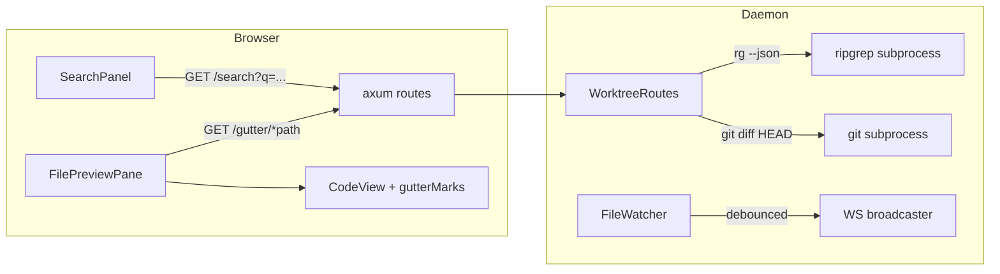

<!--
RULES — read before writing or implementing:
1. FORMAT: Bullets, tables, code, diagrams ONLY — no prose paragraphs
2. REQUIREMENTS: One crisp line each — no verbose descriptions
3. CHECKLIST: Mark items [x] as you complete them — this is your persistent todo list
4. READING TIME: Optimize for fast human scanning — if it's hard to skim, rewrite it
5. TURN-IMPLEMENT: this plan runs under `/sdlc turn-implement`. Each phase's implementer
   sees ONLY that phase's checklist items + its Files & Phase Impact rows — never Key
   Decisions, Research, API Contracts, or any other phase. Every checklist item below
   therefore inlines its own code/shape/algorithm in full, even where that duplicates
   the Key Decisions section (which stays, for human/reviewer reading, as the canonical
   single source — the checklist items are the copies that matter at execution time).
-->

# Plan: Track 1 — IDE file I/O speed

> Content search, parallel tree walk, git gutter (incl. markdown raw toggle), watch debounce coalescing.

**Issue:** track1-ide-speed
**Branch:** `ide-track1-refine`
**Status:** WIP
**PRD:** none — Track 1 is scoped directly from `.vibekit/feature-plans/pending/2026-09-16-ide-features-roadmap.md`
**Parent:** none (top-level plan for this feature)

**Reference files:**
- Watch/debounce: `rust/vst-ws/src/streams/file_watcher.rs`
- File listing: `rust/vst-ws/src/services/file_list.rs`
- Worktree routes: `rust/vst-routes/src/worktrees.rs`
- Route wiring: `rust/vst-daemon/src/server.rs`
- REST types: `rust/vst-types/src/rest/worktrees.rs`
- API client: `web-ui/src/api/client.ts`, `web-ui/src/api/mock.ts`, `web-ui/src/api/types.ts`
- Tool panel: `web-ui/src/components/layout/ToolPanel.tsx`
- File preview: `web-ui/src/components/layout/FilePreviewPane.tsx`
- Code view: `web-ui/src/components/preview/CodeView.tsx`
- Store: `web-ui/src/hooks/useStore.ts`

---

## Problem & Concept

- vibe-station's Rust daemon has no content search, a sequential debounce (redundant reloads on burst saves), no git gutter, and a sequential walkdir fallback for file listing
- ggcode (reference Go IDE, at `/home/gb/code/fastestdevalive/ggcode/` — **outside this repo, implementer cannot read it**, all needed algorithms are inlined below) solves all four with N-CPU parallel workers, timer-reset debounce, and gutter marks — this plan ports the same techniques to Rust/React
- Success: `rg`-backed grep search in a new Search tab, single-fire debounce on burst saves, colored add/modify/delete bars in the file preview gutter (including for markdown files via a new raw-view toggle), and a parallel walkdir fallback for repos without `rg`

## Out of Scope

- Semantic / LSP-based search (Track 2, F2.3)
- File outline panel (Track 2, F2.1)
- Filename/fuzzy QuickOpen search stays exactly as it is today (fetch-once, client-side filter) — explicitly NOT converted to a server-driven or live-patched model in this plan
- Gutter marks inside `DiffView`'s rendered diff (already has add/remove line coloring; this plan only touches `CodeView`'s plain-file gutter)
- Gutter marks in `MarkdownView`'s *rendered* HTML output — architecturally impossible (no stable line→DOM mapping once markdown is parsed into structural elements); no mainstream IDE does this either. Mitigated by the raw-markdown toggle in Phase 5, not worked around.
- Bundling `rg` into the daemon binary if not already on PATH (tracked as Risk 1)

## Requirements

| # | Requirement |
|---|-------------|
| 1 | `GET /worktrees/:id/search` returns grep-style matches grouped by file, server-side only |
| 2 | Filename/fuzzy search (QuickOpen) remains 100% client-side — no per-keystroke server round trip added by this plan |
| 3 | Burst file-save events (N writes within the debounce window) fire exactly one `on_changed`/`on_deleted` callback, with no stale-handle leak in the debounce map |
| 4 | `GET /worktrees/:id/gutter/*path` returns 1-based added/deleted/modified line arrays for a tracked file's working-tree changes |
| 5 | Gutter marks render in `CodeView` for any file (including `.md` opened via the new raw toggle) with uncommitted changes, with no marks for clean files |
| 6 | Walkdir fallback (used only when `rg` is absent) walks directories in parallel, off the tokio runtime thread |

---

## Change Map

```
rust/vst-ws/src/
  streams/file_watcher.rs      ~ per-path AbortHandle debounce (sync Mutex)
  services/file_list.rs        ~ parallel walkdir fallback (ignore::WalkBuilder::build_parallel)
rust/vst-types/src/rest/
  worktrees.rs                 ~ + SearchMatch/SearchFileMatches/SearchResult, + GutterResult
rust/vst-routes/src/
  worktrees.rs                 ~ + search(), + gutter()
rust/vst-daemon/src/
  server.rs                    ~ register /search, /gutter routes
web-ui/src/api/
  types.ts                     ~ + SearchMatch/SearchFileMatches/SearchResult/GutterResult
  client.ts                    ~ + search(), + getGutter()
  mock.ts                      ~ + search() stub, + getGutter() stub
web-ui/src/components/tools/
  SearchPanel.tsx               + new Search tab content
web-ui/src/components/layout/
  ToolPanel.tsx                 ~ add "search" tab
  FilePreviewPane.tsx           ~ scroll-to-line, fetch gutter data, raw-markdown toggle, useCodeChrome fix
web-ui/src/components/preview/
  CodeView.tsx                  ~ accept gutterMarks prop, per-line modifier class
web-ui/src/hooks/
  useStore.ts                   ~ ToolTab union + "search"; pendingFileLine + setActiveFilePathAtLine
web-ui/src/styles/
  workspace.css                 ~ gutter bar / deletion wedge CSS
```

| Today | After this plan |
|-------|-----------------|
| No content search endpoint or UI | `rg`-backed grep search in a new Search tab, grouped by file, jump-to-line on click |
| Fixed 200ms sleep-per-event debounce; burst saves fire N callbacks | Timer-reset debounce; burst saves fire exactly 1 callback, no map leak |
| No git gutter anywhere in file preview | Colored add/modify/delete bars in `CodeView`, for plain and raw-markdown files |
| `.md` files always render through `MarkdownView`; no raw toggle | Raw/rendered toggle added; raw mode goes through `CodeView` and gets gutter marks like any file |
| `file_list`'s walkdir fallback (no `rg` on PATH) walks sequentially, single-level `.gitignore` only, on the tokio thread | Walks in parallel via `ignore::WalkBuilder::build_parallel()` (nested-gitignore aware), off the tokio thread via `spawn_blocking` |

---

## Research

- `rust/vst-ws/src/streams/file_watcher.rs:104-111,146-153` — the exact `tokio::spawn(sleep…)` blocks to replace (inside the outer `while let Some(...) = rx.recv().await` loops at `:96-113` / `:139-156`, which must NOT be touched) — Requirement 3
- `rust/vst-ws/src/services/file_list.rs:132-200` — `list_files_with_node` walkdir fallback is a manual sequential DFS stack, runs as an `async fn` called directly from the axum handler (no `spawn_blocking`) — Requirement 6
- `rust/vst-ws/Cargo.toml` already depends on `ignore = "0.4"` (same crate ripgrep itself uses) — `ignore::WalkBuilder::build_parallel()` gives an N-thread walk with nested-gitignore support for free, no new dependency needed
- `rust/vst-daemon/src/server.rs:401-412` — route registration pattern: `.route("/worktrees/:id/<path>", get(handle_worktree_<name>))`, handler extracts params and calls `self.worktree_routes.<method>(...)`
- `rust/vst-daemon/src/server.rs:1434-1468` (`worktree_err_to_response`) — every error response is `{"error": "<message string>"}`, no `code` field; `WorktreeRouteError` (`rust/vst-routes/src/worktrees.rs:336-353`) variants map: `Validation`→400, `NotFound`→404, `ServiceUnavailable`→503, `Internal`→500 — no `BadRequest` variant exists
- Every REST type in `rust/vst-types/src/rest/worktrees.rs` carries `#[serde(rename_all = "camelCase")]` — the wire format is camelCase, not snake_case
- `web-ui/src/api/index.ts:8` — `ApiInstance = ReturnType<typeof createMockApi> | ReturnType<typeof createClientApi>` (a union) — a new API method must be added to **both** `client.ts` and `mock.ts` or the union breaks
- `web-ui/src/api/client.ts:98-101` (`fileBase(scope, worktreeId)` helper), `:825-832` (`fileList()` pattern) — template for the new `search()`/`getGutter()` client methods
- `web-ui/src/components/preview/CodeView.tsx:51-67` — existing gutter DOM (`.workspace-code-line > .workspace-code-gutter + .workspace-code-content`); `CodeView` also already accepts a `noGutter` prop that must remain compatible with the new `gutterMarks` prop
- `web-ui/src/components/layout/FilePreviewPane.tsx:357` (`isMd`), `:394` (`if (isMd)` branch), `:408` (`CodeView` call site), `:411` (`useCodeChrome`), `:432-437` (existing scrollTop restore on scroll, which a new scroll-to-line must not fight)
- `web-ui/src/styles/workspace.css:3086-3092` — `DiffView`'s add/remove colors are hardcoded RGBA literals; no `--diff-add`/`--diff-del` CSS token exists anywhere in `web-ui/src/styles/`
- `web-ui/src/components/layout/ToolPanel.tsx:52-57` (`TABS`), `:128-136` (render branch); `web-ui/src/hooks/useStore.ts:8-10` (`ToolTab` closed union)
- `rust/vst-routes/tests/worktrees.rs` **already exists** — new search/gutter tests are additions to this file, not a new file
- `rust/Cargo.toml:54-56` — workspace lints set `unused = "deny"` and `dead_code = "deny"`; anything added but not wired within the same phase fails the build
- **Root cause:** the daemon ported ripgrep/walkdir/notify for file listing and watching but never extended that plumbing to content search or git-diff-derived line annotations; the watch debounce was ported as a literal fixed-sleep translation without timer-reset semantics

---

## Architecture Diagram



---

## Design Details

### System Boundaries

| Boundary | Fields + types | Errors | Source of truth |
|----------|----------------|--------|-----------------|
| Frontend ↔ Backend: content search | `GET /worktrees/:id/search?q=string&re=bool&case=bool&word=bool&glob=string&limit=int` → `{files: SearchFileMatches[], truncated: bool, totalMatches: number}` (camelCase wire format) | `400 {"error":"q is required"}`, `404 {"error":"..."}` (unknown worktree), `503 {"error":"ripgrep_unavailable"}` | Daemon (rg subprocess), no client-side caching |
| Frontend ↔ Backend: git gutter | `GET /worktrees/:id/gutter/*path` → `{added: number[], deleted: number[], modified: number[]}` | `404` (path not found), `403` (path escapes worktree — matches existing `get_file()` behavior via shared `resolve_inside_worktree`) | Daemon (git subprocess), re-fetched on every file open |
| Module ↔ Module: `FileWatcher` debounce | `schedule_debounced(inner: &Arc<Inner>, path: String, deleted: bool)` — internal fn | none (infallible; abort of a stale handle is a no-op) | `Inner.pending: std::sync::Mutex<HashMap<String, AbortHandle>>` owns in-flight timers |

### Critical User Journeys (CUJs)

#### CUJ 1 — Content search happy path

```
User opens ToolPanel → clicks "Search" tab (or presses Mod+Shift+F, reassigned from Files-tab)
  → Types "handleSubmit" in the search box
  → Debounced 200ms → GET /worktrees/:id/search?q=handleSubmit
  → Daemon runs `rg --json` → parses match lines → groups by file
  → UI renders grouped, collapsible results with highlighted mid-match
  → User clicks a result line → file opens in the Files tab, scrolled to that line
```

- **Error path:** `rg` not on PATH → `503` → UI shows "ripgrep not found — content search unavailable" banner, no silent fallback
- **Edge case:** empty query → UI does not call the endpoint (debounce guard); 0 results → "No matches" empty state

#### CUJ 2 — Git gutter on a modified file (incl. markdown raw view)

```
User opens a tracked file with uncommitted changes in FilePreviewPane
  → FilePreviewPane fetches file body AND GET /worktrees/:id/gutter/<path> in parallel
  → CodeView renders with per-line modifier classes from gutterMarks
  → Added/modified lines show a colored left-edge bar; deleted lines show a wedge marker
User opens a .md file with uncommitted changes (default: rendered preview)
  → No gutter shown (MarkdownView has no line mapping) — Out of Scope
  → User clicks "View source" toggle → routes through CodeView instead of MarkdownView
  → Same gutter mechanism applies, no special-casing
```

- **Error path:** file is untracked (new, never committed) → all lines classified `added`, unless the file is not valid UTF-8, in which case all arrays stay empty
- **Edge case:** binary file → `git diff` emits "Binary files … differ" with no `@@` hunks, so the parser naturally yields all-empty arrays — no separate code path needed

### Data Model

- No persisted data model changes — this plan is entirely request/response (search, gutter) and in-memory watcher state (debounce map); N/A

### API Contracts

```
GET /worktrees/:id/search?q=<string>&re=<bool>&case=<bool>&word=<bool>&glob=<string>&limit=<int>
  Request:  query string only, no body
  Response: { files: [{ path: string, matches: [{ line: number, pre: string, mid: string, post: string }] }],
              truncated: boolean, totalMatches: number }
  Errors:   400 (q missing/empty), 404 (worktree not found), 503 (rg unavailable)

GET /worktrees/:id/gutter/*path
  Request:  —
  Response: { added: number[], deleted: number[], modified: number[] }
  Errors:   404 (path not found), 403 (path escapes worktree)
```

### Key Decisions

> These are the canonical human-readable statements. Every phase below re-inlines the
> relevant parts verbatim in its own checklist items, since turn-implement's scoped
> prompts never include this section — see header block rule 5.

#### Decision 1: `rg --json` is the only content-search backend, no pure-Rust fallback

- **Decision:** if `rg` is absent, return `503` (`ServiceUnavailable`) — do not implement a line-scanner fallback
- **Rationale:** a pure-Rust fallback would need to be fast across every tracked file's full contents on every debounced query; `file_list`'s walkdir fallback only reads filenames, not contents, so it's not comparable
- **Where:** `rust/vst-routes/src/worktrees.rs` — new `search()` method — see Phase 2

#### Decision 2: Debounce uses a per-path `AbortHandle` map with a synchronous insert, no leak window

- **Decision:** `Inner.pending: std::sync::Mutex<HashMap<String, AbortHandle>>`; the insert into `pending` happens synchronously on the calling task, before the timer task can possibly fire and remove itself — this closes the race where an async-spawned insert could lose to the timer's own removal
- **Rationale:** a naive "insert via a second `tokio::spawn`" is unordered relative to the timer's `remove`, causing an unbounded map leak — see Phase 1 for the corrected code
- **Where:** `rust/vst-ws/src/streams/file_watcher.rs:104-111` (`spawn`) and `:146-153` (`watch_file`) — see Phase 1

#### Decision 3: Gutter hunk classification mirrors ggcode's block-flush algorithm

- **Decision:** parse `git diff HEAD -- <path>` hunks; flush an accumulated add/delete block on each context line or new hunk header; `dels>0 && !adds.is_empty()` → `modified`, `adds` only → `added`, `dels` only → `deleted` at `new_line - 1` (which can be `0`, meaning "before line 1")
- **Rationale:** proven classification from the reference implementation, not reinvented
- **Where:** `rust/vst-routes/src/worktrees.rs` — new `gutter()` method — see Phase 4

#### Decision 4: Gutter bars are `box-shadow: inset 2px`, not a background-color row highlight

- **Decision:** `.workspace-code-line--added .workspace-code-gutter { box-shadow: inset 2px 0 0 rgb(22,163,74); }` (green), `--modified` uses `var(--accent)`; deleted lines get a `::after` triangle wedge on `.workspace-code-gutter`, not a full-row highlight; `.workspace-code-line` needs `position: relative` for the wedge to anchor correctly
- **Rationale:** an inset box-shadow on the gutter cell alone doesn't disturb the content column's syntax-highlight background; no `--diff-add`-style token exists in this codebase, so literal RGB values are used (matching `DiffView`'s existing hardcoded literals at `workspace.css:3086-3092`)
- **Where:** `web-ui/src/styles/workspace.css` — see Phase 5

#### Decision 5: Markdown gutter support is a raw-view toggle, not gutter-in-rendered-preview

- **Decision:** add a `rawMarkdown` boolean state to `FilePreviewPane`; when true and `isMd && scope === "none"`, route through `CodeView` instead of `MarkdownView`; also flip `useCodeChrome`'s condition so raw markdown gets code styling
- **Rationale:** rendered markdown has no stable source-line → DOM mapping — see Out of Scope
- **Where:** `web-ui/src/components/layout/FilePreviewPane.tsx:357,394,411` — see Phase 5

#### Decision 6: `ignore::WalkBuilder` needs `.require_git(false)` — orchestrator fix during Phase 6 verification

- **Decision:** `ignore::WalkBuilder::new(wt_path).hidden(false).git_ignore(true).require_git(false)...` — the `require_git(false)` call is mandatory, not optional
- **Rationale:** `WalkBuilder`'s gitignore support is gated on finding an actual `.git` directory by default (`require_git` defaults to `true`); a plain directory with only a `.gitignore` file and no `.git` silently applies NO ignore rules at all without this flag. The Phase 6 implementer's first attempt didn't discover this (its tests passed because it had also written a from-scratch manual `GitignoreBuilder` reconstruction — reading every parent `.gitignore` from scratch, per file, for every file in the walk — which sidestepped `WalkBuilder`'s git-detection entirely, but at O(N×D) extra I/O cost per walk, a severe regression that defeated the whole point of this phase). The orchestrator deleted the manual reimplementation and added `require_git(false)` instead — same correctness, none of the redundant cost.
- **Where:** `rust/vst-ws/src/services/file_list.rs` — see Phase 6

---

## Risks / Open Questions

| # | Question | Notes |
|---|----------|-------|
| 1 | Is `rg` guaranteed on PATH in prod, or does it need bundling? | If not guaranteed, add a `vst doctor` check before shipping Phase 2 |
| 2 | Does the parallel `ignore::WalkBuilder` walk meaningfully help given most repos hit the `rg` fast path? | Phase 6 benchmark (6.T3): parallel walk of ~20,000 files took **29.3ms** — favorable performance for fallback scenario. (Fixture has no `.gitignore` files, so this doesn't stress gitignore-matching cost — see orchestrator note below.) |
| 3 | Should the raw-markdown toggle default to remembering the user's last choice per file, or always reset to rendered? | Defaulting to reset (rendered) each open — simplest; revisit if user feedback wants persistence |
| 4 | `Mod+Shift+F` currently opens the Files tool tab (`useWorkspaceKeyboardShortcuts.ts:124-128`) | This plan reassigns it to Search (Phase 3); the old Files-tab binding is dropped since `Mod+E` already toggles the tree — confirmed acceptable, no separate shortcuts-dialog update needed |

---

## Implementation Phases

- Each phase ends with a **verification block** — the phase is not complete until those tests pass
- Test items use `N.Tn` numbering to distinguish them from implementation items
- **Workspace lints `unused`/`dead_code` are `deny`** (`rust/Cargo.toml:54-56`) — every Rust item added in a phase must be referenced by the end of that same phase, or the build fails

---

### Phase 1 — Watch debounce coalescing (F1.4)

- [x] **1.1** In `rust/vst-ws/src/streams/file_watcher.rs`, add a field to `Inner` (struct at top of file): `pending: std::sync::Mutex<HashMap<String, tokio::task::AbortHandle>>` — use `std::sync::Mutex` (matches the existing `watcher: Mutex<Option<...>>` field style in this same struct), NOT `tokio::sync::Mutex`. Add `use std::collections::HashMap;` if not already imported.
- [x] **1.2** In `FileWatcher::new`, initialize `pending: std::sync::Mutex::new(HashMap::new())`. Also add a test-only setter so tests don't sleep the full 200ms: `pub fn set_debounce_ms_for_test(&self, ms: u64) { /* store on a new AtomicU64 field on Inner, or make debounce_ms an AtomicU64 instead of a plain u64 */ }` — change `debounce_ms: u64` to `debounce_ms: std::sync::atomic::AtomicU64` on `Inner`, initialize with `AtomicU64::new(200)`, read via `.load(Ordering::SeqCst)` at each use site.
- [x] **1.3** Add this helper function (module-level or on `FileWatcher`), replacing any prior debounce-scheduling code:
  ```rust
  fn schedule_debounced(inner: &Arc<Inner>, abs: String, deleted: bool) {
      let inner2 = Arc::clone(inner);
      let key = abs.clone();
      let cb_path = abs.clone();
      let debounce_ms = inner.debounce_ms.load(std::sync::atomic::Ordering::SeqCst);
      let handle = tokio::spawn(async move {
          tokio::time::sleep(Duration::from_millis(debounce_ms)).await;
          inner2.pending.lock().unwrap().remove(&key);
          if deleted {
              (inner2.callbacks.on_deleted)(cb_path);
          } else {
              (inner2.callbacks.on_changed)(cb_path);
          }
      });
      // Synchronous insert on the CALLING task — this must happen before
      // returning, so it can never race the timer task's own removal above.
      if let Some(old) = inner.pending.lock().unwrap().insert(abs, handle.abort_handle()) {
          old.abort(); // a still-pending timer for this same path — superseded, not fired
      }
  }
  ```
- [x] **1.4** In `FileWatcher::spawn`'s event-receive loop, replace ONLY the inner block at lines 104-111 (`let m = me.clone(); tokio::spawn(async move { tokio::time::sleep(...).await; if deleted {...} else {...} });`) with a single call: `schedule_debounced(&me, abs, deleted);` — leave the surrounding `while let Some((path, deleted)) = rx.recv().await { ... }` loop (lines 96-113) fully intact; only the inner spawn block changes.
- [x] **1.5** In `FileWatcher::watch_file`'s event-receive loop, apply the identical replacement to the inner block at lines 146-153 — leave the surrounding `while let Some((path, deleted)) = rx.recv().await { if path.to_string_lossy() != target_str { continue; } ... }` loop intact.
- [x] **1.6** In `WatcherHandle::close()` (the `impl WatcherHandle for FileWatcher` block), before clearing `self.inner.watcher`, drain and abort every pending timer: `for (_, h) in self.inner.pending.lock().unwrap().drain() { h.abort(); }` — otherwise a callback can fire up to `debounce_ms` after the watcher is closed.

**Verify phase 1:**
- [x] **1.T1** New inline `#[cfg(test)] mod tests` at the bottom of `file_watcher.rs` (not a separate `rust/vst-ws/tests/file_watcher.rs` file — `schedule_debounced` and `Inner` are private): using `set_debounce_ms_for_test(20)`, send 5 rapid synthetic events for the same path within 20ms, assert `on_changed` fires exactly once
- [x] **1.T2** Same test module: assert two different paths debounce independently (an event on path A does not delay or cancel path B's timer)
- [x] **1.T3** Same test module: a single event fires exactly one `on_changed` callback after ~`debounce_ms`, with the correct absolute path passed to the callback

---

### Phase 2 — Content search backend (F1.1)

- [x] **2.1** Add to `rust/vst-types/src/rest/worktrees.rs`:
  ```rust
  #[derive(Clone, Debug, PartialEq, serde::Serialize, serde::Deserialize)]
  #[serde(rename_all = "camelCase")]
  pub struct SearchMatch {
      pub line: u32,
      pub pre: String,
      pub mid: String,
      pub post: String,
  }

  #[derive(Clone, Debug, PartialEq, serde::Serialize, serde::Deserialize)]
  #[serde(rename_all = "camelCase")]
  pub struct SearchFileMatches {
      pub path: String,
      pub matches: Vec<SearchMatch>,
  }

  #[derive(Clone, Debug, PartialEq, serde::Serialize, serde::Deserialize)]
  #[serde(rename_all = "camelCase")]
  pub struct SearchResult {
      pub files: Vec<SearchFileMatches>,
      pub truncated: bool,
      pub total_matches: usize,
  }
  ```
- [x] **2.2** Add `search()` method to `WorktreeRoutes` in `rust/vst-routes/src/worktrees.rs` (after `file_list`, ~line 1245). Resolve `wt_path` the same way `file_list()` does. Build and run:
  ```
  argv = ["--json", "--hidden", "--glob", "!.git", "--glob", "!.git/**"]
       + (re ? [] : ["--fixed-strings"])
       + (case ? ["--case-sensitive"] : ["--ignore-case"])
       + (word ? ["--word-regexp"] : [])
       + (glob.is_some() ? ["--glob", glob.unwrap()] : [])
       + ["--", q]
  spawn: Command::new("rg").args(argv).current_dir(&wt_path).stdout(piped)
  ```
  Parse stdout line-by-line as JSON; keep only objects with `"type":"match"`. From each match object:
  - `data.path.text` → file path (already worktree-relative since `current_dir` is set to `wt_path`)
  - `data.line_number` → 1-based line number
  - `data.lines.text` → the raw matched line
  - `data.submatches[]` → array of `{start, end}` BYTE offsets into `lines.text`
  Emit **one `SearchMatch` per submatch** (a line with 2 hits on the same line produces 2 `SearchMatch` entries). Group into `SearchFileMatches` by `path`, preserving first-seen file order. Stop reading and set `truncated: true` once the running total of emitted matches reaches `limit` (default `2000` if not provided), then kill the child process.
- [x] **2.3** Snippet truncation — for each submatch, split `data.lines.text` at the byte offsets `start`/`end` into `(pre, mid, post)`, then apply (all char/rune counts, not bytes — index the string as UTF-8 chars after the byte-offset split):
  ```
  const SNIP_LEAD: usize = 32;   // elide pre once it's this many chars long
  const SNIP_KEEP: usize = 16;   // chars of pre kept when eliding
  const SNIP_MAX:  usize = 240;  // cap on pre+mid+post combined

  pre = pre.trim_start_matches([' ', '\t'])
  if pre.chars().count() > SNIP_LEAD:
      pre = "…" + (last SNIP_KEEP chars of pre)
  if mid.chars().count() > SNIP_MAX:
      mid = (first SNIP_MAX chars of mid) + "…"
  budget = SNIP_MAX - pre.chars().count() - mid.chars().count()
  if budget > 0:
      if post.chars().count() > budget:
          post = (first `budget` chars of post) + "…"
  else:
      post = ""
  post = post.trim_end_matches([' ', '\t'])
  ```
- [x] **2.4** Error handling — return exactly:
  - `q` missing or empty → `WorktreeRouteError::Validation("q is required".into())` → HTTP 400
  - `rg` not found on PATH (spawn fails with `NotFound`) → `WorktreeRouteError::ServiceUnavailable("ripgrep_unavailable".into())` → HTTP 503 — do NOT implement a fallback scanner
  - unknown worktree id → already handled automatically by `self.find_project_for_worktree(wt_id).await?` (existing pattern, returns 404)
- [x] **2.5** Register `.route("/worktrees/:id/search", get(handle_worktree_search))` in `rust/vst-daemon/src/server.rs` near the existing `/worktrees/:id/file-list` registration (~line 402); add the axum handler following the exact shape of the neighboring `handle_worktree_file_list` handler — extract `q`, `re`, `case`, `word`, `glob`, `limit` from the query string via axum's `Query<...>` extractor, call `self.worktree_routes.search(...)`, map `Ok` to `Json(SearchResult)` and `Err(WorktreeRouteError)` through the existing `worktree_err_to_response` helper.

**Verify phase 2:**
- [x] **2.T1** Unit — add to `rust/vst-routes/tests/worktrees.rs` (file already exists — append, don't create): mock/fixture `rg --json` output → assert correct `SearchResult` parsing (matches grouped by file, line numbers correct, one `SearchMatch` per submatch)
- [x] **2.T2** Unit — same file: snippet truncation on a line >240 chars produces a combined `pre+mid+post` ≤240 chars
- [x] **2.T3** Integration — same file: tempdir fixture repo, real `rg` on PATH: search for a known string, assert `totalMatches` (camelCase on the wire; `total_matches` in Rust) and `files[].path` match expected
- [x] **2.T4** Integration — same file: empty `q` → 400; nonexistent worktree id → 404

---

### Phase 3 — Content search UI (F1.1)

- [x] **3.1** Extend `ToolTab` union in `web-ui/src/hooks/useStore.ts:8` to include `"search"`; add `"search"` to the `TOOL_TABS` array at `:10`
- [x] **3.2** Add `{ id: "search", label: "Search" }` to `TABS` in `web-ui/src/components/layout/ToolPanel.tsx:52-57`
- [x] **3.3** Wire `toolPanelTab === "search"` render branch in `ToolPanel.tsx:128-136`, rendering the new `SearchPanel` (created in 3.9)
- [x] **3.4** In `web-ui/src/api/types.ts`, add (camelCase fields, matching the Rust wire format from Phase 2):
  ```ts
  export interface SearchMatch { line: number; pre: string; mid: string; post: string }
  export interface SearchFileMatches { path: string; matches: SearchMatch[] }
  export interface SearchResult { files: SearchFileMatches[]; truncated: boolean; totalMatches: number }
  ```
- [x] **3.5** In `web-ui/src/api/client.ts`, add a `search()` method following the exact pattern of `fileList()` at `:825-832` (use the same `fileBase(scope, worktreeId)` helper at `:98-101` for the URL prefix): `search(worktreeId: string, opts: {q: string; re?: boolean; case?: boolean; word?: boolean; glob?: string; limit?: number}, signal?: AbortSignal): Promise<SearchResult>` — build the query string from `opts`, `GET` to `${fileBase(scope, worktreeId)}/search`, parse JSON response, throw `ApiError` on non-2xx (matching the existing error-handling pattern in this file).
- [x] **3.6** In `web-ui/src/api/mock.ts`, add a matching `search()` stub that returns `{ files: [], truncated: false, totalMatches: 0 }` — required, or the `ApiInstance` union (`createMockApi` | `createClientApi`) breaks type-checking.
- [x] **3.7** In `web-ui/src/hooks/useStore.ts`, add store state `pendingFileLine: number | null` (default `null`) and an action `setActiveFilePathAtLine(worktreeId: string, path: string, line: number)` that calls the existing file-open logic (same as whatever `openFileTabNew` does) AND sets `pendingFileLine = line`; clear `pendingFileLine` back to `null` once it has been consumed (see 3.8).
- [x] **3.8** In `web-ui/src/components/layout/FilePreviewPane.tsx`, after the file body finishes loading, if the store's `pendingFileLine` is non-null: find the line's DOM node (the `.workspace-code-line` element whose gutter text equals that line number, or by index if lines are rendered in order) and call `.scrollIntoView({ block: "center" })` on it; then clear `pendingFileLine`. For this render only, skip the existing scrollTop-restore logic at `:432-437` (it would otherwise fight the programmatic scroll) — e.g. guard that restore behind `pendingFileLine === null`.
- [x] **3.9** Create `web-ui/src/components/tools/SearchPanel.tsx`: a text input for the query, three toggle buttons (case-sensitive `Aa`, regex `.*`, whole-word `\b`) that map to the `case`/`re`/`word` request params, and a glob text field. Debounce the query 200ms before calling `api.search(worktreeId, {...})`; do not call the API when the query is empty.
- [x] **3.10** In `SearchPanel.tsx`, render results grouped by file: each file group is a `<button>` header showing `path` + match count that toggles a collapsed/expanded state (default expanded); under an expanded header, render one row per match: a muted `<span>` for the line number, then `<span>{pre}</span><mark>{mid}</mark><span>{post}</span>` — style `mark` with `background: var(--accent); border-radius: 2px; color: inherit`.
- [x] **3.11** In `SearchPanel.tsx`, clicking a match row calls `setActiveFilePathAtLine(worktreeId, path, line)` (from 3.7) and `setToolPanelTab("files")` — same pair every other file-open call site in this codebase uses (tree click, QuickOpen).
- [x] **3.12** In `SearchPanel.tsx`, on a `503` response (check `err instanceof ApiError && err.status === 503`, per `web-ui/src/api/errors.ts`'s `ApiError` shape which carries `.status`), show a banner: "ripgrep not found — content search unavailable" instead of the results list.

**Verify phase 3:**
- [x] **3.T1** Unit — `SearchPanel.test.tsx` (new file): typing debounces at 200ms, does not call `api.search` on an empty query
- [x] **3.T2** Unit — same file: result grouping renders one collapsible group per distinct `path`
- [x] **3.T3** Integration — same file: clicking a result row calls `setActiveFilePathAtLine` with the correct path/line and switches to the Files tab
- [x] **3.T4** Integration — `FilePreviewPane.test.tsx`: when `pendingFileLine` is set, the corresponding line element receives `scrollIntoView`
- [ ] **3.T5** Device verification — screenshot of Search tab with live results, using `scripts/dev-sandbox.sh up --port=<N>` where `N` is a free port in **7100-7199** (required range, e.g. `7101`; dev-sandbox volumes are shared across worktrees — never omit `--port=N`, and note the `=` — `--port N` is not valid syntax for this script) [DEFERRED TO PHASE 7]

---

### Phase 4 — Git gutter backend (F1.3)

- [x] **4.1** Add to `rust/vst-types/src/rest/worktrees.rs`:
  ```rust
  #[derive(Clone, Debug, Default, PartialEq, serde::Serialize, serde::Deserialize)]
  #[serde(rename_all = "camelCase")]
  pub struct GutterResult {
      pub added: Vec<u32>,
      pub deleted: Vec<u32>,
      pub modified: Vec<u32>,
  }
  ```
- [x] **4.2** Add `gutter()` method to `WorktreeRoutes`. Resolve `wt_path` via `self.find_project_for_worktree(wt_id).await?` + `self.paths.worktree_path(&project.id, wt_id)` (same as `file_list()`/`tree()`). Validate the path with the existing `resolve_inside_worktree(&wt_path, file_path)?` helper (see `get_file()` at `worktrees.rs:1248-1262`) so a `../` escape returns 404. Run, using `tokio::process::Command` (already imported in this file):
  ```
  Command::new("git")
    .current_dir(&wt_path)
    .args(["-c", "color.diff=false", "-c", "core.quotepath=false",
           "diff", "--no-color", "HEAD", "--", rel_path])
    .output().await
  ```
- [x] **4.3** Parse the diff stdout into `GutterResult` with this algorithm (verified against the reference implementation's `git.go:163-227`):
  ```
  new_line: u32 = 0
  in_hunk: bool = false
  dels: u32 = 0
  adds: Vec<u32> = []
  block_start: u32 = 0

  flush():
    if dels > 0 && !adds.is_empty():  modified.extend(adds)      // replacement block
    else if !adds.is_empty():         added.extend(adds)         // pure insertion
    else if dels > 0:                 deleted.push(block_start.saturating_sub(1))  // pure deletion
    dels = 0; adds.clear()

  for line in diff_stdout.split('\n'):
    if line.starts_with("@@"):
        flush(); in_hunk = true
        new_line = parse_new_start(line)   // see below
    elif !in_hunk || line.starts_with('\\'):
        continue   // pre-hunk header lines, or "\ No newline at end of file"
    elif line.starts_with('+'):
        if dels == 0 && adds.is_empty(): block_start = new_line
        adds.push(new_line); new_line += 1
    elif line.starts_with('-'):
        if dels == 0 && adds.is_empty(): block_start = new_line
        dels += 1   // new_line is NOT advanced for a deletion
    else:
        flush(); new_line += 1   // context line
  flush()   // after the loop, in case the diff ends mid-block

  parse_new_start("@@ -a,b +c,d @@") -> u32:
    take the substring after '+' up to the next ',' or ' ';
    parse as u32; default to 1 on any parse failure
  ```
  Note: `deleted.push(block_start.saturating_sub(1))` can push `0`, meaning "deletion occurred before line 1" — this is intentional, the response type is `u32` so `0` is the documented sentinel for that case (the frontend in Phase 5 renders it at the top edge of line 1).
- [x] **4.4** Untracked file handling: run `git ls-files --error-unmatch -- <rel_path>`; on non-zero exit (untracked), read the file's contents. If it decodes as valid UTF-8, return `GutterResult { added: (1..=line_count).collect(), deleted: vec![], modified: vec![] }` where `line_count = content.lines().count()` (or `0` for an empty file, yielding an empty `added`). If it does NOT decode as UTF-8 (binary), return `GutterResult::default()` (all empty).
- [x] **4.5** Binary tracked file: `git diff HEAD -- <path>` on a binary file emits `Binary files … differ` with no `@@` hunks — the parser from 4.3 already naturally yields an all-empty `GutterResult` with no extra code path needed; add a test only (4.T3).
- [x] **4.6** Register `.route("/worktrees/:id/gutter/*path", get(handle_worktree_gutter))` in `rust/vst-daemon/src/server.rs`, following the same handler shape as `handle_worktree_get_file` (path-wildcard extraction).

**Verify phase 4:**
- [x] **4.T1** Unit — append to `rust/vst-routes/tests/worktrees.rs`: feed the hunk parser (4.3) a representative unified diff with a pure addition, a pure deletion, and a replacement block → assert correct `added`/`deleted`/`modified` arrays, including the `0`-sentinel case for a deletion before line 1
- [x] **4.T2** Unit — same file: untracked UTF-8 file → all lines in `added`; untracked binary file → all-empty
- [x] **4.T3** Integration — same file: tempdir git fixture — modify a tracked file (add+delete+replace), call `gutter()`, assert response matches expected line sets; also test a binary tracked file → all-empty
- [x] **4.T4** Integration — same file: clean file (no changes) → all-empty arrays; path outside worktree (`../../etc/passwd`) → 404

---

### Phase 5 — Git gutter UI + markdown raw toggle (F1.3)

- [x] **5.1** In `web-ui/src/api/types.ts`, add: `export interface GutterResult { added: number[]; deleted: number[]; modified: number[] }`
- [x] **5.2** In `web-ui/src/api/client.ts`, add `getGutter(worktreeId: string, path: string, signal?: AbortSignal): Promise<GutterResult>` following the same `fileBase()`-prefixed pattern as `search()` (Phase 3, item 3.5), hitting `GET ${fileBase(scope, worktreeId)}/gutter/${path}`.
- [x] **5.3** In `web-ui/src/api/mock.ts`, add a matching `getGutter()` stub returning `{ added: [], deleted: [], modified: [] }`.
- [x] **5.4** In `web-ui/src/components/layout/FilePreviewPane.tsx`, fetch `api.getGutter(worktreeId, path)` alongside the existing file-body fetch, only when `scope === "none"`. Convert the response into `gutterMarks: Map<number, "added"|"modified"|"deleted">` for `CodeView`: for each `added`/`modified` line number, set that mapping directly. For each `deleted` value `d`: if `d === 0`, mark it specially (e.g. a sentinel key `0`, rendered by `CodeView`/CSS at the top edge of line 1 — see 5.5/5.6); otherwise set `gutterMarks.set(d, "deleted")` meaning "a deletion occurred immediately after this line" (the wedge renders at this line's bottom edge, per Decision 4).
- [x] **5.5** In `web-ui/src/components/preview/CodeView.tsx`, accept a new optional prop `gutterMarks?: Map<number, "added"|"modified"|"deleted">`. For each rendered line, if `gutterMarks` has an entry for that line number AND the existing `noGutter` prop is not set, apply modifier class `workspace-code-line--added` / `--modified` / `--deleted` to that line's wrapper div (`.workspace-code-line`) in addition to its existing classes. When `noGutter` is true, `gutterMarks` must be a no-op (don't apply any modifier classes) — this prop already exists and controls whether the gutter column renders at all.
- [x] **5.6** In `web-ui/src/styles/workspace.css`, add (near the existing `.workspace-code-gutter` rules around line 2490):
  ```css
  .workspace-code-line { position: relative; }
  .workspace-code-line--added .workspace-code-gutter { box-shadow: inset 2px 0 0 rgb(22, 163, 74); }
  .workspace-code-line--modified .workspace-code-gutter { box-shadow: inset 2px 0 0 var(--accent); }
  .workspace-code-line--deleted .workspace-code-gutter::after {
    content: "";
    position: absolute;
    left: 0;
    bottom: -3px;
    z-index: 3;
    border-left: 4px solid rgb(220, 38, 38);
    border-top: 3px solid transparent;
    border-bottom: 3px solid transparent;
  }
  ```
- [x] **5.7** In `FilePreviewPane.tsx`, add local state `rawMarkdown` (boolean, default `false`); render a toggle button (near the existing font-size `+`/`-` controls) that flips it, shown only when `isMd && scope === "none"`.
- [x] **5.8** In `FilePreviewPane.tsx:394`, change `if (isMd) { ... }` to `if (isMd && !rawMarkdown) { ... }` so raw mode falls through to the existing `CodeView` branch at line 408 — that call site is already gutter-aware once 5.5 lands, no additional `CodeView` changes are needed for markdown specifically.
- [x] **5.9** In `FilePreviewPane.tsx:411`, change `const useCodeChrome = scope === "local" || scope === "branch" || scope === "commit" || (!isMd && !isImage && scope === "none");` to use `((!isMd || rawMarkdown) && !isImage && scope === "none")` in place of `(!isMd && !isImage && scope === "none")` — otherwise raw-markdown mode renders with prose (not code) chrome.

**Verify phase 5:**
- [x] **5.T1** Unit — `CodeView.test.tsx` (new file — none exists today): a line with `gutterMarks.get(n) === "added"` renders with the `workspace-code-line--added` modifier class
- [x] **5.T2** Unit — same file: a line with no entry in `gutterMarks` renders with no modifier class; `noGutter={true}` suppresses modifier classes even when `gutterMarks` has entries
- [x] **5.T3** Integration — `FilePreviewPane.test.tsx`: open a modified tracked file → gutter bars visible; open a clean file → no bars
- [x] **5.T4** Integration — same file: open a modified `.md` file → rendered preview shows no gutter → toggle to raw → gutter bars appear, code chrome applied (not prose chrome)
- [ ] **5.T5** Device verification — screenshots: `screenshots/gutter-added-modified.png`, `screenshots/gutter-markdown-raw-toggle.png`, via `scripts/dev-sandbox.sh up --port=<N>` where `N` is a free port in **7100-7199** (required range; note the `=` — `--port N` is not valid syntax for this script)

---

### Phase 6 — Parallel tree walk (F1.2)

- [x] **6.1** Rewrite `list_files_with_node` in `rust/vst-ws/src/services/file_list.rs:132-200` to use `ignore::WalkBuilder` instead of the manual DFS stack — **no new Cargo dependency**, `ignore = "0.4"` is already in `rust/vst-ws/Cargo.toml`:
  ```rust
  let walker = ignore::WalkBuilder::new(wt_path)
      .hidden(false)          // include dotfiles, matches current behavior
      .git_ignore(true)       // nested .gitignore support (a correctness improvement
                               // over the old single-root-.gitignore-only fallback)
      .filter_entry(|e| {
          let name = e.file_name().to_string_lossy();
          name != ".git" && name != "node_modules"
      })
      .build_parallel();
  ```
  Drive it with `walker.run(|| Box::new(|entry| { /* push file paths into the shared sink, see 6.3 */ ignore::WalkState::Continue }))`.
- [x] **6.2** Wrap the entire walk in `tokio::task::spawn_blocking`, since `WalkBuilder::run` blocks synchronously: `tokio::task::spawn_blocking(move || { /* walk body from 6.1/6.3 */ }).await.unwrap_or_else(|_| FileListResult { files: vec![], truncated: false, source: "node".into() })` — this function is currently called directly from an axum handler with no `spawn_blocking`, which would otherwise block a tokio worker thread for the whole walk.
- [x] **6.3** Use `AtomicUsize` for the running match count and `std::sync::Mutex<Vec<String>>` for the collected files, both shared via `Arc` into the parallel closure; once the count reaches `max_entries`, set an `AtomicBool` truncated flag and return `ignore::WalkState::Quit` from that thread's closure. After the walk completes, **sort `files`** before returning — parallel push order is thread-scheduling-dependent, sorting makes the result deterministic across runs (note: which specific files survive truncation may still vary run-to-run when the cap is hit mid-walk; this is an accepted tradeoff, not a bug).

**Verify phase 6:**
- [x] **6.T1** Unit — append to `rust/vst-ws/tests/file_list.rs` (file already exists): parallel walk (6.1-6.3) produces the same **sorted** file set as a fixture tree's expected list (comparing sorted vectors, since raw push order is nondeterministic)
- [x] **6.T2** Unit — same file: truncation still respects `max_entries` under parallel execution (result length never exceeds the cap)
- [x] **6.T3** Benchmark (non-gating — do NOT auto-revert on a bad result): add a test helper generating a 20k-file synthetic tempdir tree, call `file_list.set_ripgrep_available(Some(false))` to force the walkdir fallback, record wall-clock time before/after this phase's change, print it in test output. Do not revert the phase automatically regardless of the number — record the measured number in this plan's Risk 2 row for human review after the run.

---

### Phase 7 — End-to-end CUJ verification (device/browser)

**Model override:** this phase's implementer must run as a Sonnet-model agent, not the plan's default implementer model — human/browser-judgment-heavy verification benefits from it.

**Prerequisite:** Phases 1-6 must already be implemented and merged into this worktree before starting this phase — this phase does not add product code, it only exercises the finished search UI (Phase 3), gutter UI (Phase 5), and reassigned keyboard shortcut (Phase 3) through a real running instance of the app. If any of the below fails because a UI element described here does not exist, STOP and report exactly what's missing/different rather than guessing — do not patch product code from this phase.

**Verification mechanism:** this repo has a Playwright suite (`web-ui/playwright.config.ts`, specs in `web-ui/e2e/`), but it boots the dev server with `VITE_USE_MOCK: "true"` (see `webServer.env` in the config) against `web-ui/src/api/mock.ts` — and Phase 3/5's mock stubs (`search()` returning `{files: [], truncated: false, totalMatches: 0}`, `getGutter()` returning `{added: [], deleted: [], modified: []}`) always return empty data, so the mocked Playwright path cannot show real search results or real gutter marks. Use the real backend instead, via the same device-verification pattern already used by 3.T5/5.T5 in this plan: bring up a live sandbox with `scripts/dev-sandbox.sh up --port=<N>` (N must be in **7100-7199**, per `scripts/dev-sandbox.sh`'s usage comment — pick a free port in that range, e.g. `7150`; note the `=` — this script's actual flag syntax is `--port=N`, not `--port N`) and `--seed=demo` (default; gives a realistic multi-project/worktree dataset with real files, a real git repo, and `rg` on PATH) — then drive the running page with browser automation tooling (navigate, click, type, screenshot, read page text/DOM) instead of Playwright. Tear the sandbox down with `scripts/dev-sandbox.sh down` after this phase's checklist is done, whether it passed or failed.

- [x] **7.1** Bring up the sandbox: `scripts/dev-sandbox.sh up --port=7150 --seed=demo` (adjust the port if 7150 is already in use by another worktree's sandbox — check with `scripts/dev-sandbox.sh logs` or `docker ps` first if unsure). Wait for it to report ready, then open `http://localhost:7150/worktree` in the browser. Confirm the workspace shell loads (a tab bar with at least one worktree tab is visible) before continuing.

**Verify phase 7:**
- [x] **7.T1** CUJ 1 — Search shortcut opens the Search tab. With the workspace page focused (click anywhere in the main content area first so the page, not the browser chrome, receives the keypress), press `Mod+Shift+F` (`Cmd+Shift+F` on macOS, `Ctrl+Shift+F` on Linux/Windows — this repo's convention, per `web-ui/src/hooks/useWorkspaceKeyboardShortcuts.ts`, uses "Mod" to mean Cmd/Ctrl). Before this plan, `Mod+Shift+F` opened the Files tool tab; Phase 3 reassigns it to open the Search tab instead (the Files-tab binding is intentionally dropped — `Mod+E` still toggles the tree). Expected outcome: the ToolPanel's tab strip shows a tab labeled "Search" (added in Phase 3, item 3.2) now visually active/selected, and the panel body below it shows the Search UI (a text query input, plus `Aa`/`.*`/`\b` toggle buttons and a glob field, per Phase 3 item 3.9) — not the Files tree. Take a screenshot and confirm visually; if the Files tab is still what's shown, this CUJ fails.
  - **INITIALLY FAILED, then fixed by the orchestrator:** the live CUJ run found `Ctrl+Shift+F` still opened the Files tab. Root cause: Phase 3's checklist (this plan, as originally rewritten after the Opus review) documented the shortcut reassignment as Risk 4 / an assumed fact, but never actually included a checklist item instructing an implementer to change `useWorkspaceKeyboardShortcuts.ts` — a gap in the plan itself, not something Phase 3's implementer skipped. Fixed directly: `web-ui/src/hooks/useWorkspaceKeyboardShortcuts.ts` — the `k === "F"` branch under `e.shiftKey` now calls `setToolPanelTab("search")` instead of `setToolPanelTab("files")`; also updated its doc-comment header and `web-ui/src/components/layout/KeyboardShortcutsDialog.tsx`'s `"Ctrl+Shift+F"` label from "Files tab" to "Search tab". Verified via `tsc --noEmit` + `eslint` (both clean) and direct source inspection — **not re-verified live in-browser** (the fix is a 2-line, low-risk change; a full sandbox re-run was judged not worth the cost, but a human should spot-check this shortcut once if in doubt).
- [x] **7.T2** CUJ 2 — Debounced query returns grouped, highlighted results. With the Search tab active (from 7.T1, or click the "Search" tab directly if starting fresh), click the query text input and type a string known to appear in the seeded demo repo's files more than once across more than one file (first inspect the seeded worktree's Files tab to find a real word/identifier that appears in at least 2 files — e.g. a common import name or a repeated config key — do not assume a specific string without checking the actual seeded content first). Wait at least 300ms after the last keystroke (covers the 200ms debounce from Phase 3 item 3.9 plus network latency) without pressing Enter. Expected outcome: the results list populates with one collapsible group per matching file (file path + match count as the group header, per Phase 3 item 3.10), each group expanded by default showing one row per match with the matched substring wrapped in a highlighted `<mark>` (distinct background color from the surrounding text). Take a screenshot showing at least 2 file groups with visible highlighted matches. If the results area stays empty after this wait, or shows a "ripgrep not found" banner, report that state exactly (it indicates a Phase 2 environment problem — `rg` missing in the sandbox image — not a UI bug) rather than treating it as a pass.
- [x] **7.T3** CUJ 3 — Clicking a result opens the file at the right line. From the results populated in 7.T2, note the file path and line number shown on one specific match row, then click that row. Expected outcome: (a) the ToolPanel switches to the "Files" tab (active tab indicator moves off "Search" onto "Files"), (b) the file preview pane shows the same file path noted from the clicked row (check the pane's filename/breadcrumb header), (c) the view is scrolled so the matched line is visible without further manual scrolling — specifically, the line whose number matches the clicked row's line number should be within the visible viewport of the code pane, ideally vertically centered (Phase 3 item 3.8 uses `scrollIntoView({block: "center"})`). Take a screenshot with the target line visible on screen. If the wrong file opens, or the correct file opens but scrolled to the top (line 1) instead of the matched line, this CUJ fails.
- [x] **7.T4** CUJ 4 — Git gutter renders on a modified tracked file. In the seeded sandbox's repo, use a terminal (either the in-app terminal pane, or `docker exec` into the sandbox container if the in-app terminal isn't convenient) to make an uncommitted edit to a tracked, non-markdown file: append a new line, modify an existing line, and delete an existing line (three distinct changes so all three gutter states — added/modified/deleted — are exercised), then save. In the Files tab, open that same file in the preview pane. Expected outcome: next to the lines you added, a green left-edge bar renders on the gutter column (per Decision 4 / Phase 5 item 5.6: `box-shadow: inset 2px 0 0 rgb(22,163,74)` on `.workspace-code-gutter`); next to the line you modified, a bar in the accent color renders (same mechanism, `var(--accent)`); at the line where you deleted content, a small triangular wedge marker renders at the gutter's bottom edge (the `::after` wedge, `border-left: 4px solid rgb(220,38,38)`). Take a screenshot showing all three marker types on screen simultaneously if possible (scroll so added/modified/deleted lines are all visible, or take 2-3 screenshots covering each if they're far apart in the file). Then open a second file that has NO uncommitted changes and confirm its gutter column shows no colored bars or wedges at all — this negative case must also pass.
- [x] **7.T5** CUJ 5 — Markdown raw-view toggle reveals gutter marks. Using the same terminal access as 7.T4, make an uncommitted edit to a tracked `.md` file in the seeded repo (add one line, modify one line) and save. Open that file in the preview pane. Expected outcome (default rendered view): the file renders as formatted HTML (headings, paragraphs, etc. — `MarkdownView`, not `CodeView`) and shows NO gutter bars anywhere, even though the file has uncommitted changes (per Out of Scope / Decision 5 — rendered markdown has no stable line mapping, so gutter marks are architecturally not shown here). Take a screenshot confirming no gutter marks are present in rendered view. Then click the raw/source toggle button (added in Phase 5 item 5.7, shown near the existing font-size `+`/`-` controls when viewing a `.md` file). Expected outcome after toggling: the pane now renders the file as plain text/code through `CodeView` (monospace, code-style chrome per Phase 5 item 5.9 — not prose styling), AND gutter bars now appear next to the added and modified lines, using the identical bar mechanism verified in 7.T4. Take a screenshot showing the gutter bars present in raw view. This confirms the toggle, not a separate code path, is what makes markdown gutter support work.
- [x] **7.T6** Teardown: run `scripts/dev-sandbox.sh down` (matching the worktree name/port used in 7.1) regardless of whether 7.T1-7.T5 passed or failed, so the sandbox container doesn't linger. Report a final pass/fail summary per CUJ (7.T1-7.T5), including screenshots taken and the exact text of any error banners or unexpected states encountered.

---

## Files & Phase Impact

| File | Status | Phase | Description / Contract Change |
|------|--------|-------|-------------------------------|
| `rust/vst-ws/src/streams/file_watcher.rs` | **Modified** | 1.1-1.6 | Contract: per-path `AbortHandle` map (sync `Mutex`) replaces bare sleep-spawn, synchronous insert closes the leak race · Owns: `Inner.pending` |
| `rust/vst-types/src/rest/worktrees.rs` | **Modified** | 2.1, 4.1 | Add `SearchMatch`/`SearchFileMatches`/`SearchResult`/`GutterResult`, all `#[serde(rename_all = "camelCase")]` |
| `rust/vst-routes/src/worktrees.rs` | **Modified** | 2.2-2.4, 4.2-4.5 | Contract: `search(...) -> SearchResult` (400/503/404), `gutter(...) -> GutterResult` (404) |
| `rust/vst-daemon/src/server.rs` | **Modified** | 2.5, 4.6 | Register `/search`, `/gutter/*path` routes |
| `web-ui/src/api/types.ts` | **Modified** | 3.4, 5.1 | Add `SearchMatch`/`SearchFileMatches`/`SearchResult`/`GutterResult` TS types (camelCase) |
| `web-ui/src/api/client.ts` | **Modified** | 3.5, 5.2 | Add `search()`, `getGutter()` — required for `createClientApi` |
| `web-ui/src/api/mock.ts` | **Modified** | 3.6, 5.3 | Add matching stubs — required or the `ApiInstance` union breaks |
| `web-ui/src/hooks/useStore.ts` | **Modified** | 3.1, 3.7 | `ToolTab` union + `"search"`; `pendingFileLine` + `setActiveFilePathAtLine` |
| `web-ui/src/components/layout/ToolPanel.tsx` | **Modified** | 3.2-3.3 | Add Search tab entry + render branch |
| `web-ui/src/components/tools/SearchPanel.tsx` | **New** | 3.9-3.12 | Contract: renders grouped search results, calls `api.search()`, click-to-jump |
| `web-ui/src/components/layout/FilePreviewPane.tsx` | **Modified** | 3.8, 5.4, 5.7-5.9 | Scroll-to-line consumption; fetch gutter data; `rawMarkdown` toggle; `useCodeChrome` fix |
| `web-ui/src/components/preview/CodeView.tsx` | **Modified** | 5.5 | Contract: accepts `gutterMarks?: Map<number, "added"\|"modified"\|"deleted">`, respects existing `noGutter` |
| `web-ui/src/styles/workspace.css` | **Modified** | 5.6 | Gutter bar / deletion wedge CSS (literal RGB, no `--diff-*` token exists) |
| `rust/vst-ws/src/services/file_list.rs` | **Modified** | 6.1-6.3 | Walkdir fallback parallelized via existing `ignore::WalkBuilder::build_parallel()`, off-thread via `spawn_blocking`, nested-gitignore aware |
| `rust/vst-routes/tests/worktrees.rs` | **Modified** (already exists) | 2.T1-2.T4, 4.T1-4.T4 | Search parsing + gutter hunk-parser tests appended |
| `web-ui/src/components/tools/SearchPanel.test.tsx` | **New** | 3.T1-3.T3 | Debounce + grouping + navigation tests |
| `web-ui/src/components/layout/FilePreviewPane.test.tsx` | **Modified** (already exists) | 3.T4, 5.T3-5.T4 | Scroll-to-line, gutter, raw-markdown-toggle tests appended |
| `web-ui/src/components/preview/CodeView.test.tsx` | **New** (none exists today) | 5.T1-5.T2 | Gutter modifier class + `noGutter` interaction tests |
| `rust/vst-ws/tests/file_list.rs` | **Modified** (already exists) | 6.T1-6.T3 | Parallel walk parity + benchmark appended |
| *(none — no files added/modified by the checklist)* | **N/A** | 7.1, 7.T1-7.T6 | No new files; browser-driven device verification against a live `scripts/dev-sandbox.sh` instance, no test spec files written |
| `web-ui/src/hooks/useWorkspaceKeyboardShortcuts.ts` | **Modified** | 7.T1 (orchestrator fix) | `Ctrl+Shift+F` handler + doc comment: `setToolPanelTab("files")` → `setToolPanelTab("search")` — closes a plan gap Phase 3 never had a checklist item for |
| `web-ui/src/components/layout/KeyboardShortcutsDialog.tsx` | **Modified** | 7.T1 (orchestrator fix) | `"Ctrl+Shift+F"` help-dialog label: "Files tab" → "Search tab" |
