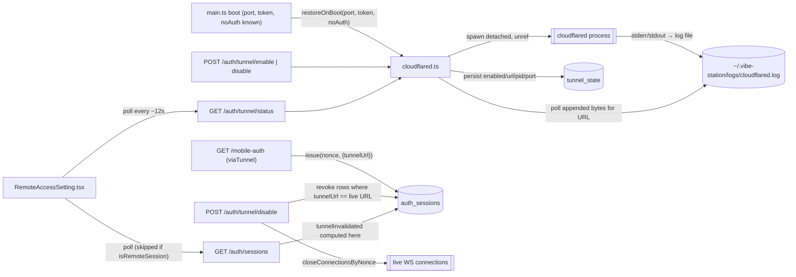
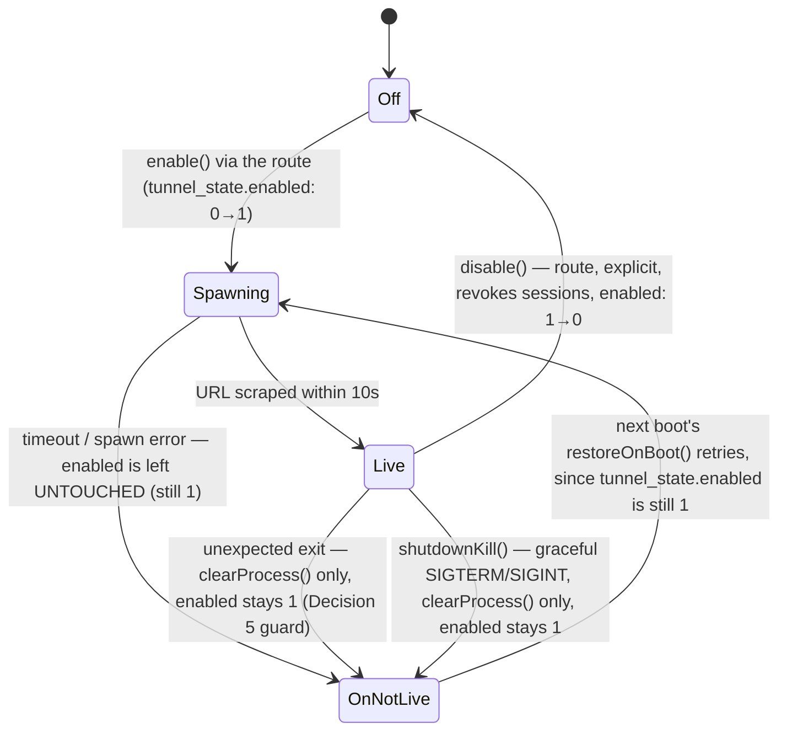
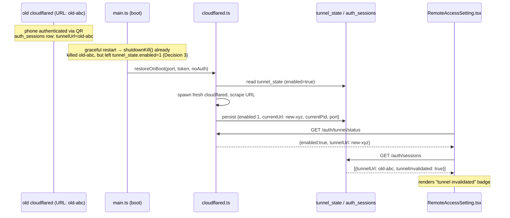

<!--
RULES — read before writing or implementing:
1. FORMAT: Bullets, tables, code, diagrams ONLY — no prose paragraphs
2. REQUIREMENTS: One crisp line each — no verbose descriptions
3. CHECKLIST: Mark items [x] as you complete them — this is your persistent todo list
4. READING TIME: Optimize for fast human scanning — if it's hard to skim, rewrite it
-->

# Plan: Cloudflare Tunnel Persistence

> Persist the Cloudflare quick-tunnel across daemon restarts, poll its status live in the UI, and link each QR-authenticated session to the tunnel URL it was created under so both the daemon and the UI can tell a still-reachable session from a stale one.

**Issue:** tunnel-persistence
**Branch:** `feat/tunnel-persistence`
**Status:** Done — all 4 phases implemented and verified (`pnpm typecheck`, targeted lint, full daemon + web-ui test suites; 2 pre-existing unrelated failures in `worktrees.test.ts` confirmed via stash-and-compare against `main`). Post-squash opus review found 2 more blocking issues, both fixed (see `## Post-Review Fixes` at the end of this document).
**PRD:** none — medium feature, PRD skipped per invocation

**Reference files:**
- Data / schema: `daemon/src/services/dbSchema.ts`
- Core logic: `daemon/src/services/cloudflared.ts`
- New store: `daemon/src/state/tunnel-store.ts`
- New util: `daemon/src/services/tunnelPort.ts`
- UI / entrypoint: `web-ui/src/components/settings/RemoteAccessSetting.tsx`
- Wiring: `daemon/src/main.ts`, `daemon/src/routes/mobileAuth.ts`

**Test commands (run from repo root):**
- Daemon: `pnpm --filter @vibestation/cli test -- src/daemon/__tests__/<file>.test.ts` (`cli/src/daemon` is a symlink to `daemon/src`, so daemon tests run through the `cli` package's vitest config)
- Web UI: `pnpm --filter @vibestation/web test -- src/components/settings/RemoteAccessSetting.test.tsx`

---

## Problem & Concept

- `cloudflared.ts` keeps tunnel state (`enabled`, `tunnelUrl`, `process`) in a plain module-level object, and `main.ts`'s shutdown handler kills the process on every restart — a daemon restart always boots with `enabled: false`, and any QR code minted against the old URL is permanently dead (Research 1, 2)
- The Settings UI fetches tunnel/session status once on mount and never again, so it can't tell the user a session's tunnel went stale (Research 4)
- Success state: the tunnel always comes back (fresh URL — quick tunnels can't keep a stable hostname) after any restart, the UI polls live status, and each QR-authenticated session's still-valid-vs-stale status is computed by the daemon, not guessed by the client

## Out of Scope

- Named/authenticated Cloudflare tunnels with a stable hostname — would preserve the *same* URL across restarts, but is a bigger infra change (deferred)
- Reattaching to a still-alive cloudflared process left over from a previous boot — see Decision 3: every boot always spawns fresh
- Changing the one-time-code QR flow (`/auth/mobile-qr`, `/auth/local-qr`) beyond passing the current tunnel URL through unchanged
- A new "tunnel sessions" table/entity — folded into the existing `auth_sessions` table (Decision 1)
- Distinguishing `vst daemon stop` from `vst daemon restart` at the CLI/signal level — both send `SIGTERM` today (`cli/src/commands/daemon/stop.ts:30`) and this plan doesn't change that

## Requirements

| # | Requirement |
|---|-------------|
| 1 | cloudflared survives daemon shutdown (`detached` + `unref`) so a crash that skips the shutdown handler doesn't strand a live tunnel process untracked; a *graceful* shutdown/restart kills the process but preserves *intent* (`tunnel_state.enabled` stays `true`) — see Decision 3 |
| 2 | Every boot that finds `enabled: true` in `tunnel_state` re-spawns fresh, never reattaches |
| 3 | Tunnel enabled/disabled state and the current URL persist in SQLite, not just in memory |
| 4 | A boot-time re-spawn refuses to run when the daemon is starting in no-auth mode or has no token — matches the existing `/auth/tunnel/enable` guard |
| 5 | Every QR-authenticated session is stamped with the tunnel URL live at creation time |
| 6 | A session's tunnel-still-valid status is computed by the daemon on every read, never stored/mutated by a separate "mark invalidated" step |
| 7 | Explicitly disabling the tunnel (the user-facing route, distinct from a shutdown-time kill) revokes every session that authenticated through it and closes their live connections — "disable" really disconnects, matching the UI's confirmation copy |
| 8 | Settings UI polls tunnel + session status every ~12s and on `visibilitychange`, skips the sessions poll for a remote (tunnel-connected) viewer (that endpoint 403s for them), and shows stale sessions distinctly |

---

## Change Map

```
daemon/src/
  services/
    cloudflared.ts     ~ detached spawn, log-scrape, shutdownKill vs disable
    tunnelPort.ts       + resolveTunnelPort(port)
    dbSchema.ts         ~ tunnel_state table, auth_sessions.tunnelUrl column
    paths.ts             ~ cloudflaredLogPath()
  state/
    tunnel-store.ts      + tunnel_state row read/write
    auth-session-store.ts ~ issue()/list() carry tunnelUrl
  routes/
    mobileAuth.ts        ~ stamps tunnelUrl, computes tunnelInvalidated, revoke-on-disable
  main.ts                 ~ boot-time restoreOnBoot() call
web-ui/src/
  api/
    types.ts              ~ AuthSession.tunnelInvalidated, TunnelState.startedAt
  components/settings/
    RemoteAccessSetting.tsx ~ poll status, stale badge, confirm-before-disable
```

| Today | After this plan |
|-------|-----------------|
| Tunnel state is in-memory only; a restart always starts disabled | Tunnel state persists in SQLite; a graceful shutdown kills the process but keeps `enabled:true`, so the next boot always re-spawns fresh (Decision 3) |
| `auth_sessions` rows have no link to which tunnel URL authenticated them | QR-over-tunnel sessions store that URL; the daemon computes `tunnelInvalidated` (and `tunnelLive`, for the confirm dialog) on every `GET /auth/sessions` read (Decision 2) |
| Disabling the tunnel purges only pending one-time codes; live sessions stay authenticated | Disabling revokes every session whose `tunnelUrl` matches the current live URL and closes its sockets (Decision 4) |
| Settings UI fetches status once on mount | UI polls every ~12s and on tab focus; a remote viewer's poll skips the sessions call it isn't allowed to make |
| Disabling the tunnel gives no warning | UI confirms, listing sessions that will actually be disconnected, before disabling |

---

## Research

- `daemon/src/services/cloudflared.ts:10` — `state` is a module-level singleton holding `process: ChildProcess | null`; nothing backs it to disk
- `daemon/src/services/cloudflared.ts:18,28-36` — the `pending` latch serializes concurrent `enable()` **calls**, but does not serialize a spawned child's own `exit` event against a *later, independent* spawn — that event fires whenever the OS delivers it
- `daemon/src/services/cloudflared.ts:43-45,84-96` — spawned with piped stdio, not detached; on unexpected exit, `state.enabled`/`state.tunnelUrl` are unconditionally reset to null with only a `console.warn` — no persistence, no distinction between "this exit belongs to the currently-tracked process" and a stale one
- `daemon/src/main.ts:206` — shutdown handler unconditionally calls `cloudflared.disable()`; no boot-time call to `cloudflared.enable()` anywhere
- `daemon/src/main.ts:157,161-162,168-174` — `port`, `token`, and `noAuth` are all resolved before `buildServer()` is called (line 175) — everything a boot-time restore needs is available by then
- `daemon/src/main.ts:58-70` — the ESRCH-safe `process.kill(pid, 0)` liveness-check pattern already exists for the daemon's own lock file
- `cli/src/commands/daemon/stop.ts:30,17-63` — both `vst daemon stop` and `vst daemon restart` send `SIGTERM` to the same shutdown handler; there is no separate "stop vs. restart" signal today, and this plan doesn't add one
- `daemon/src/routes/mobileAuth.ts:47` — `tunnelPort` resolution (`VST_TUNNEL_PORT` env override, else the passed `port`) is inlined once inside `registerMobileAuthRoutes`; a boot-time restore needs the identical resolution or a dev/docker setup with `VST_TUNNEL_PORT` set drifts
- `daemon/src/routes/mobileAuth.ts:54-56` — `POST /auth/tunnel/enable` refuses (409) when `noAuth || !token` — exposing an auth-disabled daemon over a public tunnel URL is exactly what this guards against; a boot-time call that reaches `cloudflared.enable()` directly must not bypass it
- `daemon/src/routes/mobileAuth.ts:70-81` — `POST /auth/tunnel/disable` today only purges pending tunnel-origin one-time codes; it never touches `auth_sessions`, so an already-authenticated phone stays fully authorized after "disable"
- `daemon/src/routes/mobileAuth.ts:164-244,240` — `/mobile-auth` computes `viaTunnel` from `cf-connecting-ip` and calls `sessionStore.issue(nonce, {...})` — the live tunnel URL is available at exactly that call site
- `daemon/src/routes/mobileAuth.ts:299-305` — `GET /auth/sessions` already computes one derived-not-stored field (`isCurrent`) in the route handler — `tunnelInvalidated` is the same pattern, not a new one
- `daemon/src/routes/mobileAuth.ts:292` — `GET /auth/sessions` is `isTunnelRequest`-blocked (403); `RemoteAccessSetting.tsx:187-189` already latches `isRemoteSession` on that 403 — a poll loop must not keep hammering a call that will always 403 for a tunnel-connected viewer
- `daemon/src/state/auth-session-store.ts:10-18,50-68,154-169` — `auth_sessions` already has `createdVia`, `label` (User-Agent-derived device hint, `deriveLabel` at line 186), `createdIp`, full issue/list/revoke/revokeAllExcept — the shape a separate `tunnel_sessions` table would duplicate
- `daemon/src/broadcaster.ts` (via `mobileAuth.ts:13,328,350`) — `closeConnectionsByNonce(nonce, code, reason)` is the existing mechanism for actually disconnecting a revoked session's live WS, already imported into `mobileAuth.ts`
- `web-ui/src/components/settings/RemoteAccessSetting.tsx:130-144,181-199` — `fetchStatus()`/`fetchSessions()` each run once via a bare `useEffect`, no interval, no `visibilitychange` listener
- `web-ui/src/components/settings/RemoteAccessSetting.tsx:592-664` — "Connected devices" already renders label, `createdVia` badge, "this session" badge, and a per-row **Revoke** button (not "Remove") — the exact shape a stale-tunnel badge slots into, reusing the same button and label
- `daemon/src/services/dbSchema.ts:174-178` — `addColumnIfMissing()` is the idempotent pattern for adding a column to a pre-existing table; applies directly to `auth_sessions.tunnelUrl`
- `daemon/src/services/paths.ts:82-85` — `daemonLogPath()` is the `~/.vibe-station/logs/<name>.log` convention to mirror for `cloudflaredLogPath()`
- `cli/src/daemon` → symlink to `../../daemon/src` (verified via `ls -la cli/src`); `cli/vitest.config.ts` sets `preserveSymlinks: true` and includes `src/**/__tests__/**/*.test.ts` — this is how `daemon/src/__tests__/*.test.ts` actually gets executed, via the `cli` package
- **Root cause:** the tunnel's process lifetime and URL are wired 1:1 to the daemon's own process lifetime with no persistence layer, no boot-time reconciliation, and no auth-mode check on re-spawn; QR sessions carry no record of which tunnel URL was live when created, and "disable" never revokes the sessions it claims to disconnect

---

## Architecture Diagram





- **`Off`** = `tunnel_state.enabled: 0` — only reached via the explicit disable route; a dead end until the user re-enables
- **`OnNotLive`** = `tunnel_state.enabled: 1` but no live process — reached by a failed spawn, an unexpected exit, OR a graceful shutdown; all three leave `enabled` untouched (`clearProcess()`, not `clear()`), so every one of them is retried on the *next* boot, not the current run

---

## Design Details

### System Boundaries

| Boundary | Fields + types | Errors | Source of truth |
|----------|----------------|--------|-----------------|
| Frontend ↔ Backend (`GET /auth/tunnel/status`) | `{ enabled: boolean, tunnelUrl: string \| null, startedAt: number \| null }` | none (always 200) — unchanged auth: not `AUTH_EXEMPT`, no `isTunnelRequest` guard, matches today | `cloudflared.getState()`, backed by `tunnel_state` |
| Frontend ↔ Backend (`GET /auth/sessions`) | adds `tunnelInvalidated: boolean` AND `tunnelLive: boolean` per session (both server-computed; raw `tunnelUrl` is NOT sent to the client) | none (existing errors unchanged) | computed in the route handler from `auth_sessions.tunnelUrl` vs. `cloudflared.getState().tunnelUrl` — `tunnelInvalidated = tunnelUrl !== null && tunnelUrl !== live`; `tunnelLive = tunnelUrl !== null && tunnelUrl === live` (mutually exclusive; both `false` for a password/local-QR row, which has `tunnelUrl: null`) |
| Client ↔ DB (`tunnel_state`) | `id=1, enabled: 0\|1, currentUrl: TEXT\|NULL, currentPid: INTEGER\|NULL, startedAt: TEXT\|NULL, port: INTEGER\|NULL` | none — best-effort writes, same fail-open pattern as `auth-session-store.ts` | `daemon/src/state/tunnel-store.ts` |
| Client ↔ DB (`auth_sessions.tunnelUrl`) | new nullable `TEXT` column | none | `daemon/src/state/auth-session-store.ts` |
| Module ↔ Module (`main.ts` → `cloudflared.ts`) | `restoreOnBoot(port: number, opts: {token?: string, noAuth: boolean}): Promise<void>` | never throws — logs and returns on any spawn failure or on the no-auth/no-token guard | `cloudflared.ts` owns the child process reference |

### Critical User Journeys (CUJs)

#### CUJ 1 — Daemon restart re-spawns the tunnel; old sessions read as stale



- **Error path:** `cloudflared` binary missing/fails to spawn on boot → `restoreOnBoot()` logs a warning and returns; `tunnel_state.enabled` stays `true` (last known intent) but `currentUrl` stays whatever was last persisted (now dead) — `GET /auth/tunnel/status` is honest about a URL that isn't actually live. The user re-triggers via Disable→Enable through the route, which surfaces the spawn error directly (existing `500 {error: message}` path)
- **Edge case:** daemon crashes without running the shutdown handler → cloudflared keeps running as an orphan pointed at the (now-dead) port; the *next* boot's `restoreOnBoot()` best-effort-kills the recorded pid (harmless if already gone — ESRCH) and spawns fresh regardless (Decision 3)

#### CUJ 2 — User disables the tunnel with active remote sessions

```
User opens Settings → Remote Access; tunnel enabled; 2 sessions with tunnelUrl == live URL
User clicks Disable
  → UI shows confirm dialog: "This will disconnect 2 remote session(s): iPhone, iPad"
User confirms
  → POST /auth/tunnel/disable
      → cloudflared.disable() kills the process, tunnel-store.clear()
      → revoke every auth_sessions row where tunnelUrl == the URL that was live, close their WS (Decision 4)
  → UI refetches status (enabled:false) and sessions (the 2 rows are gone — revoked rows don't list)
```

- **Error path:** disable request fails (network/daemon down) → UI shows the existing error banner (`errMessage` helper); tunnel toggle stays in its last confirmed state, no optimistic flip
- **Edge case:** zero active-via-tunnel sessions → dialog is skipped, disable proceeds immediately

### Data Model

| Entity | Field | Type | Constraints | Notes |
|--------|-------|------|-------------|-------|
| `tunnel_state` | `id` | `INTEGER` | PK, always `1` | single-row table |
| `tunnel_state` | `enabled` | `INTEGER` | NOT NULL DEFAULT 0 | 0/1 boolean |
| `tunnel_state` | `currentUrl` | `TEXT` | NULL | last known live tunnel URL |
| `tunnel_state` | `currentPid` | `INTEGER` | NULL | last spawned cloudflared pid |
| `tunnel_state` | `startedAt` | `TEXT` | NULL | epoch-ms string, matches `auth_sessions` convention |
| `tunnel_state` | `port` | `INTEGER` | NULL | daemon port the tunnel targets |
| `auth_sessions` | `tunnelUrl` | `TEXT` | NULL (existing table, new column) | set only for `createdVia='qr'` sessions authenticated through the tunnel; NULL for password/local-QR sessions |

- **Relationships:** none (both flat, no FKs — mirrors `auth_sessions`' existing no-FK style)
- **Indexes:** none needed — `tunnel_state` is single-row; `auth_sessions.tunnelUrl` is only ever compared in application code against the one live URL, never filtered/joined in SQL
- **Migration:** Y — `tunnel_state` created via `CREATE TABLE IF NOT EXISTS`; `auth_sessions.tunnelUrl` added via `addColumnIfMissing` (`dbSchema.ts:174-178` pattern), no backfill (existing rows get `NULL`, correctly read as "not tunnel-linked")

### API Contracts

```
GET /auth/tunnel/status
  Request:  —
  Response: { enabled: boolean, tunnelUrl: string|null, startedAt: number|null }
  Errors:   none (existing behavior — always 200)
  Change: adds `startedAt`; auth/exemption behavior unchanged (Research: not AUTH_EXEMPT, no isTunnelRequest guard)

POST /auth/tunnel/enable
  Request:  —
  Response: { enabled: true, tunnelUrl: string }
  Errors:   403 TUNNEL_ONLY_BLOCKED, 409 (no-auth mode / already enabled), 500 { error: message }
  Change: on success, also persists to tunnel_state via tunnel-store — route logic unchanged otherwise

POST /auth/tunnel/disable
  Request:  —
  Response: { enabled: false }
  Errors:   403 TUNNEL_ONLY_BLOCKED
  Change: also clears tunnel_state; also revokes every auth_sessions row whose tunnelUrl equals the
          URL that was live and closes its WS connections (Decision 4); existing one-time-code purge unchanged

GET /auth/sessions  (existing — unchanged path/errors)
  Response: { sessions: AuthSession[] }
  Change: each row adds `tunnelInvalidated: boolean` and `tunnelLive: boolean`, both computed
          server-side; `tunnelUrl` itself is not exposed (Decision 2)
```

_(`DELETE /auth/sessions/:nonce` and `DELETE /auth/sessions` are unchanged and reused as-is for the "Revoke" button on both live and stale-tunnel rows — see Decision 1.)_

### Key Decisions

#### Decision 1: Reuse `auth_sessions` + a server-computed `tunnelInvalidated` — no new `tunnel_sessions` table

- **Decision:** Add a nullable `tunnelUrl` column to the existing `auth_sessions` table; do not create a separate `tunnel_sessions` table or duplicate session CRUD
- **Rationale:** `auth_sessions` already has `label` (device hint), `createdVia`, `createdIp`, list/issue/revoke, and a fully working "Connected devices" UI (Research: `auth-session-store.ts`, `RemoteAccessSetting.tsx:592-664`) — a parallel table would duplicate all of it for what is a subset of the same rows
- **Where:** `daemon/src/services/dbSchema.ts` (new column), `daemon/src/state/auth-session-store.ts` (thread `tunnelUrl` through `issue()`/`list()`), `daemon/src/routes/mobileAuth.ts:240` (pass it in)

#### Decision 2: `tunnelInvalidated` AND `tunnelLive` are computed server-side on every read, never written to a row

- **Decision:** `GET /auth/sessions` computes two mutually-exclusive booleans per row in the route handler — the same place `isCurrent` is already computed (`mobileAuth.ts:299-305`) — and returns both. Nothing is ever written back to `auth_sessions` for this.
  - `tunnelInvalidated = row.tunnelUrl !== null && row.tunnelUrl !== cloudflared.getState().tunnelUrl` — this session's tunnel went stale (boot re-spawn changed the URL)
  - `tunnelLive = row.tunnelUrl !== null && row.tunnelUrl === cloudflared.getState().tunnelUrl` — this session is currently reachable via the live tunnel, i.e. exactly the set Decision 4's disable-revoke loop will touch
- **Rationale:** A stored/mutated status field requires remembering to update every affected row at every tunnel-down event (boot re-spawn, unexpected exit) — three call sites that can drift out of sync. A same-request comparison is correct by construction and self-heals; computing it **server-side** (not client-side) means the daemon itself can use the same booleans if ever needed for an auth/rate-limit decision. A single `tunnelInvalidated` boolean is not enough for the client: `createdVia` is `"qr"` for *both* tunnel-QR and local-network-QR sessions (`mobileAuth.ts:241`), so a client trying to derive "will Disable touch this row" from `!tunnelInvalidated` would wrongly include password AND local-QR sessions (`tunnelUrl: null` on both → `tunnelInvalidated: false`). `tunnelLive` is the field Phase 4.4's confirm dialog actually needs.
- **Where:** `daemon/src/routes/mobileAuth.ts` (`GET /auth/sessions` handler)

#### Decision 3: Every boot always spawns a fresh cloudflared; graceful shutdown kills the process but preserves intent

- **Decision:** Two distinct exported functions, not one:
  - `disable()` (existing, used only by the `POST /auth/tunnel/disable` route) — kills the process AND calls `tunnelStore.clear()`, which zeroes `enabled` too. This is "the user turned it off": the next boot must NOT re-spawn.
  - `shutdownKill()` (new, used only by `main.ts`'s `shutdown()` handler) — kills the process and calls a new `tunnelStore.clearProcess()`, which nulls `currentUrl`/`currentPid` but leaves `enabled` **unchanged**. This is "the daemon is restarting, the intent to run a tunnel still stands": the next boot's `restoreOnBoot()` reads `enabled: true` and re-spawns.
  `restoreOnBoot()` itself unconditionally best-effort-kills whatever pid was last recorded (covers both the graceful case, where the pid is usually already dead, and the crash case, where it may still be a live orphan), then — only if `tunnelStore.getState().enabled` — spawns fresh and persists the new url/pid. Reattaching to a still-alive process is never attempted (`cloudflared` quick tunnels can't be reattached to; there's no resume token).
- **Rationale:** Conflating "kill the process" with "clear the enabled flag" (the single-`disable()` version reviewed in iteration 1) meant a graceful `vst daemon restart` — which calls the shutdown handler — would itself flip `enabled` to `false`, so `restoreOnBoot()` would find nothing to do and the tunnel would never come back except after a crash. Splitting "kill" (always happens on any shutdown) from "clear intent" (only happens via the explicit route) fixes that while still avoiding a permanently-orphaned process: `vst daemon stop` with no follow-up start leaves `enabled:true` in the DB but the process is dead — a real (if minor) inconsistency, accepted because the alternative (distinguishing stop-for-good from about-to-restart) needs a CLI-level change (Out of Scope, Research: both send the same `SIGTERM`, `cli/src/commands/daemon/stop.ts:30`); the daemon isn't running to serve traffic either way, so there is no live public tunnel to worry about while it's stopped, only a stale "should be enabled" flag that self-corrects on the next boot. The spawn still uses `detached: true` + `child.unref()` so a **crash** (no shutdown handler run at all) doesn't kill the child mid-write; that orphan is reconciled by the same `restoreOnBoot()` best-effort-kill on the next boot.
- **Where:** `daemon/src/services/cloudflared.ts` (`disable`, new `shutdownKill`, `restoreOnBoot`), `daemon/src/state/tunnel-store.ts` (new `clearProcess()` alongside `clear()`), `daemon/src/main.ts` (shutdown handler calls `cloudflared.shutdownKill()`, not `disable()`)

#### Decision 4: Disabling the tunnel revokes the sessions it authenticated

- **Decision:** `POST /auth/tunnel/disable` — before or alongside killing the process — revokes every `auth_sessions` row whose `tunnelUrl` equals the tunnel URL that was live, via the existing `sessionStore.revoke()`, and closes each one's live connections via the existing `closeConnectionsByNonce()` (same pattern as `DELETE /auth/sessions`, `mobileAuth.ts:346-351`)
- **Rationale:** The route's only side effect today is purging *pending* one-time codes — an already-authenticated phone stays fully authorized after "disable" and gets silently re-admitted if the tunnel is re-enabled under a new URL that a stale bookmark can't reach anyway, but the *session itself* never actually loses access. The planned UI explicitly tells the user "this will disconnect N sessions" (CUJ 2) — that claim has to be true, or the confirmation dialog is lying about a security-relevant action
- **Where:** `daemon/src/routes/mobileAuth.ts` (`POST /auth/tunnel/disable` handler, `mobileAuth.ts:70-81`)

```ts
// mobileAuth.ts — same shape as the existing "revoke all except current" loop
// (mobileAuth.ts:342-351): snapshot the doomed rows BEFORE revoking, since
// list() filters out revoked rows and a post-revoke re-read would find nothing
// left to close sockets for.
const { tunnelUrl: liveUrl } = cloudflared.getState();
cloudflared.disable();
if (liveUrl) {
  const doomed = sessionStore.list().filter((row) => row.tunnelUrl === liveUrl);
  for (const row of doomed) {
    sessionStore.revoke(row.nonce);
    closeConnectionsByNonce(row.nonce, 4403, "Tunnel disabled");
  }
}
```

#### Decision 5: Scrape the tunnel URL from a log file; guard the exit handler by process identity, not just pid

- **Decision:** Redirect the child's stdout/stderr to an fd opened on `~/.vibe-station/logs/cloudflared.log` (append mode) at spawn time; poll only the bytes appended after that spawn's start offset for the URL regex, clearing the poll interval on resolve/reject/timeout and closing the fd in the parent right after `spawn()` returns. The `exit` handler's "tunnel is gone" branch is guarded by `state.process === child` (the closure-captured reference from this call of `spawnTunnel`), not by comparing pids — this covers the case where `disable()`/`shutdownKill()` killed process A, `enable()` immediately spawned process B and overwrote `state.process`, and A's `exit` event only *then* arrives (the `pending` latch serializes concurrent `enable()` calls, not a stale child's own async exit event — Research). The existing `child.on("error", ...)` ENOENT-message handling and the exit-before-resolved reject (`cloudflared.ts:72-89` today) are carried over unchanged into the new stdio/logging shape — moving to a log file changes how the URL is captured, not the error/timeout semantics around it.
- **Rationale:** A piped stdio's read end is owned by the parent; once the daemon exits, the child's next write raises `EPIPE` — the entire point of `detached`+`unref()` is for the child to outlive the daemon, so its stdio can't depend on the daemon staying alive to drain it. Comparing against the log file's pre-spawn byte offset prevents matching a stale URL still sitting in the file from a previous run. Comparing `state.process` identity (not pid) in the exit handler is simpler than a pid lookup and closes the exact race identified in review: a late-arriving exit event for an already-replaced process must not reset the state of the process that replaced it. Dropping the existing `error`/early-exit handling while rewriting this function would regress the ENOENT hint ("cloudflared not found — run `vst doctor`") back to a generic 10s timeout — worth stating explicitly since the snippet below is presented as the whole function body an implementer will copy from.
- **Where:** `daemon/src/services/cloudflared.ts` (`spawnTunnel`, exit handler), `daemon/src/services/paths.ts` (new `cloudflaredLogPath()`)

```ts
// cloudflared.ts
function spawnTunnel(port: number): Promise<{ tunnelUrl: string }> {
  return new Promise((resolve, reject) => {
    const logPath = cloudflaredLogPath();
    const startOffset = existsSync(logPath) ? statSync(logPath).size : 0;
    const logFd = openSync(logPath, "a");
    const child = spawn("cloudflared", ["tunnel", "--url", `http://127.0.0.1:${port}`], {
      stdio: ["ignore", logFd, logFd],
      detached: true,
    });
    closeSync(logFd); // parent doesn't need its own handle once the child has inherited it
    child.unref();
    state.process = child;

    let resolved = false;
    const poll = setInterval(() => {
      const text = readFileSync(logPath).subarray(startOffset).toString("utf8");
      const match = TUNNEL_URL_RE.exec(text);
      if (match && !resolved) {
        resolved = true;
        clearInterval(poll);
        clearTimeout(timer);
        state.enabled = true;
        state.tunnelUrl = match[0];
        tunnelStore.setState({ enabled: true, currentUrl: match[0], currentPid: child.pid ?? null, startedAt: Date.now(), port });
        resolve({ tunnelUrl: match[0] });
      }
    }, 250);
    const timer = setTimeout(() => {
      if (!resolved) { resolved = true; clearInterval(poll); child.kill(); reject(new Error("cloudflared did not emit a URL within 10s")); }
    }, SPAWN_TIMEOUT_MS);

    // Carried over unchanged from today's implementation (cloudflared.ts:72-82) —
    // only the stdio shape above changed, not this error mapping.
    child.on("error", (err) => {
      clearTimeout(timer);
      clearInterval(poll);
      if (!resolved) {
        resolved = true;
        state.process = null;
        const msg = (err as NodeJS.ErrnoException).code === "ENOENT"
          ? "cloudflared not found — install it and ensure it is on PATH (run: vst doctor)"
          : err.message;
        reject(new Error(msg));
      }
    });

    child.on("exit", (code) => {
      // Guard by identity, not pid: a late exit event for a process that has
      // already been superseded by a newer spawn must never clobber the newer one.
      if (state.process !== child) return;
      state.process = null;
      if (!resolved) {
        // Carried over unchanged from today's implementation (cloudflared.ts:86-89):
        // died before ever emitting a URL — this IS the failure, not a post-hoc reset.
        resolved = true;
        clearTimeout(timer);
        clearInterval(poll);
        reject(new Error(`cloudflared exited with code ${code ?? "?"} before emitting URL`));
      } else {
        state.enabled = false;
        state.tunnelUrl = null;
        const cur = tunnelStore.getState();
        if (cur.currentPid === child.pid) tunnelStore.clear();
      }
    });
  });
}
```

#### Decision 6: `resolveTunnelPort()` lives in `services/`, not in a route module

- **Decision:** Extract the `VST_TUNNEL_PORT`-or-`port` logic (`mobileAuth.ts:47`) into `daemon/src/services/tunnelPort.ts`, exporting `resolveTunnelPort(port: number): number`; import it from both `mobileAuth.ts` and `main.ts`
- **Rationale:** `restoreOnBoot(port)` in `main.ts` must target the exact port `/auth/tunnel/enable` would use, or a dev/docker setup with `VST_TUNNEL_PORT` set gets a boot-time tunnel pointed at the wrong port while the manual-enable route works correctly. Placing the shared function in `services/` (not in the route file `main.ts` would otherwise import from) keeps the dependency direction routes → services → (nothing), matching every other cross-cutting helper in this codebase (`services/paths.ts`, `services/config.ts`)
- **Where:** `daemon/src/services/tunnelPort.ts` (new), `daemon/src/routes/mobileAuth.ts` (import, replace inline logic), `daemon/src/main.ts` (import, use before calling `restoreOnBoot`)

---

## Risks / Open Questions

| # | Question | Notes |
|---|----------|-------|
| 1 | **Should `restoreOnBoot()` block daemon startup, or run fire-and-forget?** | Block: matches existing boot sequencing (`recoverNotStartedSessions`, `sweepDirectPtySessionsOnBoot` are already awaited before `listen()`) — a still-restoring tunnel would otherwise report a false "enabled" status to the first UI poll. Accepts up to `SPAWN_TIMEOUT_MS` (10s) added to boot time when the tunnel was enabled |
| 2 | **`process.kill(currentPid, "SIGTERM")` in `restoreOnBoot` has no identity check beyond liveness** | A recycled pid (rare — requires the OS to have reused it for something else between the old cloudflared's death and this boot) gets an unintended SIGTERM. Matches the existing `main.ts:58-70` lock-file pattern, which has the same limitation and is accepted there; not worth a `/proc/<pid>/cmdline` check for this |
| 3 | **`cloudflared.log` is appended to forever, never rotated** | Accepted for this plan — `daemon.log` has no rotation either (Research: `paths.ts:82-85`); not introducing a new problem class |
| 4 | **A tunnel-authenticated session that is *not* currently reachable (stale URL) but not yet revoked can still pass `isLive()` checks on other endpoints** | Only `GET /auth/sessions`'s `tunnelInvalidated` flag is new read-side information for the UI; this plan does not change `server.ts`'s auth `preHandler` to reject stale-tunnel sessions on every request — a session only actually loses access via explicit revoke (Decision 4) or its own 7-day expiry. Out of scope: broader "auto-revoke stale-tunnel sessions" policy |

---

## Implementation Phases

- Each phase ends with a **verification block** — the phase is not complete until those tests pass
- Test items use `N.Tn` numbering to distinguish them from implementation items

---

### Phase 1 — Persistence layer (DB schema + stores)

- [x] **1.1** `daemon/src/services/dbSchema.ts` — add `CREATE TABLE IF NOT EXISTS tunnel_state (id INTEGER PRIMARY KEY, enabled INTEGER NOT NULL DEFAULT 0, currentUrl TEXT, currentPid INTEGER, startedAt TEXT, port INTEGER)`; add `addColumnIfMissing(db, "auth_sessions", "tunnelUrl", "TEXT")`
- [x] **1.2** `daemon/src/services/paths.ts` — add `cloudflaredLogPath(): string` returning `~/.vibe-station/logs/cloudflared.log`, mirroring `daemonLogPath()` (`paths.ts:82-85`)
- [x] **1.3** `daemon/src/state/tunnel-store.ts` (new) — `getState(): {enabled, currentUrl, currentPid, startedAt, port}`, `setState(state)` (upsert row id=1), `clear()` (enabled=0, currentUrl/currentPid/port=null — used by the route's `disable()`), `clearProcess()` (currentUrl/currentPid=null, `enabled` left untouched — used by `shutdownKill()`, Decision 3), all best-effort/fail-open like `auth-session-store.ts`
- [x] **1.4** `daemon/src/state/auth-session-store.ts` — extend `AuthSessionMeta`/`issue()` to accept optional `tunnelUrl?: string`, persist it in the INSERT (`auth-session-store.ts:50-68`); extend `AuthSessionRow`/`list()` SELECT to include `tunnelUrl`
- [x] **1.5** `daemon/src/services/tunnelPort.ts` (new) — `resolveTunnelPort(port: number): number`, moved verbatim from `mobileAuth.ts:47`

**Verify phase 1:**
- [x] **1.T1** Unit — `tunnel-store.test.ts` (new): `setState()` then `getState()` round-trips all fields; `clear()` zeroes `enabled`/`currentUrl`/`currentPid` but the row still exists (id=1); `clearProcess()` zeroes only `currentUrl`/`currentPid` and leaves a previously-`true` `enabled` at `true`
- [x] **1.T2** Unit — `tunnel-store.test.ts`: `getState()` on a fresh DB (never set) returns `enabled: false, currentUrl: null, ...` without throwing
- [x] **1.T3** Integration — `dbSchema.test.ts` (existing file, add cases): a DB created before this change (no `tunnel_state` table, no `tunnelUrl` column) gets both added idempotently on `ensureSchema()`, and calling `ensureSchema()` twice in a row does not error
- [x] **1.T4** Unit — `auth-session-store.test.ts` (new): `issue(nonce, {createdVia:"qr", tunnelUrl:"https://x.trycloudflare.com"})` then `list()` returns that row with `tunnelUrl` populated; `issue()` with no `tunnelUrl` yields `null` in `list()`

All Phase 1 tests pass: `pnpm --filter @vibestation/cli test -- src/daemon/__tests__/tunnel-store.test.ts src/daemon/__tests__/dbSchema.test.ts src/daemon/__tests__/auth-session-store.test.ts` → 3 files, 14 tests, 0 failures.

Run: `pnpm --filter @vibestation/cli test -- src/daemon/__tests__/tunnel-store.test.ts src/daemon/__tests__/dbSchema.test.ts src/daemon/__tests__/auth-session-store.test.ts`

---

### Phase 2 — cloudflared: detached spawn, log-file scraping, boot restore

- [x] **2.1** `daemon/src/services/cloudflared.ts` — spawn with `detached: true`, `stdio: ["ignore", logFd, logFd]` (fd opened on `cloudflaredLogPath()`, append mode, closed in the parent right after `spawn()`), `child.unref()`; drop the old `stdio: ["ignore","pipe","pipe"]` + `.on("data")` listeners (Decision 5 snippet)
- [x] **2.2** `daemon/src/services/cloudflared.ts` — replace pipe-based URL scraping with the `setInterval` poll from Decision 5, reading bytes appended after `startOffset`; `clearInterval` on resolve, on reject, and on `SPAWN_TIMEOUT_MS` timeout — no path leaves the interval running
- [x] **2.3** `daemon/src/services/cloudflared.ts` — on successful `enable()`, persist via `tunnelStore.setState({enabled:true, currentUrl, currentPid: child.pid ?? null, startedAt: Date.now(), port})`
- [x] **2.4** `daemon/src/services/cloudflared.ts` — a shared private `killTrackedProcess()` helper SIGTERMs the tracked process (in-memory `state.process` if present, else falls back to the pid from `tunnelStore.getState()` via the ESRCH-safe try/catch pattern, `main.ts:58-70`); `disable()` calls it then `tunnelStore.clear()` (enabled→0); new `shutdownKill()` calls it then `tunnelStore.clearProcess()` (enabled untouched) — both reset in-memory `state.enabled`/`state.tunnelUrl`/`state.process` to their off values (Decision 3)
- [x] **2.5** `daemon/src/services/cloudflared.ts` — `child.on("error", ...)` and `child.on("exit", ...)` carried over per the Decision 5 snippet: `error` keeps the ENOENT message unchanged; `exit` is guarded by `state.process === child` identity check, rejects on exit-before-resolved (unchanged from today), and only performs the "tunnel is gone" reset (guarded, as before) when it fires after resolution — replaces the current unconditional post-resolution reset
- [x] **2.6** `daemon/src/services/cloudflared.ts` — add `export async function restoreOnBoot(port: number, opts: {token?: string; noAuth: boolean}): Promise<void>`: if `opts.noAuth || !opts.token`, log and return without touching anything (Requirement 4); else read `tunnelStore.getState()`, and if `enabled`, best-effort-kill the recorded pid (same ESRCH-safe helper as 2.4), then call `enable(port)`; swallow/log any `enable()` rejection (never throws out of `restoreOnBoot`)
- [x] **2.7** `daemon/src/services/cloudflared.ts` — `getState()` return type gains `startedAt: number | null`, sourced from `tunnelStore.getState()`
- [x] **2.8** `daemon/src/routes/mobileAuth.ts` — replace the inline `tunnelPort` calculation (`mobileAuth.ts:47`) with `resolveTunnelPort(port)` from the new `services/tunnelPort.ts` (Phase 1.5)
- [x] **2.9** `daemon/src/main.ts` — after `port`, `token`, `noAuth` are all resolved (`main.ts:157-174`) and before `app.listen()`, call `await cloudflared.restoreOnBoot(resolveTunnelPort(port), { token, noAuth })`; in the `shutdown()` handler, **replace** `cloudflared.disable()` (`main.ts:206`) with `cloudflared.shutdownKill()` — using `disable()` there would zero `tunnel_state.enabled` on every graceful restart and defeat `restoreOnBoot()` (Decision 3)

**Verify phase 2:**
- [x] **2.T1** Unit — `cloudflared.test.ts` (new): mock `node:child_process.spawn` to return a fake `ChildProcess` (EventEmitter, fake `pid`); write a URL line directly to the mocked `cloudflaredLogPath()` file after spawn — `enable()` resolves with the scraped URL within the poll window, and the poll `setInterval` is cleared afterward (assert via `vi.useFakeTimers()` + checking no further reads occur after resolve)
- [x] **2.T2** Unit — `cloudflared.test.ts`: log file already contains an old URL from a prior run (bytes before `startOffset`) — `enable()` does NOT resolve on that stale text, only on bytes appended after spawn
- [x] **2.T3** Unit — `cloudflared.test.ts`: `enable()` persists to `tunnelStore` on success (assert via `tunnelStore.getState()`); `disable()` clears it fully (`enabled: false`); `shutdownKill()` clears `currentUrl`/`currentPid` but leaves `enabled: true`
- [x] **2.T4** Unit — `cloudflared.test.ts`: a fake child's `exit` event fires AFTER a second `enable()` call has already replaced `state.process` — asserts the first child's exit does NOT reset `state.enabled`/`state.tunnelUrl` for the second (live) process (Decision 5 race)
- [x] **2.T4b** Unit — `cloudflared.test.ts`: mock `spawn` to emit an `error` event with `code: "ENOENT"` before any URL is scraped — `enable()` rejects immediately (not after the 10s timeout) with a message containing "run: vst doctor"
- [x] **2.T4c** Unit — `cloudflared.test.ts`: fake child emits `exit` with a non-zero code before any URL match — `enable()` rejects with a message containing "before emitting URL", and the poll interval is cleared (no further `readFileSync` calls)
- [x] **2.T5** Unit — `cloudflared.test.ts`: `restoreOnBoot(port, {noAuth: true})` and `restoreOnBoot(port, {token: undefined, noAuth: false})` both return without calling `spawn` at all
- [x] **2.T6** Unit — `cloudflared.test.ts`: `restoreOnBoot(port, {token: "x", noAuth: false})` with `tunnelStore` state `{enabled:false}` does not spawn anything
- [x] **2.T7** Unit — `cloudflared.test.ts`: `restoreOnBoot(port, {token: "x", noAuth: false})` with `{enabled:true, currentPid: <fake>}` calls `process.kill` on the fake pid (mock `process.kill`) before spawning, and swallows an ESRCH-style error from that kill without throwing
- [x] **2.T8** Unit — `tunnelPort.test.ts` (new): `resolveTunnelPort` respects `VST_TUNNEL_PORT` when set, falls back to the passed `port` otherwise

All Phase 2 tests pass: `pnpm --filter @vibestation/cli test -- src/daemon/__tests__/cloudflared.test.ts src/daemon/__tests__/tunnelPort.test.ts` → 2 files, 11 tests, 0 failures. Full daemon suite re-run confirms no new failures (same 2 pre-existing, unrelated `worktrees.test.ts` failures as on main, verified via stash-and-compare).

Run: `pnpm --filter @vibestation/cli test -- src/daemon/__tests__/cloudflared.test.ts src/daemon/__tests__/tunnelPort.test.ts`

---

### Phase 3 — QR sessions carry `tunnelUrl`; disable revokes them

- [x] **3.1** `daemon/src/routes/mobileAuth.ts` — in the `GET /mobile-auth` handler (`mobileAuth.ts:240`), pass `tunnelUrl: viaTunnel ? (cloudflared.getState().tunnelUrl ?? undefined) : undefined` into `sessionStore.issue(nonce, {...})`
- [x] **3.2** `daemon/src/routes/mobileAuth.ts` — `GET /auth/sessions` handler (`mobileAuth.ts:299-306`) computes `tunnelInvalidated` AND `tunnelLive` per row alongside the existing `isCurrent` computation (Decision 2), and the response omits raw `tunnelUrl` — only the two computed booleans go over the wire
- [x] **3.3** `daemon/src/routes/mobileAuth.ts` — `POST /auth/tunnel/disable` (`mobileAuth.ts:70-81`) gains the revoke-on-disable loop from Decision 4, snapshotting live-tunnel sessions before calling `cloudflared.disable()` clears the URL

**Verify phase 3:**
- [x] **3.T1** Integration — `mobileAuth.test.ts` (new): a `GET /mobile-auth?code=` request with `cf-connecting-ip` header set (simulated tunnel request) while a tunnel is enabled results in an `auth_sessions` row with `tunnelUrl` equal to the live tunnel URL
- [x] **3.T2** Integration — `mobileAuth.test.ts`: the same request via the local-network path (no `cf-connecting-ip`) results in `tunnelUrl: null`
- [x] **3.T3** Integration — `mobileAuth.test.ts`: `GET /auth/sessions` returns `{tunnelInvalidated: true, tunnelLive: false}` for a row whose `tunnelUrl` differs from the live URL; `{tunnelInvalidated: false, tunnelLive: true}` for a row matching it; `{tunnelInvalidated: false, tunnelLive: false}` for a password/local-QR row (`tunnelUrl: null`); response body contains no raw `tunnelUrl` field
- [x] **3.T4** Integration — `mobileAuth.test.ts`: `POST /auth/tunnel/disable` with 2 sessions live-via-tunnel and 1 password session — after the call, `GET /auth/sessions` no longer lists the 2 tunnel sessions (revoked), the password session is untouched, and `closeConnectionsByNonce` was invoked for each revoked nonce (spy/mock the broadcaster)
- [x] **3.T5** Regression — `mobileAuth.test.ts`: existing `/mobile-auth` code-redemption tests (origin matching, expiry, consumed-code 410) — write these as new coverage in the new test file, since no prior test file for this route exists in the repo today (verified: `daemon/src/__tests__/` has no `mobileAuth.test.ts`)

Run: `pnpm --filter @vibestation/cli test -- src/daemon/__tests__/mobileAuth.test.ts`

---

### Phase 4 — Frontend: types, polling, stale badge, confirm dialog

- [x] **4.1** `web-ui/src/api/types.ts` — `AuthSession` gains `tunnelInvalidated: boolean` and `tunnelLive: boolean` (both new fields); `TunnelState` gains `startedAt: number | null`
- [x] **4.2** `web-ui/src/components/settings/RemoteAccessSetting.tsx` — replace the two one-shot `useEffect`s (`fetchStatus`, `fetchSessions`) with: an interval (`setInterval`, 12000ms) calling `fetchStatus()` always, and `fetchSessions()` only when `!isRemoteSession` (Research: that endpoint 403s for a tunnel-connected viewer); a `visibilitychange` listener that runs both immediately (respecting the same `isRemoteSession` guard) when the tab becomes visible; clear the interval and remove the listener on unmount
- [x] **4.3** `web-ui/src/components/settings/RemoteAccessSetting.tsx` — for a session with `tunnelInvalidated: true`, render a dimmed row with a "tunnel invalidated" badge (styled like the existing `createdVia` badge at `RemoteAccessSetting.tsx:623-633`) in place of the `createdVia`/QR badge; the action button stays the existing **Revoke** button/handler (`handleRevoke`, `RemoteAccessSetting.tsx:238-252`) — no relabeling, no new handler (Decision 1)
- [x] **4.4** `web-ui/src/components/settings/RemoteAccessSetting.tsx` — `handleToggleTunnel()`: when about to disable (`tunnel.enabled` true), filter sessions where `tunnelLive === true` (NOT the inverse of `tunnelInvalidated` — a password/local-QR session has both flags `false` and must not be counted, Decision 2) — if any, show a confirm dialog listing their labels before calling `api.disableTunnel()`; zero such sessions → disable proceeds with no dialog (CUJ 2 edge case)

**Verify phase 4:**
- [x] **4.T1** Unit — `RemoteAccessSetting.test.tsx` (new — no prior test file exists for this component; vitest + colocated `.test.tsx` is the established pattern, see `web-ui/src/App.test.tsx`): a session with `tunnelInvalidated: true` renders the "tunnel invalidated" badge
- [x] **4.T2** Unit — `RemoteAccessSetting.test.tsx`: a session with `tunnelInvalidated: false` renders the normal `createdVia` badge, no stale badge
- [x] **4.T3** Integration — `RemoteAccessSetting.test.tsx`: with a mix of one `tunnelLive:true` session, one password session (`tunnelLive:false, tunnelInvalidated:false`), and one `tunnelInvalidated:true` session, clicking Disable shows a confirm dialog naming only the `tunnelLive:true` one; confirming calls `api.disableTunnel()`; cancelling does not
- [x] **4.T4** Integration — `RemoteAccessSetting.test.tsx`: when `isRemoteSession` is true (simulated 403 from `listAuthSessions`), the poll interval does not call `api.listAuthSessions()` again after the initial 403 (spy call count stays at 1 across a fake-timer interval tick)
- [x] **4.T5** Regression — `RemoteAccessSetting.test.tsx`: existing QR-overlay open/countdown, toggle-enable, and single-session-revoke flows still behave as before (first automated coverage for this file — write these alongside 4.T1-4.T4, not as a manual check)

Run: `pnpm --filter @vibestation/web test -- src/components/settings/RemoteAccessSetting.test.tsx`

---

## Files & Phase Impact

| File | Status | Phase | Description / Contract Change |
|------|--------|-------|-------------------------------|
| `daemon/src/services/dbSchema.ts` | **Modified** | 1.1 | Add `tunnel_state` table; add `auth_sessions.tunnelUrl` via `addColumnIfMissing` |
| `daemon/src/services/paths.ts` | **Modified** | 1.2 | Add `cloudflaredLogPath()` |
| `daemon/src/state/tunnel-store.ts` | **New** | 1.3 | Contract: `getState()/setState()/clear()/clearProcess()` · Owns: `tunnel_state` row |
| `daemon/src/state/auth-session-store.ts` | **Modified** | 1.4 | Contract: `issue()`/`AuthSessionRow` carry `tunnelUrl` |
| `daemon/src/services/tunnelPort.ts` | **New** | 1.5 | Contract: `resolveTunnelPort(port: number): number` · Owns: nothing (pure) |
| `daemon/src/services/cloudflared.ts` | **Modified** | 2.1-2.7 | Contract: `enable()`/`disable()` unchanged signatures; `getState()` adds `startedAt`; new `shutdownKill(): void` and `restoreOnBoot(port, opts): Promise<void>` · Owns: the cloudflared child process reference |
| `daemon/src/routes/mobileAuth.ts` | **Modified** | 2.8, 3.1-3.3 | Uses `resolveTunnelPort`; `/mobile-auth` stamps `tunnelUrl`; `/auth/sessions` computes `tunnelInvalidated` + `tunnelLive`; `/auth/tunnel/disable` revokes live-tunnel sessions |
| `daemon/src/main.ts` | **Modified** | 2.9 | Calls `restoreOnBoot()` during boot; shutdown handler calls `shutdownKill()` in place of the old `disable()` |
| `web-ui/src/api/types.ts` | **Modified** | 4.1 | `AuthSession.tunnelInvalidated`, `AuthSession.tunnelLive`, `TunnelState.startedAt` |
| `web-ui/src/components/settings/RemoteAccessSetting.tsx` | **Modified** | 4.2-4.4 | Polling (with remote-viewer guard), stale badge, confirm-before-disable |
| `daemon/src/__tests__/tunnel-store.test.ts` | **New** | 1.T1-1.T2 | Unit tests for the new store |
| `daemon/src/__tests__/dbSchema.test.ts` | **Modified** | 1.T3 | Add coverage for the new table/column migration |
| `daemon/src/__tests__/auth-session-store.test.ts` | **New** | 1.T4 | New file — no prior test coverage existed for this store |
| `daemon/src/__tests__/cloudflared.test.ts` | **New** | 2.T1-2.T4c, 2.T5-2.T7 | Unit tests for detached spawn, log-scrape, exit-race guard, ENOENT/exit-before-URL errors, boot restore, no-auth guard, disable-vs-shutdownKill |
| `daemon/src/__tests__/tunnelPort.test.ts` | **New** | 2.T8 | Unit tests for `resolveTunnelPort` |
| `daemon/src/__tests__/mobileAuth.test.ts` | **New** | 3.T1-3.T5 | New file — no prior test coverage existed for this route module |
| `web-ui/src/components/settings/RemoteAccessSetting.test.tsx` | **New** | 4.T1-4.T5 | New file — no prior test coverage existed for this component |

---

## Post-Review Fixes

> A fresh opus review of the squashed commit (independent of the two plan-review rounds above — this one reviewed the committed code, not the plan) found 2 more BLOCKING issues. Both fixed and squashed into the same commit.

| # | Issue | Fix | Where |
|---|-------|-----|-------|
| 1 | `disable()`/`shutdownKill()` only killed the process — an in-flight `enable()` spawn (still waiting on its 10s timeout) was left running: `pending` never cleared (wedging the next `enable()` for up to 10s), and the orphaned poll interval could still match a URL appended later, persisting a phantom-live `tunnel_state` row pointing at an already-dead pid | Added `activeSpawn` tracking a cancel handle for the in-flight attempt; `killTrackedProcess()` now cancels it (clears the interval/timeout, rejects the promise) before killing the process | `daemon/src/services/cloudflared.ts` — `activeSpawn`, `finishResolve`/`finishReject`, `killTrackedProcess()` |
| 2 | A persisted pid (from `tunnel_state.currentPid`) was SIGTERM'd with no identity check — after a reboot or long gap that pid can easily have been reused by an unrelated process | Added `isLikelyCloudflaredProcess(pid)` (via `ps -o comm=`, cross-platform Linux/macOS) checked before any kill of a persisted-only pid; fails open (kills anyway) only when the check itself is inconclusive | `daemon/src/services/cloudflared.ts` — `isLikelyCloudflaredProcess()`, `killPersistedPid()` |

Also addressed as drive-by hygiene fixes from the same review (not separately blocking):
- Log file is now truncated (`"w"`, not `"a"`) on every spawn instead of appended forever — removes the unbounded-growth risk and the `startOffset`/`existsSync`/`statSync` bookkeeping it required (a truncated file can never contain a stale match)
- The `error` handler's `state.process = null` is now guarded by the same identity check as the `exit` handler — an error event for an already-superseded child could otherwise null out a *newer* child's tracking
- A failed `restoreOnBoot()` respawn now calls `tunnelStore.clearProcess()` so the next boot doesn't keep re-attempting to kill the same (increasingly stale) pid forever
- `clearProcess()` also nulls `startedAt` for consistency with `currentUrl`/`currentPid`

New tests: `cloudflared.test.ts` gained `B1` (disable-during-spawn cancels cleanly, a following `enable()` actually re-spawns) and `B2` (a persisted pid `ps` reports as non-cloudflared is never killed); `2.T7` now also asserts the identity check ran before the expected kill.
