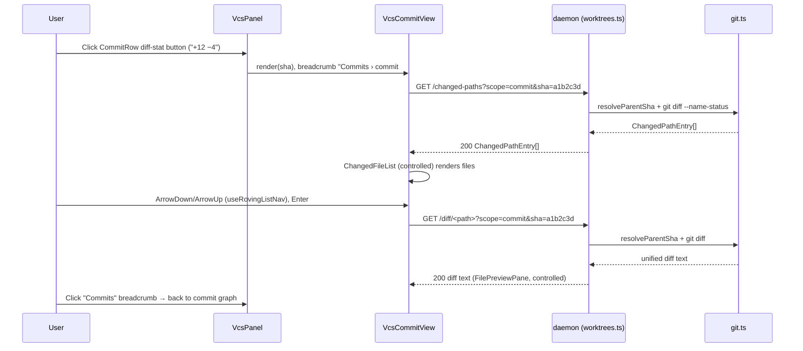

<!--
RULES — read before writing or implementing:
1. FORMAT: Bullets, tables, code, diagrams ONLY — no prose paragraphs
2. REQUIREMENTS: One crisp line each — no verbose descriptions
3. CHECKLIST: Mark items [x] as you complete them — this is your persistent todo list
4. READING TIME: Optimize for fast human scanning — if it's hard to skim, rewrite it
-->

# Plan: Desktop UI improvements (10-item batch)

> Ten scoped UI/UX fixes across the Files tab, VCS tab, session-creation dialogs, and worktree sidebar of the Tauri desktop shell. Root plan, no sub-features.

**Issue:** ui-improvements
**Branch:** `feat/ui-improvements`
**Status:** Pending
**PRD:** none — `.vibekit/reports/2026-09-07-ui-improvements-scoping.md` is the scoping substitute for this batch
**Parent:** none (root)

**Reference files:**
- Daemon WS watchers: `daemon/src/ws/connection.ts`, `daemon/src/ws/handlers/treeWatch.ts`, `daemon/src/ws/handlers/fileWatch.ts`, `daemon/src/ws/streams/fileWatcher.ts`
- Daemon HTTP routes: `daemon/src/routes/worktrees.ts`
- Daemon git service: `daemon/src/services/git.ts`
- UI layout/shell: `web-ui/src/components/layout/Layout.tsx`, `web-ui/src/components/layout/FileTreeSidebar.tsx`, `web-ui/src/components/layout/FilePreviewPane.tsx`, `web-ui/src/components/tools/FilesPanel.tsx`, `web-ui/src/components/tools/VcsPanel.tsx`
- Workspace store: `web-ui/src/hooks/useStore.ts`

---

## Problem & Concept

- Ten small, independently-reported UI papercuts and two genuine bugs (split-handle drag direction, WS watcher refcounting) accumulated in the desktop shell — see `.vibekit/reports/2026-09-07-ui-improvements-scoping.md` for the per-item root-cause research this plan is built on.
- Success state: all 10 items fixed, sharing 4 new reusable primitives (draft-persistence hook, focus/keyboard-nav hook, diff-scope selector component, master-detail diff shell) instead of 10 one-off patches — see Key Decisions 1–4.

### Commit Plan

- **Exactly two commits.** Commit 1 = every daemon-side change (Phases 1–3: WS watcher refcounting, `scope=commit` route support, new diffstat endpoint). Commit 2 = every `web-ui/` change (Phases 4–11).
- Commit 1 lands first — Phases 5, 7, 9, 10, 11 in `web-ui/` depend on daemon behavior added in Phases 1–3.
- Phase numbering is fine-grained for checklist/review purposes; each phase header states which commit it belongs to.

## Out of Scope

- Multi-file-tab support in the Files panel (`files-topbar__add` stays disabled) — unrelated pre-existing limitation.
- Live push-notification of new commits/PR state in `VcsPanel` (report's "Notable" section) — not one of the 10 items.
- Any change to the two-axis lifecycle/PR status model (`docs/STATUS-INDICATORS.md`) — untouched by this batch.
- Merge-commit combined-diff rendering for item 9's commit view — single-parent (`--first-parent`) diff only, see Decision 9.
- Renaming/consolidating `useComposerDraft` call sites in `Composer.tsx` — it keeps calling the same functions; only the *implementation* is generalized (Decision 1).

## Requirements

| # | Requirement |
|---|-------------|
| 1 | New-session/agent/tab dialogs persist their prompt text across close/reopen; cleared only on successful create |
| 2 | Dragging the split handle resizes the correct panel regardless of tools-on-top vs tools-on-side orientation |
| 3 | VCS tab header shows the worktree's own branch name |
| 4 | Files tree / Quick Open live-update on disk changes even when multiple consumers watch the same worktree concurrently |
| 5 | Open file preview live-updates on disk changes, including atomic rename-replace saves |
| 6 | File tree supports arrow-key navigation with a visible keyboard cursor, reusable by any future flat/tree file list |
| 7 | Plain (non-diff) file preview shows diff-stat and a local/branch scope toggle, matching diff mode |
| 8 | Diff view offers a rendered-markdown toggle for `.md` files, anchored to the same base-branch/fork-base concept already used by `scope==="branch"` |
| 9 | VCS tab supports opening a single commit's file list + diff, reusing the item-6 focus primitive and item-7/8 diff-scope machinery |
| 10 | Worktree sidebar rows show a `+N −N` line-count indicator against the base branch |
| 11 | All daemon changes ship in one commit before any web-ui change that depends on them |

---

## Change Map

```
daemon/src/ws/
  connection.ts                 ~ refcounted watcher maps
  handlers/treeWatch.ts         ~ retain-on-existing-watch
  handlers/treeUnwatch.ts       ~ release, close only at 0
  handlers/fileWatch.ts         ~ retain + parent-dir watch
  handlers/fileUnwatch.ts       ~ release, close only at 0
  streams/fileWatcher.ts        ~ + watchFile() parent-dir mode
daemon/src/routes/
  worktrees.ts                  ~ scope=commit&sha=, + diffstat route
daemon/src/services/
  git.ts                        ~ + getDiffStat(), EMPTY_TREE_SHA
web-ui/src/hooks/
  useDraftPersistence.ts        + generic keyed draft hook
  useComposerDraft.ts           ~ thin wrapper over the above
  useRovingListNav.ts           + shared arrow-key roving-cursor hook
  useStore.ts                   ~ + focusedPane slice
  useSubscription.ts            ~ + useWorktreeDiffStats
web-ui/src/api/
  types.ts                      ~ DiffScope + "commit", DiffStat type
  client.ts                     ~ + getDiffStat(), diff/changed-paths sha param
  mock.ts                       ~ mirrors client.ts additions
  repositories/worktreeRepository.ts  ~ + getDiffStat pass-through
web-ui/src/components/dialogs/
  NewAgentDialog.tsx            ~ draft persistence wiring
  NewSessionDialog.tsx          ~ draft persistence wiring
  NewTabDialog.tsx              ~ draft persistence wiring
web-ui/src/components/layout/
  Layout.tsx                    ~ Panel order prop fix
  FileTreeSidebar.tsx           ~ flattened rows, roving nav, scope selector extraction
  ChangedFileList.tsx           ~ controlled props, shared roving nav
  FilePreviewPane.tsx           ~ branch-scope fetch, controlled overrides, extra tree-watch dep
  DiffScopeSelector.tsx         + shared local/branch/commit chip UI
  MasterDetailShell.tsx         + shared tree-or-list + preview shell
  ToolPanel.tsx                 ~ threads worktree branch
  LeftSidebar.tsx               ~ +/- LOC indicator, diffstat polling
web-ui/src/components/tools/
  VcsPanel.tsx                  ~ branch chip, commit-view breadcrumb entry
  VcsCommitView.tsx             + commit-scoped master-detail view
  FilesPanel.tsx                ~ thin wrapper over MasterDetailShell
web-ui/src/components/preview/
  MarkdownView.tsx              (context only — reused as-is)
  DiffView.tsx                  ~ Source/Rendered toggle for .md
web-ui/src/routes/
  Workspace.tsx                 ~ threads worktree.branch into ToolPanel
web-ui/src/styles/
  workspace.css                 ~ + cursor/breadcrumb/diffstat/toggle classes
```

| Today | After this plan |
|-------|-----------------|
| New-session/agent/tab dialogs discard the typed prompt on cancel/close | Prompt is restored from localStorage on reopen; cleared only after a successful create |
| Dragging the split handle inverts direction when the tools panel is on top | Handle drag direction is always correct in both orientations |
| VCS tab header shows only "Commits (n)" | VCS tab header also shows a branch-name chip |
| Files tree / Quick Open sometimes stop live-updating when both are open | Both always live-update; watchers are refcounted so one consumer's unmount never kills another's |
| Open file preview stops live-updating after an atomic rename-replace save | Preview watches the parent directory and keeps live-updating across rename-replace saves |
| No keyboard navigation in the file tree | Arrow keys move a visible cursor; Enter opens, Left/Right collapse/expand |
| Plain file preview has no diff-stat or local/branch toggle | Plain preview shows the same diff-stat + scope toggle as diff mode |
| Diff view for `.md` files only shows raw diff text | Diff view offers a Source/Rendered toggle reusing the existing markdown renderer |
| VCS tab has no way to view one commit's changes in isolation | Clicking a commit opens a "Commits › commit #x" master-detail view scoped to that commit |
| Worktree sidebar rows show no line-count signal | Rows show a `+N −N` indicator against the base branch |

---

## Research

- `daemon/src/ws/handlers/treeWatch.ts:22-25` — `handleTreeWatch` no-ops (does NOT increment any count) if `tree:${worktreeId}:` is already registered.
- `daemon/src/ws/handlers/treeUnwatch.ts:17-22` — `handleTreeUnwatch` closes and deletes the watcher unconditionally, with no awareness of other consumers.
- `web-ui/src/hooks/useSubscription.ts:121-141` — `FileTreeSidebar` and Quick Open's `useWorktreeFiles` both call `useTreeWatch` for the same worktree/connection; whichever unmounts first tears down the shared watcher. **Root cause of item 4.**
- `daemon/src/ws/streams/fileWatcher.ts:19-45` — `FileWatcher.watch()` is always called with a single file's absolute path (`fileWatch.ts:35`).
  - Chokidar watching a single file path loses the inode on atomic rename-replace saves. **Root cause of item 5**, in addition to the same refcount bug (`file:watch`/`file:unwatch` share the exact no-op/unconditional-close pattern at `daemon/src/ws/handlers/fileWatch.ts:20-23` and `fileUnwatch.ts:16-21`).
- `web-ui/src/components/layout/Layout.tsx:239-273` — `topRow` contains FOUR `<Panel>` JSX literals, not two: tools/vertical (`:248`), agent/horizontal (`:252`), agent/vertical (`:261`), tools/horizontal (`:265`).
  - All four keep only two stable `key`s (`"agent"`/`"tools"`) across the orientation swap; React reconciles by key and reorders existing `Panel` instances instead of remounting, desyncing react-resizable-panels' internal registration order from DOM order. **Root cause of item 2.**
- `web-ui/src/components/layout/Layout.tsx:275-289` (`classicMainColumnInner`) — `dockWrapper()` (the `TerminalPane` region) is a sibling `<Panel>` of `{topRow}` inside this outer vertical `PanelGroup`, never nested inside `topRow` itself — a remount confined to `topRow`'s inner `PanelGroup` cannot unmount `TerminalPane` (see Risk #2, AGENTS.md's never-unmount invariant).
- `web-ui/src/routes/Workspace.tsx:402-408` — `ToolPanel` is already given `worktrees.find((w) => w.id === wtId)?.baseBranch`; the same lookup has `.branch` available for item 3.
- `web-ui/src/components/layout/FilePreviewPane.tsx:70-76` — `scope === "branch"` fetches only the diff and explicitly sets `fileBody` to `null`; no rendered-markdown or plain-file view is possible in branch scope today.
- `daemon/src/routes/worktrees.ts:1145-1151` (base-SHA resolution + 422 check) and `:1153-1164` (the `scope === "branch"` git-diff argv) — `git diff <baseSha> -- <path>` diffs `baseSha` against the **working tree** (uncommitted + committed), the same content `GET /files/*path` already serves from disk.
  - So branch-scope file content needs no new revision-aware fetch, just an unconditional `api.getFile` call alongside the existing diff fetch (see Decision 7).
- `web-ui/src/components/tools/VcsPanel.tsx:424` (`Diff from {baseBranch}`) and `FilePreviewPane.tsx:200` (`"Compared to fork base"`) — both already describe the same base-branch/fork-base concept; item 8's branch-scope content fetch must reuse it, not invent a second one.
- `web-ui/src/components/layout/FileTreeSidebar.tsx:70-168` (`TreeNode`) — children are loaded per-node inside `useEffect`; no flattened row list exists to run a keyboard cursor over.
  - **Confirms item 6 needs the children-loading hoist called out in the scoping report.**
- `web-ui/src/components/layout/FileTreeSidebar.tsx:360-381` — the local/branch chip group (`file-tree-scope-slot`/`file-tree-scope-chips`) is a self-contained block, distinct from the separate diff-mode toggle button at `:383-394` (`file-tree-diff-toggle`) — only `:360-381` is the extraction target for Decision 3.
- `web-ui/src/styles/workspace.css:157-221` — `.file-tree-scope-slot`/`.file-tree-diff-toggle`/`.file-tree-scope-chips`/`.file-tree-scope-chip` already exist and are reused as-is by the extracted `DiffScopeSelector`; `:706-742` (`.wt-row__id`) and `:4127-4135` (`.vcs-graph__add`/`.vcs-graph__del`) and `:4580-4608` (`.preview-diffinfo*`) are the other existing classes this plan's new UI sits alongside (new classes named per-feature in Decisions 2, 3, 4, and 11 below).
- `web-ui/src/hooks/useStore.ts` — no `focusedPane`/cursor slice exists; `diffScopeByWorktree: Record<string, DiffScope>` (`useStore.ts:170`) is the only relevant existing slice, keyed per worktree, Files-tab-only.
- `web-ui/src/components/tools/VcsPanel.tsx:479` — `<CommitRow key={c.sha} ...>` render site; `CommitLogEntry` (`web-ui/src/api/types.ts`) carries `sha`, `insertions`, `deletions` already.
- `daemon/src/services/git.ts:208-240` (`resolveBaseSha`) — already implements the origin-vs-local merge-base comparison; item 10's diffstat must call this same function, not re-derive a base SHA.
- `daemon/src/services/git.ts` — no `--shortstat` helper exists; `listCommits` only does per-commit `--numstat` (L498-513). **Confirms item 10 needs a new git.ts helper + new daemon route.**
- `web-ui/src/components/layout/LeftSidebar.tsx:1126` and `:1693` — the two `wt-row__id` render sites (pinned + regular worktree rows) are where the LOC indicator renders; sites at L1015/L1272/L1543 are direct-session/menu-trigger rows without a `wt-row__id`, out of scope for this indicator.
- `daemon/src/ws/connection.ts:194,208` (`unregisterFileWatcher`/`unregisterTreeWatcher`) — called only from each watcher's own `error` listener at `daemon/src/ws/handlers/treeWatch.ts:67` and `fileWatch.ts:61`, unconditionally deleting the map entry.
  - Under refcounting these two call sites fire when the ONE shared watcher instance for a key has died — every retainer loses service regardless of `refCount`, so this path must stay an unconditional force-removal, not a decrement (see Decision 8).
- `package.json:8-14` and `cli/package.json:9-16` — daemon tests run via `pnpm --filter @vibestation/cli test` (vitest, `cli/vitest.config.ts` picks up `daemon/src` through the `cli/src/daemon` symlink); web-ui unit tests via `pnpm --filter @vibestation/web test`; e2e via `pnpm --filter @vibestation/web test:e2e`.
- `web-ui/src/hooks/useComposerDraft.test.ts`, `useTreeWatch.test.ts`, `useFileWatch.test.ts`, `useSubscription.test.ts`, and `web-ui/src/components/layout/{FileTreeSidebar,Layout,LeftSidebar}.test.tsx` + `web-ui/src/components/tools/VcsPanel.test.tsx` all already exist — verify items below extend these files by name rather than proposing new ones.
- `web-ui/src/api/repositories/worktreeRepository.ts` (landed on `main` after this plan's first draft, commit `67ffa4d`) wraps `getDiff`, `tree`, `fileList`, `listChangedPaths`, `listCommits`, `getPr`, `listSubmodules` as identity pass-throughs of the `ApiInstance` singleton — but per that commit's own scope note ("no component-prop changes"), `FilePreviewPane.tsx`, `VcsPanel.tsx`, `FileTreeSidebar.tsx`, `ChangedFileList.tsx`, and `FilesPanel.tsx` still take `api: ApiInstance` directly and call `api.getFile`/`api.getDiff`/`api.listChangedPaths`/`api.getPr`/`api.listCommits` unchanged (verified: none of these five files import anything from `@/api/repositories`).
  - **No call-site updates needed anywhere in this plan** — every direct `api.*` call this plan cites or adds stays a direct call, matching the current codebase's own convention for these components.
  - The repository IS extended for consistency: `getDiffStat` (this plan's new endpoint, item 10) is a sibling worktree-domain read alongside `getDiff`/`listChangedPaths`/`listCommits` already listed there, so it is added to `createWorktreeRepository`'s object literal even though no consumer routes through it yet (see Decision 11).
- **Root cause (items 4/5):** `WSConnection.treeWatches`/`fileWatches` (`daemon/src/ws/connection.ts:39-40`) store one watcher per key with no reference count, so the first consumer to unwatch tears down a watcher a second consumer still depends on.
- **Root cause (item 2):** stable React keys across a JSX-order swap cause a reorder-in-place instead of a remount, desyncing `react-resizable-panels`' registration order from DOM order.

---

## Architecture Diagram

```mermaid
flowchart LR
    subgraph Browser [web-ui]
        FTS[FileTreeSidebar] -- tree:watch/unwatch --> WSC
        FPP[FilePreviewPane] -- file:watch/unwatch --> WSC
        QO[Quick Open / useWorktreeFiles] -- tree:watch/unwatch --> WSC
        VCS[VcsPanel] -- GET /commits, /pr --> HTTP
        VCSCV[VcsCommitView] -- "GET /diff?scope=commit&sha=" --> HTTP
        VCSCV -- "GET /changed-paths?scope=commit&sha=" --> HTTP
        LS[LeftSidebar] -- "GET /diffstat" --> HTTP
        MDS[MasterDetailShell] --> FTS
        MDS --> FPP
    end
    subgraph Daemon [daemon]
        WSC[WSConnection\nrefcounted watcher maps]
        WSC --> FW[FileWatcher\nwatch() / watchFile()]
        HTTP[worktrees.ts routes]
        HTTP --> GIT[git.ts\nresolveBaseSha / getDiffStat]
    end
    FW -- chokidar --> DISK[(worktree filesystem)]
    GIT -- spawnSync git --> DISK
```

---

## Design Details

### System Boundaries

| Boundary | Fields + types | Errors | Source of truth |
|----------|----------------|--------|-----------------|
| WS client ↔ daemon: `tree:watch`/`tree:unwatch` | `{ type, worktreeId: string, path?: string }` — **unchanged wire shape**, only server-side refcounting changes | `system:error { message }` | Daemon (`WSConnection.treeWatches`) |
| WS client ↔ daemon: `file:watch`/`file:unwatch` | `{ type, worktreeId: string, path: string }` — **unchanged wire shape** | `system:error { message }` | Daemon (`WSConnection.fileWatches`) |
| Frontend ↔ Backend: `GET /worktrees/:id/diff/*path` | Query: `scope: "local"\|"branch"\|"commit"`, `sha?: string` (required iff `scope==="commit"`) → `text/plain` unified diff | `404 Worktree not found` · `422 { error: "diff_too_large"\|"binary"\|"Could not resolve base branch fork point"\|"Could not resolve commit sha" }` · `500` | Daemon, computed on demand (no cache beyond ETag) |
| Frontend ↔ Backend: `GET /worktrees/:id/changed-paths` | Query: `scope: "local"\|"branch"\|"commit"`, `sha?: string` (required iff `scope==="commit"`) → `ChangedPathEntry[]` | `404` · `422 { error }` · `500` | Daemon |
| Frontend ↔ Backend: `GET /worktrees/:id/diffstat` *(new)* | Query: `scope: "branch"` (only value supported) → `{ insertions: number, deletions: number }` | `404 Worktree not found` · `422 { error: "Could not resolve base branch fork point" }` | Daemon, computed on demand |
| Module ↔ Module: `useDraftPersistence(key)` | `save(text: string): void`, `clear(): void`; initial value via `loadDraft(key): string` | none (best-effort localStorage, silently no-ops on failure) | Client-side `localStorage`, per browser |
| Module ↔ Module: `useRovingListNav(rows, opts)` | `rows: { path: string; expandable?: boolean }[]`, `opts: { onOpen(path), onToggle?(path) }` → `{ cursorPath: string\|null, setCursorPath, handleKeyDown(e) }` | none (pure client state) | Caller-owned (not persisted) |
| Module ↔ Module: `useWorkspaceStore.focusedPane` | `focusedPane: string \| null`, `setFocusedPane(id: string \| null): void` | none | Zustand store (`useStore.ts`), not persisted (transient UI focus) |

### Critical User Journeys (CUJs)

#### CUJ 1 — Draft persistence (item 1)

```
User opens "New Agent" dialog, types a prompt
  → useDraftPersistence(key).save(text) debounce-writes to localStorage every keystroke (400ms)
  → User accidentally closes the dialog (Escape / outside click)
  → User reopens "New Agent"
  → useState(() => loadDraft(key)) seeds the prompt textarea with the saved text
  → User submits successfully
  → onCreated handler fires clear() → localStorage key removed
```

- **Error path:** submit fails (network/validation) → draft is NOT cleared, so the text survives another retry.
- **Edge case:** `NewAgentDialog`'s key depends on `projectId ?? "new"` — starting a fresh (no project selected yet) draft and later selecting a project does NOT retroactively merge the two drafts; acceptable per Decision 1.

#### CUJ 2 — Commit quick-diff view (item 9)



- **Error path:** `sha` not found in the worktree's history → both routes return `422 { error: "Could not resolve commit sha" }`; `VcsCommitView` shows an inline error state, breadcrumb stays clickable to go back.
- **Edge case:** root commit (no parent) → diff is computed against the empty-tree SHA (Decision 9), not `<sha>^1`, which would otherwise fail to resolve.

### Data Model

- No persisted entities are added or changed.
  - `localStorage` keys (not a DB, but the closest analog) are the only client-side state this plan adds:

| Key | Written by | Cleared |
|-----|-----------|---------|
| `vst-newagent-draft-${projectId ?? "new"}` | `NewAgentDialog.tsx` via `useDraftPersistence` | On successful create |
| `vst-newsession-draft-${projectId}` | `NewSessionDialog.tsx` via `useDraftPersistence` | On successful create |
| `vst-newtab-draft-${worktreeId}` | `NewTabDialog.tsx` via `useDraftPersistence` | On successful create |
| `vst-chat-draft-${sessionId}` | `useComposerDraft` (unchanged, now backed by the generic hook) | On send |

- **Migration:** N — no schema, no backfill; new keys simply don't exist until first write.

### API Contracts

```
GET /worktrees/:id/diff/*path?scope=local|branch|commit&sha=<sha>
  Request:  scope=commit requires sha (40-char full or abbreviated hex)
  Response: text/plain unified diff body (ETag-cached, same as today for local/branch)
  Errors:   404 Worktree not found
            422 { error: "diff_too_large" | "binary" | "Could not resolve base branch fork point" | "Could not resolve commit sha", message, path }
            500 { error: string }
  (local/branch behavior UNCHANGED — only the commit branch is new)

GET /worktrees/:id/changed-paths?scope=local|branch|commit&sha=<sha>
  Request:  scope=commit requires sha
  Response: ChangedPathEntry[] = { path: string, status: "M"|"A"|"D"|"R"|"?" }[]
  Errors:   404 Worktree not found
            422 { error: "Could not resolve base branch fork point" | "Could not resolve commit sha" }
            500 { error: string }
  (local/branch behavior UNCHANGED — only the commit branch is new)

GET /worktrees/:id/diffstat?scope=branch
  Request:  scope is currently required and must be "branch" (no other value supported)
  Response: { insertions: number, deletions: number }
  Errors:   404 Worktree not found
            422 { error: "Could not resolve base branch fork point" }
  Auth/pagination: none — mirrors the existing diff/changed-paths routes (session-cookie auth, no pagination)
```

### Key Decisions

#### Decision 1: Generalize `useComposerDraft` into a keyed `useDraftPersistence` hook

- **Decision:** Extract the debounced-localStorage save/clear logic into `web-ui/src/hooks/useDraftPersistence.ts`, parameterized by a full storage key (not a session id).
  - `useComposerDraft.ts` becomes a 6-line wrapper that composes its existing `vst-chat-draft-${sessionId}` key and re-exports `loadDraft`/`useComposerDraft` unchanged, so `Composer.tsx` needs zero changes.
- **Rationale:** the existing hook (`web-ui/src/hooks/useComposerDraft.ts:1-83`) already has the exact debounce/flush/localStorage shape all three dialogs need — only the key composition differs per caller.
- **Where:** `web-ui/src/hooks/useDraftPersistence.ts` (new), `web-ui/src/hooks/useComposerDraft.ts` (thin wrapper), `NewAgentDialog.tsx`, `NewSessionDialog.tsx`, `NewTabDialog.tsx` (call sites).

```ts
// useDraftPersistence.ts — generic version; useComposerDraft.ts becomes:
//   const chatKey = (sessionId: string) => `vst-chat-draft-${sessionId}`;
//   export function loadDraft(sessionId: string) { return loadDraftGeneric(chatKey(sessionId)); }
//   export function useComposerDraft(sessionId: string) { return useDraftPersistence(chatKey(sessionId)); }
export function loadDraft(key: string): string { /* same body as today, param renamed */ }
export function useDraftPersistence(key: string): { save(text: string): void; clear(): void } { /* same body, param renamed */ }
```

- Dialog call sites: `useState(() => loadDraft(\`vst-newagent-draft-${selectedProject?.id ?? "new"}\`))` for the prompt initializer, `const { save, clear } = useDraftPersistence(sameKey)`; `save(text)` on every `setPrompt` call; `clear()` in the `onCreated`/success branch only — never in `reset()`/`handleClose()` (which today explicitly discards, per Research).

#### Decision 2: Roving-cursor keyboard nav as a shared, list-shape-agnostic hook

- **Decision:** New `web-ui/src/hooks/useRovingListNav.ts` exports `useRovingListNav(rows: { path: string; expandable?: boolean }[], opts: { onOpen: (path: string) => void; onToggle?: (path: string) => void })`, returning `{ cursorPath, setCursorPath, handleKeyDown }`.
  - `FileTreeSidebar.tsx` flattens its recursive `TreeNode` render into a `visibleRows` array (hoisting per-node children-loading into a `childrenByPath: Map<string, TreeEntry[]>` state map owned by `FileTreeSidebar` itself) and calls this hook once.
  - `ChangedFileList.tsx`'s existing bespoke `handleKeyDown` (`ChangedFileList.tsx:93-109`) is deleted and replaced by the same hook over its already-flat `visibleFiles`.
  - The cursor is visually rendered via new `workspace.css` classes `.tree-row--cursor` (FileTreeSidebar rows) and `.changed-file-list-file--cursor` (ChangedFileList rows), applied when `row.path === cursorPath` — satisfies Requirement 6's "visible keyboard cursor" (see Files & Phase Impact, `workspace.css`).
- **Rationale:** item 9's commit file list is `ChangedFileList` reused verbatim — sharing the hook (not copying it) is what requirement (b) of the batch demands; a flat-row abstraction covers both the tree (item 6) and the already-flat changed-file list (item 9) with one implementation.
- **Where:** `web-ui/src/hooks/useRovingListNav.ts` (new), `web-ui/src/components/layout/FileTreeSidebar.tsx` (flatten + wire), `web-ui/src/components/layout/ChangedFileList.tsx` (swap in).

```ts
// Left/Right only make sense for tree rows (expand/collapse); ChangedFileList
// passes expandable: false for every row, so Left/Right are no-ops there —
// same hook, different row shape, no branching on "am I a tree" inside it.
function handleKeyDown(e: KeyboardEvent) {
  const idx = rows.findIndex((r) => r.path === cursorPath);
  if (e.key === "ArrowDown") { setCursorPath(rows[idx + 1]?.path ?? cursorPath); e.preventDefault(); }
  if (e.key === "ArrowUp") { setCursorPath(rows[idx - 1]?.path ?? cursorPath); e.preventDefault(); }
  if (e.key === "ArrowRight" && rows[idx]?.expandable) opts.onToggle?.(rows[idx].path);
  if (e.key === "ArrowLeft" && rows[idx]?.expandable) opts.onToggle?.(rows[idx].path);
  if (e.key === "Enter") opts.onOpen(cursorPath!);
}
```

- `focusedPane: string | null` + `setFocusedPane` added to `useWorkspaceStore` (`useStore.ts`) — set on `onPointerDown`/`onFocusCapture` of each pane wrapper (`FileTreeSidebar`'s root, `ChangedFileList`'s root).
  - Not consumed by anything in this plan directly — it is the hook point future global hotkeys (`useWorkspaceKeyboardShortcuts.ts`) need to avoid double-handling arrow keys, kept in scope only as a slice addition per Requirement 6's "reusable by any future flat/tree file list" (see Risk #4).

#### Decision 3: One `DiffScopeSelector` component for local/branch (Files tab + plain preview) and commit (VCS tab)

- **Decision:** Extract `FileTreeSidebar.tsx:360-381`'s inline local/branch chip JSX (NOT the separate diff-mode toggle button at `:383-394`) into `web-ui/src/components/layout/DiffScopeSelector.tsx`, taking `{ scope: DiffScope; onChange?: (s: DiffScope) => void; baseBranch?: string; commitLabel?: string }`.
  - Reuses the existing `.file-tree-scope-slot`/`.file-tree-scope-chips`/`.file-tree-scope-chip` classes (`workspace.css:157-221`) unchanged for local/branch mode.
  - When `scope === "commit"`, it renders a read-only breadcrumb chip (`commitLabel`, e.g. `"commit #a1b2c3d"`) via two new classes, `.diff-scope-selector__breadcrumb` and `.diff-scope-selector__back`, instead of clickable local/branch buttons — same component, no `onChange` needed in that mode.
  - Rendered in TWO places: `FileTreeSidebar.tsx`'s header (replacing the inline chips, Files-tab tree/list view) AND `FilePreviewPane.tsx`'s `diffInfo` strip (new — Requirement 7's "local/branch scope toggle" in plain-file mode, see Decision 4 below), both writing to the same `diffScopeByWorktree` slice via `setDiffScopeForWorktree` so tree and preview always agree on scope.
- **Rationale:** requirement (c) — one shared selector, not two divergent toggle implementations; `VcsCommitView`'s breadcrumb IS a `DiffScope` presentation, just a non-interactive one.
- **Where:** `web-ui/src/components/layout/DiffScopeSelector.tsx` (new), `FileTreeSidebar.tsx` (use it in place of inline chips), `FilePreviewPane.tsx` (render it in the `diffInfo` strip, Phase 9), `VcsCommitView.tsx` (use it for the breadcrumb).

#### Decision 4: Plain-file preview gets diff-stat + the same `DiffScopeSelector`, not a second toggle

- **Decision:** `FilePreviewPane.tsx`'s `scope === "none"` fetch branch (`:55-60`) changes to fetch `Promise.all([api.getFile(worktreeId, path, fileScope), api.getDiff(worktreeId, path, "local").catch(() => null)])`, populating both `fileBody` and `diffBody` (the diff fetch is best-effort — an untracked/non-git file must not block the plain preview on a diff failure).
  - The `diffStats` memo's guard at `:153` (`if (scope !== "local" && scope !== "branch") return null;`) is relaxed to also allow `scope === "none"` through, so plain mode gets a non-null `diffStats` from the same `summarizeDiffLines` computation diff/branch mode already uses — called out as its own phase item (9.4), not folded into the fetch change, since it is a separate one-line guard edit.
  - The `diffInfo` strip (`:190-203`, currently gated to `scope === "local" || scope === "branch"`) renders unconditionally instead, with a `<DiffScopeSelector scope={scope} onChange={...} baseBranch={...} />` mounted inside it so plain mode shows the same local/branch toggle diff mode has.
- **Rationale:** Requirement 7 requires BOTH diff-stat and a scope toggle in plain mode — reusing `DiffScopeSelector` (Decision 3) instead of a second bespoke toggle keeps one selector implementation across both the Files-tab tree and the preview pane.
- **Where:** `web-ui/src/components/layout/FilePreviewPane.tsx:55-60,153,190-203`.

#### Decision 5: One `MasterDetailShell` for the Files tab and the VCS commit view

- **Decision:** Extract `FilesPanel.tsx`'s topbar + `PanelGroup(tree, preview)` shell into `web-ui/src/components/layout/MasterDetailShell.tsx`, taking `{ storageKey: string; treeToggle?: boolean; leftPane: ReactNode; rightPane: ReactNode; topbarExtra?: ReactNode }`.
  - `FilesPanel.tsx` becomes a thin wrapper passing `<FileTreeSidebar>` + `<FilePreviewPane>`.
  - New `web-ui/src/components/tools/VcsCommitView.tsx` passes a controlled `<ChangedFileList>` + controlled `<FilePreviewPane>`, with `topbarExtra` carrying the "Commits › commit #x" breadcrumb (built from `DiffScopeSelector`, Decision 3) inside a new `.files-topbar__breadcrumb` class (reuses `.files-topbar`'s existing flex layout, `workspace.css`).
- **Rationale:** requirement (d) — one shell, parameterized by scope, not a second bespoke master-detail UI for item 9.
- **Where:** `web-ui/src/components/layout/MasterDetailShell.tsx` (new), `web-ui/src/components/tools/FilesPanel.tsx` (refactor), `web-ui/src/components/tools/VcsCommitView.tsx` (new).

#### Decision 6: `FilePreviewPane` and `ChangedFileList` need controlled-mode overrides for reuse outside the Files tab

- **Decision:** Both components add an optional `controlled` prop that, when present, bypasses the global `useWorkspaceStore` slices (`activeFilePath`, `diffScopeByWorktree`) they otherwise read/write, so `VcsCommitView` doesn't clobber the Files tab's own open file / diff scope.
  - `FilePreviewPane`: `controlled?: { path: string | null; scope: DiffScope; commitSha?: string }` — when set, `path`/`scope` come from props instead of the store, and the data-fetch effect passes `commitSha` through to `api.getDiff`/`api.getFile` as needed.
  - `ChangedFileList`: `controlled?: { activePath: string | null; onSelect: (path: string) => void }` — when set, clicking/keying a row calls `onSelect` instead of `setActiveFile`/`setToolPanelTab`.
- **Rationale:** the Files tab and the VCS commit view are two independent "which file is open" contexts; sharing the global store slice between them would make opening a file in one silently steal focus from the other.
- **Where:** `web-ui/src/components/layout/FilePreviewPane.tsx` (props + effect), `web-ui/src/components/layout/ChangedFileList.tsx` (props + handlers), `web-ui/src/components/tools/VcsCommitView.tsx` (owns its own `useState<string | null>` for the open path).

#### Decision 7: Branch-scope preview fetches file content unconditionally, no new revision-aware endpoint

- **Decision:** In `FilePreviewPane.tsx`'s data-fetch effect (`FilePreviewPane.tsx:70-76`), the `scope === "branch"` branch changes from diff-only to `Promise.all([api.getFile(worktreeId, path), api.getDiff(worktreeId, path, "branch")])`, mirroring the existing `scope === "local"` branch exactly.
- **Rationale:** `git diff <baseSha> -- <path>` (`daemon/src/routes/worktrees.ts:1145-1151,1153-1164`) already diffs the base SHA against the **working tree**, which is exactly what `GET /files/*path` serves from disk — see Research.
  - No daemon change, no new revision parameter needed.
  - Keeps item 8 anchored to the one base-branch/fork-base concept `VcsPanel`/`FilePreviewPane` already expose (per the report's branch-scope note), rather than introducing a second notion of "branch content."
- **Where:** `web-ui/src/components/layout/FilePreviewPane.tsx:61-76`.

#### Decision 8: WS watcher refcounting — retain/release pair, close only at zero

- **Decision:** `WSConnection.treeWatches`/`fileWatches` change from `Map<string, unknown>` to `Map<string, { watcher: unknown; refCount: number }>`. Replace the no-op-on-exists / unconditional-close pattern with explicit retain/release:

```ts
// connection.ts — same shape for tree and file watchers
retainTreeWatcher(key: string): boolean {
  const e = this.treeWatches.get(key);
  if (!e) return false;
  e.refCount += 1;
  return true; // caller: already watching, do nothing further
}
registerTreeWatcher(key: string, watcher: unknown): void {
  this.treeWatches.set(key, { watcher, refCount: 1 }); // first watcher for this key
}
releaseTreeWatcher(key: string): unknown | null {
  const e = this.treeWatches.get(key);
  if (!e) return null;
  e.refCount -= 1;
  if (e.refCount > 0) return null;      // still referenced — keep watching
  this.treeWatches.delete(key);
  return e.watcher;                      // caller: actually close this
}
```

- `handleTreeWatch` (`treeWatch.ts:21-25`) becomes `if (conn.retainTreeWatcher(watchKey)) return;` before creating a new watcher.
- `handleTreeUnwatch` (`treeUnwatch.ts:17-22`) becomes `const w = conn.releaseTreeWatcher(watchKey); if (w) await (w as FileWatcher).close();`.
- `cleanup()` (`connection.ts:242-263`) destructures `.watcher` from each map entry instead of using the entry directly (connection teardown closes everything regardless of refcount).
- Identical shape for `fileWatches`/`registerFileWatcher`/`retainFileWatcher`/`releaseFileWatcher`.
- **`unregisterTreeWatcher`/`unregisterFileWatcher` (`connection.ts:194,208`) are UNCHANGED in behavior, only in the map-entry shape they operate on.** They stay an unconditional force-delete (extracting `.watcher` from the new `{watcher, refCount}` entry before deleting it), NOT a decrement like `release*`.
  - They are called only from each watcher's own `error` listener (`treeWatch.ts:67`, `fileWatch.ts:61`) — at that point the ONE shared watcher instance for the key has died, so there is no live watcher left to serve ANY retainer regardless of `refCount`; forcing full teardown is correct there, and is intentionally distinct from `release*Watcher`'s per-consumer decrement used by normal `tree:unwatch`/`file:unwatch` handling.
- **Rationale:** this is the smallest change that fixes the "one consumer's unmount kills another's watcher" bug (Research) without changing the WS wire protocol at all.
- **Where:** `daemon/src/ws/connection.ts` (retain/register/release AND unregister, all four watcher methods), `daemon/src/ws/handlers/treeWatch.ts` (retain-before-create at `:21-25`, no change to the `error` handler's `unregisterTreeWatcher` call at `:67`), `treeUnwatch.ts`, `fileWatch.ts` (retain-before-create, no change to the `error` handler's `unregisterFileWatcher` call at `:61`), `fileUnwatch.ts`.

#### Decision 9: Commit-scope diff uses `<sha>^1`, falling back to the empty-tree SHA for root commits

- **Decision:** New `scope === "commit"` branch in both `GET /worktrees/:id/diff/*path` and `GET /worktrees/:id/changed-paths` resolves the parent as `<sha>^1`.
  - If that ref fails to resolve (root commit), fall back to the well-known empty-tree SHA `4b825dc642cb6eb9a060e54bf8d69288fbee4904` (`git hash-object -t tree /dev/null`) as the "before" side.
  - Diff command: `git diff <parentSha> <sha> -- <path>` (content) / `git diff --name-status <parentSha> <sha>` (changed-paths) — same `spawnSync` + ETag + size/binary-guard pattern already used by the `local`/`branch` branches (`worktrees.ts:1130-1220`).
- **Rationale:** matches `listCommits`' existing `--diff-merges=first-parent` semantics (`git.ts:510`) for merge commits, and the empty-tree-SHA trick is the standard way to diff a root commit without special-casing every git subcommand.
- **Where:** `daemon/src/routes/worktrees.ts` (both routes' new `scope === "commit"` branch), `daemon/src/services/git.ts` (export `EMPTY_TREE_SHA` constant + a small `resolveParentSha(repoPath, sha)` helper used by both routes).

#### Decision 10: Split-handle fix via `Panel`'s `order` prop, applied to all four `topRow` Panels

- **Decision:** `Layout.tsx:239-273`'s `topRow` contains FOUR `<Panel>` JSX literals, not two — one per orientation × role combination, only two of which render at once (the `vertical ?` ternary picks one from each pair):
  - `:248` tools Panel, vertical branch → add `order={1}` (tools renders first when stacked)
  - `:252` agent Panel, horizontal branch → add `order={1}` (agent renders first when side-by-side)
  - `:261` agent Panel, vertical branch → add `order={2}` (agent renders second when stacked)
  - `:265` tools Panel, horizontal branch → add `order={2}` (tools renders second when side-by-side)
  - Each literal only ever renders under its own fixed `vertical` value, so each gets a fixed `order` literal — no ternary needed inside `order` itself. Existing `key="agent"`/`key="tools"` stay unchanged.
  - `react-resizable-panels` uses `order` (not JSX/DOM position) to resolve conditional panel ordering — this is its documented mechanism for exactly this "same panels, different order per condition" case.
- **Rationale:** avoids the report's remount-based alternatives (which would drop the `autoSaveId`-persisted layout mid-toggle); `order` is the library's purpose-built fix.
- **Where:** `web-ui/src/components/layout/Layout.tsx:248,252,261,265` (all four `<Panel>` elements inside `topRow`'s array).

#### Decision 11: Diffstat polling batched once per sidebar render, not per row

- **Decision:** New `useWorktreeDiffStats(api, worktreeIds: string[]): Record<string, { insertions: number; deletions: number } | null>` hook (`web-ui/src/hooks/useSubscription.ts`) runs a single `setInterval(30_000)` in `LeftSidebar.tsx`, `Promise.all`-fetching `api.getDiffStat(id)` for every visible worktree id, storing results in one `Record`.
  - Each `wt-row__id` render site reads `diffStats[w.id]` instead of owning its own poll, rendering a new `.wt-row__diffstat` wrapper span immediately before `wt-row__id` whose `+`/`−` children reuse the existing `.vcs-graph__add`/`.vcs-graph__del` text-color classes (`workspace.css:4127-4135`).
- **Rationale:** N worktree rows each running their own interval would mean N concurrent daemon calls every tick for no benefit — one batched poll matches the PR poller's existing 30s cadence (`docs/STATUS-INDICATORS.md`) without adding daemon load.
- `web-ui/src/api/repositories/worktreeRepository.ts`'s `createWorktreeRepository` gets `getDiffStat: api.getDiffStat,` added to its object literal, alongside the other worktree-domain reads (`getDiff`, `tree`, `fileList`, `listChangedPaths`, `listCommits`, `getPr`, `listSubmodules`) it already lists — see Research.
  - `LeftSidebar.tsx` itself still calls `api.getDiffStat` directly through `useWorktreeDiffStats(api, ...)`, matching every other component this plan touches; the repository addition is for API-surface consistency, not because any consumer routes through it.
- **Where:** `web-ui/src/hooks/useSubscription.ts` (new hook), `web-ui/src/components/layout/LeftSidebar.tsx` (call site + the two `wt-row__id` render sites at the pinned-worktree and regular-worktree rows), `web-ui/src/api/repositories/worktreeRepository.ts` (add `getDiffStat` to the pass-through list), `web-ui/src/api/repositories/worktreeRepository.test.ts` (add `"getDiffStat"` to the identity-forwarding method list).

---

## Risks / Open Questions

| # | Question | Notes |
|---|----------|-------|
| 1 | **Does `FileWatcher.watchFile()`'s parent-dir + filter approach hold up for deeply nested files with many siblings?** | Default decision: yes — `depth: 0` on the parent dir keeps the watch cheap (siblings are filtered out in the event handler by exact path match, same ignore-matcher reused), no different from watching the file directly in cost. |
| 2 | **Does `order` on `react-resizable-panels@^3.0.6`'s `<Panel>` definitely fix the reorder-in-place bug, or does it need a `PanelGroup`-level key too?** | Default decision: `order` alone per the library's docs for conditional panel ordering; if verification (Phase 5) shows drag direction is still wrong, fall back to keying the `topRow` `PanelGroup` (`Layout.tsx:241`) by `toolSplitOrientation` (forces a remount of just that inner `PanelGroup`'s Panels/handle, `autoSaveId` still restores the persisted split size). This fallback is safe against the AGENTS.md TerminalPane-never-unmounts invariant: `dockWrapper()` (renders `TerminalPane`) is a sibling `<Panel>` of `{topRow}` inside the OUTER `PanelGroup` in `classicMainColumnInner` (`Layout.tsx:275-289`), never nested inside `topRow`'s own `PanelGroup` — remounting `topRow`'s inner `PanelGroup` cannot reach `dockWrapper()`/`TerminalPane` (verified against the live file, see Research). |
| 3 | **Root-commit empty-tree fallback (Decision 9) — does `git diff <parent> <sha>` behave identically to `git show <sha>` for a merge commit's first-parent view?** | Default decision: yes, since both resolve to `git diff A B` once the parent is known; merge commits are already excluded from "the branch's own commits" grouping upstream by `--diff-merges=first-parent`, so this plan doesn't special-case merges further. |
| 4 | **`focusedPane` slice (Decision 2) has no consumer in this plan beyond the two pane wrappers setting it — is it dead weight?** | Default decision: keep it — it's the documented hook point for future global-hotkey/arrow-key conflict resolution (Requirement 6's "reusable by any future… list"); adding the slice now costs one field + one setter. |

---

## Implementation Phases

### Phase 1 — WS watcher refcounting *(commit 1: daemon)*

- [x] **1.1** `daemon/src/ws/connection.ts`: change `fileWatches`/`treeWatches` to `Map<string, { watcher: unknown; refCount: number }>`; add `retainFileWatcher`/`releaseFileWatcher`/`retainTreeWatcher`/`releaseTreeWatcher`; update `cleanup()` to destructure `.watcher` (Decision 8)
- [x] **1.2** `daemon/src/ws/handlers/treeWatch.ts`: call `conn.retainTreeWatcher(watchKey)` before creating a new watcher; only `registerTreeWatcher` on a genuinely new key
- [x] **1.3** `daemon/src/ws/handlers/treeUnwatch.ts`: replace unconditional close with `releaseTreeWatcher`, closing only the returned watcher
- [x] **1.4** `daemon/src/ws/handlers/fileWatch.ts`: mirror 1.2 for file watchers, plus switch to `watcher.watchFile(absPath, worktreeRoot)` (1.5)
- [x] **1.5** `daemon/src/ws/streams/fileWatcher.ts`: add `watchFile(absPath: string, worktreeRoot: string): void` — watches `dirname(absPath)` with `depth: 0` and the existing ignore matcher, filters chokidar `add`/`change`/`unlink` events to `path === absPath` before emitting `file:changed`/`file:deleted`
- [x] **1.6** `daemon/src/ws/handlers/fileUnwatch.ts`: mirror 1.3 for file watchers
- [x] **1.7** `daemon/src/ws/connection.ts`: update `unregisterTreeWatcher`/`unregisterFileWatcher` (`:194,208`) to destructure `.watcher` from the new `{watcher, refCount}` entry before deleting, keeping their existing unconditional-delete behavior (Decision 8) — no signature change for callers
- [x] **1.8** `daemon/src/ws/handlers/treeWatch.ts:67` and `fileWatch.ts:61`: confirm the `error`-handler's `conn.unregisterTreeWatcher(watchKey)`/`conn.unregisterFileWatcher(watchKey)` calls need no code change (they already call with just `watchKey`); add a comment noting this is the force-teardown path, distinct from `release*Watcher`

**Verify phase 1:**
- [x] **1.T1** Unit — `connection.test.ts` (new): `retainTreeWatcher` returns `false` for an unknown key and `true` (without creating a second watcher) for an existing one; `releaseTreeWatcher` returns `null` while `refCount > 0` and the watcher instance once it hits 0
- [x] **1.T2** Unit — `fileWatcher.test.ts` (new or extended): `watchFile()` fires `file:changed` only for events matching the exact watched path, not sibling files in the same parent dir
- [x] **1.T3** Integration — one simulated `WSConnection` sends `tree:watch` for the same worktree twice (simulating `FileTreeSidebar` + Quick Open both watching on one browser tab/connection), then one `tree:unwatch`; assert the underlying chokidar watcher is still open (`treeWatches` map still has the key, `refCount === 1`) until the second `tree:unwatch` actually closes it
- [x] **1.T4** Regression — `pnpm --filter @vibestation/cli test` passes with no changes to existing `daemon/src/__tests__/*` watcher-adjacent tests
- [x] **1.T5** Unit — `connection.test.ts`: with `refCount === 2` on a key, simulate the watcher's own `error` event calling `unregisterTreeWatcher`; assert the map entry is fully removed (not merely decremented) and a subsequent `tree:watch` creates a fresh watcher rather than retaining a stale entry

### Phase 2 — `scope=commit&sha=` route support *(commit 1: daemon)*

- [x] **2.1** `daemon/src/services/git.ts`: export `EMPTY_TREE_SHA = "4b825dc642cb6eb9a060e54bf8d69288fbee4904"` and `resolveParentSha(repoPath: string, sha: string): Promise<string>` (tries `<sha>^1`, falls back to `EMPTY_TREE_SHA`)
- [x] **2.2** `daemon/src/routes/worktrees.ts` — `GET /worktrees/:id/diff/*`: add `scope === "commit"` branch requiring `sha` query param, using `resolveParentSha` + `git diff <parent> <sha> -- <path>`; `422 { error: "Could not resolve commit sha" }` if `sha` doesn't resolve
- [x] **2.3** `daemon/src/routes/worktrees.ts` — `GET /worktrees/:id/changed-paths`: mirror 2.2 with `git diff --name-status <parent> <sha>`

**Verify phase 2:**
- [x] **2.T1** Unit — `git.commits.test.ts` (extend existing file): `resolveParentSha` returns the correct parent SHA for a normal commit and `EMPTY_TREE_SHA` for a root commit
- [x] **2.T2** Integration — `GET /worktrees/:id/diff/<path>?scope=commit&sha=<sha>` against a fixture repo returns the same content as `git show <sha> -- <path>` for a non-merge commit
- [x] **2.T3** Integration — same route with an unresolvable `sha` returns `422 { error: "Could not resolve commit sha" }`
- [x] **2.T4** Regression — existing `scope=local`/`scope=branch` requests on both routes are byte-identical to before (snapshot or direct assertion)

### Phase 3 — Worktree diffstat endpoint *(commit 1: daemon)*

- [x] **3.1** `daemon/src/services/git.ts`: add `getDiffStat(repoPath: string, baseSha: string): Promise<{ insertions: number; deletions: number }>` parsing `git diff --shortstat <baseSha>` output
- [x] **3.2** `daemon/src/routes/worktrees.ts`: add `GET /worktrees/:id/diffstat?scope=branch`, calling `resolveBaseSha` (existing) then `getDiffStat`; `422` on unresolvable base branch, matching the existing diff/changed-paths error shape

**Verify phase 3:**
- [x] **3.T1** Unit — `git.commits.test.ts` (extend): `getDiffStat` parses a `--shortstat` line with both insertions and deletions, insertions-only, and "no changes" (empty result) correctly
- [x] **3.T2** Integration — `GET /worktrees/:id/diffstat?scope=branch` against a fixture worktree with known uncommitted changes returns the expected `{ insertions, deletions }`
- [x] **3.T3** Regression — `pnpm --filter @vibestation/cli test` passes

---

### Phase 4 — Draft persistence hook + dialog wiring *(commit 2: web-ui, item 1)*

- [x] **4.1** `web-ui/src/hooks/useDraftPersistence.ts` (new): generic keyed version of `useComposerDraft`'s body (Decision 1)
- [x] **4.2** `web-ui/src/hooks/useComposerDraft.ts`: reduce to the 6-line wrapper over `useDraftPersistence` — `Composer.tsx` callers unchanged
- [x] **4.3** `web-ui/src/components/dialogs/NewAgentDialog.tsx`: seed `prompt` state from `loadDraft(\`vst-newagent-draft-${selectedProject?.id ?? "new"}\`)`, call `save()` on every prompt change, `clear()` in the success branches (`NewAgentDialog.tsx:790,904,1042`), never in `reset()`
- [x] **4.4** `web-ui/src/components/dialogs/NewSessionDialog.tsx`: same pattern, key `vst-newsession-draft-${projectId}`, clear at `NewSessionDialog.tsx:207`
- [x] **4.5** `web-ui/src/components/dialogs/NewTabDialog.tsx`: same pattern, key `vst-newtab-draft-${worktreeId}`, clear at `NewTabDialog.tsx:101`

**Verify phase 4:**
- [x] **4.T1** Unit — `useDraftPersistence.test.ts` (new): `save` debounce-writes after 400ms, empty text removes the key, `clear` removes immediately
- [x] **4.T2** Integration — `NewAgentDialog`: type a prompt, close the dialog, reopen → prompt textarea shows the saved text
- [x] **4.T3** Integration — `NewAgentDialog`: successful create clears the draft key (reopen shows empty textarea)
- [x] **4.T4** Regression — `web-ui/src/hooks/useComposerDraft.test.ts` (existing file) still passes unmodified — `Composer.tsx`'s draft behavior is unaffected by the `useDraftPersistence` extraction

### Phase 5 — Split-handle order fix *(commit 2: web-ui, item 2)*

- [x] **5.1** `web-ui/src/components/layout/Layout.tsx:248,252,261,265`: add `order` props to all four `topRow` Panel literals per Decision 10

**Verify phase 5:**
- [x] **5.T1** Manual — `scripts/dev-sandbox.sh up --port 5180`, open a worktree, toggle tool-split orientation to vertical (tools on top), drag the resize handle down → agent pane grows (not shrinks)
- [x] **5.T2** Manual — same sandbox, horizontal orientation, drag handle right → tools pane shrinks correctly (regression check)
- [x] **5.T3** Unit — `web-ui/src/components/layout/Layout.test.tsx` (extend existing file): assert each of the four `Panel` elements renders with the `order` value specified in Decision 10 for its orientation

### Phase 6 — VCS tab branch name *(commit 2: web-ui, item 3)*

- [x] **6.1** `web-ui/src/routes/Workspace.tsx:402-408`: add `branch={worktrees.find((w) => w.id === wtId)?.branch}` to the `<ToolPanel>` call
- [x] **6.2** `web-ui/src/components/layout/ToolPanel.tsx`: add `branch?: string` prop, thread into `<VcsPanel>`
- [x] **6.3** `web-ui/src/components/tools/VcsPanel.tsx`: add `branch?: string` prop; render a branch-name chip next to the "Commits (n)" title (`VcsPanel.tsx:412-420` area)

**Verify phase 6:**
- [x] **6.T1** Integration — `web-ui/src/components/tools/VcsPanel.test.tsx` (extend existing file): renders the branch chip when `branch` prop is set, omits it when absent (project-scope/no-git callers)
- [x] **6.T2** Manual — `scripts/dev-sandbox.sh up --port 5180`: open VCS tab on a worktree with a known branch name, confirm chip text matches

### Phase 7 — Live-update wiring (client side) *(commit 2: web-ui, items 4/5)*

- [x] **7.1** `web-ui/src/components/layout/FilePreviewPane.tsx`: add `const { lastChanged: treeLastChanged } = useTreeWatch(api, worktreeId, fileScope);` and include `treeLastChanged` in the data-fetch effect's dependency array (`FilePreviewPane.tsx:92`) — cheap insurance for directory-level rename events

**Verify phase 7:**
- [x] **7.T1** Manual — `scripts/dev-sandbox.sh up --port 5180`: open Quick Open AND the file tree simultaneously for the same worktree, close Quick Open, edit a file on disk (`echo x >> <file>` in the worktree) → file tree still live-updates (regression check for the Phase 1 daemon fix)
- [x] **7.T2** Manual — same sandbox: open a file in the preview pane, overwrite it via editor "save as" (atomic rename-replace, e.g. `mv tmpfile openfile`) → preview live-updates without needing to re-click the file
- [x] **7.T3** Regression — `web-ui/src/hooks/useTreeWatch.test.ts` and `useFileWatch.test.ts` (existing files) still pass unmodified — `FilePreviewPane`'s new `useTreeWatch` call is additive, not a change to either hook's contract

### Phase 8 — Focus + arrow-key tree navigation *(commit 2: web-ui, item 6)*

- [x] **8.1** `web-ui/src/hooks/useStore.ts`: add `focusedPane: string | null` + `setFocusedPane(id: string | null): void` (Decision 2)
- [x] **8.2** `web-ui/src/hooks/useRovingListNav.ts` (new): shared roving-cursor hook (Decision 2)
- [x] **8.3** `web-ui/src/components/layout/FileTreeSidebar.tsx`: hoist `TreeNode`'s children-loading into `childrenByPath: Map<string, TreeEntry[]>` state on `FileTreeSidebar`; derive `visibleRows` from `root` + `expanded` + `childrenByPath`; render a single flat loop with roving `tabIndex`; wire `useRovingListNav(visibleRows, { onOpen: openFile, onToggle: toggle })`
- [x] **8.4** `web-ui/src/components/layout/ChangedFileList.tsx`: delete bespoke `handleKeyDown` (`ChangedFileList.tsx:93-109`), wire `useRovingListNav(visibleFiles.map(f => ({ path: f.path })), { onOpen: selectFile })`
- [x] **8.5** `web-ui/src/styles/workspace.css`: add `.tree-row--cursor` and `.changed-file-list-file--cursor`, applied when `row.path === cursorPath` in both components

**Verify phase 8:**
- [x] **8.T1** Unit — `useRovingListNav.test.ts` (new): ArrowDown/ArrowUp move `cursorPath` through a fixed row list without wrapping past the ends; Enter calls `onOpen` with the current cursor; ArrowRight/Left call `onToggle` only when `expandable: true`
- [x] **8.T2** Integration — `web-ui/src/components/layout/FileTreeSidebar.test.tsx` (extend existing file): expand a directory via ArrowRight, navigate into its children via ArrowDown, Enter opens the focused file; `.tree-row--cursor` class present on the row at `cursorPath`
- [x] **8.T3** Regression — `ChangedFileList`'s existing click-to-select and dir-collapse behavior unchanged after the `handleKeyDown` swap

### Phase 9 — Diff-scope selector + plain-preview diff-stat/toggle + markdown-in-diff toggle *(commit 2: web-ui, items 7/8)*

- [x] **9.1** `web-ui/src/components/layout/DiffScopeSelector.tsx` (new): extracted chip UI, reusing `.file-tree-scope-*` classes plus new `.diff-scope-selector__breadcrumb`/`.diff-scope-selector__back` classes for commit mode (Decision 3)
- [x] **9.2** `web-ui/src/components/layout/FileTreeSidebar.tsx`: replace ONLY the local/branch chip block (`FileTreeSidebar.tsx:360-381` — NOT the separate diff-mode toggle button at `:383-394`) with `<DiffScopeSelector>`
- [x] **9.3** `web-ui/src/components/layout/FilePreviewPane.tsx:55-60`: change the `scope === "none"` fetch branch to `Promise.all([api.getFile(...), api.getDiff(worktreeId, path, "local").catch(() => null)])`, populating both `fileBody` and `diffBody` (Decision 4)
- [x] **9.4** `web-ui/src/components/layout/FilePreviewPane.tsx:153`: relax the `diffStats` memo's guard from `if (scope !== "local" && scope !== "branch") return null;` to also allow `scope === "none"` through, so plain mode computes non-null `diffStats` (Decision 4 — its own item, not folded into 9.3)
- [x] **9.5** `web-ui/src/components/layout/FilePreviewPane.tsx:190-203`: render the `diffInfo` strip unconditionally (remove the `scope === "local" || scope === "branch"` gate) and mount `<DiffScopeSelector scope={scope} onChange={...} baseBranch={...} />` inside it, hidden behind a width container query on narrow panes — satisfies Requirement 7's "local/branch scope toggle" in plain mode
- [x] **9.6** `web-ui/src/components/layout/FilePreviewPane.tsx:70-76`: apply Decision 7's branch-scope `Promise.all` fetch change
- [x] **9.7** `web-ui/src/components/preview/DiffView.tsx`: add a Source/Rendered segmented control for `.md` files using new `.preview-diff-mode-toggle`/`.preview-diff-mode-toggle__btn`/`.preview-diff-mode-toggle__btn--active` classes; "Rendered" renders via the existing `MarkdownView`/`mdSegments` path (same as the non-diff `isMd` branch in `FilePreviewPane.tsx:236-248`)
- [x] **9.8** `web-ui/src/styles/workspace.css`: add `.diff-scope-selector__breadcrumb`, `.diff-scope-selector__back`, `.preview-diff-mode-toggle`, `.preview-diff-mode-toggle__btn`, `.preview-diff-mode-toggle__btn--active`

**Verify phase 9:**
- [x] **9.T1** Unit — `FilePreviewPane`: `scope === "none"` on a modified file computes non-null `diffStats` from the new local-diff fetch (9.3+9.4)
- [x] **9.T2** Integration — `scope === "branch"` on a `.md` file: `fileBody` is populated (not null) after the fetch effect resolves (regression for Decision 7)
- [x] **9.T3** Integration — `DiffView` on a `.md` file with the Rendered toggle selected shows `MarkdownView` output, not raw diff text
- [x] **9.T4** Integration — `FilePreviewPane` in plain mode (`scope === "none"`) renders a `<DiffScopeSelector>` in the `diffInfo` strip that, on click, calls `setDiffScopeForWorktree` (shared with `FileTreeSidebar`)
- [x] **9.T5** Manual — `scripts/dev-sandbox.sh up --port 5180`: narrow the Files tab pane below the width-query threshold, confirm diff-stat/scope UI hides

### Phase 10 — VCS commit quick-diff view *(commit 2: web-ui, item 9)*

- [x] **10.1** `web-ui/src/api/types.ts`: extend `DiffScope` to `"local" | "branch" | "none" | "commit"`
- [x] **10.2** `web-ui/src/api/client.ts` + `mock.ts`: `getDiff`/`listChangedPaths` accept an optional `sha` param, appended to the query string when `scope === "commit"`
- [x] **10.3** `web-ui/src/components/layout/MasterDetailShell.tsx` (new): extracted shell (Decision 5)
- [x] **10.4** `web-ui/src/components/tools/FilesPanel.tsx`: refactor to thin wrapper over `MasterDetailShell`
- [x] **10.5** `web-ui/src/components/layout/FilePreviewPane.tsx` + `ChangedFileList.tsx`: add the `controlled` prop overrides (Decision 6)
- [x] **10.6** `web-ui/src/components/tools/VcsCommitView.tsx` (new): owns `selectedPath` state, renders `MasterDetailShell` with controlled `ChangedFileList` + `FilePreviewPane`, `topbarExtra` = `DiffScopeSelector` in commit mode + "Commits" back button inside a new `.files-topbar__breadcrumb` class
- [x] **10.7** `web-ui/src/components/tools/VcsPanel.tsx`: add `selectedCommitSha: string | null` state; render `VcsCommitView` instead of the commit graph when set; add a diff-stat button to `CommitRow` (`VcsPanel.tsx:117-194`, same slot as `vcs-graph__stats`) that sets it
- [x] **10.8** `web-ui/src/styles/workspace.css`: add `.files-topbar__breadcrumb`

**Verify phase 10:**
- [x] **10.T1** Unit — `VcsCommitView`: fetches `GET /changed-paths?scope=commit&sha=` and `GET /diff/*?scope=commit&sha=` with the correct sha param
- [x] **10.T2** Integration — `web-ui/src/components/tools/VcsPanel.test.tsx` (extend existing file): clicking a `CommitRow`'s diff-stat button opens `VcsCommitView`; clicking "Commits" breadcrumb returns to the commit graph with prior scroll/expand state intact
- [x] **10.T3** Integration — arrow-key navigation (Phase 8's `useRovingListNav`) works identically inside `VcsCommitView`'s file list
- [x] **10.T4** Regression — `FilesPanel` behavior (tree toggle, open-file tab, zoom controls) unchanged after the `MasterDetailShell` extraction
- [x] **10.T5** Manual — `scripts/dev-sandbox.sh up --port 5180`: open VCS tab, click a commit, verify diff content matches `git show <sha>` for that commit

### Phase 11 — Worktree sidebar LOC indicator *(commit 2: web-ui, item 10)*

- [x] **11.1** `web-ui/src/api/types.ts`: add `DiffStat { insertions: number; deletions: number }`
- [x] **11.2** `web-ui/src/api/client.ts` + `mock.ts`: add `getDiffStat(worktreeId: string): Promise<DiffStat>` calling `GET /worktrees/:id/diffstat?scope=branch`
- [x] **11.3** `web-ui/src/hooks/useSubscription.ts`: add `useWorktreeDiffStats(api, worktreeIds: string[]): Record<string, DiffStat | null>` (Decision 11)
- [x] **11.4** `web-ui/src/components/layout/LeftSidebar.tsx`: call the hook once with all visible non-hidden worktree ids; render a new `.wt-row__diffstat` span with `+N −N` (reusing `.vcs-graph__add`/`.vcs-graph__del` text-color classes) immediately before `wt-row__id` at both render sites (`LeftSidebar.tsx:1126`, `:1693`), hidden under the same width threshold `wt-row__id` already uses when collapsed
- [x] **11.5** `web-ui/src/styles/workspace.css`: add `.wt-row__diffstat`
- [x] **11.6** `web-ui/src/api/repositories/worktreeRepository.ts`: add `getDiffStat: api.getDiffStat,` to `createWorktreeRepository`'s object literal, matching the sibling worktree-domain reads already listed there (Decision 11)

**Verify phase 11:**
- [x] **11.T1** Unit — `web-ui/src/hooks/useSubscription.test.ts` (extend existing file): `useWorktreeDiffStats` batches one `getDiffStat` call per id per interval tick, returns `null` for ids whose fetch is still in flight or failed
- [x] **11.T2** Integration — `web-ui/src/components/layout/LeftSidebar.test.tsx` (extend existing file): worktree row shows `+N −N` matching a mocked `getDiffStat` response
- [x] **11.T3** Manual — `scripts/dev-sandbox.sh up --port 5180`: make an uncommitted edit in a worktree, wait ~30s (poll interval), confirm the sidebar indicator updates without a manual refresh
- [x] **11.T4** Regression — collapsed sidebar rail still hides the indicator alongside `wt-row__id`
- [x] **11.T5** Unit — `web-ui/src/api/repositories/worktreeRepository.test.ts` (extend existing file): add `"getDiffStat"` to the identity-forwarding method list, assert `repo.getDiffStat === api.getDiffStat`

---

## Files & Phase Impact

| File | Status | Phase | Description / Contract Change |
|------|--------|-------|-------------------------------|
| `daemon/src/ws/connection.ts` | **Modified** | 1.1, 1.7 | Contract: `retain*/release*Watcher(key): boolean/unknown\|null`, `unregister*Watcher(key): void` (unconditional, error-path only) · Owns: `fileWatches`/`treeWatches` refcount maps |
| `daemon/src/ws/handlers/treeWatch.ts` | **Modified** | 1.2, 1.8 | Retain-before-create; `error`-handler `unregisterTreeWatcher` call unchanged |
| `daemon/src/ws/handlers/treeUnwatch.ts` | **Modified** | 1.3 | Release, close only at 0 |
| `daemon/src/ws/handlers/fileWatch.ts` | **Modified** | 1.4, 1.8 | Retain-before-create, calls `watchFile()`; `error`-handler `unregisterFileWatcher` call unchanged |
| `daemon/src/ws/streams/fileWatcher.ts` | **Modified** | 1.5 | Contract: `watchFile(absPath, worktreeRoot): void` — parent-dir watch + path filter |
| `daemon/src/ws/handlers/fileUnwatch.ts` | **Modified** | 1.6 | Release, close only at 0 |
| `daemon/src/__tests__/connection.test.ts` | **New** | 1.T1, 1.T5 | Retain/release refcount + error-path force-teardown unit tests |
| `daemon/src/__tests__/fileWatcher.test.ts` | **New** | 1.T2 | `watchFile` path-filter unit tests |
| `daemon/src/services/git.ts` | **Modified** | 2.1, 3.1 | Contract: `+EMPTY_TREE_SHA`, `resolveParentSha()`, `getDiffStat()` |
| `daemon/src/routes/worktrees.ts` | **Modified** | 2.2, 2.3, 3.2 | `+scope=commit` on diff/changed-paths, `+GET /worktrees/:id/diffstat` |
| `daemon/src/__tests__/git.commits.test.ts` | **Modified** | 2.T1, 3.T1 | Extend with `resolveParentSha`/`getDiffStat` cases |
| `web-ui/src/hooks/useDraftPersistence.ts` | **New** | 4.1 | Contract: `useDraftPersistence(key): {save,clear}`, `loadDraft(key): string` |
| `web-ui/src/hooks/useComposerDraft.ts` | **Modified** | 4.2 | Thin wrapper, public API unchanged |
| `web-ui/src/components/dialogs/NewAgentDialog.tsx` | **Modified** | 4.3 | Draft persistence wiring |
| `web-ui/src/components/dialogs/NewSessionDialog.tsx` | **Modified** | 4.4 | Draft persistence wiring |
| `web-ui/src/components/dialogs/NewTabDialog.tsx` | **Modified** | 4.5 | Draft persistence wiring |
| `web-ui/src/hooks/useDraftPersistence.test.ts` | **New** | 4.T1 | Debounce/clear unit tests |
| `web-ui/src/components/layout/Layout.tsx` | **Modified** | 5.1 | `+order` prop on all four `topRow` Panel literals (`:248,252,261,265`) |
| `web-ui/src/components/layout/Layout.test.tsx` | **Modified** | 5.T3 | Extend with per-orientation `order` assertions |
| `web-ui/src/routes/Workspace.tsx` | **Modified** | 6.1 | `+branch` prop threaded to `ToolPanel` |
| `web-ui/src/components/layout/ToolPanel.tsx` | **Modified** | 6.2 | `+branch?: string` prop |
| `web-ui/src/components/tools/VcsPanel.tsx` | **Modified** | 6.3, 10.7 | `+branch` chip; `+selectedCommitSha` state, renders `VcsCommitView` |
| `web-ui/src/components/tools/VcsPanel.test.tsx` | **Modified** | 6.T1, 10.T2 | Extend with branch-chip + commit-view tests |
| `web-ui/src/components/layout/FilePreviewPane.tsx` | **Modified** | 7.1, 9.3, 9.4, 9.5, 9.6, 10.5 | `+treeLastChanged` dep, plain-mode diff fetch + relaxed `diffStats` guard, unconditional `diffInfo` strip + `DiffScopeSelector`, branch-scope fetch fix, `+controlled` prop |
| `web-ui/src/hooks/useStore.ts` | **Modified** | 8.1 | Contract: `+focusedPane`, `+setFocusedPane` |
| `web-ui/src/hooks/useRovingListNav.ts` | **New** | 8.2 | Contract: `useRovingListNav(rows, opts): {cursorPath, setCursorPath, handleKeyDown}` |
| `web-ui/src/components/layout/FileTreeSidebar.tsx` | **Modified** | 8.3, 9.2 | Flattened rows + roving nav; `DiffScopeSelector` swap-in (`:360-381` only) |
| `web-ui/src/components/layout/FileTreeSidebar.test.tsx` | **Modified** | 8.T2 | Extend with roving-nav + cursor-class tests |
| `web-ui/src/components/layout/ChangedFileList.tsx` | **Modified** | 8.4, 10.5 | Roving nav swap-in; `+controlled` prop |
| `web-ui/src/hooks/useRovingListNav.test.ts` | **New** | 8.T1 | Cursor movement unit tests |
| `web-ui/src/components/layout/DiffScopeSelector.tsx` | **New** | 9.1 | Contract: `{scope, onChange?, baseBranch?, commitLabel?}` presentational component |
| `web-ui/src/components/preview/DiffView.tsx` | **Modified** | 9.7 | `+Source/Rendered` toggle for `.md` |
| `web-ui/src/styles/workspace.css` | **Modified** | 8.5, 9.8, 10.8, 11.5 | `+.tree-row--cursor`, `+.changed-file-list-file--cursor`, `+.diff-scope-selector__breadcrumb`, `+.diff-scope-selector__back`, `+.preview-diff-mode-toggle*`, `+.files-topbar__breadcrumb`, `+.wt-row__diffstat` |
| `web-ui/src/api/types.ts` | **Modified** | 10.1, 11.1 | `DiffScope +"commit"`, `+DiffStat` type |
| `web-ui/src/api/client.ts` | **Modified** | 10.2, 11.2 | `+sha` param on `getDiff`/`listChangedPaths`, `+getDiffStat()` |
| `web-ui/src/api/mock.ts` | **Modified** | 10.2, 11.2 | Mirrors `client.ts` |
| `web-ui/src/components/layout/MasterDetailShell.tsx` | **New** | 10.3 | Contract: `{storageKey, treeToggle?, leftPane, rightPane, topbarExtra?}` |
| `web-ui/src/components/tools/FilesPanel.tsx` | **Modified** | 10.4 | Refactor to thin wrapper over `MasterDetailShell` |
| `web-ui/src/components/tools/VcsCommitView.tsx` | **New** | 10.6 | Contract: `{api, worktreeId, sha, baseBranch, onBack}` — commit-scoped master-detail view |
| `web-ui/src/hooks/useSubscription.ts` | **Modified** | 11.3 | Contract: `+useWorktreeDiffStats(api, worktreeIds): Record<string, DiffStat\|null>` |
| `web-ui/src/hooks/useSubscription.test.ts` | **Modified** | 11.T1 | Extend with batched-poll unit tests |
| `web-ui/src/components/layout/LeftSidebar.tsx` | **Modified** | 11.4 | `+/-N` LOC indicator at both `wt-row__id` sites |
| `web-ui/src/components/layout/LeftSidebar.test.tsx` | **Modified** | 11.T2 | Extend with diffstat-indicator tests |
| `web-ui/src/api/repositories/worktreeRepository.ts` | **Modified** | 11.6 | `+getDiffStat: api.getDiffStat` pass-through, alongside existing sibling worktree reads |
| `web-ui/src/api/repositories/worktreeRepository.test.ts` | **Modified** | 11.T5 | Extend identity-forwarding method list with `"getDiffStat"` |
