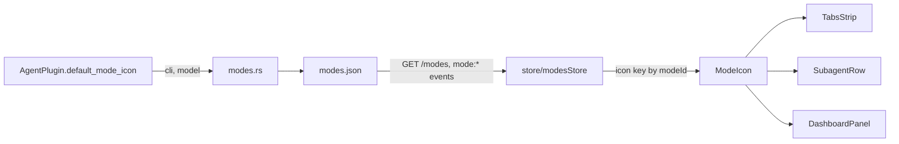

<!--
RULES — read before writing or implementing:
1. FORMAT: Bullets, tables, code, diagrams ONLY — no prose paragraphs
2. REQUIREMENTS: One crisp line each — no verbose descriptions
3. CHECKLIST: Mark items [x] as you complete them — this is your persistent todo list
4. READING TIME: Optimize for fast human scanning — if it's hard to skim, rewrite it
-->

# Plan: Agent mode icons

> Show agents as mode icons (not names) in worktree tabs, subagent/parent chips, and the dashboard; icon is stored on the mode at creation.

**Branch:** `terminal-icons-icon`
**Status:** Pending
**Report:** `.vibekit/reports/2026-09-19-agent-icons-by-mode.md`

**Reference files:**
- Mode model: `rust/vst-types/src/rest/shared.rs:122`
- Mode CRUD: `rust/vst-routes/src/modes.rs:336` (create), `:407` (update), `:187` (load)
- CLI-specific logic home: `rust/vst-agents/src/plugin.rs:226` (`trait AgentPlugin`)
- Tabs: `web-ui/src/components/layout/TabsStrip.tsx:638,766`
- Chips: `web-ui/src/components/chat/SubagentRow.tsx:179,255`
- Dashboard: `web-ui/src/components/layout/DashboardPanel.tsx:226,246`
- Icon assets (already added): `web-ui/src/assets/mode-icons/{claude,agy,opencode,deepseek,cursor}.svg`

---

## Problem & Concept

- Agents render as long fully-qualified names on tabs, chips, and dashboard cards.
- Success: a mode icon leads each; names are ellipsized under a max width.

## Out of Scope

- Manual icon picking UI (design stays extendable, no UI now)
- Icons on sidebar rows and canvas tiles
- Icons in `ModesSetting`/`NewModeDialog`/`EditModeDialog`
- Icons on plain terminal tabs (`modeId: null`)
- Icon for sessions with no mode (renders generic fallback only)

## Requirements

| # | Requirement |
|---|-------------|
| 1 | `Mode.icon` is a string key, assigned on create and re-derived on update when cli/model changes and no explicit icon is given |
| 2 | claude→`claude`, agy→`agy`, cursor→`cursor`; opencode + model containing `deepseek` (case-insens.) →`deepseek`, else `opencode` |
| 3 | Existing modes without `icon` get one derived in memory on load (both loaders); persisted on the next save |
| 4 | Terminal-channel agents show the icon inside a terminal frame; rich chat shows it bare |
| 5 | Tabs and parent/subagent chips have a max width; icon never shrinks, name ellipsizes, detach shows on hover |
| 6 | Agent-tab right-click/long-press popup (`resetMenu`) shows the full session name; terminal tabs get no icon and no popup |
| 7 | Remove the 💬/⌨ tab channel markers |
| 8 | Unknown icon key or null modeId → generic fallback glyph, never a crash |

---

## Change Map

```
rust/vst-types/src/rest/
  shared.rs           ~ Mode.icon field
  modes.rs            ~ optional icon in bodies
rust/vst-agents/src/
  plugin.rs           ~ default_mode_icon method
  claude.rs cursor.rs agy.rs opencode.rs  ~ implement it
rust/vst-routes/src/
  modes.rs            ~ assign + backfill icon
web-ui/src/
  api/types.ts        ~ Mode.icon
  assets/mode-icons/  + five svgs (present)
  store/modesStore.ts + modes cache + WS sync
  components/agent/ModeIcon.tsx + icon + terminal frame
  components/layout/TabsStrip.tsx    ~ icon tab, popup name
  components/chat/SubagentRow.tsx    ~ icon chips
  components/layout/DashboardPanel.tsx ~ icon cards
  styles/workspace.css, chat.css     ~ max-width rules
```

| Today | After this plan |
|-------|-----------------|
| Tabs/chips/cards show text names | Icon + ellipsized name, full name in popup/tooltip |
| Tab has 💬/⌨ emoji | Terminal-framed vs bare mode icon |
| Mode has no icon | Mode stores `icon` key |

---

## Research

- `rust/vst-types/src/rest/shared.rs:122` — `Mode` has no icon; serde is camelCase so add `icon: Option<String>` (skip when None).
- `rust/vst-routes/src/modes.rs:383` — single construction site for new modes; update path at `:468-471` already clears model on CLI change.
- `rust/vst-routes/src/modes.rs:42` and `:187` — two loaders (free fn backing `resolve_mode_id`, cached method); both must derive missing icons.
- `rust/vst-agents/src/registry.rs:22` — `resolve_plugin(cli)`; `vst-routes` already depends on `vst-agents`.
- `web-ui/src/store/globalDraftStore.ts` — zustand v5 convention; dir is `store/` (singular).
- `ApiInstance` is a prop, not a singleton (`TabsStrip.tsx:35`, `DashboardPanel.tsx:16`, optional in `SubagentRow.tsx:181`).
- `web-ui/package.json` — no svgr; `?raw` imports work in vite and vitest without config.
- `web-ui/src/components/layout/TabsStrip.tsx:741` — tab label is a bare span; `TabsStrip.tsx:725` inline style overrides class layout.
- `web-ui/src/styles/chat.css:1840` — `.tab__channel-icon` lives here, not workspace.css.
- `web-ui/src/api/types.ts:160` — `Session.channel` is optional (`tmux|pty|json`); undefined = terminal.
- `rust/vst-agents/src/plugin.rs:226` — AGENTS.md requires CLI-specific behaviour on `AgentPlugin`, so the DeepSeek rule lives in the opencode plugin, not in routes.
- `web-ui/src/components/settings/ModesSetting.tsx:35` — only current consumer of `mode:created/updated` events; no shared modes cache exists.
- `web-ui/src/api/types.ts:146` — `Session.modeId: string | null`.
- `web-ui/src/components/layout/TabsStrip.tsx:766` — emoji channel marker to delete.
- `web-ui/src/components/chat/SubagentRow.tsx:255` — label span already has `max-width: 16rem` (`styles/chat.css:1102`); chip itself has none.
- `web-ui/src/styles/workspace.css:2155` — `.tab` has no max-width.
- **Root cause:** modes carry no visual identity and no client cache maps `session.modeId` → mode.

---

## Architecture Diagram



---

## Design Details

### System Boundaries

| Boundary | Fields + types | Errors | Source of truth |
|----------|----------------|--------|-----------------|
| Daemon ↔ web-ui (modes) | `Mode.icon?: string` | none new | `modes.json` |
| Routes ↔ plugin | `default_mode_icon(&self, model: Option<&str>) -> &'static str` (required, no default; via `resolve_plugin`) | — | plugin |

### Critical User Journeys (CUJs)

#### CUJ 1 — Create a DeepSeek opencode mode

```
User creates mode (cli=opencode, model=deepseek-local/deepseek-v4-flash)
  → daemon resolves plugin, icon = "deepseek", persists
  → agents of that mode show the DeepSeek icon on tabs/chips/dashboard
```

- **Edge case:** model edited later to a non-deepseek model → icon re-derived to `opencode`.

#### CUJ 2 — Long name in a narrow tab

```
Tab name exceeds max width
  → icon stays, name ellipsizes
  → hover shows close; right-click popup shows full name
```

### Data Model

| Entity | Field | Type | Constraints | Notes |
|--------|-------|------|-------------|-------|
| `Mode` | `icon` | `string?` | key in known set | absent on legacy rows until backfill |

- **Migration:** Y — both loaders derive missing icons in memory; the next `save_modes` persists them (no write on the read path).
- **Extendability:** body structs accept optional `icon`; when present it wins over derivation (future picker needs no schema change).

### Key Decisions

#### Decision 1: Icon rule lives on the plugin — *with a snippet*

- **Decision:** required `AgentPlugin::default_mode_icon(model)`; claude/cursor/agy return a constant, opencode inspects the model.
- **Rationale:** AGENTS.md forbids `if cli == ...` outside plugins.
- **Where:** `rust/vst-agents/src/plugin.rs:226`, `opencode.rs`

```rust
// opencode impl — the only model-aware one; claude/cursor/agy return their constant key.
fn default_mode_icon(&self, model: Option<&str>) -> &'static str {
    match model {
        Some(m) if m.to_ascii_lowercase().contains("deepseek") => "deepseek",
        _ => "opencode",
    }
}
```

#### Decision 2: Terminal frame is CSS/SVG composition in one component

- **Decision:** `<ModeIcon iconKey channel />`; `channel !== "json"` (incl. undefined) wraps the glyph in a rounded terminal frame (title bar dots + border).
- **SVGs:** imported with `?raw` and inlined (trusted repo assets) so `currentColor` glyphs (opencode, cursor) inherit theme colour.
- **Rationale:** one component keeps all three surfaces consistent.
- **Where:** `web-ui/src/components/agent/ModeIcon.tsx`

#### Decision 3: Client resolves `modeId → icon` via a small store

- **Decision:** `store/modesStore.ts` exposes `ensureLoaded(api)`, `subscribe(api)` (`mode:created/updated/deleted`) and a pure `iconForMode(modeId)` selector; `ModeIcon` degrades to fallback when `api` is absent.
- **Rationale:** avoids per-surface fetches; fallback glyph when missing.
- **Where:** `web-ui/src/stores/modesStore.ts`

#### Decision 4 (mobile follow-up): tab/chip max width is a token that narrows under the 640px breakpoint

- **Decision:** `--agent-surface-max-width` in `tokens.css` (`:root` = `18rem`, desktop unchanged; overridden to `8rem` inside the existing `@media (max-width: 640px)` mobile block at `tokens.css:307`). `.tab` (workspace.css) and `.chat-subagent-row__item` (chat.css) both consume `var(--agent-surface-max-width)` instead of a bare `18rem`.
- **Rationale:** reuses the app's existing 640px mobile breakpoint (the one that already scales font sizes) rather than introducing a new query; one named token keeps tabs and chips in sync and avoids scattering a bare number in multiple files. `8rem` (~128px) per tab fits 3+ agent tabs on a 390px-wide phone with no horizontal scroll.
- **Testing:** jsdom has no layout and can't read the stylesheet, so a CSS-structure test in `TabsStrip.test.tsx` / `SubagentRow.test.tsx` reads the CSS source via `fs` and asserts the token's desktop value, the 8rem mobile override inside the 640px media query, and that `.tab` / `.chat-subagent-row__item` consume the token.
- **Where:** `web-ui/src/styles/tokens.css`, `web-ui/src/styles/workspace.css` (`.tab`), `web-ui/src/styles/chat.css` (`.chat-subagent-row__item`)

#### Deviation (Phase 1) — 1.T2 split into four tests; required field fallout

- **1.T2** was split into `test_modes_icon_on_create`, `test_modes_icon_rederive_on_update`,
  `test_modes_icon_backfill_cached_loader`, `test_modes_icon_backfill_free_loader` so each stays
  under clippy's 100-line pedantic `too_many_lines` threshold (the single-test form tripped it).
  Coverage is unchanged.
- `default_mode_icon` being **required** forced adding it to `MockTurnPlugin`
  (`vst-agents/tests/json_agent_session_queue.rs`), plus `icon: None` on a fallback `Mode` built in
  `vst-routes/src/sessions.rs` (`resolve_resume_mode`) and on the CLI's `mode add` body — mechanical
  fallout of the new field, no semantic change.
- 1.T3: `cargo test` and workspace `cargo build` are clean; `cargo clippy` emits only **pre-existing**
  pedantic warnings (unreadable literals, `too_many_lines`, `must_use`, `float_cmp`, etc.) — this
  change adds no new warnings.

#### Deviation (Phase 2) — store naming, reactive hook, clone-on-ingest

- `subscribe` is named `subscribeModes` (a bare `subscribe` would shadow the DOM/node module
  convention and read ambiguously at call sites); it still returns an unsubscribe fn.
- `modesStore` also exports `useModeIcon(modeId, api?)` — a reactive hook that re-renders the
  caller when the mode arrives/updates/deletes in the store, and lazily calls `ensureLoaded` +
  `subscribeModes` when an `api` is passed. This is the actual consumption path for `ModeIcon`;
  the plan's pure `iconForMode` selector is kept as the non-reactive read.
- `modesStore` shallow-clones each `Mode` on ingest (`{ ...mode }`) so the cache never aliases an
  object the caller may mutate — this is what makes the mock api's
  created/updated `emit` payload (which shares a reference with its internal array) behave like the
  real daemon's fresh-serialized WS payload. Without it, a test asserting the unsubscribed cache
  stays frozen would observe the mock mutating the shared object.
- Store holds a `_reset` test helper to restore the pristine empty state between unit tests.
- ModeIcon renders the glyph via `dangerouslySetInnerHTML` on the `?raw` SVG string (trusted repo
  assets, not user input); `currentColor` glyphs (opencode/cursor) inherit `--fg-secondary`, the
  fixed-colour brands (claude/agy/deepseek) keep their intrinsic fill.
- **2.T3** is left unchecked: `pnpm -C web-ui typecheck` passes and all modes/icon tests pass, but
  the full `pnpm -C web-ui test` suite carries **9 pre-existing failures** (`TopBar` ×5,
  `WorkspaceCanvas`, `FilesPanel`, `VcsPanel` ×2, `SkillEditor` lexical error) that reproduce
  identically on the clean base `edf25e3` with this work stashed — none touch modes/icons/stores.

#### Deviation (Phase 3) — decorative icons are `aria-hidden`; popup name as a menu header; hook-dependency addition

- `ModeIcon` (which carries `role="img"` + `aria-label` for its standalone use) is wrapped in a
  `<span aria-hidden="true">` inside the tab (`AgentTabIcon`), chips (`ChipIcon`), and dashboard cards
  (`CardIcon`). Without this, the icon's `aria-label` (e.g. "claude") leaked into the *parent
  button/link's* accessible name — a tab named "main" became "claude main", which both regressed the
  `getByRole("tab", { name: /^main/ })` assertions and (worse) mis-announced tabs to screen readers.
  The icons are purely decorative in these surfaces; the adjacent text label is the name.
- `useModeIcon` is called from dedicated wrapper components (`AgentTabIcon`/`ChipIcon`/`CardIcon`)
  rather than inline in the `map`/`renderDashboardItem` loops, because it is a hook (must run at the
  top level of a component, not in a loop).
- The reset-menu full name is rendered as a `.menu-pop__title` header div (padding + bottom border +
  ellipsis) above the Reset items, since the plan gives no existing menu-title affordance; `title`
  carries the full name too. The child-chip full name is already exposed by the existing item-level
  `title` ("`<label> — <status>`"); only the parent chip needed an explicit label `title`, and the
  child label deliberately got none (it would have collided with the pre-existing `getByTitle(/kid/)`
  test that expects a single title-bearing element).
- `DashboardPanel`'s `renderDashboardItem` `useCallback` deps grew by `api` (now read by `CardIcon`).
- **3.T4** is left unchecked for the same reason as 2.T3: `pnpm -C web-ui typecheck` passes and all
  four scoped vitest files (TabsStrip, SubagentRow, DashboardPanel, ModeIcon) pass 96/96, but
  `pnpm -C web-ui lint` reports **67 pre-existing errors** that reproduce identically on the base
  commit with this work stashed (unrelated files — SearchPanel, VcsPanel, useChat, useThemeStore,
  modesStore.test, plus a missing `react-hooks/exhaustive-deps` rule definition) — this phase adds
  zero new lint errors. **3.T5** is verified by inspection: TabsStrip still keys strictly by session
  id and never changes React tree position; only `workspace.css`/`chat.css` style rules and inline
  JSX inside the existing tab/chip/card render sites were touched, no terminal/chrome tree move.

#### Deviation (Verification fixes — 2026-09-19 report bugs 1-3)

- **Bug 1 (tab label never ellipsized).** `.tab__label` sat inside a plain inline wrapper
  (`<span style="position:relative;z-index:1">`), and as an inline child of an inline parent its
  `max-width`/`overflow`/`text-overflow` are ignored — the full name spilled past the tab's width.
  Fix: the wrapper is now `.tab__content` (`display:inline-flex; align-items:center; gap; flex:0 1
  auto; min-width:0`) and `.tab` gained `max-width:18rem; min-width:0`. The label (a shrinkable
  flex item with `flex-shrink:1`) now ellipsizes at `max-width:12rem`; the icon stays
  `flex-shrink:0` and the close button is unaffected. The wrapper's inline style was kept (the tab
  button carries its own inline layout) and mirrored in `workspace.css` so the layout is declared
  in one obvious place; the inline `flexShrink:0` on the tab button is retained for dnd.
- **Bug 2 (popup title truncated at 16rem).** `.menu-pop__title` had `max-width:16rem` +
  ellipsis + `white-space:nowrap`, cutting long names in the reset menu. Now `white-space:normal;
  overflow-wrap:anywhere; word-break:break-word` with the max-width/ellipsis removed — the full
  name always wraps in the popup (the tab still ellipsizes; `title` still carries the full name).
- **Bug 3 (parent-chip label clipped with no ellipsis on hover).** The absolutely-positioned hover
  delink button covered the label's right end, hiding its ellipsis. `.chat-subagent-row__label`
  gained `padding-right:1.75rem` to reserve the button's width so the "…" renders to its left.
- **Verification.** `pnpm -C web-ui typecheck` clean; the four scoped vitest files
  (TabsStrip, SubagentRow, DashboardPanel, ModeIcon) pass 100/100. New tests: TabsStrip asserts the
  label carries the ellipsis class and sits in the shrinkable inline-flex `.tab__content` wrapper
  (jsdom has no layout, so this is a class/structure assertion), and that the popup title renders
  the full name verbatim with no truncation class; SubagentRow asserts both chip labels are the
  truncating element and carry the full name title. jsdom can't read the stylesheet, so the
  `padding-right`/`white-space` effects themselves are confirmed by the verifier's real-layout check.


---

## Risks / Open Questions

| # | Question | Notes |
|---|----------|-------|
| 1 | Brand-mark licensing | Icons from upstream agent-orchestrator logos + lobehub icons; user may replace files |
| 2 | Null `modeId` sessions | Generic fallback; revisit later |

---

## Implementation Phases

- Each phase ends with a verification block.

### Phase 1 — Daemon: `icon` on Mode

- [x] **1.1** Add `icon: Option<String>` to `Mode` and optional `icon` to create/update bodies (`shared.rs`, `rest/modes.rs`)
- [x] **1.2** Add `default_mode_icon` to `AgentPlugin` and implement in claude/cursor/agy/opencode
- [x] **1.3** Assign icon in `create_mode` via `resolve_plugin` (`vst-agents/src/registry.rs:22`); re-derive in `update_mode` on cli/model change unless explicit icon supplied
- [x] **1.4** Derive missing icons in memory in both loaders (`modes.rs:42`, `:187`); persisted on next save

**Verify phase 1:**
- [x] **1.T1** Unit — opencode plugin: `deepseek-local/deepseek-v4` → `deepseek`, `gpt-5` → `opencode`, `None` → `opencode`
- [x] **1.T2** Integration — `tests/modes_and_open.rs`: create mode per CLI returns expected icon; update model flips icon; legacy modes.json rows load with derived icons through both loaders
- [x] **1.T3** `cargo test -p vst-routes -p vst-agents -p vst-types` and `cargo clippy` clean

### Phase 2 — Web-ui: types, store, `ModeIcon`

- [x] **2.1** Add `icon?: string` to `Mode`, `CreateModeBody`, `UpdateModeBody` in `api/types.ts` (+ `api/mock.ts` sets icons)
- [x] **2.2** Create `store/modesStore.ts` (`ensureLoaded(api)`, `subscribe(api)`, `iconForMode(modeId)`)
- [x] **2.3** Create `components/agent/ModeIcon.tsx` (`?raw` inline svgs, fallback glyph, terminal frame, `size` prop) + `styles/mode-icon.css`
- [x] **2.4** Unit tests

**Verify phase 2:**
- [x] **2.T1** Unit — `ModeIcon`: each key renders; unknown/null → fallback; `channel` `pty`/`tmux`/undefined add frame, `json` does not
- [x] **2.T2** Unit — `modesStore`: applies created/updated/deleted events
- [ ] **2.T3** `pnpm -C web-ui typecheck && pnpm -C web-ui test` pass

### Phase 3 — Surfaces

- [x] **3.1** `TabsStrip.tsx` (agent tabs only): `ModeIcon` + named label class (`tab__label`, ellipsis) at `:741`; delete 💬/⌨ marker and `.tab__channel-icon` in `chat.css:1840`; `.tab` max-width (mind inline style at `:725`), icon `flex-shrink: 0`; subscribe/ensureLoaded modes
- [x] **3.2** Tab right-click/long-press popup: show full name
- [x] **3.3** `SubagentRow.tsx`: `ModeIcon` in parent and child chips; chip max-width; detach still hover-revealed
- [x] **3.4** `DashboardPanel.tsx`: `ModeIcon` before `dashboard-card__primary` in BOTH branches of `renderDashboardItem` (direct ~:226, worktree ~:246)
- [x] **3.5** Full name kept in `title`/aria-label on every truncated element

**Verify phase 3:**
- [x] **3.T1** Unit — `TabsStrip`: no emoji marker; icon element present; popup contains full name
- [x] **3.T2** Unit — `SubagentRow`: icon present in both chip kinds; detach button still rendered
- [x] **3.T3** Unit — `DashboardPanel`: card renders icon
- [ ] **3.T4** `pnpm -C web-ui typecheck && pnpm -C web-ui test && pnpm -C web-ui lint` pass
- [ ] **3.T5** Regression — `TerminalPane` tree position unchanged (AGENTS.md invariant)

---

## Files & Phase Impact

| File | Status | Phase | Description / Contract Change |
|------|--------|-------|-------------------------------|
| `rust/vst-types/src/rest/shared.rs` | **Modified** | 1.1 | Contract: `Mode.icon: Option<String>` |
| `rust/vst-types/src/rest/modes.rs` | **Modified** | 1.1 | Optional `icon` in bodies |
| `rust/vst-agents/src/plugin.rs` | **Modified** | 1.2 | Contract: `default_mode_icon(&self, Option<&str>) -> &'static str` |
| `rust/vst-agents/src/{claude,cursor,agy,opencode}.rs` | **Modified** | 1.2 | Implement; opencode is model-aware |
| `rust/vst-routes/src/modes.rs` | **Modified** | 1.3, 1.4 | Assign, re-derive, backfill |
| `rust/vst-routes/tests/modes_and_open.rs` | **Modified** | 1.T2 | Icon assertions |
| `web-ui/src/api/types.ts`, `mock.ts` | **Modified** | 2.1 | Icon field |
| `rust/vst-routes/src/modes.rs` (free `load_modes` :42) | **Modified** | 1.4 | Derive icon for legacy rows |
| `web-ui/src/store/modesStore.ts` | **New** | 2.2 | Contract: `ensureLoaded(api)`, `subscribe(api)`, `iconForMode(modeId): string \| null` |
| `web-ui/src/styles/mode-icon.css` | **New** | 2.3 | Frame + sizing |
| `web-ui/src/components/agent/ModeIcon.tsx` | **New** | 2.3 | Contract: `{ iconKey, channel?, size? }` |
| `web-ui/src/assets/mode-icons/*.svg` | **Unchanged** | — | Already added |
| `web-ui/src/components/layout/TabsStrip.tsx` | **Modified** | 3.1, 3.2 | Icon tab, popup name |
| `web-ui/src/components/chat/SubagentRow.tsx` | **Modified** | 3.3 | Icon chips |
| `web-ui/src/components/layout/DashboardPanel.tsx` | **Modified** | 3.4 | Icon cards |
| `web-ui/src/styles/workspace.css`, `chat.css` | **Modified** | 3.1, 3.3 | Max-width, ellipsis; delete `.tab__channel-icon` (chat.css:1840) |
