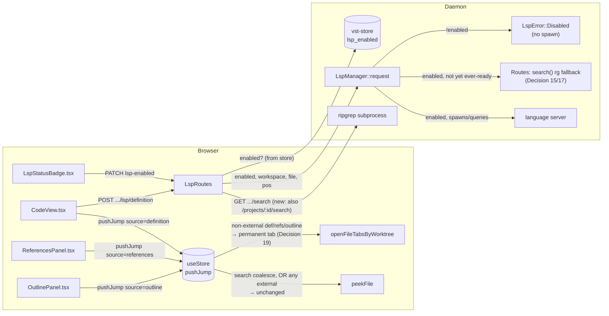
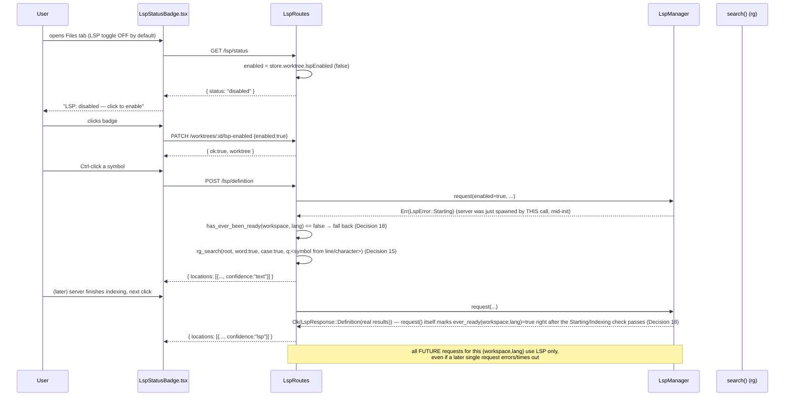

<!--
RULES — read before writing or implementing:
1. FORMAT: Bullets, tables, code, diagrams ONLY — no prose paragraphs
2. REQUIREMENTS: One crisp line each — no verbose descriptions
3. CHECKLIST: Mark items [x] as you complete them — this is your persistent todo list
4. READING TIME: Optimize for fast human scanning — if it's hard to skim, rewrite it
-->

# Plan: Code Navigation Follow-ups (language coverage, fallback, permanent tabs, opt-in toggle)

> Four confirmed follow-ups on top of the shipped `code-nav-lsp-outline` feature (33cecaa1 daemon, 48009a4a UI, caab8f47 docs): language registry 4→15, a text-search fallback for go-to-def/references during LSP startup, an always-permanent-tab model for definition/references/outline jumps, and a per-worktree/project opt-in toggle gating LSP process spawn.

**Issue:** code-nav-followups
**Branch:** (current worktree branch `code-nav-lsp-outline`)
**Status:** Pending
**PRD:** none — chain is `[plan, turn-implement]`; scope is fully captured in `.vibekit/reports/2026-09-23-code-nav-lsp-outline-followups.md` (items 1, 2, 4, 6) from live discussion with the user, and in this plan's own Design Details
**Source report:** `.vibekit/reports/2026-09-23-code-nav-lsp-outline-followups.md`
**Base feature plan (architecture + Decision numbering this plan continues):** `.vibekit/feature-plans/pending/code-nav-lsp-outline/plan-code-nav-lsp-outline.md`

**Reference files:**
- Data / schema: `rust/vst-types/src/rest/lsp.rs` (`LspStatus`, `Location`, `ReferenceEntry`), `rust/vst-types/src/domain.rs` (`WorktreeRecord`, `ProjectRecord`), `rust/vst-types/src/rest/shared.rs` (`Worktree`, `Project` wire types)
- Core logic: `rust/vst-lsp/src/manager.rs` (`LspManager`), `rust/vst-lsp/src/registry.rs`, `rust/vst-routes/src/lsp.rs` (`LspRoutes`)
- UI / entrypoint: `web-ui/src/hooks/useStore.ts` (`pushJump`), `web-ui/src/components/tools/LspStatusBadge.tsx`, `web-ui/src/components/tools/FilesPanel.tsx`
- Wiring: `rust/vst-daemon/src/server.rs`, `rust/vst-store/src/schema.rs`, `web-ui/src/api/client.ts`

---

## Problem & Concept

- `code-nav-lsp-outline` shipped go-to-def, hover, references, and outline for 4 languages (Rust/TS-JS/Python/Go), with a shared ephemeral preview slot and unconditional spawn-on-first-request.
- Four gaps, confirmed ready by the user in `.vibekit/reports/2026-09-23-code-nav-lsp-outline-followups.md`, are addressed here: too few languages, dead clicks while a server is cold-starting, an ephemeral preview slot that fights the "this is a deliberate destination" feel of a definition/reference/outline jump, and an unbounded number of concurrent language-server processes.
- Explicitly **not** in this plan (report items 2b, 3, 7 — see Non-goals): Outline's own fallback, call hierarchy, and `@`-mode project-wide symbol search — none were confirmed ready.

## Non-goals / Out of scope

- Report item **2b** (Outline fallback) — still undecided (report leans "skip entirely"); no code changes to `OutlinePanel.tsx`'s loading/unsupported states here.
- Report item **3** (Call hierarchy) — not prioritized.
- Report item **7** (`@`-mode project-wide symbol jump in `QuickOpen.tsx`) — scope confirmed in the report but go/no-go undecided; not implemented here.
- Report item **5** (live verification against real language servers) — explicitly scheduled to run AFTER this bundle lands; not a phase in this plan.
- Report item **6**'s literal "process cap" framing is NOT built — the confirmed mitigation is the opt-in toggle (Phase 2 below), not a separate ceiling on concurrent processes.

---

## Requirements

| # | Requirement |
|---|-------------|
| 1 | 11 new `LanguageServerConfig` entries in `rust/vst-lsp/src/registry.rs` (C/C++, Zig, Lua, Ruby, Java, C#, LaTeX, HTML, CSS, JSON, Kotlin, Bash) — registry-table-only, no `LspManager`/`ServerHandle` architecture change, except Java's per-workspace `-data` dir (mirrors the existing rust-analyzer `CARGO_TARGET_DIR` special-case). |
| 2 | Per-worktree and per-project "Enable code navigation" toggle, defaulting OFF, gating `LspManager::request()`/`status()` before any process lookup or spawn. |
| 3 | Go-to-def/references fall back to a text-search match whenever `LspManager::request()` cannot yet return a real LSP answer for a (workspace, language) pair that has never answered `ready` — covers `Starting`/`Indexing` (mid-request), and `Disabled`/`NotFound`/`Unsupported` (no server will ever run) — matching the report's `starting`/`indexing`/`not_found`/`unsupported` list exactly, plus `disabled` only insofar as `Disabled` is a NEW status this same bundle introduces and behaves identically to `NotFound` for fallback purposes (no server, no future readiness). Once `ready` is seen once for that pair, LSP results are used exclusively, forever (per-session daemon lifetime). |
| 4 | `pushJump`'s branch (c) sends `definition`/`references`/`outline`-sourced, in-workspace jumps straight to a permanent tab (open-or-activate), matching branch (b)'s existing behavior; `search`-sourced (coalesce) jumps and any `external` jump (any source) keep the existing ephemeral `peekFile` behavior unchanged. |
| 5 | Each phase's checklist + Files & Phase Impact rows are self-contained per `FORMAT.md`'s self-containment bar — this plan runs `turn-implement`, one fresh agent per Implementation Phase. |

---

## Change Map

```
rust/vst-lsp/src/
  registry.rs                  ~ +11 LanguageServerConfig entries
  manager.rs                   ~ enabled-gating params on request()/status(), ever_ready latch set inline in request(), jdtls -data dir
rust/vst-types/src/
  rest/lsp.rs                  ~ LspStatus::Disabled variant, confidence field (named-default-fn) on Location/ReferenceEntry
  domain.rs                    ~ lsp_enabled: Option<bool> on WorktreeRecord/ProjectRecord (+ ~60-site struct-literal fallout)
  rest/shared.rs                ~ lspEnabled: bool (#[serde(default)]) on Worktree/Project wire types
rust/vst-store/src/
  schema.rs                    ~ idempotent ALTER TABLE lspEnabled column (worktree + project tables)
  row_mappers.rs                ~ map lspEnabled column
  lib.rs                        ~ SELECT/INSERT/UPDATE column lists include lspEnabled
rust/vst-routes/src/
  search_util.rs                + rg_search(): shared ripgrep invocation, extracted from worktrees.rs::search
  worktrees.rs                  ~ patch_lsp_enabled; search() refactored to call search_util::rg_search
  projects.rs                   + search() (new, calls search_util::rg_search); ~ patch_lsp_enabled
  lsp.rs                        ~ From<LspError> gains Disabled arm; status/definition/hover/references/outline pass `enabled`; definition/references gain fallback branch calling rg_search directly
rust/vst-daemon/src/
  server.rs                     ~ 2 new PATCH routes (lsp-enabled), 1 new GET route (/projects/:id/search)
web-ui/src/
  api/client.ts                 ~ setWorktreeLspEnabled/setProjectLspEnabled
  lib/lspApi.ts                  ~ LspStatus union gains "disabled"; Location/ReferenceEntry gain confidence
  hooks/useStore.ts             ~ pushJump branch (c) source-conditional permanent-tab commit (inline)
  components/tools/
    LspStatusBadge.tsx           ~ "disabled — click to enable" state + handler
    ReferencesPanel.tsx           ~ low-confidence badge per entry
  components/preview/CodeView.tsx ~ low-confidence indicator on fallback-sourced definition jump
```

**Note (Decision 20):** `FilesPanel.tsx` is deliberately NOT in this Change Map — its per-source icon/double-click-promote logic is narrowed by Decision 19 to external-only peeks, not removed or modified; no code change there.

| Today | After this plan |
|-------|-----------------|
| 4 languages have go-to-def/hover/references/outline (Rust, TS/JS, Python, Go) | 15 languages do (+ C/C++, Zig, Lua, Ruby, Java, C#, LaTeX, HTML, CSS, JSON, Kotlin, Bash) |
| Every worktree/project spawns a language server unconditionally on first LSP request | Spawn only happens if that worktree/project's "Enable code navigation" toggle (default OFF) is on; `LspStatus::Disabled` otherwise |
| A click during `starting`/`indexing` shows "still starting — click again" with no result | A `request()` failure of `Starting`/`Indexing`/`NotFound`/`Unsupported`/`Disabled` for a pair that's never been `ready` returns a lower-confidence text-search match instead, until the server has answered `ready` at least once |
| `pushJump`'s branch (c) always sets ephemeral `peekFile` for a new jump to a not-yet-open file | `definition`/`references`/`outline` (non-external) jumps open-or-activate a permanent tab instead; `search`(coalesce) and any `external` jump keep the ephemeral peek |
| Content search (`GET /worktrees/:id/search`, ripgrep-backed) exists only for worktree sessions | The same route exists for direct (project) sessions too — `GET /projects/:id/search` |

---

## Research

- `.vibekit/reports/2026-09-23-code-nav-lsp-outline-followups.md:17-24` — source of the 4 confirmed items (rows 1, 2, 4, 6) and the 3 explicitly-deferred items (2b, 3, 7); row 5 (live verification) scheduled after this bundle.
- **Report factual correction (load-bearing):** the report describes item 2's fallback data source as "the existing per-worktree `FileSearchIndex` (already backs the Search tool tab)". This is WRONG — verified by reading the actual code:
  - `rust/vst-ws/src/services/file_search.rs:1-13,27-30` — `FileSearchIndex` is a **filename-only** index (`HashMap<String, HashSet<String>>` of relative paths) built for Quick Open. It has no line content and cannot answer "does this line contain this symbol". It backs `GET /worktrees/:id/file-search` (`rust/vst-routes/src/worktrees.rs:1418-1432`), consumed by `web-ui/src/hooks/useFileSearch.ts` — Quick Open, not the Search tool tab.
  - `web-ui/src/components/tools/SearchPanel.tsx:164` calls `api.search(...)`, which (`web-ui/src/api/client.ts:876-888`) hits `GET .../search` — this is the ACTUAL Search-tab backend: `rust/vst-routes/src/worktrees.rs:1254-1418`, a ripgrep (`rg --json`) subprocess wrapper that already accepts `word: bool` (`--word-regexp`) and `case: bool` (`--case-sensitive`/`--ignore-case`) query params — exactly the "whole-word/case-sensitive match" semantics report item 2 describes.
  - **Decision (§ Key Decisions #15):** the fallback in this plan calls `search()`, not `FileSearchIndex` — see Decision 15.
- `rust/vst-routes/src/projects.rs` — grepped for a `search`/`/search` method: none exists. `rust/vst-daemon/src/server.rs:575` registers `GET /worktrees/:id/search` but has no `/projects/:id/search` counterpart (confirmed by grepping the full route list, `server.rs:540-605`) — direct sessions have no content-search endpoint today at all. `web-ui/src/api/client.ts:893`'s comment ("Worktree-scope only — there is no `/projects/:id/file-search` route") is about `file-search` (Quick Open); the plain content `/search` route is separately worktree-only, a distinct gap this plan closes (Decision 16) since PRD R8 (code-nav-lsp-outline) requires direct-session parity.
- `rust/vst-types/src/rest/lsp.rs:14-23` — `LspStatus` is an 8-variant enum (`Unsupported, NotFound, Starting, Indexing, Ready, Idle, Stopped, Error`); adding `Disabled` makes 9. `LspStatusResponse{status, language}` (`:48-51`) is the wire shape `LspStatusBadge.tsx` reads.
- `rust/vst-types/src/rest/lsp.rs:65-75` (`Location`) / `:97-102` (`ReferenceEntry`) — neither has any confidence/source-quality field today; both are `#[serde(rename_all="camelCase")]` with existing `#[serde(default)]` optional fields (`token`, `display_path`), establishing the additive-field pattern this plan's `confidence` field follows (old clients silently ignore the new field, `#[serde(default)]` means old server payloads without it still deserialize).
- `rust/vst-lsp/src/registry.rs:1-68` — `LanguageServerConfig{language, command, args, extensions, init_options, extra_env}`, a static `Vec` built once via `OnceLock`, looked up by extension (`lookup`) or language name (`lookup_by_language`). 4 entries exist today (rust, typescript, python, go). Adding entries is purely additive to this `vec![...]` literal.
- `rust/vst-lsp/src/manager.rs:467-530` (`spawn_server`) — already special-cases `cfg.language == "rust"` inline (`:483-488`) to inject a dedicated `CARGO_TARGET_DIR` env var built from `self.vst_home.join("lsp-target").join(workspace.to_key_string())`, created via `create_dir_all`. This is the exact pattern Java's `-data` dir requirement follows (Decision 11) — an `if cfg.language == "java"` block appending a dynamic arg instead of an env var.
- `rust/vst-lsp/src/manager.rs:318` (`request`) / `:252` (`status`) — the two entrypoints `LspRoutes` calls; both currently take no "is this workspace allowed to run LSP at all" parameter. `rust/vst-lsp/src/manager.rs:90-104` (`LspError` enum) has 7 variants, none for "disabled".
- `rust/vst-routes/src/lsp.rs:87-100` (`LspRoutes` struct) — already holds `store: StoreHandle` (used by `resolve_workspace_root`/`find_project_for_worktree`, `:102-135`), so reading a per-worktree/per-project boolean flag needs no new dependency — `vst-lsp` itself has NO `vst-store` dependency (confirmed: `rust/vst-lsp/Cargo.toml` deps are `tokio`, `serde`/`serde_json`, `libc`, `vst-ws` only — see original plan's Research/Decision 9), which is why the `enabled` flag must be computed by `LspRoutes` and PASSED IN to `LspManager::request()`/`status()`, not looked up inside `vst-lsp` (Decision 12).
- `rust/vst-routes/src/worktrees.rs:811-861` (`patch_pin`) — canonical idempotent-toggle-with-broadcast pattern: read body flag, `mutate_project` closure finds the worktree, no-ops if already at the target value, else mutates + returns; caller re-fetches, serializes, broadcasts `ServerEvent::WorktreeUpdated`. `patch_hide` (`:863+`) is the same shape. This is the template Decision 13's `patch_lsp_enabled` follows exactly.
- `rust/vst-routes/src/projects.rs:1049-1093` (`patch_project`) — same idempotent-toggle-with-broadcast pattern, one level up (project, not worktree): reads current, no-ops if unchanged, `store.mutate_project` closure, serializes, broadcasts `ServerEvent::ProjectUpdated`. Template for the project-side `patch_lsp_enabled`.
- `rust/vst-types/src/domain.rs:583-605` (`WorktreeRecord`) / `:654-673` (`ProjectRecord`) — both already carry an analogous optional boolean (`hidden: Option<bool>` on `ProjectRecord:665`, `hidden_at: Option<String>` on `WorktreeRecord:596`); `lsp_enabled: Option<bool>` (None ≡ false) matches this codebase's existing optional-boolean-defaults-false convention rather than a non-optional `bool` with a serde default.
- `rust/vst-store/src/schema.rs:135-149` (idempotent add-column helper, `ALTER TABLE {table} ADD COLUMN {column} {ddl}` gated by `PRAGMA table_info`) — the existing idempotent-migration primitive; adding `lspEnabled` reuses this helper, not a new schema-version bump mechanism. **Correction during review:** the worktree table's `pinned_at` row-mapper/INSERT/UPDATE sites are at `rust/vst-store/src/lib.rs:475-486` and `:602-606` (NOT `:417`/`:635`, which are the SESSION table's `pinned_at` — a different table entirely); the project table's equivalent sites are in the `:502-590` range. **Implementer must re-grep `pinned_at` at Phase-2 time and confirm the exact current line numbers** before editing — do not trust either this plan's or the prior review's line numbers as gospel; grep is cheap, a wrong edit site is not.
- **Struct-literal fallout (found during review, not optional):** `WorktreeRecord`/`ProjectRecord` do NOT derive `Default` and are constructed via named-field literals (`WorktreeRecord { id: ..., branch: ..., ... }`) at ~34 call sites (`grep -rln "WorktreeRecord {" rust/`) and ~26 call sites (`grep -rln "ProjectRecord {" rust/`) across production code and tests. Adding a new required field to either struct breaks EVERY one of these at compile time — this is real, mechanical, bounded work that must be a first-class Phase 2 checklist item, not an afterthought. `rust/vst-routes/tests/lsp_test.rs` (confirmed to exist at this path, e.g. `:84`, `:236`) constructs `WorktreeRecord` fixtures that Phase 2 must additionally set `lsp_enabled: Some(true)` on (not just `None`) — otherwise every EXISTING LSP request-flow test in that file starts hitting the new `Disabled` short-circuit instead of exercising the code path it was written to test, a silent regression the compiler cannot catch.
- `rust/vst-types/src/rest/shared.rs:84-97` (`Worktree` wire struct) — `pinned_at: Option<String>` (`:89`), `hidden_at: Option<String>` (`:96`) are the two existing optional-toggle wire fields; `lspEnabled` is added as `bool` (not optional) on the WIRE type even though the domain record's field is `Option<bool>` — the serializer (`serialize_worktree`) maps `None → false`, so the client never has to null-check it (matches how `branch_is_placeholder: bool` is already handled).
- `web-ui/src/api/types.ts:75-96` (`Worktree` interface) — `pinnedAt: string | null` (`:89`), `hiddenAt: string | null` (`:95`) mirror the Rust wire type field-for-field; `lspEnabled: boolean` is added the same way.
- `web-ui/src/api/client.ts:538-558` (`pinWorktree`/`hideWorktree`) — `PATCH .../worktrees/:id/pin` / `.../hide`, `{ ok: true; worktree: Worktree }` return shape; template for `setWorktreeLspEnabled`.
- `web-ui/src/hooks/useServerStore.ts:37,87` / `useServerSync.ts:230` (`applyWorktreeUpdated`, `worktree:updated` WS handler) — confirms a `PATCH`'s resulting `WorktreeUpdated` broadcast is ALREADY consumed generically (any new field on `Worktree` flows through with no new WS-handler code needed) — no new wiring required here, just the new field on the type.
- `web-ui/src/components/tools/LspStatusBadge.tsx:12-107` — full existing component; `status === "stopped" || status === "idle"` is the only `isClickable` condition today (`:83`); `handleClick` (`:85-93`) calls `getHover(...)` with dummy `{0,0}` position purely to trigger `LspManager`'s spawn-on-first-request side effect, then re-polls. The `"disabled"` branch (Decision 14) follows this exact click-to-retry shape but calls the new enable-toggle endpoint instead of `getHover`.
- `web-ui/src/hooks/useStore.ts:1088-1141` (`pushJump`) — verbatim current implementation, re-read during review: (a) `coalesce` short-circuit (`:1101-1104`); (b) `else if (!next.external && tabs.includes(next.path))` (`:1109-1132`) — an ALREADY-open-tab branch that looks the path up via `tabs.indexOf`, which is **only valid when the path is already in `openFileTabsByWorktree`** (returns `-1` otherwise — it does NOT open a new tab); (c) `else` (`:1134-1140`) records history and sets `peekFile: next` unconditionally. **Correction during review:** the original draft of this plan claimed Decision 19 could "route branch (c) through branch (b)'s logic" — this is wrong, branch (b)'s `existingIdx = tabs.indexOf(next.path)` would be `-1` for a file not yet open, corrupting `activeFileTabIdxByWorktree`. See `web-ui/src/hooks/useStore.ts:1050-1077` (`setActiveFilePathAtLine`, the search-commit path) instead — it is the ONE existing action that already does "commit a path to `openFileTabsByWorktree` (appending if absent) + set `activeFilePath` + set `pendingLineTarget` for the jump line + record history", which is exactly the permanent-tab-open shape Decision 19 needs; it is NOT a call site to reuse (its signature is worktree/path/line-only, no `source`), but its BODY is the pattern Decision 19's replacement code in `pushJump`'s branch (c) must follow inline.
- `web-ui/src/hooks/useStore.ts:318` (`request`) — `LspManager::request()`'s actual control flow (re-read during review): does NOT check `LspStatus` up front. It resolves the file ref, calls `ensure_server_handle` (spawns on first use), sends `didOpen`, THEN checks `current_status` (`:386-393`) — `Starting`/`Indexing` → `Err(LspError::Starting)`; `Idle` is silently promoted to `Ready` in place; anything else proceeds to the real LSP call. **This means `status()` is NOT a reliable pre-check for fallback eligibility** — calling `status()` before `request()` sees `Stopped` (server never spawned yet, `rust/vst-lsp/src/manager.rs:252-274`, the `else` arm at `:273-274`) for the exact case the base feature's own `LspStatusBadge` "click to resume" flow describes, which is NOT one of the report's listed fallback-trigger statuses and would incorrectly skip the fallback on a cold server's very first request. **Decision (§ Key Decisions #17, rewritten):** fallback eligibility is decided from `request()`'s OWN result (`Err(Disabled | Starting | NotFound | Unsupported)`), not from a separate `status()` pre-check.
- `web-ui/src/hooks/useStore.test.ts:873-936` — existing `peekFile`-slice describe block; `:903-906` ("setActiveFile clears peekFile"), `:909-912` ("openFileTabNew clears peekFile") assert against UNRELATED actions (not `pushJump`), confirmed NOT in the rewrite set. **Correction during review — the rewrite set is larger than the original draft claimed.** Every existing test that calls `pushJump`/triggers a definition-or-references-or-outline jump and then asserts `peekFile` is now WRONG post-Decision-19 and must be found and rewritten. The implementer must run `grep -n "peekFile" web-ui/src/hooks/useStore.test.ts web-ui/src/components/preview/CodeView.test.tsx web-ui/src/components/tools/ReferencesPanel.test.tsx web-ui/src/components/tools/OutlinePanel.test.tsx` at Phase-4 time and inspect EVERY hit — this plan's own line citations below are a starting point from this review pass, not guaranteed exhaustive or stable (test files churn); do not trust a stale line number over a fresh grep.
- `web-ui/src/components/preview/CodeView.test.tsx` — `:268` (a `source:"search"` peek assertion — stays ephemeral, unaffected), `:272-322` (test asserting a `source:"definition"` `peekFile` after a single in-workspace match — THIS moves to a permanent-tab assertion), `:431` (multi-match picker selecting a workspace row — same fix), `:559` (`Alt+G` keyboard go-to-def path — same fix), `:596` (a `409`-then-retry flow that eventually lands a `definition` peek — same fix). The `peekFile === null` assertions elsewhere in this file (e.g. `:258,369,419,485,516,621,648`) stay syntactically valid after Decision 19 but no longer prove "nothing navigated" on their own for a definition-sourced case — where the surrounding test's intent is "no navigation happened", ALSO assert `activeFilePath`/`openFileTabsByWorktree` are unchanged, not just `peekFile === null`.
- `web-ui/src/components/tools/ReferencesPanel.test.tsx:83-145` (test `"5.T4"`) — `:134-136`-ish asserts `peekFile` for an INTERNAL (non-external) reference row click — moves to a permanent-tab assertion. `:145`-ish is the EXTERNAL row case (a real `external:{token,...}` result, not a "Phase-4-absent placeholder" as an earlier draft of this plan mischaracterized it) — stays a `peekFile` assertion, unchanged, per Decision 19's `!next.external` guard.
- `web-ui/src/hooks/useStore.test.ts:1003-1161` (the `pushJump`-specific tests from the base feature's Phase 2, describe block covering `2.T1`/`2.T2`/`2.T4`/`5.T6`) — several directly assert `peekFile` for a `definition`/`references` source with no existing tab and no `external` — every one of these is now wrong and must be rewritten to assert a permanent-tab commit instead; re-grep at Phase-4 time (see above) rather than trusting a specific line range, since Phase 2/3 of THIS plan may shift line numbers in this file before Phase 4 runs.
- `web-ui/src/components/tools/OutlinePanel.test.tsx:285` — reads `peekFile` after a row click to assert the jump landed — in the rewrite set.
- `rust/vst-types/src/rest/lsp.rs:65-118` — `Location`/`ReferenceGroup`/`ReferenceEntry` full shapes, needed verbatim for Decision 17's additive `confidence` field placement.
- **Root cause / why these 4 are bundled together:** none of the 4 items touches the LSP transport/JSON-RPC layer (`vst-lsp/src/client.rs`, untouched by this plan) — they're a registry-table expansion, a routing-layer gate, a routing-layer fallback branch, and a frontend state-machine tweak, all additive to the shipped `code-nav-lsp-outline` foundation, which is exactly why they're follow-ups rather than a new sub-feature of the original PRD.

---

## Architecture Diagram



---

## Design Details

### Critical User Journeys (CUJs)

#### CUJ 1 — Toggle off by default, user enables, first click after enabling falls back, then locks onto LSP



- **Error path — toggle stays off:** every `/lsp/*` call for that workspace returns `status:"disabled"` from `status()` / `Err(LspError::Disabled)` from `request()` forever; no process is ever spawned; `request()`'s `Disabled` error IS one of the fallback-eligible errors (Requirement 3), so `definition`/`references` still return a low-confidence text match instead of a dead click, while `hover`/`outline` (not text-searchable) simply show their existing "unavailable" state.
- **Edge case — `ever_ready` was true, server later dies/restarts:** `has_ever_been_ready` stays `true` for that (workspace, language) pair for the daemon process's lifetime (Decision 18) — a transient `LspError::ProcessDied`/`Timeout` after that point does NOT re-trigger fallback; the caller sees the LSP error surfaced as-is (existing `409`/`500` handling, unchanged), not a silently-lower-quality result overwriting a previously-correct one.

### System Boundaries

| Boundary | Fields + types | Errors | Source of truth |
|----------|----------------|--------|-----------------|
| Frontend ↔ Backend, new: `PATCH /api/{worktrees,projects}/:id/lsp-enabled` | Request: `{ enabled: bool }` · Response: `{ ok: true, worktree: Worktree }` or `{ ok: true, project: Project }` | `404 NOT_FOUND` | Daemon (`vst-store`, via `mutate_project`) |
| Frontend ↔ Backend, new: `GET /api/projects/:id/search` | Same query params/response shape as the existing `GET /api/worktrees/:id/search` (Decision 16) — not restated | Same as existing worktree `search()`: `503 ripgrep_unavailable`, `500` | Daemon (stateless, spawns `rg` per request) |
| Frontend ↔ Backend, changed: `GET/POST /api/{worktrees,projects}/:id/lsp/{status,definition,references,hover,outline}` | Additive only: `LspStatus` gains `"disabled"`; `Location`/`ReferenceEntry` gain `confidence: "lsp" \| "text"` (`#[serde(default = "confidence_lsp")]`, a named default fn — see Decision 17) | Unchanged existing error codes; no new HTTP status introduced (disabled is a `200` with `status:"disabled"` body for `/status`, and reuses the existing `409`-family shape with `code:"LSP_DISABLED"` for the position-taking endpoints — see Decision 12) | Daemon (`LspManager` in-memory + `vst-store`'s `lsp_enabled` flag) |
| Module ↔ Module: `LspRoutes` ↔ `LspManager`, changed | `LspManager::request(..., enabled: bool) -> Result<LspResponse, LspError>` (was: no `enabled` param); `LspManager::status(..., enabled: bool) -> (LspStatus, Option<String>)` (same); new `LspManager::has_ever_been_ready(workspace: &WorkspaceKey, lang: &str) -> bool` | New: `LspError::Disabled` | `LspManager` owns `ever_ready` set; `LspRoutes` owns reading the persisted toggle |
| Client ↔ DB (`vst-store`), new | `worktree.lspEnabled: Option<bool>`, `project.lspEnabled: Option<bool>` — additive column, `NULL`/absent ≡ `false` | none (idempotent `ALTER TABLE`) | SQLite, via `rust/vst-store/src/schema.rs`'s existing idempotent-add-column helper |

### Data Model

| Entity | Field | Type | Constraints | Notes |
|--------|-------|------|-------------|-------|
| `WorktreeRecord` (domain) / worktree table | `lsp_enabled` | `Option<bool>` / `INTEGER NULL` | `NULL`/absent ≡ `false` | Mirrors `hidden_at`'s optional-defaults-false convention |
| `ProjectRecord` (domain) / project table | `lsp_enabled` | `Option<bool>` / `INTEGER NULL` | `NULL`/absent ≡ `false` | Mirrors `ProjectRecord.hidden`'s convention |
| `Worktree`/`Project` (wire) | `lspEnabled` | `bool` (non-optional) | server maps `None → false` at serialize time | Client never null-checks |
| `LspManager` (in-memory only) | `ever_ready` | `HashSet<(WorkspaceKey, String)>` | daemon-process-lifetime, not persisted | Matches original plan's Decision 1 "no new persisted entities" — this is new IN-MEMORY state, not a DB entity |

- **Migration:** Y — additive `lspEnabled` column on the worktree and project tables via the existing idempotent `ALTER TABLE ... ADD COLUMN` helper (`rust/vst-store/src/schema.rs:133-149`); no backfill needed (`NULL` already means the correct default, `false`).

### API Contracts

```
PATCH /api/worktrees/:id/lsp-enabled
  Request:  { enabled: bool }
  Response: { ok: true, worktree: Worktree }   — Worktree.lspEnabled reflects the new value
  Errors:   404 NOT_FOUND

PATCH /api/projects/:id/lsp-enabled
  Request:  { enabled: bool }
  Response: { ok: true, project: Project }
  Errors:   404 NOT_FOUND

GET /api/projects/:id/search?q=<string>&re=<bool>&case=<bool>&word=<bool>&glob=<string?>&limit=<uint?>
  — identical request/response shape to the existing GET /api/worktrees/:id/search
    (rust/vst-routes/src/worktrees.rs:1254-1418); rooted at `project.absolute_path`
    instead of `paths.worktree_path(...)`. Not restated here — see Decision 16.

GET /api/worktrees/:id/lsp/status  (existing route, response shape extended)
  Response: { status: LspStatus, language: string | null }
  LspStatus = "unsupported" | "not_found" | "starting" | "indexing" | "ready"
            | "idle" | "stopped" | "error" | "disabled"   ← new variant

POST /api/worktrees/:id/lsp/definition  (existing route, response shape extended)
  Response: { locations: Location[] }
  Location: { line, character, preview,
              confidence: "lsp" | "text",                  ← new, additive
              (external:false, path) | (external:true, path:null, token, displayPath) }
  — a "text" entry never carries a `token`/is never `external:true` (fallback only
    matches within the current workspace root; an external-file fallback match is
    out of scope — the fallback searches the SAME root the workspace's own file
    tree covers, not arbitrary stdlib/dependency paths)
  — `confidence` defaults to `"lsp"` via a plain Rust default fn (`#[serde(default = "confidence_lsp")]`
    where `fn confidence_lsp() -> String { "lsp".into() }`) — NOT the shorthand `#[serde(default)]`
    (which would require `String::default()` == `""`, wrong value) and NOT a bare string literal
    inside the attribute (invalid Rust/serde syntax) — see Decision 17

POST /api/worktrees/:id/lsp/references  (existing route, response shape extended)
  ReferenceGroup.entries[].confidence: "lsp" | "text"        ← new, additive
```

### Key Decisions

_(Continuing the numbering of `plan-code-nav-lsp-outline.md`'s Key Decisions, which ends at Decision 9.)_

#### Decision 10: Language registry entries — verified per-server invocation, not a uniform template

- **Decision:** add these 11 `LanguageServerConfig` entries to `rust/vst-lsp/src/registry.rs`'s `vec![...]` (Research: `:17-68`), each `args` verified against that server's actual stdio convention rather than assumed to match the existing 4:

  | Language | `command` | `args` | `extensions` |
  |----------|-----------|--------|---------------|
  | C/C++ | `clangd` | `[]` (stdio is its default mode) | `c, h, cpp, hpp, cc, cxx, hxx, mm, m` |
  | Zig | `zls` | `[]` (stdio default) | `zig` |
  | Lua | `lua-language-server` | `[]` (stdio default) | `lua` |
  | Ruby | `solargraph` | `["stdio"]` (subcommand, not a flag) | `rb` |
  | Java | `jdtls` | `[]` static + dynamic `-data <dir>` appended at spawn time (Decision 11) | `java` |
  | C# | `omnisharp` | `["-lsp"]` (LSP-mode flag; OmniSharp otherwise runs its legacy HTTP protocol) | `cs` |
  | LaTeX | `texlab` | `[]` (stdio default) | `tex, sty, cls` |
  | HTML | `vscode-html-language-server` | `["--stdio"]` | `html, htm` |
  | CSS | `vscode-css-language-server` | `["--stdio"]` | `css, scss, less` |
  | JSON | `vscode-json-language-server` | `["--stdio"]` | `json, jsonc` |
  | Kotlin | `kotlin-language-server` | `[]` (stdio default) | `kt, kts` |
  | Bash | `bash-language-server` | `["start"]` (subcommand, not a flag) | `sh, bash` |

- **Rationale:** 4 of these (`solargraph`, `bash-language-server`, plus Java/C# below) do NOT follow the existing 4 entries' `--stdio`-flag-or-nothing pattern — `solargraph`/`bash-language-server` require a positional subcommand, `omnisharp` requires `-lsp`, `jdtls` requires a per-workspace data directory it cannot get from a static `args` list at all. Assuming a uniform template (the risk flagged in the task brief) would silently break these 4.
- **Where:** `rust/vst-lsp/src/registry.rs` (table), `rust/vst-lsp/src/manager.rs` (Java's dynamic arg, Decision 11).

#### Decision 11: Java's per-workspace `-data` directory — mirrors the existing rust-analyzer `CARGO_TARGET_DIR` special-case

- **Decision:** `spawn_server` (`rust/vst-lsp/src/manager.rs:467-530`) gains a second `if cfg.language == "java"` block, structurally identical to the existing `if cfg.language == "rust"` block (`:483-488`): builds `self.vst_home.join("lsp-jdtls-data").join(workspace.to_key_string())`, `create_dir_all`s it, and appends `"-data".to_string()` + the path (as a `String`) to `cmd.args(...)` (via `cmd.arg(...)` calls after the static `cfg.args`, not baked into the registry's static `Vec`).
- **Rationale:** `jdtls` caches its entire internal project index under `-data`'s directory; reusing one directory across workspaces (or omitting it, which defaults to a fixed path) corrupts that cache when two different Java workspaces are opened — the same class of bug `CARGO_TARGET_DIR` prevents for `rust-analyzer`'s build-lock contention, just for a cache directory instead of a build lock.
- **Where:** `rust/vst-lsp/src/manager.rs:467-530` (`spawn_server`, new block alongside the existing rust one).

#### Decision 12: `LspStatus::Disabled` — 9th variant; gating lives at the `LspManager` entrypoints, flag is passed in, not looked up

- **Decision:** add `Disabled` to `LspStatus` (`rust/vst-types/src/rest/lsp.rs:14-23`, `as_str() => "disabled"`). `LspManager::request(&self, workspace, root, lang, file, kind, pos, enabled: bool)` and `LspManager::status(&self, workspace, path, enabled: bool)` each gain a new **last** parameter `enabled: bool` (keeps existing positional call sites minimally diffed) and check it as the literal first statement — `if !enabled { return Err(LspError::Disabled) }` / `return (LspStatus::Disabled, None)` — before any `servers` map lookup, before any spawn attempt. `LspRoutes` (which already has `self.store`, Research) computes `enabled` inside `resolve_workspace_root`'s caller — add a sibling method `LspRoutes::is_lsp_enabled(&self, workspace: &WorkspaceKey) -> Result<bool, LspRouteError>` that fetches the worktree/project record (reusing `find_project_for_worktree`/`store.get_project`, same as `resolve_workspace_root`) and reads `.lsp_enabled.unwrap_or(false)` — called once per route handler, passed into every `lsp_manager.request()`/`.status()` call.
- **Rationale:** `vst-lsp` has no `vst-store` dependency today (Research: `Cargo.toml` deps are `tokio`/`serde`/`libc`/`vst-ws` only) and adding one just to read a boolean would break the crate boundary the original plan's Decision 1/9 established (`LspManager` is store-free, in-memory only); passing the already-known flag in keeps that boundary intact while still literally satisfying "`LspManager::request()` must return ... instead of spawning anything" — the check is the FIRST thing the function does, spawning is structurally unreachable when `enabled` is false.
- **Where:** `rust/vst-lsp/src/manager.rs` (`request`, `status`, new `LspError::Disabled` variant), `rust/vst-routes/src/lsp.rs` (`is_lsp_enabled`, `LspRouteError::Disabled` → new `code: "LSP_DISABLED"` in `lsp_err_to_response`, all 5 handler bodies pass `enabled`). Confirmed by re-reading the current code (review pass): exactly one `status()` call site and four `request()` call sites exist in `rust/vst-routes/src/lsp.rs` (`status`, `definition`, `hover`, `references`, `outline` — 5 handlers total, no other production caller) — `From<LspError> for LspRouteError` (`rust/vst-routes/src/lsp.rs:33-52`) is an EXHAUSTIVE match; adding `LspError::Disabled` requires adding a matching `LspRouteError::Disabled` arm there or the crate does not compile — call this out explicitly as its own checklist item (Phase 2), it is easy to add the enum variant and forget the match arm.

```rust
// manager.rs — request()'s new first line
pub async fn request(&self, workspace: WorkspaceKey, root: &Path, lang: &str,
                      file: LspFileRef, kind: LspRequestKind, pos: Option<(u32,u32)>,
                      enabled: bool) -> Result<LspResponse, LspError> {
    if !enabled { return Err(LspError::Disabled); }
    // ... existing lookup-or-spawn logic, unchanged ...
}
```

#### Decision 13: `lsp_enabled` persistence — additive column + `PATCH .../lsp-enabled`, mirrors `patch_pin`/`patch_project` exactly

- **Decision:** `WorktreeRecord`/`ProjectRecord` (`rust/vst-types/src/domain.rs:583-673`) each gain `lsp_enabled: Option<bool>`. `Worktree`/`Project` wire types (`rust/vst-types/src/rest/shared.rs:84-113`) each gain `lsp_enabled: bool` (camelCase `lspEnabled`), populated by the existing `serialize_worktree`/`serialize_project` functions as `record.lsp_enabled.unwrap_or(false)`. New `PATCH /worktrees/:id/lsp-enabled` (`rust/vst-routes/src/worktrees.rs`, new method `patch_lsp_enabled`, body `{enabled: bool}`) follows `patch_pin`'s exact shape (`:811-861`, Research): idempotent no-op if unchanged, `store.mutate_project` closure sets the field, re-serialize, broadcast `ServerEvent::WorktreeUpdated`. New `PATCH /projects/:id/lsp-enabled` (`rust/vst-routes/src/projects.rs`, new method `patch_lsp_enabled`) follows `patch_project`'s exact shape (`:1049-1093`, Research), broadcasting `ServerEvent::ProjectUpdated`.
- **Rationale:** this is the ONLY place in the codebase that needs a new per-worktree/per-project persisted setting for this bundle — reusing the established pin/hide toggle template (Research) means no new persistence mechanism, no new broadcast event type, and the frontend's existing `worktree:updated`/`project:updated` generic handling (Research: `useServerStore.ts:37,87`) requires zero new WS wiring.
- **Where:** `rust/vst-types/src/domain.rs`, `rust/vst-types/src/rest/shared.rs`, `rust/vst-store/src/schema.rs` (new `ALTER TABLE` calls for both tables), `rust/vst-store/src/row_mappers.rs` + `rust/vst-store/src/lib.rs:417,475,606,635` (4-site wiring, Research), `rust/vst-routes/src/worktrees.rs`, `rust/vst-routes/src/projects.rs`, `rust/vst-daemon/src/server.rs` (2 new route registrations).

#### Decision 14: `LspStatusBadge` "disabled" state — click-to-enable, same shape as the existing "stopped/idle" click-to-resume

- **Decision:** `LspStatusBadge.tsx` (`:61-107`) gains an `else if (status === "disabled") { text = "LSP: disabled — click to enable"; }` branch; `isClickable` (`:83`) becomes `status === "stopped" || status === "idle" || status === "disabled"`; `handleClick` (`:85-93`) branches on `status === "disabled"` to call a new `setLspEnabled(api, scope, worktreeId, true)` client wrapper BEFORE `checkStatus()`, instead of the existing dummy `getHover` call (which stays for the stopped/idle case, unchanged).
- **Rationale:** reuses the component's existing poll/click/re-check lifecycle wholesale — no new component, no new mount/unmount surface.
- **Where:** `web-ui/src/components/tools/LspStatusBadge.tsx`, `web-ui/src/api/client.ts` (new `setLspEnabled`/`setProjectLspEnabled` wrappers, template: Research `client.ts:538-558`).

#### Decision 15: Fallback data source is a NEW shared `rg_search` free function (extracted from the existing `search()` route) — called in-process, not over HTTP

- **Decision:** extract the ripgrep-invocation body currently inline in `WorktreeRoutes::search` (`rust/vst-routes/src/worktrees.rs:1254-1418`, Research) into a new crate-level async free function, `pub(crate) async fn rg_search(root: &Path, q: &str, re: bool, case: bool, word: bool, glob: Option<&str>, limit: usize) -> Result<Vec<RgRawMatch>, RgSearchError>` in a new `rust/vst-routes/src/search_util.rs`, where `RgRawMatch { path: String, line_number: u32, start_byte: usize, end_byte: usize, line_text: String }` — the RAW `rg --json` fields, BEFORE the existing `truncate_snippet`/`pre`/`mid`/`post` shaping `WorktreeRoutes::search` applies for the Search-tab UI. `WorktreeRoutes::search` and the new `ProjectRoutes::search` (Decision 16) both call `rg_search` then apply their own existing `truncate_snippet` shaping on top (behavior-preserving refactor, matches the original feature's `1.10` `read_file_response` extraction pattern, Research). `LspRoutes::definition`/`references` (which already have `root: &Path` from `resolve_workspace_root`, no worktree/project distinction needed at that point) call `rg_search` DIRECTLY — an in-process function call, not a second HTTP round-trip through `/search` — with `word: true, case: true, re: false, q: <symbol text>, limit: 50`.
- **Rationale — corrects two problems found in review of the original Decision 15/16 draft:** (1) the original draft proposed `LspRoutes` reach `WorktreeRoutes::search`/`ProjectRoutes::search` via a struct reference or HTTP call, but those methods take a `wt_id`/`project_id` and re-resolve the project/root themselves — `LspRoutes` already HAS the resolved `root: &Path`, so calling through the id-based methods would mean re-resolving work already done, and threading a reference to a sibling `*Routes` struct into `LspRoutes::new` would break the ~7 existing `LspRoutes::new(...)` call sites in `rust/vst-routes/tests/lsp_test.rs`; extracting a plain function sidesteps both problems entirely — no struct coupling, no signature change to `LspRoutes::new`. (2) `search()`'s existing `SearchMatch{pre,mid,post}` shape (via `truncate_snippet`, `rust/vst-routes/src/worktrees.rs`) strips leading whitespace and only keeps a truncated window around the match — it has no way to recover a `Location`'s `character` (UTF-16 column) or reliably 0-index the line the rest of the LSP surface uses (`rg`'s `line_number` is 1-based). `RgRawMatch`'s `start_byte`/`end_byte` (straight from `rg --json`'s `submatches[].start/.end`, already present in the parsed JSON today, just discarded before reaching `SearchMatch`) are what `LspRoutes` converts to `Location{line: line_number - 1, character: <UTF-16 col from start_byte via rust/vst-lsp/src/position.rs's existing byte-offset helper, reused rather than reimplemented>, preview: line_text}`.
- **Where:** `rust/vst-routes/src/search_util.rs` (new), `rust/vst-routes/src/worktrees.rs` (refactor `search` to call it), `rust/vst-routes/src/projects.rs` (new `search`, Decision 16, calls it), `rust/vst-routes/src/lsp.rs` (`definition`/`references` fallback branch, direct `rg_search` call + `Location`/`ReferenceEntry` mapping).

#### Decision 16: `GET /projects/:id/search` — new route, thin wrapper over Decision 15's shared `rg_search`

- **Decision:** add `ProjectRoutes::search` (new method in `rust/vst-routes/src/projects.rs`) — resolves `root = PathBuf::from(&project.absolute_path)`, calls Decision 15's `rg_search`, applies the SAME `truncate_snippet`/grouping shaping `WorktreeRoutes::search` already applies (extract that shaping into a second small shared helper if it isn't already separable from `rg_search` itself — implementer's call, either is acceptable as long as the two routes' response shape is byte-for-byte identical). Register `GET /projects/:id/search` in `rust/vst-daemon/src/server.rs` alongside the existing `/worktrees/:id/search` (`:575`).
- **Rationale:** without this, the Search tool tab itself (not just Decision 15's fallback) silently never worked for direct (project) sessions — a real gap against `code-nav-lsp-outline`'s own PRD R8 ("work the same for direct sessions and worktree sessions"), which this bundle must not leave open even though R8 itself belongs to the prior feature, not this one. This route is useful independent of Decision 15's fallback (the Search tab itself benefits), so it stands as its own Decision.
- **Where:** `rust/vst-routes/src/projects.rs` (new `search` method), `rust/vst-daemon/src/server.rs` (new route + handler fn, mirrors the existing `handle_worktree_search` pattern), `web-ui/src/api/client.ts:876-888` (`search()` already accepts a `scope`/`FileScope` parameter per Research — confirm it already routes to `${fileBase(scope,...)}/search` for BOTH scopes, since `fileBase` already branches on scope; if so this is a backend-only change, no frontend client edit needed here).

#### Decision 17: `confidence: "lsp" | "text"` — additive field, defaults to `"lsp"` for zero wire breakage

- **Decision:** `Location` (`rust/vst-types/src/rest/lsp.rs:65-75`) and `ReferenceEntry` (`:97-102`) each gain `#[serde(default = "confidence_lsp")] pub confidence: String` where `fn confidence_lsp() -> String { "lsp".to_string() }` is a plain free function (NOT the field-level `#[serde(default)]` shorthand, which would default to `String::default()` = `""`, the wrong value). Every existing LSP-sourced result sets `confidence: "lsp"` explicitly (no behavior change for a `ready` server); fallback-sourced results (Decision 15) set `confidence: "text"`.
- **Rationale:** a build straddling this change (old frontend / new backend, or vice versa, mid-deploy) degrades gracefully — an old frontend simply never reads the new field and shows no low-confidence badge; per the existing additive-field precedent already in this exact struct (`token`/`display_path`, Research).
- **Where:** `rust/vst-types/src/rest/lsp.rs`, `rust/vst-routes/src/lsp.rs` (set explicitly on every construction site of `Location`/`ReferenceEntry`), `web-ui/src/lib/lspApi.ts` (extend the TS type), `web-ui/src/components/preview/CodeView.tsx` + `web-ui/src/components/tools/ReferencesPanel.tsx` (render a badge/note when `confidence === "text"` — exact visual TBD by implementer, must be visually distinct per the task brief, e.g. a "(text match)" suffix or dimmed row style).

#### Decision 18: `ever_ready` latch — set inside `request()` itself, right after the Starting/Indexing check, NOT in the async spawn/progress task

- **Decision:** `LspManager` gains `ever_ready: Mutex<HashSet<(WorkspaceKey, String)>>` (same key shape as the existing `servers: Mutex<HashMap<(WorkspaceKey, String), ServerHandle>>`). The insert happens INLINE in `request()` (`rust/vst-lsp/src/manager.rs:318`), immediately after the existing `Starting`/`Indexing` early-return check (`:386-393` — `if current_status == Starting || Indexing { return Err(Starting) }`; the `Idle → Ready` promotion sits right below it): once control passes that check (meaning `current_status` is `Ready`, or was just promoted from `Idle`), insert `(workspace.clone(), lang.to_string())` into `ever_ready` before proceeding to the real LSP call. New method `LspManager::has_ever_been_ready(&self, workspace: &WorkspaceKey, lang: &str) -> bool` checks membership; `request()`'s own caller (`LspRoutes::definition`/`references`) checks it (see Decision 15/17's fallback branch: attempt `request()`; on `Err(e)` matching `{Disabled, Starting, NotFound, Unsupported}`, check `has_ever_been_ready` — if still `false`, fall back; if `true`, propagate the error as today, unchanged).
- **Rationale — corrects the original draft's placement:** the original draft proposed inserting into `ever_ready` at the `$/progress`-driven `Ready`-transition site inside `spawn_server`'s detached `tokio::spawn` task (Decision 3-bis's state machine) — reading the actual code during review shows that task only captures `status_clone: Arc<RwLock<LspStatus>>`, NOT `self`/`Arc<LspManager>`, so it has no reachable path to a `LspManager`-owned field at all; moving the insert into `request()` (which DOES have `&self`) is both correct and simpler — it also means the existing base-feature tests that call `insert_server_handle`+their own progress loop directly (`rust/vst-lsp/tests/manager_test.rs:41-95`, which never go through `spawn_server`) can still exercise the latch, since `request()` is what they actually call.
- **Where:** `rust/vst-lsp/src/manager.rs` (new field on `LspManager`, insert at `request()`'s existing status-check site, new public method).

#### Decision 19: `pushJump` branch (c) becomes source-conditional — definition/references/outline (non-external) commit to a permanent tab via inline logic modeled on `setActiveFilePathAtLine`, NOT by reusing branch (b)

- **Decision:** `pushJump` (`web-ui/src/hooks/useStore.ts:1088-1141`) — branch (c)'s `else` (`:1134-1140`, "no coalesce match, path not already an open tab") is split on `next.source !== "search" && !next.external`:
  - **True** (a definition/references/outline jump to an in-workspace file that ISN'T already an open tab — the case branch (b) does NOT cover, since branch (b)'s guard is `tabs.includes(next.path)`): append `next.path` to `openFileTabsByWorktree[next.worktreeId]` (spread + push, do not mutate in place), set `activeFilePath: next.path`, set `activeFileTabIdxByWorktree[next.worktreeId]` to the NEW tab's index (`tabs.length`, i.e. the end of the just-extended array), set `lastFileByWorktree[next.worktreeId]: next.path` (matching every other tab-commit action, e.g. branch (b) `:1125-1128`), set `pendingLineTarget` to `{worktreeId: next.worktreeId, path: next.path, line: next.line, matchText: next.matchText ?? null}`, set `peekFile: null`, and record history via the SAME `key ? recordHistoryEntry(s, key) : {}` branch (c) already computes — this is structurally `setActiveFilePathAtLine`'s (`:1050-1077`) body, inlined, not a call to it (that function's signature has no `source` param and duplicating its 5-field state update inline keeps `pushJump` self-contained, matching how branch (b) is already inlined rather than calling a shared helper).
  - **False** (everything else — `source === "search"`, or any `external` truthy regardless of source): UNCHANGED, exactly today's branch (c) — records history, sets `peekFile: next`.
- **Rationale — corrects the original draft's proposed reuse of branch (b):** branch (b)'s `existingIdx = tabs.indexOf(next.path)` (`:1112`) resolves to `-1` for a path that isn't already in `openFileTabsByWorktree` — routing a NOT-yet-open file through branch (b) unmodified would write `activeFileTabIdxByWorktree[...] = -1`, desyncing the active-tab pointer from the newly-set `activeFilePath` (the exact class of bug the base feature's own Decision 2/N3 fix — `useStore.ts`'s `setActiveFile({skipHistory:true})` — was written to prevent, for a different code path). The NEW branch below must be written inline, not by calling branch (b)'s code with a patched index.
- **Where:** `web-ui/src/hooks/useStore.ts:1134-1140` (the modified branch only — branches (a)/(b) are untouched). `navigateBack`/`navigateForward` need NO change: their restore logic (`:1140-1180`-ish) already branches on `PeekEntry.kind` (`"peek"` vs `"committed"`), and a permanent-tab-opening jump now produces exactly the same `{kind:"committed", path, line}` snapshot type any other tab-open action already produces when something is undone past it — this is pre-existing machinery, not new.

```ts
// pushJump — branch (c), replacing the current unconditional peekFile set
const history = key ? recordHistoryEntry(s, key) : {};
if (next.source !== "search" && !next.external) {
  const tabs = s.openFileTabsByWorktree[next.worktreeId] ?? [];
  const nextTabs = [...tabs, next.path];
  return {
    ...history,
    openFileTabsByWorktree: { ...s.openFileTabsByWorktree, [next.worktreeId]: nextTabs },
    activeFilePath: next.path,
    activeFileTabIdxByWorktree: { ...s.activeFileTabIdxByWorktree, [next.worktreeId]: nextTabs.length - 1 },
    lastFileByWorktree: { ...s.lastFileByWorktree, [next.worktreeId]: next.path },
    pendingLineTarget: { worktreeId: next.worktreeId, path: next.path, line: next.line, matchText: next.matchText ?? null },
    peekFile: null,
  };
}
return { ...history, peekFile: peekValue };
```

#### Decision 20: Per-source icon / double-click-to-promote on the preview tab — narrowed by Decision 19, not dead, not removed

- **Decision:** `FilesPanel.tsx`'s per-source icon (added in the original plan's `2.8`) and double-click-to-promote handler, plus `4.7`'s "disable promote when `peekFile.external` is set" — **no code is removed**. After Decision 19, a `peekFile` with `source` in `{definition, references, outline}` can STILL occur, but only for an `external: true` jump (Decision 19 explicitly excludes external jumps from the permanent-tab path) — and `4.7` already disables the double-click-to-promote handler whenever `peekFile.external` is set, for any source. So: the icon still renders correctly (distinguishing an external definition/references/outline peek from an external... there is no external search peek path today, so in practice only these 3 sources ever reach `peekFile` post-Decision-19, all of them `external: true`), and the promote-handler-disable logic already covers the one case where it would otherwise wrongly allow promoting a non-reload-safe external peek. Document this reasoning as a one-line code comment at the modified branch (Decision 19's site) rather than touching `FilesPanel.tsx` at all.
- **Rationale:** the task brief asked to "decide whether to remove it or leave it inert... and document the choice" — tracing the actual reachable states after Decision 19 shows the code is neither dead nor inert, just narrowed to external-only for 3 of its 4 sources; removing it would delete a still-reachable code path (external go-to-def/references/outline peeks are common — e.g. clicking into a stdlib symbol).
- **Where:** no file changes; one code comment in `useStore.ts` at Decision 19's site, cross-referencing this decision.

---

## Risks / Open Questions

| # | Question | Notes |
|---|----------|-------|
| 1 | **`jdtls`/`omnisharp`/`kotlin-language-server` binary availability is far less common on a typical daemon host than `rust-analyzer`/`gopls`.** | Out of scope to bundle installers (matches original plan's Non-goals); these 11 languages will mostly show `not_found` until a host has them installed — acceptable, same as any of the original 4. |
| 2 | **Does the `rg_search` fallback respect `.gitignore`/binary-file exclusion the same way LSP results would?** | `rg`'s defaults already exclude `.gitignore`d paths and binary files (existing behavior, unchanged) — a fallback match is therefore already scoped sensibly, no extra filtering needed. |
| 3 | **Toggle default OFF changes existing behavior for the 4 already-shipped languages too** — a worktree that was getting LSP nav for free (unconditional spawn) now sees it silently stop until the user opts in. | Confirmed intentional by the report (item 6's mitigation) — flagged here only so it isn't mistaken for a regression during verification; no migration path to "auto-enable for existing worktrees" is in scope. |
| 4 | **Fallback definition results can include up to 50 whole-word text matches, unranked, possibly including the clicked occurrence itself.** | Acceptable for a low-confidence secondary path (explicitly lower-quality than LSP by design) — no dedup/ranking logic beyond `rg`'s own match order is in scope; flagged so verification doesn't mistake a noisy fallback result set for a bug. |

---

## Implementation Phases

- Each phase ends with a **verification block** — the phase is not complete until those tests pass.
- Test items use `N.Tn` numbering to distinguish them from implementation items.
- **Dependency order: 1 is independent. 2 must land before 3 (3's fallback-eligibility check includes the `Disabled` status Phase 2 introduces). 4 is independent of 1/2/3 (pure frontend, no LSP backend dependency) and may run in any position — placed last to minimize merge surface with 1-3's shared files (`manager.rs`, `lsp.rs`).**

---

### Phase 1 — Language registry: 4 → 15 languages

- [x] **1.1** `rust/vst-lsp/src/registry.rs`: add the 11 `LanguageServerConfig` entries from Decision 10's table to the existing `vec![...]` literal in `get_configs()`, in the same struct-literal style as the 4 existing entries.
- [x] **1.2** `rust/vst-lsp/src/manager.rs` (`spawn_server`, `:467-530`): add the `if cfg.language == "java"` block per Decision 11 — build `self.vst_home.join("lsp-jdtls-data").join(workspace.to_key_string())`, `tokio::fs::create_dir_all(&data_dir).await`, then `cmd.arg("-data").arg(&data_dir)` (after the static `cmd.args(&cfg.args)` call already present).

**Verify phase 1:**
- [x] **1.T1** Unit — `rust/vst-lsp/src/registry.rs` (`#[cfg(test)]`): `lookup("cpp")` returns the clangd config; `lookup("rb")` returns solargraph with `args == ["stdio"]`; `lookup("sh")` returns bash-language-server with `args == ["start"]`; `lookup_by_language("java")` returns jdtls; a lookup for an extension none of the 15 cover (e.g. `"xyz"`) still returns `None`.
- [x] **1.T2** Integration — `rust/vst-lsp/tests/manager_test.rs`: spawning a fake `java`-language process (test double, same pattern as the existing Phase 1 fake-process tests in the base feature) asserts the spawned command's argv includes `-data <path>` where `<path>` ends in the workspace's `to_key_string()`, and that two DIFFERENT `WorkspaceKey`s produce two DIFFERENT `-data` paths.
- [x] **1.T3** Regression — existing `rust/vst-lsp/tests/manager_test.rs` tests for the rust `CARGO_TARGET_DIR` special-case (base feature's `1.T3`/`1.T4`) still pass unmodified — confirms the new java block doesn't interfere with the existing rust block (both are independent `if` branches, not `else if`).

---

### Phase 2 — Per-worktree/project "Enable code navigation" toggle

- [x] **2.1** `rust/vst-types/src/rest/lsp.rs`: add `Disabled` to `LspStatus` (`:14-23`), `as_str() => "disabled"`, `Display` impl covered automatically (delegates to `as_str`).
- [x] **2.2** `rust/vst-lsp/src/manager.rs`: add `LspError::Disabled` variant (`#[error("Code navigation is disabled for this workspace")]`); `LspManager::request(...)` and `LspManager::status(...)` each gain a new trailing `enabled: bool` parameter with the early-return check as their first statement, per Decision 12's snippet.
- [x] **2.2b** `rust/vst-routes/src/lsp.rs:33-52` (`impl From<LspError> for LspRouteError`, an EXHAUSTIVE match): add a `LspError::Disabled => LspRouteError::Disabled` arm — the crate does not compile without this, since the match has no wildcard arm today (confirmed by re-reading the current code).
- [x] **2.3** `rust/vst-types/src/domain.rs`: add `lsp_enabled: Option<bool>` to `WorktreeRecord` (`:583-605`) and `ProjectRecord` (`:654-673`).
- [x] **2.3b** **Struct-literal fallout (mechanical, bounded, required):** run `grep -rn "WorktreeRecord {" rust/` (~34 hits) and `grep -rn "ProjectRecord {" rust/` (~26 hits) and add `lsp_enabled: None,` to every production call site, EXCEPT: (a) fixtures in `rust/vst-routes/tests/lsp_test.rs` that exercise an actual LSP `request()`/`status()` call and expect it to reach `LspManager` (not short-circuit on `Disabled`) — those get `lsp_enabled: Some(true)` instead; (b) any fixture the implementer determines, by reading what the surrounding test actually asserts, is specifically testing pin/hide/rename/other-unrelated-behavior and doesn't care — still needs the field present (Rust requires every field), but `None` is fine there. **Do this GREP-then-edit as its own pass, not folded into 2.7-2.9** — it is easy to lose track of one call site among ~60 and get a spurious compile error that looks unrelated to this phase's actual feature work.
- [x] **2.4** `rust/vst-types/src/rest/shared.rs`: add `#[serde(default)] lsp_enabled: bool` (camelCase `lspEnabled`) to `Worktree` (`:84-97`) and `Project` (`:97-113`); grep for `serialize_worktree`/`serialize_project`'s actual definitions (do not assume a line number without checking) and set the new field from `record.lsp_enabled.unwrap_or(false)`.
- [x] **2.5** `rust/vst-store/src/schema.rs`: add two calls to the existing idempotent add-column helper (`:135-149`) — `lspEnabled INTEGER` on the worktree table and the project table (grep `schema.rs` for the exact table names/existing `add_column_if_missing`-style calls for `pinned_at`/`hidden` to confirm the literal table-name strings before adding the new calls).
- [x] **2.6** `rust/vst-store/src/row_mappers.rs` + `rust/vst-store/src/lib.rs`: **grep `pinned_at` fresh in both files** (do not trust this plan's line numbers — confirmed during review that an earlier draft's citations pointed at the SESSION table's `pinned_at`, not the worktree/project table's) and wire `lsp_enabled` through every SELECT-column-list / row-mapper / INSERT / UPDATE site the WORKTREE table's `pinned_at` appears in, and separately every site the PROJECT table's `hidden` appears in.
- [x] **2.7** `rust/vst-routes/src/lsp.rs`: new `LspRoutes::is_lsp_enabled(&self, workspace: &WorkspaceKey) -> Result<bool, LspRouteError>` (Decision 12); every one of the 5 existing handler bodies (`status`, `definition`, `hover`, `references`, `outline`) calls it once and threads the result into the corresponding `lsp_manager.request()`/`.status()` call; new `LspRouteError::Disabled` variant → `lsp_err_to_response` maps it to the same status-code family `NotReady`/`409` uses today but with `code: "LSP_DISABLED"` (do not reuse `LSP_NOT_READY`'s code string — the frontend must be able to tell "off" from "starting").
- [x] **2.8** `rust/vst-routes/src/worktrees.rs`: new `patch_lsp_enabled(&self, wt_id: &str, body: PatchWorktreeLspEnabledBody) -> Result<PatchWorktreeResult, WorktreeRouteError>` per Decision 13, mirroring `patch_pin` (`:811-861`) exactly (idempotent no-op, `mutate_project` closure, broadcast `WorktreeUpdated`); `PatchWorktreeLspEnabledBody { enabled: bool }` struct lives alongside the existing `PatchWorktreeToggleBody` in this same file (grep for where that's defined and place the new struct next to it).
- [x] **2.9** `rust/vst-routes/src/projects.rs`: new `patch_lsp_enabled(&self, id: &str, body: PatchProjectLspEnabledBody) -> Result<PatchProjectResult, ProjectRouteError>` mirroring `patch_project` (`:1049-1093`) exactly; `PatchProjectLspEnabledBody { enabled: bool }` struct lives alongside `PatchProjectBody` in this same file.
- [x] **2.10** `rust/vst-daemon/src/server.rs`: register `.route("/worktrees/:id/lsp-enabled", patch(...))` and `.route("/projects/:id/lsp-enabled", patch(...))` inside the existing `api` router (never a second `.nest`, per AGENTS.md's `/api` invariant).
- [x] **2.11** `web-ui/src/api/types.ts`: add `lspEnabled: boolean` to the `Worktree` interface (`:75-96`) and the `Project` interface.
- [x] **2.12** `web-ui/src/api/client.ts`: new `setWorktreeLspEnabled(id, enabled): Promise<{ok:true; worktree:Worktree}>` and `setProjectLspEnabled(id, enabled): Promise<{ok:true; project:Project}>`, mirroring `pinWorktree`/`hideWorktree` (`:538-558`).
- [x] **2.13** `web-ui/src/lib/lspApi.ts`: add `"disabled"` to the `LspStatus` TypeScript union (grep for its current definition, ~4-13 lines near the top of the file) — `LspStatusBadge.tsx` cannot type-check a `status === "disabled"` comparison against the old 8-value union.
- [x] **2.14** `web-ui/src/components/tools/LspStatusBadge.tsx`: add the `"disabled"` text branch, extend `isClickable`, and branch `handleClick` per Decision 14 — call `setWorktreeLspEnabled`/`setProjectLspEnabled` (based on the existing `scope` prop) when `status === "disabled"`, THEN `checkStatus()`. Note (non-blocking, informational): `status()`'s current control flow checks the registry lookup BEFORE any enabled-check would run if inserted at the very top — confirm the final `enabled` check in `status()` (2.2) still returns `Disabled` for an unsupported extension too (i.e. `enabled` is checked first, ahead of the existing `registry::lookup` early-return at `:257-259`), so the badge doesn't briefly show "disabled" only for supported extensions and something else for unsupported ones while toggled off.
- [x] **2.15** `rust/vst-routes/src/projects.rs` (`ProjectRouteError`): confirm a variant exists for a `503`-class "external tool unavailable" case (used later by Decision 16's `search()`, Phase 3) — if not, this phase adds one (e.g. `ServiceUnavailable(String)`), matching `WorktreeRouteError::ServiceUnavailable` (Research, `worktrees.rs`'s `search` uses it for `ripgrep_unavailable`) so Phase 3 doesn't have to invent error handling from scratch.

**Verify phase 2:**
- [x] **2.T1** Unit — `rust/vst-lsp/src/manager.rs` (`#[cfg(test)]` or `rust/vst-lsp/tests/manager_test.rs`): `request(..., enabled: false)` returns `Err(LspError::Disabled)`; assert no server was spawned via `get_server_handle(...)` returning `None` afterward for that `(workspace, lang)` key (the existing test-only accessor, `rust/vst-lsp/src/manager.rs:277-280`) — do NOT invent a "fake-process-count instrumentation" that doesn't exist in this codebase. `status(..., enabled: false)` returns `(LspStatus::Disabled, None)`.
- [x] **2.T2** Integration — `rust/vst-routes/tests/lsp_test.rs`: `GET /worktrees/:id/lsp/status` against a fixture with `lsp_enabled: None` (default) returns `{status: "disabled"}`; `POST /worktrees/:id/lsp/definition` against the same fixture returns the `LSP_DISABLED` code, not `LSP_NOT_READY`. **Every OTHER pre-existing test in this file that exercises `request()`/`status()` must have `lsp_enabled: Some(true)` added to its fixture** (per **2.3b**) or it now fails on the new `Disabled` short-circuit — verify the full existing test suite in this file passes, not just the 2 new assertions.
- [x] **2.T3** Integration — `rust/vst-routes/tests/worktrees.rs` (confirmed filename — NOT `worktrees_test.rs`; grep this file for its existing `patch_pin` test as the template): `PATCH /worktrees/:id/lsp-enabled {enabled:true}` flips the fixture's stored value, is idempotent on a second identical call (no duplicate broadcast — assert broadcast call count), and a subsequent `GET .../lsp/status` on the SAME worktree now reaches `LspManager` instead of short-circuiting.
- [x] **2.T4** Integration — `rust/vst-routes/tests/projects.rs` (confirmed filename — NOT `projects_test.rs`): same as **2.T3** but for `PATCH /projects/:id/lsp-enabled`.
- [x] **2.T5** Unit — `LspStatusBadge.test.tsx` (existing file, Research): a mocked `status: "disabled"` response renders "LSP: disabled — click to enable" as clickable; clicking it calls `setWorktreeLspEnabled` (mocked) before `checkStatus` re-polls.
- [x] **2.T6** Regression — existing `LspStatusBadge.test.tsx` tests for `stopped`/`idle` click-to-resume (base feature) still pass unmodified — confirms the new `disabled` branch doesn't interfere with the existing `isClickable` cases.

---

### Phase 3 — Go-to-def/references fallback via a shared `rg_search` while the LSP request fails with Disabled/Starting/NotFound/Unsupported

- [x] **3.1** `rust/vst-routes/src/search_util.rs` (new): extract Decision 15's `pub(crate) async fn rg_search(root: &Path, q: &str, re: bool, case: bool, word: bool, glob: Option<&str>, limit: usize) -> Result<Vec<RgRawMatch>, RgSearchError>` — move the `rg --json` subprocess invocation + JSON-line parsing out of `WorktreeRoutes::search` (`rust/vst-routes/src/worktrees.rs:1254-1418`), returning `RgRawMatch { path: String, line_number: u32, start_byte: usize, end_byte: usize, line_text: String }` per match (the raw `submatches[].start/.end`/`lines.text` fields already parsed today, BEFORE `truncate_snippet` shaping). `RgSearchError` is a `#[derive(Debug, thiserror::Error)]` enum (matching `WorktreeRouteError`'s existing convention, `rust/vst-routes/src/worktrees.rs:337-352` — every error type in this crate uses `thiserror`, do not hand-roll a `Display`/`Error` impl or use a bare `String`/`anyhow::Error` return) covering at least `#[error("ripgrep not found on PATH")] NotFound` (mirrors the existing `ripgrep_unavailable` case) and `#[error("ripgrep process error: {0}")] ProcessError(String)`; `WorktreeRouteError`/`ProjectRouteError` each need a `From<RgSearchError>` (or an explicit `.map_err(...)` at each of the 3 call sites — implementer's choice, but pick ONE convention and apply it consistently across `worktrees.rs`/`projects.rs`/`lsp.rs`, not a different error-plumbing style per call site).
- [x] **3.2** `rust/vst-routes/src/worktrees.rs`: refactor `search` (`:1254-1418`) to call **3.1**'s `rg_search` then apply the EXISTING `truncate_snippet`/file-grouping shaping on the returned `RgRawMatch` list — behavior-preserving refactor, confirm the response shape is byte-identical to before (same JSON, same field names/values) via **3.T-regression** below.
- [x] **3.3** `rust/vst-routes/src/projects.rs`: new `search(&self, project_id: &str, q: &str, re: bool, case: bool, word: bool, glob: Option<&str>, limit: Option<usize>) -> Result<SearchResult, ProjectRouteError>` — resolves `root = PathBuf::from(&project.absolute_path)`, calls **3.1**'s `rg_search`, applies the same shaping **3.2** does (Decision 16).
- [x] **3.4** `rust/vst-daemon/src/server.rs`: register `GET /projects/:id/search`, new handler fn mirroring the existing `handle_worktree_search`'s shape.
- [x] **3.5** `rust/vst-lsp/src/manager.rs`: add `ever_ready: Mutex<HashSet<(WorkspaceKey, String)>>` field to `LspManager`; in `request()` (`:318`), immediately after the existing `if current_status == Starting || Indexing { return Err(Starting) }` check and the `Idle → Ready` promotion right below it (`:386-393`), insert `(workspace.clone(), lang.to_string())` into `ever_ready` before proceeding — per Decision 18's corrected placement (NOT in the detached spawn/progress task, which has no reachable path to `self`). New `pub async fn has_ever_been_ready(&self, workspace: &WorkspaceKey, lang: &str) -> bool`.
- [x] **3.6** `rust/vst-types/src/rest/lsp.rs`: add `#[serde(default = "confidence_lsp")] confidence: String` (with `fn confidence_lsp() -> String { "lsp".into() }`) to `Location` (`:65-75`) and `ReferenceEntry` (`:97-102`), per Decision 17.
- [x] **3.7** `rust/vst-routes/src/lsp.rs` (`definition`): set `confidence: "lsp".into()` explicitly on every EXISTING `Location` construction site in this method (do not rely on the serde default for values the handler itself constructs). THEN wrap the existing `lsp_manager.request(...)` call: on `Err(e)` where `e` is `LspError::Disabled | LspError::Starting | LspError::NotFound | LspError::Unsupported`, check `lsp_manager.has_ever_been_ready(&workspace, lang).await` — if `false`, resolve the clicked symbol's text (read the file at `abs_path`/the resolved position server-side — the request already carries `line`/`character`, extract the word at that position from the file content the same way `didOpen` already reads it, rather than threading a new client-supplied `symbol` field through the wire, per the corrected approach below) and call **3.1**'s `rg_search(root, word_text, re:false, case:true, word:true, glob:None, limit:50)`, mapping each `RgRawMatch` to `Location{line: line_number - 1, character: <UTF-16 col from start_byte, reusing rust/vst-lsp/src/position.rs's existing byte-offset helper>, preview: line_text, confidence: "text".into(), external: false, path: Some(relative path from root), token: None, display_path: None}`. If `true` (already seen ready), or the error doesn't match this set, propagate the original error unchanged.
- [x] **3.8** `rust/vst-routes/src/lsp.rs` (`references`): same fallback branch as **3.7**, mapping into `ReferenceGroup{external:false, path:Some(...), entries:[ReferenceEntry{confidence:"text".into(), is_declaration:false, ...}]}` — group all `RgRawMatch` hits by `path` first (the LSP `references` response shape is grouped-by-file, `rg_search`'s flat `Vec<RgRawMatch>` is not).
- [x] **3.9** `web-ui/src/lib/lspApi.ts`: extend the `Location`/`ReferenceEntry` response TypeScript types with `confidence: "lsp" | "text"`. **No request-shape change** — the symbol text is resolved server-side (**3.7**), so `getDefinition`/`getReferences`'s existing request payloads (`line`, `character`, `file`) are untouched.
- [x] **3.10** `web-ui/src/components/preview/CodeView.tsx`: when a `Location` has `confidence === "text"`, render a visually distinct indicator (implementer's choice of exact styling, must be visually distinct per the task brief — e.g. a "(text match)" label) in the multi-match picker row and/or at the jump target.
- [x] **3.11** `web-ui/src/components/tools/ReferencesPanel.tsx`: same low-confidence indicator per entry in the references list — this component already reads the reference entries at `ReferencesPanel.tsx:64` (Research); extend its row rendering, no new data-fetch wiring needed.

**Verify phase 3:**
- [x] **3.T1** Integration — `rust/vst-routes/tests/projects.rs`: `GET /projects/:id/search?q=foo&word=true&case=true` against a fixture project directory returns matches, same shape as the equivalent worktree test.
- [x] **3.T1b** Regression — `rust/vst-routes/tests/worktrees.rs`'s existing `search()` tests (pre-existing, pre-refactor) pass unmodified after **3.2**'s extraction — confirms the `rg_search` refactor is behavior-preserving.
- [x] **3.T2** Unit — `rust/vst-lsp/tests/manager_test.rs`: call `request()` (not a bespoke progress-loop test) against a fake process scripted to reach `Ready`; `has_ever_been_ready` is `false` before that call resolves past the `Starting`/`Indexing` check, `true` immediately after; stays `true` even after a subsequent scripted `ProcessDied` on a LATER call.
- [x] **3.T3** Integration — `rust/vst-routes/tests/lsp_test.rs`: `POST /worktrees/:id/lsp/definition` against a fixture where the fake language server is still `Starting` (and `lsp_enabled: Some(true)`, per **2.3b**) returns a `confidence:"text"` location sourced from a real match in the fixture's files (not an LSP response); a second call AFTER the fake process reports `Ready` returns `confidence:"lsp"` from the fake process's scripted response, not a text match, even if that second call's mocked LSP response is itself slow/delayed.
- [x] **3.T4** Integration — same as **3.T3** but for a `Disabled` workspace (`lsp_enabled: None`/`Some(false)`) — fallback fires (Requirement 3's explicit inclusion of `Disabled` as one of `request()`'s fallback-eligible errors), `has_ever_been_ready` never becomes `true` (the server never spawns while disabled).
- [x] **3.T5** Regression — an already-`Ready` workspace's existing base-feature `3.T2`-style test (single in-workspace match, from `plan-code-nav-lsp-outline.md`) is unaffected — confirms the new fallback branch is skipped entirely once `has_ever_been_ready` is true, not merely deprioritized.

---

### Phase 4 — Always-permanent-tab model for definition/references/outline jumps

- [x] **4.1** `web-ui/src/hooks/useStore.ts:1134-1140` (`pushJump` branch c): replace per Decision 19's exact inline code — DO NOT route through branch (b)'s existing tab-index lookup (its `tabs.indexOf(next.path)` resolves to `-1` for a not-yet-open path, corrupting `activeFileTabIdxByWorktree`; verified wrong during review). Add the one-line code comment documenting Decision 20's reasoning (per-source icon/promote logic is narrowed to external-only peeks, not dead — no `FilesPanel.tsx` change needed).
- [x] **4.2** **First, re-grep — do not trust stale line numbers, and grep for BOTH of two distinct patterns, not just one.** Run `grep -n "peekFile" web-ui/src/hooks/useStore.test.ts web-ui/src/components/preview/CodeView.test.tsx web-ui/src/components/tools/ReferencesPanel.test.tsx web-ui/src/components/tools/OutlinePanel.test.tsx` AND SEPARATELY `grep -n 'kind: "peek"' web-ui/src/hooks/useStore.test.ts` and read every hit from both. **The second grep is not optional or redundant with the first:** `navigateBack`/`navigateForward` (`useStore.ts:1149-1180`-ish) build `backStack`/`forwardStack` snapshots from LIVE `s.peekFile`/`s.activeFilePath` at call time, not by naming the field `peekFile` in the snapshot itself — a test asserting `forwardStack[key][0]` equals `{kind: "peek", value: {...}}` for a jump that Decision 19 now commits to a permanent tab must be rewritten to `{kind: "committed", worktreeId, path, line}` instead, and such an assertion can contain ZERO occurrences of the literal string `"peekFile"` (confirmed during review: `useStore.test.ts`'s `"2.T4"` test has exactly this shape around its `forwardStack`/`navigateBack` assertion — re-grep for the current line number, do not assume a specific one) — so it is invisible to the first grep alone. For every `kind: "peek"` hit: if the `value.source` is `definition`/`references`/`outline` AND the value has no `external` field, the entry now belongs to a permanent-tab commit — rewrite the expected snapshot to `{kind: "committed", worktreeId, path, line}` (dropping `matchText`/`source`, which `{kind:"committed"}` entries don't carry, per `PeekEntry`'s existing type union). Leave `kind: "peek"` hits with `source: "search"` or an `external` value unchanged. For each assertion that expects `peekFile` to equal a `definition`/`references`/`outline`-sourced value for a jump that is NOT external, rewrite it to instead assert: `openFileTabsByWorktree[<worktreeId>]` contains the target path, `activeFilePath === <target path>`, `activeFileTabIdxByWorktree[<worktreeId>]` points at that path's index, and `peekFile` is `null`. Leave UNCHANGED: any assertion for `source:"search"` (coalesce path), and any assertion for an `external:{token,...}` result regardless of source (both still produce a `peekFile`, per Decision 19's guard). Known starting points from this review pass (confirm each is still accurate before editing, file content may have shifted): `web-ui/src/components/preview/CodeView.test.tsx:268` (search, leave unchanged), `:272-322` (definition, in-workspace — rewrite :311-321, leave :322's search assertion unchanged), `:431` (multi-match picker, workspace row — rewrite), `:559` (`Alt+G` path — rewrite), `:596` (409-then-retry — rewrite); `web-ui/src/components/tools/ReferencesPanel.test.tsx:83-145` (test `"5.T4"` — rewrite the internal-result assertion around `:134-136`, leave the external-result assertion around `:145` unchanged — that is a real `external:{token,...}` result, not a placeholder); `web-ui/src/components/tools/OutlinePanel.test.tsx:285` (rewrite); `web-ui/src/hooks/useStore.test.ts:1003-1161` (the base feature's `2.T1`/`2.T2`/`2.T4`/`5.T6` `pushJump` tests — rewrite every sub-case asserting a non-external definition/references `peekFile`, leave every search/coalesce and external sub-case unchanged). Wherever a "no navigation happened" assertion currently checks ONLY `peekFile === null`, additionally assert `activeFilePath`/`openFileTabsByWorktree` are unchanged from their pre-test value — a bare `peekFile === null` no longer proves nothing navigated, since a permanent-tab commit also leaves `peekFile` null.
- [x] **4.3** `web-ui/src/hooks/useStore.test.ts`: add a new test in the `peekFile` slice describe block (`:873+`, re-grep for the current line) — `pushJump({source:"definition", external: undefined, ...})` for a path with no existing tab commits it to `openFileTabsByWorktree`/`activeFilePath`/`activeFileTabIdxByWorktree` and does NOT set `peekFile`; a second new test — `pushJump({source:"definition", external:{token,displayPath}, ...})` for a path with no existing tab STILL sets `peekFile` (external override, per Decision 19) and does NOT touch `openFileTabsByWorktree`.

**Verify phase 4:**
- [x] **4.T1** Unit — `useStore.ts` `pushJump`: (a) `source:"definition"`, no existing tab, no `external` → commits to `openFileTabsByWorktree` at the new tab's index, `activeFileTabIdxByWorktree` matches that index (not `-1`), `peekFile` stays `null`; (b) same but `source:"search", coalesce:true` → unchanged, sets `peekFile`; (c) `source:"outline"` with `external` set → sets `peekFile`, `openFileTabsByWorktree` unchanged.
- [x] **4.T2** Integration — one of **4.2**'s rewritten `CodeView.test.tsx` tests: single in-workspace definition match opens a permanent tab; back/forward (`navigateBack`) still recovers the PRIOR state (peek or committed) exactly as before — regression guard that Decision 19 didn't break the base feature's `navigateBack`/`navigateForward` restore logic, since that logic already branches on `PeekEntry` kind (`{kind:"peek"}` vs `{kind:"committed"}`) and a permanent-tab-opening jump now produces a `{kind:"committed"}` snapshot of whatever was showing BEFORE it, same as any other committed-tab-open action.
- [x] **4.T3** Integration — **4.2**'s rewritten `ReferencesPanel.test.tsx` test: internal reference row click opens a permanent tab; external reference row click still peeks.
- [x] **4.T4** Integration — **4.2**'s rewritten `OutlinePanel.test.tsx` test: outline row click opens a permanent tab for a non-external file.
- [x] **4.T5** Regression — `useStore.test.ts:903-936` (setActiveFile/openFileTabNew/setActiveFileTabIdx/closeFileTab/setActiveWorktree clear `peekFile`) — unaffected by Decision 19 (these test unrelated actions, not `pushJump`), pass unmodified.
- [x] **4.T6** Regression — `SearchPanel.test.tsx`'s existing roving-coalesce tests (base feature `2.T3`/`2.T7`) pass unmodified — confirms search's peek path is untouched.
- [x] **4.T7** Full-suite regression — run the complete `web-ui` test suite (not just the 4 files named above) once after **4.2**'s rewrites; a `pushJump` call site in a component this plan didn't enumerate (if any) would surface here as an unexpected failure, not silently pass.

---

## Files & Phase Impact

| File | Status | Phase | Description / Contract Change |
|------|--------|-------|-------------------------------|
| `rust/vst-lsp/src/registry.rs` | **Modified** | 1.1 | +11 `LanguageServerConfig` entries |
| `rust/vst-lsp/src/manager.rs` | **Modified** | 1.2, 2.2, 3.5 | Java `-data` dir spawn block; `request()`/`status()` gain `enabled: bool` + `LspError::Disabled`; `ever_ready: Mutex<HashSet<...>>` + `has_ever_been_ready()`, latch set inline in `request()` |
| `rust/vst-types/src/rest/lsp.rs` | **Modified** | 2.1, 3.6 | `LspStatus::Disabled`; `confidence` field (named-default-fn) on `Location`/`ReferenceEntry` |
| `rust/vst-types/src/domain.rs` | **Modified** | 2.3 | `lsp_enabled: Option<bool>` on `WorktreeRecord`/`ProjectRecord` |
| *(~60 files across `rust/`)* | **Modified** | 2.3b | Every `WorktreeRecord {`/`ProjectRecord {` struct-literal call site gains `lsp_enabled: None` (or `Some(true)` for LSP-request-exercising fixtures in `lsp_test.rs`) |
| `rust/vst-types/src/rest/shared.rs` | **Modified** | 2.4 | `lspEnabled: bool` (`#[serde(default)]`) on `Worktree`/`Project` wire types |
| `rust/vst-store/src/schema.rs` | **Modified** | 2.5 | Idempotent `ALTER TABLE` for `lspEnabled` (worktree + project tables) |
| `rust/vst-store/src/row_mappers.rs` | **Modified** | 2.6 | Map `lspEnabled` column |
| `rust/vst-store/src/lib.rs` | **Modified** | 2.6 | SELECT/INSERT/UPDATE column lists include `lspEnabled` (re-grep exact sites, see Research correction) |
| `rust/vst-routes/src/lsp.rs` | **Modified** | 2.2b, 2.7, 3.7, 3.8 | `From<LspError>` gains `Disabled` arm; `is_lsp_enabled`; `LspRouteError::Disabled`/`LSP_DISABLED`; fallback branch in `definition`/`references` calling `rg_search` directly |
| `rust/vst-routes/src/worktrees.rs` | **Modified** | 2.8, 3.2 | `patch_lsp_enabled` (mirrors `patch_pin`); `search()` refactored to call shared `rg_search` |
| `rust/vst-routes/src/projects.rs` | **Modified** | 2.9, 2.15, 3.3 | `patch_lsp_enabled` (mirrors `patch_project`); `ServiceUnavailable` error variant if missing; new `search()` method |
| `rust/vst-routes/src/search_util.rs` | **New** | 3.1 | Contract: `rg_search(root, q, re, case, word, glob, limit) -> Result<Vec<RgRawMatch>, RgSearchError>` — shared by worktree search, project search, and the LSP fallback |
| `rust/vst-daemon/src/server.rs` | **Modified** | 2.10, 3.4 | 2 new PATCH routes; 1 new GET `/projects/:id/search` route |
| `web-ui/src/api/types.ts` | **Modified** | 2.11 | `lspEnabled: boolean` on `Worktree`/`Project` |
| `web-ui/src/api/client.ts` | **Modified** | 2.12 | `setWorktreeLspEnabled`/`setProjectLspEnabled` wrappers |
| `web-ui/src/lib/lspApi.ts` | **Modified** | 2.13, 3.9 | `LspStatus` TS union gains `"disabled"`; `Location`/`ReferenceEntry` types gain `confidence` |
| `web-ui/src/components/tools/LspStatusBadge.tsx` | **Modified** | 2.14 | "disabled — click to enable" state |
| `web-ui/src/components/preview/CodeView.tsx` | **Modified** | 3.10 | Renders low-confidence indicator on `confidence === "text"` results |
| `web-ui/src/components/tools/ReferencesPanel.tsx` | **Modified** | 3.11 | Low-confidence indicator per entry |
| `web-ui/src/hooks/useStore.ts` | **Modified** | 4.1 | `pushJump` branch (c) source-conditional permanent-tab commit (inline, not via branch b) |
| `rust/vst-lsp/tests/manager_test.rs` | **Modified** | 1.T2, 1.T3, 2.T1, 3.T2 | Java `-data` dir, disabled-gating (via `get_server_handle`), `ever_ready` latch (via `request()`) tests |
| `rust/vst-routes/tests/lsp_test.rs` | **Modified** | 2.T2, 3.T3, 3.T4 | Disabled-status, fallback-then-lock-in tests; every pre-existing fixture gets `lsp_enabled: Some(true)` |
| `rust/vst-routes/tests/worktrees.rs` | **Modified** | 2.T3, 3.T1b | `PATCH .../lsp-enabled` idempotency test; `search()` refactor regression |
| `rust/vst-routes/tests/projects.rs` | **Modified** | 2.T4, 3.T1 | `PATCH .../lsp-enabled`; new `search()` test |
| `web-ui/src/components/tools/LspStatusBadge.test.tsx` | **Modified** | 2.T5, 2.T6 | Disabled-click test; stopped/idle regression |
| `web-ui/src/hooks/useStore.test.ts` | **Modified** | 4.2, 4.3, 4.T1, 4.T5 | Rewritten `pushJump` assertions for non-external def/refs sources; new permanent-tab + external-override tests; unrelated-action regression |
| `web-ui/src/components/preview/CodeView.test.tsx` | **Modified** | 4.2, 4.T2 | Rewritten definition/picker/Alt+G/retry assertions; back/forward regression |
| `web-ui/src/components/tools/ReferencesPanel.test.tsx` | **Modified** | 4.2, 4.T3 | Rewritten internal-result assertion; external-result assertion unchanged |
| `web-ui/src/components/tools/OutlinePanel.test.tsx` | **Modified** | 4.2, 4.T4 | Rewritten row-click assertion |
| `web-ui/src/components/tools/SearchPanel.test.tsx` | **Modified** | 4.T6 | Regression-only, no assertion changes |
