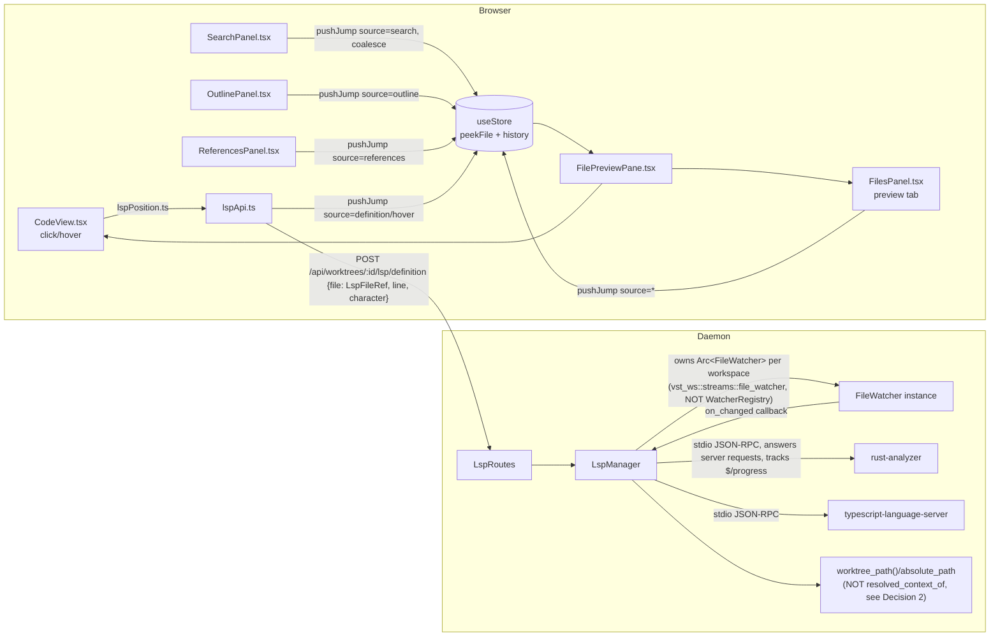
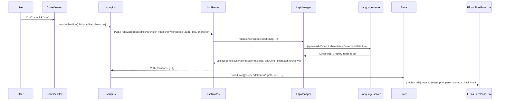

<!--
RULES — read before writing or implementing:
1. FORMAT: Bullets, tables, code, diagrams ONLY — no prose paragraphs
2. REQUIREMENTS: One crisp line each — no verbose descriptions
3. CHECKLIST: Mark items [x] as you complete them — this is your persistent todo list
4. READING TIME: Optimize for fast human scanning — if it's hard to skim, rewrite it
-->

# Plan: Code Navigation (LSP go-to-def, hover/references, outline)

> Adds an LSP-backed daemon subsystem plus a frontend nav layer (go-to-def, hover, references, outline) to the read-only file preview pane, for both worktree and direct sessions.

**Issue:** code-nav-lsp-outline
**Branch:** `feat/code-nav-lsp-outline`
**Status:** Pending
**PRD:** `.vibekit/feature-plans/pending/code-nav-lsp-outline/prd-code-nav-lsp-outline.md`

**Reference files:**
- Data / schema: `rust/vst-types/src/rest/lsp.rs` (new), `rust/vst-types/src/ws.rs` (untouched — no new WS messages, see Decision 4)
- Core logic: `rust/vst-lsp/src/manager.rs` (new crate), `rust/vst-routes/src/lsp.rs` (new)
- UI / entrypoint: `web-ui/src/components/preview/CodeView.tsx`, `web-ui/src/components/tools/FilesPanel.tsx` (preview-tab strip — see Decision 5)
- Wiring (DI / routing / config): `rust/vst-daemon/src/server.rs`, `web-ui/src/hooks/useStore.ts`, `web-ui/src/api/client.ts`

---

## Superseded

| Prior approach | Why it failed | Superseded on |
|-----------------|---------------|----------------|
| First draft: preview tab lived in `CodeView.tsx`; workspace root via `resolved_context_of`; response-level `external` flag; single-string request shape; back/forward hooked only into `setActiveFilePathAtLine`; no document sync; no server→client LSP request handling | Opus plan-review found 12 blocking + 10 minor issues — wrong file cited for the preview tab, a root-resolution bug that misclassifies in-workspace results as external, a request shape that can't reference an already-open external file, missing didOpen/didChange sync (servers never answer), missing indexing detection (looks like dead clicks), a priority-vs-uid bug, and several inconsistent/undefined cross-phase contracts | 2026-09-22, this revision |

---

## Problem & Concept

- See [prd-code-nav-lsp-outline.md](./prd-code-nav-lsp-outline.md) for the full problem statement, options considered, and resolved design questions — not restated here.
- This plan implements the PRD's 3 sub-features in its mandated order: (1) go-to-def + shared preview slot + back/forward + LSP foundation, (2) hover + references, (3) outline — sub-features 2 and 3 cannot ship ahead of sub-feature 1's foundation (PRD § Priority & sequencing).
- Two named risk areas get their own phase per the task brief: the shared-peek-slot/back-forward rework (`FilesPanel.tsx`/`useStore.ts` ownership change — corrected from the prior draft's wrong `SearchPanel.tsx`-only framing, see Decision 5), and the external/out-of-workspace file-serving endpoint (security-sensitive, new).

## Out of Scope

- Everything in PRD § Non-goals (editing, virtual caret, call hierarchy, touch input, cross-worktree nav, LSP-server installation, diff/markdown/historical-commit views, precise hover-cue-before-click).
- Bundling/installing language servers — this plan assumes `rust-analyzer`, `typescript-language-server`, `pyright`/`pylsp`, `gopls` (the four servers covered by Phase 1's registry) are already on the daemon host `PATH`; anything else surfaces PRD R9's "server not found" state, no installer.
- A live WS push channel for LSP status — Phase 1 Decision 4 chooses REST-poll-on-demand; a push channel is called out as a Risk (see Risks/Open Questions) but not built here.
- Cross-language external files (e.g. a Rust workspace's go-to-def landing on a C header via FFI bindings) — Phase 4's external-file support assumes the SAME language server instance can answer for the external path (floating document on the workspace's own server); a genuinely different language is out of scope, flagged as a Risk.

## Requirements

| # | Requirement |
|---|-------------|
| 1 | PRD R1–R9 in full — see PRD § Requirements; not re-enumerated here. |
| 2 | Phase 1 (LSP foundation) ships no new interactive surface — daemon plumbing, document sync, and the click→position resolution *utility* only (not wired to a click handler); the first user-visible affordance (crosshair cursor, actual click handling) ships in Phase 3. |
| 3 | Each phase's checklist + Files & Phase Impact rows must be self-contained per `FORMAT.md`'s self-containment bar — a phase-agent sees only its own phase. |
| 4 | LSP process lifecycle must not block or compete for CPU/IO/build-lock with an agent's own build inside the same worktree (PRD resolved question 15) — see Phase 1 Decision 3. |
| 5 | Every position-taking LSP request (definition/hover/references) and outline must be answerable both for a workspace-relative path AND for an already-open external (out-of-workspace) file — see Decision 6, `LspFileRef`. |

---

## Change Map

```
rust/vst-lsp/                                    + new crate: LSP client + process lifecycle
  src/
    lib.rs                                        + crate root, re-exports
    manager.rs                                     + LspManager: per-workspace server registry, doc sync, indexing detection
    client.rs                                       + stdio JSON-RPC transport, answers server->client requests
    registry.rs                                     + language → server-command lookup table
    position.rs                                     + UTF-16 offset math
    status.rs                                        + LspStatus enum (shared vocabulary, R9)
rust/vst-routes/src/
  lsp.rs                                            + LspRoutes: status/definition/hover/references/outline/external-file
  file_serving.rs                                    + shared read_file_response() used by worktrees.rs, projects.rs, lsp.rs
rust/vst-daemon/src/
  server.rs                                          ~ registers LspManager + LspRoutes, nests routes under /api
rust/vst-types/src/
  rest/lsp.rs                                        + wire types for all LSP REST endpoints (LspFileRef, per-entry external marker)
web-ui/src/
  lib/lspPosition.ts                                 + DOM hit-test: click coords → {line, character}, scoped to .workspace-code-content
  lib/lspApi.ts                                       + typed client wrappers for /lsp/* endpoints
  hooks/useStore.ts                                   ~ peekFile.source/external tag, back/forward stacks, pushJump, filesLeftPaneMode union, pendingReferencesQuery
  hooks/usePreviewedPath.ts                           + shared "what file is the preview showing" hook
  components/tools/SearchPanel.tsx                    ~ roving peek coalesces instead of pushing history; calls pushJump
  components/tools/OutlinePanel.tsx                   + outline mode body
  components/tools/ReferencesPanel.tsx                + references mode body
  components/tools/FilesPanel.tsx                     ~ preview-tab strip: per-source icon, double-click-promote, external badge, LSP status badge
  components/layout/FilesLeftRail.tsx                 ~ adds Outline/References mode buttons
  components/layout/FilesLeftPane.tsx                 ~ renders outline/references bodies per mode, fixes focus-handle ternary
  components/layout/FilePreviewPane.tsx               ~ back/forward buttons, external-file fetch routing
  components/preview/CodeView.tsx                     ~ click/hover handlers, crosshair cursor
```

| Today | After this plan |
|-------|-----------------|
| File preview pane is plain read-only Shiki text with no structural awareness | Ctrl/Cmd-click jumps to a symbol's definition; hover shows type/doc; references list and outline are two new Files-tab left-pane modes |
| `peekFile` is a single slot only `SearchPanel.tsx` writes, and only `FilesPanel.tsx`'s tab-strip renders/clears | `peekFile` carries a `source`/optional `external` tag, is written by 4 surfaces via one `pushJump` action, and is never blind-cleared by one surface for another's peek |
| No navigation history exists | Per-session back/forward stack retraces every preview navigation (tree, tab-switch, search, def, refs, outline) |
| `filesLeftPaneMode` is `"tree" \| "search"` | `filesLeftPaneMode` is `"tree" \| "search" \| "outline" \| "references"` |
| `GET /worktrees/:id/files/*path` / `GET /projects/:id/files/*path` reject any path outside the root | A new, separately-scoped `/lsp/external-file/:token` endpoint serves only paths the daemon's own LSP client previously resolved for that workspace |
| No daemon process ever runs a language server | `LspManager` lazily spawns one language-server child process per `(workspace, language)`, syncs open/changed documents to it, idles it out after inactivity |
| No daemon process ever sends `textDocument/didOpen` to anything | `LspManager` opens/updates documents with the server as files are requested/changed, so servers that require it (typescript-language-server, pyright) actually answer |

---

## Research

- `rust/vst-daemon/src/server.rs:525` — `let api = Router::new()` builds every REST route; `:707` nests it at `.nest("/api", api)` — a new `LspRoutes` must be wired into this same `api` router, never mounted separately (AGENTS.md `/api` invariant).
- `rust/vst-daemon/src/server.rs:342` (`build_state`) — established pattern: construct one `*Routes` struct per resource, threading `opts.store`/`opts.broadcaster`/`opts.paths`; `LspRoutes`/`LspManager` follow the same construction site.
- `rust/vst-routes/src/worktrees.rs:1441-1508` (`get_file`) / `rust/vst-routes/src/projects.rs:1247-1290` (`get_file`) — near-duplicate worktree-scoped and project-scoped (direct-session) file-serving pair, both routed through `resolve_inside_worktree`/`resolve_inside_dir`, both rejecting any path outside their root; `worktrees.rs:1447` computes root as `self.paths.worktree_path(&project.id, wt_id)`, `projects.rs`'s version as `Path::new(&project.absolute_path)` directly off the injected `self.paths`/store data — **neither uses `vst_agents::context::resolved_context_of`.**
- `rust/vst-agents/src/context.rs:38-69` (`resolved_context_of`) / `rust/vst-agents/src/paths.rs:24-33` (`Paths::default()`) — `resolved_context_of` internally constructs `Paths::default()` (always `home_dir().join(".vibe-station")`), NOT the daemon's injected `self.paths` (which tests can point at a tempdir). Using it for LSP root resolution would let the LSP root diverge from `get_file`'s root in any non-default-home environment — this is why Decision 2 (below) resolves the root the same way `get_file` does, not via this helper.
- `rust/vst-proc/Cargo.toml:19` — `libc = "0.2"` is already a workspace dependency for another crate; `vst-lsp` adds its own `libc` dependency for `setpriority` (Decision 3), not a new pattern in this codebase.
- `rust/vst-daemon/src/server.rs:1899-1915` (`worktree_err_to_response`) — existing error-response shape is `{"error": <message>}`, no machine-readable `code` field; LSP's error surface needs to disambiguate several distinct causes that share one HTTP status (e.g. two different `404`s), so `lsp_err_to_response` (Decision 7) extends this shape with an additive `code` field rather than diverging from it.
- `web-ui/src/api/client.ts:101-104` (`fileBase`) — `fileBase(scope: FileScope, id): string` returns `${baseUrl()}/worktrees/:id` or `${baseUrl()}/projects/:id`; every new LSP client call reuses this helper.
- `web-ui/src/hooks/useStore.ts:187` — `peekFile: { worktreeId, path, line, matchText } | null`, a single global slot; `:289,291,303` (`setActiveFile`, `openFileTabNew`, `setActiveFileTabIdx`) are THREE separate actions that change what the preview pane shows and currently record no history at all; `:965-989` (`setActiveFilePathAtLine`, the search-commit/jump-to-open-tab path) is a fourth. All four must feed one history-recording chokepoint (Decision 5).
- `web-ui/src/components/layout/FileTreeSidebar.tsx:107-108` — tree clicks call `setActiveFile`/`openFileTabNew`, **not** `setActiveFilePathAtLine` — the prior draft of this plan incorrectly cited `setActiveFilePathAtLine` as "the tree-click path"; corrected throughout Phase 2 below.
- `web-ui/src/components/tools/FilesPanel.tsx:100-134` — **this, not `CodeView.tsx`, is where the ephemeral preview tab actually renders.** The permanent-tab strip (`:100-113`) and, immediately after, the single `peekFile`-driven preview tab (`:115-131`, `data-active`, tooltip literally reads `"(search preview — not open as a tab)"`, close button calls `clearPeekFile()`) both live in this file's topbar. `CodeView.tsx` has no tab element at all — it only renders code lines. Every "preview tab" interaction (double-click-to-promote, per-source icon, "outside workspace" badge, close button) belongs in `FilesPanel.tsx`, corrected throughout Phase 2/4 below.
- `web-ui/src/components/tools/SearchPanel.tsx:217-242` — on every `query` change (mount included) calls `clearPeekFile()` unconditionally, and `:378` calls it again on empty results — both must become source-gated; `:385`'s arrow-key roving `setPeekFile()` call fires on every roving step, so routing it through `pushJump` unmodified would flood the back stack — it must coalesce (Decision 5).
- `web-ui/src/components/layout/FilePreviewPane.tsx:42-55` — `path` is derived as `peekFile.path` (if context-matched) else `storePath` (`activeFilePath`) — **`pendingLineTarget` is NOT part of path resolution**, it only supplies the scroll-target line once `path` is already decided (consumed later, `:359-366`); the prior draft's Research bullet incorrectly implied `pendingLineTarget` contributes to path. `:42-61`'s full path/scope derivation is extracted into `usePreviewedPath.ts` in Phase 6 (Decision 8).
- `web-ui/src/components/layout/FilesLeftRail.tsx:21-71` — `mode` read from `filesLeftPaneMode[worktreeId] ?? "tree"`, a `switchMode()` helper that also forces `fileTreeVisible` true before switching; the pattern for adding Outline/References buttons.
- `web-ui/src/components/layout/FilesLeftPane.tsx:35,43,57,63` — mode-gated visibility toggles `files-left-pane__hidden` rather than unmounting; `:43`'s `focusActivePane()` ternary is only `mode === "tree" ? treeContainerRef : searchContainerRef` — with 2 more modes added, an outline/references focus request would silently focus the (hidden) search container — must become a mode→ref lookup, fixed in Phase 5.
- `web-ui/src/components/preview/CodeView.tsx:125-175` — `<pre>` of per-line `<div data-line={n}>` containing an `.workspace-code-gutter` span (line number) AND an `.workspace-code-content` span (actual code text) as siblings — a click/caret hit-test that doesn't scope to `.workspace-code-content` would count the gutter's digits as code-text offset; `dangerouslySetInnerHTML` from Shiki HTML, no `onClick`/`onMouseMove` handlers exist today.
- `rust/vst-routes/src/sessions.rs:112-152` (`find_session_context`) — confirms direct sessions are a first-class context distinct from worktree sessions; Phase 1's route pair must cover both.
- `rust/vst-ws/src/handlers/file_watch.rs:29-32` (`SharedWatcher{watcher: Arc<FileWatcher>, subscribers: HashMap<String, WsConnection>}`) — the existing `WatcherRegistry` keys watchers by browser-connection subscribers (`file_watch_subscribers`, `:58-64`) and a watcher's callbacks only ever `conn.send(...)` to those WS connections; it is spawned on the FIRST `file:watch`/`tree:watch` message and torn down at subscriber-count zero (`:164`, `let watcher = Arc::new(FileWatcher::new(callbacks, root.clone()))`). **A daemon-internal consumer with no browser connection cannot register as a `subscribers` entry** — reusing this registry as-is would make document sync silently stop working the moment the last browser tab watching that worktree closes, directly violating PRD resolved question 12 ("independent of connected clients"). `LspManager` therefore does NOT subscribe to this registry (see Decision 9's corrected design).
- `rust/vst-ws/src/streams/file_watcher.rs:29-45` (`FileWatcher`, `WatcherCallbacks{on_changed, on_deleted, on_error}`, `:221` `spawn(&self, abs_path)`) — the underlying primitive `WatcherRegistry` builds ON TOP OF; it is a plain public type (`vst_ws::streams::file_watcher::FileWatcher`) with no WS-connection coupling of its own — `LspManager` constructs and owns its OWN `Arc<FileWatcher>` instance per workspace directly off this type (Decision 9), independent of `WatcherRegistry`/any browser connection.
- `rust/vst-routes/Cargo.toml:14` — `vst-routes` already depends on `vst-ws` (`vst-ws = { workspace = true }`); `vst-ws`'s `lib.rs:46` exposes `pub mod streams` publicly and `vst-ws` has no dependency back on `vst-routes`/`vst-lsp`, so `vst-lsp` adding its own `vst-ws` dependency to reach `FileWatcher` introduces no cycle.
- **Root cause:** no LSP-shaped subsystem exists anywhere in the Rust daemon or the web UI; every sub-feature in the PRD is new capability layered on the existing file-serving/peek-slot/left-pane-mode primitives listed above, which is why Phase 1 must establish shared plumbing — including document sync and indexing detection, both previously missing from this plan — before any UI surface can be built.

---

## Architecture Diagram



---

## Design Details

### System Boundaries

| Boundary | Fields + types | Errors | Source of truth |
|----------|----------------|--------|-----------------|
| Frontend ↔ Backend (`/api/{worktrees,projects}/:id/lsp/*`) | see § API Contracts per endpoint | `404 NOT_FOUND`, `404 LSP_EXTERNAL_TOKEN_EXPIRED`, `409 LSP_NOT_READY`, `422 LSP_UNSUPPORTED`, `500 LSP_SERVER_ERROR` | Daemon (`LspManager` holds live server state; nothing is persisted to `vst-store`) |
| Daemon ↔ language-server child process | LSP 3.17 JSON-RPC over stdio, `Content-Length` framed; daemon answers server→client requests (`window/workDoneProgress/create`, `client/registerCapability`, `workspace/configuration`) | process exit, malformed frame, request timeout (10s) | Each spawned server process; daemon treats it as untrusted/unreliable |
| Module ↔ Module: `LspRoutes` ↔ `LspManager` | `LspManager::request(workspace: WorkspaceKey, root: &Path, lang: &str, req: LspFileRef, kind: LspRequestKind) -> Result<LspResponse, LspError>` | `LspError::{NotFound, Starting, Timeout, ProcessDied, Unsupported, UnknownExternalToken}` | `LspManager` owns all live process handles, doc-sync state, and the external-token map |
| Daemon ↔ `vst_ws::streams::file_watcher::FileWatcher` | `LspManager` constructs and owns one `Arc<FileWatcher>` per workspace it has a live server for, via `WatcherCallbacks{on_changed, on_deleted, on_error}` — NOT via `file_watch.rs`'s connection-keyed `WatcherRegistry` (see Decision 9) | watcher torn down when the corresponding `ServerHandle` goes `stopped` | `LspManager` (owns the instance outright; independent of any browser connection, per PRD resolved question 12) |

### Critical User Journeys (CUJs)

#### CUJ 1 — Ctrl/Cmd-click go-to-definition (happy path, single in-workspace match)



- **Error path — server still indexing:** `LspManager::request` returns `LspError::Starting`; `LspRoutes` returns `409 LSP_NOT_READY`; `lspApi.ts` retries once after the held-request window (~5s, resolved question 10) — if still not ready, click point shows "still starting — click again."
- **Edge case — multiple matches:** `Location[]` has >1 entry → `CodeView.tsx` renders the picker anchored at click point instead of navigating directly.

#### CUJ 2 — External (out-of-workspace) definition, then hover inside it (edge case, spans Phase 3/4/5)

```
User Ctrl/Cmd-clicks a stdlib call (Phase 3)
  → Location classified external:true (root-prefix check, Decision 2) — Phase 3 alone shows
    "Definition is outside this workspace — external file viewing not yet available"
  → [Phase 4 lands] LspRoutes mints an opaque token, LspManager registers a floating
    textDocument (didOpen against the SAME server, file:// URI outside rootUri)
  → Response entry carries { external: true, token, displayPath, line, character }
  → CodeView.tsx opens it via GET /api/worktrees/:id/lsp/external-file/:token
  → Preview shows an "outside workspace" badge, tab is not promotable, back/forward still works
  → [Phase 5 lands] User hovers a symbol INSIDE that external file
  → lspApi.getHover sends {file:{kind:"external",token}, line, character} — LspFileRef's
    external arm (Decision 6) — LspManager resolves token -> already-open floating doc -> hover
```

- **Error path:** token unknown/expired (server restarted) → `404 LSP_EXTERNAL_TOKEN_EXPIRED`; UI shows "no longer available — navigate again."
- **Edge case:** external file's language differs from the workspace's server (Out of Scope) → `422 LSP_UNSUPPORTED` for any request against that token.

### Data Model

- No new persisted entities — `LspManager`'s process table, document-sync state, and external-file token map are all daemon-process-lifetime, in-memory only (PRD resolved question 12: daemon owns doc sync independent of connected clients; resolved question 13: external mappings are "not persisted across reload").
- Frontend: `useWorkspaceStore` gains new in-memory (non-persisted) fields only — see Phase 2/5 Data Model notes in their own sections.
- **Migration:** N — no schema/store changes.

### API Contracts

_All new endpoints below are added twice — once under `/worktrees/:id/lsp/...` (worktree sessions) and once under `/projects/:id/lsp/...` (direct sessions) — mirroring the existing `get_file` pair. Only the worktree form is shown._

```
LspFileRef = { kind: "workspace", path: string } | { kind: "external", token: string }
  — the SUBJECT of a request: a workspace-relative file, or an already-open external file
    (Decision 6). "workspace" is all Phase 1/3 need; "external" only resolves once Phase 4's
    token map exists — until then the daemon returns 422 LSP_UNSUPPORTED for a "external" ref.

GET /api/worktrees/:id/lsp/status?path=<relpath>
  Response: { status: LspStatus, language: string | null }
  LspStatus = "unsupported" | "not_found" | "starting" | "indexing" | "ready" | "idle" | "stopped" | "error"
  Errors: 404 NOT_FOUND (worktree)

POST /api/worktrees/:id/lsp/definition
  Request:  { file: LspFileRef, line: uint, character: uint }
  Response: { locations: Location[] }
  Location: { line: uint, character: uint, preview: string } &
            ( { external: false, path: string }
            | { external: true, path: null, token: string | null, displayPath: string | null } )
            — token/displayPath are null until Phase 4 lands; a Phase-3-only build still marks
              external:true so the client can show "not yet available" instead of guessing.
  Errors:   404 NOT_FOUND, 409 LSP_NOT_READY, 422 LSP_UNSUPPORTED, 500 LSP_SERVER_ERROR, 500 {code:"LSP_ERROR"}

POST /api/worktrees/:id/lsp/hover        — same request shape; Response: { signature: string, doc: string | null } | { empty: true }
POST /api/worktrees/:id/lsp/references   — same request shape; Response: { references: ReferenceGroup[], hasMore: boolean, cursor: string | null }
  ReferenceGroup: { path: string | null, external: boolean, token: string | null, displayPath: string | null,
                     entries: { line: uint, character: uint, preview: string, isDeclaration: boolean }[] }
                   — same per-group external marker as Location (Decision 9's blocking #9 fix), so a
                     reference set mixing workspace + external hits (e.g. impl + std trait) is representable.
GET  /api/worktrees/:id/lsp/outline?file=<workspace:relpath | external:token>
  Response: { symbols: OutlineSymbol[] } | { unsupported: true }
  OutlineSymbol: { name: string, kind: string, line: uint, character: uint, endLine: uint, children: OutlineSymbol[] }
GET  /api/worktrees/:id/lsp/external-file/:token
  Response: same shape as GET /worktrees/:id/files/*path (`FileResponse::Text{etag,content}`)
  Errors:   404 LSP_EXTERNAL_TOKEN_EXPIRED
```

### Key Decisions

#### Decision 1: New crate `vst-lsp` owns the JSON-RPC transport and process registry

- **Decision:** a new crate `rust/vst-lsp` implements an LSP 3.17 client (stdio, `Content-Length` framing, request/response correlation, AND handling of server→client requests/notifications — see Decision 3-bis below) and `LspManager`.
- **Rationale:** no process-manager or JSON-RPC abstraction exists in the repo; a dedicated crate matches the existing one-crate-per-concern layout (`vst-proc`, `vst-store`, …) per AGENTS.md's Rust crate list.
- **Where:** `rust/vst-lsp/src/client.rs` (transport), `rust/vst-lsp/src/manager.rs` (registry + lifecycle), `rust/Cargo.toml` (add `vst-lsp` to workspace members).

```rust
// manager.rs — the shape every LspRoutes call goes through.
pub struct LspManager {
    servers: Mutex<HashMap<(WorkspaceKey, String), ServerHandle>>,
    // Owned filesystem watchers, one per workspace with a live ServerHandle —
    // built directly off vst_ws::streams::file_watcher::FileWatcher, NOT the
    // WS-connection-keyed WatcherRegistry (Decision 9: that registry has no
    // subscriber slot for a daemon-internal, connection-less consumer).
    watchers: Mutex<HashMap<WorkspaceKey, Arc<vst_ws::streams::file_watcher::FileWatcher>>>,
}
impl LspManager {
    pub async fn request(
        &self,
        workspace: WorkspaceKey,
        root: &Path,
        lang: &str,
        file: LspFileRef,
        kind: LspRequestKind, // Definition | Hover | References | Outline
        pos: Option<(u32, u32)>, // (line, character); None for Outline
    ) -> Result<LspResponse, LspError> {
        // 1. look up or lazily spawn ServerHandle for (workspace, lang) — spawn-on-first-use.
        // 2. resolve `file` to a URI: LspFileRef::Workspace -> root.join(path); ::External(token)
        //    -> external-token map lookup (Decision 6) -> UnknownExternalToken if missing.
        // 3. ensure a didOpen has been sent for that URI on this handle (Decision 9); for a
        //    workspace file already open, an out-of-date didChange is sent if content moved on.
        // 4. if ServerHandle.status is Starting/Indexing, return LspError::Starting immediately
        //    (never block the request task — caller owns the ~5s hold/retry).
        // 5. forward the LSP request over the handle's JSON-RPC client, await with a 10s timeout.
    }
}
```

#### Decision 2: Workspace root resolution matches `get_file` exactly — NOT `resolved_context_of`

- **Decision:** `LspRoutes` resolves the root the same way `worktrees.rs:1447`/`projects.rs` already do: `self.paths.worktree_path(&project.id, &worktree.id)` for a worktree, `PathBuf::from(&project.absolute_path)` for a direct session — both off the daemon's own injected `self.paths`/store data. It does NOT call `vst_agents::context::resolved_context_of`.
- **Rationale:** Research confirms `resolved_context_of` builds `Paths::default()` internally (always `$HOME/.vibe-station`), independent of whatever `Paths` instance the daemon was actually constructed with (e.g. a tempdir in tests, or any non-default home) — using it here would let the LSP root silently diverge from `get_file`'s root, which is exactly the bug Phase 4's inside/outside-workspace classification depends on being correct. `get_file`'s existing resolution is therefore the one source of truth to mirror, not `resolved_context_of`.
- **Where:** `rust/vst-routes/src/lsp.rs` (new) — `WorkspaceKey::Worktree{project_id, worktree_id}` / `WorkspaceKey::Project{project_id}`, root resolved inline exactly like `get_file`'s two implementations, no dependency on `vst-agents::context`.

#### Decision 3: Idle shutdown, priority via `setpriority` (not `.uid()`), and build-lock isolation via `checkOnSave: false` + dedicated `CARGO_TARGET_DIR`

- **Decision:** each spawned language-server child process is (a) marked `idle` after 5 minutes with no requests and hard-`stopped` (process killed) after 10, both surfaced via `LspStatus`; (b) spawned with best-effort lowered scheduling priority via `libc::setpriority(PRIO_PROCESS, 0, 10)` inside a `pre_exec` hook (Unix only) — **not** `.uid()`, which changes the process's user identity, not its scheduling priority; (c) for `rust-analyzer` specifically, spawned with `initializationOptions.checkOnSave.enable = false` (diagnostics are out of scope anyway, PRD Non-goals) and `CARGO_TARGET_DIR` pointed at a dedicated per-workspace directory (`<vst_home>/lsp-target/<workspace-key>`), so the server's own `cargo check` never contends for the SAME `target/` directory lock an agent's own `cargo build` takes in the worktree.
- **Rationale:** answers PRD resolved question 15 concretely — CPU/IO priority alone does not prevent lock contention, since `cargo`'s build-directory lock is mutual exclusion regardless of process priority; the real fix is either disabling the server's own build step or giving it a separate target dir. `.uid()` was a bug in the prior draft (wrong syscall for the stated goal).
- **Where:** `rust/vst-lsp/src/manager.rs` (spawn call, `pre_exec` hook, idle/stopped sweep), `rust/vst-lsp/src/registry.rs` (`rust-analyzer`'s `initializationOptions`/env entry), `rust/vst-lsp/Cargo.toml` (add `libc = "0.2"`, matching `vst-proc`'s existing dependency, Research).

#### Decision 3-bis: The LSP client answers server→client requests and tracks `$/progress` for indexing state

- **Decision:** `vst-lsp/src/client.rs` handles the 3 server→client requests `rust-analyzer`/`typescript-language-server` commonly send (`window/workDoneProgress/create`, `client/registerCapability`, `workspace/configuration` — each answered with a minimal valid empty/default response) instead of only doing request/response correlation for daemon-initiated calls; it also parses `$/progress` notifications (`begin`/`report`/`end`, correlated by `token`) to drive `ServerHandle.status` transitions: `Starting` (spawned, `initialize` in flight) → `Indexing` (a `$/progress begin` with an indexing-shaped title seen, OR the fixed default below) → `Ready` (a matching `$/progress end`, OR — for servers that never send progress — a fixed 2s settle window after `initialize` response with no progress activity).
- **Rationale:** the prior draft treated `initialize`'s response alone as "ready", which is wrong for `rust-analyzer` (answers `initialize` immediately, then spends real time indexing before it can usefully answer `textDocument/definition`) — this is exactly the "click looks dead during indexing" failure R9/resolved-question-10 explicitly forbid. Ignoring server→client requests also breaks `rust-analyzer`, which blocks/degrades if `client/registerCapability` and `workspace/configuration` are never answered.
- **Where:** `rust/vst-lsp/src/client.rs` (server-request dispatch table), `rust/vst-lsp/src/manager.rs` (`ServerHandle::status` state machine keyed off `$/progress`).

#### Decision 4: LSP status is REST-poll-on-demand, not a WS push channel

- **Decision:** Phase 1 does NOT add a new WS message type for LSP status; `GET /lsp/status` is polled by a small `LspStatusBadge` (mounted in `FilesPanel.tsx`'s topbar, see Decision 5) on mode-enter and every ~5s while a code-nav surface is visible, stopped on unmount.
- **Rationale:** the `WatcherRegistry` push template exists but adding a live push channel means a new `ClientMessage`/`ServerMessage` variant, a new dispatch lane (`dispatch_lane_key`, `server.rs:1052`), and per-connection subscriber bookkeeping — real added surface for a status line that changes a few times per session; poll-on-demand covers R9's states with zero new WS surface. Flagged as a Risk if polling proves laggy.
- **Where:** `web-ui/src/lib/lspApi.ts` (poll loop), `web-ui/src/components/tools/FilesPanel.tsx` (badge placement, Phase 3 for starting/indexing/ready, Phase 5 for the remaining states).

#### Decision 5: The preview tab lives in `FilesPanel.tsx`, not `CodeView.tsx` — corrects the prior draft

- **Decision:** every "preview tab" behavior added by this plan (per-source icon, double-click-to-promote, "outside workspace" badge, the close button) is implemented in `FilesPanel.tsx`'s existing topbar (`:100-134`), which already owns BOTH the permanent-tab strip and the single ephemeral `peekFile`-driven preview tab. `CodeView.tsx` gets ONLY code-body interactions (click, hover, crosshair cursor) — it has no tab element and never did.
- **Rationale:** Research confirms `FilesPanel.tsx:115-131` is the actual preview-tab element (its tooltip literally says "search preview — not open as a tab", its close button calls `clearPeekFile()`); the prior plan draft invented a nonexistent tab inside `CodeView.tsx`. This decision is the fix for that misattribution and is referenced by every phase item that touches the preview tab.
- **Where:** `web-ui/src/components/tools/FilesPanel.tsx:115-131` (extend the existing preview-tab `<span>`) — see Phase 2 (icon + double-click), Phase 4 (external badge), Phase 3/5 (status badge).

#### Decision 6: `LspFileRef` — every position-taking request names its subject explicitly

- **Decision:** `definition`/`hover`/`references`/`outline` all take a `file: LspFileRef` field (`{kind:"workspace", path}` or `{kind:"external", token}`) instead of a bare `path: string`, from Phase 1 onward — even though only the `"workspace"` arm is implemented until Phase 4.
- **Rationale:** without this, a request made while viewing an external (out-of-workspace) file has no way to say what it's asking about — an external file has no workspace-relative path — so hover/go-to-def/outline "still work inside them" (PRD resolved question 13) would be structurally unimplementable no matter which later phase tried to add it. Defining the shape once in Phase 1 means Phase 4/5/6 only add a new `match` arm, not a breaking request-shape change.
- **Where:** `rust/vst-types/src/rest/lsp.rs` (`LspFileRef` type, Phase 1), `rust/vst-lsp/src/manager.rs::request` (resolves either arm, Phase 1 stubs `"external"` as `LspError::Unsupported` until Phase 4).

#### Decision 7: `{error, code}` — additive extension of the existing error-response shape

- **Decision:** `lsp_err_to_response(err: LspRouteError) -> (StatusCode, Json<Value>)` returns `{"error": <human message>, "code": <SCREAMING_SNAKE machine code>}` — e.g. `{"error": "Language server still starting", "code": "LSP_NOT_READY"}`.
- **Rationale:** the existing `worktree_err_to_response`/`ProjectRouteError` pattern (Research, `server.rs:1899-1915`) uses bare `{"error": msg}`; LSP errors need a machine-readable discriminant because several distinct causes share one HTTP status (e.g. `404` covers both "worktree not found" and "external token expired", which the client must handle differently). Adding `code` alongside the existing `error` field is additive, not a divergence from the established shape.
- **Where:** `rust/vst-routes/src/lsp.rs` (`LspRouteError` enum + `lsp_err_to_response`).

#### Decision 8: `usePreviewedPath(worktreeId)` — one hook, not a re-derivation per consumer

- **Decision:** extract `FilePreviewPane.tsx:42-61`'s `path`/`scope` derivation logic into `web-ui/src/hooks/usePreviewedPath.ts`, returning `{ path: string | null; scope: DiffScope; fileScope: FileScope; isWorkingTreeView: boolean; external: { token: string; displayPath: string } | null }`; both `FilePreviewPane.tsx` and `OutlinePanel.tsx` call it instead of `OutlinePanel.tsx` reading raw store fields itself, and `FilePreviewPane.tsx` reuses its `external` field for the `lspFileRef` prop (**3.1b**) it passes to `CodeView.tsx` instead of re-deriving `peekFile.external` a second time.
- **Rationale:** `OutlinePanel.tsx` needs to "track whatever file the preview is showing" (R7) and gate itself off diff/markdown/commit view — that logic already exists inline in `FilePreviewPane.tsx` and must not be re-derived (and potentially drift) in a second component; the same is true of `external` — go-to-def (3.1b), hover (5.4), and outline (6.3) all need to know "is the currently-shown file a workspace path or an external peek" and must derive that fact identically, not three times.
- **Where:** `web-ui/src/hooks/usePreviewedPath.ts` (new, Phase 6), `web-ui/src/components/layout/FilePreviewPane.tsx:42-61` (refactored to call it), `web-ui/src/components/tools/OutlinePanel.tsx` (calls it).

#### Decision 9: `LspManager` owns its own `FileWatcher` instance per workspace — it does NOT subscribe to `file_watch.rs`'s `WatcherRegistry`

- **Decision:** `LspManager` constructs and owns one `Arc<vst_ws::streams::file_watcher::FileWatcher>` per `WorkspaceKey` it has a live `ServerHandle` for — built the same way `file_watch.rs:164` builds its own (`FileWatcher::new(callbacks, root)` + `.spawn(abs_path)`), but as a private instance `LspManager` creates, owns, and tears down itself, with NO entry in `file_watch.rs`'s connection-keyed `subscribers: HashMap<String, WsConnection>`. On a change callback for a file the server has open, it sends `textDocument/didChange` (workspace files) or `workspace/didChangeWatchedFiles` (for files the server watches but hasn't been `didOpen`'d); a file is `didOpen`'d the first time any LSP request touches it. The watcher is created lazily alongside the workspace's `ServerHandle` (spawn-on-first-use, same trigger) and torn down when that handle goes `stopped` (Decision 3's idle/stopped sweep).
- **Rationale:** `file_watch.rs`'s `WatcherRegistry` (Research) has no subscriber slot for a consumer that isn't an actual `WsConnection` — its watcher is spawned on the first `file:watch` message and torn down at subscriber-count zero, so reusing it as "just another subscriber" (the prior draft's claim) would mean document sync silently stops the moment the last browser tab watching that worktree closes, which directly breaks PRD resolved question 12's "independent of connected clients" requirement. `FileWatcher` itself (the primitive `WatcherRegistry` builds on) has no such coupling, so `LspManager` uses it directly instead. The cost is one extra live watcher per workspace with an active language server (in addition to whatever `WatcherRegistry` watcher browser clients may separately have open on the same tree) — accepted, since correctness (PRD resolved question 12) matters more than de-duplicating inotify watches here, and Decision 3's idle/stopped sweep already bounds how many workspaces can have one open at once.
- **Where:** `rust/vst-lsp/Cargo.toml` (add `vst-ws = { workspace = true }` dependency — no cycle, Research), `rust/vst-lsp/src/manager.rs` (owns `watchers: Mutex<HashMap<WorkspaceKey, Arc<FileWatcher>>>`, dispatches didChange/didChangeWatchedFiles from its own callbacks) — `rust/vst-ws/src/handlers/file_watch.rs` genuinely needs no changes, since `LspManager` never touches `WatcherRegistry` at all.

---

## Risks / Open Questions

| # | Question | Notes |
|---|----------|-------|
| 1 | **Is 5s an acceptable p99 for a cold `rust-analyzer` spawn+index on a large workspace?** | Acceptable per PRD ("still starting — click again" is explicit, not a bug); worth a real-repo timing check during Phase 1 verification. |
| 2 | **Does REST-poll status (Decision 4) feel laggy for "indexing → ready"?** | If so, the `WatcherRegistry` template is the documented fallback — not built now. |
| 3 | **`typescript-language-server` requires a `tsconfig.json`/`package.json` at the workspace root — what if the worktree root isn't one?** | Phase 1's `registry.rs` initializes with the resolved workspace root regardless; a monorepo subpackage-root mismatch shows as `status: "error"` per R9, no root-finding heuristic in this version. |
| 4 | **Multiple worktrees of the same project — resource cost of N `rust-analyzer` processes?** | Decision 2's `WorkspaceKey` enforces one-per-worktree per PRD Open Question 2's proposed answer; Decision 3's idle/stopped sweep bounds steady-state cost. |
| 5 | **Cross-language external file (Out of Scope)** | A `.rs` workspace's definition landing on a non-Rust file (rare, e.g. build-script-generated bindings) returns `422 LSP_UNSUPPORTED` for any request against its token — no cross-server bridging in this version. |
| 6 | **`$/progress`-less servers (Decision 3-bis)** | The 2s settle-window fallback may mark "ready" before a slow indexer that doesn't emit progress is actually done — acceptable degraded UX (a `409` on the next click just re-triggers the hold/retry), not a correctness bug. |

---

## Implementation Phases

- Each phase ends with a **verification block** — the phase is not complete until those tests pass.
- Test items use `N.Tn` numbering to distinguish them from implementation items.
- **Corrected dependency order: 1 → 2 → 3, then {4, 5} in parallel. Phase 5's `LspFileRef::External` support (hover/references against an already-open external file) is a SOFT dependency on Phase 4 — Phase 5 implements the same conditional "if Phase 4 has landed, use it; else stub `Unsupported` for that one arm" pattern Phase 6.2 already uses for outline, so Phase 5 does not hard-block on Phase 4 shipping first (its workspace-file hover/references are fully independent of Phase 4). Phase 6 depends on Phase 1 (LSP foundation, outline stub) and Phase 2 (the `pushJump` helper) only — it does NOT depend on Phase 3/4/5 and may run in parallel with any of them once Phase 2 lands.**

---

### Phase 1 — LSP foundation (daemon process lifecycle + workspace resolution + document sync + click→position plumbing)

- [x] **1.1** New crate `rust/vst-lsp`: `Cargo.toml` (deps: `tokio`, `serde`/`serde_json`, `libc = "0.2"`), `src/lib.rs`, `src/client.rs` (stdio JSON-RPC transport: `Content-Length` framing, `initialize`/`initialized` handshake, request/response correlation by numeric id, 10s per-request timeout via `tokio::time::timeout`).
- [x] **1.2** `client.rs`: answer the 3 common server→client requests — `window/workDoneProgress/create` (empty success result), `client/registerCapability` (empty success result), `workspace/configuration` (respond with one empty `{}` per requested item) — and parse `$/progress` notifications, exposing them via a `progress_rx` channel the manager consumes (Decision 3-bis).
- [x] **1.3** `rust/vst-lsp/src/registry.rs`: `LanguageServerConfig { command: &str, args: Vec<String>, extensions: &[&str], init_options: Option<serde_json::Value>, extra_env: Vec<(String,String)> }` static table for rust (`rust-analyzer`, `checkOnSave.enable: false`), TypeScript/JS (`typescript-language-server --stdio`), Python (`pyright-langserver --stdio`), Go (`gopls`); `fn lookup(ext: &str) -> Option<&LanguageServerConfig>`.
- [x] **1.4** `rust/vst-lsp/src/status.rs`: `LspStatus` enum with exactly the 8 variants listed in § API Contracts (`unsupported`/`not_found`/`starting`/`indexing`/`ready`/`idle`/`stopped`/`error`) — `idle` (5 min no requests, process still warm) is distinct from `stopped` (10 min, process killed); both map to R9's "stopped — click to resume" UI bucket but `idle`→`ready` needs no respawn.
- [x] **1.5** `rust/vst-lsp/src/manager.rs`: `LspManager`, `WorkspaceKey` enum (`Worktree{project_id, worktree_id}` / `Project{project_id}`), `ServerHandle` (child process + client + `$/progress`-driven status + last-request `Instant`), `LspFileRef`/`LspRequestKind` per Decision 6, spawn-on-first-`request()` per Decision 1 snippet; `"external"` `LspFileRef` arm returns `LspError::Unsupported` in this phase (Phase 4 implements it).
- [x] **1.6** Idle/stopped sweep task (Decision 3) + `pre_exec` + `libc::setpriority` on spawn (Unix `#[cfg(unix)]`, no-op elsewhere) + `checkOnSave: false`/dedicated `CARGO_TARGET_DIR` for the rust-analyzer config.
- [x] **1.7** Document sync (Decision 9): `LspManager` builds and owns its own `Arc<vst_ws::streams::file_watcher::FileWatcher>` per workspace it has a live `ServerHandle` for (NOT a subscription to `vst-ws`'s connection-keyed `WatcherRegistry` — see Decision 9's corrected design), spawned alongside the `ServerHandle` and torn down with it; on first request touching a file, sends `textDocument/didOpen`; on a subsequent watcher callback (`on_changed`) for an open file, sends `textDocument/didChange` (full-document sync, simplest correct option — incremental sync is a later optimization, not required for correctness). `rust/vst-lsp/Cargo.toml` gains a `vst-ws = { workspace = true }` dependency for this.
- [x] **1.8** `rust/vst-lsp/src/position.rs`: UTF-16 code-unit column math — `fn utf16_col_to_byte_offset(line: &str, utf16_col: u32) -> usize` and the inverse, unit-tested against multi-byte (emoji/CJK) input.
- [x] **1.9** `rust/vst-types/src/rest/lsp.rs`: `LspFileRef`, `LspStatus`, and `status`/`definition`/`hover`(stub)/`references`(stub)/`outline`(stub) request/response shapes from § API Contracts, including the per-entry `external`/`token`/`displayPath` fields on `Location` (Decision 6/blocking-fix for response granularity) — Serde `camelCase`.
- [x] **1.10** `rust/vst-routes/src/file_serving.rs` (new): extract `read_file_response(abs_path: &Path) -> Result<FileResponse, FileServingError>` (the size/binary/etag/mime block currently duplicated at `worktrees.rs:1458-1507` AND `projects.rs`'s equivalent) — used by both existing `get_file` impls (refactor, no behavior change) and, in Phase 4, the new external-file endpoint.
- [x] **1.11** `rust/vst-routes/src/lsp.rs`: `LspRoutes` struct (`store`, `paths`, `lsp_manager: Arc<LspManager>`), `LspRouteError` enum, `lsp_err_to_response` (Decision 7), methods `status(workspace, path)` and `definition(workspace, file, line, character)` — root resolved per Decision 2 (mirrors `get_file`, no `resolved_context_of`). Each `Location` the manager returns is classified `external` via a root-prefix check on the resolved absolute path. `hover`/`references`/`outline` bodies return `LspRouteError::Unsupported` in this phase.
- [x] **1.12** `rust/vst-daemon/src/server.rs`: construct `LspManager` + `LspRoutes` in `build_state()`; add `.route("/worktrees/:id/lsp/status", get(...))`/`.../lsp/definition` (POST) and the `/projects/:id/...` twins inside the existing `api` router built at `:525` (never a second `.nest`).
- [x] **1.13** `web-ui/src/lib/lspPosition.ts`: split into (a) a pure `resolveOffsetInLine(node: Node, offset: number, contentEl: HTMLElement): {line, character} | null` that walks up from a DOM `(node, offset)` pair to the nearest `.workspace-code-content` ancestor (rejecting a hit inside `.workspace-code-gutter`) and its enclosing `[data-line]`, converting text-offset to UTF-16 `character`; and (b) `resolveClickPosition(clientX, clientY, codeContainer): {line, character} | null`, a thin wrapper calling `document.caretPositionFromPoint`/`caretRangeFromPoint` and feeding the result into (a).
- [x] **1.14** `web-ui/src/lib/lspApi.ts`: `getLspStatus(api, scope, id, path)`, `getDefinition(api, scope, id, file: LspFileRef, line, character)` typed wrappers using `fileBase(scope, id)` — `getHover`/`getReferences`/`getOutline`/`getExternalFile` are typed but throw `"not implemented until a later phase"` placeholders in this phase.

**Verify phase 1:**
- [x] **1.T1** Unit — `vst-lsp::position` (`#[cfg(test)]` in `position.rs`): `utf16_col_to_byte_offset` round-trips for an ASCII line, a line with a 4-byte emoji before the target column, and a CJK line.
- [x] **1.T2** Integration — `rust/vst-lsp/tests/client_test.rs`: a fake child process (test double writing framed JSON-RPC to a pipe) round-trips one `initialize` request, correctly answers a scripted `client/registerCapability` server→client request, and surfaces a scripted `$/progress` begin/end pair to the `progress_rx` channel.
- [x] **1.T3** Integration — `rust/vst-lsp/tests/manager_test.rs`: two `request()` calls with the same `WorkspaceKey`+language reuse one `ServerHandle`; status transitions `Starting`→`Indexing`→`Ready` only after the fake process's scripted `$/progress end`, NOT merely after `initialize`'s response (regression guard for Decision 3-bis).
- [x] **1.T4** Integration — `rust/vst-lsp/tests/manager_test.rs`: a `didChange` is sent to the fake process when the manager's OWN `FileWatcher` instance's `on_changed` callback fires for a file the manager has previously `didOpen`'d; a second assertion confirms this fires with zero `WsConnection`/browser subscribers present (regression guard for Decision 9 — document sync must not depend on a connected client).
- [x] **1.T5** Integration — `rust/vst-routes/tests/lsp_test.rs`: `GET /api/worktrees/:id/lsp/status` and `GET /api/projects/:id/lsp/status` against fixtures resolve root via the SAME path a parallel `get_file` call resolves (regression guard for Decision 2 — the prior bug this fixes).
- [x] **1.T6** Unit — `web-ui/src/lib/lspPosition.test.ts`: `resolveOffsetInLine` given a synthetic DOM fragment (built directly, not via JSDOM's unsupported `caretRangeFromPoint`) with a `.workspace-code-gutter` + `.workspace-code-content` pair returns `null` for an offset inside the gutter node and the correct `{line, character}` for an offset inside the content node, including across a Shiki `<span>` boundary.

---

### Phase 2 — Shared preview slot + back/forward history

- [x] **2.1** `useStore.ts:187`: extend `peekFile` type to `PeekFileValue = { worktreeId, path, line, matchText, source: "search" | "definition" | "references" | "outline", external?: { token: string; displayPath: string } }`.
- [x] **2.2** `useStore.ts`: `type PeekEntry = { kind: "peek"; value: PeekFileValue } | { kind: "committed"; worktreeId: string; path: string; line: number | null }` — add `backStack: Record<string, PeekEntry[]>`, `forwardStack: Record<string, PeekEntry[]>`, keyed by the same layout key `peekFile` uses.
- [x] **2.3** `useStore.ts`: **one** exported action, signature pinned here for every later phase to call verbatim:
  ```ts
  pushJump(next: {
    worktreeId: string; path: string; line: number; matchText: string | null;
    source: "search" | "definition" | "references" | "outline";
    external?: { token: string; displayPath: string };
    coalesce?: boolean; // true: replace peekFile in place, no history push (roving search only)
  }): void
  ```
  Behavior, checked IN THIS ORDER (review fix N1 — `coalesce` MUST be checked before the already-open-tab check, not after: `SearchPanel.tsx`'s roving call (**2.7**) always peeks, even when the arrowed-to result's file happens to already be open as a permanent tab, so if the tab-check ran first it would route every roving step through the tab-scroll path below — which itself calls `recordHistoryEntry` — re-flooding the back stack `coalesce` exists to prevent, and breaking regression test **2.T7**):
  (a) if `coalesce && peekFile?.source === next.source`, replace `peekFile` in place, no stack push, no tab-check — this must win even if `next.path` is already an open tab, so a roving search step never routes through the tab-scroll path;
  (b) else if `openFileTabsByWorktree[worktreeId]` already contains `next.path` and `!next.external`, skip the peek slot entirely — call the existing tab-scroll logic instead (folds in what the prior draft called "2.11"; this path DOES record history, since it's a discrete jump, not a roving step);
  (c) else record the CURRENT `peekFile` (as a `{kind:"peek"}` entry) or, if none, the current committed `{activeFilePath, pendingLineTarget?.line ?? null}` (as `{kind:"committed"}`) onto `backStack[key]`, clear `forwardStack[key]`, set `peekFile: next` (external stripped from the type when absent).
- [x] **2.4** `useStore.ts`: `recordHistoryEntry(s, key)` internal helper — the SAME "snapshot current peek-or-committed state onto `backStack`, clear `forwardStack`" logic `pushJump` uses. `setActiveFile` (`:885`) gains a second, optional parameter — `setActiveFile: (path: string | null, opts?: { skipHistory?: boolean }) => void` — so it can be called two ways: normally (tree clicks, `opts` omitted → calls `recordHistoryEntry` first, same as today's behavior after this phase) and, from **2.5** only, with `{skipHistory: true}` (history-restore path, does NOT call `recordHistoryEntry`). `openFileTabNew` (`:941`) and `setActiveFileTabIdx` (`:1019`) call `recordHistoryEntry` unconditionally (no restore path ever goes through them — see **2.5**). `setActiveFilePathAtLine` (`:965-989`) also calls it unconditionally. Net effect: tree clicks, new-tab-opens, tab switches, AND search-commits are all history-tracked (R4: "every preview-pane navigation" — the prior draft only wired `setActiveFilePathAtLine`, missing `setActiveFile`/`openFileTabNew`/`setActiveFileTabIdx`, Research `FileTreeSidebar.tsx:107-108`).
- [x] **2.5** `useStore.ts`: new actions `navigateBack(key)` / `navigateForward(key)` — pop from one stack, push a snapshot of the CURRENT state onto the other, then restore the popped entry: a `{kind:"peek"}` entry sets `peekFile` directly (peeks were never tabs, a raw field set is correct here); a `{kind:"committed"}` entry calls `setActiveFile(entry.path, { skipHistory: true })` (**2.4**'s new param) — NOT a raw `activeFilePath` field set — because `setActiveFile`'s existing "replace active tab in place" logic (`useStore.ts:906-937`, "Replace active tab (tree-navigation intent)") is what keeps `activeFileTabIdxByWorktree` in sync with whatever tab is now showing; a raw field set would desync the tab index from the restored path (review fix N3). Restoring a `{kind:"committed"}` entry's `line` (if any) additionally sets `pendingLineTarget` directly (no tab-index implication, safe to set raw) after the `setActiveFile` call. Both entry kinds' restore paths **must bypass `pushJump`/`recordHistoryEntry`** for the history-stack write itself (already true for `{kind:"peek"}`; true for `{kind:"committed"}` because `{skipHistory:true}` suppresses `setActiveFile`'s own `recordHistoryEntry` call) — otherwise restoring would itself record a new history entry and corrupt the stacks (fixes the back/forward self-corruption bug flagged in review).
- [x] **2.6** `SearchPanel.tsx:217-242`: replace the unconditional `clearPeekFile()` in the query-change effect with a source-gated version (only clears if `peekFile?.source === "search"`), same at `:378`; `useStore.ts`'s `clearPeekFile` gains an optional `{ ifSource }` param.
- [x] **2.7** `SearchPanel.tsx:385`'s arrow-key roving-peek call site: change `setPeekFile({...})` to `pushJump({..., source: "search", coalesce: true})` — `coalesce: true` is load-bearing here: without it, roving through N search results would push N entries onto `backStack` (flagged in review as history-flooding).
- [x] **2.8** `web-ui/src/components/tools/FilesPanel.tsx:115-131` (Decision 5): add a per-`source` icon next to the existing `<Search size={13}/>` (e.g. definition → a "go to" glyph, references → a list glyph, outline → an outline glyph — exact icon choice left to implementation, must be visually distinct from the search icon per PRD R2 "tagged with its own icon"); add `onDoubleClick` on the tab `<span>` promoting the current peek to a permanent tab (calls `openFileTabNew`/`setActiveFile`-equivalent commit path with the peek's current path/line) — genuinely new behavior, no `onDoubleClick` exists here today.
- [x] **2.9** `FilePreviewPane.tsx`: add `◀ ▶` back/forward buttons (Screen layouts mock) wired to `navigateBack`/`navigateForward`, disabled when the respective stack is empty — the buttons are the PRIMARY interaction, always available regardless of shortcut collisions on a given OS. Add keyboard shortcut `Alt+Shift+ArrowLeft` / `Alt+Shift+ArrowRight` (same combination on macOS) scoped to the preview pane's focus context — chosen because it collides with NEITHER the browser's own back/forward (`Alt+Left/Right` on Windows/Linux, `Cmd+[`/`Cmd+]` on macOS) NOR the two collisions the prior draft's `Ctrl+Alt+ArrowLeft/Right` had: GNOME's `Ctrl+Alt+Arrow` workspace-switch shortcut, and Chrome/Safari's `Cmd+Alt+ArrowLeft/Right` tab-switch shortcut on macOS. **Verify against `web-ui/src/hooks/useWorkspaceKeyboardShortcuts.ts`'s existing bindings before finalizing** (this is the actual file to check, not an unnamed "global-hotkey table").

**Verify phase 2:**
- [x] **2.T1** Unit — `useStore.ts` `pushJump`: calling it while `peekFile.source === "search"` pushes that entry onto `backStack` and replaces `peekFile` with a new `source: "definition"` entry; calling it with `coalesce: true` and a matching current source replaces in place with no stack push; calling it with `coalesce: true` where `next.path` IS already in `openFileTabsByWorktree` still replaces `peekFile` in place (does NOT route through the tab-scroll branch) — regression guard for N1's branch-order fix.
- [x] **2.T2** Unit — `useStore.ts` `clearPeekFile({ifSource: "search"})`: no-ops when `peekFile.source === "definition"`; clears when `"search"`.
- [x] **2.T3** Integration — `SearchPanel.test.tsx`: (a) typing a new query while a `definition`-sourced peek is active does NOT clear it; (b) arrow-roving through 5 search results leaves `backStack` unchanged (coalesce guard).
- [x] **2.T4** Integration — back/forward: (a) jump A (search) → jump B (definition) → `navigateBack` restores A into the peek slot and moves B onto `forwardStack` WITHOUT re-triggering `recordHistoryEntry` (assert `backStack.length` after the restore matches expectation, not inflated); `navigateForward` restores B; (b) a tree click (committed, no peek) followed by a search jump, then `navigateBack`: assert `activeFileTabIdxByWorktree` correctly points at the restored file's tab index afterward, not just `activeFilePath` — regression guard for N3 (restoring via `setActiveFile({skipHistory:true})`, not a raw field set).
- [x] **2.T5** Integration — `FilesPanel.test.tsx` (or `FilePreviewPane.test.tsx`, wherever the tab renders — Decision 5): double-clicking the preview tab promotes it into `openFileTabsByWorktree`; a subsequent `pushJump` to that same path skips the peek slot and scrolls the existing tab instead (R3).
- [x] **2.T6** Integration — tree-click history: clicking a file in `FileTreeSidebar.tsx` while a peek is active records that peek onto `backStack` (regression guard for the missing-history-hook bug this phase fixes, Research `FileTreeSidebar.tsx:107-108`).
- [x] **2.T7** Regression — existing `SearchPanel.test.tsx` arrow-key roving-peek tests (pre-existing behavior) still pass unmodified.

---

### Phase 3 — Go-to-definition (R1, R9 for this surface, minimal external handling)

- [x] **3.1** `CodeView.tsx`: on `Ctrl`/`Cmd` keydown while pointer is over the code container, set `data-lsp-armed="true"` → CSS `cursor: crosshair` (resolved question 7's local-only cue) — this is the FIRST user-visible affordance in the feature (moved here from the prior draft's Phase 1, which wrongly introduced UI before Phase 1's "no interactive surface" framing, see Requirement 2).
- [x] **3.1b** `FilePreviewPane.tsx`: compute and pass a `lspFileRef: LspFileRef` prop down to `CodeView.tsx` — `peekFile && peekFile.worktreeId === worktreeId && peekFile.external ? {kind:"external", token: peekFile.external.token} : {kind:"workspace", path}` (this is the ONE place that decides which `LspFileRef` variant is in play; every LSP call `CodeView.tsx` makes reads this prop instead of hardcoding `{kind:"workspace"}`). In this phase (Phase 4 not yet landed) `peekFile.external` is never set, so the prop always resolves to `{kind:"workspace", path}` in practice — the branch exists now so Phase 4/5 don't have to touch this call site again.
- [x] **3.2** `CodeView.tsx`: add `onClick` handler on the code container — checks `event.ctrlKey || event.metaKey`; ignored if `mousedown`→`mouseup` coordinates differ beyond a small threshold (resolved question 8, drag/selection guard) via a `mousedown`-coords ref.
- [x] **3.3** On qualifying click: resolve `{line, character}` via `lspPosition.resolveClickPosition` (1.13), call `lspApi.getDefinition(..., lspFileRef, line, character)` (1.14) using **3.1b**'s prop — NOT a hardcoded `{kind:"workspace", path: currentFile}` (the file being viewed may itself already be an external peek once Phase 4 lands, e.g. Ctrl-clicking a symbol INSIDE a stdlib file that's currently open); >300ms unanswered shows a pending cue (resolved question 11); `409 LSP_NOT_READY` holds and retries once after up to ~5s if no further navigation occurred (resolved question 10), else "still starting — click again."
- [x] **3.4** Superseded-request guard: a request-generation counter per code-view instance discards any response whose generation is stale (resolved question 9); also discards if the file's etag captured at click time no longer matches current content when the response arrives.
- [x] **3.5** Single in-workspace `Location` result (`external: false`) → `pushJump({..., source: "definition"})` (Phase 2's pinned signature).
- [x] **3.6** Single `external: true` result → **this phase does not yet implement external viewing** (Phase 4): show "Definition is outside this workspace — external file viewing not yet available" at the click point instead of attempting to fetch it (defined minimal behavior for Phase-3-standalone deployments, per review).
- [x] **3.7** Multiple `Location` results (any mix of `external`) → render the picker anchored at click point; `↑↓`+`Enter`/click-row selects; an `external: true` row selection shows **3.6**'s message rather than navigating, until Phase 4 lands; `Esc` dismisses.
- [x] **3.8** Zero results (server answered, no match) → per resolved question 6: silent no-op if the server had already confirmed readiness for this exact position; "waiting for language server…" only while readiness is unconfirmed.
- [x] **3.9** Keyboard shortcut for go-to-def-on-selection (PRD R1): bind `Alt+G` ("go [to definition]"), reading the browser's native `window.getSelection()` (no virtual caret, PRD non-goal) to derive `{line, character}` from the selection anchor, then following **3.3**–**3.8**'s path — verify `Alt+G` against `web-ui/src/hooks/useWorkspaceKeyboardShortcuts.ts`'s existing bindings before finalizing (same file/caveat as **2.9**).
- [x] **3.10** `LspStatusBadge` (new, mounted in `FilesPanel.tsx`'s topbar per Decision 5/4): polls `lspApi.getLspStatus`, shows "LSP: ready" / "LSP: starting…" / "LSP: indexing…" — this phase only needs those 3 states; "unsupported"/"not_found"/"idle"/"stopped" full treatment lands in Phase 5.

**Verify phase 3:**
- [x] **3.T1** Unit — click-vs-drag guard: a `mousedown`→(move >5px)→`mouseup` sequence does not trigger navigation; a same-point `mousedown`→`mouseup` with `ctrlKey` does.
- [x] **3.T2** Integration — single in-workspace match: click → `peekFile` becomes `{source:"definition", path, line}` matching the mocked response; prior peek recoverable via `navigateBack`.
- [x] **3.T3** Integration — single external match: click shows **3.6**'s message; `peekFile`/`openFileTabsByWorktree` unchanged.
- [x] **3.T4** Integration — multi-match picker: mocked 3-location (2 workspace, 1 external) response renders the picker; `Enter` on the external row shows **3.6**'s message; `Enter` on a workspace row navigates.
- [x] **3.T5** Integration — stale-response discard: fire a click, navigate elsewhere before the mocked response resolves; the late response does not mutate `peekFile`.
- [x] **3.T6** Regression — `CodeView.test.tsx`: a plain (non-modifier) click still performs native text selection, unaffected by the new handler.

---

### Phase 4 — External / out-of-workspace file serving (R8, resolved question 13)

- [x] **4.0** **Threat model** (explicit, per review): `/api` is already behind `auth_middleware` (existing invariant, no new auth surface introduced here) — the new risk is a malicious/compromised repo steering a language server's own response toward a sensitive host path (e.g. via a crafted symlink or a server bug). Mitigations: (a) `std::fs::canonicalize` the resolved absolute path before minting a token or serving content; (b) require `metadata.is_file()` (reject directories/devices/other special files) — note this alone does NOT reject a symlink whose canonicalized target is a perfectly ordinary regular file elsewhere on the host (e.g. `/etc/passwd` IS a regular file, so canonicalize+is_file lets it through); (c) reuse `get_file`'s existing `HARD_LIMIT`/`BINARY_LIMIT` size checks via `1.10`'s shared `read_file_response` helper — no separate, potentially-drifting size policy for external files; (d) **additionally deny-list a small, explicit set of sensitive absolute-path prefixes** (`/etc`, `/root`, `$HOME/.ssh`, `$HOME/.aws`, and the daemon's own credential/token paths under `~/.vibe-station`) checked AFTER canonicalization — a symlink whose resolved target falls under one of these prefixes is rejected regardless of the is_file check passing. The primary boundary remains "only paths the daemon's own LSP client actually returned" (a well-behaved server never fabricates a host path outside its resolution results); the deny-list is defense-in-depth for a compromised/malicious server, not the sole protection.
- [x] **4.1** `rust/vst-lsp/src/manager.rs`: extend the `external: true` classification (already computed in Phase 1's `LspRoutes::definition`, 1.11) with token minting — an opaque token (`uuid::Uuid::new_v4()`) is minted per DISTINCT canonicalized external path per `WorkspaceKey`, into a bounded LRU (`HashMap<String, PathBuf>`, e.g. 200 entries, evicted oldest-first, not persisted — resolved question 13); re-resolving the same canonical path reuses its existing token.
- [x] **4.2** `rust/vst-lsp/src/manager.rs`: `LspFileRef::External(token)` support in `request()` — resolve token → canonical path (via **4.0**'s checks) → open as a FLOATING document (`textDocument/didOpen` with a `file://` URI outside `rootUri`, on the SAME `ServerHandle` the workspace already uses) if not already open on this handle; `definition`/`hover`(stub until Phase 5)/`outline`(stub until Phase 6) now accept this arm for the SAME language server instance only (Out of Scope: cross-language external files → `LspError::Unsupported`).
- [x] **4.3** `rust/vst-types/src/rest/lsp.rs`: populate `token`/`displayPath` on `Location`'s `external: true` arm (previously always `null` in Phase 1/3).
- [x] **4.4** `rust/vst-routes/src/lsp.rs`: `GET /worktrees/:id/lsp/external-file/:token` (and `/projects/:id/...` twin) — looks the token up in `LspManager`'s per-workspace map, applies **4.0**'s canonicalize+is_file checks, calls `1.10`'s shared `read_file_response`, returns `404 LSP_EXTERNAL_TOKEN_EXPIRED` on miss/failed checks. Does NOT go through `resolve_inside_worktree`/`resolve_inside_dir` — those exist specifically to REJECT out-of-root paths, the opposite of this endpoint's job.
- [x] **4.5** `web-ui/src/lib/lspApi.ts`: `getExternalFile(api, scope, id, token)` wrapper; `getDefinition` callers can now receive populated `token`/`displayPath` and `pushJump({..., external: {token, displayPath}})`.
- [x] **4.6** `FilePreviewPane.tsx`: when `peekFile.external` is set, fetch content via `getExternalFile` instead of the normal `getFile`/`fileBase` path.
- [x] **4.7** `FilesPanel.tsx` (Decision 5): when the preview tab's `peekFile.external` is set, render the "outside workspace" badge next to `peekFile.external.displayPath` and disable the `onDoubleClick`-to-promote handler added in **2.8** (R8: "viewable, not promotable to a permanent tab").
- [x] **4.8** `CodeView.tsx`: replace **3.6**'s "not yet available" placeholder — a click on an `external: true` result with a populated `token` now calls `pushJump` with `external` set, same as **3.5**'s workspace path.
- [x] **4.9** External peeks participate in back/forward (Phase 2's `PeekEntry`/`backStack`) for the current session only — no change needed to the stack logic itself, `PeekEntry`'s `{kind:"peek", value: PeekFileValue}` already carries `external?` (2.1/2.2).

**Verify phase 4:**
- [x] **4.T1** Unit — token minting: an external `Location` gets a token; a workspace-internal `Location` does not; re-resolving the same canonical external path twice reuses the same token.
- [x] **4.T2** Integration — `GET /worktrees/:id/lsp/external-file/:token`: valid token returns content matching `read_file_response`'s shape; bogus token returns `404 LSP_EXTERNAL_TOKEN_EXPIRED`.
- [x] **4.T3** Security regression — `GET /worktrees/:id/lsp/external-file/%2E%2E%2Fetc%2Fpasswd` (a single, percent-encoded path SEGMENT — not a real path, since Axum's `:token` extractor captures one un-decoded segment and a raw `/` would 404 via the SPA fallback rather than reach this handler at all) is treated as an unknown opaque token string (never filesystem-interpreted) → `404 LSP_EXTERNAL_TOKEN_EXPIRED` — confirms no path-traversal reachability.
- [x] **4.T4** Security regression — a symlink whose canonicalized target resolves under `/etc/` (one of **4.0(d)**'s deny-listed prefixes) is rejected, even though it would pass the `is_file()` check on its own (`/etc/passwd` is a regular file) — asserts the deny-list check specifically, not just canonicalize+is_file, is what catches this case (fixes the prior draft's test, which asserted a rejection canonicalize+is_file alone cannot actually provide).
- [x] **4.T5** Integration — frontend: an external-sourced peek shows the "outside workspace" badge with `displayPath`; double-click does not promote it (assert `openFileTabsByWorktree` unchanged).

---

### Phase 5 — Hover + references (R5, R6, R9 for these surfaces; hard-depends on 1, 2, 3; soft-depends on 4 for external-file support only)

- [x] **5.1** `rust/vst-lsp/src/manager.rs` + `rust/vst-routes/src/lsp.rs`: implement `hover` (`textDocument/hover`) and `references` (`textDocument/references`, `includeDeclaration: true`) for `LspFileRef::Workspace` UNCONDITIONALLY (no dependency on Phase 4) — replacing the Phase 1 stubs. The `::External` arm is accepted IF Phase 4 has landed by the time this phase does (reuses its floating-document support); if Phase 4 has NOT landed yet, `::External` returns `LspError::Unsupported` for hover/references only, the same conditional fallback pattern Phase 6.2 already uses for outline — this is what makes Phase 5 a soft, not hard, dependent of Phase 4.
- [x] **5.2** `references` classifies each result entry `external`/`path`/`token`/`displayPath` the SAME way Phase 1/4 classify `Location` (per-entry, not response-level — `ReferenceGroup` shape in § API Contracts). If Phase 4 has landed, an external group's entries get tokens minted via the SAME `LspManager` LRU Phase 4 built (extending token minting to references). If Phase 4 has NOT landed yet, external reference entries are marked `external: true, token: null, displayPath: null` — the same "not yet available" placeholder shape Phase 3 used for definitions before Phase 4 landed (§ API Contracts' `Location`/`ReferenceGroup` note).
- [x] **5.3** `references` pagination: LSP returns the full list in one response — `LspRoutes::references` slices server-side (50/page) so R6's "load more" has a real boundary.
- [x] **5.4** `CodeView.tsx`: pointer-rest (~500ms, no modifier key) over a symbol triggers `lspApi.getHover(..., lspFileRef, line, character)`, constructing `LspFileRef` the SAME way `3.1b`'s prop already does (read the `lspFileRef` prop `FilePreviewPane.tsx` passes down — do not re-derive it inline in the hover handler); >300ms unanswered shows a pending cue (resolved question 11); tooltip renders signature+doc.
- [x] **5.5** Tooltip dismissal: `Esc`, click-away, or scroll of the CODE underneath dismisses; scrolling inside the tooltip's own doc text does not — scroll-listener on the code container only, not `window`.
- [x] **5.6** `useStore.ts`: new field `pendingReferencesQuery: { worktreeId: string; path: string; line: number; character: number; symbol: string } | null` + setter — this is the mechanism the review flagged as missing: the hover tooltip's "Find references" button has no other way to hand its position/symbol to `ReferencesPanel`.
- [x] **5.7** `CodeView.tsx`'s hover tooltip "Find references" button: calls `useStore`'s `setFilesLeftPaneMode(key, "references")` AND `setPendingReferencesQuery({...})` with the hovered symbol's position (from **5.6**).
- [x] **5.8** `web-ui/src/components/tools/ReferencesPanel.tsx` (new): `FilesLeftPane.tsx`'s mode bodies stay mounted-but-hidden (`files-left-pane__hidden`, Research `:35,57,63`), NOT unmounted on mode switch — so an effect keyed on mount alone would fire once at page load, not on each "Find references" invocation. Instead, key the fetch effect on `pendingReferencesQuery` itself changing (`useEffect(() => { if (pendingReferencesQuery) { fire getReferences; clearPendingReferencesQuery(); } }, [pendingReferencesQuery])`) — fires exactly when **5.7** sets a new query, regardless of whether the panel was already mounted-hidden (review fix N4); grouped-by-file, collapsible list; declaration entries marked "def"; row click calls `pushJump({..., source:"references"})` (Phase 2's pinned signature), list stays open (R6).
- [x] **5.9** `useStore.ts:225,672` (`filesLeftPaneMode` type) + `:312`/`setFilesLeftPaneMode` signature + `FilesLeftRail.tsx:32` (`switchMode` param type): widen from `"tree" | "search"` to `"tree" | "search" | "references"` (Phase 6 widens it further to add `"outline"`, in parallel — flagged as a likely merge point between the two phases, not a blocker).
- [x] **5.10** `FilesLeftRail.tsx` (Research, `:21-71`, its EXISTING Tree/Search buttons — corrected citation from the prior draft, which wrongly cited `1.10`/`lspPosition.ts`): add a References mode button, same `switchMode` pattern.
- [x] **5.11** `FilesLeftPane.tsx:35,57,63` (hidden-not-unmounted CSS pattern) + `:43`'s `focusActivePane()`: extend the container-ref set to include a `referencesContainerRef`, and change the ternary to a `mode`→ref lookup (`{tree: treeContainerRef, search: searchContainerRef, references: referencesContainerRef}[mode]`) rather than the current binary `mode === "tree" ? tree : search`, which would silently focus the hidden search container in references mode (review fix; Phase 6 extends the lookup with `outline`).
- [x] **5.12** Status states (R9): references list header shows "LSP: indexing…" / zero-results "No references found for `<symbol>`"; hover shows nothing on genuine zero-result (exempt per R9); `LspStatusBadge` (Phase 3's **3.10**) now also shows "LSP: not available for `<lang>` — server not found on host" (`unsupported`/`not_found`) and "LSP: idle" / "LSP: stopped — click to resume" (`idle`/`stopped`).
- [x] **5.13** "LSP: stopped/idle — click to resume": clicking triggers a fresh `lspApi.getLspStatus` poll immediately after issuing any definition/hover/references call against the idled workspace (Decision 1's spawn-on-first-`request()` covers the daemon side; this is the frontend affordance to prompt one).

**Verify phase 5:**
- [x] **5.T1** Unit — `LspRoutes::references` pagination: a 120-entry mocked response is served as 50/50/20 pages with correct `cursor` chaining.
- [x] **5.T2** Integration — hover: pointer rest over a mocked-ready symbol shows signature+doc; scrolling the tooltip's own text does not dismiss it; scrolling the code container does.
- [x] **5.T3** Integration — "Find references" flow: render `ReferencesPanel` mounted-but-hidden FIRST (simulating `FilesLeftPane.tsx`'s always-mounted bodies) with no query fetch fired yet; THEN hover a symbol → click "Find references" → assert `pendingReferencesQuery` changing is what triggers the `getReferences` call (not the earlier mount) — regression guard for N4; assert the field is cleared after consumption (read-once).
- [x] **5.T4** Integration — references list: clicking a non-declaration row updates `peekFile` (`source:"references"`) while the list panel stays visible; run this test twice — once with Phase 4 landed (an external-group row's selection shows the external badge, reusing Phase 4) and once with Phase 4 stubbed absent (an external-group row shows **5.2**'s `token:null` placeholder instead, no crash).
- [x] **5.T5** Integration — zero references: header shows "No references found for `run`".
- [x] **5.T6** Regression — Phase 2's source-gated `clearPeekFile` still holds with a `references`-sourced peek active (extends `2.T3` to the new source value).
- [x] **5.T7** Integration — `FilesLeftPane.tsx` focus handle: `focusActivePane()` in `"references"` mode focuses `referencesContainerRef`'s content, not the hidden search container (regression guard for the ternary bug this phase fixes).

---

### Phase 6 — Outline (R7, R9 for this surface; depends on 1, 2 only — parallel with 3/4/5)

- [x] **6.1** `web-ui/src/hooks/usePreviewedPath.ts` (new, Decision 8): extract `FilePreviewPane.tsx:42-61`'s path/scope derivation into a hook returning `{ path: string | null; scope: DiffScope; fileScope: FileScope; isWorkingTreeView: boolean; external: { token: string; displayPath: string } | null }` — the `external` field is new relative to `FilePreviewPane.tsx`'s existing inline derivation and is REQUIRED for outline to be able to target an external file at all (mirrors **3.1b**'s `lspFileRef` computation: `peekFile?.external ?? null`); refactor `FilePreviewPane.tsx` to call it instead of inlining the derivation, and reuse its `external` field for **3.1b**'s prop instead of re-deriving it a second time.
- [x] **6.2** `rust/vst-lsp/src/manager.rs` + `rust/vst-routes/src/lsp.rs`: implement `outline` (`textDocument/documentSymbol`), accepting `LspFileRef::Workspace` AND `::External` (Phase 4's floating-doc support, if Phase 4 has landed by the time this phase does — if not yet landed, `::External` returns `LspError::Unsupported` same as Phase 1's stub, since outline doesn't hard-depend on Phase 4 shipping first per the corrected dependency order); maps LSP `SymbolKind` ints to the `kind` string field.
- [x] **6.3** `web-ui/src/components/tools/OutlinePanel.tsx` (new): calls `usePreviewedPath` (**6.1**) for the tracked file and constructs `LspFileRef` from its result — `external ? {kind:"external", token: external.token} : {kind:"workspace", path}` — before calling `lspApi.getOutline`; tree list of `OutlineSymbol` (nested `children`), filter box (R7), empty/loading/unsupported states — "Outline not available for .json" from `{unsupported:true}`, distinct from "No symbols in this file" (empty array); shows nothing (gated off, no fetch) when `!isWorkingTreeView`.
- [x] **6.4** Row click calls `pushJump({..., source:"outline"})` (Phase 2's pinned signature) with the symbol's `line`.
- [x] **6.5** Refetch `getOutline` whenever `usePreviewedPath()`'s `path` OR `external.token` changes (R7: "tracks whatever file the preview is showing" — an external peek has no `path`, so `token` is the change-detection key for it) AND `filesLeftPaneMode[key] === "outline"` (see N4 fix below — do not fetch while the Outline panel isn't the active mode, even though it stays mounted-but-hidden).
- [x] **6.6** Scroll-position highlight: on the preview's scroll container, compute the topmost visible `[data-line]`, find the innermost `OutlineSymbol` whose `[line, endLine]` range contains it (depth-first descent into `children`), highlight that row.
- [x] **6.7** `useStore.ts:225,672`/`:312`/`FilesLeftRail.tsx:32` (Phase 5's **5.9**, extended): widen `filesLeftPaneMode` to also include `"outline"` (final union: `"tree" | "search" | "outline" | "references"`).
- [x] **6.8** `FilesLeftRail.tsx`: add an Outline mode button, same `switchMode` pattern as **5.10**. `FilesLeftPane.tsx` (Phase 5's **5.11**, extended): add `outlineContainerRef` to the mode→ref lookup.

**Verify phase 6:**
- [x] **6.T1** Unit — `OutlineSymbol` kind mapping: representative LSP `SymbolKind` values (Function, Class, Method, Variable) map to expected string kinds.
- [x] **6.T2** Integration — `usePreviewedPath`: switching the preview from `main.rs` to `lib.rs` updates the hook's `path`, and `OutlinePanel` refetches/re-renders for `lib.rs`.
- [x] **6.T3** Integration — scroll highlight: scrolling to a line inside a nested method highlights that method, not its enclosing class.
- [x] **6.T4** Integration — unsupported file type (`.json`, no `registry.rs` entry): shows "Outline not available for .json", not a spinner or empty-state message.
- [x] **6.T5** Integration — `usePreviewedPath().isWorkingTreeView === false` while a diff is open → `OutlinePanel` shows unavailable, no fetch is fired (assert no `getOutline` call).
- [x] **6.T7** Integration — `OutlinePanel` mounted-but-hidden (`filesLeftPaneMode !== "outline"`) while the previewed file changes: assert NO `getOutline` call fires until the mode actually switches to `"outline"` (regression guard for N4 — the panel stays mounted even when not the active mode, per `FilesLeftPane.tsx`'s hidden-not-unmounted pattern, so file-change alone must not be sufficient to trigger a fetch and spin up a language server during ordinary tree/search browsing).
- [x] **6.T6** Regression — `FilePreviewPane.test.tsx`'s existing path/scope-dependent behavior (file body fetch, image detection) is unchanged after the `usePreviewedPath` refactor (**6.1**).

---

## Files & Phase Impact

| File | Status | Phase | Description / Contract Change |
|------|--------|-------|-------------------------------|
| `rust/Cargo.toml` | **Modified** | 1.1 | Add `vst-lsp` workspace member |
| `rust/vst-lsp/Cargo.toml` | **New** | 1.1, 1.7 | New crate manifest, deps incl. `libc = "0.2"`, `vst-ws = { workspace = true }` (for `FileWatcher`, Decision 9) |
| `rust/vst-lsp/src/lib.rs` | **New** | 1.1 | Crate root, re-exports |
| `rust/vst-lsp/src/client.rs` | **New** | 1.1, 1.2 | Contract: `LspClient::request(method, params) -> Result<Value, LspError>`, answers server→client requests, surfaces `$/progress` · Owns: child stdin/stdout handles |
| `rust/vst-lsp/src/registry.rs` | **New** | 1.3 | Contract: `lookup(ext) -> Option<&LanguageServerConfig>`, incl. rust-analyzer `checkOnSave:false` |
| `rust/vst-lsp/src/status.rs` | **New** | 1.4 | `LspStatus` enum, 8 variants incl. `idle` |
| `rust/vst-lsp/src/manager.rs` | **Modified across phases** | 1.5, 1.6, 1.7, 4.1, 4.2, 5.1, 5.2, 6.2 | Contract: `LspManager::request(workspace, root, lang, file: LspFileRef, kind, pos) -> Result<LspResponse, LspError>` · Owns: `HashMap<(WorkspaceKey,String), ServerHandle>`, external-token LRU, one owned `Arc<FileWatcher>` per workspace (Decision 9 — NOT a `WatcherRegistry` subscription) |
| `rust/vst-lsp/src/position.rs` | **New** | 1.8 | UTF-16 offset helpers, inline `#[cfg(test)]` |
| `rust/vst-routes/src/file_serving.rs` | **New** | 1.10 | Contract: `read_file_response(abs_path) -> Result<FileResponse, FileServingError>` |
| `rust/vst-routes/src/worktrees.rs` | **Modified** | 1.10 | Refactor `get_file` to call shared `read_file_response` |
| `rust/vst-routes/src/projects.rs` | **Modified** | 1.10 | Refactor `get_file` to call shared `read_file_response` (dedup with `worktrees.rs`) |
| `rust/vst-types/src/rest/lsp.rs` | **New** | 1.9, 4.3 | `LspFileRef`, per-entry-external `Location`/`ReferenceGroup`, all `/lsp/*` wire types |
| `rust/vst-routes/src/lsp.rs` | **New** | 1.11, 4.4, 5.1, 6.2 | Contract: `LspRoutes::{status,definition,hover,references,outline,external_file}`, `lsp_err_to_response` |
| `rust/vst-daemon/src/server.rs` | **Modified** | 1.12 | Register `LspManager`/`LspRoutes` in `build_state`; route under existing `api` nest |
| `web-ui/src/lib/lspPosition.ts` | **New** | 1.13 | Contract: `resolveOffsetInLine(node, offset, contentEl)`, `resolveClickPosition(x, y, container)` |
| `web-ui/src/lib/lspApi.ts` | **New** | 1.14, 4.5 | Typed client wrappers over `fileBase()` |
| `web-ui/src/components/preview/CodeView.tsx` | **Modified** | 3.1b (reads prop, doesn't compute), 3.2–3.9, 4.8, 5.4, 5.5, 5.7 | Click/hover handlers, crosshair cursor, hover tooltip incl. "Find references", all LSP calls read the `lspFileRef` prop rather than deriving it |
| `web-ui/src/hooks/useStore.ts` | **Modified** | 2.1–2.5, 4.9 (type only), 5.6, 5.9, 6.7, N3 (`setActiveFile` gains `{skipHistory?}`) | `peekFile.source`/`.external`, `backStack`/`forwardStack`, `pushJump`, `navigateBack/Forward`, `pendingReferencesQuery`, `filesLeftPaneMode` union widening |
| `web-ui/src/hooks/usePreviewedPath.ts` | **New** | 6.1 | Contract: `usePreviewedPath(worktreeId) -> {path, scope, fileScope, isWorkingTreeView, external}` |
| `web-ui/src/components/tools/SearchPanel.tsx` | **Modified** | 2.6, 2.7 | Source-gated `clearPeekFile`; `pushJump` with `coalesce:true` for roving |
| `web-ui/src/components/tools/FilesPanel.tsx` | **Modified** | 2.8, 3.10, 4.7 | Per-source icon, double-click-promote, `LspStatusBadge`, external badge — all on the preview-tab strip (Decision 5) |
| `web-ui/src/components/layout/FilePreviewPane.tsx` | **Modified** | 2.9, 3.1b, 4.6, 6.1 | Back/forward buttons + shortcut; computes+passes `lspFileRef` prop to `CodeView.tsx`; external-file fetch routing; `usePreviewedPath` refactor |
| `web-ui/src/components/tools/ReferencesPanel.tsx` | **New** | 5.8 | New references-list mode body, consumes `pendingReferencesQuery` |
| `web-ui/src/components/tools/OutlinePanel.tsx` | **New** | 6.3–6.6 | New outline mode body |
| `web-ui/src/components/layout/FilesLeftRail.tsx` | **Modified** | 5.9, 5.10, 6.7, 6.8 | Add Outline/References mode buttons; widen mode union |
| `web-ui/src/components/layout/FilesLeftPane.tsx` | **Modified** | 5.11, 6.8 | Render Outline/References bodies per mode; fix `focusActivePane` mode→ref lookup |
| `rust/vst-lsp/tests/client_test.rs` | **New** | 1.T2 | Fake-process JSON-RPC round-trip, server-request answering, `$/progress` test |
| `rust/vst-lsp/tests/manager_test.rs` | **New** | 1.T3, 1.T4 | Process-reuse, indexing-state, doc-sync integration tests |
| `rust/vst-routes/tests/lsp_test.rs` | **New** | 1.T5, 4.T1–4.T5, 5.T1 | Route-level integration tests |
| `web-ui/src/lib/lspPosition.test.ts` | **New** | 1.T6 | Click hit-test unit tests, gutter-exclusion case |
| `web-ui/src/components/preview/CodeView.test.tsx` | **Modified** | 3.T1–3.T6, 5.T2 | Go-to-def, external-placeholder, hover dismissal tests |
| `web-ui/src/hooks/useStore.test.ts` | **New/Modified** | 2.T1, 2.T2, 2.T4 | `pushJump`/`clearPeekFile`/`navigateBack`-no-corruption unit tests |
| `web-ui/src/components/tools/SearchPanel.test.tsx` | **Modified** | 2.T3, 5.T6 | Source-gated-clear, roving-coalesce regression tests |
| `web-ui/src/components/tools/FilesPanel.test.tsx` | **Modified** | 2.T5 | Double-click-promote test (relocated from the prior draft's wrong file) |
| `web-ui/src/components/layout/FilePreviewPane.test.tsx` | **Modified** | 6.T6 | `usePreviewedPath` refactor regression |
| `web-ui/src/components/layout/FileTreeSidebar.test.tsx` | **Modified** | 2.T6 | Tree-click history-recording test |
| `web-ui/src/components/tools/ReferencesPanel.test.tsx` | **New** | 5.T3, 5.T4, 5.T5, 5.T7 | References list + "Find references" handoff tests |
| `web-ui/src/components/tools/OutlinePanel.test.tsx` | **New** | 6.T1, 6.T2, 6.T3, 6.T4, 6.T5 | Outline tests |
