<!--
RULES — read before writing or implementing:
1. FORMAT: Bullets, tables, code, diagrams ONLY — no prose paragraphs
2. REQUIREMENTS: One crisp line each — no verbose descriptions
3. CHECKLIST: Mark items [x] as you complete them — this is your persistent todo list
4. READING TIME: Optimize for fast human scanning — if it's hard to skim, rewrite it
-->

# Plan: Rich Chat 1M Context Window Support & Early Compaction Fix

> Ensures Claude Rich Chat sessions running through the ACP adapter utilize the full 1M context window instead of defaulting to 200,000 tokens and auto-compacting prematurely.

**Issue:** `context-acp-compacting`  
**Branch:** `context-acp-compacting` (worktree `vs-155`)  
**Status:** In Implementation  
**PRD:** Skipped (infrastructure bug fix / configuration forwarding)  

**Reference files:**
- `rust/vst-agents/src/plugin.rs:170-220` (`AgentPlugin` interface definition)
- `rust/vst-agents/src/claude.rs:32-43` (`CLAUDE_MODELS` curated list), `:206-208` (`default_model`), `:400-540` (`ClaudePlugin`)
- `rust/vst-agents/src/json_agent_session/connection.rs:74-95` (`acp_meta` payload generation)
- `rust/vst-agents/src/json_agent_session/mod.rs:148-151` (`requested_model` state), `:460-475` (`set_model`)
- `scripts/test-1m-context-beta.mjs:42-45` (CLI model default), `:170-176` (`_meta` structure in test)
- `web-ui/src/api/mock.ts:1117-1124` (curated Claude models mock data)
- `cli/node_modules/@agentclientprotocol/claude-agent-acp/dist/acp-agent.js:4765-4770,4865-4875,6940-6960,7055-7065` (ACP adapter option consumption and context window inference)

---

## Problem

- **Omitted Model Parameter in ACP Meta:** `JsonAgentSession::get_or_create_connection` in `connection.rs` creates `_meta.claudeCode.options` containing only `betas: ["context-1m-2025-08-07"]` without passing `model`.
- **Adapter Defaults to 200K Tokens Without Model:** When `options.model` is omitted, `@agentclientprotocol/claude-agent-acp` executes `claude` CLI with no `--model` argument; Claude Code CLI falls back to an unconfigured baseline context window size of `200,000`.
- **Premature Auto-Compaction:** Claude Code triggers internal auto-compaction near 95% of its known context capacity (~190,000 tokens), causing early compaction even though the user configured a 1M model (such as `"sonnet"`).
- **Deprecated Beta Header:** The `context-1m-2025-08-07` header was retired by Anthropic in April 2026 when 1M context went GA; in modern Claude Code, model selection (not the beta header) determines whether the 1M window is unlocked.
- **Model String Variances:** In Claude Code CLI, the alias `"sonnet"` (and `"opus"`) defaults to 1M context, whereas pinned IDs like `"claude-sonnet-4-5"` remain capped at 200K unless `"claude-sonnet-4-5[1m]"` is explicitly specified.
- **Live Model Switch Connection Stagnation:** In `set_model`, changing models while an ACP connection is active leaves the running child process on the old model because `connection` is not disposed.

```mermaid
flowchart TD
    subgraph Current Flow [Current: Omitted Model -> 200k Window]
        A1[Session with Mode: model='sonnet'] --> B1[connection.rs builds _meta without model]
        B1 --> C1[Adapter spawns claude CLI with NO --model]
        C1 --> D1[Claude Code defaults to 200,000 window]
        D1 --> E1[Auto-compaction fires at ~190,000 tokens]
    end

    subgraph Proposed Flow [Fixed: Forwarded Model -> 1M Window]
        A2[Session with Mode: model='sonnet'] --> B2[plugin.acp_meta forwards options.model='sonnet']
        B2 --> C2[Adapter spawns claude CLI with --model sonnet]
        C2 --> D2[Claude Code allocates 1,000,000 window]
        D2 --> E2[Full 1M capacity utilized without early compaction]
    end
```



---

## Out of Scope

- Modifying third-party `@agentclientprotocol/claude-agent-acp` adapter package code (the adapter already forwards `_meta.claudeCode.options.model` to Claude Code CLI).
- Modifying non-Claude agent adapters (`cursor`, `opencode`, `agy`) which manage context windows independently.
- Rewriting the legacy spawn fallback path (`forkFromChatId`).

---

## Requirements

| # | Requirement |
|---|-------------|
| 1 | Add `acp_meta(&self, model: &str) -> Option<serde_json::Value>` to `AgentPlugin` with default `None` (per `AGENTS.md` Plugin Invariant). |
| 2 | Implement `ClaudePlugin::acp_meta` in `rust/vst-agents/src/claude.rs` to normalize pinned models (`claude-sonnet-4-5` $\rightarrow$ `claude-sonnet-4-5[1m]`, `claude-opus-4-5` $\rightarrow$ `claude-opus-4-5[1m]`) and return `_meta.claudeCode.options.model`. |
| 3 | `JsonAgentSession::get_or_create_connection` in `connection.rs` must delegate to `self.0.plugin.acp_meta(&model)` without branching on CLI id. |
| 4 | Model resolution in `connection.rs` must follow: `session.model_override` $\rightarrow$ `session.requested_model` $\rightarrow$ `plugin.default_model()` (`"sonnet"`). |
| 5 | `JsonAgentSession::set_model` must dispose any active `connection` if the model actually changes, so the next turn invokes `load_session` on the new model. |
| 6 | `CLAUDE_MODELS` in `rust/vst-agents/src/claude.rs` must include 1M variants (`sonnet[1m]`, `opus[1m]`, `claude-sonnet-4-5[1m]`, `claude-opus-4-5[1m]`). |
| 7 | `web-ui/src/api/mock.ts` must include the expanded `CLAUDE_MODELS` list for test parity. |
| 8 | `scripts/test-1m-context-beta.mjs` must default to `"sonnet"` so verification asserts $\ge 1,000,000$ context window without flags. |
| 9 | All existing test suites in `rust/vst-agents` and `rust/vst-routes` must pass with no regressions. |

---

## Technical Design

### 1. `AgentPlugin` Interface Extension (`rust/vst-agents/src/plugin.rs`)
```rust
/// Optional extension metadata payload passed in `session/new` and `session/load`.
/// Enables plugins (e.g. Claude) to pass CLI-specific options (model, betas, etc.)
/// without calling code inspecting CLI IDs (AGENTS.md Plugin Invariant).
fn acp_meta(&self, _model: &str) -> Option<serde_json::Value> {
    None
}
```

### 2. `ClaudePlugin` Implementation (`rust/vst-agents/src/claude.rs`)
```rust
pub const CLAUDE_MODELS: [&str; 12] = [
    "sonnet",
    "sonnet[1m]",
    "opus",
    "opus[1m]",
    "haiku",
    "fable",
    "claude-opus-4-5",
    "claude-opus-4-5[1m]",
    "claude-sonnet-4-5",
    "claude-sonnet-4-5[1m]",
    "claude-haiku-4-5",
    "claude-fable-5",
];

impl AgentPlugin for ClaudePlugin {
    ...
    fn acp_meta(&self, model: &str) -> Option<serde_json::Value> {
        let model_for_acp = match model {
            "claude-sonnet-4-5" => "claude-sonnet-4-5[1m]",
            "claude-opus-4-5" => "claude-opus-4-5[1m]",
            other => other,
        };
        Some(serde_json::json!({
            "claudeCode": {
                "options": {
                    "model": model_for_acp,
                    "betas": ["context-1m-2025-08-07"]
                }
            }
        }))
    }
}
```

### 3. Connection ACP Meta Call (`rust/vst-agents/src/json_agent_session/connection.rs`)
```rust
let active_model = {
    let s = self.0.state.lock().unwrap();
    s.session
        .model_override
        .clone()
        .or_else(|| s.requested_model.clone())
        .unwrap_or_else(|| self.0.plugin.default_model().to_string())
};

let acp_meta = self.0.plugin.acp_meta(&active_model);
```

### 4. Connection Invalidation on Model Switch (`rust/vst-agents/src/json_agent_session/mod.rs`)
```rust
pub async fn set_model(&self, override_model: Option<String>, mode_default: Option<String>) {
    let requested = override_model.clone().or(mode_default);
    let conn_to_dispose = {
        let mut s = self.0.state.lock().unwrap();
        let changed = s.requested_model != requested;
        s.requested_model = requested.clone();
        s.model = requested;
        if changed {
            s.connection.take()
        } else {
            None
        }
    };
    if let Some(conn) = conn_to_dispose {
        conn.dispose().await;
    }
    self.persist_model_override(override_model).await;
    self.emit_meta();
}
```

---

## Implementation Checklist

### Phase 1: Daemon Changes
- [x] 1.1 Add `acp_meta(&self, model: &str) -> Option<serde_json::Value>` to `AgentPlugin` in `rust/vst-agents/src/plugin.rs`.
- [x] 1.2 Implement `acp_meta` in `ClaudePlugin` in `rust/vst-agents/src/claude.rs`, normalizing pinned models to `[1m]`.
- [x] 1.3 Expand `CLAUDE_MODELS` with 1M entries in `rust/vst-agents/src/claude.rs`.
- [x] 1.4 Call `self.0.plugin.acp_meta(&active_model)` in `rust/vst-agents/src/json_agent_session/connection.rs`.
- [x] 1.5 Invalidate and dispose active connection on model change in `JsonAgentSession::set_model` (`rust/vst-agents/src/json_agent_session/mod.rs`).
- [x] 1.6 Update `scripts/test-1m-context-beta.mjs` default model to `"sonnet"`.
- [x] 1.7 Add unit test in `rust/vst-agents/tests/` asserting `ClaudePlugin::acp_meta` structure.
- [x] 1.8 Verify with `cargo test -p vst-agents` and `cargo test -p vst-routes`.

### Phase 2: UI Changes
- [x] 2.1 Update `web-ui/src/api/mock.ts` Claude model list with the expanded `CLAUDE_MODELS` list.
- [x] 2.2 Verify UI compilation and typecheck (`pnpm -C web-ui check` or `tsc`).

### Phase 3: Verification & Dev Sandbox
- [x] 3.1 Run `VS_REPO_ROOT=/home/gb/code/fastestdevalive/vibe-station node scripts/test-1m-context-beta.mjs` to verify 1M context.
- [x] 3.2 Commit 1 (Daemon) and Commit 2 (UI).
- [ ] 3.3 Boot dev sandbox via `scripts/dev-sandbox.sh up`. **BLOCKED — environment, not code:** host Rust binaries (host glibc 2.39) can't load inside the `node:24-slim` container (glibc 2.36): `vst-daemon-rust: /lib/x86_64-linux-gnu/libc.so.6: version GLIBC_2.39 not found`. Affects all worktrees on this host (vs-152's `target-docker` build needs only glibc 2.34) — a stale host-toolchain mismatch, unrelated to this feature. Fix = rebuild `target-docker` container-matching binaries.
