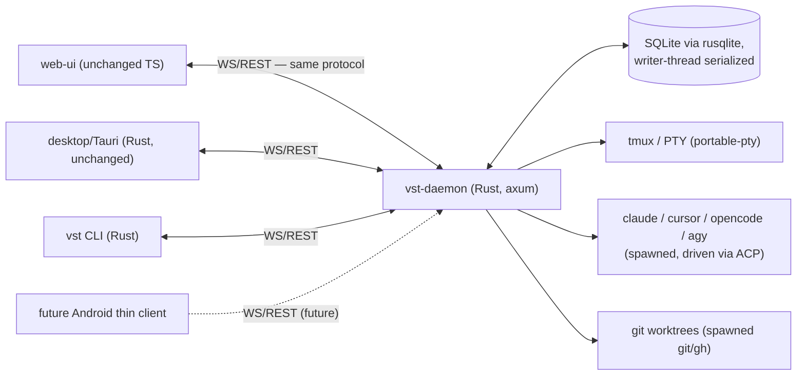

<!--
RULES — read before writing or implementing:
1. FORMAT: Bullets, tables, code, diagrams ONLY — no prose paragraphs
2. REQUIREMENTS: One crisp line each — no verbose descriptions
3. CHECKLIST: Mark items [x] as you complete them — this is your persistent todo list
4. READING TIME: Optimize for fast human scanning — if it's hard to skim, rewrite it
-->

# Arch: Daemon + CLI Rust Port

> Rewrite `daemon/` (54k LOC TS) and `cli/` (3.6k LOC TS) in Rust, into a `rust/` Cargo workspace (flat `vst-*` crates, no name collision with the existing TS dirs — see Target Structure), one crate per bounded slice of the existing code, executed phase-by-phase by DeepSeek subagents under a fixed ~600k-token context ceiling per phase; the orchestrating agent plans, reviews, and integrates.

**Issue:** daemon-rust-port
**Branch:** `feat/daemon-rust-port`
**Status:** Pending
**PRD:** none — internal engineering rewrite, no new user-facing product behavior; decision record is `.vibekit/reports/2026-09-14-daemon-rust-vs-go-port.md`

**Parts spawned from this arch:**
- [ ] `00-foundation/plan-00-daemon-rust-port-foundation.md` — Cargo workspace, `vst-types` (domain + WS protocol + **REST** shapes + `events`/`Broadcaster`), file-map, wire fixtures, tooling pins, `AppState`/handle convention, `vst-testkit`
- [ ] `01-storage/plan-01-daemon-rust-port-storage.md` — SQLite schema, migrations, state registries, Node-DB compat fixture
- [ ] `02-process-pty/plan-02-daemon-rust-port-process-pty.md` — tmux/PTY/subprocess spawning behind a `PtyBackend` trait
- [ ] `03-git-worktree/plan-03-daemon-rust-port-git-worktree.md` — git + worktree + project services
- [ ] `04-spike/plan-04-daemon-rust-port-acp-spike.md` — **orchestrator-owned**, not DeepSeek: pin `agent-client-protocol`, freeze `AcpTransport` trait
- [ ] `04a-agent-plugins-core/plan-04a-daemon-rust-port-agent-plugins-core.md` — `AgentPlugin` trait + registry + pure per-plugin methods
- [ ] `04b-acp-transport/plan-04b-daemon-rust-port-acp-transport.md` — ACP transport/normalize/terminal/filesystem managers
- [ ] `04c-json-agent-chat/plan-04c-daemon-rust-port-json-agent-chat.md` — jsonAgent/jsonAgentChat/promptBuilder/skills/importers
- [ ] `05-lifecycle-status/plan-05-daemon-rust-port-lifecycle-status.md` — two-axis status pollers, tunnels, handoff
- [ ] `06-ws-realtime/plan-06-daemon-rust-port-ws-realtime.md` — WebSocket connection/session-lock/streams/broadcaster receiver side
- [ ] `07a-rest-routes-core/plan-07a-daemon-rust-port-rest-routes-core.md` — sessions/worktrees/projects routes
- [ ] `07b-rest-routes-misc/plan-07b-daemon-rust-port-rest-routes-misc.md` — settings/skills/fs/attachments/auth/health/tailscale/mobileAuth/open/orderedLists routes
- [ ] `08-server-bootstrap/plan-08-daemon-rust-port-server-bootstrap.md` — server/main/auth wiring, binary assembly
- [ ] `09-cli-port/plan-09-daemon-rust-port-cli-port.md` — `vst` CLI port
- [ ] `10-parity-cutover/plan-10-daemon-rust-port-parity-cutover.md` — black-box parity harness, build/CI/dev-sandbox updates, cutover

> Split from an earlier 11-part draft after an adversarial review (see `Risks / Open Questions` provenance note) found a real dependency cycle (05↔06), file-assignment gaps/overlaps, and an underscoped part `04`. Fixed pre-decomposition, per this doc's own rule that it "is not re-opened once parts are drafted."

**Deferred to their own future arch (out of scope here — see Out of Scope):**
- `11-lsp-integration` — drive gopls/rust-analyzer/tsserver/pyright as subprocesses
- `12-code-indexing` — repo-wide symbol/full-text search (tantivy + tree-sitter)

---

## Problem

- Node daemon+CLI is large (54k+3.6k LOC), heavy at rest (`@yao-pkg/pkg` packaged Node binary), and the team wants smaller/faster binaries — see decision report `2026-09-14-daemon-rust-vs-go-port.md`
- Decision is made: **Rust, single-language**, not the polyglot Go+Rust option this report's predecessor considered — user's own words: "at all fronts rust is actually winning" (repo already runs Tauri/Rust in `desktop/src-tauri/`, and the LSP/indexing requirement favors Rust's ecosystem)
- Porting team is asymmetric: The orchestrating agent plans/reviews/integrates; DeepSeek subagents (cheap, ~600k-token context ceiling) do the bulk mechanical translation — the plan must decompose work into pieces small enough for that model to hold in context and get right without thrashing on Rust's ownership model
- The codebase has real, previously-shipped concurrency bugs whose fixes are load-bearing invariants (`AGENTS.md`: `withSessionLock`, two-axis status writers, PTY stream registry) — a mechanical translation risks silently reintroducing them if the invariant isn't carried forward as an explicit contract, not just "whatever the TS code happened to do"

## Out of Scope

- LSP integration and code indexing (parts `11`/`12`) — new capability, not a port of existing code; no TS source to translate, so the phase recipe below (read-existing → test-first → port) doesn't apply to them. They get their own arch/plan once the core port (parts `00`-`10`) lands, written spec-first (an RFC-style design, not a translation)
- Android client — already resolved in the decision report: thin WS/REST client, unaffected by daemon language, not part of this arch
- `web-ui/` and `desktop/` — unchanged; they keep talking to the daemon over the same WS/REST contract regardless of what language serves it
- Folding `desktop/src-tauri/` into the new Rust workspace as a shared-crate member — plausible later (see `2026-09-05-kotlin-native-vs-rust-daemon.md` follow-up #2 on linking the daemon into Tauri directly) but not attempted in this arch; keep the Tauri build untouched until the daemon port is proven

---

## Requirements

### Functional

| # | Requirement |
|---|-------------|
| F1 | New Rust daemon serves the exact same WS/REST protocol as the current Node daemon (byte-compatible JSON shapes) — `web-ui`/`desktop`/CLI clients need zero changes |
| F2 | New Rust `vst` CLI is a drop-in replacement for the current Node CLI (same subcommands, same flags, same output format where scripted/parsed) |
| F3 | Every previously-shipped concurrency bug documented in `AGENTS.md` (double-echo, ghost PTY streams, status-writer races) has an explicit regression test in the Rust port, not just an implicit hope the translation preserves it |
| F4 | SQLite on-disk state (session/worktree/project records) is readable across the Node→Rust transition — schema compatibility is verified, not assumed |

### Non-functional

| # | Requirement | Target |
|---|-------------|--------|
| N1 | Binary size | Materially smaller than the current `@yao-pkg/pkg`-packaged Node binary (baseline to be measured in part `10`) |
| N2 | Cold start | Faster than current Node daemon cold start (no JVM/V8 warm-up) |
| N3 | Concurrency safety | `#![forbid(unsafe_code)]` by default per the `rust-coding` skill §1 (a documented PTY/FFI boundary, e.g. in `vst-proc`, may carry `#![deny(unsafe_code)]` instead, each `unsafe` block SAFETY-commented — never a blanket exemption); shared mutable state goes through `tokio::sync` primitives with the same per-key scoping as today's `withSessionLock`, never a coarser lock |
| N4 | Async/blocking hygiene | No synchronous SQLite (`rusqlite`) call ever executes directly on a `tokio` async task — always `spawn_blocking` or a dedicated writer thread (see Gotchas) |
| N5 | Phase containment | Each part's DeepSeek subagent session stays within ~600k tokens of context: bounded source directory + its tests + the new crate's own code — never "read the whole daemon" |
| N6 | Build/CI containment | After part `00`, no later part ever creates a crate, edits `rust/Cargo.toml`'s `[workspace]` table, changes `[profile.release]`, or touches `.github/workflows/rust-ci.yml` — every crate, the release profile, and CI are scaffolded once, upfront, so a part's scope is strictly "fill in this already-existing crate" |

---

## Architecture Diagram



- **vst-daemon** — orchestrates sessions, worktrees, agent plugins; owns SQLite + PTY + WS/REST surface
- **CLI/web-ui/desktop** — unchanged clients of the WS/REST contract (F1)
- **SQLite** — single source of truth for session/worktree/project state, same schema shape as today
- **tmux/PTY, agent CLIs, git** — spawned child processes, same trust boundary as today (daemon shells out, doesn't reimplement them)

---

## Target Structure

> **Layout settled after three passes** — `rust/crates/*` nesting → `common/`-grouped libraries with `daemon/`/`cli/` taking the final top-level names directly → **this**: back to a single `rust/` Cargo workspace root, every crate a flat, `vst-`-prefixed sibling directly under it (directory name == package name, per Rust ecosystem convention — `tokio-rs/tokio`, `zed-industries/zed` — rather than this repo's own per-component convention, a deliberate choice to match idiomatic Rust workspace layout over monorepo-internal consistency). This also has a real practical win the two earlier layouts didn't: **no name collision with the existing `daemon/`/`cli/` (TS) directories, so no prerequisite rename is needed** — the TS trees are simply left alone until part `10` deletes them.

```
rust/                               + new Cargo workspace root
rust/Cargo.toml                     + workspace manifest, members = final explicit list, written ONCE by
                                      part 00 (all 12 crates scaffolded upfront — see Part Breakdown/N6);
                                      [profile.release] tuned for N1 (lto, strip, panic=abort, codegen-units=1)
rust/Cargo.lock                     + committed (these are binaries, not published libraries)
rust/rust-toolchain.toml            + pinned toolchain (part 00)
rust/deny.toml                      + cargo-deny license/advisory policy (part 00)
rust/scripts/rust-gate.sh           + part 00 — the one command every part/integrator runs (fmt+clippy+test)
.github/workflows/rust-ci.yml       + part 00 — runs rust-gate.sh on push/PR touching rust/**; the repo's CI
                                      today has only desktop-build.yml, this is new, not an extension of it
.gitignore                          ~ part 00 — add `rust/target/`
rust/vst-types/                     + part 00 — domain types + WS protocol + REST req/resp + events/Broadcaster
rust/vst-types/tests/fixtures/wire/ + part 00 — captured Node-daemon JSON fixtures (wire drift detector)
rust/vst-testkit/                   + part 00 — shared test fixtures/helpers (dev-dep only)
rust/vst-store/                     + part 01 — sqlite schema/migrations/registries
rust/vst-store/tests/fixtures/db/   + part 01 — captured Node-created .sqlite file + schema dump
rust/vst-proc/                      + part 02 — tmux/PTY/subprocess spawning behind a PtyBackend trait
rust/vst-git/                       + part 03 — git/worktree/project services
rust/vst-rpc/                       + part 04b — stdio JSON-RPC transport (Content-Length framing),
                                      shared by ACP now and the future LSP client (see Forward-compat check)
rust/vst-agents/                    + parts 04-spike/04a/04b/04c — agent plugin trait + ACP integration (uses vst-rpc)
rust/vst-lifecycle/                 + part 05 — status pollers, tunnels, handoff
rust/vst-ws/                        + part 06 — websocket layer, session locks, broadcaster receiver side
rust/vst-routes/                    + parts 07a/07b — REST handlers (axum)
rust/vst-daemon/                    + part 08 — bin: server bootstrap, auth, main
rust/vst-cli/                       + part 09 — bin: `vst` CLI
daemon/                             unmarked — current TS daemon, untouched until part 10 deletes it
cli/                                unmarked — current TS CLI, untouched until part 10 deletes it
desktop/src-tauri/                  unmarked — untouched (see Out of Scope); stays its own standalone
                                      Cargo workspace — `rust/Cargo.toml` is not its ancestor directory,
                                      so Cargo's upward workspace search never reaches it; no `exclude`
                                      needed (this was a real gotcha in the repo-root-Cargo.toml layout
                                      considered and rejected above — moot with the workspace root at `rust/`)
scripts/dev-sandbox.sh, docker-compose.dev.yml, root package.json   ~ updated in part 10 to build/run
                                      the Rust binaries instead of the TS ones — no changes needed before then
daemon-rust-port/file-map.tsv       + part 00 — exhaustive TS-file → (crate, test-file) partition, checked in
                                      next to this arch doc; see Gotcha "file-map completeness"
```

`+` new · `~` modified · unmarked = context only — one line per top-level module; each part's own plan owns per-file detail

---

## Entities & Modules

> **Dependency graph correction (post-review):** the original table had a real cycle — `vst-lifecycle` (05) imports from `broadcaster.ts` (owned by `vst-ws`, part 06) AND `vst-ws` was listed as depending on 05. Fixed by moving the `ServerEvent` enum + a `Broadcaster` sender-side handle into `vst-types::events` (part 00) — every crate that needs to *emit* a broadcast (`vst-lifecycle`, `vst-agents`, `vst-git`) takes a `Broadcaster` (a `tokio::sync::broadcast::Sender<ServerEvent>` newtype) as a constructor argument; only `vst-ws` owns the *receiver* side and fans it out to WS connections. No crate below `vst-types` depends on `vst-ws`.

| Entity / Module | Layer | Responsibility | Public interface | Key Dependencies (verified against actual TS imports) |
|-----------------|-------|----------------|-------------------|-----------------|
| `vst-types` | shared | Domain types + WS protocol + **REST request/response shapes** (ported from every `routes/*.ts` zod schema and handler response literal — see Gotcha "vst-types owns the wire, all of it") + `events::{ServerEvent, Broadcaster}` cycle-breaker | plain structs/enums, no logic | none |
| `vst-testkit` | shared (dev-dep only) | Ported test fixtures/helpers (`gitFixture.ts`, `daemon/src/__tests__/fixtures/*`) so no part reinvents them | fixture builders | `vst-types` |
| `vst-store` | data | SQLite schema, migrations, typed registries (session/worktree/project/attachment/json-agent/**directPty**/**orderedLists**/**tunnel**), `sqliteRowMappers` equivalents | `Store` handle, one dedicated writer thread (see Gotcha #4) | `vst-types` |
| `vst-proc` | data | tmux session lifecycle, PTY spawn/attach/resize, generic subprocess spawn, behind a `PtyBackend` trait (so `vst-agents`' ACP child processes and tmux PTYs share one abstraction) | `PtyHandle`, `spawn_tmux`, `spawn_child`, `trait PtyBackend` | `vst-types` |
| `vst-git` | domain | Worktree create/rename/remove, branch validation, project setup/naming, **read-only git status/diff for the file-tree UI** (`git.ts`'s status/diff half — see Forward-compatibility check) | `WorktreeService`, `ProjectService`, `GitStatus` | `vst-store`, `vst-proc`, `vst-types::events` |
| `vst-agents` | domain | `AgentPlugin` trait + registry (moved from `spawn.ts`, NOT `vst-proc` — `spawn.ts` defines the plugin interface, not just process spawning) + claude/cursor/opencode/agy impls + ACP session driving + `context.ts`'s `ResolvedContext` + `sessionRuntime.ts` | `trait AgentPlugin`, `AgentRegistry`, `AcpTransport` (frozen by part `04-spike`) | `vst-types`, `vst-proc` (via `PtyBackend`), `vst-store`, `vst-types::events` |
| `vst-lifecycle` | domain | Lifecycle poller (1s), PR poller (30s), handoff, subagent notify, tunnels (cloudflared/tailscale) | `LifecyclePoller`, `PrPoller` | `vst-store`, `vst-git`, `vst-types::events` (emits, never receives) |
| `vst-ws` | transport | Per-`(connection,sessionId)` session lock, WS handlers, stream registries, **broadcaster receiver side** (fans `vst-types::events::ServerEvent` out to connections) | `WsConnection`, `withSessionLock` equivalent | `vst-types`, `vst-proc`, `vst-store`, `vst-agents` (for `AgentRegistry::resolve` — see Gotcha "who may call the plugin registry") |
| `vst-routes` | transport | REST handlers (axum `Router`) — **never defines its own request/response types**, only uses `vst-types::rest::*` | `fn router(state: AppState) -> Router` | `vst-store`, `vst-git`, `vst-agents`, `vst-lifecycle`, `vst-ws` |
| `vst-daemon` (bin) | app | Wires everything via the `AppState`/handle convention (part 00), auth, config, doctor | `main()` | all of the above |
| `vst-cli` (bin) | app | `vst` subcommands, talks to `vst-daemon` over its own WS/REST contract | `main()` | `vst-types` only (protocol + REST shapes — no dependency on daemon internals; this is now literally true because `vst-types` carries the full REST contract, not just WS) |

---

## Alternatives Considered

| Option | Summary | Pros | Cons | Verdict |
|--------|---------|------|------|---------|
| **A — Single-language Rust** | Port everything to Rust, one workspace | Best ecosystem fit for ACP/LSP/indexing; reuses the repo's existing Tauri Rust toolchain; smallest binaries | Full 54k LOC of concurrency-heavy code ported by a cheap model — highest translation risk | ✅ Chosen (user decision) |
| **B — Polyglot (Go daemon + Rust indexing/LSP)** | Go for the daemon control plane, Rust only for new indexing/LSP modules | Lower porting risk on the hard concurrency core | Two toolchains, an IPC boundary, forfeits Tauri-toolchain reuse | ❌ Rejected — see decision report, superseded by user's explicit call |
| **C — Kotlin/Native** | Share code with a future Android client via KMP | N/A — Android is a thin client, so this benefit doesn't apply | Weaker native/async ecosystem than Rust | ❌ Rejected — see `2026-09-05-kotlin-native-vs-rust-daemon.md` |

**Decision rationale:**
- User's own review of the tradeoffs across binary size, ACP SDK maturity, LSP-types, and code-indexing crates (tantivy/tree-sitter/`ignore`) found Rust ahead on every axis except "ease of port for a cheap model" — and decided that risk is worth managing via phase decomposition + test-first per phase (this arch), rather than by switching language.
- The repo already runs a Rust toolchain (`desktop/src-tauri/`), which was flagged in `2026-09-05-kotlin-native-vs-rust-daemon.md` as a real, under-weighted point in Rust's favor.

---

## Design Details

### System Boundaries

| Boundary | Fields + types | Errors | Source of truth |
|----------|----------------|--------|-----------------|
| Client (web-ui/desktop/CLI) ↔ `vst-daemon` | Every field/shape in `daemon/src/ws/protocol.ts` (615L) + `daemon/src/types.ts` (561L) + **every `routes/*.ts` zod schema and handler response shape** — **frozen contract**, ported byte-shape-identical into `vst-types`, mechanically checked (see below), not redesigned | Same HTTP status codes / WS error frames as today | `vst-types` structs are the one source; `vst-routes`/`vst-ws`/`vst-cli` never invent ad-hoc shapes — enforced by code review AND by the fixture test below, not by convention alone |
| **Wire-compat drift detector** (new — closes a gap the original doc left to "review vigilance") | `rust/vst-types/tests/fixtures/wire/*.json` — one captured sample per WS frame type + per REST endpoint, recorded from the live Node daemon via a `scripts/capture-wire-fixtures.ts` (part 00 deliverable, run once against the dev sandbox) | `vst-types`'s own test suite: `deserialize(fixture) -> T -> serialize -> assert_eq!` against the fixture as a `serde_json::Value`, plus `#[serde(deny_unknown_fields)]` on every wire type so an accidental extra field fails loudly | `cargo test -p vst-types` runs after **every** part (see Phase recipe Step 7), regardless of which crate that part touched — any `vst-types` change must update a fixture or the test fails |
| `vst-ws` ↔ `vst-proc` (PTY streams) | `(connection_id, session_id) -> PtyHandle`, at most one live handle per key | Stale-stream teardown before re-attach (same invariant as `AGENTS.md` § Terminal/WebSocket) — concrete test: spawn 50 interleaved open/close tasks for one key under `tokio::test(flavor = "multi_thread")`, assert live-handle count ≤ 1 at every instant, and that two different `connection_id`s can hold two live handles concurrently for the same `session_id` | `vst-ws`'s stream registry owns liveness; `vst-proc` never tracks its own handle table |
| `vst-lifecycle` ↔ `vst-store` (session status) | `lifecycle.state` written ONLY by the 1s poller; `pr` written ONLY by the 30s PR poller, and only onto a worktree's `isMain` session | Two-axis model — see `AGENTS.md` § Status indicators; must not merge into one enum — concrete test: a `trybuild` compile-fail fixture asserting the PR-poller module cannot call the lifecycle setter (and vice versa) because the setter is `pub(super)` to its owning submodule | `vst-store` holds both fields; each poller writes only its own — enforced by `pub(super)` visibility, not by convention |
| `vst-agents` ↔ external agent CLIs | ACP JSON-RPC over stdio, via `agent-client-protocol` crate, transport shape frozen by part `04-spike` (orchestrator-authored `examples/acp_hello.rs`) before any DeepSeek session touches it | Process exit / stdio EOF → session marked failed, same as today's plugin `getReadySignal()` contract | `vst-agents` owns the child process handle; nothing else spawns agent CLIs; **`AgentRegistry::resolve` is called only from `vst-routes` and `vst-agents::json_agent_chat`** — same restriction `AGENTS.md`'s "Agent plugin" section states for the TS code (services never import `resolvePlugin` themselves) |
| `vst-cli` ↔ `vst-daemon` | Same REST/WS contract as web-ui — CLI is just another client, not a special-cased caller. This is now enforceable, not just intended: `vst-cli` cannot define its own request/response structs (they don't exist outside `vst-types::rest`) | Same error codes as the WS/REST boundary above | `vst-daemon` — CLI holds no independent state |

### Data Model

- No new tables — SQLite schema is ported as-is from `daemon/src/services/dbSchema.ts` + `dbMigration.ts` (part `01`); this arch does not introduce schema changes
- Migration/backfill: **coexistence check only, with a concrete fixture** — part `01` cannot verify F4 against nothing. Deliverable: `rust/vst-store/tests/fixtures/db/node-v<migration-head>.sqlite`, generated once by running the actual Node daemon (via `scripts/dev-sandbox.sh`) to its current migration head, committed alongside `rust/vst-store/tests/fixtures/db/schema-dump.sql` (`sqlite3 <file> .schema` output). Part `01`'s test opens that fixture with `rusqlite`, runs the Rust migration runner, asserts it's a no-op, and asserts `.schema` equality against the dump
- Backwards-compatible: yes by requirement (F4) — this is a hard gate on part `01`, checked by the fixture above, not asserted by prose

### API Contracts

- No new endpoints/events — F1 requires the exact existing surface (`daemon/src/routes/*.ts`, `daemon/src/ws/protocol.ts`, `daemon/src/ws/handlers/*`)
- **`vst-types` owns the wire, all of it — REST included.** The original draft scoped `vst-types` to `types.ts`+`protocol.ts` (WS only) and let part `07` define REST shapes locally; a reviewer caught that this breaks part `09`'s ability to compile the CLI against a real contract and leaves REST drift uncaught. Fixed: part `00` ports every `routes/*.ts` zod schema and every handler's response shape into `vst-types::rest::{requests, responses}` (one submodule per route file, e.g. `vst-types::rest::sessions`). Parts `07a`/`07b`/`09` are **forbidden** from defining any `#[derive(Serialize, Deserialize)]` type — a part that finds a shape missing follows the amendment rule below, it never defines its own
- **`vst-types` amendment rule** (resolves a contradiction between the phase recipe's "don't touch another part's crate" and the reality that later parts will need to add shapes): amending `vst-types` is allowed, but only by **addition** (never renaming/removing an already-fixture-tested field), must add/update the corresponding wire fixture (see Design Details → System Boundaries), and must be listed under a `## vst-types amendments` heading in that part's own report so the orchestrating agent's integrate step (Phase recipe Step 7) can review it as a diff, not discover it by accident. Any other cross-crate edit is out of scope for a part, full stop
- Serde encoding rules (closes the "byte-identical" requirement from being aspirational to checkable): `#[serde(rename_all = "camelCase")]` per struct (or per-field rename) to match TS field casing; `#[serde(skip_serializing_if = "Option::is_none")]` on every field that was TS-optional (`?:`) if the TS runtime omits the key on `undefined` — verify per-field against a captured fixture, don't assume; tagged unions (any `{type: "..."}` discriminated frame) use `#[serde(tag = "type")]`; every wire-facing id newtype (`SessionId`, `ConnectionId`, `WorktreeId`, …) uses `#[serde(transparent)]` so it serializes as the bare string, not `{"0": "..."}`

---

## Gotchas — specific to this codebase's current structure

| # | Gotcha | Where it bites | Rust-side handling |
|---|--------|-----------------|---------------------|
| 1 | `withSessionLock` is a per-`(connection, sessionId)` promise-chain lock, deliberately **not** global — a coarser lock silently breaks multi-tab concurrency | `daemon/src/ws/connection.ts:245`; `AGENTS.md` § WebSocket | `vst-ws` must use a keyed lock (e.g. a map of `Arc<tokio::sync::Mutex<()>>` per key, or an actor-per-session model) — never one `Mutex` for all sessions |
| 2 | Plugin dispatch is by trait/interface, never by branching on CLI name — explicit repo invariant | `AGENTS.md` § Agent plugin; `daemon/src/agent-plugins/registry.ts` | Rust: `trait AgentPlugin` with default methods returning `None`/not-implemented for optional hooks (`setup_workspace_hooks`, `capture_chat_id`, etc.) — calling code in `vst-routes`/`vst-lifecycle` calls the trait, never matches on a `CliId` enum after resolving the plugin |
| 3 | Two-axis status model: lifecycle vs PR, two independent pollers, **must never cross-write** | `AGENTS.md` § Status indicators; `daemon/src/services/lifecycle.ts`, `prPoller.ts` | Enforce with module boundaries, not comments: only `vst-lifecycle::lifecycle` module has a setter for `lifecycle.state`; only `vst-lifecycle::pr_poller` has one for `pr` — make the setters `pub(super)` scoped, expose read-only accessors elsewhere |
| 4 | `better-sqlite3` is **synchronous** — current TS code calls it inline with no `await` | throughout `daemon/src/state/*.ts`, `daemon/src/services/db*.ts` | `rusqlite` is also sync — never call it directly inside an `async fn` running on the tokio scheduler. Use one dedicated writer thread (`std::thread` + `mpsc` request channel) or `spawn_blocking` per call; given SQLite's single-writer nature, a dedicated writer thread is the closer match to today's behavior and simplest to reason about |
| 5 | ACP: TS uses `@agentclientprotocol/sdk` + `claude-agent-acp`; Rust's `agent-client-protocol` crate has a different API shape | `daemon/src/services/acp/*`, `cli/package.json:22-23` | This is **net-new integration work per plugin**, not mechanical translation — part `04`'s plan must budget real design time, not just "port the file" |
| 6 | `node-pty` vs `portable-pty` differ in resize/signal/attach-detach semantics; the exact double-echo/ghost-stream bugs in `AGENTS.md` were caused by this class of mismatch before | `daemon/src/services/tmux.ts`, `daemon/src/services/directPty.ts` | Treat `AGENTS.md` § Terminal + § WebSocket as a **regression-test source**: port their described bug scenarios as explicit Rust tests in part `02`/`06`, not just the happy path |
| 7 | `zod` schemas define wire validation; Rust equivalent must produce **identical JSON on the wire**, not just equivalent Rust ergonomics | `daemon/src/routes/*.ts` zod schemas | `serde` derive on `vst-types` structs, field names/casing verified against a byte-for-byte fixture captured from the running Node daemon (part `00`/`10`) |
| 8 | `@yao-pkg/pkg` packaging, and `scripts/dev-sandbox.sh`/`docker-compose.dev.yml` assume a Node daemon process | root `package.json:33`; `scripts/dev-sandbox.sh` | Part `10` must update these — not a silent side effect, an explicit checklist item, since `AGENTS.md` § Docker warns these scripts are easy to break quietly |
| 9 | `chokidar` (fs watch) vs `notify` (inotify-backed) differ on atomic-rename-on-save edge cases from editors | wherever chokidar is used in `daemon/src/services/*` | Port chokidar's existing tests (if any) as the spec; add an explicit atomic-rename test if none exists |
| 10 | 25,354 LOC of existing `daemon/src/__tests__/` + `cli/src/__tests__/` are the **executable spec** for behavior, not just coverage; test filenames don't map 1:1 to source filenames (e.g. `jsonChatRoutes.test.ts` spans parts `04c` and `07a`), and shared fixtures (`gitFixture.ts`, `fixtures/`) aren't owned by any one part | `daemon/src/__tests__/`, `cli/src/__tests__/` | `file-map.tsv` (part `00`) has a second column mapping test files to the part(s) that must port them — a test spanning two parts is listed under both, the second part re-verifies rather than re-porting. Shared helpers go into `vst-testkit` (part `00`) so no part reinvents them |
| 11 | **File-to-part assignment must be exhaustive and non-overlapping, or a fresh session invents a duplicate.** A review found real cases: `services/spawn.ts` defines `interface AgentPlugin` (line 128) but was scoped to `vst-proc` (02) instead of `vst-agents` (04) — a session in 02 would either need to depend on 04 (cycle) or silently re-declare the trait; `state/attachmentRegistry.ts`, `cloudflared.ts`/`tailscaleServe.ts` were each assigned to two parts at once; `services/sessionRuntime.ts`, `services/context.ts`, `state/sqliteRowMappers.ts`, `state/directPtyRegistry.ts`, `state/orderedListsStore.ts`, `state/tunnel-store.ts`, `ws/server.ts`, `debugLog.ts`, `lib/*` were assigned to none | throughout `daemon/src/**` | Part `00` ships `file-map.tsv`: every file under `daemon/src/` and `cli/src/` (via `git ls-files`) appears in **exactly one** row with its owning part, plus a checked-in script (`rust/scripts/check-file-map.sh`) asserting the partition is complete and non-overlapping. The Part Breakdown table's "Scope" column is a summary of that file, not a substitute for it — this arch fixes the four errors above (moved `spawn.ts`'s trait to `04a`, resolved the double-assignments, and folded the orphans into `01`/`04c`/`06`/`08` — see corrected Part Breakdown) but the file-map is the actual source of truth a DeepSeek session reads |
| 12 | `cargo clippy -- -D warnings` + "pedantic at warn" (as originally stated in the `rust-coding` skill) are **contradictory** — `-D warnings` promotes every warn-level lint, pedantic included, to a hard error, so the first session that hits normal pedantic noise either can't finish or reaches for a blanket `#![allow(clippy::pedantic)]` that defeats the point | `rust-coding` skill §7; this arch's Phase recipe step 5 | Pick one gate and write it once, in `rust/scripts/rust-gate.sh` (part 00): set `[workspace.lints.clippy] pedantic = "warn"` in `rust/Cargo.toml` (informational, never blocks), and gate on explicit deny groups only — `cargo clippy --workspace --all-targets --all-features -- -D clippy::correctness -D clippy::suspicious -D clippy::complexity -D clippy::perf -D warnings` (the trailing `-D warnings` here only promotes plain `rustc` warnings, not clippy's own warn-level lints, since those are governed by the `[workspace.lints.clippy]` table instead) |
| 13 | A weak model under "must be green" pressure will edit or delete a failing test rather than fix the implementation — the original phase recipe had no commit boundary between "tests written" and "implementation started," so this is undetectable after the fact | Phase recipe steps 3-4 | Step 3 ends with `git commit -m "test(<part>): behavior contract"` before implementation starts; step 4 (impl) may not modify anything under `tests/` or a `#[cfg(test)]` module — a test that turns out wrong gets flagged in the part's report and left failing/`#[ignore]`d with a stated reason, never silently loosened. The orchestrating agent's integrate step (Step 7) diffs the test tree between the two commits and treats any diff there as a red flag |
| 14 | No shared convention for how a crate exposes its handle (`Arc<T>`? `T(Arc<Inner>)`? a global `static`/`OnceLock`, mirroring the TS module-level singletons like `directPtyRegistry`/`broadcastAll`?) — left unspecified, 8 independent sessions will each choose differently and part `08`'s wiring absorbs the mismatch | all of `state/*.ts`'s module-singleton pattern; `vst-daemon` wiring | Part `00` ships the convention once: every crate's public handle is `pub struct XHandle(Arc<Inner>)`, `#[derive(Clone)]`, constructed by taking its own dependencies as already-constructed handles (no crate reaches for a global `static`/`OnceLock` to get a dependency) — every later part's plan copies this convention verbatim rather than restating or reinventing it |

---

## Phase recipe — how every DeepSeek subagent executes a part

> This is the standard recipe every part `NN`'s plan instantiates. Stated once here; each part's own plan (written when that part's turn comes up in the sdlc queue) cites it rather than re-deriving it.
>
> **Deliberate deviation from the usual `sdlc`/`planning` workflow:** each part's "plan" here is a short **phase brief** (~30-40 lines: pointers into this arch doc + the file list + a literal checklist of the steps below), not a full `_template_plan.md` document with its own CUJs/Architecture-Diagram/Data-Model/Alternatives-Considered sections. Those sections would just restate content this arch doc already owns, 15 times, at the cost of the orchestrating agent's own (limited) token budget — the implementer session reads this arch doc directly instead, which spends DeepSeek tokens, the cheap side of this pipeline by design. See `ORCHESTRATION-PROMPT.md` § Step B for the exact template and rationale.
>
> **Every part's plan must explicitly instruct its DeepSeek session to load the `rust-coding` skill before writing or editing a single `.rs` file** — this is not implied by the skill's `globs` frontmatter alone (that field tells an *interactive* Claude Code session when to auto-load it; a fresh subagent dispatched with a plan file as its only brief has no such trigger unless the plan says so in words). Treat "load `rust-coding`" as step 0, always spelled out explicitly in the part's own plan.

```
0. LOAD  — the `rust-coding` skill (Rust coding standards + safety rules for this port), before
           touching any .rs file — see the note above this block. Re-load it if the session
           is later resumed/handed off; do not rely on it persisting.
1. READ  — the part's row in file-map.tsv (source files + their test files, exhaustive —
           see Gotcha "file-map completeness") + the specific AGENTS.md section(s) and
           Gotchas rows this arch names for the part. Nothing outside that row — if you
           think you need a file not in your row, STOP and flag it in the report rather
           than silently widening scope or inlining a copy.
2. SPEC  — write down the behavior contract as bullets: inputs, outputs, invariants,
           error paths — derived from the TS code + its tests, not reinvented.
3. TEST  — write Rust tests FIRST in the new crate, encoding that behavior contract.
           Port existing vitest cases 1:1 where the fixture translates cleanly; add the
           regression tests named in the Gotchas table explicitly (with their concrete,
           observable assertions — not just "add a test").
           git commit -m "test(<part>): behavior contract"   ← hard boundary, see Gotcha #13
4. IMPL  — implement the Rust module until the tests in step 3 pass. Do not touch any
           crate outside this part's own crate(s) EXCEPT `vst-types` under the amendment
           rule (Design Details → API Contracts). Never modify anything under `tests/` or
           a `#[cfg(test)]` module in this step — a wrong test gets flagged, not edited.
           NEVER edit `rust/Cargo.toml`'s `[workspace]` table, `[profile.release]`, or
           `.github/workflows/rust-ci.yml` — these are part `00` property, permanently, no
           amendment rule exists for them (unlike `vst-types`, they don't need one: every
           crate that will ever exist was already scaffolded in part `00` — see N6).
5. GATE  — run `rust/scripts/rust-gate.sh <crate>` (wraps `cargo fmt --check`,
           `cargo clippy --workspace --all-targets --all-features -- <the deny groups from
           Gotcha #12>`, `cargo test -p <crate>`, `cargo test -p vst-types`). Save its
           verbatim stdout to `rust/.gate/<part>.log` and commit it — a fresh session
           can't fake a full clippy/test log convincingly, and it's what Step 7 diffs
           against a real re-run.
6. REPORT — state what was ported, what was `#[ignore]`d and why, any `vst-types`
           amendments (with their fixture updates), and STOP. Do not start the next
           part's crate — that is a separate sdlc sub-feature dispatched by the orchestrating agent.

7. INTEGRATE (the orchestrating agent, after every part — this step belongs to the planner, not the
   DeepSeek implementer, and is not optional):
   cargo fmt --all --check
   cargo clippy --workspace --all-targets --all-features -- <same deny groups as step 5>
   cargo test --workspace                      # not just -p <crate> — catches breakage
                                                #   in earlier parts this one may have caused
   cargo test -p vst-types                     # wire fixtures still round-trip
   git diff --stat <part-start>..HEAD -- rust  # every touched path outside this part's own
                                                #   crate(s) must be vst-types, and only via
                                                #   the amendment rule — anything else, reject
   git diff <test-commit>..HEAD -- rust/<crate>/tests  # must be empty (Gotcha #13)
   ./rust/scripts/check-file-map.sh            # this part's file-map row is now "ported"
   Re-running step 5's gate independently (not trusting rust/.gate/<part>.log alone) is
   what makes "the subagent said tests pass" a checked claim instead of a trusted one.
   Spot-check the diff against `rust-coding` skill §1/§3/§6 specifically (unsafe carve-outs,
   keyed-lock/single-writer discipline, wire-shape fidelity) — clippy's gate (step 5) catches
   lint-level issues, not these; they need an actual read of the diff.
```

- Context budget: a part's file-map row (bounded source + tests) is nowhere near the ~600k-token ceiling (the *entire* non-test daemon is ~540k tokens at a rough 4-chars/token estimate; any single part here is a fraction of that) — the ceiling is respected by scope discipline (step 1), not by the raw byte count alone
- **Split decisions are made by the orchestrating agent at plan-write time, from file-map row sizes, not by the implementer mid-flight** — a fresh weak-model session under-reads rather than recognizing it's over budget and stopping. This arch already pre-splits the two parts file-map sizing flagged as oversized (`04` → `04-spike`+`04a`+`04b`+`04c`, `07` → `07a`+`07b`); if a future part's own plan phase finds its file-map row still too large once drafted, split it there, before dispatch — not as a DeepSeek-reported mid-session surprise

---

## Part Breakdown

> Dependencies below are the corrected graph (see Entities & Modules note) — regenerate against actual imports at each part's own plan-write time via `grep -rn "^import" daemon/src/<dir>/*.ts`; treat this table as a starting point, `file-map.tsv` as the checked source of truth.

| Part | Scope | Depends on | Rough TS size (non-test) |
|------|-------|-------------|---------------------------|
| [`00-foundation`](./00-foundation/plan-00-daemon-rust-port-foundation.md) | **Everything below, so no later part ever touches build/CI setup:** full Cargo workspace with **all 12 crates scaffolded as empty-but-compiling skeletons** (`rust/Cargo.toml`'s `members` list is written once, complete, and final — every crate directory + its own `Cargo.toml` + a stub `src/lib.rs`/`src/main.rs` exists from day one, each with its `#![forbid(unsafe_code)]` or documented `#![deny(unsafe_code)]`, `[lints] workspace = true`, and dependency stanza pre-wired to `[workspace.dependencies]` — later parts fill in a crate's body, they never create a crate or edit the workspace member list); `[profile.release]` tuned for N1 (`lto = true`, `strip = true`, `panic = "abort"` on the two bins, `codegen-units = 1`); `.github/workflows/rust-ci.yml` running `rust/scripts/rust-gate.sh --workspace` on every push/PR touching `rust/**` (the repo's CI today only has `desktop-build.yml` — this is new, not an extension); `rust/Cargo.lock` committed; `.gitignore` entry for `rust/target/`; `vst-types` (mirrors `types.ts` 561L + `protocol.ts` 615L + **every `routes/*.ts` zod schema/response shape** + `events::{ServerEvent, Broadcaster}`); `vst-testkit`; config/paths (`lib/*.ts`, `services/paths.ts`, `config.ts`, `daemonPort.ts`, `tunnelPort.ts`, `debugLog.ts`); `file-map.tsv` + `rust/scripts/check-file-map.sh`; `rust/vst-types/tests/fixtures/wire/*` + capture script; `rust-toolchain.toml`, `deny.toml`, `[workspace.dependencies]` pins; `rust/scripts/rust-gate.sh`; the `AppState`/handle convention doc | none | ~2.5k LOC + ~3k LOC of REST schemas pulled forward from part 07 |
| [`01-storage`](./01-storage/plan-01-daemon-rust-port-storage.md) | `vst-store`: `state/db.ts` + all `state/*Registry.ts`/`*-store.ts` (incl. `directPtyRegistry.ts`, `orderedListsStore.ts`, `tunnel-store.ts`, `sqliteRowMappers.ts` — previously unassigned), `services/dbSchema.ts`, `dbMigration.ts`, `sqliteTranscriptStore.ts`, `transcriptStore.ts`, `transcriptMigration.ts`; **Node-DB compat fixture** (`rust/vst-store/tests/fixtures/db/*`, F4 gate) | 00 | ~3.5k LOC |
| [`02-process-pty`](./02-process-pty/plan-02-daemon-rust-port-process-pty.md) | `vst-proc`: `services/tmux.ts`, `directPty.ts`, `childStreams.ts`, `shell.ts`, `resolveUseTmux.ts`, behind a `PtyBackend` trait (`spawn.ts` moved out — see below) | 00 | ~1.5k LOC |
| [`03-git-worktree`](./03-git-worktree/plan-03-daemon-rust-port-git-worktree.md) | `vst-git`: `services/git.ts` (including its read-only status/diff half — see Forward-compatibility check), `worktreeService.ts`, `branchValidator.ts`, `projectSetup.ts`, `naming.ts`, `slugify.ts`, `prefix.ts`, `rollback.ts`, `recover.ts`, `sessionId.ts` | 00, 01, 02 | ~3k LOC |
| [`04-spike`](./04-spike/plan-04-daemon-rust-port-acp-spike.md) | **Orchestrator-authored, not dispatched to DeepSeek**: pin an exact `agent-client-protocol` crate version; write a compiling `examples/acp_hello.rs` doing `initialize → session/new → prompt → stream` against `claude-agent-acp`'s ACP surface; freeze the `AcpTransport` trait signature that `04b` will implement against | 00, 02 | n/a — design spike |
| [`04a-agent-plugins-core`](./04a-agent-plugins-core/plan-04a-daemon-rust-port-agent-plugins-core.md) | `vst-agents` (trait + registry half): `services/spawn.ts`'s `AgentPlugin` interface (moved here from its mis-scoped original home in `02`) + registry, plus each plugin's pure methods (`getLaunchCommand`, `getEnvironment`, `getReadySignal`, `composeLaunchPrompt`) from `agent-plugins/{claude,cursor,opencode,agy}.ts` — table-driven tests, no live process | 04-spike | ~2k LOC |
| [`04b-acp-transport`](./04b-acp-transport/plan-04b-daemon-rust-port-acp-transport.md) | `vst-agents` (transport half): `services/acp/acpTransport.ts`, `acpNormalize.ts`, ACP filesystem/terminal managers, `native-chat-id/*` — unit tests ported from `acpTransport/acpNormalize/acpFileSystem/acpTerminalManager.test.ts` (fixture-based, portable); live-CLI tests (`claudeAcpLive`, `agyAcpLive`, `cursorOpencodeAcpLive`) ported as `#[ignore]`-gated integration tests behind a named env var — which vitest files become `#[ignore]`d is decided in this part's plan, not left to the implementer | 04-spike, 04a | ~2k LOC |
| [`04c-json-agent-chat`](./04c-json-agent-chat/plan-04c-daemon-rust-port-json-agent-chat.md) | `vst-agents` (application half): `jsonAgent.ts`, `jsonAgentChat.ts`, `promptBuilder.ts`, `skillTokens.ts`, `userSkillCatalog.ts`, `opencodeConfig.ts`, `nativeHistoryImporter.ts`, `services/context.ts` (`ResolvedContext`), `services/sessionRuntime.ts` (both previously unassigned) | 04a, 04b, 01 | ~1.5k LOC |
| [`05-lifecycle-status`](./05-lifecycle-status/plan-05-daemon-rust-port-lifecycle-status.md) | `vst-lifecycle`: `services/lifecycle.ts`, `prPoller.ts`, `handoff.ts`, `subagentNotify.ts`, `manifest.ts`, `channel.ts`, `mutex.ts`, `toolResultCap.ts`, `githubAuth.ts`, `github.ts`, `cloudflared.ts`, `tailscaleServe.ts` (moved fully here, not duplicated into `08`) — emits `vst-types::events`, never depends on `vst-ws` | 00, 01, 02, 03 | ~2.5k LOC |
| [`06-ws-realtime`](./06-ws-realtime/plan-06-daemon-rust-port-ws-realtime.md) | `vst-ws`: `ws/connection.ts`, `ws/handlers/*`, `ws/streams/*`, `ws/server.ts` (previously unassigned/ambiguous with `daemon/server.ts`), `broadcaster.ts` (receiver side), `state/attachmentRegistry.ts` (single home, not duplicated into 01), `pendingFileOpens.ts`, `fileList.ts`, `ignoreFilter.ts` | 00, 01, 02, 04a (for `AgentRegistry::resolve` — restricted call site, see System Boundaries) | ~3k LOC |
| [`07a-rest-routes-core`](./07a-rest-routes-core/plan-07a-daemon-rust-port-rest-routes-core.md) | `vst-routes` (core half): `routes/sessions.ts`, `worktrees.ts`, `projects.ts`, `modes.ts`, `open.ts` — the highest-traffic, most session/worktree-coupled routes | 00, 01, 03, 04c, 05, 06 | ~3.5k LOC |
| [`07b-rest-routes-misc`](./07b-rest-routes-misc/plan-07b-daemon-rust-port-rest-routes-misc.md) | `vst-routes` (misc half): `routes/settings.ts`, `skills.ts`, `fs.ts`, `attachments.ts`, `auth.ts`, `mobileAuth.ts`, `health.ts`, `tailscale.ts`, `orderedLists.ts`, top-level `daemon/src/auth.ts`, `state/auth-state.ts` | 00, 01, 05 | ~3.5k LOC |
| [`08-server-bootstrap`](./08-server-bootstrap/plan-08-daemon-rust-port-server-bootstrap.md) | `vst-daemon` bin: `server.ts`, `main.ts`, `doctor.ts`; wires every crate via the `AppState`/handle convention from part 00 | 06, 07a, 07b | ~0.6k LOC + wiring |
| [`09-cli-port`](./09-cli-port/plan-09-daemon-rust-port-cli-port.md) | `vst-cli` bin: all of `cli/src/*` | 00 (needs the frozen full contract — WS **and** REST — which is now literally all of `vst-types`, not a hedge); integration tests need 08 running, but unit tests compile against `vst-types` alone from part 00 onward | ~3.6k LOC |
| [`10-parity-cutover`](./10-parity-cutover/plan-10-daemon-rust-port-parity-cutover.md) | Black-box parity harness (run both daemons against the same request fixtures, diff responses); update `scripts/dev-sandbox.sh`, `docker-compose.dev.yml`, root `package.json` build scripts; binary-size/cold-start measurement against N1/N2; delete the old TS `daemon/`+`cli/` trees (the Rust binaries live at `rust/vst-daemon`+`rust/vst-cli` and are unaffected by this deletion) | all above | n/a — verification + glue, not a port |

> **Not a part `00` deliverable, already exists:** `.claude/skills/rust-coding/SKILL.md` (Rust coding standards + safety for this port) was authored during arch planning, not by any part above — no part recreates it. Every part's plan just needs to instruct its session to load it (Phase recipe step 0).

---

## Risks / Open Questions

> **Provenance:** this arch was adversarially reviewed before decomposition (per this doc's own rule that it isn't reopened once parts are drafted). That review found a real dependency cycle, several file mis-assignments, and an underscoped `04`, all fixed above (see the "Split from an earlier 11-part draft" note under Parts, and the Entities-table correction note). Items #1-#2 below are resolved by that fix; #3-#4 remain genuinely open.

| # | Question | Notes |
|---|----------|-------|
| 1 | ~~Is `07-rest-routes` too large for one phase?~~ **Resolved** | Pre-split into `07a`/`07b` in this doc rather than left to be discovered mid-session (see Phase recipe's split-decision rule) |
| 2 | ~~Should `vst-agents` be split further?~~ **Resolved** | Split into `04-spike` (orchestrator-owned design spike) + `04a`/`04b`/`04c` — the highest-risk part now has a frozen transport contract before any DeepSeek session touches it |
| 3 | Dedicated SQLite writer thread vs `spawn_blocking` per call (Gotcha #4) — which does part `01` actually implement? | Decide in part `01`'s own plan with a concrete `Store` API sketch; this arch mandates *that* async/blocking hygiene holds (a dedicated writer thread is favored — see Gotcha #4 rationale), not the exact mechanism |
| 4 | Incremental cutover (route-by-route behind a flag) or big-bang at part `10`? | Left open per the decision report's Follow-up #4 — affects whether a Node/Rust coexistence period needs its own design work |
| 5 | ~~`rust/Cargo.toml`'s `members` list — explicit array or a glob?~~ **Resolved** | Part `00` now scaffolds all 12 crates upfront (empty-but-compiling) and writes the final, explicit `members` list once — no later part ever edits the workspace-level `Cargo.toml`, so the glob-vs-explicit question doesn't even arise; a stray directory a DeepSeek session created outside its scope simply isn't a workspace member and `cargo build --workspace` won't see it either way |

> Each part uses the **plan template** and carries its own phased checklist + test verification, written when that part's turn comes up in the sdlc queue.
> This arch doc is not re-opened once parts are drafted — it is the stable reference.

---

## Forward-compatibility check — future code-reading (LSP + indexing) parity

> Checked against a comparable local-first, read-only code-navigation tool (single static binary, embedded web UI, in-memory index, lazy per-language LSP spawn, git-status-aware file tree, path-sandboxed external-definition browsing) to see whether this arch's crate boundaries would need rework once parts `11`/`12` (deferred, out of scope here) get their own arch. They would not need rework — the fits and the two gaps below are both cheap to note now and expensive to discover after `08`/`09` are wired.

| Comparable tool's pattern | Maps onto | Verdict |
|---|---|---|
| Lazy per-language-server registry: spawn only on first file touch, reuse the process, fall back gracefully if the binary is missing | `vst-agents`' `AgentPlugin` trait + registry (part `04a`) is the *same shape* — resolve-once, dispatch-by-trait, lazy spawn. A future `vst-lsp` crate is structurally a sibling of `vst-agents`, not a rework of it | ✅ favorable — note this parallel explicitly in part `11`'s future arch so it reuses the pattern instead of reinventing it |
| Server transport = Content-Length-delimited JSON-RPC over stdio | Currently this framing logic would live *inside* `vst-agents` (ACP is also JSON-RPC-over-stdio) with nothing factored out for reuse | ⚠️ gap, cheap to fix now: **extract the stdio JSON-RPC transport (Content-Length framing, request-id correlation, timeout handling) as its own small crate — `vst-rpc` — under `vst-agents` in part `04b`, instead of writing it inline.** Both `04b`'s ACP transport and the future LSP client become consumers of `vst-rpc` rather than two independent implementations of the same framing |
| New REST endpoints (tree/find/search/outline/lsp/*) served by the same single HTTP server as the rest of the tool | `vst-routes`' `fn router(state: AppState) -> Router` (axum) is already designed as an open set of registered handlers — adding a `vst-routes::lsp` or `vst-routes::index` submodule later is additive, not restructuring | ✅ favorable — no action needed now |
| Read-only git status/diff for a file-tree UI (badges, gutter), distinct from git *lifecycle* operations (worktree create/rename) | `vst-git` (part `03`) already owns `git.ts` including its status/diff half (folded in above, this was an unassigned file in the original draft) — a future file-tree UI feature extends `vst-git` with read methods, it doesn't need a new crate | ✅ favorable — confirmed by this review's file-map fix, not a new decision |
| External-definition path sandboxing: workspace-root confinement by default, plus an explicit in-memory allowlist for paths a trusted LSP server returns outside the workspace (stdlib, vendored deps) | Nothing in the current 11 parts has this concept — `vst-routes`' existing file-serving routes (`routes/fs.ts`, `attachments.ts`, ported in `07b`) confine to the workspace root already (carried over from the TS behavior), but there's no allowlist-for-trusted-external-paths mechanism because nothing outside the workspace is servable today | ⚠️ gap, not urgent: **note in part `11`'s future arch, don't build now** — when LSP go-to-definition needs to serve a stdlib/vendor file outside the workspace root, it needs the same two-tier model (confine by default, admit specific canonicalized paths returned by a trusted process into an explicit allowlist) rather than loosening the existing workspace-root confinement globally |
| In-memory, rebuild-on-boot index vs. a persistent index | Deferred part `12`'s own design choice — either fits the current layout: an in-memory index is just a `vst-index` crate with no `vst-store` dependency; a persistent one adds a `vst-store` dependency for its on-disk cache. Neither requires restructuring anything built in parts `00`-`10` | ✅ favorable — flag as `12`'s own open question, no forcing function from this arch |

**Net finding:** the crate boundaries chosen for the daemon port (trait+registry for pluggable subprocess-backed intelligence, an open `Router` for new endpoints, `vst-git` already owning read-only status/diff) are favorable to adding LSP + indexing later without restructuring. The one concrete action taken now: **`vst-rpc` is added as a part-`04b` deliverable** (Target Structure/Entities tables above already reflect `vst-agents` depending on process spawning via `vst-proc`; `vst-rpc` sits between `vst-proc` and `vst-agents`/the future `vst-lsp`, owned by whichever of `04b` or `00` ends up simpler to slot it into at plan-write time — the orchestrating agent decides this concretely when drafting `04b`'s plan, not here). The sandboxing gap is deliberately left as a note for part `11`'s future arch, not built speculatively into this one.
