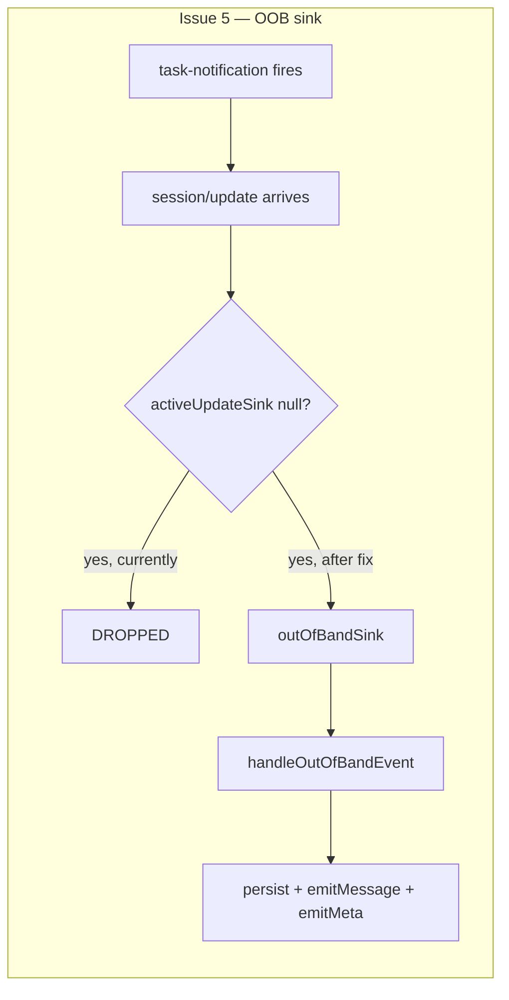

# Plan: Rich-chat issues 5, 7, 8

> Fix three bugs: task-notification replies invisible, Edit diff lost after channel toggle, diff blocks over-indented.

**Issue:** rich-chat-issues-5-7-8
**Branch:** `rich-typing-message`
**Status:** WIP

**Reference files:**
- ACP transport: `daemon/src/services/acp/acpTransport.ts`
- JSON agent: `daemon/src/services/jsonAgent.ts`
- Native import: `daemon/src/agent-plugins/claudeImport.ts`
- Types: `daemon/src/types.ts:135-141` (`ToolDiff` shape)
- Chat CSS: `web-ui/src/styles/chat.css`
- Workspace CSS: `web-ui/src/styles/workspace.css`
- Diff view: `web-ui/src/components/preview/DiffView.tsx`
- Tool run summary: `web-ui/src/components/chat/ToolRunSummary.tsx:98` (`hasDiffs`)
- Message list: `web-ui/src/components/chat/MessageList.tsx:239` (`toolDiffs→diffs`)

---

## Problem

- **Issue 5:** Background-agent task-notification replies are silently dropped — `activeUpdateSink` is null between turns, so `session/update` events arriving after a turn ends never reach the transcript store or WS broadcast
- **Issue 7:** After switching terminal→rich-chat, Edit/MultiEdit tool calls lose their colored diff view — `toolDiffs` is never computed on re-import, confirmed by DB: re-imported rows have `toolInput: {old_string, new_string}` but `toolDiffs: null`
- **Issue 8:** Diff blocks in chat are excessively indented (~144px total) and have loose line spacing — no chat-scoped overrides exist for the shared diff CSS

## Out of Scope

- Issue 6 (▾/▸ misparsed) — needs concrete repro before a fix target is known
- Write tool diff reconstruction (low priority, no `oldText`)
- Whole-file diff for imported entries (fragment-level is sufficient)

## Concept

- **Issue 5:** Add a permanent `outOfBandSink` callback on `AcpConnection`; events arriving between turns route there instead of being dropped; `JsonAgentSession` subscribes and feeds them through the same persist+broadcast pipeline with a synthetic turnId
- **Issue 7:** During native-history import, compute `ToolDiff` from `old_string`/`new_string` and attach to the `tool_result` emit — matching where live ACP entries store diffs
- **Issue 8:** Add `.chat-tool-entry__body`-scoped CSS overrides that tighten gutter widths, padding, and line-height without touching the full preview pane

## Requirements

| # | Requirement |
|---|-------------|
| 1 | Out-of-band assistant replies appear in rich-chat without a channel toggle or refresh |
| 2 | Out-of-band events must NOT flip session lifecycle to `working`/`thinking` |
| 3 | Re-imported Edit/MultiEdit tool calls render with a colored diff view |
| 4 | Diff blocks in chat have ≤40px total left offset and line-height ≤1.25 |
| 5 | Full preview-pane diff rendering is unchanged |

---

## Research

### Issue 5 — ACP out-of-band drop

- **File:** `daemon/src/services/acp/acpTransport.ts:402` — `activeUpdateSink?.()` optional-chains to null between turns; events dropped silently
- **File:** `acpTransport.ts:242,258-264` — sink set at `sendPrompt`, nulled in `.finally()`
- **File:** `daemon/src/services/jsonAgent.ts:889,1131-1135` — persist + WS fan-out only inside `runOneTurn`'s event loop; `updateTurnState` and `emitMeta` also called here
- **Risk:** MEDIUM — must not trigger spurious lifecycle transitions; `emitMeta()` must still be called so WS subscribers get a metadata refresh

### Issue 7 — Import missing diffs

- **File:** `daemon/src/agent-plugins/claudeImport.ts:190-199` — `tool_result` events emitted with no `toolDiffs`
- **DB evidence:** live `tool_result` rows (e.g. rowid 54, 71) carry `toolDiffs`; re-imported rows (113, 123 `tool_use` have `old_string`/`new_string`; 115, 125 `tool_result` have `toolDiffs: null`)
- **File:** `daemon/src/types.ts:135-141` — `ToolDiff: { path, oldText?, newText }`
- **Risk:** LOW — pure data enrichment; no UI change; no ACP protocol change

### Issue 8 — Diff indentation

- **File:** `web-ui/src/styles/workspace.css:2639-2646` — `.diff-line` uses `grid-template-columns: 48px 48px 16px 1fr` + `padding: 0 16px` → 96px gutters + 16px marker
- **File:** `workspace.css:2163-2172` — `.preview-diff-root` has `padding: 12px 0; line-height: 1.45; min-height: 100%`
- **File:** `web-ui/src/styles/chat.css:507-513` — `.chat-tool-run__body` adds `margin-left: var(--space-3)` (12px) + gap
- **File:** `chat.css:570-574` — `.chat-tool-entry__body` adds `margin-left: calc(1em + var(--space-2))` (~20px)
- **Risk:** LOW — all overrides scoped under `.chat-tool-entry__body`

## Root Cause

- **Issue 5:** `AcpConnection` has no permanent event channel — only a per-prompt sink that is cleared after each turn
- **Issue 7:** `claudeImport.ts` reconstructs tool events from raw JSONL but never computes diffs; live ACP supplies diffs as `{type:"diff"}` content blocks which importers never see
- **Issue 8:** Diff CSS has no context-aware variant; chat nests inside multiple indenting wrappers that compound with full-pane sizing

---

## Architecture Diagram



---

## Design Details

### Key Decisions

#### Decision 1: `outOfBandSink` as public field, not private

- **Decision:** `outOfBandSink` is a public field so `JsonAgentSession` can assign it after `new AcpConnection(...)` without a setter
- **Rationale:** `activeUpdateSink` is private because only `AcpConnection.prompt()` sets it; the OOB sink is set externally once at construction — public is the correct visibility
- **Where:** `acpTransport.ts:83`

#### Decision 2: Burst-stable `notif-<uuid>` turnId

- **Decision:** All OOB events in a burst share one synthetic turnId; reset on `result`/`error` kind
- **Rationale:** Per-event turnIds fragment `groupEvents`'s thinking/tool-run grouping in `MessageList.tsx:180,195`; a burst-stable id preserves grouping while keeping OOB turns visually separate from user-initiated turns
- **Where:** `jsonAgent.ts` new `handleOutOfBandEvent` method

```ts
// Burst-stable: all events in one OOB reply share a turnId; reset when the reply ends
private outOfBandTurnId: string | null = null;
private handleOutOfBandEvent(ev: NormalizedEvent): void {
  if (ev.kind === "result" || ev.kind === "error") {
    this.outOfBandTurnId = null;
    return;
  }
  const turnId = (this.outOfBandTurnId ??= `notif-${crypto.randomUUID()}`);
  ev = { ...ev, turnId };
  this.persist(ev);
  this.stream.emitMessage(ev);
  this.emitMeta();
  // NOT calling this.updateTurnState — prevents spurious working/thinking lifecycle flip
}
```

#### Decision 3: Attach `toolDiffs` on `tool_result` emit, not `tool_use`

- **Decision:** Compute diffs and attach to the `tool_result` import event
- **Rationale:** Matches where live ACP entries store diffs (confirmed in DB); `groupEvents` reads `toolDiffs` from whichever event has it; `tool_use` already has the input so we compute at `tool_result` emit time using a tracked map
- **Where:** `claudeImport.ts:190-199`

---

## Risks / Open Questions

| # | Question | Notes |
|---|----------|-------|
| 1 | Should OOB events update `session.usage`/`model`? | No — `normalizeSessionUpdate` never emits those fields; non-issue |
| 2 | Imported diffs are fragment-level; live diffs are whole-file — visual inconsistency? | Acceptable; comment in code. Could read file at import time for whole-file but adds I/O complexity |

---

## Implementation Phases

### Phase 1 — CSS fix (Issue 8)

- [ ] **1.1** Reduce `.chat-tool-run__body` gap and margin-left — `web-ui/src/styles/chat.css:507-513`
- [ ] **1.2** Reduce `.chat-tool-entry__body` margin-left — `chat.css:570-574`
- [ ] **1.3** Add `.chat-tool-entry__body`-scoped overrides for `.preview-diff-root`, `.preview-diff-hunk-header`, `.diff-line`, `.diff-gutter` — `web-ui/src/styles/workspace.css` (end of file)

**Verify phase 1:**
- [ ] **1.T1** Visual — diff block in rich-chat has ≤40px left offset and lines are visually tight
- [ ] **1.T2** Regression — full preview-pane diff (outside `.chat-tool-entry__body`) is visually unchanged

---

### Phase 2 — Import diff reconstruction (Issue 7)

- [ ] **2.1** In `claudeImport.ts`, add `Map<toolId, {toolName, toolInput}>` to track `tool_use` events as they're emitted
- [ ] **2.2** When emitting a `tool_result`, look up the corresponding `tool_use`; if `toolName === "Edit"` and `toolInput.old_string` exists, attach `toolDiffs: [{path, oldText, newText}]`
- [ ] **2.3** For `MultiEdit`: one `ToolDiff` per `toolInput.edits[]` entry
- [ ] **2.4** Mirror changes to `cli/src/daemon/agent-plugins/claudeImport.ts` if it exists

**Verify phase 2:**
- [ ] **2.T1** Manual — switch napi-5 session to terminal then back to rich-chat; Edit tool calls show colored diff view
- [ ] **2.T2** Unit — import a JSONL fixture with Edit tool calls; assert `toolDiffs` populated on `tool_result` events

---

### Phase 3 — Out-of-band ACP sink (Issue 5)

- [ ] **3.1** Add `public outOfBandSink: ((ev: NormalizedEvent) => void) | null = null` to `AcpConnection` — `acpTransport.ts:83`
- [ ] **3.2** In `session/update` handler, when `activeUpdateSink` is null: null-guard `this.sessionId`, normalize, call `this.outOfBandSink?.()` — `acpTransport.ts:400-404`
- [ ] **3.3** After `AcpConnection` construction/retrieval in `jsonAgent.ts:1005-1011`, assign `conn.outOfBandSink = this.handleOutOfBandEvent.bind(this)`
- [ ] **3.4** Add `private outOfBandTurnId: string | null = null` field to `JsonAgentSession`
- [ ] **3.5** Add `private handleOutOfBandEvent(ev: NormalizedEvent): void` — see Decision 2 snippet above

**Verify phase 3:**
- [ ] **3.T1** Manual — send a message that spawns a background agent; when agent completes, task-notification reply appears in rich-chat without toggling channels
- [ ] **3.T2** Regression — `session.lifecycle.state` does NOT flip to `working` or `thinking` during OOB event delivery
- [ ] **3.T3** Unit — `acpTransport.test.ts`: `session/update` with no active prompt calls `outOfBandSink` and does NOT throw

---

## Files & Phase Impact

| File | Status | Phase | Description |
|------|--------|-------|-------------|
| `web-ui/src/styles/chat.css` | **Modified** | 1.1, 1.2 | Tighten tool run wrapper margins and gap |
| `web-ui/src/styles/workspace.css` | **Modified** | 1.3 | Add chat-scoped diff overrides |
| `daemon/src/agent-plugins/claudeImport.ts` | **Modified** | 2.1–2.3 | Attach computed `toolDiffs` to imported `tool_result` events |
| `cli/src/daemon/agent-plugins/claudeImport.ts` | **Modified** | 2.4 | Mirror of daemon import fix |
| `daemon/src/services/acp/acpTransport.ts` | **Modified** | 3.1–3.2 | Add `outOfBandSink` field; route dropped events to it |
| `daemon/src/services/jsonAgent.ts` | **Modified** | 3.3–3.5 | Wire `outOfBandSink`; add `handleOutOfBandEvent` |
