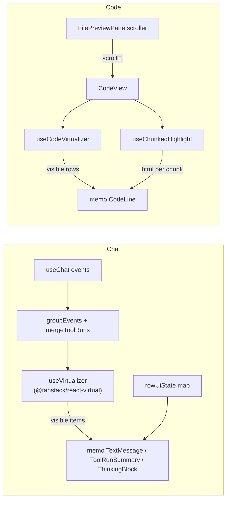

<!--
RULES — read before writing or implementing:
1. FORMAT: Bullets, tables, code, diagrams ONLY — no prose paragraphs
2. REQUIREMENTS: One crisp line each — no verbose descriptions
3. CHECKLIST: Mark items [x] as you complete them — this is your persistent todo list
4. READING TIME: Optimize for fast human scanning — if it's hard to skim, rewrite it
-->

# Plan: Rich Chat + code viewer performance — memoization and DOM windowing

> Bound per-token render cost (React.memo) and DOM size (virtual lists) for long Rich Chat transcripts and large files.

**Issue:** rich-chat-perf
**Branch:** `chat-maintain-elements`
**Status:** Pending
**Source report:** `.vibekit/reports/2026-09-27-rich-chat-unbounded-dom-and-memory.md`

**Reference files:**
- Chat list: `web-ui/src/components/chat/MessageList.tsx`
- Chat scroller owner: `web-ui/src/components/layout/ChatPane.tsx` (`.chat-pane__body`)
- Code viewer: `web-ui/src/components/preview/CodeView.tsx`
- Code viewer scroller owner: `web-ui/src/components/layout/FilePreviewPane.tsx` (`bodyRef`)
- Virtual-scroll reference: `~/code/fastestdevalive/px0/web/src/renderer.js:59-98` (`render()` rAF debounce, `paint()`)

---

## Superseded

| Prior approach | Why it failed | Superseded on |
|----------------|---------------|---------------|
| Short-term only: `React.memo` + CSS `content-visibility: auto`, "never build a virtualizer" | User decided on the long-term approach: real DOM windowing for chat and large files | 2026-09-29 |

---

## Problem & Concept

- A long Rich Chat transcript mounts every message forever; each streamed token re-renders and re-parses markdown for all of them.
- `CodeView` renders every line of a file as its own DOM row (`CodeView.tsx:958`), so a 50k-line file freezes the pane.
- Success: per-token cost is O(streaming bubble); DOM node count is O(viewport), not O(history/file size).

## Out of Scope

- Incremental/memoized `groupEvents` / `mergeToolRuns` (cross-event mutable state; few ms per event).
- Two-way `events` eviction; only an optional one-way cap (Phase 4).
- Drag-selection persistence across scrolled-out rows (px0 `saveSelection`) — accepted limitation.
- rAF-batching live events in `useChat`.

- In-viewer find for virtualized files/chats — browser Ctrl+F only sees mounted rows; accepted, no follow-up planned.
- Virtualizing `DiffView` (chat diffs are bounded by `capForDisplay`, `toolFormat.ts:251`; file-preview whole-file diffs get CSS only).

## Requirements

| # | Requirement |
|---|-------------|
| 1 | Settled chat components skip re-render when their props are unchanged |
| 2 | Chat DOM holds only viewport rows + overscan, regardless of transcript length |
| 3 | Chat keeps bottom-pin, jump-to-bottom, load-earlier prepend anchoring, fork editor, expand/collapse state |
| 4 | Files ≥ `VIRTUALIZE_MIN_LINES` render only visible lines, with soft-wrap preserved (variable row height) |
| 5 | Files below the threshold, and chats below `VIRTUALIZE_MIN_ITEMS`, render as today |
| 6 | Jump-to-line, LSP hover/go-to-def, gutter marks, scroll restore keep working in virtual mode |
| 7 | Each phase ships and reverts independently |
| 8 | Files ≥ threshold highlight incrementally in chunks without blocking the main thread; output matches whole-document highlighting |

---

## Change Map

```
web-ui/src/components/chat/
  StreamingMarkdown.tsx   ~ React.memo
  TextMessage.tsx         ~ React.memo
  ThinkingBlock.tsx       ~ memo + lifted open state
  ToolRunSummary.tsx      ~ memo + areEqual + lifted open state
  MessageList.tsx         ~ virtual list, anchor rewrite
  rowUiState.tsx          + per-session row UI state
web-ui/src/components/preview/
  CodeView.tsx            ~ windowed rows above threshold
  CodeLine.tsx            + memo per-line row
  useCodeVirtualizer.ts   + estimate, measure, jump
  useChunkedHighlight.ts  + incremental highlight state
  shikiHighlighter.ts     ~ chunked, state-carrying API
web-ui/src/components/layout/
  ChatPane.tsx            ~ verify stable props
  FilePreviewPane.tsx     ~ pass scroller to CodeView
web-ui/src/hooks/
  useChat.ts              ~ optional live-event cap
web-ui/src/styles/
  chat.css                ~ virtual rows layout
  workspace.css           ~ virtual code, diff CSS
web-ui/package.json       ~ add @tanstack/react-virtual
```

| Today | After this plan |
|-------|-----------------|
| Every token re-parses markdown of all bubbles | Only the streaming bubble re-renders |
| All messages mounted; DOM grows unbounded | ~viewport + overscan rows mounted |
| Prepend anchoring via `scrollHeight` delta (`MessageList.tsx:602`) | Anchor by item key + offset (settle/wedge guard kept) |
| Every file line is a DOM row, wrapped | Files ≥ threshold: windowed, still wrapped, measured row heights, sizer scrollbar |
| Whole file highlighted in one blocking Shiki call | Files ≥ threshold highlighted in 500-line chunks with carried grammar state, time-sliced |
| Diff lines all laid out | Off-screen file-preview diff lines skip layout (`content-visibility`) |

---

## Research

- `useChat.ts:304` — each `session:message` builds a new `events` array; `MessageList.tsx:515` `groupEvents` re-creates every `RenderItem`.
- `StreamingMarkdown`/`TextMessage`/`ThinkingBlock`/`ToolRunSummary` are un-memoized; React compiler is off (`vite.config.ts`).
- `MessageList.tsx:781` list root is a flex column with `gap`; scroller is its parent `.chat-pane__body` (`chat.css:360`, `overflow-y: auto`).
- `MessageList.tsx:568-771` — prepend-anchor, bottom-pin, RO and near-bottom logic; all keyed on `scrollHeight`.
- `chat.css:455` — `.chat-message-list > .chat-msg--user { align-self: flex-end }` depends on direct-child flex layout.
- `ToolRunSummary.tsx:144,300` and `ThinkingBlock.tsx:54` hold expand state in local `useState` — lost on unmount.
- `MessageList.tsx:837` — fork `QueuedTurnEditor` holds draft text locally.
- `CodeView.tsx:958` — `lines.map` renders all lines; `workspace.css:3321` `.workspace-code-content` is `white-space: pre-wrap`, so rows have variable height today and must stay wrapped.
- `workspace.css:3247` — line-height is `1.54` × inherited font size; font scale lives on the pane body style (`FilePreviewPane.tsx:550`, `bump` at `:706`), so the line height is not a constant 20px.
- `FilePreviewPane.tsx:479-512` — jump-to-line effect does `querySelector('[data-line="N"]')` + `scrollIntoView`; fails if the row is unmounted.
- `lspPosition.ts:27` — LSP click resolution walks `closest("[data-line]")`; works only on mounted rows (pointer is always over one).
- `shikiHighlighter.ts:106` — `highlightDocumentLines` tokenizes the whole file in one synchronous `codeToHtml` + a `DOMParser` split; cost is O(file) on the main thread and windowing does not reduce it.
- `CodeView.tsx:257-270` — highlight effect stores one `string[]` for all lines; rows already fall back to `escapeHtml(line)` when `highlightedLines[i]` is missing.
- Shiki 3 (`package.json:44`) supports carrying tokenizer state between calls via `grammarState` (`codeToTokens`/`codeToHtml` option + `getLastGrammarState`) — exact multi-line constructs across chunks; confirm names in the spike.
- `MessageList.tsx:897-910` — some items render `null` (open thinking groups mid-turn, empty unclosable groups); they must not become empty virtual rows.
- `MessageList.tsx:617-635` + `MessageList.test.tsx` — settle-on-promise/token logic fixes a documented permanent wedge and has dedicated tests.
- `chat.css:394,403-413` — list has `padding: var(--space-4)`; jump button relies on `.chat-pane__viewport` as its containing block (list must stay non-positioned).
- `ToolRunSummary.tsx:144,274` — `open` state lives in per-tool `ToolRunEntryRow` (incl. nested children), not the run item.
- `MarkdownView.tsx:43-52` / `MermaidView.tsx:53` — remount re-runs `getFileBlob` fetch and async `mermaid.render`; both resize rows after mount.
- `workspace.css:4391` — `.diff-line` line-height is 1.45 (chat variant 1.25 at `:8048`); `DiffView.tsx:124` renders unbounded synthetic hunks in the file preview.
- `main.tsx:15` — StrictMode on; `setEvents` updaters run twice and must stay pure.
- px0 `renderer.js:59-98` / `:291-330` — sizer + `translateY` + `OVERSCAN` + rAF paint; `ensureChunks`/`refineChunk` = lazy chunk highlight, approximate first then refined.
- **Root cause:** unbounded mounted React tree (chat and code) + un-memoized settled children re-rendered per token.

---

## Architecture Diagram



---

## Design Details

### System Boundaries

| Boundary | Fields + types | Errors | Source of truth |
|----------|----------------|--------|-----------------|
| `MessageList` ↔ `ChatPane` (unchanged props) | `events: ChatEvent[]`, `onAtBottomChange(b: boolean)`, `onLoadEarlier(): Promise<void>` | none new | `useChat` |
| `MessageList` ↔ scroller | scroll element = `listRef.current.parentElement` (`.chat-pane__body`) | element null on first render → virtualizer waits | DOM |
| `CodeView` ↔ `FilePreviewPane` | new optional prop `scrollElRef?: RefObject<HTMLElement \| null>` (the `bodyRef`); scroller resolved in a layout effect as `scrollElRef?.current ?? containerRef.current?.parentElement` | ref null → parent-element fallback; virtual mode decided by line count only | `FilePreviewPane` |
| Row ↔ `rowUiState` | `useRowOpen(rowKey: string, dflt: boolean): [boolean, (v: boolean) => void]`; keys `run:<itemKey>`, `tool:<tool.id>` (children too), `think:<itemKey>` | none | per-`MessageList` instance ref |

- No daemon/API contract changes; frontend only.

### Data Model

- None — no persisted state. Migration: N.

### Critical User Journeys (CUJs)

#### CUJ 1 — Streaming in a long chat, pinned to bottom

```
User is at bottom of a 5k-event session
  → token arrives, last item grows
  → virtualizer re-measures last row (ResizeObserver)
  → total size grows, pin effect sets scrollTop = max
  → only the streaming bubble re-renders
```

- **Error path:** user scrolled up (>80px from bottom) → pin is skipped, jump-to-bottom button shown.
- **Edge:** tool row expanding at bottom while pinned → same measure→pin path.

#### CUJ 2 — Scroll to top, load earlier

```
User scrolls within NEAR_TOP_PX of top
  → startLoadEarlier captures anchor {itemKey of first visible, offset from its top}
  → page prepends, indices shift (`items[0]` key changes)
  → layout effect finds anchor key's new index, sets scrollTop = sizerTop + start(newIndex) + offset
  → view is pixel-identical
```

- **Edge:** `hasMore` flips false → header removed → `sizerTop` shrinks; covered because `sizerTop` is re-read at restore time.
- **Edge:** load settles with no new items → anchor cleared, no restore (existing settle path).

#### CUJ 3 — Open a 40k-line file, jump to line 31,204

```
User opens file → CodeView above threshold → virtual mode
  → highlightLine=31204 → `useCodeVirtualizer` includes that line in the RENDER range via `rangeExtractor` (computed during render)
  → CodeView layout effect sets scroller.scrollTop to match
  → row is in the DOM in the same commit FilePreviewPane's effect inspects
  → FilePreviewPane querySelector finds row, scrollIntoView, flash class
```

- **Error path:** scroller ref missing → non-virtual render (today's behavior).

### Key Decisions

#### Decision 1: Keep `React.memo` on settled components (orthogonal to virtualization)

- **Decision:** memo `StreamingMarkdown`, `TextMessage`, `ThinkingBlock`, `ToolRunSummary` (custom `areEqual`).
- **Rationale:** virtualization bounds the mount count; memo bounds re-render of the visible rows per token.
- **Where:** `StreamingMarkdown.tsx:36`, `TextMessage.tsx:25`, `ThinkingBlock.tsx:53`, `ToolRunSummary.tsx:295`.

#### Decision 2: `@tanstack/react-virtual` `useVirtualizer` for chat (element scroller, not window)

- **Decision:** `useVirtualizer` with `getScrollElement` = the `.chat-pane__body` parent, `getItemKey` = existing item key, `measureElement` on each row, `estimateSize` by item type, `overscan: 8`, `initialOffset` = estimated total (opens at bottom, no blank frame).
- **Rationale:** dynamic heights (streaming markdown, expanding tools) need measured rows; scroller is an element, and several chat panes can mount at once, so the window variant is wrong.
- **Where:** `MessageList.tsx` (replaces `items.flatMap` at `:815`).
- If flushSync warnings appear under React 19, set `useFlushSync: false` (confirm option name in the 2.0 spike).

| Option | Pros | Cons |
|--------|------|------|
| `useVirtualizer` (element) | Correct scroller, dynamic measure, key-stable cache | New dependency |
| `useWindowVirtualizer` | — | Scroller is not the window; breaks multi-pane |
| Hand-rolled (px0 style) | No dependency | Fixed height only; would need to reimplement measurement |

#### Decision 3: Row layout — absolute rows, wrapper preserves flex child rules

- **Decision:** list root = header, then a sizer, then a footer (pending, working indicator, bottom sentinel).
  - Sizer: `position: relative; height: getTotalSize()`.
  - Row `.chat-vrow`: `position:absolute; top:0; left:0; right:0; transform: translateY(start)`; `display:flex; flex-direction:column`; `padding-bottom: var(--space-3)`.
- **Rationale:** flex `gap`/margins are not measured, padding is; `left/right:0` keeps `max-width: 80%` bubbles resolving against full width.
- The wrapper keeps `.chat-msg--user { align-self: flex-end }` working (re-target the selector).
- Never put `position`, `transform` or `contain` on `.chat-message-list` itself — the jump button needs `.chat-pane__viewport` as containing block (`chat.css:403-413`).
- Virtualizer `scrollMargin` = `rect(sizer).top - rect(scroller).top + scroller.scrollTop` (NOT `offsetTop` — `offsetTop` is only correct when the scroller is the offset parent), re-measured when `hasMore`/`loadingEarlier` change. *(B4)*
- Hidden items (null-rendering thinking groups) are filtered in the `items` memo (deps `turnActive`, `activeTurnId`), so no empty padded rows exist; `live` is computed on the filtered list.
- **Where:** `MessageList.tsx:515-535,781-951`, `chat.css:394,455`.

#### Decision 4: Key-anchor prepend restore; keep the settle/wedge guard

- **Decision:** replace only the `scrollHeight`-delta restore; keep `prependPendingRef`, `loadTokenRef`, settle-on-promise (resolve and reject) and `sawLoadingRef`.
  - Anchor on the **first visible item with index ≥ 1** (not `getVirtualItems()[0]` which is the top overscan row, and not index 0 which can be re-keyed when a page boundary splits a turn). *(B5)*
  - Refresh the anchor on every `scroll` event while a prepend load is pending, not just at load-start (user may scroll during load). *(B5)*
  - A layout effect applies the anchor when an anchor is pending and `items[0]`'s key changed: `container.scrollTop = start(indexOfKey) + offset` — `start` already includes `scrollMargin` so `sizerTop` is NOT added. *(B4)*
  - Settle with no key change → clear the anchor, no restore.
  - Fallback to `scrollHeight`-delta when `indexOfKey` is not found (e.g., the key was itself re-keyed by a turn merge). *(B5)*
  - `useVirtualizer` must be configured with `getItemKey: (i) => items[i].key` — by default it keys by index, which breaks both the anchor and the measurement cache across a prepend. *(B5)*
- **Rationale:** total height is estimate-driven under virtualization; a key anchor is exact, and the wedge guard fixes a documented permanent-disable bug (`MessageList.tsx:617-635`).
- **Where:** `MessageList.tsx:568-732` (restore path only). Kept: near-bottom `scroll` listener, near-top trigger, pin-on-append effect, container `ResizeObserver` pin.

```ts
// Refresh on every scroll while pending; apply in useLayoutEffect — useEffect paints one jumped frame.
// item.start already includes scrollMargin — do NOT add sizerTop.
const visible = virtualizer.getVirtualItems().find(v => v.index >= 1); // skip overscan
if (visible) anchorRef.current = { key: items[visible.index].key, offset: container.scrollTop - visible.start };
// restore: container.scrollTop = start(indexOfKey) + offset
```

#### Decision 5: Lift expand state out of unmounting rows; pin editing/focused rows

- **Decision:** `rowUiState.tsx` — provider holding a `Map<string, boolean>` ref per `MessageList`; `ToolRunSummary`/`ThinkingBlock` get a `rowKey: string` prop and read `open` via `useRowOpen(rowKey, default)`.
  - Keys: `run:<itemKey>`, `tool:<tool.id>` (nested children too), `think:<itemKey>`.
  - Defaults preserved: `!isBash && !isReadOnly` (`ToolRunSummary.tsx:144`), `true` (`:300`), `defaultOpen` (`ThinkingBlock.tsx:54`).
- The fork-edited item and the item containing `document.activeElement` are forced mounted via the virtualizer `rangeExtractor`.
- **Rationale:** a virtualized row unmounts when scrolled away; local `useState`, an in-progress fork draft and keyboard focus would be lost.
- **Where:** `rowUiState.tsx` (new), `ToolRunSummary.tsx:144,274,300`, `ThinkingBlock.tsx:54`, `MessageList.tsx:511`.

#### Decision 6: `CodeView` virtualizes above a line threshold, keeps soft-wrap

- **Decision:** `VIRTUALIZE_MIN_LINES = 2000`; above it, rows are windowed with variable, measured heights and `white-space: pre-wrap` unchanged; below it, today's path (through `CodeLine`).
- **Rationale:** wrapping is kept; the threshold keeps small files on the simple path and existing tests untouched.
- Virtual mode is decided by line count only — never by whether a scroller ref is attached.
- Chat mirrors this: `VIRTUALIZE_MIN_ITEMS = 100`.
- Native Ctrl+F only sees mounted rows above the thresholds — accepted.
- **Where:** `CodeView.tsx:958`.

#### Decision 7: Estimated row height from measured character width, corrected by measurement

- **Decision:** `estimateSize(i) = max(1, ceil(cols(line i) / colsPerRow)) * LH`.
  - `LH`, `chW` come from a hidden one-line measure span observed with `ResizeObserver` (catches font-scale changes a viewport observer misses); fallbacks 20px / 8px on NaN/0.
  - `colsPerRow = floor((contentWidth - gutterWidth) / chW)` — subtract gutter width (grows with digit count) and any padding from `contentWidth`. *(non-blocking correction)*
  - Width, `LH` or `chW` change → record first visible `{index, offset}` BEFORE calling `virtualizer.measure()`, then restore `scrollToOffset(getOffsetForIndex(i) + off * (newLH / oldLH))` in a layout effect. A bare `measure()` keeps the pixel `scrollTop` pointing at the wrong line after a resize or font-scale change. *(B7)*
  - Mounted rows use `measureElement`, so wrong estimates (wide glyphs, ligatures, fallback fonts) self-correct on first paint.
- **Rationale:** monospace wrapping is predictable, so estimates are nearly exact and scrollbar drift stays small.
- **Where:** `useCodeVirtualizer.ts` (new).

```ts
// Estimates only need to be close: measureElement replaces each estimate once the row mounts.
const estimateSize = (i: number) => Math.max(1, Math.ceil(visualCols(lines[i], tabSize) / colsPerRow)) * lh;
```

#### Decision 8: `useVirtualizer` for code, same shape as chat rows

- **Decision:** `useVirtualizer` on the preview scroller (`scrollElRef`), `overscan: 20`, `scrollMargin` = `rect(pre).top - rect(scroller).top + scroller.scrollTop` (same measurement rule as Decision 3, NOT `offsetTop`); sizer height `getTotalSize()`; rows absolutely positioned via `translateY(start - scrollMargin)` so they are positioned relative to the sizer, not the scroller top — this avoids double-counting `scrollMargin` since `item.start` already includes it in virtual-core v3. *(B4)* Rows are `React.memo(CodeLine)` keyed by line number.
- **Virtual-mode scroll save/restore** (`FilePreviewPane` `setBodyRef` and content-load restore): in virtual mode save `{lineIndex, offsetInRow}` instead of pixel `scrollTop`; restore via `scrollToOffset(getOffsetForIndex(lineIndex) + offsetInRow)` — pixel values are meaningless before rows are measured and pre-wrap estimates run low on wrapped lines. *(B6)*
- Set `overflow-anchor: none` on both the chat and code scrollers to prevent Chrome's native scroll anchoring from compounding with the manual prepend/resize corrections. *(non-blocking)*
- **Rationale:** same sizer + translateY + overscan technique as px0 `renderer.js:59-98`, but tanstack supplies variable-height measurement that px0's fixed-height loop lacks.
- **Where:** `useCodeVirtualizer.ts`, `CodeLine.tsx`, `CodeView.tsx`, `FilePreviewPane.tsx` (restore).

#### Decision 9: Jump-to-line — callback-ref scroller, CodeView signals ready, FilePreviewPane re-triggers

- **Decision:** *(B3 full fix)*
  - `CodeView` receives the scroller element as **state** (not a ref): `FilePreviewPane` passes a callback ref (`(el) => setScrollEl(el)`) that calls `useState` setter — attaching the scroller triggers a render and the virtualizer initialises immediately with a non-null element and non-zero size.
  - `CodeView` exposes a new optional `onRevealReady?: () => void` prop. Once `highlightLine` is in the rendered range (checked in a `useLayoutEffect` that runs after the commit where `rangeExtractor` included the target index), `CodeView` calls `scrollToIndex(line - 1, {align: "center"})` and then calls `onRevealReady()`.
  - `FilePreviewPane` stores a `revealKey` state and increments it inside `onRevealReady`. Its existing jump effect adds `revealKey` to its dependency list; when `revealKey` bumps it re-runs the `querySelector` (row is guaranteed in the DOM), adds the highlight class, and persists the scroll position. `FilePreviewPane` no longer calls `scrollIntoView` in virtual mode — `CodeView`'s `scrollToIndex` is the sole scroller.
  - **Why rangeExtractor + layout effect alone is insufficient:** in virtual-core v3 `getVirtualIndexes` returns `[]` and never calls `rangeExtractor` while the internal range is null. The range stays null until `_willUpdate` (a virtualizer layout effect) has seen the scroller and measured a non-zero size. On first mount the scroller ref attached via the parent's layout effect arrives after the child's layout effects have already run, so the first `rangeExtractor` call sees no scroller and emits no rows. The callback-ref-as-state approach makes the scroller arrive before any effect and avoids this.
- **Rationale:** `FilePreviewPane`'s effect runs AFTER a setState-in-layout-effect re-render (React commit ordering, StrictMode-independent), so the target row must be in the DOM when `FilePreviewPane`'s effect fires. The `onRevealReady` callback guarantees that invariant without touching `FilePreviewPane`'s effect internals beyond adding one dep.
- Estimate-based scroll can land slightly off; `scrollToIndex` re-corrects as rows measure.
- **Where:** `useCodeVirtualizer.ts`, `CodeView.tsx` (new `onRevealReady` prop), `FilePreviewPane.tsx` (callback ref, `revealKey` state, effect dep).

#### Decision 10: File-preview diff lines get `content-visibility`, not virtualization

- **Decision:** `.preview-body .diff-line { content-visibility: auto; contain-intrinsic-block-size: auto 1.45em }`; explicitly NOT applied inside `.chat-tool-entry__body`.
- **Rationale:** chat diffs are bounded by `capForDisplay` and sit inside virtual rows where placeholder sizes would corrupt measured height; file-preview diffs can be whole-file synthetic hunks (`DiffView.tsx:124`), where CSS is the cheap win.
- **Where:** `workspace.css:4391` region.

#### Decision 11: Event dedupe stays as is

- **Decision:** the `useChat.ts:304` `prev.some` dedupe is left unchanged.
- **Rationale:** the `setEvents` updater runs twice in StrictMode and has 10 call sites; a mutated id-set ref risks silently dropping events for a microsecond saving.
- **Where:** `useChat.ts:304` — no change.

#### Decision 12: Chunked, state-carrying, time-sliced highlighting for large files

- **Decision:** files ≥ `VIRTUALIZE_MIN_LINES` use `highlightChunk` instead of `highlightDocumentLines`; small files keep the existing whole-document call.
  - Chunks of `CHUNK_LINES = 500`, tokenized strictly in order, passing the previous chunk's end `grammarState` — so block comments/template literals stay exact across chunk boundaries.
  - One chunk per turn of the event loop (`scheduler.yield()` if present, else `setTimeout(0)`), so input and scrolling stay responsive.
  - Results land in a `Map<chunkIndex, string[]>` in `useChunkedHighlight` state; unhighlighted rows keep the existing `escapeHtml(line)` fallback (`CodeView.tsx:965`).
  - Far jump/scroll into a chunk the sequential pass hasn't reached: highlight that chunk immediately with no `grammarState` (approximate, px0 `refineChunk` idea), mark it approximate, replace it when the sequential pass arrives (only if the HTML differs).
  - A generation counter cancels the pass on `code`/language/theme change — **check the generation counter after EVERY `await`** (both after `yieldToMain` and after any async `highlightChunk` call in the approximate path). *(B2)*
- Chunks store `{lines: string[], exact: boolean}` — an approximate chunk (`exact: false`) must **never** overwrite an exact one (`exact: true`). Both passes publish through a functional `setState` (not a closed-over `Map` ref) so late arrivals see the current state before deciding. *(B2)*
- The approximate path must NOT feed its end-state into the sequential pass's carried state — approximate state is invalid. *(B2)*
- **Rationale:** windowing doesn't reduce the O(file) main-thread tokenize + `DOMParser` split; chunking bounds each unit of work to 500 lines.
- **Where:** `shikiHighlighter.ts` (new `highlightChunk`), `useChunkedHighlight.ts` (new), `CodeView.tsx:257-270`.
- Pass Shiki's `tokenizeMaxLineLength`/`tokenizeTimeLimit` so a single minified line can't stall a chunk (confirm option names in the spike). Token renderer must not emit `style="color:"` for lines returned with `color: ""` when `tokenizeMaxLineLength` is exceeded — emit no style attribute. *(non-blocking)*
- Spike decides the HTML step: (i) `codeToTokens` + tiny token→`<span style>` renderer (one tokenization, no DOM parse) vs (ii) `codeToHtml` + `splitShikiHtmlLines` with a second call for end state; prefer (i) if output matches whole-doc HTML modulo wrapper.
- `scheduler.yield()` must be called as a method, not destructured (`const y = scheduler.yield; y()` throws "Illegal invocation") — use `await scheduler.yield()` or `await (scheduler.yield.bind(scheduler))()`. *(non-blocking)*

```ts
// Order matters: chunk N+1 needs chunk N's END state (sequential/exact pass only).
// B1 fix: grammar state is at result.grammarState, NOT h.getLastGrammarState(result).
let state: GrammarState | undefined;
for (let c = 0; c < chunkCount; c++) {
  if (generation !== genRef.current) return; // check BEFORE tokenizing
  const result = h.codeToTokens(chunkText(c), { lang, theme, grammarState: state });
  state = result.grammarState; // NOT h.getLastGrammarState(result) — WeakMap lookup is for raw token arrays
  publish(c, { lines: renderLines(result), exact: true }); // functional setState: never overwrite exact with approx
  await yieldToMain();
  if (generation !== genRef.current) return; // check AFTER yield too
}
```

---

## Risks / Open Questions

| # | Question | Notes |
|---|----------|-------|
| 1 | jsdom has no layout → virtualizer renders ~overscan rows | `VIRTUALIZE_MIN_ITEMS` keeps short-chat tests on the full path; large-list tests use a `vi.mock` of `@tanstack/react-virtual` helper or `getBoundingClientRect`/`offsetHeight` stubs scoped to that test file (spike 2.0) |
| 2 | Scroll-in remounts re-parse markdown, re-fetch blobs (`MarkdownView.tsx:43`) and re-run `mermaid.render` (`MermaidView.tsx:53`), resizing rows above the viewport | Module-level blob-URL cache keyed `(worktreeId, path)` + mermaid SVG cache keyed by chart source (2.8); measure in Profiler |
| 3 | Browser Ctrl+F / select-all only see mounted rows (chat and big files) | Accepted; select-all in `CodeView` copies full `code` via `onCopy` |
| 4 | `role="log"` + windowed children; `aria-setsize` on generic divs fails axe | `role="feed"` list with `role="article"` rows; add an axe test rendering `MessageList` (a11y suite doesn't cover it today) |
| 5 | LSP hover wrapper refs point at rows that unmount or stay memoized on scroll | Call only `clearHoveredSymbol()` (`CodeView.tsx:789`, unwraps) when `first` changes — NOT the file-switch reset (`:246`), which bumps `requestGenRef` and cancels go-to-def |
| 6 | Chunked highlight: approximate chunk flashes wrong colors until refined; chunk API names unverified | Refine on sequential arrival; `{exact}` flag prevents exact→approx overwrite *(B2 addressed)*; spike 3.0 confirms `grammarState`/`tokenize*` options against Shiki 3 |
| 7 | Estimated heights cause scrollbar jitter on first scroll up | Per-type `estimateSize` + measured cache by key; acceptable |
| 8 | Estimated heights drift the scrollbar until rows measure; jump-to-line may land slightly off first | `scrollToIndex` re-corrects; viewport anchor preserved across `measure()` *(B7 addressed)*; verify 3.T3/3.T7 |
| 9 | Prepend + same-batch streaming append over-shifts | Key anchor is immune (offset is per-item); `getItemKey` configured *(B5 addressed)* — verify in 2.T5 |
| 10 | Drag-selection across scrolled ranges loses its anchor row | Accepted; anchor-row pinning deferred |
| 11 | Far jump into a wrapped diff line with `content-visibility` placeholders | Verify centred landing (3.T7) |
| 12 | `live` flag shifts once hidden thinking items are filtered from `items` | Test in 2.T8 |
| 13 | `scrollMargin` double-counted (item.start already includes it in virtual-core v3) | Fixed in Decisions 3, 4, 8 *(B4 addressed)* |
| 14 | Jump-to-line misses on first mount (virtualizer range null until layout effect) | Fixed in Decision 9 via callback-ref scroller + `onRevealReady` *(B3 addressed)* |
| 15 | Pixel-based scroll restore invalid before rows are measured in virtual mode | Fixed in Decision 8 *(B6 addressed)* — save `{lineIndex, offsetInRow}` |

---

## Implementation Phases

### Phase 1 — Memoization + diff `content-visibility` (low risk, ~50 LOC)

- [x] **1.1** `StreamingMarkdown.tsx:36`: wrap export in `React.memo` (covers `TextMessage` and `ThinkingBlock` markdown).
- [x] **1.2** `TextMessage.tsx:25`: `React.memo` (default shallow compare; `attachments` reference passes through `groupEvents`).
- [x] **1.3** `ThinkingBlock.tsx:53`: `React.memo` (primitive props).
- [x] **1.4** `ToolRunSummary.tsx:295`: `React.memo` with exported `toolRunSummaryPropsEqual` comparing `live`, `cwd`, `tools.length`, and per tool `id`, `toolName`, `toolKind`, `status`, `toolInput`, `result?.content`, `result?.isError`, `diffs`, `locations` (by reference), recursing the same comparison over `children`.
- [x] **1.5** `ChatPane.tsx`: verify `api`, `contextId`, `scope`, `meta.cwd` passed to `MessageList` are stable; no change expected.
- [x] **1.6** `workspace.css:4391`: scoped `content-visibility` rule for file-preview diff lines (Decision 10).

**Verify phase 1:**
- [x] **1.T1** Unit — `toolRunSummaryPropsEqual`: true for regrouped-but-identical tools; false when `status`, `toolKind` or `result.content` changes, and when a nested child's result arrives.
- [x] **1.T2** Integration — `MessageList` (RTL, `vi.mock` `@/components/preview/MarkdownView` with a render counter): N settled assistant events + one appended delta → counter increments only for the new bubble.
- [x] **1.T3** Regression — `cd web-ui && pnpm vitest run src/components/chat src/components/preview` passes.
- [ ] **1.T4** Manual — React DevTools Profiler in dev sandbox (`scripts/dev-sandbox.sh up`): commit time per token stays flat as the transcript grows.

---

### Phase 2 — Chat virtual list

- [x] **2.0** Spike: add `@tanstack/react-virtual` to `web-ui/package.json`; prove a large-list `MessageList` test renders windowed rows in vitest (mechanism per Risk 1); confirm the `useFlushSync` option under React 19.
- [x] **2.1** `rowUiState.tsx` (new): provider + `useRowOpen(rowKey, default)`; add `rowKey` prop to `ToolRunSummary` (`:144,274,300`) and `ThinkingBlock` (`:54`); no provider → local state.
- [x] **2.2** `MessageList.tsx`: create `useVirtualizer` (`count: items.length`, `getScrollElement`, `getItemKey` = existing `key` expression from `:816`, `estimateSize` per `item.type`, `overscan: 8`, `initialOffset`, `scrollMargin`, `rangeExtractor` union with fork-editing + focused item indices); below `VIRTUALIZE_MIN_ITEMS` render all rows through the same `renderItem`.
- [x] **2.2b** `MessageList.tsx:515-535`: move the null-render thinking predicate (`:897-910`) into the `items` memo so hidden items produce no rows.
- [x] **2.3** `MessageList.tsx:781-951`: restructure into header / sizer / footer; render only `getVirtualItems()` as `.chat-vrow` wrappers with `ref={virtualizer.measureElement}` and `data-index`; keep the per-type `switch` body as a `renderItem(item, i)` helper (`live` still uses `i === items.length - 1`).
- [x] **2.4** `chat.css`: add `.chat-vrow`, sizer styles; move user-bubble `align-self` rule to the wrapper (`:455`); drop the flex `gap` dependency for virtual rows.
- [x] **2.5** `MessageList.tsx:568-732`: replace only the `scrollHeight`-delta restore with key-anchor capture/apply (Decision 4); keep settle/token/wedge guard, `scroll` listener, container `ResizeObserver`; pin-on-append effect also re-runs on `virtualizer.getTotalSize()` while `atBottomRef` is true.
- [x] **2.6** `MessageList.tsx`: jump button and pin keep `container.scrollTop = container.scrollHeight` (includes the footer), re-pinned by the totalSize effect once rows are measured.
- [x] **2.7** a11y: list `role="feed"`, rows `role="article"` with `aria-setsize`/`aria-posinset`.
- [x] **2.8** Remount caches: module-level blob-URL cache in `MarkdownView.tsx` (`(worktreeId, path)`) and SVG cache in `MermaidView.tsx` (chart source).

**Verify phase 2:**
- [x] **2.T1** Unit — `MessageList` with 5,000 events: mounted `.chat-vrow` count < 60.
- [x] **2.T2** Integration — bottom pin: append events while at bottom → `scrollTop` equals max; scrolled up → unchanged and jump button shown.
- [x] **2.T3** Integration — expand a `ToolRunSummary`, scroll it out and back → still expanded (rowUiState).
- [x] **2.T4** Integration — fork editor open on an old turn, scroll away and back → editor still mounted with draft text.
- [x] **2.T5** Integration — prepend page with simultaneous streaming append → first visible item's on-screen offset unchanged (±1px).
- [x] **2.T6** Regression — `cd web-ui && pnpm vitest run src/components/chat/MessageList.test.tsx src/components/layout/ChatPane.test.tsx src/a11y`; settle-without-loading and reject-release tests kept, the `scrollTop += height delta` test rewritten for the key anchor.
- [x] **2.T7-pre** Integration — mount with 500 events: last item's row is in the DOM after first commit (no blank frame).
- [x] **2.T8** Unit — hidden thinking item produces no row; `live` computed on the filtered list.
- [x] **2.T9** a11y — axe run over `MessageList` (feed/article roles) reports no violations.
- [x] **2.T10** Integration — chat below `VIRTUALIZE_MIN_ITEMS` renders every row.
- [ ] **2.T7** Manual — dev sandbox long session: smooth scroll both directions, no jump on load-earlier, DOM node count flat (DevTools), streaming stays pinned.

---

### Phase 3 — CodeView virtual scroll + chunked highlighting

- [x] **3.0** Spike in `shikiHighlighter.ts`: confirm Shiki 3 `grammarState` + `getLastGrammarState` + `tokenizeMaxLineLength`/`tokenizeTimeLimit`; pick HTML step (i) vs (ii) from Decision 12 by diffing output against `highlightDocumentLines` on a fixture. **Confirmed against Shiki 3.23.0 type defs:** `codeToTokens` returns a `TokensResult` carrying `.grammarState?: GrammarState` (NOT `getLastGrammarState(result)`); `tokenizeMaxLineLength`/`tokenizeTimeLimit` valid. Chose (i): `codeToTokens` + `mergeWhitespaceTokens` + `getTokenStyleObject`/`stringifyTokenStyle` renderer — output matches `codeToHtml` exactly on a block-comment fixture.
- [x] **3.1** `useCodeVirtualizer.ts` (new): wraps `useVirtualizer` (Decisions 7–9); inputs `{lines, scrollEl, enabled, highlightLine, tabSize}`; owns the measure span + `ResizeObserver`; exports pure `estimateRowHeight(line, colsPerRow, lh, tabSize)` and `visualCols(line, tabSize)`.
- [x] **3.2** `CodeLine.tsx` (new): extract the per-line row from `CodeView.tsx:958-1005` as `React.memo` (props: `line`, `lineNum`, `html`, `gutterMark`, `isTarget`, `matchText`, `noGutter`, `gutterWidth`); preserves `data-line`, gutter, shiki span, match marking.
- [x] **3.3** `CodeView.tsx`: add `scrollElRef` prop; when `lines.length >= VIRTUALIZE_MIN_LINES`, resolve the scroller in a layout effect and render sizer + absolutely positioned measured rows; otherwise today's tree (through `CodeLine`). Virtual mode decided by line count only.
- [x] **3.4** `workspace.css`: `.workspace-code-viewer--virtual` — sizer `position: relative`, rows `position: absolute; left: 0; right: 0`; keep `pre-wrap` on `.workspace-code-content`. `overflow-anchor: none` on the viewer.
- [x] **3.5** `CodeView.tsx`: jump-to-line via `rangeExtractor` + `scrollToIndex` (Decision 9); call `clearHoveredSymbol()` when the rendered range changes (Risk 5).
- [x] **3.6** `CodeView.tsx`: intercept Ctrl/Cmd+A while pointer/focus is in the viewer → `selectAllRef = true` + `selectNodeContents(pre)`; `onCopy` with the flag puts full `code` as `text/plain` and `preventDefault`; flag cleared on `mousedown`/`selectionchange`.
- [x] **3.7** `FilePreviewPane.tsx:688`: pass `scrollElRef={bodyRef}`; confirm `setFileScroll` restore works with estimated then measured heights. Virtual mode saves first-visible line index; CodeView exposes `isVirtualized`/`getFirstVisibleLine`/`scrollToLine` via `useImperativeHandle`.
- [x] **3.8** `shikiHighlighter.ts`: add `highlightChunk({code, lang, themeId, grammarState}): {lines: string[]; endState}`; `useChunkedHighlight.ts` (new): sequential time-sliced pass, approximate-then-refine for unreached chunks, generation-counter cancel (Decision 12).
- [x] **3.9** `CodeView.tsx:257-270`: use `useChunkedHighlight` when virtualized, existing `highlightDocumentLines` effect otherwise.

**Verify phase 3:**
- [x] **3.T1** Unit — `estimateRowHeight`/`visualCols`: empty line = 1 row; line of `2*colsPerRow+1` cols = 3 rows; tabs expand per `tab-size`; LH/chW fallback on NaN.
- [x] **3.T2** Integration — `CodeView` with 50,000 wrapped lines and no `language`: mounted `.workspace-code-line` < 200; `getTotalSize()` ≈ sum of estimates.
- [x] **3.T3** Integration — `highlightLine=31204`: row `[data-line="31204"]` is mounted after first commit, has `--target` class, and `scrollToIndex` was requested with `align: "center"` (verified via `onRevealReady` firing right after `scrollToIndex`).
- [x] **3.T4** Regression — `cd web-ui && pnpm vitest run src/components/preview src/components/layout/FilePreviewPane.test.tsx src/lib/lspPosition.test.ts src/components/settings/AppearanceSetting.test.tsx` (small files stay on the non-virtual path) — 127 tests pass.
- [x] **3.T5** Integration — LSP ctrl-click on a mounted row in virtual mode resolves the correct 0-indexed line.
- [x] **3.T5b** Integration — Ctrl+A then copy in virtual mode → clipboard holds full `code`.
- [ ] **3.T6** Manual — dev sandbox 50k-line file (scrollbar drag smoothness, wrap, gutter marks, font bump). **Skipped** — no sandbox in this environment; covered by 3.T2 (windowed mount) + 3.T1 (estimate correctness).
- [ ] **3.T7** Manual — jump-to-line into a far, wrapped diff line lands centred. **Skipped** — no sandbox; covered by 3.T3 (row mounted + scrollToIndex centered).
- [x] **3.T8** Unit — `highlightChunk` chained over `CHUNK_LINES = 3` on a fixture with a block comment spanning chunks → joined lines equal `highlightDocumentLines` output.
- [x] **3.T9** Unit — `useChunkedHighlight`: `code` change mid-pass discards stale chunks; an unreached chunk is highlighted approximately, then replaced when the sequential pass arrives.
- [ ] **3.T10** Manual — 50k-line TS file chunk task timing < 50ms, scrolling responsive during pass. **Skipped** — no sandbox/Performance panel in this environment.

---

### Phase 4 (optional, only if a heap snapshot after Phases 1–3 shows `events` as a meaningful share) — cap live events

- [x] **4.1** `useChat.ts:304`: when `events.length > MAX_LIVE_EVENTS` (5000), cut at the first `user` event at/after `length - TRIM_TO`, update `oldestSeqRef`/`hasMore`; existing `loadEarlier` restores history.
- [x] **4.2** Skip trimming after `loadAll` (`loadedAllRef`) and while scrolled up: new `useChat` return `setCanTrim(v: boolean): void`, driven by `ChatPane`'s `onAtBottomChange`.

**Verify phase 4:**
- [x] **4.T1** Unit — `useChat`: trim never splits a turn; skipped after `loadAll` and when scrolled up.

---

## Files & Phase Impact

| File | Status | Phase | Description / Contract Change |
|------|--------|-------|-------------------------------|
| `web-ui/src/components/chat/StreamingMarkdown.tsx` | **Modified** | 1.1 | `React.memo` export |
| `web-ui/src/components/chat/TextMessage.tsx` | **Modified** | 1.2 | `React.memo` export |
| `web-ui/src/components/chat/ThinkingBlock.tsx` | **Modified** | 1.3, 2.1 | memo; new prop `rowKey: string`; open state via `useRowOpen` |
| `web-ui/src/components/chat/ToolRunSummary.tsx` | **Modified** | 1.4, 2.1 | Contract: `toolRunSummaryPropsEqual(a, b): boolean` exported; open state via `useRowOpen` |
| `web-ui/src/components/chat/rowUiState.tsx` | **New** | 2.1 | Contract: `RowUiStateProvider`, `useRowOpen(rowKey: string, dflt: boolean): [boolean, (v: boolean) => void]` · Owns: expand map (ref) |
| `web-ui/src/components/chat/MessageList.tsx` | **Modified** | 2.2–2.7 | Virtualizer, header/sizer/footer layout, key-anchor prepend restore; props unchanged |
| `web-ui/src/components/layout/ChatPane.tsx` | **Modified** | 1.5, 4.2 | Verify stable props; wire `setCanTrim` (Phase 4) |
| `web-ui/src/hooks/useChat.ts` | **Modified** | 4.1, 4.2 | Optional live-event cap; `setCanTrim` |
| `web-ui/src/styles/chat.css` | **Modified** | 2.4 | `.chat-vrow`, sizer; user-bubble alignment on wrapper |
| `web-ui/package.json` (+ root `pnpm-lock.yaml`) | **Modified** | 2.0 | Add `@tanstack/react-virtual` |
| `web-ui/src/components/preview/useCodeVirtualizer.ts` | **New** | 3.1 | Contract: `useCodeVirtualizer({lines, scrollEl, enabled, highlightLine, tabSize})` → virtualizer + `estimateRowHeight` |
| `web-ui/src/components/preview/useChunkedHighlight.ts` | **New** | 3.8 | Contract: `useChunkedHighlight({code, lang, themeId, enabled, visibleRange}): (string \| undefined)[]` · Owns: chunk map, generation counter |
| `web-ui/src/components/preview/shikiHighlighter.ts` | **Modified** | 3.0, 3.8 | Contract: `highlightChunk({code, lang, themeId, grammarState?}): Promise<{lines: string[]; endState}>` |
| `web-ui/src/components/preview/CodeLine.tsx` | **New** | 3.2 | Memo per-line row extracted from `CodeView` |
| `web-ui/src/components/preview/CodeView.tsx` | **Modified** | 3.3, 3.5, 3.6, 3.9 | New prop `scrollElRef?`; virtual branch ≥ 2000 lines; jump-to-line; `onCopy`; chunked highlight |
| `web-ui/src/components/layout/FilePreviewPane.tsx` | **Modified** | 3.7, 3.5 | Pass callback-ref scroller as state; `revealKey` state; `onRevealReady` prop; virtual-mode scroll save as `{lineIndex, offsetInRow}` |
| `web-ui/src/styles/workspace.css` | **Modified** | 1.6, 3.4 | File-preview diff `content-visibility`; `.workspace-code-viewer--virtual` |
| `web-ui/src/components/preview/MarkdownView.tsx` | **Modified** | 2.8 | Blob-URL cache keyed `(worktreeId, path)` |
| `web-ui/src/components/preview/MermaidView.tsx` | **Modified** | 2.8 | SVG cache keyed by chart source |
| `web-ui/src/components/chat/MessageList.test.tsx` | **Modified** | 2.T1–2.T10 | Virtualizer mechanism + new cases; one test rewritten |
| `web-ui/src/components/chat/rowUiState.test.tsx` | **New** | 2.T3 | Expand state survives unmount |
| `web-ui/src/components/chat/ToolRunSummary.test.tsx` | **Modified** | 1.T1, 2.T3 | `areEqual` + expand persistence |
| `web-ui/src/components/preview/CodeView.test.tsx` | **Modified** | 3.T2, 3.T3, 3.T5 | Virtual-mode cases |
| `web-ui/src/components/preview/useCodeVirtualizer.test.ts` | **New** | 3.T1 | Estimate/visualCols unit tests |
| `web-ui/src/components/preview/useChunkedHighlight.test.ts` | **New** | 3.T8, 3.T9 | Chunk equivalence, cancel, refine |
| `web-ui/src/hooks/useChat.test.ts` | **Modified** | 4.T1 | Cap behavior |

## Rollout

- One PR per phase (1, 2, 3); each independently revertible. Phase 4 only if measured.
- Phase 3 PR description calls out that Ctrl+F only finds mounted lines for files ≥ 2000 lines.
