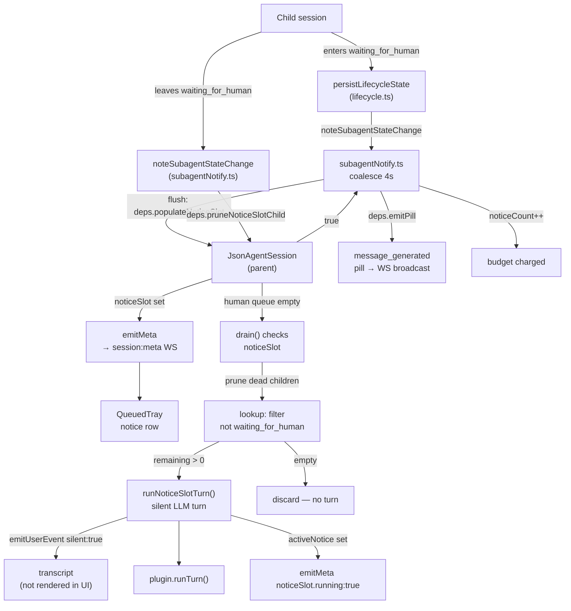
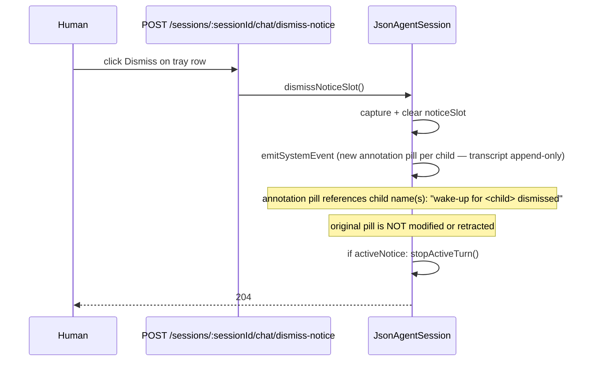

<!--
RULES — read before implementing:
1. FORMAT: Bullets, tables, code, diagrams ONLY — no prose paragraphs
2. REQUIREMENTS: One crisp line each — no verbose descriptions
3. CHECKLIST: Mark items [x] as you complete them — this is your persistent todo list
4. READING TIME: Optimize for fast human scanning — if it's hard to skim, rewrite it
-->

# Plan: Silent Subagent Notify

---

## 1. Problem & Concept

- PRD: [`prd-silent-subagent-notify.md`](./prd-silent-subagent-notify.md)
- Today `subagentNotify.ts` only emits a `message_generated` pill — the parent gets no LLM turn to react
- This plan adds a **per-session notice slot** (outside the human queue) that delivers one silent LLM turn when the human queue is empty; the pill and slot are populated atomically

---

## 2. Requirements Table

| ID | Requirement |
|----|-------------|
| R1 | Parent receives a queued LLM turn when child enters `waiting_for_human` |
| R2 | Notice turn is `silent` — no user bubble in chat UI |
| R3 | Second flush merges into existing slot (coalescing by existence check) |
| R5 | At most one pending notice slot per parent, outside human queue |
| R5b | Slot consumed only when human queue is empty and no turn is running |
| R6 | Cap (25) applies at slot population; failed delivery does not charge budget |
| R8 | Slot populated → pill emitted → budget charged, all synchronous; if slot fails: no pill, no charge |
| R9 | Text composed at run time; children no longer `waiting_for_human` pruned; if slot empty after prune → discard |
| R10 | Tray row: muted system row with child name + state; no Edit / Send-now controls |
| R11 | Single Dismiss on tray row; annotates pill on dismiss, does not retract |
| R12 | Status bar shows "Checking on \<child name\>" while notice turn runs |
| R13 | Stop button labeled "Stop checking on \<child\>"; stopping emits annotation, does not re-queue |
| R14 | Stop / drain does NOT clear the slot; only retire/delete does |
| R15 | At cap: pill still emitted; first suppression emits one warning pill |
| R16 | Child leaving `waiting_for_human` → proactively pruned from parent's slot; empty slot discarded |

---

## 3. Change Map

### Directory Tree (new or changed files)

```
daemon/src/
  services/
    subagentNotify.ts          ← change deps interface, atomicity in flush, prune on exit
    jsonAgent.ts               ← notice slot field + methods, drain extension
    lifecycle.ts               ← new notifyDeps fields (bridge only; no prune logic here)
  types.ts                     ← NormalizedEvent.silent, SessionMeta.noticeSlot
  ws/
    protocol.ts                ← SessionMetaSchema additions (Phase 1)
  routes/
    sessions.ts                ← new POST /sessions/:sessionId/chat/dismiss-notice route

web-ui/src/
  api/
    types.ts                   ← SessionMeta additions, NormalizedEvent.silent
  components/chat/
    QueuedTray.tsx             ← noticeSlot prop, NoticeSlotRow render branch
    StatusBar.tsx              ← noticeSlot.running wiring
    MessageList.tsx            ← suppress silent user events
    ChatPane.tsx               ← pass noticeSlot to QueuedTray, wire dismiss, filter silent events
```

### Today / After

| Layer | Today | After |
|-------|-------|-------|
| `subagentNotify.ts` | `flush` calls `deps.emitSystemEvent` (pill only) | `flush` calls `deps.populateNoticeSlot` → if ok: `deps.emitPill` + budget charge; prune-on-exit logic inside `noteSubagentStateChange` |
| `JsonAgentSession` | no notice slot | `noticeSlot: NoticeSlot \| null`; `activeNotice: NoticeSlot \| null`; extended `drain()`; `populateNoticeSlot()`, `pruneNoticeSlotChild()`, `dismissNoticeSlot()` |
| `lifecycle.ts` | `notifyDeps` has `emitSystemEvent` | `notifyDeps` gains `populateNoticeSlot` (sync), `emitPill` (async), `pruneNoticeSlotChild` (sync bridge — trigger is in subagentNotify.ts) |
| `QueuedTray` | human queue rows only | + muted notice slot row (no Edit/Send-now, single Dismiss) |
| `StatusBar` | generic "Thinking/Responding/Tool" labels | + contextual labels derived from `noticeSlot.running + noticeSlot.children` |
| `MessageList` | renders all `user` events; `message_generated` pill is centered, text size inconsistent | skips `event.silent === true` user events; `message_generated` pill is left-aligned, uniform text size, readable copy ("subagent \<name\> is now waiting…") |

---

## 4. Research

| Finding | File | Lines | Used by |
|---------|------|-------|---------|
| `subagentNotify.flush` currently calls `deps.emitSystemEvent` (pill only, no LLM turn) | `daemon/src/services/subagentNotify.ts` | 169–191 | KD-1, Phase 1 |
| Budget charged (`noticeCount.set`) BEFORE pill emission — ordering inverted vs R8 | `daemon/src/services/subagentNotify.ts` | 179 | KD-1 |
| `noteSubagentStateChange` only triggers on `waiting_for_human` entry; early-return at line 152 fires before any flush when cap reached | `daemon/src/services/subagentNotify.ts` | 128–129, 152 | KD-1, KD-3 (R15, R16) |
| `JsonAgentSession.drain()` runs `while (queue.length > 0)` then `persistLifecycle("waiting_for_human")` | `daemon/src/services/jsonAgent.ts` | 1084–1117 | KD-2, Phase 1 |
| `abortAndDrain()` clears `this.queue = []` but does NOT need to clear notice slot (R14) | `daemon/src/services/jsonAgent.ts` | 718–728 | KD-2 |
| `kickDrain()` only starts if `!this.running` (no slot check) | `daemon/src/services/jsonAgent.ts` | 711–715 | Phase 1 |
| `emitUserEvent` emits `kind:"user"` event — no `silent` field today | `daemon/src/services/jsonAgent.ts` | 592–601 | KD-4 |
| `QueuedTurn` (interface at lines 305–319) has no `silent` field today | `daemon/src/services/jsonAgent.ts` | 305–319 | FIX-2 |
| `emitUserEvent` is called at enqueue time (lines 644, 694), not inside `runOneTurn` | `daemon/src/services/jsonAgent.ts` | 644, 694 | KD-4, Phase 1 |
| `release()` calls `abortAndDrain()` — slot must be cleared here (only retire path) | `daemon/src/services/jsonAgent.ts` | 762–777 | KD-2 |
| `persistLifecycleState` calls `noteSubagentStateChange` with prev+new state | `daemon/src/services/lifecycle.ts` | 119–125 | KD-3 |
| `jsonAgentRegistry` is a simple `Map<string, JsonAgentSession>` — synchronous lookup | `daemon/src/state/jsonAgentRegistry.ts` | 15 | KD-1 |
| `jsonAgent.ts` already imports `mutateProject` from `project-store` — can also import `getAllProjects` (no cycle) | `daemon/src/services/jsonAgent.ts` | 32 | KD-5 |
| `QueuedTray` rows have `status: "queued" \| "editing" \| "pending"` — notice row is a separate prop, not a row kind | `web-ui/src/components/chat/QueuedTray.tsx` | 8 | Phase 3 |
| `trayRows` built in `ChatPane.tsx` from `queuedTurnIds` + `editingTurnIds` + `pending` | `web-ui/src/components/layout/ChatPane.tsx` | 167–207 | Phase 3 |
| `ChatPane.tsx:220` derives `lastUserText` (retry prefill) from last `user` event | `web-ui/src/components/layout/ChatPane.tsx` | 220 | Phase 3, FIX-19 |
| `ChatPane.tsx:147–156` indexes all `user` events into edit-prefill map | `web-ui/src/components/layout/ChatPane.tsx` | 147–156 | Phase 3, FIX-19 |
| `MessageList` `RenderItem` type has `type:"user"` with `cancelled?` but no `silent?` | `web-ui/src/components/chat/MessageList.tsx` | 14 | Phase 3 |
| `StatusBar.turnLabel()` is a pure switch with no contextual override | `web-ui/src/components/chat/StatusBar.tsx` | 39–54 | Phase 3 |
| `SessionMetaSchema` in `protocol.ts` — Zod object, additive `.optional()` fields are safe | `daemon/src/ws/protocol.ts` | 228–242 | Phase 1 |
| `forgetSubagentNotify` and `_resetSubagentNotifyForTest` clear `noticeCount` — new `suppressionWarned` Set must also be cleared there | `daemon/src/services/subagentNotify.ts` | 75–88 | KD-7 |

---

## 5. Architecture Diagram



---

## 6. Design Details

### 6.1 CUJs

#### Happy Path: child blocks → parent woken

```mermaid
sequenceDiagram
    participant Child
    participant lifecycle as lifecycle.ts
    participant SAN as subagentNotify.ts
    participant JAS as JsonAgentSession (parent)
    participant WS as WebSocket → web-ui

    Child->>lifecycle: enters waiting_for_human
    lifecycle->>SAN: noteSubagentStateChange (coalesce 4s)
    SAN->>JAS: populateNoticeSlot(childId, childName) → true
    SAN->>JAS: emitPill(payload)  [pill → WS]
    SAN->>SAN: noticeCount++ (budget)
    JAS->>WS: session:meta (noticeSlot populated, running:false)
    Note over JAS: human queue empty → kickDrain
    JAS->>JAS: drain(): prune dead children
    JAS->>JAS: runNoticeSlotTurn(): synthesize turnId → emitUserEvent(silent:true) → runOneTurn
    JAS->>WS: session:meta (noticeSlot.running: true)
    JAS->>WS: session:message (LLM response)
    JAS->>JAS: activeNotice = null; emitMeta (noticeSlot: undefined)
```

#### Error Path: slot at cap

```mermaid
sequenceDiagram
    participant SAN as subagentNotify.ts
    participant JAS as JsonAgentSession (parent)
    participant WS as WebSocket

    SAN->>JAS: populateNoticeSlot() → false (cap reached)
    Note over SAN: cap guard relaxed — flush continues after false return
    Note over SAN: on FIRST suppression only:
    SAN->>JAS: emitPill(warning: "auto-wake paused; reply here to resume")
    Note over SAN: no budget charge, no LLM turn
```

#### Edge Path: child unblocks before slot is consumed

```mermaid
sequenceDiagram
    participant Child
    participant SAN as subagentNotify.ts
    participant JAS as JsonAgentSession (parent)

    Child->>lifecycle: leaves waiting_for_human (any reason)
    lifecycle->>SAN: noteSubagentStateChange (prev=waiting_for_human)
    SAN->>JAS: pruneNoticeSlotChild(childId) [before NOTABLE gate]
    JAS->>JAS: remove childId from slot
    alt slot empty after prune
        JAS->>JAS: noticeSlot = null; emitMeta
    end
    Note over JAS: If drain() was waiting, runNoticeSlotTurn() sees empty slot → discard
```

#### Dismiss Path



---

### 6.2 Data Model

#### `NoticeSlot` (in-memory, on `JsonAgentSession`)

```ts
interface NoticeSlot {
  /** childId → display name. Map preserves insertion order; later flush merges.
   *  Names are cached for tray display performance; R9 re-resolves at run time,
   *  so stale names are bounded to the tray row only. */
  children: Map<string, string>;
}
```

- Lives on `JsonAgentSession` as `private noticeSlot: NoticeSlot | null = null`
- `private activeNotice: NoticeSlot | null = null` — set when notice turn is running (replaces `isActiveNotice: boolean`; enables `getMeta()` to produce `running: true` and `dismissNoticeSlot()` to stop the active turn)
- Not persisted to DB; not serialized to disk
- Cleared only by `release()` or `dismissNoticeSlot()`; NOT by `abortAndDrain()`

#### `QueuedTurn` addition

```ts
// daemon/src/services/jsonAgent.ts — QueuedTurn (lines 305–319)
silent?: boolean;  // true → notice turn; emitUserEvent called with silent:true
```

#### `NormalizedEvent` additions

```ts
// daemon/src/types.ts — NormalizedEvent
silent?: boolean;  // true → UI must not render as human bubble
```

#### `SessionMeta` additions

```ts
// daemon/src/types.ts — SessionMeta
/** Populated while a notice slot is pending or running (tray row + status bar).
 *  running:true while the notice LLM turn is active (UI composes copy from children). */
noticeSlot?: { children: Record<string, string>; running: boolean };
// UI owns copy: "Checking on X" / "Stop checking on X" derived from children + running.
// No noticeLabel / noticeStopLabel fields — UI composes from noticeSlot.
```

#### `QueuedTrayRow` — unchanged; notice row is a separate prop

```ts
// web-ui/src/components/chat/QueuedTray.tsx
// QueuedTrayStatus remains: "queued" | "editing" | "pending"  (no "notice" — dead code)

// Notice info passed as a separate prop:
export interface NoticeSlotInfo {
  children: Record<string, string>;  // childId → display name
  running: boolean;
}
// passed as noticeSlot?: NoticeSlotInfo to QueuedTray — not a QueuedTrayRow
```

---

### 6.3 API Contracts / System Boundaries

#### Daemon ↔ Web-UI (WS `session:meta`)

```
SessionMetaSchema additions (protocol.ts — Phase 1):
  noticeSlot: z.object({
    children: z.record(z.string()),
    running: z.boolean(),
  }).optional(),
  silent: z.boolean().optional(),   // on NormalizedEventSchema
```

#### Daemon HTTP — new endpoint

```
POST /sessions/:sessionId/chat/dismiss-notice
  → 204 No Content    (idempotent: slot cleared and annotation emitted, OR no slot — both return 204)
  → 404               (session not found / not a JSON session)
```

- **204 unconditionally** when session is found: dismiss is idempotent — a race where the slot was already consumed before the HTTP call is a normal timing, not an error (no 409).

#### `subagentNotify.ts` `NotifyDeps` interface

```ts
// BEFORE (today):
emitSystemEvent: (parentSessionId: string, payload: {...}) => Promise<void>

// AFTER:
/** Sync. Returns true if slot was populated/merged; false if cap/rejected. */
populateNoticeSlot: (
  parentSessionId: string,
  childId: string,
  childName: string,
) => boolean;
/** Async. Emit the message_generated pill. Called only when populateNoticeSlot returned true. */
emitPill: (
  parentSessionId: string,
  payload: { subagentId: string; subagentName: string; subagentState: LifecycleState; text: string },
) => Promise<void>;
/** Sync. Prune child from parent's notice slot. Called from noteSubagentStateChange on exit. */
pruneNoticeSlotChild: (parentSessionId: string, childSessionId: string) => void;
```

#### `lifecycle.ts` `notifyDeps` bridge entries

```ts
// Implements the three deps above as bridges to jsonAgentRegistry.
// No prune decision logic here — trigger lives in subagentNotify.ts#noteSubagentStateChange.
pruneNoticeSlotChild: (parentSessionId, childSessionId) =>
  jsonAgentRegistry.get(parentSessionId)?.pruneNoticeSlotChild(childSessionId)
```

#### `JsonAgentSession` public surface (new/changed)

```ts
// New methods:
populateNoticeSlot(childId: string, childName: string): boolean
pruneNoticeSlotChild(childId: string): void
dismissNoticeSlot(): void

// Changed internal behavior:
kickDrain()     // also triggers when !this.running && (this.queue.length > 0 || this.noticeSlot)
drain()         // outer while loop handles human queue then notice slot (see KD-2)
abortAndDrain() // unchanged — does NOT clear noticeSlot (R14)
release()       // clears noticeSlot + activeNotice before calling abortAndDrain
getMeta()       // includes noticeSlot derived from this.noticeSlot ?? this.activeNotice
```

#### Module boundaries (no new cycles)

| From | To | Already exists? |
|------|----|----------------|
| `subagentNotify.ts` | `jsonAgentRegistry` (via lifecycle deps wiring) | No direct import — deps pattern preserved |
| `jsonAgent.ts` | `project-store.getAllProjects` | Yes (already imports `mutateProject`) |
| `lifecycle.ts` | `jsonAgentRegistry` | New direct import (safe — registry is a leaf) |

---

### 6.4 Key Decisions

#### KD-1 — Atomicity: sync `populateNoticeSlot` + async `emitPill`

- **Choice**: Split `emitSystemEvent` dep into two: `populateNoticeSlot` (sync, returns bool) and `emitPill` (async, called only on success)
- **Why**: R8 requires "slot populated first, pill second, budget third — all in one step; if slot fails, no pill, no charge." Sync slot population allows the failure check before any side effects.
- **How**: `jsonAgentRegistry.get(parentId)` is synchronous → `populateNoticeSlot` can be sync
- **Cap guard (R15)**: The `if (noticeCount >= MAX) return` early-return in `noteSubagentStateChange` (line 152) must be relaxed/moved so `flush()` still runs at cap. At cap: `populateNoticeSlot` returns `false` (suppressing the LLM turn); `flush()` still calls `emitPill` for the notification pill and checks/emits the first-suppression warning pill. Only `populateNoticeSlot` enforces the cap; the pill path is independent of it.
- **Multi-child coalescing (R8)**: When two children are coalesced in one flush, ALL children are merged into the slot first; if slot population succeeded (any child added), pills are emitted only for newly-added children; budget is charged ONCE per flush, not per child.
- **Alternative rejected**: Keeping `emitSystemEvent` as a single async dep makes atomicity impossible — can't know if slot was populated before awaiting it

#### KD-2 — Drain loop extension (not a separate mechanism)

- **Choice**: Extend `drain()` with an outer while loop; `kickDrain()` also fires when `!this.running && this.noticeSlot`
- **Why**: Slot delivery is "queue empty and no turn running" — exactly the post-queue state in drain
- **Drain loop structure** (implementable pseudocode):
  ```ts
  while (this.queue.length > 0 || this.noticeSlot) {
    while (this.queue.length > 0) {
      const turn = this.queue.shift();
      await this.runOneTurn(turn);
    }
    if (this.noticeSlot) {
      await this.runNoticeSlotTurn();
    }
  }
  // then: await this.persistLifecycle("waiting_for_human")
  ```
- **Race fix (FIX-5)**: `drain()`'s finally block `await this.persistLifecycle("waiting_for_human")` yields while `this.running` may still be true. After `running = false`, drain must re-check `this.noticeSlot` and call `kickDrain()` if non-null — or move the slot check outside the try/finally scope — to avoid stalling a slot that arrives during that yield.
- **Alternative rejected**: Separate `noticeRunner()` coroutine — over-engineered, two concurrent runners with complex interlock

#### KD-3 — R16 pruning via `noteSubagentStateChange` (not `persistLifecycleState`)

- **Choice**: In `subagentNotify.ts#noteSubagentStateChange`, after parent resolution, if `prev === "waiting_for_human"` and `newState !== "waiting_for_human"`, call `deps.pruneNoticeSlotChild`. This fires BEFORE the NOTABLE gate so non-notable transitions still trigger the prune.
- **Why**: Putting the prune in `persistLifecycleState` (lifecycle.ts) would require duplicating parent-resolution logic (`supersededBy` walk, archived/done/json-channel guards). `noteSubagentStateChange` already does this resolution.
- **R16 vs R9**: R16 is a UX freshness optimization (prune proactively so tray row disappears promptly); R9 is the correctness floor (prune at run time so stale children never fire an LLM turn). Both are needed.
- **`lifecycle.ts` does NOT contain prune logic** — it only provides the `pruneNoticeSlotChild` bridge dep.
- **Cost**: One `Map.delete()` per state transition where child was `waiting_for_human` — negligible

#### KD-4 — `silent: true` on `user` event (not a new event kind)

- **Choice**: Add `silent?: boolean` to `NormalizedEvent` and to `QueuedTurn`; `runNoticeSlotTurn` synthesizes a turnId, calls `emitUserEvent(turnId, text, [], { silent: true })`, then calls `runOneTurn`
- **Why**: `emitUserEvent` is called at enqueue time (lines 644, 694), not inside `runOneTurn`. Notice turns have no enqueue step — `runNoticeSlotTurn` must call `emitUserEvent` explicitly before `runOneTurn` to lay down the transcript event with `silent:true`.
- **Alternative rejected**: New `NormalizedEventKind` — would require changes to every event switch/case and transcript replay logic

#### KD-5 — Run-time pruning uses `getAllProjects` from project-store

- **Choice**: In `runNoticeSlotTurn()`, inline `findSessionRecord(childId)` by calling `getAllProjects()` (already imported)
- **Why**: `JsonAgentSession` already imports `mutateProject` from `project-store` — adding `getAllProjects` is additive, no new cycle
- **Alternative rejected**: Passing `lookup` dep to constructor — adds complexity to `JsonAgentSessionOptions` for a one-call use

#### KD-6 — Notice slot UX as separate prop to QueuedTray (not a new QueuedTrayRow kind)

- **Choice**: `QueuedTray` receives `noticeSlot?: NoticeSlotInfo` as a second prop; renders as a distinct section before the human queue rows
- **Why**: Notice row has no `turnId`, no edit/send-now affordances — shoving it into `QueuedTrayRow[]` requires nullable fields and branching everywhere
- **Over-engineering flag**: A single extra prop is the minimal additive change; don't add a polymorphic row union type

#### KD-7 — Cap first-suppression warning: tracked in `subagentNotify.ts`

- **Choice**: Track first-suppression per parent in `subagentNotify.ts` as `suppressionWarned = new Set<string>()`; emit warning pill on first cap hit, silent on subsequent
- **Why**: Minimal — one extra Set alongside `noticeCount`; avoids threading warning state into `JsonAgentSession`
- **Cleanup**: `suppressionWarned` must be cleared in `forgetSubagentNotify` (lines 75–88) and `_resetSubagentNotifyForTest` alongside `noticeCount`

#### KD-8 — Stop annotation from `runNoticeSlotTurn` finally (not `emitStopped`)

- **Choice**: Emit the "wake-up dropped" annotation from the `runNoticeSlotTurn` finally block on abort, not from `emitStopped`
- **Why**: `emitStopped` only fires when `!sawResult`. A notice turn stopped after a result arrives emits nothing via `emitStopped`. The finally block fires unconditionally on abort.

#### KD-9 — Dismiss annotation is a new pill (transcript append-only)

- **Choice**: `dismissNoticeSlot()` emits a new `message_generated` annotation pill per child ("wake-up for \<child\> dismissed")
- **Why**: Transcript is append-only; the original notification pill is NOT modified or retracted. Emitting a new pill is the correct implementation of "annotating" the existing pill — the child name creates the association.

---

## 7. Risks / Open Questions

| # | Risk / Question | Mitigation |
|---|-----------------|------------|
| 1 | Notice turn fires while human message already queued (race: human sends between slot flush and drain check) | The drain loop re-checks human queue BEFORE consuming slot; slot waits. No race. |
| 2 | `populateNoticeSlot` called while drain is active — notice slot set mid-turn | Safe: slot is set; drain re-checks slot after current turn finishes |
| 3 | Daemon restart clears in-memory slot — notice never fires | Known limitation per PRD. Slot is ephemeral. Child re-entering `waiting_for_human` re-populates slot. |
| 4 | Text wording ("Checking on X") — exact strings TBC with design | PRD open question #1; UI derives copy from `noticeSlot.children + running`; strings are in UI components as named constants. |
| 5 | `queueDepth` in status bar should NOT count notice slot (PRD open question #2) | Plan: `noticeSlot` is a separate field; `queueDepth` / `queuedTurnIds` never include the notice slot |
| 6 | Multi-level cascade: ancestor chain each burns own cap independently | Acceptable per PRD (question #3); no new mechanism needed |
| 7 | Daemon restart drops pending notice slot — pill stays in transcript implying a wake that won't come | Known limitation; no mitigation without slot persistence (out of scope). Child re-entering `waiting_for_human` after restart re-populates the slot. |

---

## 8. Implementation Phases

### Phase 1 — Daemon core (notice slot + silent turn delivery + protocol schema)

- [x] **`daemon/src/types.ts`**: Add `silent?: boolean` to `NormalizedEvent`; add `noticeSlot?: { children: Record<string, string>; running: boolean }` to `SessionMeta` (no `noticeLabel`/`noticeStopLabel`)
- [x] **`daemon/src/ws/protocol.ts`**:
  - Add to `SessionMetaSchema`: `noticeSlot: z.object({ children: z.record(z.string()), running: z.boolean() }).optional()`
  - Add `silent: z.boolean().optional()` to `NormalizedEventSchema`
- [x] **`daemon/src/services/subagentNotify.ts`**:
  - Replace `NotifyDeps.emitSystemEvent` with `populateNoticeSlot` (sync → bool), `emitPill` (async), `pruneNoticeSlotChild` (sync)
  - Add `suppressionWarned = new Set<string>()` for first-cap warning (R15)
  - Add to `forgetSubagentNotify` and `_resetSubagentNotifyForTest`: clear `suppressionWarned` alongside `noticeCount`
  - `flush()`: call `populateNoticeSlot` for ALL children first (merge all); if any succeeded: emit pills for newly-added children, then `noticeCount++` ONCE; if all failed: check/emit first-suppression warning pill
  - **Cap guard (R15)**: Relax/move the `if (noticeCount >= MAX) return` early-return in `noteSubagentStateChange` so `flush()` still runs at cap — `populateNoticeSlot` returns false (suppressing the LLM turn) but the pill path continues
  - `noteSubagentStateChange`: after parent resolution, if `prev === "waiting_for_human"` and `newState !== "waiting_for_human"`, call `deps.pruneNoticeSlotChild` before the NOTABLE gate (so non-notable exits still trigger prune)
  - Fix R8 ordering: populate → pill → budget (currently budget charges before pill)
- [x] **`daemon/src/services/jsonAgent.ts`**:
  - Add `silent?: boolean` to `QueuedTurn` interface (lines 305–319)
  - Add `private noticeSlot: NoticeSlot | null = null`
  - Add `private activeNotice: NoticeSlot | null = null` (replaces `isActiveNotice: boolean`; used by `getMeta()` and `dismissNoticeSlot()`)
  - Add `populateNoticeSlot(childId, childName): boolean` — merges/creates slot, calls `emitMeta()`, calls `kickDrain()`
  - Add `pruneNoticeSlotChild(childId): void` — removes child, if empty: `noticeSlot = null; emitMeta()`
  - Add `dismissNoticeSlot(): void` — captures + clears `noticeSlot`; emits annotation pill per child ("wake-up for \<child\> dismissed"); if `activeNotice`: `stopActiveTurn()`
  - Extend `kickDrain()` — `if (!this.running && (this.queue.length > 0 || this.noticeSlot))`
  - Extend `drain()` — outer while loop (see KD-2 pseudocode); after `running = false`, re-check `this.noticeSlot` and call `kickDrain()` if non-null
  - Add `runNoticeSlotTurn()`:
    1. Capture + clear `noticeSlot` (assign to local `slot`)
    2. Prune via `findSessionRecord` / `getAllProjects` — filter children still `waiting_for_human`
    3. If empty after prune → discard (no LLM turn)
    4. Build notice text from remaining children
    5. Synthesize `turnId`; call `emitUserEvent(turnId, text, [], { silent: true })`
    6. Set `this.activeNotice = slot`; call `emitMeta()`
    7. Call `runOneTurn(...)` with `silent: true` in the queued turn
    8. In `finally`: clear `this.activeNotice = null`; call `emitMeta()`; if aborted: emit annotation pill ("wake-up dropped; \<child\> is still waiting") — fires regardless of `sawResult`
  - Extend `emitUserEvent` — accept optional `{ silent?: boolean }` options param, stamp on event
  - `release()` — clear `noticeSlot = null` and `activeNotice = null` before calling `abortAndDrain()` (R14 — only retire path clears)
  - `getMeta()` — derive `noticeSlot` from `this.noticeSlot ?? this.activeNotice`; `running = (this.activeNotice !== null)`
- [x] **`daemon/src/services/lifecycle.ts`**:
  - Update `notifyDeps`: implement `populateNoticeSlot` (sync registry lookup → `agent.populateNoticeSlot()`), `emitPill` (async, existing `emitSystemEvent` body), `pruneNoticeSlotChild` (sync registry lookup → `agent.pruneNoticeSlotChild()`)
  - Remove old `emitSystemEvent` dep implementation
  - **No prune decision logic here** — trigger is in `subagentNotify.ts#noteSubagentStateChange`

**Tests (Phase 1):**
- [x] **`daemon/src/__tests__/subagentNotify.test.ts`**: Update for new deps interface; atomicity test (slot fail → no pill, no budget); first-suppression warning test; prune-on-exit test (non-notable exit still prunes)
- [x] **`daemon/src/__tests__/jsonAgent.test.ts`**: Notice slot tests — populate, prune, drain ordering, abort-does-not-clear, release-clears; `runNoticeSlotTurn` emits silent user event before `runOneTurn`; stop annotation fires from finally (not `emitStopped`)
- [x] **`daemon/src/__tests__/lifecycle.test.ts`**: Bridge deps test — `pruneNoticeSlotChild` routes to registry

**Verify Phase 1:**
- `V1a` — Child enters `waiting_for_human`; assert: (1) parent `noticeSlot` populated, (2) `message_generated` pill emitted, (3) `noticeCount` incremented to 1
- `V1b` — Second child enters `waiting_for_human` before flush; assert: slot has 2 children (coalescing), noticeCount still 1 (charged once per flush)
- `V1c` — Human queue empty + no active turn: assert drain runs notice slot turn within one tick
- `V1d` — Human queue non-empty: assert notice slot turn does NOT run until queue drains
- `V1e` — Child leaves `waiting_for_human` before drain runs notice: assert child pruned from slot; if last child → slot discarded, no LLM turn
- `V1f` — Cap=25 reached: `populateNoticeSlot` returns false; notification pill still emitted; on first suppression only: warning pill emitted
- `V1g` — `abortAndDrain()` called: assert `noticeSlot` NOT cleared; after abort, notice turn still runs on next `kickDrain`
- `V1h` — `release()` called: assert `noticeSlot` cleared (slot does not survive session retire)
- `V1i` — `session:meta` contains `noticeSlot: { children: Record<string,string>, running: bool }` (no `noticeLabel`/`noticeStopLabel`)
- `V1j` — Silent turn: `session:message` event has `silent === true`; `runNoticeSlotTurn` emits `emitUserEvent` before `runOneTurn`

---

### Phase 2 — HTTP dismiss endpoint

- [x] **`daemon/src/routes/sessions.ts`**:
  - Add `POST /sessions/:sessionId/chat/dismiss-notice`
  - Resolve session → `jsonAgentRegistry.get(sessionId)`
  - If no session: 404
  - Call `agent.dismissNoticeSlot()` → 204 (idempotent — no slot is also 204)

**Tests (Phase 2):**
- [x] **`daemon/src/__tests__/jsonChatQueue.test.ts`**: V2a (dismiss with slot → annotation pill + slot cleared); V2b (dismiss with no slot → no error, idempotent)

**Verify Phase 2:**
- `V2a` — `POST .../dismiss-notice` with slot pending: returns 204; slot cleared; annotation pill broadcast
- `V2b` — `POST .../dismiss-notice` with no slot: returns 204 (idempotent)
- `V2c` — `POST .../dismiss-notice` for unknown session: returns 404

---

### Phase 3 — Web-UI

- [x] **`web-ui/src/api/types.ts`**:
  - Add `noticeSlot?: { children: Record<string, string>; running: boolean }` to `SessionMeta` (no `noticeLabel`/`noticeStopLabel`)
  - Add `silent?: boolean` to `NormalizedEvent`
- [x] **`web-ui/src/components/chat/MessageList.tsx`**:
  - In `groupEvents`: skip `event.kind === "user" && event.silent === true` — do not add to `RenderItem[]`
  - `message_generated` pill rendering: change from centered to **left-aligned**; ensure all text within the pill uses a single consistent size (no mixing of heading-scale and body-scale); change copy format from bare `"<name> waiting"` to `"subagent <name> is now waiting for your reply"` (exact wording TBC with design — use a named constant)
- [x] **`web-ui/src/components/chat/QueuedTray.tsx`**:
  - Add `noticeSlot?: NoticeSlotInfo` prop and `onDismissNotice?: () => void` prop to `QueuedTrayProps`
  - `NoticeSlotInfo`: `{ children: Record<string, string>; running: boolean }`
  - Render a muted system row above the human queue rows when `noticeSlot` is present:
    - Label derived from child names in `noticeSlot.children`; e.g. "Waking parent — \<child names\> waiting for agent"
    - CSS class: `chat-queued-tray__row--notice` (muted styling)
    - No Edit button, no Send-now button
    - Single Dismiss button: `aria-label="Dismiss wake-up"` → calls `onDismissNotice`
- [x] **`web-ui/src/components/layout/ChatPane.tsx`**:
  - Pass `noticeSlot={meta?.noticeSlot}` to `QueuedTray`
  - Implement `onDismissNotice`: call `api.post('/sessions/${sessionId}/chat/dismiss-notice')`
  - Notice slot row must NOT increment `queueDepth` passed to `StatusBar` (R5, PRD open question #2)
  - Line 220: filter silent events from `lastUserText` (retry prefill) — skip events where `event.silent === true`
  - Lines 147–156: filter silent events from edit-prefill index — skip events where `event.silent === true`
- [x] **`web-ui/src/components/chat/StatusBar.tsx`**:
  - Accept `noticeSlot?: { children: Record<string, string>; running: boolean }` from `meta`
  - When `meta.noticeSlot?.running` is true and busy: show contextual label derived from `noticeSlot.children` (e.g. "Checking on X") in `WorkingIndicator` instead of `turnLabel()`
  - Stop button label: when `noticeSlot?.running` is set, compose "Stop checking on X" from `noticeSlot.children` instead of "Stop"
- [x] **`web-ui/src/api/index.ts`** (or wherever API methods live):
  - Add `dismissNotice(sessionId: string): Promise<void>` → `POST /sessions/:id/chat/dismiss-notice`

**Tests (Phase 3):**
- [x] **`web-ui/src/components/chat/QueuedTray.test.tsx`**: Notice row render test; Dismiss call test; no-Edit/no-SendNow assertion
- [x] **`web-ui/src/components/chat/StatusBar.test.tsx`**: `noticeSlot.running` label test; stop button label derived from children
- [x] **`web-ui/src/components/chat/MessageList.test.tsx`**: Silent-event suppression test
- [x] **`web-ui/src/components/layout/ChatPane.test.tsx`**: `lastUserText` skips silent events (line 220); edit-prefill index skips silent events (lines 147–156)

**Verify Phase 3:**
- `V3a` — `silent: true` user event: confirm no human bubble appears in MessageList
- `V3b` — `meta.noticeSlot` populated: confirm muted tray row visible above human queue rows
- `V3c` — Notice tray row: confirm no Edit button, no Send-now button, Dismiss button present
- `V3d` — Dismiss click: confirm 204 received, tray row disappears, annotation pill appears in chat
- `V3e` — Notice turn running (`noticeSlot.running: true`): confirm status bar shows "Checking on X" (not generic "Thinking")
- `V3f` — Stop button while notice running: confirm label is "Stop checking on X"; after click: annotation pill "wake-up dropped; X is still waiting" appears
- `V3g` — Silent user event: `lastUserText` (retry prefill) is NOT polluted with notice text; edit-prefill index does NOT include silent events
- `V3h` — `message_generated` pill: left-aligned (not centered); text is uniform size throughout; copy reads "subagent \<name\> is now waiting for your reply" (not bare "\<name\> waiting")

**Final gate:** `pnpm test` clean in daemon and web-ui; `pnpm build --noEmit` (or tsc type-check) passes with no new errors

---

## 9. Files & Phase Impact

| File | Phase | Change type |
|------|-------|-------------|
| `daemon/src/types.ts` | 1 | additive (new optional fields) |
| `daemon/src/ws/protocol.ts` | 1 | additive (new optional schema fields) |
| `daemon/src/services/subagentNotify.ts` | 1 | modify (deps interface, flush ordering, prune-on-exit, cap guard) |
| `daemon/src/services/jsonAgent.ts` | 1 | modify (new slot fields + methods, drain extension, QueuedTurn.silent) |
| `daemon/src/services/lifecycle.ts` | 1 | modify (bridge deps only; no prune trigger logic) |
| `daemon/src/__tests__/subagentNotify.test.ts` | 1 | modify |
| `daemon/src/__tests__/jsonAgent.test.ts` | 1 | modify |
| `daemon/src/__tests__/lifecycle.test.ts` | 1 | modify |
| `daemon/src/routes/sessions.ts` | 2 | additive (new route) |
| `web-ui/src/api/types.ts` | 3 | additive |
| `web-ui/src/components/chat/MessageList.tsx` | 3 | modify (silent suppression) |
| `web-ui/src/components/chat/QueuedTray.tsx` | 3 | additive (new prop + notice row) |
| `web-ui/src/components/chat/StatusBar.tsx` | 3 | additive (noticeSlot wiring) |
| `web-ui/src/components/layout/ChatPane.tsx` | 3 | additive (pass noticeSlot, dismiss handler, filter silent events) |
| `web-ui/src/api/index.ts` | 3 | additive (dismissNotice method) |
| `web-ui/src/components/chat/QueuedTray.test.tsx` | 3 | modify |
| `web-ui/src/components/chat/StatusBar.test.tsx` | 3 | modify |
| `web-ui/src/components/chat/MessageList.test.tsx` | 3 | modify |
| `web-ui/src/components/layout/ChatPane.test.tsx` | 3 | modify |
