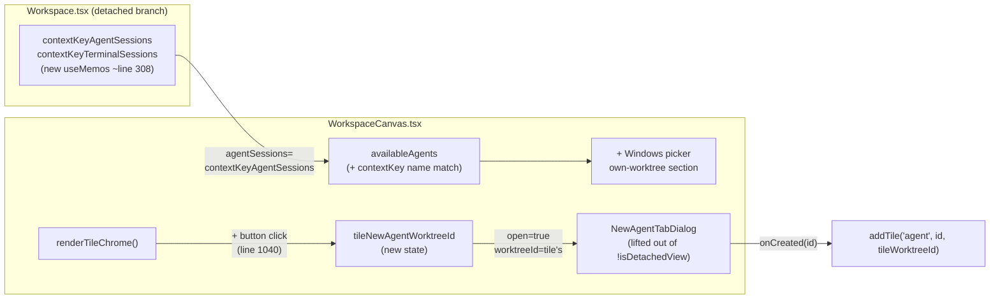

<!--
RULES — read before writing or implementing:
1. FORMAT: Bullets, tables, code, diagrams ONLY — no prose paragraphs
2. REQUIREMENTS: One crisp line each — no verbose descriptions
3. CHECKLIST: Mark items [x] as you complete them — this is your persistent todo list
4. READING TIME: Optimize for fast human scanning — if it's hard to skim, rewrite it
-->

# Plan: Workspace Windows Button — contextKey sessions + fragment search + canvas new-agent button

> Fix the `+ Windows` picker missing sessions for the contextKey worktree in saved workspaces; ensure fragment-of-worktree-name search shows all windows; add a per-tile "New agent" button in canvas mode.

**Issue:** vs-127
**Branch:** `workspace-windows-button`
**Status:** Implemented

**Reference files:**
- Route / props assembly: `web-ui/src/routes/Workspace.tsx`
- Canvas + picker: `web-ui/src/components/layout/WorkspaceCanvas.tsx`
- Dialog: `web-ui/src/components/dialogs/NewAgentTabDialog.tsx`
- Button CSS: `web-ui/src/styles/workspace-canvas.css`

---

## Problem & Concept

- Saved workspace "console home current" has "sounds" (ch-79) as its `contextKey` worktree (the worktree active when the workspace was saved)
- `Workspace.tsx:472-473` always passes `agentSessions={[]}` and `terminalSessions={[]}` for the detached canvas — own-worktree picker section is always empty for detached view
- `WorkspaceCanvas.tsx:510` also excludes the contextKey worktree from cross-context via `w.id !== worktreeId` — both picker paths are blind to it
- Additionally, when search is active, `availableAgents`/`availableTerminals` only match session labels — typing the contextKey worktree's name doesn't surface its sessions

## Out of Scope

- Changing how `contextKey` is chosen when a workspace is saved
- Done/exited worktree visibility in the picker
- Archived session cleanup in the sessions filter

## Requirements

| # | Requirement |
|---|-------------|
| 1 | The contextKey worktree's sessions appear in the `+ Windows` picker for a saved/detached workspace |
| 2 | Typing a fragment of the contextKey worktree's name shows all its sessions in the picker |
| 3 | A `+` button appears on every agent canvas tile, to the left of the close button |
| 4 | Clicking the `+` opens `NewAgentTabDialog` pre-seeded to that tile's worktree |
| 5 | The created agent is added as a new tile to the current canvas |
| 6 | The `+` button works in both detached saved-workspace view and per-worktree canvas |

---

## Change Map

```
web-ui/src/routes/
  Workspace.tsx               ~ contextKey sessions passed to detached canvas (useMemo near line 308)
web-ui/src/components/layout/
  WorkspaceCanvas.tsx         ~ picker: contextKey name match for own-worktree search
                              ~ tile chrome: add + button; dialog: lift out of isDetachedView guard
web-ui/src/styles/
  workspace-canvas.css        ~ append tile-newagent to existing button selector lists
```

| Today | After this plan |
|-------|-----------------|
| Detached canvas receives `agentSessions=[]`, `terminalSessions=[]` | Detached canvas receives real sessions for the contextKey worktree |
| contextKey worktree's sessions invisible in `+ Windows` picker | contextKey worktree's sessions appear in the picker's own-worktree section |
| Typing worktree name in search filters out sessions whose labels don't match | Typing contextKey worktree name shows all its sessions (mirrors cross-context `wtNameMatches` behavior) |
| No per-tile affordance to spawn a sibling agent | `+` icon on each agent tile opens new-agent dialog for that tile's worktree |

---

## Research

- `Workspace.tsx:301-308` — `worktreeAgentSessions` / `worktreeTerminalSessions` are `useMemo`s filtered by `worktreeId + type`; contextKey session memos must be placed alongside these (hooks can't follow conditional returns)
- `Workspace.tsx:469-483` — detached canvas block; `agentSessions={[]}` line 472, `terminalSessions={[]}` line 473 — **root cause of issue 1**
- `WorkspaceCanvas.tsx:455-461` — `matchesSearch` at 456; `availableAgents`/`availableTerminals` at 460-461 filter only `sessionLabel(s)` — no worktree-name match — **root cause of issue 2**
- `WorkspaceCanvas.tsx:510` — `w.id !== worktreeId` excludes contextKey worktree from cross-context; `otherContextGroups` uses `wtNameMatches = matchesSearch(wtLabel)` at line 514 to surface all sessions when worktree name matches — the pattern to replicate in the own-worktree section
- `WorkspaceCanvas.tsx:603` — `addTile(kind: TileKind, sessionId?: string, tileWorktreeId?: string)` — third arg already wired to `insertTileIntoCanvas`
- `WorkspaceCanvas.tsx:919` — `session` is already in scope inside `renderTileChrome` via `sessionById.get(tile.sessionId)` — no need for `allSessions.find()`
- `WorkspaceCanvas.tsx:1022-1039` — tile `...` menu button (guard: `tile.kind === "agent" && session`); insertion point for new `+` button is **line 1040** (before the 6-line comment block that precedes the close `<button>`)
- `WorkspaceCanvas.tsx:1253` — picker's "New agent" item is itself guarded by `!isDetachedView`; `newAgentOpen` can never be `true` in detached view — moving dialog outside the guard is safe
- `WorkspaceCanvas.tsx:1481-1489` — `NewAgentTabDialog` inside `{!isDetachedView ? ...}` today
- `workspace-canvas.css:518-534` — `.workspace-canvas__tile-close` and `.workspace-canvas__tile-menu-trigger` share two existing rule blocks; append `.workspace-canvas__tile-newagent` to both selector lists rather than authoring a new block
- **Pane mounting:** `detachedWorkspacePaneKeys` (Workspace.tsx:447-465) re-derives from `viewedWorkspace.tiles + live sessions`; per-worktree canvas includes foreign tiles (comment at 313-318) — no pane-host change needed for the new session tile

---

## Architecture Diagram



---

## Design Details

### Critical User Journeys

#### CUJ 1 — User finds contextKey worktree sessions in the picker

```
User opens saved workspace "console home current" (contextKey = ch-79 / "sounds")
  → Clicks "+ Windows"
  → Own-worktree section shows sounds' agent and terminal sessions
  → User clicks a session → tile added to canvas
```

- **No sessions:** if sounds has no sessions the own-worktree section is empty — not a regression (same as per-worktree canvas today)

#### CUJ 2 — Fragment search on contextKey worktree name

```
User opens "+ Windows"
  → Types "sou" in search field
  → contextKey worktree label "sounds" matches → ALL its agent + terminal sessions shown
  → Other sessions whose labels don't match "sou" but whose worktree name does are still shown
```

#### CUJ 3 — Spawn sibling agent from a canvas tile

```
User in saved workspace, "sounds" tile visible in canvas
  → Sees "+" button on tile header, left of the "X" close button
  → Clicks "+"
  → NewAgentTabDialog opens with sounds' worktreeId pre-set
  → Chooses mode + prompt, submits
  → New agent session created in sounds' worktree; new tile appears; dialog closes
```

- **Error path:** `api.createSession` fails → dialog shows error, tile NOT added

### Key Decisions

#### Decision 1: Place contextKey session `useMemo`s alongside `worktreeAgentSessions` in `Workspace.tsx`

- **Decision:** Add two `useMemo`s after line 308, deps `[sessions, viewedWorkspace]`; compute sessions filtered by `s.worktreeId === viewedWorkspace?.contextKey`; pass to detached canvas
- **Rationale:** Hooks must not follow conditional returns; `worktreeAgentSessions` at lines 301-308 is the established pattern; inline consts at line 469 would violate React's rules of hooks if placed after any early return — see Research § `Workspace.tsx:301-308`
- **Where:** `web-ui/src/routes/Workspace.tsx:308` (insert after), `472-473` (replace `[]`)

```tsx
// After line 308 — same pattern as worktreeAgentSessions
const contextKeyAgentSessions = useMemo(
  () => sessions.filter((s) => s.worktreeId === viewedWorkspace?.contextKey && s.type === "agent"),
  [sessions, viewedWorkspace],
);
const contextKeyTerminalSessions = useMemo(
  () => sessions.filter((s) => s.worktreeId === viewedWorkspace?.contextKey && s.type === "terminal"),
  [sessions, viewedWorkspace],
);
// Then at line 472: agentSessions={contextKeyAgentSessions}
// At line 473: terminalSessions={contextKeyTerminalSessions}
```

#### Decision 2: Mirror `wtNameMatches` in `availableAgents`/`availableTerminals`

- **Decision:** Look up the contextKey worktree's label from the `worktrees` prop; if the query matches the label, pass all `agentSessions`/`terminalSessions` instead of filtering by session label
- **Rationale:** `otherContextGroups` does this at line 514 (`wtNameMatches`); the own-worktree section must match the same behavior — see Research § `WorkspaceCanvas.tsx:455-461`
- **Where:** `web-ui/src/components/layout/WorkspaceCanvas.tsx:460-461`

```tsx
// Replace lines 460-461
const contextKeyWorktree = worktrees.find((w) => w.id === worktreeId);
const contextKeyLabel = contextKeyWorktree ? (contextKeyWorktree.name || contextKeyWorktree.branch) : "";
const contextKeyNameMatches = matchesSearch(contextKeyLabel);
const availableAgents = agentSessions.filter((s) => contextKeyNameMatches || matchesSearch(sessionLabel(s)));
const availableTerminals = terminalSessions.filter((s) => contextKeyNameMatches || matchesSearch(sessionLabel(s)));
```

#### Decision 3: Single `NewAgentTabDialog` controlled by `tileNewAgentWorktreeId` state

- **Decision:** Lift dialog outside `!isDetachedView`; add `tileNewAgentWorktreeId: string | null` state; pass `tileNewAgentWorktreeId ?? worktreeId` as `worktreeId`; `open = newAgentOpen || tileNewAgentWorktreeId != null`
- **Rationale:** One dialog instance swapping `worktreeId` (same pattern as `tileMenu` portal); safe because `newAgentOpen` can never be `true` in detached view (picker's "New agent" item is itself behind `!isDetachedView` guard at line 1253) — see Research § `WorkspaceCanvas.tsx:1253`
- **Where:** `WorkspaceCanvas.tsx:1481-1489`

#### Decision 4: Use in-scope `session` in tile chrome; insert `+` at line 1040

- **Decision:** `session` is already bound via `sessionById.get(tile.sessionId)` at line 919 — use `session?.worktreeId ?? worktreeId` directly; insert button at line 1040 (before the comment block, after the `}` closing the `...` menu at line 1039)
- **Rationale:** `allSessions.find()` is redundant and slower; line 1040 is the correct gap — lines 1040-1045 are a comment belonging to the close button, not a separate element — see Research § `WorkspaceCanvas.tsx:919` and `1022-1039`
- **Where:** `WorkspaceCanvas.tsx:1040` (insertion)

#### Decision 5: Append `.workspace-canvas__tile-newagent` to existing CSS selector lists

- **Decision:** Add selector to the two existing blocks at `workspace-canvas.css:518-519` and `532-534` rather than authoring a new rule block
- **Rationale:** `.tile-close` and `.tile-menu-trigger` already share these blocks; adding a third selector is the minimal consistent change — see Research § `workspace-canvas.css:518-534`
- **Where:** `web-ui/src/styles/workspace-canvas.css:518`, `532`

---

## Risks / Open Questions

| # | Question | Notes |
|---|----------|-------|
| 1 | **contextKey worktree deleted?** | `sessions.filter(...)` returns `[]` safely; `worktrees.find(...)` returns undefined → `contextKeyLabel = ""` → `matchesSearch("")` only true when query is empty (always shows) — no crash |
| 2 | **Draft key in dialog uses `worktreeId` — switching tiles clears draft?** | Acceptable; per-worktree draft by design (`draftKey = vst-newtab-draft-${worktreeId}`) |

---

## Implementation Phases

### Phase 1 — Fix contextKey sessions missing from detached canvas picker

- [x] **1.1** In `Workspace.tsx` after line 308 (after `worktreeTerminalSessions` useMemo), add:
  ```ts
  const contextKeyAgentSessions = useMemo(
    () => sessions.filter((s) => s.worktreeId === viewedWorkspace?.contextKey && s.type === "agent"),
    [sessions, viewedWorkspace],
  );
  const contextKeyTerminalSessions = useMemo(
    () => sessions.filter((s) => s.worktreeId === viewedWorkspace?.contextKey && s.type === "terminal"),
    [sessions, viewedWorkspace],
  );
  ```
- [x] **1.2** In `Workspace.tsx:472`, replace `agentSessions={[]}` with `agentSessions={contextKeyAgentSessions}`
- [x] **1.3** In `Workspace.tsx:473`, replace `terminalSessions={[]}` with `terminalSessions={contextKeyTerminalSessions}`

### Phase 2 — Fix fragment search for contextKey worktree name in own-worktree picker section

- [x] **2.1** In `WorkspaceCanvas.tsx`, after the `matchesSearch` function definition (line 458), add:
  ```ts
  const contextKeyWorktree = worktrees.find((w) => w.id === worktreeId);
  const contextKeyLabel = contextKeyWorktree ? (contextKeyWorktree.name || contextKeyWorktree.branch) : "";
  const contextKeyNameMatches = matchesSearch(contextKeyLabel);
  ```
- [x] **2.2** Replace line 460 (`availableAgents`): `agentSessions.filter((s) => contextKeyNameMatches || matchesSearch(sessionLabel(s)))`
- [x] **2.3** Replace line 461 (`availableTerminals`): `terminalSessions.filter((s) => contextKeyNameMatches || matchesSearch(sessionLabel(s)))`

**Verify phases 1 + 2:**
- [x] **1.T1** Manual — open dev sandbox, navigate to a saved workspace whose contextKey worktree has sessions; confirm those sessions appear in `+ Windows` own-worktree section
- [x] **1.T2** Manual — type a fragment of the contextKey worktree's name; confirm all its sessions appear (not filtered to label matches only)
- [x] **1.T3** Regression — per-worktree canvas (scratch, no `detachedWorkspaceId`) still shows own-worktree sessions correctly
- [x] **1.T4** Regression — cross-context worktrees still appear in picker for saved workspaces
- [x] **1.T5** Regression — typing a session label still filters correctly when no worktree name matches

---

### Phase 3 — Per-tile "New agent" button

- [x] **3.1** Add `const [tileNewAgentWorktreeId, setTileNewAgentWorktreeId] = useState<string | null>(null)` to `WorkspaceCanvas`
- [x] **3.2** At `WorkspaceCanvas.tsx:1040` (immediately after the closing `}` of the `...` menu button block at line 1039), insert for `tile.kind === "agent" && session` tiles:
  ```tsx
  {tile.kind === "agent" && session ? (
    <button
      type="button"
      className="workspace-canvas__tile-newagent"
      title="New agent in same worktree"
      onPointerDown={(e) => e.stopPropagation()}
      onClick={(e) => {
        e.stopPropagation();
        setTileNewAgentWorktreeId(session.worktreeId ?? worktreeId);
      }}
    >
      <Plus size={13} />
    </button>
  ) : null}
  ```
- [x] **3.3** Move `NewAgentTabDialog` outside the `!isDetachedView` guard (currently line 1481); render it unconditionally
- [x] **3.4** Change `open` prop to `newAgentOpen || tileNewAgentWorktreeId != null`
- [x] **3.5** Change `worktreeId` prop to `tileNewAgentWorktreeId ?? worktreeId`
- [x] **3.6** Update `onClose` to `() => { setNewAgentOpen(false); setTileNewAgentWorktreeId(null); }`
- [x] **3.7** Update `onCreated` to `(sessionId) => { addTile("agent", sessionId, tileNewAgentWorktreeId ?? undefined); setTileNewAgentWorktreeId(null); }`
- [x] **3.8** In `workspace-canvas.css:518`, change selector block opening from `.workspace-canvas__tile-close,\n.workspace-canvas__tile-menu-trigger {` to add `.workspace-canvas__tile-newagent` as a third selector
- [x] **3.9** In `workspace-canvas.css:532-534`, add `.workspace-canvas__tile-newagent:hover` to the hover/expanded rule block

**Verify phase 3:**
- [x] **3.T1** Manual — in own-worktree canvas, `+` button appears on agent tiles to the left of `X`; absent on terminal and tools tiles
- [x] **3.T2** Manual — click `+` on own-worktree tile; dialog opens; create agent; new tile appears in canvas
- [x] **3.T3** Manual — in saved workspace, click `+` on a cross-worktree tile; new agent created in THAT worktree
- [x] **3.T4** Regression — `X` (close) still removes tile; fullscreen toggle still works; `...` menu still opens agent actions

---

## Files & Phase Impact

| File | Status | Phase | Description / Contract Change |
|------|--------|-------|-------------------------------|
| `web-ui/src/routes/Workspace.tsx` | **Modified** | 1.1–1.3 | Two new `useMemo`s after line 308 for contextKey agent/terminal sessions; replace `agentSessions={[]}` and `terminalSessions={[]}` at 472-473 |
| `web-ui/src/components/layout/WorkspaceCanvas.tsx` | **Modified** | 2.1–2.3, 3.1–3.7 | Phase 2: `contextKeyWorktree` lookup + `contextKeyNameMatches` added to `availableAgents`/`availableTerminals` filter. Phase 3: `tileNewAgentWorktreeId` state; `+` button in tile chrome at line 1040; `NewAgentTabDialog` lifted out of `!isDetachedView`; `open`, `worktreeId`, `onClose`, `onCreated` updated |
| `web-ui/src/styles/workspace-canvas.css` | **Modified** | 3.8–3.9 | `.workspace-canvas__tile-newagent` appended to existing selector lists at lines 518 and 532 |
