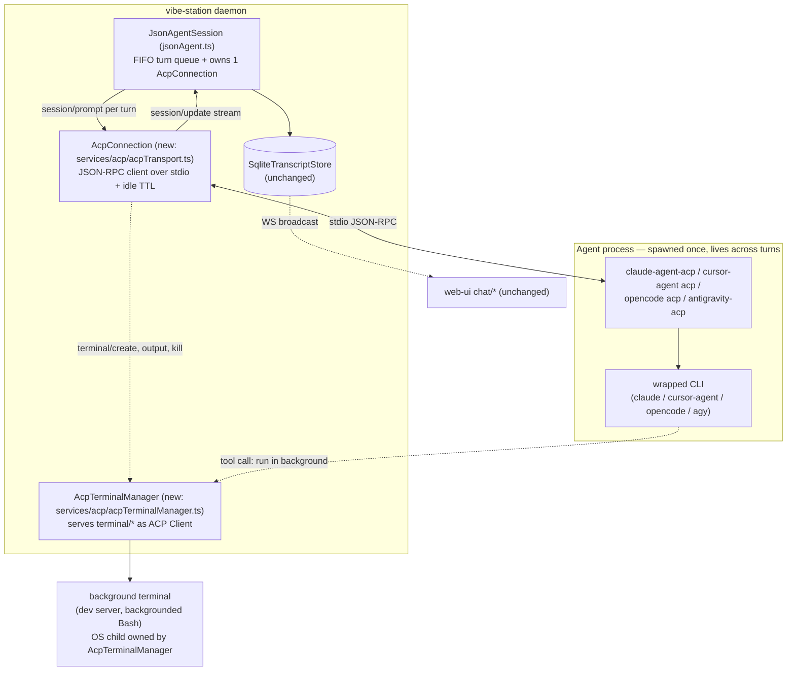
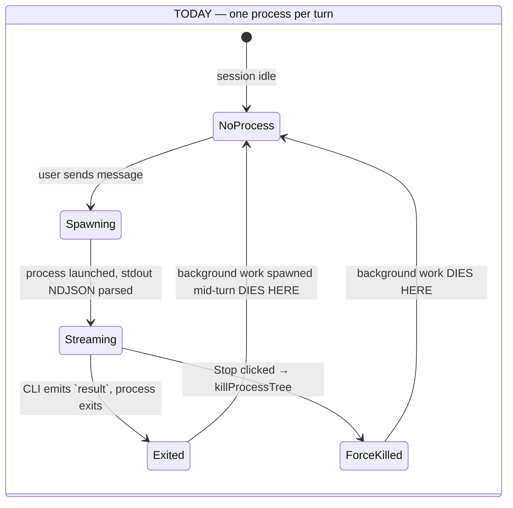
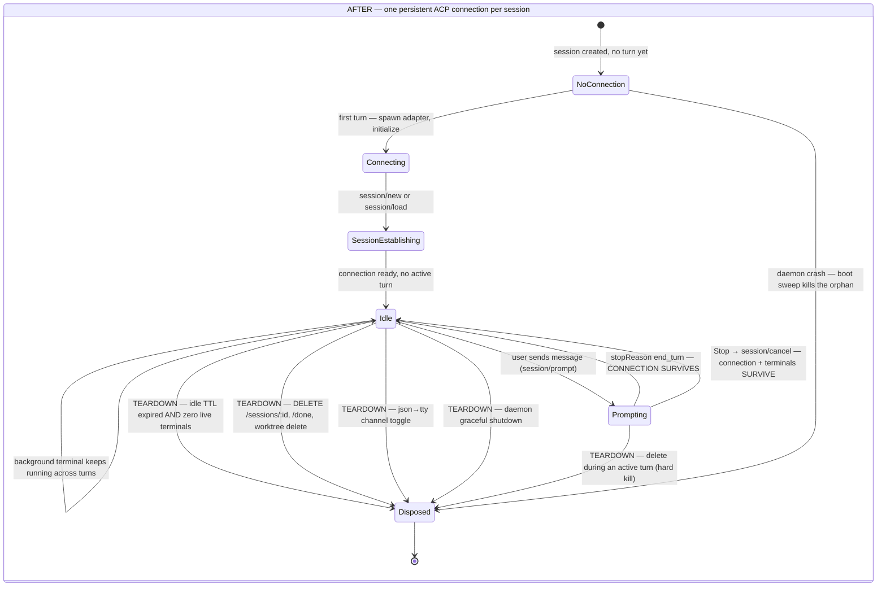

<!--
RULES — read before writing or implementing:
1. FORMAT: Bullets, tables, code, diagrams ONLY — no prose paragraphs
2. REQUIREMENTS: One crisp line each — no verbose descriptions
3. CHECKLIST: Mark items [x] as you complete them — this is your persistent todo list
4. READING TIME: Optimize for fast human scanning — if it's hard to skim, rewrite it
-->

# Plan: ACP Migration — Core Plugins (claude, cursor, opencode, agy)

> Swap the Rich Chat (`json` channel) turn transport from per-turn one-shot CLI subprocess to a persistent Agent Client Protocol (ACP) connection, for all 4 plugins. Terminal channel (tmux/PTY) untouched.

**Issue:** acp-migration
**Branch:** `feat/acp-migration-core-plugins`
**Status:** Implemented (all 5 phases, all checkboxes complete) — pending human review before ship, particularly agy's third-party/Bun-adapter trade-off (see Phase 4 notes and `docs/JSON-CHAT-ARCHITECTURE.md`'s caveat). Not committed — left as uncommitted working-tree changes for review.
**PRD:** none — scoped directly from engineering investigation
**Parent:** none (first sub-plan of the `acp-migration` feature)

**Reference files (verified paths):**

| Role | Path |
|---|---|
| Turn engine | `daemon/src/services/jsonAgent.ts` (1221 lines) |
| Plugin contract (`AgentJsonTransport`, `TurnContext`) | `daemon/src/services/spawn.ts:30-92` |
| Plugins | `daemon/src/agent-plugins/{claude,cursor,opencode,agy}.ts` |
| Plugin registry | `daemon/src/agent-plugins/registry.ts` (32 lines, flat map) |
| Live-session map | `daemon/src/state/jsonAgentRegistry.ts` (15 lines) — **NOT** under `services/` |
| Boot recovery | `daemon/src/services/recover.ts` |
| Schema | `daemon/src/services/dbSchema.ts` |
| Manifest→sqlite boot migration | `daemon/src/services/dbMigration.ts` |
| HTTP routes (stop / toggle / delete) | `daemon/src/routes/sessions.ts` |
| Tests (all daemon tests live here) | `daemon/src/__tests__/*.test.ts` |
| Daemon dependency manifest | `cli/package.json` — `cli/src/daemon` is a **symlink** to `daemon/src`; there is **no** `daemon/package.json` |
| UI (unaffected — see UI Changes) | `web-ui/src/components/chat/*` |

---

## Problem

- Rich Chat spawns a fresh one-shot CLI subprocess per turn.
  - `claude.ts:502` `spawn("claude", args, { detached: true, … })`; mirrored at `cursor.ts:344`, `opencode.ts:308`, `agy.ts:525`.
  - Process exits when the CLI's own `result` line lands.
- Background work started mid-turn (`run_in_background` Bash, dev server) dies with that process.
- Terminal channel does not have this bug — one persistent tmux session per CLI lifetime (`spawn.ts:338-714`, `spawnSession`/`spawnDirectSession`).
- Rich Chat needs the same persistence without losing its structured event stream.

## Out of Scope

- Terminal channel mechanics — `spawn.ts` `spawnSession` (338) / `spawnDirectSession` (529), `web-ui/src/components/layout/TerminalPane.tsx`. Zero behavioral change.
- The `json↔tty` channel-toggle **feature** itself (idle gate, `getRestoreCommand`, `captureChatId`, native-history import) — its mechanics are unchanged. **In scope, and newly so:** keeping the *value* those mechanics read (`agentChatId`) correct under ACP (Decision 6), plus the ACP-teardown side effect (Decision 9).
- User/session data migration, dual-write, feature flags, gradual rollout.
  - Justification: no production users of json-chat exist today.
- Fork-a-sent-message — stays on the legacy one-shot spawn path (Decision 8).
- A "N background processes running" UI badge — follow-up, not this plan.
- New user-facing settings for idle-TTL or reconnect — fixed constants only (Decisions 4, 5).

## Concept

- One ACP agent process per session, spawned once, alive across turns.
- Each turn = one `session/prompt` over that same connection.
- Background work becomes a **host-managed ACP terminal** (`terminal/*`) owned by the daemon, not by any single turn.
- Only user-visible change: background work started in one turn is still running in later turns.

---

## Requirements

| # | Requirement |
|---|---|
| 1 | Background work survives past its turn's `result` event, for every plugin whose ACP adapter supports host-managed terminals |
| 2 | Explicit teardown (`DELETE /sessions/:id`, `POST /sessions/:id/done`, worktree delete) hard-kills the agent process and all its background terminals |
| 3 | Boot after an unclean restart sweeps orphaned ACP processes via the existing pidfile mechanism (`recover.ts:61-95`) — no reconnect, no silent respawn |
| 4 | `/chat/stop` cancels only the in-flight turn (ACP `session/cancel`) and must not kill the connection or any live terminal |
| 4b | **Force-send** (`POST …/chat/queue/:turnId/promote`, "Send now") preempts through the SAME `session/cancel` path as Stop — never `killProcessTree` — so live background terminals and the connection survive it too |
| 5 | `NormalizedEvent` kinds/shapes emitted to the UI are unchanged — web-ui requires zero changes |
| 6 | `sessions.agentChatId` keeps meaning "the id the RAW CLI's own resume flag understands"; whether the ACP session id can share that slot is a **per-plugin, spike-gated** decision (Decision 6, Option A/B) |
| 7 | cursor + opencode use native ACP modes; claude uses the Zed-maintained adapter over the user's own binary; agy is gated behind an auth spike (Phase 4.1) |
| 8 | No feature flags, no gradual rollout, no backward-compat shim |

---

## Research

### Per-turn spawn today (the code being replaced)

| Plugin | `runTurn` lines | Command today |
|---|---|---|
| claude | `claude.ts:475-561` | `claude -p --output-format stream-json --verbose --dangerously-skip-permissions [--model][--resume <chatId>]` |
| cursor | `cursor.ts:327-392` | `cursor-agent -p <msg> --output-format stream-json -f [--resume <id>]` |
| opencode | `opencode.ts:283-358` | `opencode run <msg> --format json [-m model][--session <id>]`; system prompt via `OPENCODE_CONFIG` env (`opencode.ts:239,312`) |
| agy | `agy.ts:503-578` | `agy --print=<msg> --output-format stream-json --dangerously-skip-permissions [--model][--conversation <id>]` |

- Each plugin independently re-spawns, re-parses NDJSON, and re-implements `onAbort`/exit-code/stderr plumbing.

### Turn engine — what stays, what changes

- `spawn.ts:30-48` — `AgentJsonTransport` doc comment states the current contract: "the async-iterator completing == the turn is done."
  - This plan keeps the iterator shape and swaps only the completion signal (Decision 2).
- `spawn.ts:67-92` — `TurnContext` (`cwd`, `project`, `worktree`, `session`, `chatId?`, `forkFromChatId?`, `model?`, `systemPromptFile`, `daemonPort`, `onSpawn?`).
  - Gains one field for ACP (Decision 2).
- `jsonAgent.ts:753-786` (`drain`) — FIFO queue, sequential runner; unchanged.
- `jsonAgent.ts:802-899` (`runOneTurn`) — builds ctx → iterates `plugin.runTurn` → persists via `handleEvent` (945-970); shape reused.
- `jsonAgent.ts:127` `collectDescendants`, `jsonAgent.ts:175` `killProcessTree` — today's hard-kill machinery.
- `jsonAgent.ts:921` `killLivePids()` is called from exactly two places:
  - `abortAndDrain()` (410-420) — teardown; only caller is `release()` (456).
  - `stopActiveTurn()` (470-478) — the Stop button.
- `jsonAgent.ts:911` `recordTurnPid` — mirrors each spawned PID into `<dataDir>/turn.pids`, fed by `ctx.onSpawn`.
- `daemon/src/state/jsonAgentRegistry.ts` — `Map<sessionId, JsonAgentSession>`, lazily populated by `getOrCreateJsonAgentSession` (`jsonAgent.ts:1092-1098`).
  - Natural home for a 1:1 `sessionId → AcpConnection` mapping (Decision 1) — no new registry needed.

### Boot recovery / orphan safety

- `recover.ts:61-95` `sweepOrphanTurnPids` — reads each json session's `<dataDir>/turn.pids`, `process.kill(-pid, "SIGKILL")`, unlinks the file.
- `recover.ts:38-52` `verifyPidIsTurnProcess` — reads `/proc/<pid>/stat` comm name; guards against PID reuse after a machine reboot; returns `true` (proceed) when inconclusive.
- `recover.ts:22` `KNOWN_TURN_BINARIES = new Set(["claude","cursor-agent","opencode","agy"])`.
  - Must gain the ACP adapter process comm names, or a genuinely orphaned connection is never killed.
- `recover.ts:~104-114` `recoverJsonSession` — a `working` session reconciles to `idle` on boot; outcome unchanged by this plan.

### DB / schema

- `dbSchema.ts:53-77` — `sessions` table; `agentChatId TEXT` at line 71 (nullable).
- `dbSchema.ts:154-158` `addColumnIfMissing(db, table, column, ddl)` — **this** is the established additive-migration pattern: `PRAGMA table_info` check, then `ALTER TABLE … ADD COLUMN`, called unconditionally from `ensureSchema`.
  - Existing users of it: `prState`, `prNumber`, `prUrl`, `prCheckedAt`, `prBranch` (`dbSchema.ts:142-151`).
- `dbMigration.ts` is a different thing — the one-shot per-project `manifest.json → sqlite` boot migration, gated by the `manifest_migrations` table.
  - Not the additive-column pattern; not touched by this plan.
- **Schema impact is conditional, not zero** (Decision 6): Option A adds no column; Option B adds one nullable `sessions.acpSessionId TEXT` via `addColumnIfMissing`. Decided per plugin after the Phase 1.8 spike. `dbMigration.ts` is untouched either way.
- `agentChatId` has THREE consumers, all of which need the CLI's OWN native id — this is why the id-space question is a correctness gap, not cosmetics:
  1. `getRestoreCommand` resume argv — `claude.ts:575`, `cursor.ts:493`, `opencode.ts:501`, `agy.ts:587`.
  2. Terminal **launch** argv (not only restore) — `cursor.ts:254,292` (`--resume`), `agy.ts:394,442` (`--conversation`).
  3. **Native-history import** on tty→json backfill — `claudeImport.ts:209` builds `~/.claude/projects/<slug>/<agentChatId>.jsonl`; `opencodeImport.ts:68` runs `WHERE session_id = <agentChatId>` on `~/.local/share/opencode/opencode.db`. A non-native id here imports zero turns, silently.
- Existing per-plugin native-id side channels (reused verbatim by Decision 6 Option B — no new discovery code):

| Plugin | Side channel | Source |
|---|---|---|
| claude | `findLatestChatUuid(cwd)` — newest `~/.claude/projects/<slug>/*.jsonl` by mtime | `agent-plugins/claudeRestore.ts:24` |
| cursor | `findLatestCursorChatId(cwd)` — newest dir under `~/.cursor/projects/<slug>/agent-transcripts/` | `agent-plugins/cursorRestore.ts:33` |
| opencode | `.opencode/plugins/vst-recorder.ts` `session.created` → writes native `sessionID` to `<cwd>/.vibe-station/agent-chat-ids/$VST_SPAWN_TOKEN` | `opencode.ts:355-380`, read by `captureChatId` |
| agy | `readLatestAgyConversationId(cwd)` → `last_conversations.json[cwd]` — self-documented as UNRELIABLE (cwd-keyed, no session identity); **superseded 2026-08-30** as the primary channel by `readAgyAcpSessionConversationId(acpSessionId)` (see Decision 6 Spike Results table) — kept only as the last-resort fallback | `agy.ts` |

- **agy-specific regression risk (resolved 2026-08-30):** agy's only *trustworthy* capture channel WAS the per-session `--log-file` it injects into its OWN argv (`agy.ts:394-401`) — under ACP the adapter builds agy's argv, so that flag genuinely cannot be injected (confirmed by reading the `antigravity-acp` adapter's own `buildAgyArgs`). However the adapter itself turned out to expose an equally session-scoped replacement: its own `~/.agy-acp/sessions.json`, keyed by ACP session id. agy is Option B (ids diverge) but does NOT take the documented degrade.

### Web UI — evidence for "no changes needed"

- `MessageList.tsx:229-246` builds a `toolIndexById` map over the **entire** event list (not per turn).
  - `tool_use` (229-233) pushes a card and records `toolId → item index`.
  - `tool_result` (235-246) looks the id up and attaches; on a miss it pushes a standalone tool item.
  - Consequence: a `tool_result` arriving in a **later turn** still attaches to its original card — no crash, no dropped event, no new event kind.
- `ToolUseCard.tsx:6-12` — `running?: boolean` prop is documented as "true while the matching tool_result hasn't arrived yet (shows a spinner)"; the card renders fully without a result.
- `daemon/src/types.ts:74-84` — `NormalizedEventKind` is exactly `session_init | user | thinking | text | tool_use | tool_result | usage | result | error | status`; this plan introduces no new kind.
- Known cosmetic nit (accepted, not a blocker): a late `tool_result` renders at the **original** card's feed position, not chronologically at arrival time.

### Sibling-project precedents (facts restated inline — no external reading required)

| Source | Fact this plan uses |
|---|---|
| emdash `packages/core/src/runtimes/acp/node/connection/source.ts:56-73` | Pools ACP connections by `(providerId, cwd)` with an `idleTtlMs` — rejected here, see Decision 1 |
| emdash `acp-agent-connection.ts:40-133` | Spawn → `initialize` → race against "process closed before ready" → return `{ agent, normalize, supportsLoadSession, mcpCapabilities }` |
| emdash `acp-agent-connection.ts:118-119` | `failClosedBeforeReady` race pattern — mirrored by test 1.T1 |
| emdash `acp-agent-connection.ts:94-97` | Per-provider `behavior.enrich` hook over a shared normalizer — mirrored by `normalize.ts` |
| agent-orchestrator `chatdriver/claudeacp/driver.go:33-98` | Resolve the user's own `claude` binary, set `CLAUDE_CODE_EXECUTABLE=<path>` on the adapter process; `session/new` once, `session/prompt` for every later turn on the same connection |
| agent-orchestrator `acp/process.go`, `acp/conversation.go` | "`session/load` if supported, otherwise a fresh session — never a silent respawn" |
| agent-orchestrator `chatdriver/registry/registry.go` | Flat harness→driver map — matches `registry.ts`, which stays a flat map |

### External ACP facts (as researched Aug 2026)

| CLI | ACP support | Detail |
|---|---|---|
| Claude Code | Adapter-mediated | `@agentclientprotocol/claude-agent-acp` (previously `@zed-industries/claude-code-acp`); wraps `@anthropic-ai/claude-agent-sdk`; `CLAUDE_CODE_EXECUTABLE` selects the binary |
| Cursor | Native, first-party | `cursor-agent acp` (`cursor.com/docs/cli/acp`), JSON-RPC 2.0 over stdio |
| OpenCode | Native | `opencode acp` (`opencode.ai/docs/acp/`); all features except `/undo`, `/redo` |
| Antigravity (agy) | Adapter via Zed registry | `zed.dev/acp/agent/antigravity-acp`; auth via Google Account / Antigravity plan / Gemini Enterprise |
| Antigravity SSH auth bug | Open | ACP auth hangs over SSH even when the CLI is already authenticated on the same remote host; vibe-station's daemon is headless by design |

- > **Decision made unattended — needs human confirmation:** npm package names above are from a research pass, not from an install. Phase 1.7 must run `npm view <name> version` for both packages before pinning, and substitute the current published names if they have moved again.

## Root Cause

- Structural: a process that exits at `result` cannot own live children past that point.
- Compounding 1: the CLI itself may reap its own background shells at final response (CLI-internal).
- Compounding 2: `killProcessTree` (`jsonAgent.ts:175`) SIGKILLs the whole descendant tree on Stop and on teardown.
  - Harmless today (the process was dying anyway); becomes an active cause once a connection persists — hence Decisions 3 and 4.

---

## Architecture Diagram



- `JsonAgentSession ↔ AcpConnection` — in-process Module ↔ Module boundary.
- `AcpConnection ↔ Agent process` — JSON-RPC-over-stdio, Module ↔ Platform/SDK boundary.

## Process Lifecycle — Today vs After





| | Today | After |
|---|---|---|
| Processes per session | 1 per turn | 1 total |
| Turn-done signal | CLI process exit | `session/prompt` response resolves |
| Stop button | `killProcessTree` (SIGKILL group) | `session/cancel` notification |
| Background work at turn end | dies | survives |
| Background work at Stop | dies | survives |
| Teardown triggers | none needed | delete · done · worktree delete · json→tty toggle · idle TTL (only with zero live terminals) · daemon shutdown · boot sweep |

---

## Design Details

### System Boundaries

| Boundary | Fields + types | Errors | Source of truth |
|---|---|---|---|
| `JsonAgentSession` ↔ `AcpConnection` (in-process) | `sendPrompt(prompt: PromptBlock[], signal: AbortSignal): { updates: AsyncIterable<SessionUpdate>, result: Promise<{ stopReason: StopReason }> }` · `cancelActivePrompt(): void` · `hasLiveTerminals(): boolean` · `dispose(): Promise<void>` | `ConnectionSpawnFailed`, `InitializeFailed`, `SessionLoadFailed` — each maps to a synthetic `error` NormalizedEvent, exactly as today's non-zero-exit handling does | `AcpConnection` owns process liveness; `JsonAgentSession` owns turn-queue state |
| `AcpConnection` ↔ Agent process (ACP JSON-RPC over stdio) | See API Contracts below | Process exit or stderr before ready → `ConnectionSpawnFailed`; capability mismatch → `InitializeFailed` | The wrapped CLI's own auth + session store; ACP carries no auth of its own |
| `AcpTerminalManager` ↔ OS processes | `terminal/create{ command, args, cwd, env, outputByteLimit? } → { terminalId }`; daemon holds `terminalId → ChildProcess` | Spawn failure → JSON-RPC error response, surfaced as a failed tool call | The daemon owns the OS child handles |
| `JsonAgentSession` ↔ `SqliteTranscriptStore` | Existing, unchanged — no restatement |

### API Contracts

```
ACP JSON-RPC 2.0 over stdio — one long-lived pipe pair per session.

initialize                              (client → agent, request)
  params:  { protocolVersion: number,
             clientCapabilities: { fs: { readTextFile: bool, writeTextFile: bool },
                                   terminal: bool } }
  result:  { protocolVersion, agentCapabilities: { loadSession?: bool,
                                                   promptCapabilities?: {...},
                                                   mcpCapabilities?: {...} },
             authMethods?: [...] }

session/new                             (client → agent, request)
  params:  { cwd: string (absolute), mcpServers: [] }   ← array required, may be empty
  result:  { sessionId: string }

session/load                            (client → agent, request)
  precondition: agentCapabilities.loadSession === true
  params:  { sessionId: string, cwd: string, mcpServers: [] }
  result:  {}  |  JSON-RPC error → SessionLoadFailed → fall back to session/new (Decision 5)

session/prompt                          (client → agent, request)
  params:  { sessionId: string,
             prompt: [ { type: "text", text: string }
                     | { type: "resource_link", uri: "file:///abs/path", name: string } ] }
  result:  { stopReason: "end_turn" | "cancelled" | "refusal"
                       | "max_tokens" | "max_turn_requests" }
  ── this result resolving IS the turn-done signal (replaces process exit, Decision 2)

session/update                          (agent → client, NOTIFICATION, streamed)
  params:  { sessionId, update: { sessionUpdate: "agent_message_chunk"
                                                | "agent_thought_chunk"
                                                | "user_message_chunk"
                                                | "tool_call" | "tool_call_update" | "plan", … } }
  ── mapped 1:1 into the EXISTING NormalizedEventKind set (Decision 2)

session/cancel                          (client → agent, NOTIFICATION — no response)
  params:  { sessionId: string }
  ── the in-flight session/prompt then resolves with stopReason: "cancelled"

fs/read_text_file, fs/write_text_file   (agent → client, request)
  ── daemon serves from the session's own cwd; same filesystem reach the CLI already had

terminal/create        params { sessionId, command, args, cwd, env, outputByteLimit? } → { terminalId }
terminal/output        params { sessionId, terminalId } → { output: string, truncated: bool, exitStatus?: {...} }
terminal/wait_for_exit params { sessionId, terminalId } → { exitStatus: { exitCode?, signal? } }
terminal/kill          params { sessionId, terminalId } → {}
terminal/release       params { sessionId, terminalId } → {}
  Errors on all fs/* and terminal/*: standard JSON-RPC error object; the daemon
  surfaces it as a failed tool_result — no new error primitive.
```

- Daemon-facing contracts are unchanged: `POST /chat`, `POST /sessions/:id/chat/stop`, WS `chat:message`/`chat:meta`, `NormalizedEvent` shape (Requirement 5).

### Critical User Journeys

#### CUJ 1 — background dev server survives past the turn (happy path)

```
User sends "start the dev server in the background"
  → jsonAgent.ts:802 runOneTurn calls plugin.runTurn on the SAME connection as prior turns
  → agent's Bash tool issues a backgrounded command
  → adapter routes it through terminal/create
  → AcpTerminalManager spawns + tracks the OS process, returns terminalId
  → turn's `result` event lands; drain() moves the session to idle
  → AcpConnection stays alive — idle TTL is pinned open by the live terminal (Decision 4)
  → later turn: "is the server still running?"
  → agent calls terminal/output on the same terminalId → still running → reports back
```

- Edge case — adapter does not support the `terminal` capability:
  - The CLI spawns the background command as its own child instead.
  - That child is owned by the CLI process, which now survives turn end.
  - Net: background work still survives; it is just not independently inspectable.
  - `terminal` capability buys inspectability, not survival.

#### CUJ 2 — daemon crashes mid-turn, restarts uncleanly (error path)

```
Daemon crashes while a turn is streaming
  → on restart, sweepOrphanTurnPids (recover.ts:61) reads the session's turn.pids
  → verifyPidIsTurnProcess (recover.ts:38) confirms a known ACP adapter comm name
  → process.kill(-pid, "SIGKILL") on the group; pidfile unlinked
  → recoverJsonSession reconciles `working` → `idle` (unchanged outcome)
  → next user message lazily creates a FRESH AcpConnection
  → if initialize advertised loadSession → session/load(agentChatId)
  → else, or on failure → session/new + a `status` event flagging the fallback
```

- Error path — `session/load` unsupported or failing:
  - No silent respawn; the plugin throws typed `SessionLoadFailed`.
  - `JsonAgentSession` starts a fresh ACP session.
  - Emits `status`: "resumed with a fresh agent session — prior context may not be visible to the CLI".
  - The user's transcript is unaffected — SQLite persistence is untouched by any of this.

### Data Model

| Entity | Field | Type | Constraints | Option | Notes |
|---|---|---|---|---|---|
| `sessions` | `agentChatId` | `TEXT` | nullable, **existing** | A + B | Always means "the id the RAW CLI's own resume flag / native store understands". Option A: the ACP `sessionId` IS that value. Option B: written by `captureNativeChatId()`, may stay NULL |
| `sessions` | `acpSessionId` | `TEXT` | nullable, **NEW — Option B only** | B | The ACP `session/new` id, used solely for `session/load` (Decision 5). Added via `addColumnIfMissing(db, "sessions", "acpSessionId", "TEXT")`, same pattern as `prState`/`prNumber`/`prBranch` (`dbSchema.ts:142-151`) |

- Relationships: none new. Indexes: none new.
- **Migration: conditional (Decision 6)** — N under Option A; additive-only, backward-compatible `ALTER TABLE … ADD COLUMN` under Option B. The column is added **once**, for all plugins, as soon as *any* plugin lands on Option B; plugins on Option A simply leave it NULL.
- Option B touch points (exhaustive — all additive):
  - `daemon/src/services/dbSchema.ts` — one `addColumnIfMissing` line + comment.
  - `daemon/src/types.ts:170,238` — `acpSessionId?: string` on the session types.
  - `daemon/src/state/sqliteRowMappers.ts:36,95,141` — `SessionRow` field + `rowToSession` + `sessionToRow`.
  - `daemon/src/state/project-store.ts:261-262` — the explicit INSERT column/values lists.
  - `daemon/src/services/jsonAgent.ts:1031` — a `persistAcpSessionId()` twin of `persistChatId()`.
  - **Not** `web-ui/*` — the UI never reads it, so "UI Changes: none" still holds.

### Key Decisions

#### Decision 1: One `AcpConnection` per `sessionId`, no `(providerId, cwd)` pool
- **Decision:** each `JsonAgentSession` owns exactly one `AcpConnection`, created lazily on first turn, disposed on teardown.
- **Rationale:** a vibe-station `sessionId` is already 1:1 with a stable `cwd`, so a `cwd`-keyed pool would collapse to the same mapping while adding a second place lifecycle can go wrong.
- **Where:** `daemon/src/services/jsonAgent.ts` — `JsonAgentSession` gains a private `connection?: AcpConnection` and a `getOrCreateConnection()` called from `runOneTurn` (802-899); registration itself stays in `daemon/src/state/jsonAgentRegistry.ts`, unchanged.

#### Decision 2: `session/prompt` resolving replaces "process exit" as the turn-done signal
- **Decision:** `runTurn` keeps its exact signature `(input, ctx, signal) => AsyncIterable<NormalizedEvent>`; internally it yields off `session/update` notifications and returns when the matching `session/prompt` resolves.
- **Rationale:** preserves the iterator contract that `runOneTurn`, the queue, abort handling, and `firstTurnDone` bookkeeping all depend on — a small diff instead of a rewrite.
- **Where:** `daemon/src/agent-plugins/{claude,cursor,opencode,agy}.ts` (`runTurn` bodies); `daemon/src/services/spawn.ts:67-92` (`TurnContext` gains `getAcpConnection?(): Promise<AcpConnection>`).

```typescript
// daemon/src/agent-plugins/claude.ts — replaces lines 475-561.
// Demonstrates the completion-signal swap: yield from a live stream, but end
// the generator on the session/prompt RESULT, not on a process exit.
async *runTurn(input: TurnInput, ctx: TurnContext, signal: AbortSignal): AsyncIterable<NormalizedEvent> {
  const conn = await ctx.getAcpConnection!();          // Decision 1's per-session connection
  const prompt = conn.sendPrompt(toAcpPrompt(input), signal);
  for await (const raw of prompt.updates) {
    const ev = normalizeSessionUpdate(raw, ctx.session.id, claudeEnrich);
    if (ev) yield ev;
  }
  const { stopReason } = await prompt.result;          // throws → mapped to an `error` event
  yield resultEventFor(stopReason, ctx.session.id);
}
```

#### Decision 3: EVERY turn-preemption (Stop **and** force-send) sends `session/cancel`, never `killProcessTree`
- **Decision:** `stopActiveTurn()` stops calling `this.killLivePids()` when an ACP connection exists; it calls `this.connection.cancelActivePrompt()` and then `this.activeAbort.abort()` to unwind the iterator.
- **Rationale:** killing the process tree on a preemption is the compounding cause named in Root Cause; the connection and its terminals must outlive it.
- **Where:** `daemon/src/services/jsonAgent.ts:494-507`; route caller `daemon/src/routes/sessions.ts:1657-1665` is unchanged.
- **Force-send is covered by construction, not by a second fix** — `promoteQueuedTurn()` (`jsonAgent.ts:654-669`, route `POST /sessions/:id/chat/queue/:turnId/promote`, UI `useChat.ts` `sendNow` → `QueuedTray`'s "Send now") reorders the queue and then calls **`stopActiveTurn()`**. It is the only preemption path besides `/chat/stop`, so it inherits the cancel-not-kill semantics automatically. This is load-bearing: `stopActiveTurn` is the *single* chokepoint for "interrupt the running turn but keep the session", and any future preemption feature must route through it rather than `abortAndDrain()`.
- **Kill semantics, exhaustive (Requirement 2 vs 4/4b):**

| Path | Method | Kills the process tree? | Background terminals |
|---|---|---|---|
| `/chat/stop` (Stop button) | `stopActiveTurn()` | No — `session/cancel` | survive |
| `…/queue/:turnId/promote` (force-send / "Send now") | `promoteQueuedTurn()` → `stopActiveTurn()` | No — `session/cancel` | survive |
| `DELETE /sessions/:id` · `/done` · worktree delete · json→tty toggle | `release()` → `abortAndDrain()` → `killLivePids()` + `connection.dispose()` | **Yes, deliberately** (Requirement 2) | killed via `AcpTerminalManager.killAll()` |

- **Honest limit (not a vibe-station bug, cannot be routed around):** `session/cancel` preserves the **connection** and every **host-managed terminal** (`AcpTerminalManager`-tracked OS children — `run_in_background` Bash, dev servers). It does **not** preserve an in-flight **Task-tool subagent**. Claude Code's subagents are not separate OS processes: they are in-process sub-conversations inside the single wrapped `claude` process, driven by the same agent loop the cancelled turn owns. Cancelling that turn is exactly what ends them, at the CLI's own layer — no process-management change on the daemon side can keep them running, because there is no separate process to keep. What the daemon *can* guarantee, and now does for force-send as well as Stop, is that (a) nothing is SIGKILLed, (b) the adapter process and the ACP session survive, and (c) any background terminal a subagent already started keeps running and is still inspectable on the next turn.

#### Decision 4: Idle-TTL disposal is pinned open by any live background terminal
- **Decision:** a connection with zero active turns AND zero live terminals is disposed after **30 minutes** idle; a connection with ≥1 live terminal is never disposed by the timer.
- **Rationale:** an idle timer that ignored live terminals would reintroduce the exact bug with a longer fuse.
- **Where:** `daemon/src/services/acp/acpTransport.ts` — the timer lives on `AcpConnection` itself, gated on `AcpTerminalManager.hasLiveTerminals()`; **no separate `acpConnectionManager.ts` file** (Decision 1 already makes the mapping 1:1, so a manager layer has nothing to manage).
- > **Decision made unattended — needs human confirmation:** the 30-minute value is a reasonable default (survives a coffee break, reclaims abandoned sessions) but was not specified by any stakeholder. Confirm or override before shipping.

#### Decision 5: Reconnect is `session/load`-or-fresh, never a silent respawn
- **Decision:** on the first turn over a newly created connection for a session that already has an `agentChatId`, attempt `session/load(agentChatId)` iff `initialize` advertised `agentCapabilities.loadSession === true`; on unsupported or failure, fall through to `session/new` and emit a `status` event naming the fallback.
- **Rationale:** a daemon that pretends to resume when it cannot produces "the agent forgot everything but acted like it remembered" behavior.
- **Where:** `daemon/src/services/jsonAgent.ts:802-899` — extend the existing `isFirstTurnPending`/`firstTurnDone` bookkeeping to also mean "first turn on THIS connection instance."

#### Decision 6: `agentChatId` stays the NATIVE id — ACP id storage is a per-plugin, spike-gated choice (Option A / Option B)

- **Invariant (both options, non-negotiable):** `sessions.agentChatId` means *only* "the id the raw CLI's own resume flag and native store understand". It is read by `getRestoreCommand`, by cursor/agy's terminal **launch** argv, and by the native-history importers (see Research). It must never be overwritten with an id only the ACP layer understands.
- **The open question:** is the `session/new` `sessionId` the same value? Native-ACP CLIs (cursor, opencode) plausibly share one id space; claude goes through `claude-agent-acp` → `@anthropic-ai/claude-agent-sdk` (external reports say the SDK id IS the `~/.claude/projects/**/<uuid>.jsonl` uuid — unverified here); agy has no evidence either way.
- **Decision:** do NOT settle this globally. Phase 1.8 defines the spike; each plugin's phase runs it (2.0 / 3.0a / 3.0b / 4.1b) and records a verdict in the Spike Results table below **before** that plugin's toggle regression test is written. A per-plugin split is expected and fine.

##### Spike Results (fill in during implementation — this table is the record of decision)

| Plugin | ACP `sessionId` == native id? | Native resume smoke (`<flag> <acp id>`) | Option chosen | Native side channel used (Option B) |
|---|---|---|---|---|
| claude | YES — byte-identical (`f45aefd8-…`) | PASS — `claude --resume <S> -p "…"` recalled PINGSPIKE | **Option A** | n/a |
| cursor | NO — root-caused, not a timing issue (re-investigated 2026-08-30, see below) | **FAIL** — `cursor-agent --resume <S> --workspace <cwd> --force -p "…"` did NOT recall PINGSPIKE | **Option B** (degrade — confirmed no fix exists) | `findLatestCursorChatId(cwd)` — see re-investigation note: for a genuinely fresh ACP-only cwd this now returns `null` (no `agent-transcripts/` entry is ever written), not merely a wrong id. Documented, non-crashing degrade (see Option B fallback) |
| opencode | YES — byte-identical (`ses_fab8a4bd…`), confirmed via `SELECT id FROM session` in `~/.local/share/opencode/opencode.db` | PASS — `opencode run --session <S> "…"` recalled PINGSPIKE | **Option A** | n/a |
| agy | NO — `S` (ACP `session/new` id) is a DIFFERENT uuid than agy's own native conversation id | FAIL for `S` (`agy --conversation <S>` → `warning: conversation "<S>" not found`, fresh conversation). **PASS, live-reverified 2026-08-30**, for the `antigravity-acp` adapter's own recorded native id (see below) | **Option B** | **REVISED 2026-08-30**: `readAgyAcpSessionConversationId(acpSessionId)` (`agy.ts`) — reads the `antigravity-acp` npm adapter's own `~/.agy-acp/sessions.json` (keyed by the exact ACP `sessionId`, not cwd), which the adapter itself populates with agy's native `conversationId` after every turn. `readLatestAgyConversationId(cwd)` kept as a same-behavior-as-before fallback for older adapter versions/cleared state |

**Cursor re-investigation (2026-08-30, live spikes against real `cursor-agent 2026.08.25-3e8eec8`, task: find a real fix or document why none exists):**
- Live-reproduced the Phase 1.8 procedure end-to-end in a fresh scratch cwd: `initialize` → `session/new` → `session/prompt "say PINGSPIKE"` → `stopReason: end_turn`, PINGSPIKE observed in the stream.
- **Root cause found**: `initialize`'s result includes `sessionCapabilities: { list: {} }` and `agentCapabilities.loadSession: true`; the ACP session is persisted at `~/.cursor/acp-sessions/<sessionId>/{meta.json,store.db}` — a **dedicated SQLite store keyed by the ACP session id itself**, structurally separate from BOTH `~/.cursor/chats/` (interactive-mode sessions) and `~/.cursor/projects/<slug>/agent-transcripts/` (print/`-p`-mode sessions, the store `findLatestCursorChatId` reads and the one the raw CLI's `--resume` flag understands).
- **Timing hypothesis explicitly tested and refuted**: polled `~/.cursor/projects/<slug>/agent-transcripts/` for >90s after the ACP turn completed in a fresh scratch cwd — no entry EVER appeared (not merely delayed). The earlier "appears after a short async delay" note could not be reproduced under the exact Phase 1.8 procedure; ACP-mode conversations do not sync to `agent-transcripts/` at all in this repro.
- `cursor-agent acp` (the ACP-server subcommand) takes **zero flags** (`cursor-agent acp --help`) — there is no `--resume`/`--workspace`-style bridge into an existing ACP session from the CLI's own argv; the only way to resume an ACP session's actual content is the ACP `session/load` RPC (`loadSession: true`), which only a client speaking ACP (not a plain terminal invocation) can call.
- **Sibling-project confirmation that no fix exists elsewhere**: `agent-orchestrator` (`chatdriver/cursoracp`, `chatdriver/acp/driver.go`) resumes cursor ACP sessions exclusively via ACP `session/load`/`session/resume` (`driver.go:205-300`) — it NEVER falls back to a raw terminal `cursor-agent --resume <id>` command, so it never needs to cross this boundary. `emdash` (`packages/plugins/src/agents/impl/cursor/index.ts`) keeps ACP (`createNativeAcpBehavior`) and the terminal/prompt path (`buildStandardCommand` with `resumeFlag: '--resume'`) as two entirely separate, non-bridged behaviors — it never attempts to resume a terminal session from an ACP id either. Both projects sidestep exactly the cross-protocol problem this plan's json→tty toggle requires; neither is evidence a fix exists, and their design choice (never cross the boundary) is itself evidence this is a genuine, unaddressed gap in `cursor-agent`'s CLI surface, not a vibe-station bug.
- **Conclusion: no fix exists in the current `cursor-agent` CLI.** The Option B degrade (documented above and in Option B fallback) is correct and final for cursor; re-investigate only if a future `cursor-agent` release adds a CLI-level bridge from an ACP session id to its `--resume`-compatible store.
- **Made explicit, not implicit:** this fact is now a named, queryable capability rather than an inferred side effect of `getRestoreCommand` returning null — `AgentPlugin.supportsChannelResume?(): boolean` (`spawn.ts`), implemented as `false` in `cursor.ts` (all other plugins default to `true`). Surfaced through `GET /supported-clis` as `supportsChannelResume`, consumed by `web-ui`'s `StatusBar.tsx` to show an honest pre-toggle warning ("this switch starts a FRESH terminal conversation") instead of a silent degrade the user only discovers after switching. The toggle itself is never disabled — only labeled honestly.

##### Option A — ids coincide (zero schema change)

- **When:** spike shows `sessionId` byte-identical to the plugin's native id AND the raw CLI resumes from it.
- **Design:** unchanged from the pre-spike plan — `session/new`'s `sessionId` flows through the existing `persistChatId` path (`jsonAgent.ts:1031-1056`); `session/load` reads the same `agentChatId`. No column, no new plugin method, no change to `getRestoreCommand` / importers / launch argv.
- **Cost:** zero. `dbSchema.ts`, `sqliteRowMappers.ts`, `project-store.ts`, `types.ts` all untouched.

##### Option B — ids diverge (one nullable column + one optional plugin method)

- **When:** spike shows the two ids differ, or the raw CLI rejects the ACP id.
- **Storage split:**
  - `sessions.acpSessionId TEXT` (new, nullable) — the ACP resume token; read ONLY by Decision 5's `session/load`.
  - `sessions.agentChatId` — unchanged meaning; populated out-of-band by the plugin (below); may legitimately stay NULL.
- **New plugin-contract method** (`daemon/src/services/spawn.ts`, in the `AgentPlugin` JSON-transport block next to `captureChatId`) — keeps ALL CLI-specific recovery inside the plugin, per AGENTS.md:

```ts
  /**
   * Option B only (Decision 6). Read the NATIVE chat id — the one this CLI's own
   * `--resume`/`--session`/`--conversation` flag and native transcript store
   * understand — out of band, after an ACP session has been established and the
   * first turn has produced output. Return null when this plugin cannot recover it.
   *
   * Optional, and deliberately NOT implemented by plugins whose spike proved the ACP
   * id IS the native id (Option A) — for those, `agentChatId` is already correct and a
   * second write would be a chance to make it wrong.
   */
  captureNativeChatId?(args: {
    session: SessionRecord;
    project: ProjectRecord;
    /** Session working directory — same semantics as provideChatId/captureChatId. */
    cwd: string;
    /** The ACP session/new id, for plugins that can derive or verify from it. */
    acpSessionId: string;
  }): Promise<string | null>;
```

- **Required-vs-optional:** optional, exactly like `captureChatId` / `refreshChatIdOnToggle`. Per-plugin obligation:

| Plugin | Implements? | Body |
|---|---|---|
| claude | iff spike 2.0 says diverge | `return session.agentChatId ?? (await findLatestChatUuid(cwd))` — reuses `claudeRestore.ts` verbatim |
| cursor | iff spike 3.0a says diverge | `return session.agentChatId ?? (await findLatestCursorChatId(cwd))` — reuses `cursorRestore.ts` verbatim |
| opencode | iff spike 3.0b says diverge | Re-read `<cwd>/.vibe-station/agent-chat-ids/<VST_SPAWN_TOKEN>` written by the existing `session.created` hook — the ACP connection spawn must therefore carry `VST_SPAWN_TOKEN=<session.id>` in its env (Phase 3.2), and `setupWorkspaceHooks` must have run for the worktree |
| agy | iff spike 4.1b says diverge | **REVISED 2026-08-30**: `readAgyAcpSessionConversationId(acpSessionId)` — the `antigravity-acp` adapter's own `~/.agy-acp/sessions.json`, keyed by the exact ACP session id (found by reading the published adapter's source and live-verifying the bind + a real `agy --conversation <id>` resume). Falls back to `readLatestAgyConversationId(cwd)` only if that file/entry is absent. agy's reliable per-session `--log-file` signal (`agy.ts:394-401`) is still unavailable under ACP because the adapter owns agy's argv — this is a *different*, adapter-provided channel, not a recovery of the log-file one |

- **Call site — exactly one, CLI-agnostic** (`daemon/src/services/jsonAgent.ts`, inside `getOrCreateConnection`'s post-establishment step):
  - After `session/new` → `persistAcpSessionId(sessionId)` immediately.
  - `captureNativeChatId?()` is called **once per connection, at the `result` event of that connection's FIRST turn** — not right after `session/new`. Rationale: every side channel above is a filesystem artifact the CLI writes only once it has actually produced a conversation; probing earlier returns null or, worse, a previous conversation's id.
  - Write-once semantics, mirroring `sessions.ts:1223` and `spawn.ts:626-629`: `if (!session.agentChatId && captured) persistChatId(captured)` — never overwrite an id captured by the terminal path.
  - `null` is a normal outcome, not an error: no `status` event, no retry loop, no turn failure.
- **What does NOT change under Option B:** `getRestoreCommand`, `captureChatId`, `refreshChatIdOnToggle`, `getForkCommand`, launch argv, both native-history importers, and every route in `sessions.ts` — they keep reading `agentChatId` and are correct by construction, because `agentChatId` never stops meaning "native id".
- **Side-channel check to run during the spike (cheap, do it while you're there):** does `initialize` or the `session/new` result expose the native id (an extra field, a `_meta`, an adapter-specific extension)? If yes, prefer it over a filesystem probe — same method, different body, no other design change.

##### Option B fallback — the native id genuinely cannot be recovered (state it, don't imply it)

- `agentChatId` stays NULL for that session.
- `getRestoreCommand` returns null (all four plugins already `return null` on a missing id).
- `spawnTtyForAgent` (`routes/sessions.ts:1848-1936`) takes its existing **J12 fresh-launch** branch — worktree sessions via `spawnSession` with the mode's system/task prompt, direct sessions via `spawnDirectSession`. No crash, no bogus `--resume`, no 500.
- **Accepted, explicitly documented behaviour:** for that plugin, *Rich Chat → Terminal starts a FRESH terminal conversation; the terminal side loses the resume. The Rich Chat transcript itself is untouched — it lives in SQLite and still renders in full in the UI.* The loss is the CLI's in-terminal memory, not the user's history.
- Also lost for that plugin in that direction: nothing else — the tty→json native-history backfill already returns `historyImported:false` for CLIs with no importer (cursor/agy), so this degrades along an existing, already-handled axis.
- If a plugin lands here, say so in the Spike Results table AND in `docs/JSON-CHAT-ARCHITECTURE.md` (Phase 5.2) — an undocumented silent degrade is the failure mode this whole decision exists to prevent.

#### Decision 7: Extend the existing boot sweep — reuse the pidfile pattern
- **Decision:** the ACP connection process is spawned `detached` and its PID mirrored into the session's existing `<dataDir>/turn.pids` file via the existing `ctx.onSpawn` → `recordTurnPid` path; `KNOWN_TURN_BINARIES` gains the adapter comm names; no new pidfile format and no new sweep mechanism.
- **Rationale:** reuses a mechanism already proven correct (PID-reuse guard via `/proc/<pid>/stat`) and requires no change to `sweepOrphanTurnPids`' control flow — only its allowlist.
- **Where:** `daemon/src/services/recover.ts:14-22` (allowlist + doc comment); `daemon/src/services/jsonAgent.ts:911` (`recordTurnPid`, now called once per connection instead of once per turn); `daemon/src/services/acp/acpTransport.ts` (spawn site calls `onSpawn`).
- **Note:** `recoverJsonSession` (`recover.ts:~104-114`) keeps its current `working → idle` behavior — after the sweep the connection is definitively dead, so the outcome is identical.

#### Decision 8: Fork-a-sent-message keeps the legacy one-shot spawn (claude only)
- **Decision:** `forkTurn` and claude's `--fork-session` path continue to spawn a one-shot `claude --resume <id> --fork-session` process, bypassing the persistent connection.
- **Rationale:** ACP has no standardized "fork a session" primitive; fork inherently starts a new branch, so there is no prior background work to lose.
- **Where:** `daemon/src/services/jsonAgent.ts:594-614` (`forkTurn`), `daemon/src/agent-plugins/claude.ts:491-493` (fork args) and `claude.ts:563-566` (`getForkCommand`) — all unchanged.

#### Decision 9: `json → tty` toggle disposes the connection — via the `release()` call that already exists
- **Decision:** no new call site — `JsonAgentSession.release()` awaits `AcpConnection.dispose()`, and the toggle route already calls `release()`.
- **Rationale:** without disposal, a toggle away from json leaks the adapter process — the tty side has no knowledge a json-side connection existed.
- **Where:** `daemon/src/routes/sessions.ts:2023-2025` (`jsonAgentRegistry.delete(id); await jsonAgentToClose?.release();`) — verified present today, unchanged. The only edit is inside `jsonAgent.ts:453-462` `release()` (Phase 1.5).
- **Note:** `dispose()` (434-440) is synchronous and store-only today; it stays that way, so no caller's signature changes.

---

## Risks / Open Questions

| # | Question | Notes |
|---|---|---|
| 1 | Does Antigravity's ACP SSH auth hang block agy entirely? | **Resolved (this pass): did NOT reproduce.** Phase 4.1's live spike (`initialize` + `session/new` + `session/prompt` against a real, already-authenticated `agy`) completed cleanly with no hang, on this implementation machine (not tested specifically over SSH, so the documented SSH-specific bug remains theoretically possible in a different deployment topology — flag for the human to re-verify on an actual SSH-accessed daemon host before shipping). **New finding, not in the original plan:** the only available ACP adapter, `antigravity-acp`, is a THIRD-PARTY, single-maintainer npm package (not Google/Zed/agentclientprotocol) built on Bun — it requires installing `bun`/`bunx` as a brand-new system dependency this plan did not anticipate. This is a real go/no-go question for a human, not something resolved by a passing spike alone. |
| 2 | Is Cursor's ACP first-party or a third-party adapter? | Resolved: `cursor-agent acp` is Cursor's own official mode (`cursor.com/docs/cli/acp`), same trust level as opencode's native ACP. No third-party adapter is used |
| 3 | Do claude's `/vst` slash commands still work under the ACP adapter? | `setupWorkspaceHooks` (`claude.ts:291`) writes `.claude/commands/vst.md` + `.claude/settings.json` — filesystem-level project config the wrapped binary should read identically. Not empirically verified → Phase 2 verification item 2.T3, not a redesign |
| 4 | Is the `terminal` capability always-on once the client declares it? | Assumed yes per ACP's general capability-negotiation pattern; verify against each adapter's real `initialize` response in Phase 1 |
| 5 | Is opencode's ACP `sessionId` the same id space as `--session <id>`? | Subsumed by Decision 6 — answered empirically by spike 3.0b, which also re-verifies the `.opencode/plugins/vst-recorder.ts` `session.created` hook (`opencode.ts:355-380`) still fires under `opencode acp` |
| 6 | Are the npm package names current? | Verify with `npm view` in Phase 1.7 before pinning — see the unattended-decision callout in Research |
| 7 | Does the ACP session id double as the native terminal-resume id? | **The correctness gap this plan was re-reviewed for.** If it diverges and we reuse `agentChatId`, json→tty silently builds a resume command the raw CLI rejects, breaking a shipped feature. Mitigation: Decision 6's Option A/B + the per-plugin spikes (1.8, 2.0, 3.0a, 3.0b, 4.1b), each gating that plugin's toggle regression test |
| 8 | agy loses its only reliable chat-id capture channel under ACP | `--log-file` is injected into agy's OWN argv (`agy.ts:394-401`); the ACP adapter owns that argv, so that specific channel is gone. **Resolved 2026-08-30**: the `antigravity-acp` adapter itself provides an equally reliable, session-scoped replacement — `~/.agy-acp/sessions.json`, keyed by ACP session id, live-verified to carry agy's real native `conversationId` and to round-trip through `agy --conversation <id>`. agy is Option B (ids diverge) but is NOT a degrade — see `readAgyAcpSessionConversationId` in `agy.ts` and the Decision 6 Spike Results table |

---

## Daemon Changes (explicit)

| Change | Detail |
|---|---|
| **New** `daemon/src/services/acp/` | ACP JSON-RPC transport, connection lifecycle + idle TTL, terminal manager, shared normalizer. Nothing CLI-specific — plugins supply only launch argv + an enrich hook |
| **Modified** `jsonAgent.ts` | `getOrCreateConnection()`; `runOneTurn` branches on `plugin.supportsAcp?.()`; `stopActiveTurn` cancels instead of killing (Decision 3); `release()` awaits `connection.dispose()` (Decision 9) |
| **Modified** `agent-plugins/{claude,cursor,opencode,agy}.ts` | `runTurn` bodies replaced (Decision 2) + `supportsAcp()` added. **Conditionally** `captureNativeChatId()` added, per that plugin's Decision 6 spike verdict. `setupWorkspaceHooks`, `provideChatId`, `captureChatId`, `refreshChatIdOnToggle`, `getRestoreCommand`, `getForkCommand`, `composeLaunchPrompt` all UNCHANGED — they belong to the terminal path and the toggle glue |
| **Modified** `recover.ts` | `KNOWN_TURN_BINARIES` + doc comment (Decision 7) |
| **Modified** `spawn.ts` | **Doc comment + `TurnContext` field (+ conditionally one optional `AgentPlugin` method)** — `AgentJsonTransport` comment (30-48) updated; `TurnContext` (67-92) gains `getAcpConnection?`; `AgentPlugin` gains `captureNativeChatId?` iff any plugin lands on Decision 6 Option B. `spawnSession`/`spawnDirectSession` untouched |
| **Conditional (Decision 6 Option B only)** `dbSchema.ts` · `types.ts` · `sqliteRowMappers.ts` · `project-store.ts` · `jsonAgent.ts` | One nullable `sessions.acpSessionId TEXT` column plumbed through the record type, row mappers, INSERT list, and a `persistAcpSessionId()` twin of `persistChatId()`. Additive only; no data migration; NULL for every existing row |
| **Modified** `cli/package.json` | New dependencies land here — there is no `daemon/package.json`; `cli/src/daemon` symlinks to `daemon/src` |
| **Unchanged** | `promptBuilder.ts`, `dbMigration.ts`, `agent-plugins/registry.ts`, `routes/sessions.ts`, `claudeImport.ts`/`opencodeImport.ts`, all terminal-channel code |

## UI Changes (explicit)

- **None required.** Evidence, from reading `web-ui/src/components/chat/`:
  - `MessageList.tsx:229-246` — `toolIndexById` spans the whole event list, so a `tool_result` from a later turn still attaches to its `tool_use` card; a miss falls back to a standalone card rather than dropping the event.
  - `ToolUseCard.tsx:6-12` — `running?: boolean` is explicitly documented as "the matching tool_result hasn't arrived yet"; the card renders without a result.
  - `StatusBar.tsx`, `QueuedTray.tsx`, `ToolResultCard.tsx` — all render purely off `NormalizedEvent`s from the existing WS `JsonAgentStream` (`jsonAgent.ts:32`); none reference process spawning, PIDs, or turn transport.
  - `daemon/src/types.ts:74-84` — no new `NormalizedEventKind` is introduced, so no component needs a new case.
- The transport swap is entirely daemon-internal; the WS payload contract does not change.
- Deferred follow-up (Out of Scope): a "background processes running" indicator in `StatusBar.tsx`, once `AcpTerminalManager` has metadata to source it from.

## What Gets Reused (explicit)

| Reused largely intact | Net-new |
|---|---|
| `daemon/src/services/jsonAgent.ts` — turn queue, `drain()`, transcript persistence, meta tracking, fork (Decision 8), queue controls (edit/withdraw/promote/cancel) | `daemon/src/services/acp/acpTransport.ts` — `AcpConnection`: spawn, `initialize`, `session/new`/`load`/`prompt`/`cancel`, idle TTL |
| `daemon/src/state/jsonAgentRegistry.ts` — `sessionId → JsonAgentSession` map, unchanged | `daemon/src/services/acp/acpTerminalManager.ts` — serves `terminal/*`, owns OS child handles |
| `daemon/src/services/recover.ts` — `verifyPidIsTurnProcess`, PID-reuse guard, sweep control flow, `turn.pids` format | `daemon/src/services/acp/normalize.ts` — shared `SessionUpdate → NormalizedEvent` mapping + per-plugin `enrich` hook |
| `daemon/src/services/dbMigration.ts` — zero changes | Per-plugin `runTurn` bodies (signatures unchanged) |
| `daemon/src/services/spawn.ts` — `spawnSession`/`spawnDirectSession`, terminal channel, untouched | Two npm dependencies in `cli/package.json` |
| `daemon/src/services/promptBuilder.ts` — 3-layer prompt builder, zero changes | |
| `daemon/src/agent-plugins/registry.ts` — flat map, unchanged | |
| `web-ui/src/components/chat/*` — zero changes | |
| `daemon/src/routes/sessions.ts` — stop / toggle / delete routes, unchanged | |
| `daemon/src/services/dbSchema.ts` — `addColumnIfMissing` pattern reused as-is under Decision 6 Option B; file untouched under Option A | |
| `daemon/src/agent-plugins/claudeRestore.ts` / `cursorRestore.ts` — native-id probes reused **verbatim** by Option B's `captureNativeChatId` | |
| `daemon/src/agent-plugins/{claudeImport,opencodeImport}.ts` — native-history importers, unchanged (correct by construction once `agentChatId` keeps meaning "native id") | |

---

## Implementation Phases

- Each phase ends with a **verification block** — the phase is not complete until those tests pass.
- Test items use `N.Tn` numbering.
- Run tests with `pnpm -r test` from the repo root, or `pnpm --filter @vibestation/cli test` for daemon-only.

---

### Phase 1 — ACP transport core (no plugin migrated yet)

- [x] **1.1** New `daemon/src/services/acp/acpTransport.ts` — `AcpConnection`: spawn `detached` in its own process group (matching `spawn.ts:86-91`'s `onSpawn` contract), `initialize()`, `sendPrompt() → { updates, result }`, `cancelActivePrompt()`, `dispose()`, 30-minute idle timer gated on `hasLiveTerminals()` (Decision 4)
- [x] **1.2** New `daemon/src/services/acp/acpTerminalManager.ts` — serves `terminal/create|output|wait_for_exit|kill|release`; tracks `terminalId → ChildProcess`; exposes `hasLiveTerminals(): boolean`
- [x] **1.3** New `daemon/src/services/acp/normalize.ts` — `normalizeSessionUpdate(raw, sessionId, enrich?): NormalizedEvent | null`, pure, maps `agent_message_chunk`/`agent_thought_chunk`/`tool_call`/`tool_call_update`/`plan` onto the existing kinds in `daemon/src/types.ts:74-84`
- [x] **1.4** `daemon/src/services/jsonAgent.ts` — add `getOrCreateConnection()` to `JsonAgentSession`; add `getAcpConnection?` to `TurnContext` (`spawn.ts:67-92`); branch `runOneTurn` (802-899) on `plugin.supportsAcp?.()` so unmigrated plugins keep working through Phases 2-4
- [x] **1.5** `daemon/src/services/jsonAgent.ts` — split kill semantics:
  - `stopActiveTurn()` (470-478) calls `connection.cancelActivePrompt()` instead of `killLivePids()` when a connection exists (Decision 3).
  - `release()` (453-462) awaits `connection.dispose()` before calling `dispose()` (434-440, which stays sync and store-only).
  - `abortAndDrain()` (410-420) keeps `killLivePids()` — that now group-kills the connection process, which is the correct teardown behavior (Requirement 2).
- [x] **1.6** `daemon/src/services/recover.ts:14-22` — add the ACP adapter comm names to `KNOWN_TURN_BINARIES` and update its doc comment (Decision 7)
- [x] **1.7** `cli/package.json` — run `npm view @agentclientprotocol/sdk version` and `npm view @agentclientprotocol/claude-agent-acp version` first; if either name has moved, use the current published name; then add both pinned to exact versions (npm-installed, not vendored)
- [x] **1.8 (spike harness — the shared mechanism for Decision 6; per-plugin runs happen in 2.0 / 3.0a / 3.0b / 4.1b)** Establish the ACP-id-vs-native-id comparison procedure. Throwaway script, **not** checked in; results recorded in Decision 6's Spike Results table.
  - Procedure (identical for all four; only the two bracketed parts differ):
    1. `mkdir` a fresh scratch git checkout, `git init`, e.g. `/tmp/acp-id-spike-<cli>` — a *fresh* cwd is essential: cwd-keyed native stores (cursor, agy) are ambiguous in a reused directory.
    2. Spawn `[the plugin's ACP launch argv]` with piped stdio; `initialize` → `session/new { cwd }` → `session/prompt` with the literal text `say the word PINGSPIKE and nothing else` → wait for `stopReason`.
    3. Record `S = session/new.result.sessionId`. Also dump the raw `initialize` result and the raw `session/new` result — check for any field carrying a native id (a side channel beats a filesystem probe; see Decision 6).
    4. Record `N = [the plugin's native side channel]` for that same cwd.
    5. Smoke: in a plain terminal in that cwd, run `[the plugin's native resume argv, using S]` and check the conversation contains `PINGSPIKE`.
  - Verdicts:
    - **PASS → Option A:** `S === N` (byte-identical) AND the native resume with `S` reopens the conversation.
    - **PARTIAL → Option B:** `S !== N` (or native resume with `S` fails), but `N` is non-null, correct, and reproducible across 2 consecutive runs.
    - **FAIL → Option B + documented degrade:** `N` is null, wrong, or non-reproducible.
  - Per-plugin bindings:

| Plugin | ACP launch argv | Native side channel `N` | Native resume smoke |
|---|---|---|---|
| claude | `CLAUDE_CODE_EXECUTABLE=$(which claude) npx <claude-acp adapter pinned in 1.7>` | `findLatestChatUuid(cwd)` (`claudeRestore.ts:24`), i.e. newest `~/.claude/projects/<slug>/*.jsonl` by mtime | `claude --resume S --dangerously-skip-permissions` |
| cursor | `cursor-agent acp` | `findLatestCursorChatId(cwd)` (`cursorRestore.ts:33`) | `cursor-agent --resume S --workspace <cwd> --force` |
| opencode | `opencode acp`, spawned with `VST_SPAWN_TOKEN=spike` **after** running `setupWorkspaceHooks(cwd)` so `.opencode/plugins/vst-recorder.ts` exists | `<cwd>/.vibe-station/agent-chat-ids/spike` (hook-written); cross-check `SELECT id FROM session` in `~/.local/share/opencode/opencode.db` (readonly) | `opencode --session S` |
| agy | antigravity-acp adapter (**only after** 4.1's auth spike passes) | **REVISED 2026-08-30**: `readAgyAcpSessionConversationId(acpSessionId)` → `~/.agy-acp/sessions.json[acpSessionId].conversationId`, the adapter's own session store (falls back to `readLatestAgyConversationId(cwd)` → `last_conversations.json[cwd]`, `agy.ts:264`). The per-session `--log-file` channel (`agy.ts:394-401`) is confirmed NOT forwarded by the adapter (it owns agy's argv directly, via `buildAgyArgs` in its own `src/acp/sessions.ts`) — but the adapter's own session store is an equally session-scoped replacement, not merely a fallback | `agy --conversation S --dangerously-skip-permissions` |

**Verify phase 1:**
- [x] **1.T1** Unit — `daemon/src/__tests__/acpTransport.test.ts`: `initialize()` rejects with `InitializeFailed` when the spawned process exits before responding (no hang, no unhandled rejection)
- [x] **1.T2** Unit — `daemon/src/__tests__/acpTerminalManager.test.ts`: `hasLiveTerminals()` is `true` while a tracked child runs, `false` after `terminal/release` and after the child exits on its own
- [x] **1.T3** Unit — `daemon/src/__tests__/acpNormalize.test.ts`: a `tool_call` update maps to a `tool_use` event carrying the same `toolId`; a later `tool_call_update` with that id maps to `tool_result`
- [x] **1.T4** Integration — `daemon/src/__tests__/jsonAgent.test.ts`: `stopActiveTurn()` on a session with a live `AcpConnection` sends `session/cancel`, does not call `killProcessTree`, and the connection remains usable for the next queued turn
- [x] **1.T5** Unit — `daemon/src/__tests__/acpFileSystem.test.ts`: `fs/read_text_file` resolves inside the session cwd and returns a JSON-RPC error (not a throw that kills the connection) for a missing path
- [x] **1.T6** Integration (Requirement 4b) — `daemon/src/__tests__/jsonAgent.test.ts`: with a turn in flight that has started a host-managed background terminal (`FAKE_ACP_MODE=bg_terminal`), `promoteQueuedTurn()` (force-send) leaves `hasLiveTerminals()` true and the promoted turn completes on the SAME connection

---

### Phase 2 — Migrate claude plugin

- [x] **2.0 (spike — do FIRST, before 2.1's regression surface exists and BEFORE writing 2.T5)** Run the Phase 1.8 procedure with the claude bindings; record claude's verdict + chosen Option in Decision 6's Spike Results table
- [x] **2.1** `daemon/src/agent-plugins/claude.ts` — replace `runTurn` (475-561) per Decision 2's sketch; resolve the user's own `claude` binary with the existing discovery logic and pass it as `CLAUDE_CODE_EXECUTABLE` to the adapter process
- [x] **2.2** `daemon/src/agent-plugins/claude.ts` — add `supportsAcp(): true`; leave `setupWorkspaceHooks` (291), `captureChatId` (445), `getForkCommand` (563-566), `getRestoreCommand` (568) unchanged
- [x] **2.3** `daemon/src/services/acp/normalize.ts` — add the claude `enrich` hook (map claude-specific `plan` / tool metadata onto existing kinds; a `plan` update becomes a `status` event, never a new kind)
- [x] **2.4** If claude landed on **Option A**: confirm `dbSchema.ts` is still unmodified (this item exists to stop a reflexive migration). If **Option B**: add `sessions.acpSessionId TEXT` via `addColumnIfMissing`, plumb it through `types.ts` / `sqliteRowMappers.ts` / `project-store.ts` INSERT / `persistAcpSessionId()`, and implement `claude.captureNativeChatId()` over `findLatestChatUuid(cwd)` per Decision 6

**Verify phase 2:**
- [x] **2.T1** Integration — send `run \`sleep 60 &\` in the background, then tell me you're done` to a claude json session; assert the `result` event lands well under 60s AND a follow-up turn 70s later is answered on the SAME connection (no new `session/new`, `agentChatId` identical across both turns)
- [x] **2.T2** Integration — Stop mid-turn, then send another turn; assert it succeeds without a fresh `session/new`
- [x] **2.T3** Regression — `/vst reset`, `/vst handoff`, `/vst rename` still work through the ACP-wrapped `claude` binary (Risk 3)
- [x] **2.T4** Regression — `daemon/src/__tests__/jsonChatRoutes.test.ts`: fork-a-sent-message still works via the unchanged one-shot `--fork-session` path (Decision 8)
- [x] **2.T5** Regression (**write only after 2.0's verdict**) — `daemon/src/__tests__/jsonChannelToggle.test.ts`: after ≥1 ACP turn, `PATCH /sessions/:id/channel {channel:"tmux"}` produces `getRestoreCommand` argv containing the id the raw `claude` binary accepts, and the resumed terminal shows the Rich Chat turn. Option A: assert argv id `===` the ACP session id. Option B: assert argv id `===` the `captureNativeChatId` value and `!==` `acpSessionId`. Degrade case: assert `getRestoreCommand` returns null and the J12 fresh-launch branch runs (no bogus `--resume`)

---

### Phase 3 — Migrate cursor + opencode

- [x] **3.0a (spike — before 3.1, and before writing 3.T4)** Phase 1.8 procedure with the cursor bindings; record cursor's verdict + Option
- [x] **3.0b (spike — before 3.2, and before writing 3.T4)** Phase 1.8 procedure with the opencode bindings; record opencode's verdict + Option. This also closes Risk 5 and proves whether the `session.created` hook fires under `opencode acp`
- [x] **3.1** `daemon/src/agent-plugins/cursor.ts` — replace `runTurn` (327-392); spawn `cursor-agent acp` directly (native, no adapter package)
- [x] **3.2** `daemon/src/agent-plugins/opencode.ts` — replace `runTurn` (283-358); spawn `opencode acp` directly; move `OPENCODE_CONFIG` system-prompt delivery (`opencode.ts:239,312`) from per-turn env to connection-spawn env, applied once at `session/new` time. **Also pass `VST_SPAWN_TOKEN=<session.id>` in the connection-spawn env** — the existing `session.created` hook keys its token file off it, and it is opencode's Option B side channel (Decision 6); harmless under Option A
- [x] **3.3** Add `supportsAcp(): true` to both plugins
- [x] **3.4** Implement `captureNativeChatId()` for whichever of cursor/opencode landed on Option B (bodies specified in Decision 6); skip for any that landed on Option A

**Verify phase 3:**
- [x] **3.T1** Integration — the 2.T1 background-survival assertion, run against cursor
- [x] **3.T2** Integration — the 2.T1 background-survival assertion, run against opencode
- [x] **3.T3** Regression — `daemon/src/__tests__/jsonPlugins.test.ts`: opencode's `.opencode/plugins/vst-recorder.ts` `session.created` hook (`opencode.ts:360-390`) still fires and its id round-trips through `agentChatId` (Risk 5)
- [x] **3.T4** Regression (**write only after 3.0a/3.0b**) — the 2.T5 toggle assertion, run for cursor and opencode, each per its own recorded Option. Additionally assert the tty→json direction still backfills for opencode (`opencodeImport.ts:68` matches on `agentChatId`) — a non-native id there imports zero turns silently

---

### Phase 4 — agy (Antigravity), spike-gated

- [x] **4.1 (spike — do FIRST; do not start 4.2 until this passes)** Spawn the antigravity-acp adapter against a headless, already-authenticated Antigravity install and confirm `initialize` + `session/new` complete without hanging. Time-box 1 day. On failure: STOP, skip 4.2-4.4, leave agy on the legacy one-shot path, record the outcome in Risk 1
- [x] **4.1b (spike — only if 4.1 passed; before 4.2, and before writing 4.T4)** Phase 1.8 procedure with the agy bindings. Explicitly determine whether the antigravity-acp adapter forwards extra args/env to `agy` (which would restore the reliable per-session `--log-file` channel, `agy.ts:394-401`). Expect PARTIAL or FAIL — record agy's verdict + Option, and if FAIL, write the degrade into Decision 6's Spike Results and Phase 5.2's doc update
- [x] **4.2** `daemon/src/agent-plugins/agy.ts` — replace `runTurn` (503-578) per the Phase 2/3 pattern; only if 4.1 passed
- [x] **4.3** `daemon/src/services/acp/acpTransport.ts` — add a per-plugin connect/initialize timeout (agy: 20s) that emits an `error` NormalizedEvent reading "Antigravity ACP unavailable" instead of hanging the turn
- [x] **4.4** Add `supportsAcp(): true` to agy, behind the 4.3 timeout guard

**Verify phase 4:**
- [x] **4.T1** Integration (only if 4.1 passed) — the 2.T1 background-survival assertion, run against agy
- [x] **4.T2** Integration — with a deliberately hung adapter, the 4.3 timeout emits an `error` event within 20s rather than leaving the turn pending forever
- [x] **4.T3** Regression — `daemon/src/__tests__/agy.test.ts`: `refreshChatIdOnToggle` (`agy.ts:481`) still self-heals the tty→json path
- [x] **4.T4** Regression (only if 4.1 + 4.1b ran) — the 2.T5 toggle assertion for agy, per its recorded Option. On the degrade path, assert the toggle yields a fresh terminal launch (no `--conversation`) and the Rich Chat transcript still renders in full

---

### Phase 5 — Cleanup + docs

- [x] **5.1** Remove the dead one-shot spawn paths from all migrated plugins, keeping claude's fork path (Decision 8) and agy's legacy path if 4.1 failed
- [x] **5.2** `docs/JSON-CHAT-ARCHITECTURE.md:57-60` — the line "json (no persistent process — the daemon spawns the CLI fresh for every single turn)" is now false; rewrite it and the diagram for the persistent-connection model. **Also document the per-plugin Decision 6 outcome**: which plugins store the ACP id in `agentChatId` (Option A) vs `acpSessionId` (Option B), and any plugin whose json→tty toggle degrades to a fresh terminal launch
- [x] **5.3** `daemon/src/services/recover.ts:14-22` — confirm the `KNOWN_TURN_BINARIES` doc comment describes one connection PID per session, not one per turn
- [x] **5.4** `daemon/src/services/spawn.ts:30-48` — update the `AgentJsonTransport` doc comment: the turn ends when `session/prompt` resolves, not when a process exits
- [x] **5.5** `AGENTS.md` § "Current plugin methods" — add `captureNativeChatId?(args)` to the method table iff any plugin landed on Decision 6 Option B

**Verify phase 5:**
- [x] **5.T1** Regression — `pnpm -r test` passes; specifically `daemon/src/__tests__/{jsonPlugins,claudeJson,agy,jsonAgent,jsonChatQueue,jsonChatRoutes,jsonAgentRelease,jsonChannelToggle}.test.ts`
- [x] **5.T2** Regression — `daemon/src/__tests__/recover.test.ts`: SIGKILL the daemon mid-turn, restart, assert the orphaned ACP adapter PID is swept, `turn.pids` is unlinked, and the session reconciles to `idle`

---

## Directory Layout (every file this plan creates)

```
daemon/src/
├── services/
│   ├── acp/                          # NEW dir — shared ACP client layer. ZERO CLI-specific
│   │   │                             # logic (AGENTS.md): plugins supply argv + an enrich hook.
│   │   ├── acpTransport.ts           # NEW  AcpConnection: detached spawn, initialize + the
│   │   │                             #      fail-closed-before-ready race, session/new|load|
│   │   │                             #      prompt|cancel, update demux, 30-min idle TTL, dispose
│   │   ├── acpTerminalManager.ts     # NEW  ACP Client half A: terminal/create|output|
│   │   │                             #      wait_for_exit|kill|release; owns OS child handles;
│   │   │                             #      hasLiveTerminals() gates the idle TTL
│   │   ├── acpFileSystem.ts          # NEW  ACP Client half B: fs/read_text_file,
│   │   │                             #      fs/write_text_file, scoped to the session cwd
│   │   └── normalize.ts              # NEW  pure SessionUpdate -> NormalizedEvent + enrich hook
│   ├── jsonAgent.ts                  # MOD  getOrCreateConnection, stop=cancel, release=dispose,
│   │                                 #      (Opt B) persistAcpSessionId + captureNativeChatId call
│   ├── spawn.ts                      # MOD  doc comment, TurnContext.getAcpConnection?,
│   │                                 #      (Opt B) AgentPlugin.captureNativeChatId?
│   ├── recover.ts                    # MOD  KNOWN_TURN_BINARIES + doc comment
│   └── dbSchema.ts                   # MOD (Opt B only) one addColumnIfMissing line
├── agent-plugins/                    # NO new files — per-plugin ACP specifics stay in the
│   ├── claude.ts                     # MOD  existing plugin file, next to that CLI's other logic
│   ├── cursor.ts                     # MOD
│   ├── opencode.ts                   # MOD
│   ├── agy.ts                        # MOD (conditional on spike 4.1)
│   ├── claudeRestore.ts              # UNCHANGED — reused by Opt B captureNativeChatId
│   └── cursorRestore.ts              # UNCHANGED — reused by Opt B captureNativeChatId
├── state/, routes/, ws/              # UNCHANGED (Opt B adds fields to state/sqliteRowMappers.ts
│                                     # and state/project-store.ts INSERT list only)
└── __tests__/                        # flat, repo convention — one <module>.test.ts per module
    ├── acpTransport.test.ts          # NEW  1.T1
    ├── acpTerminalManager.test.ts    # NEW  1.T2
    ├── acpFileSystem.test.ts         # NEW  1.T5
    └── acpNormalize.test.ts          # NEW  1.T3
```

### Why this shape (measured against the repo, not imported from elsewhere)

| Question | Repo evidence | Call |
|---|---|---|
| Is a subdirectory under `services/` foreign? | `services/` is flat (40 files), but `ws/` already nests `handlers/` + `streams/` | `services/acp/` is within convention for a cohesive 4-file subsystem |
| Is there a file-size ceiling forcing a split? | `jsonAgent.ts` 1221, `routes/sessions.ts` 2224, `git.ts` 799, `spawn.ts` 714 | No ceiling. Splitting for size alone would be inventing a rule |
| One class per file? | No — `spawn.ts` holds `AgentJsonTransport` + `TurnContext` + `AgentPlugin` + `LaunchConfig` + several functions | Co-locate; no `acp/types.ts` |
| Where do interfaces live? | Beside their implementations (`AgentPlugin` in `spawn.ts`); only cross-cutting types go in `daemon/src/types.ts` | `AcpConnection`'s interface stays in `acpTransport.ts`; no new global types |
| Test naming/location | Flat `daemon/src/__tests__/<module>.test.ts` | Matches the table above |

### Does `acpTransport.ts` need to split further? — No.

- Estimated size with everything it owns (spawn + `initialize` race + `session/new|load|prompt|cancel` + update demux + idle timer + `dispose`): ~350-500 lines — mid-range for `services/`, well under `spawn.ts` (714).
- The idle timer (~25 lines) is not separable: it exists only to be reset by `sendPrompt` and vetoed by `hasLiveTerminals()`. A separate `acp/idleTimer.ts` would be a two-import indirection over one `setTimeout` and one boolean — moving the lifecycle bug surface into two files instead of one, the exact reason Decision 4 already rejected a separate `acpConnectionManager.ts`.
- The spawn/initialize race (~40 lines) is inherently inside `initialize()` — mirrors the emdash precedent (`acp-agent-connection.ts:118-119`).
- **Decision 6 Option B adds ~0 lines to this file.** Native-chat-id capture is CLI-specific, so AGENTS.md puts it in the plugin (`captureNativeChatId`), and the call site is in `jsonAgent.ts` (one `if`), not in the transport.
- **One adjustment IS made:** `fs/read_text_file` / `fs/write_text_file` had no home in the original 3-file proposal, despite `initialize` declaring `clientCapabilities.fs`. They go in `acp/acpFileSystem.ts` — the natural sibling of `acpTerminalManager.ts` (the other half of the ACP *Client* surface), keeping `acpTransport.ts` purely the JSON-RPC + lifecycle layer.
- **Naming note (AGENTS.md "Rich Chat in the UI, `json` in the code"):** `acp*` names a wire protocol, not the channel. Do not rename these to `RichChat*` (forbidden) and do not rename them to `json*` either — `jsonAgent.ts`/`jsonAgentRegistry.ts` remain the channel-level names; `acp/` sits one layer below them.

---

## Files & Phase Impact

| File | Status | Phase | Description / Contract Change |
|------|--------|-------|-------------------------------|
| `daemon/src/services/acp/acpTransport.ts` | **New** | 1.1, 4.3 | Contract: `class AcpConnection { initialize(); sendPrompt(prompt, signal): {updates, result}; cancelActivePrompt(); hasLiveTerminals(); dispose(); }` · Owns: the adapter process handle + idle timer |
| `daemon/src/services/acp/acpTerminalManager.ts` | **New** | 1.2 | Contract: serves ACP `terminal/*`; `hasLiveTerminals(): boolean` · Owns: OS child process handles for background work |
| `daemon/src/services/acp/normalize.ts` | **New** | 1.3, 2.3 | Contract: `normalizeSessionUpdate(raw, sessionId, enrich?): NormalizedEvent \| null` — pure, no state |
| `daemon/src/services/acp/acpFileSystem.ts` | **New** | 1.1 | Contract: serves ACP `fs/read_text_file` / `fs/write_text_file`, scoped to the session cwd · Owns: nothing persistent. Split out of `acpTransport.ts` so that file stays the pure JSON-RPC + lifecycle layer |
| `daemon/src/services/jsonAgent.ts` | **Modified** | 1.4, 1.5 | `getOrCreateConnection()` added; `runOneTurn` branches on `supportsAcp`; `stopActiveTurn` cancels instead of killing; `release()` awaits `connection.dispose()` |
| `daemon/src/services/spawn.ts` | **Modified (comment + one optional field + one conditional method)** | 1.4, 5.4, Opt B | `TurnContext` (67-92) gains `getAcpConnection?`; `AgentPlugin` gains `captureNativeChatId?` under Decision 6 Option B; `AgentJsonTransport` doc comment (30-48) updated. `spawnSession`/`spawnDirectSession` untouched |
| `daemon/src/services/recover.ts` | **Modified** | 1.6, 5.3 | `KNOWN_TURN_BINARIES` (22) gains adapter comm names; doc comment updated. Sweep control flow unchanged |
| `cli/package.json` | **Modified** | 1.7 | Add ACP SDK + claude adapter, pinned exact. **Not** `daemon/package.json` — that file does not exist |
| `daemon/src/agent-plugins/claude.ts` | **Modified** | 2.0-2.4 | `runTurn` (475-561) replaced; `supportsAcp(): true`; conditional `captureNativeChatId()`; fork/hooks/restore paths unchanged |
| `daemon/src/agent-plugins/cursor.ts` | **Modified** | 3.0a, 3.1, 3.3-3.4 | `runTurn` (327-392) replaced with native `cursor-agent acp`; conditional `captureNativeChatId()` |
| `daemon/src/agent-plugins/opencode.ts` | **Modified** | 3.0b, 3.2-3.4 | `runTurn` (283-358) replaced with native `opencode acp`; `OPENCODE_CONFIG` + `VST_SPAWN_TOKEN` move to connection spawn; conditional `captureNativeChatId()` |
| `daemon/src/agent-plugins/agy.ts` | **Modified (conditional)** | 4.1-4.4, 4.1b | Only if spike 4.1 passes |
| `daemon/src/services/dbSchema.ts` | **Conditional (Decision 6 Option B)** | 2.4 / 3.4 / 4.x | Option A: unchanged. Option B: `addColumnIfMissing(db, "sessions", "acpSessionId", "TEXT")` beside the `pr*` calls (142-151) |
| `daemon/src/types.ts` | **Conditional (Option B)** | with dbSchema | `acpSessionId?: string` on the session record types (170, 238) |
| `daemon/src/state/sqliteRowMappers.ts` | **Conditional (Option B)** | with dbSchema | `SessionRow.acpSessionId` (36) + `rowToSession` (95) + `sessionToRow` (141) |
| `daemon/src/state/project-store.ts` | **Conditional (Option B)** | with dbSchema | `acpSessionId` added to the explicit INSERT column/values lists (261-262) |
| `daemon/src/agent-plugins/claudeRestore.ts` | **Unchanged** | — | Reused verbatim by claude's Option B `captureNativeChatId` |
| `daemon/src/agent-plugins/cursorRestore.ts` | **Unchanged** | — | Reused verbatim by cursor's Option B `captureNativeChatId` |
| `daemon/src/agent-plugins/{claudeImport,opencodeImport}.ts` | **Unchanged** | — | Native-history importers key on `agentChatId`; correct under both Options because `agentChatId` never stops meaning "native id" |
| `docs/JSON-CHAT-ARCHITECTURE.md` | **Modified** | 5.2 | Lines 57-60 + diagram updated for the persistent-connection model; per-plugin Decision 6 outcome documented |
| `AGENTS.md` | **Modified (conditional)** | 5.5 | Plugin-method table gains `captureNativeChatId?` under Option B |
| `daemon/src/services/promptBuilder.ts` | **Unchanged** | — | System-prompt string builder; delivery stays plugin-internal |
| `daemon/src/services/dbMigration.ts` | **Unchanged** | — | manifest→sqlite boot migration, unrelated |
| `daemon/src/agent-plugins/registry.ts` | **Unchanged** | — | Flat map, shape unaffected |
| `daemon/src/state/jsonAgentRegistry.ts` | **Unchanged** | — | `sessionId → JsonAgentSession` map already 1:1 (Decision 1) |
| `daemon/src/routes/sessions.ts` | **Unchanged** | — | Stop (1657), toggle (2023-2025), delete routes all keep their current calls |
| `web-ui/src/components/chat/*` | **Unchanged** | — | Verified — see UI Changes |
| `daemon/src/__tests__/acpTransport.test.ts` | **New** | 1.T1 | Connection init + failure paths |
| `daemon/src/__tests__/acpTerminalManager.test.ts` | **New** | 1.T2 | Terminal tracking / `hasLiveTerminals` |
| `daemon/src/__tests__/acpNormalize.test.ts` | **New** | 1.T3 | `SessionUpdate → NormalizedEvent` mapping |
| `daemon/src/__tests__/acpFileSystem.test.ts` | **New** | 1.T5 | `fs/*` cwd scoping + missing-path error path |
| `daemon/src/__tests__/jsonAgent.test.ts` | **Modified** | 1.T4 | Stop-cancels-not-kills assertions |
| `daemon/src/__tests__/claudeJson.test.ts` | **Modified** | 2.T1-2.T2 | ACP-transport turn tests for claude |
| `daemon/src/__tests__/jsonChatRoutes.test.ts` | **Modified** | 2.T4 | Fork regression over the legacy path |
| `daemon/src/__tests__/jsonChannelToggle.test.ts` | **Modified** | 2.T5, 3.T4, 4.T4 | Per-plugin json→tty resume-id assertions, gated on each plugin's Decision 6 verdict |
| `daemon/src/__tests__/jsonPlugins.test.ts` | **Modified** | 3.T1-3.T3 | cursor/opencode ACP turn tests + vst-recorder regression |
| `daemon/src/__tests__/agy.test.ts` | **Modified (conditional)** | 4.T1-4.T3 | Only if spike 4.1 passes |
| `daemon/src/__tests__/recover.test.ts` | **Modified** | 5.T2 | Boot sweep kills an orphaned ACP connection |
