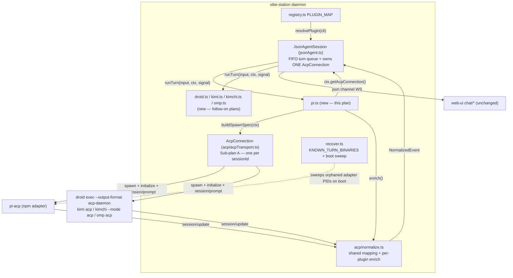
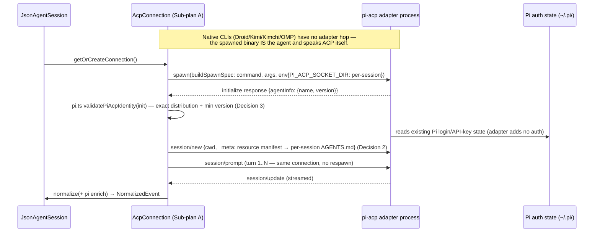

<!--
RULES — read before writing or implementing:
1. FORMAT: Bullets, tables, code, diagrams ONLY — no prose paragraphs
2. REQUIREMENTS: One crisp line each — no verbose descriptions
3. CHECKLIST: Mark items [x] as you complete them — this is your persistent todo list
4. READING TIME: Optimize for fast human scanning — if it's hard to skim, rewrite it
-->

# Plan: ACP migration — new plugins (Pi, Droid, Kimi)

> Add new coding-agent CLIs to vibe-station's daemon as ACP-shaped plugins. Pi gets a full implementation checklist; Droid/Kimi get a ranked effort/risk outline only. **Kimchi and OMP are explicitly dropped from scope — human decision, not a research finding — see Decision 6.**

**Issue:** acp-migration-new-plugins
**Branch:** `feat/acp-migration-new-plugins`
**Status:** Pending
**PRD:** none — plugin-shaped extension of an already-decided architecture; no new user-facing surface beyond CLI choice in the existing mode picker
**Parent:** none (sibling to `01-core-plugins`, not a child)

**Reference files:**
- Plugin contract: `daemon/src/services/spawn.ts:94-210` (`AgentPlugin`), `:39-49` (`AgentJsonTransport`), `:51-58` (`TurnInput`), `:66-92` (`TurnContext`)
- Registry: `daemon/src/agent-plugins/registry.ts:12-32`
- Turn engine (consumer): `daemon/src/services/jsonAgent.ts:802-905`
- Existing plugin examples: `daemon/src/agent-plugins/{claude,cursor,opencode,agy}.ts`
- Prompt builder: `daemon/src/services/promptBuilder.ts:67-118` (`buildPrompt`), `:120-161` (`buildDirectPrompt`)
- Boot orphan sweep: `daemon/src/services/recover.ts:14-22` (`KNOWN_TURN_BINARIES`), `:61-95`
- Session persistence: `daemon/src/services/dbSchema.ts:53-77`, `:154-158`; `daemon/src/services/dbMigration.ts`
- Mode/CLI identity: `daemon/src/routes/modes.ts:22-23,185-197` → `~/.vibe-station/modes.json` (`daemon/src/services/paths.ts:72-74`), **not SQLite**

---

## Scoping statement (read first)

| CLI | Treatment in THIS plan |
|---|---|
| **Pi** | Full research + design + phased implementation checklist (Phases 0-2) |
| **Droid, Kimi** | Ranked list + effort/risk table + "what's needed" outline only — **no phase checklist** |
| **Kimchi, OMP** | **Dropped — not building.** Explicit human decision (not a risk/effort finding); research kept below for future reference only, no implementation intent |

- Follow-on plan file per CLI when picked up: `03-droid`, `04-kimi` under the same `acp-migration/` feature dir — not written here.
- Rationale for the asymmetry: Pi is the named next priority; Droid/Kimi need a human call on relative order first (see Decision 6).

---

## Problem

- Daemon supports 4 CLIs today — claude, cursor, opencode, agy (`daemon/src/agent-plugins/registry.ts:12-17`).
- Users want Pi, Droid, Kimi, Kimchi, OMP in the same mode picker, running Rich Chat (json channel) identically.
- Sub-plan A changes the json-channel transport under all 4 existing plugins — a new plugin written against the *old* transport would be dead code on arrival (see Research → "Transport shape").

## Out of Scope

- Sub-plan A's own migration work (existing 4 plugins) — not modified here.
- **Terminal channel (tmux/PTY) — explicitly untouched.** No changes to `daemon/src/services/spawn.ts` `spawnSession`/`spawnDirectSession` (`:338-687`) or `web-ui/src/components/layout/TerminalPane.tsx`. New CLIs are json-channel-only in practice (Decision 5).
- Backward-compat shims, feature flags, dual-write, data migration — **no production users of json-chat exist**, so none is needed (Decision 1).
- New credential/auth model — ACP carries no auth layer; each CLI authenticates exactly as it does standalone (see Research → web table, "ACP auth model, confirmed").
- Droid/Kimi implementation — ranked outline only.
- Kimchi/OMP — dropped entirely, not scoped here or in any follow-on plan (Decision 6).

## Concept

- Adding a CLI = **one new plugin file** implementing `AgentPlugin` + **one line** in `PLUGIN_MAP` + **one binary name** in `KNOWN_TURN_BINARIES`.
- No shared daemon code branches on CLI name — invariant unchanged.
- Post-Sub-plan-A, a plugin's `runTurn` does not spawn per turn — it prompts over the session's already-live `AcpConnection` (shape restated in Research → "Transport shape").
- Success state: Pi selectable in the mode-creation dialog, streams a full Rich Chat turn end-to-end, **zero web-ui code changes** (evidence in UI Changes).

## Requirements

| # | Requirement |
|---|-------------|
| 1 | New plugin implements every **non-optional** `AgentPlugin` member (`spawn.ts:94-210`): `name`, `defaultModel`, `promptDelivery`, `getLaunchCommand`, `getEnvironment`, `getReadySignal`, `composeLaunchPrompt`, `listModels` |
| 2 | New plugin implements the **optional** json-channel members: `supportsJson()`, `runTurn()`, plus Sub-plan A's new `supportsAcp()` gate |
| 3 | No shared daemon code branches on CLI name — all CLI-specific logic lives in the plugin file |
| 4 | No SQLite schema change *of its own* — new CLIs add no columns; any `acpSessionId` column comes from Sub-plan A's Decision 6, not from here |
| 5 | No web-ui code change (see UI Changes) — per-CLI exception called out if a CLI emits an unrenderable event kind |
| 6 | Auth fully delegated to the wrapped CLI — vibe-station stores no new credentials |
| 7 | Pi pins an exact adapter distribution + minimum version, validated at `initialize` (Decision 3) — never floating `latest` |
| 8 | New CLI's spawned binary name added to `recover.ts:22` `KNOWN_TURN_BINARIES` (Decision 4) — else its orphaned process is never swept on boot |
| 9 | No feature flag, no migration/backfill — greenfield addition (Decision 1) |

---

## Research

### Transport shape — restated inline from Sub-plan A (do NOT go read Sub-plan A to implement this)

> Every fact in this subsection is Sub-plan A's deliverable, restated here verbatim-in-substance so this plan stands alone.

| Sub-plan A artifact | Exact shape |
|---|---|
| `daemon/src/services/acp/acpTransport.ts` **(new)** | `class AcpConnection { initialize(); sendPrompt(sessionId: string, prompt: AcpPromptBlock[], signal: AbortSignal): { updates: AsyncIterable<SessionUpdate>; result: Promise<{ stopReason: string }> }; cancelActivePrompt(): Promise<void>; dispose(): Promise<void>; }` |
| Ownership | **One `AcpConnection` per `sessionId`, owned by the existing `JsonAgentSession` instance** — created lazily via a new `JsonAgentSession.getOrCreateConnection()`. **There is no separate connection pool/registry module.** |
| Plugin access path | New `TurnContext` field: `ctx.getAcpConnection(): Promise<AcpConnection>` |
| `daemon/src/services/acp/normalize.ts` **(new)** | `normalizeSessionUpdate(raw, sessionId, enrich?): NormalizedEvent` — shared base mapping (text / thinking / tool_call / tool_call_update / plan → existing `NormalizedEventKind`s) with a **per-plugin `enrich` hook** |
| `daemon/src/services/acp/acpTerminalManager.ts` **(new)** | Daemon-side ACP Client role: `terminal/create\|output\|wait_for_exit\|kill\|release`; owns background OS child processes |
| New `AgentPlugin` member | `supportsAcp?(): boolean` — `runOneTurn` takes the ACP branch only when this returns `true` |
| Turn-done signal | `session/prompt`'s response resolving (**not** process exit); the plugin's `runTurn` still returns `AsyncIterable<NormalizedEvent>`, signature unchanged |
| Per-plugin responsibility | Only two things: (a) the launch spec for its own binary, (b) its `enrich` mapping for CLI-specific `session/update` nuances |
| ACP session id storage | Inherited from Sub-plan A's Decision 6 (per-plugin Option A: reuse `sessions.agentChatId`; Option B: new nullable `sessions.acpSessionId`). Whichever lands, this sub-plan adds no column and no new pattern |
| New npm dependency | `@agentclientprotocol/sdk` (added to `daemon/package.json` by Sub-plan A, not by this plan) |
| Idle-TTL | Connection disposed after 30 min idle **unless** it has ≥1 live background terminal |

- **Naming note (this plan's own contribution):** Sub-plan A says only "each plugin supplies its own launch-command"; it does not name the function. This plan names it **`buildSpawnSpec(ctx: TurnContext): { command: string; args: string[]; env: Record<string,string> }`** and uses that name throughout.

### Today's per-turn spawn (what Sub-plan A replaces — context only)

- `daemon/src/agent-plugins/claude.ts:475-561` — `spawn("claude", args, {detached:true})` on **every** `runTurn` call; process exits at the turn's `result` line.
- `daemon/src/services/jsonAgent.ts:802-905` (`runOneTurn`) — builds `TurnInput`/`TurnContext`, iterates `plugin.runTurn(...)`, catches transport failure into a synthetic `error` event (`:878-891`), appends a "Turn stopped" `status` marker on abort (`emitStopped`, `:901-905`).
- **Consequence for this plan:** write Pi directly against the ACP shape above; never against the spawn-per-turn shape.

### Existing plugin contract — verified against source

- `daemon/src/services/spawn.ts:94-210` (`AgentPlugin`) — **required** members listed in Requirement 1; TTY-extras (`setupWorkspaceHooks`, `provideChatId`, `captureChatId`, `refreshChatIdOnToggle`, `getForkCommand`, `getRestoreCommand`) are optional; `supportsJson?()` / `runTurn?()` (`:202-211`) are also optional.
- `daemon/src/agent-plugins/registry.ts:12-21` — `PLUGIN_MAP` is `Record<string, () => AgentPlugin> as const`; `CliId = keyof typeof PLUGIN_MAP`; `SUPPORTED_CLIS = Object.keys(PLUGIN_MAP)`. One new key widens all three.
- `daemon/src/agent-plugins/agy.ts:1-40` — most recent plugin; the "header comment documents the binary's quirks (launch args, prompt delivery, chat-id capture)" pattern a new plugin should copy.

### Prompt injection — no change needed

- `daemon/src/services/promptBuilder.ts:67-118` / `:120-161` — builds `{systemPrompt, taskPrompt}` generically (L1 skill.md + L2 project/worktree context + L3 project rules). Not CLI-specific.
- Delivered to plugins via `TurnContext.systemPromptFile` (`spawn.ts:83-84`) — an absolute path, applied on `isFirstTurn`.
- New plugin only decides *how* to apply it (launch flag vs standing-instructions file vs prepended message) — CLI-specific, see Decision 2.

### Boot orphan sweep — a new plugin MUST touch this

- `daemon/src/services/recover.ts:22` — `const KNOWN_TURN_BINARIES = new Set(["claude", "cursor-agent", "opencode", "agy"])`.
- `daemon/src/services/recover.ts:39-52` (`verifyPidIsTurnProcess`) — PID-reuse guard; **refuses to kill any PID whose comm-name is not in that allowlist**.
- Header comment `:14-21` explicitly instructs: "update this list if a plugin's spawned binary name changes."
- **Consequence:** Pi's adapter process name must be added, or an orphaned Pi connection survives a daemon crash forever. This is the one shared file every new plugin unavoidably edits.
- **Wrinkle:** `pi-acp` is an npm bin, so its `/proc/<pid>` comm-name may be `node`, not `pi-acp` — must be measured, not assumed (Risk 3).

### DB schema / CLI identity — zero migration, verified

| Claim | Evidence |
|---|---|
| `sessions` table has **no** `cli` column | `daemon/src/services/dbSchema.ts:53-77` |
| `SessionMeta.cli` is runtime-derived, not persisted per session | `daemon/src/types.ts:180-198` (`cli: string` at `:185`) |
| CLI identity lives in `~/.vibe-station/modes.json` | `daemon/src/services/paths.ts:72-74` (`modesPath()`), `daemon/src/routes/modes.ts:3` |
| `POST /modes` validation widens automatically | `daemon/src/routes/modes.ts:22-23` — `CLI_ENUM_TUPLE = SUPPORTED_CLIS`, `cliIdSchema = z.enum(CLI_ENUM_TUPLE)` |
| `GET /supported-clis` populates automatically | `daemon/src/routes/modes.ts:185-197` |

- **Net: a new CLI needs zero SQLite migration.** Adding a `PLUGIN_MAP` key alone makes it validate, list, and run.
- **Additive pattern for reference only** (not used by this plan): `addColumnIfMissing(db, table, column, ddl)` at `dbSchema.ts:154-158`, called idempotently from `ensureSchema`; 6 existing precedents at `:118-150` (`branchIsPlaceholder`, `hiddenAt`, `spawnedFrom`, `supersededBy`, `prState`/`prNumber`/`prUrl`/`prCheckedAt`/`prBranch`).

### UI — no change needed, verified by grep

| Check | Result |
|---|---|
| `web-ui/src/components/dialogs/NewModeDialog.tsx:161-167` | `clis.map((c) => ...)` — renders one radio per `GET /supported-clis` entry, generic |
| `NewModeDialog.tsx:62` | Only hardcoded CLI name is a UX default: `list.find((c) => c.id === "claude") ?? list[0]` — a new CLI still appears |
| `web-ui/src/components/dialogs/EditModeDialog.tsx:39,126` | Same generic `getSupportedClis()` + `clis.map` pattern |
| `web-ui/src/api/client.ts:676-680` | `getSupportedClis(): Promise<SupportedCli[]>` — no CLI names |
| `web-ui/src/api/types.ts:281` | `export type CliId = string` — already open |
| `web-ui/src/components/chat/*` | Consumes generic `NormalizedEvent` stream; grep for `.provider ===` across `web-ui/src` → **zero hits** |

- **Dead-code nit (non-blocking):** `web-ui/src/api/types.ts:179` — `NormalizedEventProvider = "claude" | "cursor" | "opencode"`, already missing `"agy"` today, vs `daemon/src/types.ts:67` which correctly has all 4. Field is typed but never branched on. One-line widening; see Risk 5.

### agent-orchestrator (ComposioHQ) — verified by `git show upstream/main`, read-only

| File (`backend/internal/adapters/chatdriver/…`) | Verified content |
|---|---|
| `registry/registry.go` | Flat `map[harness]ChatDriver` capability gate; a harness with no entry cannot run chat — same "one plugin, no shared branching" philosophy vibe-station has |
| `nativeacp/driver.go` | Shared native-ACP binding: `Configure(ctx, LaunchConfig) → (args, envOverrides, error)` — the Go analog of this plan's `buildSpawnSpec` |
| `droidacp/driver.go:41-46` | `droid exec --output-format acp-daemon [--skip-permissions-unsafe] [--append-system-prompt <p>]` — native |
| `kimiacp/driver.go:40` | `kimi acp` — native; `validateTurnSettings` rejects non-default permission modes ("Kimi ACP advertises only its default session mode") |
| `kimchiacp/driver.go:29-50` | `kimchi --mode acp [--model m] [--auto\|--yolo] [--append-system-prompt p]` — native; no runtime `session/set_mode` (permission mode baked into launch args) |
| `kimchiacp/version.go:15` | `minimumKimchiVersion = "0.0.7"`, gated via `kimchi --version` |
| `ompacp/driver.go:41-52` | `omp acp [--model m] [--append-system-prompt p] [--approval-mode write\|yolo]` — native |
| `ompacp/version.go:16` | `minimumOMPVersion = "15.0.0"` |
| `piacp/driver.go:1-5` | **NOT a native binding.** Package doc: *"AO does not package or download pi-acp. The adapter embeds Pi itself, while the existing Pi plugin remains the canonical auth probe."* |
| `piacp/driver.go:27-28` | `distributionName = "@victor-software-house/pi-acp"`, `minimumVersion = "0.17.1"` |
| `piacp/driver.go:83` | `env["PI_ACP_SOCKET_DIR"] = <dataDir>/pi-acp/<sessionID>/run` — comment: "pi-acp 0.17 uses a long-running daemon; a session-private socket prevents one project's environment leaking into another" |
| `piacp/driver.go` `prepareStandingInstructions` / `sessionMeta` | Writes `<dataDir>/prompts/<sessionID>/pi-acp/AGENTS.md` and passes an **inline resource manifest** (`{version:1, mode:"local", roots:[…]}`) at `session/new` — composes with, does not replace, the project's own `AGENTS.md` |

### emdash — Node/TS ACP client precedent (same stack as vibe-station's daemon)

- `emdash/packages/core/package.json:359` — `"@agentclientprotocol/sdk": "^1.1.0"` — the same library Sub-plan A adds.
- `emdash/packages/core/src/runtimes/acp/node/connection/acp-agent-connection.ts:44-136` — spawn → wire stdio into the SDK `Client` → race `initialize()` against process-close → return `{agent, normalize, supportsLoadSession, mcpCapabilities}`; `behavior.enrich` hook at `:98-101` is the model for Sub-plan A's per-plugin `enrich`.
- `emdash/packages/core/src/runtimes/acp/node/node/child-process-host.ts:94-110` — plain `node:child_process.spawn`, `stdio: ["pipe","pipe","pipe"]`, no shell — identical to vibe-station's `claude.ts:502`.

### Web research — ACP status per new CLI (verified Aug 2026)

| CLI | Native or adapter | In Zed's ACP registry? | Verified detail | Auth | Licence / backing |
|---|---|---|---|---|---|
| **Pi** (Pi Coding Agent) | **Third-party adapter** — Pi's own CLI does not speak ACP | ✅ yes | **Two divergent adapter lines, not just two forks** — see Decision 3: Zed's registry entry (`zed.dev/acp/agent/pi`) resolves to npm **`pi-acp@0.0.33`** (repo `svkozak/pi-acp`, spawns `pi --mode rpc` as a child); AO pins npm **`@victor-software-house/pi-acp@0.17.1`** (long-running daemon, `PI_ACP_SOCKET_DIR`, resource manifest). At least a third fork exists (`aadishv/pi-acp`) plus a `@geohar/pi-acp` on pi.dev | Pi's own `/login` (Claude Pro/Max, ChatGPT Plus/Pro, GitHub Copilot) or API key under `~/.pi/`; adapter inherits, adds nothing | Pi: MIT, Mario Zechner / earendil-works. Adapters: community-maintained, **not** Pi's own team |
| **Droid** (Factory AI) | **Native** — `droid exec --output-format acp-daemon` | ✅ yes ("Factory Droid") | First-party, publicly announced full ACP compliance; ACP-registry launch partner | Factory account/login | Closed-source CLI, funded commercial company |
| **Kimi** (Moonshot AI) | **Native** — `kimi acp` | ✅ yes ("Kimi CLI") | First-party, official `kimi acp` docs page; advertises only its default permission mode | `/login` once, then standalone | Moonshot AI; PyPI + npm distribution |
| **Kimchi** (`getkimchi/kimchi`) | **Native** — `kimchi --mode acp` | ❌ **not listed** | Real distinct product: terminal coding agent, multi-model orchestration, built **on the pi-mono SDK** (same Pi lineage as OMP), built-in LSP, "ferment" phased workflow. AO version-gates at `0.0.7`+ | own login | Funded early-stage product, docs at `docs.kimchi.dev`; smaller/newer than Droid/Kimi |
| **OMP** ("Oh My Pi") | **Native** — `omp acp` | ❌ **not listed** (only an open Zed discussion requesting it) | Fork of Mario Zechner's pi-mono by **can1357 (Can Bölük)** — Rust core (~80k LOC), 30+ tools, LSP, DAP, subagents, hashline edits. `Raudbjorn/omp` is a downstream fork, **not** the upstream. Notable public mindshare | Pi-lineage auth | MIT, open source; active community |

- **ACP auth model, confirmed:** ACP is a JSON-RPC session/tool protocol with **no credential layer**. All 5 CLIs authenticate exactly as they do standalone; vibe-station adds zero secret storage.

Sources: [Pi — ACP Agent | Zed](https://zed.dev/acp/agent/pi) · [pi-acp — npm](https://www.npmjs.com/package/pi-acp) · [svkozak/pi-acp](https://github.com/svkozak/pi-acp) · [victor-software-house/pi-acp](https://github.com/victor-software-house/pi-acp) · [Factory Droid — ACP Agent | Zed](https://zed.dev/acp/agent/factory-droid) · [Kimi CLI — ACP Agent | Zed](https://zed.dev/acp/agent/kimi-cli) · [getkimchi/kimchi](https://github.com/getkimchi/kimchi) · [docs.kimchi.dev](https://docs.kimchi.dev/docs/kimchi-cli) · [Raudbjorn/omp](https://github.com/Raudbjorn/omp) · [Zed discussion #58515 — omp not yet in registry](https://github.com/zed-industries/zed/discussions/58515) · [ACP Registry](https://zed.dev/acp)

---

## Architecture Diagram



- Work owned by **this** plan: the `pi.ts` box, the `registry.ts` one-liner, and the `recover.ts` allowlist entry.
- `AcpConnection` / `normalize.ts` / `acpTerminalManager.ts` are Sub-plan A deliverables — consumed, not modified.

### Process lifecycle — Pi differs from the native-CLI case



---

## Priority Ranking

| Rank | CLI | Native / adapter | Auth complexity | Effort | Demand signal | Justification |
|---|---|---|---|---|---|---|
| **0 (mandated)** | **Pi** | Adapter — third-party, divergent forks | Low (Pi's own `/login`) | **Medium-high** — plugin + fork selection + `agentInfo` validation + standing-instructions file | Explicitly requested | Built first per instruction, despite being objectively the **riskiest** of the CLIs researched (Decision 7) |
| **1** | **Droid** | Native | Low (Factory login) | Low — one flag builder, mirrors `droidacp/driver.go` | High — well-known commercial product | Most mature, first-party, ACP-registry launch partner, lowest risk |
| **2** | **Kimi** | Native | Low (one-time `/login`) | Low — single `kimi acp` subcommand, official docs | Medium-high — real mindshare | First-party, mature, simplest launch args; only wrinkle is single permission mode |
| — | ~~OMP~~ | ~~Native~~ | ~~Low~~ | ~~Low-medium~~ | ~~Medium~~ | **Dropped — explicit human decision (Decision 6).** Research kept in the Web-research table below for reference only |
| — | ~~Kimchi~~ | ~~Native~~ | ~~Low~~ | ~~Low-medium~~ | ~~Lower~~ | **Dropped — explicit human decision (Decision 6).** Research kept in the Web-research table below for reference only |

> ### ⚠️ Decisions made unattended — need human confirmation
>
> 1. **Order of ranks 1-2 (Droid, Kimi).** Derived from maturity + registry presence + public mindshare, **not** from stakeholder or user-request data. Confirm or reorder before any follow-on plan is written.
> 2. **Kimchi and OMP are dropped, per explicit human instruction** (superseding this plan's earlier "build both, rank last" draft call) — see Decision 6. Not scoped, no follow-on plan file.
> 3. **Which Pi adapter fork to pin.** See Decision 3 — this plan defaults to `@victor-software-house/pi-acp@0.17.1`; a Phase-0 spike must confirm before Phase 1 starts.

---

## Daemon Changes

| File | Change |
|---|---|
| `daemon/src/agent-plugins/pi.ts` | **New.** Implements `AgentPlugin`; owns `buildSpawnSpec`, `validatePiAcpIdentity`, standing-instructions write, `enrich` mapping |
| `daemon/src/agent-plugins/registry.ts:12-17` | **Modified.** One import + one line: `pi: createPiPlugin` — `CliId` / `SUPPORTED_CLIS` widen automatically (`:19-21`) |
| `daemon/src/services/recover.ts:22` | **Modified.** Add Pi's adapter process comm-name to `KNOWN_TURN_BINARIES` (Decision 4); update the `:14-21` header comment |
| `daemon/src/agent-plugins/{droid,kimi}.ts` | **New — follow-on plans only**, same three-touch shape. Kimchi/OMP dropped (Decision 6) — no file, no follow-on plan |

- **Explicitly NOT modified:** `spawn.ts`, `jsonAgent.ts`, `promptBuilder.ts`, `dbSchema.ts`, `dbMigration.ts`, `jsonAgentRegistry.ts`, any route file. Each is already generic over `AgentPlugin` / `CliId` — evidence in Research.
- **Consumed, not owned:** Sub-plan A's `daemon/src/services/acp/{acpTransport,normalize,acpTerminalManager}.ts` and its `@agentclientprotocol/sdk` dependency.
- **New dependency added by this plan:** none. `pi-acp` is resolved on `PATH` / npm-global like any other CLI binary — not vendored into the daemon.

## UI Changes

- **None required functionally.** Evidence table in Research → "UI — no change needed, verified by grep": mode dialogs render CLI choices generically from `GET /supported-clis`; `CliId` is already `string`; chat components consume the generic `NormalizedEvent` stream; zero `.provider ===` branches exist.
- **Per-CLI event-kind check for Pi:** pi-acp's documented `session/update` output is `agent_message_chunk` + `tool_call` / `tool_call_update` (with tool-call locations where available) — all already covered by existing `NormalizedEvent` kinds. **No new kind, no UI change.**
- **Per-CLI check deferred:** OMP's richer event set (LSP/DAP/subagent) is the one CLI where a new event kind is plausible — audit belongs to its follow-on plan, not here.
- **Optional hygiene fix, same PR:** `web-ui/src/api/types.ts:179` — widen `NormalizedEventProvider` to include `"agy"` + new CLI ids, or to `string`, matching `daemon/src/types.ts:67`. Confirmed dead code. Not gating — see Risk 5.

## What Gets Reused

| From | What | How the new plugin uses it |
|---|---|---|
| Existing daemon scaffolding | `AgentPlugin` interface | `daemon/src/services/spawn.ts:94-210` — implement it; nothing else changes |
| Existing daemon scaffolding | `PLUGIN_MAP` / `resolvePlugin` / derived `CliId` + `SUPPORTED_CLIS` | `registry.ts:12-32` — one key added, three things widen |
| Existing daemon scaffolding | Auto-widening mode validation + CLI listing | `routes/modes.ts:22-23,185-197` — free, no route edit |
| Existing daemon scaffolding | Layered system prompt written to `TurnContext.systemPromptFile` | `promptBuilder.ts:67-118`; consumed on `isFirstTurn` (Decision 2) |
| Existing daemon scaffolding | Boot orphan sweep + PID-reuse guard | `recover.ts:39-52,61-95` — reused as-is; only the allowlist string is added (Decision 4) |
| Existing daemon scaffolding | Detached / own-process-group spawn convention, `onSpawn(pid)` reporting | `spawn.ts:86-91`; same convention as `claude.ts:502` |
| Sub-plan A | `AcpConnection` (`acp/acpTransport.ts`) — persistent per-session connection, `sendPrompt` / `cancelActivePrompt` / `dispose` | Reached via `ctx.getAcpConnection()`; `runTurn` yields from `sendPrompt(...).updates` |
| Sub-plan A | `acp/normalize.ts` shared `session/update → NormalizedEvent` mapping | Plugin supplies **only** its `enrich` hook for CLI-specific nuances |
| Sub-plan A | `acp/acpTerminalManager.ts` + 30-min idle-TTL pinned open by live terminals | Free — background-work survival applies to new plugins with no extra code |
| Sub-plan A | `@agentclientprotocol/sdk` in `daemon/package.json` | Already present; this plan adds no dependency |
| Sub-plan A | ACP session id storage — `agentChatId` (Option A) or `acpSessionId` (Option B), per Decision 6 | Free — a new CLI inherits whichever column already exists |
| agent-orchestrator (pattern, not code) | `Configure(ctx, LaunchConfig) → (args, env, error)` | Mirrored as `buildSpawnSpec(ctx)` |

---

## Design Details

### System Boundaries

| Boundary | Fields + types | Errors | Source of truth |
|----------|----------------|--------|-----------------|
| `JsonAgentSession` ↔ `AgentPlugin.runTurn` | `TurnInput{message, attachmentPaths?, isFirstTurn}`, `TurnContext{cwd, project, worktree, session, chatId?, forkFromChatId?, model?, systemPromptFile, daemonPort, onSpawn?, getAcpConnection}` → `AsyncIterable<NormalizedEvent>` | Iterator throw → synthetic `error` event at `jsonAgent.ts:878-891`; unchanged contract, no new error shape | `AgentPlugin` (`spawn.ts:94-210`) — unchanged by this plan except Sub-plan A's added `supportsAcp?()` |
| `pi.ts` ↔ `AcpConnection` (in-process, Sub-plan A) | `sendPrompt(sessionId: string, prompt: AcpPromptBlock[], signal: AbortSignal) → { updates: AsyncIterable<SessionUpdate>; result: Promise<{stopReason: string}> }`; `cancelActivePrompt()`; `dispose()` | Spawn failure / `initialize` failure / identity-validation throw → propagates to `jsonAgent.ts:878-891`'s existing catch — no new error path | `AcpConnection` owns process liveness; `pi.ts` is stateless |
| `pi.ts` ↔ `acp/normalize.ts` (Sub-plan A) | `enrich(raw: SessionUpdate, base: NormalizedEvent): NormalizedEvent` | none — pure function | `normalize.ts` owns the base mapping; plugin owns only CLI nuance |
| `pi.ts` ↔ `pi-acp` process (ACP JSON-RPC over stdio) | `initialize → {agentInfo:{name,version}, agentCapabilities}`; `session/new {cwd, _meta:{resourceManifest}} → {sessionId}`; `session/prompt`; `session/update` | Wrong `agentInfo.name` or version < pinned min → `Error` before any event is yielded (Decision 3) | pi-acp owns the Pi engine + its auth; vibe-station stores no Pi credentials |
| Registry ↔ routes | `PLUGIN_MAP: Record<CliId, () => AgentPlugin>`; `GET /supported-clis` → `{id, defaultModel, supportsJson, importsNativeHistory}[]` | none new | `registry.ts:12-21`, `routes/modes.ts:185-197` — shape unchanged |

### Critical User Journeys (CUJs)

#### CUJ 1 — User creates a Pi mode and sends a first message (happy path)

```
User opens "New Mode" dialog
  → GET /supported-clis returns {id:"pi",...}  (PLUGIN_MAP entry alone makes this true)
  → User picks Pi, names the mode, saves → POST /modes {cli:"pi", ...}
  → User starts a Rich Chat session in that mode, sends first message
  → jsonAgent.runOneTurn calls pi.runTurn(input{isFirstTurn:true}, ctx, signal)
  → pi.ts writes per-session AGENTS.md from ctx.systemPromptFile          (Decision 2)
  → pi.ts calls ctx.getAcpConnection() → JsonAgentSession spawns pi-acp via buildSpawnSpec
  → pi.ts validatePiAcpIdentity(initialize response)                      (Decision 3)
  → session/new carries the resource manifest → session/prompt
  → session/update stream → normalize + pi enrich → NormalizedEvent → user sees streamed reply
```

- **Error — pi-acp missing or wrong fork/version:** identity validation throws before any event → `jsonAgent.ts:878-891` emits a synthetic `error` event → user sees a chat-level error, same UX as any transport failure.
- **Error — the *other* Pi fork is installed:** its `agentInfo.name` differs → same validation error, never silent wrong behavior.

#### CUJ 2 — Second turn in the same session (connection reuse)

```
User sends a follow-up in the same session
  → runOneTurn calls pi.runTurn(input{isFirstTurn:false}, ctx, signal)
  → ctx.getAcpConnection() returns the EXISTING live AcpConnection — no respawn
  → session/prompt over the already-initialized connection
  → No AGENTS.md rewrite (isFirstTurn false) — Pi's own session state carries context
```

- **Edge — daemon restarted mid-session:** no live connection exists → `getOrCreateConnection()` spawns fresh; `isFirstTurn` is recomputed from `JsonAgentSession.firstTurnDone` (`jsonAgent.ts:255,318,877`); Sub-plan A's `session/load`-or-fresh fallback applies unchanged.
- **Edge — daemon crashed, adapter orphaned:** boot sweep kills it **only if** its comm-name is in `KNOWN_TURN_BINARIES` (Decision 4, Risk 3).

### Data Model

| Entity | Field | Type | Constraints | Notes |
|---|---|---|---|---|
| `modes.json` record | `cli` | `CliId` (string enum) | must be a `PLUGIN_MAP` key | JSON file at `~/.vibe-station/modes.json`, **not** SQLite |
| `sessions` | `agentChatId` | `TEXT` | nullable | **Unchanged, reused** — holds the id the raw CLI's own resume flag understands. If Sub-plan A's Decision 6 lands Option B for any plugin, an `acpSessionId TEXT` column also exists and a new plugin may set it; no new migration either way |

- **New tables:** none. **New columns:** none. **Indexes:** none.
- **Migration: N.** Nothing to add, nothing to backfill.
- If a future CLI genuinely needs a persisted column, follow the existing additive pattern `addColumnIfMissing(db, "sessions", "<col>", "<ddl>")` (`dbSchema.ts:154-158`, 6 precedents at `:118-150`) — not needed for Pi.

### API Contracts

- `GET /supported-clis` (`routes/modes.ts:185-197`) — **existing, unchanged.** Adding `pi` to `PLUGIN_MAP` makes it appear automatically.
- `POST /modes {cli, name, context, presetId?, model?}` (`routes/modes.ts:98`) — **existing, unchanged.** `cliIdSchema` widens automatically via `CLI_ENUM_TUPLE` (`:22-23`).
- Internal (non-HTTP) contracts consumed: `AcpConnection.sendPrompt` and `normalize.enrich` — full shapes in System Boundaries above; owned by Sub-plan A.

### Key Decisions

#### Decision 1: No backward-compat shim, no feature flag, no data migration
- **Decision:** Ship new plugins directly — no flag gate, no dual-write, no backfill.
- **Rationale:** No production users of json-chat exist; there is nothing to stay compatible with.
- **Where:** N/A — absence of code. Recorded explicitly so an implementer does not add a flag out of habit.

#### Decision 2: Pi's system prompt ships as a per-session `AGENTS.md` + resource manifest, not a launch flag
- **Decision:** On `isFirstTurn`, `pi.ts` writes `ctx.systemPromptFile`'s contents to a per-session `AGENTS.md` under the session data dir, and passes an inline resource manifest in `session/new` pointing at it — composing with, not replacing, the project's own `AGENTS.md`.
- **Rationale:** pi-acp exposes no `--append-system-prompt` equivalent (unlike Droid/Kimchi/OMP); the resource manifest is its documented standing-instructions mechanism, verified in `agent-orchestrator`'s `piacp/driver.go` (`prepareStandingInstructions`, `sessionMeta`).
- **Where:** `daemon/src/agent-plugins/pi.ts` (new) — file write + `session/new` param construction.
```ts
// Manifest shape mirrors agent-orchestrator's piacp sessionMeta: root 1 preserves the
// project's own Pi resources exactly; root 2 adds ONLY vibe-station's generated AGENTS.md.
const manifest = {
  version: 1,
  mode: "local",
  roots: [
    { path: ctx.cwd },                                  // project's own AGENTS.md/skills/prompts
    { path: piInstructionDir(ctx) },                    // <sessionDataDir>/pi-acp/ holding AGENTS.md
  ],
};
```

#### Decision 3: Pin ONE Pi adapter distribution + minimum version; validate at `initialize`
- **Decision:** `pi.ts` hardcodes an expected `agentInfo.name` and minimum semver, checked against the `initialize` response before the first `session/new`. **Default pin: `@victor-software-house/pi-acp`, min `0.17.1`.**
- **Rationale:** Two *divergent* adapter lines exist, not merely two forks — `pi-acp@0.0.33` (svkozak; Zed registry's entry; spawns `pi --mode rpc` as a child) vs `@victor-software-house/pi-acp@0.17.1` (long-running daemon; `PI_ACP_SOCKET_DIR`; resource manifest). The version lines are not comparable and their runtime models differ. This plan's Decision 2 (resource manifest) and `PI_ACP_SOCKET_DIR` handling only exist in the victor-software-house line, and agent-orchestrator runs it in production — hence the default. A silent identity mismatch would otherwise produce confusing chat failures.
- **Where:** `daemon/src/agent-plugins/pi.ts` (new) — validation runs in the connect path, before any event is yielded.
- > **Decision made unattended — needs human confirmation:** the fork choice is this plan's call, not a stakeholder's. Phase 0 spike (0.1) must install both and confirm before Phase 1 begins. If the Zed-registry line is preferred instead, Decision 2's manifest mechanism must be re-researched — it likely does not apply.
```ts
// Mirrors agent-orchestrator piacp/driver.go validateInitialize.
// Divergent upstream adapter lines make a silent identity/version mismatch a real risk.
function validatePiAcpIdentity(init: AcpInitializeResponse): void {
  const EXPECTED_NAME = "@victor-software-house/pi-acp";  // confirmed by Phase 0 spike
  const MIN_VERSION = "0.17.1";                            // pin — never float to "latest"
  if (init.agentInfo?.name !== EXPECTED_NAME) {
    throw new Error(`Unexpected Pi ACP distribution "${init.agentInfo?.name ?? "unknown"}"; expected ${EXPECTED_NAME}`);
  }
  if (!satisfiesMinVersion(init.agentInfo.version, MIN_VERSION)) {
    throw new Error(`pi-acp ${init.agentInfo.version} is older than the tested minimum ${MIN_VERSION}`);
  }
}
```

#### Decision 4: Every new CLI adds its spawned binary name to `KNOWN_TURN_BINARIES`
- **Decision:** Add Pi's adapter process comm-name to `recover.ts:22`'s allowlist as part of the Pi PR; every follow-on plugin plan does the same for its own binary.
- **Rationale:** `verifyPidIsTurnProcess` (`recover.ts:39-52`) refuses to kill any recorded PID whose comm-name is not allowlisted — an omitted entry means a crashed daemon leaves an orphaned adapter process running forever. The file's own header comment (`:14-21`) mandates updating the list when a plugin's spawned binary changes.
- **Where:** `daemon/src/services/recover.ts:14-22` — allowlist string + header comment.

#### Decision 5: New plugins implement TTY-mode members minimally; terminal channel stays out of scope
- **Decision:** `getLaunchCommand` / `getEnvironment` / `getReadySignal` / `composeLaunchPrompt` are implemented with a plain direct-binary interactive launch, documented as untested. `supportsJson()` / `supportsAcp()` return `true`; TTY optional extras (`setupWorkspaceHooks`, `provideChatId`, `captureChatId`, `getForkCommand`, `getRestoreCommand`) are **not** implemented.
- **Rationale:** Those four members are non-optional on `AgentPlugin` (`spawn.ts:102-112`); widening the shared interface to make them optional would touch shared code and violate the no-shared-branching invariant. Minimal implementations are the cheapest way to satisfy the type contract.
- **Where:** `daemon/src/agent-plugins/pi.ts` (new) — header comment states "JSON channel is the supported path; TTY members are untested", following `agy.ts:1-40`'s documentation style.

#### Decision 6: Droid/Kimi get an outline, not a checklist; Kimchi/OMP are dropped entirely
- **Decision:** Droid and Kimi get a ranked effort/risk table only; each gets its own `03`/`04` plan file when picked up. Kimchi and OMP are **not being built** — removed from the ranking, from the follow-on plan list, and from any implementation intent.
- **Rationale:** Droid/Kimi's relative order is an unconfirmed human call (see the Priority Ranking callout), and each follow-on plan is ~3 files of near-identical shape once Pi validates the pattern. Kimchi/OMP's exclusion is a direct human instruction, superseding this plan's earlier research-driven "build both, rank last" recommendation — not a re-derived risk/effort judgment.
- **Where:** N/A — scoping decision, restated in the Scoping statement at the top. Their web-research rows are kept in the "Web research" table purely as reference in case the decision is revisited later.

#### Decision 7: Pi ships first despite being the riskiest of the five — flagged, not absorbed silently
- **Decision:** Proceed with Pi as instructed, while explicitly recording that it is the **least** mature of the five ACP integrations researched.
- **Rationale:** Pi is the only one of the five whose own CLI does **not** speak ACP; its adapter is third-party, community-maintained, on divergent version lines. `agent-orchestrator` isolates Pi in a dedicated non-`nativeacp` package precisely because it is not native (`piacp/driver.go:1-5`). A human should know this before treating Pi's ship date as low-risk.
- **Where:** N/A — planning-level flag; see Research web table and Priority Ranking rank-0 row.

---

## Risks / Open Questions

| # | Question | Notes |
|---|----------|-------|
| 1 | **Which Pi adapter line is canonical for vibe-station?** | Two divergent lines with incompatible runtime models — Decision 3 defaults to `@victor-software-house/pi-acp@0.17.1`, gated on the Phase-0 spike. Re-verify at implementation time; do not assume the pinned name is still current |
| 2 | **Does Sub-plan A's landed `AcpConnection` match the shape restated in Research?** | If it differs, only `pi.ts`'s call sites change — no redesign. The plugin needs exactly two things: a launch spec and an `enrich` hook |
| 3 | **Is pi-acp's `/proc/<pid>` comm-name `pi-acp` or `node`?** | Decision 4's allowlist entry must match the *actual* comm-name. Measure it in Phase 0 (0.2). If it is `node`, `verifyPidIsTurnProcess`'s guard is too coarse to distinguish an orphaned adapter from an unrelated Node process — escalate to Sub-plan A's owner rather than allowlisting bare `node` |
| 4 | **Kimi advertises only its default permission mode** — does vibe-station ever offer a permission-mode switch that would silently no-op? | Deferred to the Kimi follow-on plan; flagged here because it surfaced during research |
| 5 | **Kimchi/OMP version gates (`0.0.7`, `15.0.0`) are AO's tested minimums**, not independently verified for vibe-station | Re-verify at follow-on plan time; do not copy blindly |
| 6 | **Should the `NormalizedEventProvider` dead-code nit (`web-ui/src/api/types.ts:179`) be fixed in this PR?** | Recommended same-PR (one line, zero risk, already wrong for `agy` today), but not blocking — human call |

---

## Implementation Phases

_Pi only. Droid/Kimi/Kimchi/OMP get their own follow-on plans — see Scoping statement._

**Prerequisite for all phases:** Sub-plan A landed, i.e. `daemon/src/services/acp/acpTransport.ts` exists and `TurnContext.getAcpConnection()` is available.

### Phase 0 — Pi adapter spike (resolve Decision 3 before writing code)

- [ ] **0.1** Install both `pi-acp@0.0.33` and `@victor-software-house/pi-acp@0.17.1`; run each with a manual ACP `initialize` handshake; record each one's `agentInfo.name` + `version`, and whether it accepts a `session/new` resource manifest and honours `PI_ACP_SOCKET_DIR`. Confirm or override Decision 3's pin.
- [ ] **0.2** Run the chosen adapter and read `/proc/<pid>/comm` (or `ps -o comm=`) for its process; record the exact string needed by Decision 4 / Risk 3.
- [ ] **0.3** Confirm Pi's own auth (`/login` or API key under `~/.pi/`) is inherited by the adapter without any vibe-station-side credential handling.

**Verify phase 0:**
- [ ] **0.T1** Manual — the chosen adapter completes `initialize` + `session/new` + one `session/prompt` round-trip from a throwaway Node script, streaming at least one `agent_message_chunk`.
- [ ] **0.T2** Manual — the *rejected* adapter's `agentInfo.name` is recorded and differs from the chosen one, proving Decision 3's validation can actually discriminate.

### Phase 1 — Pi plugin (JSON channel)

- [ ] **1.1** Create `daemon/src/agent-plugins/pi.ts`: `createPiPlugin(): AgentPlugin` — `name: "pi"`, `defaultModel`, `promptDelivery`, `supportsJson(): true`, `supportsAcp(): true`
- [ ] **1.2** Implement `buildSpawnSpec(ctx: TurnContext): { command: string; args: string[]; env: Record<string,string> }` — resolves the adapter binary on PATH / npm-global (mirror `agy.ts`'s binary-resolution style), sets per-session `PI_ACP_SOCKET_DIR` under the session data dir
- [ ] **1.3** Implement `validatePiAcpIdentity(init)` per Decision 3, using the name/version confirmed in 0.1
- [ ] **1.4** Implement the standing-instructions write + `session/new` resource manifest per Decision 2
- [ ] **1.5** Implement `runTurn(input, ctx, signal)`: `const conn = await ctx.getAcpConnection()`, validate identity on first connect, then yield from `conn.sendPrompt(...).updates`, awaiting `.result` before returning
- [ ] **1.6** Implement Pi's `enrich` hook against Sub-plan A's `acp/normalize.ts` — cover `agent_message_chunk`, `tool_call`, `tool_call_update` (incl. tool-call location fields); confirm no new `NormalizedEvent` kind is needed
- [ ] **1.7** Implement `listModels()` — via the adapter's ACP session options if exposed, else a direct `pi` CLI query
- [ ] **1.8** Implement minimal TTY members per Decision 5 (`getLaunchCommand`, `getEnvironment`, `getReadySignal`, `composeLaunchPrompt`) + a header comment documenting the binary's quirks, following `agy.ts:1-40`
- [ ] **1.9** Add `import { createPiPlugin } from "./pi.js"` and `pi: createPiPlugin` to `daemon/src/agent-plugins/registry.ts:7-17`
- [ ] **1.10** Add the comm-name from 0.2 to `KNOWN_TURN_BINARIES` (`daemon/src/services/recover.ts:22`) and update its header comment (`:14-21`) per Decision 4

**Verify phase 1:**
- [ ] **1.T1** Unit — `daemon/src/__tests__/pi.test.ts`: `validatePiAcpIdentity` throws on a mismatched `agentInfo.name`, throws on a version below the pin, returns normally on an exact and on a newer version
- [ ] **1.T2** Unit — `pi.test.ts`: `buildSpawnSpec` produces a distinct `PI_ACP_SOCKET_DIR` for two different session ids (no collision)
- [ ] **1.T3** Unit — `pi.test.ts`: Pi's `enrich` maps a `tool_call` update to a `tool_use` `NormalizedEvent` and a later `tool_call_update` with the same id to a `tool_result`
- [ ] **1.T4** Integration — `GET /supported-clis` includes `{id:"pi", supportsJson:true, ...}` after the registry change, with no route file modified
- [ ] **1.T5** Unit — `daemon/src/__tests__/recover.test.ts`: `verifyPidIsTurnProcess` accepts the Pi adapter comm-name added in 1.10
- [ ] **1.T6** Regression — `daemon/src/__tests__/modes.test.ts` and `plugins.test.ts`, `jsonPlugins.test.ts` pass unmodified (registry addition does not perturb existing CLI resolution)

### Phase 2 — End-to-end Rich Chat verification

- [ ] **2.1** Create a Pi mode via `POST /modes`, start a session, send a first message; confirm streamed text + a terminal `result` event render in web-ui **with zero web-ui code changes**
- [ ] **2.2** Send a second message in the same session; confirm no new adapter process is spawned (verify with `ps`, not by inference) and `sessions.agentChatId` is unchanged across both turns
- [ ] **2.3** Stop a Pi turn mid-stream; confirm the `emitStopped` "Turn stopped" `status` marker still fires (`jsonAgent.ts:901-905`) and the connection survives (next turn succeeds without a fresh `session/new`)
- [ ] **2.4** Kill the daemon mid-session, restart, send a follow-up; confirm the orphaned adapter is swept by `recover.ts` and a fresh connection completes the turn
- [ ] **2.5** Confirm the first turn's system prompt reached Pi (ask the agent to restate a distinctive line from the generated `AGENTS.md`) and that the project's own `AGENTS.md` is still visible to it (Decision 2's composition, not replacement)

**Verify phase 2:**
- [ ] **2.T1** Integration — full turn round-trip against a stubbed pi-acp process yields a well-formed `NormalizedEvent` sequence ending in `result`
- [ ] **2.T2** Integration — abort mid-turn yields exactly one `status` "Turn stopped" event; no duplicate or missing terminal marker
- [ ] **2.T3** Integration — a boot sweep with a recorded Pi adapter PID kills it (extends the Sub-plan A sweep test with Pi's binary name)
- [ ] **2.T4** Regression — post-Sub-plan-A claude/cursor/opencode/agy json-chat flows are unaffected; full existing json-chat suite passes with no new failures

---

### Droid / Kimi — effort/risk outline (no phases; follow-on plans own the checklists)

**Kimchi and OMP dropped from this table — explicit human decision, not a research finding (Decision 6). Their research rows remain in "Web research" above for reference only, in case the decision is revisited.**

| CLI | What's needed | Effort | Risk | Prerequisite |
|---|---|---|---|---|
| Droid | `buildSpawnSpec`: `droid exec --output-format acp-daemon [--skip-permissions-unsafe] [--append-system-prompt <contents>]`; standard `enrich`; `droid` → `KNOWN_TURN_BINARIES` | Low — template copy of `pi.ts` minus identity validation and standing-instructions | Low | Sub-plan A landed |
| Kimi | `buildSpawnSpec`: `kimi acp`; no-op/reject non-default permission mode (Risk 4); `kimi` → `KNOWN_TURN_BINARIES` | Low | Low-medium — single-permission-mode UX gap | Same |

---

## Files & Phase Impact

| File | Status | Phase | Description / Contract Change |
|------|--------|-------|-------------------------------|
| `daemon/src/agent-plugins/pi.ts` | **New** | 1.1-1.8 | Contract: `createPiPlugin(): AgentPlugin` — `supportsJson()`/`supportsAcp()`/`runTurn()` over `ctx.getAcpConnection()`; private `buildSpawnSpec(ctx)`, `validatePiAcpIdentity(init)`, `enrich(raw, base)` · Owns: nothing persistent |
| `daemon/src/agent-plugins/registry.ts` | **Modified** | 1.9 | Add `pi: createPiPlugin` to `PLUGIN_MAP` (`:12-17`) + import (`:7-10`) — one line each; `CliId`/`SUPPORTED_CLIS` widen automatically |
| `daemon/src/services/recover.ts` | **Modified** | 1.10 | Add Pi adapter comm-name to `KNOWN_TURN_BINARIES` (`:22`); update header comment (`:14-21`) — Decision 4 |
| `daemon/src/__tests__/pi.test.ts` | **New** | 1.T1-1.T3 | Unit tests: identity/version validation, per-session socket-dir uniqueness, `enrich` event mapping |
| `daemon/src/__tests__/recover.test.ts` | **Modified** | 1.T5, 2.T3 | Assert the Pi adapter comm-name passes `verifyPidIsTurnProcess` and is swept on boot |
| `web-ui/src/api/types.ts` | **Modified (optional hygiene)** | — | Widen `NormalizedEventProvider` (`:179`) to include `agy` + new CLI ids, or to `string` — non-gating, Risk 6 |
| `daemon/src/services/{spawn,jsonAgent,promptBuilder,dbSchema,dbMigration}.ts`, `daemon/src/state/jsonAgentRegistry.ts`, all route files | **Unchanged** | — | Already generic over `AgentPlugin`/`CliId` — evidence in Research and Daemon Changes |
| `web-ui/src/components/**` | **Unchanged** | — | Generic over `GET /supported-clis` and `NormalizedEvent` — evidence in UI Changes |
| `daemon/src/services/acp/{acpTransport,normalize,acpTerminalManager}.ts` | **Unchanged (owned by Sub-plan A)** | — | Consumed only; this plan creates none of them |
