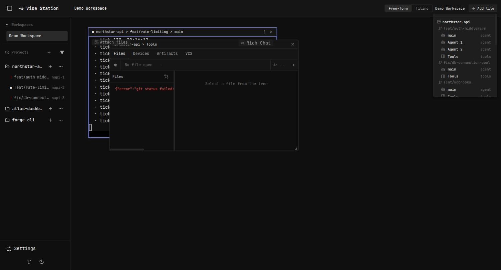
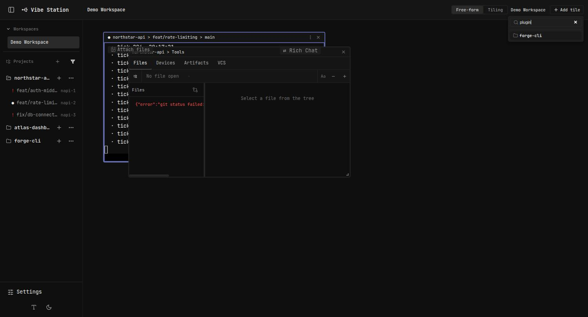
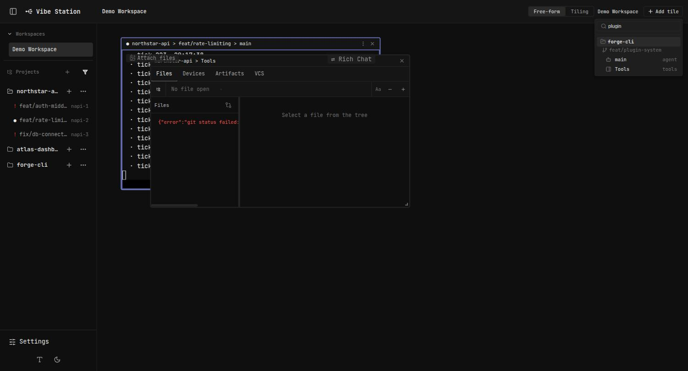

# Report: add-tile-picker-filters

Single-commit change to the saved-workspace "Add tile" picker's cross-project section
(`WorkspaceCanvas.tsx`). All checklist items complete — see
`plan-add-tile-picker-filters.md`.

## What changed

1. **Non-done filter.** The cross-project worktree list now hides worktrees whose agent
   sessions rolled up to `done`/`exited` — the same status rollup
   (`worktreeRolledUpStatus`) the dashboard uses for its "Finished" bucket. A worktree
   with no agent sessions at all (terminal-only) is still shown, matching the dashboard's
   own skip-vs-hide behavior.
2. **Search box.** A search input now sits at the top of the picker, filtering both the
   own-worktree agent/terminal list and the cross-project sections by session/worktree
   name, case-insensitive substring match.
3. **Collapsible projects.** Each project's cross-context section is now a disclosure
   (chevron via `Folder`/`FolderOpen` icon swap, same visual language as the left
   sidebar's project rows), expanded by default on every picker open.
4. **Sidebar-matching order.** Projects list in the same order as the left sidebar
   (`sortOrders["projects"]`), and worktrees within a project sort by the same
   `sortOrder` field the sidebar tree uses.

## Verification

- `npx tsc --noEmit` — clean.
- `npm run build` — clean (pre-existing chunk-size warnings only, unrelated).
- `npx eslint` on the changed file — same 2 pre-existing errors as `main` (confirmed via
  `git stash` diff), no new lint issues introduced.
- Manual verification in the dev sandbox (`scripts/dev-sandbox.sh up`, demo dataset: 3
  projects / 9 worktrees) via a saved workspace's "Add tile" picker — see screenshots
  below. `northstar-api`'s 4th worktree, `feat/webhooks`, is fully "done" (not shown in
  the sidebar tree either) and was visible in the picker before this change; after the
  change it's gone from the cross-project list.

## Post-PR review (opus subagent, `/code-review high`)

4 findings, all fixed in a follow-up commit:

1. `worktreeIsDone` didn't exclude archived (handed-off/reset) sessions before checking
   "no agents ⇒ not done," unlike the dashboard's own bucketing, which filters
   `s.archivedAt == null` first — could wrongly hide a worktree whose only agent session
   was archived. Fixed: same `archivedAt == null` filter added.
2. A manually-collapsed project section stayed collapsed even when a typed search query
   matched something inside it, hiding matches with no indication they existed. Fixed:
   an active search now forces every group open, overriding manual collapse state.
3. The own-worktree "New agent" and "Tools" picker entries weren't filtered by the
   search box, unlike every other row. Fixed: both now respect `matchesSearch`.
4. The expand-state was seeded once per picker-open from the live project list, so a
   project appearing while the picker was already open had no seeded id and rendered
   collapsed by default, inconsistent with the rest. Fixed: inverted the tracked state
   from "explicitly expanded ids" to "explicitly collapsed ids" (default = expanded,
   absence needs no seeding) — this also naturally satisfies fix #2's force-open case.

## Screenshots

**Before** — flat list, no search box, no collapse, includes the "done" `feat/webhooks`
worktree:

**After** — search box at top, done worktree filtered out, sections collapsible
(`forge-cli` shown collapsed via its `Folder` icon after a manual toggle in this
screenshot; all sections start expanded on open):

**After, search applied** — typing "plugin" filters down to the one matching worktree
under `forge-cli`:

