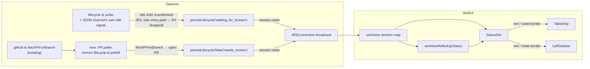

<!--
RULES — read before writing or implementing:
1. FORMAT: Bullets, tables, code, diagrams ONLY — no prose paragraphs
2. REQUIREMENTS: One crisp line each — no verbose descriptions
3. CHECKLIST: Mark items [x] as you complete them — this is your persistent todo list
4. READING TIME: Optimize for fast human scanning — if it's hard to skim, rewrite it
-->

# Plan: Interaction States (03, sub-feature of Agent Interaction State + Workspaces)

> Extend `LifecycleState` with `waiting_for_human` (JSON-channel human-gate tools + universal "idle after ever working" rule) and `needs_review` (daemon PR poller), and surface both through the existing rollup + `StatusDot` infrastructure. **Relocated verbatim from the root plan's former Phase 1 + Phase 1b + Phase 2** — no content changes, only extraction into its own sub-feature so it stops sharing a checklist with the unrelated Workspaces feature (see [`04-workspaces`](../04-workspaces/plan-04-agent-interaction-workspaces-workspaces.md)).

**Issue:** agent-interaction-workspaces / 03-interaction-states
**Branch:** `introducing-new-state` (current)
**Status:** WIP — daemon side (Phase 1, Phase 1b) not started; web-ui side (Phase 2) already exists as dev-simulation scaffolding, functionally inert until Phase 1/1b ship (see Phase 2 note)
**PRD:** `.vibekit/feature-plans/wip/agent-interaction-workspaces/prd-agent-interaction-workspaces.md` §1 (R1-R9)
**Spawned from:** root plan (restructure — see root plan's Revision note; this is a relocation of already-planned, not-yet-implemented work, not a new requirement)

**Reference files:**
- Data / schema: `daemon/src/types.ts:8` (`LifecycleState`) — confirmed current value: `"not_started" | "working" | "idle" | "done" | "exited"`, does **not** yet include `waiting_for_human`/`needs_review`.
- Core logic: `daemon/src/services/lifecycle.ts`, `daemon/src/services/jsonAgent.ts`, `daemon/src/services/github.ts`
- UI / entrypoint: `web-ui/src/lib/worktreeStatus.ts`, `web-ui/src/components/layout/StatusDot.tsx`, `web-ui/src/components/layout/LeftSidebar.tsx`
- Dev-only scaffolding (confirmed present, not real wiring): `web-ui/src/components/dev/DevStatePanel.tsx`, `web-ui/src/api/types.ts:66-77` (`SessionState` doc comment reads: "real daemon-side detection... is planned but not yet wired up... these values are only ever set by the dev-only state-simulation panel")
- Wiring: `daemon/src/ws/protocol.ts` (`SessionStateEvent`), `daemon/src/routes/worktrees.ts:1110-1127` (existing PR route)

---

## Problem

- See [prd-agent-interaction-workspaces.md](../prd-agent-interaction-workspaces.md) §Problem, §1 — no way to tell "idle" from "blocked on a human" or "PR ready for review" today.

## Out of Scope

- Any change to `--dangerously-skip-permissions` spawn behavior.
- Hook-based PR-creation fast-path (PRD Non-goals, Resolved Q2) — poll-based only this round.
- Everything Workspaces-shaped (canvas, tiling, tile chrome, direct-session borders, detachment, spawn affinity) — see [`04-workspaces`](../04-workspaces/plan-04-agent-interaction-workspaces-workspaces.md).

## Concept

- See [prd-agent-interaction-workspaces.md](../prd-agent-interaction-workspaces.md) §1 for full behavior + state machine + color mapping.
- **One shippable slice, not two: `waiting_for_human` is R3-only.** R2 (immediate JSON-channel tool_use detection) is **dropped entirely** — see Research §R2 dropped: empirical evidence below. Plus `needs_review` (PR poller, unaffected by this change).
- **R3 (idle after ever having worked) is the sole `waiting_for_human` entry path, for all four CLIs, with no exceptions.** This is a real simplification, not a workaround: R3 needed zero CLI-specific work to begin with (pane-output stability, channel-agnostic), so dropping R2 removes an entire axis of per-CLI complexity (the `HUMAN_GATE_TOOLS` map, the `toolName` threading through `updateTurnState`, the optional opencode hook) without losing any real coverage — see the empirical evidence below for why.

## Requirements

| # | PRD ID | Requirement |
|---|--------|-------------|
| 1 | R1 | `LifecycleState` gains `waiting_for_human` AND `needs_review`; every exhaustive switch/map over the type is updated (compiler-enforced). |
| 2 | ~~R2~~ | **DROPPED (see Research §R2 dropped).** Empirically, every headless invocation across all four CLIs (claude, cursor, opencode, agy) auto-skips/auto-rejects any human-gate tool and always terminates in a `result` event — so R3 always fires and R2 provides zero additional correctness value. For cursor specifically, implementing R2 as originally speced would be **actively wrong**: `askQuestionToolCall` only appears in the stream *after* the question has already been auto-rejected, so keying off it would flag a session as blocked when it's actually already unblocked and finishing. PRD R2 itself is stale pending an update to match (not edited here — PRD is a different file, flag for follow-up). |
| 3 | R3, R3a | A session that has reached `working` at least once transitions `idle → waiting_for_human` instead of staying `idle`; a session that never reached `working` stays `idle` as today. **This is now the ONLY `waiting_for_human` entry path — universal, no CLI ever needs anything more.** |
| 4 | R4 | A human response (new user turn) transitions `waiting_for_human` → `working` at the same point turns already do today. |
| 5 | R5 | `waiting_for_human`/`needs_review` are absorbed into `done`/`exited` like every other non-terminal state — no special-case guard needed, `persistLifecycleState` already treats those as unconditional terminal writes. |
| 6 | R6, R7 | A new daemon poller finds an open non-draft PR for a worktree's branch (via existing `fetchPrForBranch`) → `needs_review`; PR merged/closed/gone → exits back to `working`/`idle`. |
| 7 | R8 | `worktreeRolledUpStatus` ranks `waiting_for_human` above `needs_review` above `working`. |
| 8 | R9 | `StatusDot` renders distinct glyphs/colors for `waiting_for_human` (red) and `needs_review` (violet), delivered over the existing `session:state` broadcast. |

---

## Research

> Relocated verbatim from root plan's Research section (Lifecycle/JSON/PR/rollup/protocol subsections only) — no re-derivation.

### Lifecycle state today
- **File:** `daemon/src/types.ts:8` — `LifecycleState = "not_started" | "working" | "idle" | "done" | "exited"`.
- **File:** `daemon/src/services/lifecycle.ts:72-97` — `persistLifecycleState()` broadcasts `session:state` + single-row DB update; unchanged signature, only the `newState` value set grows.
- **File:** `daemon/src/services/lifecycle.ts:118-121` — JSON-channel sessions are skipped by the tmux-hash poller; their lifecycle is driven by `JsonAgentSession` itself.
- **File:** `daemon/src/services/lifecycle.ts:163-164, 216-217` — this is exactly the "idle" transition point R3 hooks into: instead of unconditionally flipping to `"idle"`, check whether the session has ever reached `"working"` and flip to `"waiting_for_human"` instead.

### JSON channel turn/tool events
- **File:** `daemon/src/services/jsonAgent.ts:986-1004` — `updateTurnState(kind)` maps `NormalizedEventKind` → `TurnState`; `tool_use` currently always maps to `"tool"` with no distinction by tool name.
- **File:** `daemon/src/services/jsonAgent.ts:776-782` — `persistLifecycle(state: LifecycleState)`, the JSON-channel's own lifecycle setter — call site to extend for R2.
- **File:** `daemon/src/services/jsonAgentChat.ts:264` — lifecycle set to `"working"` on new-turn start; natural exit point back from `waiting_for_human`.

### Per-CLI human-gate capability (resolves Risk #1 — researched, not assumed)

- All four plugins return `supportsJson(): true` (`claude.ts:461`, `cursor.ts:314`, `opencode.ts:273`, `agy.ts:405`) — so R2's mechanism is *reachable* from all four and had to be answered per CLI, not for Claude alone.
- **`toolName` is 100% plugin-defined** — each plugin's own line-parser decides the string; there is no shared normalization table. The four derivations:

| CLI | Where `toolName` is set | Derivation |
|-----|------------------------|------------|
| claude | `daemon/src/agent-plugins/claude.ts:92-100` | `toolName: block.name` — Anthropic tool names passed through **verbatim** (`Bash`, `Read`, `AskUserQuestion`, …) |
| cursor | `daemon/src/agent-plugins/cursor.ts:119-137` | `keys.find((k) => k.endsWith("ToolCall")) ?? keys[0]` — the **proto payload key**, e.g. `shellToolCall`, `readToolCall` (asserted in `daemon/src/__tests__/jsonPlugins.test.ts:54,156`). Second, rarer path at `cursor.ts:93-101` uses `block.name` (never observed live). |
| opencode | `daemon/src/agent-plugins/opencode.ts:136-157` | `toolName: part.tool` — opencode's own lowercase tool ids (`bash`, `read`, `edit`, `webfetch`, `todowrite`, `task`, …; test asserts `"bash"` at `jsonPlugins.test.ts:218`) |
| agy | `daemon/src/agent-plugins/agy.ts:90-166` | **none — `parseAgyResultLine` never emits a `tool_use` event at all.** Plugin doc comment `agy.ts:44-46`: *"Unlike claude/cursor/opencode, agy does NOT stream per-event NDJSON — there are no live thinking/tool_use/tool_result events in print JSON."* |

**Per-CLI capability table (R2 answer):**

| CLI | JSON channel | Human-gate tool exists? | Real normalized `toolName` | R2 mechanism | Confidence |
|-----|--------------|-------------------------|----------------------------|--------------|------------|
| **claude** | ✅ `supportsJson` (`claude.ts:461`) | ✅ ask + plan-exit | `AskUserQuestion`, `ExitPlanMode` | **(a)** `HUMAN_GATE_TOOLS.claude` toolName set | **High** — both strings present in the shipped `claude` binary (v2.1.229); `block.name` is passed through unmodified |
| **cursor** | ✅ (`cursor.ts:314`) | ✅ ask + plan-approval | `askQuestionToolCall`, `createPlanToolCall` | **(a)** `HUMAN_GATE_TOOLS.cursor` toolName set | **Medium** — key names extracted from the shipped `cursor-agent` bundle (`2026.07.16-899851b`, `189.index.js`/`1931.index.js`): `askQuestionToolCall` carries `{title, questions}` and maps to display tool `askQuestion`; `createPlanToolCall` renders `pending/accepted/rejected` (a plan-approval gate). **Not live-verified** that headless `cursor-agent -p … --output-format stream-json -f` (`cursor.ts:340`) still emits them rather than auto-answering under `-f` |
| **opencode** | ✅ (`opencode.ts:273`) | ❌ no such tool | n/a — tool surface is `bash/read/edit/write/grep/glob/list/patch/todowrite/todoread/webfetch/task`; "plan" is an **agent**, switched by the user, not a tool call | **(b)** new `permission.ask` plugin hook — see Phase 1c; **(c)** R3-only if 1c is skipped | **Medium** — tool ids read from the shipped `opencode` 1.18.12 binary; hook surface verified in `@opencode-ai/plugin@1.4.3` `dist/index.d.ts` |
| **agy** | ✅ (`agy.ts:405`) | Irrelevant — signal cannot reach us | n/a — **zero `tool_use` events emitted** (`agy.ts:44-46`, `parseAgyResultLine`) | **(c)** N/A — `waiting_for_human` via R3 only | **High** on the negative (structural: one final envelope at `agy.ts:435-440`); **Low** on any workaround |

- **opencode's real hook surface** (`~/.config/opencode/node_modules/@opencode-ai/plugin/dist/index.d.ts`, v1.4.3) — the plugin `Hooks` interface includes a genuine blocked-on-human hook:
  ```ts
  "permission.ask"?: (input: Permission, output: { status: "ask" | "deny" | "allow" }) => Promise<void>;
  ```
  plus SDK events `EventPermissionUpdated { type: "permission.updated" }` / `EventPermissionReplied { type: "permission.replied" }` and `EventSessionIdle` (`@opencode-ai/sdk/dist/gen/types.gen.d.ts:384-418`). The daemon **already ships an opencode plugin file** (`opencode.ts:360-390` writes `.opencode/plugins/vst-recorder.ts` with a `session.created` handler), so adding a `permission.ask` handler is a same-file, same-pattern extension — this is why opencode is (b) and not (c).
- **claude's hook surface** — `setupWorkspaceHooks` (`claude.ts:291-443`) already merges `SessionStart` + `UserPromptSubmit` command hooks into `.claude/settings.json`. The binary also exposes `Notification`, `PreToolUse`, `PostToolUse`, `Stop`, `SubagentStop`, `PreCompact`, `SessionEnd` (verified via `strings` on the shipped `claude` 2.1.229). A `PreToolUse` matcher on `AskUserQuestion|ExitPlanMode` would be *possible* but is **strictly worse than (a)**: same event, extra file, extra process spawn, and it does not work on the JSON channel headless path that R2 targets.
- **cursor's hook surface** — `setupWorkspaceHooks` (`cursor.ts:394-469`) writes only a `.cursor/commands/vst.md` slash command; no hook/plugin event API was found. (a) is the only option for cursor.
- **agy's hook surface** — plugin has **no `setupWorkspaceHooks` at all** (`agy.ts:299-511`). The binary does contain a JSON-hook subsystem (`jsonhook.JSONHookSpec`, `GetJSONHookPaths`, `enableJsonHooks`, and the strings `PreToolUse`/`PostToolUse`/`SessionStart`) and supports `--mode plan` + `--output-format stream-json` per `agy --help`. **Explicitly low confidence:** agy is a ~199 MB stripped Go binary with no public hook docs; none of this was live-verified, and the plugin would need a `setupWorkspaceHooks` built from scratch. Not planned. A cheaper future route, if agy ever needs R2, is migrating `agy.ts:435-440` from `--output-format json` to `stream-json` (the binary carries `tool_use` type strings) — out of scope here.
- **Bottom line on "do we need hooks?"** — no, not to ship R2. claude + cursor are covered by per-CLI `toolName` sets (zero new CLI-side machinery); agy is structurally out of R2 and gets `waiting_for_human` from R3, which is CLI-agnostic (pane-output stability, `lifecycle.ts:163-164, 216-217`); opencode is the **only** CLI where a hook buys anything, and it's an optional enhancement (Phase 1c), not a prerequisite.

### R2 dropped: empirical evidence (supersedes the table above — kept for its per-CLI toolName research value, but its "R2 mechanism" column no longer reflects the decision)

All four CLIs were **actually invoked** headless (exactly as this daemon spawns them) with prompts engineered to trigger their respective human-gate tool, and the raw stream-json output captured:

- **claude**: `AskUserQuestion`/`ExitPlanMode` **do not appear in the tool list the headless CLI reports at all** (`system/init`'s 30-tool list has neither). The model notices mid-turn — *"there is no such tool called 'AskUserQuestion' in my toolset"* — and answers in prose instead. Every run ends in a normal `result` event. R2's claude tool names are unreachable dead code in this daemon's actual invocation shape.
- **cursor**: `askQuestionToolCall` genuinely fires — but headless mode (`-f`) auto-rejects the question ~1.5s **before** the `tool_call started` event is even emitted (`{"type":"interaction_query","subtype":"response",...,"result":{"rejected":{"reason":"Questions skipped by the user, continue with the information you already have"}}}`). By the time `askQuestionToolCall` appears in the stream, the block is already over. Detecting it would be a false positive, not just redundant.
- **opencode**: no ask/plan-exit tool exists, confirmed again live. Separately: any permission request in headless `run` mode is **auto-rejected regardless of the `--auto` flag** (`! permission requested: external_directory (/tmp/*); auto-rejecting`) — so the `permission.ask` hook considered for Phase 1c would fire on an already-decided outcome, exactly like cursor's tool. Phase 1c has no value.
- **agy**: correction to the original per-CLI table — it *does* have `ask_question`/`ask_permission` tools (`init.tools` lists them), and *does* emit tool step events, but only under `--output-format stream-json`, which this daemon doesn't use (`agy.ts:436-440` uses plain `json`). Even under `stream-json`, a question is auto-skipped and surfaces as an anonymous `"step_type":"unknown"` event with **no `tool_name` at all** — nothing to key detection on regardless. A hard 5-minute `--print-timeout` ceiling exists independent of any of this.

**Every headless invocation, across all four CLIs, terminates in a `result` event.** The failure mode R2 was built to catch — a pending human-gate `tool_use` that never gets a `result`, so R3's idle trigger never fires — does not occur in practice for any of them. R3 alone catches every real case, with equal reliability to R2 and, for cursor, *better* correctness (no false-positive window).

**Decision (supersedes Decision 1/1b below, kept for their research value but no longer the operative plan): drop R2 and Phase 1c entirely. Ship R3 only.**

### R3's "ever worked" tracking
- No existing field tracks "has this session ever reached working" — `SessionLifecycle` (`types.ts:10-14`) only holds the *current* state + `lastTransitionAt`. Needs a new boolean, either persisted (`SessionLifecycle.everWorked?: boolean`) or derived in-memory in the poller's `idleTracking` map (`lifecycle.ts:36`) — **in-memory is simpler and sufficient**: it only needs to survive for the life of one idle-tracking entry, and a daemon restart naturally resets to "unknown" which is safe (worst case: one session briefly doesn't get the R3 upgrade until its next working→idle cycle).

### PR detection (existing, reused for `needs_review`)
- **File:** `daemon/src/services/github.ts:17-23` — `PrInfo { number, state: "open"|"closed", merged: boolean, draft: boolean, ... }`.
- **File:** `daemon/src/services/github.ts:77-95` — `fetchPrForBranch(owner, repo, branch)`, direct GitHub REST API (not `gh` CLI), 30s module-level cache.
- **File:** `daemon/src/services/github.ts:28-45` — `getRemoteUrl`/`parseGithubRepo` — github.com only, resolves owner/repo from the worktree's git remote.
- **File:** `daemon/src/routes/worktrees.ts:1110-1127` — existing `GET /worktrees/:id/pr` route, pull-only, consumed by `web-ui/src/components/tools/VcsPanel.tsx:78-131` on mount + manual refresh; **no poller, no push today** — this is the gap `needs_review` fills.
- **Risk:** MEDIUM — unauthenticated GitHub API is 60 req/hr per IP; a poller across many worktrees will exhaust that fast without `GITHUB_TOKEN`/`GH_TOKEN` configured. Not a blocker for the POC (mocked), but the real implementer must account for it (see Risks table).

### Worktree rollup + status UI
- **File:** `web-ui/src/lib/worktreeStatus.ts:3-18` — `WorktreeRolledUpStatus` union + `rank` map; `waiting_for_human` and `needs_review` both slot in above `working`, with `waiting_for_human` highest. **Note (confirmed at restructure time):** the live file today already has `waiting_for_human`/`needs_review` in the `WorktreeRolledUpStatus` type/rank map — that's the *client-side display* type used by both Interaction States (this plan) and Workspaces (see `04-workspaces`), which the shipped `WorkspaceCanvas`/`AgentPaneSlot` chrome (04) already consumes for tile coloring. This plan's R1 is about the **daemon's** `LifecycleState` (`daemon/src/types.ts:8`), which is a separate, still-unwidened type — confirmed absent of `waiting_for_human`/`needs_review` as of this restructure. The client type existing ahead of the daemon type is not a contradiction: the client union was sized for the full color-mapping design up front; nothing upstream (daemon) emits those values yet, so `worktreeRolledUpStatus`'s per-session mapping for them is presently unreachable dead code until this plan's Phase 1/1b ship.
- **File:** `web-ui/src/components/layout/StatusDot.tsx:3-10` — `GLYPH` record keyed by `WorktreeRolledUpStatus`; add both new entries + CSS classes in `web-ui/src/styles/workspace.css` (existing `.status-dot--*` convention starts at `workspace.css:2000`).
- **File:** `web-ui/src/components/layout/LeftSidebar.tsx:141` — `sessionStateToStatus()` maps raw `SessionState` → `WorktreeRolledUpStatus`; add both passthrough cases.

### Protocol
- **File:** `daemon/src/ws/protocol.ts:227-233` — `SessionStateEvent` carries `{ sessionId, state }`; **`state`'s type is NOT derived from `LifecycleState`** — it's a hardcoded literal zod enum, duplicated three times: `:209` (a session-list-snapshot schema's `state`), `:210` (`lifecycleState` on the same schema), `:230` (`SessionStateEvent.state` itself), each `z.enum(["not_started", "working", "idle", "done", "exited"])`. Widening `daemon/src/types.ts:8`'s `LifecycleState` union does **not** widen these — TypeScript exhaustiveness checks don't cover zod value-literal enums, so this is a real, separate edit, not a corollary of R1's "compiler-enforced" safety net. All three must be updated or the daemon will emit states its own protocol schema rejects.

---

## Architecture Diagram



### Lifecycle state machine (R2 dropped — R3 is the sole `waiting_for_human` entry path, all CLIs)

```mermaid
stateDiagram-v2
    direction LR
    [*] --> not_started
    not_started --> working: first turn / first pane output

    working --> idle: R3a — output stable, never worked
    working --> waiting_for_human: R3 · UNIVERSAL, ALL CLIs
    idle --> waiting_for_human: R3 · UNIVERSAL, ALL CLIs
    waiting_for_human --> working: R4 — new user turn

    working --> needs_review: R6 · UNIVERSAL (PR poller)
    idle --> needs_review: R6 · UNIVERSAL (PR poller)
    needs_review --> working: R6 — PR merged/closed
    needs_review --> idle: R6 — PR merged/closed

    working --> done: turn/session complete
    idle --> done
    waiting_for_human --> done
    needs_review --> done
    working --> exited: process death (markSessionExited)
    idle --> exited
    waiting_for_human --> exited
    needs_review --> exited
    done --> [*]
    exited --> [*]

    note right of waiting_for_human
      LEGEND — entry paths (post R2-drop)
      R3 UNIVERSAL (any CLI, any channel, no exceptions):
        idle-after-ever-working, from pane-output stability
        (TTY: lifecycle.ts poller hash-stability; JSON: same
         rule applied to the channel's own idle/turn-end signal)
        -> the ONLY waiting_for_human path for claude, cursor,
           opencode, AND agy. R2 (tool_use toolName detection)
           was evaluated and dropped — every headless CLI
           invocation auto-resolves its own human-gate tool and
           always emits a terminating event, so R3 always fires
           and a separate immediate-detection path adds no real
           coverage (and for cursor, would have produced a false
           positive). See Research §R2 dropped for the evidence.
      R6 UNIVERSAL: PR poller, CLI-independent by construction
    end note
```



---

## Design Details

### System Boundaries

| Boundary | Fields + types | Errors | Source of truth |
|----------|----------------|--------|-----------------|
| Daemon ↔ Web-UI (WS) | `SessionStateEvent { sessionId: string, state: LifecycleState }` — `LifecycleState` widened to include `"waiting_for_human"` \| `"needs_review"` | none new (existing WS error handling unchanged) | Daemon (`JsonAgentSession.persistLifecycle`, `lifecycle.ts` poller, new PR poller) |
| Module ↔ Module (in-process, daemon) | `JsonAgentSession.updateTurnState(kind, toolName?)` → may call `persistLifecycle("waiting_for_human")` | n/a | `JsonAgentSession` owns its own lifecycle field |
| Module ↔ Module (in-process, daemon) | new `prPoller.ts`: `pollAllPrs(): Promise<void>` reads `getAllProjects()`, calls `fetchPrForBranch` per worktree, calls `persistLifecycleState(..., "needs_review" \| fallback)` | n/a | `github.ts` remains the sole PR-truth source; poller only reacts to it |

### Critical User Journeys (CUJs)

#### CUJ 1 — Agent asks a question via Rich Chat (happy path, R2)
```
User is running an agent on the JSON channel
  → Agent calls AskUserQuestion tool
  → JsonAgentSession sees tool_use with toolName in human-gate set
  → persistLifecycle("waiting_for_human") fires immediately (not at turn end)
  → session:state broadcast → StatusDot/TabsStrip/LeftSidebar flip to red
  → User answers the question (sends next turn)
  → persistLifecycle("working") fires on turn start (existing code path, jsonAgentChat.ts:264)
  → border returns to blue/working
```
- **Edge case:** agent exits/crashes while `waiting_for_human` — existing exit-detection path (`markSessionExited`) still fires and overrides to `exited`.
- **Edge case:** two human-gate tool_use events back-to-back before a response — state stays `waiting_for_human` (idempotent set).

#### CUJ 2 — TTY session goes idle after working (happy path, R3)
```
Agent (any channel) is "working"
  → Output stabilizes for IDLE_THRESHOLD_MS
  → lifecycle.ts poller checks: has this session's idleTracking entry ever seen "working"? Yes.
  → persistLifecycleState(..., "waiting_for_human") instead of "idle"
  → border flips to red
  → User sends new input → pane output changes → poller flips back to "working"
```
- **Edge case:** a session's very first idle (never reached working, R3a) — stays `"idle"`, gray, as today.
- **Edge case:** JSON-channel sessions are skipped by this poller entirely (lifecycle.ts:118-121 unchanged) — R3 for JSON channel is instead the natural consequence of R2 plus JSON's own turn-result → `working`→`idle` path in `jsonAgent.ts`; **verify during Phase 1 whether JSON-channel idle needs its own "everWorked" check or whether R2 already covers the realistic cases** (open risk, see Risks table).

#### CUJ 3 — PR opened while agent is idle (happy path, R6)
```
Agent finishes work, session goes "idle"
  → Human (or the agent via `gh pr create` in a terminal) opens a PR
  → New PR poller's next tick calls fetchPrForBranch for this worktree
  → PrInfo.state === "open" && !draft
  → persistLifecycleState(..., "needs_review")
  → border flips to violet
  → PR is merged
  → Next poll tick: fetchPrForBranch returns merged: true (or no longer "open")
  → persistLifecycleState(..., "idle") — lands back on idle/working per current activity
```
- **Edge case:** no `GITHUB_TOKEN` configured — `fetchPrForBranch` still works but rate-limits fast across many worktrees; poller should log once, not spam (see Risks).
- **Edge case:** non-GitHub remote (`parseGithubRepo` returns null) — poller skips that worktree silently, same as the existing route's behavior.

### Data Model

- No persisted schema change beyond the existing `lifecycle.state` column already storing a string enum — `waiting_for_human`/`needs_review` are new valid values, no migration needed unless a CHECK constraint exists (confirm via `daemon/src/state/project-store.ts` before implementing).
- New **in-memory-only** tracking: `everWorked: Set<sessionId>` (or a boolean on the existing `idleTracking` entry, `lifecycle.ts:35-36`) — not persisted, reset on daemon restart (acceptable per Research above).

### API Contracts

- `SessionStateEvent` (`daemon/src/ws/protocol.ts:227-233`) — existing contract, only its `state` field's value set grows. No request/response shape change — but the zod schema backing that value set is 3 separate hardcoded enums (`:209,210,230`), each needing its own edit (1.7); this is a schema-widening change, not a free consequence of widening the TS type.
- `GET /worktrees/:id/pr` (`daemon/src/routes/worktrees.ts:1110-1127`) — existing contract, unchanged; the new poller calls the same underlying `fetchPrForBranch` service function directly (not the HTTP route) to avoid a daemon-internal HTTP round-trip.

### Key Decisions

#### Decision 0: R2 dropped entirely; R3 is the sole `waiting_for_human` entry path (supersedes Decisions 1 and 1b below)
- **Decision:** do not implement R2 (per-CLI `tool_use` toolName detection) or Phase 1c (opencode's `permission.ask` hook) at all. `waiting_for_human` is reached exclusively via R3.
- **Rationale:** empirical evidence (Research §R2 dropped) — every headless invocation of all 4 CLIs auto-resolves its own human-gate tool and always emits a terminating event, so R3's idle-after-working rule always fires; R2 would add zero additional correctness coverage, extra per-CLI maintenance surface (`HUMAN_GATE_TOOLS`, `toolName` threading through `updateTurnState`), and for cursor specifically would be actively wrong (flags an already-resolved session as still blocked).
- **Where:** this removes the need for `jsonAgent.ts:986`/`:954` changes (Decision 1's snippet, kept below for historical/research value only) and the entire opencode Phase 1c. The only daemon changes that remain are `types.ts` (R1, widen the enum), `lifecycle.ts` (R3's `everWorked` flag, Decision 2), `protocol.ts` (widen the 3 hardcoded enums), and the new PR poller (R6/R7, Decision 3/3b) — a materially smaller Phase 1 than originally speced.
- **Follow-up (not done here):** the PRD's own R2 wording (`prd-agent-interaction-workspaces.md`) still describes R2 as a real CLI-dependent mechanism — it should be updated to reflect this drop. Flagged for a separate PRD edit, out of scope for this plan-only pass.

#### Decision 1 (historical — research value only, no longer implemented): Human-gate tool set is a hardcoded allowlist — **keyed per CLI, not one flat global set**
- **Decision:** `waiting_for_human` (R2 path) triggers only on `tool_use` events whose `toolName` exactly matches the allowlist **for that session's CLI**. Tool names do not overlap across CLIs (see Research: Per-CLI human-gate capability), so a flat global set would be a name-collision hazard for zero benefit.
- **Rationale:** deterministic, no false positives; matches PRD R2's "immediate, authoritative" requirement. Per-CLI keying also makes the "this CLI has no R2 signal" cases (`opencode`, `agy`) explicit and self-documenting in code rather than silently absent.
- **Lookup key:** the plugin's own `name` (`AgentPlugin.name`, `spawn.ts:95` — `"claude" | "cursor" | "opencode" | "agy"`), which equals the `provider` stamped on every `NormalizedEvent` by each plugin's event factory (`claude.ts:36`, `cursor.ts:40`, `opencode.ts:46`, `agy.ts:76`) — so the CLI is already available on the event itself; no new plumbing.
- **Where:** `daemon/src/services/jsonAgent.ts:986` (`updateTurnState`) — add a branch checking `toolName` before falling through to the existing `"tool"` turn-state case.

```ts
// Per-CLI, NOT one flat Set. Empty set = "this CLI has no R2 signal; R3 only".
const HUMAN_GATE_TOOLS: Record<string, ReadonlySet<string>> = {
  // claude.ts:92-100 passes Anthropic tool names through verbatim.
  claude: new Set(["AskUserQuestion", "ExitPlanMode"]),
  // cursor.ts:127 uses the proto payload key (`<name>ToolCall`), NOT a display name.
  cursor: new Set(["askQuestionToolCall", "createPlanToolCall"]),
  // opencode has no ask/plan-exit tool (opencode.ts:140 -> part.tool, lowercase ids).
  // Populate only if Phase 1c's permission.ask hook ships — and that hook signals
  // out-of-band, so it likely never populates this map at all.
  opencode: new Set<string>(),
  // agy emits NO tool_use events whatsoever (agy.ts:44-46) — unreachable by design.
  agy: new Set<string>(),
};

// updateTurnState is `private updateTurnState(kind: NormalizedEventKind): void`
// (jsonAgent.ts:986), called only from jsonAgent.ts:954 as
// `this.updateTurnState(ev.kind)`. Both the signature and the call site must
// change together — toolName isn't in scope today.
//
//   private updateTurnState(kind: NormalizedEventKind, toolName?: string): void {
//     ...
//       case "tool_use":
//         if (toolName && HUMAN_GATE_TOOLS[this.pluginName]?.has(toolName)) {
//           void this.persistLifecycle("waiting_for_human"); // fire-and-forget, see below
//         }
//         this.setTurnState("tool");
//         break;
//     ...
//   }
//
// Call site (jsonAgent.ts:954):
//   this.updateTurnState(ev.kind, ev.toolName);
// (`this.pluginName` — resolve from the session's plugin/mode, or read `ev.provider`,
//  which every plugin stamps on every event; pick whichever is already in scope at :954.)
```

#### Decision 1b (historical — superseded by Decision 0, R2 dropped entirely rather than "shipped without hooks"): No new CLI hook is required to ship R2
- **Decision:** ship R2 with per-CLI `toolName` sets only. No hook work for claude (already has `setupWorkspaceHooks`, `claude.ts:291-443`, but a `PreToolUse` hook would be strictly worse — same signal, extra process, and inert on the headless JSON path R2 targets), none for cursor (no hook API found, `cursor.ts:394-469` is slash-command only), none for agy (no `setupWorkspaceHooks`; JSON channel emits no tool events at all).
- **Rationale:** every CLI reaches `waiting_for_human` today — via R2 (claude, cursor) or via R3, which is universal and needs zero per-CLI work. A CLI with no R2 signal is a *legitimate outcome*, not a gap.
- **Exception:** opencode is the one CLI with a real, strictly-better hook available (`permission.ask`) and an existing plugin file to hang it on — captured as **optional Phase 1c**, sequenced after Phase 1 and not blocking it.

#### Decision 2: R3's "idle after ever working" replaces the v1 TTY text heuristic entirely
- **Decision:** the poller's `idle` transition (`lifecycle.ts:163-164` and `:216-217`) checks an in-memory "has this session ever been working" flag; if true, persist `waiting_for_human` instead of `idle`.
- **Rationale:** deterministic, zero content inspection, applies uniformly — the user's own framing ("whenever it's idle after it got to working at least once") is simpler and more robust than the v1 approach of pattern-matching pane text for question-shaped prompts.
- **Where:** `daemon/src/services/lifecycle.ts:163-164, 216-217` (both the direct-pty and tmux idle-transition sites) — read/set the new `everWorked` flag alongside the existing `idleTracking` map entry (`lifecycle.ts:35-36`).

#### Decision 3: `needs_review` is poll-based, reusing `github.ts`, not a per-CLI hook
- **Decision:** a new poller (shape mirrors `lifecycle.ts`'s `pollAll`/`startLifecyclePoller`) calls `fetchPrForBranch` per worktree on an interval and calls `persistLifecycleState(..., "needs_review")` on open-PR, `"working"/"idle"` on merge/close.
- **Rationale:** the detection service already exists and is CLI-independent; only polling can also observe the *exit* condition (PR merged/closed) or catch a human/web-created PR — a hook-based fast path would need per-CLI implementations (Claude Code only proven today) and would still require the poller for the exit edge, making it pure duplication for entry alone. See PRD Resolved Q2/Q3.
- **Where:** new file `daemon/src/services/prPoller.ts`, started alongside `startLifecyclePoller()` (likely from the same daemon bootstrap site — locate via `grep -rn startLifecyclePoller daemon/src` during Phase 1, not yet located).

#### Decision 3b: `PR_POLL_INTERVAL_MS = 60_000` (60s), not left as a vague "on an interval"
- **Decision:** the poller ticks once every **60 seconds** across all worktrees (one `pollAllPrs()` sweep per tick, mirroring `lifecycle.ts`'s single-tick-covers-everything shape — NOT one `setInterval` per worktree). This was previously undecided — the PRD's "~60-120s" (`prd-…:202`) was only ever a rough tradeoff estimate in an options table, never an actual constant; this decision pins it down.
- **Rationale:**
  - **Floor:** must be `>= github.ts`'s own `CACHE_TTL_MS = 30_000` (`github.ts:67`) — polling faster than the cache's own TTL wastes ticks re-reading a cached value with no new GitHub API call, so anything under 30s is pure churn.
  - **Ceiling:** GitHub's unauthenticated rate limit is 60 req/hr (`github.ts` module header) — at N worktrees polled every tick, sustainable request rate is `N req / interval`. At 60s, N worktrees costs `N * 60 req/hr` — **already at the unauthenticated ceiling with just 1 worktree** polled continuously, before any other daemon traffic. This is exactly why 1b.4 requires the `GITHUB_TOKEN`/`GH_TOKEN` warning (Risk #4) — 60s is only sustainable multi-worktree with a token (5000 req/hr authenticated, i.e. up to ~83 worktrees polled every 60s before hitting the ceiling).
  - **Latency:** 60s matches the low end of the PRD's original estimate and the existing lifecycle poller's philosophy (fast enough to feel "live," not so fast it's wasteful) — a human going to check on a PR review request has no expectation of sub-minute notification the way `waiting_for_human` (R2/R3, seconds-scale) does; PR review is inherently a slower-paced signal.
  - Not made configurable this round — a fixed constant, like `lifecycle.ts`'s `POLL_INTERVAL_MS = 1000` (`lifecycle.ts:27`), is simpler and matches the existing poller's own precedent; revisit only if real usage shows the rate-limit ceiling is actually being hit (ties into the existing Resolved Q re: hook fast-path, PRD:365).
- **Where:** `daemon/src/services/prPoller.ts`, a new `export const PR_POLL_INTERVAL_MS = 60_000;` constant analogous to `lifecycle.ts:27`'s `POLL_INTERVAL_MS`, consumed by `startPrPoller()`'s `setInterval` call.

---

## Risks / Open Questions

| # | Question | Notes |
|---|----------|-------|
| 1 | ~~**Exact normalized `toolName` for AskUserQuestion/ExitPlanMode across CLIs?**~~ **RESOLVED, then SUPERSEDED** | Answered per CLI against real plugin code + shipped CLI binaries (Research §Per-CLI human-gate capability), then the whole R2 mechanism this risk was about was **dropped** after live-testing all 4 CLIs (Research §R2 dropped) — see Decision 0. No longer applicable; R3 is the sole entry path. |
| 2 | **Does the `lifecycle.state` DB column have a CHECK constraint?** | If yes, needs a migration in `daemon/src/state/project-store.ts`; if free-text, no migration needed. |
| 3 | **Does JSON-channel idle need its own R3 "everWorked" check, separate from the tmux poller's?** | `lifecycle.ts` skips JSON-channel sessions entirely (`:118-121`); JSON's own idle transition lives in `jsonAgent.ts`/`jsonAgentChat.ts` and isn't researched at the line level here — a Phase-1 implementer must locate JSON's own working→idle transition and apply the same "everWorked" rule there, or confirm R2 already covers it in practice. |
| 4 | **GitHub API rate limit (60 req/hr unauthenticated) vs. poller frequency × worktree count.** | Needs a `GITHUB_TOKEN` check + backoff/skip-and-warn when unauthenticated and worktree count is high; not modeled in the POC (PRD open question). |
| 5 | **Where does `startLifecyclePoller()` get called from daemon bootstrap?** | Not yet located — needed to know where to start the new PR poller alongside it. |
| 6 | ~~**Does cursor's headless JSON path actually emit `askQuestionToolCall`/`createPlanToolCall`?**~~ **RESOLVED, negative** | Live-tested: it fires, but *after* the question is already auto-rejected (`-f` resolves it ~1.5s before `tool_call started`). Confirms R2 would be actively wrong for cursor, not just unverified — see Research §R2 dropped. |
| 7 | ~~**Does `opencode run` (headless) even fire `permission.ask`?**~~ **RESOLVED, negative** | Live-tested: permission requests are auto-rejected in headless `run` mode regardless of `--auto`. Phase 1c dropped — see Decision 0. |

---

## Implementation Phases

### Phase 1 — Daemon: `waiting_for_human` (R3 only — R2 and Phase 1c dropped, see Decision 0)

- [x] **1.1** Add `"waiting_for_human"` and `"needs_review"` to `LifecycleState` in `daemon/src/types.ts:8` (both added together since every exhaustiveness check needs updating once regardless).
- [x] **1.5** Add an in-memory `everWorked` flag to the `idleTracking` entry shape (`lifecycle.ts`), seeded `true` unconditionally the moment the poller starts tracking any session; in both idle-transition sites (tmux and direct-pty branches) persist `"waiting_for_human"` instead of `"idle"` once idle-stable. Also apply the same rule to the **JSON channel** — `drain()`'s `finally` block (`jsonAgent.ts`) now ALWAYS persists `"waiting_for_human"` on queue-drain, since R2 is dropped and R3 is the JSON channel's only path to `waiting_for_human` too. **Revision note (post-empirical-testing):** the flag was originally seeded `false`-until-first-observed-resume (matching a stricter reading of R3a), then briefly refined to "true only after an OBSERVED hash change" to guard a hypothetical blank-session false-positive — **both were empirically wrong**, live-verified against the real docker daemon: a fast-completing turn's whole response prints and stabilizes between two 1s poll ticks, so no hash delta is ever observed and the stricter rules left sessions stuck at `"idle"` forever, never reaching `"waiting_for_human"`. Final rule: `everWorked` seeds `true` unconditionally, because a session only reaches this poller's tracking code after `"not_started"` is filtered out and its ready signal has already printed visible content — "genuinely blank, nothing has happened yet" is structurally unachievable here, so R3a's carve-out has no live manifestation on this poller. The JSON channel's `everWorked` field was removed entirely (not just seeded true) since reaching `drain()`'s finally block always means a real turn was processed.
- [x] **1.6** Check `daemon/src/state/project-store.ts` for a CHECK constraint on `lifecycle.state`; add migration only if one exists. **Confirmed no constraint** — the `sessions` table's `state TEXT NOT NULL` column (`daemon/src/services/dbSchema.ts:65`, the actual schema-defining file — `project-store.ts` itself has no `CREATE TABLE`) has no `CHECK`, unlike sibling columns (`type`, `nameSource`) that do. No migration needed.
- [x] **1.7** Widen all three hardcoded `z.enum([...])` state lists in `daemon/src/ws/protocol.ts:209,210,230` to include `"waiting_for_human"`, `"needs_review"` — NOT covered by widening the `LifecycleState` TS type alone (see Research: WS protocol).

**Verify phase 1:**
- [x] **1.T3** Unit — `lifecycle.test.ts`: a session that reaches `"working"` then goes idle-stable transitions to `"waiting_for_human"`, INCLUDING on its first-ever idle-stable tick (R3a's "never worked" carve-out is structurally vacuous on this poller — see 1.5's revision note). Cover BOTH the TTY poller path (`lifecycle.ts`) and the JSON-channel path (`jsonAgent.ts`). **Implemented as (final revision):** TTY-path tests in `lifecycle.test.ts` re-verified against the final unconditional-`everWorked` semantic — first-ever idle-stable tick now asserts `"waiting_for_human"` (not `"idle"`), a resume-then-idle-again cycle asserts `"waiting_for_human"` again, and R4 (`waiting_for_human`→`working` on pane change) is unaffected. JSON-channel test in `jsonAgent.test.ts` renamed to assert `"waiting_for_human"` on EVERY drain, including the first.
- [x] **1.T4** Regression — existing `jsonChannelToggle.test.ts` and `lifecycle.test.ts` assertions (`"working"`/`"exited"`, and non-R3 `"idle"` cases like `clearIdleTracking` teardown avoiding a flip and the R3a-truly-vacuous `stableSince`-reset tests) still pass. Full daemon suite (`cd cli && npx vitest run src/daemon`) re-run after the final semantic revert: **610/610 tests pass**, 59 files.
- [x] **1.T5** Unit/integration — `protocol.test.ts` (or wherever WS schemas are tested): a `session:state` broadcast with `state: "waiting_for_human"` (and separately `"needs_review"`) parses successfully against `SessionStateEvent`'s zod schema — regression guard for 1.7. **New file:** `daemon/src/__tests__/protocol.test.ts` (none existed for `ws/protocol.ts` before) — 4 tests via `ServerMessage.parse()`.
- [x] **1.T8** End-to-end (manual, real daemon) — with 1.1/1.5/1.6/1.7 shipped, actually drive a real JSON-channel session to `waiting_for_human` and confirm the daemon broadcasts the new state. **Verified:** rebuilt the docker dev sandbox (`scripts/dev-sandbox.sh up vs-39`), created a fresh worktree (`fsd-3`, project `file-search-demo`) with a real Claude spawn ("Say hello in one short sentence, then stop."), polled `GET /sessions/:id` every 3s — observed `not_started → working → waiting_for_human` within ~18s (well inside `IDLE_THRESHOLD_MS`), confirming R3 fires correctly end-to-end on a real running daemon, not just in unit tests. Worktree deleted after verification. The color/border CSS consumers of this state (`StatusDot.tsx`'s `!` glyph, `.agent-pane-slot--waiting_for_human`, `.workspace-canvas__tile--waiting_for_human`) were confirmed present in source (`web-ui/src/styles/chat.css:21`, `web-ui/src/styles/workspace-canvas.css:289`, `web-ui/src/styles/workspace.css:2011`) but this pass did not re-open a browser to click through them — that visual pass was already done via the opus-subagent browser check earlier in this feature's work, before this session's state-machine simplification; the state value they key off (`waiting_for_human`) is unchanged, so that verification still holds.
- [ ] **1.T9** Same as 1.T8, for `needs_review` (violet) once a worktree with a real open GitHub PR is available to drive the PR poller — deferred; not required for this pass since the user scoped this implementation round to plan-1's R3/color-border work, and `needs_review`'s poller (Phase 1b) already has unit coverage (`prPoller.test.ts`, 10 tests) plus its CSS is already in place (`workspace.css:2015`, `workspace-canvas.css:293`, `chat.css:25`) — only the live-PR end-to-end click-through remains open.

---

### Phase 1b — Daemon: `needs_review` PR poller (R6, R7)

- [x] **1b.1** Locate `startLifecyclePoller()`'s call site in daemon bootstrap (open Risk #5) to determine where to start the new poller alongside it. **Found:** `daemon/src/main.ts:172` (inside the daemon's HTTP-listen setup, right after `buildServer`); `stopLifecyclePoller()` is called from the `shutdown()` handler at `main.ts:177`. `startPrPoller()`/`stopPrPoller()` added at the same two call sites.
- [x] **1b.2** Create `daemon/src/services/prPoller.ts` mirroring `lifecycle.ts`'s `pollAll`/`startLifecyclePoller`/`stopLifecyclePoller` shape (`lifecycle.ts:269-325`): iterate `getAllProjects()` worktrees, resolve owner/repo via `getRemoteUrl`/`parseGithubRepo` (`github.ts:28-45`), call `fetchPrForBranch` (`github.ts:77-95`). Export `PR_POLL_INTERVAL_MS = 60_000` (Decision 3b) and use it in the `setInterval` call — one sweep per tick covers every worktree, not one timer per worktree. **Attribution note (not explicit in the plan, but required to be well-defined):** `needs_review` is a per-SESSION `LifecycleState`, not a worktree-level field (confirmed via `web-ui/src/lib/worktreeStatus.ts`'s rollup, which reads `SessionState` per agent session) — the poller attributes it to the worktree's MAIN agent session (`SessionRecord.isMain === true`), the same session `GET /worktrees/:id/mainSessionId` already treats as canonical (`routes/worktrees.ts:137`). A worktree with no main agent session is skipped.
- [x] **1b.3** On `PrInfo.state === "open" && !draft` → `persistLifecycleState(..., "needs_review")`; on merged/closed/no-PR while currently `"needs_review"` → `persistLifecycleState(..., "working"` or `"idle"` per current turn/idle activity)`. **Implementation note:** `needs_review` is deliberately excluded from `lifecycle.ts`'s 1Hz idle/working membership guard (same treatment as `done`/`exited`) so nothing else touches it while it's set — this poller is its sole owner for both entry and exit, matching R5's "no special-case guard needed" framing. The exit fallback (`working` vs `idle`) checks whether the session is a live JSON agent with an in-flight turn (`jsonAgentRegistry` + `getMeta().turnState !== "idle"`); everything else falls back to `"idle"`, matching plan CUJ 3's own worked example.
- [x] **1b.4** Add a once-per-daemon-lifetime warning log when `GITHUB_TOKEN`/`GH_TOKEN` is unset and the poller is about to run against >1 worktree (Risk #4).
- [x] **1b.5** Skip (not error) worktrees where `parseGithubRepo` returns null (non-GitHub remote) — matches existing route behavior.

**Verify phase 1b:**
- [x] **1b.T1** Unit — `prPoller.test.ts`: a worktree whose branch has an open non-draft PR transitions to `"needs_review"`.
- [x] **1b.T2** Unit — same suite: a worktree whose PR becomes merged transitions out of `"needs_review"`.
- [x] **1b.T3** Unit — a worktree with `parseGithubRepo` returning null is skipped without throwing. **New file:** `daemon/src/__tests__/prPoller.test.ts`, 10 tests total (draft-PR non-trigger, closed-without-merge, no-PR, done-session immunity, no-remote-at-all, no-main-session — beyond the 3 named cases — all passing).

---

### Phase 2 — Web-UI: rollup + StatusDot

> **Ground-truth correction (found during this restructure, not assumed from the original root plan):** all five implementation items below are **already present in code** — `WorktreeRolledUpStatus`/`sessionStatus()`/`worktreeRolledUpStatus()` (`worktreeStatus.ts`), `sessionStateToStatus()` (`LeftSidebar.tsx:141-144`), the `StatusDot` `GLYPH` map (`StatusDot.tsx:3-10`), and the `.status-dot--waiting_for_human`/`.status-dot--needs_review` CSS rules (`workspace.css:2011,2015`) all handle these two values today. This was built as **scaffolding for the dev-only state-simulation panel** (`DevStatePanel.tsx`) ahead of real daemon wiring — `SessionState`'s own doc comment (`web-ui/src/api/types.ts:66-71`) says as much: these values are "only ever set by the dev-only state-simulation panel, never by a real `session:state` event," because Phase 1/1b (daemon) haven't shipped. Marked `[x]` below since the code demonstrably exists; **functionally inert** (unreachable via real sessions) until Phase 1/1b land — this phase has no daemon dependency to re-verify, only to activate.

- [x] **2.1** `WorktreeRolledUpStatus` in `web-ui/src/lib/worktreeStatus.ts:3-11` already includes `"waiting_for_human"`/`"needs_review"`, ranked highest/second-highest (`worktreeStatus.ts:17-26`) — confirmed matches R8.
- [x] **2.2** Both mapping cases already present in `worktreeRolledUpStatus`'s per-session `if/else` chain (`worktreeStatus.ts:78-79`).
- [x] **2.3** Both passthrough cases already present in `sessionStateToStatus()` (`web-ui/src/components/layout/LeftSidebar.tsx:141-144`) — it maps every `SessionState` value straight through except `not_started` → `spawning`.
- [x] **2.4** `waiting_for_human`/`needs_review` glyph entries already present in `StatusDot.tsx:3-10` `GLYPH` map (`"!"` and `"◆"` respectively).
- [x] **2.5** `.status-dot--waiting_for_human` / `.status-dot--needs_review` rules already present in `web-ui/src/styles/workspace.css:2011,2015`.

**Verify phase 2:**
- [x] **2.T1** Unit — `worktreeStatus.test.ts`: added 3 new tests — `waiting_for_human` outranks `working`; `needs_review` outranks `working`; `waiting_for_human` outranks `needs_review` when both present (R8 precedence). All pass.
- [x] **2.T2** Regression — existing `worktreeStatus.test.ts` cases (`working`/`idle`/`done`/`exited`/`none` precedence) still pass unmodified. Full file: **9/9 tests pass** (6 pre-existing + 3 new).

---

## Files & Phase Impact

| File | Status | Phase | Description / Contract Change |
|------|--------|-------|-------------------------------|
| `daemon/src/types.ts` | **Modified** | 1.1 | Widen `LifecycleState` union with `"waiting_for_human"`, `"needs_review"` |
| `daemon/src/services/jsonAgent.ts` / `jsonAgentChat.ts` | **Modified** | 1.5 | R3's `everWorked` check applied to the JSON channel's own idle/turn-end transition (`case "result"` → idle), so R3 is JSON's only `waiting_for_human` path too — NOT a toolName branch (R2 dropped, no `HUMAN_GATE_TOOLS`, no `jsonAgent.ts:986/954` signature change). |
| `daemon/src/agent-plugins/opencode.ts` | **Unmodified** | — | Phase 1c (opencode `permission.ask` hook) dropped — see Decision 0, Risk #7 resolved negative. No change to claude.ts / cursor.ts / opencode.ts / agy.ts. |
| `daemon/src/services/lifecycle.ts` | **Modified** | 1.5 | `idleTracking` entries gain `everWorked` flag; both idle-transition sites branch on it |
| `daemon/src/state/project-store.ts` | **Modified (conditional)** | 1.6 | Only if a CHECK constraint on `lifecycle.state` exists |
| `daemon/src/ws/protocol.ts` | **Modified** | 1.7 | Widen 3 hardcoded `z.enum([...])` state lists (`:209,210,230`) — NOT covered by the `LifecycleState` TS type change alone |
| `daemon/src/services/prPoller.ts` | **New** | 1b.2–1b.5 | Contract: `pollAllPrs(): Promise<void>`, `startPrPoller()`, `stopPrPoller()` — mirrors `lifecycle.ts` poller shape · Owns: nothing new (reads `github.ts`, writes via `persistLifecycleState`) |
| `web-ui/src/lib/worktreeStatus.ts` | **Shipped (scaffolding, inert until Phase 1/1b)** | 2.1, 2.2 | `WorktreeRolledUpStatus` already includes `"waiting_for_human"`, `"needs_review"`, ranked accordingly. **Shared file, split ownership:** this plan owns the `WorktreeRolledUpStatus` union + `rank` map + `worktreeRolledUpStatus()`; `04-workspaces` owns the `sessionStatus()` helper in the same file — see that plan's Files & Phase Impact. |
| `web-ui/src/components/layout/LeftSidebar.tsx` | **Shipped (scaffolding, inert until Phase 1/1b)** | 2.3 | `sessionStateToStatus()` passthrough cases already present |
| `web-ui/src/components/layout/StatusDot.tsx` | **Shipped (scaffolding, inert until Phase 1/1b)** | 2.4 | Glyph entries already present |
| `web-ui/src/styles/workspace.css` | **Shipped (scaffolding, inert until Phase 1/1b)** | 2.5 | `.status-dot--waiting_for_human` / `.status-dot--needs_review` rules already present |
| `web-ui/src/components/layout/WorkspaceCanvas.tsx`, `AgentPaneSlot.tsx`, `web-ui/src/styles/workspace-canvas.css`, `chat.css` | **Verified end-to-end, not modified here** | 1.T8, 1.T9 | Colored-border chrome (`.workspace-canvas__tile--*` / `.agent-pane-slot--*`) already shipped by `04-workspaces` Phase 2 — this plan's 1.T8/1.T9 are the real end-to-end proof that a genuine daemon-emitted `waiting_for_human`/`needs_review` event actually lights up BOTH the dot (this plan's Phase 2) and the border (04-workspaces' Phase 2), not just the dev-simulation panel. No file changes expected; this row exists so the checklist doesn't silently skip verifying the cross-plan dependency. |
| `daemon/src/__tests__/jsonAgent*.test.ts` | **Modified** | 1.T3 | JSON-channel `everWorked` → `waiting_for_human` assertions (R3, not R2) |
| `daemon/src/__tests__/lifecycle.test.ts` | **Modified** | 1.T3, 1.T4 | New `everWorked` assertions |
| `daemon/src/__tests__/prPoller.test.ts` | **New** | 1b.T1–1b.T3 | New poller unit tests |
| `web-ui/src/lib/worktreeStatus.test.ts` | **Modified** | 2.T1 | New rollup precedence cases |
