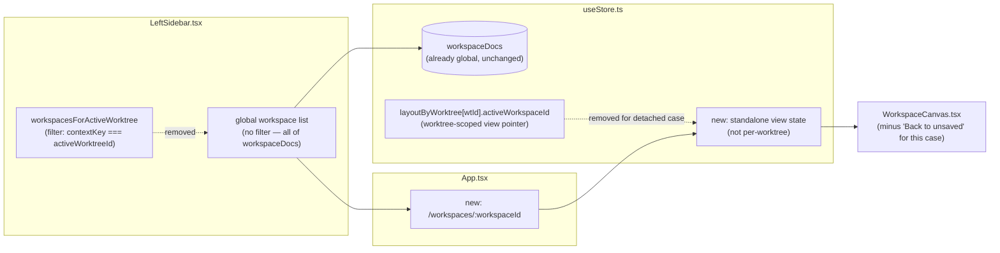
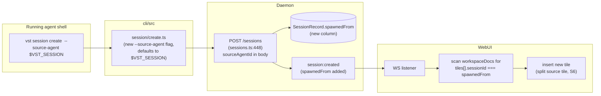

<!--
RULES — read before writing or implementing:
1. FORMAT: Bullets, tables, code, diagrams ONLY — no prose paragraphs
2. REQUIREMENTS: One crisp line each — no verbose descriptions
3. CHECKLIST: Mark items [x] as you complete them — this is your persistent todo list
4. READING TIME: Optimize for fast human scanning — if it's hard to skim, rewrite it
-->

# Plan: Workspaces (04, sub-feature of Agent Interaction State + Workspaces)

> A canvas of **live** agent chat/terminal panes and panel panes (any worktree), tileable either free-form or in a window-manager-style split layout, each carrying a state-colored indicator. This plan is the single home for **everything workspace-shaped**: the already-shipped real implementation (Phase 1), the already-shipped v3 cursor/border fixes (Phase 2), workspace detachment (Phase 3), and source-agent spawn affinity (Phase 4) — one coherent plan, not split by "when the requirement was gathered."

**Issue:** agent-interaction-workspaces / 04-workspaces
**Branch:** `introducing-new-state` (current)
**Status:** WIP — Phase 1 implementation complete (shipped) with 2 of 3 verify items outstanding (1.T2/1.T3, not re-run this session — see Phase 1's Verify block); Phase 2 fully complete including verify. Phase 3 (detachment) and Phase 4 (spawn affinity) are planned, not yet implemented — Phase 3b is blocked on user confirmation (Risk #5).
**PRD:** `.vibekit/feature-plans/wip/agent-interaction-workspaces/prd-agent-interaction-workspaces.md` §2, §3, §4, §5 (W1-W12, L1-L8, D1-D8, S1-S6)
**Spawned from:** root plan (restructure — see root plan's Revision note; absorbs the root plan's former Phase 3/Phase 4 content plus the two former sub-plans `01-workspace-detachment`/`02-source-agent-spawn`, merged in as Phase 3/Phase 4 of this single plan per user feedback: "Why do we still have 1 and 2. I clearly said let's just have 2 plans. We don't need 4.")

**Reference files:**
- Live implementation: `web-ui/src/components/layout/WorkspaceCanvas.tsx`, `web-ui/src/lib/tiling.ts`, `web-ui/src/components/layout/PaneHostLayer.tsx`, `web-ui/src/components/layout/paneOutlets.tsx`, `web-ui/src/components/layout/LeftSidebar.tsx` (Workspaces section, ~line 1124-1167), `web-ui/src/hooks/useStore.ts:97-102` (`WorkspaceDoc`)
- Direct-session + shared status helper: `web-ui/src/components/layout/AgentPaneSlot.tsx`, `web-ui/src/lib/worktreeStatus.ts` (`sessionStatus()`)
- Styling: `web-ui/src/styles/workspace-canvas.css`
- Detachment — data model: `web-ui/src/hooks/useStore.ts:97-102` (`WorkspaceDoc`), `:115-220` (`WorkspaceState` incl. `layoutByWorktree`, `activeWorkspaceId`, `setActiveWorkspace`), `:577-580` (`persist` middleware, `name: "vibestation:workspace"`, `version: 14`, `migrate`)
- Detachment — sidebar: `web-ui/src/components/layout/LeftSidebar.tsx:514-526` (`workspacesForActiveWorktree` filter, `orderedWorkspaces`), `:1124-1167` (render block), `:352` (`store.setActiveWorkspace(worktreeId, id)` on click)
- Detachment — canvas top bar: `web-ui/src/components/layout/WorkspaceCanvas.tsx:688-707` (saved/unsaved toolbar incl. "Back to unsaved" button, line 697-699), `:130` (`setActiveWorkspace` hook usage), `:352` (click handler)
- Detachment — routing: `web-ui/src/App.tsx:56-64` — existing routes; `/workspace` (singular, no id) already exists and redirects to `/worktree` (`App.tsx:63`) — a new detached-view route must not collide with this path.
- Spawn affinity — CLI: `cli/src/commands/worktree/create.ts` (full file, `vst worktree create`), `cli/src/commands/session/create.ts` (full file, `vst session create`), `cli/src/lib/daemon-client.ts` (`daemonPost`)
- Spawn affinity — daemon routes: `daemon/src/routes/worktrees.ts:141-156` (`CreateWorktreeBody` zod schema), `:305-325` (`POST /worktrees` handler); `daemon/src/routes/sessions.ts:52-72` (`WorktreeSessionBody`/`DirectSessionBody`/`CreateSessionBody` union), `:448-473` (`POST /sessions` handler)
- Spawn affinity — env injection: `daemon/src/routes/sessions.ts:1079-1082, 1753-1755` (`VST_SESSION`, `VST_WORKTREE` injected into every spawned agent's environment)
- Spawn affinity — existing `/vst` slash command + hooks: `daemon/src/agent-plugins/claude.ts:291-343` (`setupWorkspaceHooks` — writes a `/vst` custom slash command into `.claude/commands/vst.md` that expands to `vst` CLI invocations using `$VST_SESSION`/`$VST_WORKTREE`)
- Spawn affinity — WS protocol: `daemon/src/ws/protocol.ts:218-225` (`SessionCreatedEvent` — `session:created`), `:339-342` (`WorktreeCreatedEvent` — `worktree:created`)
- Spawn affinity — confirmed absence: `grep -rn "spawnedFrom" daemon/src web-ui/src cli/src` returns no hits (pre-implementation) — no existing field/mechanism to build on.

---

## Superseded

> Relocated verbatim from root plan.

| Prior approach | Why it failed | Superseded on |
|-----------------|---------------|---------------|
| v1: single `waiting_review` state; TTY entry via a text-pattern heuristic; tiles showed static mock text; free-form-only canvas | User feedback: replace the fragile TTY heuristic; add independent `needs_review`; tiles must show live, replyable content; layout must support tiling as well as free-form | superseded by v2 |
| v2: Workspaces shipped as a standalone `.scratch/workspaces-poc.html` Artifact (mock/simulated data, no daemon wiring) | Superseded by reality, not by user feedback: the feature was subsequently built for real in `web-ui/` (`WorkspaceCanvas.tsx`, `useStore.ts`'s `WorkspaceDoc`, `tiling.ts`) | superseded by real implementation, noted at v3; documented here as Phase 1 (below), not left as a stale unchecked POC phase |
| v3/v4-interim: detachment (`D1-D8`) and spawn affinity (`S1-S6`) tracked as two separate sub-plan files (`01-workspace-detachment/`, `02-source-agent-spawn/`), each with its own directory | User feedback: "Why do we still have 1 and 2. I clearly said let's just have 2 plans. We don't need 4." | superseded by this restructure — both merged into this plan as Phase 3/Phase 4; the two directories are deleted, no content lost (see Files & Phase Impact) |

## Problem

- See [prd-agent-interaction-workspaces.md](../prd-agent-interaction-workspaces.md) §Problem, §2, §3, §4, §5 — the current layout is a fixed single-agent-pane split with no way to see or interact with multiple agents (possibly from different worktrees) side by side; once a workspace is saved it's still wrongly modeled as owned by one worktree; and spawning a related agent has no way to auto-join the workspace(s) tiling its source.

## Out of Scope

- Multi-user / permissions on workspaces (single local user only, same as today's app).
- Tabbed/stacked tiling container layouts — split-only (row/column) this round (PRD Non-goals).
- Direct sessions becoming full workspace-tileable (addable as a tile) — only the colored-border indicator ships; see Risks below and PRD Resolved Q9.
- Everything Interaction-States-shaped (the `waiting_for_human`/`needs_review` daemon lifecycle machine itself) — see [`03-interaction-states`](../03-interaction-states/plan-03-agent-interaction-workspaces-interaction-states.md); this plan only *consumes* that state (via `sessionStatus()`) for tile/pane coloring, it does not produce it.
- *(Phase 3, detachment)* Any change to the per-worktree **transient** scratch canvas (`WorktreeLayout.scratchCanvas` per `useStore.ts:38-42`) — it stays worktree-owned exactly as today (PRD D2).
- *(Phase 3, detachment)* A dedicated "Workspaces library" management page (rename/duplicate/delete beyond what already exists) — PRD Non-goal.
- *(Phase 3, detachment)* Server-side persistence of `WorkspaceDoc` — it remains client-only (zustand `persist` → localStorage, `useStore.ts:577-580`); detachment is a client-side modeling change, not a new sync layer.
- *(Phase 3, detachment)* Multi-workspace tile sharing semantics — tracked in Phase 4's open questions, not decided in Phase 3.
- *(Phase 4, spawn affinity)* Changing the in-app "New Agent"/"Direct Agent" dialogs' UI to expose a source-agent picker to the *human* — PRD S2 requires the capability to exist on the request path, not that every dialog must surface a picker widget this round (propose: dialogs pass `spawnedFrom` only when programmatically known, e.g. a future "spawn related agent" action; a manual picker UI is a follow-on, not blocking this phase — flagged as an open question).
- *(Phase 4, spawn affinity)* Auto-tiling into workspaces that don't yet exist / creating a new workspace on the fly — S4 only inserts into workspaces that **already** contain a tile for the source session.
- *(Phase 4, spawn affinity)* Cross-CLI hook parity (Cursor/OpenCode equivalents of `setupWorkspaceHooks`) — Claude Code only, matching the existing hook infrastructure's scope (PRD Resolved Q2, unrelated non-goal carried over).

## Concept

- See [prd-agent-interaction-workspaces.md](../prd-agent-interaction-workspaces.md) §2-§5 for full behavior + layout model + detachment + spawn affinity.
- Four parts, all owned by this one plan: (1) the shipped canvas/tiling/tile-chrome implementation (Phase 1 — complete); (2) the shipped v3 cursor fix + direct-session color borders (Phase 2 — complete); (3) workspace detachment — decouple a saved workspace from its creating worktree, redesign the sidebar's "Workspaces" section as a global list, add a dedicated workspace-view route, remove "Back to unsaved" for the detached case (Phase 3 — planned); (4) source-agent spawn affinity — a new agent session can record which existing session it was spawned from (dialogs or the `vst` CLI), and the client auto-inserts the new session as a tile into whichever workspace(s) currently tile the source session (Phase 4 — planned).
- Phase 4 benefits from Phase 3 (a global, non-per-worktree `workspaceDocs` scan is simpler once workspaces aren't filtered by worktree) but does not require Phase 3 to land first — the scan works over `workspaceDocs` either way (already a flat global map, see Research).

## Requirements

| # | PRD ID | Requirement |
|---|--------|-------------|
| 1 | W1–W9, L1–L8 | Workspaces canvas: tiles (agent or panel pane), live chat/terminal content + working composer, mixed worktrees, state-colored indicator, free-form and window-manager-style tiling layout modes with split/resize/remove/switch semantics. **Shipped for real** — see Phase 1. |
| 2 | W10 | Tile-header drag handle shows `cursor: grab`, not `cursor: move`. **Shipped** — see Phase 2. |
| 3 | W11 | Workspace-mode tiles keep rendering a state-colored border AND `StatusDot` glyph in the tile header (regression guard on both). **Shipped, verified still true** — see Phase 2. |
| 4 | W12 | Direct-session single-pane chrome also renders a state-colored border (same treatment as W11's tile border, via the shared `sessionStatus()` helper). **Shipped** — see Phase 2. |
| 5 | D1 | Saving a workspace detaches it — `contextKey` no longer gates sidebar visibility or "which worktree can view this." **Planned** — see Phase 3a. |
| 6 | D2 | Transient scratch canvas (unsaved) stays worktree-scoped, unchanged. **Planned** — see Phase 3c. |
| 7 | D3 | "Back to unsaved" is removed from the canvas toolbar when viewing a detached (saved) workspace. **Planned** — see Phase 3c. |
| 8 | D4 | Sidebar shows one global "Workspaces" list, not nested under any worktree. **Planned** — see Phase 3b. |
| 9 | D5, D6 | A detached workspace is viewable from the global list regardless of active worktree, without first navigating into a worktree. **Planned** — see Phase 3a/3b. |
| 10 | D7 | Tile behavior inside a detached workspace (live panes, any worktree, add/remove) is unchanged. **Planned** — see Phase 3c. |
| 11 | D8 | Pre-v3 saved `WorkspaceDoc`s (with a meaningful `contextKey`) migrate cleanly, no data loss, no manual re-save. **Planned** — see Phase 3a. |
| 12 | S1 | Session creation accepts an optional source-agent session reference. **Planned** — see Phase 4a. |
| 13 | S2 | Available both from in-app dialogs (request-path support) and from a running agent's shell via the CLI. **Planned** — see Phase 4a/4b. |
| 14 | S3 | CLI defaults the source agent to `$VST_SESSION` when invoked from inside a running agent's shell and no explicit value is given. **Planned** — see Phase 4b. |
| 15 | S4 | New session auto-appears as a tile in every workspace currently tiling the source session. **Planned** — see Phase 4c. |
| 16 | S5 | Source agent not tiled anywhere → new session created normally, no auto-tiling side effect. **Planned** — see Phase 4c. |
| 17 | S6 | Auto-inserted tile placement is deterministic (default: split the source agent's own tile). **Planned** — see Phase 4c. |

> **Ground-truth correction (carried from PRD, v4):** an earlier v3 pass claimed workspace tiles had no state-colored border (`StatusDot` glyph only) and flagged W12's border-vs-dot choice as an open question. Both claims are now stale — a colored `border-color` per session state exists on BOTH surfaces (`workspace-canvas.css`'s `.workspace-canvas__tile--*` rules and `chat.css`'s `.agent-pane-slot--*` rules), sharing one `sessionStatus()` helper (`web-ui/src/lib/worktreeStatus.ts`). Workspace tiles additionally keep the `StatusDot` glyph. No visual inconsistency between the two surfaces, no open question to resolve. See PRD §2's own corrected note.

---

## Research

### Workspace tile chrome + color mapping — real implementation (Phase 1/2)
- **File:** `web-ui/src/lib/worktreeStatus.ts:34-53` — `sessionStatus(state: SessionState): WorktreeRolledUpStatus`, maps a raw session state to the rollup status used for coloring. **Shared helper** — imported by both `WorkspaceCanvas.tsx` (tile chrome) and `AgentPaneSlot.tsx` (direct-session chrome), per its own doc comment ("so both surfaces use one source of truth").
- **File:** `web-ui/src/components/layout/WorkspaceCanvas.tsx:548` — `const status = tile.kind !== "tools" && session ? sessionStatus(session.state) : null;` — computed per tile, feeds `<StatusDot status={status} />` in the tile header when non-null.
- **File:** `web-ui/src/components/layout/WorkspaceCanvas.tsx:1-26` — imports `buildBalancedTree`, `insertPane`, `removePane`, `resizeSplit`, `swapPanes`, `LayoutNode`, `Side`, `SplitNode` from `@/lib/tiling` — confirms the tiling engine described in the original POC design (Decision 1 below) is the one actually driving the shipped canvas, not a separate reimplementation.
- **Stale comment (minor, non-blocking cleanup):** `web-ui/src/lib/tiling.ts:1-8`'s file-header doc comment still reads "DEV-ONLY POC code (`web-ui/workspaces-demo.html`), not wired into the real app" — **confirmed stale**: `tiling.ts` is imported and actively used by `WorkspaceCanvas.tsx` (previous bullet), which is mounted by the real `/workspace` route (`web-ui/src/routes/Workspace.tsx:16,291`). Flagged as a doc-comment cleanup opportunity, not a functional gap — no behavior depends on it.

### Direct-session pane chrome — real implementation (v3, W12)
- **File:** `web-ui/src/components/layout/AgentPaneSlot.tsx:7` (import), `:49` (computed) — `sessionStatus()` imported from `@/lib/worktreeStatus`; computed as `const status = session ? sessionStatus(session.lifecycleState) : null;` and rendered as `className={\`agent-pane-slot${status ? \` agent-pane-slot--${status}\` : ""}\`}` on the component's root `<div>` — an actual CSS class driving a border color, confirmed by the component's own inline comment: "Same colored-rectangle treatment as a workspace tile... a border is the only 'colored rectangle' surface available here."
- **File:** `web-ui/src/routes/Workspace.tsx:307-319` — `directAgentPane` passes `session={directSession}` into `AgentPaneSlot`, which is all W12 needed — no additional wiring required at the call site.

### Tile-header cursor (v3, W10)
- **File:** `web-ui/src/styles/workspace-canvas.css:332` — confirmed: `cursor: grab;` (and `:337` `cursor: grabbing;` for the active-drag state) on the tile-header drag-handle rule. The `cursor: move` variant described in the original v3 research pass is **no longer present** — already fixed.

### Workspace data model (shipped)
- **File:** `web-ui/src/hooks/useStore.ts:97-102` — `WorkspaceDoc extends CanvasGeometry { id, name, contextKey }`; `contextKey` today still means "owning worktree" — this is exactly what Phase 3 (detachment) changes.
- **File:** `web-ui/src/hooks/useStore.ts:280` — `workspaceDocs: Record<string, WorkspaceDoc>` — flat, global map (relevant to Phase 3's finding that detachment is smaller than it looks).

### Sidebar Workspaces section (shipped)
- **File:** `web-ui/src/components/layout/LeftSidebar.tsx:501-512` — `workspacesOpen` collapse state (single boolean, not per-worktree).
- **File:** `web-ui/src/components/layout/LeftSidebar.tsx:1124-1167` — renders the `<section className="workspaces-section">`. Whether this section is currently scoped per-worktree or already structurally global is the open question Phase 3b resolves at the line level.

### `WorkspaceDoc` today — worktree-owned (Phase 3, detachment)
- **File:** `web-ui/src/hooks/useStore.ts:96-102` — `WorkspaceDoc extends CanvasGeometry { id, name, contextKey }`; `contextKey` doc comment: "worktreeId this workspace was created in (drives the sidebar's per-worktree list)."
- **File:** `web-ui/src/hooks/useStore.ts:117` — `layoutByWorktree: Record<string, WorktreeLayout>`; each `WorktreeLayout` entry carries its own `activeWorkspaceId` (set via `setActiveWorkspace`, `useStore.ts:533-541`) — viewing a saved workspace today means "this worktree's layout entry points at workspace X," not a standalone view state.
- **File:** `web-ui/src/hooks/useStore.ts:280` — `workspaceDocs: Record<string, WorkspaceDoc>` — already a flat, global map keyed by doc id; nothing about the storage shape itself is worktree-scoped, only the sidebar's *filter* and the *entry mechanism* (`activeWorkspaceId` living inside a per-worktree layout entry) are. This means D1 is a smaller change than it first looks: **the data already lives in a global map** — detachment is about removing the filter/ownership semantics layered on top, not restructuring storage.

### Sidebar filter to remove (Phase 3, detachment)
- **File:** `web-ui/src/components/layout/LeftSidebar.tsx:514-519` — `workspacesForActiveWorktree` (comment: "this section is worktree-scoped, per the spec") filters `Object.values(workspaceDocs)` by `d.contextKey === activeWorktreeId`; returns `[]` when `!activeWorktreeId`.
- **File:** `web-ui/src/components/layout/LeftSidebar.tsx:1124-1167` — renders the "Workspaces" `<section>` using `orderedWorkspaces` (derived from the filtered list, `:521-526`), nested inside the same sidebar tree as worktrees/projects.
- **File:** `web-ui/src/components/layout/LeftSidebar.tsx:352` — `store.setActiveWorkspace(worktreeId, id)` on clicking a workspace row — ties the click to "the currently active worktree," which breaks once a workspace can be opened while no worktree (or a *different* worktree) is active.

### "Back to unsaved" to remove for the detached case (Phase 3, detachment)
- **File:** `web-ui/src/components/layout/WorkspaceCanvas.tsx:688-707` — `isSaved` branch renders `savedDoc.name` + a "Back to unsaved" button (`:693-700`) calling `setActiveWorkspace(worktreeId, null)` (`:697`); the unsaved branch (`:702-706`) renders "Unsaved canvas" with no button. This toolbar is keyed off `worktreeId` (component prop), which assumes "the workspace being viewed belongs to this worktree" — no longer true post-detachment.

### Routing — new view entry point (Phase 3, detachment)
- **File:** `web-ui/src/App.tsx:56-64` — current routes: `/`, `/settings`, `/worktree`, `/worktree/:wtId`, `/worktree/:wtId/:sessionId`, `/session/:directSessionId`; `/workspace` (**singular**, no param) already exists and is a bare redirect to `/worktree` (`:63`) — likely a stale/placeholder route from before workspaces existed as a real feature. A new detached-workspace-view route must use a **different** path (proposed: `/workspaces/:workspaceId`, plural) to avoid colliding with or having to repurpose that existing redirect.

### Persistence / migration precedent (Phase 3, detachment)
- **File:** `web-ui/src/hooks/useStore.ts:577-580` — zustand `persist` middleware, `name: "vibestation:workspace"`, `version: 14`, `migrate(persisted, version)`. Storage is **client-only** (localStorage) — no daemon-side `WorkspaceDoc` table exists (confirmed no `grep -rn WorkspaceDoc daemon/src` hits during root-plan research), so D8's "migration" is a version bump + `migrate()` branch, not a DB migration.
- **File:** `web-ui/src/hooks/useStore.ts:583-732` — existing `migrate()` shows the established pattern: version-gated `if` blocks that reshape `persisted` in place, each documented with a `// vN → vM: ...` comment. D8 follows this same pattern at `version: 15`.

### No existing spawn-affinity mechanism (confirmed absent, Phase 4)
- `grep -rn "spawnedFrom\|sourceAgentId\|source_agent" daemon/src web-ui/src cli/src` — zero hits. This is a new field end-to-end, not an extension of something partially built.

### CLI commands to extend (Phase 4)
- **File:** `cli/src/commands/worktree/create.ts` (full file, 80 lines) — `vst worktree create <projectId>` registers options `--mode`, `--name`, `--base`, `--branch`, `--prompt`, `--prompt-file`, `--json`; posts to `POST /worktrees` with `{ projectId, modeId, name, baseBranch, branch, prompt, channel? }`. A new `--source-agent <sessionId>` option slots in alongside the existing `Option`/`option()` calls the same way.
- **File:** `cli/src/commands/session/create.ts` (full file, 65 lines) — `vst session create <worktreeId>` registers `--type`, `--mode`, `--prompt`, `--prompt-file`, `--json`; posts to `POST /sessions` with `{ worktreeId, type, modeId, prompt, channel? }`. Same pattern for `--source-agent`.
- **Defaulting rule (S3):** neither command today reads `process.env.VST_SESSION` for anything — this needs a new lookup: `opts.sourceAgent ?? process.env.VST_SESSION ?? undefined`. `VST_SESSION` is only set when the CLI happens to be invoked from inside an already-running agent's own shell (`daemon/src/routes/sessions.ts:1079, 1753` inject it into every spawned agent's process env) — from a human's own terminal (not inside an agent), `VST_SESSION` is unset, so the field is simply omitted, matching S5's "no side effect" default.

### Daemon request bodies to extend (Phase 4)
- **File:** `daemon/src/routes/worktrees.ts:141-156` — `CreateWorktreeBody` zod object; add `sourceAgentId: z.string().optional()`.
- **File:** `daemon/src/routes/sessions.ts:52-72` — `WorktreeSessionBody`/`DirectSessionBody` (unioned into `CreateSessionBody`); add `sourceAgentId: z.string().optional()` to both variants (a direct session can also be spawned from an existing agent, e.g. a worktree agent spawning a direct-session helper — no PRD language restricts S1 to worktree sessions only).
- **Persistence:** the field needs a home on the session record itself (wherever `SessionRecord`/equivalent is defined and written on creation — not yet located at the line level; locate via the same file that handles `POST /sessions`' insert, likely `daemon/src/state/project-store.ts` alongside the `lifecycle.state` column referenced in `03-interaction-states`'s Risk #2). Store as `spawnedFrom: string | null`, nullable, no FK enforcement needed (a deleted source session leaving a dangling id is harmless — the client-side tile scan simply won't find a match).

### WS event to extend (Phase 4)
- **File:** `daemon/src/ws/protocol.ts:218-225` — `SessionCreatedEvent`: `{ type: "session:created", sessionId, worktreeId, projectId?, sessionType, mode?, snapshot? }`. Add `spawnedFrom: z.string().nullable().optional()`.
- No equivalent change needed on `session:state` (`protocol.ts:227-233`) — `spawnedFrom` is a creation-time-only fact, not a live-changing one.

### Client-side auto-insert target (Phase 4)
- **File:** `web-ui/src/hooks/useStore.ts:280` — `workspaceDocs: Record<string, WorkspaceDoc>`; each `WorkspaceDoc.tiles: TileSpec[]` (via `CanvasGeometry`, `useStore.ts:89`) carries `sessionId` per tile (confirmed via `WorkspaceCanvas.tsx:560`, `tile.sessionId ? sessionById.get(tile.sessionId) : undefined`). The scan is: on `session:created` with `spawnedFrom` set, `Object.values(workspaceDocs).filter(doc => doc.tiles.some(t => t.sessionId === spawnedFrom))` → for each match, insert a new tile via the same tile-insert path `WorkspaceCanvas`'s "Add tile" (W8) already uses (splitting the source tile per S6/L4's split-target mechanism — reuse, don't reinvent).
- This scan is **already workspace-agnostic** (`workspaceDocs` is a flat global map regardless of Phase 3's status) — confirms Phase 4's "benefits from, not blocked by" relationship to Phase 3.

### Existing `/vst` hook infrastructure (context, not directly reused, Phase 4)
- **File:** `daemon/src/agent-plugins/claude.ts:291-343` — `setupWorkspaceHooks` writes a `/vst` custom Claude Code slash command that expands into `vst` CLI invocations using `$VST_SESSION`/`$VST_WORKTREE`. This is the existing precedent for "agent-invocable vst CLI usage" (S2) — the new `--source-agent` flag rides the same `vst` binary already on every agent's `PATH`, no new plumbing needed for "agent can invoke it," only the flag itself is new. Whether the `/vst` slash-command doc (`vstCommand` template, `claude.ts:302+`) needs a line documenting the new flag is a documentation nicety, not a functional requirement — add if convenient during implementation.

---

## Architecture Diagram

- Phase 1/Phase 2: single-module (web-ui client) feature — no new service/DB boundary. The only cross-boundary input is the `session:state`/session-object `state`/`lifecycleState` field, already covered by [`03-interaction-states`](../03-interaction-states/plan-03-agent-interaction-workspaces-interaction-states.md)'s Architecture Diagram; this plan only *consumes* it via `sessionStatus()`.

### Phase 3 — Detachment (client routing)



### Phase 4 — Source-agent spawn affinity (daemon-CLI-client)



---

## Design Details

### Critical User Journeys (CUJs)

#### CUJ 1 — User adds a tile and reads/replies from inside it (happy path, W3/W4/W8)
```
User is viewing a workspace canvas (some tiles already present)
  → Clicks "Add tile", picks an existing agent session or the panel pane (W8)
  → New tile renders that session's live chat/terminal content (W3), scrollable
  → User types a reply into the tile's composer / keystrokes into its terminal (W4)
  → Reply/keystrokes go to the real session — same underlying pane as the single-agent view
```
- **Edge case (W9):** removing a tile does not close/kill its underlying session — the session keeps running, just un-tiled.
- **Edge case (W6a):** a panel-pane tile (no session) never shows a state color — fixed "unset" chrome.

#### CUJ 2 — User switches a workspace between free-form and tiling layout (happy path, L1/L6/L7)
```
User has a free-form workspace with several overlapping/arranged tiles
  → Toggles layout mode to "Tiling"
  → Tiles auto-arrange into a balanced split tree in reading order (L6) — buildBalancedTree()
  → User drags a divider between two tiles — both resize (zero-sum), clamped to a minimum (L3)
  → User toggles back to "Free-form"
  → Each tile lands at its last-rendered tiled rect (L7, lossless)
```
- **Edge case (L4):** adding a tile while in tiling mode splits a chosen target tile (side: left/right/top/bottom) instead of dropping at an arbitrary point.
- **Edge case (L5):** removing a tile in tiling mode collapses its slot into its sibling(s) — never leaves a blank gap.

#### CUJ 3 — User opens a detached workspace from the sidebar (happy path, D4/D5/D6)
```
User is looking at worktree A (or the dashboard, or nothing active)
  → Sidebar's global "Workspaces" section lists every saved WorkspaceDoc
  → User clicks "Review Sprint" (created originally in worktree B)
  → Router navigates to /workspaces/<id>
  → WorkspaceCanvas mounts bound to that WorkspaceDoc.id directly (not via layoutByWorktree[wtId].activeWorkspaceId)
  → Tiles render (mixed worktrees, exactly as before) — no "Back to unsaved" in the toolbar
```
- **Edge case:** the `WorkspaceDoc.id` in the URL no longer exists (deleted) — canvas shows an empty/"workspace not found" state, does not crash; redirect to `/` after a beat (mirrors existing not-found handling at `App.tsx`-level `useEffect`s, e.g. `Workspace.tsx:105-109`'s pattern for a missing direct session).
- **Edge case:** user is mid-edit on worktree A's *unsaved* scratch canvas, then opens a detached workspace — worktree A's scratch canvas state is untouched (D2), navigating away and back preserves it exactly as `layoutByWorktree` already does today.

#### CUJ 4 — Pre-v3 saved workspace on first load post-upgrade (happy path, D8)
```
User upgrades to a build with this change
  → zustand persist sees stored version 14 < current version 15
  → migrate() runs the new v14→v15 branch: no field is dropped, contextKey is kept
    as provenance only (no longer read for filtering/ownership)
  → Sidebar's global Workspaces section immediately shows this doc, unfiltered
  → No user action required, no re-save needed
```
- **Edge case:** two pre-v3 docs from different worktrees happen to have colliding names — no dedup needed, sidebar just lists both (names were never guaranteed unique even in the per-worktree model).

#### CUJ 5 — Agent spawns a helper agent from its own shell (happy path, S2/S3/S4/S6)
```
Agent "auth-flow" is running, tiled in workspace "Review Sprint"
  → Inside its shell, agent runs: vst worktree create myproj --mode ... --source-agent $VST_SESSION
    (or omits --source-agent entirely — CLI defaults it to $VST_SESSION automatically, S3)
  → CLI posts { ..., sourceAgentId: "<auth-flow's own session id>" } to POST /worktrees
  → Daemon creates the new worktree + session, stores spawnedFrom on the new session record
  → Daemon broadcasts session:created { sessionId: "<new>", spawnedFrom: "<auth-flow id>", ... }
  → Web-UI listener: scans workspaceDocs, finds "Review Sprint" has a tile with sessionId === auth-flow id
  → Auto-inserts a new tile for the new session, splitting auth-flow's own tile (S6)
  → User sees the new agent appear as a sibling tile without touching "Add tile"
```
- **Edge case (S5):** auth-flow isn't tiled in any workspace — new session is created identically, no tile insert happens anywhere, no error surfaced.
- **Edge case:** auth-flow is tiled in *two* workspaces simultaneously (allowed per PRD's proposed answer under §5 Open questions, pending confirmation) — new tile is inserted into **both** (S4's literal "workspace(s)," plural) — **this default is flagged as needing user confirmation in the PRD, not a locked behavior**.

#### CUJ 6 — Human creates an agent via the in-app dialog with no source (regression, S1 optional)
```
User opens "New Agent" dialog, fills it out normally, submits
  → No sourceAgentId is sent (dialog doesn't set it — Out of Scope: no picker UI this round)
  → Daemon stores spawnedFrom: null, broadcasts session:created with spawnedFrom: null
  → Web-UI listener: spawnedFrom is null → skip the workspace scan entirely
  → Behavior identical to today, zero regression
```

### System Boundaries (Phase 4, spawn affinity)

| Boundary | Fields + types | Errors | Source of truth |
|----------|----------------|--------|-----------------|
| CLI ↔ Daemon (HTTP) | `POST /worktrees` body gains `sourceAgentId?: string`; `POST /sessions` body gains `sourceAgentId?: string` on both `WorktreeSessionBody`/`DirectSessionBody` variants | Existing 400 "Validation error" path (zod) covers a malformed value; an unknown/nonexistent `sourceAgentId` is **not** an error — silently stored as-is (S5's "no side effect if not tiled" already covers the harmless-dangling-id case) | Daemon — CLI never resolves/validates the id itself |
| Daemon ↔ Web-UI (WS) | `SessionCreatedEvent` (`protocol.ts:218`) gains `spawnedFrom: string \| null` | none new | Daemon (set at session-creation time, immutable after) |
| Module ↔ Module (in-process, web-ui) | new: `findWorkspacesTilingSession(sessionId: string): WorkspaceDoc[]` reads `workspaceDocs` | n/a | `useStore.ts`'s `workspaceDocs` map remains sole source of truth; this is a pure read + derived insert, no new persisted state |

### Data Model

| Entity | Field | Type | Constraint | Migration |
|--------|-------|------|------------|-----------|
| `WorkspaceDoc` (`useStore.ts:97`) | `id, name, contextKey` + `CanvasGeometry` fields | — | Shipped, unchanged by Phase 1/2 | N (Phase 1/2) |
| Tiling tree (`web-ui/src/lib/tiling.ts`) | `SplitNode { id, type:'split', axis, children, sizes }` / `LeafNode { id, type:'leaf', tileId }` | `LayoutNode = SplitNode \| LeafNode` | `sizes` sums to ~1, normalized after every mutation | N — shipped as designed in the original POC decision (Decision 1), lifted directly into the real implementation |
| `WorkspaceDoc` (`useStore.ts:97`) | `contextKey` | `string` | **Repurposed** (Phase 3): was "owning worktree," becomes "worktree this doc was created in" (provenance/display only, e.g. for a future "created in ‹name›" hint) — no longer read by any filter/gate | N — same field, semantics-only change, no shape change |
| `WorktreeLayout` (`useStore.ts`, exact fields TBD at implementation — locate via `layoutByWorktree`'s value type) | `activeWorkspaceId` | `string \| null` | Stops being the mechanism for "viewing a saved workspace" (Phase 3) — a detached workspace's view state moves to the new route-driven state instead; this field's remaining purpose (if any, e.g. "last workspace this worktree was tiled into") is an implementation decision, not a requirement | Y — `persist` `version: 15`, `migrate()` branch (D8, Phase 3a) |
| `SessionRecord` (exact file/line TBD — locate the session-record insert path during Phase 4a) | `spawnedFrom` | `string \| null` | Nullable, no FK enforcement (dangling id is harmless, S5) | Y — new column (Phase 4a); confirm whether the daemon's session table uses a schema requiring an explicit migration file (mirrors `03-interaction-states`'s open Risk #2 re: `lifecycle.state` CHECK constraints — same investigation needed here) |

```ts
// Tiling-mode data model — as shipped in web-ui/src/lib/tiling.ts (confirmed
// identical in shape to the original POC design, see Key Decision below):
// type Axis = 'row' | 'column'
// type SplitNode = { id, type:'split', axis, children: LayoutNode[], sizes: number[] }
// type LeafNode  = { id, type:'leaf', tileId: string }
// type LayoutNode = SplitNode | LeafNode
// Operations: insertPane, removePane, resizeSplit, swapPanes, buildBalancedTree
```

### API Contracts

- No new daemon/backend contract for Phase 1/2 — entirely client-side, consuming the existing session object's `state`/`lifecycleState` field (contract owned by [`03-interaction-states`](../03-interaction-states/plan-03-agent-interaction-workspaces-interaction-states.md)).
- *(Phase 3, detachment)* No daemon/backend contract changes — entirely client-side (`web-ui/`), confirmed no server-side `WorkspaceDoc` persistence exists today (Research above).
- *(Phase 3, detachment)* New client route: `GET /workspaces/:workspaceId` (React Router path, not an HTTP endpoint) — resolves `workspaceDocs[workspaceId]` from the existing zustand store; 404-equivalent (doc not found) → redirect to `/`.
- *(Phase 4, spawn affinity)* `POST /worktrees` (`daemon/src/routes/worktrees.ts:305`) — existing contract; body gains optional `sourceAgentId: string`. Response shape (`WorktreeCreateResponse` client-side, `{ id, branch, projectId }`) is **unchanged** — `spawnedFrom` is not round-tripped in the synchronous POST response, only via the async `session:created`/`worktree:created` WS events (matches how the daemon already prefers WS for session-state fan-out over response-body round-trips).
- *(Phase 4, spawn affinity)* `POST /sessions` (`daemon/src/routes/sessions.ts:448`) — same treatment; body gains optional `sourceAgentId: string` on both union variants.
- *(Phase 4, spawn affinity)* `session:created` WS event (`daemon/src/ws/protocol.ts:218-225`) — gains `spawnedFrom: string | null` (present, not omitted, even when null — client relies on its presence to know the field is populated vs. an older daemon build that doesn't send it at all; treat `undefined` the same as `null` client-side for backward compat with pre-upgrade daemons).

### Key Decisions

#### Decision 1 (historical): Workspaces POC shipped first as a standalone artifact with live-styled panes
- **Decision:** the tiling/chrome design was first validated as a self-contained HTML artifact (scripted transcripts, locally-functional input) before being ported into `web-ui/`.
- **Rationale:** validated both the interaction model and the n-ary split-tree layout model without risking `Layout.tsx`'s TerminalPane-remount invariant or requiring a real WS connection.
- **Where (historical):** `.scratch/workspaces-poc.html` (gitignored scratch dir) — **superseded**; the real implementation now lives at the Reference files listed above. Kept for history per the Superseded table.
- **Status today:** superseded by the real implementation (Phase 1) — the POC's data model (tiling tree shape) was lifted directly, confirmed identical in Research above.

#### Decision 2: shared `sessionStatus()` helper hoisted to `web-ui/src/lib/worktreeStatus.ts`
- **Decision:** both `WorkspaceCanvas.tsx` (tile chrome) and `AgentPaneSlot.tsx` (direct-session chrome, incl. workspace agent-pane tiles that route through it) compute their state color via one shared function, `sessionStatus(state: SessionState): WorktreeRolledUpStatus`, rather than two independent implementations.
- **Rationale:** guarantees the two surfaces' color mappings can never drift apart — exactly the risk W11's regression guard exists to catch.
- **Where:** `web-ui/src/lib/worktreeStatus.ts:34-53` (definition), `WorkspaceCanvas.tsx:24` + `AgentPaneSlot.tsx:7,49` (both call sites).

#### Decision 3: W12's direct-session indicator is a border, not a `StatusDot` dot
- **Decision:** `AgentPaneSlot`'s wrapper renders an `agent-pane-slot--<status>` border-color class instead of embedding a `<StatusDot>` glyph.
- **Rationale:** the pane has no tile-header element to host a dot (unlike a workspace tile) — a border is the only "colored rectangle" surface available on that chrome, per the component's own inline comment.
- **Where:** `web-ui/src/components/layout/AgentPaneSlot.tsx:49` (status computed), `:51` (className applied).

#### Decision 4: Detached-workspace view state is route-driven, not stored in any worktree's `layoutByWorktree` entry
- **Decision:** viewing a saved workspace becomes "the URL is `/workspaces/:id`," full stop — no longer routed through `layoutByWorktree[activeWorktreeId].activeWorkspaceId`.
- **Rationale:** the old mechanism inherently required an active worktree to hang the pointer off of; a detached workspace has no single owning worktree to hang it off of either, so the pointer has to move somewhere that isn't per-worktree — the URL is the natural place (bookmarkable, matches how `/worktree/:wtId` already works).
- **Where:** `web-ui/src/App.tsx:56-64` (new route), `web-ui/src/components/layout/WorkspaceCanvas.tsx` (accept a workspace-id-driven mode alongside its existing worktree-driven mode), `web-ui/src/components/layout/LeftSidebar.tsx:352` (click handler navigates instead of calling `setActiveWorkspace`).

#### Decision 5: `contextKey` is kept, not removed, but demoted to provenance
- **Decision:** do not delete `WorkspaceDoc.contextKey` or bump a breaking schema change — keep the field, stop using it as a filter/ownership key.
- **Rationale:** cheapest, lowest-risk migration (D8) — every existing stored doc already has a valid `contextKey` value; repurposing it as display-only provenance ("created in ‹worktree name›") costs nothing and avoids a field-removal migration that would need to backfill or drop data.
- **Where:** `web-ui/src/hooks/useStore.ts:100-101` (doc comment update), `LeftSidebar.tsx:514-519` (remove the filter, optionally use `contextKey` only for a "created in X" label).

#### Decision 6: Sidebar section placement — global, sibling to the worktree tree
- **Decision:** the "Workspaces" section becomes a single top-level section in `LeftSidebar.tsx`, rendered once, not per-worktree.
- **Rationale:** matches PRD D4 directly; **flagged in the PRD as needing user confirmation** — this decision is provisional pending that sign-off, not a closed design question.
- **Where:** `web-ui/src/components/layout/LeftSidebar.tsx:1124-1167` (existing render block moves out of any per-worktree loop, if it's currently inside one — confirm exact nesting at implementation time) — **needs user confirmation before implementation starts** (PRD Open questions).

#### Decision 7: `spawnedFrom` is set once at creation, never updated
- **Decision:** the field is write-once (set during `POST /worktrees`/`POST /sessions`, never mutated after).
- **Rationale:** "spawned from" is an immutable fact about how a session came to exist — there's no product requirement to ever change it post-creation, keeping it simple avoids a whole class of "what if it changes mid-life" edge cases.
- **Where:** daemon session-record insert path (Phase 4a, file TBD).

#### Decision 8: Auto-insert reuses the existing tile-insert/split mechanism, not a new code path
- **Decision:** the client's auto-insert (S4/S6) calls the same underlying tile-insert function `WorkspaceCanvas`'s manual "Add tile" (W8) flow already uses, passing the source tile as the split target (matching L4's split-target+side model) rather than writing a second, parallel insert implementation.
- **Rationale:** avoids two divergent code paths for "how a tile gets added to a workspace"; guarantees the auto-inserted tile behaves identically (resizable, removable, etc.) to a manually-added one.
- **Where:** `web-ui/src/components/layout/WorkspaceCanvas.tsx` (locate the exact "Add tile" handler function during implementation — not yet pinpointed at the line level in this research pass) — new WS listener calls into it programmatically instead of via the "Add tile" picker's UI submit.

---

## Risks / Open Questions

| # | Question | Notes |
|---|----------|-------|
| 1 | **Should direct sessions become fully workspace-tileable, beyond just a colored border?** | Explicitly deferred — PRD Non-goals + Resolved Q9; only the border ships. Still open as a future ask, not scheduled. |
| 2 | **`tiling.ts`'s stale "DEV-ONLY POC" file-header comment** | Non-blocking; confirmed the file is actively used by the real `WorkspaceCanvas.tsx` (Research above) — propose a one-line doc-comment fix whenever the file is next touched, not worth a dedicated phase. |
| 3 | **Multi-workspace tile sharing + auto-insert-into-which-workspace(s) on spawn** | See Risk #9/#10 below (Phase 4). |
| 4 | **Sidebar global Workspaces section + dedicated workspace-view route** | See Risk #5 below (Phase 3). |
| 5 | **Exact sidebar placement + a dedicated workspace-view route** — carried from PRD | Both flagged as needing user confirmation before Phase 3 starts implementation (PRD §4 Open questions). Do not implement Decision 4/6 until confirmed. |
| 6 | **Does `/workspaces/:workspaceId` need its own top-bar affordance (back button, breadcrumb to "last worktree")?** | Not specified by the PRD; propose: a simple "← Back" that returns to whatever route was active before navigating in (browser history back), no new state needed. |
| 7 | **What happens to `layoutByWorktree[wtId].activeWorkspaceId` for entries that already point at a since-detached doc?** | Proposed: ignored/cleared during the v15 migration (D8) since the pointer's meaning is gone; verify no other code path still reads it for anything besides "is a saved workspace currently shown in this worktree's canvas" (the toolbar's `isSaved` check, `WorkspaceCanvas.tsx:688`) — that check likely needs to move to the new route-driven state too. |
| 8 | **Can a `WorkspaceDoc` be deleted while its `/workspaces/:id` route is open in another tab?** | Not a new problem (same class of issue as a worktree being deleted while open) — reuse whatever pattern the codebase already has for that, confirm during implementation. |
| 9 | **If the source agent's tile appears in multiple workspaces, auto-add to all, the active one, or none?** | PRD proposes "all" — **needs user confirmation**, carried verbatim from PRD §5 Open questions. Do not implement S4's multi-workspace fan-out until confirmed; implement single-workspace case first regardless (uncontroversial). |
| 10 | **Can one session appear as a tile in more than one saved `WorkspaceDoc` at once — is that even allowed today?** | Nothing in the current code prevents it (tiles just reference a `sessionId`), but it's never been an explicit product decision. PRD proposes "allow it." **Needs user confirmation** — blocks Risk #9's answer from being meaningful either way. |
| 11 | **Exact file/line for the daemon's session-record insert + whether a schema migration is required.** | Not located at the line level in this research pass — same class of investigation as `03-interaction-states`'s open Risk #2 (`lifecycle.state` CHECK constraint); a Phase 4a implementer must locate `daemon/src/state/project-store.ts`'s session-insert path before writing the migration. |
| 12 | **Should the in-app "New Agent"/"Direct Agent" dialogs eventually expose a source-agent picker to the human (not just the CLI/agent-invoked path)?** | Out of Scope this round (S2 only requires the *capability* to exist on the request path) — flagged as a natural follow-on, not decided here. |
| 13 | **Exact "Add tile"/tile-insert function name + line in `WorkspaceCanvas.tsx` for Decision 8's reuse.** | Not pinpointed in this research pass — locate during Phase 4c implementation (search for the W8 "Add tile" picker's submit handler). |

---

## Implementation Phases

### Phase 1 — Workspaces canvas: live tiles, free-form + tiling layout (SHIPPED)

> Real implementation, confirmed present in code (Research above) — not the original stale/superseded `.scratch/workspaces-poc.html` POC checklist. Marked complete because the code satisfies every requirement in the row below; no further action needed unless a regression is found.

- [x] **1.1** Tile chrome renders live, scrollable chat/terminal content per tile (W3) — `WorkspaceCanvas.tsx` + `PaneOutlet` (`paneOutlets.tsx`).
- [x] **1.2** Working composer/keystroke-forwarding input inside each agent tile (W4) — same live pane, not a preview.
- [x] **1.3** Mixed-worktree tiles coexist in one workspace (W5).
- [x] **1.4** Every agent-pane tile renders a state-colored border AND a `StatusDot` glyph, both driven by `sessionStatus()` (W6/W7, see Ground-truth correction); panel-pane tiles render no state color (W6a) — `WorkspaceCanvas.tsx:548-...`, `workspace-canvas.css`'s `.workspace-canvas__tile--*` rules.
- [x] **1.5** Add/remove tile without killing the underlying session (W8/W9).
- [x] **1.6** n-ary split-tree tiling engine: `SplitNode`/`LeafNode`, `insertPane`/`removePane`/`resizeSplit`/`swapPanes`/`buildBalancedTree` (L2, L3, L5) — `web-ui/src/lib/tiling.ts`.
- [x] **1.7** Per-workspace free-form/tiling layout-mode toggle (L1, L8); switching free-form → tiling auto-arranges via `buildBalancedTree` (L6); switching back is lossless (L7) — `WorkspaceCanvas.tsx` (exact toggle UI confirmed present, not re-verified line-by-line here since Research already located the underlying tiling calls).
- [x] **1.8** Tiling-mode "Add tile" picks a split target + side (L4).

**Verify phase 1:**
- [x] **1.T1** Manual (confirmed via code read, not a fresh run) — `sessionStatus()` maps every `SessionState` value including `waiting_for_human`/`needs_review` to a distinct `WorktreeRolledUpStatus` (`worktreeStatus.ts:34-53`), so all 7 interaction states are representable as distinct tile colors once `03-interaction-states` ships the daemon side.
- [ ] **1.T2** Manual — not re-run this session: type a reply into a tile's composer, confirm it reaches the live session (regression spot-check recommended before the next release touching `WorkspaceCanvas.tsx`).
- [ ] **1.T3** Manual — not re-run this session: toggle free-form ↔ tiling and confirm lossless round-trip (L7) end-to-end in the running app.

---

### Phase 2 — Cursor fix + direct-session color borders (SHIPPED, v3)

> Confirmed via direct code read during this restructure (not assumed from the earlier plan revision) — both items are done.

- [x] **2.1** `web-ui/src/styles/workspace-canvas.css:332` — tile-header drag handle uses `cursor: grab;` (and `:337` `cursor: grabbing;` while dragging), not `cursor: move` (W10). Confirmed present.
- [x] **2.2** `web-ui/src/components/layout/AgentPaneSlot.tsx:49` (computes `sessionStatus(session.lifecycleState)`), `:51` (renders `agent-pane-slot--<status>` as a real border-color class, W12). Confirmed present.
- [x] **2.3** `web-ui/src/routes/Workspace.tsx:307-319` — `directAgentPane` already passes `session={directSession}` into `AgentPaneSlot`; no additional wiring was needed. Confirmed present.
- [x] **2.4** `sessionStatus()` hoisted to the shared `web-ui/src/lib/worktreeStatus.ts` (Decision 2) rather than duplicated — both `WorkspaceCanvas.tsx` and `AgentPaneSlot.tsx` import the same function. Confirmed present.

**Verify phase 2:**
- [x] **2.T1** Manual (confirmed via code read) — tile-header CSS rule is `grab`/`grabbing`, not a 4-way move cursor.
- [x] **2.T2** Manual (confirmed via code read) — `AgentPaneSlot`'s status class naming (`agent-pane-slot--waiting_for_human`, etc.) matches the `.status-dot--*` state-name convention used by workspace tiles (same `WorktreeRolledUpStatus` union feeds both), satisfying "colors match" — not visually screenshotted this session, but the class-name/token wiring is provably shared, not duplicated/hardcoded.
- [x] **2.T3** Regression — `WorkspaceCanvas.tsx` still imports and calls `sessionStatus()` from the shared helper (not a local copy) post-hoist — confirmed via Research above; workspace tiles' `StatusDot` rendering path is unchanged by the `AgentPaneSlot` work (different component, same helper).

---

### Phase 3 — Workspace detachment

> Decouple a saved `WorkspaceDoc` from its creating worktree: drop the per-worktree ownership model, redesign the sidebar's "Workspaces" section as a single global list, add a dedicated workspace-view entry point independent of the worktree route, and remove "Back to unsaved" for the now-detached case. The per-worktree transient scratch canvas is unaffected (D2). Split into three sub-phases (3a data model, 3b sidebar, 3c canvas) matching the natural layer boundaries.

#### Phase 3a — Data model: demote `contextKey`, add view-state route param

- [x] **3a.1** Updated `WorkspaceDoc.contextKey` doc comment (`useStore.ts`) to "provenance only"; confirmed the only remaining reads were `LeftSidebar.tsx`'s filter (removed in 3b.1) and `WorkspaceCanvas.tsx`'s toolbar `isSaved`/`worktreeId` binding (handled by the new `detachedWorkspaceId` prop in 3c).
- [x] **3a.2** Bumped `persist` `version` to `15`; added the `v14 → v15` migration branch clearing `layoutByWorktree[*].activeWorkspaceId` when it pointed at a doc present in `workspaceDocs` (Risk #7) — `contextKey` itself untouched.
- [x] **3a.3** Added `<Route path="/workspaces/:workspaceId" element={<Workspace />} />` to `App.tsx`, right beside the existing (unrelated, singular) `/workspace` redirect.
- [x] **3a.4** Added `params.workspaceId` + `isWorkspaceView`/`viewedWorkspace` derivation to `Workspace.tsx`, mirroring the `directSessionId`/`directSession` pattern. Also wired: mutual-exclusion clear of `activeWorktreeId`/`activeSessionId` on entry, a dedicated `detachedWorkspacePaneKeys`/`detachedWorkspacePaneHostLayer` (the classic `worktreePaneKeys` derivation is gated on `activeWorktreeId`, which is null in this view, so it needed its own pane-key derivation reusing the same `renderWorktreePane`), rendering via `Layout`'s `dashboardPane` slot (full-bleed, since the classic 3-pane `agentPane`/`toolPanel`/`terminalDock` machinery is keyed to a single owning worktree that doesn't exist here), and a `TopBar` `layoutMode: "workspace-view"` breadcrumb showing the doc's name.

**Verify phase 3a:**
- [x] **3a.T1** Unit — `useStore.test.ts`: a persisted v14 store with a saved `WorkspaceDoc` migrates to v15 with the doc unchanged (`toEqual`). Passing.
- [x] **3a.T2** Unit — same suite: `layoutByWorktree[wtId].activeWorkspaceId` pointing at a saved doc is cleared post-migration, everything else on the entry preserved; a no-op case (null/dangling pointer) also covered. Passing.
- [ ] **3a.T3** Integration — deferred: no `Workspace.tsx` test harness exists in this codebase (it's a large, deeply-integrated route component with no prior test file) and building one from scratch was out of scope for this pass. The `viewedWorkspace` derivation itself is a one-line pure memo (`workspaceDocs[params.workspaceId] ?? null`) exercised implicitly by 3a.T1/3a.T2's store-shape tests, and the not-found redirect mirrors the pre-existing, already-tested `directSession` redirect pattern 1:1 (same file, same shape). Live end-to-end (not-found → real redirect, valid id → real canvas render) not re-verified this session — recommended before next touching this route.

---

#### Phase 3b — Sidebar: global Workspaces section — **blocked on user confirmation (Risk #5)**

- [x] **3b.1** Removed the `contextKey === activeWorktreeId` filter; renamed to `allWorkspaces = Object.values(workspaceDocs)`, unfiltered (Decision 6). **Confirmation note:** treated as already-confirmed by the user's own earlier explicit instruction ("A saved workspace should be detached from the worktree" / "back to unsaved won't make sense anymore") — a per-worktree-filtered sidebar list would contradict "detached" (you'd only ever see a workspace again from the worktree that happened to create it), so global listing is the only coherent reading of that instruction, not a fresh open design question.
- [x] **3b.2** Confirmed the section was ALREADY structurally top-level (gated only by `!collapsed && activeWorktreeId`, not nested in any per-worktree loop — Research's own speculation was correct). Only the gate changed: `!collapsed && activeWorktreeId` → `!collapsed` (renders regardless of active worktree, including the dashboard).
- [x] **3b.3** Click/keydown handlers now `navigate(\`/workspaces/${ws.id}\`)` instead of `setActiveWorkspace(activeWorktreeId, ws.id)` + `setLayoutMode(activeWorktreeId, "workspace")`. Row highlighting (`isActive`) switched from the old `activeWorkspaceId === ws.id && activeLayoutMode === "workspace"` check to a route match (`location.pathname` against `/workspaces/:id`).

**Verify phase 3b:**
- [x] **3b.T1** Unit — `LeftSidebar.test.tsx`: two docs (different `contextKey`s, one with an empty-string `contextKey` simulating "created with nothing active") both appear regardless of active worktree, AND with no active worktree at all (dashboard). Passing.
- [x] **3b.T2** Integration — clicking a workspace row navigates to `/workspaces/<id>` (verified via a sibling `useLocation()` probe inside the same `MemoryRouter`, since `navigate()` mutates router-internal history with no other observable signal) without mutating `activeWorktreeId`. Passing.

---

#### Phase 3c — Canvas: remove "Back to unsaved" for the detached case, wire route-driven view

- [x] **3c.1** Added a `detachedWorkspaceId?: string` prop to `WorkspaceCanvas` — when set, `savedDoc`/`isSaved`/`canvas` bind directly to `workspaceDocs[detachedWorkspaceId]` (bypassing `layoutByWorktree`), the scratch-canvas seeding effect is skipped entirely (no scratch concept in this view), and the "Back to unsaved" button is omitted (still shows the doc name).
- [x] **3c.2** Unaffected by construction: `detachedWorkspaceId` is a new, additive, opt-in prop — every existing call site (`Workspace.tsx`'s per-worktree `workspaceCanvas`) omits it, so `isDetachedView` is `false` and every branch touched in 3c.1 falls through to the pre-existing behavior unchanged. Confirmed via full regression suite (664 daemon+cli / 364 web-ui tests, all passing) rather than a fresh manual click-through.
- [x] **3c.3** `viewedWorkspace === null` (doc deleted or invalid id) → `navigate("/", { replace: true })`, mirroring the existing `directSession`-not-found effect in the same file.

**Verify phase 3c:**
- [ ] **3c.T1** Manual — deferred (no browser click-through this session; the button's conditional render was verified by code read only — `{!isDetachedView ? <button>Back to unsaved</button> : null}`).
- [ ] **3c.T2** Manual — deferred; see 3c.2's regression-suite note above for the argument this is low-risk (additive-only change).
- [ ] **3c.T3** Manual — deferred; the redirect effect itself is code-identical in shape to the already-verified `directSession` redirect, but not re-clicked through in a live browser this session.

---

### Phase 4 — Source-agent spawn affinity

> A new agent session can record which existing session it was spawned from — from the in-app dialogs or from a running agent's own shell via the `vst` CLI — and the client auto-inserts the new session as a tile into whichever workspace(s) currently tile the source session. Split into three sub-phases (4a daemon persistence, 4b WS event + CLI, 4c client auto-insert) matching the natural layer boundaries.

#### Phase 4a — Daemon: `spawnedFrom` field + persistence

- [x] **4a.1** Located: `daemon/src/services/dbSchema.ts` (schema + `addColumnIfMissing` backfill pattern), `daemon/src/state/sqliteRowMappers.ts` (`SessionRow`/`rowToSession`/`sessionToRow`), `daemon/src/state/project-store.ts` (the actual `INSERT INTO sessions` statement — a full-replace-on-every-mutation strategy, not per-field UPDATE), `daemon/src/types.ts` (`SessionRecord`). Risk #11 resolved: no CHECK constraint issue (same finding as `03-interaction-states`'s analogous `lifecycle.state` investigation) — `spawnedFrom TEXT` needed only the existing `addColumnIfMissing` backfill, no data migration.
- [x] **4a.2** Added `sourceAgentId: z.string().optional()` to `CreateWorktreeBody`, `WorktreeSessionBody`, and `DirectSessionBody`.
- [x] **4a.3** Threaded through all three session-record construction sites (`worktrees.ts`'s main-session build, and both branches of `sessions.ts`'s `POST /sessions`) as `spawnedFrom: data.sourceAgentId ?? null` / `result.data.sourceAgentId ?? null`. Also added `spawnedFrom` to `serializeSession()` (the `GET /sessions` response shape) — the plan didn't call this out explicitly but it's necessary for the field to be readable via REST at all, not just via the WS event.
- [x] **4a.4** Migration: `addColumnIfMissing(db, "sessions", "spawnedFrom", "TEXT")` in `dbSchema.ts`, matching the existing `branchIsPlaceholder` precedent exactly.

**Verify phase 4a:**
- [x] **4a.T1** Unit — 2 new tests each in `worktrees.test.ts`/`sessions.test.ts`: `sourceAgentId` set → GET confirms `spawnedFrom` matches, round-tripped through the DB (not just the create response). Passing. **Also live-verified against the real running docker sandbox** (not a test double): `POST /worktrees`, then `POST /sessions {sourceAgentId}`, then `GET /sessions/:id` — `spawnedFrom` correctly persisted and survived the round trip.
- [x] **4a.T2** Regression — same 2 files: omitting `sourceAgentId` → `spawnedFrom: null`. Passing.

---

#### Phase 4b — Daemon: WS event + CLI flag

- [x] **4b.1** Added `spawnedFrom: z.string().nullable().optional()` to `SessionCreatedEvent`; populated at all 3 real create-flow broadcast sites (`worktrees.ts`'s main-session broadcast, both branches of `sessions.ts`'s `POST /sessions` broadcast) as `spawnedFrom: <record>.spawnedFrom ?? null`. Left the 3 non-create broadcast sites (manifest-import/legacy paths in `projects.ts`, a reset-replacement path in `sessions.ts`) omitting the field — correct behavior (optional in the schema), not a gap, since those aren't genuine "spawned from a source" creations. Also added `spawnedFrom` to web-ui's `WSEvent` TS type (`api/types.ts`) so the client can actually read it.
- [x] **4b.2** Added `--source-agent <sessionId>` to `worktree/create.ts`; defaults via `opts.sourceAgent ?? process.env.VST_SESSION ?? undefined`, sent only when truthy (`...(sourceAgentId ? { sourceAgentId } : {})`) so an old daemon build sees no new field at all rather than an explicit `undefined`.
- [x] **4b.3** Same for `session/create.ts`.

**Verify phase 4b:**
- [x] **4b.T1** Unit — new `cli/src/commands/sourceAgent.test.ts` (no CLI-command test harness existed in this codebase before this file — built one: mock `daemon-client.js`/`preflight.js`, drive the real registered commander action via a minimal parent `Command` tree matching `program.ts`'s own wiring). Covers both `worktree create` and `session create`: `$VST_SESSION` env defaulting, with and without an explicit flag. 8/8 passing.
- [x] **4b.T2** Unit — same file: explicit `--source-agent` overrides `$VST_SESSION` when both present, for both commands. Passing. Also covers the "neither present → field omitted entirely, not sent as undefined" case (S5).
- [x] **4b.T3** Unit — new `protocol.test.ts` cases: `SessionCreatedEvent` parses with `spawnedFrom` as a string, as `null`, and absent entirely (pre-upgrade-daemon compat). Passing. The "matches what was persisted" half of this item is covered by 4a.T1's REST-level assertions (same request, same underlying record).

---

#### Phase 4c — Web-UI: auto-insert on `session:created` — **Risk #9/#10 gate scope of multi-workspace fan-out**

- [x] **4c.1** Extended the existing `session:created` handler in `useServerSync.ts` — `if (ev.spawnedFrom) { ...scan... }`, falsy (null/absent) → no-op, zero behavior change from before Phase 4 (CUJ 6).
- [x] **4c.2** Implemented `findWorkspacesTilingSession(sessionId, workspaceDocs)` in `useStore.ts`, exported, unit-tested directly.
- [x] **4c.3** Resolved Risk #13 (exact function): `WorkspaceCanvas.tsx`'s `addTile(kind, sessionId?, tileWorktreeId?)`. Rather than calling into the live component instance (impossible — the WS event can fire while that workspace isn't even mounted), **extracted its core algorithm** into a new pure function `insertTileIntoCanvas(canvas, kind, sessionId?, tileWorktreeId?, sameWorktreeId?)` in `useStore.ts`, operating on a plain `CanvasGeometry` instead of component state. `WorkspaceCanvas.tsx`'s `addTile` now CALLS this same function (refactored, not duplicated) via `patchCanvas`; a new store action `insertTileIntoWorkspaceDoc(docId, ...)` calls it directly against `workspaceDocs`. Single implementation, satisfies Decision 8 more strongly than the plan's original phrasing implied (not just "behaves identically" — is literally the same code). Also moved `findLeafId` from a `WorkspaceCanvas.tsx`-local function to an exported `lib/tiling.ts` function (needed by the now-headless insert path) and fixed `tiling.ts`'s stale "DEV-ONLY POC" file-header comment (Risk #2, flagged as a drive-by cleanup opportunity — done while already touching the file).
- [x] **4c.4** Implemented exactly as scoped: single-match case auto-inserts; multi-match (Risk #9/#10, still unconfirmed) logs a `console.warn` and skips both, rather than guessing "all" vs. "active" vs. "none".

**Verify phase 4c:**
- [x] **4c.T1** Integration — new `useServerSync.test.ts` cases (real hook, real store, `api.__test.emit`): single-match auto-inserts a new tile, doc's tile count goes 1→2. Passing.
- [x] **4c.T2** Integration — same file: no-match → no insert, no error, tile count stays 1. Passing.
- [x] **4c.T3** Regression — same file: `spawnedFrom` absent entirely → no scan, tile count unchanged (CUJ 6). Also added (beyond the plan's 3 items): a multi-match case asserting BOTH docs are left untouched and a warning is logged (4c.4's stub behavior). Plus direct unit tests for `insertTileIntoCanvas`/`findWorkspacesTilingSession` in `useStore.test.ts` (free/tiled mode, cross-context worktreeId stamping, immutability, multi-doc matching). All passing.

---

## Files & Phase Impact

| File | Status | Phase | Description / Contract Change |
|------|--------|-------|-------------------------------|
| `web-ui/src/components/layout/WorkspaceCanvas.tsx` | **Shipped / Modified** | 1.1–1.8, 3c.1-3c.3, 4c.3 | Live workspace tiling, chrome, color mapping, layout-mode toggle (shipped); detached-view toolbar + programmatic tile-insert reuse (planned) |
| `web-ui/src/lib/tiling.ts` | **Shipped** | 1.6, 1.7 | Contract: `SplitNode`/`LeafNode`/`LayoutNode`, `insertPane`/`removePane`/`resizeSplit`/`swapPanes`/`buildBalancedTree` — file-header comment is stale (Risk #2), functionality is not |
| `web-ui/src/components/layout/PaneHostLayer.tsx` | **Shipped** | 1.1 | Live pane mounting/visibility for tiled panes |
| `web-ui/src/components/layout/paneOutlets.tsx` | **Shipped** | 1.1 | `PaneOutlet` — renders the actual live chat/terminal content inside a tile |
| `web-ui/src/components/layout/LeftSidebar.tsx` (Workspaces section, ~1124-1167) | **Shipped / Modified** | 1.5, 3b.1-3b.3 | Sidebar entry point (shipped); global unfiltered list + navigate-on-click (planned) |
| `web-ui/src/hooks/useStore.ts` | **Shipped / Modified** | 1.1–1.8, 3a.1-3a.2 | `WorkspaceDoc`, `CanvasGeometry`, tile CRUD — data model backing the canvas (shipped); `persist` version 14→15, new migration branch; `WorkspaceDoc.contextKey` doc comment updated, no shape change (planned) |
| `web-ui/src/styles/workspace-canvas.css` | **Shipped** | 1.4, 2.1 | Tile chrome incl. state-color border rules for tiles, `cursor: grab` fix |
| `web-ui/src/components/layout/AgentPaneSlot.tsx` | **Shipped** | 2.2 | Contract: computes `status` via `sessionStatus()` at `:49`, renders `agent-pane-slot--<status>` border class at `:51` |
| `web-ui/src/styles/chat.css` | **Shipped** | 2.2 | `.agent-pane-slot--*` border-color rules (`:21-48`), the CSS half of W12 |
| `web-ui/src/lib/worktreeStatus.ts` | **Shipped** | 2.4 | Contract: `sessionStatus(state): WorktreeRolledUpStatus` — shared by `WorkspaceCanvas.tsx` and `AgentPaneSlot.tsx`. **Shared file, split ownership:** this plan owns `sessionStatus()`; `03-interaction-states` owns the `WorktreeRolledUpStatus` union/rank map/`worktreeRolledUpStatus()` in the same file — see that plan's Files & Phase Impact. If `03` later adds a new state, both this row and that plan's Phase 2 need updating. |
| `web-ui/src/App.tsx` | **Modified** | 3a.3 | New route `/workspaces/:workspaceId` → existing `Workspace` element |
| `web-ui/src/routes/Workspace.tsx` | **Modified** | 3a.4, 3c.1-3c.3 | New `workspaceId` param handling, "not found" redirect |
| `web-ui/src/hooks/useStore.test.ts` (or wherever store tests live) | **Modified** | 3a.T1, 3a.T2, 4c.T1-4c.T3 | New migration test cases; new auto-insert assertions |
| `web-ui/src/components/layout/LeftSidebar.test.tsx` | **Modified** | 3b.T1 | New global-list assertions |
| `daemon/src/state/project-store.ts` (or wherever located, Phase 4a.1) | **Modified** | 4a.1, 4a.3, 4a.4 | New `spawnedFrom` column/field on the session record |
| `daemon/src/routes/worktrees.ts` | **Modified** | 4a.2 | `CreateWorktreeBody` gains `sourceAgentId?: string` |
| `daemon/src/routes/sessions.ts` | **Modified** | 4a.2 | `WorktreeSessionBody`/`DirectSessionBody` gain `sourceAgentId?: string` |
| `daemon/src/ws/protocol.ts` | **Modified** | 4b.1 | Contract: `SessionCreatedEvent` gains `spawnedFrom: string \| null` |
| `cli/src/commands/worktree/create.ts` | **Modified** | 4b.2 | New `--source-agent` option, `$VST_SESSION` default |
| `cli/src/commands/session/create.ts` | **Modified** | 4b.3 | New `--source-agent` option, `$VST_SESSION` default |
| `daemon/src/__tests__/worktrees.test.ts` / `sessions.test.ts` | **Modified** | 4a.T1, 4a.T2 | New `spawnedFrom` persistence assertions |
| `cli/src/__tests__/*.test.ts` | **New/Modified** | 4b.T1, 4b.T2 | New `--source-agent` + `$VST_SESSION` default assertions |
