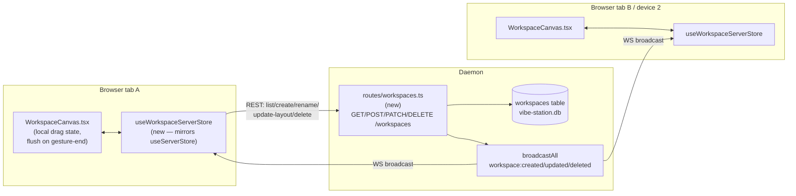

<!--
RULES — read before writing or implementing:
1. FORMAT: Bullets, tables, code, diagrams ONLY — no prose paragraphs
2. REQUIREMENTS: One crisp line each — no verbose descriptions
3. CHECKLIST: Mark items [x] as you complete them — this is your persistent todo list
4. READING TIME: Optimize for fast human scanning — if it's hard to skim, rewrite it
-->

# Plan: Workspace Persistence (05, sub-feature of Agent Interaction State + Workspaces)

> Move SAVED `WorkspaceDoc`s from client-only `localStorage` into a new top-level `workspaces` table in the daemon's `vibe-station.db`, with live cross-client sync over the existing WS broadcast mechanism. The transient per-worktree scratch canvas is untouched.

**Issue:** agent-interaction-workspaces / 05-workspace-persistence
**Branch:** `introducing-new-state` (current)
**Status:** Pending — planning only, not yet implemented
**PRD:** `.vibekit/feature-plans/wip/agent-interaction-workspaces/05-workspace-persistence/prd-05-agent-interaction-workspaces-workspace-persistence.md`
**Parent:** `.vibekit/feature-plans/wip/agent-interaction-workspaces/plan-agent-interaction-workspaces.md` (master; this is a new sub-feature, sibling to `04-workspaces`)

**Reference files:**
- Client data model (today, client-only): `web-ui/src/hooks/useStore.ts:97-110` (`WorkspaceDoc`), `:87-94` (`CanvasGeometry`), `:226-252` (`workspaceDocs`/CRUD actions), `:277-302` (`insertTileIntoCanvas`), `:311-316` (`findWorkspacesTilingSession`), `:671-901` (`persist` middleware, `version: 15`, `migrate`)
- Client canvas component (writer of layout edits): `web-ui/src/components/layout/WorkspaceCanvas.tsx:163-175` (`readCanvas`/`patchCanvas`), `:315-357` (`addTile`/`removeTile`/`saveAsWorkspace`), `:362-463` (drag/resize/divider handlers — call `patchCanvas` on every `mousemove`)
- Server-truth store precedent (client): `web-ui/src/hooks/useServerStore.ts` (full file — `ServerData` shape + `applyXCreated/Updated/Deleted` reducers), `web-ui/src/hooks/useServerSync.ts` (full file — initial fetch + `ws:open` refetch + WS reducer wiring)
- Daemon schema: `daemon/src/services/dbSchema.ts` (full file — `ensureSchema`, `addColumnIfMissing` migration pattern)
- Daemon top-level-entity precedent: `daemon/src/routes/projects.ts:126` (`registerProjectRoutes`), `:303-317` (`POST /projects` — validate, persist, `broadcastAll`), `:858` (`POST.../DELETE` → `broadcastAll({ type: "project:deleted", projectId })`)
- Daemon route registration: `daemon/src/server.ts:8-16` (`register*Routes` calls)
- Daemon store cache pattern (NOT reused as-is — see Decision 1): `daemon/src/state/project-store.ts` (full file — `mutateProject`, `writeProjectFull`, in-memory cache tied to `Database` handle identity)
- WS protocol: `daemon/src/ws/protocol.ts:354-398` (`ProjectCreatedEvent`/`ProjectUpdatedEvent`/`ProjectDeletedEvent`/`WorktreeCreatedEvent`/etc. — the event-shape precedent this plan's new events follow), `daemon/src/broadcaster.ts` (full file — `broadcastAll`)
- WS broadcast fan-out (client side): `web-ui/src/api/index.ts:5` (`api` singleton), `web-ui/src/api/client.ts:227-278` (`listProjects`/`listWorktrees` REST call shape — the pattern new `listWorkspaces`/`createWorkspace`/etc. calls follow), `web-ui/src/api/mock.ts:305-483` (mock counterpart — every real API method needs a mock twin)
- Client types: `web-ui/src/api/types.ts:9-45` (`Project`/`Worktree` — shape precedent for a new `WorkspaceDoc` API type)
- Routing (already shipped, unaffected): `web-ui/src/App.tsx:65` (`/workspaces/:workspaceId` route — already exists from 04-workspaces Phase 3, consumes whatever `workspaceDocs[id]` resolves to; this plan changes where that map's data comes from, not the route)
- Sibling plan (data model + canvas UX, already shipped): `.vibekit/feature-plans/wip/agent-interaction-workspaces/04-workspaces/plan-04-agent-interaction-workspaces-workspaces.md`

---

## Problem

- See [prd-05-...md](./prd-05-agent-interaction-workspaces-workspace-persistence.md) §Problem — `WorkspaceDoc` lives only in the browser's `localStorage` (`useStore.ts:671`, `name: "vibestation:workspace"`); no daemon-side storage exists at all (confirmed: `grep -rn WorkspaceDoc daemon/src` returns zero hits). Two tabs/devices on the same daemon never converge; a cleared browser profile loses saved workspaces permanently.

## Out of Scope

- `WorktreeLayout.scratchCanvas` (`useStore.ts:44`) — stays exactly as-is, client-only, untouched (PRD Non-goals).
- Any change to the canvas tiling/free-form editing UX, tile chrome, or state-coloring (04-workspaces, shipped) — this plan only relocates persistence.
- Multi-user permissions/ownership.
- Operation-based/CRDT conflict merge — last-write-wins only (PRD Options, Decision 2 below).
- A dedicated Workspaces management page.
- Presence indicators ("who's editing this workspace").

## Concept

- See [prd-05-...md](./prd-05-agent-interaction-workspaces-workspace-persistence.md) §Goals/§1-§5 for full behavior.
- Three parts: (1) daemon-side storage — new top-level `workspaces` table + REST CRUD; (2) live sync — new WS events broadcast on every mutation, new client-side `useWorkspaceServerStore` (mirroring `useServerStore`) fetched/patched the same way `useServerSync` already does for projects/worktrees/sessions; (3) client migration — one-time upload of any `localStorage`-only `WorkspaceDoc`s into the daemon on first successful connect post-upgrade.
- `useWorkspaceStore`'s `workspaceDocs` map (`useStore.ts:226`) stops being a `persist`-backed source of truth for saved docs and becomes a **read-through cache of server data** — `WorkspaceCanvas.tsx`'s `readCanvas`/`patchCanvas` (`WorkspaceCanvas.tsx:163-175`) keep working against local state for drag/resize responsiveness, but every layout write is flushed to the daemon on gesture-end (Decision 4) instead of only ever living in `localStorage`.

## Requirements

| # | PRD ID | Requirement |
|---|--------|-------------|
| 1 | R1-R4 | New top-level daemon `workspaces` table stores id/name/geometry (`mode`, `tiles`, `tree`, `freeRects`); REST CRUD (list/create/rename/update-layout/delete). |
| 2 | R5-R9 | Every mutation broadcasts a WS event (`broadcastAll`); client refetches on `ws:open` reconnect, same pattern as `useServerSync`. |
| 3 | R10-R11 | Last-write-wins on concurrent layout edits; in-flight local drag/resize gestures are not interrupted by an incoming remote patch until gesture end. |
| 4 | R12-R14 | One-time, automatic, idempotent upload of pre-existing `localStorage` `WorkspaceDoc`s on first successful connect; local copies survive an unreachable daemon and retry later. |
| 5 | R15-R16 | `scratchCanvas` and the canvas editing UX are functionally and visually unchanged. |

---

## Research

### Client: `WorkspaceDoc` today is `persist`-backed, not server data

- **File:** `web-ui/src/hooks/useStore.ts:226` — `workspaceDocs: Record<string, WorkspaceDoc>` lives inside `useWorkspaceStore`, whose `persist` middleware (`:671-901`) writes the whole map to `localStorage` under `partialize` (`:899` includes `workspaceDocs`/`workspaceOrder`).
- **File:** `web-ui/src/hooks/useStore.ts:574-622` — `createWorkspace`/`renameWorkspace`/`deleteWorkspace`/`updateWorkspaceDoc`/`insertTileIntoWorkspaceDoc` are synchronous local `set()` calls, no network I/O anywhere in this file today.
- **Risk:** HIGH — every one of these five actions, plus every `WorkspaceCanvas.tsx` call site that invokes them, needs to become (or trigger) a network write. Getting the local-optimistic-vs-server-confirmed split wrong will either lag the UI (waiting on round-trips for a drag) or silently drop concurrent edits.

### Client: layout writes happen on every `mousemove`, not on gesture end

- **File:** `web-ui/src/components/layout/WorkspaceCanvas.tsx:377-391` (`startDrag`'s `onMove`), `:412-421` (`startResize`'s `onMove`), `:449-455` (`startDividerDrag`'s `onMove`) — each calls `patchCanvas(...)` on every `mousemove` event during a drag, which today is a cheap in-memory `set()`.
- **Risk:** HIGH if unaddressed — naively wiring `patchCanvas` straight to a `PUT /workspaces/:id` call would fire dozens of HTTP requests per second during a single drag. Confirmed no existing debounce anywhere in these three handlers today.
- **Mitigating precedent:** `startDrag`'s `onUp` (`:392-396`) and `startResize`'s `onUp` (`:423-426`) already exist as the natural "gesture ended" hook — used today only to remove the window listeners.

### Server-truth client store precedent — reuse the shape, don't invent a third one

- **File:** `web-ui/src/hooks/useServerStore.ts:1-114` (full file) — `ServerData` = flat arrays (`projects`/`worktrees`/`sessions`) + `loaded` flag + `replaceAll` (bulk) + per-entity `applyXCreated/Updated/Deleted` reducers (targeted WS patches). Explicitly documented as "NOT persisted... server truth — always fetch on load" (`:13`).
- **File:** `web-ui/src/hooks/useServerSync.ts:36-82` — one `useEffect` does: initial fetch (`Promise.all` of `listProjects`/`listWorktrees`/`listSessions`) + refetch on every `ws:open` (dedup'd via a module-level `inFlightRefresh` guard, `:19`, `:55-75`) — reconnect-safe by construction.
- **File:** `web-ui/src/hooks/useServerSync.ts:86-189` — second `useEffect` wires one `api.on(eventName, handler)` per WS event type, each calling the matching `useServerStore` reducer.
- **Decision (Decision 3 below):** the same two-file shape (`useWorkspaceServerStore.ts` + wiring folded into `useServerSync.ts`) is the least-novel design — it is the one thing this plan should NOT invent freshly.

### Daemon: top-level-entity CRUD + broadcast precedent (`projects`)

- **File:** `daemon/src/routes/projects.ts:126` (`registerProjectRoutes`), `:277-317` (`POST /projects` — zod-validate body, `addProject`, `broadcastAll({ type: "project:created", project })`), `:858` (`DELETE` → `broadcastAll({ type: "project:deleted", projectId: id })`).
- **File:** `daemon/src/server.ts:9,16` — `registerProjectRoutes(app)` called alongside five sibling `register*Routes` calls; a new `registerWorkspaceRoutes(app)` slots in the same way.
- **Confirmed absent:** `grep -rn "workspace" daemon/src` (case-sensitive `Workspace`/`workspaceDocs`) returns zero hits — no existing daemon-side concept to collide with or extend.

### Daemon: `project-store.ts`'s cache pattern is NOT a fit here (see Decision 1)

- **File:** `daemon/src/state/project-store.ts:1-47` (module doc) — the cache is deliberately keyed to a project's full worktree/session object graph (`writeProjectFull` deletes+reinserts every child row per write, `:228-272`) because that graph is the daemon's single hottest read path (per-keystroke `findSessionRecord`, `:11-21`).
- **Contrast:** a `workspaces` table has no such graph — one row per workspace, no FK-owned children in another table (tiles/tree/freeRects are serialized JSON columns on the row itself, see Data Model). A `mutateProject`-style "clone, mutate, delete-and-reinsert-children, refresh" apparatus is unneeded complexity for a single-row upsert.
- **Decision:** simple direct `better-sqlite3` prepared statements (list/get/insert/update/delete), no bespoke in-memory graph cache — see Decision 1.

### WS event shape precedent

- **File:** `daemon/src/ws/protocol.ts:354-398` — every existing top-level-entity event pairs a `created`/`updated` event carrying the full serialized record (`z.record(z.string(), z.unknown())`) with a `deleted` event carrying only the id. New `workspace:created`/`workspace:updated`/`workspace:deleted` events follow this exact shape (see API Contracts).
- **File:** `daemon/src/broadcaster.ts:30-35` — `broadcastAll(msg: ServerMessage)` is the one function every route already uses; no session-scoped variant needed since a workspace isn't tied to a session's subscriber list (unlike `sendToSession`, `broadcaster.ts:37+`).

### Migration source data — what's already in `localStorage` today

- **File:** `web-ui/src/hooks/useStore.ts:846-874` — the existing `v14 → v15` migration is the most recent precedent for a `workspaceDocs`-adjacent migration branch; this plan's client migration (R12-R14) is NOT a `persist` `version` bump (the shape of `WorkspaceDoc` itself doesn't change) — it's a one-time upload side effect, triggered once server sync is live, not a `migrate()` function change. See Decision 5.

---

## Architecture Diagram



---

## Design Details

### Critical User Journeys (CUJs)

#### CUJ 1 — User saves a workspace, sees it live on a second tab (happy path, R1/R5)

```
User A clicks "Save as workspace" on WorkspaceCanvas (worktree context)
  → Client POSTs /workspaces { name, contextKey, mode, tiles, tree, freeRects }
  → Daemon inserts row, broadcasts workspace:created { workspace: <full row> }
  → User A's client applies the create locally (already has it via the POST response,
    reducer is idempotent — same as applySessionCreated's existing-id check)
  → User B's (second tab) WS listener receives workspace:created, useWorkspaceServerStore
    inserts it, sidebar's global Workspaces list updates with no reload
```
- **Edge case:** two clients call "Save as workspace" simultaneously with the same name — both succeed, two distinct ids, no uniqueness constraint on `name` (matches today's client-only behavior, PRD CUJ "no dedup needed").

#### CUJ 2 — User drags a tile; the write lands once, on release (happy path, R7, R10)

```
User A starts dragging a tile in a saved workspace
  → Each mousemove updates LOCAL state only (readCanvas/patchCanvas keep writing to
    an in-memory "pending edit" buffer, not the network — see Decision 4)
  → mouseup (gesture end) fires: client sends ONE
    PATCH /workspaces/:id/layout { mode, tiles, tree, freeRects }
  → Daemon overwrites the row's geometry columns, broadcasts workspace:updated
  → User B (viewing the same workspace) receives workspace:updated, tile jumps
    to the new position — acceptable per PRD R11 (not mid-gesture, since B wasn't dragging)
```
- **Edge case (R11):** User B is ALSO mid-drag on a different tile of the same workspace when A's `workspace:updated` arrives — B's local pending-edit buffer is not overwritten; the incoming patch is merged into B's base geometry for every field except the tile B is actively moving, then B's own gesture-end write follows normally. (Simplification for this round, flagged in Risks: a genuinely simultaneous multi-user drag on the SAME tile is not specially handled — last-write-wins at the HTTP layer, per PRD Decision.)
- **Edge case:** WS disconnects mid-drag — local drag still works (pure client state until gesture-end); the gesture-end PATCH is retried on reconnect if it failed, same retry posture as any other REST call's existing error handling (toast + no silent loss — confirm exact UX at implementation time against how other PATCH failures surface today).

#### CUJ 3 — Workspace deleted by another client while open (R8, PRD Resolved Q4)

```
User B has /workspaces/<id> open
  → User A deletes that workspace
  → Daemon broadcasts workspace:deleted { workspaceId }
  → User B's useWorkspaceServerStore removes it from workspaceDocs
  → Workspace.tsx's existing "doc not found" effect (mirrors the missing-direct-session
    pattern already used elsewhere, per 04-workspaces plan's CUJ 3 edge case) fires and
    redirects User B to "/"
```
- **Edge case:** User B was mid-drag when the delete lands — the eventual gesture-end PATCH targets a since-deleted id; daemon responds 404, client discards the pending write silently (nothing to converge to) rather than erroring loudly.

#### CUJ 4 — First load post-upgrade: local-only workspaces migrate (happy path, R12-R14)

```
User upgrades to a build with this change, opens the app
  → useWorkspaceServerStore's initial sync fetches GET /workspaces (server list, likely empty
    for this user on first upgrade)
  → Migration effect compares local persist()-stored workspaceDocs (still present in
    localStorage, untouched by any persist version bump — see Decision 5) against the
    server list by id
  → Every local id NOT present server-side is POSTed to /workspaces with a client-supplied id
    (idempotency key — see Decision 5) so a retried/duplicate migration attempt never
    double-creates
  → On confirmed success per doc, that doc's local-only flag is cleared (see Data Model,
    client-side sentinel) — it's now server-backed like any other
  → workspaceDocs stops being read from persist() for anything not yet uploaded
```
- **Edge case (R13):** daemon unreachable during migration — upload attempts fail, local docs stay in `localStorage` untouched (nothing deleted pre-confirmation), `useWorkspaceServerStore` shows what it has (possibly empty) while local docs still render via the not-yet-migrated fallback path (Decision 5) — retried on next `ws:open`.
- **Edge case (R14):** the SAME local doc was already migrated from a different browser under a different server-side id (no shared identity across browsers pre-migration) — out of scope for automatic de-dup (PRD doesn't require cross-browser content-based dedup); this migration only prevents re-uploading from the SAME browser twice.

### System Boundaries

| Boundary | Fields + types | Errors | Source of truth |
|----------|----------------|--------|-----------------|
| Client ↔ Daemon (REST) | See API Contracts below | `400 VALIDATION_ERROR` (zod), `404 NOT_FOUND` (unknown id), `409 CONFLICT` (create with a client-supplied id that already exists — migration idempotency) | Daemon |
| Daemon ↔ Client (WS) | `workspace:created { workspace }`, `workspace:updated { workspace }`, `workspace:deleted { workspaceId }` — full-row payloads, same shape as `project:created`/`worktree:created` | none new (WS delivery is best-effort; reconnect refetch is the correctness backstop, R9) | Daemon (set at write time, broadcast is fire-and-forget) |
| Client ↔ DB (daemon-local) | `workspaces` table — see Data Model | SQLite constraint violations surface as 500s (mirrors existing route error handling elsewhere in `routes/projects.ts`) | `vibe-station.db`, daemon-exclusive writer (same invariant `project-store.ts:23-28` documents) |
| Module ↔ Module (web-ui, in-process) | `useWorkspaceServerStore` (new) ↔ `WorkspaceCanvas.tsx` — canvas reads/writes through the SAME `readCanvas`/`patchCanvas` function signatures it uses today (Decision 4); only what's behind those functions changes | n/a | `useWorkspaceServerStore` for saved docs; `useWorkspaceStore.layoutByWorktree[...].scratchCanvas` unchanged for transient |

### Data Model

| Entity | Field | Type | Constraints | Notes |
|--------|-------|------|-------------|-------|
| `workspaces` (new table) | `id` | `TEXT` | PK | Client-supplied on create (existing `randomId()` client-side convention, `useStore.ts:575`) — enables migration idempotency (Decision 5), matches how `sessions`/`worktrees` ids already work (`project-store.ts` inserts client/daemon-generated ids, never `AUTOINCREMENT`) |
| `workspaces` | `name` | `TEXT NOT NULL` | — | |
| `workspaces` | `contextKey` | `TEXT NOT NULL` | — | Provenance only (04-workspaces Decision 5) — carried over unchanged in meaning |
| `workspaces` | `mode` | `TEXT NOT NULL` | `CHECK (mode IN ('tiled','free'))` | |
| `workspaces` | `tiles` | `TEXT NOT NULL` | — | JSON-serialized `TileSpec[]` (`useStore.ts:59-72`) — no relational tile table; matches the "small local daemon, not a distributed system" scale this app already operates at (see `project-store.ts`'s own module doc for the precedent of choosing simplicity at this scale) |
| `workspaces` | `tree` | `TEXT` | nullable | JSON-serialized `LayoutNode \| null` (`lib/tiling.ts`) |
| `workspaces` | `freeRects` | `TEXT NOT NULL` | — | JSON-serialized `Record<string, FreeRect>` |
| `workspaces` | `createdAt` | `TEXT NOT NULL` | ISO8601 | |
| `workspaces` | `updatedAt` | `TEXT NOT NULL` | ISO8601 | Bumped on every PATCH — used for R10's "clients converge shortly after" (a client that just wrote can ignore a same-or-older `updatedAt` broadcast echo of its own write, avoiding a redundant re-render/loop) |
| Client-side only: `WorkspaceDoc` (`useStore.ts:97`) | *(unchanged shape)* | — | — | Becomes the client-side type returned by `useWorkspaceServerStore`, not a `persist`-backed record; `contextKey` kept for compat with existing consumers (sidebar "created in X" hint, if any) |
| Client-side only: migration sentinel | `localOnlyWorkspaceIds: string[]` (or equivalent) | — | — | Transient/persisted client flag tracking which locally-originated ids still need upload — see Decision 5; lives in `useWorkspaceStore`'s existing `persist` blob (small, scalar-ish addition, not a new table) |

- **Migration (daemon):** `addColumnIfMissing`-style `CREATE TABLE IF NOT EXISTS workspaces (...)` added to `dbSchema.ts`'s `ensureSchema` — brand-new table, no backfill needed (nothing existed server-side before).
- **Migration (client):** NOT a `persist` `version` bump (`WorkspaceDoc`'s shape is unchanged) — a one-time upload side effect wired into the new sync hook, see Decision 5.

### API Contracts

```
GET /workspaces
  Request:  —
  Response: 200 WorkspaceDoc[]  (full rows, geometry fields parsed from JSON columns)
  Errors:   —

POST /workspaces
  Request:  { id: string, name: string, contextKey: string, mode: "tiled"|"free",
              tiles: TileSpec[], tree: LayoutNode|null, freeRects: Record<string,FreeRect> }
  Response: 201 WorkspaceDoc
  Errors:   400 VALIDATION_ERROR (zod), 409 CONFLICT (id already exists — migration replay)
  Broadcast: workspace:created { workspace: WorkspaceDoc }

PATCH /workspaces/:id
  Request:  { name?: string }               -- rename
  Response: 200 WorkspaceDoc
  Errors:   400 VALIDATION_ERROR, 404 NOT_FOUND
  Broadcast: workspace:updated { workspace: WorkspaceDoc }

PATCH /workspaces/:id/layout
  Request:  { mode: "tiled"|"free", tiles: TileSpec[], tree: LayoutNode|null,
              freeRects: Record<string,FreeRect> }   -- full-geometry replace, gesture-end only
  Response: 200 WorkspaceDoc
  Errors:   400 VALIDATION_ERROR, 404 NOT_FOUND
  Broadcast: workspace:updated { workspace: WorkspaceDoc }

DELETE /workspaces/:id
  Request:  —
  Response: 200 { ok: true }
  Errors:   404 NOT_FOUND
  Broadcast: workspace:deleted { workspaceId: string }
```

- Rename and layout-update are separate endpoints (not one generic `PATCH /workspaces/:id` with optional fields for everything) — keeps the high-frequency gesture-end write's request body small and its intent unambiguous in server logs/tests; both broadcast the same `workspace:updated` event shape so the client doesn't need to distinguish.
- `WorkspaceDoc` wire shape = the existing client type (`useStore.ts:97-110`) verbatim, so `web-ui/src/api/types.ts` can alias/import it rather than redefine it.

### Key Decisions

#### Decision 1: Direct prepared statements for `workspaces`, no `project-store.ts`-style graph cache

- **Decision:** implement `daemon/src/state/workspace-store.ts` (new) with plain `db.prepare(...)` list/get/insert/update/delete — no per-handle in-memory `Map` cache, no clone-mutate-refresh apparatus.
- **Rationale:** `project-store.ts`'s cache exists because the project/worktree/session graph is reassembled from 3 joined tables on every read and sits on a per-keystroke hot path (module doc, `project-store.ts:1-21`); `workspaces` is one flat table with no child rows and no comparable read frequency (opened rarely — on saving, listing in a sidebar, or loading a workspace view). Adding the cache pattern here is complexity with no measured problem to solve.
- **Where:** `daemon/src/state/workspace-store.ts` (new file).

#### Decision 2: Last-write-wins, no per-field merge, no op log

- **Decision:** `PATCH /workspaces/:id/layout` fully replaces `mode`/`tiles`/`tree`/`freeRects`; the server does not attempt to merge concurrent writes.
- **Rationale:** matches PRD's chosen option (no operation-based merge) and every other entity's mutation model in this codebase (`writeProjectFull` is itself a full delete-and-reinsert, not a diff — `project-store.ts:220-227`'s own comment: "Simple full-replace strategy... rather than a diff — correct and easy to reason about at the scale a local per-user daemon operates at").
- **Where:** `daemon/src/routes/workspaces.ts` (new), the `PATCH /:id/layout` handler.

#### Decision 3: Client sync reuses the `useServerStore`/`useServerSync` shape exactly

- **Decision:** new `web-ui/src/hooks/useWorkspaceServerStore.ts` (mirrors `useServerStore.ts`'s `ServerData` shape: flat array + `loaded` + `applyCreated/Updated/Deleted` reducers) and fold its fetch/WS-wiring into the existing `useServerSync.ts` (one more `Promise.all` entry, one more set of `api.on(...)` handlers) rather than writing a parallel sync mechanism.
- **Rationale:** PRD explicitly calls this out (§Client architecture change) — `useServerSync`'s reconnect-safe refetch-on-`ws:open` + in-flight-dedup guard (`useServerSync.ts:19-82`) is exactly the correctness property R9 needs; reimplementing it for workspaces risks a subtly different (and untested) reconnect story.
- **Where:** `web-ui/src/hooks/useWorkspaceServerStore.ts` (new), `web-ui/src/hooks/useServerSync.ts` (modified — add workspace fetch + 3 new `api.on` handlers alongside the existing ones).

#### Decision 4: `WorkspaceCanvas.tsx` keeps its local-optimistic drag path; only the flush target changes

- **Decision:** `readCanvas`/`patchCanvas` (`WorkspaceCanvas.tsx:163-175`) continue to exist with the same signatures. For a saved doc, `patchCanvas` during an active drag writes to a **local pending-geometry buffer** (component-local `useState`/`useRef`, not the server store) exactly as fast as today; a new `flushLayout()` call — wired into the existing `onUp` handlers (`:392-396`, `:423-426`) and `startDividerDrag`'s `onUp` (`:457-460`) — sends the ONE `PATCH /workspaces/:id/layout` request per completed gesture.
- **Rationale:** preserves drag responsiveness (zero network latency per frame, unchanged from today) while bounding write frequency to "once per user gesture" — directly answers PRD Open Question 4 (proposed: gesture-end only) and avoids flooding the WS/DB.
- **Where:** `web-ui/src/components/layout/WorkspaceCanvas.tsx:163-175` (modify `readCanvas`/`patchCanvas` dispatch), `:392-396`, `:423-426`, `:457-460` (add `flushLayout()` calls in each `onUp`).

```ts
// Sketch — the shape that matters is "every onMove stays purely local; only
// onUp crosses the network," not the exact buffer implementation.
function patchCanvas(patch: Partial<CanvasGeometry>) {
  if (savedDocId) {
    pendingGeometryRef.current = { ...readCanvas(), ...patch }; // local only
    forceRerender(); // whatever the component already uses to reflect local state
  } else {
    store.updateScratchCanvas(worktreeId, patch); // unchanged — scratch stays local-only
  }
}
function flushLayout() {
  if (!savedDocId || !pendingGeometryRef.current) return;
  const g = pendingGeometryRef.current;
  pendingGeometryRef.current = null;
  api.updateWorkspaceLayout(savedDocId, g); // fire PATCH .../layout — see API Contracts
}
```

#### Decision 5: Migration is a one-time upload side effect, not a `persist` version bump; client-supplied ids give idempotency

- **Decision:** `WorkspaceDoc`'s stored shape does not change, so no `useStore.ts` `migrate()` branch is added for this. Instead, a new effect (co-located with the sync wiring, Decision 3) runs once per app load: after the first successful `GET /workspaces`, diff local `persist()`-stored `workspaceDocs` ids against the server list; for every id not present server-side, POST it using that SAME id as the new row's PK.
- **Rationale:** reusing the existing client-generated id as the server row's PK means a retried migration attempt (app reloaded before the first attempt's response was confirmed, or two tabs racing the same migration) is a harmless `409 CONFLICT` on the second attempt rather than a duplicate — no separate idempotency-key mechanism needed.
- **Where:** `web-ui/src/hooks/useServerSync.ts` (new migration effect, gated on `useWorkspaceServerStore`'s `loaded` flag going true), `daemon/src/routes/workspaces.ts` (`POST /workspaces` honors a client-supplied `id`, 409s on collision — see API Contracts).

---

## Risks / Open Questions

| # | Question | Notes |
|---|----------|-------|
| 1 | **Exact UX when a gesture-end `PATCH /workspaces/:id/layout` fails (network drop, 404 on a since-deleted doc)** | PRD Open Question 1/CUJ 2 edge case propose: silent discard on 404 (nothing to converge to), toast + no data loss on network failure (local pending buffer is NOT cleared until a confirmed 200, so nothing is lost — just re-flushed on the next gesture or an explicit retry). Confirm the exact toast/retry UX against existing PATCH-failure conventions elsewhere in the app before implementing Phase 2. |
| 2 | **Should `updatedAt`-based echo suppression (Data Model note) be implemented this round, or is a harmless extra re-render acceptable?** | Proposed: skip it initially — an extra re-render from a client receiving its own broadcast echo is a minor inefficiency, not a correctness bug (per `applySessionUpdated`'s existing "just overwrite" reducer style, no existing echo-suppression precedent found in `useServerStore.ts`). Revisit only if it's visibly janky. |
| 3 | **Multi-tile-drag collision (CUJ 2's "User B is ALSO mid-drag" edge case) — is the proposed partial-merge worth building, or is a flat last-write-wins (B's gesture-end write simply clobbers whatever A sent) acceptable?** | PRD's chosen option is flat last-write-wins with no merge (Options table) — CUJ 2's "merge every field except the actively-dragged tile" is arguably scope creep beyond that decision. **Propose simplifying to flat last-write-wins even in this edge case** (no special-casing) unless the reviewer disagrees — flag for plan-review resolution before implementation starts. |
| 4 | **Does `PATCH /workspaces/:id` (rename) also need gesture-end-style write-suppression, or is it low-frequency enough to fire immediately?** | Rename is a discrete user action (type a name, hit enter/blur), not a continuous gesture — propose: fire immediately, no buffering needed, unlike layout PATCH. |
| 5 | **`contextKey` on the new table — required at create time from every caller, or does the server default it?** | `createWorkspace(contextKey, name, mode)` (`useStore.ts:229`, `574`) already always passes it client-side today — propose keeping it required in the POST body, no server-side default needed. Confirm no call site exists that omits it. |

---

## Implementation Phases

### Phase 1 — Daemon storage + REST CRUD

- [ ] **1.1** Add `workspaces` table to `daemon/src/services/dbSchema.ts`'s `ensureSchema` (`CREATE TABLE IF NOT EXISTS workspaces (id TEXT PRIMARY KEY, name TEXT NOT NULL, contextKey TEXT NOT NULL, mode TEXT NOT NULL CHECK (mode IN ('tiled','free')), tiles TEXT NOT NULL, tree TEXT, freeRects TEXT NOT NULL, createdAt TEXT NOT NULL, updatedAt TEXT NOT NULL)`)
- [ ] **1.2** New `daemon/src/state/workspace-store.ts` — `listWorkspaces()`, `getWorkspace(id)`, `addWorkspace(record)`, `updateWorkspace(id, patch)`, `updateWorkspaceLayout(id, geometry)`, `deleteWorkspace(id)` — direct prepared statements per Decision 1, JSON-serialize `tiles`/`tree`/`freeRects` on write, parse on read
- [ ] **1.3** New `daemon/src/routes/workspaces.ts` — `registerWorkspaceRoutes(app)`: `GET /workspaces`, `POST /workspaces` (zod body, 409 on id collision), `PATCH /workspaces/:id` (rename), `PATCH /workspaces/:id/layout`, `DELETE /workspaces/:id` — each mutating route calls `broadcastAll(...)` per API Contracts
- [ ] **1.4** Register in `daemon/src/server.ts` — `import { registerWorkspaceRoutes } from "./routes/workspaces.js"` + call alongside the other five `register*Routes` calls
- [ ] **1.5** Add `WorkspaceCreatedEvent`/`WorkspaceUpdatedEvent`/`WorkspaceDeletedEvent` to `daemon/src/ws/protocol.ts` (same shape as `ProjectCreatedEvent` et al., `protocol.ts:354-398`) and add them to the `ServerMessage` union

**Verify phase 1:**
- [ ] **1.T1** Unit — `workspace-store.test.ts`: create → get round-trips `tiles`/`tree`/`freeRects` byte-identical after JSON round-trip (including `tree: null` and an empty `freeRects: {}`)
- [ ] **1.T2** Integration — `routes/workspaces.test.ts`: `POST /workspaces` with a duplicate `id` returns `409`; `PATCH /workspaces/:id/layout` on an unknown id returns `404`
- [ ] **1.T3** Integration — `routes/workspaces.test.ts`: every mutating route asserts `broadcastAll` was called with the expected event `type` and payload shape (mirrors existing `projects.test.ts` broadcast-assertion style)

---

### Phase 2 — Client sync wiring

- [ ] **2.1** New `web-ui/src/hooks/useWorkspaceServerStore.ts` — `WorkspaceServerData` (flat `workspaces: WorkspaceDoc[]`, `loaded: boolean`, `replaceAll`, `applyWorkspaceCreated/Updated/Deleted`), mirroring `useServerStore.ts:17-114` exactly
- [ ] **2.2** Add `WorkspaceDoc` REST methods to `web-ui/src/api/client.ts` (`listWorkspaces`, `createWorkspace`, `renameWorkspace`, `updateWorkspaceLayout`, `deleteWorkspace`) following the `listProjects`/`addProject` shape (`client.ts:227-241`); mirror each in `web-ui/src/api/mock.ts`
- [ ] **2.3** Extend `web-ui/src/hooks/useServerSync.ts`'s initial-fetch `Promise.all` (`:59-63`) with `api.listWorkspaces()`, feed into `useWorkspaceServerStore`'s `replaceAll`; add `workspace:created`/`workspace:updated`/`workspace:deleted` handlers to the second `useEffect` (`:86-189`) calling the matching `applyWorkspace*` reducer
- [ ] **2.4** Rewire `useWorkspaceStore`'s `workspaceDocs`-touching actions (`createWorkspace`/`renameWorkspace`/`deleteWorkspace`/`updateWorkspaceDoc`/`insertTileIntoWorkspaceDoc`, `useStore.ts:574-622`) to call the new API methods instead of local `set()`, OR (implementer's call, confirm against how deeply `WorkspaceCanvas.tsx` and `LeftSidebar.tsx` already couple to these exact action names) replace their call sites to read from `useWorkspaceServerStore` directly — pick whichever keeps `WorkspaceCanvas.tsx`'s existing call sites (`saveAsWorkspace`, `addTile`, etc.) working with the smallest diff
- [ ] **2.5** Implement Decision 4's local-pending-geometry buffer + `flushLayout()` in `WorkspaceCanvas.tsx`, wired into the three `onUp` handlers (`:392-396`, `:423-426`, `:457-460`)
- [ ] **2.6** Drop `workspaceDocs`/`workspaceOrder` from `useWorkspaceStore`'s `persist` `partialize` (`useStore.ts:899-900`) once Phase 2/3 both land — keep them in the in-memory state shape (still used as the local migration source, Decision 5) but stop writing them to `localStorage` going forward (bump `persist` `version` to 16 with a `migrate()` no-op-for-shape branch that just leaves old persisted `workspaceDocs` alone so Phase 3's migration effect can still read them once)

**Verify phase 2:**
- [ ] **2.T1** Unit — `useWorkspaceServerStore.test.ts`: `applyWorkspaceUpdated` on an unknown id is a no-op (mirrors `applyWorktreeUpdated`'s existing "drop silently" behavior, `useServerStore.ts:87-96`)
- [ ] **2.T2** Integration — `useServerSync.test.ts`: a `workspace:created` WS event inserts into `useWorkspaceServerStore`; a `workspace:deleted` event removes it
- [ ] **2.T3** Regression — `WorkspaceCanvas.test.tsx` (or equivalent): dragging a tile does NOT fire a network call on every `mousemove`, fires exactly one `updateWorkspaceLayout` call on `mouseup`
- [ ] **2.T4** Regression — scratch canvas (`updateScratchCanvas`/`clearScratchCanvas`) behavior and its existing tests are unaffected by this phase

---

### Phase 3 — Client migration

- [ ] **3.1** Add a `localOnlyWorkspaceIds`-style client-side migration-pending tracker (Data Model) — seeded once from whatever `workspaceDocs` still exist in the OLD `persist` storage at the moment `useWorkspaceServerStore` first loads
- [ ] **3.2** Migration effect (Decision 5) in `useServerSync.ts` (or a new co-located hook): on `useWorkspaceServerStore`'s `loaded` transitioning true, for every locally-known id not in the server list, `POST /workspaces` with that id; on `200`/`201` clear it from the pending tracker; on `409` (already migrated elsewhere) also clear it (already server-known, nothing to do); on any other failure, leave it pending for the next `ws:open`
- [ ] **3.3** Confirm/implement the "unreachable daemon" degraded read path (R13) — while `useWorkspaceServerStore.loaded` is false AND local pending ids are non-empty, the sidebar/canvas fall back to rendering from the OLD `persist`-stored `workspaceDocs` rather than an empty list (exact fallback wiring is an implementation-time call — confirm against how `useServerStore`'s `loaded` flag is already consumed elsewhere, e.g. `DashboardPanel`/`LeftSidebar`'s loading-state handling)

**Verify phase 3:**
- [ ] **3.T1** Integration — `migration.test.ts` (or folded into `useServerSync.test.ts`): seed `localStorage` with 2 pre-existing `WorkspaceDoc`s, mount, assert both get `POST`ed exactly once and the pending tracker empties
- [ ] **3.T2** Integration — re-mounting after a successful migration does NOT re-POST the same ids (idempotency, R14)
- [ ] **3.T3** Integration — `POST /workspaces` failing (simulated daemon-unreachable) leaves the pending tracker non-empty and local docs still render (R13)
- [ ] **3.T4** Regression — full daemon + web-ui suites pass (`npm test` or repo's existing per-package test commands — confirm exact commands from `package.json`/CI config at implementation time, not guessed here)

---

## Files & Phase Impact

| File | Status | Phase | Description / Contract Change |
|------|--------|-------|-------------------------------|
| `daemon/src/services/dbSchema.ts` | **Modified** | 1.1 | New `workspaces` table |
| `daemon/src/state/workspace-store.ts` | **New** | 1.2 | Contract: `listWorkspaces(): WorkspaceRow[]`, `addWorkspace`, `updateWorkspace`, `updateWorkspaceLayout`, `deleteWorkspace` · Owns: nothing (stateless, direct DB reads/writes, Decision 1) |
| `daemon/src/routes/workspaces.ts` | **New** | 1.3 | Contract: `registerWorkspaceRoutes(app: FastifyInstance): void` — 5 REST endpoints, see API Contracts |
| `daemon/src/server.ts` | **Modified** | 1.4 | Register new route module |
| `daemon/src/ws/protocol.ts` | **Modified** | 1.5 | 3 new event schemas + `ServerMessage` union entries |
| `daemon/src/state/workspace-store.test.ts` | **New** | 1.T1 | Unit tests |
| `daemon/src/routes/workspaces.test.ts` | **New** | 1.T2, 1.T3 | Integration tests incl. broadcast assertions |
| `web-ui/src/hooks/useWorkspaceServerStore.ts` | **New** | 2.1 | Contract: `WorkspaceServerData` store, mirrors `useServerStore.ts` shape |
| `web-ui/src/api/client.ts` | **Modified** | 2.2 | 5 new methods on `ApiInstance` |
| `web-ui/src/api/mock.ts` | **Modified** | 2.2 | Mock counterparts of the 5 new methods |
| `web-ui/src/api/types.ts` | **Modified** | 2.2 | `WorkspaceDoc` type (or re-export from `useStore.ts`) |
| `web-ui/src/hooks/useServerSync.ts` | **Modified** | 2.3, 3.2 | Extended fetch + WS reducer wiring; migration effect |
| `web-ui/src/hooks/useStore.ts` | **Modified** | 2.4, 2.6, 3.1 | `workspaceDocs` actions call the API; `persist` `partialize`/`version` change; migration-pending tracker field |
| `web-ui/src/components/layout/WorkspaceCanvas.tsx` | **Modified** | 2.5 | `patchCanvas`/`readCanvas` dispatch change; new `flushLayout()` wired into 3 `onUp` handlers |
| `web-ui/src/hooks/useWorkspaceServerStore.test.ts` | **New** | 2.T1 | Unit tests |
| `web-ui/src/hooks/useServerSync.test.ts` | **Modified** | 2.T2, 3.T1, 3.T2, 3.T3 | New WS-reducer + migration test cases |
| `web-ui/src/components/layout/WorkspaceCanvas.test.tsx` | **Modified/New** | 2.T3 | Drag-flush-frequency regression test (confirm existing test file name/presence at implementation time) |
