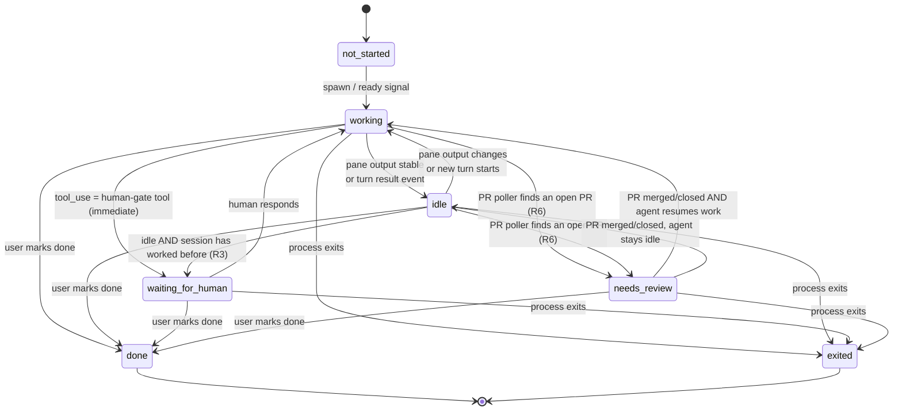

# Agent Interaction State + Workspaces

Adds two semantic lifecycle states — "waiting for human" and "needs review" (PR-triggered) — replacing today's dumb pane-idle heuristic, and introduces **Workspaces**: a canvas of live agent chat/terminal panes and panel panes (any worktree), tileable either free-form or in a window-manager-style split layout, each bordered by its live interaction state.

<!--
RULES — read before writing or implementing:
1. FORMAT: Bullets, tables, code, diagrams ONLY — no prose paragraphs
2. REQUIREMENTS: One crisp line each — no verbose descriptions
3. CHECKLIST: Mark items [x] as you complete them — this is your persistent todo list
4. READING TIME: Optimize for fast human scanning — if it's hard to skim, rewrite it
-->

## Revision note

- **v5** (this revision, docs-accuracy pass — no behavior change): rewrote the Workspaces screen layouts / requirements to describe the **actual shipped UX** instead of earlier speculative/POC-era prose, verified line-by-line against `WorkspaceCanvas.tsx`, `tiling.ts`, `useStore.ts`, `AgentPaneSlot.tsx`, `worktreeStatus.ts`, and `LeftSidebar.tsx`. New: W13-W15 (transient scratch canvas + explicit "Save as workspace" flow + saved-only cross-context picker), L9 (drag-to-tile 5-zone drop overlay — edge = split, center = swap). Resolved design question added for worktree-selection/workspace-viewing independence (folds in and closes the prior open question on "how does a user enter a detached workspace's view"). Sidebar-placement open question narrowed accordingly (exact widget placement still unconfirmed; the navigation-independence *principle* is no longer in question). No existing requirement IDs were renumbered or dropped.
- **v4** (docs restructure only — no new requirements, no behavior change): reorganized the plan-side sub-feature split per user feedback (the v3 split by "when the requirement was gathered" was confusing). See `plan-agent-interaction-workspaces.md`'s own Revision note and the updated Priority & sequencing table below for the full old→new mapping. No PRD requirement IDs changed, moved out of this document, or were dropped.
- **v3**: the feature described by v2 has since been **largely implemented** (real `WorkspaceDoc`/`WorkspaceCanvas`/tiling code exists in `web-ui/`, not just a POC artifact). This revision documents 4 new requirements gathered after the user exercised the shipped feature: (1) a saved workspace must be **detached** from its owning worktree — `WorkspaceDoc.contextKey` as currently modeled is wrong post-save, and "Back to unsaved" must be reworked; (2) the tile-header drag cursor should read as "grab", not "move"; (3) state-colored tile borders must keep working for workspace tiles (regression guard) **and** extend to direct-session single-pane chrome, which has none today; (4) a new agent created from inside a running agent's shell should be able to land as a tile in whichever workspace(s) the source agent is currently tiled in. See new `## 4. Workspace detachment` and `## 5. New-agent workspace affinity` sections, and amendments to `## 2. Workspaces`. Two sub-features were spun off for the larger items — see Priority & sequencing.
- **v2**: renamed `waiting_review` → `waiting_for_human`; replaced the fragile TTY text-heuristic (old R3) with a simpler, universal, high-confidence rule (idle after ever reaching `working` ⇒ `waiting_for_human`); added a second, independent `needs_review` state driven by PR detection; upgraded tiles from static mock content to embedded live chat/terminal panes; added a configurable per-workspace layout mode (free-form vs. window-manager-style tiling). Superseded content from v1 is removed, not kept side-by-side — see git history for v1 if needed.

## Problem

- Today's `LifecycleState` (`not_started|working|idle|done|exited`) is derived purely from pane-output stability (4s of unchanged tmux/pty bytes = "idle") — it cannot tell "agent finished and is truly idle" apart from "agent is blocked waiting on the human."
- A user with many worktrees/agents open has no way to see, at a glance, which tabs actually need their attention right now vs. which are just quietly idle or still working.
- Once an agent opens a PR, nothing in the product surfaces "a human should go review this" — the existing VCS/PR panel is pull-only (manual refresh), not pushed into any session state.
- The current layout is a fixed single-agent-pane + single-tool-panel + single-terminal-dock split (`Layout.tsx`) — there's no way to see multiple agents (possibly from different worktrees) side by side, and no way to actually interact with more than one at a time.

## Goals

- Introduce `waiting_for_human`, a red-bordered state meaning "this session needs you right now," with a simple, high-confidence, channel-agnostic entry rule.
- Introduce `needs_review`, a distinct state meaning "this worktree has an open PR," driven by the existing PR-detection service, not by agent self-reporting.
- Introduce **Workspaces**: a canvas of **live, interactive** agent panes (real chat/terminal content, not a preview) and panel panes, any worktree, each bordered by its state.
- Make workspace tile placement a first-class configurable property: **free-form** (drag anywhere, may overlap) or **tiling** (window-manager-style split layout, never overlaps, always fills the canvas).
- Ship a working POC demonstrating all of the above.

## Non-goals

- Wiring Workspaces or the interaction states into the real daemon/`Layout.tsx` in this PRD — POC only; the POC's "live" panes are locally-simulated content (scripted transcripts + a working local input box), not a real WS connection to a real daemon session. *(Superseded by reality as of v3 — real wiring shipped; kept for history.)*
- Hook-based PR-creation signaling (`PostToolUse` shelling out to notify the daemon) — the recommended mechanism is poll-based (see Resolved design questions); a hook fast-path is an explicit fast-follow, not built this round.
- Multi-user / permissions on workspaces (single local user only, same as today's app).
- Tabbed/stacked tiling layouts (i3-style `tabbed`/`stacked` containers) — tiling ships split-only (row/column); container `layout` values for tabs are a future extension, not built this round.
- **(v3)** Direct sessions becoming full workspace-tileable (i.e. addable as a tile alongside worktree agents) — the new ask is narrowly "give the direct-session pane a state-colored border," not "make direct sessions participate in Workspaces." See Open questions.
- **(v3)** A shared/multi-workspace session model — whether one session can appear as a tile in more than one saved workspace at once is explicitly unresolved, not assumed. See Open questions under §5.
- **(v3)** Any UI for browsing/managing detached workspaces beyond a renamed sidebar section (e.g. no dedicated "Workspaces library" page) — out of scope this round.

---

## Requirements

### 1. Interaction states

| ID | Requirement |
|----|-------------|
| R1 | A session's state model gains two new values: `waiting_for_human` and `needs_review`, alongside `not_started\|working\|idle\|done\|exited`. |
| R2 | **CLI-dependent** — for CLIs with a real human-gate tool (Claude Code's `AskUserQuestion`/`ExitPlanMode`, Cursor's `askQuestionToolCall`/`createPlanToolCall`), a session enters `waiting_for_human` the instant the agent emits that `tool_use` on the JSON (Rich Chat) channel — immediate, not after the turn completes. OpenCode and agy have no equivalent tool and reach `waiting_for_human` only via R3's universal rule (see `03-interaction-states`'s per-CLI capability research). |
| R3 | A session enters `waiting_for_human` when it goes idle (pane-output-stable on TTY, or turn-result on JSON) **and it has reached `working` at least once before** — replaces v1's TTY text-pattern heuristic with one universal, deterministic rule that needs no content inspection and applies to both channels equally. |
| R3a | A session that has **never** reached `working` (still `not_started`) does not qualify for R3 — going idle pre-first-work has no meaning to escalate. |
| R4 | A session exits `waiting_for_human` back to `working` the moment the human responds (sends a chat message, answers the question, submits terminal input that produces new output). |
| R5 | A session exits `waiting_for_human` to `exited`/`done` if the process dies or is marked done while waiting — terminal states always win. |
| R6 | A session enters `needs_review` when the daemon's PR poller finds an **open, non-draft** PR for the worktree's branch — independent of and orthogonal to `waiting_for_human` (a session can theoretically be in only one lifecycle state; see Decision on precedence below). |
| R7 | A session exits `needs_review` when the poller finds the PR merged, closed, or no longer present. |
| R8 | Rollup precedence (highest wins): `waiting_for_human` > `needs_review` > `working` > `idle` > `done` > `exited` > `not_started`. |
| R9 | The daemon broadcasts every state transition over the existing `session:state` WS event (extended enum, not a new event type). |

### State machine



**Entry points (3):**
1. JSON channel: `tool_use` for a human-gate tool name → `waiting_for_human`, deterministic, immediate (R2).
2. Any channel: idle + previously reached `working` → `waiting_for_human` (R3) — this single rule replaces v1's separate, fragile per-channel heuristics.
3. Daemon PR poller: open non-draft PR found for the worktree's branch → `needs_review` (R6), independent of channel or turn state.

**Exit points (3):**
1. *Returns to `working`:* human responds while `waiting_for_human` (R4).
2. *Returns to `working`/`idle`:* PR poller finds the PR merged/closed while `needs_review` (R7) — lands on whichever of `working`/`idle` the session's turn activity actually reflects at that moment.
3. *Absorbed into a terminal state:* `done` (user action) or `exited` (process death) from any non-terminal state — does NOT return to `working`.

---

### 2. Workspaces — live panes

| ID | Requirement |
|----|-------------|
| W1 | A Workspace is a canvas containing zero or more **tiles**; placement mode is a per-workspace property (§3). |
| W2 | A tile wraps exactly one pane: either an agent pane (any session, any worktree) or a panel pane (the existing right-side tool panel, made independently placeable). |
| W3 | An agent-pane tile renders that session's **actual chat/terminal content** — scrollable transcript (Rich Chat message list, or raw terminal output) filling the tile — not a static text preview. |
| W4 | An agent-pane tile includes a working input control (composer box for Rich Chat sessions, keystroke-forwarding for terminal sessions) so the user can reply from inside the tile. |
| W5 | Tiles from different worktrees can coexist in the same workspace. |
| W6 | Every agent-pane tile renders a border colored by its session's interaction state, per the Color mapping table below. In the real (non-POC) product this state is live/pushed via `session:state`; the POC supplies mock/simulated state and scripted transcript content (see Non-goals). |
| W6a | Panel-pane tiles (no underlying session) render the fixed **unset** border style — never a state color. |
| W7 | `waiting_for_human` is always **red** — the one non-negotiable color mapping (per explicit ask). |
| W8 | A new tile can be added to a workspace by picking any existing agent session or the panel pane. |
| W9 | A tile can be removed from a workspace without closing/killing its underlying session. |
| W10 *(v3)* | A tile's drag handle shows a "grab" cursor (open hand), not a 4-way "move" cursor — the handle only ever drags the tile itself, never pans/moves the canvas, so "grab" reads correctly and "move" is misleading. |
| W11 *(v3, regression guard)* | Workspace-mode tiles keep rendering a state-colored indicator (W6/W7) going forward — already implemented as a colored `StatusDot` glyph in the tile header (see correction below), not a full tile border; this is a standing requirement so future changes don't silently regress it. |
| W12 *(v3)* | A **direct session's** single-pane chrome (outside Workspaces — its own dedicated view) also renders an interaction-state color indicator, using the same color mapping as workspace tiles — today it renders no state indicator at all. This does **not** make direct sessions workspace-tileable (see Non-goals). |
| W13 *(v5, shipped)* | Toggling into Workspace mode for a worktree does not auto-create a saved workspace — it opens a **transient, unsaved "scratch canvas"** scoped to that one worktree, seeded from whatever panes are already open. |
| W14 *(v5, shipped)* | An explicit **"Save as workspace"** action (inline named-input form, not a browser `prompt()`) promotes the current scratch-canvas arrangement into a real, named, detached `WorkspaceDoc` — only then does it appear in the sidebar's Workspaces list. |
| W15 *(v5, shipped)* | Cross-worktree/cross-project tile picking (the Add-tile picker grouping by Project → Worktree) is offered **only** once a workspace is saved — the transient/unsaved scratch canvas's picker stays scoped to sessions in its own worktree. |

> **Ground-truth correction (v4, supersedes the v3 note below):** the v3 note claimed workspace tiles only rendered a `StatusDot` glyph, with no border. That was true when v3 was written but is **no longer accurate** — a colored `border-color` per session state was added to `.workspace-canvas__tile--*` (`web-ui/src/styles/workspace-canvas.css`) in the same round that shipped W12's direct-session border, using one shared `sessionStatus()` helper (`web-ui/src/lib/worktreeStatus.ts`) consumed by both `WorkspaceCanvas.tsx` and `AgentPaneSlot.tsx`. **Both surfaces now render an actual colored border; workspace tiles additionally keep the `StatusDot` glyph in the tile header** (belt-and-suspenders, not a fallback). W11 guards both the border and the dot. There is no visual inconsistency between the two surfaces — see 04-workspaces's Phase 2 for the shipped implementation.

### Color mapping

| State | Color | Rationale |
|-------|-------|-----------|
| `waiting_for_human` | 🔴 Red | Explicit requirement — needs human now, most urgent |
| `needs_review` | 🟣 Violet | Distinct from red — informational/lower-urgency ("something's ready"), not blocking |
| `working` | 🔵 Blue (pulsing/animated) | Active, no action needed |
| `idle` | ⚪ Gray | Quiet, no action needed (only reachable pre-first-work under R3a) |
| `done` | 🟢 Green | Completed successfully |
| `exited` | 🟠 Amber/dim | Process gone, may need attention but not urgent |
| `not_started` | ⚫ Dim outline | Spawning |
| panel pane (no session) | — **unset** border (default chrome, no state color at all) | Not session-driven |

---

### 3. Workspace layout modes

| ID | Requirement |
|----|-------------|
| L1 | Each workspace has a `layout mode`: **free-form** (tiles have independent x/y/w/h, draggable anywhere, may overlap) or **tiling** (tiles occupy non-overlapping slots that always fill 100% of the canvas). |
| L2 | Tiling mode uses an n-ary split-tree layout (i3-style): each internal node is a row-or-column split with an ordered list of children and a size ratio per child; leaves hold one tile each. |
| L3 | In tiling mode, dragging the border between two sibling tiles resizes both (zero-sum ratio adjustment), clamped so neither shrinks below a minimum usable size. |
| L4 | In tiling mode, adding a tile splits a chosen existing tile (pick a target tile + edge: left/right/top/bottom) rather than dropping at an arbitrary point. |
| L5 | In tiling mode, removing a tile collapses its slot — the space is absorbed by its sibling(s), never left blank. |
| L6 | Switching a workspace from free-form → tiling auto-arranges existing tiles into a balanced split tree, preserving reading order (top-to-bottom, left-to-right) rather than attempting to reconstruct exact (possibly overlapping) prior geometry. |
| L7 | Switching tiling → free-form is exact and lossless: each leaf's current rendered rect becomes that tile's new x/y/w/h. |
| L8 | The layout-mode toggle is per-workspace, not global — different workspaces can use different modes. |
| L9 *(v5, shipped)* | In tiling mode, dragging a tile's header over another tile shows a 5-zone drop overlay (4 edges, ~25% each, + center, ~50%): dropping on an **edge** splits the grid there (insert, per L4); dropping in the **center swaps** the two tiles' positions — not a "replace." VS-Code-editor-group-style interaction, chosen deliberately. |

---

### 4. Workspace detachment *(v3)*

| ID | Requirement |
|----|-------------|
| D1 | A saved workspace is no longer owned by/scoped to a single worktree — saving a workspace **detaches** it from "the worktree it was created in." |
| D2 | The per-worktree transient scratch canvas (unsaved, pre-save state) is unchanged — it still belongs to exactly one worktree, exactly as today. Only the post-save, named `WorkspaceDoc` becomes detached. |
| D3 | The "Back to unsaved" action is removed for a detached workspace — there is no longer a single "owning worktree" to revert to. |
| D4 | Detached workspaces are listed in a single global list, independent of which worktree (if any) is currently active — not nested under, or filtered by, "the current worktree." |
| D5 | A user can open/view any detached workspace from that global list regardless of which worktree they're currently looking at. |
| D6 | Viewing a detached workspace does not require first navigating into any particular worktree — it is reachable as its own destination. |
| D7 | Tiles inside a detached workspace keep working exactly as before (live panes, any worktree, add/remove) — detachment changes *ownership/entry*, not tile behavior. |
| D8 | Existing saved workspaces (created pre-v3, with a `contextKey`) are migrated to the detached model without data loss — no manual re-save required. |

### 5. New-agent workspace affinity *(v3)*

| ID | Requirement |
|----|-------------|
| S1 | Creating a new agent session can optionally specify a **source agent** (an existing session) it was spawned from. |
| S2 | This works both from the in-app "New Agent"/"Direct Agent" dialogs and from a running agent's own shell (agent-invocable, e.g. via a CLI command available in its environment). |
| S3 | When invoked from inside a running agent's shell with no explicit source specified, the source agent defaults to the invoking agent's own session — no manual ID lookup required. |
| S4 | When the new agent's session is created, it automatically appears as a new tile in whichever workspace(s) currently contain a tile for the source agent's session — no manual "add tile" step required. |
| S5 | If the source agent isn't tiled in any workspace, the new agent is created normally with no auto-tiling side effect (same as today). |
| S6 | Auto-inserted tile placement is deterministic and reasonable by default (e.g. splits the source agent's own tile) — not a random/arbitrary position. |

---

## Options considered

| Option | Pros | Cons | Decision |
|--------|------|------|----------|
| A — Extend `LifecycleState` enum with `waiting_for_human` + `needs_review` | Single source of truth, flows through existing `session:state` broadcast/rollup code | Every switch/exhaustiveness check on `LifecycleState` across daemon+UI must add two cases | ✅ chosen |
| B — Separate orthogonal flags alongside existing lifecycle | No breaking changes to existing enum consumers | Multiple independent fields to keep in sync and rank against each other — more UI branching | ❌ deferred |
| — | — | — | — |
| PR detection: **poll-based** (daemon timer calls existing `fetchPrForBranch`) | Reuses existing, working PR-detection service; only mechanism that can also detect exit (PR merged/closed) or a human/web-created PR; CLI-independent | Poll latency ≤60s (decided: `PR_POLL_INTERVAL_MS = 60_000`, see `03-interaction-states` Decision 3b) vs. instant | ✅ chosen |
| PR detection: **hook-based** (agent's `PostToolUse` hook shells out on `gh pr create`) | Near-instant entry signal | Needs a separate implementation per CLI (only Claude Code hooks are proven in this codebase today); blind to human/web-created PRs; still can't detect merge/close — poller required regardless, making the hook pure duplication for entry only | ❌ deferred to fast-follow (as a latency accelerator on top of the poller, not a replacement) |
| Tiling model: **i3-style n-ary split tree** | Maps 1:1 to nested flexbox, no phantom tree depth, natural fit for mouse-driven resize | Slightly more state to serialize than a strict binary tree | ✅ chosen |
| Tiling model: **strict BSP (binary tree, dwm/bspwm-style)** | Simpler node shape (always 2 children) | A visual row of 3+ panes requires nested binary splits — dragging an "outer" divider resizes an invisible subtree, confusing for mouse users | ❌ deferred |

**Decision A rationale:** reuses `session:state`, `worktreeRolledUpStatus`, and `StatusDot` infrastructure that already exists; TypeScript exhaustiveness checks surface every call site needing an update.

---

## Resolved design questions

1. **Does `waiting_for_human` still need a separate, fragile TTY text-heuristic?** — **No.** v1 proposed matching question-shaped text patterns on TTY output. v2 replaces this entirely with R3 ("idle after ever having worked ⇒ waiting_for_human"), which is deterministic, needs no content inspection, and applies identically to TTY and JSON channels. This directly matches the ask: "Whenever it's Idle after it got to working at least once, it should ideally be in that [waiting-for-human] state."
2. **Can an agent proactively signal "I created a PR" via a hook?** — **Feasible for Claude Code specifically (not built this round).** Research confirms `setupWorkspaceHooks` is already implemented for Claude Code (writes `SessionStart`/`UserPromptSubmit` hooks into `.claude/settings.json`) and the same mechanism could add a `PostToolUse` hook matching `Bash` commands containing `gh pr create`. Cursor/OpenCode hook equivalents are lower-confidence and unimplemented today. Chosen as a fast-follow latency accelerator, not the primary mechanism — see next.
3. **So what actually detects `needs_review`?** — **The existing PR-detection service, polled.** vibe-station already has real PR detection: `daemon/src/services/github.ts` (`fetchPrForBranch`, direct GitHub REST API, not the `gh` CLI) and a route `GET /worktrees/:id/pr`, currently only pulled on-demand by the VCS panel UI. `needs_review` is driven by a new daemon-side poller (mirroring the existing lifecycle poller's shape) calling this same service on an interval and broadcasting `session:state` on change — because only polling can also observe the *exit* condition (PR merged/closed) and catches PRs made by a human or the GitHub web UI, not just ones the agent itself created via a hook.
4. **Does `waiting_for_human` or `needs_review` win in a rollup?** — **`waiting_for_human` (R8).** It represents an active block on the agent's progress; `needs_review` is informational ("something's ready when you get to it").
5. **Are tiles a live view into the real session, or a preview?** — **Live, in the real product; scripted/simulated in the POC (W3/W4, Non-goals).** The user explicitly wants to read and reply from inside a tile, not just see a status snapshot — that's the entire point of Workspaces over the existing single-pane layout.
6. **Free-form or tiling — which is the default, and can both coexist?** — **Both modes ship; per-workspace, user's choice, no forced default beyond whatever the workspace was created with (proposed: free-form, since it requires no auto-arrangement to seed).** L1-L8.
7. **Can a panel pane (right-side tool panel) be tiled independently?** — **Yes (W2).** Explicit ask; panel panes just don't carry session state so their border stays unset (W6a).
8. **(v3) `cursor: grab` or `cursor: pointer` for the tile drag handle?** — **`cursor: grab`.** It's the CSS-spec-standard cursor for "this element is draggable," matching the user's ask for a hand cursor over the current 4-way `move` arrow; `pointer` is reserved for plain clickable elements, not drag handles.
9. **(v3) Does direct-session color-border support require making direct sessions workspace-tileable?** — **No.** Re-reading the ask ("ensure that direct agents also support it") — "it" refers to the colored border/chrome, not tiling. Scoped narrowly to the direct session's own single-pane chrome (`AgentPaneSlot`/its wrapper) gaining the same color mapping already used by `WorkspaceCanvas`'s tile chrome. Whether direct sessions should *also* become workspace-tileable is a separate, bigger ask — recorded as an open question, not assumed.
10. **(v5) Are worktree selection and workspace selection/viewing the same navigation state, or independent ones?** — **Fully independent, decoupled.** Selecting a worktree in the sidebar never switches the active/viewed workspace; opening a workspace never changes which worktree is "active." A workspace only ever appears in the sidebar's Workspaces section once its owning worktree has explicitly saved one — nothing shows automatically from merely selecting a worktree. This is the concrete answer to the prior open question "how does a user enter a detached workspace's view" (struck from Open questions below) — entry is its own destination, not routed through worktree selection. Exact sidebar widget placement (a single global section vs. some other layout) is still unconfirmed and remains open (see Open questions) — only the independence *principle* is settled here.
11. **(v3) Is workspace detachment + source-agent spawn worth splitting into sub-features?** — **Yes, split (superseded by v5 — see below).** Both are multi-layer (data model + UI for detachment; daemon + CLI + client for spawn-affinity) — originally split into their own sub-feature plans (`01-workspace-detachment`, `02-source-agent-spawn`) per the sdlc skill's M6 guidance. **v5 update:** per user feedback ("Why do we still have 1 and 2... We don't need 4"), both were merged into `04-workspaces` as Phase 3/Phase 4 of that single plan instead of standalone sub-plan directories — see `04-workspaces`'s Revision context and its own Phase 3/Phase 4. Requirements D1-D8/S1-S6 and all design content are unchanged, only the document location moved.

---

## Screen layout — Workspace canvas (shipped, tiling mode)

```
┌─────────────────────────────────────────────────────────────────────┐
│  ● "Review Sprint"   ⊙grab  Layout: [Free-form|●Tiling] [+Add tile]  │
│ ┌───────────────────────┬───────────────────────────────────────┐  │
│ │●auth-flow    ⊙grab     │●pwa-install         ⊙grab              │  │
│ │ RED — waiting_for_human│ BLUE — working                        │  │
│ │ (border AND StatusDot) │ (border AND StatusDot)                │  │
│ │┌──────────────────────┐│┌─────────────────────────────────────┐│  │
│ ││ "Which auth flow do  │││ ▸ Reading jsonAgent.ts…              ││  │
│ ││  you want, A or B?"  │││ ▸ Editing updateTurnState…           ││  │
│ │└──────────────────────┘│└─────────────────────────────────────┘│  │
│ │[ Reply…            ⏎ ]│                                        │  │
│ ├───────────────────────┤───────────────────────────────────────┤  │
│ │●vcs-backend  ⊙grab     │ panel: VCS tool          vcs-backend  │  │
│ │ VIOLET — needs_review  │ (unset border — no state, no dot)     │  │
│ │ PR #42 open, 0 reviews │  main ◂ feature/x  · 3 commits ahead  │  │
│ └───────────────────────┴───────────────────────────────────────┘  │
└─────────────────────────────────────────────────────────────────────┘
```
- `●` in a tile header = the `StatusDot` glyph; the tile's whole border is also colored the same state — both render together, belt-and-suspenders (W6/W7/W11), sharing one `sessionStatus()` helper with direct-session chrome (W12).
- `⊙grab` marks the tile-header drag handle: `cursor: grab` while draggable, `cursor: grabbing` while actively dragged (W10) — never the old 4-way "move" cursor.
- Tiling mode: draggable dividers between adjacent tiles resize both; no gaps, no overlap. Dragging a tile *header* onto another tile (rather than a divider) triggers the drag-to-tile docking flow — see the dedicated layout below (L9).
- Free-form mode: tiles have independent x/y/w/h, draggable anywhere, may overlap — same tile chrome, just untethered from the grid.
- Mixed worktrees in one workspace (auth-flow, pwa-install, vcs-backend) is expected, not an edge case — but only reachable once this workspace is **saved** (W15); see "Add tile" picker below.
- No "Back to unsaved" shown here because this is a saved/detached workspace (D3) — see "Workspace canvas, unsaved/transient" below for the pre-save toolbar.

### Screen layout — Drag-to-tile docking (tiling mode, L9, shipped)

```
Dragging "auth-flow" tile's header over "pwa-install" tile:

┌───────────────────────────────────────┐
│ ░░░░░░░░░░░░ TOP (25%) ░░░░░░░░░░░░░░░ │   edge zones → split the grid,
│ ░░░┌───────────────────────────┐░░░░░ │   inserting the dragged tile as
│ L  │                           │  R   │   a new sibling on that side (L4)
│ E  │      CENTER (50%)         │  I   │
│ F  │   drop here → SWAP the    │  G   │   center zone → swap the two
│ T  │   two tiles' positions    │  H   │   tiles' positions in place —
│(25%)│  (not "replace")         │ T   │   not an insert, not a delete
│ ░░░└───────────────────────────┘░░░░░ │
│ ░░░░░░░░░░ BOTTOM (25%) ░░░░░░░░░░░░░ │
└───────────────────────────────────────┘
```
- 5-zone overlay: 4 edges (~25% band each, measured from the nearest edge) + 1 center (~50%).
- Edge drop = insert/split (same mechanics as L4's target+side model).
- Center drop = swap (`swapPanes` in `tiling.ts`) — the two tiles trade places, grid shape unchanged.
- VS-Code-editor-group / dockview-style interaction, chosen deliberately over free-invention.

### Screen layout — Workspace canvas, unsaved/transient (W13, shipped)

```
┌─────────────────────────────────────────────────────────────────────┐
│  Unsaved canvas            Layout: [●Free-form|Tiling]  [+ Add tile] │
│                             [ 💾 Save as workspace ]                 │
│ ┌──────────────┐   ┌──────────────┐                                 │
│ │ ●agent A      │   │ ●agent B      │      (scoped to THIS worktree  │
│ │ BLUE—working  │   │ RED—waiting   │       only — no cross-worktree │
│ └──────────────┘   └──────────────┘       tiles offered yet, W15)   │
└─────────────────────────────────────────────────────────────────────┘

Clicking "Save as workspace" opens an inline form (not a browser prompt()):

│                             [ Workspace name______ ] [✓] [✕]         │
```
- Entering Workspace mode for a worktree with nothing saved seeds this transient scratch canvas from whatever panes are already open (W13) — no `WorkspaceDoc` is created yet.
- "Save as workspace" swaps in an inline `<input>` + confirm/cancel buttons, not `window.prompt()`.
- Confirming promotes the current arrangement into a real, named, detached `WorkspaceDoc` (W14) — only then does it appear in the sidebar's Workspaces list, and only then does the Add-tile picker start offering other worktrees/projects (W15).

### Screen layout — Workspace canvas, detached (v3)

```
┌─────────────────────────────────────────────────────────────────────┐
│  Workspace: "Review Sprint" (detached)  Layout:[Free-form|●Tiling]   │
│ ┌───────────────────────┬───────────────────────────────────────┐  │
│ │ agent: auth-flow       │ agent: pwa-install          cursor    │  │
│ │ RED — waiting_for_human│ BLUE — working                        │  │
│ │  (grab-cursor header)  │  (grab-cursor header)                 │  │
│ └───────────────────────┴───────────────────────────────────────┘  │
└─────────────────────────────────────────────────────────────────────┘
```
- No "Back to unsaved" — a detached workspace has no single owning worktree to fall back to (D3).
- Tile headers show a **grab** cursor (open hand), not the old 4-way move arrow (W10).
- This view is reachable directly from the global Workspaces list (see sidebar below) — not gated behind first selecting a worktree (D6).

### Sidebar — Workspaces section, before vs. after (v3)

```
BEFORE (per-worktree, today)             AFTER (v3, global/detached)
┌───────────────────────────┐            ┌───────────────────────────┐
│ ▾ auth-flow (worktree)     │            │ ▾ Workspaces               │
│   Workspaces                │            │   ○ Review Sprint          │
│   ○ Review Sprint           │            │   ○ Backend Triage         │
│ ▾ pwa-install (worktree)   │            │  (no longer nested under    │
│   Workspaces                │            │   any single worktree)      │
│   ○ (none for this wt)      │            └───────────────────────────┘
└───────────────────────────┘
```
- Today: `LeftSidebar.tsx` filters `workspaceDocs` by `contextKey === activeWorktreeId` — a workspace only appears while its creating worktree is active.
- v3 proposal: one top-level "Workspaces" section, sibling to the worktree list, not nested inside any worktree's subtree — listing every detached `WorkspaceDoc` regardless of active worktree. **Flagged as needing user confirmation — real UX change to a shipped surface** (see Open questions).

### "Add tile" picker (W8, W15), saved-workspace variant

```
┌─────────────────────────────────┐
│  Add tile to workspace       [x]│
│ ┌───────────────────────────────┤
│ │ This worktree                  │
│ │  ○ auth-flow / claude          │
│ │  ○ Panel: VCS tool             │
│ │ ▾ Project: vibe-station         │
│ │   ▾ pwa-install (worktree)      │
│ │     ○ pwa-install / cursor      │
│ │   ▾ vcs-backend (worktree)      │
│ │     ○ vcs-backend / vst         │
│ └───────────────────────────────┤
│                       [Add]     │
└─────────────────────────────────┘
```
- Grouped **Project → Worktree → session/panel** — this cross-context grouping is offered **only for a saved (detached) workspace** (W15); an unsaved/transient scratch canvas's picker shows just its own worktree's available sessions, flat, no grouping.
- Free-form mode: new tile drops at a cascade offset, no split-target/side controls.
- Tiling mode: picking an item splits a target tile (defaults to the last-focused tile) on the axis best matching its current aspect ratio (L4).

---

## Priority & sequencing

> **v4 restructure note:** reorganized per user feedback into exactly two top-level sub-features — state-machine work, then the entire Workspaces feature as one unit (was previously split 4 ways by "when the requirement was gathered," which the user found confusing). See `plan-agent-interaction-workspaces.md`'s Revision note for the full mapping.

| Order | Sub-feature | Depends on |
|-------|-------------|------------|
| 1 | [`03-interaction-states`](./03-interaction-states/plan-03-agent-interaction-workspaces-interaction-states.md) — `waiting_for_human` + `needs_review` state machine (daemon `LifecycleState`, JSON-channel detection, PR poller, WS broadcast, rollup/`StatusDot`) — §1 (R1-R9) | none |
| 2 | [`04-workspaces`](./04-workspaces/plan-04-agent-interaction-workspaces-workspaces.md) — the entire Workspaces feature as one unit: live-pane tiles, free-form + tiling layout modes, color mapping (§2-§3, W1-W9/L1-L8, **shipped**, see 04-workspaces Phase 1); cursor fix + direct-session color borders (W10/W12, **shipped**, see 04-workspaces Phase 2); workspace detachment (§4, D1-D8, see 04-workspaces Phase 3); source-agent spawn affinity (§5, S1-S6, see 04-workspaces Phase 4) | Consumes #1's color mapping for tile/pane coloring but is not blocked by it (already renders correctly for today's 5 states); within `04-workspaces`, Phase 3 (detachment) should land before/alongside Phase 4 (spawn affinity) since spawn affinity's "auto-insert into workspace(s)" scan is simpler once workspaces are a flat global list |

## Open questions

- Should the `needs_review` poller run per-worktree independently, or as one daemon-wide tick over all worktrees with open agent sessions (like the existing lifecycle poller)? — **Proposed answer:** one daemon-wide tick, mirroring `lifecycle.ts`'s `pollAll` shape, to reuse the same broadcast/error-isolation pattern.
- Should a hook-based PR fast-path (Resolved Q2) be built once the poller ships? — **Proposed answer:** revisit after real GitHub API rate-limit behavior is observed in practice; only justified if the decided 60s poll interval (`03-interaction-states` Decision 3b) proves too slow for real usage.
- Should workspaces be able to contain a tile pointing at a session that's since been deleted? — **Proposed answer:** tile shows a "session gone" placeholder rather than disappearing silently or reflowing the layout (matters more now that tiling mode reflows on removal).
- GitHub API rate limits (60 req/hr unauthenticated) mean the PR poller effectively requires `GITHUB_TOKEN`/`GH_TOKEN` to be configured — should the daemon warn if `needs_review` is silently non-functional without one? — **Proposed answer:** yes, surface a one-time warning in daemon logs.
- **(v3) Where does the global "Workspaces" list live in the sidebar, exactly?** — **Proposed:** a new top-level section, sibling to the worktree/project tree, always visible regardless of active worktree (see v3 sidebar sketch above). **Needs user confirmation** — real UX change to a shipped surface. *(v5: only the exact widget placement is open — the underlying principle that worktree selection and workspace viewing are independent nav states is now Resolved, see Resolved design questions #10.)*
- ~~(v3) How does a user enter a detached workspace's view?~~ — **Resolved (v5).** A dedicated, independent view/entry point — never gated behind or coupled to worktree selection. See Resolved design questions #10.
- **(v3) Should direct sessions also become full workspace-tileable (not just get a colored border)?** — **Proposed answer:** not this round — the user's ask reads narrowly as "the colored rectangles," and making direct sessions tileable is a materially bigger change (they'd need a `PaneOutlet`/tile identity they don't have today). Flagged, not decided — **needs user confirmation**.
- **(v3) If a source agent's tile appears in multiple saved workspaces, does the new agent get auto-added to all of them, just the active one, or none (manual add only)?** — **Proposed answer:** all of them — matches S4's literal wording ("workspace(s)," plural) and requires no extra "which one did you mean" UI. **Genuinely underspecified — needs user confirmation**, especially since it's not yet decided whether one session can even appear in multiple saved workspaces at once (see next question).
- **(v3) Can one session appear as a tile in more than one saved `WorkspaceDoc` simultaneously?** — Nothing today prevents it (tiles just reference a `sessionId`), but it's never been an explicit product decision. **Proposed answer:** allow it (no artificial single-workspace constraint) — simplest, and matches how tiles already work. **Needs user confirmation**.
- **(v3) Does `vst worktree create`/`vst session create` need a new top-level daemon field (`spawnedFrom`) on `SessionRecord`, or can the client infer "spawned from X" without persisting it?** — **Proposed answer:** persist it — the client needs to reverse-lookup "which workspace(s) contain tile.sessionId === spawnedFrom" when a new session event arrives, which is only possible if the daemon round-trips the field back on `session:created`. **Needs confirmation during sub-plan review**, not blocking the PRD.
- ~~(v3) Should W12's new direct-session state indicator be a colored border or the same `StatusDot` glyph used by workspace tiles?~~ — **Resolved, not actually a question (v4).** Both now render an actual colored border (workspace tiles additionally keep the dot) — no inconsistency to adjudicate. See Ground-truth correction under §2.
