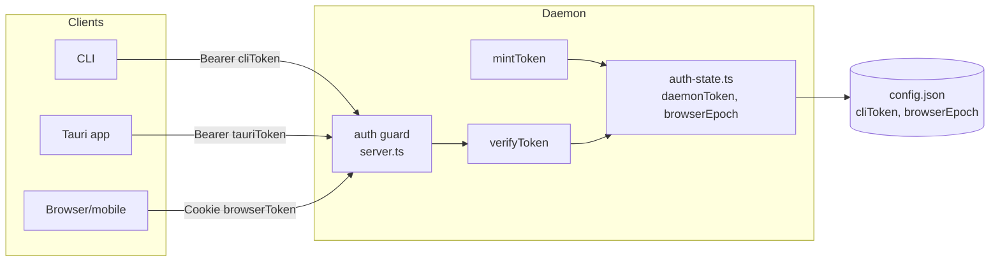
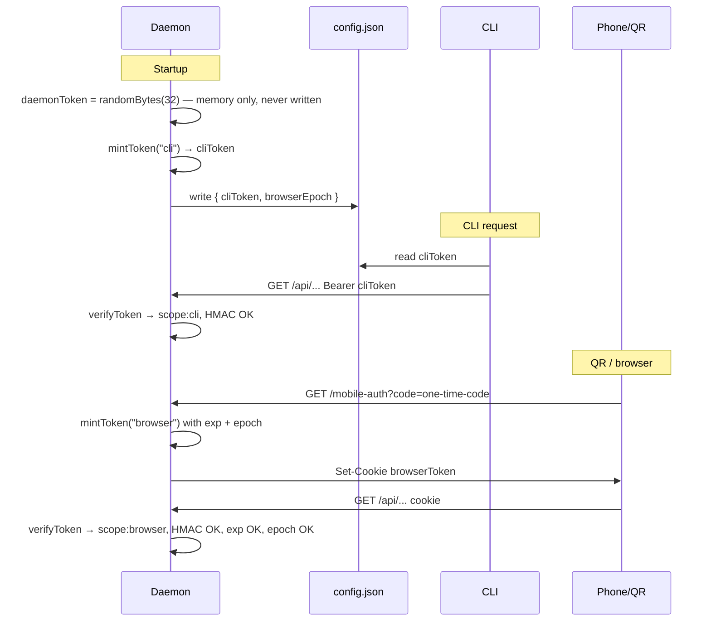

<!--
RULES — read before writing or implementing:
1. FORMAT: Bullets, tables, code, diagrams ONLY — no prose paragraphs
2. REQUIREMENTS: One crisp line each — no verbose descriptions
3. CHECKLIST: Mark items [x] as you complete them — this is your persistent todo list
4. READING TIME: Optimize for fast human scanning — if it's hard to skim, rewrite it
-->

# Auth Redesign — Unified Stateless Tokens

## Problem & Concept

- **Today:** two separate auth paths — CLI compares raw `daemonToken` string; browser verifies HMAC cookie + SQLite nonce lookup on every request
- **After:** one `mintToken` / `verifyToken` for all three clients (CLI, Tauri, browser/QR); no DB read on any authenticated request; scope is server-determined by transport, never caller-claimed

## Requirements

| # | Requirement |
|---|-------------|
| R1 | Single `verifyToken` called on every request where a credential is presented (loopback bypass for VST_NO_AUTH unchanged) |
| R2 | `scope: "cli" \| "tauri" \| "browser"` carried in signed payload; server determines scope at mint time |
| R3 | CLI and Tauri tokens have no `exp`; browser tokens have `exp` (7d) + `epoch` |
| R4 | Browser revocation = bump `authState.browserEpoch` (in-memory + persisted to config); kills all browser sessions and live WS connections instantly |
| R5 | CLI token pre-minted by daemon at startup, written to `config.json`; CLI reads it directly |
| R6 | Tauri token minted in-process at app spawn; raw `daemonToken` no longer enters the webview |
| R7 | Browser token minted only at tail of `GET /mobile-auth` or `POST /auth/login` (loopback) after credential verified |
| R8 | `auth_sessions` SQLite table and `auth-session-store.ts` deleted entirely |
| R9 | `closeConnectionsByNonce` replaced by `closeConnectionsByScope("browser")` called on epoch bump |
| R10 | Loopback CSRF fix: if `Origin` header present on loopback request, it must match `http://localhost:<port>` or `http://127.0.0.1:<port>`; requests without Origin (CLI tool) pass through unchanged |

## Change Map

```
daemon/src/
  auth.ts                    ~ replace cookie helpers with mintToken/verifyToken
  types.ts                   ~ add VstToken, TokenScope, TokenPayload types
  main.ts                    ~ daemonToken generated in memory only; mint cliToken; add browserEpoch to config
  server.ts                  ~ replace dual-path guard with verifyToken; Origin check; thread authState
  state/
    auth-session-store.ts    ~ DELETE
    auth-state.ts            + new in-memory mutable auth state (daemonToken, browserEpoch)
  routes/
    auth.ts                  ~ POST /auth/login mints scope:browser; add POST /auth/revoke-browser
    mobileAuth.ts            ~ tail of GET /mobile-auth uses mintToken("browser"); remove sessionStore; remove GET+DELETE /auth/sessions routes
  ws/
    connection.ts            ~ store scope on WsConnection (replace nonce field)
    server.ts                ~ WS auth calls verifyToken instead of raw compare
  broadcaster.ts             ~ closeConnectionsByNonce → closeConnectionsByScope
cli/src/lib/
  daemon-url.ts              ~ read cliToken field instead of token
web-ui/src/
  api/client.ts              ~ replace listAuthSessions/revokeAuthSession/revokeAllAuthSessions with revokeAllBrowserSessions
  components/settings/
    RemoteAccessSetting.tsx  ~ replace per-session revoke UI with single "Revoke all" button
```

| Today | After this plan |
|-------|----------------|
| CLI sends raw `daemonToken` as Bearer; daemon does string equality | CLI sends pre-minted `cliToken` (signed, scope:cli); daemon calls `verifyToken` |
| Browser cookie is `issuedAt.nonce.HMAC`; every request hits SQLite to check nonce | Browser cookie is `base64(payload).HMAC`; verify is pure in-memory |
| Tauri injection passes raw `daemonToken` into webview | Tauri injection passes signed `scope:tauri` token; raw secret never enters webview |
| Sessions die on daemon restart (SQLite cleared) | Sessions do NOT survive restart (restart = new daemonToken = all tokens invalid); `browserEpoch` is mid-session browser revocation |
| Per-session revoke UI with session list in RemoteAccessSetting | Single "Revoke all browser sessions" button; session list removed |
| Two auth code paths in `server.ts:120-180` | One `verifyToken` call |

## Research

- `daemon/src/auth.ts:63-78` — `generateSessionCookie`, `generateSessionCookieWithNonce` produce `issuedAt.nonce.HMAC`; both deleted
- `daemon/src/auth.ts:99-128` — `validateSessionCookie` does HMAC verify + TTL check; generalised into `verifyToken`
- `daemon/src/auth.ts:130-133` — `computeHmac(issuedAt, nonce, key)` hashes `${issuedAt}.${nonce}`; new `mintToken` needs a new single-argument hasher over `base64url(payload)`
- `daemon/src/server.ts:120-180` — dual-path guard: line 144 Bearer raw compare, line 160 cookie HMAC+nonce; replaced by single `verifyToken`
- `daemon/src/server.ts:130-135` — loopback bypass (`CF-Connecting-IP` absent + loopback IP) still needed; Origin check added on top
- `daemon/src/routes/auth.ts:23` — already blocks `CF-Connecting-IP` on `POST /auth/login`; keep
- `daemon/src/routes/auth.ts:58-73` — mints nonce + calls `sessionStore.issue`; replaced by `mintToken("browser")`
- `daemon/src/routes/mobileAuth.ts:239-253` — `generateSessionCookieWithNonce` + `sessionStore.issue`; replaced by `mintToken("browser")`
- `daemon/src/routes/mobileAuth.ts:290-330` — `GET /auth/sessions`, `DELETE /auth/sessions/:nonce`, `DELETE /auth/sessions`; all deleted (see R8)
- `daemon/src/broadcaster.ts:54` — `closeConnectionsByNonce` iterates WS connections; replaced by `closeConnectionsByScope`
- `daemon/src/ws/server.ts:41-61` — `authenticateWS`: Bearer compares raw `daemonToken` (line 47); cookie calls `validateSessionCookie` + `isLive(nonce)` (lines 56-60); both replaced by `verifyToken`; `conn.nonce` set at line 80
- `daemon/src/main.ts:160` — `token = existingConfig.token ?? randomBytes(32)` is both signing key and config field; new: `daemonToken` generated fresh in memory every startup, never written; `cliToken` written instead
- `daemon/src/main.ts:79` — `writeConfig` writes `{ port, pid, startedAt, token }`; changed to `{ port, pid, startedAt, cliToken, browserEpoch }` — no `daemonToken`
- `cli/src/lib/daemon-url.ts:44` — reads `config.token`; changed to `config.cliToken`
- `web-ui/src/api/client.ts:1163-1177` — `listAuthSessions`, `revokeAuthSession`, `revokeAllAuthSessions`; replaced by `revokeAllBrowserSessions → POST /auth/revoke-browser`
- `web-ui/src/components/settings/RemoteAccessSetting.tsx:122-261` — session list state + per-session revoke; simplified to single revoke-all button

## Architecture Diagram





## Design Details

### Critical User Journeys

**CLI — authenticated request**
```
CLI boots
  → reads cliToken from config.json
  → GET /api/worktrees with Authorization: Bearer <cliToken>
  → verifyToken: HMAC matches, scope:cli, no exp check → 200
```
- Error: `daemonToken` rotated → HMAC mismatch → 401 → CLI re-reads config (cliToken re-minted on daemon restart)

**Browser — QR login**
```
User opens Settings → Remote Access → generates QR
  → daemon mints 30s one-time code (unchanged)
  → phone scans QR → GET /mobile-auth?code=<hex>
  → daemon validates code (in-memory Map, unchanged)
  → mintToken("browser", { exp: now+7d, epoch: authState.browserEpoch })
  → Set-Cookie: vst-session=<browserToken>; HttpOnly; SameSite=Lax; Max-Age=604800
  → phone API calls with cookie → verifyToken checks HMAC + exp + epoch → 200
```
- Error: code expired (>30s) → 410 (unchanged)
- Error: epoch bumped → `payload.epoch !== authState.browserEpoch` → 401

**Browser revocation**
```
User clicks "Revoke all browser sessions"
  → POST /auth/revoke-browser
  → authState.browserEpoch += 1; persist to config.json
  → closeConnectionsByScope("browser") — all live WS connections for browser scope closed
  → next HTTP request with any browser token → verifyToken → epoch mismatch → 401
```

### Data Model

| Entity | Field | Type | Change | Notes |
|--------|-------|------|--------|-------|
| `config.json` | `cliToken` | string | new | pre-minted scope:cli token |
| `config.json` | `browserEpoch` | number | new, default 0 | bumped on revoke-all |
| `auth_sessions` | entire table | SQLite | deleted | no migration needed; dropping is a clean break |

**Migration:** No migration needed for daemonToken — field was `token` (raw secret), now absent from config entirely; `cliToken` is new.

### API Contracts

**`mintToken(scope, authState, opts?)`** — `daemon/src/auth.ts`
```ts
type TokenScope = "cli" | "tauri" | "browser"
type TokenPayload = {
  iat: number
  scope: TokenScope
  exp?: number      // browser only: iat + BROWSER_TTL_MS
  epoch?: number    // browser only: authState.browserEpoch at mint time
}
// token = base64url(JSON(payload)) + "." + HMAC-SHA256(base64url(payload), authState.daemonToken)
function mintToken(scope: TokenScope, authState: AuthState, opts?: { exp?: number }): string
```

**`verifyToken(token, authState)`** — `daemon/src/auth.ts`
```ts
type VerifyResult =
  | { ok: true; payload: TokenPayload }
  | { ok: false; reason: "invalid_signature" | "expired" | "epoch_mismatch" | "malformed" }

function verifyToken(token: string, authState: AuthState): VerifyResult
// - constant-time HMAC compare (timingSafeEqual)
// - rejects browser token missing epoch (epoch param required for browser scope)
// - rejects cli/tauri token carrying exp
// - epoch check only when scope === "browser"
```

**`auth-state.ts`** — `daemon/src/state/auth-state.ts` (new)
```ts
interface AuthState { daemonToken: string; browserEpoch: number }
// Module-level singleton, loaded at startup
export function loadAuthState(config: Config): AuthState
export function getAuthState(): AuthState
export function bumpBrowserEpoch(persist: () => Promise<void>): number
// bumpBrowserEpoch increments in-memory epoch, then calls persist() to flush config.json
```

**`POST /auth/login`** (loopback only, `daemon/src/routes/auth.ts`)
```
POST /auth/login { token: string }   — token is daemonToken (user pastes it)
403  CF-Connecting-IP present
401  token !== authState.daemonToken
200  { ok: true } + Set-Cookie: vst-session=<browserToken>; HttpOnly; SameSite=Lax; Max-Age=604800
```

**`POST /auth/revoke-browser`** (new, `daemon/src/routes/auth.ts`)
```
POST /auth/revoke-browser    — any valid token, any scope
200  { ok: true, browserEpoch: N }
Side effects: authState.browserEpoch += 1; config flushed; closeConnectionsByScope("browser")
```

**`revokeAllBrowserSessions`** — `web-ui/src/api/client.ts`
```ts
// replaces listAuthSessions / revokeAuthSession / revokeAllAuthSessions
async function revokeAllBrowserSessions(): Promise<{ ok: boolean; browserEpoch: number }>
// → POST /auth/revoke-browser
```

### Key Decisions

#### Decision 1: Browser keeps HttpOnly cookie, not localStorage/bearer
- **Decision:** browser token delivered as `HttpOnly` cookie; not moved to localStorage
- **Rationale:** `WebSocket` API cannot set `Authorization` header (`ws/server.ts` auth reads cookie); bearer would need token-in-query-param → leaks to proxy logs; `HttpOnly` blocks XSS token theft
- **Where:** `daemon/src/routes/auth.ts`, `daemon/src/routes/mobileAuth.ts`

#### Decision 2: daemonToken is in-memory only, never persisted
- **Decision:** `daemonToken` is generated fresh with `randomBytes(32)` on every daemon startup and held only in memory; it is never written to `config.json` or any other file. `config.json` holds only `cliToken` (the pre-minted CLI token) and `browserEpoch`
- **Rationale:** the signing key never touches disk, so a config-file read cannot forge tokens; sessions intentionally do not survive daemon restart — restart is an implicit revocation of all sessions
- **Where:** `daemon/src/main.ts:79` — `writeConfig`; `cli/src/lib/daemon-url.ts:44`

#### Decision 3: In-memory mutable `AuthState` module (not startup-captured value)
- **Decision:** `daemon/src/state/auth-state.ts` holds a module-level singleton `{ daemonToken, browserEpoch }`; `bumpBrowserEpoch` mutates in-memory and flushes config
- **Rationale:** `browserEpoch` must be mutable at runtime (`POST /auth/revoke-browser`) but `buildServer` captures opts at startup — a captured `browserEpoch: number` would be stale after first bump; module singleton is mutable and readable by any route without prop-drilling
- **Where:** `daemon/src/state/auth-state.ts` (new); all callers of `verifyToken` and `mintToken` import `getAuthState()`

#### Decision 4: Sessions do NOT survive daemon restart
- **Decision:** restart generates a new `daemonToken`, invalidating all existing tokens (browser, CLI, Tauri); this is intentional
- **Rationale:** restart is the implicit full-system revocation; `browserEpoch` is the explicit mid-session browser revocation mechanism. Everyone re-auths after restart: browser re-scans QR, CLI re-reads the re-minted `cliToken`, Tauri re-injects at app spawn
- **Where:** `daemon/src/main.ts` — `daemonToken` regenerated on every start; `browserEpoch` read from config on restart

#### Decision 5: SameSite=Lax for browser cookie (both paths)
- **Decision:** all browser-scope cookies use `SameSite=Lax` (was `Strict` on server-bump path, already `Lax` on QR path at `mobileAuth.ts:251`)
- **Rationale:** QR scan is a top-level navigation (camera → browser, no referrer); `Strict` would block the initial page load after scan; `Lax` is correct for both paths; the bump path (`SameSite=Strict` at `auth.ts:70`) disappears with the redesign so the inconsistency self-resolves
- **Where:** `daemon/src/routes/auth.ts`, `daemon/src/routes/mobileAuth.ts`

#### Decision 6: Loopback bypass retained; Origin check added on top
- **Decision:** existing loopback bypass (`server.ts:130-138`, for VST_NO_AUTH and dev) unchanged; added: if `Origin` header present, it must equal `http://localhost:<port>` or `http://127.0.0.1:<port>`
- **Rationale:** browser tabs on same machine targeting `localhost` send `Origin`; CLI and system tools don't — this discriminates browser cross-site requests without blocking CLI; Vite dev server on a different port sends `Origin: http://localhost:5173` → SPA must proxy to daemon port or be added to allowed list
- **Where:** `daemon/src/server.ts:130-138`; allowed origins derived from `opts.port` at startup

#### Decision 7: per-session revoke UI replaced by "Revoke all" button
- **Decision:** `RemoteAccessSetting.tsx` session list and per-nonce revoke removed; replaced by single "Revoke all browser sessions" button calling `POST /auth/revoke-browser`
- **Rationale:** per-session revoke requires session registry (storage); going stateless eliminates the registry; "revoke all" via epoch bump is the only no-storage revocation mechanism
- **Where:** `web-ui/src/components/settings/RemoteAccessSetting.tsx:122-261`; `web-ui/src/api/client.ts:1163-1177`

## Risks / Open Questions

| # | Question | Notes |
|---|----------|-------|
| 1 | Where exactly does Tauri inject `window.__VST_TOKEN__`? | Check `apps/desktop/src-tauri/` before Phase 6 |
| 2 | Does Vite dev proxy to daemon port? If not, Origin check blocks dev SPA | Check `web-ui/vite.config.ts` proxy config |

## Implementation Phases

### Phase 1 — Auth state module + token primitives

- [x] **1.1** Create `daemon/src/state/auth-state.ts`: `AuthState` interface, module-level singleton, `loadAuthState(config)`, `getAuthState()`, `bumpBrowserEpoch(persist)` — see API Contracts
- [x] **1.2** Add `TokenScope`, `TokenPayload`, `VerifyResult` types to `daemon/src/types.ts`
- [x] **1.3** Add `mintToken(scope, authState, opts?)` to `daemon/src/auth.ts` — `base64url(JSON(payload)) + "." + HMAC-SHA256(base64url(payload), authState.daemonToken)`
- [x] **1.4** Add `verifyToken(token, authState)` to `daemon/src/auth.ts` — constant-time HMAC, exp check, epoch check, scope-shape validation per API Contracts
- [x] **1.5** Add `BROWSER_TTL_MS = 7 * 24 * 60 * 60 * 1000` constant replacing `SESSION_TTL_MS`; delete `generateSessionCookie`, `generateSessionCookieWithNonce`, `parseSessionCookie`, `validateSessionCookie`, `SESSION_TTL_MS`, `SESSION_MAX_AGE_SECONDS`

**Verify phase 1:**
- [ ] **1.T1** Unit — `mintToken("cli")`: splits into valid base64url payload + 64-char hex HMAC; payload has no `exp`/`epoch`
- [ ] **1.T2** Unit — `mintToken("browser")`: payload contains `exp` and `epoch`
- [ ] **1.T3** Unit — `verifyToken`: `ok:true` for freshly minted token; `invalid_signature` for tampered payload; `expired` for browser token past exp; `epoch_mismatch` when `authState.browserEpoch` differs; `malformed` for garbage
- [ ] **1.T4** Unit — `verifyToken`: rejects browser token missing `epoch`; rejects cli token carrying `exp`
- [ ] **1.T5** Unit — `bumpBrowserEpoch`: increments in-memory epoch; calls persist callback once

### Phase 2 — Daemon startup & config split

- [x] **2.1** In `daemon/src/main.ts:157-161`: generate `daemonToken = randomBytes(32).toString('hex')` in memory on every startup — never read from or written to config
- [x] **2.2** Call `mintToken("cli", authState)` → `cliToken`; call `loadAuthState({ daemonToken, browserEpoch: existingConfig.browserEpoch ?? 0 })`
- [x] **2.3** Extend `writeConfig` (`main.ts:77`) to write `{ port, pid, startedAt, cliToken, browserEpoch }` with `mode: 0o600` — `daemonToken` is never written
- [x] **2.4** Thread `getAuthState()` (not raw `token`) into `buildServer` opts; update `BuildServerOpts` type accordingly

**Verify phase 2:**
- [ ] **2.T1** Integration — fresh start: `config.json` has `cliToken` and `browserEpoch: 0`; no `token` or `daemonToken` field
- [ ] **2.T2** Integration — restart: new `daemonToken` generated; new `cliToken` written to config; old browser sessions invalid

### Phase 3 — Unified auth guard

- [x] **3.1** In `daemon/src/server.ts:120-180`: replace dual-path check (Bearer raw compare at line 144; cookie at line 160) with: extract Bearer or cookie value, call `verifyToken(value, getAuthState())`, return 401 on `ok:false`
- [x] **3.2** On `ok:true`: attach `payload` to request via Fastify's `decorateRequest` or `req.authPayload`
- [x] **3.3** Add Origin check on the loopback path: if `req.headers.origin` present and not in `[http://localhost:<port>, http://127.0.0.1:<port>]` → 403 (see Decision 6; skip check when `noAuth`)
- [x] **3.4** Remove sliding-cookie re-issue logic (`server.ts:168-177`)

**Verify phase 3:**
- [ ] **3.T1** Integration — `curl -H "Authorization: Bearer <cliToken>"` → 200
- [ ] **3.T2** Integration — tampered token → 401
- [ ] **3.T3** Integration — browser token after epoch bump → 401
- [ ] **3.T4** Integration — request with `Origin: http://evil.com` on loopback → 403
- [ ] **3.T5** Regression — `VST_NO_AUTH=1` bypasses all checks; no Origin check applied

### Phase 4 — Login / logout / revoke routes

- [x] **4.1** `daemon/src/routes/auth.ts` `POST /auth/login`: remove `randomBytes(nonce)` + `sessionStore.issue`; replace with `mintToken("browser", getAuthState())`; set `SameSite=Lax` cookie
- [x] **4.2** Add `POST /auth/revoke-browser`: call `bumpBrowserEpoch(writeConfig)`; call `closeConnectionsByScope("browser")`; return `{ ok: true, browserEpoch: N }` — see API Contracts
- [x] **4.3** `POST /auth/logout`: clear cookie; no epoch bump (logout is per-device, not global)
- [x] **4.4** Delete `GET /auth/sessions`, `DELETE /auth/sessions/:nonce`, `DELETE /auth/sessions` from `daemon/src/routes/mobileAuth.ts:290-330`

**Verify phase 4:**
- [ ] **4.T1** Integration — `POST /auth/login` with correct `daemonToken` → 200 + valid browser-scope cookie
- [ ] **4.T2** Integration — `POST /auth/login` with `CF-Connecting-IP` header → 403
- [ ] **4.T3** Integration — `POST /auth/revoke-browser` → old browser token → 401 on next request
- [ ] **4.T4** Integration — `GET /auth/sessions` → 404 (route removed)

### Phase 5 — mobileAuth route

- [x] **5.1** `daemon/src/routes/mobileAuth.ts:238-244`: replace `generateSessionCookieWithNonce(token, nonce)` + `sessionStore.issue(nonce, ...)` with `mintToken("browser", getAuthState())`
- [x] **5.2** Cookie attrs: `HttpOnly; SameSite=Lax; Path=/; Max-Age=604800`; prepend `Secure; ` only when tunnel (`mobileAuth.ts:250-252` logic unchanged)
- [x] **5.3** Remove `sessionStore` import and `nonce` generation from `mobileAuth.ts`

**Verify phase 5:**
- [ ] **5.T1** Integration — QR scan → phone gets cookie → subsequent API call → 200
- [ ] **5.T2** Regression — 30s code expiry still rejects stale codes; double-scan rejected (consumed flag logic unchanged)

### Phase 6 — WebSocket layer

- [x] **6.1** Check `web-ui/vite.config.ts` for proxy config (Open Question 2); if absent, add daemon port to allowed Origin list in Phase 3.3 or note as follow-up
- [x] **6.2** `daemon/src/ws/server.ts:41-61`: rewrite `authenticateWS` to call `verifyToken(bearerOrCookie, getAuthState())`; return `payload.scope` on success, `false` on failure, `null` on noAuth
- [x] **6.3** `daemon/src/ws/connection.ts`: replace `nonce: string | null` field with `scope: TokenScope | null`; set from `authenticateWS` result at line 80
- [x] **6.4** `daemon/src/broadcaster.ts:54`: rename `closeConnectionsByNonce` → `closeConnectionsByScope(scope: TokenScope, code, reason)`; filter by `conn.scope === scope`

**Verify phase 6:**
- [ ] **6.T1** Integration — WS connects with browser token; epoch bump closes connection; CLI WS unaffected
- [ ] **6.T2** Regression — WS connect with invalid token → socket closed with 4401

### Phase 7 — Delete auth-session-store

- [x] **7.1** Delete `daemon/src/state/auth-session-store.ts`
- [x] **7.2** Remove all imports: `grep -r "auth-session-store\|sessionStore\." daemon/src/` and delete each
- [x] **7.3** Confirm clean: `grep -r "auth_sessions\|sessionStore\|nonce" daemon/src/` returns empty (excluding comments)

**Verify phase 7:**
- [x] **7.T1** `pnpm typecheck` (repo root) passes with zero errors
- [x] **7.T2** `grep -r "auth-session-store\|sessionStore\.issue\|auth_sessions" daemon/src/` → empty

### Phase 8 — CLI reads cliToken

- [x] **8.1** `cli/src/lib/daemon-url.ts:44`: change `config.token` → `config.cliToken`
- [x] **8.2** Update CLI config type to `{ port: number; cliToken: string; ... }` (drop `token`)

**Verify phase 8:**
- [ ] **8.T1** Integration — `vst worktree ls` works against running daemon after full redesign
- [ ] **8.T2** Regression — `VST_NO_AUTH=1` daemon responds to CLI with no token set

### Phase 9 — Web UI

- [x] **9.1** `web-ui/src/api/client.ts:1163-1177`: delete `listAuthSessions`, `revokeAuthSession`, `revokeAllAuthSessions`; add `revokeAllBrowserSessions(): Promise<{ok: boolean; browserEpoch: number}>` → `POST /auth/revoke-browser`
- [x] **9.2** `web-ui/src/components/settings/RemoteAccessSetting.tsx:122-261`: remove session list state (`sessions`, `sessionsLoading`, `sessionsError`), per-session revoke handler, session map render; replace with a single "Revoke all browser sessions" button calling `api.revokeAllBrowserSessions()`
- [x] **9.3** Check `web-ui/src/components/layout/DashboardPanel.tsx:68` — remove any reference to session list

**Verify phase 9:**
- [ ] **9.T1** Regression — RemoteAccessSetting renders without errors; "Revoke all" button calls `POST /auth/revoke-browser` → success toast
- [x] **9.T2** Regression — no TypeScript errors in web-ui: `pnpm typecheck`

## Files & Phase Impact

| File | Status | Phase | Description / Contract Change |
|------|--------|-------|-------------------------------|
| `daemon/src/state/auth-state.ts` | **New** | 1.1 | Contract: `loadAuthState`, `getAuthState`, `bumpBrowserEpoch` — see API Contracts |
| `daemon/src/types.ts` | Modified | 1.2 | Add `TokenScope`, `TokenPayload`, `VerifyResult` |
| `daemon/src/auth.ts` | Modified | 1.3–1.5 | Contract: `mintToken(scope, authState, opts?): string`; `verifyToken(token, authState): VerifyResult`; delete old cookie helpers |
| `daemon/src/main.ts` | Modified | 2.1–2.4 | `daemonToken` generated in memory only; `writeConfig` writes `{ cliToken, browserEpoch }`; thread `authState` |
| `daemon/src/server.ts` | Modified | 3.1–3.4 | Single `verifyToken` guard; Origin check; remove sliding re-issue |
| `daemon/src/routes/auth.ts` | Modified | 4.1–4.3 | `POST /auth/login` mints browser token; add `POST /auth/revoke-browser`; `POST /auth/logout` clears cookie only |
| `daemon/src/routes/mobileAuth.ts` | Modified | 4.4, 5.1–5.3 | Delete session routes (lines 290-330); tail of `/mobile-auth` uses `mintToken("browser")`; remove `sessionStore` |
| `daemon/src/ws/server.ts` | Modified | 6.2 | `authenticateWS` calls `verifyToken`; returns scope not nonce |
| `daemon/src/ws/connection.ts` | Modified | 6.3 | `nonce: string \| null` → `scope: TokenScope \| null` |
| `daemon/src/broadcaster.ts` | Modified | 6.4 | `closeConnectionsByNonce` → `closeConnectionsByScope(scope, code, reason)` |
| `daemon/src/state/auth-session-store.ts` | **Deleted** | 7.1 | Entire file removed |
| `cli/src/lib/daemon-url.ts` | Modified | 8.1–8.2 | Read `config.cliToken` not `config.token` |
| `web-ui/src/api/client.ts` | Modified | 9.1 | Replace session CRUD with `revokeAllBrowserSessions → POST /auth/revoke-browser` |
| `web-ui/src/components/settings/RemoteAccessSetting.tsx` | Modified | 9.2 | Remove session list; add single revoke-all button |
| `web-ui/src/components/layout/DashboardPanel.tsx` | Modified | 9.3 | Remove session list reference (line 68) |
