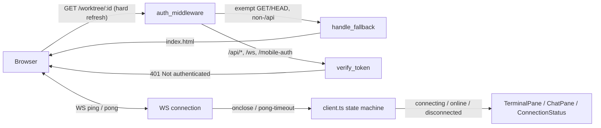

<!--
RULES — read before writing or implementing:
1. FORMAT: Bullets, tables, code, diagrams ONLY — no prose paragraphs
2. REQUIREMENTS: One crisp line each — no verbose descriptions
3. CHECKLIST: Mark items [x] as you complete them — this is your persistent todo list
4. READING TIME: Optimize for fast human scanning — if it's hard to skim, rewrite it
-->

# Plan: consistent login/session-ended UX for revoked tokens and daemon restarts

> Auth/connection state UX bugs: hard-refresh after token revocation dumps raw JSON; daemon crash/restart leaves sessions in an ambiguous state instead of "reconnecting" or "disconnected".

**Issue:** auth-session-ux-fixes
**Branch:** `token-page-error` _(existing branch, no new branch)_
**Status:** WIP
**PRD:** none — bugfix, root cause already known from `.vibekit/reports/2026-09-23-revoked-token-and-daemon-restart-ux.md`
**Parent:** none

**Reference files:**
- Daemon auth: `rust/vst-daemon/src/server.rs` (`auth_middleware:722`, `handle_fallback:3277`)
- Daemon boot: `rust/vst-daemon/src/main.rs` (`daemon_token` mint: `280-283`)
- WS client core: `web-ui/src/api/client.ts` (`ConnectionState:132`, `ensureWs:255`, `onopen:308`, `onclose:376`, heartbeat `1546-1557`, `checkAuth:1452`)
- Auth hook: `web-ui/src/hooks/useAuth.ts`
- Connection UI: `web-ui/src/components/layout/ConnectionStatus.tsx`
- Panes: `web-ui/src/components/layout/TerminalPane.tsx`, `web-ui/src/components/chat/ChatPane.tsx`

---

## Problem & Concept

- Hard-refreshing a deep-linked URL (e.g. `/worktree/<id>`) after a token was revoked shows raw daemon JSON (`{"error":"Not authenticated."}`) instead of the app's own login screen, at the same URL.
- A daemon crash/restart (no clean WS close frame) leaves open panes showing frozen/stale content indefinitely — no "reconnecting" indicator, and reconnect never gives up into a clear error state.
- Success state: any 401/disconnection — whether from a revoked token, a crash, or a restart — resolves the client to one of exactly two deterministic UI states: actively reconnecting (visible), or a terminal disconnected/login screen (visible, actionable). Never a silent frozen pane or a raw JSON dump.

## Out of Scope

- Persisting per-token revocation across daemon restarts (moot today — a restart already invalidates all tokens via a freshly minted `daemon_token`, `main.rs:280-283`).
- A general-purpose reconnect/backoff framework beyond the bounded-retry + terminal state described here.
- Loopback/Tauri client port-change handling (`main.rs:264-271`'s `find_free_port` retry-forever-on-old-port) — separate, unrelated failure mode.

## Requirements

| # | Requirement |
|---|-------------|
| 1 | A hard refresh on any SPA route, with an invalid/revoked token, renders the app's own login screen at the same URL — never a raw daemon JSON body |
| 2 | Broadening the auth exemption must not expose any file outside the built `dist/` directory (no path-traversal regression) |
| 3 | An abrupt daemon death (no WS close frame) is detected by the client within a bounded time, not left to OS-level TCP timeout |
| 4 | After bounded failed reconnect attempts, the client shows a terminal "disconnected" state with a manual retry action, instead of retrying forever silently |
| 5 | A reconnect after a daemon restart never visibly flashes "Connected" before failing auth — it goes straight to the login screen |
| 6 | Each terminal/chat pane reflects offline/reconnecting state itself, not only the global TopBar pill |

---

## Change Map

```
rust/vst-daemon/src/
  server.rs          ~ harden fallback, widen exemption

web-ui/src/api/
  client.ts          ~ pong timeout, gated reconnect auth-check, disconnected state
web-ui/src/hooks/
  useAuth.ts         ~ reuse existing ws:open recheck, no new path
web-ui/src/components/layout/
  ConnectionStatus.tsx   ~ render "disconnected" + Retry
  TerminalPane.tsx       ~ offline overlay from connection state
web-ui/src/components/chat/
  ChatPane.tsx           ~ offline overlay from connection state
```

| Today | After this plan |
|-------|-----------------|
| Hard refresh with a revoked token on a deep link shows raw `{"error":"Not authenticated."}` | Same refresh shows the app's `<LoginScreen>` at the same URL |
| `/assets/../../etc/hostname` is servable unauthenticated (live path-traversal) | Any `..`-segment or out-of-`dist` resolution is rejected |
| Client has no dead-socket detection beyond OS-level TCP timeout | Client force-closes and reconnects within ~2x the ping interval of silence |
| Reconnect retries forever with no terminal state | After N attempts / bounded elapsed time, client shows "disconnected" + Retry |
| Reconnect after restart briefly flashes "Connected" then errors, then shows login | Reconnect verifies auth before flipping to "online"; goes straight to login on failure |
| Panes show frozen content while offline, only the TopBar pill changes | `TerminalPane`/`ChatPane` show a "Reconnecting…"/"Disconnected" overlay themselves |

---

## Research

- `rust/vst-daemon/src/server.rs:843-848` — `auth_middleware`'s only unauthenticated `GET` exemptions are `/`, `/index.html`, `/assets/*`; every other path (any SPA deep link) is checked, and a bad token gets a raw `401` (`server.rs:869-886`) instead of falling through to `handle_fallback`.
- `rust/vst-daemon/src/server.rs:837` — the `POST /api/auth/logout` exemption never matches: the path is rewritten `/api/*` → `/*` at `server.rs:732-733` before this comparison runs, so the live key is `POST /auth/logout`.
- `rust/vst-daemon/src/server.rs:3282-3292` — `handle_fallback` does `dist.join(req.uri().path())` with no `..`-segment rejection or `canonicalize()`/`starts_with(dist)` check. **HIGH** — confirmed live: `GET /assets/../../../../etc/hostname` returns the real file content, unauthenticated, today, via the existing `/assets/` exemption. Widening the exemption without fixing this first would widen an already-live hole.
- `web-ui/src/api/client.ts:1546-1557` — the `{type:"ping"}` heartbeat is sent every 25s but the client never checks for a `pong` reply or arms any timeout; it exists only to keep the daemon's stale-connection sweep from killing a healthy socket.
- `vst-ws/src/handlers/ping.rs:8` / `vst-types/src/ws.rs:256` — daemon does reply `pong` to every `ping`; no server-side gap here.
- `web-ui/src/components/layout/ConnectionStatus.tsx:29` — renders `null` whenever `state === "online"`; there is no visible-but-stale state.
- `web-ui/src/api/client.ts:132` — `ConnectionState = "online" | "connecting" | "offline"`, no terminal give-up value.
- `web-ui/src/api/client.ts:308-321,369` — `onopen` sets `"online"` and emits `ws:open` (triggering refetches in `useServerSync.ts:196`, `TabsStrip.tsx:559`, `modesStore.ts:96`, `FilePreviewPane.tsx:137`, `useAuth.ts:42`) before the daemon's post-restart 4401 close (fresh `daemon_token`, `main.rs:280-283`) has a chance to land — producing a visible "Connected" flash that then fails.
- `web-ui/src/hooks/useAuth.ts:41-47` — already re-runs `checkAuth()` on `ws:open` when `!authed`; any Phase 4 fix must build on this, not duplicate it.
- `web-ui/src/components/layout/TerminalPane.tsx:175-177,643-661` — the pane's own "Reconnecting…" signal (`attachPending`) is only set on the `online` transition; while the daemon is actually down (before that transition fires) the pane shows frozen content with no overlay.
- **Root cause:** Bug 1 is a daemon routing gap (revoked/invalid tokens hit `auth_middleware` before the SPA ever loads on any non-root URL). Bug 2 is a client detection gap (no liveness timeout, no terminal disconnected state, and a race that lets `onopen` announce success before auth is actually re-verified).

---

## Architecture Diagram



---

## Design Details

### System Boundaries

| Boundary | Fields + types | Errors | Source of truth |
|----------|----------------|--------|-----------------|
| Browser ↔ Daemon (HTTP, `auth_middleware`) | `method: string`, `path: string`, `Authorization: Bearer <token>` \| `Cookie` | `401 { error: "Not authenticated." }` (bad/missing token, non-exempt path), `403 { error: "Forbidden." }` (loopback CSRF) | Daemon — `verify_token` against `auth_state` |
| Browser ↔ Daemon (WS) | `ws://.../ws?token=<token>` upgrade; app frames `{type:"ping"}` / `{type:"pong"}` | Close code `4401` (auth rejected post-upgrade), `1006`/abrupt (network/crash) | Daemon owns accept/reject; client owns liveness detection (new) |
| Client-internal: `client.ts` ↔ consumers (`ConnectionStatus`, `TerminalPane`, `ChatPane`) | `ConnectionState = "online" \| "connecting" \| "offline" \| "disconnected"` (new value) via `subscribeConnection(handler)` | n/a (state, not a call) | `client.ts`'s `connState`, unchanged ownership |

### Critical User Journeys (CUJs)

#### CUJ 1 — Token revoked, user hard-refreshes (fixed)

```
User revokes a token for PC-A (from PC-B's settings)
  → PC-A's live WS gets closed with code 4401 → LoginScreen shown in place (already correct, unchanged)
  → User hard-refreshes PC-A while on /worktree/<id>
  → Browser issues GET /worktree/<id> with the now-invalid token
  → auth_middleware: not /api, not /ws, not /mobile-auth → falls through
  → handle_fallback serves index.html (hardened against traversal)
  → App JS boots, useAuth.runCheck() calls GET /auth/check → 401
  → LoginScreen renders, same URL
```

- **Error path (pre-fix, being removed):** middleware returns raw `401 {"error":"Not authenticated."}` before any JS loads — no LoginScreen, no routing, URL shows a JSON blob.
- **Edge case:** a request to `/api/*`, `/ws`, or `/mobile-auth` must still be rejected with `401`/upgrade-reject — the exemption is GET/HEAD and non-`/api` only, never blanket.

#### CUJ 2 — Daemon crash mid-session (fixed)

```
Daemon process is killed (no close frame sent)
  → Client's next ping goes unanswered
  → ~2x PING_INTERVAL_MS with no inbound frame → client force-closes socket locally
  → onclose fires → setConnState("offline") → scheduleReconnect()
  → ConnectionStatus pill shows "Reconnecting…"; TerminalPane/ChatPane show their own overlay
  → Reconnect attempts exhaust bound (N attempts / elapsed time)
  → setConnState("disconnected") → pill + panes show "Disconnected — Retry"
  → User clicks Retry → attempt counter resets → ensureWs() retried immediately
```

- **Error path:** daemon comes back with a fresh `daemon_token` (restart, not just a hang) — see CUJ 3.

#### CUJ 3 — Daemon restarts (fresh token) while client is reconnecting

```
Client's scheduled reconnect calls ensureWs() → new WebSocket succeeds (upgrade accepted)
  → onopen fires
  → Before flipping to "online" / emitting ws:open: call checkAuth() (reuses useAuth.ts's existing recheck)
  → checkAuth() 401s (fresh daemon_token invalidated the old cookie/token)
  → Do NOT set "online", do NOT emit ws:open
  → Follow existing auth:expired path → LoginScreen shown directly, no "Connected" flash
```

### Data Model

- N/A — no persisted entities added, changed, or removed by this plan.

### API Contracts

- `GET /auth/check` — existing, unchanged. `200` = authed, `401` = not. Used both by `useAuth`'s initial check and by the new gated reconnect check (Decision 5) — no new endpoint.
- `auth_middleware` exemption contract (changing): a request is exempt from token verification iff `method ∈ {GET, HEAD}` **and** `path` does not start with `/api/` **and** `path ∉ {/ws, /mobile-auth}`. All other requests require a valid token. This replaces the current hardcoded three-path exemption list.
- WS close code `4401` — existing, unchanged: daemon-initiated, means "auth rejected post-upgrade", client must not auto-reconnect.

### Key Decisions

#### Decision 1: Fix `handle_fallback` path traversal before widening the exemption — *with a snippet, because the ordering is the point*

- **Decision:** land the traversal fix as its own phase (1a), strictly before the exemption is widened (1b) — never ship them together or reversed.
- **Rationale:** the hole is already live today via `/assets/`; widening the exemption first (even briefly, even in the same PR reviewed out of order) would widen a real vulnerability — see Research § traversal finding.
- **Where:** `rust/vst-daemon/src/server.rs:3277-3306`

```rust
// The exemption in auth_middleware is about to widen from "/assets/* only" to
// "any non-/api GET" — handle_fallback MUST reject traversal before that lands,
// or the widened exemption serves arbitrary host files unauthenticated.
async fn handle_fallback(State(state): State<AppState>, req: Request) -> Response {
    let Some(ref dist) = state.dist_path else {
        return (StatusCode::NOT_FOUND, "Not found").into_response();
    };
    let raw_path = req.uri().path().trim_start_matches('/');
    // Reject any ".." segment outright — cheap, and canonicalize() below still
    // catches symlink tricks a segment check alone would miss.
    if raw_path.split('/').any(|seg| seg == "..") {
        return (StatusCode::NOT_FOUND, "Not found").into_response();
    }
    let target = dist.join(raw_path);
    let dist_canon = tokio::fs::canonicalize(dist).await.ok();
    if target.is_file() {
        if let (Ok(target_canon), Some(dist_canon)) =
            (tokio::fs::canonicalize(&target).await, dist_canon.as_ref())
        {
            if target_canon.starts_with(dist_canon) {
                if let Ok(bytes) = tokio::fs::read(&target).await {
                    let mime = mime_guess::from_path(&target).first_or_octet_stream().to_string();
                    return ([(header::CONTENT_TYPE, mime)], bytes).into_response();
                }
            }
        }
    }
    // index.html fallback unchanged
    let index = dist.join("index.html");
    if index.is_file() {
        if let Ok(content) = tokio::fs::read_to_string(&index).await {
            return ([(header::CONTENT_TYPE, "text/html; charset=utf-8")], content).into_response();
        }
    }
    (StatusCode::NOT_FOUND, "Not found").into_response()
}
```

#### Decision 2: Exemption is GET/HEAD only, path-prefix based — *no snippet needed*

- **Decision:** exempt `method ∈ {GET, HEAD}` AND `!path.starts_with("/api/")` AND `path ∉ {"/ws", "/mobile-auth"}`, replacing the current `path == "/" || path == "/index.html" || path.starts_with("/assets/")` list.
- **Rationale:** the SPA has no other legitimate unauthenticated GET target; restricting to GET/HEAD keeps every mutating verb behind auth even on a path that looks like a deep link.
- **Where:** `rust/vst-daemon/src/server.rs:843-848`, and fix the dead `POST /api/auth/logout` string at `server.rs:837` to `POST /auth/logout` in the same edit (same block, same root cause: the `/api` strip at `732-733`).

#### Decision 3: Pong-liveness timeout armed per-ping, not a fixed wall-clock interval — *with a snippet, because the throttling trap is easy to get wrong*

- **Decision:** track the timestamp of the last inbound WS frame (any frame, not just `pong`); arm a deadline only when a ping is actually sent; treat >2x `PING_INTERVAL_MS` of silence since that ping as dead.
- **Rationale:** Chrome throttles `setInterval` in hidden tabs to ~1/min — a naive "no pong in 65s" check measured from calendar time false-fires on tab wake. Measuring from "ping actually sent" and using any inbound frame as liveness avoids that.
- **Where:** `web-ui/src/api/client.ts:1546-1557`

```ts
// Any inbound frame proves the connection is alive — not just an explicit pong.
// The deadline is armed relative to when THIS ping went out, not wall-clock,
// so a throttled background tab's stretched-out 25s→~60s interval doesn't
// false-positive a dead connection on wake.
let lastFrameAt = Date.now();
socket.addEventListener("message", () => { lastFrameAt = Date.now(); });
setInterval(() => {
  if (ws?.readyState !== WebSocket.OPEN) return;
  const sentAt = Date.now();
  ws.send(JSON.stringify({ type: "ping" }));
  setTimeout(() => {
    if (ws?.readyState === WebSocket.OPEN && lastFrameAt < sentAt) {
      ws.close(); // triggers existing onclose -> offline -> scheduleReconnect
    }
  }, PING_INTERVAL_MS * 2);
}, PING_INTERVAL_MS);
```

#### Decision 4: New terminal `"disconnected"` state, orthogonal to the existing three — *no snippet needed*

- **Decision:** extend `ConnectionState` to `"online" | "connecting" | "offline" | "disconnected"`. `"offline"` keeps meaning "down, actively retrying"; `"disconnected"` means "gave up, needs manual Retry". Track a reconnect-attempt counter, reset on `"online"` or manual Retry.
- **Rationale:** without a fourth value, "gave up" has nowhere to live — folding it into `"offline"` would make every consumer re-derive "but has it given up?" from attempt count itself. Mirrors how `auth:expired` is already kept orthogonal to connection state (see Research).
- **Where:** `web-ui/src/api/client.ts:132` (type + `scheduleReconnect:181-190` gains the bound), `ConnectionStatus.tsx` (new `conn-pill--disconnected` class + "Retry" click handler calling a new `api.retryConnection()`).

#### Decision 5: Gate reconnect's `onopen` on `checkAuth()`, reusing `useAuth.ts`'s existing recheck — *with a snippet for the race*

- **Decision:** on a *reconnect* (not the very first connection), call `checkAuth()` before `setConnState("online")` / `emit({type:"ws:open"})`; on failure, follow the existing `auth:expired` path. Re-verify `ws === socket && socket.readyState === WebSocket.OPEN` after the await before proceeding, since the daemon's 4401 close can land during it.
- **Rationale:** all post-reconnect refetches hang off the single `ws:open` emit (Research), so gating that one emit covers every consumer — no per-consumer guards needed. `useAuth.ts:41-47` already has an auth recheck on `ws:open`; this decision moves the check to run *before* the flip instead of duplicating it after.
- **Where:** `web-ui/src/api/client.ts:308-321` (`onopen`)

```ts
socket.onopen = async () => {
  const isReconnect = hasConnectedBefore; // false only for the very first connection
  if (isReconnect) {
    const stillAuthed = await api_internal_checkAuth(); // same call as useAuth's checkAuth()
    if (ws !== socket || socket.readyState !== WebSocket.OPEN) return; // socket died mid-check
    if (!stillAuthed) {
      socket.close(4401); // reuse the existing 4401 -> auth:expired -> LoginScreen path
      return;
    }
  }
  hasConnectedBefore = true;
  setConnState("online");
  // ... existing subscribe/replay/emit(ws:open) logic, unchanged, now gated
};
```

---

## Risks / Open Questions

| # | Question | Notes |
|---|----------|-------|
| 1 | **What are N (attempt count) and the elapsed-time bound for "disconnected"?** | Pick a value that survives a normal daemon restart (a few seconds) without giving up — e.g. 8 attempts or 90s elapsed, whichever first; not user-configurable in this plan |
| 2 | **Does `tokio::fs::canonicalize` add a syscall-per-request cost worth caching?** | `dist` is static for daemon lifetime — canonicalize `dist` once at startup and cache it; still canonicalize `target` per-request (cheap, local disk) |
| 3 | **Should `ChatPane` share the same overlay component as `TerminalPane`?** | Prefer a small shared component/hook over duplicating the `subscribeConnection` wiring twice |

---

## Implementation Phases

---

### Phase 1a — Fix `handle_fallback` path traversal (must land before 1b)

- [x] **1a.1** Reject any `..` path segment and canonicalize + `starts_with(dist)`-check the resolved target in `handle_fallback` (`rust/vst-daemon/src/server.rs:3277-3306`) — see Decision 1
- [x] **1a.2** Cache canonicalized `dist` once (avoid per-request syscall) — see Risk 2

**Verify phase 1a:**
- [x] **1a.T1** Integration — `rust/vst-daemon/tests/`: `GET /assets/../../../../etc/hostname` (and a URL-encoded `%2e%2e` variant) returns `404`, not file contents
- [x] **1a.T2** Regression — existing `/assets/<real-file>` requests still serve correctly

---

### Phase 1b — Broaden the auth-middleware exemption (after 1a only)

- [x] **1b.1** Replace the hardcoded 3-path GET exemption with the GET/HEAD + non-`/api`/`/ws`/`/mobile-auth` rule (`server.rs:843-848`) — see Decision 2
- [x] **1b.2** Fix the dead `POST /api/auth/logout` exemption string to `POST /auth/logout` (`server.rs:837`)

**Verify phase 1b:**
- [x] **1b.T1** Integration — `rust/vst-daemon/tests/auth_middleware.rs`: `GET /worktree/abc` with an invalid/missing token returns `200` + HTML (the fallback), not `401` JSON
- [x] **1b.T2** Regression — `GET /api/sessions`, `GET /ws` (upgrade), `GET /mobile-auth` still require/behave per existing auth rules with an invalid token
- [x] **1b.T3** Regression — `POST /auth/logout` from a loopback-adjacent authenticated client still succeeds

---

### Phase 2 — Client pong-liveness timeout

- [x] **2.1** Track `lastFrameAt` from any inbound WS message; arm a per-ping deadline at `PING_INTERVAL_MS * 2` (`client.ts:1546-1557`) — see Decision 3
- [x] **2.2** On deadline expiry with no fresh frame, force-close the socket locally so the existing `onclose` → `scheduleReconnect` path takes over — no second reconnect mechanism

**Verify phase 2:**
- [x] **2.T1** Unit — `client.ts` WS test harness (if it supports simulated dead sockets): a socket that stops responding to `ping` is force-closed within `2 * PING_INTERVAL_MS` of the last real frame
- [x] **2.T2** Regression — a connection with normal traffic (or no traffic but healthy pong replies) is never force-closed

---

### Phase 3 — Terminal `"disconnected"` state + manual Retry

- [x] **3.1** Extend `ConnectionState` to include `"disconnected"` (`client.ts:132`)
- [x] **3.2** Add a bounded attempt/elapsed-time counter to `scheduleReconnect` (`client.ts:181-190`); on exceeding it, `setConnState("disconnected")` instead of scheduling another retry — see Risk 1
- [x] **3.3** Add `api.retryConnection()`: resets the counter and calls `ensureWs()` immediately
- [x] **3.4** `ConnectionStatus.tsx`: add `conn-pill--disconnected` styling and a "Retry" click target wired to `api.retryConnection()`

**Verify phase 3:**
- [x] **3.T1** Unit — `ConnectionStatus.tsx`: renders "Disconnected" label + Retry affordance when state is `"disconnected"`
- [x] **3.T2** Integration — after exceeding the bound, state settles at `"disconnected"` and stops scheduling reconnects; clicking Retry re-attempts immediately

---

### Phase 4 — Suppress false "connected" flash + per-pane offline indicator

- [x] **4.1** Gate `onopen`'s flip to `"online"` / `emit(ws:open)` behind a `checkAuth()` call on reconnect (not first connect), with the post-await `ws === socket` liveness re-check (`client.ts:308-321`) — see Decision 5
- [x] **4.2** On failed re-auth, close with `4401` to reuse the existing `auth:expired` path rather than adding a second one
- [x] **4.3** Consolidate with `useAuth.ts:41-47`'s existing `ws:open` recheck — confirm no duplicate/competing auth-check path remains
- [x] **4.4** `TerminalPane.tsx`: subscribe to `api.subscribeConnection`; show a "Reconnecting…"/"Disconnected" overlay whenever state isn't `"online"`, independent of `attachPending`
- [x] **4.5** `ChatPane.tsx`: same overlay treatment as 4.4 (share a component/hook per Risk 3)

**Verify phase 4:**
- [x] **4.T1** Integration — simulated reconnect with a rejected `checkAuth()` never sets `"online"` or fires `ws:open`; goes straight to `auth:expired`
- [x] **4.T2** Regression — a normal reconnect with valid auth still reaches `"online"` and fires `ws:open` exactly once
- [x] **4.T3** Integration — `TerminalPane`/`ChatPane` show the offline overlay while `connState !== "online"`, independent of `attachPending`

---

### Phase 5 — Verification

- [x] **5.1** Rust: `vst-daemon` test suite + clippy via Docker (`rust:1.98.1-bookworm` — host glibc too new for a direct build): `docker run --rm -v "$PWD":/w -w /w -v cargo-registry-cache:/usr/local/cargo/registry -e CARGO_TARGET_DIR=/w/target-docker rust:1.98.1-bookworm cargo test -p vst-daemon` from `rust/`, plus `clippy`
- [x] **5.2** UI: `tsc`, `eslint`, relevant vitest suites for `client.ts`, `ConnectionStatus.tsx`, `TerminalPane.tsx`, `ChatPane.tsx`
- [x] **5.3** Manual, dev sandbox: (a) revoke a token, hard-refresh a deep-linked URL, confirm login screen at the same URL; (b) re-run the Phase 1a traversal probe post-fix, confirm rejected; (c) `kill -9` the daemon, confirm a prompt reconnecting indicator, then a disconnected/Retry state, with no "Connected" flash

**Verify phase 5:**
- [x] **5.T1** All of 5.1–5.3 pass with no regressions in existing auth/WS test suites

---

## Files & Phase Impact

| File | Status | Phase | Description / Contract Change |
|------|--------|-------|-------------------------------|
| `rust/vst-daemon/src/server.rs` | **Modified** | 1a.1, 1a.2, 1b.1, 1b.2 | `handle_fallback`: rejects `..`, canonicalize+`starts_with(dist)` check · `auth_middleware`: exemption is GET/HEAD + non-`/api`/`/ws`/`/mobile-auth`; fixes dead logout exemption string |
| `rust/vst-daemon/tests/auth_middleware.rs` | **Modified** | 1a.T1, 1a.T2, 1b.T1, 1b.T2, 1b.T3 | New traversal + fallback-exemption regression tests |
| `web-ui/src/api/client.ts` | **Modified** | 2.1, 2.2, 3.1, 3.2, 3.3, 4.1, 4.2 | Contract: `ConnectionState` gains `"disconnected"`; new `api.retryConnection(): void`; `onopen` becomes gated/async on reconnect · Owns: `connState`, reconnect attempt counter |
| `web-ui/src/hooks/useAuth.ts` | **Modified** | 4.3 | Confirm/adjust existing `ws:open` recheck coexists with the new gated `onopen` check, no duplication |
| `web-ui/src/components/layout/ConnectionStatus.tsx` | **Modified** | 3.4 | Adds `"disconnected"` label/class + Retry click target |
| `web-ui/src/components/layout/TerminalPane.tsx` | **Modified** | 4.4 | Adds connection-state-driven offline overlay, independent of `attachPending` |
| `web-ui/src/components/chat/ChatPane.tsx` | **Modified** | 4.5 | Same overlay treatment as `TerminalPane.tsx` |
| `web-ui/src/**/*.test.ts(x)` (client/ConnectionStatus/pane suites) | **New/Modified** | 2.T1, 2.T2, 3.T1, 3.T2, 4.T1–4.T3 | New/updated unit + integration tests per phase |
