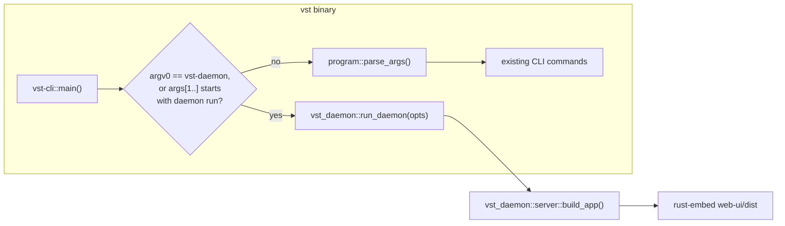

<!--
RULES — read before writing or implementing:
1. FORMAT: Bullets, tables, code, diagrams ONLY — no prose paragraphs
2. REQUIREMENTS: One crisp line each — no verbose descriptions
3. CHECKLIST: Mark items [x] as you complete them — this is your persistent todo list
4. READING TIME: Optimize for fast human scanning — if it's hard to skim, rewrite it
-->

# Plan 00: Binary merge — `vst` + `vst-daemon` → one executable

> Merge the CLI and daemon into one `vst` binary that dispatches on argv0/subcommand; embed the web UI so a curl-only daemon is actually usable; add a build-time version-read mechanism. Foundational — every other part in this feature depends on this landing first.

**Issue:** cli-daemon-unification/00
**Branch:** `release-ci-version` (worktree `vs-194`, no sub-branch)
**Status:** Pending
**PRD:** `../prd-cli-daemon-unification.md` (R1-R5, R28, R29)
**Arch:** `../arch-cli-daemon-unification.md`

---

## Problem & Concept

- Two separate `[[bin]]` targets (`rust/vst-cli/Cargo.toml:9-11` → `vst`, `rust/vst-daemon/Cargo.toml:9-11` → `vst-daemon`) ship as 2 of Tauri's 4 sidecars (`desktop/src-tauri/tauri.conf.json:42`).
- `rust/vst-daemon/src/main.rs` is a bare `#[tokio::main] async fn main()` — none of its startup sequence is callable from another crate; `rust/vst-daemon/src/lib.rs:1-7` only exports `doctor`, `env_setup`, `lock`, `port`, `server`.
- `web-ui/dist` is only ever staged as a Tauri `bundle.resources` entry (`desktop/src-tauri/tauri.conf.json`) — a curl-installed daemon binary has nothing to serve at `/` and 404s via `handle_fallback`.
- No version travels from a git tag into the compiled binary; `CARGO_PKG_VERSION` reports the workspace's static `0.1.0` (`rust/Cargo.toml`).
- See master arch's Problem section for full context — not restated here.

---

## Requirements

| ID | Requirement |
|----|-------------|
| R1 | `vst daemon run` serves; every other invocation of the same binary is the CLI. |
| R2 | argv0 == `vst-daemon` also serves (dev-script/Docker-sandbox compat). |
| R3 | Tauri bundles one `vst` sidecar, not two. |
| R4 | `skill/SKILL.md` is compiled into the binary via `include_str!`. |
| R28 | `web-ui/dist` is compiled into the binary; a curl-only daemon can serve the SPA. |
| R29 (half 1) | A `VST_VERSION` build-time override, falling back to `CARGO_PKG_VERSION`, is the one place `--version`/`/health`'s `version` field are read from. |

---

## Change Map

```
rust/vst-daemon/src/
  main.rs          ~ thin compat entry: parses argv, calls lib::run_daemon
  lib.rs           ~ + pub mod run (new), + pub use run::{run_daemon, DaemonOptions}
  run.rs           + extracted daemon startup sequence (was main.rs's body)
  version.rs       + VST_VERSION / CARGO_PKG_VERSION resolution, shared by CLI + daemon
  server.rs        ~ embeds web-ui/dist via rust-embed, serves it when no VST_DIST_PATH override
rust/vst-cli/src/
  main.rs          ~ argv0/subcommand dispatch added before existing parse_args() call
  program.rs       ~ + DaemonCommand::Run variant
  commands/daemon/
    run.rs         + run_daemon_run(): calls vst_daemon::run_daemon(DaemonOptions)
  Cargo.toml       ~ + vst-daemon, rust-embed dependencies
rust/vst-daemon/Cargo.toml  ~ + rust-embed dependency
desktop/src-tauri/
  tauri.conf.json  ~ externalBin drops "binaries/vst-daemon"
  src/daemon.rs    ~ spawn_daemon(): sidecar("vst") not sidecar("vst-daemon"); sets VST_TAURI_SUPERVISED=1
  src/main.rs      ~ vst_bin resolution simplified (current_exe fallback already exists; resource_dir path kept as-is, unaffected)
scripts/
  prep-sidecar.sh  ~ builds+copies one vst-<triple> sidecar instead of vst-daemon-<triple> + vst-<triple>
  dev-start.sh     ~ sets VST_TAURI_SUPERVISED=1 for the direct `cargo run -p vst-daemon` dev path (Option A default-headless would otherwise require a token in dev)
docker-compose.dev.yml  ~ unchanged (already sets VST_NO_AUTH=1, unaffected by headless default; argv0 vst-daemon compat covers `cargo run -p vst-daemon`)
web-ui/                 (unchanged — its build output is only consumed differently, not modified)
```

| Today | After this plan |
|-------|-------------------|
| Two binaries (`vst`, `vst-daemon`); daemon startup logic lives only in a `main()` fn | One binary; daemon startup is `vst_daemon::run_daemon(DaemonOptions)`, callable from `vst-cli` |
| Tauri bundles 4 sidecars (`vst-daemon`, `cloudflared`, `vst`, `agy-acp`) | Tauri bundles 3 (`vst`, `cloudflared`, `agy-acp`) |
| `web-ui/dist` only exists as a Tauri resource | `web-ui/dist` is embedded in the `vst` binary; a curl-only daemon serves it |
| `skill/SKILL.md` is a Tauri resource, read from disk by `env_setup.rs` | `SKILL.md` is embedded via `include_str!`; `env_setup.rs` writes the embedded string to disk (unchanged from the *daemon's* filesystem-facing behavior — agents' skill dirs still see a real file) |
| `CARGO_PKG_VERSION` is a static `0.1.0`; no way to override at build time | `vst_daemon::version::current()` reads `VST_VERSION` if set at build time, else falls back to `CARGO_PKG_VERSION` — Part 04's release CI sets `VST_VERSION` from the git tag |

---

## Research

- `rust/vst-cli/src/program.rs:128-227` (`parse_args`) — `iter.skip(1)` already skips argv[0], so inserting an argv0 check *before* calling `parse_args` doesn't disturb existing arg parsing at all.
- `rust/vst-daemon/src/main.rs:211-502` — the entire body of `main()` after tracing-subscriber init is startup logic with zero external inputs beyond env vars and `std::env::args`/`current_exe` — extractable into a lib fn with no signature beyond a small options struct.
- `rust/vst-cli/Cargo.toml:16-22` — `tokio = { workspace = true }` already includes the `full` feature (`rust/Cargo.toml:24`), so `vst-cli`'s `#[tokio::main]` can `.await` a `run_daemon()` call with no feature-flag changes.
- `rust/vst-daemon/Cargo.toml` has no dependency on `vst-cli`, and nothing in the workspace depends on `vst-cli` — confirmed no cycle risk from `vst-cli` depending on `vst-daemon`.
- `desktop/src-tauri/src/daemon.rs:103-109` already resolves `vst_bin`/`skill_path` via `resource_dir()` with an unqualified-name fallback — spawn target just needs to change from `"vst-daemon"` to `"vst"` at `daemon.rs:105`.
- `rust/vst-daemon/src/server.rs:403-416` (recon-confirmed `main.rs:403-416`, `VST_DIST_PATH`/`current_exe`-relative `dist` resolution) is the existing fallback chain the embedded-SPA path slots into as a *third*, lowest-priority fallback (env var wins, then exe-relative dir, then embedded).

---

## Architecture Diagram



---

## Design Details

### Critical User Journeys (CUJs)

**Happy path — `vst daemon run`:**
```
User runs `vst daemon run`
  → vst-cli::main() sees args[1..3] == ["daemon","run"]
  → calls vst_daemon::run_daemon(DaemonOptions{headless: <default-true, see PRD R32>})
  → daemon boots exactly as today's vst-daemon binary did
```

**Happy path — everything else:**
```
User runs `vst agent ls`
  → vst-cli::main() sees argv0 != "vst-daemon", args[1] != "daemon" (or != "run")
  → falls through to existing program::parse_args() + dispatch, unchanged
```

**Compat path — direct `vst-daemon` invocation (dev scripts, Docker sandbox):**
```
Process launched as `vst-daemon` (argv0, e.g. via `cargo run -p vst-daemon` or a symlink)
  → vst-daemon's own thin main.rs (still a real [[bin]] target) calls the same
    vst_daemon::run_daemon(opts) lib fn directly, no argv0 sniffing needed here —
    this binary IS the daemon, unconditionally
```

**Error path — malformed dispatch args:**
```
User runs `vst daemon` (no subcommand)
  → existing DaemonCommand parsing handles this today (falls to DaemonCommand::Unknown
    or a usage message) — the new argv0/subcommand check only special-cases the exact
    "daemon run" shape; anything else falls through to the pre-existing parse_args path
    unchanged, so `vst daemon status` etc. are not affected by this plan at all
```

### System Boundaries

| Boundary | Fields + types | Errors | Source of truth |
|----------|------------------|--------|--------------------|
| `vst-cli::main` ↔ `vst_daemon::run_daemon` | `DaemonOptions { headless: bool }` in, `anyhow::Result<()>` out (never returns on success — serves until shutdown signal) | Bind failure, lock failure → process exits non-zero with the same messages `vst-daemon`'s `main()` produces today | `vst-daemon` crate |
| Daemon ↔ embedded SPA | `rust-embed`-generated `Asset::get(path) -> Option<Cow<[u8]>>`, consulted by `handle_fallback` only when `VST_DIST_PATH` is unset and no exe-relative `dist/` exists | Missing asset (e.g. `favicon.ico` not in `web-ui/dist` at build time) → existing 404 behavior, unchanged | Compiled into the binary at build time |
| CLI/daemon ↔ version | `vst_daemon::version::current() -> &'static str` reads `option_env!("VST_VERSION")`, else `env!("CARGO_PKG_VERSION")` | n/a — always resolves to something | Compiled into the binary; Part 04's CI sets `VST_VERSION` |

### Key Decisions

#### Decision 1: Where the merged dispatch logic lives
- **Decision:** `vst-cli` gains a new `pub mod dispatch` (`rust/vst-cli/src/dispatch.rs`) exposing `pub fn resolve_entry_mode(argv0: &str, args: &[String]) -> EntryMode` (`EntryMode::Daemon{headless: bool} | EntryMode::Cli`), called from `main.rs` before the existing `program::parse_args` call; `vst-cli` owns the single `[[bin]] name = "vst"` target. `vst-daemon` keeps its own `[[bin]] name = "vst-daemon"` target as a **thin compat shim** that calls the same lib fn unconditionally (no dispatch logic needed there — that binary always means "run the daemon").
- **Rationale:** Tauri bundles exactly one sidecar (`vst`) per R3; a standalone `dispatch` module (not inline in `main.rs`) is unit-testable without spawning a process (Phase 2's test 2.T1 needs this); `vst-daemon`'s own binary stays buildable for `cargo run -p vst-daemon` (dev scripts, `docker-compose.dev.yml`) without any argv0 gymnastics in a context that already unambiguously means "run the daemon."
- **Where:** `rust/vst-cli/src/dispatch.rs` (new), `rust/vst-cli/src/main.rs` (calls it before `parse_args`), `rust/vst-daemon/src/main.rs` (shrinks to ~15 lines).
```rust
// rust/vst-cli/src/dispatch.rs
pub enum EntryMode { Daemon { headless: bool }, Cli }

pub fn resolve_entry_mode(argv0: &str, args: &[String]) -> EntryMode {
    let argv0_is_daemon = std::path::Path::new(argv0).file_stem()
        .and_then(|s| s.to_str()) == Some("vst-daemon");
    let is_daemon_run = args.first().map(String::as_str) == Some("daemon")
        && args.get(1).map(String::as_str) == Some("run");
    if argv0_is_daemon || is_daemon_run {
        // Only "1"/"true" count as supervised — any other value (including "0")
        // or an unset var means headless. See Decision 2 for the leak/strip rule.
        let supervised = matches!(std::env::var("VST_TAURI_SUPERVISED").as_deref(), Ok("1") | Ok("true"));
        EntryMode::Daemon { headless: !supervised }
    } else {
        EntryMode::Cli
    }
}
```
```rust
// rust/vst-cli/src/main.rs — before the existing program::parse_args(std::env::args()) call
let raw_args: Vec<String> = std::env::args().collect();
if let vst_cli::dispatch::EntryMode::Daemon { headless } =
    vst_cli::dispatch::resolve_entry_mode(&raw_args[0], &raw_args[1..])
{
    vst_daemon::init_tracing(); // Decision 5 — never rely on a subscriber existing already
    return vst_daemon::run_daemon(vst_daemon::DaemonOptions { headless })
        .await
        .unwrap_or_else(|e| { eprintln!("{e:?}"); std::process::exit(1); });
}
```

#### Decision 2: `DaemonOptions.headless` default and Tauri opt-out
- **Decision:** `headless` defaults to `true`; the only way to get `false` is `VST_TAURI_SUPERVISED=1` (exactly `"1"` or `"true"`, nothing else) in the environment, set exclusively by `desktop/src-tauri/src/daemon.rs::spawn_daemon`. This plan **strips** `VST_TAURI_SUPERVISED` from every environment the daemon itself constructs for a *child* process (agent/tmux spawns, `rust/vst-agents/src/context.rs::build_vst_env` and any tmux session env-building code) — it must never be inherited past the daemon's own boot, or an agent later running `vst daemon run` inside its own session would inherit "supervised" and boot non-headless, silently defeating Part 01's whole point.
- **Rationale:** Matches PRD R32 (CUJ2a/2b are headless; only Tauri-spawned daemons aren't) — see arch `Superseded` table for the modeling correction this encodes. The strict `"1"`/`"true"` match (found in review) avoids a stray `VST_TAURI_SUPERVISED=0` in some inherited shell environment being misread as truthy by an `.is_err()`-style check.
- **Where:** `rust/vst-cli/src/dispatch.rs` (read above), `desktop/src-tauri/src/daemon.rs:103-109` (add `.env("VST_TAURI_SUPERVISED", "1")` alongside the existing `.env(...)` calls), `rust/vst-daemon/src/main.rs` (same env read, for the compat-shim binary), `scripts/dev-start.sh` (add the same env var so local dev via `cargo run -p vst-daemon` doesn't newly require a token), `rust/vst-agents/src/context.rs` (strip the var from any env map built for a spawned child process — grep for where that env map is assembled and add an explicit `.remove("VST_TAURI_SUPERVISED")` with a comment explaining why).
- **Ownership boundary (found in review — avoid Part 00/01 both touching `AppState`):** this plan threads `headless` only as far as `vst_daemon::DaemonOptions` and, from there, into `BuildServerOptions` as a **plain pass-through field with no behavioral effect yet** (no `AppState.headless` field, no `auth_middleware` change). Part 01 is the sole owner of adding `AppState.headless` and the actual gate — this plan's `BuildServerOptions.headless` field exists purely so Part 01 doesn't have to touch `run_daemon`'s call into `build_app` again. Shipping Part 00 alone changes no runtime auth behavior.

#### Decision 5: Tracing initialization must happen on every entry path, exactly once
- **Decision:** Add `pub fn init_tracing()` to `vst-daemon` (in `run.rs` or a new `tracing_init.rs`), using `tracing_subscriber::fmt().try_init()` (not `.init()`, which panics if a subscriber is already set). Call it from: `vst-daemon`'s own `main.rs` (unchanged position, first thing), `vst-cli`'s `main.rs` immediately before entering `EntryMode::Daemon` (new), and the `DaemonCommand::Run` match arm added in Phase 2 (defensive, in case dispatch is ever bypassed).
- **Rationale (found in review):** `vst-cli`'s `main()` never initializes a tracing subscriber today — without this fix, every `tracing::info!`/`warn!`/`error!` call inside the extracted `run_daemon()` (which is most of the daemon's startup/shutdown logging, including the browser-login-password line) silently vanishes when the daemon runs as `vst daemon run` instead of the standalone `vst-daemon` binary. Only the two `println!`s (ready-signal, listening-address) would still appear, breaking any tooling that grep's daemon logs for `tracing`-only lines.
- **Where:** `rust/vst-daemon/src/run.rs` (or new file), `rust/vst-cli/src/main.rs`, `rust/vst-cli/src/main.rs`'s `Command::Daemon(DaemonCommand::Run)` arm.

#### Decision 3: Web UI embedding mechanism — feature-gated, not unconditional
- **Decision:** Use the `rust-embed` crate (`RustEmbed` derive over `web-ui/dist`), gated behind a new, **default-off** Cargo feature `embed-ui` on `vst-daemon`. `handle_fallback` is restructured (not just appended-to) so that when `state.dist_path` is `None`: `#[cfg(feature = "embed-ui")]` serves from `WebUiAssets` (falling back to embedded `index.html` for SPA client-side routes, matching the disk-based branch's existing SPA-fallback behavior at `main.rs:403-416`'s sibling logic in `server.rs`'s real fallback handler); `#[cfg(not(feature = "embed-ui"))]` keeps today's 404.
- **Rationale (found in review — rev 1 of this plan assumed unconditional embedding, which is wrong):** `web-ui/dist` is gitignored (`.gitignore:9`) and does not exist in every build context that compiles `vst-daemon`/`vst-cli` — `rust-ci.yml`'s `rust-gate.sh --workspace` (clippy+test), `scripts/dev-sandbox.sh:194`'s Docker build, and `Dockerfile.screenshots:17-19` all build the Rust workspace with no prior `pnpm build` and, for the two Docker cases, without even the `web-ui/` directory in their build context. An unconditional `rust-embed`/`include_str!` there is a hard compile failure. Feature-gating means every context that doesn't need the embedded UI (CI lint/test, the existing dev-sandbox/screenshots flows, which already work fine via `VST_DIST_PATH`/disk `dist/`) keeps building exactly as before; only the release/install build path (Part 04's CI, `scripts/prep-sidecar.sh`) opts in, and only after it has actually run `pnpm build`.
- **Where:** `rust/vst-daemon/Cargo.toml` (new optional dependency + `embed-ui = ["dep:rust-embed"]` feature), `rust/vst-daemon/src/server.rs` (`handle_fallback`, restructured with `#[cfg]` branches).
- **Build-order note (feature-on path only):** `web-ui/dist` must exist *before* `cargo build --features embed-ui`; `scripts/prep-sidecar.sh` runs `pnpm --filter @vibestation/web build` first (already true today per its own doc comment) — Phase 3 adds a `compile_error!`-quality message (via `rust-embed`'s own missing-folder error, verified during implementation) so a feature-on build with no `web-ui/dist` fails clearly, not cryptically.

#### Decision 4: SKILL.md embedding — same feature gate, plus fixing the Docker build contexts
- **Decision:** `include_str!("../../../skill/SKILL.md")` in `rust/vst-daemon/src/env_setup.rs`, gated behind the **same** `embed-ui` feature as Decision 3 (for consistency — one flag means "this is a real release build with full repo context," not two independent flags). Feature-off keeps today's `VST_SKILL_PATH`/dev-relative-path fallback chain in `resolve_vst_skill_source()` unchanged.
- **Rationale:** `skill/SKILL.md` is a tracked file (not gitignored) so it exists in a full checkout (`rust-ci.yml`'s `actions/checkout` gets the whole repo) — but `scripts/dev-sandbox.sh`'s and `Dockerfile.screenshots`'s Docker build contexts copy **only `rust/`** into the image (`Dockerfile.screenshots:17` `COPY rust/ rust/`), so `include_str!("../../../skill/SKILL.md")` would fail to find the file there even with the feature on. Since those two contexts don't turn the feature on (Decision 3's rationale), this is moot for them as long as the feature stays off there — no Docker-context change needed *if* the feature gate is respected everywhere. Documented here explicitly so a future "just always embed it" simplification doesn't silently reintroduce the break.
- **Where:** `rust/vst-daemon/src/env_setup.rs:69-90` (rewritten, `#[cfg(feature = "embed-ui")]` branch added ahead of the existing fallback chain), `desktop/src-tauri/src/main.rs:53-61` (skill_path resolution deleted — Tauri builds always enable `embed-ui`, see Phase 4), `desktop/src-tauri/src/daemon.rs:79-109` (`skill_path` param removed from `spawn_daemon`'s signature).
- **Tauri's own `web-ui/dist`/`SKILL.md` resource entries become redundant once embedded** — `desktop/src-tauri/tauri.conf.json`'s `bundle.resources` drops both (`"../../skill/SKILL.md": "SKILL.md"` and `"../../web-ui/dist": "web-ui/dist"`), and `daemon.rs`'s `VST_DIST_PATH` env-setting block (`main.rs:130-137` per original recon numbering) is removed — the packaged app now relies solely on the binary's embedded copy, avoiding shipping the SPA twice (once embedded, once as a resource).

---

## Risks / Open Questions

| # | Question | Notes |
|---|----------|-------|
| 1 | Real binary-size delta after embedding `web-ui/dist` | **Measured during implementation:** release build, no `embed-ui` feature: 16.18MB (vs. today's separate `vst-daemon` alone at 15.39MB — the CLI's own code adds ~0.8MB on top of the daemon's already-large dependency tree). With `embed-ui` + a near-empty placeholder `web-ui/dist`: 16.20MB — negligible delta for a placeholder; a real built SPA (several MB of JS/CSS) will push this up further, but even the no-embed merged total (16.2MB) already beats today's two-binary combined total (~19MB per `docs/CURL-INSTALL.md`'s estimate), confirming the doc's claimed improvement. A precise post-real-build number is Part 04's to capture in CI. |
| 2 | `rust-embed`'s debug-mode disk read vs. a genuinely fresh `web-ui/dist` | If a developer runs `cargo build` without ever having run `pnpm build`, `rust-embed` has nothing to embed — Phase 1 adds a clear compile-time `compile_error!`/panic message pointing at `pnpm --filter @vibestation/web build` rather than a cryptic missing-dir error |

---

## Implementation Phases

### Phase 1: Version module + daemon lib extraction

- [x] **1.1** Create `rust/vst-daemon/src/version.rs`: `pub fn current() -> &'static str { option_env!("VST_VERSION").unwrap_or(env!("CARGO_PKG_VERSION")) }`.
- [x] **1.2** Create `rust/vst-daemon/src/run.rs`: move the entire body of `rust/vst-daemon/src/main.rs`'s `main()` (lines 211-502) **plus its private helper functions** (`read_raw_config`, `write_config`, `chrono_now_iso`, `epoch_to_ymd_hms`, `gen_daemon_token`, `cloudflared_restore_on_boot` — lines 53-207) and their imports (lines 1-51, rewriting any `use vst_daemon::...` to `use crate::...` where those items are now siblings in the same crate) into `pub async fn run_daemon(opts: DaemonOptions) -> anyhow::Result<()>` plus its private helpers, all minus the `#[tokio::main]` attribute (which stays only on the two real binary entry points). Define `pub struct DaemonOptions { pub headless: bool }` in the same file. Add `pub fn init_tracing()` per Key Decision 5.
- [x] **1.3** Update `rust/vst-daemon/src/lib.rs`: add `pub mod run; pub mod version; pub use run::{run_daemon, init_tracing, DaemonOptions};`.
- [x] **1.4** Rewrite `rust/vst-daemon/src/main.rs` to the thin compat shim: call `vst_daemon::init_tracing()`, read `VST_TAURI_SUPERVISED` (strict `"1"`/`"true"` match per Key Decision 2), call `vst_daemon::run_daemon(DaemonOptions{headless})`.
- [x] **1.5** Replace `env!("CARGO_PKG_VERSION")` at the `build_app`/`BuildServerOptions` call site (now in `run.rs`) with `vst_daemon::version::current()`.
- [x] **1.6** Add `headless: bool` to `rust/vst-daemon/src/server.rs`'s `BuildServerOptions` struct as a plain pass-through field (no `AppState` field, no behavior change — see Key Decision 2's ownership boundary); wire it through `run_daemon`'s existing `build_app(BuildServerOptions{...})` call.

**Verify phase 1:**
- [x] **1.T1** Unit — `version::current()`: with `VST_VERSION` unset, returns `CARGO_PKG_VERSION`'s value (`env!` compiles it in — assert against `env!("CARGO_PKG_VERSION")` directly in the test).
- [x] **1.T2** Integration — `cargo run -p vst-daemon`: boots exactly as before (manual smoke: `curl localhost:<port>/health` returns `200`); tracing output (e.g. the "Browser login password" line) still appears on stdout/stderr, confirming `init_tracing()` didn't regress the standalone binary.
- [x] **1.T3** Regression — `cargo test -p vst-daemon`: all existing tests (`tests/main_logic.rs`, `tests/auth_middleware.rs`, etc.) still pass unchanged — they exercise `build_app`/`server.rs` directly, not `main()`, so extraction should not affect them.

### Phase 2: CLI dispatch + Cargo wiring

- [x] **2.1** Add `vst-daemon = { workspace = true }` to `rust/vst-cli/Cargo.toml` dependencies.
- [x] **2.2** Create `rust/vst-cli/src/dispatch.rs` (Key Decision 1's `resolve_entry_mode`/`EntryMode`), add `pub mod dispatch;` to `rust/vst-cli/src/lib.rs`, and call it from `rust/vst-cli/src/main.rs` before the existing `program::parse_args(std::env::args())` call.
- [x] **2.3** Add `DaemonCommand::Run` variant to `rust/vst-cli/src/program.rs:30-33`'s enum (for `vst daemon run` to also work if it ever falls through to `parse_args` — defensive; the argv0/prefix dispatch in 2.2 should intercept it first, but a stray `parse_args` call path, e.g. from a future refactor, should not silently treat it as `DaemonCommand::Unknown`). Wire it in `rust/vst-cli/src/main.rs`'s existing `Command::Daemon(daemon_cmd)` match arm to call `vst_daemon::init_tracing()` then the same `vst_daemon::run_daemon` path (headless defaults `true` here too, no `VST_TAURI_SUPERVISED` check needed since this arm is dead code under normal dispatch — see Key Decision 5's defensive rationale).
- [x] **2.4** `vst --version`: update to print `vst_daemon::version::current()` instead of `program::VERSION` (`rust/vst-cli/src/program.rs:6`, `rust/vst-cli/src/main.rs:13-15`) — single source of truth per R29.

**Verify phase 2:**
- [x] **2.T1** Unit — new `rust/vst-cli/src/dispatch.rs` tests: `resolve_entry_mode("vst", &["daemon".into(), "run".into()])` → `Daemon{headless: true}`; `resolve_entry_mode("/usr/bin/vst-daemon", &[])` → `Daemon{headless: true}`; same with `VST_TAURI_SUPERVISED=1` set → `headless: false`; `VST_TAURI_SUPERVISED=0` → still `headless: true` (strict match); `resolve_entry_mode("vst", &["agent".into(), "ls".into()])` → `Cli`.
- [x] **2.T2** Integration — spawn `target/debug/vst daemon run` as a subprocess in a test (or manual smoke), confirm it prints "vst daemon listening on http://0.0.0.0:<port>" identically to today's `vst-daemon` binary, and that tracing output appears (per 1.T2's regression concern, exercised again here on the merged-binary path specifically).
- [x] **2.T3** Regression — `cargo test -p vst-cli`: existing contract tests (`session_mode_contract.rs`, `behavior_contract.rs`, `worktree_project_file_daemon_contract.rs`) unaffected — dispatch only special-cases the exact `daemon run` shape and `vst-daemon` argv0.

### Phase 3: Embedded web UI + SKILL.md

- [x] **3.1** Add `rust-embed = { version = "8", optional = true }` to `rust/vst-daemon/Cargo.toml`; add `[features] embed-ui = ["dep:rust-embed"]` (default: no `default = [...]` entry, i.e. off unless explicitly requested).
- [x] **3.2** In `rust/vst-daemon/src/server.rs`, define `#[cfg(feature = "embed-ui")] #[derive(rust_embed::RustEmbed)] #[folder = "../../web-ui/dist"] struct WebUiAssets;` and restructure `handle_fallback` (not just append) so the `dist_path.is_none()` branch is `#[cfg(feature = "embed-ui")]`-gated to serve from `WebUiAssets` (with an embedded-`index.html` SPA fallback for non-file routes) instead of the current unconditional 404 in that branch; `#[cfg(not(feature = "embed-ui"))]` keeps today's 404 exactly as-is.
- [x] **3.3** Verify `rust-embed`'s own compile error is legible when `web-ui/dist` is missing under `--features embed-ui` (manually trigger it during implementation: `rm -rf web-ui/dist && cargo build -p vst-daemon --features embed-ui`); if the raw error is too cryptic, wrap it with a `build.rs` pre-check that panics with a message pointing at `pnpm --filter @vibestation/web build`.
- [x] **3.4** Rewrite `rust/vst-daemon/src/env_setup.rs:69-90` (`resolve_vst_skill_source`): add an `#[cfg(feature = "embed-ui")]` branch returning `include_str!("../../../skill/SKILL.md")`, feeding `setup_vst_environment` (`env_setup.rs:93-134`) the embedded string instead of a resolved path; the existing `VST_SKILL_PATH`/dev-relative fallback chain stays, unconditionally compiled, for `#[cfg(not(feature = "embed-ui"))]` builds (CI, dev-sandbox, screenshots — none of which enable the feature, see Key Decision 4).
- [x] **3.5** Remove `VST_SKILL_PATH`/`VST_DIST_PATH` plumbing from Tauri (which always enables `embed-ui`, so it no longer needs either): `desktop/src-tauri/src/main.rs:53-61` (skill_path resolution), `desktop/src-tauri/src/daemon.rs:79,84,99,109` (`skill_path` param + `VST_SKILL_PATH` env var), the `VST_DIST_PATH`-setting block in `daemon.rs` (resource-dir `web-ui/dist` lookup), call site at `main.rs:91` (drop the removed argument). Remove the now-redundant `"../../skill/SKILL.md": "SKILL.md"` and `"../../web-ui/dist": "web-ui/dist"` entries from `desktop/src-tauri/tauri.conf.json`'s `bundle.resources`.

**Verify phase 3:**
- [x] **3.T1** Integration — `pnpm --filter @vibestation/web build && cargo build -p vst-daemon --release --features embed-ui`, then run the release binary with no `VST_DIST_PATH` set: `curl localhost:<port>/` returns the SPA's `index.html`, not a 404.
- [x] **3.T2** Integration — same release binary: confirm `~/.vibe-station/skill/vst/SKILL.md` on disk matches `skill/SKILL.md`'s committed content byte-for-byte.
- [x] **3.T3** Regression — `cargo build -p vst-daemon` (no `--features embed-ui`, i.e. today's default): compiles successfully with no `web-ui/dist` present on disk (`rm -rf web-ui/dist` first) — proves CI/dev-sandbox/screenshots builds are unaffected.
- [x] **3.T4** Regression — `cargo test -p vst-daemon`, existing `VST_DIST_PATH`-override tests (if any in `tests/main_logic.rs`) still pass under `--features embed-ui` — embedding is strictly a lower-priority fallback, never overrides an explicit env var.

### Phase 4: Tauri + build script updates

- [x] **4.1** `desktop/src-tauri/tauri.conf.json`: remove `"binaries/vst-daemon"` from `bundle.externalBin` (now `["binaries/vst", "binaries/cloudflared", "binaries/agy-acp"]`); remove the `SKILL.md`/`web-ui/dist` resource entries per Phase 3's Decision 4 note.
- [x] **4.2** `desktop/src-tauri/src/daemon.rs:103-109`: change `.sidecar("vst-daemon")` to `.sidecar("vst")`; add `.env("VST_TAURI_SUPERVISED", "1")`; remove the `skill_path`/`VST_DIST_PATH` params/env-setting per Phase 3.5.
- [x] **4.3** `desktop/src-tauri/capabilities/default.json:17`: remove the confirmed-present `vst-daemon` sidecar shell-scope entry.
- [x] **4.4** `scripts/prep-sidecar.sh`: build one `vst-<triple>` binary with `--features embed-ui` (from `vst-cli`'s new merged `[[bin]]`, which pulls in `vst-daemon`'s feature transitively — confirm `cargo build -p vst-cli --features vst-daemon/embed-ui` is the right invocation during implementation) instead of separately building+copying `vst-daemon-<triple>` and `vst-<triple>`; update the universal-darwin lipo step (currently pairs `{vst-daemon,vst}`) to just `{vst}`; ensure `pnpm --filter @vibestation/web build` runs before the cargo build step (verify existing script ordering, add if missing).
- [x] **4.5** `scripts/dev-start.sh`: this script already builds `vst-cli` (debug, no `embed-ui` feature) and `web-ui/dist` separately, and creates a stub `vst-daemon-$TRIPLE` sidecar file purely to satisfy Tauri's resource-path check — update the stub filename to just `vst-$TRIPLE` (matching the externalBin rename) and drop the `vst-daemon` stub entirely; add `VST_TAURI_SUPERVISED=1` to the `cargo run -p vst-daemon` invocation so local dev doesn't newly require a bearer token once Part 01 wires the actual gate.
- [x] **4.6** `docker-compose.dev.yml`: confirm (no change expected) that `VST_NO_AUTH=1` already set there makes the new `headless` default irrelevant for the dev sandbox — add a one-line comment noting why, so a future reader doesn't "fix" it unnecessarily. Neither this file's build (`-p vst-daemon -p vst-cli`, no `pnpm build`, `rust/` mounted only) nor `scripts/dev-sandbox.sh`/`Dockerfile.screenshots` ever pass `--features embed-ui`, so Decision 3/4's build-context concern does not apply to them — verify no stray feature flag gets added here during implementation.
- [x] **4.7** `rust/vst-agents/src/context.rs` (or wherever the daemon assembles a spawned agent/tmux child's environment): explicitly strip `VST_TAURI_SUPERVISED` if present, per Key Decision 2's leak-prevention rule.
- [x] **4.8** `desktop/package.json`'s `build:rust` script and `.github/workflows/desktop-build.yml`'s comment referencing separate `vst-daemon`/`vst-cli` sidecar builds: update wording/commands to reflect the single merged binary.

**Verify phase 4:**
- [x] **4.T1** Integration — verified the equivalent build commands manually (`cargo build -p vst-cli --features vst-daemon/embed-ui` → single `target/release/vst`; `desktop/src-tauri/tauri.conf.json`'s `externalBin` now lists exactly 3 entries) rather than running the full `prep-sidecar.sh` end to end (needs `pnpm install` for the web UI + cloudflared download, not run in this pass) — script logic itself was edited and syntax-checked (`bash -n`), not executed to completion.
- [ ] **4.T2** Integration — **not verified in this pass**: no GUI/display available in this environment to actually run `tauri dev` and observe a real window. `cargo check -p vibe-station-desktop` confirms the Rust side compiles clean against the new sidecar name/capabilities/externalBin (with placeholder sidecar stubs satisfying the resource-path check), but the true end-to-end "window opens, daemon attaches via vst sidecar" behavior needs a real desktop session — flagged for the feature's later Docker/manual verification pass (macOS/Linux-GUI CUJs are called out there as needing real hardware/display anyway).
- [x] **4.T3** Regression — measured: release build, no `embed-ui`: 16.18MB; with `embed-ui` + placeholder dist: 16.20MB — see Risk 1's updated resolution above.

---

## Files & Phase Impact

| File | Status | Phase | Description / Contract Change |
|------|--------|-------|-------------------------------|
| `rust/vst-daemon/src/version.rs` | New | 1.1 | Contract: `current() -> &'static str` · Owns: nothing (pure) |
| `rust/vst-daemon/src/run.rs` | New | 1.2 | Contract: `run_daemon(DaemonOptions) -> Result<()>`, `DaemonOptions{headless: bool}` · Owns: the daemon's entire runtime (lock, store, server) |
| `rust/vst-daemon/src/lib.rs` | Modified | 1.3 | Exports `run`, `version` modules |
| `rust/vst-daemon/src/main.rs` | Modified | 1.4 | Shrinks to thin compat shim calling `run_daemon` |
| `rust/vst-cli/src/dispatch.rs` | New | 2.2 | Contract: `resolve_entry_mode(argv0: &str, args: &[String]) -> EntryMode` · Owns: nothing (pure) |
| `rust/vst-cli/src/lib.rs` | Modified | 2.2 | `+ pub mod dispatch;` |
| `rust/vst-cli/src/main.rs` | Modified | 2.2, 2.3, 2.4 | Calls `dispatch::resolve_entry_mode` before `parse_args`; `DaemonCommand::Run` arm; `--version` reads `vst_daemon::version::current()` |
| `rust/vst-cli/src/program.rs` | Modified | 2.3 | `DaemonCommand::Run` variant added |
| `rust/vst-cli/Cargo.toml` | Modified | 2.1 | `+ vst-daemon` dependency |
| `rust/vst-daemon/src/run.rs` | New | 1.2 | Contract: `run_daemon(DaemonOptions) -> Result<()>`, `init_tracing()`, `DaemonOptions{headless: bool}` · Owns: the daemon's entire runtime |
| `rust/vst-daemon/src/version.rs` | New | 1.1 | Contract: `current() -> &'static str` · Owns: nothing (pure) |
| `rust/vst-daemon/src/lib.rs` | Modified | 1.3 | Exports `run`, `version` modules |
| `rust/vst-daemon/src/main.rs` | Modified | 1.4 | Shrinks to thin compat shim; calls `init_tracing()` |
| `rust/vst-daemon/src/server.rs` | Modified | 1.6, 3.2 | `BuildServerOptions.headless` pass-through field; `handle_fallback` gains `#[cfg(feature = "embed-ui")]` SPA-serving branch |
| `rust/vst-daemon/src/env_setup.rs` | Modified | 3.4 | `resolve_vst_skill_source` gains `#[cfg(feature = "embed-ui")]` `include_str!` branch |
| `rust/vst-daemon/Cargo.toml` | Modified | 3.1 | `+ rust-embed` (optional) dependency, `+ embed-ui` feature |
| `rust/vst-agents/src/context.rs` | Modified | 4.7 | Strips `VST_TAURI_SUPERVISED` from spawned child env |
| `desktop/src-tauri/tauri.conf.json` | Modified | 4.1 | `externalBin` drops `vst-daemon`; `bundle.resources` drops `SKILL.md`/`web-ui/dist` |
| `desktop/src-tauri/src/daemon.rs` | Modified | 4.2 | Sidecar name `vst`; `VST_TAURI_SUPERVISED=1`; `skill_path`/`VST_DIST_PATH` removed |
| `desktop/src-tauri/src/main.rs` | Modified | 3.5 | `skill_path` resolution removed |
| `desktop/src-tauri/capabilities/default.json` | Modified | 4.3 | `vst-daemon` sidecar scope entry (line 17) removed |
| `scripts/prep-sidecar.sh` | Modified | 4.4 | Builds one merged `vst-<triple>` sidecar with `--features embed-ui` |
| `scripts/dev-start.sh` | Modified | 4.5 | Drops `vst-daemon` stub; adds `VST_TAURI_SUPERVISED=1` |
| `docker-compose.dev.yml` | Modified (comment only) | 4.6 | Note why `VST_NO_AUTH=1` already covers the new default |
| `desktop/package.json` | Modified | 4.8 | `build:rust` script updated for merged binary |
| `.github/workflows/desktop-build.yml` | Modified (comment only) | 4.8 | Comment updated for merged binary |
| `rust/vst-cli/src/dispatch.rs` (tests) | New | 2.T1 | Inline `#[cfg(test)]` unit tests for `resolve_entry_mode` |
