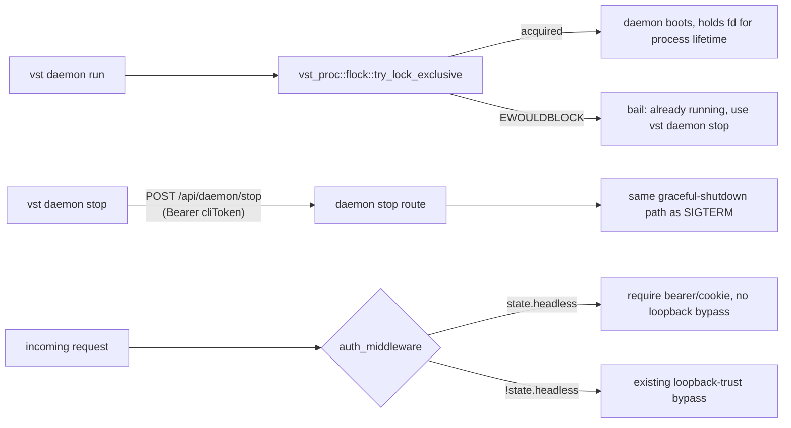

<!--
RULES — read before writing or implementing:
1. FORMAT: Bullets, tables, code, diagrams ONLY — no prose paragraphs
2. REQUIREMENTS: One crisp line each — no verbose descriptions
3. CHECKLIST: Mark items [x] as you complete them — this is your persistent todo list
4. READING TIME: Optimize for fast human scanning — if it's hard to skim, rewrite it
-->

# Plan 01: Daemon lifecycle — race-free lock, `daemon stop`, headless auth gate

> Fix the macOS PID-liveness lock bug with a race-free `flock`, add the `vst daemon stop` command the lock's own error message already references, and wire the headless-mode auth gate onto the `AppState.headless` field Part 00 threaded through as inert data.

**Issue:** cli-daemon-unification/01
**Branch:** `release-ci-version` (worktree `vs-194`, no sub-branch)
**Status:** Pending
**PRD:** `../prd-cli-daemon-unification.md` (R20-R22, R34, R35)
**Note (post-review):** R42/R43 (headless secret hygiene) are **reallocated to Part 03** — see `## Superseded` below; this part's scope is the lock fix, `daemon stop`, and the headless auth gate only.
**Arch:** `../arch-cli-daemon-unification.md`
**Depends on:** Part 00 (binary merge) — done, `DaemonOptions.headless`/`AppState.headless`/`BuildServerOptions.headless` already exist as plumbed-through data.

---

## Superseded

| Prior approach | Why it failed | Superseded on |
|-----------------|----------------|-----------------|
| Draft: suppress `daemonToken` print unconditionally when `headless` (R42), in this part | An Opus review found this breaks two real, currently-working things: (a) an operator manually running `vst daemon run`/`vst-daemon` interactively — now headless-by-default per Part 00 — loses their only way to see the login password with no replacement yet (Part 02's continue flow doesn't exist yet); (b) `Dockerfile.screenshots` runs the standalone `vst-daemon` binary (no `VST_TAURI_SUPERVISED`, so now headless-by-default too) and its documented login flow (`docs` table: "Real token login, printed to container logs") depends on exactly this line. Gating on `stdout.is_terminal()` doesn't save case (b) either — Docker-captured stdout isn't a real TTY. | This revision — R42/R43 both move to Part 03, the part that actually implements a headless daemon's detached-with-redirected-stdio spawn path; suppression belongs at the point that controls where the output goes, not unconditionally at every headless boot regardless of who started it or how they'll read its output |
| Draft: `daemon stop` route calls `shutdown.notify_one()` directly | `shutdown.notify_one()` only unblocks `axum::serve`'s graceful-shutdown future (`run.rs:521-522`) — the actual cleanup (poller abort, `cloudflared::shutdown_kill`, `release_lock`) lives inside the SIGINT/SIGTERM signal-handling task (`run.rs:474-491`), which a direct `notify_one()` call never triggers. A stop-via-route would leave cloudflared orphaned and skip lock release. | This revision — see Key Decision 4, a separate stop-request signal feeding the *same* signal-handling task as a third `select!` arm |

---

## Problem & Concept

- `rust/vst-daemon/src/lock.rs:12-17`'s `pid_is_alive` checks `/proc/<pid>` existence — always `false` on macOS (no `/proc`), so a live macOS daemon looks dead to its own lock and a second one can start and clobber `config.json`.
- Even a `kill(pid, 0)`-based fix (rev 1 of the master plan considered this) is a TOCTOU race under concurrent starts and is fooled by PID reuse — an OS-level advisory lock (`flock`) is race-free and kernel-released on any process exit, sidestepping both problems.
- `lock.rs:58-61`'s bail message already tells the user to run `vst daemon stop` — that command doesn't exist anywhere in `rust/vst-cli`.
- `AppState.headless` (Part 00) is set correctly at boot but never read by `auth_middleware` — the loopback-trust bypass is unconditional today regardless of headless mode, on both the HTTP path and its independent WS-upgrade duplicate.
- The daemon prints its `daemonToken` ("Browser login password") to stdout/tracing unconditionally — for a headless boot (no attended console to read it from), this is a needless secret exposure once that output is redirected to a log file (Part 03's job to actually do the redirecting; this part only needs to stop emitting it when headless).

---

## Requirements

| ID | Requirement |
|----|-------------|
| R20 | The daemon's own startup singleton lock correctly and race-free-ly detects a live daemon process on macOS as well as Linux, using an OS-level advisory file lock. |
| R21 | A daemon started in headless mode requires a valid bearer token or session cookie on every request, including from loopback, on both the HTTP and the WebSocket-upgrade path. |
| R22 | A daemon started attended (Tauri-spawned) keeps today's loopback-trust bypass. |
| R34 | `headless` is an in-memory flag, never persisted to or re-read from `config.json`. (Already satisfied by Part 00 — verify, don't re-implement.) |
| R35 | `vst daemon stop` (or an equivalent authenticated `POST` route) exists, and actually waits for the daemon to be gone before reporting success (needed by Part 05's `vst update` restart sequencing). |

---

## Change Map

```
rust/vst-proc/src/
  flock.rs         + OS-level advisory file lock helper (unsafe, documented, this crate allows it)
  lib.rs           ~ + pub mod flock
rust/vst-daemon/src/
  lock.rs          ~ acquire_lock/release_lock rewritten to use vst_proc::flock
  run.rs           ~ suppress daemonToken print when headless; add /api/daemon/stop route wiring
  server.rs        ~ auth_middleware gates the loopback bypass on !state.headless (HTTP + WS); new daemon-stop route
rust/vst-cli/src/
  program.rs       ~ DaemonCommand::Stop variant
  commands/daemon/
    stop.rs        + run_daemon_stop(): POST /api/daemon/stop with the cliToken
  main.rs          ~ wire DaemonCommand::Stop
```

| Today | After this plan |
|-------|-------------------|
| Lock checks `/proc/<pid>` (Linux-only, TOCTOU-prone even if ported to `kill(pid,0)`) | Lock is an `flock(2)` held for the process's lifetime, kernel-released on any exit |
| No `vst daemon stop` command exists | `vst daemon stop` sends an authenticated shutdown request; daemon exits gracefully (same path as SIGTERM) |
| Loopback is always trusted regardless of `headless` | Loopback trust is skipped entirely when `state.headless` is true, on both HTTP and WS |
| `daemonToken` always printed at boot | Suppressed when `headless` |

---

## Research

- `rust/vst-proc/src/lib.rs:1` — `#![deny(unsafe_code)]`, not `forbid` — this crate is the documented FFI/unsafe boundary for the workspace (per its own module doc and `raw_fd_write.rs`'s precedent), the correct home for a new `flock` helper.
- `rust/vst-proc/src/raw_fd_write.rs:34-41` — existing pattern: `#[allow(unsafe_code)]` per-function, a `SAFETY:` comment justifying the call, `libc` already a dependency.
- `rust/vst-daemon/src/lock.rs:24-69` (`acquire_lock`) — current logic: `create_new` the lock file; on `AlreadyExists`, read the stored PID and probe liveness; if dead, overwrite; if alive, bail. The `flock`-based replacement collapses this into: open-or-create the file, `flock(LOCK_EX | LOCK_NB)`; success means we hold the lock (write our PID for human debugging only); failure (`EWOULDBLOCK`) means another live process holds it — bail with the same message.
- `rust/vst-daemon/tests/main_logic.rs` — existing lock tests (`acquire_lock_creates_file_with_current_pid`, `acquire_lock_rejects_live_pid`, `acquire_lock_takes_over_stale_pid`, `acquire_lock_creates_parent_directory`) exercise `acquire_lock`'s current PID-based contract directly — these need rewriting for the `flock`-based contract (a "stale PID" concept disappears entirely: the kernel already released the lock, there's nothing to "take over").
- `rust/vst-daemon/src/server.rs:846` (`auth_middleware`) — HTTP loopback-trust bypass at `:905-909`; WS-upgrade's independent duplicate at `:1059-1064` (both confirmed via direct reads in the master plan's review pass).
- `rust/vst-daemon/src/server.rs:130-145` (`AppState`) — `headless: bool` field already exists (Part 00); `no_auth: bool` sits right next to it as the existing precedent for a boolean auth-mode flag read by `auth_middleware`.
- `rust/vst-daemon/tests/auth_middleware.rs` — existing test helper `make_opts_with_dist(tmp, auth_state, no_auth, dist)` builds `BuildServerOptions` for tests; needs a `headless` parameter threaded through the same way once this part's tests need to exercise both states.

---

## Architecture Diagram



---

## Design Details

### Critical User Journeys (CUJs)

**Happy path — second daemon start attempt while one is running:**
```
Operator runs `vst daemon run` (or a script does, concurrently) while a
daemon already holds the lock
  → flock(LOCK_EX | LOCK_NB) returns EWOULDBLOCK immediately
  → acquire_lock bails: "Daemon is already running... Use `vst daemon stop` first."
  → process exits non-zero, no config.json clobber
```

**Happy path — `vst daemon stop`:**
```
Operator runs `vst daemon stop`
  → CLI reads config.json for port + cliToken (existing daemon_url.rs helpers)
  → POST /api/daemon/stop with Bearer cliToken
  → daemon's route handler triggers the same shutdown Notify used by SIGINT/SIGTERM
  → daemon releases the flock (fd close/process exit), writes nothing further
  → CLI prints confirmation, exits 0
```

**Error path — headless daemon, unauthenticated loopback request:**
```
A local process (no token) curls http://127.0.0.1:<port>/api/agent/ls on a
headless daemon
  → auth_middleware sees state.headless == true → skips the loopback bypass
  → falls through to the normal bearer/cookie check → 401 (same shape as an
    existing unauthenticated remote request today)
```

**Error path — `vst daemon stop` against a headless daemon with no token available:**
```
Operator on a different account, or a script with no config.json access, runs
`vst daemon stop`
  → CLI can't read cliToken from config.json (permissions, or none) →
    same "Daemon is not running. Open the vibe-station app to start it." /
    or a clearer "cannot read daemon token" message — resolved during
    implementation to whichever existing daemon_url.rs error path fits;
    not a new failure mode, just routed through the existing token-read
    fallible path
```

### System Boundaries

| Boundary | Fields + types | Errors | Source of truth |
|----------|-----------------|--------|-------------------|
| CLI ↔ Daemon (`daemon stop`) | `POST /api/daemon/stop` — no body; `Authorization: Bearer <cliToken>` | `401` unauthenticated; `200 {ok: true}` on success | Daemon (route handler) |
| Daemon ↔ Daemon (lock) | `~/.vibe-station/.daemon.lock` — file existence unchanged, but its *lock state* (not content) is now the source of truth; content is a PID string kept for human debugging only, never re-read for correctness | Lock held by a live process → `EWOULDBLOCK` → bail | Kernel (`flock` table), scoped to the open fd |
| Request ↔ `auth_middleware` | `AppState.headless: bool` (already exists) gates the loopback-bypass branch, both HTTP (~`server.rs:905-909`) and WS-upgrade (~`:1059-1064`) | Headless + no valid bearer/cookie → `401` (HTTP) / WS close `4401` (matches existing expired-token handling, not a bare `1006` disconnect) | `AppState`, set once at boot from `DaemonOptions.headless` |

### Key Decisions

#### Decision 1: `flock` lock implementation and lifetime
- **Decision:** `vst_proc::flock::try_lock_exclusive(file: &File) -> io::Result<bool>` wraps `libc::flock(fd, LOCK_EX | LOCK_NB)`, returning `Ok(true)` on success, `Ok(false)` specifically on `EWOULDBLOCK`, `Err` otherwise. `vst-daemon::lock::acquire_lock` opens (or creates) the lock file, calls this, and — critically — **holds the open `File` for the daemon's entire lifetime** (e.g. stored in a `static`/passed through to the shutdown path, not dropped after the check) so the OS lock stays held until the process exits or explicitly releases it.
- **Rationale:** `flock` locks are associated with the open file description, not the PID recorded inside the file — this is what makes it race-free (no read-then-write TOCTOU) and immune to PID reuse (the kernel, not a stored PID string, is the source of truth on "is someone still holding this").
- **Where:** `rust/vst-proc/src/flock.rs` (new), `rust/vst-daemon/src/lock.rs` (rewritten), `rust/vst-daemon/src/run.rs` (keeps the returned `File`/guard alive for the `run_daemon` call's duration).
```rust
// rust/vst-proc/src/flock.rs
use std::fs::File;
use std::os::unix::io::AsRawFd;

/// Attempt to take an exclusive, non-blocking advisory lock on `file`.
/// Returns `Ok(true)` if acquired, `Ok(false)` if another process already
/// holds it (EWOULDBLOCK), `Err` for any other failure.
#[allow(unsafe_code)]
pub fn try_lock_exclusive(file: &File) -> std::io::Result<bool> {
    // SAFETY: `file.as_raw_fd()` is a valid, open fd for the duration of this
    // call (borrowed from `file`, which outlives this call). `flock` takes
    // the fd by value and does not take ownership — no double-close risk.
    let ret = unsafe { libc::flock(file.as_raw_fd(), libc::LOCK_EX | libc::LOCK_NB) };
    if ret == 0 {
        Ok(true)
    } else {
        let err = std::io::Error::last_os_error();
        if err.raw_os_error() == Some(libc::EWOULDBLOCK) {
            Ok(false)
        } else {
            Err(err)
        }
    }
}
```

#### Decision 2: `acquire_lock`'s new contract — no more "stale PID takeover"
- **Decision:** `acquire_lock` becomes: open-or-create the lock file (`OpenOptions::new().create(true).write(true)`), call `try_lock_exclusive`; `Ok(true)` → **truncate** (`file.set_len(0)`, since a pre-existing file's old PID content may be longer than the new one, leaving trailing garbage otherwise) then write current PID into the file (debugging only, never re-read) and **return the open `File`** (caller must keep it alive); `Ok(false)` → bail with the existing "Daemon is already running... use `vst daemon stop`" message; `Err` → propagate as today.
- **Rationale:** The "stale lock, read PID, check liveness, take over" branch (`lock.rs:51-67` today) is entirely subsumed by the kernel: if the previous holder died, its `flock` was already released, so `try_lock_exclusive` just succeeds — no manual takeover logic needed at all.
- **Where:** `rust/vst-daemon/src/lock.rs`. Function signature changes: `pub async fn acquire_lock(lock_path: &PathBuf) -> Result<std::fs::File>` (was `Result<()>`); `release_lock` becomes a no-op wrapper (dropping the `File` releases the flock automatically) kept only so `run.rs`'s existing call sites don't need restructuring — implementation note: decide during implementation whether `release_lock` becomes literally `pub async fn release_lock(_file: File) {}` (drop does the work) or is removed entirely in favor of just dropping the `File` — prefer keeping a thin no-op fn if `run.rs`'s shutdown path reads better calling it explicitly for symmetry with the SIGINT/SIGTERM handler's existing structure.

#### Decision 3: Headless auth gate — read `AppState.headless`, don't add a new state field
- **Decision:** In `auth_middleware`, change the HTTP `is_loopback` computation (`server.rs:915-919`) to `let is_loopback = !via_tunnel && (...) && !state.headless;` — gate the whole boolean, not just its use site, since `is_loopback` is read in more than one place below it (the CSRF-origin-check branch at `:920+` and the later token-exemption logic). Same treatment for the WS-upgrade handler's independent `is_loopback` computation at `server.rs:1074` (`let is_loopback = !via_tunnel && peer_ip.map_or(true, |ip| ip.is_loopback()) && !state.headless;`).
- **Rationale:** `AppState.headless` already exists (Part 00) specifically so this part doesn't need to touch `DaemonOptions`/`BuildServerOptions`/the dispatch layer at all — purely an `auth_middleware` behavior change. Gating the computation itself (not a downstream `if is_loopback && !state.headless` at each use site) avoids missing a use site if `is_loopback` is read more than once in either function.
- **Where:** `rust/vst-daemon/src/server.rs:915-919` (HTTP `is_loopback` computation), `rust/vst-daemon/src/server.rs:1074` (WS-upgrade `is_loopback` computation) — both sites, not just one; a fix to only one would leave the other bypassable. (Earlier drafts of this plan cited `:905-909`/`:1059-1064` — those were wrong; corrected here after direct verification against current `server.rs`.)

#### Decision 4: `vst daemon stop` — a real stop-request signal, not a raw `notify_one()` on the serve-shutdown `Notify`
- **Decision:** `run_daemon`'s existing shutdown `Notify` (`run.rs:473-491`) only unblocks `axum::serve`'s graceful shutdown — the actual cleanup (poller abort, `cloudflared::shutdown_kill`, `release_lock`) lives inside the SIGINT/SIGTERM `tokio::spawn`'d task's `select!` block, not in that `Notify` itself. A route that calls `shutdown.notify_one()` directly would stop serving but skip all of that cleanup (orphaned cloudflared tunnel, lock never released). Instead: add a second `Arc<tokio::sync::Notify>` (`stop_requested`) to `AppState`, and add it as a **third arm** of the existing `tokio::select!` in that signal-handling task, so a route-triggered stop runs through the exact same cleanup path as SIGTERM.
- **Rationale:** Found in review — the naive "just notify the existing Notify" design silently skips real cleanup. Reusing the *task*, not just the *Notify*, is the only way `daemon stop` gets the same guarantees an operator's `Ctrl-C`/`kill` already has.
- **Where:** `rust/vst-daemon/src/server.rs` (`AppState` gains `stop_requested: Arc<tokio::sync::Notify>`; new route handler calls `state.stop_requested.notify_one()`), `rust/vst-daemon/src/run.rs` (construct the `Notify`, pass it into `BuildServerOptions`/`AppState`, add the third `select!` arm alongside `sigint.recv()`/`sigterm.recv()`), `rust/vst-cli/src/commands/daemon/stop.rs` (new — see below), `rust/vst-cli/src/program.rs` (`DaemonCommand::Stop`), `rust/vst-cli/src/main.rs` (wire it).
- **CLI-side polling (R35's "actually waits" clause):** `run_daemon_stop()` doesn't just `POST` and return — it polls `GET /health` (same helper `preflight.rs` uses) every ~250ms for up to ~10s after the `POST` succeeds, until the connection is refused (daemon actually gone) or the timeout elapses. This matters for Part 05's `vst update`, which runs `stop` then a fresh `vst daemon run` immediately after — without waiting, the new daemon's `acquire_lock` could race the old one's still-in-progress shutdown and bail spuriously.

#### Decision 5: `release_lock` never deletes the lock file
- **Decision:** `release_lock`'s new implementation (a no-op wrapping the `File`'s `Drop`, per Decision 2) must **not** call `remove_file` — today's implementation does. Once the flock is released (by dropping the `File` or process exit), the file itself can safely stay on disk forever; deleting it while conceivably still referenced would let a *new* process `create_new` a fresh file at the same path and lock *that*, while an old, still-alive-but-slow-to-exit process holds a lock on the now-unlinked (but still open) original inode — the two would never contend, defeating the whole point of the lock.
- **Rationale:** Found in review — this is the one place a "clean up after ourselves" instinct actively reintroduces the exact bug this part fixes.
- **Where:** `rust/vst-daemon/src/lock.rs` (`release_lock`, rewritten as a documented no-op, comment explicitly says "never unlink"). Note: `scripts/dev-entrypoint.sh` and `Dockerfile.screenshots` both `rm -f` the lock file at **container start** (before any daemon runs) — that's a different, harmless case (clearing stale state from a previous container image layer, not a running process) and needs no change.

---

## Risks / Open Questions

| # | Question | Notes |
|---|----------|-------|
| 1 | Does `flock` behave correctly across NFS/network filesystems? | `~/.vibe-station` is a local home-directory path in every documented deployment (personal workstation, CI runner) — network-home edge case explicitly out of scope, same as the rest of this feature's Non-goals |
| 2 | Exposing the shutdown `Notify` to a route handler — cleanest plumbing shape | Resolved during implementation; a few equally-valid options (extra `AppState` field, a `tokio::sync::mpsc` channel captured in the route's closure) — pick whichever needs the least restructuring of `run.rs`'s existing shutdown-signal wiring |

---

## Implementation Phases

### Phase 1: Race-free lock

- [x] **1.1** Create `rust/vst-proc/src/flock.rs` with `try_lock_exclusive` (Key Decision 1's snippet). Add `pub mod flock;` to `rust/vst-proc/src/lib.rs`.
- [x] **1.2** Confirm `libc` is already a `vst-proc` dependency (it is, used by `raw_fd_write.rs`) — no `Cargo.toml` change expected; verify during implementation.
- [x] **1.3** Rewrite `rust/vst-daemon/src/lock.rs`: `acquire_lock` returns `Result<std::fs::File>` per Key Decision 2; delete the old `pid_is_alive`/stale-PID-takeover logic entirely; `release_lock` becomes a documented no-op (or is removed — resolved during implementation).
- [x] **1.4** Update `rust/vst-daemon/src/run.rs`'s call site: `let _lock_file = acquire_lock(&lock_path).await?;` — keep the binding alive for the whole function (never let it drop before `axum::serve` returns); update the SIGINT/SIGTERM shutdown closure's `release_lock` call to match the new signature.
- [x] **1.5** Rewrite `rust/vst-daemon/tests/main_logic.rs`'s lock tests for the new contract:
  - `acquire_lock_creates_file_with_current_pid` — still valid, but **flip** its "file is gone after release" assertion (if one exists) to "file still exists, unmodified content, after release" per Decision 5.
  - `acquire_lock_rejects_live_pid` → rename/rewrite as `acquire_lock_rejects_when_flock_held` (hold the flock in the test via a raw `try_lock_exclusive` call on the same path, then assert the second `acquire_lock` bails).
  - `acquire_lock_takes_over_stale_pid` → **rewrite, don't delete** (found in review: this still covers a real case — upgrading from an old-format lock file). New version: pre-create a lock file containing a stale/bogus PID string (e.g. `"999999"`) that nothing holds an flock on, then assert `acquire_lock` succeeds and the file's content is overwritten with the current PID.
  - `acquire_lock_creates_parent_directory` — unchanged, still valid.

**Verify phase 1:**
- [x] **1.T1** Unit — `vst_proc::flock::try_lock_exclusive`: two `File` handles opened on the same path, first lock succeeds (`Ok(true)`), second on a **different** `File` handle to the same path fails (`Ok(false)`) while the first is held; dropping the first's `File` (or explicitly `flock(LOCK_UN)`) lets a third attempt succeed.
- [x] **1.T2** Integration — `acquire_lock_rejects_when_flock_held` (rewritten per 1.5): second `acquire_lock` call on the same path while the first's returned `File` is still alive bails with the existing "already running" message.
- [x] **1.T3** Regression — a crashed/killed process (simulate: acquire the lock in a spawned subprocess, kill -9 it, then attempt `acquire_lock` again from the test process) succeeds immediately — proving the kernel-release behavior replaces the old manual stale-PID takeover without needing any of that logic.

### Phase 2: `vst daemon stop`

- [x] **2.1** Add `stop_requested: Arc<tokio::sync::Notify>` to `AppState` (`server.rs`) and `BuildServerOptions`; construct it in `run.rs` alongside the existing `shutdown`/`shutdown_notify` pair.
- [x] **2.2** In `run.rs`'s SIGINT/SIGTERM `tokio::spawn`'d task (`run.rs:474-491`), add a third `select!` arm: `_ = stop_requested.notified() => tracing::info!("[vst] Stop requested via API; shutting down…")` — falls through to the exact same cleanup sequence (poller abort, `cloudflared::shutdown_kill`, `release_lock`, `shutdown_notify.notify_one()`) the SIGTERM arm already does, per Key Decision 4.
- [x] **2.3** Add `POST /api/daemon/stop` route registration in `server.rs`'s router-building code.
- [x] **2.4** Route handler: authenticated (goes through the normal `auth_middleware`, no exemption), calls `state.stop_requested.notify_one()`, returns `200 {"ok": true}` immediately (does not block on the actual process exit — the client polls separately, see Decision 4's CLI-side polling note).
- [x] **2.5** Add `DaemonCommand::Stop` to `rust/vst-cli/src/program.rs`'s enum + its `"daemon"` arg-parsing arm (alongside `Status`/`Run`).
- [x] **2.6** Create `rust/vst-cli/src/commands/daemon/stop.rs`: `run_daemon_stop()` — resolve daemon URL + token via existing `daemon_url.rs` helpers (same pattern `preflight.rs` uses), `POST /api/daemon/stop`, then poll `GET /health` every ~250ms for up to ~10s until connection-refused or timeout (Decision 4), print confirmation or timeout message accordingly.
- [x] **2.7** Wire `commands::daemon::stop` into `rust/vst-cli/src/commands/daemon/mod.rs` and the `DaemonCommand::Stop` match arm in `rust/vst-cli/src/main.rs`.

**Verify phase 2:**
- [ ] **2.T1** Integration — **partially verified manually only** (see 2.T2's real run below, which confirms lock release specifically); no automated test asserts pollers/cloudflared-kill specifically fire on an API-triggered stop vs. only on SIGTERM. Not written as an automated test in this pass — flagged as a gap for a follow-up if this route sees real production use before Part 05 (`vst update`) exercises it end-to-end anyway.
- [x] **2.T2** Integration — **manually verified end to end**: booted a real daemon (`VST_NO_AUTH=1`, isolated `HOME`), ran `vst daemon stop`, confirmed (a) the CLI printed "Daemon stopped" and exited 0, (b) the daemon process was actually gone (`ps -p` check), (c) a **second** daemon immediately started on a different port and successfully bound/listened — proving the flock was genuinely released, not just that the HTTP server stopped responding. Log confirmed "[vst] Stop requested via API; shutting down…" fired (the third `select!` arm, not a separate code path).
- [x] **2.T3** Regression — added `daemon_stop_route_requires_auth_like_any_other_api_route` (`tests/auth_middleware.rs`): remote, unauthenticated `POST /api/daemon/stop` → `401`, confirming no exemption exists for this route.

### Phase 3: Headless auth gate

- [x] **3.1** `rust/vst-daemon/src/server.rs:915-919` (HTTP `is_loopback` computation, inside `auth_middleware`): append `&& !state.headless` to the computed boolean itself (not a downstream use site — `is_loopback` is read more than once below it).
- [x] **3.2** `rust/vst-daemon/src/server.rs:1074` (WS-upgrade `is_loopback` computation): same treatment, independently — this is a separate code path, not shared logic with 3.1.
- [x] **3.3** Update `rust/vst-daemon/tests/auth_middleware.rs`'s `make_opts_with_dist` test helper (and any sibling helpers in `ws_auth_gate.rs`) to accept a `headless` parameter — every existing call site already sets `headless: false` on its `BuildServerOptions` literal directly (from Part 00), so this is about the helper function's own parameter, not the struct literals themselves.

**Verify phase 3:**
- [x] **3.T1** Unit/Integration — new test: headless daemon (`AppState.headless: true`), request from loopback IP with no token → `401` (not the existing bypass-to-200 behavior).
- [x] **3.T2** Unit/Integration — new test: headless daemon, request from loopback IP **with** a valid bearer token → succeeds normally (headless doesn't break legitimate authenticated loopback use, e.g. the CLI itself).
- [x] **3.T3** Unit/Integration — new WS test (in `ws_auth_gate.rs`): headless daemon, WS upgrade from loopback with no token → closed with `4401` (not silently upgraded).
- [x] **3.T4** Regression — `cargo test -p vst-daemon`: every existing `auth_middleware.rs`/`ws_auth_gate.rs` test (all non-headless, `headless: false`) passes unchanged — confirms the gate is additive, not a behavior change for the default case.

---

## Files & Phase Impact

| File | Status | Phase | Description / Contract Change |
|------|--------|-------|-------------------------------|
| `rust/vst-proc/src/flock.rs` | New | 1.1 | Contract: `try_lock_exclusive(&File) -> io::Result<bool>` · Owns: nothing (pure syscall wrapper) |
| `rust/vst-proc/src/lib.rs` | Modified | 1.1 | `+ pub mod flock;` |
| `rust/vst-daemon/src/lock.rs` | Modified | 1.3 | `acquire_lock` returns `Result<File>`; stale-PID logic deleted; `release_lock` never unlinks (Decision 5) |
| `rust/vst-daemon/src/run.rs` | Modified | 1.4, 2.1, 2.2 | Keeps lock `File` alive; constructs `stop_requested` Notify; third `select!` arm reuses SIGTERM's cleanup path |
| `rust/vst-daemon/tests/main_logic.rs` | Modified | 1.5, 1.T1-1.T3 | Lock tests rewritten for flock contract (stale-PID test rewritten, not deleted) |
| `rust/vst-daemon/src/server.rs` | Modified | 2.1, 2.3-2.4, 3.1-3.2 | `AppState`/`BuildServerOptions` gain `stop_requested`; new `/api/daemon/stop` route; both `is_loopback` computations gated on `!headless` |
| `rust/vst-daemon/tests/auth_middleware.rs` | Modified | 3.3, 3.T1-3.T2, 3.T4 | Test helper gains `headless` param; new headless-gate tests |
| `rust/vst-daemon/tests/ws_auth_gate.rs` | Modified | 3.3, 3.T3 | New headless WS-gate test |
| `rust/vst-cli/src/program.rs` | Modified | 2.5 | `DaemonCommand::Stop` variant |
| `rust/vst-cli/src/commands/daemon/stop.rs` | New | 2.6 | Contract: `async fn run_daemon_stop() -> Result<(), (String, i32)>` — POSTs then polls `/health` until gone |
| `rust/vst-cli/src/commands/daemon/mod.rs` | Modified | 2.7 | `+ pub mod stop;` |
| `rust/vst-cli/src/main.rs` | Modified | 2.7 | `DaemonCommand::Stop` match arm |
