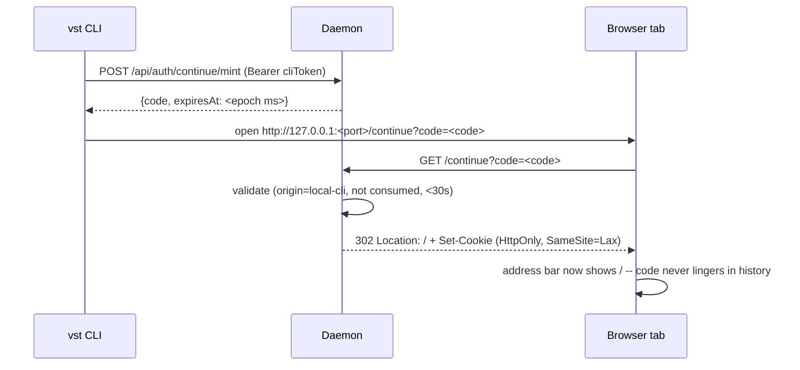

<!--
RULES — read before writing or implementing:
1. FORMAT: Bullets, tables, code, diagrams ONLY — no prose paragraphs
2. REQUIREMENTS: One crisp line each — no verbose descriptions
3. CHECKLIST: Mark items [x] as you complete them — this is your persistent todo list
4. READING TIME: Optimize for fast human scanning — if it's hard to skim, rewrite it
-->

# Plan 02: Browser "continue" flow (CUJ4)

> A CLI-opened browser tab authenticates via a short-lived, single-use code exchanged for a session cookie via a redirect — reusing the existing mobile/QR mint/redeem mechanism under a new origin, never a durable token in a URL.

**Issue:** cli-daemon-unification/02
**Branch:** `release-ci-version` (worktree `vs-194`, no sub-branch)
**Status:** Pending
**PRD:** `../prd-cli-daemon-unification.md` (R14, R36-R38)
**Arch:** `../arch-cli-daemon-unification.md`
**Depends on:** Part 00 (binary merge) — done.

---

## Problem & Concept

- CUJ2a/2b's "Web UI" branch (Part 03, not yet built) needs a way to hand a freshly-opened browser tab an authenticated session — the daemon it's opening against is headless (Part 01: loopback trust is off), so simply opening `http://127.0.0.1:<port>/` gets a `401`, not a working UI.
- The mechanism already exists for phones scanning a QR code (`rust/vst-routes/src/mobile_auth.rs`) — mint a 32-byte one-time code (30s TTL, single-use), redeem it at `GET /mobile-auth?code=` for a `Set-Cookie`. This part reuses that mechanism for a CLI-opened tab instead of inventing a new one.
- Today's redeem handler (`mobile_auth()`, `mobile_auth.rs:411-501`) hardcodes its accepted origin from `via_tunnel` alone (`origin_matches` at `:445-447`: `e.origin == if via_tunnel {"tunnel"} else {"local"}`) — there's no way to mint/redeem a third origin through it without generalizing that check. The same `via_tunnel` value also gates the cookie's `Secure` attribute (`:490`) — any refactor must not lose that second use.
- `mobile_auth()`'s success response is a static HTML page (`SUCCESS_HTML`, `mobile_auth.rs:586+`) with a link back to `/` — R38 requires an actual redirect (scrubs the code from the visible URL via `Location`, not a page the user has to click through).
- **Found in review — a real gap, not a nitpick:** neither the mint route nor the redeem route as originally drafted rejected tunnel traffic. `/api`'s auth middleware only checks *whether* a caller is authenticated, not *which* scope/purpose a valid token was minted for — a phone holding an ordinary `Browser`-scope cookie over the Cloudflare tunnel could otherwise mint a `local-cli` code and redeem it over that same tunnel, ending up with a non-`Secure` cookie sent over what is (from the browser's perspective) an HTTPS tunnel origin. `local_qr`/`mobile_qr` (`mobile_auth.rs`) already guard their own routes with `is_remote → TunnelOnlyBlocked` — this flow needs the identical guard, on both ends (mint AND redeem), not just one.

---

## Requirements

| ID | Requirement |
|----|-------------|
| R14 | Choosing "Web UI" opens a browser tab that ends up authenticated without a durable token ever appearing in the URL. |
| R36 | The "continue" flow mints/redeems using the same `OneTimeCodeStore` mechanism as the mobile/QR flow — not a new implementation. |
| R37 | A continue code is bound to a new `origin: "local-cli"`, distinct from `"local"`/`"tunnel"`, redeemed with the same single-use + 30s TTL enforcement. |
| R38 | Successful redemption scrubs the code from the visible URL via a redirect, not a static HTML success page. |

---

## Change Map

```
rust/vst-routes/src/
  mobile_auth.rs   ~ origin check generalized (shared by /mobile-auth and /continue); + continue_redeem(), + mint_continue_code()
rust/vst-daemon/src/
  server.rs        ~ + POST /api/auth/continue/mint route, + GET /continue route (root, alongside /health and /mobile-auth)
AGENTS.md          ~ "only three root routes" note updated to four (/continue added)
```

| Today | After this plan |
|-------|-------------------|
| No mechanism for a CLI-opened browser tab to authenticate against a headless daemon | `POST /api/auth/continue/mint` (CLI, authenticated) → `GET /continue?code=` (browser) → cookie + redirect |
| `mobile_auth()`'s origin check only understands `"tunnel"`/`"local"` | Same function's origin check is parameterized, also accepting `"local-cli"` |
| `/mobile-auth`'s success path is a static HTML page | `/continue`'s success path is a `302` redirect to `/` (the mobile-auth page is unchanged — still HTML, since a phone scanning a QR code has no "previous URL" to scrub) |

---

## Research

- `rust/vst-routes/src/mobile_auth.rs:102-128` (`mint_one_time_code(origin: &str)`) already accepts an arbitrary origin string — no change needed here, called with `"local-cli"`.
- `rust/vst-routes/src/mobile_auth.rs:411-501` (`mobile_auth`, the redeem handler) — full logic: rate limit → validate code (origin match + not consumed + within 30s) → mint `TokenScope::Browser` token → record `BrowserSession` → `Set-Cookie` header → HTML response. Origin check at `:441-443` is the only `via_tunnel`-derived piece; everything else (rate limit, TTL, single-use, token minting, cookie construction) is origin-agnostic already.
- `rust/vst-daemon/src/server.rs:3906-3944` (`handle_mobile_auth`) — the axum handler wiring pattern: extract headers/peer info, call the routes struct's async method, build a `Response` from its returned struct. `handle_continue_redeem` follows the identical shape, swapping in a redirect for the HTML.
- `rust/vst-daemon/src/server.rs:826-843` area — `/health`, `/mobile-auth`, `/ws` are the three routes registered directly on the root `Router` (before `.nest("/api", api)`); `/continue` joins them as a fourth, per the same reasoning (`/mobile-auth`'s doc comment already explains why: the auth handshake itself can't require the auth it's establishing).
- `AGENTS.md`'s CLI section states "Only three routes are intentionally at root: `/health`, `/mobile-auth`, `/ws`" (appears twice in the file) — this becomes stale (four) once `/continue` lands.
- **Tests already exist for this path (found in review — the original draft assumed none did):** `vst-routes/tests/auth_routes.rs::test_mobile_auth_routes_redeem_flow` (or similarly named — verify exact name during implementation) covers `mobile_auth()`'s redeem path today, including a `cookie.contains("Secure")` assertion on the tunnel branch (~`auth_routes.rs:388`) — this is the regression baseline for 1.T3, not a from-scratch test. `vst-daemon/tests/auth_middleware.rs::ws_and_mobile_auth_not_served_as_spa_with_missing_token` (`:269`) is the pattern to extend for `/continue`'s own routing-exemption test.
- `local_qr`/`mobile_qr` (`mobile_auth.rs`) already guard against tunnel misuse via an `is_remote` check → `MobileAuthRouteError::TunnelOnlyBlocked` — the exact precedent Decision 4 reuses.
- The `RATE_LIMITER` (`mobile_auth.rs:28`) is a single process-wide `static Mutex<HashMap<...>>` keyed by IP, shared across all three origins now — no new concurrency concern (confirmed in review), but new tests using `127.0.0.1` as the client IP share the existing 20-per-minute bucket with any other test hitting the same limiter in the same test binary run; use distinct IPs per new test to avoid cross-test flakiness.

---

## Architecture Diagram



---

## Design Details

### Critical User Journeys (CUJs)

**Happy path:**
```
CLI mints a code, opens the browser at /continue?code=XYZ
  → daemon validates the code (right origin, unconsumed, <30s old)
  → mints a Browser-scope token, records the session
  → responds 302 to "/" with Set-Cookie
  → browser follows the redirect; address bar shows "/", not "/continue?code=..."
  → subsequent requests carry the cookie, authenticated
```

**Error path — expired/consumed code:**
```
Browser opens /continue?code=XYZ more than 30s after mint, or a second time
  → validation fails (TTL or already-consumed)
  → 410 response with the existing EXPIRED_HTML page (same as /mobile-auth's
    expired-code page today — reused, not duplicated) — no redirect, since
    there's nothing valid to redirect into
```

**Error path — missing code parameter:**
```
Browser opens /continue with no ?code= at all
  → 400, same "Missing code parameter" text /mobile-auth already returns
    for the identical case
```

### System Boundaries

| Boundary | Fields + types | Errors | Source of truth |
|----------|------------------|--------|-------------------|
| CLI ↔ Daemon (mint) | `POST /api/auth/continue/mint` (no body) → `{code: String, expiresAt: <epoch ms>}` — authenticated like any other `/api` route (Bearer `cliToken`) | `401` unauthenticated (headless daemon, no token) | Daemon (`OneTimeCodeStore`) |
| Browser ↔ Daemon (redeem) | `GET /continue?code=<code>` → `302` + `Set-Cookie`, or `410`/`400` on failure | `410` expired/consumed, `400` missing code, `429` rate-limited (same limiter `/mobile-auth` already shares) | Daemon (`OneTimeCodeStore`) |

### Key Decisions

#### Decision 1: Generalize `mobile_auth()`'s origin check, don't duplicate the redeem logic — preserving the `Secure` cookie decision
- **Decision:** Change `mobile_auth()`'s internal origin computation from the hardcoded `if via_tunnel {"tunnel"} else {"local"}` to accept **two** explicit parameters: `expected_origin: &str` and `secure_cookie: bool` (found in review — `via_tunnel` was doing double duty in the original code, gating both the origin match *and* the cookie's `Secure` attribute at `mobile_auth.rs:490`; a refactor that only threads through the origin string silently drops `Secure` for the tunnel path). `handle_mobile_auth` passes `(if via_tunnel {"tunnel"} else {"local"}, via_tunnel)` — unchanged external behavior; `continue_redeem` passes `("local-cli", false)` — always the local cookie shape, since (per Decision 4) this flow now explicitly refuses tunnel traffic rather than merely assuming it never occurs.
- **Rationale:** R36's whole point is reuse; duplicating the redeem body into a second function would let the two drift. Threading `secure_cookie` explicitly (not re-deriving it from `expected_origin == "tunnel"`) keeps the cookie-shape decision visible at each call site instead of implicit in a string comparison.
- **Where:** `rust/vst-routes/src/mobile_auth.rs` — refactor `mobile_auth()`'s body into a private `async fn redeem_common(&self, code_param, client_ip, expected_origin: &str, secure_cookie: bool, user_agent) -> Result<RedeemSuccess, RedeemError>`, with `mobile_auth()` (HTML) and a new `continue_redeem()` (redirect) as thin public wrappers.
```rust
// rust/vst-routes/src/mobile_auth.rs — new internal shape
struct RedeemSuccess { set_cookie: String }
enum RedeemError { RateLimited, MissingCode, Invalid, AuthNotConfigured }

// mobile_auth() becomes:
pub async fn mobile_auth(&self, code_param, client_ip, via_tunnel, user_agent) -> MobileAuthRedeemResponse {
    let expected = if via_tunnel { "tunnel" } else { "local" };
    match self.redeem_common(code_param, client_ip, expected, via_tunnel, user_agent).await {
        Ok(s) => MobileAuthRedeemResponse { status: 200, html: SUCCESS_HTML.into(), set_cookie: Some(s.set_cookie) },
        Err(e) => /* map to existing status/html per error variant, unchanged text */,
    }
}

// new sibling — via_tunnel rejected before this is ever called, see Decision 4:
pub async fn continue_redeem(&self, code_param, client_ip, user_agent) -> ContinueRedeemResponse {
    match self.redeem_common(code_param, client_ip, "local-cli", false, user_agent).await {
        Ok(s) => ContinueRedeemResponse { status: 302, redirect_to: Some("/".into()), error_html: None, set_cookie: Some(s.set_cookie) },
        Err(e) => ContinueRedeemResponse { status: /* per variant */, redirect_to: None, error_html: Some(/* existing text per variant */), set_cookie: None },
    }
}
```

#### Decision 2: Mint route requires normal auth, not a new bypass
- **Decision:** `POST /api/auth/continue/mint` sits under the `/api` nest with no auth exemption — the CLI already holds a valid `cliToken` (read from `config.json`, same as every other CLI→daemon call) and presents it as a normal Bearer header via the existing `daemon_post` client helper.
- **Rationale:** The CLI is the only caller of this route (it's the one opening the browser) and it's always already authenticated — no reason to special-case it, and doing so would be a needless new unauthenticated attack surface on a headless (Part 01) daemon.
- **Where:** `rust/vst-daemon/src/server.rs` (route registration inside the `api` router, not the root router).

#### Decision 3: `/continue` at root — explicit exemption, not an accidental one
- **Decision:** `GET /continue` is registered directly on the root `Router`, not nested under `/api`. **Found in review:** `/mobile-auth`'s auth-middleware exemption is an explicit hardcoded key match (`server.rs:978-982`: `key == "GET /mobile-auth"`), separate from the broader "any non-`/api` GET/HEAD falls through to the SPA" catch-all (`:993-999`) that the SPA-deep-link login screen relies on. `/continue` would technically already pass through via that second, broader rule with zero `auth_middleware` changes — but relying on that silently would make its exemption an accident of the SPA-fallback design, not a documented, intentional one. Add `/continue` to the **explicit** key list, and to the SPA-catch-all's exclusion list (`:996`, alongside `/ws`/`/mobile-auth`), matching `/mobile-auth`'s belt-and-suspenders treatment exactly.
- **Rationale:** Consistency with the one existing precedent for exactly this shape of route; explicit is better than "works because of an unrelated broader rule."
- **Where:** `rust/vst-daemon/src/server.rs:978-982` (explicit key list), `:993-999` (SPA-catch-all exclusion), root route registration alongside `/health`/`/mobile-auth`/`/ws`; `AGENTS.md` (the "only three root routes" note appears **twice** in that file — both need updating to four).

#### Decision 4: Reject tunnel traffic on both ends — found in review, not in the original draft
- **Decision:** Both the mint handler and the redeem handler explicitly refuse tunnel-sourced requests. The mint handler checks `is_remote` (same computation `local_qr`/`mobile_qr` already use) and returns `MobileAuthRouteError::TunnelOnlyBlocked` (`403`) if true — mirroring those two routes exactly. `handle_continue_redeem` checks `via_tunnel` (the `cf-connecting-ip` header) and returns an error response (reuse `410`) **before** calling `continue_redeem` at all, rather than trusting `continue_redeem`'s internal logic alone.
- **Rationale:** Without this, a phone holding a Browser-scope cookie over the Cloudflare tunnel could mint a `local-cli` code and redeem it over that same tunnel — `/api`'s auth middleware only checks *whether* a caller is authenticated, not *which purpose* a token was minted for, so nothing else in the stack would stop this. `local_qr`/`mobile_qr`'s own `TunnelOnlyBlocked` guard is the established precedent.
- **Where:** `rust/vst-daemon/src/server.rs` (both new route handlers, checking the same `cf-connecting-ip`/`is_remote` signal `handle_mobile_auth` and the tunnel-enable/disable handlers already compute).

#### Decision 5: No-auth mode (`VST_NO_AUTH`) degrades gracefully, doesn't 503
- **Decision:** When `auth_state` is `None` (no-auth mode), `continue_redeem` returns a `302` to `/` with no `Set-Cookie`, instead of `redeem_common`'s existing `AuthNotConfigured` → `503` path (unchanged for `/mobile-auth`, which keeps its current 503 behavior — this decision is scoped to the continue flow only).
- **Rationale:** `docker-compose.dev.yml`, `scripts/dev-sandbox.sh`, and ad-hoc `VST_NO_AUTH=1` testing are all real, documented local-dev patterns — a CLI-opened browser tab landing on a `503` in exactly those contexts would be a confusing regression for the most common local-dev path, discovered while reviewing this plan.
- **Where:** `rust/vst-routes/src/mobile_auth.rs` — a `continue_redeem`-specific short-circuit before calling `redeem_common`, checked when `self.auth_state.is_none()`.

---

## Risks / Open Questions

| # | Question | Notes |
|---|----------|-------|
| 1 | Should the mint route also accept an optional custom TTL? | No — R37 requires the same 30s TTL as the existing origins; no per-call override, keeping one predictable window across all three origins |

---

## Implementation Phases

### Phase 1: Generalize redeem logic + add continue_redeem

- [x] **1.1** In `rust/vst-routes/src/mobile_auth.rs`, extract `mobile_auth()`'s body (`:411-501`) into a private `async fn redeem_common(&self, code_param: Option<String>, client_ip: Option<&str>, expected_origin: &str, secure_cookie: bool, user_agent: &str) -> Result<RedeemSuccess, RedeemError>` per Key Decision 1's shape. Preserve every existing behavior byte-for-byte (rate limit check, TTL, single-use, token minting, `BrowserSession` recording, and — critically — the `Secure` cookie attribute, now driven by the passed-in `secure_cookie` instead of a re-derived `via_tunnel`).
- [x] **1.2** Rewrite `mobile_auth()` as a thin wrapper: compute `expected = if via_tunnel {"tunnel"} else {"local"}`, call `redeem_common(.., expected, via_tunnel, ..)`, map `Ok`/`Err` to the existing `MobileAuthRedeemResponse` shape with the existing HTML/status text for each error variant (verify byte-identical output via the regression test in 1.T3, including the `Secure` attribute on the tunnel path).
- [x] **1.3** Add `pub struct ContinueRedeemResponse { pub status: u16, pub redirect_to: Option<String>, pub error_html: Option<String>, pub set_cookie: Option<String> }` and `pub async fn continue_redeem(&self, code_param: Option<String>, client_ip: Option<&str>, user_agent: &str) -> ContinueRedeemResponse` per Key Decision 1's snippet, calling `redeem_common(.., "local-cli", false, ..)`.
- [x] **1.4** Add a no-auth-mode short-circuit to `continue_redeem` per Key Decision 5: if `self.auth_state.is_none()`, return `ContinueRedeemResponse { status: 302, redirect_to: Some("/".into()), error_html: None, set_cookie: None }` immediately, without calling `redeem_common` (which would hit the `AuthNotConfigured` → `503` path `mobile_auth()` still uses unchanged).
- [x] **1.5** Add `pub fn mint_continue_code(&self) -> (String, i64)` to `MobileAuthRoutes` (or call `self.code_store.mint_one_time_code("local-cli")` directly at the route-handler call site — resolve during implementation to whichever reads better against the existing `mobile_qr`/`local_qr` method precedent).

**Verify phase 1:**
- [x] **1.T1** Unit — `redeem_common` with a code minted under `"local-cli"`: origin match succeeds only when `expected_origin == "local-cli"`, fails for `"local"`/`"tunnel"` (proves origins don't cross-redeem).
- [x] **1.T2** Unit — `continue_redeem` success path: returns `status: 302`, `redirect_to: Some("/")`, `set_cookie: Some(...)` containing `HttpOnly` and `SameSite=Lax` but never `Secure`.
- [x] **1.T3** Regression — extend/reuse the existing `vst-routes/tests/auth_routes.rs` mobile-auth redeem test(s) (find the exact current name during implementation — Research confirms this coverage already exists, including a `cookie.contains("Secure")` assertion on the tunnel path): confirm `mobile_auth()`'s behavior (status codes, HTML bodies, `Secure` attribute on tunnel) is byte-identical after the `redeem_common` refactor.
- [x] **1.T4** Unit — `continue_redeem` in no-auth mode (`auth_state: None`): returns `302` to `/` with no `Set-Cookie`, never `503`.

### Phase 2: Routes

- [x] **2.1** Add `POST /api/auth/continue/mint` to `server.rs`'s `api` router: authenticated (no exemption), handler checks `is_remote` first (Key Decision 4 — same `TunnelOnlyBlocked` guard `local_qr`/`mobile_qr` use) before calling `state.mobile_auth_routes.mint_continue_code()`, returns `{code, expiresAt: <epoch ms>}`.
- [x] **2.2** Add `GET /continue` to the root `Router` (alongside `/health`, `/mobile-auth`, `/ws`), handler mirrors `handle_mobile_auth`'s shape (`server.rs:3906-3944`): checks `via_tunnel` first (Key Decision 4 — reject with `410` before calling `continue_redeem` at all), else extracts query/headers, calls `state.mobile_auth_routes.continue_redeem(...)`, builds a `302` response with `Location`/`Set-Cookie` on success, or the mapped error status/HTML on failure.
- [x] **2.3** Add `/continue` to `auth_middleware`'s explicit exemption key list (`server.rs:978-982`) and its SPA-catch-all exclusion (`:993-999`) per Key Decision 3 — both sites, not relying on the broader catch-all alone.
- [x] **2.4** Update `AGENTS.md`'s "only three root routes" note (appears **twice**) to include `/continue` as a fourth.
- [x] **2.5** Check `rust/vst-cli/src/client.rs`'s `ROOT_PATHS` list — the CLI itself never requests `/continue` directly (only opens it in a browser), so confirm during implementation whether this list needs `/continue` added or a comment explaining why not.

**Verify phase 2:**
- [x] **2.T1** Integration — `POST /api/auth/continue/mint` with a valid `cliToken`, headless daemon (`headless: true` in test state — a non-headless/loopback test proves nothing here per Research/review): `200` with a well-formed code + `expiresAt: <epoch ms>`.
- [x] **2.T2** Integration — same headless setup, no/invalid token: `401` (proves Decision 2 — no exemption).
- [x] **2.T3** Integration — same headless setup: `POST /api/auth/continue/mint` tagged as tunnel traffic (`cf-connecting-ip` header) → `403 TUNNEL_ONLY_BLOCKED` (Decision 4).
- [x] **2.T4** Integration — full round trip on a headless daemon: mint a code, `GET /continue?code=<code>` (no tunnel header), assert `302` + `Location: /` + a `Set-Cookie` that a subsequent `/api` request can use successfully (proves the cookie is actually usable, not just present).
- [x] **2.T5** Integration — `GET /continue?code=<code>` tagged as tunnel traffic (`cf-connecting-ip` header): rejected (Decision 4) even with an otherwise-valid code.
- [x] **2.T6** Integration — `GET /continue?code=<code>` a second time (same code): `410` (single-use enforced).
- [x] **2.T7** Integration — `GET /continue` with no `code` param: `400`.
- [x] **2.T8** Regression — `cargo test -p vst-daemon -p vst-routes`: all existing tests (including Part 01's headless-gate tests) still pass; extend `ws_and_mobile_auth_not_served_as_spa_with_missing_token` (`auth_middleware.rs:269`) to also cover `/continue`.

---

## Files & Phase Impact

| File | Status | Phase | Description / Contract Change |
|------|--------|-------|-------------------------------|
| `rust/vst-routes/src/mobile_auth.rs` | Modified | 1.1-1.5 | `redeem_common` extracted (with `secure_cookie` param); `continue_redeem` + `ContinueRedeemResponse` added, incl. no-auth short-circuit; `mobile_auth()` unchanged in behavior |
| `rust/vst-daemon/src/server.rs` | Modified | 2.1-2.3 | `POST /api/auth/continue/mint` (under `/api`, tunnel-blocked); `GET /continue` (root, tunnel-blocked); `/continue` added to both auth-exemption sites |
| `AGENTS.md` | Modified | 2.4 | "three root routes" → four (both occurrences), `/continue` added |
| `rust/vst-cli/src/client.rs` | Modified (maybe) | 2.5 | `ROOT_PATHS` — add `/continue` or document why not, resolved during implementation |
| `rust/vst-daemon/tests/auth_middleware.rs` | Modified | 2.T8 | Extend `ws_and_mobile_auth_not_served_as_spa_with_missing_token` to cover `/continue` |
| `vst-routes/tests/auth_routes.rs` | Modified | 1.T3 | Extended for `redeem_common` regression coverage |
