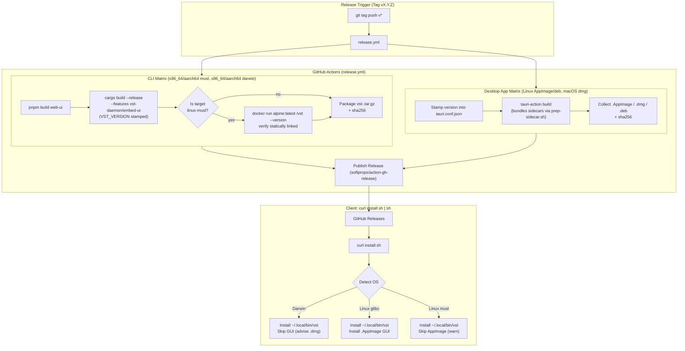

<!--
RULES — read before writing or implementing:
1. FORMAT: Bullets, tables, code, diagrams ONLY — no prose paragraphs
2. REQUIREMENTS: One crisp line each — no verbose descriptions
3. CHECKLIST: Mark items [x] as you complete them — this is your persistent todo list
4: READING TIME: Optimize for fast human scanning — if it's hard to skim, rewrite it
-->

# Plan 04: Curl installer overhaul + release CI version pipeline

> Enable macOS CLI installation via `install.sh` (leaving GUI as manual .dmg download for Gatekeeper), preserve Linux static-musl CLI + glibc AppImage installation, create the automated GitHub Release CI pipeline stamping `VST_VERSION` into the binary and desktop app, and verify the static-musl merged binary boots in an Alpine container before publishing.

**Issue:** cli-daemon-unification/04  
**Branch:** `release-ci-version` (worktree `vs-194`, no sub-branch)  
**Status:** Completed  
**PRD:** `../prd-cli-daemon-unification.md` (R6, R7, R8, R9, R29, R30)  
**Arch:** `../arch-cli-daemon-unification.md`  
**Depends on:** Part 00 (binary merge) — done, `vst_daemon::version::current()` already reads `VST_VERSION` env override at compile time.

---

## Problem & Concept

- `scripts/install.sh:124-129` explicitly rejects macOS with `err "macOS isn't supported by this script..."`. macOS users must have a working curl install for the merged `vst` CLI + daemon without downloading the full GUI.
- On macOS, curl-installing a `.dmg` or `.app` bypasses browser quarantine flags (`com.apple.quarantine`), skipping Gatekeeper checks. Therefore, macOS curl install must strictly install the CLI (`~/.local/bin/vst`), leaving `.dmg` as a manual browser download (R9).
- Linux installations must continue installing the static-musl `vst` CLI binary (working on glibc and Alpine musl alike) into `~/.local/bin`, configuring PATH, and installing the glibc desktop AppImage with launcher and `.desktop` entry (R7, R8).
- The repo has no release publishing workflow (`.github/workflows/` only has `rust-ci.yml` and `desktop-build.yml`, neither creates GitHub Releases or uploads release assets).
- There is no end-to-end version pipeline stamping the release tag into builds: `vst_daemon::version::current()` falls back to `0.1.0` unless `VST_VERSION` is set at build time (R29).
- The merged `vst` binary is significantly heavier than the old CLI (bundles `rusqlite`, `tokio full`, `portable-pty`, `ring`, `axum`). The static-musl build could fail at runtime under Alpine if any C dependency introduces dynamic or unsupported syscall assumptions. CI must prove it boots in an Alpine container before publishing (R30).

---

## Requirements

| ID | Requirement |
|----|-------------|
| R6 | Running the published `install.sh` on macOS installs the merged `vst` binary to `~/.local/bin`, on PATH, idempotently. |
| R7 | Running it on Linux (glibc or musl) installs the merged `vst` binary the same way, unchanged from today's CLI behavior. |
| R8 | Linux additionally gets the `.AppImage` GUI installed unconditionally, with a launcher and `.desktop` entry. |
| R9 | macOS does NOT download or install any GUI asset via curl; the `.dmg` stays a manual download via the Releases page in a browser (never curl-downloaded by `vst` itself) — this preserves the quarantine flag so Gatekeeper still runs. |
| R29 (CI half) | A single version string is stamped from the release git tag into the workspace build at CI time (`VST_VERSION` env var override), the Tauri bundle version, so `vst --version`, `/health`'s `version` field, and the Tauri app's version all agree for one release. |
| R30 | The published `vst-<triple>.tar.gz` for Linux is a genuine static-musl build of the now-heavier merged binary (daemon dependencies: sqlite, portable-pty, tokio) — CI verifies it actually boots under Alpine before publishing, not just that it compiles. |

---

## Change Map

```
scripts/
  install.sh        ~ support Darwin in detect_platform, map Darwin to $ARCH-apple-darwin in cli_triple, skip GUI on Darwin with informative message, update guidance
docs/
  CURL-INSTALL.md   ~ update support matrix (macOS CLI supported, GUI manual), update asset list and pipeline description
.github/workflows/
  release.yml       + new workflow: triggered on push v* tags (and workflow_dispatch); builds merged CLI archives, tests musl in Alpine, builds desktop bundles, creates GitHub Release with .sha256 checksums
```

| Today | After this plan |
|-------|-------------------|
| `install.sh` dies on macOS with error message | `install.sh` installs macOS merged `vst` CLI to `~/.local/bin`, configures PATH, advises manual `.dmg` download |
| Zero release publishing workflows exist | `.github/workflows/release.yml` publishes `vst-<triple>.tar.gz`, `.AppImage`, `.dmg`, `.deb`, and `.sha256` files |
| `VST_VERSION` is only tested locally | Release CI stamps `VST_VERSION="${GITHUB_REF_NAME#v}"` into `vst` binary and `tauri.conf.json` |
| Musl build is unverified against runtime Alpine | CI tests `vst --version` in `alpine:latest` container and verifies static linkage before publishing |

---

## Research

- `scripts/install.sh:124-129`:
  ```sh
  case "$(uname -s)" in
      Linux) OS=linux ;;
      Darwin) err "macOS isn't supported by this script; download the .dmg..." ;;
  ```
  Switching `Darwin) OS=darwin ;;` and adding Darwin handling in `cli_triple` allows downloading `vst-$ARCH-apple-darwin.tar.gz`.
- `scripts/install.sh:137-140`:
  ```sh
  cli_triple() {
      echo "$ARCH-unknown-linux-musl"
  }
  ```
  Must switch on `$OS`: `linux` -> `$ARCH-unknown-linux-musl`, `darwin` -> `$ARCH-apple-darwin`.
- `scripts/install.sh:171-216` (`setup_path`):
  Updates `~/.profile`, `~/.bash_profile`, `~/.bashrc`, `~/.zshenv`, and fish conf. This already correctly targets macOS (`~/.zshenv` for zsh, macOS default shell).
- `scripts/install.sh:220-244` (`install_cli`):
  Downloads `vst-$_triple.tar.gz`, verifies checksum against `vst-$_triple.tar.gz.sha256`, extracts into temp dir, copies executables to `$INSTALL_DIR/vst`, tests `$INSTALL_DIR/vst --version`. Works identically on Linux and macOS.
- `rust/vst-daemon/src/version.rs:13`:
  `option_env!("VST_VERSION").unwrap_or(env!("CARGO_PKG_VERSION"))`
  Setting `VST_VERSION` env var during `cargo build` in CI automatically embeds the version without changing files in git.
- `desktop/src-tauri/tauri.conf.json:3`:
  `"version": "0.0.0"`
  In release CI, `jq` stamps the version into `tauri.conf.json` prior to invoking `tauri-action` / Tauri bundling.
- `.github/workflows/desktop-build.yml:19-29`:
  Matrix covers `macos-latest` (`aarch64-apple-darwin`) and `ubuntu-22.04` (`x86_64-unknown-linux-gnu`). Intel macOS (`x86_64-apple-darwin`, would-be `macos-15-large`) deliberately dropped post-PR-review — the only GitHub-hosted Intel runner left is a paid "larger runners" tier this org doesn't have enabled, and Intel Mac coverage wasn't worth carrying that dependency for.

---

## Architecture Diagram



---

## Design Details with Key Decisions

### Key Decision 1: macOS CLI install vs GUI download separation (R6, R9)
- `install.sh` on macOS will download `vst-$ARCH-apple-darwin.tar.gz` and install `vst` to `~/.local/bin/vst`.
- `install.sh` will NEVER curl-download or mount `.dmg` or `.app` on macOS.
- **Rationale:** Files downloaded via curl in terminal do not receive the `com.apple.quarantine` extended attribute that macOS uses to trigger Gatekeeper checks. Downloading via browser preserves Gatekeeper verification.

### Key Decision 2: Static musl build and Alpine boot verification (R30)
- The Linux CLI release artifact `vst-x86_64-unknown-linux-musl.tar.gz` is built with target `x86_64-unknown-linux-musl`.
- CI runs `file` to verify static linkage.
- CI runs `docker run --rm -v ...:/vst:ro alpine:latest /vst --version` to prove runtime viability on a pure musl system before archiving.
- **Rationale:** Merging the daemon into `vst` brought in SQLite (`rusqlite`), `tokio full`, `portable-pty`, and `ring`. Verifying boot inside Alpine proves no unexpected glibc symbols or broken musl FFI calls exist.

### Key Decision 3: Version stamping pipeline (R29)
- In CI: `VERSION="${GITHUB_REF_NAME#v}"` extracts `0.2.0` from `v0.2.0`.
- Stamped via env var: `VST_VERSION=$VERSION` during compilation.
- Stamped into Tauri bundle: `jq --arg v "$VERSION" '.version = $v' desktop/src-tauri/tauri.conf.json` prior to Tauri build.
- **Rationale:** Leaves git repository pristine (`Cargo.toml` / `tauri.conf.json` not dirtied in repository branch), while ensuring every compiled artifact for that release reports the exact release version.

### Key Decision 4: Checksum generation for all release assets
- Every release asset `ASSET` has an accompanying `ASSET.sha256` generated with `sha256sum <file> | cut -d' ' -f1 > <file>.sha256` (or standard `sha256sum <file> > <file>.sha256`).
- Matches `scripts/install.sh:88-91`'s strict requirement that every asset download must be verified against its `.sha256` companion file.

---

## Risks

| # | Risk | Mitigation |
|---|------|------------|
| 1 | Musl C-dependency compilation failure | `vst-store` already uses `rusqlite = { version = "0.32", features = ["bundled"] }` which compiles sqlite from C source; `musl-tools` is installed on the Linux builder. |
| 2 | Alpine container boot failure (R30) | Verified in CI job step; failure blocks the release publish job. |
| 3 | Asset naming mismatch between CI and `install.sh` | Verified against exact string patterns: `vst-<triple>.tar.gz` and `vibe-station-<triple>.AppImage`. |
| 4 | GitHub Release API rate limiting or token permissions | Release workflow uses `contents: write` permissions and standard GITHUB_TOKEN. |

---

## Implementation Phases

### Phase 1: `scripts/install.sh` Overhaul
- [x] Add Darwin support to `detect_platform` (`OS=darwin`).
- [x] Map Darwin to `$ARCH-apple-darwin` in `cli_triple`.
- [x] Update `is_musl` check to guard for Linux OS.
- [x] In `main`, branch GUI installation: Linux glibc gets `install_gui_linux`, Darwin skips GUI with clear Gatekeeper explanation and pointer to GitHub Releases .dmg, Linux non-x86_64 warns and skips.
- [x] Update post-install output to reflect merged CLI/daemon capabilities.
- [x] Update header doc comments.
- **Verify:** Run `sh -n scripts/install.sh` syntax check. Simulate Darwin and Linux platform detection.

### Phase 2: Documentation Updates
- [x] Update `docs/CURL-INSTALL.md` matrix (macOS CLI supported, GUI manual).
- [x] Document release asset naming contracts and verification guarantees.
- **Verify:** Markdown lint / view diff.

### Phase 3: Release CI Workflow (`.github/workflows/release.yml`)
- [x] Define workflow triggered on tags `v*` and `workflow_dispatch`.
- [x] Job `build-cli`: build matrix for `x86_64-unknown-linux-musl`, `aarch64-unknown-linux-musl`, `aarch64-apple-darwin` (Intel macOS dropped, see note above). Build `web-ui`, compile with `--features vst-daemon/embed-ui` and `VST_VERSION`, run Alpine boot check on musl, create tar.gz and .sha256.
- [x] Job `build-desktop`: build matrix for Linux AppImage/deb and macOS dmg. Stamp `tauri.conf.json` with release version, build Tauri app, generate .sha256.
- [x] Job `publish-release`: collect all artifacts and checksums, publish to GitHub Release.
- **Verify:** Validate YAML syntax and action parameters.

---

## Files & Phase Impact

| File | Phase | Impact |
|------|-------|--------|
| `scripts/install.sh` | 1 | Adds macOS CLI support, handles Darwin in `cli_triple`, skips GUI on macOS with Gatekeeper notice |
| `docs/CURL-INSTALL.md` | 2 | Updates support matrix and describes release artifact contracts |
| `.github/workflows/release.yml` | 3 | New release workflow automating builds, version stamping, musl Alpine verification, and publishing |
