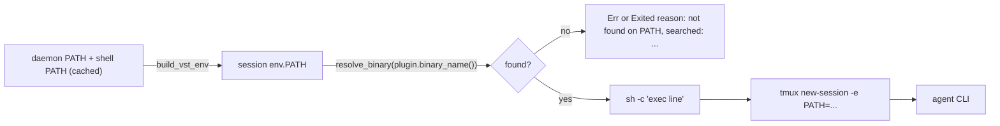

<!--
RULES — read before writing or implementing:
1. FORMAT: Bullets, tables, code, diagrams ONLY — no prose paragraphs
2. REQUIREMENTS: One crisp line each — no verbose descriptions
3. CHECKLIST: Mark items [x] as you complete them — this is your persistent todo list
4. READING TIME: Optimize for fast human scanning — if it's hard to skim, rewrite it
-->

# Plan: CLI launch hardening (pi/codex PATH + resume guard)

> Make a freshly onboarded CLI terminal launch and resume correctly without per-CLI debugging: no login-shell PATH reset, a clear error when the binary is missing, and no "resume" of a conversation that never started.

**Issue:** cli-launch-hardening
**Branch:** `ending-believe-lifecycle`
**Status:** Pending
**PRD:** none (no new user-facing behavior beyond clearer error text)
**Notes doc:** `docs/CLI-LAUNCH-PITFALLS.md` (investigation; folded into `docs/PLUGINS.md` in Phase 3)

**Reference files:**
- Spawn path: `rust/vst-routes/src/sessions.rs:4632` (`sh -lc`), `:2759` (`resume_spawn`)
- Env/PATH build: `rust/vst-agents/src/context.rs:129` (`build_vst_env`)
- Binary detection: `rust/vst-agents/src/registry.rs:20` (`check_binary`)
- pi plugin: `rust/vst-agents/src/pi.rs:187-221` (`capture_chat_id`, `get_restore_command`)
- Prior art for the resume guard: `rust/vst-agents/src/codex.rs:146` (`resumable_chat_id`)

---

## Problem & Concept

- pi (and codex) terminal sessions die with `pi: not found` (exit 127) on first launch: `sh -lc` makes dash source `/etc/profile`, which overwrites the daemon-built `PATH`, dropping `~/.nvm/.../bin`.
- Resume then "continues" an empty conversation: `pi.rs` always returns a restore argv, so the original prompt is never re-sent, and `capture_chat_id` persists an id for a conversation that never started.
- Success: a new CLI installed anywhere the user's shell can see launches, fails with a readable error if absent, and resumes only real conversations.

## Out of Scope

- Capturing exit code / last pane output on instant exit (diagnostics follow-up; listed in `docs/CLI-LAUNCH-PITFALLS.md` § Bug 1 D).
- Rich Chat (json/ACP) launch paths — they do not go through `sh -lc`.
- Per-CLI binary path overrides in Settings UI.
- Central "no user turn yet" enforcement inside `resume_spawn` (plugins own it; contract documented + tested instead).

## Requirements

| # | Requirement |
|---|-------------|
| 1 | Agent shell launches never use a login shell; the daemon-built `PATH` reaches the CLI unchanged |
| 2 | The effective `PATH` includes dirs from the user's interactive shell (nvm, brew, cargo), captured once, cached, 5s timeout, failure non-fatal |
| 3 | Launch/resume fails before spawning with `` `<bin>` not found on PATH (searched: ...) `` when the plugin binary is unresolvable: create → session `exited` with that `reason` (async spawn job); resume/toggle → immediate `Err` |
| 4 | pi `get_restore_command` / `capture_chat_id` return `None` until the pi session file holds a user message, and a stale stored `agent_chat_id` with no started conversation still replays the initial prompt |
| 5 | `get_restore_command` contract documented on the trait: MUST be `None` for a session with no stored id and no conversation of its own; SHOULD verify ≥1 user turn (known deviations listed) |
| 6 | A test over every registered plugin asserts `get_restore_command == None` for a fresh session (fast, hermetic) |
| 7 | Single commit for the whole feature |

---

## Change Map

```
rust/vst-agents/src/
  context.rs     ~ merged PATH, shell capture
  registry.rs    ~ resolve_binary, preflight
  pi.rs          ~ conversation-aware restore
  plugin.rs      ~ restore contract doc
rust/vst-agents/tests/
  restore_contract.rs  + fresh-session contract
rust/vst-routes/src/
  sessions.rs    ~ sh -c exec, preflight, replay
rust/vst-daemon/src/
  run.rs         ~ warm PATH cache
docs/
  PLUGINS.md     ~ onboarding checklist
  CLI-LAUNCH-PITFALLS.md ~ status + design
```

`+` new file · `~` modified · unmarked = context only.

| Today | After this plan |
|-------|-----------------|
| Shell-launched agents run under `sh -lc`, PATH reset by `/etc/profile` | `sh -c "exec <line>"`, PATH exactly as the daemon built it |
| `PATH` = `~/.vibe-station/bin` + whatever the daemon inherited | Same plus dirs from the user's interactive-shell PATH |
| Missing binary → tmux pane dies, session `exited` with no reason | Create: session `exited` with reason "not found, searched: ..."; resume/toggle: immediate readable `Err` |
| pi Resume restores an empty conversation, prompt lost | pi Resume re-launches fresh with the initial prompt until a user turn exists |
| Restore contract implicit per plugin | Documented on the trait, enforced by a cross-plugin test |

---

## Research

- `rust/vst-routes/src/sessions.rs:4632-4637` — `use_shell` plugins run as `["sh","-lc",line]`; the only `-lc` site in the repo.
- `/etc/profile:5-9` (Debian) — unconditionally assigns `PATH=/usr/local/bin:/usr/bin:/bin:...`; verified `sh -lc 'command -v pi'` exits 127 while `~/.nvm/versions/node/v24.21.0/bin/pi` exists.
- `rust/vst-agents/src/context.rs:139-142` — `PATH` = `~/.vibe-station/bin:` + inherited daemon `PATH`; nothing consults the user's shell.
- `rust/vst-agents/src/{claude,cursor,agy,codex,pi}.rs` — every `shell_line` starts with the binary name (e.g. `claude.rs:297`, `pi.rs:110`), so an `exec ` prefix is safe.
- `rust/vst-agents/src/registry.rs:20` — `check_binary` shells out to `which` against the daemon PATH only; stored as `fn(&str) -> bool` at `rust/vst-routes/src/modes.rs:315` (signature must not change).
- `rust/vst-routes/src/sessions.rs:1204-1219` — `run_agent_spawn_job` maps any `spawn_session` error to `Exited` + `reason`, after the create HTTP call has returned.
- `rust/vst-routes/src/sessions.rs:2794-2808` + `:2797` — restore-branch self-heal already persisted `agent_chat_id = session.id` for affected sessions, and the replay gate requires `agent_chat_id.is_none()`.
- `rust/vst-routes/src/sessions.rs:3838` (`spawn_tty_for_agent`) — json→tty toggle also spawns from a restore argv.
- `rust/vst-daemon/src/run.rs:354` — `run_daemon` is the production entry; `main.rs` is a compat shim.
- `rust/vst-routes/src/sessions.rs:2759-2819` — restore branch taken whenever `get_restore_command` is `Some`; the prompt-replay branch needs `None`.
- `rust/vst-agents/src/codex.rs:146` — codex only restores ids with an on-disk rollout; pi lacks the equivalent.
- `~/.pi/agent/sessions/<cwd-encoded>/<ts>_<id>.jsonl` — line 1 `{"type":"session",...}` is written at startup; user turns are `{"type":"message","message":{"role":"user",...}}` (verified on the vs-230 session file).
- **Root cause:** launch resets PATH (login shell) and resume trusts a plugin that returns `Some` for an unstarted conversation.

---

## Architecture Diagram



---

## Design Details

### System Boundaries

| Boundary | Fields + types | Errors | Source of truth |
|----------|----------------|--------|-----------------|
| `context::effective_path()` → callers | `-> String` (colon-joined, deduped) | none (falls back to daemon PATH) | daemon env + cached shell capture |
| `registry::resolve_binary` | `(binary: &str, path: &str) -> Option<PathBuf>` | `None` = not found | filesystem |
| `registry::ensure_binary_on_path` | `(plugin: &dyn AgentPlugin, env: &HashMap<String,String>) -> Result<(), String>` | `Err("`pi` not found on PATH (searched: a:b:c)")` | `env["PATH"]` |
| `AgentPlugin::get_restore_command` | `-> Option<Vec<String>>` | `None` = launch fresh | plugin's native store |
| `AgentPlugin::chat_established` (new, default `true`) | `(RestoreArgs) -> AsyncResult<bool>` | none | plugin's native store; pi: started iff file has a user turn |

### Critical User Journeys (CUJs)

#### CUJ 1 — Create a pi agent (nvm-installed)

```
User creates pi agent with prompt
  → daemon builds env.PATH (incl. ~/.nvm/.../bin from shell capture)
  → preflight resolves `pi` → ok
  → tmux runs sh -c "exec pi ... "$(cat task_prompt.txt)""
  → pi starts and works on the prompt
```

- **Error path:** `pi` not installed → session goes `exited` with reason "`pi` not found on PATH (searched: ...)" instead of dying silently; resume/toggle return the same text as an `Err`.

#### CUJ 2 — Resume a pi agent that never started a conversation

```
User hits Resume on a session whose pi file has no user turn
  → get_restore_command → None
  → chat_established → false (even if agent_chat_id = session id was stored earlier)
  → fresh-launch branch re-sends initial_prompt
  → capture_chat_id stays None until a user turn exists
```

- **Edge case:** user typed a message by hand before → file has a user turn → normal `--session-id` restore.

### Key Decisions

#### Decision 1: Drop the login shell, `exec` the line

- **Decision:** `["sh","-c", format!("exec {line}")]`.
- **Rationale:** the daemon already builds the env; `-l` only clobbers it, and `exec` makes the pane process the agent itself.
- **Where:** `rust/vst-routes/src/sessions.rs:4632` — extract `fn shell_command_parts(line: &str) -> Vec<String>` (testable) and call it; see Research (every shell_line starts with the binary).

```rust
// -c, not -lc: a login shell re-runs /etc/profile and overwrites the PATH we built.
// exec: the pane process IS the agent (clean exit status, no lingering wrapper sh).
fn shell_command_parts(line: &str) -> Vec<String> {
    vec!["sh".into(), "-c".into(), format!("exec {line}")]
}
```

#### Decision 2: Capture the interactive-shell PATH once, merge by append

| Option | Pros | Cons |
|--------|------|------|
| Inherited PATH only (today) | zero cost | breaks when daemon started outside a configured shell |
| Run `$SHELL -ilc` per launch | always fresh | 100s of ms + rc-file side effects per spawn |
| Run once, cache in `OnceLock`, append unseen dirs | cheap, picks up nvm/brew/cargo | stale until daemon restart |

- **Decision:** third option; daemon PATH order wins, unseen shell dirs appended; `build_vst_env` still prepends `~/.vibe-station/bin`, so `effective_path()` excludes it. Empty and relative entries (`""`, `.`) are dropped on merge.
- **Rationale:** VS Code-style env capture; one-time cost off the hot path (warmed at startup).
- **Where:** `rust/vst-agents/src/context.rs` — `effective_path()`, `merge_paths()`, `parse_marked_path()`.

```rust
// Markers guard against rc-file noise on stdout. Own process group so a hung rc file (or a
// backgrounded grandchild holding stdout) can be killed whole; vst-agents is
// #![forbid(unsafe_code)] so kill via `kill -- -<pgid>` through Command, not libc.
// Read stdout on a thread, recv_timeout(5s); on timeout kill the group and fall back.
// Skip entirely when $SHELL is unset, or when home::is_overridden() (tests).
Command::new(shell).args(["-ilc", r#"printf '__VST_PATH__%s__VST_PATH__' "$PATH""#])
    .stdin(Stdio::null()).stderr(Stdio::null()).process_group(0)
```
- Use `std::sync::OnceLock` (stable 1.70), not `LazyLock` (1.80 > MSRV 1.77).

#### Decision 3: Preflight by plugin `binary_name()`, not by parsing the line

- **Decision:** `ensure_binary_on_path` runs in `spawn_session`, the restore branch of `resume_spawn`, and `spawn_tty_for_agent`, before spawning.
- **Rationale:** `binary_name()` already exists for detection (`plugin.rs:296`); new plugins get the check free.
- **Where:** `rust/vst-agents/src/registry.rs`, call sites `rust/vst-routes/src/sessions.rs:4631` (spawn_session), `:2783` (resume restore), `:3838` (toggle). `resolve_binary` requires the exec bit (`mode & 0o111`) and passes absolute paths through.

#### Decision 4: pi owns the "conversation started" check

- **Decision:** restore/capture/`chat_established` only when `<root>/*/*_<id>.jsonl` has a `message` line with `role == "user"`; `root` = `crate::home::home_dir()/.pi/agent/sessions`, honoring `PI_CODING_AGENT_DIR` only when the home override is not active (pattern: `codex_import.rs:381`).
- **Rationale:** the file exists from startup (header line), so existence alone is not proof — see Research; mirrors codex's `resumable_chat_id`.
- **Where:** `rust/vst-agents/src/pi.rs:193,198` — new `pi_sessions_root()`, `pi_conversation_started(root, id)`, `chat_established` override.

> **Resolved by orchestrator:** pi's source (`config.js` `getAgentDir`/`getSessionsDir`) treats `PI_CODING_AGENT_DIR` as the agent dir itself, so the root is `$PI_CODING_AGENT_DIR/sessions` (fixed in `pi.rs`).

#### Decision 5: Replay gate asks the plugin when a stored id exists

- **Decision:** new `AgentPlugin::chat_established(RestoreArgs) -> AsyncResult<bool>`, default `true` (current behavior); `resume_spawn` replays when `initial_prompt.is_some() && (agent_chat_id.is_none() || !chat_established)`.
- **Rationale:** sessions hit by the old bug already persisted `agent_chat_id = session.id` — see Research (`:2797`); only the plugin can say whether that id has a conversation. No `cli ==` branching.
- **Where:** `rust/vst-agents/src/plugin.rs` (method), `rust/vst-agents/src/pi.rs` (override), `rust/vst-routes/src/sessions.rs:2797` (gate).

---

## Risks / Open Questions

| # | Question | Notes |
|---|----------|-------|
| 1 | `$SHELL -ilc` hangs or prints noise (fish, zsh plugins) | markers + 5s timeout + stdin null; failure falls back to daemon PATH |
| 2 | Does `exec` break any plugin line | Research: all lines start with the binary; test 1.T3 asserts it |
| 3 | pi store root differs (`PI_CODING_AGENT_DIR`) | see Decision 4; tests inject the root |
| 4 | tmux server keeps its own global env | `-e PATH=` per session already passed (`rust/vst-proc/src/tmux.rs:148`); unchanged |
| 5 | Existing tests would run the real `$SHELL -ilc` | capture skipped when `home::is_overridden()`; `build_vst_env` callers in `tests/context.rs:168` unaffected |
| 6 | Other plugins break the strict restore contract | claude/cursor/opencode/agy return `Some` for any stored id; claude/cursor/agy also fall back to latest chat in cwd (`native_chat_id.rs:29/68/107`) — documented as known deviations, out of scope |

---

## Implementation Phases

- Each phase ends with a verification block — not complete until those pass.
- **One commit for the whole feature** (user requirement) — no per-phase source commits; plan/state files commit with it.

### Phase 1 — Launch path (PATH + shell + preflight)

- [x] **1.1** Add `merge_paths`, `parse_marked_path`, cached `effective_path()` (`OnceLock`) in `rust/vst-agents/src/context.rs`; use it in `build_vst_env` (`:139-142`, still prepending `~/.vibe-station/bin`). Capture per Decision 2 (process group, 5s thread timeout, skip if `SHELL` unset or `home::is_overridden()`).
- [x] **1.2** Add `resolve_binary` (exec-bit check, absolute passthrough) + `ensure_binary_on_path` in `rust/vst-agents/src/registry.rs`; keep `check_binary(&str) -> bool` signature, body uses `resolve_binary(name, &effective_path())`.
- [x] **1.3** Extract `shell_command_parts(line)` (`sh -c "exec <line>"`) and use it at `rust/vst-routes/src/sessions.rs:4632-4637`.
- [x] **1.4** Call `ensure_binary_on_path` in `spawn_session` (after env build, `:4631`), `resume_spawn` restore branch (before `spawn_session_from_argv`, `:2783`), and `spawn_tty_for_agent` (`:3838`).
- [x] **1.5** Warm `effective_path()` on daemon startup in `rust/vst-daemon/src/run.rs` (`run_daemon`, ~`:354`; `spawn_blocking`, non-fatal).

**Verify phase 1:**
- [x] **1.T1** Unit — `merge_paths`: base `/a:/b` + extra `/b:/c` → `/a:/b:/c`; empty extra → base.
- [x] **1.T2** Unit — `parse_marked_path`: noise + `__VST_PATH__/x:/y__VST_PATH__` → `/x:/y`; no markers → `None`.
- [x] **1.T3** Unit — `resolve_binary` finds a temp executable only when its dir is in the given path; `ensure_binary_on_path` error text contains the binary name and `searched:`.
- [x] **1.T4** Unit — `shell_command_parts("pi --x")` == `["sh","-c","exec pi --x"]`; no element equals `-lc`.
- [x] **1.T5** Regression — `cd rust && cargo test -p vst-agents -p vst-routes` passes (existing `check_binary` tests included).

---

### Phase 2 — Resume correctness (pi guard + contract + conformance test)

- [x] **2.1** In `rust/vst-agents/src/pi.rs` add `pi_sessions_root()` (Decision 4) and `pi_conversation_started(root, id) -> bool` (scan `*/*_<id>.jsonl`, parse lines as JSON, true on `type=="message"` && `message.role=="user"`).
- [x] **2.2** `get_restore_command` returns `None` unless `pi_conversation_started`; `capture_chat_id` returns `Some(id)` only under the same check; override `chat_established` (`pi.rs:193,198`).
- [x] **2.2b** Add `AgentPlugin::chat_established` (default `true`) in `rust/vst-agents/src/plugin.rs`; use it in the replay gate at `rust/vst-routes/src/sessions.rs:2797` (Decision 5).
- [x] **2.3** Document the contract on `AgentPlugin::get_restore_command` (`rust/vst-agents/src/plugin.rs:318`): MUST be `None` when the session has no stored id and no conversation of its own; SHOULD verify ≥1 user turn; list known deviations (Risk 6).
- [x] **2.4** Add `rust/vst-agents/tests/restore_contract.rs`: under `vst_agents::home::with_home(tmp)` (`home.rs:53`) with `make_session`/`make_project` from `tests/common/mod.rs`, every `SUPPORTED_CLIS` plugin returns `get_restore_command == None` for a fresh session. Do NOT call `capture_chat_id` here (opencode/agy poll 30s); pi's capture is covered by 2.T2.

**Verify phase 2:**
- [x] **2.T1** Unit — `pi_conversation_started`: header-only file → false; header + user message → true; file for a different id → false; missing root → false.
- [x] **2.T2** Unit — pi: with header-only file `get_restore_command` and `capture_chat_id` are `None` and `chat_established` is false even when `agent_chat_id == Some(session.id)`; once a user line exists restore is `Some(argv)` containing `--session-id <id>`.
- [x] **2.T3** Integration — `restore_contract`: all six plugins return `None` for a fresh session; `cargo test -p vst-agents --test restore_contract` runs in < 5s.
- [x] **2.T4** Regression — `cd rust && cargo test -p vst-agents -p vst-routes` passes (codex/claude restore tests untouched; no routes seam exists for the replay gate — `resume_spawn` is a private method on a handler requiring a live tmux manager, so the gate is verified by the pi unit test 2.T2 which exercises the same `chat_established` logic; manual check documented).

---

### Phase 3 — Docs + whole-repo verification

- [x] **3.1** Add an "Onboarding checklist" section to `docs/PLUGINS.md` (install location/PATH, ready signal, when the first conversation is persisted, restore-on-empty behavior, verify on a clean host).
- [x] **3.2** Update `docs/CLI-LAUNCH-PITFALLS.md` status to "fixed in cli-launch-hardening" with the final design (PATH capture + preflight + restore contract).
- [x] **3.3** `cd rust && cargo fmt --check && cargo clippy --workspace --all-targets -- -D warnings`.

**Verify phase 3:**
- [x] **3.T1** Integration — `cd rust && cargo test --workspace` passes.
- [x] **3.T2** Manual — `env -i HOME=$HOME PATH="$PATH" sh -c 'command -v pi'` prints the nvm path; the same with `sh -lc` exits 127 (documents the original bug); record both in the verify notes.

> **Phase 3 verify notes (3.T2):**
> ```
> $ env -i HOME=$HOME PATH="$PATH" sh -c 'command -v pi'
> /home/gb/.nvm/versions/node/v24.21.0/bin/pi     (exit 0)
> $ env -i HOME=$HOME PATH="$PATH" sh -lc 'command -v pi'
> (no output)                                      (exit 127)
> ```
> Confirms the original bug: `sh -c` reaches the nvm-installed `pi`; `sh -lc`
> (login shell) resets PATH via `/etc/profile` and drops the nvm bin dir → 127.
> This is exactly why Phase 1 dropped `-lc` for `sh -c "exec <line>"`.
>
> **3.T1:** `cargo test --workspace` → exit 0, 126 test-result blocks, all pass.
>
> **3.3 (pre-existing clippy failure, reported not fixed):** `cargo clippy --workspace --all-targets -- -D warnings` fails ONLY on
> `vst-daemon/build.rs:21` (`clippy::manual_assert`, `if !dist.is_dir() { panic!(...) }`). `build.rs` is byte-identical to
> `origin/main` (not part of this feature's change set), so this is a pre-existing failure on the base branch, unrelated to
> cli-launch-hardening — left unfixed per phase instructions. `cargo fmt --check` passes. All feature-relevant crates'
> clippy is clean; the build-script failure is the sole blocker.

---

## Files & Phase Impact

| File | Status | Phase | Description / Contract Change |
|------|--------|-------|-------------------------------|
| `rust/vst-agents/src/context.rs` | **Modified** | 1.1 | Contract: `effective_path() -> String`, `merge_paths(&str,&str) -> String`, `parse_marked_path(&str) -> Option<String>` · Owns: `OnceLock<String>` cache |
| `rust/vst-agents/src/registry.rs` | **Modified** | 1.2 | Contract: `resolve_binary(&str,&str) -> Option<PathBuf>`, `ensure_binary_on_path(&dyn AgentPlugin,&HashMap<String,String>) -> Result<(),String>` |
| `rust/vst-routes/src/sessions.rs` | **Modified** | 1.3, 1.4, 2.2b | Contract: `shell_command_parts(&str) -> Vec<String>`; preflight in `spawn_session`, `resume_spawn`, `spawn_tty_for_agent`; replay gate uses `chat_established` |
| `rust/vst-daemon/src/run.rs` | **Modified** | 1.5 | Warm PATH cache in `run_daemon` |
| `rust/vst-agents/src/pi.rs` | **Modified** | 2.1, 2.2 | Contract: `pi_sessions_root() -> PathBuf`, `pi_conversation_started(&Path,&str) -> bool`; restore/capture/`chat_established` gated on it |
| `rust/vst-agents/src/plugin.rs` | **Modified** | 2.2b, 2.3 | Contract: `chat_established(RestoreArgs) -> AsyncResult<bool>` (default `true`); restore-contract doc |
| `rust/vst-agents/tests/restore_contract.rs` | **New** | 2.4 | Cross-plugin fresh-session contract test |
| `docs/PLUGINS.md` | **Modified** | 3.1 | Onboarding checklist |
| `docs/CLI-LAUNCH-PITFALLS.md` | **Modified** | 3.2 | Status + final design |
| `rust/vst-agents/src/*.rs` unit tests (context/registry/pi) | **Modified** | 1.T1-1.T3, 2.T1-2.T2 | In-file `#[cfg(test)]` cases |
