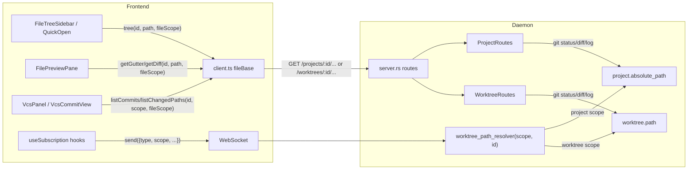

<!--
RULES — read before writing or implementing:
1. FORMAT: Bullets, tables, code, diagrams ONLY — no prose paragraphs
2. REQUIREMENTS: One crisp line each — no verbose descriptions
3. CHECKLIST: Mark items [x] as you complete them — this is your persistent todo list
4. READING TIME: Optimize for fast human scanning — if it's hard to skim, rewrite it
-->

# Plan: Direct-session file & git parity

> Give direct-session (project-scope) agents the same live file-watch, git-status/gutter/diff, and VCS-commits functionality worktree sessions already have — routing/wiring gap only, no new mechanism.

**Issue:** direct-session-file-git-parity
**Branch:** `feat/direct-session-file-git-parity`
**Status:** WIP
**PRD:** none — bug-bundle plan derived directly from an investigation report (see Research)

**Reference files:**
- WS protocol: `rust/vst-types/src/ws.rs`
- WS handlers: `rust/vst-ws/src/handlers/file_watch.rs`, `rust/vst-ws/src/handlers/tree_watch.rs`
- Route wiring: `rust/vst-daemon/src/server.rs`
- Worktree git routes (model to copy): `rust/vst-routes/src/worktrees.rs`
- New project git routes: `rust/vst-routes/src/projects.rs`
- Frontend API client: `web-ui/src/api/client.ts`
- Frontend WS hooks: `web-ui/src/hooks/useSubscription.ts`

---

## Problem & Concept

- Direct sessions (project-scope, no worktree) get none of: live file-refresh, live tree-refresh, git status markers, gutter diff markers, or a working VCS/commits tab — worktree sessions have all five.
- Root cause (all five bugs) is a routing/wiring gap: file watching, tree watching, git status/diff, and commit listing were only ever wired along `worktree_id → worktree record → worktree path`; the parallel `project_id → project.absolute_path` path already exists for read-only tree/file/list endpoints but was never extended to these four.
- Success state: opening a direct session shows live file/tree updates, git status gutters/markers, and a working (unfiltered, paginated) commits tab — functionally identical to a worktree session, minus branch-relative concepts that don't apply (no base branch to diff against).
- Full investigation, root-cause citations, and the fable-reviewed VCS-pagination decision: `.vibekit/reports/2026-09-22-direct-session-file-staleness-and-git-indicators.md`.

## Out of Scope

- `branch`-scope diffing/changed-paths/diff for any `/projects/:id/...` route — no `base_branch`/`base_sha` concept without a worktree. Backend returns `400` for `scope=branch`; no synthetic base-ref derivation is planned, ever.
- `diffstat` for projects — only consumed by the worktree sidebar's `+N −N` indicator, which never applies to a project row.
- Hiding/adjusting `FileTreeHeader.tsx`'s branch/diff-view toggle buttons beyond the minimal change needed to stop them crashing under project scope — they already render `null` for `isProject`, no new UI work needed there.
- `FilePreviewPane.tsx:171`'s existing project-scope skip of the **local** `getDiff` call in plain-preview mode (`scope === "none"`) — not required to fix any of the 5 named bugs; the new `/projects/:id/diff/*path?scope=local` route is added on the backend (matching action item 2 verbatim) but this call site is left untouched. Flag as a candidate follow-up, don't wire it in this plan.
- `web-ui/src/api/mock.ts` — the mock API implementation used by isolated component tests. Not touched by any phase; existing mock methods already accept `scope: FileScope` params (as no-ops) so nothing there needs to change for tests to keep passing.

## Requirements

| # | Requirement |
|---|-------------|
| 1 | `file:watch`/`tree:watch` (and their `unwatch` counterparts) work for a project-scope (direct-session) id, resolving against `project.absolute_path` |
| 2 | `GET /projects/:id/changed-paths`, `/gutter/*path`, `/diff/*path` exist, support `scope=local` (default) and `scope=commit`, 400 on `scope=branch`, and return empty results (not 500) for a non-git project |
| 3 | `GET /projects/:id/commits` exists, returns the plain unfiltered `git log`, every commit `isOnBranch: true` |
| 4 | Frontend git-status/gutter/diff/commits calls branch on `FileScope` (`"worktree"` \| `"project"`) via the existing `fileBase()` helper, matching `tree`/`getFile`/`getGutter`'s existing pattern |
| 5 | `VcsPanel`'s "Diff from `<baseBranch>`" toggle is hidden under project scope — meaningless when nothing is off-branch |
| 6 | No regression to worktree-scope behavior in any touched file — every existing worktree-scope test still passes |

---

## Change Map

```
rust/vst-types/src/
  ws.rs                     ~ scope field on 4 watch message variants
rust/vst-ws/src/handlers/
  file_watch.rs              ~ resolver signature takes scope
  tree_watch.rs               ~ resolver signature takes scope
rust/vst-daemon/src/
  server.rs                  ~ combined project+worktree path resolver; new /projects/:id/* routes
rust/vst-routes/src/
  projects.rs                 ~ changed_paths/gutter/diff/commits methods
web-ui/src/hooks/
  useSubscription.ts          ~ drop project-scope early-returns, send scope only when "project"
web-ui/src/api/
  client.ts                   ~ scope-aware send(), listChangedPaths, listCommits, getDiff
web-ui/src/components/layout/
  FileTreeSidebar.tsx          ~ drop isProject guards
  FileTreeHeader.tsx           ~ drop isProject guard on diff-scope force
  FilePreviewPane.tsx          ~ thread fileScope into its own getDiff calls
web-ui/src/components/dialogs/
  QuickOpen.tsx                ~ drop scope !== "worktree" guard
web-ui/src/components/layout/
  ToolPanel.tsx                 ~ pass scope prop into VcsPanel
web-ui/src/components/tools/
  VcsPanel.tsx                  ~ accept scope prop, hide branch toggle, thread to VcsCommitView
  VcsCommitView.tsx             ~ accept scope prop, thread to client calls + FilePreviewPane
```

| Today | After this plan |
|-------|-----------------|
| Direct-session `FilePreviewPane` never live-refreshes on disk edits | Live-refreshes via `file:watch`, same as worktree sessions |
| Direct-session file tree never live-refreshes on new/deleted files | Live-refreshes via `tree:watch` |
| Direct-session file tree shows no git status markers | Shows modified/added/deleted markers, same as worktree |
| Direct-session inline diff gutter (`getGutter`) 404s silently | Returns real gutter marks |
| Direct-session VCS/commits tab hard-errors (404 "Worktree not found") | Shows unfiltered, paginated commit history |

---

## Research

- `rust/vst-daemon/src/server.rs:437-447` — `worktree_path_resolver` only walks `project.worktrees` for a matching id; never falls back to `project.absolute_path`. Root cause of bugs #1/#3 (file/tree watch).
- `rust/vst-ws/src/handlers/file_watch.rs:14` / `tree_watch.rs` — `WorktreePathResolver = Arc<dyn Fn(&str) -> Option<PathBuf> + Send + Sync>`, takes only an id, no scope — the resolver signature itself has no way to distinguish "this id is a project" from "this id is a worktree".
- `web-ui/src/hooks/useSubscription.ts:106,215` — `useFileWatch`/`useTreeWatch` both `return undefined` when `scope === "project"`, pre-emptively never sending `file:watch`/`tree:watch` for a direct session.
- `web-ui/src/api/client.ts:101-104` — `fileBase(scope, id)` already branches `"projects"` vs `"worktrees"` segment; `tree`/`getFile`/`getFileBlob`/`getGutter` already route through it. `listChangedPaths` (`client.ts:919-931`), `listCommits` (`client.ts:945-953`), and `getDiff` (`client.ts:823-847`) are ALL hardcoded to `/worktrees/:id/...` and never branch — `getDiff` has no `fileScope` param at all, unlike `getGutter`, which already takes one.
- `web-ui/src/components/layout/FilePreviewPane.tsx:171,177,187,194` — every internal `api.getDiff(...)` call site inside the pane's own fetch effect omits the `fileScope` param entirely (falls back to `getDiff`'s eventual `"worktree"` default) except `:171` (`"none"` scope), which already special-cases `fileScope === "project"` to skip the call. `:194` is the exact call `VcsCommitView` → `FilePreviewPane(scope="commit")` drives under project scope (Decision 5) — it will 404 against `/worktrees/:id/diff/...` for a project id unless `getDiff` gains a `fileScope` param AND this call site passes it.
- `rust/vst-daemon/src/server.rs:525-569` — route table has `/projects/:id/tree|file-list|files/*path` but no `changed-paths|gutter|diff|commits` under `/projects/:id`.
- `rust/vst-routes/src/worktrees.rs:1620-1761` (`changed_paths`), `:1997-2050+` (`gutter`), `:1511-1617` (`diff`), `:1809-1839+` (`commits`) — all the underlying git subprocess logic takes only a filesystem path (`wt_path`), not worktree-specific metadata (except `branch`/`commit` scope's base-branch resolution, which is explicitly out of scope for projects). Every helper function they use (`parse_porcelain_z`, `merge_numstat`, `run_numstat_cmd`, `untracked_numstat_cmd`, `is_valid_commit_sha`, `compute_etag`, `parse_branch_name_status`) is already `pub` in `worktrees.rs`, and `projects.rs:56` already imports cross-module helpers from `crate::worktrees` (`compute_etag, serialize_worktree, FileResponse`) — same reuse pattern applies here.
- `rust/vst-git/src/git.rs:443-455` (`list_commits`) — plain `git log -n{limit} --numstat` from HEAD; `base_sha: Option<&str>` only annotates `is_on_branch` per commit (`git.rs:530-537`) — already accepts `None`, in which case every commit is `is_on_branch: true`. No new git primitive needed for the commits route.
- `web-ui/src/components/layout/FileTreeHeader.tsx:93,99` — the "Diff view" toggle button and the local/branch chip selector are ALREADY entirely hidden (`{!isProject ? ... : null}`) for project scope — the UI never lets a user select `scope=branch` for a project via this header, so removing the `isProject`-forces-`"none"` guard at `FileTreeHeader.tsx:31` (mirroring `FileTreeSidebar.tsx:115-116`) is safe: `scopeRaw` (the store's `diffScopeByWorktree` slice) stays `undefined` for a project id — `VcsCommitView` deliberately does NOT write to this store slice (`VcsCommitView.tsx:24-29`'s own docstring: "nothing here touches `useWorkspaceStore`'s `activeFilePath`/`diffScopeByWorktree`" — Decision 5's `FilePreviewPane` `controlled` prop bypasses the store entirely), so there is no path — via `VcsCommitView` or otherwise — by which `scopeRaw` becomes `"commit"` for a project id either.
- `web-ui/src/components/tools/VcsPanel.tsx:237,453-462` — renders `<VcsCommitView api worktreeId sha onBack>` with no `scope` prop at all; `VcsCommitView.tsx:83-87` renders `<FilePreviewPane ... controlled={...}>` with no `scope` prop either, so it silently defaults to `"worktree"` (`FilePreviewPane.tsx:41`) even when the enclosing context is a project.
- `rust/vst-routes/tests/projects.rs:45-63` — existing `test_env()`/`init_git_repo()` integration-test scaffolding for `ProjectRoutes`, to extend rather than duplicate.
- **Root cause:** file watching, tree watching, git status/gutter/diff, and commit listing were all wired end-to-end only along the `worktree_id → worktree record → worktree path` path; the parallel `project_id → project.absolute_path` path already exists for read-only tree/file/list endpoints but was never extended to watching, git status, or commits. Routing/wiring gap, not an architectural one.

---

## Architecture Diagram



---

## Design Details

### System Boundaries

| Boundary | Fields + types | Errors | Source of truth |
|----------|----------------|--------|-----------------|
| Frontend ↔ Daemon (WS) | `ClientMessage::FileWatch/FileUnwatch/TreeWatch/TreeUnwatch { scope: WatchScope, worktree_id: String, path }` — see Decision 1 | `system:error { message }` when the resolved root doesn't exist | Daemon (resolves id → path per `scope`) |
| Frontend ↔ Daemon (REST) | `GET /projects/:id/changed-paths?scope=local\|commit&sha=<sha>` → `Vec<ChangedPath>`; `GET /projects/:id/gutter/*path` → `GutterResult`; `GET /projects/:id/diff/*path?scope=local\|commit&sha=<sha>` → text/plain diff; `GET /projects/:id/commits?limit=<n>` → `{ commits: CommitLogEntry[] }` | `400` `scope=branch` (Validation), `404` project not found, `422` unresolvable commit sha / binary diff / diff too large / `!project.is_git` on `diff`, `500` git subprocess failure | Daemon (git subprocess against `project.absolute_path`) |

- **Non-git project (`ProjectRecord.is_git == false`, `rust/vst-types/src/domain.rs:659`):** all 4 routes MUST short-circuit before touching git — `changed_paths` → `Ok(vec![])`, `gutter` → `Ok(GutterResult { added: vec![], deleted: vec![], modified: vec![] })`, `commits` → `Ok(CommitsResult { commits: vec![] })`, `diff` → `Err(ProjectRouteError::unprocessable("project is not a git repository", None))` (422, not 500). Without this, removing the frontend's `isProject` guard sends a real direct-session (non-repo base dir — `projects.rs:197` already has this exact check) into the same "git status failed" 500 path worktree routes hit today (`worktrees.rs:1730-1734`), regressing a currently-clean Files tab.

### Critical User Journeys (CUJs)

#### CUJ 1 — Direct-session agent edits a file, user has it open

```
User opens a file in a direct-session's Files tab
  → FilePreviewPane calls useFileWatch(api, projectId, path, "project")
  → Hook now sends {type:"file:watch", scope:"project", worktreeId: projectId, path}
  → Daemon resolver resolves projectId → project.absolute_path, watches path
  → Agent's CLI edits the file on disk
  → notify-crate fires on_changed → daemon sends file:changed{worktreeId: projectId, path}
  → Hook's listener matches ev.worktreeId === projectId, bumps lastChanged
  → FilePreviewPane refetches api.getFile(projectId, path, "project") → user sees the edit live
```

- **Error path:** resolver can't find the project (deleted mid-session) → `system:error` — client already has generic system:error handling, no new UI needed.
- **Edge case:** project id happens to collide with a worktree id — impossible in practice, ids are from disjoint ID spaces (Decision 1 assumes no cross-scope collision, same as the existing `fileBase()` REST convention already does).

#### CUJ 2 — User opens the VCS tab on a direct session

```
User selects a direct session, opens the VCS tool tab
  → ToolPanel passes scope="project" into VcsPanel
  → VcsPanel calls api.listCommits(projectId, limit, "project")
  → GET /projects/:id/commits?limit=51 → 200 { commits: [...], every isOnBranch: true }
  → VcsPanel renders full paginated commit list, "Diff from <base>" toggle hidden
  → User clicks a commit dot → VcsCommitView(scope="project") opens
  → api.listChangedPaths(projectId, "commit", sha, "project") + FilePreviewPane(scope="project", controlled:{scope:"commit"})
  → Commit diff renders
```

- **Error path:** `scope=branch` is never reachable from the UI for project scope (toggle hidden) — if hit directly, `400 Validation` surfaces as `VcsPanel`'s existing `error` state (`"Failed to load commits: ..."`).

### Data Model

No persisted schema changes — all data is derived live from git subprocess output and existing `ProjectRecord`/`WorktreeRecord` fields already in the store. N/A.

### API Contracts

```
GET /projects/:id/changed-paths?scope=local|commit&sha=<sha>
  Response: 200 ChangedPath[]  (same shape as /worktrees/:id/changed-paths)
            — [] if !project.is_git, before any git subprocess call
  Errors:   400 scope=branch not supported · 404 project not found ·
            422 could not resolve commit sha · 500 git status/diff failed

GET /projects/:id/gutter/*path
  Response: 200 GutterResult { added: u32[], deleted: u32[], modified: u32[] }
            — empty GutterResult if !project.is_git
  Errors:   404 project not found · path outside project root · 500 git diff failed

GET /projects/:id/diff/*path?scope=local|commit&sha=<sha>
  Response: 200 text/plain (ETag header), same encoding as /worktrees/:id/diff/*path
  Errors:   400 scope=branch not supported · 404 project not found ·
            422 binary file / diff too large / could not resolve commit sha / !project.is_git ·
            500 git diff failed

GET /projects/:id/commits?limit=<n, clamped 1..1000, default 200>
  Response: 200 { commits: CommitLogEntry[] }  (every entry isOnBranch: true)
            — { commits: [] } if !project.is_git
  Errors:   404 project not found
```

- **Non-git guard order:** every method checks `!project.is_git` immediately after resolving `project`
  from the store (before the `scope=branch` validation or any subprocess spawn) — see System
  Boundaries above and Decision 3.

- `ChangedPath`, `GutterResult`, `CommitLogEntry`, `CommitsResult` are EXISTING types (`vst_types::rest::worktrees`) — reused verbatim, no new type definitions.
- `GET /projects/:id/tree|file-list|files/*path` are UNCHANGED — not touched by this plan.

### Key Decisions

#### Decision 1: WS watch scope is a typed enum field, default `worktree`, on all 4 message variants

- **Decision:** add `scope: WatchScope` (new enum `{ Worktree, Project }`, `#[serde(rename_all = "lowercase")]`, `impl Default for WatchScope { fn default() -> Self { Self::Worktree } }`, field annotated `#[serde(default)]`) to `ClientMessage::FileWatch`, `FileUnwatch`, `TreeWatch`, `TreeUnwatch` in `rust/vst-types/src/ws.rs:44-57`.
- **Rationale:** a typed enum catches a typo'd scope string at compile time on the daemon side; `#[serde(default)]` means an OLD client (or an in-flight message from a client that hasn't picked up this change) that omits the field still resolves as `worktree`, preserving today's behavior exactly — no breaking change to the wire format.
- **Where:** `rust/vst-types/src/ws.rs:44-57` (message variants), same file (new `WatchScope` enum, place it near `TreeChangeKind` at `:270-277`).

```rust
/// `file:watch`/`tree:watch` scope — which id namespace `worktree_id` (kept
/// as the field name for wire back-compat) actually indexes into.
#[derive(Clone, Copy, Debug, PartialEq, Eq, Hash, Default, Serialize, Deserialize)]
#[serde(rename_all = "lowercase")]
pub enum WatchScope {
    #[default]
    Worktree,
    Project,
}
```

- The field name on the wire stays `worktreeId` (unchanged) even for project scope — mirrors the REST layer's `fileBase()`, which reuses the same `id` param name for both scopes. Do not rename it to `contextId`; that would be a second unrelated wire-format churn.

#### Decision 2: Resolver signature grows a scope parameter; server.rs builds ONE combined closure

- **Decision:** change `WorktreePathResolver` in `rust/vst-ws/src/handlers/file_watch.rs:14` to `Arc<dyn Fn(&str, WatchScope) -> Option<PathBuf> + Send + Sync>`; `handle_file_watch`/`handle_file_unwatch`/`handle_tree_watch`/`handle_tree_unwatch` pass `msg`'s new `scope` field through to `resolve_root(id, scope)`. `server.rs:437-447`'s closure becomes: `Project => projects.iter().find(|p| p.id == id).map(|p| PathBuf::from(&p.absolute_path))`, `Worktree => (existing nested walk, unchanged)`.
- **Rationale:** a SINGLE resolver closure that branches internally (rather than two separate closures the caller picks between) keeps `DispatchContext.resolve_worktree_root`'s field/type unchanged in shape, minimizing the diff surface in `server.rs`'s `DispatchContext` construction.
- **Where:** `rust/vst-ws/src/handlers/file_watch.rs:14,69-77,192-199`, `rust/vst-ws/src/handlers/tree_watch.rs:72-81,248-256`, `rust/vst-daemon/src/server.rs:437-447`.

```rust
// server.rs — resolver now branches on scope instead of only walking worktrees.
let worktree_path_resolver = Arc::new(move |id: &str, scope: WatchScope| {
    let projects = futures::executor::block_on(store_for_ws.get_all_projects());
    match scope {
        WatchScope::Project => projects.into_iter().find(|p| p.id == id)
            .map(|p| PathBuf::from(&p.absolute_path)),
        WatchScope::Worktree => {
            for p in projects {
                for w in p.worktrees {
                    if w.id == id {
                        return Some(paths_for_ws.worktree_path(&p.id, &w.id));
                    }
                }
            }
            None
        }
    }
});
```

- Every existing call site of `resolve_root(...)` in `file_watch.rs`/`tree_watch.rs` (production code AND the `#[cfg(test)]` modules' `resolve_root()` test helper, which currently builds `Arc::new(move |_| Some(root.clone()))`) must update its closure signature to `Arc::new(move |_id: &str, _scope: WatchScope| Some(root.clone()))` — every existing test in both files constructs `ClientMessage::FileWatch`/`TreeWatch` literals directly and will fail to compile until `scope: WatchScope::Worktree` (or `Default::default()`) is added to each literal.

#### Decision 3: Project git routes reuse `worktrees.rs`'s helpers via `pub` cross-module calls, no duplication

- **Decision:** `ProjectRoutes::changed_paths`/`gutter`/`diff`/`commits` in `rust/vst-routes/src/projects.rs` call the SAME already-`pub` free functions `worktrees.rs` uses (`parse_porcelain_z`, `merge_numstat`, `run_numstat_cmd`, `untracked_numstat_cmd`, `is_valid_commit_sha`, `compute_etag`, `parse_branch_name_status`, plus `vst_git::git::{list_commits, rev_parse, resolve_parent_sha}`), imported as `use crate::worktrees::{...}`.
- **Rationale:** the git subprocess logic is 100% identical between a worktree path and a project path — only the source of the path differs (`self.paths.worktree_path(...)` vs `project.absolute_path`) and worktree-only concepts (`base_branch`/`base_sha` resolution, `branch` scope) are dropped entirely. Duplicating ~250 lines of subprocess/parsing logic would be pure copy-paste drift risk.
- **Where:** `rust/vst-routes/src/projects.rs` (new `pub async fn changed_paths/gutter/diff/commits` methods on `ProjectRoutes`), reusing `WorktreeRouteError`'s sibling `ProjectRouteError` (already defined, same variant set: `Validation`, `NotFound`, `Unprocessable`, `Internal`).
- `commits` does NOT call `resolve_base_sha`/`fetch_origin` at all (worktree's `commits()` at `worktrees.rs:1824-1837` does, to compute `isOnBranch`) — call `list_commits(&project.absolute_path, limit, None)` directly, per the report's already-resolved VCS-pagination decision.
- **Non-git short-circuit:** all 4 methods check `!project.is_git` (`ProjectRecord.is_git`, `rust/vst-types/src/domain.rs:659`) immediately after resolving `project`, before any `scope=branch` validation or subprocess spawn — `changed_paths`/`gutter`/`commits` return an empty success result, `diff` returns `ProjectRouteError::unprocessable("project is not a git repository", None)` (422). A non-git project is real and common (`projects.rs:197` already branches on it for other routes) — without this guard, the git-status/log subprocess calls fail and surface as `500`s (the exact failure path worktree routes hit at `worktrees.rs:1730-1734` today), regressing a currently-error-free Files tab the moment the frontend's `isProject` guard (2.8-2.10) is removed.

#### Decision 4: Frontend `listChangedPaths`/`listCommits`/`getDiff` gain a `fileScope: FileScope` param, distinct from their existing `scope: "local"|"branch"|"commit"` param

- **Decision:** `listChangedPaths(worktreeId, scope, sha, fileScope: FileScope = "worktree")`, `listCommits(worktreeId, limit, fileScope: FileScope = "worktree")`, and `getDiff(worktreeId, filePath, scope, sha, fileScope: FileScope = "worktree")` in `client.ts:919-953` (and `:823-847` for `getDiff`) build their URL via `fileBase(fileScope, worktreeId)` instead of the current hardcoded `${baseUrl()}/worktrees/${id}`.
- **Rationale:** all three functions already have a `scope` parameter meaning something else entirely (the git diff-range scope: local/branch/commit) — a second, differently-named parameter avoids a collision that would force every call site to disambiguate a single overloaded `scope` string. `getGutter` needs no equivalent change — it already takes a `scope: FileScope` param and routes through `fileBase()` (Research).
- **Where:** `web-ui/src/api/client.ts:823-847,919-953`.

```ts
async getDiff(
  worktreeId: string,
  filePath: string,
  scope: "local" | "branch" | "commit",
  sha?: string,
  fileScope: FileScope = "worktree",
): Promise<string> {
  const path = filePath.replace(/^\/+/, "");
  const q = new URLSearchParams({ scope });
  if (scope === "commit" && sha) q.set("sha", sha);
  const res = await apiFetch(`${fileBase(fileScope, worktreeId)}/diff/${path}?${q}`);
  // ...unchanged response handling below (422 parsing etc.)
},

async listChangedPaths(
  worktreeId: string,
  scope: "local" | "branch" | "commit" = "local",
  sha?: string,
  fileScope: FileScope = "worktree",
): Promise<ChangedPathEntry[]> {
  const q = new URLSearchParams({ scope });
  if (scope === "commit" && sha) q.set("sha", sha);
  const res = await apiFetch(`${fileBase(fileScope, worktreeId)}/changed-paths?${q}`);
  return parseJson<ChangedPathEntry[]>(res);
},

async listCommits(worktreeId: string, limit = 200, fileScope: FileScope = "worktree"): Promise<CommitLogEntry[]> {
  const q = new URLSearchParams({ limit: String(limit) });
  const res = await apiFetch(`${fileBase(fileScope, worktreeId)}/commits?${q}`);
  const { commits } = await parseJson<{ commits: CommitLogEntry[] }>(res);
  return commits;
},
```

- **Downstream:** `FilePreviewPane.tsx`'s own fetch effect (`:174-196`) must pass its `fileScope` prop as `getDiff`'s new 5th arg at every call site EXCEPT `:171` (already skips the call under project scope — Out of Scope). This is what makes `VcsCommitView` → `FilePreviewPane(scope="commit")` (Decision 5, CUJ 2) actually resolve against `/projects/:id/diff/...` instead of 404ing against `/worktrees/:id/diff/...`.

#### Decision 5: `scope: FileScope` threads through `ToolPanel → VcsPanel → VcsCommitView → FilePreviewPane`

- **Decision:** `VcsPanel` gains a `scope?: FileScope` prop (default `"worktree"`), passed by `ToolPanel.tsx` (which already has `scope` in its own props, `ToolPanel.tsx:17`). `VcsPanel` uses it in every `api.listCommits`/`api.getPr`/`api.listSubmodules` call — but `getPr`/`listSubmodules` stay `worktree`-only calls that must NOT fire under project scope (no PR/submodules concept for a direct session) — guard them the same way `FileTreeSidebar.tsx` already guards `isProject`. `VcsPanel` passes `scope` down into `VcsCommitView`, which passes it to `api.listChangedPaths(...)` and into `FilePreviewPane`'s own `scope` prop (currently omitted entirely — a real, pre-existing bug independent of project-scope: `VcsCommitView.tsx:83-87` always renders `FilePreviewPane` at its default `"worktree"` scope even today).
- **Rationale:** `FilePreviewPane`'s `scope` prop already exists and already defaults to `"worktree"` (`FilePreviewPane.tsx:41`) — the fix is passing the value through, not adding new plumbing.
- **Where:** `web-ui/src/components/tools/VcsPanel.tsx:8-16,237,371-388,453-461`, `web-ui/src/components/tools/VcsCommitView.tsx:9-16,31,44,83-87`, `web-ui/src/components/layout/ToolPanel.tsx:198-200`.

```tsx
// VcsPanel.tsx — PR/submodules are worktree-only; commits/diff are scope-aware.
const isProject = scope === "project";
...
Promise.all([
  api.listCommits(worktreeId, limit + 1, scope),
  mode === "initial" && !isProject ? api.getPr(worktreeId).catch(() => null) : Promise.resolve(undefined),
  mode === "initial" && !isProject ? api.listSubmodules(worktreeId).catch(() => []) : Promise.resolve(undefined),
])
```

```tsx
// VcsPanel.tsx — hide the branch-diff toggle under project scope (Requirement 5).
{!isProject ? (
  <label className="vcs-panel__diff-toggle">
    <input type="checkbox" checked={diffFromMainEff} onChange={(e) => setDiffFromMain(e.target.checked)} />
    Diff from {baseBranch || "main"}
  </label>
) : null}
```

- **Defensive correctness, not a bug fix:** under project scope every commit is `isOnBranch: true`, so `ownCommits`'s split-at-first-`false` logic ALREADY degenerates to "show everything" — `ownCommits === pageCommits` — even with `diffFromMain`'s default `true` left untouched at `displayedCommits` (`VcsPanel.tsx:326`). The toggle itself is hidden (above), so a user can never flip `diffFromMain` back on under project scope either. The one thing hiding the toggle does NOT do is stop `VcsPanel.tsx`'s two OTHER direct reads of `diffFromMain` — the load-more check (`~:449`, `prevOwnCount: ownCommits.length` gated on `diffFromMain`) and the commits count label (`~:470`, `` `(${diffFromMain ? ownCommits.length : pageCommits.length})` ``) — from reading the raw `diffFromMain` state instead of the scope-aware value, which is harmless only because `ownCommits === pageCommits` here, not because those two call sites are scope-aware.
  - **Fix:** introduce `const diffFromMainEff = !isProject && diffFromMain;` once (near `isProject`'s own definition) and use it — not raw `diffFromMain` — at all three read sites: the toggle's `checked={diffFromMainEff}` (`:326` — cosmetically also makes the checkbox itself always render unchecked if ever unhidden by a future change), the load-more check (`~:449`: `const loadMoreCheck = diffFromMainEff ? { prevOwnCount: ownCommits.length } : undefined;`), and the count label (`~:470`: `` diffFromMainEff ? ownCommits.length : pageCommits.length ``). `displayedCommits` itself simplifies to `diffFromMainEff ? ownCommits : (pageCommits ?? [])` — no separate `isProject` branch needed there once `diffFromMainEff` exists.

---

## Risks / Open Questions

| # | Question | Notes |
|---|----------|-------|
| 1 | **Does removing `FileTreeSidebar.tsx:115-116`'s `isProject` force-to-`"none"` risk re-enabling `branch` diff mode for project scope?** | No — `FileTreeHeader.tsx`'s toggle/chip buttons are unconditionally hidden for `isProject` (Research), so `scopeRaw` (the `diffScopeByWorktree` store slice) has no UI path to become `"branch"` for a project id. `VcsCommitView`'s commit view does NOT go through this store slice at all (Research — it uses `FilePreviewPane`'s `controlled` prop instead), so it is not even a candidate writer of `"commit"`, let alone `"branch"`. |
| 2 | **Backward compat: does an old (pre-this-change) client omitting `scope` on `file:watch` break?** | No — `#[serde(default)]` on the new field resolves it to `WatchScope::Worktree`, byte-identical to today's only behavior. |
| 3 | **Could a project id ever collide with a worktree id, causing the resolver to resolve the wrong path?** | No — ids are generated from disjoint namespaces (`vst_git::session_id`/prefix generation); this is the same assumption `fileBase()`'s REST routing already relies on today. |

---

## Implementation Phases

- All `cd rust && ...` commands and all `pnpm --filter @vibestation/web ...` commands below are run
  from the repository root (this worktree's top-level directory, the one containing `rust/`,
  `web-ui/`, and `pnpm-workspace.yaml`).
- Phase 1 is independent and may run before/after/in-parallel with Phase 2. **Phase 3 depends on
  Phase 2 landing first** (it reuses Phase 2's `scope=commit` diff/changed-paths routes) — do not
  start Phase 3 until Phase 2's verify block passes.
- Every phase's fresh implementer has NO memory of this conversation — the Key Decisions section
  above is the only shared context; re-read it before starting any phase.

### Phase 1 — File-watch project scope

- [x] **1.1** In `rust/vst-types/src/ws.rs`, add the `WatchScope` enum (Decision 1's snippet) near
  `TreeChangeKind` (currently `:270-277`). Add `#[serde(default)] pub scope: WatchScope` as a NEW
  field to `ClientMessage::FileWatch`, `FileUnwatch`, `TreeWatch`, `TreeUnwatch` (currently
  `ws.rs:44-57`) — keep the existing `worktree_id`/`path` fields unchanged, this is purely additive.
- [x] **1.2** In `rust/vst-ws/src/handlers/file_watch.rs:14`, change `WorktreePathResolver` to
  `Arc<dyn Fn(&str, vst_types::ws::WatchScope) -> Option<PathBuf> + Send + Sync>`. Update
  `handle_file_watch` (`:69-77`) to destructure `scope` out of `msg` and pass it through
  `resolve_root(...)`. `handle_file_unwatch`/`release_shared_file_watcher` (`:192-203`) do NOT call
  `resolve_root` at all — they only need `scope` added to their `ClientMessage::FileWatch { .. }`
  destructuring pattern (`let ClientMessage::FileUnwatch { worktree_id, path, .. } = msg`), no
  resolver call to update. The `watch_key` format string stays `format!("file:{worktree_id}:{path}")`
  UNCHANGED (Decision 1 — no wire/key format change, only resolver behavior).
- [x] **1.3** Same shape in `rust/vst-ws/src/handlers/tree_watch.rs:72-81` (`handle_tree_watch`
  destructures `scope` and passes it to `resolve_root(...)`) and `:248-262`
  (`handle_tree_unwatch`/`release_shared_tree_watcher` — no `resolve_root` call there either, just
  add `..` to the destructuring pattern), `watch_key` format unchanged.
- [x] **1.4** Update EVERY `#[cfg(test)] mod tests` closure/literal in both files that currently
  builds `ClientMessage::FileWatch { worktree_id, path }` / `TreeWatch { worktree_id, path }` (no
  `scope` field) — add `scope: vst_types::ws::WatchScope::Worktree` to each literal. In
  `file_watch.rs`, there IS a single `resolve_root(root: PathBuf) -> WorktreePathResolver` helper
  **function** (`:277`, currently `Arc::new(move |_| Some(root.clone()))`) — update its signature to
  `Arc::new(move |_id: &str, _scope: vst_types::ws::WatchScope| Some(root.clone()))`. `tree_watch.rs`
  has NO such helper function — its tests build the resolver as inline `let resolve_root:
  WorktreePathResolver = { ... Arc::new(move |_| ...) }` blocks at roughly `:467, 531, 597, 663, 715`
  — update the closure signature at each of those 5 inline sites individually.
- [x] **1.5** In `rust/vst-daemon/src/server.rs:437-447`, replace `worktree_path_resolver`'s body
  with Decision 2's snippet (branches on `WatchScope::Project` vs `WatchScope::Worktree`); add `use
  vst_types::ws::WatchScope;` to this file's imports. `DispatchContext` (`rust/vst-ws/src/server.rs:35,43`
  — NOT in the daemon crate) already declares `resolve_worktree_root` typed as the
  `WorktreePathResolver` alias, so its field type updates automatically once the alias itself changes
  shape (1.2) — no separate edit needed there. The dispatcher (`vst-ws/src/server.rs:76-94`) already
  passes the WHOLE `msg` into `handle_file_watch`/`handle_tree_watch`, which internally
  destructure/match on it — no change needed to the dispatch call sites either.
- [x] **1.6** In `web-ui/src/hooks/useSubscription.ts`, remove the `if (scope === "project") return
  undefined;` early-return in `useFileWatch` (`:106`) and `useTreeWatch` (`:215`). Update both
  hooks' `api.send(...)` calls to include `scope` ONLY when the hook's `FileScope` param is
  `"project"` — e.g. `api.send({ type: "file:watch", worktreeId, path, ...(hookScope === "project" ?
  { scope: "project" as const } : {}) })`. Omitting the field for worktree scope (rather than sending
  `scope: "worktree"` explicitly) means the daemon's `#[serde(default)]` resolves it identically AND
  every existing worktree-scope exact-object assertion in `useFileWatch.test.ts`/`useTreeWatch.test.ts`/
  `QuickOpen.test.tsx` (which assert the message literal with no `scope` key at all) keeps passing
  unmodified — see 1.T1-1.T3 below for why this is the chosen approach over adding `scope` to every
  call unconditionally.
- [x] **1.7** In `web-ui/src/api/client.ts:1077-1116` (`send()`), widen the message parameter type
  to accept an optional `scope?: "worktree" | "project"`, thread it into `fileWatches`/`treeWatches`
  map entries (currently `{ worktreeId: string; path: string }` — add `scope?: "worktree" |
  "project"`), and into the reconnect-replay block (`:342-353`) so a reconnect re-sends the SAME
  message shape it watched with originally (including `scope` if and only if it was present the first
  time) — not a default-omitted (and thus daemon-defaulted-to-worktree) one for what was actually a
  project-scope watch.

**Verify phase 1:**
- [x] **1.T1** Unit — `rust/vst-ws/src/handlers/file_watch.rs`: a `ClientMessage::FileWatch { scope:
  WatchScope::Project, worktree_id: "proj1", path }` resolves against a resolver that returns a
  path ONLY for `(id, WatchScope::Project)`, not `(id, WatchScope::Worktree)` — add a new test
  mirroring `two_connections_watching_same_file_share_one_watcher` but asserting the PROJECT branch
  of a resolver that distinguishes scopes (assert `SystemError` is NOT sent, i.e. the watcher
  registers successfully).
- [x] **1.T2** Unit — `rust/vst-ws/src/handlers/tree_watch.rs`: same as 1.T1 for `TreeWatch` —
  project-scope resolution succeeds against a project-only resolver.
- [x] **1.T3** Regression — every EXISTING test in both `file_watch.rs` and `tree_watch.rs`
  (`two_connections_watching_same_file_share_one_watcher`,
  `joining_and_releasing_a_shared_watcher_updates_its_subscriber_set`,
  `shared_watcher_delivers_a_real_file_change_to_every_subscriber`,
  `disconnecting_connection_with_two_local_subscribers_does_not_over_release_shared_ref`,
  `disconnect_releases_all_file_watchers`, `apply_tree_change_*`,
  `two_connections_watching_same_tree_share_one_watcher`,
  `disconnect_releases_all_tree_watchers_and_evicts_index`,
  `subdir_watch_does_not_evict_while_root_watch_is_live`) still passes unmodified in assertions —
  only their `ClientMessage`/resolver literals change shape (1.4).
- [x] **1.T4** Unit — `web-ui/src/hooks/useFileWatch.test.ts`: add a new case —
  `useFileWatch(api, "proj1", path, "project")` calls `api.send({ type: "file:watch", worktreeId:
  "proj1", path, scope: "project" })` (was previously a no-op under project scope — assert the call
  now happens, with the `scope` field present). The file's EXISTING test (`:12,16` — worktree scope,
  no `scope` field in the asserted object) is left unmodified, per 1.6's "send scope only when
  project" choice.
- [x] **1.T5** Unit — `web-ui/src/hooks/useTreeWatch.test.ts`: add a new case —
  `useTreeWatch(api, "proj1", "project")` sends `{ type: "tree:watch", worktreeId: "proj1", scope:
  "project" }`. The file's EXISTING test (`:11,13` — worktree scope) is left unmodified, same reason
  as 1.T4.
- [x] **1.T6** Regression — `useFileWatch.test.ts`'s and `useTreeWatch.test.ts`'s existing
  worktree-scope cases still pass byte-for-byte unmodified (no `scope` key sent, matching today's
  exact-object assertions) — this is the direct payoff of 1.6's approach.
- [x] **1.T7** Unit — `web-ui/src/components/dialogs/QuickOpen.test.tsx`: invert `:305-314`'s
  `"5.T7b: project scope never sends tree:watch"` test — under project scope it now DOES send
  `tree:watch`/`tree:unwatch` with `scope: "project"` (mirroring `:296,301`'s worktree-scope
  assertions, which stay unmodified per 1.6). Rename the test to reflect the new behavior (e.g.
  `"5.T7b: project scope sends tree:watch with scope=project"`).
- [x] **1.T8** Unit — `web-ui/src/api/client.test.ts`'s existing `describe("file:watch / tree:watch
  reconnect-replay refcounting")` block (`:227`) is the correct home for this test — `useFileWatch.test.ts`
  uses `createMockApi()` and cannot simulate a reconnect. Add a case there: a project-scope watch
  registered before a disconnect is replayed WITH `scope: "project"` on reconnect, not silently
  dropped to worktree-scope (this exercises 1.7's replay-path edit directly).

**Run:** `cd rust && cargo test -p vst-types -p vst-ws -p vst-daemon` then
`pnpm --filter @vibestation/web test -- src/hooks/useFileWatch.test.ts src/hooks/useTreeWatch.test.ts src/components/dialogs/QuickOpen.test.tsx src/api/client.test.ts` then
`pnpm --filter @vibestation/web typecheck`

---

### Phase 2 — Git-status project scope (changed-paths, gutter, diff)

> Depends on nothing. Phase 3 depends on THIS phase's routes (`scope=commit` diff/changed-paths).

- [x] **2.1** In `rust/vst-routes/src/projects.rs`, add `use crate::worktrees::{parse_porcelain_z,
  parse_branch_name_status, merge_numstat, run_numstat_cmd, untracked_numstat_cmd,
  is_valid_commit_sha, compute_etag, resolve_inside_worktree, MAX_DIFF_BYTES, DiffResponse};` and
  `use vst_git::git::{list_commits, rev_parse, resolve_parent_sha};` (extend the existing
  `vst_git::git::{...}` import list already in the file) and `use
  vst_types::rest::worktrees::{ChangedPath, GutterResult, CommitsResult, CommitLogEntry};`.
  `resolve_inside_worktree`, `MAX_DIFF_BYTES`, and `DiffResponse` are ALL already `pub` in
  `worktrees.rs` (`:114`, `:80`, `:2232` respectively) — no visibility change needed, just import.
- [x] **2.2** Add `pub async fn changed_paths(&self, project_id: &str, scope: Option<&str>, sha:
  Option<&str>) -> Result<Vec<ChangedPath>, ProjectRouteError>` to `ProjectRoutes`. Body: resolve
  `project` via `self.store.get_project(project_id).await` (404 `ProjectRouteError::NotFound` if
  missing, matching `projects.rs:1165-1167`'s existing pattern); if `!project.is_git`, return `Ok(vec![])`
  immediately (Decision 3 — non-git short-circuit); `scope.unwrap_or("local")`; if
  `scope == "branch"` return `ProjectRouteError::validation("scope=branch is not supported for
  project-scope routes")`; if `scope == "commit"` reuse `worktrees.rs:1635-1679`'s commit-diff logic
  verbatim against `project.absolute_path` instead of `wt_path`; otherwise (local) reuse
  `worktrees.rs:1722-1760`'s `git status --porcelain=v1 -z -uall` + numstat logic verbatim against
  `project.absolute_path`. Any call into `resolve_inside_worktree(...)` (returns
  `Result<_, WorktreeRouteError>`) must `.map_err(|e| ProjectRouteError::unprocessable(e.to_string(),
  None))?` — there is no `From<WorktreeRouteError> for ProjectRouteError` impl, so a bare `?` will
  not compile; the two error types' `Unprocessable` variants differ in shape
  (`WorktreeRouteError::Unprocessable(String)` vs `ProjectRouteError::Unprocessable{message,
  reason}`), so this is a translation, not a verbatim reuse.
- [x] **2.3** Add `pub async fn gutter(&self, project_id: &str, file_path: &str) ->
  Result<GutterResult, ProjectRouteError>` — resolve `project`; if `!project.is_git`, return
  `Ok(GutterResult { added: vec![], deleted: vec![], modified: vec![] })` immediately (Decision 3);
  otherwise port `worktrees.rs:1997-2050+`'s body verbatim, resolving the root as
  `PathBuf::from(&project.absolute_path)` instead of `self.paths.worktree_path(...)`, translating any
  `resolve_inside_worktree` error via `.map_err(...)` per 2.2.
- [x] **2.4** Add `pub async fn diff(&self, project_id: &str, file_path: &str, scope: Option<&str>,
  sha: Option<&str>) -> Result<DiffResponse, ProjectRouteError>` (reuse `worktrees.rs`'s already-`pub`
  `DiffResponse` struct at `worktrees.rs:2232-2235`, imported in 2.1 — no visibility change needed) —
  resolve `project`; if `!project.is_git`, return `Err(ProjectRouteError::unprocessable("project is
  not a git repository", None))` (422, Decision 3); port `worktrees.rs:1511-1617`'s body, dropping
  the `"branch"` match arm entirely (return `ProjectRouteError::validation(...)` for `scope ==
  "branch"` before the match, same as 2.2) and resolving the root against `project.absolute_path`,
  translating any `resolve_inside_worktree` error via `.map_err(...)` per 2.2.
- [x] **2.5** Add `pub async fn commits(&self, project_id: &str, limit: Option<usize>) ->
  Result<CommitsResult, ProjectRouteError>` — resolve `project`; if `!project.is_git`, return
  `Ok(CommitsResult { commits: vec![] })` immediately (Decision 3); otherwise
  `limit.unwrap_or(200).clamp(1, 1000)`, `list_commits(&project.absolute_path, limit, None)`, wrap in
  `CommitsResult { commits }`. Do NOT call `resolve_base_sha`/`fetch_origin` — see Decision 3.
- [x] **2.6** In `rust/vst-daemon/src/server.rs`, add 4 new route registrations under the existing
  `/projects/:id/...` block (near `:539-541`): `.route("/projects/:id/changed-paths",
  get(handle_project_changed_paths))`, `.route("/projects/:id/gutter/*path",
  get(handle_project_gutter))`, `.route("/projects/:id/diff/*path", get(handle_project_diff))`,
  `.route("/projects/:id/commits", get(handle_project_commits))`. Add the 4 corresponding handler
  functions near `handle_project_get_file` (`:1456-1481`), mirroring
  `handle_worktree_changed_paths`/`handle_worktree_gutter`/`handle_worktree_diff`/`handle_worktree_commits`
  (`:1745-1833`) exactly — reuse the SAME `DiffQuery`/`CommitsQuery` query-param structs already
  defined at `:1757-1771` (no new structs needed), route errors through a new
  `project_err_to_response` mapping (already exists at `:1483-1513` for the existing project routes
  — reuse it).
- [x] **2.7** In `web-ui/src/api/client.ts`, update `listChangedPaths` and add the `fileScope` param
  per Decision 4's snippet (`:919-931`), AND update `getDiff` (`:823-847`) the same way — add the
  5th `fileScope: FileScope = "worktree"` param and build its URL via `fileBase(fileScope,
  worktreeId)` instead of the current hardcoded `${baseUrl()}/worktrees/${id}/diff/...`. `getGutter`
  (`:908-917`) needs NO change — it already routes through `fileBase(scope, worktreeId)`.
- [x] **2.8** In `web-ui/src/components/layout/FileTreeSidebar.tsx`: drop the `|| isProject` condition
  from the local-changed-paths fetch guard at `:305` (become `if (!activeWorktreeId) {...}`), passing
  `fileScope` into the `api.listChangedPaths(activeWorktreeId, "local")` call at `:316` →
  `api.listChangedPaths(activeWorktreeId, "local", undefined, fileScope)` — **this is the only change
  actually required for bug #2's git-status markers**: the tree's badges/LOC render from
  `localChanged`/`branchChanged` via `treeScope`/`effectiveTreeScope` (`:149-160` area), not from the
  `scope` (`DiffScope`) variable computed at `:116`.
  - The `isProject ? "none" :` ternary at `:116` and the `isProject` term in the branch-changed fetch
    guard at `:338` are BOTH already-dead code for project scope today — `scopeRaw` (the
    `diffScopeByWorktree` store slice) can never be non-`"none"`/non-`undefined` for a project id
    regardless of `isProject` (no UI path sets it — Research), so `scope` already evaluates to
    `"none"` and `effectiveTreeScope` already never reaches `"branch"` with or without the `isProject`
    term. Dropping them is harmless but not required for bug #2 — do it anyway ONLY for consistency
    with `FileTreeHeader.tsx` (2.9), not as a fix in itself: `const scope: DiffScope = scopeRaw ??
    "none";` at `:116`, and drop the redundant `isProject` term from `:338`'s guard (keeps
    `effectiveTreeScope !== "branch"`, branch stays unreachable for project per Decision/Research).
- [x] **2.9** In `web-ui/src/components/layout/FileTreeHeader.tsx:31`, mirror 2.8's first change:
  `const scope: DiffScope = isProject ? "none" : (scopeRaw ?? "none");` → `const scope: DiffScope =
  scopeRaw ?? "none";` (Research confirms this is safe — the toggle buttons stay hidden for
  `isProject` regardless, at `:93,99`, unchanged by this plan).
- [x] **2.10** In `web-ui/src/components/dialogs/QuickOpen.tsx`, drop the `scope !== "worktree"`
  term from the changed-files fetch guard at `:132` (become `if (!open || !wt) return;`), passing
  `scope` through: `api.listChangedPaths(wt, "local", undefined, scope)`.

**Verify phase 2:**
- [x] **2.T1** Integration — `rust/vst-routes/tests/projects.rs` (extend, using the existing
  `test_env()`/`init_git_repo()` helpers at `:45-79`): create a project with `init_git_repo`, modify
  a tracked file + add an untracked file, call `routes.changed_paths(project_id, None, None).await`
  — assert both appear with correct `status` chars, matching `git status --porcelain` output.
- [x] **2.T2** Integration — `changed_paths(project_id, Some("branch"), None)` returns
  `Err(ProjectRouteError::Validation(_))`.
- [x] **2.T3** Integration — `changed_paths(project_id, Some("commit"), Some(<sha>))` against a repo
  with ≥2 commits returns the correct diff-name-status entries for that commit.
- [x] **2.T4** Integration — `routes.gutter(project_id, "file.rs").await` on a file with an
  uncommitted single-line edit returns the correct `modified: [line]`.
- [x] **2.T5** Integration — `routes.diff(project_id, "file.rs", None, None).await` (local scope)
  returns the same `git diff HEAD -- file.rs` output the worktree route would for an equivalent
  worktree fixture.
- [x] **2.T6** Integration — `routes.diff(project_id, "file.rs", Some("branch"), None).await` returns
  `Err(ProjectRouteError::Validation(_))`.
- [x] **2.T7** Integration — `routes.commits(project_id, None).await` on a repo with 3 commits
  returns exactly 3 entries, every `is_on_branch == true`, most-recent-first.
- [x] **2.T8** Regression — every existing `rust/vst-routes/tests/worktrees.rs` test for
  `changed_paths`/`gutter`/`diff`/`commits` still passes unmodified (these methods were NOT touched,
  only read from for reuse).
- [x] **2.T9** Integration — `rust/vst-routes/tests/projects.rs`: create a project with a plain
  `test_env()` base dir that is NOT a git repo (skip `init_git_repo`, or explicitly set
  `is_git: false` on the stored `ProjectRecord`) — assert `changed_paths(...)` returns `Ok(vec![])`,
  `gutter(...)` returns an empty `GutterResult`, `commits(...)` returns `Ok(CommitsResult { commits:
  vec![] })`, and `diff(...)` returns `Err(ProjectRouteError::Unprocessable { .. })` (422) — NONE of
  the four return `500`/`Internal` (BLOCKER — non-git project handling, Decision 3).
- [x] **2.T10** Unit — `web-ui/src/components/layout/FileTreeSidebar.test.tsx`: under `scope="project"`,
  the local changed-paths fetch NOW fires (`api.listChangedPaths` called with `fileScope="project"`)
  — was previously asserted as never-called; update/replace that assertion. Use
  `vi.spyOn(api, "listChangedPaths").mockResolvedValue([...])` for the project id rather than relying
  on the raw mock API — `web-ui/src/api/mock.ts`'s `listChangedPaths` (`:1017-1027`) 404s for any id
  that isn't in its `worktrees` fixture array, which a project id never is.
- [x] **2.T11** Regression — `FileTreeSidebar.test.tsx`'s existing worktree-scope tests (git status
  markers rendering, branch-scope fetch behavior) still pass unmodified.
  - NOTE (pre-existing, NOT a Phase 2 regression): the file's Phase 8 test "the first row is
    tabbable (tabIndex 0) before any row has been clicked" is order/timing-dependent and fails when
    the full file runs, because the preceding "expand a directory via ArrowRight…" test sets
    `activeFilePath = "src/App.tsx"` and this file's `beforeEach` never resets `activeFilePath`, so
    the roving cursor seeds to a non-first row. Confirmed it fails identically on the base commit
    (before Phase 2) and passes in isolation (`-t "first row is tabbable"`). Phase 2's
    `FileTreeSidebar.tsx` edits are behavior-identical for worktree scope (`isProject=false` ⇒ the
    removed `isProject ? "none"` ternary already evaluated to `scopeRaw ?? "none"`; the added
    `fileScope` dep is constant `"worktree"`). Not touched per "pass unmodified".
- [x] **2.T12** Unit — `web-ui/src/components/dialogs/QuickOpen.test.tsx`: under `scope="project"`,
  the changed-files-first-in-list behavior now fires (previously skipped) — same
  `vi.spyOn(api, "listChangedPaths").mockResolvedValue(...)` requirement as 2.T10 (mock.ts 404s on a
  non-worktree id).

**Run:** `cd rust && cargo test -p vst-routes -p vst-daemon` then
`pnpm --filter @vibestation/web test -- src/components/layout/FileTreeSidebar.test.tsx src/components/dialogs/QuickOpen.test.tsx` then
`pnpm --filter @vibestation/web typecheck`

---

### Phase 3 — VCS commits project scope

> **Depends on Phase 2 landing first** — reuses its `GET /projects/:id/changed-paths?scope=commit`
> and `GET /projects/:id/diff/*path?scope=commit` routes. Do not start this phase until Phase 2's
> verify block (`cargo test -p vst-routes -p vst-daemon` + the two vitest files) passes.

- [x] **3.1** In `web-ui/src/api/client.ts`, add the `fileScope` param to `listCommits` per Decision
  4's snippet (`:945-953`).
- [x] **3.2** In `web-ui/src/components/layout/ToolPanel.tsx:198-200`, pass `scope={scope}` into the
  `<VcsPanel ... />` element (the `scope` variable/prop already exists on `ToolPanel` itself, per
  `ToolPanel.tsx:17,64`).
- [x] **3.3** In `web-ui/src/components/tools/VcsPanel.tsx`: add `scope?: FileScope` to
  `VcsPanelProps` (`:8-16`, import `FileScope` from `@/api/types`), default `"worktree"` in the
  function signature (`:237`). Compute `const isProject = scope === "project";` and `const
  diffFromMainEff = !isProject && diffFromMain;` (Decision 5). Update the `load()` function's
  `Promise.all` (`:371-382`) per Decision 5's first snippet — `listCommits` always fires with `scope`
  threaded through, `getPr`/`listSubmodules` guarded by `!isProject`. Update `displayedCommits`
  (`:326`) to `diffFromMainEff ? ownCommits : (pageCommits ?? [])`. Update the load-more check
  (`~:449`) to gate on `diffFromMainEff` instead of `diffFromMain`. Update the commits count label
  (`~:470`) to read `diffFromMainEff ? ownCommits.length : pageCommits.length`. Hide the "Diff from
  `<baseBranch>`" toggle (`:478-485`) behind `{!isProject ? (...) : null}` per Decision 5's second
  snippet, and set its `checked={diffFromMainEff}`. Thread `scope` into the `<VcsCommitView ... />`
  render (`:453-461`).
- [x] **3.4** In `web-ui/src/components/tools/VcsCommitView.tsx`: add `scope?: FileScope` to
  `VcsCommitViewProps` (`:9-16`, import `FileScope`), default `"worktree"` (`:31`). Pass it as the
  4th arg to `api.listChangedPaths(worktreeId, "commit", sha, scope)` (`:44`). Pass it as the
  `scope` prop to `<FilePreviewPane ... />` (`:83-87`, currently missing entirely — add `scope=
  {scope}` alongside the existing `api`/`worktreeId`/`controlled` props).
- [x] **3.5** In `web-ui/src/components/layout/FilePreviewPane.tsx`'s own fetch effect, thread its
  `fileScope` prop (already destructured as `scope: fileScope = "worktree"` at `:41`) into the 5th
  arg of every `api.getDiff(...)` call EXCEPT `:171` (stays untouched — Out of Scope): `:177`
  (`scope === "local"` branch) → `api.getDiff(worktreeId, path, "local", undefined, fileScope)`;
  `:187` (`scope === "branch"` branch) → `api.getDiff(worktreeId, path, "branch", undefined,
  fileScope)`; `:194` (`scope === "commit"` branch) → `api.getDiff(worktreeId, path, "commit",
  commitSha, fileScope)`. `:194` is the call `VcsCommitView`'s controlled `scope="commit"` mode
  drives (3.4) — without this, `getDiff`'s new `fileScope` param (2.7) is wired but never reaches the
  one call site that actually needed it (BLOCKER fix — see Research).

> **Phase 3 implementer deviation notes:**
> - **3.T3's "No other existing assertion in this file needs a change" was inaccurate.** The
>   `listCommits` `toHaveBeenLastCalledWith` assertions in `VcsPanel.test.tsx` Requirements 3 and 6
>   (`:89` `("wt-1", 101)` and `:189` `("wt-2", 51)`) also needed the trailing `"worktree"` arg, and the
>   three `listChangedPaths` `toHaveBeenCalledWith("wt-1", "commit", expect.stringMatching(/^sha-0-/))`
>   assertions in the Phase 10 describe block (`:537,567,584`) needed `"worktree"` appended too
>   (`toHaveBeenCalledWith` matches arg count exactly). All were updated; no other assertions changed.
> - **Two pre-existing (base-commit) failures in `VcsPanel.test.tsx` Phase 10**, confirmed identical
>   with `git stash` (fail before AND after this phase): `the diffstat text is plain...` and `clicking
>   the dot does not toggle the card's own body...`. Root cause is test isolation — the
>   `vcsSelectedCommitByWorktree` store slice leaks across sequentially-run tests (the prior test
>   `the dot responds to Enter and Space...` ends with a commit selected, never navigated back), so
>   the next `worktreeId="wt-1"` render shows `VcsCommitView` instead of the graph. Out of scope for
>   Phase 3; all 3.T1/3.T2/3.T4/3.T6 tests and every other existing assertion pass.
> - **Lint is red pre-existing:** 69 errors on base, identical 69 after (incl. the
>   `react-hooks/exhaustive-deps` "rule not found" config issue at `VcsPanel.tsx:448`'s
>   `eslint-disable` comment). Zero new lint errors introduced by this phase.

**Verify phase 3:**
- [x] **3.T1** Unit — `web-ui/src/components/tools/VcsPanel.test.tsx`: under `scope="project"`,
  `api.listCommits` is called with `(projectId, limit, "project")`; `api.getPr` and
  `api.listSubmodules` are NOT called at all. Use `vi.spyOn(api, "listCommits").mockResolvedValue([...])`
  for the project id — `web-ui/src/api/mock.ts`'s `listCommits` (`:1039-1041`) 404s for any id not in
  its `worktrees` fixture array, which a project id never is.
- [x] **3.T2** Unit — `VcsPanel.test.tsx`: under `scope="project"`, the "Diff from `<baseBranch>`"
  checkbox/label is not present in the rendered output, and `displayedCommits` shows every fetched
  commit (no `isOnBranch`-based filtering).
- [x] **3.T3** Regression — `VcsPanel.test.tsx`'s existing worktree-scope tests (toggle rendering,
  `getPr`/`listSubmodules` calls, `ownCommits` filtering) behave unchanged, BUT 3.3's `listCommits`
  call always threads `scope` through — `VcsPanel.test.tsx:74`'s `expect(api.listCommits).toHaveBeenCalledWith("wt-1",
  51)` must be updated to `("wt-1", 51, "worktree")` (`toHaveBeenCalledWith` matches argument count
  exactly, so the trailing default arg is NOT invisible to it). No other existing assertion in this
  file needs a change.
- [x] **3.T4** Unit — `web-ui/src/components/tools/VcsCommitView.test.tsx`: under `scope="project"`,
  `api.listChangedPaths` is called with `(worktreeId, "commit", sha, "project")`, and
  `FilePreviewPane` receives `scope="project"`. Use
  `vi.spyOn(api, "listChangedPaths").mockResolvedValue([...])` for the project id — same 404-on-non-worktree-id
  mock limitation as 3.T1.
- [x] **3.T5** Regression — `VcsCommitView.test.tsx`'s existing assertions need the trailing default
  argument added, same reasoning as 3.T3 (`toHaveBeenCalledWith` matches argument count exactly):
  `:19`'s `listChangedPaths("wt-1", "commit", "abc1234def")` → add `, "worktree"`; `:25` and `:61`'s
  `getDiff(..., "commit", "abc1234def")` → add `, "worktree"`. Confirms worktree-scope behavior is
  otherwise unchanged (it was already implicitly `"worktree"` via each prop's own default before this
  phase; this phase makes it explicit, not different).
- [x] **3.T6** Unit — `web-ui/src/components/layout/FilePreviewPane.test.tsx`: under `scope="project"`
  with `controlled={{ path, scope: "commit", commitSha }}` (mirrors how `VcsCommitView` drives it),
  `api.getDiff` is called with `(projectId, path, "commit", commitSha, "project")` — confirms the
  BLOCKER fix (3.5) actually reaches the call site. `FilePreviewPane.test.tsx:90-105`'s existing
  `scope === "none"` / project-scope-skips-getDiff test (`:171`) stays unmodified — out of scope.

**Run:** `pnpm --filter @vibestation/web test -- src/components/tools/VcsPanel.test.tsx src/components/tools/VcsCommitView.test.tsx src/components/layout/FilePreviewPane.test.tsx` then
`pnpm --filter @vibestation/web typecheck && pnpm --filter @vibestation/web lint`

---

## Files & Phase Impact

| File | Status | Phase | Description / Contract Change |
|------|--------|-------|-------------------------------|
| `rust/vst-types/src/ws.rs` | **Modified** | 1.1 | Add `WatchScope` enum + `scope: WatchScope` (`#[serde(default)]`) field to 4 `ClientMessage` variants |
| `rust/vst-ws/src/handlers/file_watch.rs` | **Modified** | 1.2, 1.4 | `WorktreePathResolver` contract: `Fn(&str, WatchScope) -> Option<PathBuf>`; test literals/helpers updated |
| `rust/vst-ws/src/handlers/tree_watch.rs` | **Modified** | 1.3, 1.4 | Same resolver contract change; test literals/helpers updated |
| `rust/vst-daemon/src/server.rs` | **Modified** | 1.5, 2.6 | `worktree_path_resolver` branches on scope; 4 new `/projects/:id/...` routes + handlers |
| `rust/vst-routes/src/projects.rs` | **Modified** | 2.1-2.5 | Contract: `changed_paths/gutter/diff/commits(&self, project_id, ...) -> Result<_, ProjectRouteError>` — reuses `worktrees.rs` git-subprocess helpers |
| `rust/vst-routes/src/worktrees.rs` | **Unchanged** | — | Helpers made reusable (already `pub`); no functional change |
| `rust/vst-routes/tests/projects.rs` | **Modified** | 2.T1-2.T7, 2.T9 | New integration tests for the 4 new `ProjectRoutes` methods, including non-git short-circuit coverage |
| `web-ui/src/hooks/useSubscription.ts` | **Modified** | 1.6 | `useFileWatch`/`useTreeWatch` drop project-scope early-return, send `scope` field only when `"project"` |
| `web-ui/src/hooks/useFileWatch.test.ts` | **Modified** | 1.T4, 1.T6 | New project-scope assertion; existing worktree-scope assertion (`:12,16`) unchanged |
| `web-ui/src/hooks/useTreeWatch.test.ts` | **Modified** | 1.T5, 1.T6 | New project-scope assertion; existing worktree-scope assertion (`:11,13`) unchanged |
| `web-ui/src/api/client.ts` | **Modified** | 1.7, 2.7, 3.1 | `send()` threads `scope`; `listChangedPaths`/`listCommits`/`getDiff` gain `fileScope: FileScope = "worktree"` param |
| `web-ui/src/components/layout/FileTreeSidebar.tsx` | **Modified** | 2.8 | Drop `isProject` guards on diff-scope force and local-changed-paths fetch |
| `web-ui/src/components/layout/FileTreeSidebar.test.tsx` | **Modified** | 2.T10-2.T11 | Update the "never fetches under project scope" assertion; regression coverage |
| `web-ui/src/components/layout/FileTreeHeader.tsx` | **Modified** | 2.9 | Drop `isProject` guard mirroring `FileTreeSidebar.tsx` |
| `web-ui/src/components/dialogs/QuickOpen.tsx` | **Modified** | 2.10 | Drop `scope !== "worktree"` guard on changed-files fetch |
| `web-ui/src/components/dialogs/QuickOpen.test.tsx` | **Modified** | 1.T7, 2.T12 | `:305-314` inverted (project scope now sends `tree:watch`); new project-scope changed-files assertion |
| `web-ui/src/components/layout/ToolPanel.tsx` | **Modified** | 3.2 | Pass `scope` prop into `<VcsPanel>` |
| `web-ui/src/components/tools/VcsPanel.tsx` | **Modified** | 3.3 | Contract: `VcsPanelProps` gains `scope?: FileScope`; hides branch toggle, guards PR/submodules under project scope |
| `web-ui/src/components/tools/VcsPanel.test.tsx` | **Modified** | 3.T1-3.T3 | New project-scope assertions; regression coverage |
| `web-ui/src/components/tools/VcsCommitView.tsx` | **Modified** | 3.4 | Contract: `VcsCommitViewProps` gains `scope?: FileScope`, threaded to `listChangedPaths` + `FilePreviewPane` |
| `web-ui/src/components/tools/VcsCommitView.test.tsx` | **Modified** | 3.T4-3.T5 | New project-scope assertion; regression coverage |
| `web-ui/src/components/layout/FilePreviewPane.tsx` | **Modified** | 3.5 | Threads `fileScope` prop into its own `api.getDiff(...)` calls at `:177,187,194` (`:171` unchanged — Out of Scope) |
| `web-ui/src/components/layout/FilePreviewPane.test.tsx` | **Modified** | 3.T6 | New project-scope `getDiff` call assertion; `:90-105`'s existing test unchanged |
