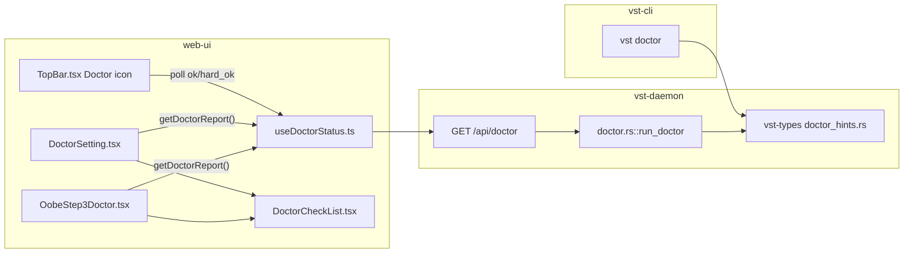

<!--
RULES — read before writing or implementing:
1. FORMAT: Bullets, tables, code, diagrams ONLY — no prose paragraphs
2. REQUIREMENTS: One crisp line each — no verbose descriptions
3. CHECKLIST: Mark items [x] as you complete them — this is your persistent todo list
4. READING TIME: Optimize for fast human scanning — if it's hard to skim, rewrite it
-->

# Plan: Doctor UI (OOBE step 3 + Settings + TopBar status icon)

> Wire `vst-daemon/src/doctor.rs::run_doctor` to a new `GET /api/doctor`, extend it with timeouts/grouping/install-hints, fix the OOBE step-2 persistence gap, and add a 3rd OOBE step, a Settings > Doctor panel, and a TopBar Doctor icon.

**Issue:** doctor-ui
**Branch:** `feat/doctor-ui`
**Status:** WIP
**PRD:** `docs/DOCTOR-UI-PRD.md`

**Reference files:**
- Data / schema: `rust/vst-types/src/rest/doctor.rs` (new), `rust/vst-types/src/rest/oobe.rs`
- Core logic: `rust/vst-daemon/src/doctor.rs`, `rust/vst-routes/src/oobe.rs`
- UI / entrypoint: `web-ui/src/components/oobe/OobeFlow.tsx`, `web-ui/src/components/settings/SettingsPanel.tsx`, `web-ui/src/components/layout/TopBar.tsx`
- Wiring (DI / routing / config): `rust/vst-daemon/src/server.rs`, `web-ui/src/api/client.ts`

---

## Problem & Concept

- No UI-visible equivalent of `vst doctor` exists — `vst-daemon/src/doctor.rs::run_doctor` is a fully-implemented, fully-unwired module (not called by any route, not declared as a dependency of anything except its own module declaration at `rust/vst-daemon/src/lib.rs:3`).
- OOBE's 2-step wizard never confirms the environment is actually usable before letting a fresh install through, and there is no always-visible "is my setup healthy" signal anywhere in the running app.
- See `docs/DOCTOR-UI-PRD.md` for full requirements, ASCII UI, and API shapes — this plan is the file-by-file "how".

## Out of Scope

- Auto-installing missing dependencies (show the command only, never run it).
- Any notion of "the viewing device's OS" — every check/install-hint is about the daemon's host machine.
- Localizing install commands.
- WS push channel for doctor results (client polls `GET /api/doctor` on demand).
- A new SQLite table — doctor results are always computed live.
- The manual/device verification pass (dev-sandbox screenshots of OOBE step 3, Settings > Doctor, desktop + mobile, badge states) — that is a separate `/sdlc verify` step run after all phases below land; see `## Verify` at the end of this plan.

## Requirements

| # | Requirement |
|---|-------------|
| 1 | `GET /api/doctor` returns a daemon-computed `DoctorReport` (`hard_ok`, `ok`, per-check `status`/`required`/`group`/`resolved_path`/`install_hint`) — frontend never re-derives status |
| 2 | Each subprocess-backed check has an independent 3s timeout; a timed-out check reports `Timeout` and never blocks `hard_ok`/`ok` |
| 3 | `hard_ok` = tmux + git + daemon-reachable all `Ok`; `ok` = `hard_ok` AND ≥1 agent-CLI check `Ok` |
| 4 | OOBE gains a 3rd step ("Doctor"): Continue is disabled while `hard_ok` is false (no bypass); a "Continue anyway" link appears only when `hard_ok` is true and `ok` is false |
| 5 | Settings gains a "Doctor" section at `/settings/doctor` showing the same check list, grouped, with re-check + last-checked-timestamp |
| 6 | TopBar gains a Doctor icon left of the Keyboard-shortcuts icon, with neutral/attention/disconnected visual states and an `aria-label` that includes the issue count |
| 7 | `cloudflared` resolves `VST_CLOUDFLARED_BIN` first (bundled Tauri sidecar), then PATH — reports `"bundled"` with no install hint when resolved via the env var |
| 8 | `vst-cli`'s `vst doctor` and `vst-daemon`'s `GET /api/doctor` consume one shared install-hint table (`vst-types`) so hint text can't drift between the two surfaces |
| 9 | OOBE step-2 gains real persistence (`step2_confirmed`, `POST /api/oobe/step2`) — `currentStep` widens from `1 \| 2` to `1 \| 2 \| 3` |
| 10 | Doctor polling: re-run on daemon (re)connect and every 5 minutes while the tab is visible; paused while `document.visibilityState === "hidden"`, resumed with an immediate check on becoming visible |

---

## Change Map

```
rust/vst-types/src/rest/
  doctor.rs          + DoctorReport/DoctorCheckDto/DoctorStatus/CheckGroup wire types
  doctor_hints.rs     + shared install-hint table, keyed by check name + host OS
  oobe.rs            ~ widen currentStep to 1|2|3, add step2 request/response types
  mod.rs             ~ register new doctor/doctor_hints submodules
rust/vst-routes/src/
  oobe.rs            ~ persist step2_confirmed, add confirm_step2()
rust/vst-daemon/src/
  doctor.rs          ~ timeouts, group/required, resolved_path, cloudflared+tailscale, hard_ok/ok
  server.rs          ~ wire GET /api/doctor, POST /api/oobe/step2
rust/vst-cli/src/commands/
  doctor.rs          ~ consume shared hints table instead of inline hint strings
web-ui/src/api/
  types.ts           + DoctorReport/DoctorCheckDto types, widen OobeState.currentStep
  client.ts          + getDoctorReport(), confirmOobeStep2()
  mock.ts            + mock doctor report + step2 state
web-ui/src/hooks/
  useOobeGate.ts     ~ widen currentStep to 1|2|3, add markStep2Confirmed
  useDoctorStatus.ts  + shared polling hook (visibility-aware, single-flight)
web-ui/src/
  App.tsx            ~ pass onStep2Confirmed={oobe.markStep2Confirmed} to <OobeFlow>
web-ui/src/components/oobe/
  OobeFlow.tsx       ~ TOTAL_STEPS=3, render step 3
  OobeStep2Modes.tsx ~ "Finish" advances to step 3 instead of completing OOBE
  OobeStep3Doctor.tsx + new step-3 screen (gate + Continue/Continue-anyway)
web-ui/src/components/doctor/
  DoctorCheckList.tsx + shared check-row-list renderer (OOBE + Settings)
web-ui/src/components/settings/
  SettingsPanel.tsx  ~ register "Doctor" section
  DoctorSetting.tsx   + Settings > Doctor panel
web-ui/src/components/layout/
  TopBar.tsx         ~ Doctor icon + attention badge + disconnected state
```

| Today | After this plan |
|-------|-----------------|
| `run_doctor` exists but is unwired — no route calls it | `GET /api/doctor` serves a `DoctorReport` computed by an extended `run_doctor` |
| OOBE is 2 steps; step 2 confirmation is never persisted, only inferred from `step1_confirmed` | OOBE is 3 steps; step 2 is persisted (`step2_confirmed`), step 3 gates on doctor health |
| No Doctor entry in Settings | Settings > Doctor shows grouped checks, re-check, last-checked |
| No Doctor icon in TopBar | TopBar shows a Doctor icon with neutral/attention/disconnected states |
| `vst-cli`'s doctor and (future) daemon doctor have independently inlined install-hint strings | Both consume one shared `vst-types` hint table |
| `cloudflared`/`tailscale` are not checked by `vst-daemon`'s `run_doctor` at all (only `vst-cli`'s does) | `vst-daemon`'s `run_doctor` checks both, `cloudflared` via `VST_CLOUDFLARED_BIN`-first resolution |

---

## Research

- `rust/vst-daemon/src/doctor.rs:174-277` — `run_doctor(store, tmux, paths) -> Vec<DoctorCheck>` already checks tmux, git, the 4 agent CLIs, bun, agy-acp, claude-agent-acp, orphan sessions/worktrees; `DoctorCheck` has only `name`/`status`/`message` (no `required`/`group`/`resolved_path`/`install_hint`) — PRD's new fields are all additive.
- `rust/vst-daemon/src/lib.rs:3` — `pub mod doctor;` is declared but `rust/vst-daemon/src/server.rs` never references `vst_daemon::doctor` — confirms the PRD's "currently unwired" claim firsthand.
- `rust/vst-daemon/src/server.rs:559-747` — the `/api` router is built as one `Router::new()...route(...)` chain; OOBE routes sit at `server.rs:741-747`; `GET /api/doctor` and `POST /api/oobe/step2` slot into this same chain.
- `rust/vst-daemon/src/server.rs:1427-1428` — `handle_health` is the minimal handler pattern (`State(state): State<AppState> -> Json<T>`) to mirror for `handle_doctor`.
- `rust/vst-routes/src/oobe.rs:37-44` — `PersistedOobe` has `completed: bool` and `step1_confirmed: bool` only; `rust/vst-routes/src/oobe.rs:136` derives `current_step` as `if step1_confirmed { 2 } else { 1 }` — **confirms firsthand**: there is genuinely no step-2 persistence today, exactly as the PRD assumed.
- `rust/vst-routes/src/oobe.rs:152-199` — `confirm_step1` is the pattern for a new `confirm_step2`: validate → mutate settings/state under `write_lock` → `read_raw`/mutate/`write`.
- `rust/vst-routes/tests/oobe.rs:1-80` — integration-test pattern for `OobeRoutes` (builds `StoreHandle`/`Paths`/`ModeRoutes`/`SettingsRoutes` from a `tempdir()`), run via `cargo test -p vst-routes --test oobe`.
- `rust/vst-agents/src/registry.rs:18-23` — `check_binary(name)` shells to `which <name>` synchronously; no timeout, no resolved path returned — the new timeout/resolved-path wrapper in `vst-daemon/src/doctor.rs` must not assume this helper already provides either.
- `rust/vst-cli/src/commands/doctor.rs:146-148,312-347` — the CLI's inline `print_hint()` calls contain the bun/agy-acp/claude-agent-acp/cloudflared install strings that must move into the new shared `vst-types` hints table (PRD §3); this file also already has its own `cloudflared`/`tailscale` checks (`doctor.rs:344-349`) that `vst-daemon`'s `run_doctor` currently lacks entirely.
- `desktop/src-tauri/src/daemon.rs:107` — `.env("VST_CLOUDFLARED_BIN", cloudflared_str)` is where the Tauri host actually injects the sidecar path into the daemon process's env (the resolution PRD §1 says to mirror); `desktop/src-tauri/src/main.rs:27-40` only computes the path, `daemon.rs:107` is where it becomes visible to `vst-daemon`.
- `rust/vst-lifecycle/src/cloudflared.rs:59` — existing precedent: `std::env::var("VST_CLOUDFLARED_BIN").unwrap_or_else(|_| "cloudflared".to_string())` is the exact resolution order the new doctor check must copy.
- No `chrono`/`time`/`hostname` crate exists anywhere in `rust/Cargo.toml`'s `[workspace.dependencies]` — `checked_at` (RFC3339) and `hostname` need a resolution decision (see Key Decision 4).
- `rust/vst-routes/src/mobile_auth.rs:545` — existing precedent for hostname-ish info via `std::process::Command::new("hostname")`, reused for `DoctorReport.hostname` instead of adding a new crate.
- `web-ui/src/hooks/useOobeGate.ts:7,36-48,93-99` — `currentStep: 1 | 2`, local `state` shape, and `markStep1Confirmed`/`markCompleted` — the pattern a new `markStep2Confirmed` and widened type must follow.
- `web-ui/src/components/oobe/OobeFlow.tsx:12,16,31` — `TOTAL_STEPS = 2`, `currentStep: 1 | 2` prop, local `step` state typed `1 | 2` — all three widen to include `3`.
- `web-ui/src/components/oobe/OobeStep2Modes.tsx:81-92` — `handleFinish` currently calls `api.completeOobe()` directly on step-2 "Finish" click; this must become "advance to step 3" (call the new step-2-confirm, not complete-OOBE) since OOBE no longer completes until step 3.
- `web-ui/src/components/settings/SettingsPanel.tsx:14,33-44` — `sections` array + import pattern that a new `DoctorSetting` entry follows exactly (`{ id: "doctor", label: "Doctor", content: <DoctorSetting api={api} /> }`); mobile stacking (list → detail) is automatic, no special-casing needed (`SettingsPanel.tsx:61-116`).
- `web-ui/src/components/settings/LspSetting.tsx:117-180` — the closest existing pattern for a Settings section that lists remote-host check rows with install commands + copy button (`LspSetting.tsx:16-23` `copyText` pattern, `62-99` command+Copy row) — `DoctorCheckList`/`DoctorSetting` should follow this row shape.
- `web-ui/src/components/layout/TopBar.tsx:322-343` — the Keyboard-shortcuts/Settings icon cluster is gated `!isMobile && layoutMode === "dashboard"` — **deviates from the PRD's assumption of "collapses into a menu on mobile"**: today these two icons render on desktop dashboard only and are simply absent on mobile/other layout modes, there is no overflow-menu collapse for this cluster anywhere in this file. The new Doctor icon must use the exact same `!isMobile && layoutMode === "dashboard"` gate as its neighbors, not a mobile-collapse behavior that doesn't exist yet (see Risk 1).
- `web-ui/src/components/layout/ConnectionStatus.tsx:5-26` — `api.getConnectionState()` / `api.subscribeConnection(cb)` with states `"online" | "offline" | "disconnected" | "connecting"` is the existing mechanism `useDoctorStatus` reuses to detect "daemon (re)connect" (trigger a re-check on transition into `"online"`) and to drive the TopBar icon's disconnected visual.
- `web-ui/package.json:8,10,12` — `"build": "tsc -b && vite build"`, `"typecheck": "tsc -b --noEmit"`, `"test": "vitest run"` — the exact verify commands for every frontend phase below.
- **Root cause:** `run_doctor` was built as a pure data-producing function with no route ever wired to it, and OOBE's on-disk state was built for exactly 2 steps (`step1_confirmed` boolean, no room for a 2nd confirmation) — both gaps are additive, not breaking, changes.

---

## Architecture Diagram



- Single source of truth: `RunDoctor` (daemon) and `VstDoctor` (CLI) both read `Hints` — they cannot diverge on install-command text.

---

## Design Details

### System Boundaries

| Boundary | Fields + types | Errors | Source of truth |
|----------|----------------|--------|-----------------|
| Frontend ↔ Backend: `GET /api/doctor` | See API Contracts below | Fetch failure (no body) → client synthesizes "can't reach daemon", never a doctor-check row | Daemon (`run_doctor`) |
| Frontend ↔ Backend: `POST /api/oobe/step2` | `{}` request → `{ ok: true }` response | `500` on write failure (best-effort persist, matches `confirm_step1`'s pattern — no explicit validation body needed since step 2 has no user input) | Daemon (`oobe.json`) |
| `vst-daemon` ↔ `vst-cli`: install hints | `vst_types::doctor_hints::hint_for(check_name: &str, os: &str) -> Option<&'static str>` | N/A (pure lookup, `None` = no hint for that check/OS) | `vst-types` (single table) |

### Critical User Journeys (CUJs)

#### CUJ 1 — Fresh install, all checks pass

```
User finishes OOBE step 2 (agent mode created)
  → Clicks "Finish" → daemon persists step2_confirmed=true, currentStep advances to 3
  → OobeStep3Doctor fetches GET /api/doctor
  → hard_ok=true, ok=true → Continue enabled, no "Continue anyway" shown
  → User clicks Continue → daemon POST /api/oobe/complete → OOBE marked completed
  → Normal app renders
```

- **Edge case:** daemon takes >3s on one check (e.g. hung `tailscale status`) → that row shows `Timeout`, does not block `hard_ok`/`ok` since it's Optional-group.

#### CUJ 2 — Only the agent-CLI rule fails (bypassable)

```
User reaches OOBE step 3 with tmux/git/daemon-reachable all Ok, but no agent CLI installed
  → hard_ok=true, ok=false
  → Continue stays disabled; "Continue anyway ›" link appears below it
  → User clicks it → one-line confirm ("no agent CLI installed... Continue anyway?")
  → User confirms → daemon POST /api/oobe/complete (same as CUJ 1) → OOBE marked completed
```

- **Error path:** tmux itself is also missing (hard_ok=false) → "Continue anyway" never renders, even though the CLI rule is also failing — hard_ok gates the escape hatch's very existence, not just Continue.

#### CUJ 3 — Daemon unreachable while viewing Settings > Doctor

```
User opens Settings > Doctor
  → getDoctorReport() fetch fails (network error / connection refused)
  → useDoctorStatus catches the failure, exposes state = "unreachable" (distinct from a DoctorReport with failing checks)
  → DoctorSetting renders "Can't reach daemon" instead of a check list
  → TopBar Doctor icon shows the disconnected visual (muted/greyed), not the attention badge
```

### Data Model

- No persisted entity for doctor results (computed live every call) — only `oobe.json`'s shape changes:

| Entity | Field | Type | Constraints | Notes |
|--------|-------|------|-------------|-------|
| `PersistedOobe` (`rust/vst-routes/src/oobe.rs:37-44`, `~/.vibe-station/oobe.json`) | `step2_confirmed` | `bool` | default `false` | NEW field — **must** carry `#[serde(default)]` (either on this field or via `#[serde(default)]` on the struct); `#[derive(Default)]` alone only supplies `PersistedOobe::default()` as a *whole-struct* fallback when `serde_json::from_str` errors out (see `read_raw`, `oobe.rs:86-92`) — it does NOT make individual missing JSON keys optional during an otherwise-successful parse. Without `#[serde(default)]`, an old `oobe.json` (no `step2_confirmed` key) fails to deserialize entirely, and `read_raw`'s `.unwrap_or_default()` then returns a fresh `PersistedOobe` with `completed: false` — silently re-gating every existing user through OOBE. |
| `PersistedOobe` | `completed` | `bool` | default `false` | unchanged — now only settable after step 3 |
| `PersistedOobe` | `step1_confirmed` | `bool` | default `false` | unchanged |

- **Migration:** Y — additive field defaults to `false` on missing-key parse **only because Phase 2.1 adds `#[serde(default)]`** (not because of the struct's existing `#[derive(Default)]`, which only covers whole-file parse failure, not missing-key tolerance within an otherwise-valid JSON object — see corrected Data Model note above). With `#[serde(default)]` in place: an upgrading user's existing `oobe.json` (`step1_confirmed: true, completed: true`, no `step2_confirmed` key) deserializes successfully with `step2_confirmed: false` filled in by default, and `completed` still reads `true` from the file — `get_state` never re-shows them OOBE. Verified by 2.T4.

### API Contracts

```
GET /api/doctor
  Request:  —
  Response: DoctorReport (200)
    {
      hardOk: bool,
      ok: bool,
      hostOs: string,        // "linux" | "macos" | "windows"
      hostname: string,
      checkedAt: string,     // RFC3339
      checks: DoctorCheckDto[]
    }
    DoctorCheckDto {
      name: string,
      status: "ok" | "warn" | "error" | "timeout",
      required: bool,
      group: "required" | "agent_cli" | "optional" | "diagnostic",
      message: string,
      resolvedPath: string | null,
      installHint: string | null
    }
  Errors: none defined (handler never fails — a check that can't run reports Error/Timeout on itself, the route itself always 200s)

POST /api/oobe/step2
  Request:  {} (no body fields — step 2's own detect-and-bundle/mode creation already persisted via /api/modes)
  Response: { ok: true } (200)
  Errors:   none — best-effort persist, mirrors confirm_step1's write pattern minus the validation branch (no path input on this step)
```

- `GET /oobe/state` response widens (existing route, not a new one): `currentStep: 1 | 2 | 3` instead of `1 | 2` — see `rust/vst-types/src/rest/oobe.rs:14`.

### Key Decisions

#### Decision 1: Per-check timeout via `spawn_blocking` + `tokio::time::timeout`, not a rewrite to async subprocess calls

- **Decision:** wrap every existing synchronous check closure (`check_binary`, `Command::new(...).output()`) in one shared helper that runs it on `tokio::task::spawn_blocking` and races it against a 3s `tokio::time::timeout`.
- **Rationale:** `check_binary` (`rust/vst-agents/src/registry.rs:18-23`) and the CLI's own subprocess checks are synchronous `std::process::Command` calls; rewriting them to `tokio::process::Command` throughout would touch code outside this plan's scope (shared with non-doctor callers) — `spawn_blocking` gets a real timeout without touching `check_binary`'s signature.
- **Where:** `rust/vst-daemon/src/doctor.rs` — new `async fn with_timeout(name, group, required, f: impl FnOnce() -> DoctorCheck + Send + 'static) -> DoctorCheck`.

```rust
// Every subprocess-backed check goes through this — a hung `tailscale status`
// or CLI `--version` call degrades to Timeout instead of hanging run_doctor
// forever (PRD §1: "a timed-out check can never itself count as a blocking
// required failure").
async fn with_timeout(
    name: &str,
    group: CheckGroup,
    required: bool,
    f: impl FnOnce() -> DoctorCheck + Send + 'static,
) -> DoctorCheck {
    match tokio::time::timeout(Duration::from_secs(3), tokio::task::spawn_blocking(f)).await {
        Ok(Ok(check)) => check,
        _ => DoctorCheck {
            name: name.to_string(),
            status: DoctorStatus::Timeout,
            required,
            group,
            message: format!("{name} timed out after 3s"),
            resolved_path: None,
            install_hint: None,
        },
    }
}
```

#### Decision 2: `hard_ok`/`ok` computed once, in `run_doctor`, from the `checks` vec — never re-derived per-caller

- **Decision:** `DoctorReport::hard_ok`/`ok` are set by a single fold over `checks` inside `run_doctor`'s caller (`rust/vst-daemon/src/doctor.rs`'s new `build_report` wrapper), never recomputed client-side.
- **Rationale:** PRD §1 requires the OOBE gate, the escape hatch, and the TopBar badge to "never disagree" — the only way to guarantee that is one computation, consumed verbatim everywhere.
- **Where:** `rust/vst-daemon/src/doctor.rs` — extract the fold into pure, independently-testable functions rather than inlining it:
  ```rust
  // A per-check timeout can NEVER itself count as a blocking required
  // failure (PRD §1) — it degrades to a soft warning, not a hard block.
  fn passes(status: DoctorStatus) -> bool {
      matches!(status, DoctorStatus::Ok | DoctorStatus::Timeout)
  }

  fn compute_hard_ok(checks: &[DoctorCheck]) -> bool {
      checks
          .iter()
          .filter(|c| c.group == CheckGroup::Required)
          .all(|c| passes(c.status))
  }

  fn compute_ok(checks: &[DoctorCheck]) -> bool {
      compute_hard_ok(checks)
          && checks
              .iter()
              .any(|c| c.group == CheckGroup::AgentCli && c.status == DoctorStatus::Ok)
  }
  ```
  `build_report` (3.9) calls `compute_hard_ok`/`compute_ok` instead of inlining the fold, so both are directly unit-testable with a synthetic `Vec<DoctorCheck>` (see 3.T8) without spinning up real subprocess checks.

#### Decision 3: `daemon-reachable` is a trivial always-`Ok` check, not a real connectivity probe

- **Decision:** add a `daemon-reachable` check to `run_doctor`'s output that is unconditionally `DoctorStatus::Ok`, `group: Required`, `required: true`.
- **Rationale:** the check only exists inside a response the daemon itself just served — by construction, if `GET /api/doctor` returned anything, the daemon is reachable. The real "unreachable" signal is the client's own fetch failure (CUJ 3), synthesized client-side, never a row in `checks`. This check exists purely so `hard_ok`'s 3-item Required group (tmux/git/daemon-reachable) matches the PRD's literal wording and so the OOBE/Settings row list visually shows "Daemon reachable ✓" per the ASCII UI (PRD §2a/§2b).
- **Where:** `rust/vst-daemon/src/doctor.rs::run_doctor`.

#### Decision 4: `chrono` (minimal) for `checked_at`; shell to `hostname` (existing precedent) for `hostname` — no new process-spawning crate

- **Decision:** add `chrono = { version = "0.4", default-features = false, features = ["clock"] }` **directly** to `rust/vst-daemon/Cargo.toml`'s `[dependencies]` (not via `[workspace.dependencies]`) for `Utc::now().to_rfc3339()`; get `hostname` via `std::process::Command::new("hostname").output()`, trimmed, falling back to `"unknown"` on any failure.
- **Rationale:** no RFC3339 formatter or hostname crate exists anywhere in the workspace today (see Research) — `chrono` is the smallest well-known addition for the timestamp; the `hostname` binary shell-out already has precedent at `rust/vst-routes/src/mobile_auth.rs:545`, avoiding a second new dependency. `rust/vst-agents/Cargo.toml:21` already depends on `chrono = { version = "0.4", default-features = false, features = ["clock"] }` as a **direct**, non-workspace dependency — matching that exact existing precedent instead of introducing a new `[workspace.dependencies]` entry.
- **Where:** `rust/vst-daemon/Cargo.toml` only, `rust/vst-daemon/src/doctor.rs`.

#### Decision 5: `cloudflared` check lives in `vst-daemon/src/doctor.rs`, reads `VST_CLOUDFLARED_BIN` directly — no shared resolver crate

- **Decision:** the new cloudflared check does `std::env::var("VST_CLOUDFLARED_BIN")` first; if set and the path exists on disk, `Ok`/`"bundled"`/`resolved_path` = that path, no `install_hint`. Otherwise fall back to a `which cloudflared`-style PATH check (reusing the `with_timeout`+`check_binary`-style helper); if that also fails, `Warn`/`"not found"` + `install_hint` from the shared hints table (`group: Optional`, `required: false`).
- **Rationale:** mirrors `rust/vst-lifecycle/src/cloudflared.rs:59`'s exact resolution order (env var, then bare `cloudflared` on PATH) — PRD §1 explicitly requires parity with this, not a bare PATH lookup.
- **Where:** `rust/vst-daemon/src/doctor.rs` — new `fn check_cloudflared() -> DoctorCheck` (sync, wrapped by `with_timeout` like every other subprocess check). `tailscale` gets a parallel `fn check_tailscale_binary() -> DoctorCheck` that is always a plain `which`-style PATH check (no bundled path in any run mode, per PRD §3) — do not build a `tailscale status --json` probe like `vst-cli`'s (`rust/vst-cli/src/commands/doctor.rs:218-280`) does; that's a connectivity check, out of scope here, this is only presence-on-PATH.

#### Decision 6: `completeOobe()` can still 409 under "Continue anyway" — no backend bypass flag, surface it inline instead

- **Decision:** do not add a `force`-style param/flag to `complete()` (`rust/vst-routes/src/oobe.rs:250-273`). "Continue anyway" only bypasses the *doctor* hard-gate (client-side); it does not and should not bypass `complete()`'s own separate business rule (`NoModeForDetectedCli`, 409) — that rule is a distinct, pre-existing invariant (a completed OOBE always has at least one mode for a detected CLI) outside this feature's scope to relax. Instead, `OobeStep3Doctor.tsx`'s Continue AND "Continue anyway" handlers both wrap `api.completeOobe()` in try/catch and render the caught error inline, exactly like `OobeStep2Modes.tsx`'s `handleFinish` (`OobeStep2Modes.tsx:81-92`) already does for its own `finishError` state.
- **Rationale:** the common real-world overlap — "no agent CLI installed" (the case "Continue anyway" targets) frequently coincides with "no mode was ever created" (the case `complete()`'s 409 targets) — means a user clicking "Continue anyway" may still see a 409. Silently swallowing or crashing on that response would violate the PRD's general error-handling expectations; showing the daemon's own message inline (mirroring existing OOBE UX) is the minimal correct fix.
- **Where:** `rust/vst-routes/src/oobe.rs` (unchanged), `web-ui/src/components/oobe/OobeStep3Doctor.tsx` (Phase 7.1).

---

## Risks / Open Questions

| # | Question | Notes |
|---|----------|-------|
| 1 | **PRD assumes TopBar's shortcuts+settings icons "collapse into a menu" on mobile — do they?** | No — `TopBar.tsx:322` gates the whole cluster `!isMobile \|\| layoutMode !== "dashboard"` → hidden entirely on mobile, no overflow-menu collapse exists for this cluster. Plan gates the new Doctor icon identically to its neighbors (Phase 8) rather than inventing a collapse behavior; mobile Doctor access is Settings > Doctor only, same reachability trade-off the existing Keyboard-shortcuts icon already accepts. |
| 2 | **Does the escape-hatch confirm need its own dialog component, or an inline expand?** | PRD shows a one-line confirm below "Continue anyway ›" — Phase 7 implements it as inline state (`showConfirm` boolean) inside `OobeStep3Doctor.tsx`, no new dialog component, matching the existing inline-delete-confirm pattern in `OobeStep2Modes.tsx:229-241`. |
| 3 | **Should `orphan-sessions`/`orphan-worktrees` block anything?** | No — PRD §3 explicitly reclassifies both as `CheckGroup::Diagnostic`, informational only; Phase 3 sets `group: Diagnostic, required: false` on both, no behavior change to their existing pass/warn logic. |

---

## Implementation Phases

- Each phase ends with a **verification block** — the phase is not complete until those tests pass
- Test items use `N.Tn` numbering to distinguish them from implementation items
- **Phase ordering is load-bearing for turn-mode:** 1→4 are the daemon/API side (must land first, they define the wire contract); 5→8 are the frontend side and cite the *finalized* `DoctorReport`/`DoctorCheckDto` JSON shape from the API Contracts section above, not "whatever the daemon returns"

---

### Phase 1 — `vst-types`: DoctorReport wire types + shared install-hint table + OOBE step-2 wire types

^- [x] **1.1** Create `rust/vst-types/src/rest/doctor.rs` with the exact shapes from `## Design Details → API Contracts` above:
  ```rust
  use serde::{Deserialize, Serialize};

  #[derive(Clone, Debug, PartialEq, Serialize, Deserialize)]
  #[serde(rename_all = "camelCase")]
  pub struct DoctorReport {
      pub hard_ok: bool,
      pub ok: bool,
      pub host_os: String,
      pub hostname: String,
      pub checked_at: String,
      pub checks: Vec<DoctorCheckDto>,
  }

  #[derive(Clone, Debug, PartialEq, Serialize, Deserialize)]
  #[serde(rename_all = "camelCase")]
  pub struct DoctorCheckDto {
      pub name: String,
      pub status: DoctorCheckStatus,
      pub required: bool,
      pub group: CheckGroup,
      pub message: String,
      pub resolved_path: Option<String>,
      pub install_hint: Option<String>,
  }

  #[derive(Clone, Copy, Debug, PartialEq, Eq, Serialize, Deserialize)]
  #[serde(rename_all = "snake_case")]
  pub enum DoctorCheckStatus {
      Ok,
      Warn,
      Error,
      Timeout,
  }

  #[derive(Clone, Copy, Debug, PartialEq, Eq, Serialize, Deserialize)]
  #[serde(rename_all = "snake_case")]
  pub enum CheckGroup {
      Required,
      AgentCli,
      Optional,
      Diagnostic,
  }
  ```
  Note: this is a NEW type distinct from `vst_daemon::doctor::DoctorStatus` (which stays `Ok`/`Warn`/`Error`, no `Timeout` — see Phase 3, 3.1) — `DoctorCheckStatus` is the wire type, `DoctorStatus` is the internal check-runner type; Phase 3 adds a `Timeout` variant to `DoctorStatus` too and maps it 1:1.
^- [x] **1.2** Create `rust/vst-types/src/rest/doctor_hints.rs`:
  ```rust
  //! Shared install-hint table — the single source of truth for "how do I
  //! install this" text, consumed by both `vst-cli` (`vst doctor`) and
  //! `vst-daemon` (`GET /api/doctor`) so the two surfaces cannot drift.
  //!
  //! `bun`/`agy-acp`/`claude-agent-acp`/`cloudflared` strings below are
  //! copied VERBATIM from `vst-cli/src/commands/doctor.rs`'s existing
  //! `print_hint(...)` calls (lines ~317-347) — Phase 4 makes the CLI call
  //! `hint_for` instead of inlining them, so wording cannot diverge.
  //! `tmux`/`git`/`plugin-*` strings are AUTHORED HERE — `vst-cli`'s doctor
  //! currently has no install-hint text at all for these five checks (its
  //! `tmux`/`git`/4-CLI checks call `check(...)` with no `print_hint`), so
  //! there is nothing to copy; this table is their first and only source.

  /// Returns the install-hint command for `check_name` on `host_os`
  /// (`"linux" | "macos" | "windows"`, i.e. `std::env::consts::OS`), or
  /// `None` if this check has no install hint on that OS (e.g. `cloudflared`
  /// when bundled, or a check with no install story).
  pub fn hint_for(check_name: &str, host_os: &str) -> Option<&'static str> {
      match check_name {
          "bun" => Some(if host_os == "macos" {
              "brew install oven-sh/bun/bun  OR  curl -fsSL https://bun.sh/install | bash"
          } else if host_os == "windows" {
              "curl -fsSL https://bun.sh/install | bash  (run inside WSL — there is no native Windows install path used by this project)"
          } else {
              "curl -fsSL https://bun.sh/install | bash"
          }),
          "agy-acp" => Some(
              "Build it from the vendored submodule (rust/vendor/openab/agy-acp) or set AGY_ACP_BIN",
          ),
          // Verbatim from vst-cli/src/commands/doctor.rs's current print_hint
          // (NOT the slightly different message vst-daemon/src/doctor.rs's
          // own inline claude-agent-acp check embeds today — Phase 3.5
          // switches the daemon's install_hint source to this same call, so
          // both surfaces converge on this one wording).
          "claude-agent-acp" => Some(
              "Install it: ./scripts/install-claude-acp-vendor.sh (then set VST_CLAUDE_ACP_ENTRY to the path it prints, if this checkout isn't the one the daemon runs from)",
          ),
          "cloudflared" => Some(
              "brew install cloudflared  OR  https://developers.cloudflare.com/cloudflared/",
          ),
          "tmux" => Some(match host_os {
              "macos" => "brew install tmux",
              "windows" => "tmux has no native Windows build — install it inside WSL (wsl --install, then apt install tmux)",
              _ => "apt install tmux  (or your distro's package manager, e.g. dnf install tmux / pacman -S tmux)",
          }),
          "git" => Some(match host_os {
              "macos" => "brew install git  (or xcode-select --install)",
              "windows" => "winget install --id Git.Git -e  (or install WSL and apt install git inside it)",
              _ => "apt install git  (or your distro's package manager, e.g. dnf install git / pacman -S git)",
          }),
          "plugin-claude" => Some(match host_os {
              "windows" => "curl -fsSL claude.ai/install.sh | sh  (run inside WSL — there is no native Windows installer)",
              _ => "curl -fsSL claude.ai/install.sh | sh",
          }),
          "plugin-cursor" => Some(match host_os {
              "windows" => "curl https://cursor.com/install -fsS | bash  (run inside WSL — there is no native Windows installer)",
              _ => "curl https://cursor.com/install -fsS | bash",
          }),
          "plugin-opencode" => Some(match host_os {
              "windows" => "curl -fsSL https://opencode.ai/install | bash  (run inside WSL — there is no native Windows installer)",
              _ => "curl -fsSL https://opencode.ai/install | bash",
          }),
          // `agy` is vendored (rust/vendor/openab/agy-acp), not a standalone
          // public CLI install like claude/cursor/opencode — point at the
          // same vendored-submodule build step the agy-acp check itself uses
          // (see the "agy-acp" case above), not a guessed public URL.
          "plugin-agy" => Some(
              "Build it from the vendored submodule (rust/vendor/openab/agy-acp) — see AGENTS.md or CLI-SUPPORT.md for the agy CLI itself",
          ),
          _ => None,
      }
  }
  ```
  Every string above is now either a verbatim copy (cited in the module doc comment) or this plan's own authoritative text (cited as such) — nothing left for the implementer to invent or resolve. During implementation, double-check the `bun`/`agy-acp`/`claude-agent-acp`/`cloudflared` strings still match `vst-cli/src/commands/doctor.rs`'s current `print_hint(...)` calls verbatim (they may have drifted since this plan was written) and correct this table if so — the CLI's current text is the source of truth for those four, this table is the source of truth for the other five.
^- [x] **1.3** Register both new modules in `rust/vst-types/src/rest/mod.rs`: add `pub mod doctor;` and `pub mod doctor_hints;` alongside the existing `pub mod oobe;` line.
^- [x] **1.4** Widen `rust/vst-types/src/rest/oobe.rs:14` — `OobeStateResponse.current_step` from `u8` stays `u8` (already untyped as a literal 1/2/3 range at the Rust level; only the TS/frontend side has the literal union type) — no Rust change needed here beyond the doc comment; update the doc comment on `current_step` to say `1, 2, or 3` instead of implying 2 steps.
^- [x] **1.5** Add to `rust/vst-types/src/rest/oobe.rs`, alongside the existing `ConfirmStep1Body`/`ConfirmStep1Result`:
  ```rust
  /// `POST /oobe/step2` success — step 2 has no user-supplied fields (the
  /// mode/bundle creation it confirms already persisted via `/api/modes`),
  /// so there is no matching `ConfirmStep2Body`.
  #[derive(Clone, Debug, PartialEq, Serialize, Deserialize)]
  #[serde(rename_all = "camelCase")]
  pub struct ConfirmStep2Result {
      pub ok: bool,
  }
  ```

**Verify phase 1:**
^- [x] **1.T1** Unit — `rust/vst-types/src/rest/doctor.rs`: add a `#[cfg(test)] mod tests` that round-trips a hand-built `DoctorReport` (one check per `DoctorCheckStatus`/`CheckGroup` variant) through `serde_json::to_value`/`from_value` and asserts equality — run with `cargo test -p vst-types doctor`.
^- [x] **1.T2** Unit — `rust/vst-types/src/rest/doctor_hints.rs`: `hint_for("bun", "linux")` returns `Some(...)` containing `"bun.sh/install"`; `hint_for("nonexistent-check", "linux")` returns `None`.
^- [x] **1.T3** Build — `cargo build -p vst-types` succeeds with the two new modules registered.

---

### Phase 2 — `vst-routes`: OOBE step-2 persistence

- [x] **2.1** In `rust/vst-routes/src/oobe.rs`, add `step2_confirmed: bool` (default `false`) to the `PersistedOobe` struct at `rust/vst-routes/src/oobe.rs:37-44`, **and add `#[serde(default)]`** on the derive line directly above the struct (`rust/vst-routes/src/oobe.rs:36`, currently `#[derive(Clone, Debug, Default, serde::Serialize, serde::Deserialize)]`) — add `#[serde(default)]` as its own attribute on that same line/position. **This is required, not optional**: `#[derive(Default)]` alone only satisfies `read_raw`'s whole-parse-failure fallback (`unwrap_or_default()`); without `#[serde(default)]`, a pre-existing `oobe.json` missing the new key fails `serde_json::from_str` outright and falls back to `PersistedOobe::default()` (`completed: false`), re-gating existing users — violates PRD §1's "never retroactively re-gated" requirement (see 2.T4).
- [x] **2.2** In `rust/vst-routes/src/oobe.rs::get_state` (`rust/vst-routes/src/oobe.rs:130-149`), replace the `current_step` derivation:
  ```rust
  let current_step = if !persisted.step1_confirmed {
      1
  } else if !persisted.step2_confirmed {
      2
  } else {
      3
  };
  ```
- [x] **2.3** Add `confirm_step2`, mirroring `confirm_step1`'s lock/read/mutate/write pattern (`rust/vst-routes/src/oobe.rs:152-199`) but with no validation branch (step 2 takes no body):
  ```rust
  /// `POST /oobe/step2` — confirm step 2 (agent mode setup) is done, advancing
  /// `currentStep` to 3. No request body — step 2's own state (which modes
  /// exist) already persisted via `/api/modes` as each mode was created.
  pub async fn confirm_step2(&self) -> ConfirmStep2Result {
      let _guard = self.write_lock.lock().await;
      let mut persisted = self.read_raw().await;
      persisted.step2_confirmed = true;
      self.write(&persisted).await;
      ConfirmStep2Result { ok: true }
  }
  ```
  Import `ConfirmStep2Result` from `vst_types::rest::oobe` alongside the existing OOBE type imports at `rust/vst-routes/src/oobe.rs:14-16`.
- [x] **2.4** `complete()` (`rust/vst-routes/src/oobe.rs:250-273`) is unchanged in this phase — it already only checks `modes`/`supported` satisfaction, not `current_step`; step-3 gating (hard_ok/ok) is enforced entirely client-side per PRD §1 ("no doctorAcknowledged... OOBE state field needed").

**Verify phase 2:**
- [x] **2.T4** Regression — `rust/vst-routes/tests/oobe.rs`: write a raw JSON string `{"completed":true,"step1_confirmed":true,"auto_bundle_created_for":[]}` (no `step2_confirmed` key, simulating a pre-existing file from before this feature) directly to the tempdir's `oobe.json`, then call `get_state()` and assert `completed == true` and `currentStep == 3` — proves `#[serde(default)]` prevents the old-file-resets-completion bug.
- [x] **2.T1** Integration — `rust/vst-routes/tests/oobe.rs`: add `test_confirm_step2_persists_and_advances_current_step` — build an `OobeRoutes` per the file's existing `build_mode_routes`/tempdir pattern (`rust/vst-routes/tests/oobe.rs:20-28,65-75`), call `confirm_step1(...)` then `get_state()` and assert `current_step == 2`, then call `confirm_step2()` and assert the result is `ConfirmStep2Result { ok: true }` and a fresh `get_state()` call now returns `current_step == 3`.
- [x] **2.T2** Regression — `rust/vst-routes/tests/oobe.rs`: existing `test_get_state_empty_fresh` (`rust/vst-routes/tests/oobe.rs:65-79`) still passes unmodified — a brand-new `oobe.json` still starts at `current_step == 1`.
- [x] **2.T3** Run `cargo test -p vst-routes --test oobe` — all tests in the file pass.

---

### Phase 3 — `vst-daemon`: extend `run_doctor` + wire `GET /api/doctor` and `POST /api/oobe/step2`

- [x] **3.1** In `rust/vst-daemon/src/doctor.rs`, add a `Timeout` variant to the existing `DoctorStatus` enum (`rust/vst-daemon/src/doctor.rs:34-40`):
  ```rust
  pub enum DoctorStatus {
      Ok,
      Warn,
      Error,
      Timeout,
  }
  ```
- [x] **3.2** Extend `DoctorCheck` (`rust/vst-daemon/src/doctor.rs:26-32`) with the new fields: `required: bool`, `group: CheckGroup`, `resolved_path: Option<String>`, `install_hint: Option<String>` — define `CheckGroup` locally in this file (`Required | AgentCli | Optional | Diagnostic`, mirrors `vst_types::rest::doctor::CheckGroup` field-for-field; this internal enum maps 1:1 to the wire enum at the route-handler boundary in server.rs, kept separate so `vst-daemon` doesn't need a `vst-types` round-trip inside its own check-running logic).
- [x] **3.3** Add the `with_timeout` helper from `## Design Details → Key Decisions → Decision 1` verbatim to `rust/vst-daemon/src/doctor.rs`, and thread every subprocess-backed existing check (tmux, git, each of the 4 `plugin-*` CLIs, bun) through it, setting `group`/`required` per this table:

  | Check | group | required |
  |-------|-------|----------|
  | `tmux` | `Required` | `true` |
  | `git` | `Required` | `true` |
  | `daemon-reachable` (NEW, Decision 3) | `Required` | `true` |
  | `plugin-claude`/`plugin-cursor`/`plugin-opencode`/`plugin-agy` | `AgentCli` | `false` |
  | `bun` | `Optional` | `false` |
  | `agy-acp` | `Optional` | `false` |
  | `claude-agent-acp` | `Optional` | `false` |
  | `cloudflared` (NEW) | `Optional` | `false` |
  | `tailscale` (NEW) | `Optional` | `false` |
  | `orphan-sessions` | `Diagnostic` | `false` |
  | `orphan-worktrees` | `Diagnostic` | `false` |

- [x] **3.4** Populate `resolved_path` for every check that resolves a filesystem path: `plugin-*` CLIs (via `which <bin>` output, capture stdout path), `bun` (same), `claude-agent-acp` (already has `entry: String` locally at `rust/vst-daemon/src/doctor.rs:253`, put it in `resolved_path` instead of only in `message`), `agy-acp` (use `vst_agy_acp::agy_acp_bin() -> Option<PathBuf>` instead of the current `agy_acp_available() -> bool` at `rust/vst-daemon/src/doctor.rs:235`, so the path is available).
- [x] **3.5** Populate `install_hint` for every non-`Ok` check by calling `vst_types::rest::doctor_hints::hint_for(&check.name, std::env::consts::OS)` — do this centrally, once, when assembling the final `checks` vec (not inline per-check), so Phase 3.6's `install_hint: None` placeholders in individual check functions get filled in one pass.
- [x] **3.6** Add `fn check_cloudflared() -> DoctorCheck` and `fn check_tailscale_binary() -> DoctorCheck` per `## Design Details → Key Decisions → Decision 5` — both wrapped in `with_timeout` when added to the `checks` vec in `run_doctor`.
- [x] **3.7** Add `fn check_daemon_reachable() -> DoctorCheck` per Decision 3 (unconditional `Ok`, no timeout wrapper needed since it does no I/O).
- [x] **3.8** Add hostname resolution per Decision 4:
  ```rust
  fn resolve_hostname() -> String {
      std::process::Command::new("hostname")
          .output()
          .ok()
          .filter(|o| o.status.success())
          .and_then(|o| String::from_utf8(o.stdout).ok())
          .map(|s| s.trim().to_string())
          .filter(|s| !s.is_empty())
          .unwrap_or_else(|| "unknown".to_string())
  }
  ```
- [x] **3.9** Add `pub async fn build_report(store: &StoreHandle, tmux: &Tmux, paths: &Paths) -> vst_types::rest::doctor::DoctorReport` to `rust/vst-daemon/src/doctor.rs` — calls the (now-extended) `run_doctor`, computes `hard_ok`/`ok` per Decision 2, maps every internal `DoctorCheck`/`DoctorStatus`/`CheckGroup` to its `vst_types::rest::doctor` wire equivalent, sets `host_os: std::env::consts::OS.to_string()`, `hostname: resolve_hostname()`, `checked_at: chrono::Utc::now().to_rfc3339()`.
- [x] **3.10** Add `chrono = { version = "0.4", default-features = false, features = ["clock"] }` to `rust/vst-daemon/Cargo.toml`'s `[dependencies]`, matching `rust/vst-agents/Cargo.toml:21`'s existing exact version string (Decision 4) — no `rust/Cargo.toml` `[workspace.dependencies]` edit needed since `vst-agents` already establishes this as a direct per-crate dependency, not a workspace one.
- [x] **3.11** In `rust/vst-daemon/src/server.rs`, add the import at the existing `use vst_types::rest::oobe::{...}` block (`rust/vst-daemon/src/server.rs:70-72`): add `use vst_types::rest::doctor::DoctorReport;` as its own `use` line, and add `ConfirmStep2Result` to the existing `oobe::{...}` import list.
- [x] **3.12** In `rust/vst-daemon/src/server.rs`'s `api` router chain, add two routes: one near the OOBE block (`rust/vst-daemon/src/server.rs:741-747`) — `.route("/oobe/step2", post(handle_oobe_step2))` — and one new top-level entry anywhere in the chain, e.g. beside `/health`'s pattern but under `/api` since it's a REST resource, not a root utility route — `.route("/doctor", get(handle_doctor))`.
- [x] **3.13** Add the two handlers beside the existing OOBE handlers (`rust/vst-daemon/src/server.rs:3467-3496`):
  ```rust
  async fn handle_doctor(State(state): State<AppState>) -> Json<DoctorReport> {
      Json(crate::doctor::build_report(&state.store, &state.tmux, &state.paths).await)
  }

  async fn handle_oobe_step2(
      State(state): State<AppState>,
  ) -> Json<ConfirmStep2Result> {
    Json(state.oobe_routes.confirm_step2().await)
  }
  ```

**Verify phase 3:**
- [x] **3.T1** Unit — `rust/vst-daemon/src/doctor.rs`: add `#[cfg(test)] mod tests` — `check_daemon_reachable()` returns `status: DoctorStatus::Ok, required: true, group: CheckGroup::Required`.
- [x] **3.T2** Unit — `rust/vst-daemon/src/doctor.rs`: `with_timeout` test — a closure that `std::thread::sleep`s 5s (under a `#[tokio::test(flavor = "multi_thread")]` or with `tokio::time::pause`/advance if the test harness supports it) returns `DoctorStatus::Timeout` within the 3s budget, not the closure's own 5s.
- [x] **3.T3** Unit — `rust/vst-daemon/src/doctor.rs`: `check_cloudflared()` with `VST_CLOUDFLARED_BIN` set (via `std::env::set_var` in the test, to a tempfile path that exists) returns `status: Ok, message` containing `"bundled"`, `install_hint: None`.
- [x] **3.T4** Unit — `rust/vst-daemon/src/doctor.rs`: `check_cloudflared()` with `VST_CLOUDFLARED_BIN` unset and `cloudflared` absent from PATH (test env can't fully guarantee this — assert instead that when unset, resolution falls through to the PATH-based helper, not an early return) returns a check whose `resolved_path` is `None` when not found.
- [x] **3.T5** Integration — `rust/vst-daemon`: new test file `rust/vst-daemon/tests/doctor_routes_http.rs`, following `rust/vst-daemon/tests/worktree_routes_http.rs:1-40`'s exact pattern (`vst_daemon::server::{build_app, BuildServerOptions}` + `tower::ServiceExt::oneshot`, `tempfile::tempdir()`, `no_auth: true` — no real TCP port bound), issue `GET /api/doctor`, assert `200` and a `DoctorReport` with `checks.len() >= 11` (tmux, git, daemon-reachable, 4×plugin-*, bun, agy-acp, claude-agent-acp, cloudflared, tailscale, orphan-sessions, orphan-worktrees).
- [x] **3.T6** Integration — same harness: `POST /api/oobe/step2` returns `200 { "ok": true }`, and a follow-up `GET /api/oobe/state` shows `currentStep: 3` (assuming step1 was already confirmed in the test setup).
- [x] **3.T7** Run `cargo build -p vst-daemon` and `cargo test -p vst-daemon` — full workspace-relevant build + test pass.
- [x] **3.T8** Unit — `rust/vst-daemon/src/doctor.rs`: build a synthetic `Vec<DoctorCheck>` with `tmux`/`git` both `Ok, group: Required` and `daemon-reachable` set to `status: Timeout, group: Required` — assert `compute_hard_ok(&checks) == true` (a Required-group timeout must never block `hard_ok`); a variant with `status: Error` (not `Timeout`) on that same Required check asserts `compute_hard_ok(&checks) == false` (a real failure still blocks it) — proves the fix distinguishes "timed out" from "actually failed."

---

### Phase 4 — `vst-cli`: consume the shared hints table

- [ ] **4.1** In `rust/vst-cli/src/commands/doctor.rs`, replace the inline `print_hint(&format!("Install: {install_cmd}"))` bun block (`rust/vst-cli/src/commands/doctor.rs:312-323`) with a call to `vst_types::rest::doctor_hints::hint_for("bun", std::env::consts::OS)`, falling back to the existing inline string only if `hint_for` returns `None` (it shouldn't, since Phase 1.2 seeds `"bun"`).
- [ ] **4.2** Do the same for the `agy-acp` hint (`rust/vst-cli/src/commands/doctor.rs:329-333`), `claude-agent-acp` hint (`rust/vst-cli/src/commands/doctor.rs:340-342`), and `cloudflared` hint (`rust/vst-cli/src/commands/doctor.rs:344-347`) — each `print_hint(...)` call's string comes from `hint_for(...)` instead of being written inline.
- [ ] **4.3** Add `vst-types = { workspace = true }` to `rust/vst-cli/Cargo.toml`'s `[dependencies]` if not already present (check first — `vst-cli` already depends on plenty of shared crates, confirm before adding a duplicate).
- [ ] **4.4** No behavior change to which checks run or their pass/fail logic in this phase — only the hint TEXT's source moves; `vst-cli`'s own `cloudflared`/`tailscale` checks (`rust/vst-cli/src/commands/doctor.rs:218-280,344-349`) are untouched otherwise (they stay client-side connectivity checks, distinct from `vst-daemon`'s new presence-only checks from Phase 3.6 — do not merge or delete either).

**Verify phase 4:**
- [ ] **4.T1** Build — `cargo build -p vst-cli` succeeds.
- [ ] **4.T2** Regression — manually run `cargo run -p vst-cli -- doctor` (or existing `vst-cli` doctor test if one exists — search `rust/vst-cli/tests/` for a `doctor` test file first) and confirm hint text printed for a missing dependency matches the pre-change wording (same commands, sourced from the new shared table instead of inline).
- [ ] **4.T3** Run `cargo build -p vst-types -p vst-cli -p vst-routes -p vst-daemon` (full daemon/API-side workspace slice) — clean build with no warnings introduced by Phases 1-4.

---

### Phase 5 — web-ui API client: doctor + OOBE step-2 wire types and methods

- [ ] **5.1** In `web-ui/src/api/types.ts`, add (adjacent to the existing `OobeState`/`DetectAndBundleResult` block at `web-ui/src/api/types.ts:496-517`):
  ```typescript
  export type DoctorCheckStatus = "ok" | "warn" | "error" | "timeout";
  export type DoctorCheckGroup = "required" | "agent_cli" | "optional" | "diagnostic";

  export interface DoctorCheckDto {
    name: string;
    status: DoctorCheckStatus;
    required: boolean;
    group: DoctorCheckGroup;
    message: string;
    resolvedPath: string | null;
    installHint: string | null;
  }

  /** Response from GET /api/doctor. */
  export interface DoctorReport {
    hardOk: boolean;
    ok: boolean;
    hostOs: string;
    hostname: string;
    checkedAt: string;
    checks: DoctorCheckDto[];
  }
  ```
- [ ] **5.2** Widen `OobeState.currentStep` (`web-ui/src/api/types.ts:496-505`) from `1 | 2` to `1 | 2 | 3`.
- [ ] **5.3** In `web-ui/src/api/client.ts`, add two methods to the OOBE section (`web-ui/src/api/client.ts:1173-1210`), following the exact `getOobeState`/`confirmOobeStep1` pattern:
  ```typescript
  async confirmOobeStep2(): Promise<{ ok: true }> {
    const root = baseUrl();
    const res = await apiFetch(`${root}/oobe/step2`, { method: "POST" });
    return parseJson<{ ok: true }>(res);
  },

  async getDoctorReport(): Promise<DoctorReport> {
    const root = baseUrl();
    const res = await apiFetch(`${root}/doctor`);
    return parseJson<DoctorReport>(res);
  },
  ```
  Add `getDoctorReport` under a new `// ── Doctor ──` section comment, not inside the OOBE block — it's not an OOBE-only endpoint (Settings and TopBar consume it too).
- [ ] **5.4** In `web-ui/src/api/mock.ts`, add matching mock implementations near the existing OOBE mocks (`web-ui/src/api/mock.ts:1373-1409`):
  ```typescript
  async confirmOobeStep2(): Promise<{ ok: true }> {
    oobeState.currentStep = 3;
    return { ok: true };
  },

  async getDoctorReport(): Promise<DoctorReport> {
    return {
      hardOk: true,
      ok: true,
      hostOs: "linux",
      hostname: "mock-host",
      checkedAt: new Date().toISOString(),
      checks: [
        { name: "tmux", status: "ok", required: true, group: "required", message: "tmux 3.4", resolvedPath: "/usr/bin/tmux", installHint: null },
        { name: "git", status: "ok", required: true, group: "required", message: "git 2.43.0", resolvedPath: "/usr/bin/git", installHint: null },
        { name: "daemon-reachable", status: "ok", required: true, group: "required", message: "reachable", resolvedPath: null, installHint: null },
        { name: "plugin-claude", status: "ok", required: false, group: "agent_cli", message: "claude found on PATH", resolvedPath: "/usr/local/bin/claude", installHint: null },
      ],
    };
  },
  ```
  Also update `oobeState`'s initial shape/type (wherever it's declared near the top of `mock.ts` per the comment at `web-ui/src/api/mock.ts:91`) so `currentStep` accepts `1 | 2 | 3`.
- [ ] **5.5** In `web-ui/src/hooks/useOobeGate.ts`, widen `currentStep: 1 | 2` to `1 | 2 | 3` at both `useOobeGate.ts:7` (the exported `OobeGateState` interface) and `useOobeGate.ts:39` (the internal `useState` shape), and add a new `markStep2Confirmed` callback mirroring `markStep1Confirmed` (`useOobeGate.ts:93-95`):
  ```typescript
  const markStep2Confirmed = useCallback(() => {
    setState((prev) => ({ ...prev, currentStep: 3 }));
  }, []);
  ```
  Export it from the returned object (`useOobeGate.ts:101-109`) alongside `markStep1Confirmed`/`markCompleted`.

**Verify phase 5:**
- [ ] **5.T1** Type check — `cd web-ui && npx tsc -b --noEmit` — no new type errors from the widened `currentStep` union or new `DoctorReport`/`DoctorCheckDto` types.
- [ ] **5.T2** Unit — new test file `web-ui/src/api/client.test.ts` addition (append near the existing `getOobeState()` test at `web-ui/src/api/client.test.ts:664-676`): `getDoctorReport()` issues `GET /api/doctor` and parses a `DoctorReport`; `confirmOobeStep2()` issues `POST /api/oobe/step2`.
- [ ] **5.T3** Run `cd web-ui && npx vitest run src/api/client.test.ts` — passes.

---

### Phase 6 — web-ui shared Doctor components: `DoctorCheckList` + `useDoctorStatus`

- [ ] **6.1** Create `web-ui/src/components/doctor/DoctorCheckList.tsx` — a presentational component with props `{ checks: DoctorCheckDto[]; hostname: string; hostOs: string; groupBy?: boolean }` (`hostname`/`hostOs` come from the enclosing `DoctorReport`, threaded down from `OobeStep3Doctor`/`DoctorSetting` — needed for the per-row "Run on" label below). Renders one row per check with:
  - a status glyph (✓/✗/⚠/—) PAIRED with an explicit text status label — never glyph-only (PRD §1 accessibility requirement) — mapped `ok → "OK"`, `warn → "Warning"`, `error → "Missing"`, `timeout → "Timeout"`;
  - `name`, `message`, and — when non-null — `resolvedPath` (rendered as a small `<code>` path, e.g. `Resolved: /usr/bin/tmux`), so a user can diagnose a PATH mismatch (PRD requirement);
  - when `status !== "ok"` and `installHint` is non-null: a `"Run on {hostname} ({hostOs}):"` label immediately above a `<code>` block + Copy button (per PRD §1 — "labelled `Run on <hostname> (Linux/macOS/Windows)`, not three OS options"), following `web-ui/src/components/settings/LspSetting.tsx:62-99`'s exact row/copy-button shape (reuse `copyText` from `@/lib/copyText`, same as `LspSetting.tsx:4,16-23`).
  Accept the optional `groupBy?: boolean` prop — when true, render checks partitioned into "Required" / "Agent CLIs (need at least one)" / "Optional / diagnostic" sections per PRD §2b's ASCII UI (Settings usage), each section header showing a count indicator: Required section → `"{passCount} of {total} required checks OK"`; Agent-CLI section → `"{passCount} of {total} found (need ≥1)"`; Optional/Diagnostic section → `"Optional"` (no count, since none of these block anything). When `groupBy` is false/omitted, render a flat list per PRD §2a (OOBE usage), with no group headers.
- [ ] **6.2** Create `web-ui/src/hooks/useDoctorStatus.ts` — the shared polling hook consumed by OOBE step 3, Settings > Doctor, and TopBar:
  ```typescript
  import { useCallback, useEffect, useRef, useState } from "react";
  import type { ApiInstance } from "@/api";
  import type { DoctorReport } from "@/api/types";

  export type DoctorFetchState = "loading" | "ready" | "unreachable";

  export interface DoctorStatusState {
    fetchState: DoctorFetchState;
    report: DoctorReport | null;
    lastCheckedAt: number | null; // Date.now() of last successful fetch
    checking: boolean; // true while a fetch is in flight (drives spinner + disables re-check button)
    recheck: () => void;
  }

  /**
   * Polls GET /api/doctor: on mount, on daemon reconnect (api.subscribeConnection
   * transitioning into "online"), and every 5 minutes while the tab is visible.
   * Paused while document.visibilityState === "hidden"; resumed with an
   * immediate check on becoming visible again (PRD §1 poll-cadence requirement).
   * Single-flight: a recheck() while one is already in flight is a no-op; a
   * stale response (an OLDER request resolving after a newer one already
   * landed) is dropped via a monotonic request-id guard.
   */
  export function useDoctorStatus(
    api: ApiInstance,
    options?: { enabled?: boolean },
  ): DoctorStatusState {
    const enabled = options?.enabled ?? true;
    const [fetchState, setFetchState] = useState<DoctorFetchState>("loading");
    const [report, setReport] = useState<DoctorReport | null>(null);
    const [lastCheckedAt, setLastCheckedAt] = useState<number | null>(null);
    const [checking, setChecking] = useState(false);
    const inFlight = useRef(false);
    const requestId = useRef(0);

    const runCheck = useCallback(() => {
      if (inFlight.current) return; // single-flight
      inFlight.current = true;
      setChecking(true);
      const myId = ++requestId.current;
      api
        .getDoctorReport()
        .then((res) => {
          if (myId !== requestId.current) return; // stale, a newer request already resolved/started
          setReport(res);
          setFetchState("ready");
          setLastCheckedAt(Date.now());
        })
        .catch(() => {
          if (myId !== requestId.current) return;
          setFetchState("unreachable");
        })
        .finally(() => {
          inFlight.current = false;
          setChecking(false);
        });
    }, [api]);

    useEffect(() => {
      if (!enabled) return;
      runCheck();
      const offConn = api.subscribeConnection((s) => {
        if (s === "online") runCheck();
      });
      const onVisible = () => {
        if (document.visibilityState === "visible") runCheck();
      };
      document.addEventListener("visibilitychange", onVisible);
      let interval: ReturnType<typeof setInterval> | null = null;
      const startInterval = () => {
        if (interval) return;
        interval = setInterval(() => {
          if (document.visibilityState === "visible") runCheck();
        }, 5 * 60 * 1000);
      };
      startInterval();
      return () => {
        offConn();
        document.removeEventListener("visibilitychange", onVisible);
        if (interval) clearInterval(interval);
      };
    }, [api, runCheck, enabled]);

    return { fetchState, report, lastCheckedAt, checking, recheck: runCheck };
  }
  ```
  `enabled` flipping `false → true` (e.g. TopBar's gating condition becoming true) re-runs the effect and fires an immediate check, same as the existing visibility-resume behavior; `OobeStep3Doctor`/`DoctorSetting` call `useDoctorStatus(api)` unchanged (default `enabled: true`). Note: the 5-minute `setInterval` is NOT itself cleared/restarted on visibility change (per PRD "paused while hidden" — the interval firing while hidden is a no-op via the `visibilityState === "visible"` guard inside the callback, cheaper than tearing the interval down and rebuilding it); the `visibilitychange` listener's OWN immediate re-check on becoming visible is what satisfies "resumed with an immediate check".
- [ ] **6.3** Confirm `ApiInstance` (from `web-ui/src/api/index.ts:8`) already exposes `subscribeConnection`/`getConnectionState` (it does — both `createClientApi` and `createMockApi` implement them per `web-ui/src/components/layout/ConnectionStatus.tsx:5-6` already using `api.subscribeConnection`/`api.getConnectionState` directly) — no new API surface needed for connection state, only for `getDoctorReport` (already added in Phase 5).

**Verify phase 6:**
- [ ] **6.T1** Type check — `cd web-ui && npx tsc -b --noEmit` passes with the two new files.
- [ ] **6.T2** Unit — new `web-ui/src/hooks/useDoctorStatus.test.ts` (or `.tsx` if it needs `renderHook`): using `createMockApi()`, mount the hook, assert `fetchState` transitions `"loading" -> "ready"` after the initial mock `getDoctorReport()` resolves, and `report` matches the mock's shape.
- [ ] **6.T3** Unit — `useDoctorStatus.test.ts`: calling `recheck()` twice synchronously (before the first resolves) results in exactly ONE call to the underlying `api.getDoctorReport` (assert via `vi.spyOn(api, "getDoctorReport")` call count) — proves the single-flight guard.
- [ ] **6.T4** Unit — new `web-ui/src/components/doctor/DoctorCheckList.test.tsx`: given a check with `status: "error"`, non-null `installHint`, and non-null `resolvedPath`, the rendered row shows: a text status label "Missing" (not just a glyph), the `resolvedPath` value, a `"Run on mock-host (linux):"` label, and a "Copy" button; given `status: "ok"`, no install-hint/Run-on row renders. Given `groupBy`, asserts the Required section header text includes an "N of M" count.
- [ ] **6.T6** Unit — `useDoctorStatus.test.ts`: with `{ enabled: false }`, mount the hook — assert `api.getDoctorReport` is never called; then re-render with `{ enabled: true }` — assert exactly one call fires.
- [ ] **6.T5** Run `cd web-ui && npx vitest run src/hooks/useDoctorStatus.test.ts src/components/doctor/DoctorCheckList.test.tsx` — all pass.

---

### Phase 7 — web-ui OOBE step 3: `OobeStep3Doctor.tsx` + `OobeFlow.tsx` wiring

- [ ] **7.1** Create `web-ui/src/components/oobe/OobeStep3Doctor.tsx`:
  - Props: `{ api: ApiInstance; onCompleted: () => void }` (mirrors `OobeStep2Modes`'s `{ api, onCompleted }` signature at `web-ui/src/components/oobe/OobeStep2Modes.tsx:11-14`).
  - Uses `useDoctorStatus(api)` from Phase 6.
  - Renders `<DoctorCheckList checks={report.checks} hostname={report.hostname} hostOs={report.hostOs} />` (flat, `groupBy` omitted) inside a header showing `Checked on: {report.hostname} ({report.hostOs})` and `Last checked {secondsAgo}s ago` (compute from `lastCheckedAt`, re-render every second via a `setInterval(..., 1000)` local to this component — cheap, small tree).
  - Re-check button: `disabled={checking}`, shows a spinner while `checking` (reuse whatever spinner primitive `OobeStep2Modes.tsx` or a shared `Button` component already uses — check `web-ui/src/components/ui/Button.tsx` for a `loading` prop before adding a new one).
  - Continue button: `disabled={!report || !report.ok}` (per PRD §1 requirement 4 — Continue must stay disabled whenever `ok` is false, including when only the agent-CLI rule is failing; that's exactly what "Continue anyway" exists for). On click: `try { await api.completeOobe(); onCompleted(); } catch (e) { setCompleteError(e instanceof Error ? e.message : String(e)); }` (mirrors `OobeStep2Modes.tsx`'s `handleFinish` try/catch at `OobeStep2Modes.tsx:81-92` — see new Key Decision 6 on why `completeOobe()` can still 409). Step 2's own confirmation already happened via `confirmOobeStep2()` when the user advanced from step 2 (Phase 7.3) — this button does not call it again.
  - "Continue anyway" link: rendered only when `report && report.hardOk && !report.ok` (per CUJ 2) — clicking it reveals an inline one-line confirm (`showConfirm` local boolean state, per Risk 2) with the exact copy from PRD §1: "You have no agent CLI installed — most of vibe-station won't work until you install one. Continue anyway?" — confirming runs the same try/catch `api.completeOobe()`/`onCompleted()`/`setCompleteError` path as Continue.
  - Render `completeError` (when set) as an inline error message near the Continue button, same visual treatment `OobeStep2Modes.tsx` gives `finishError`.
  - `fetchState === "unreachable"` renders "Can't reach daemon" (per CUJ 3) instead of the check list, with no Continue/Continue-anyway at all (daemon down = can't complete OOBE regardless).
- [ ] **7.2** In `web-ui/src/components/oobe/OobeFlow.tsx`:
  - Bump `TOTAL_STEPS` from `2` to `3` (`OobeFlow.tsx:12`).
  - Widen the `currentStep`/local `step` types from `1 | 2` to `1 | 2 | 3` (`OobeFlow.tsx:16,31`).
  - Widen the back-button decrement's cast (`OobeFlow.tsx:48`, currently `(s - 1) as 1 | 2`) to `(s - 1) as 1 | 2 | 3`.
  - Add `onStep2Confirmed: () => void` to `OobeFlowProps` (threaded from `App.tsx:181-191`'s `<OobeFlow ... onStep2Confirmed={oobe.markStep2Confirmed} />`, alongside the existing `onStep1Confirmed`/`onCompleted` props — add `App.tsx` to this phase's touched files, it currently has no entry in the Change Map).
  - Add a `step === 3` branch to the `step === 1 ? ... : (...)` ternary (`OobeFlow.tsx:67-82`) — becomes a 3-way. Step 2's render becomes:
    ```tsx
    <OobeStep2Modes
      api={api}
      onStep2Confirmed={() => {
        onStep2Confirmed(); // syncs the parent useOobeGate state (markStep2Confirmed)
        setStep(3);          // advances this screen's own local step
      }}
    />
    ```
    mirroring exactly how `OobeStep1Location`'s `onConfirmed` both calls the parent callback (`onStep1Confirmed`) AND does `setStep(2)` (`OobeFlow.tsx:72-78`). Step 3 renders `<OobeStep3Doctor api={api} onCompleted={onCompleted} />` using the top-level `onCompleted` — do not pass the top-level `onCompleted` into `OobeStep2Modes` anymore, that prop belongs to step 3 now.
- [ ] **7.3** In `web-ui/src/components/oobe/OobeStep2Modes.tsx`:
  - Rename the prop it's called with from `onCompleted` to something like `onStep2Confirmed: () => void` for clarity (update both this file's prop type at `OobeStep2Modes.tsx:11-14` and the call site in `OobeFlow.tsx` from 7.2).
  - `handleFinish` (`OobeStep2Modes.tsx:81-92`) changes from calling `api.completeOobe()` to calling `api.confirmOobeStep2()` (Phase 5.3's new method), then invoking `onStep2Confirmed()` instead of `onCompleted()`. Keep the same `finishError`/`finishBusy` handling shape — only the API call and callback name change.
  - The "Finish" button's label (`OobeStep2Modes.tsx:274-282`, `data-testid="oobe-finish"`) changes to "Next" (it no longer finishes OOBE, it advances to step 3) — keep the `data-testid` as `oobe-finish` OR rename it; if renamed, update every reference in `web-ui/src/components/oobe/OobeStep2Modes.test.tsx` too (grep the test file for `oobe-finish` first).

**Verify phase 7:**
- [ ] **7.T1** Type check — `cd web-ui && npx tsc -b --noEmit` passes.
- [ ] **7.T2** Unit — `web-ui/src/components/oobe/OobeStep2Modes.test.tsx`: update/add a test asserting clicking "Next"/Finish calls `api.confirmOobeStep2()` (spy) and NOT `api.completeOobe()`, and invokes the `onStep2Confirmed` callback.
- [ ] **7.T3** Unit — new `web-ui/src/components/oobe/OobeStep3Doctor.test.tsx`: with mock `getDoctorReport()` returning `hardOk: true, ok: true`, Continue is enabled and clicking it calls `api.completeOobe()`.
- [ ] **7.T4** Unit — `OobeStep3Doctor.test.tsx`: with `hardOk: false` (e.g. tmux check `status: "error"`), Continue is disabled AND no "Continue anyway" link renders (Risk/CUJ 2's edge case).
- [ ] **7.T5** Unit — `OobeStep3Doctor.test.tsx`: with `hardOk: true, ok: false` (only agent-CLI rule failing) — assert Continue is `disabled` (proves the fix from `!report.hardOk` to `!report.ok`) AND "Continue anyway" renders; clicking it then confirming calls `api.completeOobe()`.
- [ ] **7.T8** Unit — `OobeStep3Doctor.test.tsx`: mock `api.completeOobe()` to reject (simulating the 409 from Decision 6) — clicking Continue (or confirming "Continue anyway") shows the caught error message inline (not a crash, not a silent no-op) and `onCompleted()` is NOT called.
- [ ] **7.T6** Regression — `web-ui/src/components/oobe/OobeStep1Location.test.tsx` — existing tests still pass unmodified (step 1 behavior untouched).
- [ ] **7.T7** Run `cd web-ui && npx vitest run src/components/oobe/` — all OOBE tests pass.

---

### Phase 8 — web-ui: Settings > Doctor + TopBar Doctor icon

- [ ] **8.1** Create `web-ui/src/components/settings/DoctorSetting.tsx` — props `{ api: ApiInstance }` (matches `LspSettingProps` shape at `web-ui/src/components/settings/LspSetting.tsx:7-9`). Uses `useDoctorStatus(api)` (Phase 6), renders a `SectionHeader` (same import as `LspSetting.tsx:5`) titled "Doctor", a `Checked on: {hostname} ({hostOs})` + `Last checked Xs ago` + `[Re-check]` row, an issue-count summary line (`✗ N required issue(s) found` / all-clear), then `<DoctorCheckList checks={report.checks} hostname={report.hostname} hostOs={report.hostOs} groupBy />` (grouped per PRD §2b: Required / Agent CLIs / Optional-diagnostic). Renders "Can't reach daemon" when `fetchState === "unreachable"`.
- [ ] **8.2** In `web-ui/src/components/settings/SettingsPanel.tsx`, add the import (`SettingsPanel.tsx:14`, alongside `LspSetting`) and register the section (`SettingsPanel.tsx:33-44`):
  ```typescript
  { id: "doctor", label: "Doctor", content: <DoctorSetting api={api} /> },
  ```
  Placement: immediately after the `"lsp"` entry (`SettingsPanel.tsx:42`) and before `"about"` (`SettingsPanel.tsx:43`) — matches the PRD §2b ASCII nav order (Skills, Modes, LSP, ▸Doctor, About).
- [ ] **8.3** In `web-ui/src/components/layout/TopBar.tsx`:
  - Add `Stethoscope` to the `lucide-react` import list (`TopBar.tsx:1-16`).
  - Add `import { api } from "@/api";` and `import { useDoctorStatus } from "@/hooks/useDoctorStatus";` — **do NOT add a new `api` prop to `TopBarProps`**: `TopBar` has 7 existing call sites (`App.tsx:131,148,168`, `Workspace.tsx:883`, `TopBar.test.tsx` ×2, `a11y/a11y.test.tsx:17`), and `ConnectionStatus.tsx:2` already establishes the pattern of importing the `api` singleton directly rather than threading it as a prop (its own test, `ConnectionStatus.test.tsx:5,14`, uses `vi.spyOn(api, "getConnectionState")` directly on the singleton) — reuse that pattern here to avoid touching every call site.
  - Inside the `TopBar` function body, **before** the existing `if (layoutMode === "login") { return (...) }` early return at `TopBar.tsx:211`, compute the icon-cluster visibility gate and pass it to the hook so the poll itself is skipped (not just the icon's render) while TopBar is in a mode where `/api/doctor` shouldn't be hit unauthenticated. Placing this above the early return is required, not stylistic — a hook called only on some renders (i.e. after a conditional `return`) breaks React's rules of hooks the moment `layoutMode` ever toggles between `"login"` and `"dashboard"` in the same mounted component:
    ```tsx
    const doctorIconVisible = !isMobile && layoutMode === "dashboard";
    const doctorStatus = useDoctorStatus(api, { enabled: doctorIconVisible });
    ```
  - Add the Doctor icon button immediately before the existing Keyboard-shortcuts button, inside the SAME `!isMobile && layoutMode === "dashboard"` conditional block (`TopBar.tsx:322-343`) — per Risk 1, do NOT invent a separate mobile-collapse treatment:
    ```tsx
    <button
      type="button"
      className="icon-btn top-bar__doctor-btn"
      aria-label={
        doctorStatus.fetchState === "unreachable"
          ? "Doctor — can't reach daemon"
          : doctorStatus.report?.ok
            ? "Doctor — all checks passing"
            : `Doctor — ${issueCount} required issue(s) found`
      }
      title="Doctor"
      onClick={() => navigate("/settings/doctor")}
    >
      <Stethoscope size={18} />
      {doctorStatus.fetchState === "unreachable" ? (
        <span className="top-bar__doctor-disconnected" aria-hidden="true" />
      ) : doctorStatus.report && !doctorStatus.report.ok ? (
        <span className="top-bar__doctor-badge" aria-hidden="true">!</span>
      ) : null}
    </button>
    ```
    Compute `issueCount` with a null guard — `report` is `null` while loading and this MUST NOT crash:
    ```tsx
    const issueCount =
      doctorStatus.report?.checks.filter(
        (c) => c.status !== "ok" && (c.group === "required" || c.group === "agent_cli"),
      ).length ?? 0;
    ```
    (required-tier + agent-CLI-tier failures only — optional/diagnostic never drive the badge, matching PRD's "driven by the same daemon-computed `ok` field").
  - Add `.top-bar__doctor-badge` / `.top-bar__doctor-disconnected` CSS to whatever stylesheet `icon-btn`/`top-bar__*` classes already live in (grep for `.icon-btn {` first to find the file — likely `web-ui/src/components/layout/TopBar.css` or a shared layout stylesheet) — small circle badge overlay (top-right corner of the icon), per PRD "new CSS — no existing icon-badge component to reuse".

**Verify phase 8:**
- [ ] **8.T1** Type check — `cd web-ui && npx tsc -b --noEmit` passes.
- [ ] **8.T2** Unit — new `web-ui/src/components/settings/DoctorSetting.test.tsx`: mock `getDoctorReport()` returning one `status: "error", group: "required"` check — renders "1 required issue found" and a grouped "Required" section containing that check's row.
- [ ] **8.T3** Unit — new/updated `web-ui/src/components/layout/TopBar.test.tsx` (check whether one already exists first — it does, at `web-ui/src/components/layout/TopBar.test.tsx`): `vi.spyOn(api, "getDoctorReport")` (same pattern as `ConnectionStatus.test.tsx:14`, no new prop needed) resolving `ok: false` — the Doctor button's `aria-label` includes the issue count and a `.top-bar__doctor-badge` element is present; resolving `ok: true` — no badge element renders and `aria-label` is "Doctor — all checks passing".
- [ ] **8.T4** Unit — `TopBar.test.tsx`: `vi.spyOn(api, "getDoctorReport").mockRejectedValue(...)` (simulated daemon-down) — the disconnected visual (`.top-bar__doctor-disconnected`) renders instead of the attention badge.
- [ ] **8.T7** Regression — `TopBar.test.tsx` rendered with `layoutMode="login"` or `isMobile={true}` — `vi.spyOn(api, "getDoctorReport")` is never called (proves the `enabled` gate stops the poll from hitting `/api/doctor` unauthenticated in pre-auth mode).
- [ ] **8.T5** Regression — existing Settings panel tests (if any, e.g. `SettingsPanel.test.tsx` — check first) and existing `TopBar.test.tsx` (if one predates this change) still pass with the new section/prop added.
- [ ] **8.T6** Run `cd web-ui && npx vitest run src/components/settings/ src/components/layout/TopBar.test.tsx` and `cd web-ui && npx tsc -b --noEmit` — clean.

---

## Verify

- Phases 1-8 above each carry their own automated `N.Tn` verification (Rust `cargo test`/`cargo build`, frontend `vitest`/`tsc`) — a turn-mode orchestrator re-runs these itself after each phase's implementer terminates; it does not trust the implementer's self-report.
- **Manual/device verification is explicitly OUT of scope for the numbered phases above** and is handled by a separate `/sdlc verify` pass after all 8 phases land: dev-sandbox screenshot testing of OOBE step 3 (all-pass, escape-hatch, hard-fail-no-bypass states) and Settings > Doctor, at desktop + mobile viewports, capturing the unsatisfied-doctor badge state in both the TopBar and Settings — screenshots saved to `.vibekit/feature-plans/wip/doctor-ui/screenshots/` per the planning skill's screenshot convention.

---

## Files & Phase Impact

| File | Status | Phase | Description / Contract Change |
|------|--------|-------|-------------------------------|
| `rust/vst-types/src/rest/doctor.rs` | **New** | 1.1 | Contract: `DoctorReport`/`DoctorCheckDto`/`DoctorCheckStatus`/`CheckGroup` wire types |
| `rust/vst-types/src/rest/doctor_hints.rs` | **New** | 1.2 | Contract: `hint_for(check_name: &str, host_os: &str) -> Option<&'static str>` — pure lookup |
| `rust/vst-types/src/rest/mod.rs` | **Modified** | 1.3 | Register `doctor`/`doctor_hints` submodules |
| `rust/vst-types/src/rest/oobe.rs` | **Modified** | 1.4, 1.5 | Add `ConfirmStep2Result { ok: bool }`; doc-comment update on `current_step` |
| `rust/vst-routes/src/oobe.rs` | **Modified** | 2.1-2.3 | `PersistedOobe.step2_confirmed`; `get_state` 3-way step derivation; new `confirm_step2()` |
| `rust/vst-routes/tests/oobe.rs` | **Modified** | 2.T1 | New `test_confirm_step2_persists_and_advances_current_step` |
| `rust/vst-daemon/src/doctor.rs` | **Modified** | 3.1-3.9 | `Timeout` status, `CheckGroup`/`required`/`resolved_path`/`install_hint` fields, `with_timeout` wrapper, cloudflared/tailscale/daemon-reachable checks, `build_report()` |
| `rust/vst-daemon/Cargo.toml` | **Modified** | 3.10 | Add `chrono` dependency (direct, matches `vst-agents` precedent) |
| `rust/vst-daemon/src/server.rs` | **Modified** | 3.11-3.13 | Wire `GET /api/doctor` (`handle_doctor`), `POST /api/oobe/step2` (`handle_oobe_step2`) |
| `rust/vst-cli/src/commands/doctor.rs` | **Modified** | 4.1-4.2 | Hint strings sourced from `vst_types::rest::doctor_hints::hint_for` |
| `rust/vst-cli/Cargo.toml` | **Modified** | 4.3 | Ensure `vst-types` dependency present |
| `web-ui/src/api/types.ts` | **Modified** | 5.1-5.2 | Add `DoctorReport`/`DoctorCheckDto`/`DoctorCheckStatus`/`DoctorCheckGroup`; widen `OobeState.currentStep` to `1 \| 2 \| 3` |
| `web-ui/src/api/client.ts` | **Modified** | 5.3 | Contract: `getDoctorReport(): Promise<DoctorReport>`, `confirmOobeStep2(): Promise<{ ok: true }>` |
| `web-ui/src/api/mock.ts` | **Modified** | 5.4 | Mock implementations of both new methods |
| `web-ui/src/api/client.test.ts` | **Modified** | 5.T2 | New tests for both new client methods |
| `web-ui/src/hooks/useOobeGate.ts` | **Modified** | 5.5 | Widen `currentStep`; new `markStep2Confirmed()` |
| `web-ui/src/App.tsx` | **Modified** | 7.2 | Thread `onStep2Confirmed={oobe.markStep2Confirmed}` into `<OobeFlow>` |
| `web-ui/src/hooks/useDoctorStatus.ts` | **New** | 6.2 | Contract: `useDoctorStatus(api): DoctorStatusState` — polling hook, `Owns: fetchState/report/lastCheckedAt/checking` |
| `web-ui/src/hooks/useDoctorStatus.test.ts` | **New** | 6.T2-6.T3 | Fetch-state transition + single-flight tests |
| `web-ui/src/components/doctor/DoctorCheckList.tsx` | **New** | 6.1 | Contract: `<DoctorCheckList checks groupBy? />` — presentational, shared OOBE/Settings |
| `web-ui/src/components/doctor/DoctorCheckList.test.tsx` | **New** | 6.T4 | Status-label + copy-button rendering tests |
| `web-ui/src/components/oobe/OobeStep3Doctor.tsx` | **New** | 7.1 | Contract: `{ api, onCompleted }` — step-3 gate screen |
| `web-ui/src/components/oobe/OobeStep3Doctor.test.tsx` | **New** | 7.T3-7.T5 | Continue/Continue-anyway/hard-fail gating tests |
| `web-ui/src/components/oobe/OobeFlow.tsx` | **Modified** | 7.2 | `TOTAL_STEPS=3`; 3-way step render; step widened to `1 \| 2 \| 3` |
| `web-ui/src/components/oobe/OobeStep2Modes.tsx` | **Modified** | 7.3 | `onCompleted` → `onStep2Confirmed`; Finish calls `confirmOobeStep2()` not `completeOobe()` |
| `web-ui/src/components/oobe/OobeStep2Modes.test.tsx` | **Modified** | 7.T2 | Updated Finish-click assertions |
| `web-ui/src/components/settings/DoctorSetting.tsx` | **New** | 8.1 | Contract: `{ api }` — grouped Doctor settings panel |
| `web-ui/src/components/settings/DoctorSetting.test.tsx` | **New** | 8.T2 | Grouped rendering + issue-count test |
| `web-ui/src/components/settings/SettingsPanel.tsx` | **Modified** | 8.2 | Register `"doctor"` section |
| `web-ui/src/components/layout/TopBar.tsx` | **Modified** | 8.3 | Doctor icon + badge + disconnected state; imports `api` singleton directly (no new prop, no call-site changes) |
| `web-ui/src/components/layout/TopBar.test.tsx` | **New/Modified** | 8.T3-8.T4 | Badge + disconnected-state rendering tests |
