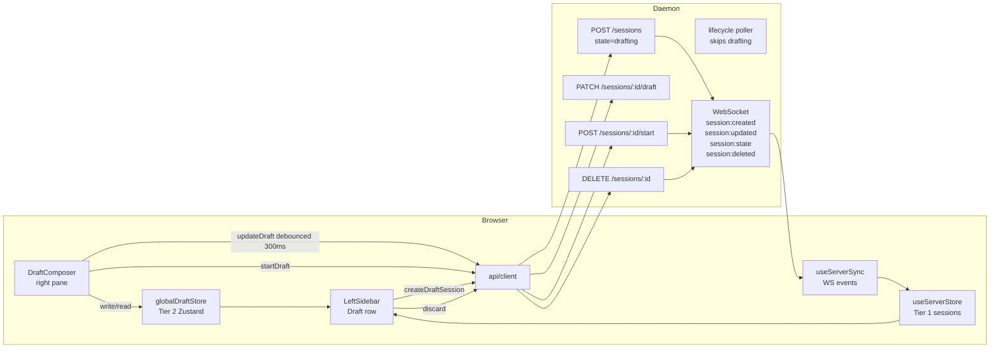

<!--
RULES — read before writing or implementing:
1. FORMAT: Bullets, tables, code, diagrams ONLY — no prose paragraphs
2. REQUIREMENTS: One crisp line each — no verbose descriptions
3. CHECKLIST: Mark items [x] as you complete them — this is your persistent todo list
4. READING TIME: Optimize for fast human scanning — if it's hard to skim, rewrite it
-->

# Instant Draft Agent — Technical Plan

Replace all four "New Agent" modal dialogs with an immediate sidebar draft row + full-pane DraftComposer. Two logical commits: (1) daemon/API, (2) UI.

---

## Change Map

```
daemon/src/
  types.ts                      ~ add "drafting" to LifecycleState; add draftPrompt/draftConfig to SessionRecord
  services/dbSchema.ts          ~ addColumnIfMissing: draftPrompt TEXT, draftConfig TEXT
  state/sqliteRowMappers.ts     ~ map draftPrompt + draftConfig columns
  ws/protocol.ts                ~ add "drafting" to LifecycleState enums; add worktreeId to SessionUpdatedEvent
  routes/sessions.ts            ~ extend POST /sessions; add PATCH /draft; add POST /:id/start; fix DELETE promotion; extend serializeSession
  services/lifecycle.ts         ~ add "drafting" to terminal-state bail-out
docs/
  STATUS-INDICATORS.md          ~ add "drafting" row (same commit as types.ts per AGENTS.md)

web-ui/src/
  api/types.ts                  ~ add "drafting" to SessionState; add draftPrompt/draftConfig to Session; DraftConfig interface
  api/client.ts                 ~ add createDraftSession, updateDraft, startDraft methods
  hooks/useServerSync.ts        ~ add worktreeId, draftPrompt, draftConfig to session:updated whitelist
  store/globalDraftStore.ts      + Zustand slice for Tier 2 localStorage draft (new)
  components/draft/
    DraftComposer.tsx            + full-pane draft composer (new)
    DraftComposer.css            + styles (new)
  components/layout/
    LeftSidebar.tsx              ~ replace dialog opens; render draft rows
    TabsStrip.tsx                ~ replace NewAgentTabDialog open with draft flow
    WorkspaceCanvas.tsx          ~ replace NewAgentTabDialog open with draft flow
  routes/Workspace.tsx           ~ add draft pane rendering + stale-draft redirect
  App.tsx                        ~ add /draft/new and /draft/:draftSessionId routes
  components/ui/statusColor.ts   ~ add "drafting" → no-dot mapping (web-ui file; phase 2 commit)
```

| Today | After this plan |
|-------|-----------------|
| "New Agent" clicks open a blocking modal dialog | Clicks immediately create a sidebar draft row and navigate to right-pane composer |
| Half-written prompts lost on modal dismiss | Tier 1 drafts server-persisted; survive page refresh. Tier 2 uses a reactive Zustand store |
| Four separate dialog components with duplicated field sets | One DraftComposer reusing all existing field components |
| No `"drafting"` lifecycle state | Daemon tracks drafting sessions; lifecycle and PR pollers skip them |

---

## Research

- `LifecycleState` at `daemon/src/types.ts:8-14` — add `"drafting"` to the union; DB `state TEXT NOT NULL` is unconstrained (no CHECK), so no migration required
- `SessionRecord` at `daemon/src/types.ts:289-409` — has `initialPrompt?: string` (cleared on done); add `draftPrompt` + `draftConfig` as distinct fields so `initialPrompt` semantics are preserved; `draftPrompt` feeds `initialPrompt` at start time
- DB schema at `daemon/src/services/dbSchema.ts:53-77` — new columns via `addColumnIfMissing`; existing rows NULL, no backfill
- `serializeSession` at `daemon/src/routes/sessions.ts:381-403` — **explicit field-pick**, not a spread; new fields must be added here or they are silently stripped from the API response (CUJ 6 / PRD R2 resume-after-refresh depends on this)
- `spawnNewSessionForChannel()` at `daemon/src/routes/sessions.ts:331` — module-private; `POST /sessions/:id/start` must live in the same `sessions.ts` file to call it without exporting
- `runMainSpawnJob()` is the job wrapper for worktree spawns; the worktree creation logic is the inline body of `POST /worktrees` handler at `:411-665` (no named helper exists yet)
- `SessionUpdatedEvent` at `daemon/src/ws/protocol.ts:369-388` — explicit field list; currently carries `channel, pinnedAt, name, archivedAt, sortOrder, pr, supersededBy, isMain, parentSessionId` — `worktreeId` is absent and must be added for the draft-promotion flow; `state` transitions travel separately via `session:state` event
- `ws/protocol.ts` LifecycleState appears in **three** inline unions: `SessionCreatedSnapshot` field `state` (`:281`), `SessionCreatedSnapshot` field `lifecycleState` (`:291`), and `SessionStateEvent` `state` (`:326`)
- `useServerSync.ts:265-283` builds `session:updated` patch with an **explicit per-field whitelist** (`channel, pinnedAt, name, archivedAt, sortOrder, pr, supersededBy, isMain, parentSessionId`) — new fields dropped unless added here; `session:created` applies `ev.snapshot` wholesale (no whitelist)
- Store is at `web-ui/src/hooks/useServerStore.ts` (flat Zustand), WS handling at `web-ui/src/hooks/useServerSync.ts` — not `store/serverStore.ts`
- Lifecycle poller bail-outs at `lifecycle.ts:151` (not_started), `lifecycle.ts:158` (done/exited), `lifecycle.ts:163` (json channel) — add `"drafting"` at line 158
- PR poller `prPoller.ts:174` queries only `isMain` sessions — draft sessions are `isMain: false` and automatically excluded; no change needed (per PRD; defensive filter is a S-level suggestion)
- `DELETE /sessions/:id` promotion predicate at `sessions.ts:910-926`: `s.type === "agent" && s.archivedAt == null` — no lifecycle filter; a drafting `"tab"` session is currently eligible for promotion
- `NewAgentTabDialog` has **three** call sites: `TabsStrip.tsx:779`, `WorkspaceCanvas.tsx:1499`, and `Workspace.tsx:616` (keyboard shortcut)
- CSS token names from `web-ui/src/styles/tokens.css`: `--font-size-lg` / `--font-size-sm` (`:11-17`), `--accent` (`:73`), `--destructive-soft` for error text (`:110`), `--destructive-muted` for error background, `--radius-sm` for border-radius (`:41`) — no `--fg-accent`, `--text-lg`, `--text-sm`, `--bg-error-subtle`, `--border-error`, `--fg-error`, `--radius-sm`
- Sidebar stretch link class: `wt-row__stretch-link` (`workspace.css:722`), not `tree-row__stretch-link`; chip classes are namespaced (`project-chip`, etc.) — no generic `chip` base class
- `"drafting"` added to `SessionState` breaks three exhaustiveness sites: `web-ui/src/lib/worktreeStatus.ts:33` (`sessionStatus()` function + rank map at `:17`), `web-ui/src/components/layout/LeftSidebar.tsx:145` (local `sessionStateToStatus`), `web-ui/src/components/chat/SubagentRow.tsx:14` (local `sessionStateToStatus`); all three must map `"drafting"` → `"none"` (no dot, no active status)
- Status color file is `web-ui/src/lib/statusColor.ts` (not `components/ui/statusColor.ts`); function `resolveStatusClass` is keyed on `WorktreeRolledUpStatus`, not `SessionState` — no direct change needed there; the three sites above are what must change
- Dialog test files live beside their components in `web-ui/src/components/dialogs/`: `NewAgentDialog.attachments.test.tsx`, `.branch-optional.test.tsx`, `.create-json.test.tsx`, `.draft.test.tsx`, `.focus.test.tsx`, `.noMainSession.test.tsx`, `.path-suggestions.test.tsx` (7 files); `NewAgentDirectDialog.attachments.test.tsx`, `.focus.test.tsx` (2 files); `NewAgentSessionDialog.test.tsx`, `NewAgentSessionDialog.channel.test.tsx` (2 files); `NewAgentTabDialog.attachments.test.tsx`, `NewAgentTabDialog.channel.test.tsx` (2 files) — 13 files total; `LeftSidebar.test.tsx` is at `web-ui/src/components/layout/LeftSidebar.test.tsx`; `TabsStrip.test.tsx` has zero references to NewAgentTabDialog and needs no changes
- `POST /sessions` worktree arm (sessions.ts:54-88) accepts `worktreeId`, not `projectId`; server must derive `projectId` from `worktreeId` lookup before running the dedupe scan; both arms (worktree and direct) dedupe by `projectId` after derivation (PRD: max-1 draft per project)
- DB `CHECK (isMain = 0 OR worktreeId IS NOT NULL)` at `dbSchema.ts:56` — `worktreeId` and `isMain` must be set in the same atomic write

---

## Architecture Diagram



---

## Design Details

### CUJs

**1. "Agent in worktree" → draft → start (happy path)**

```mermaid
sequenceDiagram
  participant U as User
  participant SB as Sidebar
  participant DC as DraftComposer
  participant D as Daemon

  U->>SB: click "+" → "Agent in worktree"
  SB->>D: POST /sessions {state:"drafting", projectId, type:"agent", draftConfig:{entryPoint:"worktree",worktreeChoice:"new"}}
  D-->>SB: 201 {id, state:"drafting", draftConfig}
  D->>SB: WS session:created snapshot (draftPrompt+draftConfig included)
  SB->>DC: navigate /draft/:id (optimistic before POST resolves)
  U->>DC: types prompt; selects mode, branch
  DC->>D: PATCH /sessions/:id/draft {draftPrompt, draftConfig} (debounced 300ms)
  D-->>DC: 200 {ok:true, name:"first five words…"}
  D->>SB: WS session:updated {name} — sidebar label updates
  U->>DC: clicks ▶ Start
  DC->>D: POST /sessions/:id/start {draftPrompt, draftConfig}
  D->>D: createWorktreeRecord(); update session worktreeId+isMain+state="not_started"; set initialPrompt; spawn
  D-->>DC: 200 {ok:true, worktreeId}
  D->>SB: WS worktree:created; session:updated {worktreeId, isMain:true}; session:state {state:"not_started"}
  DC->>SB: navigate /worktree/:worktreeId
```

**2. Global new → no project (Tier 2 localStorage)**

```
User clicks global "+ New Agent"
  → globalDraftStore.setDraft({ draftPrompt: "", draftConfig: { entryPoint: "global" } })
  → navigate to /draft/new
  → DraftComposer reads globalDraftStore; sidebar reads globalDraftStore → shows top-level draft row
  → User types prompt → globalDraftStore.setDraft({ draftPrompt })
  → User types a new project name (not existing) → row stays top-level
  → User clicks ▶ Start
    → UI calls createProject (new name) + createWorktree or createDirectSession
    → navigate to /worktree/:id or /session/:id
    → globalDraftStore.clearDraft()
```

**3. Global new → existing project selected (Tier 2 → Tier 1 upgrade)**

```
User at /draft/new selects existing project from combobox
  → POST /sessions {state:"drafting", projectId, draftConfig:{entryPoint:"global"}}
  → 409? → globalDraftStore.clearDraft(); navigate to /draft/:existingId
  → 201? → globalDraftStore.clearDraft()
           sidebar row moves from top-level to under the selected project (via WS session:created)
           navigate to /draft/:newId
  → user fills config; clicks ▶ Start → POST /sessions/:id/start
```

**4. Duplicate draft (409)**

```
User clicks "+" on project that already has a drafting session
  → POST /sessions returns 409 { existingSessionId }
  → navigate to /draft/:existingSessionId
  → No new row created
```

**5. Discard draft**

```
User clicks [×] on draft row
  → Tier 1: api.terminateSession(id) (DELETE /sessions/:id)
  → Tier 2: globalDraftStore.clearDraft()
  → if location.pathname === "/draft/:id": navigate to /
  → WS session:deleted → store removes session → row disappears
```

**6. Start fails (network error)**

```
POST /sessions/:id/start fails
  → error state set; error banner shown above bottom bar
  → fields re-enabled; ▶ Start restored; spinner gone
  → Session remains "drafting" in store; row stays as draft badge
```

**7. Stale draft route (back button after start)**

```
Browser back navigates to /draft/:id where session.lifecycle.state !== "drafting"
  → DraftComposer detects: session exists but state !== "drafting"
  → if session has worktreeId: redirect to /worktree/:worktreeId
  → else if session.projectId: redirect to /session/:id
  → else: redirect to /
```

---

### Data Model

| Entity | Field | Type | Constraints | Notes |
|--------|-------|------|-------------|-------|
| sessions (DB) | `draftPrompt` | TEXT | NULL | Raw prompt while drafting; cleared on start (set to NULL) |
| sessions (DB) | `draftConfig` | TEXT | NULL | JSON DraftConfig; cleared on start |
| SessionRecord (TS) | `draftPrompt` | `string?` | — | Mirror of DB column |
| SessionRecord (TS) | `draftConfig` | `DraftConfig?` | — | Parsed JSON |

Migration: `addColumnIfMissing` — existing rows NULL, no backfill.

**`DraftConfig` shape:**

```typescript
interface DraftConfig {
  entryPoint: "worktree" | "direct" | "tab" | "global";
  modeId?: string;
  channel?: "tmux" | "pty" | "json";
  // worktree/global-with-worktree
  worktreeChoice?: "new" | "existing";
  existingWorktreeId?: string;
  branch?: string;
  baseBranch?: string;
  useTmux?: boolean;
  // global entry point
  useWorktree?: boolean;
}
// projectId and worktreeId are on SessionRecord — not duplicated in DraftConfig
```

---

### API Contracts

**`POST /sessions`** — extended (sessions.ts:523)

New optional fields on request body:
```typescript
{
  state?: "drafting";
  draftPrompt?: string;
  draftConfig?: DraftConfig;
}
```
- When `state === "drafting"`: before insert, scan in-memory project store for an existing `"drafting"` session with the same `projectId`; if found → `409 { existingSessionId: id }`; otherwise create `SessionRecord` with `lifecycle.state = "drafting"`, persist, broadcast `session:created` with snapshot — **no spawn**; return 201
- Scan in-memory store (not raw SQL) to stay consistent with other route handlers' pattern (`findSessionContext` / `mutateProject`)
- `state` absent or `"not_started"`: existing behavior unchanged

**`PATCH /sessions/:id/draft`** — new route (sessions.ts)

```typescript
// Request
{ draftPrompt?: string; draftConfig?: DraftConfig }

// Response 200
{ ok: true; name: string | null }   // name = first 5 words of draftPrompt cleaned text, or null

// Errors
403  session not in "drafting" state
404  session not found
```
- Persists `draftPrompt` and `draftConfig`; derives and persists `name` + sets `nameSource: "auto"` atomically via `mutateProject`
- Broadcasts `session:updated { name }` so other tabs see live label

**`POST /sessions/:id/start`** — new route (sessions.ts)

```typescript
// Request
{ draftPrompt: string; draftConfig: DraftConfig }

// Response 200
{ ok: true; worktreeId?: string }

// Errors
400  draftPrompt is empty
403  session not in "drafting" state
404  session not found
500  spawn or worktree creation failed
```

Behavior by `entryPoint` (all branches: clear `draftPrompt`/`draftConfig` from DB, set `initialPrompt = draftPrompt`):
- `"direct"` / `"tab"` / `"worktree"` with `worktreeChoice:"existing"`: update `state = "not_started"`, clear draft fields; call `spawnNewSessionForChannel()` (same file, line 331)
- `"worktree"` with `worktreeChoice:"new"` / `"global"` with `useWorktree:true`: call `createWorktreeRecord()` (new helper); then in a single `mutateProject` write: `session.worktreeId = wt.id`, `session.isMain = true`, `session.lifecycle.state = "not_started"`, clear draft fields (satisfies the DB CHECK constraint — worktreeId and isMain set atomically); broadcast `worktree:created` + `session:updated { worktreeId, isMain:true }` + `session:state { state:"not_started" }`; for JSON channel call `startJsonCreateTurn(session.id, draftPrompt, [])` after spawn
- `"global"` with `useWorktree:false`: same as `"direct"` path
- All paths: for terminal-channel sessions pass `draftPrompt` via `initialPrompt` (same as `POST /sessions` normal path at `:661`)

**`serializeSession`** — extend (sessions.ts:381)

Add to the returned object:
```typescript
draftPrompt: s.draftPrompt ?? null,
draftConfig: s.draftConfig ?? null,
```

**`SessionUpdatedEvent`** — extend (ws/protocol.ts:369)

Add optional field:
```typescript
worktreeId?: string   // set on draft-promotion (draft→real worktree session)
```

---

### Key Decisions

#### Decision 1: `"drafting"` in LifecycleState vs. a separate `isDraft` boolean
- **Decision:** Add `"drafting"` to `LifecycleState`
- **Rationale:** All existing poller/filter code branches on lifecycle state; a boolean would require duplicating every branch
- **Where:** `daemon/src/types.ts:8`

#### Decision 2: Extract `createWorktreeRecord()` shared helper
- **Decision:** Extract git-dir + WorktreeRecord creation from inline `POST /worktrees` handler body (`:411-665`) into `daemon/src/services/worktreeService.ts`
- **Rationale:** `POST /sessions/:id/start` for the worktree case needs to create a worktree without creating a new main session; the existing handler creates them together; DRY extraction lets both call the same path
- **Where:** `daemon/src/routes/worktrees.ts:411` (extraction source) → `daemon/src/services/worktreeService.ts` (new)

```typescript
export async function createWorktreeRecord(
  db: Database,
  project: ProjectRecord,
  opts: { branch?: string; baseBranch?: string; name?: string }
): Promise<WorktreeRecord>
// Creates git worktree dir + inserts WorktreeRecord in DB. Does NOT create a session.
```

#### Decision 3: Tier 2 uses a Zustand store slice for reactivity
- **Decision:** `web-ui/src/store/globalDraftStore.ts` — a separate Zustand store persisting `{ draftPrompt, draftConfig }` to localStorage; both `DraftComposer` and `LeftSidebar` subscribe to it
- **Rationale:** `localStorage` write in one component doesn't trigger React re-renders in another (storage events fire only cross-tab). A store slice solves reactivity without a context tree
- **Where:** `web-ui/src/store/globalDraftStore.ts` (new)

```typescript
interface GlobalDraftState {
  draft: { draftPrompt: string; draftConfig: DraftConfig } | null;
  setDraft: (d: GlobalDraftState["draft"]) => void;
  clearDraft: () => void;
}
// Use zustand/middleware/persist with localStorage key "vst-global-draft"
```

#### Decision 4: DraftComposer renders outside PaneHostLayer
- **Decision:** `DraftComposer` is rendered directly in `Workspace.tsx` for `/draft/*` routes, not via the pane portal system
- **Rationale:** Draft is a config form with no live agent stream; portaling it adds complexity with zero benefit
- **Where:** `web-ui/src/routes/Workspace.tsx`

#### Decision 5: Draft rows inline in LeftSidebar.tsx
- **Decision:** No separate `DraftRow.tsx` file; draft rows inline following existing sidebar row patterns
- **Rationale:** All sidebar rows are inline; a separate file would be inconsistent
- **Where:** `web-ui/src/components/layout/LeftSidebar.tsx`

#### Decision 6: `POST /sessions/:id/start` lives in sessions.ts
- **Decision:** New route added to `daemon/src/routes/sessions.ts`, same file as `spawnNewSessionForChannel` (`:331`)
- **Rationale:** `spawnNewSessionForChannel` is module-private; keeping start in the same file avoids breaking encapsulation
- **Where:** `daemon/src/routes/sessions.ts`

#### Decision 7: Tier 2 new-project Start is client-side
- **Decision:** For global-new with an entirely new project name, Start calls `createProject` + `createWorktree`/`createDirectSession` directly (same as today's `NewAgentDialog` flow) rather than going through `POST /sessions/:id/start`
- **Rationale:** No server draft session exists for Tier 2; `POST /sessions/:id/start` only applies to Tier 1 (server-persisted drafts)
- **Where:** `web-ui/src/components/draft/DraftComposer.tsx`

---

## Implementation Phases

### Phase 1 — Daemon + API (Commit 1: `feat(daemon): add drafting lifecycle state and draft session APIs`)

- [x] **1.1** `daemon/src/types.ts:8` — add `"drafting"` to `LifecycleState` union
- [x] **1.2** `daemon/src/types.ts:289` — add `draftPrompt?: string` and `draftConfig?: DraftConfig` to `SessionRecord`; add `DraftConfig` interface (shape in Data Model above)
- [x] **1.3** `docs/STATUS-INDICATORS.md` — add `drafting` row (status = drafting, no dot, description = "Agent is being configured; not yet started")
- [x] **1.4** `daemon/src/services/dbSchema.ts` — add two `addColumnIfMissing` calls after existing migration calls: `draftPrompt TEXT` and `draftConfig TEXT` on the `sessions` table
- [x] **1.5** `daemon/src/state/sqliteRowMappers.ts` — extend `SessionRow` interface with `draftPrompt: string | null` and `draftConfig: string | null`; in `rowToSession`: parse `row.draftConfig ? JSON.parse(row.draftConfig) as DraftConfig : undefined`; in `sessionToRow`: `draftConfig: session.draftConfig ? JSON.stringify(session.draftConfig) : null`
- [x] **1.6** `daemon/src/ws/protocol.ts` — add `"drafting"` to three inline LifecycleState unions: `SessionCreatedSnapshot` field `state` (`:281`), `SessionCreatedSnapshot` field `lifecycleState` (`:291`), `SessionStateEvent` field `state` (`:326`); also add `worktreeId?: string` to `SessionUpdatedEvent` (`:369`)
- [x] **1.7** `daemon/src/services/worktreeService.ts` — new file; extract git-dir creation + WorktreeRecord insert from the `POST /worktrees` handler inline body (`worktrees.ts:411-665`) into `createWorktreeRecord(db, project, opts)` as described in Decision 2; update `worktrees.ts` handler to call `createWorktreeRecord()` (no behavior change; add regression test at 1.T6)
- [x] **1.8** `daemon/src/routes/sessions.ts` — `POST /sessions`:
  - Extend request body type to accept `state?: "drafting"`, `draftPrompt?: string`, `draftConfig?: DraftConfig`
  - Add `"drafting"` branch:
    - For the **direct arm** (`target:"direct"`): `body.projectId` is present; use it directly for the dedupe scan
    - For the **worktree arm** (default, `body.worktreeId` present): derive `projectId` via `findWorktreeContext(body.worktreeId).project.id` (same lookup already done on the normal path) before the dedupe scan
    - Scan in-memory project store for any session with `projectId === derivedProjectId && lifecycle.state === "drafting" && !archivedAt`; if found → return `409 { existingSessionId }`
  - Create `SessionRecord` with `lifecycle.state = "drafting"`, `draftPrompt`, `draftConfig`; do NOT call spawn; broadcast `session:created` with snapshot; return 201
  - Existing `"not_started"` path unchanged
- [x] **1.9** `daemon/src/routes/sessions.ts` — extend `serializeSession` (`:381`): add `draftPrompt: s.draftPrompt ?? null` and `draftConfig: s.draftConfig ?? null` to the returned object
- [x] **1.10** `daemon/src/routes/sessions.ts` — add `PATCH /sessions/:id/draft`:
  - Body: `{ draftPrompt?: string; draftConfig?: DraftConfig }`
  - Verify `session.lifecycle.state === "drafting"` → 403 otherwise
  - Persist `draftPrompt`, `draftConfig`, derived `name` (first 5 words of cleaned draftPrompt), `nameSource: "auto"` atomically via `mutateProject`
  - Broadcast `session:updated { name }`; return `{ ok: true, name }`
- [x] **1.11** `daemon/src/routes/sessions.ts` — add `POST /sessions/:id/start`:
  - Verify `"drafting"` state; 400 if `body.draftPrompt` empty after trim
  - Set `session.initialPrompt = body.draftPrompt` before all branches
  - Branch on `body.draftConfig.entryPoint` (see API Contracts above for full branch table)
  - **worktree-new branch**: call `createWorktreeRecord()`; then `mutateProject` atomically sets `session.worktreeId = wt.id`, `session.isMain = true`, `session.lifecycle.state = "not_started"` and clears `draftPrompt`/`draftConfig` (DB CHECK: worktreeId + isMain must be written together); broadcast `worktree:created`, `session:updated { worktreeId, isMain:true }`, `session:state { state:"not_started" }`; for JSON channel call `startJsonCreateTurn(session.id, body.draftPrompt, [])` after spawn
  - **direct/tab/existing-wt branch**: `mutateProject` → `state = "not_started"`, clear draft fields; call `spawnNewSessionForChannel(session, ...)` (same file, `:331`)
  - Return `{ ok: true, worktreeId? }`
- [x] **1.12** `daemon/src/routes/sessions.ts` — `DELETE /sessions/:id` promotion predicate (`sessions.ts:910-926`): add `&& s.lifecycle.state !== "drafting"` to the agent-session eligibility filter so drafting sessions are never promoted to `isMain` on deletion of another session
- [x] **1.13** `daemon/src/services/lifecycle.ts:158` — change bail-out guard to: `if (state === "done" || state === "exited" || state === "drafting") return;`

**Verify phase 1:**
- [x] **1.T1** Integration — `POST /sessions` with `state:"drafting"`: session created in DB with state=drafting, draftPrompt/draftConfig persisted; no tmux process started; response includes `state:"drafting"`, `draftConfig`
- [x] **1.T2** Integration — `POST /sessions` with `state:"drafting"` twice for same projectId: second returns 409 with `existingSessionId`
- [x] **1.T3** Integration — `GET /sessions/:id` on a drafting session: response includes `draftPrompt` and `draftConfig` (serializeSession extended)
- [x] **1.T4** Integration — `PATCH /sessions/:id/draft`: updates draftPrompt; returns derived name; 403 if session not drafting
- [x] **1.T5** Integration — `POST /sessions/:id/start` (direct entryPoint): session transitions to not_started; draftConfig null in DB; daemon spawns agent with initialPrompt set; 400 on empty prompt
- [x] **1.T6** Integration — `POST /sessions/:id/start` (worktree-new entryPoint): WorktreeRecord created; session gets worktreeId + isMain=true + state=not_started atomically; CHECK constraint not violated
- [x] **1.T7** Regression — `POST /worktrees` still works end-to-end after createWorktreeRecord extraction; worktree + mainSession both appear in DB
- [x] **1.T8** Regression — `POST /sessions` without `state` field: existing not_started + spawn behavior unchanged
- [x] **1.T9** Unit — lifecycle poller: `pollSession()` returns early for `lifecycle.state === "drafting"` with no tmux lookup
- [x] **1.T10** Integration — `DELETE /sessions/:id` on main session of a worktree that also has a drafting session: drafting session is NOT promoted to isMain; a non-drafting agent session is promoted if available

---

### Phase 2 — UI (Commit 2: `feat(ui): instant draft agent — replace new-agent dialogs with draft composer`)

- [x] **2.1** `web-ui/src/api/types.ts` — add `"drafting"` to `SessionState` union; add `draftPrompt?: string | null` and `draftConfig?: DraftConfig | null` to `Session`; add `DraftConfig` interface (mirror of daemon type); add `CreateDraftSessionBody` type: `{ projectId?: string; worktreeId?: string; type: "agent"; draftConfig: DraftConfig }`
- [x] **2.2** `web-ui/src/api/client.ts` — add to `createClientApi()`:
  - `createDraftSession(body: CreateDraftSessionBody): Promise<Session>` → `POST /sessions` with `state:"drafting"`; on 409 throw or return `{ existingSessionId }` (caller decides nav)
  - `updateDraft(id: string, body: { draftPrompt?: string; draftConfig?: DraftConfig }): Promise<{ ok: true; name: string | null }>` → `PATCH /sessions/:id/draft`
  - `startDraft(id: string, body: { draftPrompt: string; draftConfig: DraftConfig }): Promise<{ ok: true; worktreeId?: string }>` → `POST /sessions/:id/start`
- [x] **2.3** `web-ui/src/hooks/useServerSync.ts:265-283` — extend the `session:updated` whitelist: add `worktreeId`, `draftPrompt`, `draftConfig` to the patch fields applied in `applySessionUpdated`
- [x] **2.4** `web-ui/src/store/globalDraftStore.ts` — new file; implement `GlobalDraftStore` Zustand slice persisted to localStorage key `"vst-global-draft"` (see Decision 3 for shape); export `useGlobalDraftStore` hook
- [x] **2.5** Fix the three `SessionState` exhaustiveness sites — all must map `"drafting"` → `"none"` (no dot, no active status):
  - `web-ui/src/lib/worktreeStatus.ts:33` — in `sessionStatus(state: SessionState)` add `case "drafting": return "none";`; also add `"none"` rank entry in the rank map at `:17` if not already present
  - `web-ui/src/components/layout/LeftSidebar.tsx:145` — in local `sessionStateToStatus` add `case "drafting": return "none";`
  - `web-ui/src/components/chat/SubagentRow.tsx:14` — in local `sessionStateToStatus` add `case "drafting": return "none";`
- [x] **2.6** `web-ui/src/App.tsx` — add inside existing router: `<Route path="/draft/new" element={<Workspace />} />` and `<Route path="/draft/:draftSessionId" element={<Workspace />} />`
- [x] **2.7** `web-ui/src/routes/Workspace.tsx` — detect `/draft/*`:
  ```typescript
  const isDraft = location.pathname.startsWith("/draft/");
  const { draftSessionId } = useParams<{ draftSessionId?: string }>();
  ```
  When `isDraft`: render `<DraftComposer>` in the main content area instead of the normal pane slot
  Also: if route is `/draft/:draftSessionId` and the session exists in store but `session.lifecycle.state !== "drafting"`: redirect (see CUJ 7: to `/worktree/:worktreeId` if has worktreeId, else `/session/:id`, else `/`)
- [x] **2.8** Create `web-ui/src/components/draft/DraftComposer.tsx`:

  **Props:**
  ```typescript
  interface DraftComposerProps {
    api: ApiInstance;
    draftSessionId: string | null;    // null = /draft/new (Tier 2)
    onStarted: (result: { worktreeId?: string; sessionId: string }) => void;
    onDiscard: () => void;
  }
  ```

  **State:** `modeId`, `channel`, `worktreeChoice`, `branch`, `baseBranch`, `existingWorktreeId`, `useTmux`, `useWorktree`, `projectComboValue` (for global), `prompt`, `files`, `modes`, `worktrees`, `branches`, `clis`, `submitting`, `error`

  **On mount:**
  - Load `modes` (always), `clis` (always), `worktrees` (entryPoint=worktree), `branches` (entryPoint=worktree/global with project)
  - If `draftSessionId` non-null: read session from `useServerStore`; pre-fill `prompt` from `session.draftPrompt`, all config fields from `session.draftConfig`
  - If Tier 2: read from `useGlobalDraftStore()`

  **Prompt change handler** (debounced 300ms):
  - Tier 1: call `api.updateDraft(draftSessionId, { draftPrompt: prompt, draftConfig: currentConfig })`
  - Tier 2: `globalDraftStore.setDraft({ draftPrompt: prompt, draftConfig: currentConfig })`

  **Layout structure:**
  ```
  .draft-composer                     flex column, height 100%
    .draft-composer__body             flex 1, overflow-y auto, padding var(--space-6)
      h2.draft-composer__title        e.g. "New agent" or "New direct agent — my-project"
      <hr class="draft-composer__divider">
      .draft-composer__fields         flex column, gap var(--space-4)
        [entry-point fields — see PRD entry point presets table]
        [For global: project combobox with Browse button + optional Directory input]
        [For worktree: Worktree radio New|Existing, Branch input, Base branch select/input]
        [All: Mode select + NewModeDialog button, Channel radio, useTmux checkbox]
    .draft-composer__bar              flex-shrink 0, border-top, padding var(--space-3) var(--space-4)
      .chat-composer                  reuse existing class for consistent input look
        [AttachmentPicker]
        SkillEditor placeholder="What should this agent do?"
        <button class="draft-composer__start">▶ Start</button>
  ```

  **Start handler (Tier 1):** validate prompt non-empty; set `submitting=true`; call `api.startDraft(draftSessionId, { draftPrompt: prompt, draftConfig })`; on success call `onStarted`; on error set `error` state, re-enable fields

  **Start handler (Tier 2, existing project selected / promoted to Tier 1):** same as Tier 1 via the promoted session ID

  **Start handler (Tier 2, new project name):** call `api.createProject({ name, path: directory })` if project doesn't exist; then `api.createWorktree(...)` or `api.createDirectSession(...)`; call `globalDraftStore.clearDraft()`; call `onStarted`

  **Global entry point — project combobox onChange:**
  - If selecting an existing project: call `api.createDraftSession({ projectId, type:"agent", draftConfig: currentConfig })` → on 201 `clearDraft(); navigate("/draft/" + newId)`; on 409 `clearDraft(); navigate("/draft/" + existingId)`
  - If deselecting / clearing to new project name: if there was a promoted session ID, call `api.terminateSession(id)`; navigate back to `/draft/new`

  **All field components:** import unchanged from existing locations — `SkillEditor` (`../chat/SkillEditor`), `AttachmentPicker` (`../chat/AttachmentPicker`), `Select` (`../ui/Select`), `Input` (`../ui/Input`), `Radio` (`../ui/Radio`), `NewModeDialog` (`../dialogs/NewModeDialog`), project combobox from `NewAgentDialog` (extract as a standalone `ProjectCombobox` component or copy the JSX pattern)

- [x] **2.9** Create `web-ui/src/components/draft/DraftComposer.css`:
  ```css
  /* Using existing token names from tokens.css */
  .draft-composer { display: flex; flex-direction: column; height: 100%; background: var(--bg-primary); }
  .draft-composer__body { flex: 1 1 auto; overflow-y: auto; padding: var(--space-6); display: flex; flex-direction: column; gap: var(--space-4); }
  .draft-composer__title { font-size: var(--font-size-lg); font-weight: 600; color: var(--fg-primary); margin: 0 0 var(--space-2); }
  .draft-composer__divider { height: 1px; background: var(--border-subtle); border: none; margin: var(--space-1) 0; }
  .draft-composer__fields { display: flex; flex-direction: column; gap: var(--space-4); }
  .draft-composer__field-label { font-size: var(--font-size-sm); font-weight: 500; color: var(--fg-secondary); margin-bottom: var(--space-1); }
  .draft-composer__bar { flex-shrink: 0; border-top: 1px solid var(--border-subtle); padding: var(--space-3) var(--space-4); background: var(--bg-primary); }
  .draft-composer__start { /* matches existing primary action button style */ }
  .draft-composer__error { background: var(--destructive-muted); border-radius: var(--radius-sm); padding: var(--space-2) var(--space-3); color: var(--destructive-soft); font-size: var(--font-size-sm); margin-bottom: var(--space-3); }
  /* Draft chip: reuse existing namespaced chip pattern from the codebase */
  .draft-chip { display: inline-flex; align-items: center; gap: var(--space-1); font-size: var(--font-size-xs); padding: 1px var(--space-1); border-radius: var(--radius-sm); background: var(--accent); opacity: 0.7; color: var(--bg-primary); pointer-events: none; }
  /* Draft discard button */
  .draft-row__discard { display: flex; align-items: center; justify-content: center; width: 16px; height: 16px; border-radius: var(--radius-sm); border: none; background: transparent; color: var(--fg-muted); cursor: pointer; flex-shrink: 0; }
  .draft-row__discard:hover { background: var(--bg-hover); color: var(--fg-primary); }
  ```
  Import: `import "./DraftComposer.css";` at the top of `DraftComposer.tsx`

- [x] **2.10** `web-ui/src/components/layout/LeftSidebar.tsx` — Tier 1 entry point wiring:
  - Replace `setAddProjectOpen(true)` (global "Create new agent") with: check `useGlobalDraftStore` for existing draft → navigate to `/draft/new` (store already has the draft) OR write new draft to store and navigate to `/draft/new`
  - Replace `setNewSessProject(project)` ("Agent in worktree") with: `api.createDraftSession({ projectId: project.id, type:"agent", draftConfig:{ entryPoint:"worktree", worktreeChoice:"new" } })` → navigate to `/draft/:newId`; on 409 → navigate to `/draft/:existingId`
  - Replace `setDirectAgentProject(project)` ("Agent in project dir") with: same pattern, `entryPoint:"direct"`
  - Remove state vars `newSessProject`, `directAgentProject`, `addProjectOpen`
  - Remove renders of `<NewAgentSessionDialog>`, `<NewAgentDialog>`, `<NewAgentDirectDialog>`

- [x] **2.11** `web-ui/src/components/layout/LeftSidebar.tsx` — Tier 1 draft row rendering:
  - In each project's session list, render Tier 1 draft rows **outside** the `sortOrder`-sorted list (append after sorted items to avoid sort-order conflicts with `sortOrder ?? 0`)
  - Per-draft row:
    ```jsx
    <div className="tree-row tree-row--direct-session"
         data-active={location.pathname === `/draft/${s.id}`}>
      <Link to={`/draft/${s.id}`} className="wt-row__stretch-link" />
      <span className="direct-session__label">{draftLabel(s.draftPrompt)}</span>
      <span className="draft-chip">Draft</span>
      <button className="draft-row__discard icon-btn"
              onClick={(e) => { e.preventDefault(); void handleDiscard(s); }}
              title="Discard draft">×</button>
    </div>
    ```
  - `draftLabel(p?: string | null)` = first 5 words of p, or `"New agent…"` if empty/null
  - `handleDiscard(s)` = `api.terminateSession(s.id)`.then(() => { if on `/draft/${s.id}` → navigate(`/`) })

- [x] **2.12** `web-ui/src/components/layout/LeftSidebar.tsx` — Tier 2 draft row rendering:
  - `const globalDraft = useGlobalDraftStore(s => s.draft)` at top of component
  - Render a top-level row (sibling to projects) when `globalDraft !== null`:
    ```jsx
    <div className="tree-row tree-row--direct-session"
         data-active={location.pathname === "/draft/new"}>
      <Link to="/draft/new" className="wt-row__stretch-link" />
      <span className="direct-session__label">{draftLabel(globalDraft.draftPrompt)}</span>
      <span className="draft-chip">Draft</span>
      <button className="draft-row__discard icon-btn"
              onClick={(e) => { e.preventDefault(); globalDraftStore.clearDraft(); if on "/draft/new" → navigate("/"); }}
              title="Discard draft">×</button>
    </div>
    ```
  - Position: render in the projects section, above the project list (top-level sibling)

- [x] **2.13** `web-ui/src/components/layout/TabsStrip.tsx:779` — replace `setNewAgentOpen(true)` (or equivalent) with: `api.createDraftSession({ worktreeId: currentWorktreeId, type:"agent", draftConfig:{ entryPoint:"tab" } })`.then(s => navigate(`/draft/${s.id}`)); on 409 → navigate to `/draft/${existingId}`; remove `<NewAgentTabDialog>` render
- [x] **2.14** `web-ui/src/components/layout/WorkspaceCanvas.tsx:1499` — same pattern as 2.13
- [x] **2.15** `web-ui/src/routes/Workspace.tsx:616` — keyboard shortcut for new agent tab: same pattern as 2.13 (third call site of NewAgentTabDialog)
- [x] **2.16** Delete the four dialog source files (no longer imported):
  - `web-ui/src/components/dialogs/NewAgentSessionDialog.tsx`
  - `web-ui/src/components/dialogs/NewAgentDialog.tsx`
  - `web-ui/src/components/dialogs/NewAgentDirectDialog.tsx`
  - `web-ui/src/components/dialogs/NewAgentTabDialog.tsx`
  Delete all 13 associated test files from `web-ui/src/components/dialogs/`:
  - `NewAgentDialog.attachments.test.tsx`, `NewAgentDialog.branch-optional.test.tsx`, `NewAgentDialog.create-json.test.tsx`, `NewAgentDialog.draft.test.tsx`, `NewAgentDialog.focus.test.tsx`, `NewAgentDialog.noMainSession.test.tsx`, `NewAgentDialog.path-suggestions.test.tsx`
  - `NewAgentDirectDialog.attachments.test.tsx`, `NewAgentDirectDialog.focus.test.tsx`
  - `NewAgentSessionDialog.test.tsx`, `NewAgentSessionDialog.channel.test.tsx`
  - `NewAgentTabDialog.attachments.test.tsx`, `NewAgentTabDialog.channel.test.tsx`
  Update `web-ui/src/components/layout/LeftSidebar.test.tsx`: remove dialog-open assertions; add draft-row assertions per 2.T5/2.T6

**Verify phase 2:**
- [ ] **2.T1** Unit — `DraftComposer.tsx`: renders config fields for `entryPoint:"worktree"`; renders project combobox for `entryPoint:"global"`; ▶ Start disabled when prompt empty
- [ ] **2.T2** Unit — `DraftComposer.tsx`: `onStarted` called with correct `worktreeId` on successful `api.startDraft` mock
- [ ] **2.T3** Unit — `DraftComposer.tsx`: error banner shown and Start re-enabled when `api.startDraft` rejects
- [ ] **2.T4** Unit — `globalDraftStore.ts`: `setDraft` persists to localStorage; `clearDraft` removes the key; store is reactive (component re-renders on change)
- [ ] **2.T5** Unit — `LeftSidebar.test.tsx`: draft row appears after `session:created` WS event with `state:"drafting"`; clicking [×] calls `terminateSession`; clicking the row navigates to `/draft/:id`
- [ ] **2.T6** Unit — `LeftSidebar.test.tsx`: Tier 2 draft row appears when `globalDraftStore` has a draft; disappears on `clearDraft()`
- [ ] **2.T7** Manual — click "+" → "Agent in worktree": sidebar immediately shows draft row under project; right pane shows DraftComposer with worktree fields pre-filled; **no modal appears**
- [ ] **2.T8** Manual — global "+ New Agent": top-level draft row appears; selecting an existing project in combobox moves row under that project; URL changes to `/draft/:id`
- [ ] **2.T9** Manual — type prompt in DraftComposer: sidebar draft row label updates within ~400ms
- [ ] **2.T10** Manual — click ▶ Start for worktree draft: spinner; navigates to `/worktree/:id`; session appears without Draft chip
- [ ] **2.T11** Manual — navigate away from `/draft/:id`; click collapsed draft badge: composer reopens with saved prompt/config
- [ ] **2.T12** Manual — two browser tabs: create draft in tab 1; tab 2 shows collapsed badge row from WS event
- [ ] **2.T13** Manual — "+ New Tab" inside a worktree: DraftComposer opens in tab area; no modal
- [ ] **2.T14** Manual — back button after Start: stale `/draft/:id` redirects to `/worktree/:id` or `/session/:id`
- [ ] **2.T15** Regression — existing non-draft sessions render correctly with status dots; existing started sessions unaffected
- [ ] **2.T16** Regression — `TabsStrip.test.tsx` passes after dialog removal

---

## Files & Phase Impact

| File | Status | Phase | Description / Contract Change |
|------|--------|-------|-------------------------------|
| `daemon/src/types.ts` | Modified | 1.1, 1.2 | Add `"drafting"` to `LifecycleState`; add `draftPrompt?`, `draftConfig?`, `DraftConfig` to `SessionRecord` |
| `docs/STATUS-INDICATORS.md` | Modified | 1.3 | Add `drafting` row |
| `daemon/src/services/dbSchema.ts` | Modified | 1.4 | Two `addColumnIfMissing` calls: `draftPrompt TEXT` and `draftConfig TEXT` |
| `daemon/src/state/sqliteRowMappers.ts` | Modified | 1.5 | Map `draftPrompt` (string passthrough) + `draftConfig` (JSON parse/stringify) |
| `daemon/src/ws/protocol.ts` | Modified | 1.6 | `"drafting"` in three LifecycleState unions; `worktreeId?: string` in `SessionUpdatedEvent` |
| `daemon/src/services/worktreeService.ts` | New | 1.7 | Contract: `createWorktreeRecord(db, project, opts): Promise<WorktreeRecord>` — git dir + DB record; no session |
| `daemon/src/routes/worktrees.ts` | Modified | 1.7 | Call `createWorktreeRecord()` instead of inline logic; behavior unchanged |
| `daemon/src/routes/sessions.ts` | Modified | 1.8–1.12 | Extend POST /sessions; extend `serializeSession`; add PATCH /draft; add POST /:id/start; fix DELETE promotion guard |
| `daemon/src/services/lifecycle.ts` | Modified | 1.13 | Add `\|\| state === "drafting"` to bail-out guard at `:158` |
| `web-ui/src/api/types.ts` | Modified | 2.1 | Add `"drafting"` to `SessionState`; add `draftPrompt`/`draftConfig` to `Session`; add `DraftConfig`, `CreateDraftSessionBody` |
| `web-ui/src/api/client.ts` | Modified | 2.2 | Add `createDraftSession`, `updateDraft`, `startDraft` |
| `web-ui/src/hooks/useServerSync.ts` | Modified | 2.3 | Add `worktreeId`, `draftPrompt`, `draftConfig` to `session:updated` whitelist |
| `web-ui/src/store/globalDraftStore.ts` | New | 2.4 | Zustand persist slice for Tier 2 global draft; localStorage key `"vst-global-draft"` |
| `web-ui/src/lib/worktreeStatus.ts` | Modified | 2.5 | `sessionStatus("drafting") → "none"` in switch + rank map |
| `web-ui/src/components/layout/LeftSidebar.tsx` | Modified | 2.5, 2.10–2.12 | `sessionStateToStatus("drafting") → "none"`; replace 3 dialog opens; draft row rendering |
| `web-ui/src/components/chat/SubagentRow.tsx` | Modified | 2.5 | `sessionStateToStatus("drafting") → "none"` |
| `web-ui/src/App.tsx` | Modified | 2.6 | Add `/draft/new` + `/draft/:draftSessionId` routes |
| `web-ui/src/routes/Workspace.tsx` | Modified | 2.7, 2.15 | Detect `/draft/*`; render `<DraftComposer>`; stale-draft redirect; replace keyboard-shortcut NewAgentTabDialog at `:616` |
| `web-ui/src/components/draft/DraftComposer.tsx` | New | 2.8 | Full-pane composer; reuses SkillEditor, AttachmentPicker, Select, Input, Radio, NewModeDialog |
| `web-ui/src/components/draft/DraftComposer.css` | New | 2.9 | Layout + theming using correct token names |
| `web-ui/src/components/layout/TabsStrip.tsx` | Modified | 2.13 | Replace NewAgentTabDialog open at `:779` |
| `web-ui/src/components/layout/WorkspaceCanvas.tsx` | Modified | 2.14 | Replace NewAgentTabDialog open at `:1499` |
| `web-ui/src/components/dialogs/NewAgentSessionDialog.tsx` | Deleted | 2.16 | No longer imported |
| `web-ui/src/components/dialogs/NewAgentDialog.tsx` | Deleted | 2.16 | No longer imported |
| `web-ui/src/components/dialogs/NewAgentDirectDialog.tsx` | Deleted | 2.16 | No longer imported |
| `web-ui/src/components/dialogs/NewAgentTabDialog.tsx` | Deleted | 2.16 | No longer imported |
| `web-ui/src/components/dialogs/NewAgentDialog.{attachments,branch-optional,create-json,draft,focus,noMainSession,path-suggestions}.test.tsx` (7 files) | Deleted | 2.16 | Replaced by DraftComposer tests |
| `web-ui/src/components/dialogs/NewAgentDirectDialog.{attachments,focus}.test.tsx` (2 files) | Deleted | 2.16 | Replaced by DraftComposer tests |
| `web-ui/src/components/dialogs/NewAgentSessionDialog.test.tsx`, `NewAgentSessionDialog.channel.test.tsx` | Deleted | 2.16 | Replaced by DraftComposer tests |
| `web-ui/src/components/dialogs/NewAgentTabDialog.{attachments,channel}.test.tsx` (2 files) | Deleted | 2.16 | Replaced by DraftComposer tests |
| `web-ui/src/components/layout/LeftSidebar.test.tsx` | Modified | 2.T5, 2.T6 | Add draft-row assertions; update for removed dialog state vars |
