<!--
RULES — read before writing or implementing:
1. FORMAT: Bullets, tables, code, diagrams ONLY — no prose paragraphs
2. REQUIREMENTS: One crisp line each — no verbose descriptions
3. CHECKLIST: Mark items [x] as you complete them — this is your persistent todo list
4. READING TIME: Optimize for fast human scanning — if it's hard to skim, rewrite it
-->

# Plan: LSP status — restore sidepanel indicator, consolidate status semantics

> **Shipped note (post-squash):** everything below — including the Decision 5 git recipe and its
> `a6854ccd`/`76d2719c`/`17969aaa`/`40024267` SHAs and the "exactly 2 code commits" constraint —
> describes how this was *built*, as pre-squash history. The user then asked for the whole branch
> to be squashed into one commit before opening the PR, so none of those intermediate SHAs exist
> on `lsp-sidepanel-global` any more; the final shipped state is the single squashed commit in
> [PR #185](https://github.com/fastestdevalive/vibe-station/pull/185) ("fix(lsp): keep status
> popup on-screen, restore sidepanel indicator, consolidate status semantics in the daemon"),
> which includes the Bug-2 popup-crop fix too. Its SHA is deliberately not pinned here — the
> commit was amended more than once during review, so a hardcoded SHA would go stale again on
> the next amend; the PR link is the stable reference. Treat this plan as a historical design
> record, not as a description of the branch's current commit graph.

> Small bug-fix plan (no PRD): restore the tools-pane LSP indicator (Bug-1) and move LSP status
> *meaning* (label/severity/detail/action) from 3 duplicated frontend/backend spots into one
> backend source of truth (Bug-3). Bug-2 (popup viewport crop) was already fixed earlier in this
> branch's pre-squash history and is now folded into the same single shipped commit (see above).

**Issue:** lsp-status-sync (Bug-1, Bug-3 from `.vibekit/reports/2026-09-27-lsp-status-sync-states-ui.md`)
**Branch:** `lsp-sidepanel-global` (existing, in-worktree — no new branch)
**Status:** Done — shipped as the single squashed commit in PR #185 (see Shipped note above)
**PRD:** none — small scoped fix, skipped per `planning` skill guidance

**Reference files:**
- Wire schema: `rust/vst-types/src/rest/lsp.rs`
- Status semantics (new): `rust/vst-lsp/src/status.rs`
- Route handlers: `rust/vst-routes/src/lsp.rs`, `rust/vst-daemon/src/server.rs:2194-2340`
- Frontend hook: `web-ui/src/hooks/useLspStatus.ts`
- Frontend row: `web-ui/src/components/layout/LspStatusRow.tsx`
- Sidepanel wiring: `web-ui/src/components/layout/ToolPanel.tsx`

---

## Problem & Concept

- **Bug-1:** the tools-pane side panel shows no LSP status at all. It used to (removed in
  `a6423c49` when the global bottom bar was added) — this wasn't a "drift" bug, the second
  render site simply doesn't exist anymore.
- **Bug-3:** the human-readable meaning of each of the 9 `LspStatus` states (label word, one-line
  detail sentence, dot color, whether it's clickable, what the action button says) is computed
  redundantly in 3 places that must be kept in sync by hand: `useLspStatus.ts`'s `text` if/else
  ladder, `LspStatusRow.tsx`'s `STATUS_WORD`/`STATUS_DOT_MOD` maps, and (implicitly) the Rust
  `manager.rs` transition comments. Adding a 10th state today means editing 3 files and hoping
  none is missed.
- Success: both bottom bar and side panel show identical live status (same component, so
  automatic); a 10th `LspStatus` variant added later requires 3 compiler-enforced Rust match arms
  (enum variant, `as_str`, `describe()`) and, on the frontend, one line added to a type union —
  no frontend code branches on `status` for text/color/action any more (see Decision 4).

## Out of Scope

- Any new UI polish (Escape-to-close popup, loading state on the action button, multi-language
  bar summary) — deferred, tracked as report action item 4.
- Bug-2 (popup viewport clamping) — already fixed on this branch, commit `a6854ccd`.

> Language *display name* duplication (`web-ui/src/lib/lspLanguage.ts` vs.
> `vst_lsp::registry::LanguageServerConfig::display_name`) was originally out of scope, but review
> found it directly blocks Bug-3's goal (see Decision 6) — it is now IN scope, folded into Phase 1/2.

## Requirements

| # | Requirement |
|---|-------------|
| 1 | Side panel (`ToolPanel.tsx`) shows the same live LSP status as the global bottom bar, for the worktree/scope currently open in that panel. |
| 2 | Label, display language name, severity (dot color), detail sentence, and click action for every `LspStatus` value are computed in exactly one place, server-side. |
| 3 | Frontend renders those fields; it does not re-derive per-status text/color, and does not decide the click action by comparing display text. |
| 4 | Exactly 2 new commits land on `lsp-sidepanel-global` for this work: one daemon, one UI (see Decision 5 for the exact git recipe). |
| 5 | No behavior regression: existing "Enable"/"Resume" click actions still call the same endpoints they call today. |

---

## Change Map

```
rust/vst-types/src/rest/lsp.rs      ~ add LspSeverity, LspAction, LspStatusPresentation (incl. displayName), flatten into responses
rust/vst-lsp/src/status.rs          ~ add describe(status, language) -> LspStatusPresentation
rust/vst-routes/src/lsp.rs          ~ status() + statuses() both call describe(), attach presentation (single call site for both)
rust/vst-daemon/src/server.rs       ~ statuses() handlers become thin wrappers over vst-routes (no describe() call here)
web-ui/src/lib/lspApi.ts            ~ add label/displayName/severity/detail/action/actionLabel to types
web-ui/src/hooks/useLspStatus.ts    ~ drop text ladder, pass through backend fields, dispatch onClick by `action` enum
web-ui/src/components/layout/LspStatusRow.tsx   ~ drop STATUS_WORD/9-entry dot map + local displayLanguageName call, use backend label/displayName + 4-entry severity map
web-ui/src/components/layout/ToolPanel.tsx      ~ re-add <LspStatusRow> under the panel body
web-ui/src/components/layout/GlobalStatusBar.test.tsx ~ update mocks to the new response shape
web-ui/src/components/tools/LspStatusBadge.tsx  - delete (dead code, not the historical sidepanel component — see Research)
web-ui/src/components/tools/LspStatusBadge.test.tsx - delete (tests the deleted component)
web-ui/src/lib/lspLanguage.ts       - delete (displayLanguageName folded into backend displayName — Decision 6)
web-ui/src/styles/workspace.css     ~ delete now-unused .lsp-status-badge* rules
```

| Today | After this plan |
|-------|-----------------|
| Side panel shows nothing; only the global bottom bar shows LSP status | Both show the same `LspStatusRow`, each polling independently, converging within one 5s poll cycle |
| Status label/color/detail text hand-maintained in 2 frontend files + implicit in Rust | Single `describe()` in `vst_lsp::status`; frontend only renders |
| Language display name computed separately in TS (`lspLanguage.ts`) and Rust (`registry.rs`), can disagree in the same popup | One backend `displayName`, frontend just renders it |
| `LspStatusBadge.tsx` sits unused except its own test | Deleted |

---

## Research

- `web-ui/src/components/layout/ToolPanel.tsx` (current, 293 lines): `.tool-panel__body` closes at line 289, immediately before `</div></ToolsInsetProvider>` at 290-291 — this is the exact restore point (opus review confirmed against the live file; the plan's original "~249-312" estimate was off, file is shorter).
- `git show a6423c49 -- web-ui/src/components/layout/ToolPanel.tsx`: the historical sidepanel indicator was **the same `LspStatusRow` component** (not `LspStatusBadge`) rendered as `<div style={{paddingLeft: RAIL_WIDTH}}><LspStatusRow api={api} worktreeId={worktreeId} scope={scope} /></div>` — restoring it introduces zero new duplication, since it's literally the same component/hook/poll as the global bar. Opus review confirmed this diff is exactly right.
- `web-ui/src/components/tools/LspStatusBadge.tsx:1-28`: a *different*, still-unused component (per-file topbar badge, styled via `lsp-status-badge--${status}` CSS classes) — never the sidepanel component that was removed. Confirmed dead; safe to delete rather than resurrect.
- `web-ui/src/hooks/useLspStatus.ts:83-103`: the `text`/`isClickable`/`title` derivation is a 9-branch if/else — this is the frontend half of Bug-3's duplication.
- `web-ui/src/components/layout/LspStatusRow.tsx:19-41`: `STATUS_WORD`/`STATUS_DOT_MOD`, two more 9-entry maps — the other frontend half.
- `rust/vst-types/src/rest/lsp.rs:12-60`: `LspStatus` (9-variant enum) + `LspStatusResponse{status,language}` / `LspLanguageStatus{language,status}` — no semantics on the wire today, just the raw enum.
- `rust/vst-lsp/src/status.rs`: currently a 1-line re-export (`pub use vst_types::rest::lsp::LspStatus;`) — natural, already-existing home for a `describe()` fn (this crate already depends on both `vst-types` and its own `registry` module for language display names).
- `rust/vst-lsp/src/registry.rs:210-220`: `lookup_by_language(lang) -> Option<&LanguageServerConfig>` already gives a `display_name` — reusable inside `describe()` for the "not available for X" sentence, avoiding yet another display-name table.
- **Opus review finding — language-name mismatch this plan must also close:** `describe()`'s "not available for X" sentence would use Rust's `display_name` ("C / C++", "TypeScript / JavaScript"), but `LspStatusRow.tsx:105,151` and the popup's per-language rows still call the TS `displayLanguageName` (`web-ui/src/lib/lspLanguage.ts:7-11`, giving "Cpp"/"Csharp"/"Typescript" — asserted at `LspStatusRow.test.tsx:95`). Two names for one language in the same popup. Fixed by Decision 6.
- `rust/vst-routes/src/lsp.rs` (`status()`, ~line 232; `statuses()`, ~lines 248-251): both build response data from `self.lsp_manager.status(...)` — per Decision 7 both are consolidated into the single `describe()` call site here, not in `server.rs`.
- `rust/vst-daemon/src/server.rs:2220,2331`: the **two** existing `LspLanguageStatus{language, status}` construction sites — per Decision 7 these become thin wrappers, since `vst-routes`'s `statuses()` now returns fully-presented `LspLanguageStatus` values directly.
- **Opus review finding — commit-order risk:** `git reset --hard a6854ccd` followed by "then make all the changes" (as originally drafted) discards any uncommitted work made in between — Decision 5 was rewritten to a commit-first-then-reorder recipe with a disposable backup branch and a verifying `git diff --stat`.
- **Opus review finding — action dispatch by string comparison:** the original Decision 3 (`actionLabel === "Enable"`) breaks if the button copy ever changes, and duplicates the same fact into two fields (`clickable` + `actionLabel`). Replaced by Decision 3 (rewritten) with a machine-readable `action: "enable" | "resume" | null` enum; `actionLabel` becomes button text only, `clickable` is dropped (`action != null` already says it).
- **Root cause:** Bug-1 is a missing render call, not a sync bug (fix is a 6-line restore). Bug-3's root cause is that "what does state X mean" was never given a single owner — it grew organically per-consumer as states were added one at a time, and the same pattern (no single owner) also produced the separate language-display-name duplication.

## Architecture Diagram

```mermaid
flowchart LR
    Manager["LspManager::status()<br/>(rust/vst-lsp/src/manager.rs)"] -->|"(LspStatus, Option&lt;language&gt;)"| Describe["status::describe()<br/>(rust/vst-lsp/src/status.rs, NEW)"]
    Describe -->|"LspStatusPresentation<br/>{label, displayName, severity, detail, action, actionLabel}"| Routes["LspRoutes::status/statuses<br/>(rust/vst-routes/src/lsp.rs, sole call site)"]
    Routes -->|"flattened JSON"| API["GET /worktrees/:id/lsp/status(es)"]
    API --> Hook["useLspStatus.ts<br/>(pass-through, no ladder)"]
    Hook --> Row["LspStatusRow<br/>(GlobalStatusBar + ToolPanel, same instance type)"]
```



---

## Design Details

### System Boundaries

| Boundary | Fields + types | Errors | Source of truth |
|----------|----------------|--------|-----------------|
| Daemon ↔ Web UI (`GET /worktrees/:id/lsp/status`, `GET .../lsp/statuses`) | adds to existing response: `label: string`, `displayName: string\|null`, `severity: "ok"\|"warn"\|"error"\|"neutral"`, `detail: string` (non-null — see Decision 4), `action: "enable"\|"resume"\|null`, `actionLabel: string\|null` (camelCase, flattened) | unchanged — same error paths as today (`LspRouteError` → existing HTTP mapping) | daemon (`vst_lsp::status::describe`) |

### API Contracts

```
GET /worktrees/:id/lsp/status?path=<file>          (also /projects/:id/lsp/status)
  Response (existing fields unchanged, new ones added):
    { status: LspStatus, language: string|null,
      label: string, displayName: string|null, severity: "ok"|"warn"|"error"|"neutral",
      detail: string, action: "enable"|"resume"|null, actionLabel: string|null }

GET /worktrees/:id/lsp/statuses                     (also /projects/:id/lsp/statuses)
  Response:
    { statuses: Array<{ language: string, status: LspStatus,
                         label: string, displayName: string|null, severity: "ok"|"warn"|"error"|"neutral",
                         detail: string, action: "enable"|"resume"|null, actionLabel: string|null }> }
```

- Existing `status`/`language` fields and their meaning are unchanged — purely additive, no client needs a migration.
- `clickable` (originally proposed) is dropped — `action != null` already says it; keeping both let them disagree.
- `detail` is now non-null (Decision 4) — every one of the 9 states gets a real sentence server-side, no frontend fallback string.

### Key Decisions

#### Decision 1: `describe()` lives in `vst-lsp`, not `vst-types` — *no snippet needed*

- **Decision:** the presentation function (`LspStatus` + `Option<language>` → label/severity/detail/clickable/actionLabel) lives in `rust/vst-lsp/src/status.rs`, not next to the enum in `vst-types`.
- **Rationale:** it needs `vst_lsp::registry::lookup_by_language` for display names in the "not available for X" sentence; `vst-types` cannot depend on `vst-lsp` (wrong direction — `vst-lsp` already depends on `vst-types`, see Research).
- **Where:** `rust/vst-lsp/src/status.rs` — add the function; `rust/vst-types/src/rest/lsp.rs` — add the plain-data `LspSeverity` enum + `LspStatusPresentation` struct (data only, no logic, so no dependency problem).

#### Decision 2: one `LspStatusPresentation` struct, flattened into both response types — *with a snippet, the flatten shape is the point*

- **Decision:** define the 5 new fields once, `#[serde(flatten)]` them into `LspStatusResponse` and `LspLanguageStatus` rather than repeating the 5 fields in both structs.
- **Rationale:** the popup's per-language rows (`LspLanguageStatus`) need the exact same label/severity as the single-file status — flatten guarantees they can never drift in shape.
- **Where:** `rust/vst-types/src/rest/lsp.rs`

```rust
#[derive(Debug, Clone, Copy, PartialEq, Eq, Serialize, Deserialize)]
#[serde(rename_all = "snake_case")]
pub enum LspSeverity { Ok, Warn, Error, Neutral }

// Machine-readable, NOT derived from `action_label` text (Decision 3) — a future copy change
// to `action_label` must never change which client call `onClick` dispatches to.
#[derive(Debug, Clone, Copy, PartialEq, Eq, Serialize, Deserialize)]
#[serde(rename_all = "snake_case")]
pub enum LspAction { Enable, Resume }

#[derive(Debug, Clone, PartialEq, Eq, Serialize, Deserialize)]
#[serde(rename_all = "camelCase")]
pub struct LspStatusPresentation {
    pub label: String,
    /// Human display name for `language` (e.g. "TypeScript / JavaScript"), sourced from
    /// `registry::lookup_by_language` — the ONLY place this is computed (Decision 6).
    /// `None` when `language` itself is `None` (e.g. `unsupported` with nothing detected yet).
    pub display_name: Option<String>,
    pub severity: LspSeverity,
    /// Always populated — every state gets a real sentence server-side (Decision 4).
    pub detail: String,
    pub action: Option<LspAction>,
    /// Button text for `action` (e.g. "Enable", "Resume") — presentation only; `onClick`
    /// dispatch must branch on `action`, never on this string (Decision 3).
    pub action_label: Option<String>,
}

pub struct LspStatusResponse {
    pub status: LspStatus,
    pub language: Option<String>,
    #[serde(flatten)]
    pub presentation: LspStatusPresentation,   // NEW field, existing 2 unchanged
}

pub struct LspLanguageStatus {
    pub language: String,
    pub status: LspStatus,
    #[serde(flatten)]
    pub presentation: LspStatusPresentation,   // NEW field, existing 2 unchanged
}
```

#### Decision 3: frontend action dispatch keys off a machine-readable `action` enum, not display text — *with a snippet* — **rewritten after opus review**

- **Decision:** `useLspStatus.ts`'s `onClick` branches on `action === "enable"` vs. `action === "resume"`, never on `actionLabel` (button text) or raw `status`. `clickable` is dropped; `action != null` already means clickable.
- **Rationale (review finding):** the original draft branched on `actionLabel === "Enable"` — a later copy change to that button text (e.g. "Turn on") would silently misroute the click. `action` is a closed 2-value enum that only encodes *what to do*, decoupled from what the button *says*.
- **Where:** `web-ui/src/hooks/useLspStatus.ts:105-130`

```ts
// `action` (machine-readable) decides the dispatch target. `actionLabel` (human text) is
// rendered on the button only — never compared. The two client calls below are mechanics
// (which endpoint to hit), not presentation — they stay client-side.
const onClick = async () => {
  if (!action || !path || !worktreeId) return;
  if (action === "enable") {
    // ... existing setWorktreeLspEnabled / setProjectLspEnabled call, unchanged ...
  } else {
    // action === "resume" (stopped/idle) — unchanged getHover spawn-trigger call
  }
  await checkStatus();
};
```

#### Decision 4: severity → dot color is a 4-entry map, not 9; `detail` is always non-null — *no snippet needed*

- **Decision:** `LspStatusRow.tsx` keeps exactly one small map, `SEVERITY_DOT_CLASS: Record<LspSeverity, string>` (4 entries: ok/warn/error/neutral → the 4 existing `lsp-status-row__dot--*` CSS classes), replacing the 9-entry `STATUS_DOT_MOD` and the 9-entry `STATUS_WORD` (the latter is deleted outright — `label` now comes from the backend). `describe()` returns a real `detail` sentence for **every** state, including `error` and `unsupported`-with-no-language — today both fall through to `null` and the frontend fills in `LSP: ${word}` (`useLspStatus.ts:83-100`, `LspStatusRow.tsx:104`); that frontend fallback is deleted, not carried forward.
- **Rationale:** a future 10th `LspStatus` value needs, on the Rust side, a new enum variant + `as_str` arm (`vst-types/src/rest/lsp.rs`) + a `describe()` match arm (all 3 compiler-enforced exhaustive matches — impossible to forget one); on the TypeScript side, one line added to the `LspStatus` string-union type only, since no frontend code branches on `status` to decide text/color/action any more. That's the accurate scope of "touches ~1 file" — not literally zero frontend edits (review finding: the original claim overstated this).
- **Where:** `web-ui/src/components/layout/LspStatusRow.tsx:19-41` (delete both maps, add the 4-entry one), and the popup's per-language row render (~line 149-152: use `entry.label`/`SEVERITY_DOT_CLASS[entry.severity]` instead of `STATUS_WORD[entry.status]`/`STATUS_DOT_MOD[entry.status]`).

#### Decision 6: language display name also gets ONE backend source — *no snippet needed* — **new, added after opus review**

- **Decision:** `LspStatusPresentation.display_name` (Decision 2) is filled from the same `registry::lookup_by_language` call `describe()` already makes for the "not available for X" sentence. Frontend renders `presentation.displayName` everywhere it currently calls `displayLanguageName()` (`LspStatusRow.tsx:105,151`); `web-ui/src/lib/lspLanguage.ts` is deleted.
- **Rationale (review finding):** without this, `describe()`'s detail sentence would use Rust's display names ("C / C++", "TypeScript / JavaScript") while the bar label and popup rows kept using the TS `displayLanguageName` ("Cpp", "Typescript") — two different names for the same language visible in the same popup. Folding this in costs one struct field and removes a second, independent duplication the report didn't originally catch.
- **Where:** `rust/vst-lsp/src/status.rs` (`describe()`), `web-ui/src/components/layout/LspStatusRow.tsx:105,151`, delete `web-ui/src/lib/lspLanguage.ts`.

#### Decision 7: `describe()` is called from exactly one Rust call site — *no snippet needed* — **new, added after opus review**

- **Decision:** `LspRoutes::statuses()` in `rust/vst-routes/src/lsp.rs` (not `server.rs`) calls `describe()` per language and returns fully-presented `Vec<LspLanguageStatus>` directly. Both `server.rs` handlers (`handle_project_lsp_statuses`, `handle_worktree_lsp_statuses`) become thin wrappers that just `Json`-wrap what `vst-routes` already returns.
- **Rationale:** keeps `describe()` called from a single crate (`vst-routes`, alongside `status()`) instead of 3 places (`vst-routes::status()` + 2 `server.rs` handlers) — fewer call sites to keep correct as the response shape evolves.
- **Where:** `rust/vst-routes/src/lsp.rs` (`statuses()`, ~line 248), `rust/vst-daemon/src/server.rs:2216-2225,2327-2334`.

#### Decision 5: git recipe to keep this to exactly 2 code commits — *with a snippet, the sequencing is the point* — **rewritten after opus review (original recipe would have discarded uncommitted work)**

- **Decision:** commit Phase 1 (daemon) and Phase 2 (UI) as ordinary new commits FIRST, on top of current HEAD (`76d2719c`). Then reorder history — daemon commit, then UI commit, then the pre-existing report commit last — using a disposable backup branch, never `reset --hard` before anything is committed.
- **Rationale (review finding):** the original recipe ran `git reset --hard a6854ccd` and only *then* said "make all the frontend changes" — that reset discards every uncommitted change made after it, including any Phase 1/2 work done in between. The rewritten recipe commits everything first, so nothing is ever reachable only through the working tree when a `reset --hard` runs; a backup branch plus a final `git diff --stat` against it makes the reorder self-verifying.
- **Where:** run from the worktree root, after Phase 1 and Phase 2 code is each committed as its own ordinary commit — see Phase 3.

```bash
# Phase 1 and Phase 2 are already each their own commit at this point (see Phase 3.1/3.2).
# Current HEAD (confirm with `git log --oneline -5` before running this):
#   <ui commit> -> <daemon commit> -> 17969aaa (this plan doc) -> 76d2719c (report) -> a6854ccd
git branch lsp-status-backup                    # safety net; holds everything, deleted at the end

# Reset to the LAST common ancestor before any of this plan's work (a6854ccd, the existing
# popup-crop fix) — safe ONLY because every change since is preserved on lsp-status-backup.
git reset --hard a6854ccd

# Replay in the desired final order: daemon, then UI, then the two pre-existing docs commits
# (report, then this plan doc) — both are non-code and just ride along unchanged.
git cherry-pick lsp-status-backup~3              # the daemon commit
git cherry-pick lsp-status-backup~2              # the UI commit
git cherry-pick 76d2719c                         # the report — unchanged content, new SHA
git cherry-pick 17969aaa                         # this plan doc — unchanged content, new SHA

# Self-check: the resulting tree must be byte-identical to the backup's tree.
git diff lsp-status-backup HEAD --stat           # must print nothing
git branch -D lsp-status-backup                  # only after the diff above is empty
```

- **Before running this**, re-run `git log --oneline -5` and adjust the `~N` offsets above if any
  further non-code commit (e.g. another report) landed between drafting this plan and Phase 3 —
  the offsets are relative to whatever `lsp-status-backup` actually points at, not hardcoded.
- Final branch order: daemon commit (new) → UI commit (new) → docs report (re-applied) → this
  plan doc (re-applied). Exactly 2 commits touch code for this plan; the report commit's message
  mentions `a6854ccd` by SHA — that SHA is no longer on the branch after this reorder, which is
  accepted (the message still correctly describes what was fixed, just not by a still-resolvable ref).
- Daemon-before-UI (not the original UI-before-daemon) matters for bisectability: the UI commit reads response fields (`label`, `action`, ...) that must already exist server-side in the commit right before it.

---

## Risks / Open Questions

| # | Question | Notes |
|---|----------|-------|
| 1 | **Does `cherry-pick 76d2719c` conflict?** | Confirmed no by opus review — that commit only adds a new `.md` file under `.vibekit/reports/`, untouched by Phase 1/2, and `76d2719c` is still HEAD's direct child of `a6854ccd` with nothing else landed since. |
| 2 | **Do both `LspStatusRow` instances (bar + panel) double the 5s poll?** | Yes, unchanged from today's behavior (report already noted "no shared cache" for a single instance) — two instances means two independent 5s polls of the same endpoint. Acceptable: same pattern already exists for future multi-tile scenarios, not a new problem this plan introduces. |
| 3 | **Wording change for the `disabled` state's tooltip vs. popup text** | Today `useLspStatus.ts` returns two slightly different sentences for `title` vs `text` when `disabled`. This plan collapses both onto one backend `detail` sentence. Implementer should pick the fuller wording ("LSP is disabled for this workspace — click to enable.") for both; this is an intentional, minor wording unification, not a regression. |
| 4 | **Does the side-panel popup clip against a narrow tools pane?** | `a6854ccd` anchors the popup at `right: 0` of the full-width `.lsp-status-row` and clamps width to the *viewport*, not the panel — a tools-pane narrower than ~240px could still clip the popup's left side inside the panel (not off-screen, just visually cramped). Out of scope to fix here (Bug-2 is closed); checked as a regression item in 3.T2. |

---

## Implementation Phases

### Phase 1 — Daemon: single source of truth for status semantics

- [x] **1.1** `rust/vst-types/src/rest/lsp.rs`: add `LspSeverity`, `LspAction` enums and `LspStatusPresentation` struct incl. `display_name` (Decision 2); flatten `presentation` into `LspStatusResponse` and `LspLanguageStatus`.
- [x] **1.2** `rust/vst-lsp/src/status.rs`: add `pub fn describe(status: LspStatus, language: Option<&str>) -> LspStatusPresentation`, covering all 9 states with an exhaustive `match`. Sources for existing wording to preserve: `label` from `STATUS_WORD` (`web-ui/src/components/layout/LspStatusRow.tsx:19-29`); `detail` sentences from the `useLspStatus.ts:83-103` ladder — but make `detail` **non-null for every state** (today `error` and language-less `unsupported` fall through to `null`; write real sentences for both, e.g. "LSP: server error" / "LSP: unsupported file type"). `action`/`action_label`: `Some(LspAction::Enable)`/`"Enable"` for `disabled`, `Some(LspAction::Resume)`/`"Resume"` for `stopped`/`idle`, `None`/`None` otherwise. `display_name` (Decision 6) and the "not available for X" sentence both use `registry::lookup_by_language(lang).map(|c| c.display_name)`.
- [x] **1.3** `rust/vst-routes/src/lsp.rs`: `status()` calls `vst_lsp::status::describe(status, language.as_deref())` and attaches it to `LspStatusResponse`. `statuses()` (Decision 7) also calls `describe()` per language and returns `Vec<LspLanguageStatus>` (signature change from today's `Vec<(String, LspStatus)>`) fully presented — this is now the ONLY other `describe()` call site.
- [x] **1.4** `rust/vst-daemon/src/server.rs`: update both call sites (`handle_project_lsp_statuses:2216-2225`, `handle_worktree_lsp_statuses:2327-2334`) to match `statuses()`'s new return type — they become thin `Json(LspStatusesResponse { statuses })` wrappers, no `describe()` call here (Decision 7).

**Verify phase 1:**
- [x] **1.T1** Unit — `rust/vst-lsp/src/status.rs` tests: `describe()` returns the expected label/displayName/severity/action/actionLabel/non-null-detail for all 9 `LspStatus` variants (exhaustive match makes this a compile-time-safe table test).
- [x] **1.T2** `cargo build -p vst-daemon` succeeds (schema/flatten compiles, `statuses()` signature change propagates); `cargo test -p vst-lsp -p vst-routes` passes. (Also updated a pre-existing `vst-routes/tests/lsp_test.rs` assertion that destructured `statuses()`'s old `(String, LspStatus)` tuple shape — not in the plan's file list, but required for the signature change in 1.3 to compile.)

### Phase 2 — Frontend: consume backend fields, restore sidepanel, delete dead code

- [x] **2.1** `web-ui/src/lib/lspApi.ts`: add `label`, `displayName`, `severity`, `detail` (now `string`, not `string|null`), `action` (`"enable"|"resume"|null`), `actionLabel` to the `LspStatusResponse`/`LspLanguageStatus` TS types. Do not add `clickable` (dropped, Decision 3).
- [x] **2.2** `web-ui/src/hooks/useLspStatus.ts`: delete the 9-branch `text` ladder and the `title`/`isClickable` special-casing; pass through backend `label`/`displayName`/`detail`/`action`/`actionLabel`; rewrite `onClick` per Decision 3 (branches on `action`, not `actionLabel` text or raw `status`).
- [x] **2.3** `web-ui/src/components/layout/LspStatusRow.tsx`: delete `STATUS_WORD` and `STATUS_DOT_MOD`; add the 4-entry `SEVERITY_DOT_CLASS` map (Decision 4); update the trigger label and the popup's per-language row rendering to use backend `label`/`severity`; replace both `displayLanguageName(...)` calls (lines 105, 151) with backend `displayName`/`entry.displayName` (Decision 6).
- [x] **2.4** `web-ui/src/components/layout/ToolPanel.tsx`: re-import `LspStatusRow`; re-add `{worktreeId != null ? <div style={{paddingLeft: \`${RAIL_WIDTH}px\`}}><LspStatusRow api={api} worktreeId={worktreeId} scope={scope} /></div> : null}` immediately after `.tool-panel__body` closes at line 289 (Research: exact restore point, opus-confirmed).
- [x] **2.5** Delete `web-ui/src/components/tools/LspStatusBadge.tsx`, `LspStatusBadge.test.tsx`, and `web-ui/src/lib/lspLanguage.ts` (Decision 6). Delete the now-unused `.lsp-status-badge*` CSS rules (`web-ui/src/styles/workspace.css:3276-3319`). Fix stale comments referencing the deleted badge/old layout in `useLspStatus.ts:22-28` and `LspStatusRow.tsx:43-51`.
- [x] **2.6** Update tests to mock the new backend-shaped response (label/displayName/severity/detail/action/actionLabel) instead of asserting on the deleted client-side ladder — explicitly:
  - `web-ui/src/components/layout/LspStatusRow.test.tsx` (mocks at lines 22, 32, 40, 51-52, 64-68, 82-83, 105-107; string assertions at 36-95, including the "Typescript: Starting" assertion at line 95 → becomes whatever backend `displayName` for TS/JS actually is)
  - `web-ui/src/components/layout/GlobalStatusBar.test.tsx:62,70` (missed by the original draft — `tsc -b` includes `src`, so a stale mock here fails 2.T3 even if `LspStatusRow.test.tsx` is fixed)
  - new `web-ui/src/hooks/useLspStatus.test.ts` (doesn't exist yet — create it for 2.T1)

**Verify phase 2:**
- [x] **2.T1** Unit — `web-ui/src/hooks/useLspStatus.test.ts` (new): given a mocked response with `label`/`displayName`/`severity`/`action`/`actionLabel`, the hook returns them unchanged; `onClick` dispatches to the right client call keyed on `action`, not `actionLabel`.
- [x] **2.T2** Unit — `LspStatusRow.test.tsx`: renders backend `label`/`displayName` as the bar text; dot class matches `severity`, not raw `status`.
- [x] **2.T3** `npm run typecheck`, `npm run lint`, and `npm test` (vitest — covers `GlobalStatusBar.test.tsx` too) in `web-ui/` all pass. Deviation: `node_modules` was missing but `npm install` in `web-ui/` alone was insufficient (this is a pnpm workspace — the root `eslint.config.mjs` needs root-level devDependencies like `@eslint/js` that a nested `npm install` doesn't provide); ran `pnpm install` at the repo root instead (uses the existing lockfile, no version changes) and deleted the stray `web-ui/package-lock.json` npm left behind. Typecheck: clean. Lint: 85 pre-existing errors on `HEAD` before this change (broken `react-hooks/exhaustive-deps` rule registration in this sandbox + unrelated pre-existing `no-unused-vars`), confirmed via a temporary `git stash` diff; this change's lint output is also 85 — zero new errors introduced. Test: 125/125 files, 1445/1445 tests pass (one `CodeView.test.tsx` Shiki test flaked once in an earlier full run, unrelated to LSP; reran clean).
- [x] **2.T4** Manual/dev-sandbox: side panel and global bottom bar show the same status for the same file at the same time — verified live (both rows rendered identical label/color simultaneously, confirmed via two distinct DOM refs).

### Phase 3 — Commit, reorder, sandbox verification

- [x] **3.1** Commit Phase 1 (daemon) as one ordinary commit: `git add -A -- rust/ && git commit -m "feat(daemon): consolidate LSP status label/severity/detail/action into vst_lsp::status::describe"`.
- [x] **3.2** Commit Phase 2 (UI) as one ordinary commit: `git add -A -- web-ui/ && git commit -m "fix(web-ui): restore sidepanel LSP row, render daemon-supplied status presentation"`.
- [x] **3.3** Before reordering: `git log --oneline -5` and confirm which non-code (docs) commits currently sit between `a6854ccd` and HEAD — as of plan-review time that's `76d2719c` (report) then `17969aaa` (this plan doc); adjust Decision 5's `~N` offsets if more have landed since. Confirmed at implementation time: same two docs commits in the same order (`76d2719c` then the plan-doc commit), except the plan-doc commit's actual SHA is `40024267`, not the stale `17969aaa` the plan text cites (no other docs commits landed in between) — offsets in Decision 5 unchanged.
- [x] **3.4** Run the Decision 5 reorder recipe (backup branch → reset to `a6854ccd` → cherry-pick daemon, then UI, then each docs commit in its original order → verify empty `git diff --stat` against the backup → delete the backup branch). Deviation: this plan file's own checkbox edits (this persistent progress record) can't be cherry-picked as part of the original unchanged report/plan-doc commits (those must replay byte-identical per Decision 5's rationale) or as part of the daemon/UI commits (the plan file doesn't exist yet at those points in the replayed order — it's created by the plan-doc commit itself). So the checkbox edits ride as one additional small docs-only commit appended after the replayed plan-doc commit, added post-reorder (after the backup-branch self-check, so it does not affect that check). This keeps "exactly 2 commits touch code" intact (Requirement 4) — the extra commit only touches this `.md` file.
- [x] **3.5** `git log --oneline -6` confirms exactly: `<plan doc, re-applied>` → `<report, re-applied>` → `<UI commit>` → `<daemon commit>` → `a6854ccd` → ... (no stray extra commits, no leftover `lsp-status-backup` branch). See final report for the actual `git log` output (includes one extra trailing docs-only commit for this checklist, per the 3.4 deviation note).

**Verify phase 3:**
- [x] **3.T1** Dev sandbox (`scripts/dev-sandbox.sh up`): verified live by a separate agent — bottom bar AND side panel both rendered matching label/color for the same file, both updated together after clicking "Enable" (disabled → not_found, since rust-analyzer isn't installed in the sandbox image — a genuine backend-driven transition), and the raw `GET .../lsp/status` response was confirmed to carry `label`/`displayName`/`severity`/`detail`/`action`/`actionLabel` exactly per the API Contracts section above.
- [x] **3.T2** Popup bounding-rect checked via JS in both rows — fully inside the viewport, no crop regression from Bug-2. Risk 4 (side-panel popup opening away from a left-pinned trigger) was separately confirmed present but is intentionally out of scope, as this table already says — see `screenshots/lsp-sidepanel-global-both-rows-popup.jpg` (untracked, not part of the shipped commit).

---

## Files & Phase Impact

| File | Status | Phase | Description / Contract Change |
|------|--------|-------|-------------------------------|
| `rust/vst-types/src/rest/lsp.rs` | Modified | 1.1 | Add `LspSeverity`, `LspAction`, `LspStatusPresentation` (incl. `display_name`); flatten into `LspStatusResponse`/`LspLanguageStatus` |
| `rust/vst-lsp/src/status.rs` | Modified | 1.2 | Contract: `describe(LspStatus, Option<&str>) -> LspStatusPresentation` · Owns: status + language-name semantics (pure fn) |
| `rust/vst-routes/src/lsp.rs` | Modified | 1.3 | `status()` and `statuses()` both attach presentation; `statuses()` signature changes to `Result<Vec<LspLanguageStatus>, _>` |
| `rust/vst-daemon/src/server.rs` | Modified | 1.4 | Both `statuses()` handlers become thin `Json` wrappers — no `describe()` call here |
| `web-ui/src/lib/lspApi.ts` | Modified | 2.1 | Response types gain `label`/`displayName`/`severity`/`detail`(non-null)/`action`/`actionLabel`; no `clickable` |
| `web-ui/src/hooks/useLspStatus.ts` | Modified | 2.2 | Pass-through, no client-side text ladder; `onClick` keyed on `action` |
| `web-ui/src/components/layout/LspStatusRow.tsx` | Modified | 2.3 | 9-entry maps → 4-entry severity map; backend `displayName` replaces local `displayLanguageName()` calls |
| `web-ui/src/components/layout/ToolPanel.tsx` | Modified | 2.4 | Re-add `<LspStatusRow>` in side panel |
| `web-ui/src/components/tools/LspStatusBadge.tsx` | Deleted | 2.5 | Dead code, not the historical sidepanel component |
| `web-ui/src/components/tools/LspStatusBadge.test.tsx` | Deleted | 2.5 | Tests the deleted component |
| `web-ui/src/lib/lspLanguage.ts` | Deleted | 2.5 | `displayLanguageName` folded into backend `displayName` (Decision 6) |
| `web-ui/src/styles/workspace.css` | Modified | 2.5 | Remove unused `.lsp-status-badge*` rules (lines ~3276-3319) |
| `web-ui/src/components/layout/LspStatusRow.test.tsx` | Modified | 2.6 | Mock new backend-shaped response; update "Typescript" string assertions to the backend `displayName` |
| `web-ui/src/components/layout/GlobalStatusBar.test.tsx` | Modified | 2.6 | Update mocks to new response shape (missed by original draft) |
| `web-ui/src/hooks/useLspStatus.test.ts` | New | 2.6 | Did not exist before this plan |

---

## Post-implementation review fixes (pre-PR, opus reviewer pass on the shipped diff)

- **`not_found` severity corrected `Warn` → `Neutral`** (`rust/vst-lsp/src/status.rs`): the first implementation used `Warn`, same color as the transient `Starting`/`Indexing` states — a real regression vs. the pre-consolidation frontend, which colored `not_found` gray. Not something Decision 4 explicitly pinned down; now fixed and locked in with a unit test (`not_found_and_unsupported_are_neutral_not_warn`) plus updated `LspStatusRow.test.tsx` fixtures.
- **`Unsupported`'s dead `display_name`-branch removed**: the shipped code copied old frontend wording that assumed `Unsupported` could carry a language, which `LspManager::status` never actually produces — simplified to a single sentence, with a comment and a regression test (`unsupported_detail_ignores_display_name`) explaining why.
- **`LspAction` type tightened**: `web-ui/src/lib/lspApi.ts` defined `LspAction = "enable" | "resume" | null`, which doesn't mirror Rust's `Option<LspAction>` and made `action: LspAction` read as never-null in `useLspStatus.ts`. Changed to `LspAction = "enable" | "resume"`, with `| null` at each use site instead.
- **Dead frontend fallback removed**: `LspStatusRow.tsx`'s `text ?? \`LSP: ${label}\`` contradicted Decision 4's "detail is always non-null" — `text` is now included in the component's early-return guard and used directly.
- **Stale comments fixed**: an `AGENTS.md` cross-reference that pointed at the wrong section, and an "can never show conflicting status" claim that overstated what two independent 5s polls actually guarantee.
- **Added**: a JSON-shape serialization test (`json_shape_matches_frontend_camel_case_contract`) and a frontend dot-class-from-severity test, both flagged by the reviewer as coverage gaps that would have caught the `not_found` severity regression above.
