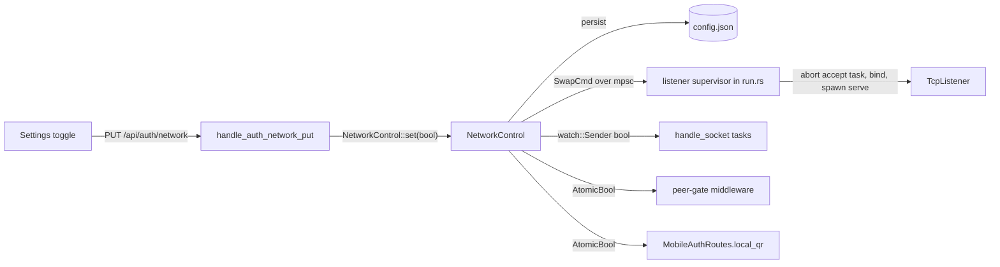

<!--
RULES — read before writing or implementing:
1. FORMAT: Bullets, tables, code, diagrams ONLY — no prose paragraphs
2. REQUIREMENTS: One crisp line each — no verbose descriptions
3. CHECKLIST: Mark items [x] as you complete them — this is your persistent todo list
4. READING TIME: Optimize for fast human scanning — if it's hard to skim, rewrite it
-->

# Plan: Network access toggle (no restart)

> A Settings toggle turns LAN/tailnet-IP listening on/off at runtime; default off (loopback only).

**Issue:** security-review finding #5 follow-up
**Branch:** `daemon-fix-token`
**Status:** WIP
**Builds on:** commit `b83b60bf` (`VST_ALLOW_NETWORK` / `allowNetworkAccess` bind default, origin policy)

**Reference files:**
- Listener + startup: `rust/vst-daemon/src/run.rs`
- Router, middleware, WS: `rust/vst-daemon/src/server.rs`
- QR gating: `rust/vst-routes/src/mobile_auth.rs`
- UI: `web-ui/src/components/settings/RemoteAccessSetting.tsx`, `web-ui/src/api/client.ts`

---

## Problem & Concept

- Today network access is env/`config.json` only and needs a daemon restart; the "Same network" QR card just errors when it is off
- Goal: toggle in the UI, applied live — the daemon swaps its listener (`127.0.0.1` ↔ `0.0.0.0`) in-process
- Disabling must also cut LAN peers already connected (HTTP keep-alive and WebSockets)

## Out of Scope

- Per-interface binding or choosing which LAN interface to expose
- TLS on the LAN listener
- Toggle from a remote (tunnel/mobile) session — local-only by design

## Requirements

| # | Requirement |
|---|-------------|
| 1 | `GET /api/auth/network` → `{ enabled }`; `PUT /api/auth/network` `{ enabled }` flips it live, persists `allowNetworkAccess` in `config.json` |
| 2 | PUT/GET refuse remote requests (same `is_remote_request` gate as tunnel enable) with 403 |
| 3 | While disabled, any request from a non-loopback peer gets 403 (covers lingering keep-alive connections) |
| 4 | On disable, WebSockets from non-loopback peers are closed (code 4403) |
| 5 | Enabling swaps to a `0.0.0.0:<port>` listener; disabling swaps back to `127.0.0.1:<port>`; existing loopback connections survive |
| 6 | `/auth/local-qr` reads the live flag (not a startup constant) |
| 7 | UI: "Same network" card is blurred with an enable toggle + confirm dialog while off; plain toggle to disable while on |
| 8 | `VST_ALLOW_NETWORK` / `allowNetworkAccess` still set the initial state at boot |

---

## Change Map

```
rust/vst-daemon/src/
  network.rs      + NetworkControl, peer gate
  lib.rs          ~ export module
  server.rs       ~ routes, middleware, WS close
  run.rs          ~ listener supervisor
rust/vst-routes/src/
  mobile_auth.rs  ~ live network flag
web-ui/src/
  api/types.ts    ~ NetworkAccess type
  api/client.ts   ~ get/set network
  api/mock.ts     ~ mock methods
  components/settings/RemoteAccessSetting.tsx ~ blur + toggle
docs/
  AUTH.md         ~ toggle + matrix note
```

`+` new file · `~` modified.

| Today | After this plan |
|-------|-----------------|
| Network access needs env var + restart | Toggle in Settings, applied live |
| QR card errors when off | QR card blurred with enable toggle |
| Disabling would leave LAN sockets open | LAN HTTP + WS cut on disable |

---

## Research

- `rust/vst-daemon/src/run.rs:~520-625` (shutdown via `Arc<Notify>::notify_one` at ~577) — router built, one `TcpListener` bound once, `axum::serve(listener, router.into_make_service_with_connect_info::<SocketAddr>()).with_graceful_shutdown(shutdown.notified())` awaited to the end
- `run.rs` `resolve_bind_host(no_auth, &config)` — returns `"127.0.0.1"`/`"0.0.0.0"`; `bind_host` and `BuildServerOptions.network_access: bool` set at ~`run.rs:526`
- `server.rs:954` `is_remote_request(&Request)` — true for `cf-connecting-ip`, non-loopback peer (via `ConnectInfo<SocketAddr>` extension), `Mobile` scope, non-local `Origin`; used by `handle_auth_tunnel_enable`
- `server.rs` `handle_ws_upgrade` (~1150) → `handle_socket(...)` (~1319): outbound forwarder owns the socket; `conn.sink().close(code, reason)` is how `close_auth_expired` closes (`rust/vst-ws/src/broadcaster.rs:36`)
- `mobile_auth.rs:277-301,413` — `network_access: bool` + `with_network_access(bool)` + early `NetworkAccessDisabled` return in `local_qr`; error mapped in `server.rs` `mobile_auth_err_to_response`
- cloudflared (`vst-lifecycle/src/cloudflared.rs:62`) and `tailscale serve` dial `127.0.0.1` — unaffected by the swap
- `run.rs:477-498` `persist_epoch` closure captures `existing_config.clone()` from boot and calls `write_config` (`run.rs:152`) — it rewrites `config.json` from a stale snapshot
- `server.rs:841` `/auth/local-qr` route; `server.rs:871` `.layer(cors)` is the current outermost layer
- `rust/vst-daemon/tests/ws_auth_gate.rs:65,284` serve with `router.into_make_service()` (no `ConnectInfo`) — extractors must tolerate that
- `web-ui/src/api/client.ts:469-486` WS `onclose` special-cases only 4401; every other code calls `scheduleReconnect()`
- `web-ui/src/components/dialogs/ConfirmDialog.tsx` — props `open/title/message/confirmLabel/onConfirm/onCancel` (used at `StorageSetting.tsx:377`); `TunnelCard` (`RemoteAccessSetting.tsx:207`) shows the `toggling`/`onToggle` prop shape
- `RemoteAccessSetting.tsx:~176-210` `SameNetworkCard`, rendered at ~999; `errMessage()` (line 37) unwraps `{error}` bodies
- Root cause: the bind address is a startup constant; nothing can change it or revoke already-accepted LAN connections

---

## Architecture Diagram



---

## Design Details

### System Boundaries

| Boundary | Fields + types | Errors | Source of truth |
|----------|----------------|--------|-----------------|
| UI ↔ daemon REST | `GET/PUT /api/auth/network`, body `{ enabled: boolean }`, resp `{ enabled: boolean }` | 403 `Forbidden.` remote caller · 400 bad body · 500 bind/persist failure `{ error: string }` | daemon `NetworkControl` |
| `server.rs` ↔ `run.rs` | `NetworkControl.set(bool) -> Result<(), String>`; supervisor receives `SwapCmd { enabled: bool, reply: oneshot::Sender<Result<(), String>> }` | bind error string | supervisor owns listeners |
| `NetworkControl` ↔ WS tasks | `watch::Receiver<bool>` — `false` ⇒ close non-loopback peers | — | `NetworkControl` |

### Key Decisions

#### Decision 1: Swap listeners in-process — *with a snippet, ordering is the point*

- **Decision:** one accept-loop task per mode; swap = abort old accept task (listener drops; in-flight connection tasks keep running), bind new, spawn new
- **Rationale:** no restart, loopback-only stays the default; wildcard + loopback sockets can't coexist on one port, so a swap (not a second listener) is needed
- **Where:** `rust/vst-daemon/src/network.rs` `Supervisor::swap`, wired from `run.rs` serve section

```rust
// Supervisor: owns the router + current accept task. Rebinding the SAME port needs the old
// listener fully dropped first — abort and await the task before binding.
async fn swap(&mut self, enabled: bool) -> Result<(), String> {
    let host = if enabled { "0.0.0.0" } else { "127.0.0.1" };
    self.accept_task.abort();            // drops the old TcpListener; spawned connections survive
    let _ = (&mut self.accept_task).await;
    match tokio::net::TcpListener::bind(format!("{host}:{}", self.port)).await {
        Ok(l) => { self.accept_task = self.spawn_serve(l); Ok(()) }
        Err(e) => {
            // roll back to the previous host so the daemon never ends up unreachable
            let prev = if enabled { "127.0.0.1" } else { "0.0.0.0" };
            if let Ok(l) = tokio::net::TcpListener::bind(format!("{prev}:{}", self.port)).await {
                self.accept_task = self.spawn_serve(l);
            }
            Err(format!("bind {host}:{}: {e}", self.port))
        }
    }
}
```

#### Decision 2: Peer gate is a middleware, not just the listener

- **Decision:** outermost layer 403s non-loopback peers while the flag is off; WS tasks also watch the flag and close
- **Rationale:** aborting the accept loop doesn't close accepted sockets — keep-alive HTTP and WebSockets from LAN peers would otherwise survive a disable
- **Where:** `server.rs` `build_app` layer + `handle_socket`; peer from `ConnectInfo<SocketAddr>` (already enabled by `into_make_service_with_connect_info`)

#### Decision 3: Local-only control surface

- **Decision:** reuse `is_remote_request(&req)` for GET/PUT `/auth/network`
- **Rationale:** a phone paired via tunnel/QR must not widen exposure; matches tunnel enable/disable

#### Decision 4: No new CLI flag

- **Decision:** persisted `allowNetworkAccess` + env remain the only boot-time inputs; toggle writes the same key
- **Rationale:** one source of truth; `config.json` is merged (read raw, set key, write 0600), never overwritten from a stale snapshot — see Risks #2

### API Contracts

```
GET /api/auth/network
  Response: { enabled: boolean }
  Errors:   403 Forbidden (remote caller), 401

PUT /api/auth/network
  Request:  { enabled: boolean }
  Response: { enabled: boolean }
  Errors:   400 invalid body, 403 remote caller, 500 { error } (bind/persist failed; state rolled back)
```

- Both under the existing `/api` nest and auth middleware; PUT is a write so cookie callers also need `X-VST-CSRF` (already sent by `apiFetch`)

### Critical User Journeys (CUJs)

#### CUJ 1 — Enable from the desktop app

```
User opens Settings → Remote access (blurred "Same network" card)
  → clicks "Allow other devices on my network" → ConfirmDialog warns plain HTTP
  → confirms → PUT /api/auth/network {enabled:true}
  → daemon swaps 127.0.0.1 → 0.0.0.0, persists allowNetworkAccess → { enabled:true }
  → card unblurs; "Show QR" works
```

- **Error path:** bind fails → 500 `{error}`, listener rolled back, UI shows the message, card stays blurred
- **Remote caller:** opened from a phone/tunnel → GET returns 403 → card disabled with "Only changeable from this computer"

#### CUJ 2 — Disable while a phone is connected

```
User toggles off → PUT {enabled:false}
  → listener swaps to 127.0.0.1; middleware 403s non-loopback peers
  → phone's WebSocket closed with 4403 → phone UI stops reconnecting, shows offline
```

### Data Model

| Entity | Field | Type | Constraints | Notes |
|--------|-------|------|-------------|-------|
| `~/.vibe-station/config.json` | `allowNetworkAccess` | `bool` | optional, default false | boot state; `VST_ALLOW_NETWORK=1` env overrides a persisted `false` on next boot |

- **Migration:** N — missing key ≡ false

---

## Risks / Open Questions

| # | Question | Notes |
|---|----------|-------|
| 1 | Brief gap while swapping | Loopback clients (tunnel, tailscale serve, UI) can see connection-refused for a few ms; UI reconnect logic already retries |
| 2 | `run.rs` rewrites `config.json` from a boot snapshot on epoch bump | Persist via a merge helper that re-reads the file; also update the snapshot used by `persist_epoch` (`run.rs:~457`) or make that callback re-read |
| 3 | `no_auth` sandbox | Peer gate is skipped when `no_auth`; PUT returns 409 there so the Docker sandbox port-forward can't be killed |
| 4 | Concurrent `PATCH /settings` vs toggle can lose one `config.json` write | Accepted — both do read-modify-write of different keys; low frequency |
| 5 | Aborted serve tasks leave an orphaned graceful-signal task in axum | Harmless; they exit on the shutdown watch |

---

## Implementation Phases

- Each phase ends with a verify block — run it before moving on
- Work from `/home/gb/.vibe-station/projects/vibe-station/worktrees/vs-216`; Rust commands run in `rust/`
- Every phase must leave the workspace compiling: `cd rust && cargo check --workspace --tests`

---

### Phase 1 — NetworkControl + peer gate + live QR flag

- [x] **1.1** Create `rust/vst-daemon/src/network.rs` with `#[derive(Clone)] NetworkControl { enabled: Arc<AtomicBool>, watch_tx: Arc<watch::Sender<bool>>, swap_tx: Option<mpsc::Sender<SwapCmd>>, config_path: Option<PathBuf>, lock: Arc<tokio::sync::Mutex<()>> }` and `pub struct SwapCmd { pub enabled: bool, pub reply: oneshot::Sender<Result<(), String>> }`
- [x] **1.2** Methods: `is_enabled()`, `flag() -> Arc<AtomicBool>`, `subscribe() -> watch::Receiver<bool>`, `fixed(enabled) -> Self` (both `Option`s `None`), `new(initial, swap_tx, config_path)`. `async set(&self, enabled) -> Result<(), String>`: take `lock`; return `Ok` early if `enabled == is_enabled()`; if `swap_tx` is `Some`, send `SwapCmd` and await reply (propagate `Err`); if `config_path` is `Some`, `persist_allow_network`; then `enabled.store`, `watch_tx.send(enabled)`
- [x] **1.3** `pub fn persist_allow_network(path: &Path, enabled: bool) -> std::io::Result<()>`: read raw JSON (missing/invalid → `{}`), set `"allowNetworkAccess"`, write with mode 0600 (mirror the permission handling in `write_config`, `run.rs:~140`)
- [x] **1.4** `pub fn should_cut(peer: Option<IpAddr>, enabled: bool, no_auth: bool) -> bool` = `!no_auth && !enabled && peer.is_some_and(|ip| !ip.is_loopback())` (`None` = loopback/test, never cut)
- [x] **1.5** `lib.rs`: `pub mod network;`. `server.rs:120`: replace `BuildServerOptions.network_access: bool` with `network: NetworkControl`; add `network` to `AppState`. `run.rs:526`: `network: NetworkControl::fixed(bind_host != "127.0.0.1")` (replaced in 2.1). In `rust/vst-daemon/tests/*.rs` replace `network_access: false,` with `network: NetworkControl::fixed(false),` (add the import)
- [x] **1.6** `mobile_auth.rs`: field becomes `network_access: Arc<AtomicBool>` (default `Arc::new(AtomicBool::new(true))`); keep `with_network_access(bool)` as a wrapper creating a fresh `Arc`; add `with_network_flag(Arc<AtomicBool>)`; `local_qr` uses `.load(Ordering::SeqCst)`. `server.rs:~466` uses `.with_network_flag(opts.network.flag())`
- [x] **1.7** Peer-gate middleware in `build_app` (`from_fn_with_state`), added as the OUTERMOST layer (after `.layer(cors)` at `server.rs:871`): `peer = req.extensions().get::<ConnectInfo<SocketAddr>>().map(|c| c.0.ip())`; if `network::should_cut(peer, state.network.is_enabled(), state.no_auth)` → 403 `{"error":"Network access is off."}`; missing `ConnectInfo` ⇒ allow (same as `is_remote_request`, `server.rs:954`)

**Verify phase 1:**
- [x] **1.T1** Unit — `network.rs`: `persist_allow_network` creates the key, keeps other keys, file mode 0600 (tempdir); `should_cut` truth table (loopback/LAN/None × enabled × no_auth); `set` on `fixed` flips the flag and the watch value, second identical `set` is a no-op
- [x] **1.T2** Integration — `rust/vst-daemon/tests/auth_middleware.rs`: oneshot request with injected `ConnectInfo(192.168.1.9:5000)` extension and `NetworkControl::fixed(false)` → 403; with `fixed(true)` → not 403; loopback peer and no-`ConnectInfo` requests never 403
- [x] **1.T3** Verify — `cd rust && cargo check --workspace --tests && cargo test -p vst-daemon -p vst-routes` green

---

### Phase 2 — Shutdown watch + listener supervisor

- [x] **2.0** `run.rs`: replace `shutdown_notify: Arc<Notify>` (`notify_one` at ~577) with `tokio::sync::watch::channel(false)`; the signal task does `tx.send(true)`; every waiter uses `rx.clone().wait_for(|v| *v).await` (do NOT use `notify_one` — it wakes one waiter; `tokio-util` is not a dependency)
- [x] **2.1** In `network.rs` add `pub fn spawn_listener_supervisor(router: Router, port: u16, initial: bool, shutdown: watch::Receiver<bool>, swap_rx: mpsc::Receiver<SwapCmd>) -> JoinHandle<()>` plus private `Supervisor { port, router, accept_task: JoinHandle<()> }` with `spawn_serve(listener)` = `tokio::spawn(axum::serve(listener, router.clone().into_make_service_with_connect_info::<SocketAddr>()).with_graceful_shutdown(shutdown_wait(shutdown.clone())).into_future())` and `swap(enabled)` per Decision 1; loop `select!` on `swap_rx.recv()` and `shutdown.wait_for`; on shutdown await the current `accept_task` then return. Initial bind uses `initial`
- [x] **2.2** Swap failure handling: if the new bind fails, rebind the previous host; if that also fails, log an error, keep the flag unchanged and return `Err` with both bind messages
- [x] **2.3** `run.rs`: compute `initial = resolve_bind_host(no_auth,&existing_config) == "0.0.0.0"`; create `(swap_tx, swap_rx) = mpsc::channel(4)`; `NetworkControl::new(initial, Some(swap_tx), Some(config_path.clone()))` replaces the `fixed` placeholder; `let handle = spawn_listener_supervisor(...); handle.await` replaces the `axum::serve(...)` block; keep the `vst daemon listening on http://{host}:{port}` log/`println!` (desktop regex `listening on http://[0-9.]+:(\d+)` — `desktop/src-tauri/src/daemon.rs:151`); warn when swapping to `0.0.0.0`
- [x] **2.4** `run.rs:477-498` `persist_epoch` closure: replace the captured boot `existing` with `read_raw_config(&config_path).await` at call time so epoch bumps never revert `allowNetworkAccess` or `PATCH /settings` changes

**Verify phase 2:**
- [x] **2.T1** Integration — new `rust/vst-daemon/tests/network_swap.rs`: supervisor on an ephemeral port (initial `false`) with a trivial `Router`: `TcpStream::connect("127.0.0.1:P")` works; `NetworkControl::set(true)` then a connect to the machine's non-loopback IP (or `0.0.0.0` fallback check via `local_addr` of the listener) is accepted; `set(false)` returns to loopback-only; a connection opened before each swap still answers an HTTP request after it
- [x] **2.T2** Integration — `#[cfg(target_os = "linux")]` bind-failure test: hold a blocker `TcpListener` on `127.0.0.2:P`; `set(true)` returns `Err`, flag stays `false`, `127.0.0.1:P` still serves
- [x] **2.T3** Integration — shutdown: sending `true` on the shutdown watch makes the supervisor handle finish within 5s even after a swap
- [x] **2.T4** Regression — `cd rust && cargo test -p vst-daemon -p vst-routes` green

---

### Phase 3 — REST + WS cut-off

- [x] **3.1** `server.rs` (next to `/auth/local-qr`, `:841`): `GET /auth/network` and `PUT /auth/network`; both start with `is_remote_request(&req)` → 403 `{"error":"Forbidden."}`; PUT: body `{ enabled: bool }` (bad body → 400), if `state.no_auth` → 409 `{"error":"Network access is fixed in no-auth mode."}`, else `state.network.set(enabled).await` → 200 `{ "enabled": bool }` or 500 `{ "error": msg }`; GET → 200 `{ "enabled": bool }`
- [x] **3.2** `handle_ws_upgrade` (`server.rs:1150`): keep `WebSocketUpgrade` the first extractor; add `connect_info: Option<ConnectInfo<SocketAddr>>` (`None` ⇒ loopback); pass `peer: Option<IpAddr>`, `network_rx: watch::Receiver<bool>`, `no_auth: bool` into `handle_socket` (`:1319`)
- [x] **3.3** `handle_socket`: if `should_cut(peer, *rx.borrow(), no_auth)` at connect → `conn.sink().close(4403, "network access disabled")`; otherwise spawn a watcher task `while rx.changed().await.is_ok() { if should_cut(peer, *rx.borrow(), no_auth) { conn.sink().close(4403, "network access disabled"); break; } }` and abort it in the existing teardown path

**Verify phase 3:**
- [x] **3.T1** Integration — `auth_middleware.rs`: PUT with Bearer CLI token from loopback and `NetworkControl::fixed(false)` → 200 `{enabled:true}` and GET → `{enabled:true}`; cookie auth without `X-VST-CSRF` → 403; request with `cf-connecting-ip` → 403; `no_auth` build → 409
- [x] **3.T2** Integration — `ws_auth_gate.rs`: existing tests still pass unchanged (no `ConnectInfo`)
- [x] **3.T3** Regression — `cd rust && cargo test -p vst-daemon -p vst-routes` green

---

### Phase 4 — Web UI toggle

- [x] **4.1** `web-ui/src/api/types.ts`: `export interface NetworkAccess { enabled: boolean }`
- [x] **4.2** `web-ui/src/api/client.ts` (next to `getLocalQr`, `:1713`): `getNetworkAccess()` → `GET ${baseUrl()}/auth/network`; `setNetworkAccess(enabled)` → `PUT` with JSON body and `Content-Type: application/json`; both via `apiFetch` + `parseJson`
- [x] **4.3** `web-ui/src/api/mock.ts` (`:2023`): matching methods backed by an in-memory flag (the `ApiInstance` union in `api/index.ts:13` picks them up automatically)
- [x] **4.4** `RemoteAccessSetting.tsx`: load `networkEnabled: boolean | null` + `networkLocked: boolean` on mount (403 ⇒ `networkLocked`); `SameNetworkCard` gets `networkEnabled`, `networkLocked`, `toggling`, `onToggleNetwork`; when not enabled render the card body with `filter: blur(2px); pointer-events: none` under an overlay with a button "Allow other devices on my network" (locked ⇒ overlay text "Only changeable from this computer", no button); when enabled show a small "Turn off" link
- [x] **4.5** Enabling opens `ConfirmDialog` (`web-ui/src/components/dialogs/ConfirmDialog.tsx`): title "Allow network access?", message "Plain HTTP on your network. Anyone on it can reach the login page. Only enable on networks you trust.", `confirmLabel` "Allow"; disabling needs no confirm
- [x] **4.6** PUT errors surface through the file's existing `errMessage` into the existing error state; state reverts to the server's answer
- [x] **4.7** `client.ts` WS `onclose` (`:469-486`): on code 4403 set connection state `offline` and do NOT call `scheduleReconnect()`

**Verify phase 4:**
- [x] **4.T1** `cd web-ui && npx tsc --noEmit` — no new errors vs. the 4 pre-existing ones in `tsconfig.json`
- [x] **4.T2** Unit — extend `web-ui/src/components/settings/RemoteAccessSetting.test.tsx` (uses `vi.spyOn(api, ...)`): card blurred when `getNetworkAccess` → `{enabled:false}`; clicking the enable button then confirming calls `setNetworkAccess(true)`; a 403 from `getNetworkAccess` renders "Only changeable from this computer"
- [x] **4.T3** `cd web-ui && npx vitest run src/components/settings/RemoteAccessSetting.test.tsx` green and `npx eslint src/components/settings/RemoteAccessSetting.tsx src/api` clean

---

### Phase 5 — Docs

- [x] **5.1** `docs/AUTH.md`: replace the "Listen address" bullet with the live toggle (Settings → Remote access → Same network; persists `allowNetworkAccess`; `VST_ALLOW_NETWORK=1` overrides a persisted `false` at next boot; remote sessions cannot toggle; no restart needed; no-auth builds ignore it)
- [x] **5.2** `README.md:~332`: mention the toggle first, env var second

**Verify phase 5:**
- [x] **5.T1** `grep -nE "restart" docs/AUTH.md README.md` — no claim that network access needs a restart

---

## Files & Phase Impact

| File | Status | Phase | Description / Contract Change |
|------|--------|-------|-------------------------------|
| `rust/vst-daemon/src/network.rs` | **New** | 1.1-1.4, 2.1-2.2 | Contract: `NetworkControl::{new,fixed,is_enabled,flag,subscribe,set}`, `SwapCmd`, `persist_allow_network`, `should_cut`, `spawn_listener_supervisor` · Owns: enabled flag, watch, listener tasks |
| `rust/vst-daemon/src/lib.rs` | **Modified** | 1.5 | `pub mod network;` |
| `rust/vst-daemon/src/server.rs` | **Modified** | 1.5, 1.7, 3.1-3.3 | `BuildServerOptions.network`, peer-gate layer, GET/PUT `/auth/network`, WS watcher |
| `rust/vst-daemon/src/run.rs` | **Modified** | 1.5, 2.0, 2.3, 2.4 | shutdown watch, supervisor wiring, `persist_epoch` re-read |
| `rust/vst-routes/src/mobile_auth.rs` | **Modified** | 1.6 | `Arc<AtomicBool>` flag + `with_network_flag` |
| `rust/vst-daemon/tests/*.rs` (existing) | **Modified** | 1.5, 1.T2, 3.T1 | struct literal + new middleware tests |
| `rust/vst-daemon/tests/network_swap.rs` | **New** | 2.T1-2.T3 | Swap/shutdown integration tests |
| `web-ui/src/api/types.ts` | **Modified** | 4.1 | `NetworkAccess` |
| `web-ui/src/api/client.ts` | **Modified** | 4.2, 4.7 | get/set network, 4403 handling |
| `web-ui/src/api/mock.ts` | **Modified** | 4.3 | mocks |
| `web-ui/src/components/settings/RemoteAccessSetting.tsx` | **Modified** | 4.4-4.6 | blur + toggle + confirm |
| `web-ui/src/components/settings/RemoteAccessSetting.test.tsx` | **Modified** | 4.T2 | new cases |
| `docs/AUTH.md`, `README.md` | **Modified** | 5.1-5.2 | docs |

---

## Implementer Notes

- Phase 1: `NetworkControl::set` uses `watch_tx.send_replace(enabled)` instead of `watch::Sender::send` — `send` returns early without updating the stored value when there are zero live receivers, so a late subscriber (`subscribe()`) would read a stale value; `send_replace` updates unconditionally.
- Phase 1: the peer gate (403 for non-loopback peers while off) now intercepts remote-peer requests before `/continue`'s own remote check; `redeem_is_blocked_with_remote_peer_ip` in `tests/continue_flow.rs` was updated to build its router with `NetworkControl::fixed(true)` so it exercises the continue handler's own 410 logic, keeping the test's original intent. 1.T2's gate tests were added to `tests/auth_middleware.rs`.
- Phase 2: in `spawn_listener_supervisor`'s `select!` the supervisor loop uses `shutdown.changed()` rather than `shutdown.wait_for(|v| *v)` — `wait_for` returns a `watch::Ref` guard that is not `Send`, which breaks the `tokio::spawn` (the select's future must be `Send`); `changed()` returns a `Send`-safe `Result` and treats a dropped sender the same as a fired shutdown (both break + drain).
- Phase 2: `Supervisor` holds a `shutdown: watch::Receiver<bool>` field in addition to the plan's `{ port, router, accept_task }` (so `spawn_serve` can give every rebound listener the same graceful-shutdown watch); `spawn_serve` is a free fn taking `(router, shutdown, listener)` rather than a method, to avoid a borrow issue when reassigning `self.accept_task` and building the initial supervisor before `self` exists.
- Phase 3: `handle_auth_network_put` takes `Request` (needed for `is_remote_request`) and parses the `{ enabled }` body itself via `axum::body::to_bytes` + `serde_json::from_slice` — `Request` and `Json` cannot both be axum extractors on one handler (the body would be consumed by the `Request` extractor), and a malformed/missing body maps to 400.
- Phase 4: `SameNetworkCard` renders the enable button ONLY in the overlay (the blurred body shows just the informational description), so there is exactly one "Allow other devices on my network" button in the DOM — the plan's literal "blur the body (which contains the button) + overlay button" wording would have produced two identical interactive buttons (duplicate a11y + duplicate-element test failure). Also fixed a pre-existing `prefer-const` lint error in `mock.ts` (`tunnelState` `let`→`const`) because 4.T3 requires `src/api` eslint-clean and that file is in this phase's table.
